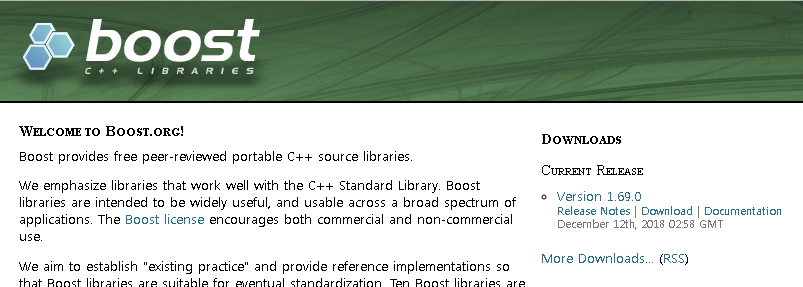
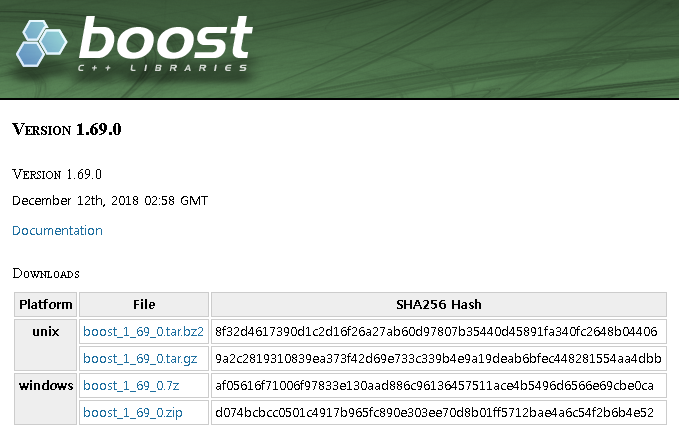
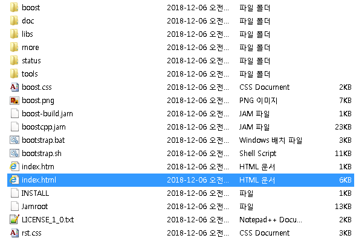
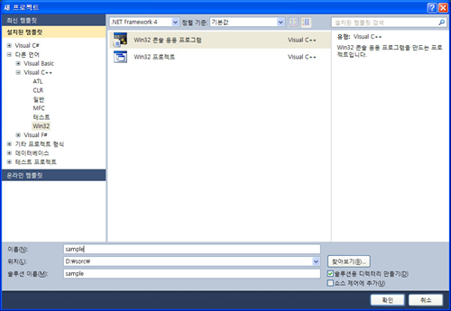
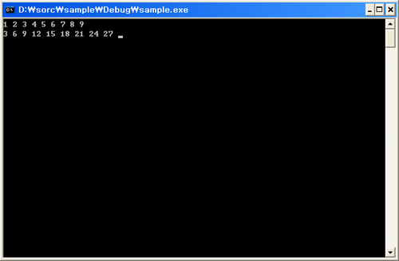
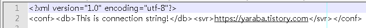

# 비주얼 스튜디오에서 Boost C++ 라이브러리 사용하기

출처: https://yaraba.tistory.com/1209

Boost 라이브러리는 C++ 라이브러리 중에서 안정성과 성능, 라이선스의 자유로움등 여러 측면에서 개발자에게 도움이 되는 라이브러리 입니다. 윈도우 응용 프로그램에서 레지스트리에 각종 환경 정보 또는 프로그램 설정 정보를 저장하면 간단하지만, 환경 파일의 단순성이라는 장점을 바라보면서 개별 응용의 설정을 XML 파일에 저장하거나 예전의 INI 파일 형태로 저장하는 사례가 여전한데, Boost 라이브러리를 활용해서 이 문제에 대안을 찾아보고자 합니다.


Boost 라이브러리에서 제공하는 여러 훌륭한 기능을 사용하고 싶지만 어떻게 하면 좋을지 갑갑한 분들을 위해 라이브러리 설치와 사용, 그리고 XML 파일에 설정 정보를 저장하고 읽는 예제까지 간단하게 다루어 보고자 합니다.


## ■ 윈도우용 라이브러리 설치하기



라이브러리의 다운로드는 **https://www.boost.org/** 에서 최신 버전을 다운로드 받을 수 있습니다. 



최신 버전 다운로드 페이지에서 윈도우 플랫폼을 다운로드 받아 적절한 곳에 압축을 해제합니다. 윈도우 버전(boost_1_69_0.zip)의 다운로드 용량은 156MB이고 압축을 해제한 폴더의 용량은 564MB 입니다.



압축을 해제한 폴더의 모습은 위의 그림과 같습니다. 웹 페이지를 통해 로컬 컴퓨터에서 확인할 수 있는 문서화 자료도 포합되어 있으므로 부스트 패키지의 특정 기능에 대한 사용법을 알고 싶다면 libs폴더 아래의 해당 기능 폴더로 이동하여 index.html를 더블클릭해서 세부 내용을 확인 합니다. 부스트 패키지에 포함된 모듈들의 간략한 소개를 아래와 같이 옮겨 보았습니다.


**알고리즘**

- Algorithm - A collection of useful generic algorithms
- Foreach - In C++, writing a loop that iterates over a sequence is tedious. We can either use iterators, which requires a considerable amount of boiler-plate, or we can use the std::for_each() algorithm and move our loop body into a predicate, which requires no less boiler-plate and forces us to move our logic far from where it will be used. In contrast, some other languages, like Perl, provide a dedicated "foreach" construct that automates this process. BOOST_FOREACH is just such a construct for C++. It iterates over sequences for us, freeing us from having to deal directly with iterators or write predicates
- Geometry - The Boost.Geometry library provides geometric algorithms, primitives and spatial index
- GIL - Generic Image Library
- Graph - The BGL graph interface and graph components are generic, in the same sense as the Standard Template Library (STL)
- GraphParallel - The PBGL graph interface and graph components are generic, in the same sense as the the Standard Template Library (STL)
- Min-Max - Standard library extensions for simultaneous min/max and min/max element computations
- Polygon - Voronoi diagram construction and booleans/clipping, resizing/offsetting and more for planar polygons with integral coordinates
- QVM - Generic {CPP} library for working with Quaternions Vectors and Matrices
- Range - A new infrastructure for generic algorithms that builds on top of the new iterator concepts
- Sort - High-performance templated sort functions
- String Algo - String algorithms library
- Utility - Class noncopyable plus checked_delete(), checked_array_delete(), next(), prior() function templates, plus base-from-member idiom


**병렬 프로그래밍**

- Asio - Portable networking and other low-level I/O, including sockets, timers, hostname resolution, socket iostreams, serial ports, file descriptors and Windows HANDLEs
- Atomic - C++11-style atomic<>
- Beast - Portable HTTP, WebSocket, and network operations using only C++11 and Boost.Asio
- Compute - Parallel/GPU-computing library
- Context - (C++11) Context switching library
- Coroutine - Coroutine library
- Coroutine2 - (C++11) Coroutine library
- Fiber - (C++11) Userland threads library
- Interprocess - Shared memory, memory mapped files, process-shared mutexes, condition variables, containers and allocators
- Lockfree - Lockfree data structures
- MPI - Message Passing Interface library, for use in distributed-memory parallel application programming
- Thread - Portable C++ multi-threading. C++03, C++11, C++14, C++17


**컨테이너**

- Array - STL compliant container wrapper for arrays of constant size
- Bimap - Bidirectional maps library for C++. With Boost.Bimap you can create associative containers in which both types can be used as key
- Circular Buffer - A STL compliant container also known as ring or cyclic buffer
- Container - Standard library containers and extensions
- Dynamic Bitset - The dynamic_bitset class represents a set of bits. It provides accesses to the value of individual bits via an operator[] and provides all of the bitwise operators that one can apply to builtin integers, such as operator& and operator<<. The number of bits in the set is specified at runtime via a parameter to the constructor of the dynamic_bitset
- GIL - Generic Image Library
- Graph - The BGL graph interface and graph components are generic, in the same sense as the Standard Template Library (STL)
- GraphParallel - The PBGL graph interface and graph components are generic, in the same sense as the the Standard Template Library (STL)
- ICL - Interval Container Library, interval sets and maps and aggregation of associated values
- Intrusive - Intrusive containers and algorithms
- Multi-Array - Boost.MultiArray provides a generic N-dimensional array concept definition and common implementations of that interface
- Multi-Index - The Boost Multi-index Containers Library provides a class template named multi_index_container which enables the construction of containers maintaining one or more indices with different sorting and access semantics
- Pointer Container - Containers for storing heap-allocated polymorphic objects to ease OO-programming
- PolyCollection - Fast containers of polymorphic objects
- Property Map - Concepts defining interfaces which map key objects to value objects
- Property Tree - A tree data structure especially suited to storing configuration data
- Unordered - Unordered associative containers
- Variant - Safe, generic, stack-based discriminated union container


**확인 및 테스트**

- Assert - Customizable assert macros
- Concept Check - Tools for generic programming
- Contract - Contract programming for C++. All contract programming features are supported: Subcontracting, class invariants, postconditions (with old and return values), preconditions, customizable actions on assertion failure (e.g., terminate or throw), optional compilation and checking of assertions, etc
- Stacktrace - Gather, store, copy and print backtraces
- Static Assert - Static assertions (compile time assertions)
- Test - Support for simple program testing, full unit testing, and for program execution monitoring


**데이터 구조**

- Any - Safe, generic container for single values of different value types
- Bimap - Bidirectional maps library for C++. With Boost.Bimap you can create associative containers in which both types can be used as key
- Compressed Pair - Empty member optimization
- Container - Standard library containers and extensions
- Fusion - Library for working with tuples, including various containers, algorithms, etc
- Geometry - The Boost.Geometry library provides geometric algorithms, primitives and spatial index
- Heap - Priority queue data structures
- ICL - Interval Container Library, interval sets and maps and aggregation of associated values
- Multi-Index - The Boost Multi-index Containers Library provides a class template named multi_index_container which enables the construction of containers maintaining one or more indices with different sorting and access semantics
- Optional - A value-semantic, type-safe wrapper for representing 'optional' (or 'nullable') objects of a given type. An optional object may or may not contain a value of the underlying type
- Pointer Container - Containers for storing heap-allocated polymorphic objects to ease OO-programming
- Polygon - Voronoi diagram construction and booleans/clipping, resizing/offsetting and more for planar polygons with integral coordinates
- Property Tree - A tree data structure especially suited to storing configuration data
- Tuple - Ease definition of functions returning multiple values, and more
- Type Erasure - Runtime polymorphism based on concepts
- Uuid - A universally unique identifier
- Variant - Safe, generic, stack-based discriminated union container


**도메인 연관**

- Chrono - Useful time utilities. C++11
- CRC - The Boost CRC Library provides two implementations of CRC (cyclic redundancy code) computation objects and two implementations of CRC computation functions. The implementations are template-based
- Date Time - A set of date-time libraries based on generic programming concepts
- Units - Zero-overhead dimensional analysis and unit/quantity manipulation and conversion
- Uuid - A universally unique identifier


**함수 오브젝트와 고차 프로그래밍**

- Bind - boost::bind is a generalization of the standard functions std::bind1st and std::bind2nd. It supports arbitrary function objects, functions, function pointers, and member function pointers, and is able to bind any argument to a specific value or route input arguments into arbitrary positions
- Container Hash - An STL-compatible hash function object that can be extended to hash user defined types
- Function - Function object wrappers for deferred calls or callbacks
- Functional - The Boost.Function library contains a family of class templates that are function object wrappers
- Functional/Factory - Function object templates for dynamic and static object creation
- Functional/Forward - Adapters to allow generic function objects to accept arbitrary arguments
- Functional/Overloaded Function - Overload different functions into a single function object
- HOF - Higher-order functions for C++
- Lambda - Define small unnamed function objects at the actual call site, and more
- Local Function - Program functions locally, within other functions, directly within the scope where they are needed
- Member Function - Generalized binders for function/object/pointers and member functions
- Phoenix - Define small unnamed function objects at the actual call site, and more
- Ref - A utility library for passing references to generic functions
- Result Of - Determines the type of a function call expression
- Signals - Managed signals & slots callback implementation
- Signals2 - Managed signals & slots callback implementation (thread-safe version 2)
- Utility - Class noncopyable plus checked_delete(), checked_array_delete(), next(), prior() function templates, plus base-from-member idiom


**제네릭 프로그래밍**

- Call Traits - Defines types for passing parameters
- Concept Check - Tools for generic programming
- Enable If - Selective inclusion of function template overloads
- Function Types - Boost.FunctionTypes provides functionality to classify, decompose and synthesize function, function pointer, function reference and pointer to member types
- GIL - Generic Image Library
- In Place Factory, Typed In Place Factory - Generic in-place construction of contained objects with a variadic argument-list
- Operators - Templates ease arithmetic classes and iterators
- Property Map - Concepts defining interfaces which map key objects to value objects
- QVM - Generic {CPP} library for working with Quaternions Vectors and Matrices
- Static Assert - Static assertions (compile time assertions)
- TTI - Type Traits Introspection library
- Type Traits - Templates for fundamental properties of types
- YAP - An expression template library for C++14 and later


**이미지 처리**

- GIL - Generic Image Library

**입출력**

- Asio - Portable networking and other low-level I/O, including sockets, timers, hostname resolution, socket iostreams, serial ports, file descriptors and Windows HANDLEs
- Assign - Filling containers with constant or generated data has never been easier
- Beast - Portable HTTP, WebSocket, and network operations using only C++11 and Boost.Asio
- Endian - Types and conversion functions for correct byte ordering and more regardless of processor endianness
- Format - The format library provides a type-safe mechanism for formatting arguments according to a printf-like format-string
- IO State Savers - The I/O sub-library of Boost helps segregate the large number of Boost headers. This sub-library should contain various items to use with/for the standard I/O library
- Iostreams - Boost.IOStreams provides a framework for defining streams, stream buffers and i/o filters
- Program Options - The program_options library allows program developers to obtain program options, that is (name, value) pairs from the user, via conventional methods such as command line and config file
- Serialization - Serialization for persistence and marshalling


**언어간 인터페이스 지원**

- Python - The Boost Python Library is a framework for interfacing Python and C++. It allows you to quickly and seamlessly expose C++ classes functions and objects to Python, and vice-versa, using no special tools -- just your C++ compiler


**반복자**

- GIL - Generic Image Library
- Graph - The BGL graph interface and graph components are generic, in the same sense as the Standard Template Library (STL)
- GraphParallel - The PBGL graph interface and graph components are generic, in the same sense as the the Standard Template Library (STL)
- Iterator - The Boost Iterator Library contains two parts. The first is a system of concepts which extend the C++ standard iterator requirements. The second is a framework of components for building iterators based on these extended concepts and includes several useful iterator adaptors
- Operators - Templates ease arithmetic classes and iterators
- Tokenizer - Break of a string or other character sequence into a series of tokens


**언어 기능 에뮬레이션**

- Exception - The Boost Exception library supports transporting of arbitrary data in exception objects, and transporting of exceptions between threads
- Foreach - In C++, writing a loop that iterates over a sequence is tedious. We can either use iterators, which requires a considerable amount of boiler-plate, or we can use the std::for_each() algorithm and move our loop body into a predicate, which requires no less boiler-plate and forces us to move our logic far from where it will be used. In contrast, some other languages, like Perl, provide a dedicated "foreach" construct that automates this process. BOOST_FOREACH is just such a construct for C++. It iterates over sequences for us, freeing us from having to deal directly with iterators or write predicates
- Move - Portable move semantics for C++03 and C++11 compilers
- Parameter - Boost.Parameter Library - Write functions that accept arguments by name
- Parameter Python Bindings - Boost.Parameter Library Python bindings
- Scope Exit - Execute arbitrary code at scope exit
- Type Index - Runtime/Compile time copyable type info
- Typeof - Typeof operator emulation


**수학 및 산술 연산**

- Accumulators - Framework for incremental calculation, and collection of statistical accumulators
- Endian - Types and conversion functions for correct byte ordering and more regardless of processor endianness
- Geometry - The Boost.Geometry library provides geometric algorithms, primitives and spatial index
- Integer - The organization of boost integer headers and classes is designed to take advantage of <stdint.h> types from the 1999 C standard without resorting to undefined behavior in terms of the 1998 C++ standard. The header <boost/cstdint.hpp> makes the standard integer types safely available in namespace boost without placing any names in namespace std
- Interval - Extends the usual arithmetic functions to mathematical intervals
- Math - Boost.Math includes several contributions in the domain of mathematics: The Greatest Common Divisor and Least Common Multiple library provides run-time and compile-time evaluation of the greatest common divisor (GCD) or least common multiple (LCM) of two integers. The Special Functions library currently provides eight templated special functions, in namespace boost. The Complex Number Inverse Trigonometric Functions are the inverses of trigonometric functions currently present in the C++ standard. Quaternions are a relative of complex numbers often used to parameterise rotations in three dimentional space. Octonions, like quaternions, are a relative of complex numbers
- Math Common Factor - Greatest common divisor and least common multiple
- Math Octonion - Octonions
- Math Quaternion - Quaternions
- Math/Special Functions - A wide selection of mathematical special functions
- Math/Statistical Distributions - A wide selection of univariate statistical distributions and functions that operate on them
- Multi-Array - Boost.MultiArray provides a generic N-dimensional array concept definition and common implementations of that interface
- Multiprecision - Extended precision arithmetic types for floating point, integer andrational arithmetic
- Numeric Conversion - Optimized Policy-based Numeric Conversions
- Odeint - Solving ordinary differential equations
- Operators - Templates ease arithmetic classes and iterators
- Polygon - Voronoi diagram construction and booleans/clipping, resizing/offsetting and more for planar polygons with integral coordinates
- QVM - Generic {CPP} library for working with Quaternions Vectors and Matrices
- Random - A complete system for random number generation
- Ratio - Compile time rational arithmetic. C++11
- Rational - A rational number class
- uBLAS - uBLAS provides matrix and vector classes as well as basic linear algebra routines. Several dense, packed and sparse storage schemes are supported


**메모리**

- Align - Memory alignment functions, allocators, and traits
- Pool - Memory pool management
- Smart Ptr - Smart pointer class templates
- Utility - Class noncopyable plus checked_delete(), checked_array_delete(), next(), prior() function templates, plus base-from-member idiom


**파싱**

- Spirit - LL 파서 프레임 워크는 파서를 인라인 C ++에서 EBNF 문법으로 직접 나타냅니다.
- Spirit Classic - LL 파서 프레임 워크는 파서를 인라인 C ++에서 EBNF 문법으로 직접 나타냅니다.
- Spirit Repository - Spirit 저장소는 Qi 파서 및 Karma 생성기에서 서로 다른 재사용 가능한 구성 요소 (기본, 지시문, 문법 등)를 수집하는 커뮤니티 노력입니다.


**패턴과 관용구**

- Compressed Pair - Empty member optimization
- Flyweight - Design pattern to manage large quantities of highly redundant objects
- Signals - Managed signals & slots callback implementation
- Signals2 - Managed signals & slots callback implementation (thread-safe version 2)
- Utility - Class noncopyable plus checked_delete(), checked_array_delete(), next(), prior() function templates, plus base-from-member idiom


**전처리기 메타 프로그래밍**

- Identity Type - Wrap types within round parenthesis so they can always be passed as macro parameters
- Preprocessor - Preprocessor metaprogramming tools including repetition and recursion
- VMD - Variadic Macro Data library


**프로그래밍 인터페이스**

- Function - Function object wrappers for deferred calls or callbacks
- Parameter - Boost.Parameter Library - Write functions that accept arguments by name
- Parameter Python Bindings - Boost.Parameter Library Python bindings


**상태 기계**

- Meta State Machine - A very high-performance library for expressive UML2 finite state machines
- Statechart - Boost.Statechart - Arbitrarily complex finite state machines can be implemented in easily readable and maintainable C++ code


**스트링과 텍스트 처리**

- Convert - An extendible and configurable type-conversion framework
- Format - The format library provides a type-safe mechanism for formatting arguments according to a printf-like format-string
- Iostreams - Boost.IOStreams provides a framework for defining streams, stream buffers and i/o filters
- Lexical Cast - General literal text conversions, such as an int represented a string, or vice-versa
- Locale - Provide localization and Unicode handling tools for C++
- Regex - Regular expression library
- Spirit - LL parser framework represents parsers directly as EBNF grammars in inlined C++
- Spirit Classic - LL parser framework represents parsers directly as EBNF grammars in inlined C++
- Spirit Repository - The Spirit repository is a community effort collecting different reusable components (primitives, directives, grammars, etc.) for Qi parsers and Karma generators
- String Algo - String algorithms library
- Tokenizer - Break of a string or other character sequence into a series of tokens
- Wave - The Boost.Wave library is a Standards conformant, and highly configurable implementation of the mandated C99/C++ preprocessor functionality packed behind an easy to use iterator interface
- Xpressive - Regular expressions that can be written as strings or as expression templates, and which can refer to each other and themselves recursively with the power of context-free grammars


**시스템**

- Chrono - Useful time utilities. C++11
- Context - (C++11) Context switching library
- Date Time - A set of date-time libraries based on generic programming concepts
- DLL - Library for comfortable work with DLL and DSO
- Fiber - (C++11) Userland threads library
- Filesystem - The Boost Filesystem Library provides portable facilities to query and manipulate paths, files, and directories
- Process - Library to create processes in a portable way
- Stacktrace - Gather, store, copy and print backtraces
- System - Operating system support, including the diagnostics support that will be part of the C++0x standard library
- Thread - Portable C++ multi-threading. C++03, C++11, C++14, C++17


**템플릿 메타 프로그래밍**

- CallableTraits - A spiritual successor to Boost.FunctionTypes, Boost.CallableTraits is a header-only C++11 library for the compile-time inspection and manipulation of all 'callable' types. Additional support for C++17 features
- Function Types - Boost.FunctionTypes provides functionality to classify, decompose and synthesize function, function pointer, function reference and pointer to member types
- Fusion - Library for working with tuples, including various containers, algorithms, etc
- Hana - A modern C++ metaprogramming library. It provides high level algorithms to manipulate heterogeneous sequences, allows writing type-level computations with a natural syntax, provides tools to introspect user-defined types and much more
- HOF - Higher-order functions for C++
- Metaparse - A library for generating compile time parsers parsing embedded DSL code as part of the C++ compilation process
- Mp11 - A C++11 metaprogramming library
- MPL - The Boost.MPL library is a general-purpose, high-level C++ template metaprogramming framework of compile-time algorithms, sequences and metafunctions. It provides a conceptual foundation and an extensive set of powerful and coherent tools that make doing explict metaprogramming in C++ as easy and enjoyable as possible within the current language
- Proto - Expression template library and compiler construction toolkit for domain-specific embedded languages
- Static Assert - Static assertions (compile time assertions)
- TTI - Type Traits Introspection library
- Type Traits - Templates for fundamental properties of types
- YAP - An expression template library for C++14 and later


**기타**

- Compatibility - Help for non-conforming standard libraries
- Config - Helps Boost library developers adapt to compiler idiosyncrasies; not intended for library users
- Conversion - Polymorphic casts
- Convert - An extendible and configurable type-conversion framework
- Core - A collection of simple core utilities with minimal dependencies
- Endian - Types and conversion functions for correct byte ordering and more regardless of processor endianness
- Lexical Cast - General literal text conversions, such as an int represented a string, or vice-versa
- Log - Logging library
- Numeric Conversion - Optimized Policy-based Numeric Conversions
- Predef - This library defines a set of compiler, architecture, operating system, library, and other version numbers from the information it can gather of C, C++, Objective C, and Objective C++ predefined macros or those defined in generally available headers
- Program Options - The program_options library allows program developers to obtain program options, that is (name, value) pairs from the user, via conventional methods such as command line and config file
- Safe Numerics - Guaranteed Correct Integer Arithmetic
- Swap - Enhanced generic swap function
- ThrowException - A common infrastructure for throwing exceptions from Boost libraries
- Timer - Event timer, progress timer, and progress display classes
- Tribool - 3-state boolean type library
- Utility - Class noncopyable plus checked_delete(), checked_array_delete(), next(), prior() function templates, plus base-from-member idiom
- Value Initialized - Wrapper for uniform-syntax value initialization, based on the original idea of David Abrahams


## **■** **Boost를 이용한 간단한 예제**



Boost가 정상적으로 설치되었는지 예제 프로그램으로 확인합니다. 비주얼 스튜디어에서 새프로젝트>c++ win32 console응용으로 솔루션을 생성하고 이름을 sample로 지정 합니다.

```c++
#include <boost/lambda/lambda.hpp>
#include <iostream>
#include <iterator>
#include <algorithm>

int main()
{
    using namespace boost::lambda;
    typedef std::istream_iterator<int> in;

    std::for_each(
        in(std::cin), in(), std::cout << (_1 * 3) << " " );
}
```

sample.cpp파일을 열어서 자동 생성 코드 대신 위의 코드를 입력 합니다. 빌드 및 실행 이전에 일부 설정을 바꾸어 주어야 하는데 아래와 같습니다.

- Properties > C/C++ > General > Additional Include Directories
  Boost 설치시의 설치 폴더 위치를 지정 합니다.

- Properties > C/C++ > Precompiled Headers
    미리 컴파일된 헤더 사용 안 함으로 설정 합니다.



프로그램은 여러개의 숫자를 입력받아 각각에 대하여 3을 곱한 값을 출력하는 간단한 내용으로 각 값 사이에 공백을 넣어입력해 주면 됩니다.


## **■** **XML 파일에 설정 정보 저장하고 읽기**

앞서 언급한 바와 같이 설정 정보를 XML 파일에 저장하거나 XML 파일을 편리하게 다룰때 사용할 수 있습니다. (사용자 데이터 폴더는 %APPDATA% 로 지정합니다)

```c++
#include <boost/property_tree/ptree.hpp>
#include <boost/property_tree/xml_parser.hpp>
#include <iostream>
#include <iterator>
#include <algorithm>
#include <windows.h>

int main()
{
    TCHAR appdata[256];
    char xmlname[256], apppath[256];

    boost::property_tree::ptree pt;
    pt.put("conf.db","This is connection string!");
    pt.put("conf.svr","https://yaraba.tistory.com");
    ExpandEnvironmentStrings(TEXT("%APPDATA%"), appdata, sizeof(appdata));
    WideCharToMultiByte(CP_ACP, 0, appdata, sizeof(appdata), apppath, sizeof(apppath), NULL, NULL);

    sprintf(xmlname,"%s\\sample.xml",apppath);
    boost::property_tree::xml_parser::write_xml(xmlname, pt);

    boost::property_tree::ptree pt2;
    boost::property_tree::xml_parser::read_xml(xmlname, pt2);
    std::cout << pt2.get<std::string>("conf.db") << std::endl;
    std::cout << pt2.get<std::string>("conf.svr") << std::endl;
}
```



이 프로그램을 통해 생성된 XML 파일의 내용은 위의 그림과 같습니다.

