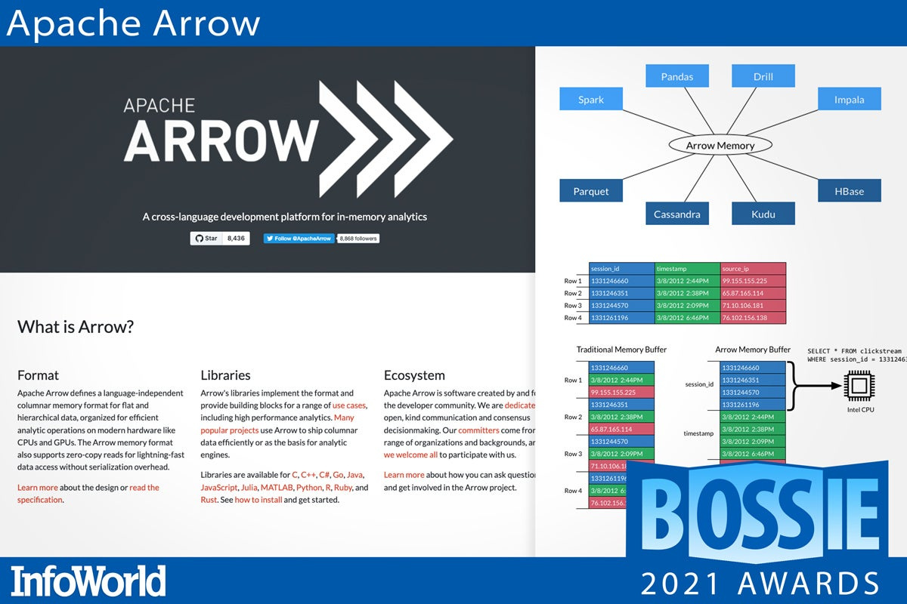
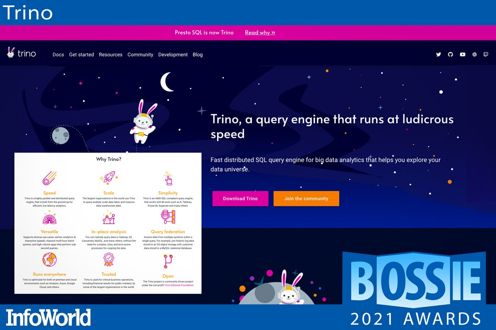

# '보시 어워드 2021' 올해 최고의 오픈소스 소프트웨어 29선

출처: https://www.itworld.co.kr/news/212054

돈이 나무에서 자라지는 않지만 깃허브(GitHub) 저장소에서는 자란다. 오픈소스 프로젝트는 지구상에서 가장 귀중하고 정교한 소프트웨어를 개발하며, 무료이기 때문에 모든 기업의 IT 비용을 크게 낮춰준다. 최신 소프트웨어를 원한다면 오픈소스 프로젝트를 살펴봐야 하는 이유다.

InfoWorld는 올해도 최고의 오픈소스 소프트웨어를 선별해 2021년 보시 어워드(Bossie Award, Best of Open Source Software Awards)을 발표한다. 수상작은 소프트웨어 개발, 데브옵스(DevOps), 클라우드 네이티브 컴퓨팅, 머신러닝 등의 측면에서 가장 혁신적인 오픈소스 소프트웨어다.

 

### 스벨트와 스벨트키트

혁신적인 오픈소스 프런트 엔드(Front End) 자바스크립트(JavaScript) 프레임워크 분야에서는 [스벨트(Svelte)](https://svelte.dev/)와 그 풀스택(Full-stack) 제품은 [스벨트키트(SvelteKit)](https://kit.svelte.dev/)가 가장 야심 차고 선진적이다. 스벨트는 컴파일 시간 전략을 도입해 관련 분야를 완전히 바꾸어 놓았고 뛰어난 성능, 지속적인 혁신, 훌륭한 개발자 경험을 통해 발전하고 있다. 스벨트키트는 현재 퍼블릭 베타를 진행 중이다. 스벨트의 전통을 이어 가장 최신 툴을 지원하고 서버리스 환경에 내장 기능을 배치하며 혁신을 주도하고 있다.

 

### 미니큐브

도커 데스크톱(Docker Desktop)이 새로운 가격 정책과 라이선스 제공 요건 때문에 사용하기 부담스럽다면 [미니큐브(Minikube)](https://minikube.sigs.k8s.io/docs/)를 고려해보자. 이름에서 알 수 있듯이 미니큐브는 데스크톱에서 구동하는 미니어처 쿠버네티스(Kubernetes) 클러스터다. 가상 머신은 필요 없다.

미니큐브는 네이티브 컨테이너 또는 베어 메탈에서 사용할 수 있다. 맥OS나 윈도우에서 리눅스 배포판을 사용할 필요도 없다. 미니큐브는 크로스 플랫폼 방식으로 작동한다. 또한 도커(Docker), CRI-O, 컨테이너드(Containered) 등 다양한 컨테이너 런타임을 지원한다. CI(continuous integration) 플랫폼 호스트 전체가 미니큐브와 네이티브로 호환된다. 쿠버네티스이기 때문에 필요할 때 쿠버네티스 자체의 도구와 구성요소를 사용할 수 있다는 점이 최대 장점이다.

 

### 픽시

[픽시(Pixie)](https://px.dev/)는 쿠버네티스 애플리케이션을 위한 모니터링 툴이다. 서비스 지도, 클러스터 리소스, 애플리케이션 트래픽 등 클러스터의 고수준 상태를 확인하고 팟(Pod) 상태, 플레임(Flame) 그래프, 개별적인 풀바디(Full-body) 애플리케이션 요청 등 더 자세한 정보를 확인할 수 있다.

픽시는 eBPF를 사용해 원격 측정 데이터를 자동으로 수집하고 모든 원격 측정 데이터를 클러스터에 로컬 상태로 저장 및 쿼리 처리하면서도 클러스터 CPU를 5% 미만으로 사용한다. 픽시의 대표적인 활용 사례로는 클러스터 안에서의 네트워크 모니터링, 인프라 건전성, 서비스 성능, 데이터베이스 쿼리 프로파일링 등이 있다.

 

### 패스트API

장고(Django)와 플라스크(Flask)가 몇 년 동안 파이썬(Python) 웹 프레임워크를 선도했다면, 이제 [패스트API(FastAPI)](https://fastapi.tiangolo.com/)가 그 뒤를 잇고 있다. 패스트API는 다른 웹 프레임워크와 단순히 개발 및 실행 속도 측면에서 경쟁하는 것이 아니다. 패스트API는 처음부터 기본적으로 타입 힌팅(Type Hinting), 비동기화, 고속 구성요소를 사용하도록 작성된 진정한 최신 파이썬 웹 프레임워크이다.

이름에서 알 수 있듯이 패스트API의 보편적인 사용 사례 중 하나는 표준을 준수하는 강력한 웹 API를 신속하게 구축하는 것이다. 하지만 더욱 일반적인 웹 사이트 구축에도 적합하다.

 

### 크리스털

C의 속도와 루비(Ruby)의 표현력을 가진 프로그래밍 언어를 제공하는 프로젝트인 [크리스털(Crystal)](https://crystal-lang.org/)은 지금까지 수년 동안 개발에 사용됐다. 올해 초, 크리스털 1.0이 출시되면서 이 언어는 일반 작업에 사용할 만큼 안정화됐다.

크리스털은 정적 타이핑과 [LLVM ](https://www.infoworld.com/article/3247799/what-is-llvm-the-power-behind-swift-rust-clang-and-more.html) 컴파일러를 사용해 높은 속도를 달성하고 런타임 시의 Null 참조 등의 보편적인 문제를 방지한다. 크리스털은 추가적인 속도 및 편의성을 위해 기존 C 코드와 연동할 수 있으며 컴파일-시간 매크로를 사용해 기본 언어 구문을 확장할 수도 있다.

 

### 윈도우 터미널

마이크로소프트 윈도우에 업데이트가 필요한 경우 텍스트 창 안에서 명령줄 애플리케이션을 표시하는 구성요소로 느리고 유연하지 못한 구식 콘솔 호스트를 사용해야 한다. 윈도우 사용자의 이런 불편함을 해소하고 맥과 리눅스 사용자가 오랫동안 누려온 편리한 명령줄 경험을 제공하기 위해 고안된 오픈소스 터미널 애플리케이션이 바로 [윈도우 터미널((Windows Terminal)](https://github.com/Microsoft/Terminal)이다.

윈도우 터미널은 장점이 많다. GPU 가속 렌더링은 구형 콘솔 호스트 대비 상당한 성능 향상을 제공하며 구성 옵션을 통해 터미널 외관과 동작을 이전에는 절대로 불가능했던 방식으로 사용자 정의할 수 있다. 아직은 윈도우에서 구현 콘솔 호스트를 대체하지 못했지만 앞으로가 기대되는 오픈소스다.

 

### OBS 스튜디오

팬데믹 기간 동안 비디오 캡처 및 라이브 스트리밍이 중요해졌고 이는 현재도 마찬가지다. [OBS 스튜디오(OBS Studio)](https://obsproject.com/)는 상업용 디스플레이 캡처 및 카메라 녹화 제품보다 더 뛰어나다. 사용자는 여러 개의 캡처 소스 정의(실시간 카메라, 데스크톱 전체, 특정 창)를 생성하거나, 캡처를 디스크에 파일로 저장하거나 제공자에게 실시간으로 스트리밍할 수 있다. 단축키를 통해 보기 화면 사이를 원활하게 전환할 수 있어 여러 개의 스트림을 캡처해 함께 편집할 필요가 없다. PIP(Picture in Picture) 효과와 실시간 자막(아직은 테스트 단계) 기능도 지원한다.

 

### 숏컷

[숏컷(Shotcut)](https://shotcut.org/)은 다빈치 리졸브(DaVinci Resolve)와 치열한 경쟁을 펼치는 비디오 편집용 교차 플랫폼 툴이다. 이를 이용하면 오디오 및 비디오 트랙의 모든 표준 수정 작업을 처리하고 효과와 레이어링을 적용할 수 있다. 숏컷은 매우 활발한 커뮤니티가 있으며 초보 및 고급 비디오그래퍼를 위한 다양한 교육 비디오와 지침을 제공한다. 맥, 리눅스, BSD, 윈도우에서 구동하며, 크로스 플랫폼인데도 인터페이스가 직관적이고 비슷한 툴과 비교해 상대적으로 사용법이 단순하다.

 

### 위브 깃옵스 코어

[위브 깃옵스 코어(Weave GitOps Core)](https://github.com/weaveworks/weave-gitops)는 깃옵스(GitOps)를 활용 툴이다. 깃옵스를 통해 깃(Git)에서 구성을 선언하고 에이전트에 의해 쿠버네티스 클러스터에 적용되도록 할 수 있다. 핵심은 데브옵스 워크플로를 간소화하고 구성 드리프트(Drift)를 방지해 구성의 안정화와 보안을 개선하는 것이다. 특히 보안 관련해서, 위브 깃옵스 코어는 깃 선언 상태의 변경사항을 감지하고 구성 변경사항을 런타임 환경에 마이그레이션하는 ‘중재 엔진’ 역할을 한다. 위브 깃옵스는 CNCF(Cloud Native Computing 깃옵스 레퍼런스 구현인 [플럭스(Flux)](https://fluxcd.io/)를 기반으로 한다.

 

### 아파치 솔라

[아파치 솔라(Apache Solr)](https://solr.apache.org/)는 아파치 루센스(Apache Lucene)에 기초한 장수 검색 플랫폼이다. 아파치 루센스는 엘라스틱서치(Elasticsearch) 등의 검색 엔진을 포함해 거의 대부분 소프트웨어의 검색 기능을 지원하는 검색 기술이다. 오픈소스 라이선스를 포기한 엘라스틱서치와는 달리 솔라는 여전히 무료다. 솔라는 클러스터 구성이 가능하고 클라우드에 배치할 수 있으며 클라우드 등급 검색 서비스를 구축할 만큼 강력하다. 심지어 결과를 자동으로 조정하고 가중치를 줄 수 있도록 [LTR(Learning To Rank) ](https://www.infoworld.com/article/3259845/introduction-to-learning-to-rank-ltr-search-analysis.html)알고리즘이 포함돼 있다.

 

### ML플로

특정 기술이 인기를 얻고 충분히 고도화되면서 많은 사람이 참여하면 결국 복잡한 운영 또는 ‘옵스’ 부분을 갖게 되기 마련이다. 머신러닝도 다르지 않은데, 그 대안으로 등장한 것이 ‘ML옵스(MLOps)’이고, 데이터브릭스(Databricks)가 개발하고 리눅스 재단이 호스팅하는 ML옵스 툴이 바로 [ML플로(MLflow)](https://mlflow.org/)다.

ML플로는 다양한 머신러닝을 모델링, 실험, 배치 추적, 관리, 유지하는 ML옵스 플랫폼이다. 코드, 데이터, 구성, 결과 등 실험을 기록 및 쿼리 처리하고 데이터 사이언스 코드를 프로젝트에 패키지화하며 프로젝트를 워크플로에 연결할 수 있는 툴을 제공한다. 머신 러닝을 위한 데브옵스 및 라이프사이클 관리라고 봐도 무방하다.

 

### 오렌지

[오렌지(Orange)](https://orangedatamining.com/)는 ‘생산적이고 재미있는’ 데이터 마이닝을 약속한다. 개발 역사가 벌써 1/4세기가 넘어가지만 지금도 여전히 활발하게 개선되고 있다. 오렌지를 이용하면 데이터 분석 워크플로를 생성하고 모든 종류의 머신러닝 및 분석 기능뿐만 아니라 시각화를 수행할 수 있다. R 스튜디오(R Studio), 주피터(Jupyter) 등 프로그래밍 또는 텍스트 기반 도구와는 달리 오렌지는 매우 시각적이다. 위젯을 캔버스 위로 끌어다 놓아 파일을 로딩하고 모델로 데이터를 분석하며 결과를 시각화한다. 파이썬 스크립트 위젯을 사용해 데이터를 프로그래밍 방식으로 조작하는 것도 가능하다.

 

### 플러터

[플러터(Flutter)](https://flutter.dev/)는 단일 코드베이스에서 모바일, 웹, 데스크톱, 임베디드 기기를 위한 네이티브 컴파일 애플리케이션을 개발하기 위한 구글의 UI 툴킷이다. 다트(Dart) 언어와 완전한 사용자 정의가 가능한 풍부한 머터리얼 디자인(Material Design), 쿠퍼티노(Cupertino) 스타일 위젯에 기초해 네이티브 인터페이스를 만들 수 있다. 플러터의 위젯에는 스크롤링, 탐색, 아이콘, 글꼴 등 iOS와 안드로이드에서 완전한 네이티브 성능을 제공하기 위한 모든 중요한 요소가 통합돼 있다.

 

### 아파치 슈퍼세트

[아파치 슈퍼세트(Apache Superset)](https://github.com/apache/superset)는 최신 기업용 비즈니스 인텔리전스 웹 애플리케이션이다. 빠르고 가벼우며 사용하기 쉽기 때문에 초보 개발자부터 전문가까지 사용자가 단순한 원 그래프부터 매우 자세한 [deck.gl ](https://deck.gl/)지역 관련 차트까지 데이터를 연구하고 시각화 할 수 있다.

슈퍼세트는 데이터 세트를 시각화하고 양방향 대시보드를 개발하는 직관적인 인터페이스, 광범위한 데이터 시각화, 코드가 없는 시각화 빌더, 데이터 시각화를 준비하기 위한 SQL IDE를 제공한다. 또한, 백엔드에서는 대부분의 SQL 사용 데이터베이스를 지원하고 인메모리(In-memory) 비동기 캐싱 및 쿼리도 사용할 수 있다. 확장에 장점이 있는 클라우드 네이티브 아키텍처를 지원한다.

 

### 프레스토

[프레스토(Presto)](https://prestodb.io/)는 클러스터에서 구동하는 온라인 분석 처리를 위한 오픈소스 분산형 SQL 엔진이다. 파일부터 데이터베이스까지 다양한 데이터 소스를 쿼리 처리할 수 있으며 여러 BI 및 분석 환경으로 결과를 반환한다.

프레스토는 하이브(Hive), 카산드라(Cassandra), 관계형 데이터베이스, 상용 데이터 스토어 등에서 데이터 쿼리가 가능하며, 하나의 프레스토 쿼리는 여러 소스의 데이터를 결합할 수 있다. 실제로 페이스북은 300PB 데이터 웨어하우스를 포함해 여러 개의 내부 데이터 스토어에 대한 양방향 쿼리에 프레스토를 사용한다.

프레스토 재단(Presto Foundation)은 프레스토 오픈소스 프로젝트 개발을 감독한다. 페이스북, 우버, 트위터, 알리바바가 프레스토 재단을 설립했다. 이외에도 알룩시오(Alluxio), 아하나(Ahana), 업솔버(Upsolver), 인텔(Intel) 등이 회원사로 등록돼 있다.

 

### 아파치 애로우

[아파치 애로우(Apache Arrow)](https://arrow.apache.org/)는 최신 CPU와 GPU에서 효율적으로 분석 연산을 처리하기 위해 정리된 데이터와 계층 데이터를 위한 언어 독립적인 칼럼식 메모리 형식을 정의한다. 애로우 메모리 형식은 직렬화 오버헤드 없이 빠른 데이터 액세스를 위한 제로카피(Zero-copy) 읽기를 지원한다. 연속 칼럼식 레이아웃을 통해 최신 프로세서에 포함된 최신 SIMD(Single Instruction, Multiple Data) 연산 기술을 사용해 벡터화를 지원한다.

애로우의 라이브러리는 이 형식을 구현하고 고성능 분석을 포함해 일련의 [활용 사례](https://arrow.apache.org/use_cases/)를 위한 요소를 제공한다. [여러 인기 프로젝트](https://arrow.apache.org/powered_by/)가 애로우를 사용해 칼럼식 데이터를 효율적으로 제공하거나 분석 엔진의 기반으로 사용한다. 애로우 라이브러리는 C, C++, C#, 고(Go), 자바, 자바스크립트, 줄리아(Julia), 매트랩, 파이썬, R, 루비, 러스트(Rust) 용으로 제공된다.

 

### 인터프리트ML

인간이 이해할 수 있는 방식으로 의사결정 과정을 설명할 수 있는 머신러닝 및 딥러닝 방식을 IML(Interpretable Machine Learning) 또는 XAI(Explainable AI)라고 한다. [인터프리트ML(InterpretML)](https://interpret.ml/)은 여러 개의 최신 머신러닝 해석 기법이 통합된 오픈소스 XAI 패키지다.

이를 이용해 해석 가능한 모델을 학습시키고 기존 AI의 블랙박스 시스템을 설명할 수 있다. 인터프리트ML은 모델의 전체적인 동작과 각 예측의 근거를 이해하는 데도 도움이 된다. [EGM(Explainable Boosting Machine)](https://interpret.ml/docs/ebm.html) 마이크로소프트 리서치의 ‘글래스 박스’ 모델이 유명한데, 블랙박스 모델의 근사치에 의한 사후 설명을 위해 [라임(Lime)](https://github.com/marcotcr/lime)을 지원한다.

 

### 라임

[라임(Lime, Local Interpretable Model-agnostic Explanations)](https://github.com/marcotcr/lime)은 입력값의 특징을 교란하고 예측을 검토해 머신러닝 분류자의 예측을 설명하는 사후 기법이다. 라임의 핵심적인 원리는, 단순한 모델에 의해 블랙박스 모델을 (설명하고자 하는 예측의 근처에서) 로컬로 근사치를 구한 후 모델 전체의 근사치를 구하기가 훨씬 쉽다는 점에서 출발한다. 텍스트와 이미지 영역 모두에 적용되는데, 라임 파이썬 패키지는 [PyPI](https://pypi.org/project/lime/)에서 제공되며 소스는 깃허브에서 찾을 수 있다.

 

### 다스크

[다스크(Dask)](https://dask.org/)는 파이썬 패키지를 여러 개의 기기로 확장할 수 있는 병렬 컴퓨팅을 위한 오픈소스 라이브러리다. 다스크를 이용하면 같은 시스템 또는 다중 노드 클러스터 안에서 여러 개의 GPU로 데이터와 연산을 분산할 수 있다. 다스크는 GPU 가속 데이터 분석 및 머신러닝을 위해 [래피즈 cuDF(Rapids cuDF)](https://github.com/rapidsai/cudf), [XGBoost](https://xgboost.ai/), [래피즈 cuML(Rapids cuML)](https://github.com/rapidsai/cuml)과 통합돼 있다. 또한 워크플로 병렬화를 위해 NumPy, 판다스(Pandas), 싸이키트런(Scikit-learn)과 통합돼 있다.

 

### 블래이징SQL

[블래이징SQL(BlazingSQL)](https://blazingsql.com/)은 래피즈 생태계를 기반으로 하는 GPU 가속 SQL 엔진이자, 아파치 2.0 라이선스로 공개된 오픈소스 프로젝트다. 블레이징 노트북(Blazing Notebooks)은 AWS를 기반으로 블래이징SQL, 래피즈, 주피터랩(JupyterLab)이 결합한 클라우드 서비스이다.

기본적으로 블래이징SQL은 모든 GPU 데이터 사이언스 워크플로의 ETL(Extract, Transform, Load) 기능을 제공한다. GPU 메모리에 GPU 데이터프레임(DataFrame)이 있으면 머신러닝을 위해 래피스 cuML을 사용하거나 파이토치(PyTorch) 또는 텐서플로(TensorFlow)를 사용한 GPU 내 딥러닝을 위해 데이터프레임을 DLPack 또는 NVTabular로 변환할 수 있다.

 

### 래피즈

엔비디아(Nvidia)의 오픈소스 소프트웨어 라이브러리 및 API 스위트인 [래피즈(Rapids)](https://rapids.ai/)는 GPU에서 E2E(End to End) 데이터 사이언스와 분석 파이프라인을 지원한다. 저수준 컴퓨팅 최적화를 위해 엔비디아 쿠다(CUDA)를 활용했는데, 덕분에 사용자 친화적인 파이썬 인터페이스를 통해 GPU 병렬 및 고대역폭 메모리 속도를 구현했다.

또한, 래피즈는 아파치 애로우 칼럼식 메모리 형식에 의존하며 판다스 같은 데이터프레임 조작 라이브러리인 cuDF, 싸이키트런에서 제공되는 대부분의 GPU 버전을 제공하는 머신러닝 라이브러리 컬렉션인 cuML, 가속화된 그래픽 분석을 위한 네트워크X(NetworkX) 같은 라이브러리인 cuGraph 등을 포함한다.

 

### 포스트호그

[포스트호그(PostHog)](https://posthog.com/)는 제품 분석 용도의 쓰기 편한 공학용 프레임워크다. 웹 및 모바일 앱의 사용자 행동에 대한 인사이트를 빠르게 얻을 수 있다. 코드에 짧은 자바스크립트를 추가하면 바로 시작할 수 있다.

포스트호그의 자동 캡처 기능은 사용자 세션 중 이루어지는 많은 프런트 엔드 상호작용 이벤트를 수집한다. 마우스로 이용할 수 있는 메뉴 지향적인 UI 덕분에 다양한 이벤트 데이터를 유의미한 동작 지표, 트렌드 차트, 바이트 크기의 대시보드로 쉽게 정제할 수 있다. 특히 퍼넬(Funnels) 기능을 이용하면 전체 사용 패턴을 더 정제해 병목을 격리하고 반송률(Bounce Rate)을 개선한다. 온프레미스 또는 SaaS 제품으로 제공되며 소프트웨어 제품의 사용자 경험 최적화 작업의 지루함과 모호성을 없애준다.

 

### 레이크FS

[레이크FS((LakeFS)](https://lakefs.io/)는 객체 스토리지에 깃과 유사한 버전 컨트롤 계층을 추가해 마치 코드를 관리하듯 데이터 레이크를 관리할 수 있도록 지원한다. 데이터에 깃 방식을 적용하면 사용자가 자신만의 분리된 제로카피 데이터 브랜치를 생성하고 여기서 공유된 객체를 훼손할 위험 없이 작업, 실험, 분석 모델링 작업을 할 수 있다.

레이크FS는 데이터 무결성과 품질을 유지하기 위한 검증 후크와 함께 데이터에 유용한 커밋 노트(Commit Note), 메타데이터 필드, 롤백 옵션을 제공해 커밋 되지 않은 브랜치가 실수로 프로덕션 환경에 다시 병합되기 전에 형식 및 스키마 확인을 실행한다. 레이크FS를 통해 코드 저장소를 관리하고 보호하는 유사한 기법을 아마존 S3(Amazon S3)와 ABS(Azure Blob Storage) 등의 최신 데이터 저장소로 확장할 수 있다.

 

### 멜타노

[멜타노(Meltano)](https://meltano.com/)는 전통적인 ELT(Extract, Load, Transform) 툴체인의 무료 오픈소스 ‘데이터옵스(DataOps)’ 대안이다. 올해 깃랩(GitLab)에서 분리됐다. 

멜타노의 데이터 웨어하우스 프레임워크를 통해 프로젝트용 데이터를 쉽게 모델링, 추출, 변환할 수 있으며 내장된 분석 도구와 보고를 간소화하는 대시보드를 통해 통합 및 변환 파이프라인을 보완한다. 탄탄한 익스트랙터(Extractor) 및 로더(Loader) 라이브러리뿐만 아니라 데이터 추출 탭과 데이터 로딩 타깃을 위해 싱어(Singer) 표준을 지원한다. 멜타노는 이미 데이터 오케스트레이션을 위한 핵심 툴로 자리 잡았다.

 

### 트리노

[트리노(Trino, 전 PrestoSQL)](https://trino.io/)는 대규모의 분산된 데이터 소스를 대상으로 초고속 쿼리를 실행할 수 있는 분산형 SQL 분석 엔진이다. 트리노로 처리하기 위해 데이터를 복사하거나 이동할 필요 없이 데이터 레이크, 관계형 스토어에 대해 쿼리를 실행하거나 여러 소스의 쿼리를 동시에 실행할 수 있다.

트리노는 양방향 또는 임시 등 데이터 사이언티스트가 사용하는 BI 및 분석 도구에 상관없이 잘 작동하기 때문에 학습 곡선을 줄여준다. 데이터 엔지니어가 점차 증가하는 데이터 소스에서 점차 복잡해지는 분석을 지원하기 위해 분투하는 상황에서, 트리노는 쿼리 실행을 최적화하고 이질적인 소스로부터 신속하게 결과를 얻을 수 있는 훌륭한 방법을 제공한다.

 

### 스트림네이티브

[스트림네이티브(StreamNative)](https://streamnative.io/)는 확장성이 매우 뛰어난 메시징 및 이벤트 스트리밍 플랫폼이다. 실시간 보고 및 분석 도구뿐만 아니라 기업 애널리틱스 스트리밍을 위한 데이터 파이프라인 배치를 간소화한다.

아파치 펄사(Apache Pulsar)의 강력한 분산형 스트림 처리 아키텍처와 쿠버네티스 및 하이브리드 클라우드 지원, 대규모 데이터 커넥터 라이브러리, 손쉬운 인증 및 승인, 건전성 및 성능 모니터링을 위한 전용 도구 등의 기업용 추가 기능을 결합했다. 또한, 펄사 기반 실시간 애플리케이션 개발을 용이하게 하고 대규모 메시징 백플레인의 배치 및 관리를 간소화한다.

 

### 허깅 페이스

[허깅 페이스(Hugging Face)](https://huggingface.co/)는 그 자체로 딥러닝 프레임워크가 아닌 오픈소스 딥러닝 저장소를 제공한다. 이 프로젝트의 총 트랜스포머(Transformers) 기반 영역 명령은 지속해서 증가하고 있으며 문서가 공개된 후 불과 며칠 안에 새로운 모델이 저장소에 추가됐다.

모델 호스팅이 점차 발전하는 가운데, [액셀러레이터(Accelerate) ](https://huggingface.co/blog/accelerate-library)등의 새로운 작업 덕분에 분산형 GPU 훈련을 더 쉽게 활용할 수 있게 됐다. 현재 허깅 페이스는 텍스트를 넘어 이미지, 오디오, 비디오, 객체 감지 등을 지원하는 수준으로 발전하는 것이 목표다. 딥러닝 실무자라면 앞으로 수년 동안 이 저장소를 예의주시할 필요가 있다.

 

### 일루터AI

오픈AI의 [GPT-3 모델](https://github.com/openai/gpt-3)은 텍스트 세대에서 크게 발전해 인간 수준의 성능을 낼 수 있다. 하지만 API를 통한 제한적인 액세스가 가능하더라도 훈련된 버전의 GPT-3은 오픈AI와 마이크로소프트만 전체적으로 액세스할 수 있다. 대신 GPT-3을 다른 사람에게 제공하기 위해 머신러닝 연구원으로 구성된 분산된 그룹인 [일루터AI(EleutherAI)](https://www.eleuther.ai/)에 가입하면 된다.

2021년, 일루터AI는 훈련을 위한 825기가바이트 용량의 다양한 텍스트 데이터 세트인 더 파일(The Pile)을 공개했으며 6월에는 오픈AI의 GPT-3에 대한 커리(Curie) 모델과 거의 동등한 60억 개 파라미터 모델인 GPT-J를 공개했다. GPT-네오X를 통해 일루터AI는 현존하는 가장 광범위한 GPT-3 모델과 경쟁하기 위해 1,750억 개의 파라미터까지 확장할 계획이다. 세계 유수 기업 소속의 해커야말로 오픈소스의 진정한 힘이다.

 

### 코랩 노트북용 제너러티브 아트

보시의 수상자는 전통적으로 오픈소스의 근간이 되는 라이브러리, 프레임워크, 플랫폼, 운영체제였다. 하지만 올해 제너러티브 아트(Generative Art)의 폭발적인 성장을 초래한 오픈소스 구성요소도 살펴볼 가치가 있다.

우선, 텍스트 및 이미지 벡터 임베딩을 생성하는 다양한 모델인 [오픈AI의 CLIP(Contrastive Language-Image Pre-training)](https://github.com/openai/CLIP) 모델이 있다. CLIP은 완전히 오픈소스화되었지만 오픈AI의 생성 신경망 [DALL-E](https://openai.com/blog/dall-e/)는 그렇지 않았다. 그 공백을 메우기 위해 라이언 머도치와 캐서린 크라우슨은 CLIP과 BigGAN 및 VQGAN 등의 다른 오픈 소스 모델을 결합해 코랩 노트북을 개발해 프롬프트 기반의 생성 아트워크를 만들었다.

이후 코랩 노트북은 MIT 라이선스에 따라 무료로 널리 사용됐다. 수십 년 동안 마치 팬 잡지처럼 인터넷 전반으로 확산하고 리믹스, 변경, 번역 등에 쓰이면서 놀라운 예술 작품을 만들어냈다. 트위터의 [ai_curio](https://twitter.com/ai_curio)에서 멋진 작품을 확인할 수 있다. editor@itworld.co.kr 