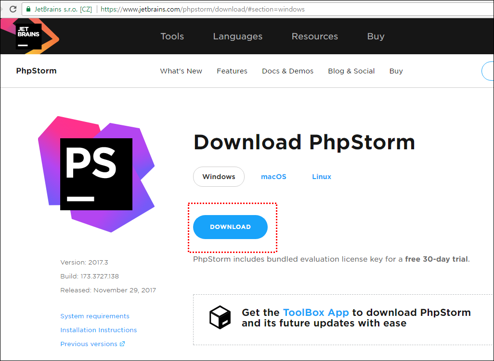

# PHPstrom , Webstorm portable install

출처: [jetBrains - PHPstrom , Webstorm 포터블로 무제한 무료 사용하기 (tistory.com)](https://gocoder.tistory.com/82?category=701146)

PHP스톰 쓰면서 이클립스에 비해 가장 아쉬운건 포터블 형태가 아닌것이다.

A, B라는 프로젝트를 동시에 진행 한다면 이클립스의 경우

A프로젝트의 셋팅 해놓은 이클립스와

B프로젝트의 셋팅 해놓은 이클립스를 다른 파일로 실행함으로써

작업 내역을 계속 이어 나갈 수 있다는 특징이 있다.

그런데 jetBrain IDE들은 알다시피 설치버전이라 editplus 처럼 하나만 설치가 가능하다.

PHP 프로젝트를 두개를 맡고 있다면 매번 폴더를 오픈해야 한다. 불편하다.

그래서 오늘은 PHPstrom , Webstorm 이 IDE를 포터블로 만드는 방법을 알아보자.

우선 먼저 써놓은 PHP스톰 강의를 보고 와도 좋을 것이다.http://gocoder.tistory.com/45

우선 최신버전 Storm을 받자 PHPstrom , Webstorm두개다 포터블로 만드는 방법은 같으니 

PHP스톰으로 예시를 들어보겠다.

▼우선 아래 URL에 가서 최신버전을 다운로드 하자

https://www.jetbrains.com/phpstorm/download/#section=windows

▼그 다음 받은 EXE 파일을 마우스 오른쪽을 눌러 반디집으로 열기로 눌러보자 

이전 강의에서도 말씀드렸다시피 개발자면 반디집을 쓰는 걸 추천!

▼그럼 마치 압축파일 처럼 보일것이다. 해당 이미지에 화살친 부분을 잡고 원하는 폴더로 드래그 드롭 하면 압축이 풀린다.

▼그다음 Bin 폴더에 접근해서 idea.properties 파일을 메모장이나 editPlus로 열어보자

▼해당 네모친곳을 이렇게 바꿔보자 ${user.home} -> ${idea.home}

설정 내용들을 OS 사용자 계정에 등록하는게 아니라 각 폴더에 등록하겠다는 말이다.

▼그리고 앞에 있는 주석을 제거 해보자 최종 모습은 아래와 같다.

▼그리고 다시 bin폴더에서 phpstorm64.exe 를 클릭하여 프로그램을 실행해보자.

▼설정부터 묻는 화면이 나온다 마치 처음 설치 했던 거처럼!!!!

이렇게 하면 이제 포터블한 IDE이기 때문에 프로젝트마다 하나의 스톰을 사용할 수 있다.

그리고 프로그램을 여러개를 실행할 수도 있다.

마치 이클립스 처럼 사용할 수 있다는 말이다.

참고로 추가 팁!!

**해당 포터블 버전으로 사용하면** 

**인증 없이 무료 사용 30일마다 새로 압축을 풀어 오늘 배운 설정을 셋팅 하면**

**포터블로 계속 쓸수 있다.~~**

**마무리**

jetBrains 가 IDE를 통합 할 것으로 생각 듭니다. 닷넷 IDE까지 나온거 보니 거침 없는 행보로 보입니다.