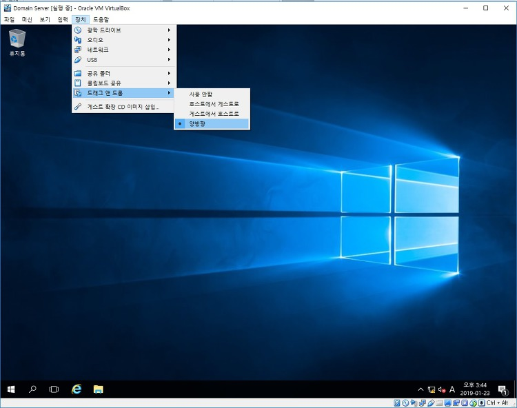
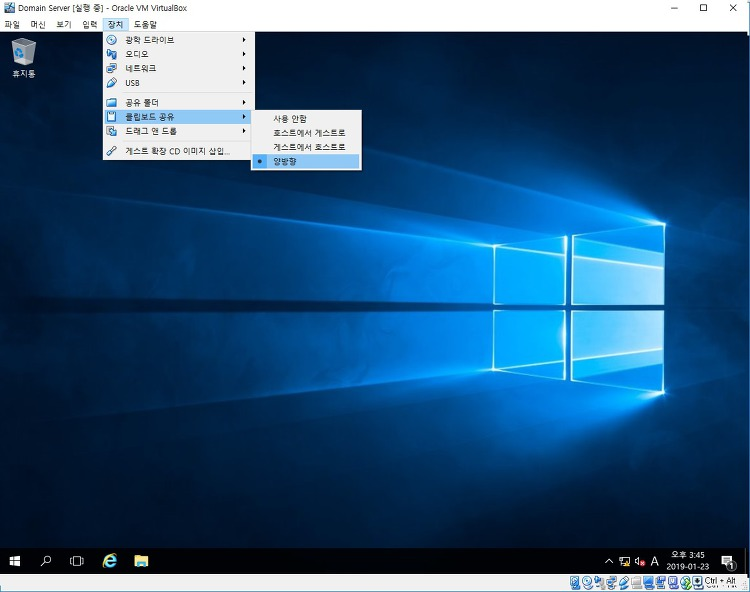
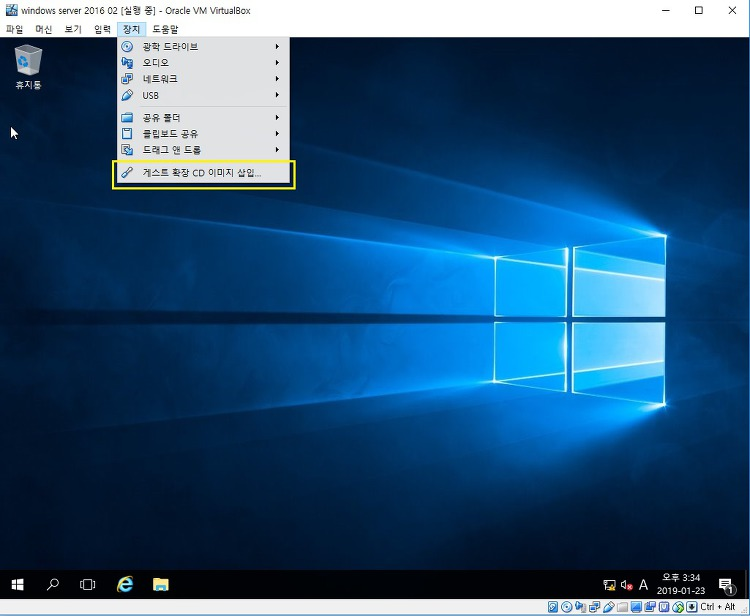
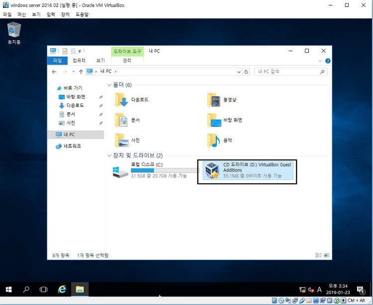
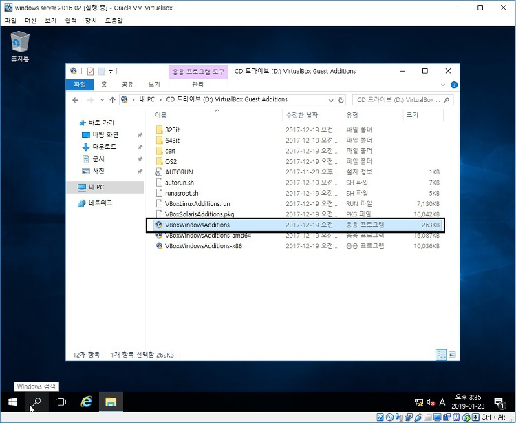
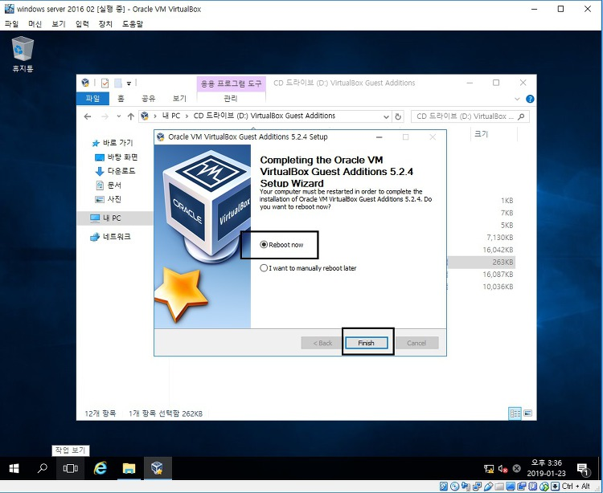

# VIRTUALBOX  파일 옮기기

출처: <https://mozi.tistory.com/274>

VirtualBox 와 호스트 PC 간 파일 옮기기, 드래그 하기, 클립보드 복사 하기 기능등을 사용하는 방법입니다.

**1. 장치의 클립보드 공유, 드래그 앤 드롭을 양방향으로 변경합니다.**

**2. 장치에서 게스트 확장 CD 이미지 삽입을 선택합니다.**

**3. 내 PC에 가면 설치CD 가 삽입되어 있습니다.**

**4. 응용 exe 프로그램을 실행합니다.**

**5. 설치가 완료되면 재부팅 합니다.**

이 후 잠시 대기하면 파일을 드래그 할 수 있는 기능이 활성화 됩니다.

파일을 드래그 해보시면 잘 될거에요.

