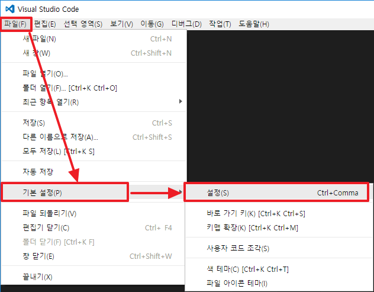
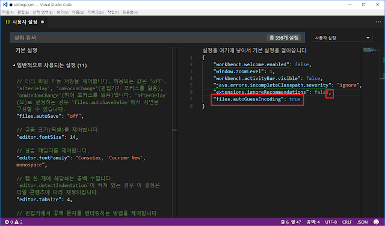
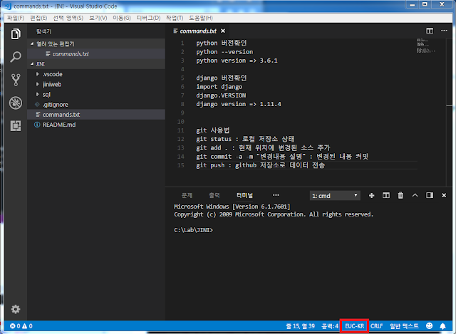

## Visual Studio Code에서 인코딩 형식 자동 인식시키기

출처: <https://devstorylog.blogspot.com/2018/05/visual-studio-code.html>

#### 1) [파일] >> [기본 설정] >> [설정]

1-1) 아래와 같이 설정 페이지로 이동한다.

1-2) 사용자 설정 페이지에서 아래와 같이 입력한다.

"files.autoGuessEncoding": true

**이 부분은 Check Box 로 변경 되었음 (2019.05.09일 현재 확인)**

1-3) 아래와 같이 파일을 읽어오면 자동으로 변환된 내용을 확인 할 수 있다.

