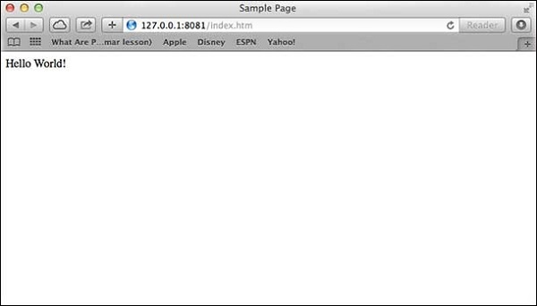

# Node.js Tutorial

출처: https://www.tutorialspoint.com/nodejs/index.htm


 Node.js는 Google 크롬의 JavaScript V8 엔진을 기반으로 작성된 매우 강력한 JavaScript 기반 프레임 워크 / 플랫폼입니다. 비디오 스트리밍 사이트, 단일 페이지 응용 프로그램 및 기타 웹 응용 프로그램과 같은 I / O 집약적 인 웹 응용 프로그램을 개발하는 데 사용됩니다. Node.js는 전 세계 수천 명의 개발자가 사용하는 오픈 소스이며 무료입니다.


### Audience

이 튜토리얼은 Node.js의 기본 및 아키텍처 개념을 배우려는 소프트웨어 프로그래머를 위해 작성되었습니다. 이 튜토리얼에서는 Node.js에 필요한 모든 구성 요소에 대한 이해를 돕기 위해 적절한 예제를 제공합니다.


### Prerequisites

이 자습서를 진행하기 전에 JavaScript에 대한 기본 지식이 있어야합니다. Node.js를 사용하여 웹 기반 응용 프로그램을 개발할 예정이므로 HTML, CSS, AJAX 등과 같은 다른 웹 기술에 대해 잘 알고 있다면 유용 할 것입니다.


## Node.js - Introduction

### What is Node.js?

Node.js는 Google 크롬의 자바 스크립트 엔진 (V8 엔진)을 기반으로 만들어진 서버 측 플랫폼입니다. Node.js는 2009 년 Ryan Dahl에 의해 개발되었으며 최신 버전은 v0.10.36입니다. 공식 문서에서 제공하는 Node.js의 정의는 다음과 같습니다.

> Node.js는 빠르고 확장 가능한 네트워크 애플리케이션을 쉽게 구축 할 수 있도록 Chrome의 JavaScript 런타임에 구축 된 플랫폼입니다. Node.js는 가볍고 효율적인 이벤트 구동 비 블로킹 I / O 모델을 사용하여 분산 장치에서 실행되는 데이터 집약적 인 실시간 애플리케이션에 이상적입니다.

Node.js는 서버 측 및 네트워킹 응용 프로그램을 개발하기위한 개방형 소스, 크로스 플랫폼 런타임 환경입니다. Node.js 응용 프로그램은 JavaScript로 작성되었으며 OS X, Microsoft Windows 및 Linux의 Node.js 런타임에서 실행할 수 있습니다.

Node.js는 Node.js를 사용하여 웹 응용 프로그램 개발을 간소화하는 다양한 JavaScript 모듈의 풍부한 라이브러리도 제공합니다.

```
Node.js = Runtime Environment + JavaScript Library
```


### Features of Node.js

다음은 Node.js를 소프트웨어 설계자의 첫 번째 선택으로 만드는 중요한 기능 중 일부입니다.

- **Asynchronous and Event Driven** − Node.js 라이브러리의 모든 API는 비동기식, 즉 비 차단 형입니다. 기본적으로 Node.js 기반 서버는 데이터를 반환하는 API를 기다리지 않습니다. 서버는이를 호출 한 후 다음 API로 이동하고 Node.js 이벤트 알림 메커니즘은 서버가 이전 API 호출로부터 응답을 얻는 데 도움이됩니다.
- **Very Fast** − Google 크롬의 V8 JavaScript 엔진을 기반으로 구축 된 Node.js 라이브러리는 코드 실행 속도가 매우 빠릅니다.
- **Single Threaded but Highly Scalable** − Node.js는 이벤트 반복과 함께 단일 스레드 모델을 사용합니다. 이벤트 메커니즘은 서버가 비 차단 방식으로 응답 할 수있게하고 요청을 처리하기위한 제한된 스레드를 만드는 기존 서버와 달리 서버의 확장 성을 높입니다. Node.js는 단일 스레드 프로그램을 사용하며 동일한 프로그램이 Apache HTTP Server와 같은 기존 서버보다 훨씬 많은 수의 요청에 서비스를 제공 할 수 있습니다.
- **No Buffering** −  Node.js 응용 프로그램은 어떠한 데이터도 버퍼하지 않습니다. 이러한 응용 프로그램은 단순히 데이터를 청크로 출력합니다.
- **License** −  Node.js는 MIT 라이선스에 따라 배포됩니다.


### Who Uses Node.js?

다음은 Node.js를 사용하는 프로젝트, 애플리케이션 및 회사의 포괄적 인 목록이 포함 된 github 위키의 링크입니다. 이 목록에는 eBay, General Electric, GoDaddy, Microsoft, PayPal, Uber, Wikipins, Yahoo! 및 Yammer가 포함됩니다.


### Concepts

다음 다이어그램은 Node.js의 중요한 부분을 설명하며 이후 장에서 자세히 설명합니다.


### Where to Use Node.js?

다음은 Node.js가 완벽한 기술 파트너임을 증명하는 분야입니다.

- I / O 바운드 응용 프로그램
- 데이터 스트리밍 애플리케이션
- 데이터 집약형 실시간 애플리케이션 (DIRT)
- JSON API 기반 애플리케이션
- 단일 페이지 응용 프로그램


### Where Not to Use Node.js?

CPU 집약적 인 응용 프로그램에 Node.js를 사용하는 것은 바람직하지 않습니다.


## Node.js - Environment Setup

### Try it Option Online

> Node.j를 배우기 위해 자신의 환경을 설정할 필요가 없습니다. 이유는 매우 간단합니다. 이미 Node.js 환경을 온라인으로 설정 했으므로 사용 가능한 모든 예제를 온라인으로 실행하고 실습을 배울 수 있습니다. 모든 예제를 수정하고 다른 옵션을 사용하여 결과를 확인하십시오.
>
> 웹 사이트의 아래 샘플 코드 상자의 오른쪽 상단에있는 라이브 데모 옵션을 사용하여 다음 예제를 시도해보십시오.
>
> ```javascript
> /* Hello World! program in Node.js */
> console.log("Hello World!");
> ```
>
>  이 튜토리얼에서 제공되는 대부분의 예제에서는 Try it 옵션을 사용하므로 그냥 사용하고 학습을 즐기십시오.

[online](https://www.tutorialspoint.com/execute_nodejs_online.php)


### Local Environment Setup

Node.js에 대한 환경을 계속 설정하려면 컴퓨터에서 사용할 수있는 다음 두 가지 소프트웨어, (a) 텍스트 편집기 및 (b) Node.js 바이너리 설치가 필요합니다.


### Text Editor

이것은 귀하의 프로그램을 입력하는 데 사용됩니다. 몇 가지 편집기의 예로는 Windows 메모장, OS 편집 명령, Brief, Epsilon, EMACS 및 vim 또는 vi가 있습니다.

텍스트 편집기의 이름과 버전은 운영 체제마다 다를 수 있습니다. 예를 들어 메모장은 Windows에서 사용되며 vim이나 vi는 Windows 또는 Linux 또는 UNIX에서 사용할 수 있습니다.

편집기로 작성한 파일을 소스 파일이라고하며 프로그램 소스 코드가 들어 있습니다. Node.js 프로그램의 소스 파일 이름은 일반적으로 확장자가 '.js'입니다.

프로그래밍을 시작하기 전에 하나의 텍스트 편집기가 있어야하고 컴퓨터 프로그램을 작성하고 파일로 저장 한 다음 최종적으로 실행할 수있는 충분한 경험이 있어야합니다.


### The Node.js Runtime

소스 파일에 작성된 소스 코드는 단순히 javascript입니다. Node.js 인터프리터는 자바 스크립트 코드를 해석하고 실행하는 데 사용됩니다.

Node.js 배포판은 32 비트 (386) 및 64 비트 (amd64) x86 프로세서 아키텍처를 사용하는 SunOS, Linux, Mac OS X 및 Windows 운영 체제 용 바이너리 설치 가능 서버입니다.

다음 절에서는 Node.js 바이너리 배포판을 다양한 OS에 설치하는 방법에 대해 설명합니다.


### Download Node.js archive

Node.js 다운로드에서 최신 버전의 Node.js 설치 가능한 아카이브 파일을 다운로드하십시오. 이 자습서를 작성할 때 다음은 다른 OS에서 사용 가능한 버전입니다.

| OS      | Archive name                  |
| ------- | ----------------------------- |
| Windows | node-v6.3.1-x64.msi           |
| Linux   | node-v6.3.1-linux-x86.tar.gz  |
| Mac     | node-v6.3.1-darwin-x86.tar.gz |
| SunOS   | node-v6.3.1-sunos-x86.tar.gz  |


### Installation on UNIX/Linux/Mac OS X, and SunOS

사용중인 OS 아키텍처에 따라 / tmp에 아카이브 node -v6.3.1-osname.tar.gz를 다운로드하여 압축을 풀고 압축을 푼 파일을 /usr/local/nodejs 디렉토리로 이동하십시오. 예 :

```
$ cd /tmp
$ wget http://nodejs.org/dist/v6.3.1/node-v6.3.1-linux-x64.tar.gz
$ tar xvfz node-v6.3.1-linux-x64.tar.gz
$ mkdir -p /usr/local/nodejs
$ mv node-v6.3.1-linux-x64/* /usr/local/nodejs
```

 /usr/local/nodejs/bin 을 PATH 환경 변수에 추가하십시오.

| OS      | Output                                  |
| ------- | --------------------------------------- |
| Linux   | export PATH=$PATH:/usr/local/nodejs/bin |
| Mac     | export PATH=$PATH:/usr/local/nodejs/bin |
| FreeBSD | export PATH=$PATH:/usr/local/nodejs/bin |


### Installation on Windows

MSI 파일을 사용하고 지시에 따라 Node.js를 설치하십시오. 기본적으로 설치 프로그램은 C :\ Program Files \nodejs의 Node.js 배포판을 사용합니다. 설치 프로그램은 창의 PATH 환경 변수에 C : \Program Files\nodejs\bin 디렉토리를 설정해야합니다. 변경 내용을 적용하려면 열려있는 명령 프롬프트를 다시 시작하십시오.


### Verify installation: Executing a File

다음 코드가있는 시스템 (Windows 또는 Linux)에 main.js라는 js 파일을 만듭니다.

```javascript
/* Hello, World! program in node.js */
console.log("Hello, World!")
```

이제 Node.js 인터프리터를 사용하여 main.js 파일을 실행하여 결과를 확인하십시오.

```
$ node main.js
```

설치 과정에서 문제가 없다면 다음과 같은 결과가 나옵니다.

```
Hello, World!
```


## Node.js - First Application

실제 'Hello, World!'를 만들기 전에 Node.js를 사용하는 응용 프로그램에서는 Node.js 응용 프로그램의 구성 요소를 보도록하겠습니다. Node.js 응용 프로그램은 다음 세 가지 중요한 구성 요소로 이루어져 있습니다.

- **Import required modules** − Node.js 모듈을로드하려면 require 지시문을 사용합니다.
- **Create server** − Apache HTTP Server와 비슷한 클라이언트 요청을 수신하는 서버.
- **Read request and return response** − 이전 단계에서 작성된 서버는 브라우저 또는 콘솔이 될 수있는 클라이언트가 작성한 HTTP 요청을 읽고 응답을 리턴합니다.


### Creating Node.js Application

**Step 1 -** 필수 모듈 가져 오기

require 지시어를 사용하여 http 모듈을로드하고 반환 된 HTTP 인스턴스를 다음과 같이 http 변수에 저장합니다.

```javascript
var http = require("http");
```


**Step 2 -** 서버 만들기

생성 된 http 인스턴스와 http.createServer () 메소드를 사용하여 서버 인스턴스를 만든 다음 서버 인스턴스와 관련된 수신 대기 메소드를 사용하여 포트 8081에서 바인딩합니다. 요청 및 응답 매개 변수가있는 함수를 전달하십시오. 항상 'Hello World'를 반환하도록 샘플 구현을 작성합니다.

 ```javascript
http.createServer(function (request, response) {
   // Send the HTTP header 
   // HTTP Status: 200 : OK
   // Content Type: text/plain
   response.writeHead(200, {'Content-Type': 'text/plain'});
   
   // Send the response body as "Hello World"
   response.end('Hello World\n');
}).listen(8081);

// Console will print the message
console.log('Server running at http://127.0.0.1:8081/')
 ```

위의 코드는 로컬 시스템의 8081 포트를 통해 요청을 수신 대기하는 HTTP 서버를 생성하기에 충분합니다.


**Step 3 -** 요청 및 응답 테스트

**Step 1** 과 **Step 2** 를 main.js라는 파일에 넣고 아래와 같이 HTTP 서버를 시작합니다 -

```javascript
var http = require("http");

http.createServer(function (request, response) {
   // Send the HTTP header 
   // HTTP Status: 200 : OK
   // Content Type: text/plain
   response.writeHead(200, {'Content-Type': 'text/plain'});
   
   // Send the response body as "Hello World"
   response.end('Hello World\n');
}).listen(8081);

// Console will print the message
console.log('Server running at http://127.0.0.1:8081/');
```

이제 main.js를 실행하여 다음과 같이 서버를 시작합니다.

```
$ node main.js
```

출력을 확인하십시오. 서버가 시작되었습니다.

```
Server running at http://127.0.0.1:8081/
```


### Make a Request to the Node.js Server

모든 브라우저에서 http://127.0.0.1:8081/을 열고 다음 결과를 확인하십시오.


축하합니다. 포트 8081의 모든 HTTP 요청에 응답하는 첫 번째 HTTP 서버가 설치되어 실행 중입니다.


## Node.js - REPL Terminal

 REPL은 Eval Print Loop 읽기 (Read Eval Print Loop)의 약자로, Windows 콘솔 또는 Unix / Linux 셸과 같은 컴퓨터 환경을 나타내며 명령이 입력되고 시스템이 대화 형 모드로 출력을 응답합니다. Node.js 또는 Node는 REPL 환경과 번들로 제공됩니다. 다음과 같은 작업을 수행합니다 -

- **Read** − 사용자의 입력을 읽고, JavaScript 데이터 구조로 입력을 파싱하고, 메모리에 저장합니다.
- **Eval** − 데이터 구조를 가져 와서 평가합니다.
- **Print** −  결과를 인쇄합니다.
- **Loop** − 사용자가 ctrl-c를 두 번 누를 때까지 위의 명령을 반복합니다.

Node의 REPL 기능은 Node.js 코드를 실험하고 JavaScript 코드를 디버깅하는 데 매우 유용합니다.


### Online REPL Terminal

학습을 단순화하기 위해 Node.js 구문을 연습 할 수있는 Node.js REPL 환경을 온라인으로 쉽게 설정할 수 있습니다. - Node.js 시작 REPL Terminal


#### Starting REPL

 REPL은 다음과 같이 인수없이 쉘 / 콘솔에서 노드를 실행하기 만하면 시작할 수 있습니다.

```
$ node
```

REPL 명령 프롬프트> Node.js 명령을 입력 할 수있는 곳을 볼 수 있습니다 -

```
$ node
>
```


#### Simple Expression

 Node.js REPL 명령 프롬프트에서 간단한 수학을 시도해 봅시다 -

```
$ node
> 1 + 3
4
> 1 + ( 2 * 3 ) - 4
3
>
```


#### Use Variables

변수를 사용하여 값을 저장하고 나중에 일반 스크립트처럼 인쇄 할 수 있습니다. var 키워드를 사용하지 않으면 값이 변수에 저장되어 인쇄됩니다. 반면에 var 키워드를 사용하면 값은 저장되지만 인쇄되지는 않습니다. console.log ()를 사용하여 변수를 인쇄 할 수 있습니다.

```
$ node
> x = 10
10
> var y = 10
undefined
> x + y
20
> console.log("Hello World")
Hello World
undefined
```


#### Multiline Expression

노드 REPL은 JavaScript와 비슷한 다중 행 표현을 지원합니다. 다음 do-while 루프 작동 확인 -

```
$ node
> var x = 0
undefined
> do {
   ... x++;
   ... console.log("x: " + x);
   ... } 
while ( x < 5 );
x: 1
x: 2
x: 3
x: 4
x: 5
undefined
>
```

 ... 열기 대괄호 뒤에 Enter 키를 누르면 자동으로 나타납니다. 노드는 자동으로 표현의 연속성을 검사합니다.


#### Underscore Variable

밑줄 (_)을 사용하여 마지막 결과를 얻을 수 있습니다.

```
$ node
> var x = 10
undefined
> var y = 20
undefined
> x + y
30
> var sum = _
undefined
> console.log(sum)
30
undefined
>
```


#### REPL Commands

- **ctrl + c** − 현재 명령을 종료 합니다.
- **ctrl + c twice** − 노드 REPL을 종료 합니다.
- **ctrl + d** − 노드 REPL을 종료 합니다.
- **Up/Down Keys** − 명령 기록을보고 이전 명령을 수정 할 수 있습니다.
- **tab Keys** − 현재 명령 목록.
- **.help** − 모든 명령 목록.
- **.break** − 여러 줄의 표현식을 종료하십시오.
- **.clear** − 여러 줄의 표현식을 종료하십시오.
- **.save filename** − 현재 노드 REPL 세션을 파일에 저장 합니다.
- **.load filename** −  현재 노드 REPL 세션의 파일 내용을 로드 합니다.


#### Stopping REPL

위에서 언급했듯이 Node.js REPL에서 Ctrl-C를 두 번 눌러야합니다.

```
$ node
>
(^C again to quit)
>
```


## Node.js - NPM

Node Package Manager (NPM)는 두 가지 주요 기능을 제공합니다.

-  search.nodejs.org에서 검색 할 수있는 node.js 패키지 / 모듈 용 온라인 리포지토리
- 명령 줄 유틸리티는 Node.js 패키지를 설치하고 Node.js 패키지의 버전 관리 및 종속성 관리를 수행합니다.

NPM은 v0.6.3 버전 이후에 Node.js 설치 파일과 함께 번들로 제공됩니다. 이를 확인하려면 콘솔을 열고 다음 명령을 입력하고 결과를 확인하십시오 -

```
$ npm --version
2.7.1
```

이전 버전의 NPM을 실행중인 경우 최신 버전으로 쉽게 업데이트 할 수 있습니다. 그냥 루트에서 다음 명령을 사용하십시오 -

```
$ sudo npm install npm -g
/usr/bin/npm -> /usr/lib/node_modules/npm/bin/npm-cli.js
npm@2.7.1 /usr/lib/node_modules/npm
```


### Installing Modules using NPM

Node.js 모듈을 설치하는 간단한 구문이 있습니다 -

```
$ npm install <Module Name>
```

예를 들어, 유명한 Node.js 웹 프레임 워크 모듈을 설치하는 명령은 다음과 같습니다. express -

```
$ npm install express
```

이제 js 파일에서 다음과 같이이 모듈을 사용할 수 있습니다 -

```javascript
var express = require('express');
```


### Global vs Local Installation

기본적으로 NPM은 로컬 모드에서 종속성을 설치합니다. 여기서 로컬 모드는 노드 응용 프로그램이있는 폴더에있는 node_modules 디렉토리의 패키지 설치를 나타냅니다. 로컬에 배포 된 패키지는 require () 메소드를 통해 액세스 할 수 있습니다. 예를 들어, express 모듈을 설치할 때 Express 모듈을 설치 한 현재 디렉토리에 node_modules 디렉토리가 작성됩니다.

```
$ ls -l
total 0
drwxr-xr-x 3 root root 20 Mar 17 02:23 node_modules
```

 또는 npm ls 명령을 사용하여 로컬에 설치된 모든 모듈을 나열 할 수 있습니다.

전역 적으로 설치된 패키지 / 종속성은 시스템 디렉토리에 저장됩니다. 이러한 종속성은 node.js의 CLI (명령 줄 인터페이스) 기능에서 사용할 수 있지만 노드 응용 프로그램에서 직접 require ()를 사용하여 가져올 수는 없습니다. 이제 글로벌 설치를 사용하여 익스프레스 모듈을 설치해 봅시다.

```
$ npm install express -g
```

이렇게하면 유사한 결과가 발생하지만 모듈은 전 세계적으로 설치됩니다. 여기에서 첫 번째 행은 모듈 버전과 모듈 버전이 설치되는 위치를 보여줍니다.

```
express@4.12.2 /usr/lib/node_modules/express
├── merge-descriptors@1.0.0
├── utils-merge@1.0.0
├── cookie-signature@1.0.6
├── methods@1.1.1
├── fresh@0.2.4
├── cookie@0.1.2
├── escape-html@1.0.1
├── range-parser@1.0.2
├── content-type@1.0.1
├── finalhandler@0.3.3
├── vary@1.0.0
├── parseurl@1.3.0
├── content-disposition@0.5.0
├── path-to-regexp@0.1.3
├── depd@1.0.0
├── qs@2.3.3
├── on-finished@2.2.0 (ee-first@1.1.0)
├── etag@1.5.1 (crc@3.2.1)
├── debug@2.1.3 (ms@0.7.0)
├── proxy-addr@1.0.7 (forwarded@0.1.0, ipaddr.js@0.1.9)
├── send@0.12.1 (destroy@1.0.3, ms@0.7.0, mime@1.3.4)
├── serve-static@1.9.2 (send@0.12.2)
├── accepts@1.2.5 (negotiator@0.5.1, mime-types@2.0.10)
└── type-is@1.6.1 (media-typer@0.3.0, mime-types@2.0.10)
```

다음 명령을 사용하여 전 세계적으로 설치된 모든 모듈을 검사 할 수 있습니다.

```
$ npm ls -g
```


### Using package.json

 package.json은 노드 응용 프로그램 / 모듈의 루트 디렉토리에 있으며 패키지의 등록 정보를 정의하는 데 사용됩니다. 익스프레스 패키지의 package.json을 node_modules/express/

```json
{
   "name": "express",
      "description": "Fast, unopinionated, minimalist web framework",
      "version": "4.11.2",
      "author": {
      
         "name": "TJ Holowaychuk",
         "email": "tj@vision-media.ca"
      },
   
   "contributors": [{
      "name": "Aaron Heckmann",
      "email": "aaron.heckmann+github@gmail.com"
   }, 
   
   {
      "name": "Ciaran Jessup",
      "email": "ciaranj@gmail.com"
   },
   
   {
      "name": "Douglas Christopher Wilson",
      "email": "doug@somethingdoug.com"
   },
   
   {
      "name": "Guillermo Rauch",
      "email": "rauchg@gmail.com"
   },
   
   {
      "name": "Jonathan Ong",
      "email": "me@jongleberry.com"
   },
   
   {
      "name": "Roman Shtylman",
      "email": "shtylman+expressjs@gmail.com"
   },
   
   {
      "name": "Young Jae Sim",
      "email": "hanul@hanul.me"
   } ],
   
   "license": "MIT", "repository": {
      "type": "git",
      "url": "https://github.com/strongloop/express"
   },
   
   "homepage": "https://expressjs.com/", "keywords": [
      "express",
      "framework",
      "sinatra",
      "web",
      "rest",
      "restful",
      "router",
      "app",
      "api"
   ],
   
   "dependencies": {
      "accepts": "~1.2.3",
      "content-disposition": "0.5.0",
      "cookie-signature": "1.0.5",
      "debug": "~2.1.1",
      "depd": "~1.0.0",
      "escape-html": "1.0.1",
      "etag": "~1.5.1",
      "finalhandler": "0.3.3",
      "fresh": "0.2.4",
      "media-typer": "0.3.0",
      "methods": "~1.1.1",
      "on-finished": "~2.2.0",
      "parseurl": "~1.3.0",
      "path-to-regexp": "0.1.3",
      "proxy-addr": "~1.0.6",
      "qs": "2.3.3",
      "range-parser": "~1.0.2",
      "send": "0.11.1",
      "serve-static": "~1.8.1",
      "type-is": "~1.5.6",
      "vary": "~1.0.0",
      "cookie": "0.1.2",
      "merge-descriptors": "0.0.2",
      "utils-merge": "1.0.0"
   },
   
   "devDependencies": {
      "after": "0.8.1",
      "ejs": "2.1.4",
      "istanbul": "0.3.5",
      "marked": "0.3.3",
      "mocha": "~2.1.0",
      "should": "~4.6.2",
      "supertest": "~0.15.0",
      "hjs": "~0.0.6",
      "body-parser": "~1.11.0",
      "connect-redis": "~2.2.0",
      "cookie-parser": "~1.3.3",
      "express-session": "~1.10.2",
      "jade": "~1.9.1",
      "method-override": "~2.3.1",
      "morgan": "~1.5.1",
      "multiparty": "~4.1.1",
      "vhost": "~3.0.0"
   },
   
   "engines": {
      "node": ">= 0.10.0"
   },
   
   "files": [
      "LICENSE",
      "History.md",
      "Readme.md",
      "index.js",
      "lib/"
   ],
   
   "scripts": {
      "test": "mocha --require test/support/env 
         --reporter spec --bail --check-leaks test/ test/acceptance/",
      "test-cov": "istanbul cover node_modules/mocha/bin/_mocha 
         -- --require test/support/env --reporter dot --check-leaks test/ test/acceptance/",
      "test-tap": "mocha --require test/support/env 
         --reporter tap --check-leaks test/ test/acceptance/",
      "test-travis": "istanbul cover node_modules/mocha/bin/_mocha 
         --report lcovonly -- --require test/support/env 
         --reporter spec --check-leaks test/ test/acceptance/"
   },
   
   "gitHead": "63ab25579bda70b4927a179b580a9c580b6c7ada",
   "bugs": {
      "url": "https://github.com/strongloop/express/issues"
   },
   
   "_id": "express@4.11.2",
   "_shasum": "8df3d5a9ac848585f00a0777601823faecd3b148",
   "_from": "express@*",
   "_npmVersion": "1.4.28",
   "_npmUser": {
      "name": "dougwilson",
      "email": "doug@somethingdoug.com"
   },
   
   "maintainers": [{
      "name": "tjholowaychuk",
      "email": "tj@vision-media.ca"
   },
   
   {
      "name": "jongleberry",
      "email": "jonathanrichardong@gmail.com"
   },
   
   {
      "name": "shtylman",
      "email": "shtylman@gmail.com"
   },
   
   {
      "name": "dougwilson",
      "email": "doug@somethingdoug.com"
   },
   
   {
      "name": "aredridel",
      "email": "aredridel@nbtsc.org"
   },
   
   {
      "name": "strongloop",
      "email": "callback@strongloop.com"
   },
   
   {
      "name": "rfeng",
      "email": "enjoyjava@gmail.com"
   }],
   
   "dist": {
      "shasum": "8df3d5a9ac848585f00a0777601823faecd3b148",
      "tarball": "https://registry.npmjs.org/express/-/express-4.11.2.tgz"
   },
   
   "directories": {},
      "_resolved": "https://registry.npmjs.org/express/-/express-4.11.2.tgz",
      "readme": "ERROR: No README data found!"
}
```


### Attributes of Package.json

- **name** − name of the package
- **version** − 패키지 버전
- **description** − 패키지에 대한 설명
- **homepage** −  패키지 홈페이지
- **author** −  패키지 작성자
- **contributors** −  패키지에 참여한 사람의 이름
- **dependencies** − 의존성 목록. NPM은 여기에 언급 된 모든 종속성을 패키지의 node_module 폴더에 자동으로 설치합니다.
- **repository** − 저장소 유형 및 패키지의 URL
- **main** −  패키지 진입 점
- **keywords** − 키워드


### Uninstalling a Module

 Node.js 모듈을 제거하려면 다음 명령을 사용하십시오.

```
$ npm uninstall express
```

NPM이 패키지를 설치 제거한 후에는 / node_modules / 디렉토리의 내용을 보거나 다음 명령을 입력하여 패키지를 검증 할 수 있습니다.

```
$ npm ls
```


### Updating a Module

package.json을 업데이트하고 업데이트 할 종속성 버전을 변경하고 다음 명령을 실행합니다.

```
$ npm update express
```


### Search a Module

NPM을 사용하여 패키지 이름을 검색 합니다.

```
$ npm search express
```


### Create a Module

모듈을 생성하려면 package.json을 생성해야합니다. NPM을 사용하여 package.json을 생성하면 package.json의 기본 골격을 생성합니다.

```
$ npm init
This utility will walk you through creating a package.json file.
It only covers the most common items, and tries to guess sane defaults.

See 'npm help json' for definitive documentation on these fields
and exactly what they do.

Use 'npm install <pkg> --save' afterwards to install a package and
save it as a dependency in the package.json file.

Press ^C at any time to quit.
name: (webmaster)
```

모듈에 대한 모든 필수 정보를 제공해야합니다. 위에서 언급 한 package.json 파일의 도움을 받아 다양한 정보 요구의 의미를 이해할 수 있습니다. package.json이 생성되면 다음 명령을 사용하여 유효한 전자 메일 주소를 사용하여 NPM 저장소 사이트에 자신을 등록하십시오.

```
$ npm adduser
Username: mcmohd
Password:
Email: (this IS public) mcmohd@gmail.com
```

지금은 모듈을 게시 할 때입니다.

```
$ npm publish
```

모듈에 문제가 없으면 저장소에 게시되고 다른 Node.js 모듈과 마찬가지로 NPM을 사용하여 설치할 수 있습니다.


## Node.js - Callbacks Concept

### What is Callback?

콜백 함수는 비동기 함수입니다. 콜백 함수는 주어진 작업이 완료 될 때 호출됩니다. 노드는 콜백을 많이 사용합니다. Node의 모든 API는 콜백을 지원하는 방식으로 작성됩니다.

예를 들어, 파일을 읽는 함수는 파일 읽기를 시작하고 실행 환경으로 제어를 반환하여 다음 명령을 실행할 수 있습니다. 파일 I / O가 완료되면 콜백 함수를 호출하면서 콜백 함수를 호출합니다. 콜백 함수는 파일의 내용을 매개 변수로 전달합니다. 따라서 파일 I / O를 차단하거나 대기 할 필요가 없습니다. 이로써 Node.js는 확장 성이 뛰어나며 결과를 반환 할 함수를 기다리지 않고 많은 수의 요청을 처리 할 수 있습니다.


### Blocking Code Example

다음 내용으로 input.txt라는 텍스트 파일을 만듭니다.

```
Tutorials Point is giving self learning content
to teach the world in simple and easy way!!!!!
```

다음 코드를 사용하여 main.js라는 js 파일을 만듭니다.

```javascript
var fs = require("fs");
var data = fs.readFileSync('input.txt');

console.log(data.toString());
console.log("Program Ended");
```

이제 main.js를 실행하여 결과를 확인하십시오.

```
$ node main.js
```

출력을 확인하십시오.

```
Tutorials Point is giving self learning content
to teach the world in simple and easy way!!!!!
Program Ended
```


### Non-Blocking Code Example

다음 내용으로 input.txt라는 텍스트 파일을 만듭니다.

```
Tutorials Point is giving self learning content
to teach the world in simple and easy way!!!!!
```

main.js를 업데이트하여 다음 코드를 작성하십시오 -

```javascript
var fs = require("fs");

fs.readFile('input.txt', function (err, data) {
   if (err) return console.error(err);
   console.log(data.toString());
});

console.log("Program Ended");
```

이제 main.js를 실행하여 결과를 확인하십시오.

```
$ node main.js
```

출력을 확인하십시오.

```
Program Ended
Tutorials Point is giving self learning content
to teach the world in simple and easy way!!!!!
```

 이 두 예제는 **동기** 및 **비동기** 호출의 개념을 설명합니다.

- 첫 번째 예제는 프로그램이 파일을 읽을 때까지 차단 한 다음 프로그램을 끝내기 만하면된다는 것을 보여줍니다.
- 두 번째 예제는 프로그램이 파일 읽기를 기다리지 않고 'Program Ended'를 인쇄하는 동시에 블록하지 않은 프로그램이 파일 읽기를 계속한다는 것을 보여줍니다.

따라서 차단 프로그램은 순차적으로 매우 많이 실행됩니다. 프로그래밍의 관점에서 볼 때 논리를 구현하는 것이 더 쉽지만 논 블로킹 프로그램은 순차적으로 실행되지 않습니다. 프로그램에서 처리 할 데이터를 사용해야하는 경우 연속 실행되도록 동일한 블록 내에 보관해야합니다.


## Node.js - Event Loop

Node.js는 단일 스레드 응용 프로그램이지만 이벤트 및 콜백 개념을 통해 동시성을 지원할 수 있습니다. Node.js의 모든 API는 비동기이며 단일 스레드이므로 동시성을 유지하기 위해 비동기 함수 호출을 사용합니다. 노드는 옵저버 패턴을 사용합니다. 노드 쓰레드는 이벤트 루프를 유지하고 태스크가 완료 될 때마다 이벤트 리스너 함수에 신호를 보내는 해당 이벤트를 실행합니다.


### Event-Driven Programming

Node.js는 이벤트를 많이 사용하며 Node.js가 다른 유사한 기술과 비교해 꽤 빠른 이유 중 하나이기도합니다. Node가 서버를 시작하자마자 변수를 초기화하고 함수를 선언 한 다음 이벤트가 발생할 때까지 기다립니다.


이벤트가 콜백과 매우 유사하게 보일지라도 콜백 함수는 비동기 함수가 결과를 반환 할 때 호출되는 반면 이벤트 처리는 관찰자 패턴에서 작동한다는 점이 다릅니다. 이벤트를 청취하는 기능은 Observers 역할을합니다. 이벤트가 시작될 때마다 리스너 함수가 실행을 시작합니다. Node.js는 다음과 같이 이벤트 모듈과 EventEmitter 클래스를 통해 사용할 수있는 여러 개의 내장 이벤트를 포함하며 이벤트 및 수신기를 바인딩하는 데 사용됩니다.

```javascript
// Import events module
var events = require('events');

// Create an eventEmitter object
var eventEmitter = new events.EventEmitter();
```

다음은 이벤트 처리기를 이벤트와 바인드하는 구문입니다.

```javascript
// Bind event and event  handler as follows
eventEmitter.on('eventName', eventHandler);
```

우리는 다음과 같이 이벤트를 프로그래밍 방식으로 실행할 수 있습니다.

```javascript
// Fire an event 
eventEmitter.emit('eventName');
```


### Example

다음 코드를 사용하여 main.js라는 js 파일을 만듭니다.

```javascript
// Import events module
var events = require('events');

// Create an eventEmitter object
var eventEmitter = new events.EventEmitter();

// Create an event handler as follows
var connectHandler = function connected() {
   console.log('connection succesful.');
  
   // Fire the data_received event 
   eventEmitter.emit('data_received');
}

// Bind the connection event with the handler
eventEmitter.on('connection', connectHandler);
 
// Bind the data_received event with the anonymous function
eventEmitter.on('data_received', function() {
   console.log('data received succesfully.');
});

// Fire the connection event 
eventEmitter.emit('connection');

console.log("Program Ended.");
```

이제 위의 프로그램을 실행하고 결과를 확인해 봅시다.

```
$ node main.js
```

다음과 같은 결과를 출력 해야합니다.

```
connection successful.
data received successfully.
Program Ended.
```


### How Node Applications Work?

노드 응용 프로그램에서 모든 비동기 함수는 마지막 매개 변수로 콜백을 허용하고 콜백 함수는 첫 번째 매개 변수로 오류를 허용합니다. 앞의 예제를 다시 한번 살펴 보겠습니다. 다음 내용으로 input.txt라는 텍스트 파일을 만듭니다.

```
Tutorials Point is giving self learning content
to teach the world in simple and easy way!!!!!
```

다음 코드를 갖는 main.js라는 js 파일을 생성하십시오 -

```javascript
var fs = require("fs");

fs.readFile('input.txt', function (err, data) {
   if (err) {
      console.log(err.stack);
      return;
   }
   console.log(data.toString());
});
console.log("Program Ended");
```

여기서 fs.readFile ()은 파일을 읽는 것을 목적으로하는 비동기 함수입니다. 읽기 작업 중에 오류가 발생하면 err 객체는 해당 오류를 포함하고 그렇지 않으면 데이터에 파일의 내용이 포함됩니다. readFile은 읽기 작업이 완료된 후 err과 데이터를 콜백 함수에 전달하여 최종적으로 내용을 인쇄합니다.

```
Program Ended
Tutorials Point is giving self learning content
to teach the world in simple and easy way!!!!!
```


## Node.js - Event Emitter

노드의 많은 객체는 이벤트를 발생시킵니다. 예를 들어, net.Server는 피어가 연결할 때마다 이벤트를 내고, fs.readStream은 파일이 열릴 때 이벤트를 내 보냅니다. 이벤트를 내보내는 모든 객체는 events.EventEmitter의 인스턴스입니다.


### EventEmitter Class

이전 섹션에서 보았 듯이 EventEmitter 클래스는 이벤트 모듈에 있습니다. 다음 코드를 통해 액세스 할 수 있습니다.

```javascript
// Import events module
var events = require('events');

// Create an eventEmitter object
var eventEmitter = new events.EventEmitter();
```

EventEmitter 인스턴스에 오류가 발생하면 '오류'이벤트가 발생합니다. 새로운 리스너가 추가되면 'newListener'이벤트가 발생하고 리스너가 제거되면 'removeListener'이벤트가 발생합니다.

EventEmitter는 on 및 emit과 같은 여러 속성을 제공합니다. on 속성은 이벤트와 함수를 바인딩하고 emit은 이벤트를 발생시키는 데 사용됩니다.

#### Methods

| Sr.No. | Method & Description                                         |
| ------ | ------------------------------------------------------------ |
| 1      | **addListener(event, listener)**<br/>청취자 배열의 끝에 지정된 이벤트에 대한 청취자를 추가합니다. 청취자가 이미 추가되었는지 확인하지 않습니다. 동일한 이벤트와 리스너의 조합을 여러 번 호출하면 리스너가 여러 번 추가됩니다. 이미 터를 반환하므로 호출을 연결할 수 있습니다. |
| 2      | **on(event, listener)**<br/>청취자 배열의 끝에 지정된 이벤트에 대한 청취자를 추가합니다. 청취자가 이미 추가되었는지 확인하지 않습니다. 동일한 이벤트와 리스너의 조합을 여러 번 호출하면 리스너가 여러 번 추가됩니다. 이미 터를 반환하므로 호출을 연결할 수 있습니다. |
| 3      | **once(event, listener)**<br/>이벤트에 1 회 청취자를 추가합니다. 이 리스너는 다음에 이벤트가 시작될 때만 호출되고 그 후 이벤트가 제거됩니다. 이미 터를 반환하므로 호출을 연결할 수 있습니다. |
| 4      | **removeListener(event, listener)**<br/>청취자 배열에서 지정된 이벤트에 대한 리스너를 제거합니다. 주의 - 리스너 뒤의 리스너 배열에서 배열 인덱스를 변경합니다. removeListener는 청취자 배열로부터 청취자의 인스턴스를 1 개까지 삭제합니다. 단일 이벤트가 지정된 이벤트에 대한 리스너 배열에 여러 번 추가 된 경우 removeListener를 여러 번 호출하여 각 인스턴스를 제거해야합니다. 이미 터를 반환하므로 호출을 연결할 수 있습니다. |
| 5      | **removeAllListeners([event])**<br/>모든 청취자 또는 지정된 이벤트의 청취자를 삭제합니다. 코드의 다른 부분에 추가 된 리스너를 제거하는 것은 좋지 않습니다. 특히 내가 생성하지 않은 이미 터 (예 : 소켓 또는 파일 스트림)에있는 경우에는 제거하는 것이 좋습니다. 이미 터를 반환하므로 호출을 연결할 수 있습니다. |
| 6      | **setMaxListeners(n)**<br/>기본적으로 EventEmitters는 특정 이벤트에 대해 10 개 이상의 수신기가 추가되면 경고를 표시합니다. 이것은 메모리 누수를 찾는 데 유용한 유용한 기본값입니다. 분명히 모든 에미 터는 10으로 제한되어서는 안됩니다.이 기능을 사용하면이 이미 터를 증가시킬 수 있습니다. 무제한의 경우 0으로 설정하십시오. |
| 7      | **listeners(event)**<br/>지정된 이벤트에 대한 수신기의 배열을 반환합니다. |
| 8      | **emit(event, [arg1], [arg2], [...])**<br/>제공된 인수로 순서대로 각 리스너를 실행하십시오. 이벤트에 리스너가 있으면 true를 반환하고 그렇지 않으면 false를 반환합니다. |


#### Class Methods

| Sr.No. | Method & Description                                         |
| ------ | ------------------------------------------------------------ |
| 1      | **listenerCount(emitter, event)**<br/>지정된 이벤트의 청취자 수를 돌려줍니다. |


#### Events

| Sr.No. | Events & Description                                         |
| ------ | ------------------------------------------------------------ |
| 1      | **newListener**<br/>- **event** − String: 이벤트 이름<br/>- **listener** − Function: 이벤트 핸들러 함수<br/>이 이벤트는 리스너가 추가 될 때마다 생성됩니다. 이 이벤트가 트리거되면 리스너가 이벤트의 리스너 배열에 아직 추가되지 않았을 수 있습니다. |
| 2      | **removeListener**<br/>**event** − String 이벤트 이름입니다.<br/>**listener** − 함수 이벤트 핸들러 함수<br/>이 이벤트는 누군가가 청취자를 제거 할 때마다 방출됩니다. 이 이벤트가 트리거되면 리스너가 아직 이벤트에 대한 리스너 배열에서 제거되지 않았을 수 있습니다. |


#### Example

다음 Node.js 코드로 main.js라는 js 파일을 만듭니다.

```javascript
var events = require('events');
var eventEmitter = new events.EventEmitter();

// listener #1
var listner1 = function listner1() {
   console.log('listner1 executed.');
}

// listener #2
var listner2 = function listner2() {
   console.log('listner2 executed.');
}

// Bind the connection event with the listner1 function
eventEmitter.addListener('connection', listner1);

// Bind the connection event with the listner2 function
eventEmitter.on('connection', listner2);

var eventListeners = require('events').EventEmitter.listenerCount
   (eventEmitter,'connection');
console.log(eventListeners + " Listner(s) listening to connection event");

// Fire the connection event 
eventEmitter.emit('connection');

// Remove the binding of listner1 function
eventEmitter.removeListener('connection', listner1);
console.log("Listner1 will not listen now.");

// Fire the connection event 
eventEmitter.emit('connection');

eventListeners = require('events').EventEmitter.listenerCount(eventEmitter,'connection');
console.log(eventListeners + " Listner(s) listening to connection event");

console.log("Program Ended.");
```

이제 main.js를 실행하여 결과를 확인하십시오.

```
$ node main.js
```

 출력을 확인하십시오.

```
2 Listner(s) listening to connection event
listner1 executed.
listner2 executed.
Listner1 will not listen now.
listner2 executed.
1 Listner(s) listening to connection event
Program Ended.
```


## Node.js - Buffers

Pure JavaScript는 유니 코드와 호환되지만 바이너리 데이터에는 적합하지 않습니다. TCP 스트림이나 파일 시스템을 다루는 동안, 옥텟 스트림을 처리해야합니다. Node는 정수 배열과 비슷한 원시 데이터를 저장하는 인스턴스를 제공하지만 V8 힙 외부의 원시 메모리 할당에 해당하는 Buffer 클래스를 제공합니다.

버퍼 클래스는 버퍼 모듈을 가져 오지 않고 응용 프로그램에서 액세스 할 수있는 전역 클래스입니다.


### Creating Buffers

노드 버퍼는 다양한 방법으로 구성 할 수 있습니다.


#### Method 1

 다음은 10 의 크기를 가지고 있는  초기화되지 않은 버퍼를 생성하는 구문입니다 -

```javascript
var buf = new Buffer(10);
```


#### Method 2

다음은 주어진 배열에서 버퍼를 생성하는 구문입니다 -

```javascript
var buf = new Buffer([10, 20, 30, 40, 50]);
```


#### Method 3

다음은 주어진 문자열에서 버퍼를 생성하고 선택적으로 유형을 인코딩하는 구문입니다.

```javascript
var buf = new Buffer("Simply Easy Learning", "utf-8");
```

'utf8'이 기본 인코딩이지만 'ascii', 'utf8', 'utf16le', 'ucs2', 'base64'또는 'hex'인코딩 중 하나를 사용할 수 있습니다.


### Writing to Buffers

#### Syntax

 다음은 노드 버퍼에 쓰는 방법의 구문입니다 -

```javascript
buf.write(string[, offset][, length][, encoding])
```


#### Parameters

 다음은 사용 된 매개 변수에 대한 설명입니다.

- **string** − 버퍼에 쓸 문자열 데이터입니다.
- **offset** −  이것은 쓰기를 시작할 버퍼의 인덱스입니다. 기본값은 0입니다.
- **length** − 쓸 바이트 수입니다. 기본값은 buffer.length입니다.
- **encoding** − 사용할 인코딩. 'utf8'이 기본 인코딩입니다.


#### Return Value

이 메소드는 쓰여진 8 진수의 수를 리턴합니다. 버퍼에 전체 문자열에 맞게 충분한 공간이 없으면 문자열의 일부를 씁니다.


#### Example

```javascript
buf = new Buffer(256);
len = buf.write("Simply Easy Learning");

console.log("Octets written : "+  len);
```

위의 프로그램을 실행하면 다음과 같은 결과를 얻습니다.

```
Octets written : 20
```


### Reading from Buffers

#### Syntax

다음은 노드 버퍼에서 데이터를 읽는 방법의 구문입니다.

```javascript
buf.toString([encoding][, start][, end])
```


#### Parameters

다음은 사용 된 매개 변수에 대한 설명입니다.

- **encoding** − 사용할 인코딩. 'utf8'이 기본 인코딩입니다.
- **start** −   읽기 시작 색인, 기본값은 0입니다.
- **end** − 색인을 읽는 끝. 기본값은 완전한 버퍼입니다.


#### Return Value

이 메서드는 지정된 문자 세트 인코딩을 사용하여 인코딩 된 버퍼 데이터에서 문자열을 디코딩하고 반환합니다.


#### Example

```javascript
buf = new Buffer(26);
for (var i = 0 ; i < 26 ; i++) {
  buf[i] = i + 97;
}

console.log( buf.toString('ascii'));       // outputs: abcdefghijklmnopqrstuvwxyz
console.log( buf.toString('ascii',0,5));   // outputs: abcde
console.log( buf.toString('utf8',0,5));    // outputs: abcde
console.log( buf.toString(undefined,0,5)); // encoding defaults to 'utf8', outputs abcde
```

 위의 프로그램을 실행하면 다음과 같은 결과를 얻습니다.

```
abcdefghijklmnopqrstuvwxyz
abcde
abcde
abcde
```


### Convert Buffer to JSON

#### Syntax

다음은 노드 버퍼를 JSON 객체로 변환하는 메소드의 구문입니다.

```javascript
buf.toJSON()
```


#### Return Value

 이 메서드는 Buffer 인스턴스의 JSON 표현을 반환합니다


#### Example

```javascript
var buf = new Buffer('Simply Easy Learning');
var json = buf.toJSON(buf);

console.log(json);
```

위의 프로그램을 실행하면 다음과 같은 결과를 얻습니다.

```
{ type: 'Buffer',
   data: 
   [ 
      83,
      105,
      109,
      112,
      108,
      121,
      32,
      69,
      97,
      115,
      121,
      32,
      76,
      101,
      97,
      114,
      110,
      105,
      110,
      103 
   ]
}
```


### Concatenate Buffers

#### Syntax

다음은 노드 버퍼를 단일 노드 버퍼에 연결하는 방법의 구문입니다 -

```javascript
Buffer.concat(list[, totalLength])
```


#### Parameters

다음은 사용 된 매개 변수에 대한 설명입니다.

- **list** − Array 연결될 버퍼 객체의 Array List입니다.
- **totalLength** −  연결될 때 버퍼의 총 길이입니다.


#### Return Value

이 메서드는 Buffer 인스턴스를 반환합니다.


#### Example

```javascript
var buffer1 = new Buffer('TutorialsPoint ');
var buffer2 = new Buffer('Simply Easy Learning');
var buffer3 = Buffer.concat([buffer1,buffer2]);

console.log("buffer3 content: " + buffer3.toString());
```

위의 프로그램을 실행하면 다음과 같은 결과를 얻습니다.

```
buffer3 content: TutorialsPoint Simply Easy Learning
```


### Compare Buffers

#### Syntax

다음은 두 노드 버퍼를 비교하는 방법의 구문입니다 -

```javascript
buf.compare(otherBuffer);
```


#### Parameters

다음은 사용 된 매개 변수에 대한 설명입니다.

- **otherBuffer** − 이것은 buf와 비교 될 다른 버퍼이다.


#### Return Value

정렬 순서로 otherBuffer의 앞 또는 뒤에 있는지 또는 같은지 여부를 나타내는 숫자를 리턴합니다.


#### Example

```javascript
var buffer1 = new Buffer('ABC');
var buffer2 = new Buffer('ABCD');
var result = buffer1.compare(buffer2);

if(result < 0) {
   console.log(buffer1 +" comes before " + buffer2);
} else if(result === 0) {
   console.log(buffer1 +" is same as " + buffer2);
} else {
   console.log(buffer1 +" comes after " + buffer2);
}
```

위의 프로그램을 실행하면 다음과 같은 결과를 얻습니다.

```
ABC comes before ABCD
```


### Copy Buffer

#### Syntax

다음은 노드 버퍼를 복사하는 메소드의 구문입니다.

```javascript
buf.copy(targetBuffer[, targetStart][, sourceStart][, sourceEnd])
```


#### Parameters

다음은 사용 된 매개 변수에 대한 설명입니다.

- **targetBuffer** −Buffer가 복사 될 buffer 객체입니다.
- **targetStart** − 숫자, 선택 사항, 기본값 : 0
- **sourceStart** − 숫자, 선택 사항, 기본값 : 0
- **sourceEnd** − 숫자, 선택 사항, 기본값 : buffer.length


#### Return Value

반환 값이 없습니다. 대상 메모리 영역이 소스와 겹치더라도이 버퍼의 영역에서 대상 버퍼의 영역으로 데이터를 복사합니다. undefined 인 경우 targetStart 및 sourceStart 매개 변수의 기본값은 0 이지만 sourceEnd의 기본값은 buffer.length입니다.


#### Example

```javascript
var buffer1 = new Buffer('ABC');

//copy a buffer
var buffer2 = new Buffer(3);
buffer1.copy(buffer2);
console.log("buffer2 content: " + buffer2.toString());
```

위의 프로그램을 실행하면 다음과 같은 결과를 얻습니다.

```
buffer2 content: ABC
```


### Slice Buffer

#### Syntax

다음은 노드 버퍼의 하위 버퍼를 가져 오는 메소드 구문입니다.

```javascript
buf.slice([start][, end])
```


#### Parameters

다음은 사용 된 매개 변수에 대한 설명입니다.

- **start** − Number, Optional, Default: 0
- **end** − Number, Optional, Default: buffer.length


#### Return Value

이전 메모리와 동일한 메모리를 참조하지만 시작 (기본값은 0) 및 끝 (기본값은 buffer.length) 색인에 의해 오프셋 및 절단되는 새 버퍼를 리턴합니다. 음수 인덱스는 버퍼의 끝에서 시작합니다.


#### Example

```javascript
var buffer1 = new Buffer('TutorialsPoint');

//slicing a buffer
var buffer2 = buffer1.slice(0,9);
console.log("buffer2 content: " + buffer2.toString());
```

위의 프로그램을 실행하면 다음과 같은 결과를 얻습니다.

```
buffer2 content: Tutorials
```


### Buffer Length

#### Syntax

다음은 노드 버퍼의 크기를 바이트 단위로 가져 오는 메소드 구문입니다.

```
buf.length;
```


#### Return Value

버퍼의 사이즈를 바이트 단위로 돌려줍니다.


#### Example

```javascript
var buffer = new Buffer('TutorialsPoint');

//length of the buffer
console.log("buffer length: " + buffer.length);
```

위의 프로그램을 실행하면 다음과 같은 결과를 얻습니다.

```
buffer length: 14
```


### Methods Reference

다음은 Node.js에서 사용할 수있는 Buffers 모듈에 대한 참조입니다. 자세한 내용은 공식 문서를 참조하십시오.


### Class Methods

| Sr.No. | Method & Description                                         |
| ------ | ------------------------------------------------------------ |
| 1      | **Buffer.isEncoding(encoding)**<br/>encode가 유효한 encode 인수의 경우는 true, 그렇지 않은 경우는 false를 돌려줍니다. |
| 2      | **Buffer.isBuffer(obj)**<br/>obj가 버퍼인가 어떤가를 판정합니다. |
| 3      | **Buffer.byteLength(string[, encoding])**<br/>문자열의 실제 바이트 길이를 제공합니다. 인코딩의 기본값은 'utf8'입니다. String.prototype.length는 문자열의 문자 수를 반환하므로 String.prototype.length와 다릅니다. |
| 4      | **Buffer.concat(list[, totalLength])**<br/>리스트 내의 모든 버퍼를 연결 한 결과의 버퍼를 리턴합니다. |
| 5      | **Buffer.compare(buf1, buf2)**<br/>buf1.compare (buf2)와 동일합니다. 버퍼 배열을 정렬 할 때 유용합니다. |


## Node.js - Streams

### What are Streams?

스트림은 원본에서 데이터를 읽거나 데이터를 대상에 연속적으로 쓸 수있게 해주는 개체입니다. Node.js에는 네 가지 유형의 스트림이 있습니다.

- **Readable** −  읽기 조작에 사용되는 스트림.
- **Writable** −   쓰기 작업에 사용되는 스트림입니다.
- **Duplex** − 읽기 및 쓰기 작업에 모두 사용할 수있는 스트림입니다.
- **Transform** − 출력이 입력을 기반으로 계산되는 양방향 스트림 유형입니다.

각 유형의 Stream은 **EventEmitter** 인스턴스이며 서로 다른 시간에 여러 이벤트를 발생시킵니다. 예를 들어, 일반적으로 사용되는 이벤트 중 일부는 다음과 같습니다.

- **data** − 이 이벤트는 읽을 수있는 데이터가있는 경우 시작됩니다.
- **end** − 이 이벤트는 읽을 데이터가 더 이상 없을 때 발생합니다.
- **error** − 이 이벤트는 데이터 수신 또는 쓰기 오류가 발생하면 시작됩니다.
- **finish** −  이 이벤트는 모든 데이터가 기본 시스템으로 플러시 될 때 발생합니다.

 이 자습서는 일반적으로 사용되는 Streams 작업에 대한 기본적인 이해를 제공합니다.


### Reading from a Stream

다음 내용이있는 input.txt라는 텍스트 파일을 만듭니다.

```
Tutorials Point is giving self learning content
to teach the world in simple and easy way!!!!!
```

다음 코드를 사용하여 main.js라는 js 파일을 만듭니다.

```javascript
var fs = require("fs");
var data = '';

// Create a readable stream
var readerStream = fs.createReadStream('input.txt');

// Set the encoding to be utf8. 
readerStream.setEncoding('UTF8');

// Handle stream events --> data, end, and error
readerStream.on('data', function(chunk) {
   data += chunk;
});

readerStream.on('end',function() {
   console.log(data);
});

readerStream.on('error', function(err) {
   console.log(err.stack);
});

console.log("Program Ended");
```

이제 main.js를 실행하여 결과를 확인하십시오.

```
$ node main.js
```

출력을 확인하십시오.

```
Program Ended
Tutorials Point is giving self learning content
to teach the world in simple and easy way!!!!!
```


### Writing to a Stream

다음 코드를 사용하여 main.js라는 js 파일을 만듭니다.

```javascript
var fs = require("fs");
var data = 'Simply Easy Learning';

// Create a writable stream
var writerStream = fs.createWriteStream('output.txt');

// Write the data to stream with encoding to be utf8
writerStream.write(data,'UTF8');

// Mark the end of file
writerStream.end();

// Handle stream events --> finish, and error
writerStream.on('finish', function() {
   console.log("Write completed.");
});

writerStream.on('error', function(err) {
   console.log(err.stack);
});

console.log("Program Ended");
```

이제 main.js를 실행하여 결과를 확인하십시오.

```
Program Ended
Write completed.
```

이제 현재 디렉토리에서 생성 된 output.txt를 엽니 다. 그것은 다음을 포함해야한다 -

```
Simply Easy Learning
```


### Piping the Streams

파이핑은 한 스트림의 출력을 다른 스트림의 입력으로 제공하는 메커니즘입니다. 일반적으로 한 스트림에서 데이터를 가져 와서 해당 스트림의 출력을 다른 스트림으로 전달하는 데 사용됩니다. 배관 작업에는 제한이 없습니다. 이제는 한 파일에서 읽고 다른 파일에 쓰는 데 필요한 파이핑 예제를 보여줍니다.

다음 코드를 사용하여 main.js라는 js 파일을 만듭니다.

```javascript
var fs = require("fs");

// Create a readable stream
var readerStream = fs.createReadStream('input.txt');

// Create a writable stream
var writerStream = fs.createWriteStream('output.txt');

// Pipe the read and write operations
// read input.txt and write data to output.txt
readerStream.pipe(writerStream);

console.log("Program Ended");
```

이제 main.js를 실행하여 결과를 확인하십시오.

```
$ node main.js
```

출력을 확인하십시오.

```
Program Ended
```

현재 디렉토리에서 생성 된 output.txt를 엽니 다. 그것은 다음을 포함해야한다 -

```
Tutorials Point is giving self learning content
to teach the world in simple and easy way!!!!!
```


### Chaining the Streams

연쇄 화는 한 스트림의 출력을 다른 스트림에 연결하고 여러 스트림 작업 체인을 만드는 메커니즘입니다. 일반적으로 배관 작업에 사용됩니다. 이제 파이핑과 연결을 사용하여 파일을 압축 한 다음 압축을 해제합니다.

다음 코드를 사용하여 main.js라는 js 파일을 만듭니다.

```javascript
var fs = require("fs");
var zlib = require('zlib');

// Compress the file input.txt to input.txt.gz
fs.createReadStream('input.txt')
   .pipe(zlib.createGzip())
   .pipe(fs.createWriteStream('input.txt.gz'));
  
console.log("File Compressed.");
```

이제 main.js를 실행하여 결과를 확인하십시오.

```
$ node main.js
```

출력을 확인하십시오.

```
File Compressed.
```

 input.txt가 압축되어 현재 디렉토리에 input.txt.gz라는 파일이 생성됩니다. 이제 다음 코드를 사용하여 동일한 파일의 압축을 풀어 보겠습니다.

```javascript
var fs = require("fs");
var zlib = require('zlib');

// Decompress the file input.txt.gz to input.txt
fs.createReadStream('input.txt.gz')
   .pipe(zlib.createGunzip())
   .pipe(fs.createWriteStream('input.txt'));
  
console.log("File Decompressed.");
```

이제 main.js를 실행하여 결과를 확인하십시오.

```
$ node main.js
```

출력을 확인하십시오.

```
File Decompressed.
```


## Node.js - File System

노드는 표준 POSIX 함수를 사용하는 간단한 래퍼를 사용하여 파일 I / O를 구현합니다. 노드 파일 시스템 (fs) 모듈은 다음 구문을 사용하여 가져올 수 있습니다.

```javascript
var fs = require("fs")
```


### Synchronous vs Asynchronous

fs 모듈의 모든 메소드에는 동기식 및 비동기식 양식이 있습니다. 비동기 메서드는 마지막 매개 변수를 완료 함수 콜백 및 콜백 함수의 첫 번째 매개 변수를 오류로 사용합니다. 동기화 메서드 대신 비동기 메서드를 사용하는 것이 좋습니다. 전자 메서드는 실행 중에 프로그램을 차단하지 않으므로 두 번째 메서드는 프로그램을 실행하지 않습니다.


#### Example

다음 내용으로 input.txt라는 텍스트 파일을 만듭니다.

```
Tutorials Point is giving self learning content
to teach the world in simple and easy way!!!!!
```
다음 코드를 사용하여 main.js라는 js 파일을 만듭니다.
```javascript
var fs = require("fs");

// Asynchronous read
fs.readFile('input.txt', function (err, data) {
   if (err) {
      return console.error(err);
   }
   console.log("Asynchronous read: " + data.toString());
});

// Synchronous read
var data = fs.readFileSync('input.txt');
console.log("Synchronous read: " + data.toString());

console.log("Program Ended");
```

이제 main.js를 실행하여 결과를 확인하십시오.

```
$ node main.js
```


 출력을 확인하십시오.

```
Synchronous read: Tutorials Point is giving self learning content
to teach the world in simple and easy way!!!!!

Program Ended
Asynchronous read: Tutorials Point is giving self learning content
to teach the world in simple and easy way!!!!!
```

이 장의 다음 절에서는 주요 파일 입출력 메소드에 대한 좋은 예 세트를 제공합니다.


#### Open a File

##### Syntax

다음은 비동기 모드에서 파일을 여는 메소드 구문입니다.

```javascript
fs.open(path, flags[, mode], callback)
```

##### Parameters

다음은 사용 된 매개 변수에 대한 설명입니다.

- **path** − 경로를 포함한 파일 이름의 문자열입니다.
- **flags** − 플래그는 열릴 파일의 동작을 나타냅니다. 가능한 모든 값은 아래에 언급되어 있습니다
- **mode** −  파일 모드 (사용 권한 및 고정 비트)를 설정하지만 파일이 작성된 경우에만 설정합니다. 기본값은 읽기 및 쓰기가 가능한 0666입니다.
- **callback** −  이것은 두 개의 인수 (err, fd)를 얻는 콜백 함수입니다.


##### Flags

 읽기 / 쓰기 작업을위한 플래그는 -

| Sr.No. | Flag & Description                                           |
| ------ | ------------------------------------------------------------ |
| 1      | **r**<br/>읽기 용 파일을 엽니 다. 파일이 없으면 예외가 발생합니다. |
| 2      | **r+**<br/>읽기 및 쓰기 용 파일을 엽니 다. 파일이 없으면 예외가 발생합니다. |
| 3      | **rs**<br/>동기 모드에서 읽기 용 파일을 엽니 다.             |
| 4      | **rs+**<br/>읽고 쓰기위한 파일을 열어서 OS에게 동기식으로 열어달라고 요청합니다. 주의해서 사용하는 방법에 대해서는 'rs'에 대한 참고 사항을 참조하십시오. |
| 5      | **w**<br/>쓰기 위해 파일을 엽니 다. 파일이 작성되거나 (존재하지 않는 경우) 절단됩니다 (존재하는 경우). |
| 6      | **wx**<br/>'w'와 같지만 경로가 존재하면 실패합니다.          |
| 7      | **w+**<br/>읽기 및 쓰기 용 파일을 엽니 다. 파일이 작성되거나 (존재하지 않는 경우) 절단됩니다 (존재하는 경우). |
| 8      | **wx+**<br/>'w +'와 유사하지만 경로가 존재하면 실패합니다.   |
| 9      | **a**<br/>추가 할 파일을 엽니 다. 파일이 없으면 작성됩니다.  |
| 10     | **ax**<br/>'a'와 같으나 경로가 존재하면 실패합니다.          |
| 11     | **a+**<br/>읽고 읽고 추가 할 파일을 엽니 다. 파일이 없으면 작성됩니다. |
| 12     | **ax+**<br/>'a +'와 같으나 경로가 존재하면 실패합니다.       |


#### Example

읽기 및 쓰기를 위해 input.txt 파일을 여는 다음 코드를 갖는 main.js라는 js 파일을 생성 해보자.

```javascript
var fs = require("fs");

// Asynchronous - Opening File
console.log("Going to open file!");
fs.open('input.txt', 'r+', function(err, fd) {
   if (err) {
      return console.error(err);
   }
   console.log("File opened successfully!");     
});
```

이제 main.js를 실행하여 결과를 확인하십시오.

```
$ node main.js
```

출력을 확인하십시오.

```
Going to open file!
File opened successfully!
```


### Get File Information

#### Syntax

다음은 파일에 대한 정보를 얻는 메소드 구문입니다.

```js
fs.stat(path, callback)
```


#### Parameters

다음은 사용 된 매개 변수에 대한 설명입니다.

- **path** −  경로를 포함한 파일 이름의 문자열입니다.
- **callback** −  이것은 두 개의 인수 (err, stats)를 얻는 콜백 함수입니다. 여기서 stats는 예제에서 아래에 인쇄 된 fs.Stats 유형의 객체입니다.

이 예제에서 아래에 인쇄 된 중요한 속성 외에도 fs.Stats 클래스에서 사용할 수있는 몇 가지 유용한 메소드가 있으며, 파일 유형을 검사하는 데 사용할 수 있습니다. 이러한 방법은 다음 표에 나와 있습니다.

| Sr.No. | Method & Description                                         |
| ------ | ------------------------------------------------------------ |
| 1      | **stats.isFile()**<br/>단순 파일의 파일 유형이면 true를 리턴합니다. |
| 2      | **stats.isDirectory()**<br/>디렉토리의 파일 유형 인 경우 true를 리턴합니다. |
| 3      | **stats.isBlockDevice()**<br/>블록 장치의 파일 유형이면 true를 반환합니다. |
| 4      | **stats.isCharacterDevice()**<br/>문자 디바이스의 파일 유형이면 true를 리턴합니다. |
| 5      | **stats.isSymbolicLink()**<br/>기호 링크의 파일 유형이면 true를 리턴합니다 |
| 6      | **stats.isFIFO()**<br/>FIFO의 파일 유형이면 true를 반환합니다. |
| 7      | **stats.isSocket()**<br/>asocket의 파일 유형이면 true를 리턴합니다. |


#### Example

다음 코드를 사용하여 main.js라는 js 파일을 만듭니다.

```js
var fs = require("fs");

console.log("Going to get file info!");
fs.stat('input.txt', function (err, stats) {
   if (err) {
      return console.error(err);
   }
   console.log(stats);
   console.log("Got file info successfully!");
   
   // Check file type
   console.log("isFile ? " + stats.isFile());
   console.log("isDirectory ? " + stats.isDirectory());    
});
```

이제 main.js를 실행하여 결과를 확인하십시오.

```
$ node main.js
```

출력을 확인하십시오.

```
Going to get file info!
{ 
   dev: 1792,
   mode: 33188,
   nlink: 1,
   uid: 48,
   gid: 48,
   rdev: 0,
   blksize: 4096,
   ino: 4318127,
   size: 97,
   blocks: 8,
   atime: Sun Mar 22 2015 13:40:00 GMT-0500 (CDT),
   mtime: Sun Mar 22 2015 13:40:57 GMT-0500 (CDT),
   ctime: Sun Mar 22 2015 13:40:57 GMT-0500 (CDT) 
}
Got file info successfully!
isFile ? true
isDirectory ? false
```


### Writing a File

#### Syntax

 다음은 파일에 기록하는 메소드 중 하나의 구문입니다.

```js
fs.writeFile(filename, data[, options], callback)
```

파일이 이미있는 경우이 메서드는 파일을 덮어 씁니다. 기존 파일에 기록하려면 사용 가능한 다른 방법을 사용해야합니다.


#### Parameters

다음은 사용 된 매개 변수에 대한 설명입니다.

- **path** − 이것은 경로를 포함하는 파일 이름을 가진 문자열입니다.

- **data** − 파일에 쓸 문자열 또는 버퍼입니다.

- **options** − 세 번째 매개 변수는 {encoding, mode, flag}를 보유 할 객체입니다. 기본적으로. 인코딩은 utf8이고, 모드는 8 진수 값 0666이며 플래그는 'w'입니다.

- **callback** − 이 함수는 쓰기 오류가 발생할 경우 오류를 반환하는 단일 매개 변수 err을 가져 오는 콜백 함수입니다.


#### Example

main.js라는 js 파일을 만들고 다음 코드를 작성해 보겠습니다.

```js
var fs = require("fs");

console.log("Going to write into existing file");
fs.writeFile('input.txt', 'Simply Easy Learning!', function(err) {
   if (err) {
      return console.error(err);
   }
   
   console.log("Data written successfully!");
   console.log("Let's read newly written data");
   
   fs.readFile('input.txt', function (err, data) {
      if (err) {
         return console.error(err);
      }
      console.log("Asynchronous read: " + data.toString());
   });
});
```

 이제 main.js를 실행하여 결과를 확인하십시오.

```
$ node main.js
```

 출력을 확인하십시오.

```
Going to write into existing file
Data written successfully!
Let's read newly written data
Asynchronous read: Simply Easy Learning!
```


### Reading a File

#### Syntax

다음은 파일에서 읽는 방법 중 하나의 구문입니다.

```js
fs.read(fd, buffer, offset, length, position, callback)
```

이 메소드는 파일 디스크립터를 사용하여 파일을 읽습니다. 파일 이름을 사용하여 파일을 직접 읽으려면 사용 가능한 다른 방법을 사용해야합니다.

#### Parameters

 다음은 사용 된 매개 변수에 대한 설명입니다.

- **fd** −  이것은 fs.open ()에 의해 반환 된 파일 기술자입니다.
- **buffer** − 이것은 데이터가 기록 될 버퍼입니다.
- **offset** −  이것은 버퍼에서 쓰기를 시작할 오프셋입니다.
- **length** − 읽을 바이트 수를 지정하는 정수입니다.
- **position** −  이것은 파일에서 읽기 시작 위치를 지정하는 정수입니다. position가 null의 경우, 현재의 파일 위치로부터 데이터가 읽 힙니다.
- **callback** − 이것은 세 개의 인수, (err, bytesRead, buffer)를 가져 오는 콜백 함수입니다.


#### Example

다음 코드를 사용하여 main.js라는 js 파일을 만듭니다.

```js
var fs = require("fs");
var buf = new Buffer(1024);

console.log("Going to open an existing file");
fs.open('input.txt', 'r+', function(err, fd) {
   if (err) {
      return console.error(err);
   }
   console.log("File opened successfully!");
   console.log("Going to read the file");
   
   fs.read(fd, buf, 0, buf.length, 0, function(err, bytes){
      if (err){
         console.log(err);
      }
      console.log(bytes + " bytes read");
      
      // Print only read bytes to avoid junk.
      if(bytes > 0){
         console.log(buf.slice(0, bytes).toString());
      }
   });
});
```

이제 main.js를 실행하여 결과를 확인하십시오.

```
$ node main.js
```

출력을 확인하십시오.

```
Going to open an existing file
File opened successfully!
Going to read the file
97 bytes read
Tutorials Point is giving self learning content
to teach the world in simple and easy way!!!!!
```


### Closing a File

#### Syntax

다음은 열린 파일을 닫는 구문입니다.

```js
fs.close(fd, callback)
```


#### Parameters

다음은 사용 된 매개 변수에 대한 설명입니다.

- **fd** −  이것은 fs.open () 메서드 파일에서 반환하는 파일 설명 자입니다.
- **callback** − 이것은 콜백 함수입니다. 가능한 예외 이외의 인수는 완료 콜백에 제공되지 않습니다.


#### Example

main.js라는 js 파일을 만들고 다음 코드를 작성해 보겠습니다.

```js
var fs = require("fs");
var buf = new Buffer(1024);

console.log("Going to open an existing file");
fs.open('input.txt', 'r+', function(err, fd) {
   if (err) {
      return console.error(err);
   }
   console.log("File opened successfully!");
   console.log("Going to read the file");
   
   fs.read(fd, buf, 0, buf.length, 0, function(err, bytes) {
      if (err) {
         console.log(err);
      }

      // Print only read bytes to avoid junk.
      if(bytes > 0) {
         console.log(buf.slice(0, bytes).toString());
      }

      // Close the opened file.
      fs.close(fd, function(err) {
         if (err) {
            console.log(err);
         } 
         console.log("File closed successfully.");
      });
   });
});
```

이제 main.js를 실행하여 결과를 확인하십시오.

```
$ node main.js
```

출력을 확인하십시오.

```
Going to open an existing file
File opened successfully!
Going to read the file
Tutorials Point is giving self learning content
to teach the world in simple and easy way!!!!!

File closed successfully.
```


### Truncate a File

#### Syntax

다음은 열린 파일을 자르는 메소드 구문입니다 -

```js
fs.ftruncate(fd, len, callback)
```

#### Parameters

다음은 사용 된 매개 변수에 대한 설명입니다.

- **fd** − 이것은 fs.open ()에 의해 반환 된 파일 기술자입니다.
- **len** −  이 길이 이후에 파일이 잘립니다.
- **callback** − 이것은 콜백 함수입니다. 가능한 예외 이외의 인수는 완료 콜백에 제공되지 않습니다.

#### Example

main.js라는 js 파일을 만들고 다음 코드를 작성해 보겠습니다.

```js
var fs = require("fs");
var buf = new Buffer(1024);

console.log("Going to open an existing file");
fs.open('input.txt', 'r+', function(err, fd) {
   if (err) {
      return console.error(err);
   }
   console.log("File opened successfully!");
   console.log("Going to truncate the file after 10 bytes");
   
   // Truncate the opened file.
   fs.ftruncate(fd, 10, function(err) {
      if (err) {
         console.log(err);
      } 
      console.log("File truncated successfully.");
      console.log("Going to read the same file"); 
      
      fs.read(fd, buf, 0, buf.length, 0, function(err, bytes){
         if (err) {
            console.log(err);
         }

         // Print only read bytes to avoid junk.
         if(bytes > 0) {
            console.log(buf.slice(0, bytes).toString());
         }

         // Close the opened file.
         fs.close(fd, function(err) {
            if (err) {
               console.log(err);
            } 
            console.log("File closed successfully.");
         });
      });
   });
});
```

이제 main.js를 실행하여 결과를 확인하십시오.

```
$ node main.js
```

출력을 확인하십시오.

```
Going to open an existing file
File opened successfully!
Going to truncate the file after 10 bytes
File truncated successfully.
Going to read the same file
Tutorials 
File closed successfully.
```


### Delete a File

#### Syntax

다음은 파일을 삭제하는 메소드의 구문입니다.

```js
fs.unlink(path, callback)
```

#### Parameters

 다음은 사용 된 매개 변수에 대한 설명입니다.

- **path** − 경로를 포함한 파일 이름입니다.
- **callback** −  이것은 콜백 함수입니다. 가능한 예외 이외의 인수는 완료 콜백에 제공되지 않습니다.


#### Example

main.js라는 js 파일을 만들고 다음 코드를 작성해 보겠습니다.

```js
var fs = require("fs");

console.log("Going to delete an existing file");
fs.unlink('input.txt', function(err) {
   if (err) {
      return console.error(err);
   }
   console.log("File deleted successfully!");
});
```

이제 main.js를 실행하여 결과를 확인하십시오.

```
$ node main.js
```

출력을 확인하십시오.

```
Going to delete an existing file
File deleted successfully!
```


### Create a Directory

#### Syntax

다음은 디렉토리를 만드는 방법의 구문입니다.

```js
fs.mkdir(path[, mode], callback)
```

#### Parameters

다음은 사용 된 매개 변수에 대한 설명입니다.

- **path** − 경로를 포함한 디렉토리 이름입니다.
- **mode** − 이것은 설정할 디렉토리 권한입니다. 기본값은 0777입니다.
- **callback** −  이것은 콜백 함수입니다. 가능한 예외 이외의 인수는 완료 콜백에 제공되지 않습니다.


#### Example

main.js라는 js 파일을 만들고 다음 코드를 작성해 보겠습니다.

```js
var fs = require("fs");

console.log("Going to create directory /tmp/test");
fs.mkdir('/tmp/test',function(err) {
   if (err) {
      return console.error(err);
   }
   console.log("Directory created successfully!");
});
```

 이제 main.js를 실행하여 결과를 확인하십시오.

```
$ node main.js
```

출력을 확인하십시오.

```
Going to create directory /tmp/test
Directory created successfully!
```


### Read a Directory

#### Syntax

다음은 디렉토리를 읽는 메소드의 구문입니다.

```js
fs.readdir(path, callback)
```

#### Parameters

다음은 사용 된 매개 변수에 대한 설명입니다.

- **path** − 경로를 포함한 디렉토리 이름입니다.
- **callback** − 이 함수는 두 개의 인수 (err, files)를 얻는 콜백 함수입니다. 여기서 files는 '.'을 제외한 디렉토리의 파일 이름 배열입니다. 및 '..'.


#### Example

main.js라는 js 파일을 만들고 다음 코드를 작성해 보겠습니다.

```js
var fs = require("fs");

console.log("Going to read directory /tmp");
fs.readdir("/tmp/",function(err, files) {
   if (err) {
      return console.error(err);
   }
   files.forEach( function (file) {
      console.log( file );
   });
});
```

이제 main.js를 실행하여 결과를 확인하십시오.

```
$ node main.js
```

출력을 확인하십시오.

```
Going to read directory /tmp
ccmzx99o.out
ccyCSbkF.out
employee.ser
hsperfdata_apache
test
test.txt
```


### Remove a Directory

#### Syntax

다음은 디렉토리를 제거하는 메소드의 구문입니다.

- **path** −  경로를 포함한 디렉토리 이름입니다.
- **callback** − 이것은 콜백 함수입니다. 가능한 예외 이외의 인수는 완료 콜백에 제공되지 않습니다.


#### Example

 main.js라는 js 파일을 만들고 다음 코드를 작성해 보겠습니다.

```js
var fs = require("fs");

console.log("Going to delete directory /tmp/test");
fs.rmdir("/tmp/test",function(err) {
   if (err) {
      return console.error(err);
   }
   console.log("Going to read directory /tmp");
   
   fs.readdir("/tmp/",function(err, files) {
      if (err) {
         return console.error(err);
      }
      files.forEach( function (file) {
         console.log( file );
      });
   });
});
```

이제 main.js를 실행하여 결과를 확인하십시오.

```
$ node main.js
```

 출력을 확인하십시오.

```
Going to read directory /tmp
ccmzx99o.out
ccyCSbkF.out
employee.ser
hsperfdata_apache
test.txt
```


### Methods Reference

다음은 Node.js에서 사용할 수있는 파일 시스템 모듈에 대한 참조입니다. 자세한 내용은 공식 문서를 참조하십시오.

| Sr.No | Method & Description                                         |
| ----- | ------------------------------------------------------------ |
| 1     | **fs.rename(oldPath, newPath, callback)**<br/>비동기 rename (). 가능한 예외 이외의 인수는 완료 콜백에 제공되지 않습니다. |
| 2     | **fs.ftruncate(fd, len, callback)**<br/>비동기 ftruncate (). 가능한 예외 이외의 인수는 완료 콜백에 제공되지 않습니다. |
| 3     | **fs.ftruncateSync(fd, len)**<br/>동기식 ftruncate ().       |
| 4     | **fs.truncate(path, len, callback)**<br/>비동기 truncate (). 가능한 예외 이외의 인수는 완료 콜백에 제공되지 않습니다. |
| 5     | **fs.truncateSync(path, len)**<br/>동기 자르기 ().           |
| 6     | **fs.chown(path, uid, gid, callback)**<br/>비동기 chown (). 가능한 예외 이외의 인수는 완료 콜백에 제공되지 않습니다. |
| 7     | **fs.chownSync(path, uid, gid)**<br/>동기 chown ().          |
| 8     | **fs.fchown(fd, uid, gid, callback)**<br/>비동기 fchown (). 가능한 예외 이외의 인수는 완료 콜백에 제공되지 않습니다. |
| 9     | **fs.fchownSync(fd, uid, gid)**<br/>동기식 fchown ().        |
| 10    | **fs.lchown(path, uid, gid, callback)**<br/>비동기 lchown (). 가능한 예외 이외의 인수는 완료 콜백에 제공되지 않습니다. |
| 11    | **fs.lchownSync(path, uid, gid)**<br/>동기 lchown ().        |
| 12    | **fs.chmod(path, mode, callback)**<br/>비동기 chmod (). 가능한 예외 이외의 인수는 완료 콜백에 제공되지 않습니다. |
| 13    | **fs.chmodSync(path, mode)**<br/>동기식 chmod ().            |
| 14    | **fs.fchmod(fd, mode, callback)**<br/>비동기 fchmod (). 가능한 예외 이외의 인수는 완료 콜백에 제공되지 않습니다. |
| 15    | **fs.fchmodSync(fd, mode)**<br/>동기식 fchmod ().            |
| 16    | **fs.lchmod(path, mode, callback)**<br/>비동기 lchmod (). 가능한 예외 이외의 인수는 완료 콜백에 제공되지 않습니다. Mac OS X에서만 사용 가능합니다. |
| 17    | **fs.lchmodSync(path, mode)**<br/>동기식 lchmod ().          |
| 18    | **fs.stat(path, callback)**<br/>비동기 통계 (). 콜백은 stats가 fs.Stats 객체 인 두 개의 인수 (err, stats)를 가져옵니다. |
| 19    | **fs.lstat(path, callback)**<br/>비동기 lstat (). 콜백은 stats가 fs.Stats 객체 인 두 개의 인수 (err, stats)를 가져옵니다. lstat ()은 stat ()와 동일하지만, path가 심볼릭 링크 인 경우 링크 자체가 참조하는 파일이 아니라 stat-ed입니다. |
| 20    | **fs.fstat(fd, callback)**<br/>비동기 fstat (). 콜백은 stats가 fs.Stats 객체 인 두 개의 인수 (err, stats)를 가져옵니다. fstat ()는 stat ()와 동일하지만 statded 파일은 파일 설명자 fd에 의해 지정됩니다. |
| 21    | **fs.statSync(path)**<br/>동기식 stat (). fs.Stats 인스턴스를 반환합니다. |
| 22    | **fs.lstatSync(path)**<br/>동기 lstat (). fs.Stats 인스턴스를 반환합니다. |
| 23    | **fs.fstatSync(fd)**<br/>동기 fstat (). fs.Stats 인스턴스를 반환합니다. |
| 24    | **fs.link(srcpath, dstpath, callback)**<br/>비동기 링크 (). 가능한 예외 이외의 인수는 완료 콜백에 제공되지 않습니다. |
| 25    | **fs.linkSync(srcpath, dstpath)**<br/>동기 링크 ().          |
| 26    | **fs.symlink(srcpath, dstpath[, type], callback)**<br/>비동기 symlink (). 가능한 예외 이외의 인수는 완료 콜백에 제공되지 않습니다. 형식 인수는 'dir', 'file'또는 'junction'(기본값은 'file')으로 설정할 수 있으며 Windows에서만 사용할 수 있습니다 (다른 플랫폼에서는 무시 됨). Windows 접합점을 사용하려면 대상 경로가 절대적이어야합니다. 'junction'을 사용할 때 대상 인수는 자동으로 절대 경로로 정규화됩니다. |
| 27    | **fs.symlinkSync(srcpath, dstpath[, type])**<br/>동기 symlink(). |
| 28    | **fs.readlink(path, callback)**<br/>비동기 readlink (). 콜백은 두 개의 인수 (err, linkString)를받습니다. |
| 29    | **fs.realpath(path[, cache], callback)**<br/>비동기 realpath (). 콜백은 두 개의 인수 (err, resolvedPath)를받습니다. process.cwd를 사용하여 상대 경로를 해석 할 수 있습니다. cache는 매핑 된 경로의 객체 리터럴로서 특정 경로 확인을 강제하거나 알려진 실제 경로에 대한 추가 fs.stat 호출을 피할 때 사용할 수 있습니다. |
| 30    | **fs.realpathSync(path[, cache])**<br/>동기 realpath (). 해석 된 패스를 돌려줍니다 |
| 31    | **fs.unlink(path, callback)**<br/>비동기 unlink (). 가능한 예외 이외의 인수는 완료 콜백에 제공되지 않습니다. |
| 32    | **fs.unlinkSync(path)**<br/>동기 unlink().                   |
| 33    | **fs.rmdir(path, callback)**<br/>비동기 rmdir (). 가능한 예외 이외의 인수는 완료 콜백에 제공되지 않습니다. |
| 34    | **fs.rmdirSync(path)**<br/>동기 rmdir().                     |
| 35    | **fs.mkdir(path[, mode], callback)**<br/>비동기 mkdir (2). 가능한 예외 이외의 인수는 완료 콜백에 제공되지 않습니다. 모드 기본값은 0777입니다. |
| 36    | **fs.mkdirSync(path[, mode])**<br/>동기 mkdir().             |
| 37    | **fs.readdir(path, callback)**<br/>비동기 readdir (3). 디렉토리의 내용을 읽습니다. 콜백은 두 개의 인수 (err, files)를 얻습니다. 여기서 files는 '.'을 제외한 디렉토리의 파일 이름 배열입니다. 및 '..'. |
| 38    | **fs.readdirSync(path)**<br/>동기 readdir (). '.'을 제외한 파일 이름 배열을 반환합니다. 및 '..'. |
| 39    | **fs.close(fd, callback)**<br/>비동기 close (). 가능한 예외 이외의 인수는 완료 콜백에 제공되지 않습니다. |
| 40    | **fs.closeSync(fd)**<br/>동기 close ().                      |
| 41    | **fs.open(path, flags[, mode], callback)**<br/>비동기 파일 열기. |
| 42    | **fs.openSync(path, flags[, mode])**<br/>fs.open ()의 동기 버전. |
| 43    | **fs.utimes(path, atime, mtime, callback)**                  |
| 44    | **fs.utimesSync(path, atime, mtime)**<br/>제공된 경로에서 참조하는 파일의 파일 타임 스탬프를 변경하십시오. |
| 45    | **fs.futimes(fd, atime, mtime, callback)**                   |
| 46    | **fs.futimesSync(fd, atime, mtime)**<br/>제공된 파일 설명자가 참조하는 파일의 파일 시간 소인을 변경하십시오. |
| 47    | **fs.fsync(fd, callback)**<br/>비동기 fsync. 가능한 예외 이외의 인수는 완료 콜백에 제공되지 않습니다. |
| 48    | **fs.fsyncSync(fd)**<br/>동기 fsync.                         |
| 49    | **fs.write(fd, buffer, offset, length[, position], callback)**<br/>fd에 지정된 파일에 버퍼를 기록하십시오. |
| 50    | **fs.write(fd, data[, position[, encoding]], callback)**<br/>fd에 지정된 파일에 데이터를 씁니다. 데이터가 Buffer 인스턴스가 아니면 값은 문자열로 강제 변환됩니다. |
| 51    | **fs.writeSync(fd, buffer, offset, length[, position])**<br/>fs.write ()의 동기 버전. 기입해진 바이트 수를 돌려줍니다. |
| 52    | **fs.writeSync(fd, data[, position[, encoding]])**<br/>fs.write ()의 동기 버전. 기입해진 바이트 수를 돌려줍니다. |
| 53    | **fs.read(fd, buffer, offset, length, position, callback)**<br/>fd로 지정된 파일에서 데이터를 읽습니다. |
| 54    | **fs.readSync(fd, buffer, offset, length, position)**<br/>fs.read의 동기 버전. bytesRead의 수를 돌려줍니다. |
| 55    | **fs.readFile(filename[, options], callback)**<br/>비동기 적으로 파일의 전체 내용을 읽습니다. |
| 56    | **fs.readFileSync(filename[, options])**<br/>fs.readFile의 동기 버전. 파일명의 내용을 돌려줍니다. |
| 57    | **fs.writeFile(filename, data[, options], callback)**<br/>비동기식으로 데이터를 파일에 씁니다. 파일이 이미 있으면 대체합니다. 데이터는 문자열 또는 버퍼가 될 수 있습니다. |
| 58    | **fs.writeFileSync(filename, data[, options])**<br/>fs.writeFile의 동기 버전. |
| 59    | **fs.appendFile(filename, data[, options], callback)**<br/>파일에 데이터를 비동기 적으로 추가하여 파일이 없으면 만듭니다. 데이터는 문자열 또는 버퍼가 될 수 있습니다. |
| 60    | **fs.appendFileSync(filename, data[, options])**<br/>fs.appendFile의 동기 버전. |
| 61    | **fs.watchFile(filename[, options], listener)**<br/>파일 이름 변경 사항을 확인하십시오. 콜백 리스너는 파일에 액세스 할 때마다 호출됩니다. |
| 62    | **fs.unwatchFile(filename[, listener])**<br/>파일 이름의 변경 사항을 감시하지 않습니다. listener가 지정되면 해당 리스너 만 제거됩니다. 그렇지 않으면 모든 리스너가 제거되고 파일 이름을 효과적으로 보지 못했습니다. |
| 63    | **fs.watch(filename[, options] [, listener])**<br/>filename이 파일이나 디렉토리 일 경우 변경 사항을 확인하십시오. 반환 된 객체는 fs.FSWatcher입니다. |
| 64    | **fs.exists(path, callback)**<br/>파일 시스템을 검사하여 주어진 경로가 존재하는지 테스트하십시오. 그런 다음 콜백 인수를 true 또는 false로 호출합니다. |
| 65    | **fs.existsSync(path)**<br/>fs.exists의 동기 버전.           |
| 66    | **fs.access(path[, mode], callback)**<br/>path로 지정된 파일에 대한 사용자의 권한을 테스트합니다. mode는 수행 할 접근성 검사를 지정하는 선택적 정수입니다. |
| 67    | **fs.accessSync(path[, mode])**<br/> fs.access의 동기 버전. 접근성 검사가 실패하면 throw되고, 그렇지 않으면 아무것도 수행하지 않습니다. |
| 68    | **fs.createReadStream(path[, options])**<br/>새 ReadStream 객체를 반환합니다. |
| 69    | **fs.createWriteStream(path[, options])**<br/>새 WriteStream 객체를 반환합니다. |
| 70    | **fs.symlink(srcpath, dstpath[, type], callback)**<br/>비동기 symlink (). 가능한 예외 이외의 인수는 완료 콜백에 제공되지 않습니다. 형식 인수는 'dir', 'file'또는 'junction'(기본값은 'file')으로 설정할 수 있으며 Windows에서만 사용할 수 있습니다 (다른 플랫폼에서는 무시 됨). Windows 접합점을 사용하려면 대상 경로가 절대적이어야합니다. 'junction'을 사용할 때 대상 인수는 자동으로 절대 경로로 정규화됩니다. |

​    

## Node.js - Global Objects

 Node.js 전역 객체는 본질적으로 전역이며 모든 모듈에서 사용할 수 있습니다. 이러한 객체를 응용 프로그램에 포함 할 필요는 없으며 직접 사용할 수 있습니다. 이러한 객체는 모듈, 함수, 문자열 및 객체 자체입니다 (아래 설명 참조).


### __filename

__filename은 실행중인 코드의 파일 이름을 나타냅니다. 이것은이 코드 파일의 해결 된 절대 경로입니다. 주 프로그램의 경우 명령 행에 사용 된 것과 동일한 파일 이름 일 필요는 없습니다. 모듈 내부의 값은 해당 모듈 파일의 경로입니다.

#### Example

다음 코드를 사용하여 main.js라는 js 파일을 만듭니다.

```js
// Let's try to print the value of __filename

console.log( __filename );
```

이제 main.js를 실행하여 결과를 확인하십시오.

```
$ node main.js
```

프로그램의 위치에 따라 다음과 같이 주 파일 이름이 인쇄됩니다 -

```
/web/com/1427091028_21099/main.js
```


### __dirname

__dirname은 현재 실행중인 스크립트가 상주하는 디렉토리의 이름을 나타냅니다.

#### Example

다음 코드를 사용하여 main.js라는 js 파일을 만듭니다.

```js
// Let's try to print the value of __dirname

console.log( __dirname );
```

이제 main.js를 실행하여 결과를 확인하십시오.

```
$ node main.js
```

프로그램의 위치에 따라 현재 디렉터리 이름이 다음과 같이 인쇄됩니다 -

```
/web/com/1427091028_21099
```


### setTimeout(cb, ms)

setTimeout (cb, ms) 전역 함수는 최소 ms 밀리 초 후에 콜백 cb를 실행하는 데 사용됩니다. 실제 지연은 OS 타이머 세분성 및 시스템로드와 같은 외부 요인에 따라 다릅니다. 타이머는 24.8 일을 초과 할 수 없습니다.

이 함수는 타이머를 지우는 데 사용할 수있는 타이머를 나타내는 불투명 값을 반환합니다.

#### Example

 다음 코드를 사용하여 main.js라는 js 파일을 만듭니다.


  ```js
function printHello() {
   console.log( "Hello, World!");
}

// Now call above function after 2 seconds
setTimeout(printHello, 2000);
  ```

이제 main.js를 실행하여 결과를 확인하십시오.

```
$ node main.js
```

 잠시 후에 출력이 인쇄되는지 확인하십시오.

```
Hello, World!
```


### clearTimeout(t)

clearTimeout (t) 전역 함수는 이전에 setTimeout ()을 사용하여 만든 타이머를 중지하는 데 사용됩니다. 여기서 t는 setTimeout () 함수가 반환 한 타이머입니다.

#### Example

 다음 코드를 사용하여 main.js라는 js 파일을 만듭니다.

```js
function printHello() {
   console.log( "Hello, World!");
}

// Now call above function after 2 seconds
var t = setTimeout(printHello, 2000);

// Now clear the timer
clearTimeout(t);
```

이제 main.js를 실행하여 결과를 확인하십시오.

```
$ node main.js
```


### setInterval(cb, ms)

 setInterval (cb, ms) 전역 함수는 최소한 ms 밀리 초 후에 반복적으로 콜백 cb를 실행하는 데 사용됩니다. 실제 지연은 OS 타이머 세분성 및 시스템로드와 같은 외부 요인에 따라 다릅니다. 타이머는 24.8 일을 초과 할 수 없습니다.

이 함수는 clearInterval (t) 함수를 사용하여 타이머를 지우는 데 사용할 수있는 타이머를 나타내는 불투명 값을 반환합니다.

#### Example

다음 코드를 사용하여 main.js라는 js 파일을 만듭니다.

```js
function printHello() {
   console.log( "Hello, World!");
}

// Now call above function after 2 seconds
setInterval(printHello, 2000);
```

이제 main.js를 실행하여 결과를 확인하십시오.

```
$ node main.js
```

위의 프로그램은 매 2 초마다 printHello ()를 실행합니다. 시스템 제한으로 인해.


### Global Objects

다음 표는 우리가 우리의 응용 프로그램에서 자주 사용하는 다른 객체의 목록을 제공합니다. 자세한 내용은 공식 문서를 참조하십시오.

| Sr.No. | Module Name & Description                                    |
| ------ | ------------------------------------------------------------ |
| 1      | [**Console**](https://www.tutorialspoint.com/nodejs/nodejs_console.htm)<br/>stdout 및 stderr에 정보를 인쇄하는 데 사용됩니다 |
| 2      | [**Process**](https://www.tutorialspoint.com/nodejs/nodejs_process.htm)<br/>현재 프로세스에 대한 정보를 얻는 데 사용됩니다. 프로세스 활동과 관련된 여러 이벤트를 제공합니다. |


## Node.js - Utility Modules

 Node.js 모듈 라이브러리에는 몇 가지 유틸리티 모듈이 있습니다. 이 모듈은 매우 일반적이며 노드 기반 응용 프로그램을 개발하는 동안 자주 사용됩니다.

| Sr.No. | Module Name & Description                                    |
| ------ | ------------------------------------------------------------ |
| 1      | [OS Module](https://www.tutorialspoint.com/nodejs/nodejs_os_module.htm)<br/>기본 운영 체제 관련 유틸리티 기능을 제공합니다. |
| 2      | [Path Module](https://www.tutorialspoint.com/nodejs/nodejs_path_module.htm)<br/>파일 경로를 처리하고 변환하는 유틸리티를 제공합니다 |
| 3      | [Net Module](https://www.tutorialspoint.com/nodejs/nodejs_net_module.htm)<br/>서버와 클라이언트를 모두 스트림으로 제공합니다. 네트워크 래퍼로 작동합니다. |
| 4      | [DNS Module](https://www.tutorialspoint.com/nodejs/nodejs_dns_module.htm)<br/>기본 DNS 이름 확인 기능을 사용할뿐만 아니라 실제 DNS 조회를 수행하는 기능을 제공합니다. |
| 5      | [Domain Module](https://www.tutorialspoint.com/nodejs/nodejs_domain_module.htm)<br/>단일 그룹으로 여러 가지 다른 I / O 작업을 처리하는 방법을 제공합니다. |


## Node.js - Web Module
### What is a Web Server?

웹 서버는 웹 브라우저와 같이 HTTP 클라이언트가 보낸 HTTP 요청을 처리하고 클라이언트에 대한 응답으로 웹 페이지를 반환하는 소프트웨어 응용 프로그램입니다. 웹 서버는 일반적으로 이미지, 스타일 시트 및 스크립트와 함께 html 문서를 제공합니다.

대부분의 웹 서버는 스크립팅 언어를 사용하거나 데이터베이스에서 데이터를 검색하고 복잡한 로직을 수행 한 다음 웹 서버를 통해 HTTP 클라이언트에 결과를 보내는 응용 프로그램 서버로 작업을 리디렉션하는 서버 측 스크립트를 지원합니다.

Apache 웹 서버는 가장 일반적으로 사용되는 웹 서버 중 하나입니다. 그것은 오픈 소스 프로젝트입니다.


### Web Application Architecture

웹 응용 프로그램은 대개 4 개의 계층으로 나뉩니다.


- **Client** −  이 계층은 웹 브라우저, 모바일 브라우저 또는 웹 서버에 HTTP 요청을 할 수있는 응용 프로그램으로 구성됩니다.
- **Server** −  이 계층에는 클라이언트가 작성한 요청을 가로 채어 응답을 전달할 수있는 웹 서버가 있습니다.
- **Business** −  이 계층은 필요한 처리를 수행하기 위해 웹 서버가 사용하는 응용 프로그램 서버를 포함합니다. 이 레이어는 데이터베이스 또는 일부 외부 프로그램을 통해 데이터 레이어와 상호 작용합니다.
- **Data** − 이 계층은 데이터베이스 또는 다른 데이터 소스를 포함합니다.


### Creating a Web Server using Node

Node.js는 서버의 HTTP 클라이언트를 만드는 데 사용할 수있는 HTTP 모듈을 제공합니다. 다음은 8081 포트에서 청취하는 HTTP 서버의 최소 구조입니다.

 server.js라는 js 파일 만들기 -

**File: server.js**

```js
var http = require('http');
var fs = require('fs');
var url = require('url');

// Create a server
http.createServer( function (request, response) {  
   // Parse the request containing file name
   var pathname = url.parse(request.url).pathname;
   
   // Print the name of the file for which request is made.
   console.log("Request for " + pathname + " received.");
   
   // Read the requested file content from file system
   fs.readFile(pathname.substr(1), function (err, data) {
      if (err) {
         console.log(err);
         
         // HTTP Status: 404 : NOT FOUND
         // Content Type: text/plain
         response.writeHead(404, {'Content-Type': 'text/html'});
      } else {	
         //Page found	  
         // HTTP Status: 200 : OK
         // Content Type: text/plain
         response.writeHead(200, {'Content-Type': 'text/html'});	
         
         // Write the content of the file to response body
         response.write(data.toString());		
      }
      
      // Send the response body 
      response.end();
   });   
}).listen(8081);

// Console will print the message
console.log('Server running at http://127.0.0.1:8081/');
```

다음으로 server.js를 만든 디렉토리와 동일한 디렉토리에 index.htm이라는 이름의 다음 html 파일을 만듭니다.

**File: index.htm**

```html
<html>
   <head>
      <title>Sample Page</title>
   </head>
   
   <body>
      Hello World!
   </body>
</html>
```

이제 결과를보기 위해 server.js를 실행 해 보겠습니다.

```
$ node server.js
```

출력을 확인하십시오.

```
Server running at http://127.0.0.1:8081/
```


### Make a request to Node.js server

모든 브라우저에서 http://127.0.0.1:8081/index.htm을 열면 다음 결과가 표시됩니다.



서버 측 출력을 확인하십시오.

```
Server running at http://127.0.0.1:8081/
Request for /index.htm received.
```


### Creating Web client using Node

http 모듈을 사용하여 웹 클라이언트를 만들 수 있습니다. 다음 예제를 확인해 봅시다.

client.js라는 js 파일 만들기 -

**File: client.js**

```js
var http = require('http');

// Options to be used by request 
var options = {
   host: 'localhost',
   port: '8081',
   path: '/index.htm'  
};

// Callback function is used to deal with response
var callback = function(response) {
   // Continuously update stream with data
   var body = '';
   response.on('data', function(data) {
      body += data;
   });
   
   response.on('end', function() {
      // Data received completely.
      console.log(body);
   });
}
// Make a request to the server
var req = http.request(options, callback);
req.end();
```

이제 server.js가 아닌 다른 명령 터미널에서 client.js를 실행하여 결과를 확인하십시오.

```
$ node client.js
```

출력을 확인하십시오.

```
<html>
   <head>
      <title>Sample Page</title>
   </head>
   
   <body>
      Hello World!
   </body>
</html>
```

서버 측 출력을 확인하십시오.

```
Server running at http://127.0.0.1:8081/
Request for /index.htm received.
```


## Node.js - Express Framework

### Express Overview

Express는 웹 응용 프로그램 및 모바일 응용 프로그램을 개발하기위한 강력한 기능 세트를 제공하는 최소 및 유연한 Node.js 웹 응용 프로그램 프레임 워크입니다. 노드 기반 웹 응용 프로그램의 신속한 개발을 용이하게합니다. 다음은 Express 프레임 워크의 핵심 기능 중 일부입니다.

- HTTP 요청에 응답하기 위해 미들웨어를 설정할 수 있습니다.
- HTTP 메소드 및 URL을 기반으로 다른 작업을 수행하는 데 사용되는 라우팅 테이블을 정의합니다.
- 템플릿에 인수를 전달하여 HTML 페이지를 동적으로 렌더링 할 수 있습니다.


### Installing Express

첫째, Express 프레임 워크를 NPM을 사용하여 전역으로 설치하여 노드 터미널을 사용하여 웹 응용 프로그램을 만드는 데 사용할 수 있습니다

```
$ npm install express --save
```

 위의 명령은 설치를 node_modules 디렉토리에 로컬로 저장하고 node_modules 내에 디렉토리를 작성합니다. Express와 함께 다음과 같은 중요한 모듈을 설치해야합니다.

- **body-parser** −  이것은 JSON, Raw, Text 및 URL로 인코딩 된 양식 데이터를 처리하기위한 node.js 미들웨어입니다.
- **cookie-parser** − 쿠키 헤더를 파싱하고 req.cookies를 쿠키 이름으로 키가 된 객체로 채 웁니다.
- **multer** −  이것은 multipart / form-data를 다루기위한 node.js 미들웨어입니다.


```
$ npm install body-parser --save
$ npm install cookie-parser --save
$ npm install multer --save
```


### Hello world Example

다음은 서버를 시작하고 연결을 위해 포트 8081에서 청취하는 매우 기본적인 Express 응용 프로그램입니다. 이 응용 프로그램은 Hello World로 응답합니다! 홈페이지 요청. 다른 모든 경로의 경우 404 Not Found 로 응답합니다.

```js
var express = require('express');
var app = express();

app.get('/', function (req, res) {
   res.send('Hello World');
})

var server = app.listen(8081, function () {
   var host = server.address().address
   var port = server.address().port
   
   console.log("Example app listening at http://%s:%s", host, port)
})
```

 위의 코드를 server.js 파일에 저장하고 다음 명령으로 실행하십시오.

```
$ node server.js
```

다음 출력이 표시됩니다.

```
Example app listening at http://0.0.0.0:8081
```

모든 브라우저에서 http://127.0.0.1:8081/을 열면 다음 결과가 표시됩니다.

  


### Request & Response

 Express 어플리케이션은 매개 변수가 요청 , 응답 오브젝트 인 콜백 기능을 사용합니다.

```js
app.get('/', function (req, res) {
   // --
})
```

- [Request Object](https://www.tutorialspoint.com/nodejs/nodejs_request_object.htm) 요청 객체는 HTTP 요청을 나타내고 요청 쿼리 문자열, 매개 변수, 본문, HTTP 헤더 등에 대한 속성을 포함합니다.
- [Response Object](https://www.tutorialspoint.com/nodejs/nodejs_response_object.htm) 응답 객체는 HTTP 요청을 받으면 Express 응용 프로그램이 보내는 HTTP 응답을 나타냅니다.

쿠키, 세션, URL 등 HTTP 요청 및 응답과 관련된 많은 정보를 제공하는 req 및 res 객체를 인쇄 할 수 있습니다.


### Basic Routing

우리는 홈페이지에 대한 HTTP 요청을 처리하는 기본 응용 프로그램을 보았습니다. 라우팅이란 URI (또는 경로)와 특정 HTTP 요청 방법 (GET, POST 등) 인 특정 끝점에 대한 클라이언트 요청에 응용 프로그램이 응답하는 방식을 결정하는 것을 의미합니다.

 Hello World 프로그램을 확장하여 더 많은 유형의 HTTP 요청을 처리합니다.

```js
var express = require('express');
var app = express();

// This responds with "Hello World" on the homepage
app.get('/', function (req, res) {
   console.log("Got a GET request for the homepage");
   res.send('Hello GET');
})

// This responds a POST request for the homepage
app.post('/', function (req, res) {
   console.log("Got a POST request for the homepage");
   res.send('Hello POST');
})

// This responds a DELETE request for the /del_user page.
app.delete('/del_user', function (req, res) {
   console.log("Got a DELETE request for /del_user");
   res.send('Hello DELETE');
})

// This responds a GET request for the /list_user page.
app.get('/list_user', function (req, res) {
   console.log("Got a GET request for /list_user");
   res.send('Page Listing');
})

// This responds a GET request for abcd, abxcd, ab123cd, and so on
app.get('/ab*cd', function(req, res) {   
   console.log("Got a GET request for /ab*cd");
   res.send('Page Pattern Match');
})

var server = app.listen(8081, function () {
   var host = server.address().address
   var port = server.address().port
   
   console.log("Example app listening at http://%s:%s", host, port)
})
```

위의 코드를 server.js 파일에 저장하고 다음 명령으로 실행하십시오.

```
$ node server.js
```

 다음 출력이 표시됩니다.

```
Example app listening at http://0.0.0.0:8081
```

이제 http://127.0.0.1:8081에서 다른 요청을 시도하여 server.js가 생성 한 결과를 볼 수 있습니다. 다음은 여러 URL에 대해 서로 다른 응답을 표시하는 몇 가지 스크린 샷입니다.

 다시 표시되는 화면 http://127.0.0.1:8081/list_user


다시 표시되는 화면 http://127.0.0.1:8081/abcd

  

다시 표시되는 화면 http://127.0.0.1:8081/abcdefg


### Serving Static Files

 Express는 이미지, CSS, JavaScript 등과 같은 정적 파일을 제공하는 내장 미들웨어 express.static를 제공합니다.

파일을 직접 제공하기 위해 정적 자산을 보관하는 디렉토리의 이름을 express.static 미들웨어에 전달하기 만하면됩니다. 예를 들어 이미지, CSS 및 JavaScript 파일을 public 디렉토리에 보관하는 경우이 작업을 수행 할 수 있습니다.

```js
app.use(express.static('public'));
```
다음과 같이 공개 / 이미지 하위 디렉토리에 몇 개의 이미지를 보관할 것입니다 -

```
node_modules
server.js
public/
public/images
public/images/logo.png
```

'Hello Word'앱을 수정하여 정적 파일을 처리하는 기능을 추가합시다.

```js
var express = require('express');
var app = express();

app.use(express.static('public'));

app.get('/', function (req, res) {
   res.send('Hello World');
})

var server = app.listen(8081, function () {
   var host = server.address().address
   var port = server.address().port

   console.log("Example app listening at http://%s:%s", host, port)
})
```

위의 코드를 server.js 파일에 저장하고 다음 명령으로 실행하십시오.

```
$ node server.js
```

모든 브라우저에서 http://127.0.0.1:8081/images/logo.png을 열고 다음과 같은 결과를 확인하십시오.


### GET Method

다음은 HTML FORM GET 메서드를 사용하여 두 값을 전달하는 간단한 예제입니다. 이 입력을 처리하기 위해 server.js 내부에 process_get 라우터를 사용할 것입니다.

```html
<html>
   <body>
      
      <form action = "http://127.0.0.1:8081/process_get" method = "GET">
         First Name: <input type = "text" name = "first_name">  <br>
         Last Name: <input type = "text" name = "last_name">
         <input type = "submit" value = "Submit">
      </form>
      
   </body>
</html>
```

 index.htm에 위의 코드를 저장하고 server.js를 수정하여 홈 페이지 요청은 물론 HTML 양식에서 보낸 입력을 처리합니다.

```js
var express = require('express');
var app = express();

app.use(express.static('public'));
app.get('/index.htm', function (req, res) {
   res.sendFile( __dirname + "/" + "index.htm" );
})

app.get('/process_get', function (req, res) {
   // Prepare output in JSON format
   response = {
      first_name:req.query.first_name,
      last_name:req.query.last_name
   };
   console.log(response);
   res.end(JSON.stringify(response));
})

var server = app.listen(8081, function () {
   var host = server.address().address
   var port = server.address().port
   
   console.log("Example app listening at http://%s:%s", host, port)
})
```

http://127.0.0.1:8081/index.htm을 사용하여 HTML 문서에 액세스하면 다음 양식이 생성됩니다.


이제 성을 입력하고 제출 버튼을 클릭하여 결과를 볼 수 있으며 다음 결과를 반환해야합니다 -

```js
{"first_name":"John","last_name":"Paul"}
```


### POST Method

다음은 HTML FORM POST 메서드를 사용하여 두 값을 전달하는 간단한 예제입니다. 이 입력을 처리하기 위해 server.js 내부에 process_get 라우터를 사용할 것입니다.

```html
<html>
   <body>
      
      <form action = "http://127.0.0.1:8081/process_post" method = "POST">
         First Name: <input type = "text" name = "first_name"> <br>
         Last Name: <input type = "text" name = "last_name">
         <input type = "submit" value = "Submit">
      </form>
      
   </body>
</html>
```

index.htm에 위 코드를 저장하고 server.js를 수정하여 홈 페이지 요청과 HTML 양식에서 보낸 입력을 처리합니다.

```js
var express = require('express');
var app = express();
var bodyParser = require('body-parser');

// Create application/x-www-form-urlencoded parser
var urlencodedParser = bodyParser.urlencoded({ extended: false })

app.use(express.static('public'));
app.get('/index.htm', function (req, res) {
   res.sendFile( __dirname + "/" + "index.htm" );
})

app.post('/process_post', urlencodedParser, function (req, res) {
   // Prepare output in JSON format
   response = {
      first_name:req.body.first_name,
      last_name:req.body.last_name
   };
   console.log(response);
   res.end(JSON.stringify(response));
})

var server = app.listen(8081, function () {
   var host = server.address().address
   var port = server.address().port
   
   console.log("Example app listening at http://%s:%s", host, port)
})
```

http://127.0.0.1:8081/index.htm을 사용하여 HTML 문서에 액세스하면 다음 양식이 생성됩니다.


### File Upload

다음 HTML 코드는 파일 업 로더 양식을 작성합니다. 이 양식의 메소드 속성은 POST로 설정되고 enctype 속성은 multipart / form-data로 설정됩니다.

```html
<html>
   <head>
      <title>File Uploading Form</title>
   </head>

   <body>
      <h3>File Upload:</h3>
      Select a file to upload: <br />
      
      <form action = "http://127.0.0.1:8081/file_upload" method = "POST" 
         enctype = "multipart/form-data">
         <input type="file" name="file" size="50" />
         <br />
         <input type = "submit" value = "Upload File" />
      </form>
      
   </body>
</html>
```

위의 코드를 index.htm에 저장하고 server.js를 수정하여 홈 페이지 요청과 파일 업로드를 처리하도록합시다.

```js
var express = require('express');
var app = express();
var fs = require("fs");

var bodyParser = require('body-parser');
var multer  = require('multer');

app.use(express.static('public'));
app.use(bodyParser.urlencoded({ extended: false }));
app.use(multer({ dest: '/tmp/'}));

app.get('/index.htm', function (req, res) {
   res.sendFile( __dirname + "/" + "index.htm" );
})

app.post('/file_upload', function (req, res) {
   console.log(req.files.file.name);
   console.log(req.files.file.path);
   console.log(req.files.file.type);
   var file = __dirname + "/" + req.files.file.name;
   
   fs.readFile( req.files.file.path, function (err, data) {
      fs.writeFile(file, data, function (err) {
         if( err ) {
            console.log( err );
            } else {
               response = {
                  message:'File uploaded successfully',
                  filename:req.files.file.name
               };
            }
         
         console.log( response );
         res.end( JSON.stringify( response ) );
      });
   });
})

var server = app.listen(8081, function () {
   var host = server.address().address
   var port = server.address().port
   
   console.log("Example app listening at http://%s:%s", host, port)
})
```

http://127.0.0.1:8081/index.htm을 사용하여 HTML 문서에 액세스하면 다음 양식이 생성됩니다.


### Cookies Management

다음 미들웨어 옵션을 사용하여이를 처리 할 수있는 Node.js 서버에 쿠키를 보낼 수 있습니다. 다음은 클라이언트가 보낸 모든 쿠키를 인쇄하는 간단한 예입니다.

```js
var express      = require('express')
var cookieParser = require('cookie-parser')

var app = express()
app.use(cookieParser())

app.get('/', function(req, res) {
   console.log("Cookies: ", req.cookies)
})
app.listen(8081)
```


## Node.js - RESTful API

### What is REST architecture?

 REST는 REpresentational State Transfer를 나타냅니다. REST는 웹 표준 기반 아키텍처이며 HTTP 프로토콜을 사용합니다. 이는 모든 구성 요소가 자원이고 HTTP 표준 방법을 사용하여 공통 인터페이스로 자원에 액세스하는 자원을 중심으로 이루어집니다. REST는 2000 년 Roy Fielding에 의해 처음 소개되었습니다.

 REST 서버는 리소스 및 REST 클라이언트 액세스에 대한 액세스를 제공하고 HTTP 프로토콜을 사용하여 리소스를 수정하기 만하면됩니다. 여기서 각 자원은 URI / 전역 ID로 식별됩니다. REST는 다양한 표현을 사용하여 텍스트, JSON, XML과 같은 리소스를 나타내지 만 JSON이 가장 널리 사용됩니다.


### HTTP methods

다음 네 가지 HTTP 메소드는 REST 기반 아키텍처에서 일반적으로 사용됩니다.

- **GET** − 리소스에 대한 읽기 전용 액세스를 제공하는 데 사용됩니다.
- **PUT** −  새 리소스를 만드는 데 사용됩니다.
- **DELETE** −  자원을 제거하는 데 사용됩니다.
- **POST** −  이것은 기존 자원을 갱신하거나 새 자원을 작성하는 데 사용됩니다.


### RESTful Web Services

웹 서비스는 응용 프로그램이나 시스템간에 데이터를 교환하는 데 사용되는 개방형 프로토콜 및 표준 모음입니다. 다양한 프로그래밍 언어로 작성되고 다양한 플랫폼에서 실행되는 소프트웨어 응용 프로그램은 웹 서비스를 사용하여 단일 컴퓨터에서 프로세스 간 통신과 비슷한 방식으로 인터넷과 같은 컴퓨터 네트워크를 통해 데이터를 교환 할 수 있습니다. 이러한 상호 운용성 (예 : Java와 Python 또는 Windows 및 Linux 응용 프로그램 간의 통신)은 개방형 표준을 사용하기 때문에 발생합니다.

REST 아키텍처를 기반으로하는 웹 서비스를 RESTful 웹 서비스라고합니다. 이 웹 서비스는 HTTP 메소드를 사용하여 REST 아키텍처의 개념을 구현합니다. RESTful 웹 서비스는 일반적으로 JSON 및 HTTP 메소드 세트와 같은 자원 표현을 제공하는 URI, URI (Uniform Resource Identifier)를 정의합니다.


### Creating RESTful for A Library

users.json 파일에 다음 사용자가있는 사용자의 JSON 기반 데이터베이스가 있다고 가정합니다.

```json
{
   "user1" : {
      "name" : "mahesh",
      "password" : "password1",
      "profession" : "teacher",
      "id": 1
   },
   
   "user2" : {
      "name" : "suresh",
      "password" : "password2",
      "profession" : "librarian",
      "id": 2
   },
   
   "user3" : {
      "name" : "ramesh",
      "password" : "password3",
      "profession" : "clerk",
      "id": 3
   }
}
```

이 정보를 바탕으로 우리는 RESTful API를 제공 할 것입니다.

| Sr.No. | URI        | HTTP Method | POST body   | Result                                   |
| ------ | ---------- | ----------- | ----------- | ---------------------------------------- |
| 1      | listUsers  | GET         | empty       | 모든 사용자의 목록을 표시합니다.         |
| 2      | addUser    | POST        | JSON String | 새로운 사용자의 세부 사항을 추가 합니다. |
| 3      | deleteUser | DELETE      | JSON String | 기존 사용자를 삭제 합니다.               |
| 4      | :id        | GET         | empty       | 사용자의 세부 정보를 표시합니다.         |

모든 예제의 대부분을 하드 코딩의 형태로 유지합니다. 프런트 엔드에서 Ajax 또는 간단한 폼 데이터를 사용하여 값을 전달하는 방법과 명시적인 Request 객체를 사용하여 값을 처리하는 방법을 이미 알고 있다고 가정합니다.


### List Users

server.js 파일에 다음 코드를 사용하여 첫 번째 RESTful API listUser를 구현해 보겠습니다.

*server.js*

```js
var express = require('express');
var app = express();
var fs = require("fs");

app.get('/listUsers', function (req, res) {
   fs.readFile( __dirname + "/" + "users.json", 'utf8', function (err, data) {
      console.log( data );
      res.end( data );
   });
})

var server = app.listen(8081, function () {
   var host = server.address().address
   var port = server.address().port
   console.log("Example app listening at http://%s:%s", host, port)
})
```

이제 URL을 사용하여 정의 된 API에 액세스하려고 시도하십시오. http://127.0.0.1:8081/listUsers 및 HTTP Method : 모든 REST 클라이언트를 사용하는 로컬 시스템에서 가져옵니다. 이것은 다음 결과를 생성합니다 -

프로덕션 환경에서 솔루션을 배치 할 때 주어진 IP 주소를 변경할 수 있습니다.

```json
{
   "user1" : {
      "name" : "mahesh",
      "password" : "password1",
      "profession" : "teacher",
      "id": 1
   },
   
   "user2" : {
      "name" : "suresh",
      "password" : "password2",
      "profession" : "librarian",
      "id": 2
   },
   
   "user3" : {
      "name" : "ramesh",
      "password" : "password3",
      "profession" : "clerk",
      "id": 3
   }
}
```


### Add User

다음 API는 목록에 새 사용자를 추가하는 방법을 보여줍니다. 다음은 새로운 사용자의 세부 사항입니다.

```json
user = {
   "user4" : {
      "name" : "mohit",
      "password" : "password4",
      "profession" : "teacher",
      "id": 4
   }
}
```

Ajax 호출을 사용하여 JSON 형태로 동일한 입력을 받아 들일 수 있지만 가르침의 관점에서 여기에 하드 코딩됩니다. 다음은 데이터베이스의 새 사용자에 대한 addUser API입니다.

*server.js*

```js
var express = require('express');
var app = express();
var fs = require("fs");

var user = {
   "user4" : {
      "name" : "mohit",
      "password" : "password4",
      "profession" : "teacher",
      "id": 4
   }
}

app.post('/addUser', function (req, res) {
   // First read existing users.
   fs.readFile( __dirname + "/" + "users.json", 'utf8', function (err, data) {
      data = JSON.parse( data );
      data["user4"] = user["user4"];
      console.log( data );
      res.end( JSON.stringify(data));
   });
})

var server = app.listen(8081, function () {
   var host = server.address().address
   var port = server.address().port
   console.log("Example app listening at http://%s:%s", host, port)
})
```

이제 URL을 사용하여 정의 된 API에 액세스 해보십시오. http://127.0.0.1:8081/addUser 및 HTTP Method : 모든 REST 클라이언트를 사용하는 로컬 시스템의 POST. 이것은 다음 결과를 생성합니다 -

```json
{
   "user1":{"name":"mahesh","password":"password1","profession":"teacher","id":1},
   "user2":{"name":"suresh","password":"password2","profession":"librarian","id":2},
   "user3":{"name":"ramesh","password":"password3","profession":"clerk","id":3},
   "user4":{"name":"mohit","password":"password4","profession":"teacher","id":4}
}
```


### Show Detail

이제 사용자 ID를 사용하여 호출 될 API를 구현하고 해당 사용자의 세부 사항을 표시합니다.

*server.js*

```js
var express = require('express');
var app = express();
var fs = require("fs");

app.get('/:id', function (req, res) {
   // First read existing users.
   fs.readFile( __dirname + "/" + "users.json", 'utf8', function (err, data) {
      var users = JSON.parse( data );
      var user = users["user" + req.params.id] 
      console.log( user );
      res.end( JSON.stringify(user));
   });
})

var server = app.listen(8081, function () {
   var host = server.address().address
   var port = server.address().port
   console.log("Example app listening at http://%s:%s", host, port)
})
```

이제 URL : http://127.0.0.1:8081/2 및 HTTP 메소드를 사용하여 정의 된 API에 액세스하려고 시도합니다. 모든 REST 클라이언트를 사용하여 로컬 시스템에서 가져옵니다. 이것은 다음 결과를 생성합니다 -

```json
{"name":"suresh","password":"password2","profession":"librarian","id":2}
```


### Delete User

이 API는 req.body를 통해 입력 데이터를 받고 사용자 ID를 기반으로 데이터베이스에서 해당 사용자를 삭제하는 addUser API와 매우 유사합니다. 프로그램을 단순하게 유지하기 위해 ID가 2 인 사용자를 삭제할 것으로 가정합니다.

**server.js**

```js
var express = require('express');
var app = express();
var fs = require("fs");

var id = 2;

app.delete('/deleteUser', function (req, res) {
   // First read existing users.
   fs.readFile( __dirname + "/" + "users.json", 'utf8', function (err, data) {
      data = JSON.parse( data );
      delete data["user" + 2];
       
      console.log( data );
      res.end( JSON.stringify(data));
   });
})

var server = app.listen(8081, function () {
   var host = server.address().address
   var port = server.address().port
   console.log("Example app listening at http://%s:%s", host, port)
})
```

이제 URL : http://127.0.0.1:8081/deleteUser 및 HTTP Method : REST 클라이언트를 사용하는 로컬 시스템에서 DELETE를 사용하여 정의 된 API에 액세스하십시오. 이것은 다음 결과를 생성합니다 -

```
{"user1":{"name":"mahesh","password":"password1","profession":"teacher","id":1},
"user3":{"name":"ramesh","password":"password3","profession":"clerk","id":3}}
```


## Node.js - Scaling Application

Node.js는 단일 스레드 모드에서 실행되지만 이벤트 구동 패러다임을 사용하여 동시성을 처리합니다. 또한 멀티 코어 CPU 기반 시스템에서 병렬 처리를 활용하는 하위 프로세스 생성을 용이하게합니다.

 하위 프로세스는 항상 상위 프로세스의 stdio 스트림과 공유 될 수있는 child.stdin, child.stdout 및 child.stderr의 세 스트림을가집니다.

노드는 하위 프로세스를 생성하는 다음 세 가지 주요 방법을 가진 child_process 모듈을 제공합니다.

- **exec** − child_process.exec 메소드는 쉘 / 콘솔에서 명령을 실행하고 출력을 버퍼링합니다.
- **spawn** −   child_process.spawn은 주어진 명령으로 새로운 프로세스를 시작합니다.
- **fork** −  child_process.fork 메소드는 자식 프로세스를 생성하는 spawn ()의 특별한 경우입니다.


### The exec() method

child_process.exec 메소드는 쉘에서 명령을 실행하고 출력을 버퍼링합니다. 그것은 다음 서명을 가지고 있습니다 -

```js
child_process.exec(command[, options], callback)
```

#### Parameters

다음은 사용 된 매개 변수에 대한 설명입니다.

- **command** - (String) 공백으로 구분 된 인수를 사용하여 실행할 명령입니다.
- **options**  - (Object)는 다음 옵션 중 하나 이상을 포함 할 수 있습니다.
- - **cwd**  (String) 자식 프로세스의 현재 작업 디렉토리
  - **env**  (Object) 환경 키 - 값 쌍
  - **encoding**  (문자열) (기본값 : 'utf8')
  - **shell**  (문자열) 명령을 실행할 셸 (UNIX의 경우 '/ bin / sh', Windows의 경우 'cmd.exe', 셸은 UNIX의 경우 -c 스위치를, Windows의 경우 / s / c를 인식해야합니다. 명령 줄 구문 분석은 cmd.exe와 호환되어야합니다.
  - **timeout**  (Number) (기본값 : 0)
  - **maxBuffer**   (Number) (기본값 : 200 * 1024)
  - **killSignal**  (문자열) (기본값 : 'SIGTERM')
  - **uid**   (Number) 프로세스의 사용자 ID를 설정합니다.
  - **gid**  (Number) 프로세스의 그룹 ID를 설정합니다.
- **callback**  이 함수는 프로세스가 종료 될 때 출력과 함께 호출되는 세 개의 인수 error, stdout 및 stderr를 가져옵니다.

exec () 메서드는 최대 크기의 버퍼를 반환하고 프로세스가 종료 될 때까지 대기하며 버퍼링 된 모든 데이터를 한 번에 반환하려고 시도합니다.


#### Example

 support.js와 master.js라는 두 개의 js 파일을 만들자.

**File: support.js**

```js
console.log("Child Process " + process.argv[2] + " executed." );
```

**File: master.js**

```js
const fs = require('fs');
const child_process = require('child_process');

for(var i=0; i<3; i++) {
   var workerProcess = child_process.exec('node support.js '+i,function 
      (error, stdout, stderr) {
      
      if (error) {
         console.log(error.stack);
         console.log('Error code: '+error.code);
         console.log('Signal received: '+error.signal);
      }
      console.log('stdout: ' + stdout);
      console.log('stderr: ' + stderr);
   });

   workerProcess.on('exit', function (code) {
      console.log('Child process exited with exit code '+code);
   });
}
```

이제 master.js를 실행하여 결과를 확인하십시오.

```
$ node master.js
```

출력을 확인하십시오. 서버가 시작되었습니다.

```
Child process exited with exit code 0
stdout: Child Process 1 executed.

stderr:
Child process exited with exit code 0
stdout: Child Process 0 executed.

stderr:
Child process exited with exit code 0
stdout: Child Process 2 executed.
```


### The spawn() Method

child_process.spawn 메소드는 주어진 명령으로 새로운 프로세스를 시작합니다. 그것은 다음 서명을 가지고 있습니다 -

```js
child_process.spawn (command [, args] [, options])
```

#### Parameters

다음은 사용 된 매개 변수에 대한 설명입니다.

- **command**   (String) 실행할 명령입니다.
- **args**   (배열) 문자열 인수 목록
- **options**  (Object)는 다음 옵션 중 하나 이상을 포함 할 수 있습니다
- - **cwd** (String) 하위 프로세스의 현재 작업 디렉토리입니다.
  - **env**  (Object) 환경 key- value 쌍.
  - **stdio**   (Array) String 하위의 stdio 구성입니다.
  - **customFds**  (Array) stdio로 사용할 자식에 대해 사용되지 않는 파일 설명 자입니다.
  - **detached**  (Boolean) 하위 프로세스 그룹 리더가됩니다.
  - **uid**   (Number) 프로세스의 사용자 ID를 설정합니다.
  - **gid**   (Number) 프로세스의 그룹 ID를 설정합니다.

spawn () 메서드는 스트림 (stdout &stderr)을 반환하며 프로세스가 대량의 데이터를 반환 할 때 사용해야합니다. spawn ()은 프로세스가 실행되기 시작하자마자 응답을 받기 시작합니다.


#### Example

support.js 및 master.js라는 두 개의 js 파일을 만듭니다.

**File: support.js**

```js
console.log("Child Process " + process.argv[2] + " executed." );
```

**File: master.js**

```js
const fs = require('fs');
const child_process = require('child_process');
 
for(var i = 0; i<3; i++) {
   var workerProcess = child_process.spawn('node', ['support.js', i]);

   workerProcess.stdout.on('data', function (data) {
      console.log('stdout: ' + data);
   });

   workerProcess.stderr.on('data', function (data) {
      console.log('stderr: ' + data);
   });

   workerProcess.on('close', function (code) {
      console.log('child process exited with code ' + code);
   });
}
```

이제 master.js를 실행하여 결과를 확인하십시오.

```
$ node master.js
```

출력을 확인하십시오. 서버가 시작되었습니다.

```
stdout: Child Process 0 executed.

child process exited with code 0
stdout: Child Process 1 executed.

stdout: Child Process 2 executed.

child process exited with code 0
child process exited with code 0
```


### The fork() Method

 child_process.fork 메소드는 노드 프로세스를 생성하기위한 spawn ()의 특별한 경우입니다. 그것은 다음 서명을 가지고 있습니다 -

```js
child_process.fork(modulePath[, args][, options])
```

#### Parameters

다음은 사용 된 매개 변수에 대한 설명입니다.

- **modulePath** (String) 자식에서 실행할 모듈입니다.
- **args**  (배열) 문자열 인수 목록
- **options**  (Object)는 다음 옵션 중 하나 이상을 포함 할 수 있습니다.
- - **cwd**  (String) 하위 프로세스의 현재 작업 디렉토리입니다.
  - **env**  (Object) 환경 key - value 쌍.
  - **execPath**   (String) 자식 프로세스를 만드는 데 사용되는 실행 파일
  - **execArgv**  (Array) 실행 파일에 전달 된 문자열 인수 목록입니다 (기본값 : process.execArgv).
  - **silent** (Boolean) 참이면 하위의 stdin, stdout 및 stderr이 상위에 파이프됩니다. 그렇지 않으면 상위에서 상속됩니다. 자세한 내용은 spawn ()의 stdio에 대한 'pipe'및 'inherit'옵션을 참조하십시오. details (기본값은 false 임).
  - **uid**  (Number) 프로세스의 사용자 ID를 설정합니다.
  - **gid**  (Number) 프로세스의 그룹 ID를 설정합니다.

fork 메소드는 일반적인 ChildProcess 인스턴스에 모든 메소드를 가지고있을뿐만 아니라 내장 통신 채널이있는 객체를 반환합니다.

#### Example

support.js 및 master.js라는 두 개의 js 파일을 만듭니다.

**File: support.js**

```js
console.log("Child Process " + process.argv[2] + " executed." );
```

**File: master.js**

```js
const fs = require('fs');
const child_process = require('child_process');
 
for(var i=0; i<3; i++) {
   var worker_process = child_process.fork("support.js", [i]);	

   worker_process.on('close', function (code) {
      console.log('child process exited with code ' + code);
   });
}
```

이제 master.js를 실행하여 결과를 확인하십시오.

```
$ node master.js
```

출력을 확인하십시오. 서버가 시작되었습니다.

```
Child Process 0 executed.
Child Process 1 executed.
Child Process 2 executed.
child process exited with code 0
child process exited with code 0
child process exited with code 0
```


## Node.js - Packaging

오픈 소스 프로젝트 인 JXcore는 소스 파일 및 기타 자산을 JX 패키지로 패키징하고 암호화하는 고유 한 기능을 도입했습니다.

많은 파일로 구성된 커다란 프로젝트가 있다고 가정 해보십시오. JXcore는 배포를 단순화하기 위해 모든 파일을 단일 파일로 압축 할 수 있습니다. 이 장에서는 JXcore 설치를 시작으로 전체 프로세스에 대한 간략한 개요를 제공합니다.

### JXcore Installation

JXcore를 설치하는 것은 매우 간단합니다. 여기에서는 시스템에 JXcore를 설치하는 방법에 대한 단계별 지침을 제공합니다. 아래 주어진 단계를 따르십시오 -

#### Step 1

운영 체제 및 시스템 아키텍처에 따라 https://github.com/jxcore/jxcore에서 JXcore 패키지를 다운로드하십시오. 우리는 64 비트 컴퓨터에서 실행되는 Cenots 용 패키지를 다운로드했습니다.

```
$ wget https://s3.amazonaws.com/nodejx/jx_rh64.zip
```


#### Step 2

다운로드 한 jx_rh64.zip 파일의 압축을 풀고 jx 바이너리를 / usr / bin에 복사하거나 시스템 설치 프로그램에 따라 다른 디렉토리에있을 수 있습니다.

```
$ unzip jx_rh64.zip
$ cp jx_rh64/jx /usr/bin
```


#### Step 3

원하는 위치에서 jx를 실행하려면 PATH 변수를 적절하게 설정하십시오.

```
$ export PATH=$PATH:/usr/bin
```


#### Step 4

다음과 같은 간단한 명령을 실행하여 설치를 확인할 수 있습니다. 다음과 같이 버전 번호를 출력하고 인쇄해야합니다.

```
$ jx --version
v0.10.32
```


### Packaging the Code

 Node.js, main 파일, index.js 및 로컬에 설치된 모든 모듈을 포함하여 모든 파일을 보관 한 다음 디렉토리가있는 프로젝트가 있다고 가정합니다.

```
drwxr-xr-x  2 root root  4096 Nov 13 12:42 images
-rwxr-xr-x  1 root root 30457 Mar  6 12:19 index.htm
-rwxr-xr-x  1 root root 30452 Mar  1 12:54 index.js
drwxr-xr-x 23 root root  4096 Jan 15 03:48 node_modules
drwxr-xr-x  2 root root  4096 Mar 21 06:10 scripts
drwxr-xr-x  2 root root  4096 Feb 15 11:56 style
```

위의 프로젝트를 패키지하려면이 디렉토리로 들어가 다음 jx 명령을 실행하기 만하면됩니다. index.js가 Node.js 프로젝트의 엔트리 파일이라고 가정하면 -

```
$ jx package index.js index
```

여기서 인덱스 대신 다른 패키지 이름을 사용할 수 있습니다. 주 파일 이름을 index.jx로 유지하기 위해 색인을 사용했습니다. 그러나 위의 명령은 모든 것을 압축하고 다음 두 파일을 만듭니다.

- **index.jxp** 이 파일은 프로젝트를 컴파일하는 데 필요한 전체 프로젝트 세부 정보를 포함하는 중간 파일입니다.
- **index.jx** 이 패키지는 클라이언트 또는 프로덕션 환경으로 제공 될 준비가 된 완전한 패키지가있는 바이너리 파일입니다.


### Launching JX File

원래 Node.js 프로젝트가 다음과 같이 실행되었다고 생각해보십시오 -

```
$ node index.js command_line_arguments
```

JXcore를 사용하여 패키지를 컴파일 한 후 다음과 같이 시작할 수 있습니다 -

```
$ jx index.jx command_line_arguments
```

JXcore에 대한 자세한 내용을 보려면 공식 웹 사이트를 확인하십시오.


### - 끝 -

