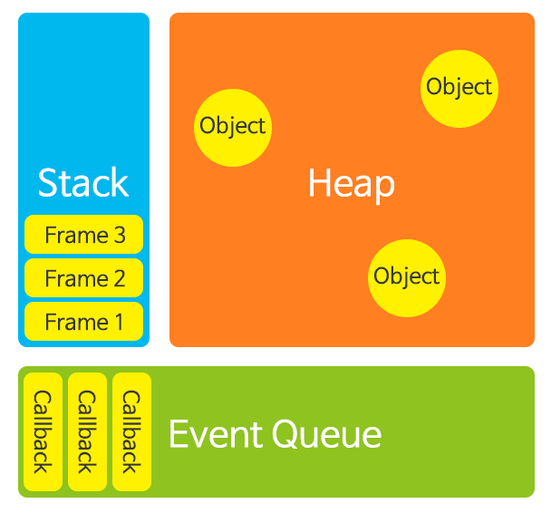
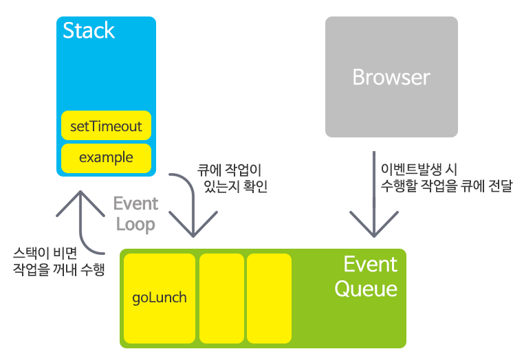
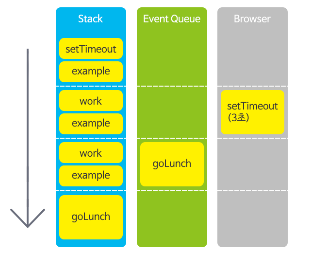

# 자바스크립트의 비동기 처리과정

##### 들어가며

안녕하세요. 티몬에서 이제 1년차가 된 신입 개발자입니다! 그 동안 업무를 하면서 배운 것들이 많은데요, 최근에는 티몬의 상품을 관리하는 운영시스템 화면을 개발하면서 자바스크립트를 많이 알게 되었습니다.
 
안타깝게도 전 자바스크립트를 잘 알지도 못하는 ‘자알못’이었기 때문에 개발하면서 많은 시행착오를 겪었는데요. 특히 기대와 다르게 실행되는 비동기 API 때문에 고생을 했더랬죠. 그래서 이번 포스팅에서는 자바스크립트의 실행 환경에 대해 살펴보고, 이전 글([응답없는 페이지가 되지 않게 하는 법 (feat. setTimeout)](http://tmondev.blog.me/220928561593))에서 살짝 소개된 setTimeout 메소드를 더 자세히 살펴 보면서 비동기 처리 과정에 대해서도 알아보려고 합니다.


##### 싱글 스레드에서의 비동기

 예시코드 

```js
function goLunch(){
	console.log(“식사가시죠~”);
}

function work(){
	// 5초 이상 걸리는 작업 
	for(var i=0; i < 5000000000; i++);
	console.log(“work완료”);
}

function example(){
	var SECOND = 1000;
	setTimeout(goLunch,3*SECOND);
	work ();
		...
}
```

위 코드의 출력 순서는 어떻게 될까요?

 (1) "식사가시죠~" -> "work완료"
(2) "work완료" -> "식사가시죠~"

위 예시코드의 실행 결과는 2번입니다. 메소드 정의대로 라면, 파라미터로 입력한 3초 후에 goLunch 가 실행되어야 하는데 이상합니다. 혹시나 하여 극단적으로 0초를 입력해도 역시 마찬가지입니다.

아마도 위처럼 생각하신 분이 있다면 새로운 스레드를 사용하는 비동기처리 방식을 떠올리신 듯 합니다. 그동안 제 머릿속에도 '비동기처리는 새로운 스레드를 생성하는 것!'으로 생각하고있었기 때문에 싱글스레드 환경인 자바스크립트에서 어떻게 비동기처리가 가능한 것인지 궁금했습니다. 그럼 저와 함께 궁금증에 대한 답을 찬찬히 알아보도록 합시다. 


##### 자바스크립트 실행 환경

우선 자바스크립트 실행 환경에 대해 살펴보도록 하죠. 아래 그림은 자바스크립트의 실행 환경을 나타낸 그림입니다.



다행히 스택과 힙은 자바를 공부하면서도 많이 봤던 그림이라 익숙합니다. 메소드가 호출될 때마다 스택에 프레임이 쌓이고 힙 영역은 객체를 생성할 때 메모리 할당이 일어나는 곳이죠. 자바와 조금 차이가 있다면, 자바스크립트는 싱글 스레드로 동작하기 때문에 단 하나의 스택이 존재할 것입니다.

그럼 이벤트 큐의 역할은 무엇일까요?
이벤트 큐란 이벤트가 발생 했을 때 수행해야 할 콜백 함수를 대기시키는 곳입니다. 이벤트 큐에 대기 중인 콜백은 적절한 때가 됐을 때 처리됩니다. 


##### 이벤트 큐, 이벤트 루프, 브라우저 API

좀 더 구체적인 예를 통해 위와 같은 실행 환경에서 비동기 메소드가 어떻게 실행되는지 살펴보도록 하죠. 다음은 앞서 제시했던 코드를 수행 중인 실행 환경을 나타낸 그림입니다.



 예시코드의 실행 환경 

 실행 중인 메소드 코드는 스택 위에 올려져 실행됩니다. 위 그림은 당연히 setTimeout이 실행되고 있는 순간이죠. setTimeout은 파라미터로 지정된 시간이 지나면 콜백 메소드를 수행시키는 기능을 제공합니다. 지정된 시간 후에 메소드를 수행하려면 누군가는 시간을 재야하는데 그 일은 누가하는 걸까요? 만약 자바스크립트 엔진이 한다면 setTimeout 뒤에 있는 코드는 지정된 시간이 지나야 수행될 수 있으니 비동기처리를 할 수 없습니다. 때문에 다행히 이 작업은 브라우저가 대신 맡아 수행합니다. 코드는 자바스크립트 모습이지만, 자바스크립트 엔진이 아니라 브라우저에 기능을 위임하고 다음 코드를 수행하는 것이죠. 지정된 시간이 지나면 타임아웃 이벤트가 발생해서 이벤트 큐에 콜백이 추가됩니다.

큐에 추가된 콜백은 다음의 반복되는 과정을 통해서 최종적으로 자바스크립트 엔진에 의해 실행됩니다.

(1)  이벤트 큐에 작업이 있는지 확인한다.
(2)  스택이 비었을 때 큐에 있는 작업을 꺼내 수행한다.

위 스텝을 반복하는 과정을 이벤트 루프라고 합니다. 이벤트 루프는 계속 스택과 큐의 상태를 확인하면서 스택이 클리어 될 때마다 큐에 있는 콜백을 하나씩 실행시킵니다. 만약 스택에 작업이 계속 실행 중이라면 이벤트 큐에 계속해서 작업이 대기할 수 밖에 없습니다. 즉, 스택과 이벤트 큐의 상황에 따라 의도한대로 정확한 시간 후에 콜백이 실행되지 않을 수도 있습니다.

다음은 예제 코드의 실행 중 스택과 이벤트 큐, 브라우저 상태를 시간 흐름에 따라 나타낸 것입니다. 



##### 비동기 처리와 동시성

자! 이제는 앞서 봤던 예제 코드가 어떻게 수행 될지 예상할 수 있는 자신감이 생깁니다! goLunch가 3초 후에 이벤트 큐에 추가되고 실행을 기다리고 있지만 이벤트 루프가 work가 종료된 후에야 goLunch를 스택에 올릴 수 있기 때문에 3초가 지나도 “식사가시죠”가 출력되지 않는 것이었습니다.
 
따라서 3초 후에 ‘식사가시죠’를 출력 하려면 work 메소드의 작업을 짧은 시간에 처리할 수 있는 단위로 분할해야 하는 것입니다. 3초 후, 큐에 goLunch가 추가되고 지연 없이 바로 실행 되려면 스택이 비어진 상태여야 하는데, 그러기 위해선 work가 빠르게 처리 될 수 있어야 하기 때문입니다. 이에 대한 자세한 내용은 [이전 글](http://blog.naver.com/tmondev/220928561593)을 참고하시면 훨씬 이해가 잘 되실 것입니다!


##### 마치며…

자바스크립트로 개발하면서 느낀 점은 대부분의 코드가 이벤트를 핸들링 하거나 비동기로 로직을 수행시키는 경우가 빈번하다는 것인데요. 때문에 비동기 처리 과정에 대해 이해하고 있으면 개발뿐만 아니라 버그의 원인을 예상하는 데 조금이나마 도움이 될 수 있습니다. 혹시나 어디선가 내가 이러려고 개발했나 자괴감을 느끼며 디버깅 중인 '자알못'님들에게 조금이나마 도움이 되었으면 좋겠습니다^^