# SCSI Over Net

출처: <https://www.codeproject.com/Articles/1235630/SCSI-Over-Net>


이 기사에서는 네트워크를 통해 내장형 CD-ROM / HDD를 공유하는 방법을 설명합니다.

- [Download source - 22.7 KB](https://www.codeproject.com/KB/IP/1235630/Source.rar)


## Introduction

전통적으로 CD-ROM 드라이브의 장치 스택은 다음과 같습니다.


CD-ROM 클래스 드라이버는 CD-ROM 장치 용 FDO를 관리하며 SCSI 버스 드라이버는 버스 장치 및 해당 하위 용 FDO (CD-ROM 장치 용 PDO)를 관리합니다. CD-ROM 클래스 드라이버는 SCSI 버스 드라이버에 요청을 보내고 하드웨어는 하드웨어와 통신하고 응답을 반환합니다.

네트워크상에서 CD-ROM 장치를 공유하려면 클라이언트와 서버 부분을 고려해야합니다. 서버 측에서는 CD-ROM 클래스 드라이버를 자체 SCSI 서버 드라이버로 대체하므로 장치 스택은 다음과 같습니다.

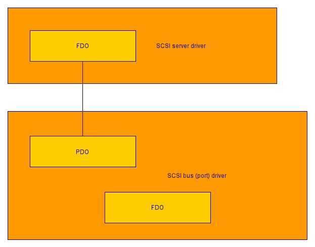

클라이언트 측에서는 SCSI 버스 드라이버를 SCSI 클라이언트 드라이버로 대체 할 것이므로 장치 스택은 다음과 같습니다.

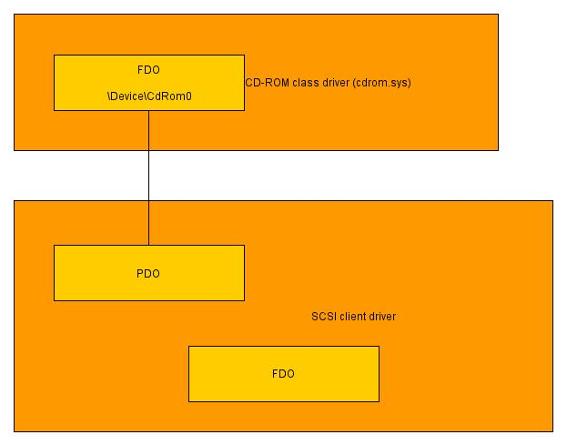

클라이언트 측에서는 CD-ROM 클래스 드라이버로부터 요청을 받고이를 네트워크를 통해 서버 측에 보냅니다. 서버 측에서는 요청을 SCSI 버스 드라이버에 전달하고 응답을 클라이언트에 다시 보냅니다.

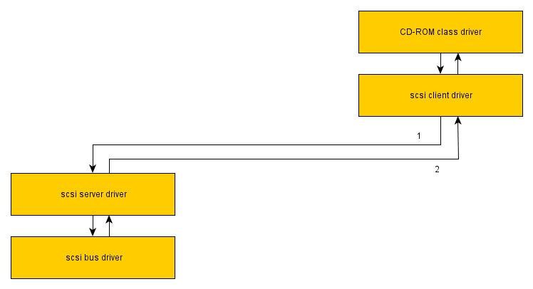


## Background

드라이버를 관리하려면 동일한 디렉토리에있는 드라이버 패키지 -inf 및 sys 파일이 필요합니다. Inf 파일에는 드라이버를 설치할 수있는 장치 설치 클래스 GUID 및 장치 하드웨어 ID가 들어 있습니다.

드라이버를 관리하는 함수는 Difxapi.h에 있습니다. 이 함수에 전달할 수있는 다른 플래그에 대해서는 언급하지 않겠다. DRIVER_PACKAGE_FORCE를 사용했다.

```c
DWORD DriverPackageInstall(
  _In_     PCTSTR            DriverPackageInfPath,
  _In_     DWORD             Flags,
  _In_opt_ PCINSTALLERINFO_W pInstallerInfo,
  _Out_    BOOL              *pNeedReboot
);
```


### `DriverPackageInstall`

- 드라이버가 사전 설치되어 있지 않은 경우 - 드라이버 사전 설치
- inf 파일이 장치의 일부 하드웨어 ID (드라이버가 호환 됨)와 일치하는 경우 -이 장치 용 드라이버를 설치합니다 (장치에 다른 드라이버가 설치된 경우 자동으로 제거됩니다)

```c
DWORD DriverPackagePreinstall(
  _In_ PCTSTR DriverPackageInfPath,
  _In_ DWORD  Flags
);
```


### `DriverPackagePreinstall`

- 드라이버 사전 설치

```c
DWORD DriverPackageUninstall(
  _In_     PCTSTR            DriverPackageInfPath,
  _In_     DWORD             Flags,
  _In_opt_ PCINSTALLERINFO_W pInstallerInfo,
  _Out_    BOOL              *pNeedReboot
);
```


### DriverPackageUninstall

- 드라이버가 일부 장치에 설치되어있는 경우 - 이러한 장치의 드라이버를 제거합니다 (다른 호환 가능한 드라이버가 사전 설치되어있는 경우 장치에 대해 자동으로 설치됨)
- 드라이버 설치 제거

드라이버를 사전 설치하면 경고 대화 상자가 표시되고 드라이버 파일이 드라이버 저장소에 복사됩니다.

드라이버를 삭제하면 시스템이 드라이버 저장소에서 드라이버 파일을 삭제합니다.

드라이버를 설치하면 드라이버 파일이 아직 복사되지 않은 경우 system directories에 시스템 파일이 복사됩니다.

경고 대화 상자는 다음과 같습니다.

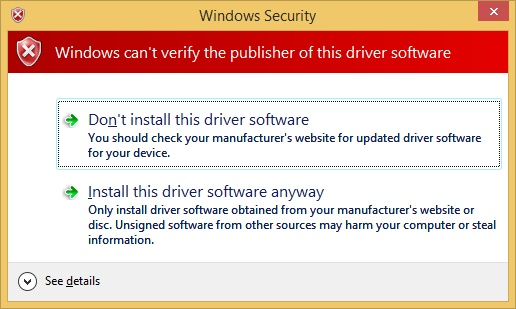

드라이버를 관리하는 다른 기능은 Newdev.h에 있습니다. 이러한 기능을 사용하여 특정 장치별로 드라이버를 관리 할 수 있습니다. DiInstallDevice 함수를 사용합니다 :

```c
BOOL DiInstallDevice(
  _In_opt_  HWND             hwndParent,
  _In_      HDEVINFO         DeviceInfoSet,
  _In_      PSP_DEVINFO_DATA DeviceInfoData,
  _In_opt_  PSP_DRVINFO_DATA DriverInfoData,
  _In_      DWORD            Flags,
  _Out_opt_ PBOOL            NeedReboot
);
```


### DiInstallDevice

- 지정된 장치의 드라이버를 설치하십시오 (드라이버는 이미 사전 설치되어 있음). 이전 드라이버 (있는 경우)가 제거됩니다.


## Using the Code

 테스트 목적으로 서버 및 클라이언트와 동일한 가상 시스템을 사용합니다.

### 1. inf 파일에 대한 간략한 설명 

Server side:
*Inf* file name = *scsiserver.inf*
Device setup class = `CDROM`
Device hardware id = `GenCdRom`
Device description = SCSI Server

Client side:
*Inf* file name = *scsiclient.inf*
Device setup class = `HDC`
Device hardware id = `VirtualSCSIBus`
Device description = SCSI Client


### 2. 프로그램 설치 프로세스 

서버 측에서 서버 드라이버를 사전 설치해야합니다.

```c
#include <Windows.h>
#include <Difxapi.h>
#include <stdio.h>

#pragma comment(lib, "Difxapi.lib")

int main(int argc, char* argv[])
{
    DWORD dw;

    // preinstall driver
    dw = DriverPackagePreinstallW(L"C:\\scsiserver.inf", DRIVER_PACKAGE_FORCE);

    if (dw == ERROR_SUCCESS) wprintf(L"Success\n");
    else wprintf(L"Failure\n");

    getchar();
    return 0;
}
```

클라이언트 측에서는 루트 열거 형 장치를 추가하고 클라이언트 드라이버를 미리 설치하고 생성 된 장치 용 클라이언트 드라이버를 설치해야합니다.

```c
#include <Windows.h>
#include <Devguid.h>
#include <Setupapi.h>
#include <Difxapi.h>
#include <stdio.h>

#pragma comment(lib, "Setupapi.lib")
#pragma comment(lib, "Difxapi.lib")

BOOL AddDevice(WCHAR *pHardwareId)
{
    BOOL b, bSuccess;
    HDEVINFO hDevInfo;
    SP_DEVINFO_DATA DevInfoData;

    bSuccess = FALSE;

    hDevInfo = SetupDiCreateDeviceInfoList(&GUID_DEVCLASS_UNKNOWN, NULL);

    if (hDevInfo != INVALID_HANDLE_VALUE)
    {
        DevInfoData.cbSize = sizeof(DevInfoData);

        b = SetupDiCreateDeviceInfoW(hDevInfo, pHardwareId,
            &GUID_DEVCLASS_UNKNOWN, NULL, NULL, DICD_GENERATE_ID, &DevInfoData);

        if (b)
        {
            b = SetupDiSetDeviceRegistryPropertyW(hDevInfo, &DevInfoData, SPDRP_HARDWAREID,
                (BYTE*)pHardwareId, (wcslen(pHardwareId) + 1) * sizeof(WCHAR));

            if (b)
            {
                b = SetupDiCallClassInstaller(DIF_REGISTERDEVICE, hDevInfo, &DevInfoData);

                if (b) bSuccess = TRUE;
            }
        }

        SetupDiDestroyDeviceInfoList(hDevInfo);
    }

    return bSuccess;
}

int main(int argc, char* argv[])
{
    DWORD dw;
    BOOL b, bRebootRequired;

    // add root-enumerated device with Unknown setup class
    b = AddDevice(L"VirtualSCSIBus");

    if (b)
    {
        // preinstall and install driver (root-enumerated device setup class
        // will be ajusted according to driver)
        dw = DriverPackageInstallW(L"C:\\scsiclient.inf", DRIVER_PACKAGE_FORCE,
             NULL, &bRebootRequired);

        if (dw == ERROR_SUCCESS)
        {
            wprintf(L"Success\n");

            if (bRebootRequired) wprintf(L"Reboot required\n");
        }
        else wprintf(L"Failure\n");
    }
    else wprintf(L"Failure\n");

    getchar();
    return 0;
}
```


### 3. 프로그램 제거 프로세스

서버 측에서 서버 드라이버를 삭제해야합니다.

```c
#include <Windows.h>
#include <Difxapi.h>
#include <stdio.h>

#pragma comment(lib, "Difxapi.lib")

int main(int argc, char* argv[])
{
    DWORD dw;
    BOOL bRebootRequired;

    // deinstall driver
    dw = DriverPackageUninstallW(L"C:\\scsiserver.inf", DRIVER_PACKAGE_FORCE,
         NULL, &bRebootRequired);

    if (dw == ERROR_SUCCESS)
    {
        wprintf(L"Success\n");

        if (bRebootRequired) wprintf(L"Reboot required\n");
    }
    else wprintf(L"Failure\n");

    getchar();
    return 0;
}
```

클라이언트 측에서는 루트 열거 형 장치 용 클라이언트 드라이버를 제거하고 클라이언트 드라이버를 제거하고 루트 열거 형 장치를 제거해야합니다.

```c
#include <Windows.h>
#include <Setupapi.h>
#include <Difxapi.h>
#define INITGUID
#include <Devpkey.h>
#include <stdio.h>

#pragma comment(lib, "Setupapi.lib")
#pragma comment(lib, "Difxapi.lib")

BOOL RemoveDevice(WCHAR *pHardwareId)
{
    BOOL b, bSuccess;
    HDEVINFO hDevInfo;
    SP_DEVINFO_DATA DevInfoData;
    WCHAR PropertyBuffer[1000];
    SP_REMOVEDEVICE_PARAMS params;
    DWORD PropertyDataType, Index;
    GUID ClassGuid;

    bSuccess = FALSE;

    hDevInfo = SetupDiGetClassDevsW(NULL, NULL, NULL, DIGCF_ALLCLASSES | DIGCF_PRESENT);

    if (hDevInfo != INVALID_HANDLE_VALUE)
    {
        Index = 0;
        DevInfoData.cbSize = sizeof(DevInfoData);

        while (SetupDiEnumDeviceInfo(hDevInfo, Index, &DevInfoData))
        {
            if ((!SetupDiGetDevicePropertyW(hDevInfo, &DevInfoData, 
                 &DEVPKEY_Device_Class, &PropertyDataType, (PBYTE)&ClassGuid,
                sizeof(GUID), NULL, 0)) || (PropertyDataType != DEVPROP_TYPE_GUID))
            {
                if (GetLastError() == ERROR_NOT_FOUND)
                {
                    /* device has Unknown setup class */

                    b = SetupDiGetDeviceRegistryPropertyW(hDevInfo, &DevInfoData, 
                        SPDRP_HARDWAREID, &PropertyDataType, (BYTE*)PropertyBuffer, 
                        sizeof(PropertyBuffer), NULL);

                    if (b)
                    {
                        if (!wcscmp(PropertyBuffer, pHardwareId))
                        {
                            params.ClassInstallHeader.cbSize = sizeof
                                                 (SP_CLASSINSTALL_HEADER);
                            params.ClassInstallHeader.InstallFunction = DIF_REMOVE;
                            params.Scope = DICS_FLAG_GLOBAL;

                            b = SetupDiSetClassInstallParamsW(hDevInfo, &DevInfoData, 
                                      &params.ClassInstallHeader, sizeof(params));

                            if (b)
                            {
                                b = SetupDiCallClassInstaller
                                    (DIF_REMOVE, hDevInfo, &DevInfoData);

                                if (b) bSuccess = TRUE;
                            }

                            break;
                        }
                    }
                }
            }

            ++Index;
        }

        SetupDiDestroyDeviceInfoList(hDevInfo);
    }

    return bSuccess;
}

int main(int argc, char* argv[])
{
    DWORD dw;
    BOOL b, bRebootRequired;

    // uninstall (root-enumerated device setup class will be ajusted back to Unknown) 
    // and deinstall driver
    dw = DriverPackageUninstallW(L"C:\\scsiclient.inf", 
                      DRIVER_PACKAGE_FORCE, NULL, &bRebootRequired);

    if (dw == ERROR_SUCCESS)
    {
        // remove root-enumerated device with Unknown setup class
        b = RemoveDevice(L"VirtualSCSIBus");

        if (b) wprintf(L"Success\n");
        else wprintf(L"Failure\n");

        if (bRebootRequired) wprintf(L"Reboot required\n");
    }
    else wprintf(L"Failure\n");

    getchar();
    return 0;
}
```


### 4. 프로그램 운영 과정

각면에는 {드라이버 및 사용자 모드 프로그램} 쌍이 있습니다. 양쪽 측면에서 사용자 모드 프로그램을 실행하고 '연결'명령을 입력해야합니다. 일단 우리가 연결되면 서버 측에서 'List'명령을 입력하여 사용 가능한 CD-ROM 장치 (하드웨어 ID)를 봅니다. 다음으로, '공유'명령 다음에 하드웨어 ID를 입력하여 공유 프로세스를 시작합니다. 서버 측에서는 CD-ROM 장치가 탐색기에서 사라지고 클라이언트 측에 표시됩니다.

Client side:

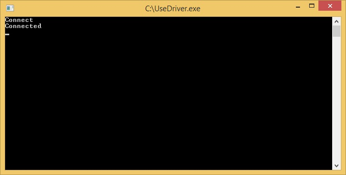

Server side:

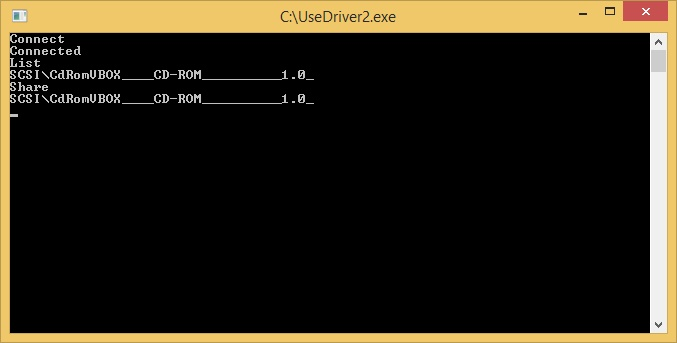


장치 공유를 중지하려면 서버 쪽에서 '공유 취소'명령을 입력하거나 클라이언트 쪽에서 연결을 끊어야합니다. 클라이언트 측에서 CD-ROM 장치가 사라지고 서버 측에서 다시 가져옵니다.

Client side:

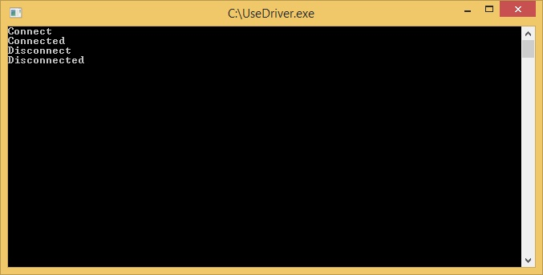

Server side:

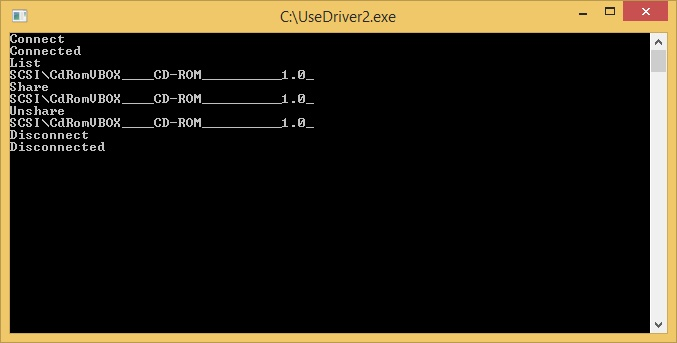

Windows 소켓은 네트워크를 통해 데이터를 전송하는 데 사용됩니다. 사용자 모드 코드는 다음과 같이 설계됩니다.

1. '**User thread**'-이 스레드는 사용자 명령 (사용자 명령 대기)
2. '**Receive thread'**-이 스레드는 전체 요청 및 장치 태그의 길이를 포함하는 REQUEST_HEADER 구조체를 recv에 맡깁니다 (요청 된 공유 장치가 어떤 것인지를 알 수 있고 다음에 recv 할 바이트 수를 알 수 있습니다)
3. '**Device thread**'- 각 공유 장치에는 요청, recv 요청 (REQUEST_HEADER 구조체 저장, '수신 스레드'에서 가져옴)을 보내고 루프의 드라이버와 상호 작용하는 자체 스레드가 있습니다.

'**Receive thread**'의 필요성은 TCP / IP의 특성에서 발생합니다. 우리가 네트워크를 통해 데이터를 전송할 때, 바이트 순서는 다른면에서 동일하게 보장됩니다. 그러나, 다른 thread (A와 B)로부터 동시에 데이터를 송신하는 경우, 버퍼 A가 버퍼 B보다 전에 송신되는 것은 보증되지 않습니다. 또한 데이터를 recv 할 때 예상 할 바이트 수를 알 수 없으므로 버퍼 크기를 제공 할 수 있습니다. 한쪽에 여러 개의 샌드가 있으면 다른쪽에 여러 개의 recv가 발생할 수 있습니다. 이 문제를 해결하기 위해 REQUEST_HEADER를 먼저 호출 한 다음 적절한 '장치 스레드'에 정보를 전달하고 나머지 데이터를 recv하도록 허용합니다.

서버 측 코드 (잘림) :

```c
#define IOCTL_GET_PNP_INFO               CTL_CODE(FILE_DEVICE_CONTROLLER, 
                                         0, METHOD_BUFFERED, FILE_ANY_ACCESS)
#define IOCTL_EXECUTE_REQUEST            CTL_CODE(FILE_DEVICE_CONTROLLER, 
                                         1, METHOD_OUT_DIRECT, FILE_ANY_ACCESS)

#define BUFFER_SIZE                      40 * 4096

#define OP_PLUGIN                        1
#define OP_PLUGOUT                       2
#define OP_REQUEST                       3

struct REQUEST_HEADER
{
    ULONG Id;
    ULONG Op;
    ULONG Irp[2];
    ULONG Length;
    ULONG MajorFunction;
    ULONG MinorFunction;
    ULONG IoControlCode;
    ULONG InputBufferLength;
    ULONG OutputBufferLength;
    NTSTATUS Status;
    ULONG Information;
};

struct DEVICE_CONTEXT
{
    LIST_ENTRY ListEntry;
    ULONG Id;
    HANDLE hThread;
    HANDLE hReceiveBeginEvent;
    HANDLE hReceiveEndEvent;
    REQUEST_HEADER* pHeader;
    REQUEST_HEADER* pBuffer;
    SOCKET Socket;
    BOOL End;
    WCHAR* pHardwareId;
};

struct RECEIVE_CONTEXT
{
    HANDLE hThread;
    SOCKET Socket;
    LIST_ENTRY DeviceList;
    CRITICAL_SECTION Section;
    REQUEST_HEADER Header;
    ULONG Id;
};

BOOL Send(DEVICE_CONTEXT *pDevContext)
{
    int iResult;

    iResult = send(pDevContext->Socket, 
    (CHAR*)pDevContext->pBuffer, pDevContext->pBuffer->Length, 0);

    return (iResult > 0);
}

BOOL Receive(RECEIVE_CONTEXT *pRecvContext)
{
    int iResult;

    iResult = recv(pRecvContext->Socket, 
    (CHAR*)&pRecvContext->Header, sizeof(REQUEST_HEADER), 0);

    return (iResult > 0);
}

BOOL Receive(DEVICE_CONTEXT *pDevContext)
{
    int iResult;
    ULONG Length;

    WaitForSingleObject(pDevContext->hReceiveBeginEvent, INFINITE);

    memcpy(pDevContext->pBuffer, pDevContext->pHeader, sizeof(REQUEST_HEADER));

    Length = pDevContext->pHeader->Length - sizeof(REQUEST_HEADER);

    if (Length) iResult = recv(pDevContext->Socket, 
    (CHAR*)((UCHAR*)pDevContext->pBuffer + sizeof(REQUEST_HEADER)), Length, 0);
    else iResult = 1;

    SetEvent(pDevContext->hReceiveEndEvent);

    return (iResult > 0);
}

void UnlockDeviceContext(RECEIVE_CONTEXT *pRecvContext, DEVICE_CONTEXT *pDevContext)
{
    pDevContext->pHeader = &pRecvContext->Header;

    SetEvent(pDevContext->hReceiveBeginEvent);

    WaitForSingleObject(pDevContext->hReceiveEndEvent, INFINITE);
}

void DeleteDeviceContext(DEVICE_CONTEXT *pDevContext)
{
    CloseHandle(pDevContext->hReceiveBeginEvent);

    CloseHandle(pDevContext->hReceiveEndEvent);

    CloseHandle(pDevContext->hThread);

    delete[] pDevContext->pHardwareId;

    delete[] (UCHAR*)pDevContext->pBuffer;

    delete pDevContext;
}

DEVICE_CONTEXT* CreateDeviceContext
(PTHREAD_START_ROUTINE StartRoutine, ULONG Id, SOCKET Socket, WCHAR *pHardwareId)
{
    DEVICE_CONTEXT *pDevContext;

    pDevContext = new DEVICE_CONTEXT;

    pDevContext->pBuffer = (REQUEST_HEADER*)new UCHAR[BUFFER_SIZE];

    pDevContext->hThread = CreateThread(NULL, 0, StartRoutine, 
                           pDevContext, CREATE_SUSPENDED, NULL);

    pDevContext->hReceiveBeginEvent = CreateEventW(NULL, FALSE, FALSE, NULL);

    pDevContext->hReceiveEndEvent = CreateEventW(NULL, FALSE, FALSE, NULL);

    pDevContext->Id = Id;
    pDevContext->Socket = Socket;
    pDevContext->End = FALSE;

    pDevContext->pHardwareId = new WCHAR[wcslen(pHardwareId) + 1];
    wcscpy(pDevContext->pHardwareId, pHardwareId);

    return pDevContext;
}

DWORD WINAPI DeviceThread(PVOID Parameter)
{
    HANDLE Handle;
    WCHAR *pDevicePath;
    OVERLAPPED Overlapped;
    DEVICE_CONTEXT *pDevContext;
    WCHAR *pDriverDescription;
    BOOL bNeedReboot;
    DWORD Bytes;

    pDevContext = (DEVICE_CONTEXT*)Parameter;

    pDriverDescription = GetInstalledDriver((GUID*)&GUID_DEVCLASS_CDROM, 
                         pDevContext->pHardwareId);

    InstallDriver((GUID*)&GUID_DEVCLASS_CDROM, 
    pDevContext->pHardwareId, L"SCSI Server", &bNeedReboot);

    Sleep(5000);        // we need to wait, otherwise it will not work properly

    pDevicePath = GetDevicePath(&g_ClassGuid, pDevContext->pHardwareId);

    Handle = CreateFileW(pDevicePath, GENERIC_READ | GENERIC_WRITE, 
    FILE_SHARE_READ | FILE_SHARE_WRITE | FILE_SHARE_DELETE, NULL, OPEN_EXISTING, 
    FILE_ATTRIBUTE_NORMAL | FILE_FLAG_OVERLAPPED, NULL);

    DeviceIoControl(Handle, IOCTL_GET_PNP_INFO, NULL, 0, 
                    pDevContext->pBuffer, BUFFER_SIZE, NULL, NULL);

    pDevContext->pBuffer->Op = OP_PLUGIN;
    pDevContext->pBuffer->Id = pDevContext->Id;

    if (Send(pDevContext))
    {
        while (Receive(pDevContext))
        {
            if (pDevContext->pBuffer->Op == OP_PLUGOUT)
            {
                break;
            }
            else if (pDevContext->pBuffer->Op == OP_REQUEST)
            {
                if (pDevContext->End)
                {
                    pDevContext->pBuffer->Op = OP_PLUGOUT;
                    pDevContext->pBuffer->Length = sizeof(REQUEST_HEADER);

                    Send(pDevContext);
                    break;
                }
                else
                {
                    memset(&Overlapped, 0, sizeof(OVERLAPPED));

                    if (!DeviceIoControl(Handle, IOCTL_EXECUTE_REQUEST, NULL, 0, 
                    pDevContext->pBuffer, BUFFER_SIZE, NULL, &Overlapped))
                    {
                        /* ERROR_IO_PENDING */
                        GetOverlappedResultEx(Handle, &Overlapped, &Bytes, 3000, FALSE);
                    }

                    if (!Send(pDevContext)) break;
                }
            }
            else DbgRaiseAssertionFailure();
        }
    }

    CloseHandle(Handle);

    delete[] pDevicePath;

    Sleep(5000);        // we need to wait, otherwise it will not work properly

    InstallDriver((GUID*)&GUID_DEVCLASS_CDROM, 
    pDevContext->pHardwareId, pDriverDescription, &bNeedReboot);

    delete[] pDriverDescription;

    return 0;
}

DWORD WINAPI ReceiveThread(PVOID Parameter)
{
    DEVICE_CONTEXT *pDevContext;
    RECEIVE_CONTEXT *pRecvContext;

    pRecvContext = (RECEIVE_CONTEXT*)Parameter;

    while (Receive(pRecvContext))
    {
        pDevContext = FindDeviceContextById(pRecvContext, pRecvContext->Header.Id);

        if (pDevContext) UnlockDeviceContext(pRecvContext, pDevContext);
        else DbgRaiseAssertionFailure();
    }

    return 0;
}

DEVICE_CONTEXT* AddDeviceContext(RECEIVE_CONTEXT *pRecvContext, WCHAR *pHardwareId)
{
    DEVICE_CONTEXT *pDevContext;

    pDevContext = CreateDeviceContext(DeviceThread, 
    pRecvContext->Id++, pRecvContext->Socket, pHardwareId);

    EnterCriticalSection(&pRecvContext->Section);

    InsertToList(&pRecvContext->DeviceList, (LIST_ENTRY*)pDevContext);

    LeaveCriticalSection(&pRecvContext->Section);

    ResumeThread(pDevContext->hThread);

    return pDevContext;
}

void RemoveDeviceContext(RECEIVE_CONTEXT *pRecvContext, DEVICE_CONTEXT *pDevContext)
{
    EnterCriticalSection(&pRecvContext->Section);

    RemoveFromList((LIST_ENTRY*)pDevContext);

    LeaveCriticalSection(&pRecvContext->Section);

    DeleteDeviceContext(pDevContext);
}

RECEIVE_CONTEXT* CreateReceiveContext(SOCKET ServerSocket)
{
    RECEIVE_CONTEXT *pRecvContext;

    pRecvContext = new RECEIVE_CONTEXT;

    InitializeCriticalSection(&pRecvContext->Section);

    InitializeList(&pRecvContext->DeviceList);

    pRecvContext->Id = 0;
    pRecvContext->Socket = Accept(ServerSocket);

    pRecvContext->hThread = 
    CreateThread(NULL, 0, ReceiveThread, (PVOID)pRecvContext, CREATE_SUSPENDED, NULL);

    return pRecvContext;
}

void DeleteReceiveContext(RECEIVE_CONTEXT* pRecvContext)
{
    DEVICE_CONTEXT *pDevContext;

    while (pDevContext = GetFirstDeviceContext(pRecvContext))
    {
        pDevContext->End = TRUE;
        WaitForSingleObject(pDevContext->hThread, INFINITE);

        RemoveDeviceContext(pRecvContext, pDevContext);
    }

    Close(pRecvContext->Socket);

    WaitForSingleObject(pRecvContext->hThread, INFINITE);

    CloseHandle(pRecvContext->hThread);

    DeleteCriticalSection(&pRecvContext->Section);

    delete pRecvContext;
}

int main(int argc, char* argv[])
{
    WCHAR Command[200];
    SOCKET ServerSocket;
    RECEIVE_CONTEXT* pRecvContext;
    DEVICE_CONTEXT *pDevContext;

    ServerSocket = CreateServerSocket();
    pRecvContext = NULL;

    while (TRUE)
    {
        wscanf(L"%s", Command);

        if (!wcscmp(Command, L"Connect"))
        {
            if (!pRecvContext)
            {
                pRecvContext = CreateReceiveContext(ServerSocket);
                ResumeThread(pRecvContext->hThread);

                wprintf(L"Connected\n");
            }
        }
        else if (!wcscmp(Command, L"Disconnect"))
        {
            if (pRecvContext)
            {
                DeleteReceiveContext(pRecvContext);
                pRecvContext = NULL;

                wprintf(L"Disconnected\n");
            }
        }
        else if (!wcscmp(Command, L"List"))
        {
            PrintDevices();
        }
        else if (!wcscmp(Command, L"Exit"))
        {
            if (pRecvContext) DeleteReceiveContext(pRecvContext);

            break;
        }
        else if (!wcscmp(Command, L"Share"))
        {
            wscanf(L"%s", Command);

            AddDeviceContext(pRecvContext, Command);
        }
        else if (!wcscmp(Command, L"Unshare"))
        {
            wscanf(L"%s", Command);

            pDevContext = FindDeviceContextByHardwareId(pRecvContext, Command);

            if (pDevContext)
            {
                pDevContext->End = TRUE;
                WaitForSingleObject(pDevContext->hThread, INFINITE);

                RemoveDeviceContext(pRecvContext, pDevContext);
            }
        }
        else
        {
            wprintf(L"Unknown command\n");
        }
    }

    DeleteServerSocket(ServerSocket);

    return 0;
}
```


클라이언트 측 코드 (잘림) :

```c
#define IOCTL_PLUGIN_DEVICE    CTL_CODE(FILE_DEVICE_CONTROLLER, 0, 
                               METHOD_BUFFERED, FILE_ANY_ACCESS)
#define IOCTL_PLUGOUT_DEVICE   CTL_CODE(FILE_DEVICE_CONTROLLER, 1, 
                               METHOD_BUFFERED, FILE_ANY_ACCESS)
#define IOCTL_FETCH_REQUEST    CTL_CODE(FILE_DEVICE_CONTROLLER, 2, 
                               METHOD_OUT_DIRECT, FILE_ANY_ACCESS)
#define IOCTL_COMPLETE_REQUEST CTL_CODE(FILE_DEVICE_CONTROLLER, 3, 
                               METHOD_IN_DIRECT, FILE_ANY_ACCESS)

#define BUFFER_SIZE                    40 * 4096

#define OP_PLUGIN                      1
#define OP_PLUGOUT                     2
#define OP_REQUEST                     3

struct REQUEST_HEADER
{
    ULONG Id;
    ULONG Op;
    ULONG Irp[2];
    ULONG Length;
    ULONG MajorFunction;
    ULONG MinorFunction;
    ULONG IoControlCode;
    ULONG InputBufferLength;
    ULONG OutputBufferLength;
    NTSTATUS Status;
    ULONG Information;
};

struct DEVICE_CONTEXT
{
    LIST_ENTRY ListEntry;
    ULONG Id;
    HANDLE hThread;
    HANDLE hReceiveBeginEvent;
    HANDLE hReceiveEndEvent;
    REQUEST_HEADER* pHeader;
    REQUEST_HEADER* pBuffer;
    SOCKET Socket;
    BOOL End;
};

struct RECEIVE_CONTEXT
{
    HANDLE hThread;
    SOCKET Socket;
    LIST_ENTRY DeviceList;
    CRITICAL_SECTION Section;
    REQUEST_HEADER Header;
};

void UnlockDeviceContext(RECEIVE_CONTEXT *pRecvContext, DEVICE_CONTEXT *pDevContext)
{
    pDevContext->pHeader = &pRecvContext->Header;

    SetEvent(pDevContext->hReceiveBeginEvent);

    WaitForSingleObject(pDevContext->hReceiveEndEvent, INFINITE);
}

void DeleteDeviceContext(DEVICE_CONTEXT *pDevContext)
{
    CloseHandle(pDevContext->hReceiveBeginEvent);

    CloseHandle(pDevContext->hReceiveEndEvent);

    CloseHandle(pDevContext->hThread);

    delete[] (UCHAR*)pDevContext->pBuffer;

    delete pDevContext;
}

DEVICE_CONTEXT* CreateDeviceContext
(PTHREAD_START_ROUTINE StartRoutine, ULONG Id, SOCKET Socket)
{
    DEVICE_CONTEXT *pDevContext;

    pDevContext = new DEVICE_CONTEXT;

    pDevContext->pBuffer = (REQUEST_HEADER*)new UCHAR[BUFFER_SIZE];

    pDevContext->hThread = CreateThread(NULL, 0, StartRoutine, pDevContext, CREATE_SUSPENDED, NULL);

    pDevContext->hReceiveBeginEvent = CreateEventW(NULL, FALSE, FALSE, NULL);

    pDevContext->hReceiveEndEvent = CreateEventW(NULL, FALSE, FALSE, NULL);

    pDevContext->Id = Id;
    pDevContext->Socket = Socket;
    pDevContext->End = FALSE;

    return pDevContext;
}

BOOL Send(DEVICE_CONTEXT *pDevContext)
{
    int iResult;

    iResult = send(pDevContext->Socket, 
    (CHAR*)pDevContext->pBuffer, pDevContext->pBuffer->Length, 0);

    return (iResult > 0);
}

BOOL Receive(DEVICE_CONTEXT *pDevContext)
{
    int iResult;
    ULONG Length;

    WaitForSingleObject(pDevContext->hReceiveBeginEvent, INFINITE);

    memcpy(pDevContext->pBuffer, pDevContext->pHeader, sizeof(REQUEST_HEADER));

    Length = pDevContext->pHeader->Length - sizeof(REQUEST_HEADER);

    if (Length) iResult = recv(pDevContext->Socket, 
    (CHAR*)((UCHAR*)pDevContext->pBuffer + sizeof(REQUEST_HEADER)), Length, 0);
    else iResult = 1;

    SetEvent(pDevContext->hReceiveEndEvent);

    return (iResult > 0);
}

BOOL Receive(RECEIVE_CONTEXT *pRecvContext)
{
    int iResult;

    iResult = recv(pRecvContext->Socket, 
    (CHAR*)&pRecvContext->Header, sizeof(REQUEST_HEADER), 0);

    return (iResult > 0);
}

DWORD WINAPI DeviceThread(PVOID Parameter)
{
    HANDLE Handle;
    WCHAR *pDevicePath;
    OVERLAPPED Overlapped;
    DEVICE_CONTEXT *pDevContext;
    DWORD Bytes;

    pDevContext = (DEVICE_CONTEXT*)Parameter;

    pDevicePath = GetDevicePath(&g_ClassGuid, L"VirtualSCSIBus");

    Handle = CreateFileW(pDevicePath, GENERIC_READ | GENERIC_WRITE, 
    FILE_SHARE_READ | FILE_SHARE_WRITE | FILE_SHARE_DELETE, NULL, 
    OPEN_EXISTING, FILE_ATTRIBUTE_NORMAL | FILE_FLAG_OVERLAPPED, NULL);

    if (Receive(pDevContext))
    {
        if (pDevContext->pBuffer->Op == OP_PLUGIN)
        {
            DeviceIoControl(Handle, IOCTL_PLUGIN_DEVICE, 
            pDevContext->pBuffer, pDevContext->pBuffer->Length, NULL, 0, NULL, NULL);

            memset(&Overlapped, 0, sizeof(OVERLAPPED));

            if (!DeviceIoControl(Handle, IOCTL_FETCH_REQUEST, NULL, 0, 
            pDevContext->pBuffer, BUFFER_SIZE, NULL, &Overlapped))
            {
                /* ERROR_IO_PENDING */
                GetOverlappedResultEx(Handle, &Overlapped, &Bytes, 3000, FALSE);
            }

            pDevContext->pBuffer->Op = OP_REQUEST;

            if (Send(pDevContext))
            {
                while (Receive(pDevContext))
                {
                    if (pDevContext->pBuffer->Op == OP_PLUGOUT)
                    {
                        break;
                    }
                    else if (pDevContext->pBuffer->Op == OP_REQUEST)
                    {
                        if (pDevContext->End)
                        {
                            pDevContext->pBuffer->Op = OP_PLUGOUT;
                            pDevContext->pBuffer->Length = sizeof(REQUEST_HEADER);

                            Send(pDevContext);
                            break;
                        }
                        else
                        {
                            DeviceIoControl(Handle, IOCTL_COMPLETE_REQUEST, 
                            pDevContext->pBuffer, pDevContext->pBuffer->Length, NULL, 0, NULL, NULL);

                            memset(&Overlapped, 0, sizeof(OVERLAPPED));

                            if (!DeviceIoControl(Handle, IOCTL_FETCH_REQUEST, 
                            NULL, 0, pDevContext->pBuffer, BUFFER_SIZE, NULL, &Overlapped))
                            {
                                /* ERROR_IO_PENDING */
                                GetOverlappedResultEx(Handle, &Overlapped, &Bytes, 3000, FALSE);
                            }

                            if (!Send(pDevContext)) break;
                        }
                    }
                    else DbgRaiseAssertionFailure();
                }
            }

            DeviceIoControl(Handle, IOCTL_PLUGOUT_DEVICE, NULL, 0, NULL, 0, NULL, NULL);
        }
        else DbgRaiseAssertionFailure();
    }

    CloseHandle(Handle);

    delete[] pDevicePath;

    return 0;
}

DEVICE_CONTEXT* AddDeviceContext(RECEIVE_CONTEXT *pRecvContext, ULONG Id)
{
    DEVICE_CONTEXT *pDevContext;

    pDevContext = CreateDeviceContext(DeviceThread, Id, pRecvContext->Socket);

    EnterCriticalSection(&pRecvContext->Section);

    InsertToList(&pRecvContext->DeviceList, (LIST_ENTRY*)pDevContext);

    LeaveCriticalSection(&pRecvContext->Section);

    ResumeThread(pDevContext->hThread);

    return pDevContext;
}

void RemoveDeviceContext(RECEIVE_CONTEXT *pRecvContext, DEVICE_CONTEXT *pDevContext)
{
    EnterCriticalSection(&pRecvContext->Section);

    RemoveFromList((LIST_ENTRY*)pDevContext);

    LeaveCriticalSection(&pRecvContext->Section);

    DeleteDeviceContext(pDevContext);
}

DWORD WINAPI ReceiveThread(PVOID Parameter)
{
    DEVICE_CONTEXT *pDevContext;
    RECEIVE_CONTEXT *pRecvContext;

    pRecvContext = (RECEIVE_CONTEXT*)Parameter;

    while (Receive(pRecvContext))
    {
        switch (pRecvContext->Header.Op)
        {
        case OP_PLUGIN:
            pDevContext = AddDeviceContext(pRecvContext, pRecvContext->Header.Id);

            UnlockDeviceContext(pRecvContext, pDevContext);
            break;
        case OP_PLUGOUT:
            pDevContext = FindDeviceContextById(pRecvContext, pRecvContext->Header.Id);

            if (pDevContext)
            {
                UnlockDeviceContext(pRecvContext, pDevContext);

                WaitForSingleObject(pDevContext->hThread, INFINITE);

                RemoveDeviceContext(pRecvContext, pDevContext);
            }
            else DbgRaiseAssertionFailure();

            break;
        case OP_REQUEST:
            pDevContext = FindDeviceContextById(pRecvContext, pRecvContext->Header.Id);

            if (pDevContext) UnlockDeviceContext(pRecvContext, pDevContext);
            else DbgRaiseAssertionFailure();

            break;
        default:
            DbgRaiseAssertionFailure();
        }
    }

    return 0;
}

RECEIVE_CONTEXT* CreateReceiveContext()
{
    RECEIVE_CONTEXT *pRecvContext;

    pRecvContext = new RECEIVE_CONTEXT;

    InitializeCriticalSection(&pRecvContext->Section);

    InitializeList(&pRecvContext->DeviceList);

    pRecvContext->Socket = Connect();

    pRecvContext->hThread = 
    CreateThread(NULL, 0, ReceiveThread, (PVOID)pRecvContext, CREATE_SUSPENDED, NULL);

    return pRecvContext;
}

void DeleteReceiveContext(RECEIVE_CONTEXT* pRecvContext)
{
    DEVICE_CONTEXT *pDevContext;

    while (pDevContext = GetFirstDeviceContext(pRecvContext))
    {
        pDevContext->End = TRUE;
        WaitForSingleObject(pDevContext->hThread, INFINITE);

        RemoveDeviceContext(pRecvContext, pDevContext);
    }

    Disconnect(pRecvContext->Socket);

    WaitForSingleObject(pRecvContext->hThread, INFINITE);

    CloseHandle(pRecvContext->hThread);

    DeleteCriticalSection(&pRecvContext->Section);

    delete pRecvContext;
}

int main(int argc, char* argv[])
{
    WCHAR Command[200];
    RECEIVE_CONTEXT* pRecvContext;

    pRecvContext = NULL;

    while (TRUE)
    {
        wscanf(L"%s", Command);

        if (!wcscmp(Command, L"Connect"))
        {
            if (!pRecvContext)
            {
                pRecvContext = CreateReceiveContext();
                ResumeThread(pRecvContext->hThread);

                wprintf(L"Connected\n");
            }
        }
        else if (!wcscmp(Command, L"Disconnect"))
        {
            if (pRecvContext)
            {
                DeleteReceiveContext(pRecvContext);
                pRecvContext = NULL;

                wprintf(L"Disconnected\n");
            }
        }
        else if (!wcscmp(Command, L"Exit"))
        {
            if (pRecvContext) DeleteReceiveContext(pRecvContext);

            break;
        }
        else
        {
            wprintf(L"Unknown command\n");
        }
    }

    return 0;
}
```

이제 커널 모드 부분을 살펴 보겠습니다. 디버깅을 위해 게스트 OS를 준비하는 방법에 대한이 기사를 참조하십시오.

Visual Studio에서 드라이버를 디버깅하려면 **Driver -> Test -> Configure Computers...**으로 이동하십시오.

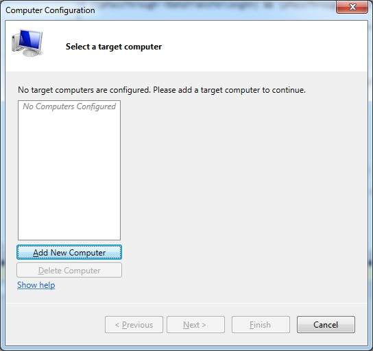

새 컴퓨터 추가 :

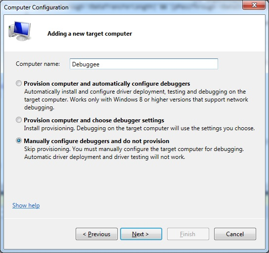

컴퓨터 이름을 입력하고 (아무 것도 가능) **Manually configure debuggers and do not provision** 을 선택하십시오.

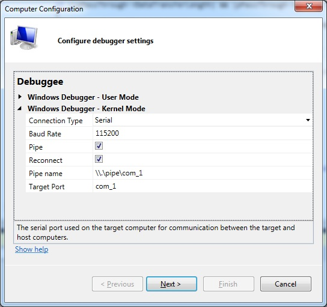

이 설정을 입력하고 Next를 클릭하십시오.

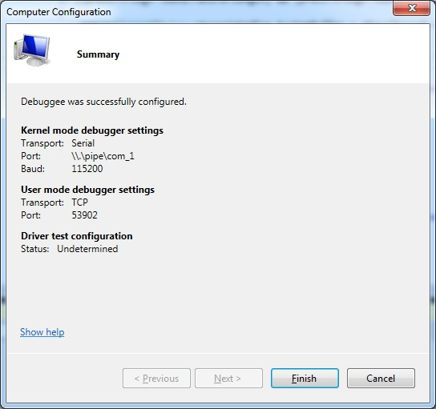

**Finish** 를 클릭하십시오.

이제 두 드라이버 프로젝트 (클라이언트 및 서버)를 솔루션에 추가하십시오. 게스트 OS를 시작하고 OS 선택 창을 기다립니다. Visual Studio에서 **Debug -> Attach to Process...**로 이동하십시오.

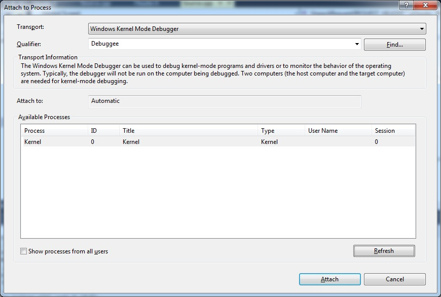

프로세스가 목록에 없으면 새로 고침을 클릭하십시오. 그런 다음 연결을 선택하십시오. Visual Studio에서 디버거 직접 실행 창을 엽니다.

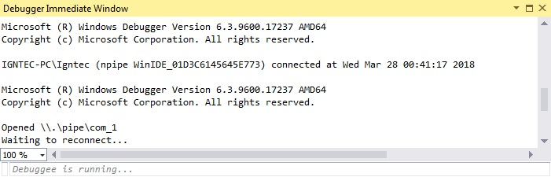

이제 게스트 OS로 돌아가 디버거가 활성화 된 부팅 항목을 선택하십시오.

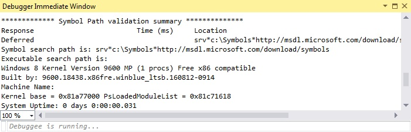

시스템 부팅 허용, **Debug -> Break All**: :

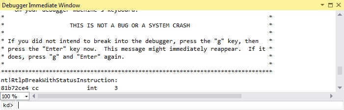

클라이언트 측 드라이버의 경우 DriverEntry는 프로그램 설치 중에 또는 시스템 부팅 중 (이후) 호출됩니다. 서버 쪽에서는 장치 공유를 시작할 때 DriverEntry가 호출됩니다. DriverEntry 후에는 드라이버의 AddDevice 루틴이 호출되고 pnp 요청이 한꺼번에 호출됩니다.

아직로드되지 않은 모듈 (서버 드라이버)의 경우 해결되지 않은 중단 점을 사용해야합니다. 다음 명령을 입력하십시오.

```
bu scsiserver!DispatchDeviceControl
```

이미로드 된 모듈 (클라이언트 드라이버)의 경우 일반 중단 점을 사용할 수 있습니다. 다음 명령을 입력 할 수 있습니다.

```
bp scsiclient!DispatchDeviceControl
```

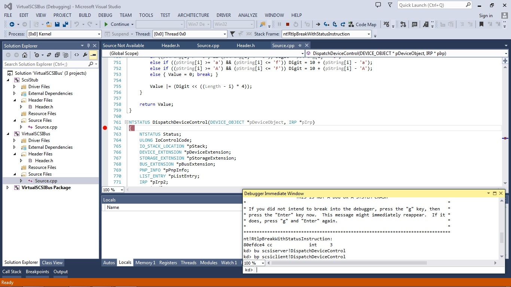

또는 평소처럼 코드 편집기에서 중단 점을 설정할 수 있습니다. 해당 코드 행은 빨간색이되어야합니다 (때로는 즉시 발생하지 않으므로 기다릴 필요가 있음). 이제 **Debug -> Continue**.로 이동하십시오. 위에서 설명한대로 장치 공유 프로세스를 시작하면 해결되지 않은 중단 점이 발생합니다 (해당 코드 줄이 노란색으로 표시됨).

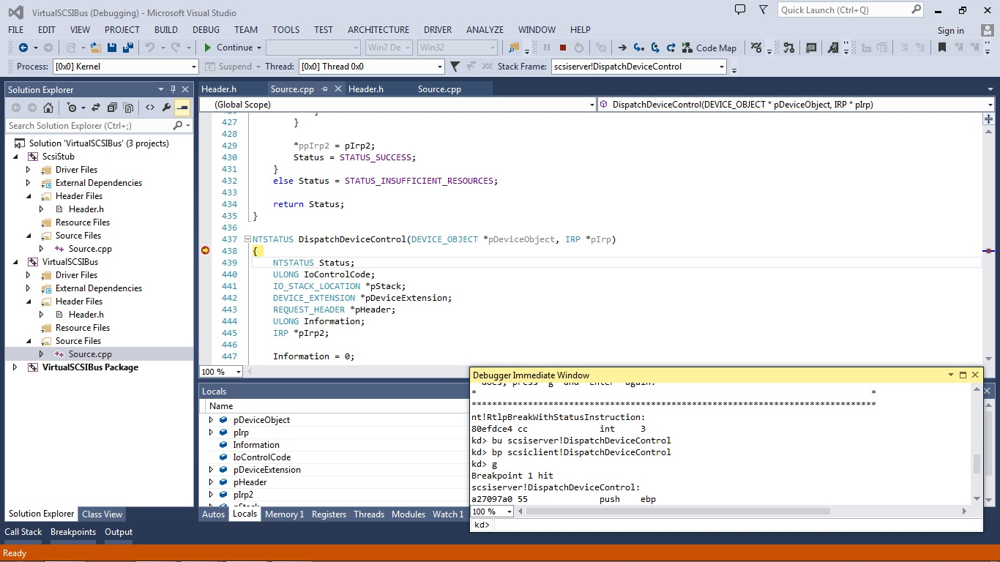

이제 실행 흐름을 따르고 다른 디스패치 루틴에 중단 점을 설정하고 두 드라이버를 모두 디버깅 할 수 있습니다. 요청 흐름은 다음과 같습니다.

1. start:

   ```
   {
       server: <code>IOCTL_GET_PNP_INFO</code> request from corresponding user mode program
       client: <code>IOCTL_PLUGIN_DEVICE</code> request for bus FDO from corresponding user mode program
       client: pnp requests from OS for newly created device PDO 
               to get information about it and to start it
   }
   ```

   

2. loop:

   ```
   {
       client: <code>device io control</code> requests / <code>device internal io control</code> 
               request for device PDO from cdrom class driver
       client: <code>IOCTL_FETCH_REQUEST</code> request for bus FDO from 
               corresponding user mode program
       server: <code>IOCTL_EXECUTE_REQUEST</code> request from corresponding user mode program
       client: <code>IOCTL_COMPLETE_REQUEST</code> request for bus FDO from 
               corresponding user mode program
   }
   ```

   

3. finish:

   ```
   {
       client: <code>IOCTL_PLUGOUT_DEVICE</code> request for bus FDO from corresponding user mode program
       client: <code>IRP_MN_QUERY_DEVICE_RELATIONS</code> request (bus relations) from OS for bus FDO
       client: <code>IRP_MN_SURPRISE_REMOVAL</code> request from OS for device PDO
       client: <code>IRP_MN_REMOVE_DEVICE</code> request from OS for device PDO
   }
   ```

   

서버 측 코드 (잘림) :

```c
#define IOCTL_GET_PNP_INFO      CTL_CODE(FILE_DEVICE_CONTROLLER, 0, METHOD_BUFFERED,
                                FILE_ANY_ACCESS)
#define IOCTL_EXECUTE_REQUEST   CTL_CODE(FILE_DEVICE_CONTROLLER, 1, METHOD_OUT_DIRECT,
                                FILE_ANY_ACCESS)

struct PNP_ENTRY
{
    ULONG InfoOffset;
    ULONG InfoLength;
    NTSTATUS Status;
};

struct PNP_INFO
{
    PNP_ENTRY irp_mn_query_id[6];
    PNP_ENTRY irp_mn_query_device_text[2];
    PNP_ENTRY irp_mn_query_capabilities;
};

struct PACKED_SRB
{
    UCHAR                      Function;
    UCHAR                      SrbStatus;
    UCHAR                      ScsiStatus;
    UCHAR                      PathId;
    UCHAR                      TargetId;
    UCHAR                      Lun;
    UCHAR                      QueueTag;
    UCHAR                      QueueAction;
    UCHAR                      CdbLength;
    UCHAR                      SenseInfoBufferLength;
    ULONG                      SrbFlags;
    ULONG                      DataTransferLength;
    ULONG                      TimeOutValue;
    ULONG                       QueueSortKey;
    UCHAR                      Cdb[16];
};

struct REQUEST_HEADER
{
    ULONG Id;
    ULONG Op;
    ULONG Irp[2];
    ULONG Length;
    ULONG MajorFunction;
    ULONG MinorFunction;
    ULONG IoControlCode;
    ULONG InputBufferLength;
    ULONG OutputBufferLength;
    NTSTATUS Status;
    ULONG Information;
};

struct DEVICE_EXTENSION
{
    DEVICE_OBJECT *pDeviceObject;
    IO_REMOVE_LOCK RemoveLock;
    DEVICE_OBJECT *pLowerDeviceObject;
    UNICODE_STRING SymbolicLinkName;
    MDL *pMdl;
    ULONG PnpLength;
    PNP_INFO PnpInfo;
};

#define IRP_TO_LIST_ENTRY(_Irp)    ((LIST_ENTRY*)(((UCHAR*)_Irp) +
                                     FIELD_OFFSET(IRP, Tail.Overlay.ListEntry)))
#define IRP_FROM_LIST_ENTRY(_ListEntry)    ((IRP*)(((UCHAR*)_ListEntry) -
                                       FIELD_OFFSET(IRP, Tail.Overlay.ListEntry)))

struct PNP_CONTEXT
{
    KEVENT Event;
    DEVICE_EXTENSION *pDeviceExtension;
    IO_STACK_LOCATION Stack;
};

NTSTATUS AllocatePnpRequest(PNP_CONTEXT *pPnpContext, IRP **ppIrp)
{
    IRP *pIrp;
    NTSTATUS Status;
    DEVICE_OBJECT *pDeviceObject;
    IO_STACK_LOCATION *pStackDst, *pStackSrc;

    pDeviceObject = pPnpContext->pDeviceExtension->pLowerDeviceObject;
    pStackSrc = &pPnpContext->Stack;

    pIrp = IoAllocateIrp(pDeviceObject->StackSize, FALSE);

    if (pIrp)
    {
        pStackDst = IoGetNextIrpStackLocation(pIrp);

        pStackDst->DeviceObject = pDeviceObject;

        pStackDst->MajorFunction = IRP_MJ_PNP;
        pStackDst->MinorFunction = pStackSrc->MinorFunction;

        switch (pStackSrc->MinorFunction)
        {
        case IRP_MN_QUERY_CAPABILITIES:
            pStackDst->Parameters.DeviceCapabilities.Capabilities =
                          pStackSrc->Parameters.DeviceCapabilities.Capabilities;
            break;
        case IRP_MN_QUERY_ID:
            pStackDst->Parameters.QueryId.IdType = pStackSrc->Parameters.QueryId.IdType;
            break;
        case IRP_MN_QUERY_DEVICE_TEXT:
            pStackDst->Parameters.QueryDeviceText.DeviceTextType =
                          pStackSrc->Parameters.QueryDeviceText.DeviceTextType;
            pStackDst->Parameters.QueryDeviceText.LocaleId =
                          pStackSrc->Parameters.QueryDeviceText.LocaleId;
            break;
        default:
            DbgRaiseAssertionFailure();
            break;
        }

        *ppIrp = pIrp;
        Status = STATUS_SUCCESS;
    }
    else Status = STATUS_INSUFFICIENT_RESOURCES;

    return Status;
}

NTSTATUS IoCompletionRoutine2(DEVICE_OBJECT *pDeviceObject, IRP *pIrp, void *pContext)
{
    PNP_INFO *pPnpInfo;
    PNP_ENTRY *pPnpEntry;
    IO_STACK_LOCATION *pStack;
    BUS_QUERY_ID_TYPE BusQueryIdType;
    DEVICE_TEXT_TYPE DeviceTextType;
    DEVICE_EXTENSION *pDeviceExtension;
    PNP_CONTEXT *pPnpContext;
    WCHAR *pString;

    pPnpContext = (PNP_CONTEXT*)pContext;

    pStack = &pPnpContext->Stack;
    pDeviceExtension = pPnpContext->pDeviceExtension;
    pPnpInfo = &pDeviceExtension->PnpInfo;

    switch (pStack->MinorFunction)
    {
    case IRP_MN_QUERY_CAPABILITIES:
        pPnpEntry = &pPnpInfo->irp_mn_query_capabilities;

        pPnpEntry->InfoOffset = pDeviceExtension->PnpLength;
        pPnpEntry->InfoLength = sizeof(DEVICE_CAPABILITIES);

        memcpy((UCHAR*)pPnpInfo + pPnpEntry->InfoOffset,
              pStack->Parameters.DeviceCapabilities.Capabilities, pPnpEntry->InfoLength);
        pDeviceExtension->PnpLength += pPnpEntry->InfoLength;

        pPnpEntry->Status = pIrp->IoStatus.Status;
        break;
    case IRP_MN_QUERY_ID:
        BusQueryIdType = pStack->Parameters.QueryId.IdType;
        pPnpEntry = &pPnpInfo->irp_mn_query_id[BusQueryIdType];

        pString = (WCHAR*)pIrp->IoStatus.Information;

        if (pString)
        {
            pPnpEntry->InfoOffset = pDeviceExtension->PnpLength;

            if ((BusQueryIdType == BusQueryHardwareIDs) ||
                           (BusQueryIdType == BusQueryCompatibleIDs))
            {
                pPnpEntry->InfoLength = MultiStringSize(pString);
            }
            else
            {
                pPnpEntry->InfoLength = StringSize(pString);
            }

            memcpy((UCHAR*)pPnpInfo + pPnpEntry->InfoOffset, pString, pPnpEntry->InfoLength);
            pDeviceExtension->PnpLength += pPnpEntry->InfoLength;

            ExFreePool(pString);
        }

        pPnpEntry->Status = pIrp->IoStatus.Status;
        break;
    case IRP_MN_QUERY_DEVICE_TEXT:
        DeviceTextType = pStack->Parameters.QueryDeviceText.DeviceTextType;
        pPnpEntry = &pPnpInfo->irp_mn_query_device_text[DeviceTextType];

        pString = (WCHAR*)pIrp->IoStatus.Information;

        if (pString)
        {
            pPnpEntry->InfoOffset = pDeviceExtension->PnpLength;
            pPnpEntry->InfoLength = StringSize(pString);

            memcpy((UCHAR*)pPnpInfo + pPnpEntry->InfoOffset, pString, pPnpEntry->InfoLength);
            pDeviceExtension->PnpLength += pPnpEntry->InfoLength;

            ExFreePool(pString);
        }

        pPnpEntry->Status = pIrp->IoStatus.Status;
        break;
    default:
        DbgRaiseAssertionFailure();
        break;
    }

    IoFreeIrp(pIrp);

    KeSetEvent(&pPnpContext->Event, IO_NO_INCREMENT, FALSE);

    return STATUS_MORE_PROCESSING_REQUIRED;
}

NTSTATUS IoCompletionRoutine3(DEVICE_OBJECT *pDeviceObject, IRP *pIrp2, void *pContext)
{
    IRP *pIrp;
    REQUEST_HEADER *pHeader;
    DEVICE_EXTENSION *pDeviceExtension;
    PACKED_SRB *pPackedSrb;
    SCSI_REQUEST_BLOCK *pSrb;
    SCSI_PASS_THROUGH *pPassThrough;

    pIrp = (IRP*)pContext;

    pDeviceExtension = (DEVICE_EXTENSION*)pIrp->Tail.Overlay.DriverContext[0];

    pHeader = (REQUEST_HEADER*)MmGetSystemAddressForMdlSafe
              (pIrp->MdlAddress, NormalPagePriority);

    pHeader->Status = pIrp2->IoStatus.Status;
    pHeader->Information = pIrp2->IoStatus.Information;

    if (pHeader->MajorFunction == IRP_MJ_INTERNAL_DEVICE_CONTROL)
    {
        pPackedSrb = (PACKED_SRB*)((UCHAR*)pHeader + sizeof(REQUEST_HEADER));
        pSrb = (SCSI_REQUEST_BLOCK*)((UCHAR*)pPackedSrb + (sizeof(PACKED_SRB) +
                pPackedSrb->DataTransferLength + pPackedSrb->SenseInfoBufferLength));

        pPackedSrb->SrbStatus = pSrb->SrbStatus;
        pPackedSrb->ScsiStatus = pSrb->ScsiStatus;

        pPackedSrb->SenseInfoBufferLength = pSrb->SenseInfoBufferLength;
        pPackedSrb->DataTransferLength = pSrb->DataTransferLength;

        pHeader->Length = sizeof(REQUEST_HEADER) + sizeof(PACKED_SRB);

        if (NT_SUCCESS(pHeader->Status))
        {
            if ((pSrb->DataTransferLength) && (pSrb->SrbFlags & SRB_FLAGS_DATA_IN))
            {
                pHeader->Length += pPackedSrb->DataTransferLength;
            }
        }
        else
        {
            if ((pSrb->SenseInfoBufferLength) &&
                         (pSrb->SrbStatus & SRB_STATUS_AUTOSENSE_VALID))
            {
                pHeader->Length += pPackedSrb->SenseInfoBufferLength;

                if (pSrb->DataTransferLength)
                {
                    memmove((UCHAR*)pPackedSrb + sizeof(PACKED_SRB),
                       (UCHAR*)pPackedSrb + (sizeof(PACKED_SRB) +
                        pPackedSrb->DataTransferLength), pPackedSrb->SenseInfoBufferLength);
                }
            }
        }
    }
    else
    {
        pHeader->Length = sizeof(REQUEST_HEADER);

        if ((pHeader->IoControlCode == IOCTL_SCSI_GET_ADDRESS) ||
            (pHeader->IoControlCode == IOCTL_STORAGE_QUERY_PROPERTY))
        {
            pHeader->Length += pHeader->Information;
        }
        else if (pHeader->IoControlCode == IOCTL_SCSI_PASS_THROUGH)
        {
            pPassThrough = (SCSI_PASS_THROUGH*)((UCHAR*)pHeader + sizeof(REQUEST_HEADER));

            if (NT_SUCCESS(pHeader->Status))
            {
                if ((pPassThrough->DataTransferLength) &&
                           (pPassThrough->DataIn == SCSI_IOCTL_DATA_IN))
                {
                    pHeader->Length += pPassThrough->DataBufferOffset +
                                           pPassThrough->DataTransferLength;
                }
                else pHeader->Length += sizeof(SCSI_PASS_THROUGH);
            }
            else
            {
                if (pPassThrough->SenseInfoLength)
                {
                    pHeader->Length += pPassThrough->SenseInfoOffset +
                                               pPassThrough->SenseInfoLength;
                }
                else pHeader->Length += sizeof(SCSI_PASS_THROUGH);
            }
        }
    }

    IoFreeIrp(pIrp2);

    CompleteRequest(pIrp, STATUS_SUCCESS, 0);
    IoReleaseRemoveLock(&pDeviceExtension->RemoveLock, pIrp);

    return STATUS_MORE_PROCESSING_REQUIRED;
}

NTSTATUS AllocateRequest(DEVICE_EXTENSION *pDeviceExtension, MDL *pMdl, IRP **ppIrp2)
{
    IRP *pIrp2;
    PVOID pBuffer;
    NTSTATUS Status;
    IO_STACK_LOCATION *pStack;
    SCSI_REQUEST_BLOCK *pSrb;
    PACKED_SRB *pPackedSrb;
    DEVICE_OBJECT *pDeviceObject;
    REQUEST_HEADER *pHeader;

    pHeader = (REQUEST_HEADER*)MmGetSystemAddressForMdlSafe(pMdl, NormalPagePriority);
    pDeviceObject = pDeviceExtension->pLowerDeviceObject;

    pIrp2 = IoAllocateIrp(pDeviceObject->StackSize, FALSE);

    if (pIrp2)
    {
        pStack = IoGetNextIrpStackLocation(pIrp2);

        pStack->DeviceObject = pDeviceObject;

        pStack->MajorFunction = pHeader->MajorFunction;
        pStack->MinorFunction = pHeader->MinorFunction;

        if (pHeader->MajorFunction == IRP_MJ_INTERNAL_DEVICE_CONTROL)
        {
            pPackedSrb = (PACKED_SRB*)((UCHAR*)pHeader + sizeof(REQUEST_HEADER));
            pSrb = (SCSI_REQUEST_BLOCK*)((UCHAR*)pPackedSrb +
                       (sizeof(PACKED_SRB) + pPackedSrb->DataTransferLength +
                        pPackedSrb->SenseInfoBufferLength));

            pSrb->Length = sizeof(SCSI_REQUEST_BLOCK);
            pSrb->Function = pPackedSrb->Function;
            pSrb->SrbStatus = pPackedSrb->SrbStatus;
            pSrb->ScsiStatus = pPackedSrb->ScsiStatus;
            pSrb->PathId = pPackedSrb->PathId;
            pSrb->TargetId = pPackedSrb->TargetId;
            pSrb->Lun = pPackedSrb->Lun;
            pSrb->QueueTag = pPackedSrb->QueueTag;
            pSrb->QueueAction = pPackedSrb->QueueAction;
            pSrb->CdbLength = pPackedSrb->CdbLength;
            pSrb->SenseInfoBufferLength = pPackedSrb->SenseInfoBufferLength;
            pSrb->SrbFlags = pPackedSrb->SrbFlags;
            pSrb->DataTransferLength = pPackedSrb->DataTransferLength;
            pSrb->TimeOutValue = pPackedSrb->TimeOutValue;

            if (pPackedSrb->DataTransferLength)
            {
                pSrb->DataBuffer = (UCHAR*)pMdl->StartVa + pMdl->ByteOffset +
                                   (sizeof(REQUEST_HEADER) + sizeof(PACKED_SRB));

                IoBuildPartialMdl(pMdl, pDeviceExtension->pMdl, pSrb->DataBuffer,
                                   pPackedSrb->DataTransferLength);

                pIrp2->MdlAddress = pDeviceExtension->pMdl;
            }
            else pSrb->DataBuffer = NULL;

            if (pPackedSrb->SenseInfoBufferLength)
            {
                pSrb->SenseInfoBuffer = (UCHAR*)pPackedSrb + (sizeof(PACKED_SRB) +
                                         pPackedSrb->DataTransferLength);
            }
            else pSrb->SenseInfoBuffer = NULL;

            pSrb->NextSrb = NULL;
            pSrb->OriginalRequest = pIrp2;
            pSrb->SrbExtension = NULL;

            pSrb->QueueSortKey = pPackedSrb->QueueSortKey;
            memcpy(pSrb->Cdb, pPackedSrb->Cdb, sizeof(pSrb->Cdb));

            pStack->Parameters.Scsi.Srb = pSrb;
        }
        else
        {
            pStack->Parameters.DeviceIoControl.IoControlCode = pHeader->IoControlCode;

            pBuffer = (UCHAR*)pHeader + sizeof(REQUEST_HEADER);

            if (pHeader->IoControlCode == IOCTL_SCSI_GET_ADDRESS)
            {
                pStack->Parameters.DeviceIoControl.OutputBufferLength =
                                                pHeader->OutputBufferLength;
                pIrp2->AssociatedIrp.SystemBuffer = pBuffer;
            }
            else if (pHeader->IoControlCode == IOCTL_STORAGE_QUERY_PROPERTY)
            {
                pStack->Parameters.DeviceIoControl.InputBufferLength =
                                                 pHeader->InputBufferLength;
                pStack->Parameters.DeviceIoControl.OutputBufferLength =
                                                 pHeader->OutputBufferLength;
                pIrp2->AssociatedIrp.SystemBuffer = pBuffer;
            }
            else if (pHeader->IoControlCode == IOCTL_STORAGE_ENABLE_IDLE_POWER)
            {
                pStack->Parameters.DeviceIoControl.InputBufferLength =
                                                   pHeader->InputBufferLength;
                pIrp2->AssociatedIrp.SystemBuffer = pBuffer;
            }
            else if (pHeader->IoControlCode == IOCTL_SCSI_PASS_THROUGH)
            {
                pStack->Parameters.DeviceIoControl.InputBufferLength =
                                                      pHeader->InputBufferLength;
                pStack->Parameters.DeviceIoControl.OutputBufferLength =
                                                      pHeader->OutputBufferLength;
                pIrp2->AssociatedIrp.SystemBuffer = pBuffer;
            }
        }

        *ppIrp2 = pIrp2;
        Status = STATUS_SUCCESS;
    }
    else Status = STATUS_INSUFFICIENT_RESOURCES;

    return Status;
}

NTSTATUS DispatchDeviceControl(DEVICE_OBJECT *pDeviceObject, IRP *pIrp)
{
    NTSTATUS Status;
    ULONG IoControlCode;
    IO_STACK_LOCATION *pStack;
    DEVICE_EXTENSION *pDeviceExtension;
    REQUEST_HEADER *pHeader;
    ULONG Information;
    IRP *pIrp2;

    Information = 0;

    pDeviceExtension = (DEVICE_EXTENSION*)pDeviceObject->DeviceExtension;
    pStack = IoGetCurrentIrpStackLocation(pIrp);

    Status = IoAcquireRemoveLock(&pDeviceExtension->RemoveLock, pIrp);

    if (NT_SUCCESS(Status))
    {
        IoControlCode = pStack->Parameters.DeviceIoControl.IoControlCode;

        if (IoControlCode == IOCTL_GET_PNP_INFO)
        {
            pHeader = (REQUEST_HEADER*)pIrp->AssociatedIrp.SystemBuffer;

            pHeader->Length = sizeof(REQUEST_HEADER)+pDeviceExtension->PnpLength;

            memcpy((UCHAR*)pHeader + sizeof(REQUEST_HEADER),
                       &pDeviceExtension->PnpInfo, pDeviceExtension->PnpLength);

            Information = pHeader->Length;
        }
        else if (IoControlCode == IOCTL_EXECUTE_REQUEST)
        {
            Status = AllocateRequest(pDeviceExtension, pIrp->MdlAddress, &pIrp2);

            if (NT_SUCCESS(Status))
            {
                pIrp->Tail.Overlay.DriverContext[0] = pDeviceExtension;

                IoSetCompletionRoutine(pIrp2, IoCompletionRoutine3, pIrp, TRUE, TRUE, TRUE);

                IoMarkIrpPending(pIrp);

                IoCallDriver(pDeviceExtension->pLowerDeviceObject, pIrp2);

                Status = STATUS_PENDING;
            }
        }
        else Status = STATUS_NOT_SUPPORTED;

        if (Status != STATUS_PENDING)
        {
            CompleteRequest(pIrp, Status, Information);
            IoReleaseRemoveLock(&pDeviceExtension->RemoveLock, pIrp);
        }
    }
    else
    {
        Status = STATUS_DEVICE_DOES_NOT_EXIST;
        CompleteRequest(pIrp, Status, Information);
    }

    return Status;
}

NTSTATUS DispatchPnp(DEVICE_OBJECT *pDeviceObject, IRP *pIrp)
{
    NTSTATUS Status;
    IO_STACK_LOCATION *pStack;
    DEVICE_EXTENSION *pDeviceExtension;
    POWER_STATE PowerState;
    ULONG_PTR Information;
    KEVENT Event;

    Information = 0;

    pDeviceExtension = (DEVICE_EXTENSION*)pDeviceObject->DeviceExtension;
    pStack = IoGetCurrentIrpStackLocation(pIrp);

    Status = IoAcquireRemoveLock(&pDeviceExtension->RemoveLock, pIrp);

    if (NT_SUCCESS(Status))
    {
        switch (pStack->MinorFunction)
        {
        case IRP_MN_START_DEVICE:
            KeInitializeEvent(&Event, NotificationEvent, FALSE);

            IoCopyCurrentIrpStackLocationToNext(pIrp);

            IoSetCompletionRoutine(pIrp, IoCompletionRoutine, &Event, TRUE, TRUE, TRUE);

            Status = IoCallDriver(pDeviceExtension->pLowerDeviceObject, pIrp);

            if (Status == STATUS_PENDING) KeWaitForSingleObject
                             (&Event, Executive, KernelMode, FALSE, NULL);

            Status = pIrp->IoStatus.Status;
            Information = pIrp->IoStatus.Information;

            if (NT_SUCCESS(Status))
            {
                Information = 0;

                Status = IoSetDeviceInterfaceState(&pDeviceExtension->SymbolicLinkName, TRUE);

                if (NT_SUCCESS(Status))
                {
                    PowerState.DeviceState = PowerDeviceD0;
                    PoSetPowerState(pDeviceObject, DevicePowerState, PowerState);
                }
            }

            CompleteRequest(pIrp, Status, Information);

            IoReleaseRemoveLock(&pDeviceExtension->RemoveLock, pIrp);
            break;
        case IRP_MN_REMOVE_DEVICE:
            PowerState.DeviceState = PowerDeviceD3;
            PoSetPowerState(pDeviceObject, DevicePowerState, PowerState);

            pIrp->IoStatus.Status = Status;
            pIrp->IoStatus.Information = Information;

            IoSkipCurrentIrpStackLocation(pIrp);
            Status = IoCallDriver(pDeviceExtension->pLowerDeviceObject, pIrp);

            IoReleaseRemoveLockAndWait(&pDeviceExtension->RemoveLock, pIrp);

            IoSetDeviceInterfaceState(&pDeviceExtension->SymbolicLinkName, FALSE);

            RtlFreeUnicodeString(&pDeviceExtension->SymbolicLinkName);

            IoFreeMdl(pDeviceExtension->pMdl);
            IoDetachDevice(pDeviceExtension->pLowerDeviceObject);
            IoDeleteDevice(pDeviceObject);
            break;
        case IRP_MN_SURPRISE_REMOVAL:
        case IRP_MN_QUERY_REMOVE_DEVICE:
        case IRP_MN_CANCEL_REMOVE_DEVICE:
        case IRP_MN_QUERY_STOP_DEVICE:
        case IRP_MN_CANCEL_STOP_DEVICE:
        case IRP_MN_STOP_DEVICE:
            pIrp->IoStatus.Status = Status;
            pIrp->IoStatus.Information = Information;

            IoSkipCurrentIrpStackLocation(pIrp);
            Status = IoCallDriver(pDeviceExtension->pLowerDeviceObject, pIrp);

            IoReleaseRemoveLock(&pDeviceExtension->RemoveLock, pIrp);
            break;
        default:
            Status = STATUS_NOT_SUPPORTED;

            pIrp->IoStatus.Status = Status;
            pIrp->IoStatus.Information = Information;

            IoSkipCurrentIrpStackLocation(pIrp);
            Status = IoCallDriver(pDeviceExtension->pLowerDeviceObject, pIrp);

            IoReleaseRemoveLock(&pDeviceExtension->RemoveLock, pIrp);
            break;
        }
    }
    else
    {
        Status = STATUS_DEVICE_DOES_NOT_EXIST;
        CompleteRequest(pIrp, Status, Information);
    }

    return Status;
}

NTSTATUS AddDevice(DRIVER_OBJECT *pDriverObject, DEVICE_OBJECT *pPhysicalDeviceObject)
{
    IRP *pIrp;
    MDL *pMdl;
    ULONG i, j;
    NTSTATUS Status;
    DEVICE_EXTENSION *pDeviceExtension;
    DEVICE_OBJECT *pDeviceObject, *pLowerDeviceObject;
    DEVICE_CAPABILITIES DeviceCapabilities;
    PNP_CONTEXT PnpContext;

    Status = IoCreateDevice(pDriverObject,
        sizeof(DEVICE_EXTENSION) - sizeof(PNP_INFO) + 2000,
        NULL,
        FILE_DEVICE_CONTROLLER,
        FILE_DEVICE_SECURE_OPEN,
        FALSE,
        &pDeviceObject);

    if (NT_SUCCESS(Status))
    {
        pDeviceExtension = (DEVICE_EXTENSION*)pDeviceObject->DeviceExtension;

        memset(pDeviceExtension, 0, sizeof(DEVICE_EXTENSION));

        pDeviceExtension->PnpLength = sizeof(PNP_INFO);

        pDeviceExtension->pDeviceObject = pDeviceObject;

        IoInitializeRemoveLock(&pDeviceExtension->RemoveLock, 0, 0, 0);

        pMdl = IoAllocateMdl(NULL, (32 + 1) * 4096, FALSE, FALSE, NULL);

        if (pMdl)
        {
            pLowerDeviceObject = IoAttachDeviceToDeviceStack
                                      (pDeviceObject, pPhysicalDeviceObject);

            if (pLowerDeviceObject)
            {
                Status = IoRegisterDeviceInterface(pPhysicalDeviceObject,
                          &g_ClassGuid, NULL, &pDeviceExtension->SymbolicLinkName);

                if (NT_SUCCESS(Status))
                {
                    pDeviceExtension->pMdl = pMdl;
                    pDeviceExtension->pLowerDeviceObject = pLowerDeviceObject;

                    PnpContext.pDeviceExtension = pDeviceExtension;
                    KeInitializeEvent(&PnpContext.Event, NotificationEvent, FALSE);

                    i = 0;
                    j = 0;

                    while (i < 3)
                    {
                        memset(&PnpContext.Stack, 0, sizeof(IO_STACK_LOCATION));

                        if (i == 0)
                        {
                            PnpContext.Stack.MinorFunction = IRP_MN_QUERY_CAPABILITIES;
                            PnpContext.Stack.Parameters.DeviceCapabilities.Capabilities =
                                                        &DeviceCapabilities;

                            memset(&DeviceCapabilities, 0, sizeof(DEVICE_CAPABILITIES));

                            DeviceCapabilities.Size = sizeof(DEVICE_CAPABILITIES);
                            DeviceCapabilities.Version = 1;

                            Status = AllocatePnpRequest(&PnpContext, &pIrp);

                            ++i;
                        }
                        else if (i == 1)
                        {
                            PnpContext.Stack.MinorFunction = IRP_MN_QUERY_ID;
                            PnpContext.Stack.Parameters.QueryId.IdType = (BUS_QUERY_ID_TYPE)j;

                            Status = AllocatePnpRequest(&PnpContext, &pIrp);

                            if (j == 5) { ++i; j = 0; }
                            else ++j;
                        }
                        else
                        {
                            PnpContext.Stack.MinorFunction = IRP_MN_QUERY_DEVICE_TEXT;
                            PnpContext.Stack.Parameters.QueryDeviceText.DeviceTextType =
                                                          (DEVICE_TEXT_TYPE)j;
                            PnpContext.Stack.Parameters.QueryDeviceText.LocaleId = 1033;

                            Status = AllocatePnpRequest(&PnpContext, &pIrp);

                            if (j == 1) { ++i; j = 0; }
                            else ++j;
                        }

                        if (NT_SUCCESS(Status))
                        {
                            IoSetCompletionRoutine
                             (pIrp, IoCompletionRoutine2, &PnpContext, TRUE, TRUE, TRUE);

                            Status = IoCallDriver(pLowerDeviceObject, pIrp);

                            if (Status == STATUS_PENDING)
                            {
                                KeWaitForSingleObject(&PnpContext.Event, Executive,
                                                         KernelMode, FALSE, NULL);
                            }

                            KeClearEvent(&PnpContext.Event);
                        }
                    }

                    pDeviceObject->Flags &= ~DO_DEVICE_INITIALIZING;
                    Status = STATUS_SUCCESS;
                }
                else IoDetachDevice(pLowerDeviceObject);
            }
            else Status = STATUS_NO_SUCH_DEVICE;
        }
        else Status = STATUS_UNSUCCESSFUL;

        if (!NT_SUCCESS(Status))
        {
            if (pMdl) IoFreeMdl(pMdl);

            IoDeleteDevice(pDeviceObject);
        }
    }

    return Status;
}
```


클라이언트 측 코드 (잘림) :

```c
#define IOCTL_PLUGIN_DEVICE    CTL_CODE(FILE_DEVICE_CONTROLLER, 0, METHOD_BUFFERED,
                               FILE_ANY_ACCESS)
#define IOCTL_PLUGOUT_DEVICE   CTL_CODE(FILE_DEVICE_CONTROLLER, 1, METHOD_BUFFERED,
                               FILE_ANY_ACCESS)
#define IOCTL_FETCH_REQUEST    CTL_CODE(FILE_DEVICE_CONTROLLER, 2, METHOD_OUT_DIRECT,
                               FILE_ANY_ACCESS)
#define IOCTL_COMPLETE_REQUEST CTL_CODE(FILE_DEVICE_CONTROLLER, 3, METHOD_IN_DIRECT,
                               FILE_ANY_ACCESS)

struct PNP_ENTRY
{
    ULONG InfoOffset;
    ULONG InfoLength;
    NTSTATUS Status;
};

struct PNP_INFO
{
    PNP_ENTRY irp_mn_query_id[6];
    PNP_ENTRY irp_mn_query_device_text[2];
    PNP_ENTRY irp_mn_query_capabilities;
};

struct PACKED_SRB
{
    UCHAR                      Function;
    UCHAR                      SrbStatus;
    UCHAR                      ScsiStatus;
    UCHAR                      PathId;
    UCHAR                      TargetId;
    UCHAR                      Lun;
    UCHAR                      QueueTag;
    UCHAR                      QueueAction;
    UCHAR                      CdbLength;
    UCHAR                      SenseInfoBufferLength;
    ULONG                      SrbFlags;
    ULONG                      DataTransferLength;
    ULONG                      TimeOutValue;
    ULONG                       QueueSortKey;
    UCHAR                      Cdb[16];
};

struct REQUEST_HEADER
{
    ULONG Id;
    ULONG Op;
    ULONG Irp[2];
    ULONG Length;
    ULONG MajorFunction;
    ULONG MinorFunction;
    ULONG IoControlCode;
    ULONG InputBufferLength;
    ULONG OutputBufferLength;
    NTSTATUS Status;
    ULONG Information;
};

struct DEVICE_EXTENSION
{
    DEVICE_OBJECT *pDeviceObject;
    IO_REMOVE_LOCK RemoveLock;
    BOOLEAN Bus;
};

struct BUS_EXTENSION : public DEVICE_EXTENSION
{
    LIST_ENTRY StorageList;
    DEVICE_OBJECT *pPhysicalDeviceObject;
    DEVICE_OBJECT *pLowerDeviceObject;
    UNICODE_STRING SymbolicLinkName;
};

struct STORAGE_EXTENSION : public DEVICE_EXTENSION
{
    LIST_ENTRY IrpQueue;
    LIST_ENTRY IrpQueue2;
    LIST_ENTRY IrpQueue3;
    LIST_ENTRY ListEntry;
    BOOLEAN Marked;
    BOOLEAN Included;
    MDL *pMdl;
    PNP_INFO PnpInfo;
};

#define IRP_TO_LIST_ENTRY(_Irp)    ((LIST_ENTRY*)(((UCHAR*)_Irp) +
                                 FIELD_OFFSET(IRP, Tail.Overlay.ListEntry)))
#define IRP_FROM_LIST_ENTRY(_ListEntry)    ((IRP*)(((UCHAR*)_ListEntry) -
                                  FIELD_OFFSET(IRP, Tail.Overlay.ListEntry)))

#define STORAGE_EXTENSION_TO_LIST_ENTRY(_Extension)
   ((LIST_ENTRY*)(((UCHAR*)_Extension) + FIELD_OFFSET(STORAGE_EXTENSION, ListEntry)))
#define STORAGE_EXTENSION_FROM_LIST_ENTRY(_ListEntry)
   ((STORAGE_EXTENSION*)(((UCHAR*)_ListEntry) - FIELD_OFFSET(STORAGE_EXTENSION, ListEntry)))

void UnpackRequest(REQUEST_HEADER *pHeader, IRP *pIrp, STORAGE_EXTENSION *pStorageExtension)
{
    BOOLEAN Unmap;
    PVOID pBuffer;
    IO_STACK_LOCATION *pStack;
    PACKED_SRB *pPackedSrb;
    SCSI_REQUEST_BLOCK *pSrb;
    SCSI_PASS_THROUGH *pPassThrough;

    pStack = IoGetCurrentIrpStackLocation(pIrp);

    if (pHeader->MajorFunction == IRP_MJ_INTERNAL_DEVICE_CONTROL)
    {
        pPackedSrb = (PACKED_SRB*)((UCHAR*)pHeader + sizeof(REQUEST_HEADER));
        pSrb = pStack->Parameters.Scsi.Srb;

        pSrb->SrbStatus = pPackedSrb->SrbStatus;
        pSrb->ScsiStatus = pPackedSrb->ScsiStatus;

        pSrb->SenseInfoBufferLength = pPackedSrb->SenseInfoBufferLength;
        pSrb->DataTransferLength = pPackedSrb->DataTransferLength;

        if (NT_SUCCESS(pHeader->Status))
        {
            if ((pPackedSrb->DataTransferLength) && (pPackedSrb->SrbFlags & SRB_FLAGS_DATA_IN))
            {
                pBuffer = GetBuffer(pIrp->MdlAddress,
                          pStorageExtension->pMdl, pSrb->DataBuffer,
                          pPackedSrb->DataTransferLength, &Unmap);

                memcpy(pBuffer, (UCHAR*)pPackedSrb + sizeof(PACKED_SRB),
                                        pPackedSrb->DataTransferLength);

                if (Unmap) MmUnmapLockedPages(pBuffer, pStorageExtension->pMdl);
            }
            else
            {
                if (pPackedSrb->Function == SRB_FUNCTION_CLAIM_DEVICE)
                                    pSrb->DataBuffer = pStack->DeviceObject;
            }
        }
        else
        {
            if ((pPackedSrb->SenseInfoBufferLength) && (pPackedSrb->SrbStatus &
                                                 SRB_STATUS_AUTOSENSE_VALID))
            {
                memcpy(pSrb->SenseInfoBuffer, (UCHAR*)pPackedSrb + sizeof(PACKED_SRB),
                                           pPackedSrb->SenseInfoBufferLength);
            }
        }
    }
    else
    {
        if (pHeader->IoControlCode == IOCTL_SCSI_PASS_THROUGH)
        {
            pPassThrough = (SCSI_PASS_THROUGH*)((UCHAR*)pHeader + sizeof(REQUEST_HEADER));

            memcpy(pIrp->AssociatedIrp.SystemBuffer, pPassThrough, sizeof(SCSI_PASS_THROUGH));

            if (NT_SUCCESS(pHeader->Status))
            {
                if ((pPassThrough->DataTransferLength) &&
                                   (pPassThrough->DataIn == SCSI_IOCTL_DATA_IN))
                {
                    memcpy((UCHAR*)pIrp->AssociatedIrp.SystemBuffer +
                           pPassThrough->DataBufferOffset, (UCHAR*)pPassThrough +
                           pPassThrough->DataBufferOffset, pPassThrough->DataTransferLength);
                }
            }
            else
            {
                memcpy((UCHAR*)pIrp->AssociatedIrp.SystemBuffer +
                     pPassThrough->SenseInfoOffset, (UCHAR*)pPassThrough +
                     pPassThrough->SenseInfoOffset, pPassThrough->SenseInfoLength);
            }
        }
        else
        {
            if (NT_SUCCESS(pHeader->Status))
            {
                if ((pHeader->IoControlCode == IOCTL_SCSI_GET_ADDRESS) ||
                    (pHeader->IoControlCode == IOCTL_STORAGE_QUERY_PROPERTY))
                {
                    memcpy(pIrp->AssociatedIrp.SystemBuffer, (UCHAR*)pHeader +
                              sizeof(REQUEST_HEADER), pHeader->Information);
                }
            }
        }
    }
}

void PackRequest(IRP *pIrp, REQUEST_HEADER *pHeader, STORAGE_EXTENSION *pStorageExtension)
{
    BOOLEAN Unmap;
    PVOID pBuffer;
    IO_STACK_LOCATION *pStack;
    PACKED_SRB *pPackedSrb;
    SCSI_REQUEST_BLOCK *pSrb;
    SCSI_PASS_THROUGH *pPassThrough;

    pStack = IoGetCurrentIrpStackLocation(pIrp);

    *((IRP**)pHeader->Irp) = pIrp;

    pHeader->Status = 0;
    pHeader->Information = 0;

    pHeader->MajorFunction = pStack->MajorFunction;
    pHeader->MinorFunction = pStack->MinorFunction;

    if (pStack->MajorFunction == IRP_MJ_INTERNAL_DEVICE_CONTROL)
    {
        pHeader->IoControlCode = 0;
        pHeader->InputBufferLength = 0;
        pHeader->OutputBufferLength = 0;
        pHeader->Length = sizeof(REQUEST_HEADER) + sizeof(PACKED_SRB);

        pPackedSrb = (PACKED_SRB*)((UCHAR*)pHeader + sizeof(REQUEST_HEADER));
        pSrb = pStack->Parameters.Scsi.Srb;

        pPackedSrb->Function = pSrb->Function;
        pPackedSrb->SrbStatus = pSrb->SrbStatus;
        pPackedSrb->ScsiStatus = pSrb->ScsiStatus;
        pPackedSrb->PathId = pSrb->PathId;
        pPackedSrb->TargetId = pSrb->TargetId;
        pPackedSrb->Lun = pSrb->Lun;
        pPackedSrb->QueueTag = pSrb->QueueTag;
        pPackedSrb->QueueAction = pSrb->QueueAction;
        pPackedSrb->CdbLength = pSrb->CdbLength;
        pPackedSrb->SenseInfoBufferLength = pSrb->SenseInfoBufferLength;
        pPackedSrb->SrbFlags = pSrb->SrbFlags;
        pPackedSrb->DataTransferLength = pSrb->DataTransferLength;
        pPackedSrb->TimeOutValue = pSrb->TimeOutValue;

        if ((pSrb->DataTransferLength) && (pSrb->SrbFlags & SRB_FLAGS_DATA_OUT))
        {
            pBuffer = GetBuffer(pIrp->MdlAddress, pStorageExtension->pMdl,
                         pSrb->DataBuffer, pSrb->DataTransferLength, &Unmap);

            memcpy((UCHAR*)pPackedSrb +
                  sizeof(PACKED_SRB), pBuffer, pSrb->DataTransferLength);

            if (Unmap) MmUnmapLockedPages(pBuffer, pStorageExtension->pMdl);

            pHeader->Length += pSrb->DataTransferLength;
        }

        pPackedSrb->QueueSortKey = pSrb->QueueSortKey;
        memcpy(pPackedSrb->Cdb, pSrb->Cdb, sizeof(pSrb->Cdb));
    }
    else
    {
        pHeader->IoControlCode = pStack->Parameters.DeviceIoControl.IoControlCode;
        pHeader->InputBufferLength = pStack->Parameters.DeviceIoControl.InputBufferLength;
        pHeader->OutputBufferLength = pStack->Parameters.DeviceIoControl.OutputBufferLength;

        pHeader->Length = sizeof(REQUEST_HEADER);

        if ((pHeader->IoControlCode == IOCTL_STORAGE_QUERY_PROPERTY) ||
            (pHeader->IoControlCode == IOCTL_STORAGE_ENABLE_IDLE_POWER))
        {
            pHeader->Length += pHeader->InputBufferLength;
            memcpy((UCHAR*)pHeader + sizeof(REQUEST_HEADER),
                    pIrp->AssociatedIrp.SystemBuffer, pHeader->InputBufferLength);
        }
        else if (pHeader->IoControlCode == IOCTL_SCSI_PASS_THROUGH)
        {
            pPassThrough = (SCSI_PASS_THROUGH*)pIrp->AssociatedIrp.SystemBuffer;

            memcpy((UCHAR*)pHeader + sizeof(REQUEST_HEADER), pPassThrough,
                                     sizeof(SCSI_PASS_THROUGH));

            if ((pPassThrough->DataTransferLength) &&
                           (pPassThrough->DataIn == SCSI_IOCTL_DATA_OUT))
            {
                pHeader->Length += pPassThrough->DataBufferOffset +
                                          pPassThrough->DataTransferLength;
                memcpy((UCHAR*)pHeader + sizeof(REQUEST_HEADER) +
                              pPassThrough->DataBufferOffset, (UCHAR*)pPassThrough +
                              pPassThrough->DataBufferOffset, pPassThrough->DataTransferLength);
            }
            else
            {
                pHeader->Length += sizeof(SCSI_PASS_THROUGH);
            }
        }
        else if ((pHeader->IoControlCode != IOCTL_STORAGE_POWER_ACTIVE) &&
            (pHeader->IoControlCode != IOCTL_SCSI_GET_ADDRESS))
        {
            DbgRaiseAssertionFailure();
        }
    }
}

NTSTATUS DispatchPnp(DEVICE_OBJECT *pDeviceObject, IRP *pIrp)
{
    NTSTATUS Status;
    IO_STACK_LOCATION *pStack;
    DEVICE_EXTENSION *pDeviceExtension;
    BUS_EXTENSION *pBusExtension;
    STORAGE_EXTENSION *pStorageExtension;
    POWER_STATE PowerState;
    ULONG_PTR Information;
    DEVICE_RELATIONS *pDeviceRelations;
    DEVICE_TEXT_TYPE DeviceTextType;
    BUS_QUERY_ID_TYPE BusQueryIdType;
    LIST_ENTRY *pListEntry;
    PNP_ENTRY *pPnpEntry;
    KEVENT Event;
    ULONG Count, i;

    Information = 0;

    pDeviceExtension = (DEVICE_EXTENSION*)pDeviceObject->DeviceExtension;
    pStack = IoGetCurrentIrpStackLocation(pIrp);

    Status = IoAcquireRemoveLock(&pDeviceExtension->RemoveLock, pIrp);

    if (NT_SUCCESS(Status))
    {
        if (pDeviceExtension->Bus)
        {
            pBusExtension = (BUS_EXTENSION*)pDeviceExtension;

            switch (pStack->MinorFunction)
            {
            case IRP_MN_START_DEVICE:
                KeInitializeEvent(&Event, NotificationEvent, FALSE);

                IoCopyCurrentIrpStackLocationToNext(pIrp);

                IoSetCompletionRoutine(pIrp, IoCompletionRoutine, &Event, TRUE, TRUE, TRUE);

                Status = IoCallDriver(pBusExtension->pLowerDeviceObject, pIrp);

                if (Status == STATUS_PENDING) KeWaitForSingleObject
                              (&Event, Executive, KernelMode, FALSE, NULL);

                Status = pIrp->IoStatus.Status;
                Information = pIrp->IoStatus.Information;

                if (NT_SUCCESS(Status))
                {
                    Information = 0;

                    Status = IoSetDeviceInterfaceState(&pBusExtension->SymbolicLinkName, TRUE);

                    if (NT_SUCCESS(Status))
                    {
                        PowerState.DeviceState = PowerDeviceD0;
                        PoSetPowerState(pDeviceObject, DevicePowerState, PowerState);
                    }
                }

                CompleteRequest(pIrp, Status, Information);

                IoReleaseRemoveLock(&pBusExtension->RemoveLock, pIrp);
                break;
            case IRP_MN_QUERY_DEVICE_RELATIONS:
                if (pStack->Parameters.QueryDeviceRelations.Type == BusRelations)
                {
                    Count = 0;
                    pListEntry = pBusExtension->StorageList.Flink;

                    while (pListEntry != &pBusExtension->StorageList)
                    {
                        pStorageExtension = STORAGE_EXTENSION_FROM_LIST_ENTRY(pListEntry);

                        if (!pStorageExtension->Marked) ++Count;

                        pListEntry = pListEntry->Flink;
                    }

                    pDeviceRelations = (DEVICE_RELATIONS*)ExAllocatePool
                   (PagedPool, sizeof(DEVICE_RELATIONS) + (sizeof(PDEVICE_OBJECT) * Count));

                    if (pDeviceRelations)
                    {
                        pDeviceRelations->Count = Count;

                        i = 0;
                        pListEntry = pBusExtension->StorageList.Flink;

                        while (pListEntry != &pBusExtension->StorageList)
                        {
                            pStorageExtension = STORAGE_EXTENSION_FROM_LIST_ENTRY(pListEntry);

                            if (!pStorageExtension->Marked)
                            {
                                ObReferenceObject(pStorageExtension->pDeviceObject);
                                pDeviceRelations->Objects[i] = pStorageExtension->pDeviceObject;
                                pStorageExtension->Included = TRUE;
                                ++i;
                            }
                            else
                            {
                                pStorageExtension->Included = FALSE;
                                RemoveEntryList(pListEntry);
                            }

                            pListEntry = pListEntry->Flink;
                        }

                        Information = (ULONG_PTR)pDeviceRelations;
                    }
                    else Status = STATUS_INSUFFICIENT_RESOURCES;
                }
                else Status = STATUS_NOT_SUPPORTED;

                pIrp->IoStatus.Status = Status;
                pIrp->IoStatus.Information = Information;

                IoSkipCurrentIrpStackLocation(pIrp);
                Status = IoCallDriver(pBusExtension->pLowerDeviceObject, pIrp);

                IoReleaseRemoveLock(&pBusExtension->RemoveLock, pIrp);
                break;
            case IRP_MN_REMOVE_DEVICE:
                PowerState.DeviceState = PowerDeviceD3;
                PoSetPowerState(pDeviceObject, DevicePowerState, PowerState);

                pIrp->IoStatus.Status = Status;
                pIrp->IoStatus.Information = Information;

                IoSkipCurrentIrpStackLocation(pIrp);
                Status = IoCallDriver(pBusExtension->pLowerDeviceObject, pIrp);

                IoReleaseRemoveLockAndWait(&pBusExtension->RemoveLock, pIrp);

                IoSetDeviceInterfaceState(&pBusExtension->SymbolicLinkName, FALSE);

                RtlFreeUnicodeString(&pBusExtension->SymbolicLinkName);

                IoDetachDevice(pBusExtension->pLowerDeviceObject);
                IoDeleteDevice(pDeviceObject);
                break;
            case IRP_MN_SURPRISE_REMOVAL:
            case IRP_MN_QUERY_REMOVE_DEVICE:
            case IRP_MN_CANCEL_REMOVE_DEVICE:
            case IRP_MN_QUERY_STOP_DEVICE:
            case IRP_MN_CANCEL_STOP_DEVICE:
            case IRP_MN_STOP_DEVICE:
                pIrp->IoStatus.Status = Status;
                pIrp->IoStatus.Information = Information;

                IoSkipCurrentIrpStackLocation(pIrp);
                Status = IoCallDriver(pBusExtension->pLowerDeviceObject, pIrp);

                IoReleaseRemoveLock(&pBusExtension->RemoveLock, pIrp);
                break;
            default:
                Status = STATUS_NOT_SUPPORTED;

                pIrp->IoStatus.Status = Status;
                pIrp->IoStatus.Information = Information;

                IoSkipCurrentIrpStackLocation(pIrp);
                Status = IoCallDriver(pBusExtension->pLowerDeviceObject, pIrp);

                IoReleaseRemoveLock(&pBusExtension->RemoveLock, pIrp);
                break;
            }
        }
        else
        {
            pStorageExtension = (STORAGE_EXTENSION*)pDeviceExtension;

            switch (pStack->MinorFunction)
            {
            case IRP_MN_START_DEVICE:
                PowerState.DeviceState = PowerDeviceD0;
                PoSetPowerState(pDeviceObject, DevicePowerState, PowerState);

                CompleteRequest(pIrp, Status, Information);
                IoReleaseRemoveLock(&pStorageExtension->RemoveLock, pIrp);
                break;
            case IRP_MN_QUERY_REMOVE_DEVICE:
            case IRP_MN_SURPRISE_REMOVAL:
                CompleteOutstandingRequests(pStorageExtension);
                pStorageExtension->Marked = TRUE;

                CompleteRequest(pIrp, Status, Information);
                IoReleaseRemoveLock(&pStorageExtension->RemoveLock, pIrp);
                break;
            case IRP_MN_CANCEL_REMOVE_DEVICE:
                pStorageExtension->Marked = FALSE;

                CompleteRequest(pIrp, Status, Information);
                IoReleaseRemoveLock(&pStorageExtension->RemoveLock, pIrp);
                break;
            case IRP_MN_QUERY_STOP_DEVICE:
            case IRP_MN_CANCEL_STOP_DEVICE:
            case IRP_MN_STOP_DEVICE:
                CompleteRequest(pIrp, Status, Information);
                IoReleaseRemoveLock(&pStorageExtension->RemoveLock, pIrp);
                break;
            case IRP_MN_REMOVE_DEVICE:
                if (pStorageExtension->Included)
                {
                    CompleteRequest(pIrp, Status, Information);
                    IoReleaseRemoveLock(&pStorageExtension->RemoveLock, pIrp);
                }
                else
                {
                    PowerState.DeviceState = PowerDeviceD3;
                    PoSetPowerState(pDeviceObject, DevicePowerState, PowerState);

                    CompleteRequest(pIrp, Status, Information);
                    IoReleaseRemoveLockAndWait(&pStorageExtension->RemoveLock, pIrp);

                    IoFreeMdl(pStorageExtension->pMdl);
                    IoDeleteDevice(pDeviceObject);
                }

                break;
            case IRP_MN_QUERY_DEVICE_RELATIONS:
                if (pStack->Parameters.QueryDeviceRelations.Type == TargetDeviceRelation)
                {
                    pDeviceRelations = (DEVICE_RELATIONS*)ExAllocatePool
                                       (PagedPool, sizeof(DEVICE_RELATIONS));

                    if (pDeviceRelations)
                    {
                        ObReferenceObject(pDeviceObject);

                        pDeviceRelations->Count = 1;
                        pDeviceRelations->Objects[0] = pDeviceObject;

                        Information = (ULONG_PTR)pDeviceRelations;
                    }
                    else Status = STATUS_INSUFFICIENT_RESOURCES;
                }
                else Status = STATUS_NOT_SUPPORTED;

                CompleteRequest(pIrp, Status, Information);
                IoReleaseRemoveLock(&pStorageExtension->RemoveLock, pIrp);
                break;
            case IRP_MN_QUERY_DEVICE_TEXT:
                DeviceTextType = pStack->Parameters.QueryDeviceText.DeviceTextType;
                pPnpEntry =
                   &pStorageExtension->PnpInfo.irp_mn_query_device_text[DeviceTextType];

                Status = pPnpEntry->Status;

                if (NT_SUCCESS(Status) && pPnpEntry->InfoOffset)
                {
                    Information = (ULONG_PTR)ExAllocatePool(PagedPool, pPnpEntry->InfoLength);

                    if (Information)
                    {
                        memcpy((UCHAR*)Information, (UCHAR*)&pStorageExtension->PnpInfo +
                                      pPnpEntry->InfoOffset, pPnpEntry->InfoLength);
                    }
                    else Status = STATUS_INSUFFICIENT_RESOURCES;
                }

                CompleteRequest(pIrp, Status, Information);
                IoReleaseRemoveLock(&pStorageExtension->RemoveLock, pIrp);
                break;
            case IRP_MN_QUERY_ID:
                BusQueryIdType = pStack->Parameters.QueryId.IdType;
                pPnpEntry = &pStorageExtension->PnpInfo.irp_mn_query_id[BusQueryIdType];

                Status = pPnpEntry->Status;

                if (NT_SUCCESS(Status) && pPnpEntry->InfoOffset)
                {
                    Information = (ULONG_PTR)ExAllocatePool(PagedPool, pPnpEntry->InfoLength);

                    if (Information)
                    {
                        memcpy((UCHAR*)Information, (UCHAR*)&pStorageExtension->PnpInfo +
                                   pPnpEntry->InfoOffset, pPnpEntry->InfoLength);
                    }
                    else Status = STATUS_INSUFFICIENT_RESOURCES;
                }

                CompleteRequest(pIrp, Status, Information);
                IoReleaseRemoveLock(&pStorageExtension->RemoveLock, pIrp);
                break;
            case IRP_MN_QUERY_CAPABILITIES:
                pPnpEntry = &pStorageExtension->PnpInfo.irp_mn_query_capabilities;

                Status = pPnpEntry->Status;

                if (NT_SUCCESS(Status) && pPnpEntry->InfoOffset)
                {
                    memcpy(pStack->Parameters.DeviceCapabilities.Capabilities,
                       (UCHAR*)&pStorageExtension->PnpInfo + pPnpEntry->InfoOffset,
                       pPnpEntry->InfoLength);
                }

                CompleteRequest(pIrp, Status, Information);
                IoReleaseRemoveLock(&pStorageExtension->RemoveLock, pIrp);
                break;
            default:
                Status = STATUS_NOT_SUPPORTED;

                CompleteRequest(pIrp, Status, Information);
                IoReleaseRemoveLock(&pStorageExtension->RemoveLock, pIrp);
                break;
            }
        }
    }
    else
    {
        Status = STATUS_DEVICE_DOES_NOT_EXIST;
        CompleteRequest(pIrp, Status, Information);
    }

    return Status;
}

NTSTATUS DispatchDeviceControl(DEVICE_OBJECT *pDeviceObject, IRP *pIrp)
{
    NTSTATUS Status;
    ULONG IoControlCode;
    IO_STACK_LOCATION *pStack;
    DEVICE_EXTENSION *pDeviceExtension;
    STORAGE_EXTENSION *pStorageExtension;
    BUS_EXTENSION *pBusExtension;
    PNP_INFO *pPnpInfo;
    LIST_ENTRY *pListEntry;
    IRP *pIrp2;
    MDL *pMdl;
    REQUEST_HEADER *pHeader;

    pDeviceExtension = (DEVICE_EXTENSION*)pDeviceObject->DeviceExtension;
    pStack = IoGetCurrentIrpStackLocation(pIrp);

    Status = IoAcquireRemoveLock(&pDeviceExtension->RemoveLock, pIrp);

    if (NT_SUCCESS(Status))
    {
        if (pDeviceExtension->Bus)
        {
            pBusExtension = (BUS_EXTENSION*)pDeviceExtension;
            IoControlCode = pStack->Parameters.DeviceIoControl.IoControlCode;

            if (IoControlCode == IOCTL_PLUGIN_DEVICE)
            {
                pHeader = (REQUEST_HEADER*)pIrp->AssociatedIrp.SystemBuffer;
                pPnpInfo = (PNP_INFO*)((UCHAR*)pHeader + sizeof(REQUEST_HEADER));

                Status = IoCreateDevice(pDeviceObject->DriverObject,
                    sizeof(STORAGE_EXTENSION) + (pHeader->Length -
                           (sizeof(REQUEST_HEADER) + sizeof(PNP_INFO))),
                    NULL,
                    FILE_DEVICE_MASS_STORAGE,
                    FILE_DEVICE_SECURE_OPEN | FILE_AUTOGENERATED_DEVICE_NAME,
                    FALSE,
                    &pDeviceObject);

                if (NT_SUCCESS(Status))
                {
                    pMdl = IoAllocateMdl(NULL, (32 + 1) * 4096, FALSE, FALSE, NULL);

                    if (pMdl)
                    {
                        pStorageExtension = (STORAGE_EXTENSION*)pDeviceObject->DeviceExtension;

                        memset(pStorageExtension, 0, sizeof(STORAGE_EXTENSION) - sizeof(PNP_INFO));
                        memcpy(&pStorageExtension->PnpInfo, 
                        pPnpInfo, pHeader->Length - sizeof(REQUEST_HEADER));

                        pStorageExtension->pDeviceObject = pDeviceObject;
                        pStorageExtension->Bus = FALSE;
                        pStorageExtension->Included = FALSE;
                        pStorageExtension->Marked = FALSE;

                        InitializeListHead(&pStorageExtension->IrpQueue);
                        InitializeListHead(&pStorageExtension->IrpQueue2);
                        InitializeListHead(&pStorageExtension->IrpQueue3);

                        IoInitializeRemoveLock(&pStorageExtension->RemoveLock, 0, 0, 0);

                        InsertTailList(&pBusExtension->StorageList, 
                        STORAGE_EXTENSION_TO_LIST_ENTRY(pStorageExtension));

                        pStorageExtension->pMdl = pMdl;

                        ObReferenceObject(pDeviceObject);
                        pStack->FileObject->FsContext = pDeviceObject;

                        pDeviceObject->Flags &= ~DO_DEVICE_INITIALIZING;

                        IoInvalidateDeviceRelations(pBusExtension->pPhysicalDeviceObject, BusRelations);
                    }
                    else
                    {
                        Status = STATUS_INSUFFICIENT_RESOURCES;
                        IoDeleteDevice(pDeviceObject);
                    }
                }
            }
            else if (IoControlCode == IOCTL_PLUGOUT_DEVICE)
            {
                pDeviceObject = (DEVICE_OBJECT*)pStack->FileObject->FsContext;

                if (pDeviceObject)
                {
                    pStorageExtension = (STORAGE_EXTENSION*)pDeviceObject->DeviceExtension;

                    CompleteOutstandingRequests(pStorageExtension);
                    pStorageExtension->Marked = TRUE;

                    IoInvalidateDeviceRelations(pBusExtension->pPhysicalDeviceObject, BusRelations);
                }
                else Status = STATUS_DEVICE_DOES_NOT_EXIST;
            }
            else if (IoControlCode == IOCTL_FETCH_REQUEST)
            {
                pDeviceObject = (DEVICE_OBJECT*)pStack->FileObject->FsContext;

                if (pDeviceObject)
                {
                    pStorageExtension = (STORAGE_EXTENSION*)pDeviceObject->DeviceExtension;

                    Status = IoAcquireRemoveLock(&pStorageExtension->RemoveLock, pIrp);

                    if (NT_SUCCESS(Status))
                    {
                        if (!pStorageExtension->Marked)
                        {
                            if (!IsListEmpty(&pStorageExtension->IrpQueue))
                            {
                                pListEntry = pStorageExtension->IrpQueue.Flink;
                                RemoveEntryList(pListEntry);
                                InsertTailList(&pStorageExtension->IrpQueue2, pListEntry);

                                pHeader = (REQUEST_HEADER*)
                                MmGetSystemAddressForMdlSafe(pIrp->MdlAddress, NormalPagePriority);
                                PackRequest(IRP_FROM_LIST_ENTRY(pListEntry), pHeader, pStorageExtension);

                                IoReleaseRemoveLock(&pStorageExtension->RemoveLock, pIrp);
                            }
                            else
                            {
                                InsertTailList(&pStorageExtension->IrpQueue3, IRP_TO_LIST_ENTRY(pIrp));

                                IoMarkIrpPending(pIrp);
                                Status = STATUS_PENDING;
                            }
                        }
                        else
                        {
                            IoReleaseRemoveLock(&pStorageExtension->RemoveLock, pIrp);
                            Status = STATUS_DEVICE_DOES_NOT_EXIST;
                        }
                    }
                    else Status = STATUS_DEVICE_DOES_NOT_EXIST;
                }
                else Status = STATUS_DEVICE_DOES_NOT_EXIST;
            }
            else if (IoControlCode == IOCTL_COMPLETE_REQUEST)
            {
                pDeviceObject = (DEVICE_OBJECT*)pStack->FileObject->FsContext;

                if (pDeviceObject)
                {
                    pStorageExtension = (STORAGE_EXTENSION*)pDeviceObject->DeviceExtension;

                    if (!pStorageExtension->Marked)
                    {
                        pHeader = (REQUEST_HEADER*)pIrp->AssociatedIrp.SystemBuffer;

                        pIrp2 = *((IRP**)pHeader->Irp);
                        RemoveEntryList(IRP_TO_LIST_ENTRY(pIrp2));

                        UnpackRequest(pHeader, pIrp2, pStorageExtension);

                        CompleteRequest(pIrp2, pHeader->Status, pHeader->Information);
                        IoReleaseRemoveLock(&pStorageExtension->RemoveLock, pIrp2);
                    }
                    else Status = STATUS_DEVICE_DOES_NOT_EXIST;
                }
                else Status = STATUS_DEVICE_DOES_NOT_EXIST;
            }
            else Status = STATUS_NOT_SUPPORTED;

            if (Status != STATUS_PENDING) CompleteRequest(pIrp, Status, 0);

            IoReleaseRemoveLock(&pDeviceExtension->RemoveLock, pIrp);
        }
        else
        {
            pStorageExtension = (STORAGE_EXTENSION*)pDeviceExtension;

            if (!pStorageExtension->Marked)
            {
                if (RequestSupported(pIrp))
                {
                    if (!IsListEmpty(&pStorageExtension->IrpQueue3))
                    {
                        pListEntry = pStorageExtension->IrpQueue3.Flink;
                        RemoveEntryList(pListEntry);

                        InsertTailList(&pStorageExtension->IrpQueue2, IRP_TO_LIST_ENTRY(pIrp));

                        pIrp2 = IRP_FROM_LIST_ENTRY(pListEntry);
                        pHeader = (REQUEST_HEADER*)
                        MmGetSystemAddressForMdlSafe(pIrp2->MdlAddress, NormalPagePriority);
                        PackRequest(pIrp, pHeader, pStorageExtension);

                        CompleteRequest(pIrp2, STATUS_SUCCESS, 0);
                        IoReleaseRemoveLock(&pStorageExtension->RemoveLock, pIrp2);
                    }
                    else
                    {
                        InsertTailList(&pStorageExtension->IrpQueue, IRP_TO_LIST_ENTRY(pIrp));
                    }

                    IoMarkIrpPending(pIrp);
                    Status = STATUS_PENDING;
                }
                else
                {
                    Status = STATUS_NOT_SUPPORTED;

                    CompleteRequest(pIrp, Status, 0);
                    IoReleaseRemoveLock(&pDeviceExtension->RemoveLock, pIrp);
                }
            }
            else
            {
                Status = STATUS_DEVICE_DOES_NOT_EXIST;

                CompleteRequest(pIrp, Status, 0);
                IoReleaseRemoveLock(&pDeviceExtension->RemoveLock, pIrp);
            }
        }
    }
    else
    {
        Status = STATUS_DEVICE_DOES_NOT_EXIST;
        CompleteRequest(pIrp, Status, 0);
    }

    return Status;
}

NTSTATUS DispatchInternalDeviceControl(DEVICE_OBJECT *pDeviceObject, IRP *pIrp)
{
    NTSTATUS Status;
    IO_STACK_LOCATION *pStack;
    SCSI_REQUEST_BLOCK *pSrb;
    DEVICE_EXTENSION *pDeviceExtension;
    STORAGE_EXTENSION *pStorageExtension;
    LIST_ENTRY *pListEntry;
    IRP *pIrp2;
    REQUEST_HEADER *pHeader;

    pDeviceExtension = (DEVICE_EXTENSION*)pDeviceObject->DeviceExtension;
    pStack = IoGetCurrentIrpStackLocation(pIrp);

    Status = IoAcquireRemoveLock(&pDeviceExtension->RemoveLock, pIrp);

    if (NT_SUCCESS(Status))
    {
        if (!pDeviceExtension->Bus)
        {
            pStorageExtension = (STORAGE_EXTENSION*)pDeviceExtension;
            pSrb = pStack->Parameters.Scsi.Srb;

            if (!pStorageExtension->Marked)
            {
                if (!IsListEmpty(&pStorageExtension->IrpQueue3))
                {
                    pListEntry = pStorageExtension->IrpQueue3.Flink;
                    RemoveEntryList(pListEntry);

                    InsertTailList(&pStorageExtension->IrpQueue2, IRP_TO_LIST_ENTRY(pIrp));

                    pIrp2 = IRP_FROM_LIST_ENTRY(pListEntry);
                    pHeader = (REQUEST_HEADER*)MmGetSystemAddressForMdlSafe
                    (pIrp2->MdlAddress, NormalPagePriority);
                    PackRequest(pIrp, pHeader, pStorageExtension);

                    CompleteRequest(pIrp2, STATUS_SUCCESS, 0);
                    IoReleaseRemoveLock(&pStorageExtension->RemoveLock, pIrp2);
                }
                else
                {
                    InsertTailList(&pStorageExtension->IrpQueue, IRP_TO_LIST_ENTRY(pIrp));
                }

                IoMarkIrpPending(pIrp);

                pSrb->SrbStatus = SRB_STATUS_PENDING;
                Status = STATUS_PENDING;
            }
            else
            {
                pSrb->SrbStatus = SRB_STATUS_NO_DEVICE;
                Status = STATUS_DEVICE_DOES_NOT_EXIST;

                CompleteRequest(pIrp, Status, 0);
                IoReleaseRemoveLock(&pDeviceExtension->RemoveLock, pIrp);
            }
        }
        else
        {
            Status = STATUS_NOT_SUPPORTED;

            CompleteRequest(pIrp, Status, 0);
            IoReleaseRemoveLock(&pDeviceExtension->RemoveLock, pIrp);
        }
    }
    else
    {
        if (!pDeviceExtension->Bus)
        {
            pSrb = pStack->Parameters.Scsi.Srb;
            pSrb->SrbStatus = SRB_STATUS_NO_DEVICE;
        }

        Status = STATUS_DEVICE_DOES_NOT_EXIST;
        CompleteRequest(pIrp, Status, 0);
    }

    return Status;
}

NTSTATUS DispatchCreate(DEVICE_OBJECT *pDeviceObject, IRP *pIrp)
{
    NTSTATUS Status;

    Status = STATUS_SUCCESS;
    CompleteRequest(pIrp, Status, 0);
    return Status;
}

NTSTATUS DispatchCleanup(DEVICE_OBJECT *pDeviceObject, IRP *pIrp)  // handle reference
                                               // count on a file object has reached zero
{
    NTSTATUS Status;
    BUS_EXTENSION *pBusExtension;
    DEVICE_EXTENSION *pDeviceExtension;
    STORAGE_EXTENSION *pStorageExtension;
    IO_STACK_LOCATION *pStack;

    pDeviceExtension = (DEVICE_EXTENSION*)pDeviceObject->DeviceExtension;
    pStack = IoGetCurrentIrpStackLocation(pIrp);

    Status = IoAcquireRemoveLock(&pDeviceExtension->RemoveLock, pIrp);

    if (NT_SUCCESS(Status))
    {
        if (pDeviceExtension->Bus)
        {
            pBusExtension = (BUS_EXTENSION*)pDeviceObject->DeviceExtension;

            pDeviceObject = (DEVICE_OBJECT*)pStack->FileObject->FsContext;

            if (pDeviceObject)
            {
                pStorageExtension = (STORAGE_EXTENSION*)pDeviceObject->DeviceExtension;

                CompleteOutstandingRequests(pStorageExtension);
                pStorageExtension->Marked = TRUE;

                IoInvalidateDeviceRelations(pBusExtension->pPhysicalDeviceObject, BusRelations);
            }
        }

        CompleteRequest(pIrp, Status, 0);
        IoReleaseRemoveLock(&pDeviceExtension->RemoveLock, pIrp);
    }
    else
    {
        Status = STATUS_SUCCESS;
        CompleteRequest(pIrp, Status, 0);
    }

    return Status;
}

NTSTATUS DispatchClose(DEVICE_OBJECT *pDeviceObject, IRP *pIrp)   // reference count
                                                      // on a file object has reached zero
{
    NTSTATUS Status;
    DEVICE_EXTENSION *pDeviceExtension;
    IO_STACK_LOCATION *pStack;

    pDeviceExtension = (DEVICE_EXTENSION*)pDeviceObject->DeviceExtension;
    pStack = IoGetCurrentIrpStackLocation(pIrp);

    if (pDeviceExtension->Bus)
    {
        pDeviceObject = (DEVICE_OBJECT*)pStack->FileObject->FsContext;

        if (pDeviceObject) ObDereferenceObject(pDeviceObject);
    }

    Status = STATUS_SUCCESS;
    CompleteRequest(pIrp, Status, 0);
    return Status;
}

NTSTATUS AddDevice(DRIVER_OBJECT *pDriverObject, DEVICE_OBJECT *pPhysicalDeviceObject)
{
    NTSTATUS Status;
    BUS_EXTENSION *pBusExtension;
    DEVICE_OBJECT *pDeviceObject, *pLowerDeviceObject;

    Status = IoCreateDevice(pDriverObject,
        sizeof(BUS_EXTENSION),
        NULL,
        FILE_DEVICE_CONTROLLER,
        FILE_DEVICE_SECURE_OPEN,
        FALSE,
        &pDeviceObject);

    if (NT_SUCCESS(Status))
    {
        pBusExtension = (BUS_EXTENSION*)pDeviceObject->DeviceExtension;

        memset(pBusExtension, 0, sizeof(BUS_EXTENSION));

        pBusExtension->pDeviceObject = pDeviceObject;
        pBusExtension->Bus = TRUE;

        IoInitializeRemoveLock(&pBusExtension->RemoveLock, 0, 0, 0);

        InitializeListHead(&pBusExtension->StorageList);

        pBusExtension->pPhysicalDeviceObject = pPhysicalDeviceObject;

        pLowerDeviceObject = IoAttachDeviceToDeviceStack(pDeviceObject, pPhysicalDeviceObject);

        if (pLowerDeviceObject)
        {
            pBusExtension->pLowerDeviceObject = pLowerDeviceObject;

            Status = IoRegisterDeviceInterface(pPhysicalDeviceObject,
            &g_ClassGuid, NULL, &pBusExtension->SymbolicLinkName);

            if (NT_SUCCESS(Status)) pDeviceObject->Flags &= ~DO_DEVICE_INITIALIZING;
            else IoDetachDevice(pLowerDeviceObject);
        }
        else Status = STATUS_NO_SUCH_DEVICE;

        if (!NT_SUCCESS(Status)) IoDeleteDevice(pDeviceObject);
    }

    return Status;
}
```


## Gotchas

버퍼 크기에 관한 한 가지 참고 사항. 내 시스템에서 IOCTL_STORAGE_QUERY_PROPERTY (속성 ID = StorageAdapterProperty)는 MaximumTransferLength 필드가 32 * 페이지 크기 (페이지 크기 = 4096)로 설정된 STORAGE_ADAPTER_DESCRIPTOR를 반환합니다. BUFFER_SIZE를 40 * 페이지 크기로 설정했습니다. 또한, 우리가 mdl을 할당 할 때 :

```c
pMdl = IoAllocateMdl(NULL, (32 + 1) * 4096, FALSE, FALSE, NULL);
```

대신, MaximumTransferLength 필드에 맞게이 길이를 설정해야합니다. 또한 드라이버는 장치 확장에 대한 동기화 된 액세스가 부족하지만 가상 컴퓨터에서는 모든 것이 정상적으로 작동합니다 (기본적으로 코어가 하나만 있기 때문에).

나는 적절한 휴식을 취할 때 그것을 고칠 것입니다(I will fix it when I get proper rest.).

