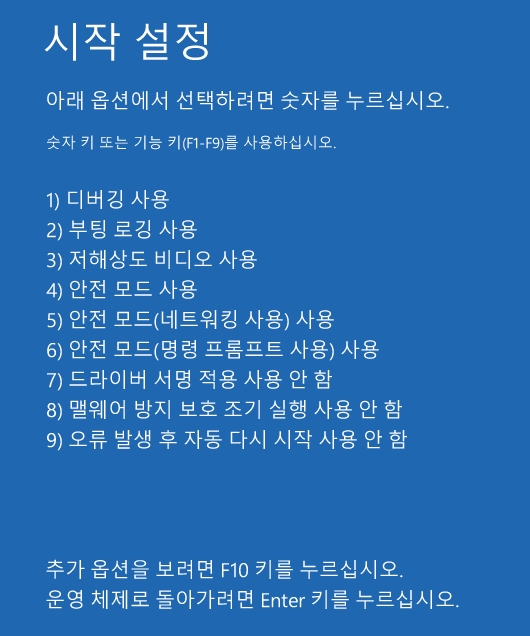

# Windows 10에서 "드라이버 서명 적용 사용 안 함" 으로 부팅하기

출처: <http://jmpcall.blogspot.com/2015/07/windows-10.html>

부팅 후 -> Windows Key -> 설정 -> 업데이트 및 복구 -> 복구 -> 고급 시작 옵션 에 다시 시작 -> 

문제 해결 -> 고급 옵션 -> 시작 설정 -> 다시 시작 ->(재부팅 후) 시작 설정에서 7번 키 누름

Vmware에 Windows 10 설치해놓고 써보고 있는데 대체적으로 디자인이며 기능이며 마음에 드네요. 계속 써봐야겠습니다.