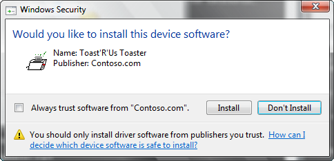
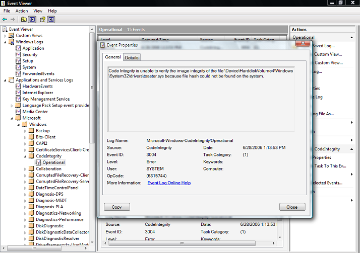

# 드라이버 서명 설치 문제 해결

출처: <https://docs.microsoft.com/ko-kr/windows-hardware/drivers/install/troubleshooting-driver-signing-installation>

### 이 문서의 내용

[릴리스 서명 된 드라이버가 올바르게 작동하는지 확인하십시오.](https://docs.microsoft.com/ko-kr/windows-hardware/drivers/install/troubleshooting-driver-signing-installation#verify-that-the-release-signed-driver-is-operating-correctly)

[릴리스 서명 된 드라이버 문제 해결](https://docs.microsoft.com/ko-kr/windows-hardware/drivers/install/troubleshooting-driver-signing-installation#troubleshoot-release-signed-drivers)

[Setupapi.dev.log 파일 분석](https://docs.microsoft.com/ko-kr/windows-hardware/drivers/install/troubleshooting-driver-signing-installation#analyzing-the-setupapidevlog-file)

[Windows 보안 감사 로그 사용](https://docs.microsoft.com/ko-kr/windows-hardware/drivers/install/troubleshooting-driver-signing-installation#using-the-windows-security-audit-log)

[코드 무결성 이벤트 작동 이벤트 로그 사용](https://docs.microsoft.com/ko-kr/windows-hardware/drivers/install/troubleshooting-driver-signing-installation#using-the-code-integrity-event-operational-event-log)

[코드 무결성 작업 로그를 검사하려면](https://docs.microsoft.com/ko-kr/windows-hardware/drivers/install/troubleshooting-driver-signing-installation#to-examine-the-code-integrity-operational-log)

[코드 무결성 상세 로그에서 정보 이벤트 사용](https://docs.microsoft.com/ko-kr/windows-hardware/drivers/install/troubleshooting-driver-signing-installation#using-the-informational-events-in-the-code-integrity-verbose-log)


릴리스 서명 드라이버 설치는 설명 된 네 가지 방법 중 하나를 사용하여 설치하는 경우 필요한 두 가지 추가 단계를 제외하고 [테스트 서명](https://docs.microsoft.com/ko-kr/windows-hardware/drivers/install/test-signing) 된 드라이버 패키지를 테스트 서명 된 패키지에 설치, 제거 및로드하는 것과 동일합니다. 하드웨어 추가 마법사를 사용하여 릴리스 서명 드라이버를 설치하면 몇 가지 일반적인 설치 문제를 포함하여 두 단계가 추가로 수행됩니다.

- 권한이 상승 된 명령 창 열기 (관리자 권한으로 명령창-cmd 열기)

- hdwwiz.cpl을 실행하여 하드웨어 추가 마법사를 시작하고 다음을 클릭하여 두 번째 페이지로 이동하십시오.

  hdwwiz.cpl 은 Windows\system32 또는 Windows\sysWOW64 에 있습니다.

- 고급 옵션을 선택하고 다음을 클릭하십시오.

- 목록 상자에서 모든 장치 표시를 선택하고 다음을 클릭하십시오.

- 디스크 있음 옵션을 선택하십시오.

- C:\toaster 드라이버 패키지가 포함 된 폴더의 경로를 입력하십시오.

- inf 파일을 선택하고 열기를 클릭하십시오.

- 확인을 클릭하십시오.

- 다음 두 페이지에서 다음을 클릭하고 마침을 클릭하여 설치를 완료합니다.

- '이 장치 소프트웨어를 설치 하시겠습니까?'라는 대화 상자에서 설치를 클릭하십시오.

- 완료를 클릭하여 설치를 완료하십시오.

10 단계는 다음 Windows 보안 대화 상자를 보여줍니다.



어떤 이유로 든 드라이버가 제거 된 경우 드라이버를 다시 설치하면 컴퓨터에이 대화 상자가 다시 표시되지 않습니다.

**참고**: 시스템은 게시자 정보가 카탈로그에 서명하는 데 사용 된 SPC를 기반으로 정확한지 확인합니다. Contoso.com 에서처럼 게시자 신뢰 수준을 알 수없는 경우 시스템에서 대화 상자를 표시합니다. 설치를 계속하려면 설치를 클릭해야합니다. 트러스트 및 드라이버 설치에 대한 자세한 내용은 **[코드 서명 우수 사례](https://msdn.microsoft.com/library/windows/hardware/dn653556)**를 참조하십시오.

반면 서명되지 않은 드라이버는 사용자가 x64 버전의 Windows에서  다음 대화 상자를 표시합니다.


### 릴리스 서명 된 드라이버가 올바르게 작동하는지 확인하십시오.

장치 관리자를 사용하여 테스트 서명 된 드라이버에 대해 앞서 설명한대로 드라이버 속성을 봅니다. 아래는 드라이버가 작동하는지 보여주기위한 스크린 샷입니다.


### 릴리스 서명 된 드라이버 문제 해결

다음 목록은 서명 된 드라이버를로드하거나 문제를 해결할 수있는 몇 가지 일반적인 방법을 제공합니다.

- 테스트 서명 된 드라이버가 [테스트 서명](https://docs.microsoft.com/ko-kr/windows-hardware/drivers/install/test-signing)이 올바르게 작동하는지 확인에서 설명한대로 하드웨어 추가 마법사 나 장치 관리자를 사용하여 드라이버가로드되고 서명되었는지 확인하십시오.
- 드라이버 설치 후 Windows\\inf 디렉토리에 생성 된 setupapi.dev.log 파일을 엽니 다. 드라이버를 설치하기 전에 레지스트리 항목 설정 및 setupapi.dev.log 파일의 이름 변경 섹션을 참조하십시오.
- Windows 보안 감사 로그 및 코드 무결성 이벤트 로그를 확인하십시오.


### Setupapi.dev.log 파일 분석

앞에서 설명한 것처럼 드라이버 설치 정보는 Windows\inf 디렉토리의 setupapi.dev.log 파일에 기록 (추가)됩니다. 드라이버가 설치되기 전에 파일의 이름이 변경되면 새 로그 파일이 생성됩니다. 새 로그 파일은 새 드라이버 설치에 대한 중요한 로그를 찾는 것이 더 쉬울 것입니다. 메모장 응용 프로그램에서 로그 파일이 열립니다.

첫 번째 가장 왼쪽 열에 느낌표 '!'가 하나 있거나 여러 느낌표 '!!!'가있을 수 있습니다. 단일 표시는 일종의 경고 메시지이지만 3 중 느낌표는 오류를 나타냅니다.

CA 공급 업체에서 제공 한 SPC 인증서로 서명 된 드라이버 패키지 릴리스를 설치하면 다음과 같은 단일 느낌표가 표시됩니다. cat 파일이 아직 확인되지 않았 음을 나타내는 경고입니다.

```
!    sig:                Verifying file against specific (valid) catalog failed! (0x800b0109)
!    sig:                Error 0x800b0109: A certificate chain processed, but terminated in a root certificate which is not trusted by the trust provider.
     sig:                Success: File is signed in Authenticode(tm) catalog.
     sig:                Error 0xe0000242: The publisher of an Authenticode(tm) signed catalog has not yet been established as trusted.
```

드라이버 설치의 10 단계를 참조하고 '설치'버튼을 클릭하면 다음과 같은 로그가 표시됩니다. 대부분의 경우 드라이버가 잘 설치되고 로드됩니다. 장치 관리자는 드라이버에 대한 오류나 노란색 점을보고하지 않습니다.

```
!    sto:           Driver package signer is unknown but user trusts the signer.
```

위의 지점까지 올라가고 있음에도 불구하고 로그 파일에 다음 오류 로그가 표시되면 드라이버가로드되지 않을 수 있습니다.

```
!!!  dvi:                          Device not started: Device has problem: 0x34: CM_PROB_UNSIGNED_DRIVER.
```

0x34는 코드 52입니다.

이 시점에서 로그 파일로 돌아가서 드라이버 바이너리에 느낌표가 있는지 여부를 확인하십시오. 그것은 약간의 단서를 제공 할 수 있습니다. 그렇지 않으면 cat 파일 및 다른 embed signed binary에 앞서 설명한 'signtool verify'명령을 실행하여 드라이버 서명에 문제가 없는지 확인해야합니다.

대부분의 경우 로그 파일 정보로 문제를 해결할 수 있습니다. 위의 검사가 근본 원인을 찾지 못하면 다음 단계는 Windows 보안 감사 로그를 검사하고 다음 절에서 설명하는 무결성 이벤트 로그를 코드화하는 것입니다.

또한 setupapi.dev.log 파일은 서비스 바이너리 파일 복사본이 커밋되지 않았지만 OS가 서비스를 시작하려고 시도 할 때 드라이버 서비스가 시작되지 않은 경우 드라이버 파일 복사 및 커밋 시간 정보를 추적하는 데 도움이됩니다. 그러나 다시 시작하면 서비스가 성공적으로 시작됩니다. 아래의 작업 순서를 로그 파일에서 확인하십시오.

```
>>>  Section start 2014/02/08 14:54:56.463
```

다음에 나중에 :

```
!    inf:                     Could not start service 'toaster'.
```

그런 다음 파일 복사 작업이 있습니다.

```
<snip>
flq:                {FILE_QUEUE_COPY}
     flq:                     CopyStyle      - 0x00000000
     flq:                     SourceRootPath - 'C:\Windows\System32\DriverStore\FileRepository\Toaster.inf_amd64_d9b35403a0fe4391\'
     flq:                     SourceFilename - 'toaster.exe'
     flq:                     TargetDirectory- 'C:\Windows\System32\drivers'
     flq:                     TargetFilename - 'toaster.exe'
```

파일은 다음에 커밋됩니다. 종료 시간과 시작 시간을 비교하십시오.

```
flq:           {_commit_file_queue} 14:54:56.711
<snip>
     flq:                     {_commit_copyfile}
     flq:                          Copying 'C:\Windows\System32\DriverStore\FileRepository\Toaster.inf_amd64_d9b35403a0fe4391\o2flash.exe' to 'C:\Windows\System32\drivers\o2flash.exe'.
     flq:                          CopyFile: 'C:\Windows\System32\DriverStore\FileRepository\Toaster.inf_amd64_d9b35403a0fe4391\o2flash.exe' to 'C:\Windows\System32\drivers\SETDA81.tmp'
     flq:                          MoveFile: 'C:\Windows\System32\drivers\SETDA81.tmp' to 'C:\Windows\System32\drivers\toaster.exe'
     cpy:                          Applied 'OEM Legacy' protection on file 'C:\Windows\System32\drivers\toaster.exe'.
     flq:                          Caller applied security to file 'C:\Windows\System32\drivers\toaster.exe'.
     flq:                     {_commit_copyfile exit OK}
<snip>
     sto:      {Configure Driver Package: exit(0x00000bc3)}
     ndv:      Restart required for any devices using this driver.
<snip>
<<<  Section end 2014/02/08 14:54:57.024
<<<  [Exit status: SUCCESS]
```

위의 내용은 Windows 7에서 제대로 작동하는 드라이버 업데이트의 경우이지만 Windows 8.0 및 8.1에서는 실패하여 버그가 발견되었습니다.


### Windows 보안 감사 로그 사용

유효한 서명이 없어서 드라이버를로드하지 못한 경우 코드 무결성이 드라이버 파일의 이미지 해시를 확인할 수 없음을 나타내는 감사 실패 이벤트가 Windows 보안 로그에 기록됩니다. 로그 항목에는 드라이버 파일의 전체 경로 이름이 포함됩니다. 보안 로그 감사 이벤트는 로컬 보안 감사 정책이 시스템 실패 이벤트 로깅을 사용 가능하게하는 경우에만 생성됩니다.

**주의**: 보안 감사 로그를 명시 적으로 사용하도록 설정해야합니다. 자세한 내용은 부록 3 : [코드 무결성 이벤트 로깅 및 시스템 감사 사용](https://docs.microsoft.com/ko-kr/windows-hardware/drivers/install/appendix-3--enable-code-integrity-event-logging-and-system-auditing)을 참조하십시오.

보안 로그를 검사하려면 다음과 같이하십시오.

- 관리자 원한으로 명령 창을 엽니다.
- Windows 이벤트 뷰어를 시작하려면 Eventvwr.exe를 실행하십시오. 이벤트 뷰어는 제어판 컴퓨터 관리 응용 프로그램에서 시작할 수도 있습니다.
- Windows 보안 감사 로그를 엽니다.
- 로그에서 이벤트 ID가 5038 인 시스템 무결성 이벤트를 확인하십시오.
- 로그 항목을 두 번 클릭하여 해당 이벤트에 대한 자세한 설명을 제공하는 이벤트 속성 대화 상자를 표시합니다.

아래 스크린 샷은 서명되지 않은 Toaster.sys 파일로 인해 발생한 보안 감사 로그 이벤트의 이벤트 속성 대화 상자를 보여줍니다.


### 코드 무결성 이벤트 작동 이벤트 로그 사용

드라이버가 서명되지 않았거나 이미지 확인 오류가 발생하여로드하지 못한 경우 코드 무결성은 이벤트를 코드 무결성 작동 이벤트 로그에 기록합니다. 코드 무결성 운영 이벤트는 항상 활성화됩니다.

코드 무결성 이벤트는 이벤트 뷰어로 볼 수 있습니다.


### 코드 무결성 작업 로그를 검사하려면

- 관리자 권한으로 명령 창을 엽니다.
- Windows 이벤트 뷰어를 시작하려면 Eventvwr.exe를 실행하십시오. 이벤트 뷰어는 컴퓨터 관리 제어판 응용 프로그램에서 시작할 수도 있습니다.
- Windows 코드 무결성 로그를 엽니다.
- 로그 항목을 두 번 클릭하여 해당 이벤트에 대한 자세한 설명을 제공하는 이벤트 속성 대화 상자를 표시합니다.

아래 스크린 샷은 서명되지 않은 Toaster.sys 파일에 의해 발생한 코드 무결성 작업 로그 이벤트의 이벤트 속성 대화 상자를 보여줍니다.




### 코드 무결성 상세 로그에서 정보 이벤트 사용

코드 무결성 정보 로그의 상세보기는 모든 커널 모드 이미지 확인 검사에 대한 이벤트를 추적합니다. 이 이벤트는 시스템에 로드 된 모든 드라이버의 성공적인 이미지 확인을 보여줍니다.

코드 무결성 (Code Integrity) 상세보기를 활성화하려면,

- 앞의 예와 같이 이벤트 뷰어를 시작합니다.
- 코드 무결성 노드를 클릭하여 포커스를 부여합니다.
- 코드 무결성을 마우스 오른쪽 단추로 클릭하고 바로 가기 메뉴에서보기 항목을 선택합니다.
- 분석 및 디버그 로그 표시를 선택합니다. 그러면 Operational 및 Verbose라는 두 개의 추가 노드가있는 하위 트리가 만들어집니다.
- Verbose 노드를 마우스 오른쪽 단추로 클릭 한 다음 바로 가기 메뉴에서 Properties를 선택하십시오.
- 일반 탭에서 자세한 로깅 모드를 사용하려면 로깅 사용을 선택합니다.
- 모든 커널 모드 바이너리를 다시로드하려면 시스템을 재부팅하십시오.
- 다시 부팅 한 후 MMC 컴퓨터 관리 스냅인을 열고 코드 무결성 자세한 이벤트 로그를 봅니다.


추가로 알려진 드라이버 서명 문제는 부록 4 : [드라이버 서명 문제](https://docs.microsoft.com/ko-kr/windows-hardware/drivers/install/appendix-4--driver-signing-issues)에서 설명합니다.