# ASP.NET Tutorial

출처: <https://www.tutorialspoint.com/asp.net/index.htm>

ASP.NET은 프로그래머가 동적 웹 사이트를 만들 수 있도록 Microsoft에서 개발 및 판매하는 웹 응용 프로그램 프레임 워크입니다. C# 또는 VB.NET과 같은 완전한 기능의 프로그래밍 언어를 사용하여 웹 응용 프로그램을 쉽게 작성할 수 있습니다.

이 자습서에서는 초보자가 시작하는 데 필요한 ASP.NET의 모든 기본 요소를 다룹니다.

## Audience

이 자습서는 초보자가 기본 ASP.NET 프로그래밍을 이해할 수 있도록 준비되었습니다. 이 튜토리얼을 마친 후에는 ASP.NET 프로그래밍에 대한 전문 지식을 바탕으로 다음 단계로 나아갈 수 있습니다.

## Prerequisites

이 자습서를 진행하기 전에 .NET 프로그래밍 언어에 대한 기본적인 이해가 있어야합니다. ASP.NET 웹 응용 프로그램 프레임 워크를 사용하여 웹 기반 응용 프로그램을 개발할 예정이므로 HTML, CSS, AJAX와 같은 다른 웹 기술을 이해하는 것이 좋습니다. 기타


# ASP.NET - Introduction

ASP.NET은 프로그래밍 모델, 포괄적 인 소프트웨어 인프라 및 모바일 장치는 물론 PC 용 강력한 웹 응용 프로그램을 구축하는 데 필요한 다양한 서비스를 제공하는 웹 개발 플랫폼입니다.

ASP.NET은 HTTP 프로토콜을 기반으로 작동하며 HTTP 명령과 정책을 사용하여 브라우저 간 서버 상호 통신 및 협력을 설정합니다.

ASP.NET은 Microsoft .Net 플랫폼의 일부입니다. ASP.NET 응용 프로그램은 .Net 프레임 워크에있는 확장 가능하고 재사용 가능한 구성 요소 또는 개체를 사용하여 작성된 컴파일 된 코드입니다. 이 코드는 .Net 프레임 워크에서 클래스의 전체 계층 구조를 사용할 수 있습니다.

ASP.NET 응용 프로그램 코드는 다음 언어로 작성할 수 있습니다.

- C#
- Visual Basic .Net
- Javascript
- J#

ASP.NET은 인터넷을 통해 대화 형 데이터 기반 웹 응용 프로그램을 만드는 데 사용됩니다. HTML 페이지를 만들기 위해 텍스트 상자, 단추, 레이블을 조합, 구성 및 조작하기위한 레이블과 같은 많은 수의 컨트롤로 구성됩니다.

## ASP.NET Web Forms Model

ASP.NET 웹 양식은 이벤트 기반의 상호 작용 모델을 웹 응용 프로그램으로 확장합니다. 브라우저는 웹 양식을 웹 서버에 제출하고 서버는 전체 마크 업 페이지 또는 HTML 페이지를 응답으로 보냅니다.

모든 클라이언트 측 사용자 활동은 상태 저장 처리를 위해 서버로 전달됩니다. 서버는 클라이언트 조치의 출력을 처리하고 반응을 트리거합니다.

이제 HTTP는 상태 비 저장 프로토콜입니다. ASP.NET 프레임 워크는 응용 프로그램 상태와 관련된 정보를 저장하는 데 도움이됩니다.

- Page state
- Session state

페이지 상태는 클라이언트의 상태, 즉 웹 양식의 다양한 입력 필드의 내용입니다. 세션 상태는 사용자가 방문하여 작업 한 다양한 페이지, 즉 전체 세션 상태로부터 얻은 집합 정보이다. 개념을 지우려면 장바구니를 예로 들어 보겠습니다.

사용자가 쇼핑 카트에 항목을 추가합니다. 항목은 페이지에서 선택하고 항목 페이지를 말하며 수집 한 총 항목과 가격은 다른 페이지에 표시됩니다 (예 : 장바구니 페이지). HTTP만이 여러 페이지에서 오는 모든 정보를 추적 할 수 없습니다. ASP.NET 세션 상태 및 서버 측 인프라는 세션에서 전역적으로 수집 된 정보를 추적합니다.

ASP.NET 런타임은 ASP.NET 런타임 코드를 생성하는 동안 페이지 요청을 통해 서버와 페이지 상태를주고받으며 숨겨진 필드에 서버 측 구성 요소의 상태를 통합합니다.

이렇게하면 서버가 전체 응용 프로그램 상태를 인식하고 2 계층 연결 방식으로 작동합니다.

## The ASP.NET Component Model

ASP.NET 구성 요소 모델은 ASP.NET 페이지의 다양한 구성 요소를 제공합니다. 기본적으로 그것은 다음을 설명하는 객체 모델입니다.

- 거의 모든 HTML 요소 또는 태그의 서버 측 대응 부분 (예 : <form> and <input>.)
- 복잡한 사용자 인터페이스를 개발하는 데 도움이되는 서버 컨트롤. 예를 들어, Calendar 컨트롤이나 Gridview 컨트롤.

ASP.NET은 모든 웹 관련 기능을 포함하는 .Net 프레임 워크에서 작동하는 기술입니다. .NET 프레임 워크는 객체 지향 계층 구조로되어 있습니다. ASP.NET 웹 응용 프로그램은 페이지로 구성됩니다. 사용자가 ASP.NET 페이지를 요청하면 IIS는 페이지 처리를 ASP.NET 런타임 시스템에 위임합니다.

ASP.NET 런타임은 .NET Framework의 기본 클래스 페이지에서 상속되는 .aspx 페이지를 클래스의 인스턴스로 변환합니다. 따라서 각 ASP.NET 페이지는 개체이며 모든 구성 요소 즉 서버 쪽 컨트롤도 개체입니다.

## Components of .Net Framework 3.5

Visual Studio.Net의 다음 세션으로 이동하기 전에 .Net 프레임 워크 3.5의 다양한 구성 요소를 살펴 보겠습니다. 다음 표에서는 .NET Framework 3.5의 구성 요소와 해당 구성 요소가 수행하는 작업에 대해 설명합니다.

### 구성 요소 및 설명

#### **(1) Common Language Runtime or CLR**

메모리 관리, 예외 처리, 디버깅, 보안 검사, 스레드 실행, 코드 실행, 코드 안전성, 확인 및 컴파일을 수행합니다. CLR에서 직접 관리하는 코드를 관리되는 코드라고합니다. 관리되는 코드가 컴파일 될 때 컴파일러는 소스 코드를 CPU 독립 중간 언어 (IL) 코드로 변환합니다. Just In Time (JIT) 컴파일러는 IL 코드를 CPU 고유의 원시 코드로 컴파일합니다.


#### **(2) .Net Framework Class Library**

여기에는 재사용 가능한 유형의 거대한 라이브러리가 포함되어 있습니다. 클래스, 인터페이스, 구조체 및 열거 형 값 (집합 적으로 유형이라고 함)이 있습니다.


#### **(3) Common Language Specification**

.Net 지원 언어 및 언어 통합 구현을위한 사양을 포함합니다.


#### **(4) Common Type System**

런타임시 유형 선언, 사용 및 관리에 대한 지침과 언어 간 통신을 제공합니다.


#### **(5) Metadata and Assemblies**

메타 데이터는 이식 가능한 실행 파일 (PE) 또는 메모리에 저장된 프로그램을 설명하는 이진 정보입니다. 어셈블리는 어셈블리 매니페스트, 형식 메타 데이터, IL 코드 및 이미지 파일과 같은 리소스 집합으로 구성된 논리 단위입니다.


#### **(6) Windows Forms**

Windows Forms에는 응용 프로그램에 표시된 모든 창의 그래픽 표현이 포함됩니다.


#### **(7) ASP.NET and ASP.NET AJAX**

ASP.NET은 웹 개발 모델이며 AJAX는 AJAX 기능을 개발하고 구현하기위한 ASP.NET의 확장입니다. **ASP.NET AJAX에는 개발자가 페이지를 완전히 다시로드하지 않고도 웹 사이트의 데이터를 업데이트 할 수있는 구성 요소가 포함되어 있습니다.**


#### **(8) ADO.NET**

데이터 및 데이터베이스 작업에 사용되는 기술입니다. SQL 서버, OLE DB, XML 등과 같은 데이터 소스에 대한 액세스를 제공합니다. ADO.NET은 데이터 검색, 조작 및 업데이트를위한 데이터 소스에 대한 연결을 허용합니다.


#### **(9) Windows Workflow Foundation (WF)**

Windows의 워크 플로 기반 응용 프로그램을 작성하는 데 도움이됩니다. 여기에는 활동, 워크 플로 런타임, 워크 플로 디자이너 및 규칙 엔진이 포함됩니다.


#### **(10) Windows Presentation Foundation**

사용자 인터페이스와 비즈니스 로직을 구분합니다. 문서, 미디어, 2 차원 및 3 차원 그래픽, 애니메이션 등을 사용하여 시각적으로 놀라운 인터페이스를 개발하는 데 도움이됩니다.


#### **(11) Windows Communication Foundation (WCF)**

연결된 시스템을 구축하고 실행하는 데 사용되는 기술입니다.


#### **(12) Windows CardSpace**

자원 액세스 및 인터넷상의 개인 정보 공유에 대한 안전을 제공합니다.


#### **(13) LINQ**

전통 쿼리 언어 SQL과 유사한 구문을 사용하여 .Net 언어에 데이터 쿼리 기능을 부여합니다.


## ASP.NET - Environment Setup

ASP.NET은 웹 응용 프로그램이 구축되는 HTTP 위에 추상화 계층을 제공합니다. 객체 지향 패러다임 내에서 클래스 및 구성 요소와 같은 상위 수준의 엔터티를 제공합니다.

ASP.NET 응용 프로그램 및 프론트 엔드를 개발하기위한 핵심 개발 도구는 Visual Studio입니다. 이 튜토리얼에서는 Visual Studio 2008을 사용합니다.

Visual Studio는 코드 작성, 컴파일 및 디버깅을위한 통합 개발 환경입니다. ASP.NET 웹 응용 프로그램, 웹 서비스, 데스크톱 응용 프로그램 및 모바일 응용 프로그램을 개발할 수있는 완벽한 개발 도구 모음을 제공합니다.


## Installation

Visual Studio 설치 과정은 생략함.


## The Visual Studio IDE

새 프로젝트 창의 사용 가능한 템플리트에서 응용 프로그램 템플리트를 선택할 수 있습니다.

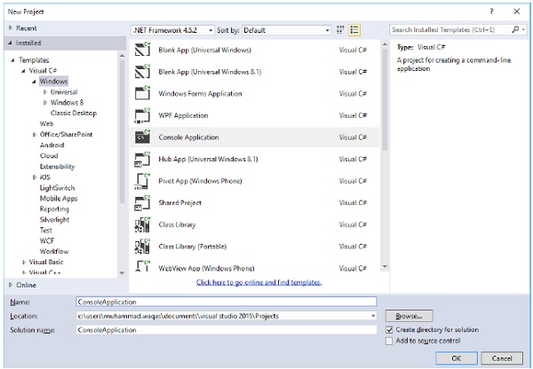

새 웹 사이트를 시작하면 ASP.NET은 사이트의 첫 번째 웹 양식에 대한 두 개의 파일을 포함하여 사이트의 시작 폴더와 파일을 제공합니다.

Default.aspx라는 파일에는 양식을 정의하는 HTML 및 ASP 코드가 들어 있으며 Default.aspx.cs (C# 코드 용) 또는 Default.aspx.vb (VB 코드 용) 파일에는 당신이 선택한 언어와이 코드는 폼에서 수행 된 작업을 담당합니다.

Visual Studio IDE의 기본 창은 Web Forms Designer 창입니다. 다른 지원 창에는 도구 상자, 솔루션 탐색기 및 속성 창이 있습니다. 디자이너를 사용하여 웹 양식을 디자인하고 필요에 따라 양식이 작동하도록 양식의 컨트롤에 코드를 추가하려면 코드 편집기를 사용합니다.

## 뷰와 윈도우로 작업하기

다음과 같은 방법으로 Windows 작업을 할 수 있습니다.

- 하나의 View 에서 다른 View 로 Web Forms Designer를 변경하려면 디자인 또는 소스 단추를 클릭합니다.
- 창을 닫으려면 오른쪽 상단 모서리에있는 닫기 단추를 클릭하고 다시 표시하려면보기 메뉴에서 선택하십시오.
- 창을 숨기려면 자동 숨기기 버튼을 클릭하십시오. 그런 다음 창은 탭으로 바뀝니다. 다시 표시하려면 자동 숨기기 단추를 다시 클릭하십시오.
- 창 크기를 변경하려면 창을 드래그하십시오.

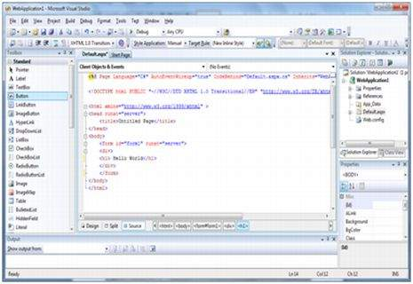


##     웹 사이트에 폴더 및 파일 추가하기

새 웹 양식이 만들어지면 Visual Studio는 양식의 시작 HTML을 자동으로 생성하고 웹 양식 디자이너의 소스보기에 표시합니다. 솔루션 탐색기는 다른 파일, 폴더 또는 웹 사이트의 기존 항목을 추가하는 데 사용됩니다.

- 표준 폴더를 추가하려면 솔루션 탐색기에서 폴더를 추가 할 프로젝트 나 폴더를 마우스 오른쪽 단추로 클릭하고 새 폴더를 선택하십시오.
- ASP.NET 폴더를 추가하려면 솔루션 탐색기에서 프로젝트를 마우스 오른쪽 단추로 클릭하고 목록에서 폴더를 선택하십시오.
- 사이트에 기존 항목을 추가하려면 솔루션 탐색기에서 항목을 추가 할 프로젝트 또는 폴더를 마우스 오른쪽 단추로 클릭하고 대화 상자에서 선택하십시오.


## 프로젝트 및 솔루션

일반적인 ASP.NET 응용 프로그램은 웹 콘텐츠 파일 (.aspx), 소스 파일 (.cs 파일), 어셈블리 (.dll 및 .exe 파일), 데이터 원본 파일 (.mdb 파일), 참조, 아이콘 등 많은 항목으로 구성됩니다. , 사용자 컨트롤 및 기타 기타 파일 및 폴더. 웹 사이트를 구성하는 모든 파일은 솔루션에 포함되어 있습니다.

새 웹 사이트를 만들 때. VB2008은 솔루션을 자동으로 생성하고 솔루션 탐색기에 표시합니다.

솔루션에는 하나 이상의 프로젝트가 포함될 수 있습니다. 프로젝트에는 내용 파일, 원본 파일 및 데이터 소스 및 이미지 파일과 같은 기타 파일이 포함됩니다. 일반적으로 프로젝트의 내용은 어셈블리로 실행 파일 (.exe) 또는 동적 연결 라이브러리 (.dll) 파일로 컴파일됩니다.

일반적으로 프로젝트에는 다음과 같은 내용 파일이 있습니다.

- Page file (.aspx)
- User control (.ascx)
- Web service (.asmx)
- Master page (.master)
- Site map (.sitemap)
- Website configuration file (.config)


## Building and Running a Project

다음을 통해 응용 프로그램을 실행할 수 있습니다.

- Selecting Start
- Selecting Start Without Debugging from the Debug menu,
- pressing F5
- Ctrl-F5

이 프로그램은 빌드 된 의미로, .exe 또는 .dll 파일은 빌드 메뉴에서 명령을 선택하여 생성됩니다.


# ASP.NET - Life Cycle

ASP.NET 라이프 사이클 지정 방법 :

- ASP.NET이 페이지를 처리하여 동적 출력 생성
- 응용 프로그램과 해당 페이지가 인스턴스화되고 처리됩니다.
- ASP.NET은 동적으로 페이지를 컴파일합니다.

ASP.NET 수명주기는 두 그룹으로 나눌 수 있습니다.

- Application Life Cycle
- Page Life Cycle


## ASP.NET Application Life Cycle

응용 프로그램 수명주기에는 다음 단계가 있습니다.

- 사용자가 응용 프로그램 리소스 (페이지)에 대한 액세스를 요청합니다. 브라우저가이 요청을 웹 서버로 보냅니다.
- 통합 파이프 라인이 첫 번째 요청을 받고 다음 이벤트가 발생합니다.
  - ApplicationManager 클래스의 객체가 만들어집니다.
  - HostingEnvironment 클래스의 개체는 리소스와 관련된 정보를 제공하기 위해 만들어집니다.
  - 응용 프로그램의 최상위 항목이 컴파일됩니다.
- 응답 개체가 만들어집니다. HttpContext, HttpRequest 및 HttpResponse와 같은 응용 프로그램 개체가 만들어지고 초기화됩니다.
- HttpApplication 객체의 인스턴스가 생성되어 요청에 할당됩니다.
- 요청은 HttpApplication 클래스에 의해 처리됩니다. 요청을 처리하기 위해이 클래스가 다른 이벤트를 발생시킵니다.

## ASP.NET Page Life Cycle

페이지가 요청되면 서버 메모리에로드되어 처리되고 브라우저로 전송됩니다. 그런 다음 메모리에서 언로드됩니다. 이러한 각 단계에서 메서드 및 이벤트를 사용할 수 있으며 응용 프로그램의 필요에 따라 재정의 할 수 있습니다. 즉, 기본 코드를 재정의하는 고유 한 코드를 작성할 수 있습니다.

Page 클래스는 페이지의 모든 컨트롤에 대한 계층 적 트리를 만듭니다. 지시문을 제외한 페이지의 모든 구성 요소는이 컨트롤 트리의 일부입니다. 페이지 지시문에 trace = 'true'를 추가하여 컨트롤 트리를 볼 수 있습니다. 우리는 '지시어'와 '이벤트 처리'에서 페이지 지시문과 추적을 다룰 것입니다.

페이지 수명주기 단계는 다음과 같습니다.

- 초기화
- 페이지의 컨트롤 인스턴스화
- 상태의 복원 및 유지
- 이벤트 처리기 코드 실행
- 페이지 렌더링

페이지주기를 이해하면 페이지 수명주기의 어느 단계에서든 특정 작업을 수행하기위한 코드를 작성하는 데 도움이됩니다. 또한 사용자 지정 컨트롤 작성 및 적절한 시간에 초기화, 뷰 상태 데이터로 해당 속성 채우기 및 컨트롤 동작 코드 실행에 도움이됩니다.

다음은 ASP.NET 페이지의 여러 단계입니다.

- **Page request** - ASP.NET은 페이지 요청을 받으면 페이지를 구문 분석하고 컴파일할지 여부를 결정하거나 캐시 된 버전의 페이지를 만듭니다. 그에 따라 응답이 전송됩니다.
- **Starting of page life cycle** - 이 단계에서 요청 및 응답 개체가 설정됩니다. 요청이 이전 요청이거나 포스트 백 인 경우 페이지의 IsPostBack 속성이 true로 설정됩니다. 페이지의 UICulture 속성도 설정됩니다.
- **Page initialization** - 이 단계에서 UniqueID 속성을 설정하여 페이지의 컨트롤에 고유 ID가 할당되고 테마가 적용됩니다. 새 요청의 경우 포스트 백 데이터가로드되고 컨트롤 속성이 뷰 상태 값으로 복원됩니다.
- **Page load** - 이 단계에서 컨트롤 속성은 뷰 상태 및 컨트롤 상태 값을 사용하여 설정됩니다.
- **Validation** -  유효성 검사 컨트롤의 Validate 메서드가 호출되고 성공적으로 실행되면 페이지의 IsValid 속성이 true로 설정됩니다.
- **Postback event handling** - 요청이 다시 게시 (이전 요청) 인 경우 관련 이벤트 처리기가 호출됩니다.
- **Page rendering** - 이 단계에서 페이지 및 모든 컨트롤의보기 상태가 저장됩니다. 페이지는 각 컨트롤에 대한 Render 메서드를 호출하고 렌더링 출력은 page의 Response 속성에있는 OutputStream 클래스에 기록됩니다.
- **Unload** -  렌더링 된 페이지가 클라이언트에 보내지고 응답 및 요청과 같은 페이지 속성이 언로드되고 모든 정리가 완료됩니다.


## ASP.NET Page Life Cycle Events

페이지 수명주기의 각 단계에서 페이지는 코딩 할 수있는 일부 이벤트를 발생시킵니다. 이벤트 핸들러는 기본적으로 Onclick 또는 handle과 같은 선언적 속성을 사용하여 이벤트에 바인딩 된 함수 또는 서브 루틴입니다.

다음은 페이지 수명주기 이벤트입니다.

- **PreInit** - PreInit은 페이지 수명주기의 첫 번째 이벤트입니다. IsPostBack 속성을 확인하고 페이지가 포스트 백인지 여부를 확인합니다. 테마 및 마스터 페이지를 설정하고 동적 컨트롤을 만들고 프로필 속성 값을 가져오고 설정합니다. 이 이벤트는 OnPreInit 메서드를 오버로드하거나 Page_PreInit 처리기를 만들어 처리 할 수 있습니다.
- **Init** -  Init 이벤트는 컨트롤 속성을 초기화하고 컨트롤 트리가 작성됩니다. 이 이벤트는 OnInit 메서드를 오버로드하거나 Page_Init 처리기를 만들어 처리 할 수 있습니다.
- **InitComplete** - InitComplete 이벤트로 뷰 상태를 추적 할 수 있습니다. 모든 컨트롤은 뷰 상태 추적을 켭니다.
- **LoadViewState** - LoadViewState 이벤트를 사용하면 뷰 상태 정보를 컨트롤에로드 할 수 있습니다.
- **LoadPostData** - 이 단계에서 모든 입력 필드의 내용은 <form> 태그가 처리되어 정의됩니다.
- **PreLoad** - PreLoad는 포스트 백 데이터가 컨트롤에로드되기 전에 발생합니다. 이 이벤트는 OnPreLoad 메서드를 오버로드하거나 Page_PreLoad 처리기를 만들어 처리 할 수 있습니다.
- **Load** - 페이지에 대해 Load 이벤트가 발생하고 모든 자식 컨트롤에 대해 반복적으로 발생합니다. 컨트롤 트리의 컨트롤이 생성됩니다. 이 이벤트는 OnLoad 메서드를 오버로드하거나 Page_Load 처리기를 생성하여 처리 할 수 있습니다.
- **LoadComplete** - 로딩 프로세스가 완료되고 제어 이벤트 핸들러가 실행되며 페이지 유효성 검사가 수행됩니다. 이 이벤트는 OnLoadComplete 메서드를 오버로드하거나 Page_LoadComplete 처리기를 생성하여 처리 할 수 있습니다.
- **PreRender** - PreRender 이벤트는 출력이 렌더링되기 직전에 발생합니다. 이 이벤트를 처리하면 출력이 렌더링되기 전에 페이지와 컨트롤이 모든 업데이트를 수행 할 수 있습니다.
- **PreRenderComplete** -  PreRender 이벤트는 모든 자식 컨트롤에 대해 재귀 적으로 실행되므로이 이벤트는 렌더링 전 단계의 완료를 보장합니다.
- **SaveStateComplete** -  페이지의 제어 상태가 저장됩니다. 개인화, 제어 상태 및보기 상태 정보가 저장됩니다. HTML 마크 업이 생성됩니다. 이 단계는 Render 메서드를 재정의하거나 Page_Render 처리기를 만들어 처리 할 수 있습니다.
- **UnLoad** - UnLoad 단계는 페이지 수명주기의 마지막 단계입니다. 모든 컨트롤에 대해 UnLoad 이벤트를 재귀 적으로 발생시키고 마지막으로 페이지 자체에 대해 발생시킵니다. 최종 정리가 완료되고 데이터베이스 연결과 같은 모든 자원 및 참조가 해제됩니다. 이 이벤트는 OnUnLoad 메서드를 수정하거나 Page_UnLoad 처리기를 만들어 처리 할 수 있습니다.


# ASP.NET - First Example

ASP.NET 페이지는 HTML 컨트롤, 텍스트 및 이미지와 함께 여러 서버 컨트롤로 구성됩니다. 페이지의 중요한 데이터와 페이지의 다른 컨트롤의 상태는 해당 페이지 요청의 컨텍스트를 구성하는 숨김 필드에 저장됩니다.

ASP.NET 런타임은 페이지 인스턴스와 해당 상태 간의 연결을 제어합니다. ASP.NET 페이지는 Page의 객체이거나 상속 된 객체입니다.

페이지의 모든 컨트롤은 부모 Control 클래스에서 상속 된 관련 컨트롤 클래스의 개체이기도합니다. 페이지가 실행되면 개체 페이지의 인스턴스가 모든 콘텐츠 컨트롤과 함께 만들어집니다.

ASP.NET 페이지는 .aspx 확장명으로 저장된 서버 쪽 파일이기도합니다. 이 모듈은 본질적으로 모듈이며 다음과 같은 핵심 섹션으로 나눌 수 있습니다.

- 페이지 지시문
- 코드 섹션
- 페이지 레이아웃

## Page Directives

페이지 지시문은 페이지를 실행할 환경을 설정합니다. Page 지시문은 ASP.NET 페이지 구문 분석기 및 컴파일러에서 사용하는 페이지 별 특성을 정의합니다. 페이지 지시문은 페이지 처리 방법과 페이지에 대한 가정을 지정합니다.

네임 스페이스 가져 오기, 어셈블리로드 및 새 컨트롤 등록에 사용자 지정 태그 이름과 네임 스페이스 접두사를 사용할 수 있습니다.


## Code Section

코드 섹션은 필요한 다른 기능과 함께 페이지 및 제어 이벤트에 대한 핸들러를 제공합니다. ASP.NET은 객체 모델을 따릅니다. 이제 이러한 객체는 사용자가 버튼을 클릭하거나 커서를 이동하는 것처럼 일부 이벤트가 사용자 인터페이스에서 발생할 때 이벤트를 발생시킵니다. 이러한 이벤트가 왕복하는 데 필요한 응답의 종류는 이벤트 처리기 기능에 코딩되어 있습니다. 이벤트 핸들러는 컨트롤에 바인딩 된 함수 일뿐입니다.

코드 섹션 또는 코드 숨김 파일은 이러한 모든 이벤트 처리기 루틴과 개발자가 사용하는 다른 함수를 제공합니다. 페이지 코드는 미리 컴파일되어 바이너리 어셈블리의 형태로 배포 될 수 있습니다.


## Page Layout

페이지 레이아웃은 페이지의 인터페이스를 제공합니다. 여기에는 서버 컨트롤, 텍스트, 인라인 JavaScript 및 HTML 태그가 포함됩니다.

다음 코드 단편은 C# 으로 작성된 페이지 지시문, 코드 섹션 및 페이지 레이아웃을 설명하는 샘플 ASP.NET 페이지를 제공합니다.

``` csharp
<!-- directives -->
<% @Page Language="C#" %>

<!-- code section -->
<script runat="server">

   private void convertoupper(object sender, EventArgs e)
   {
      string str = mytext.Value;
      changed_text.InnerHtml = str.ToUpper();
   }
</script>

<!-- Layout -->
<html>
   <head> 
      <title> Change to Upper Case </title> 
   </head>
   
   <body>
      <h3> Conversion to Upper Case </h3>
      
      <form runat="server">
         <input runat="server" id="mytext" type="text" />
         <input runat="server" id="button1" type="submit" value="Enter..." OnServerClick="convertoupper"/>
         
         <hr />
         <h3> Results: </h3>
         <span runat="server" id="changed_text" />
      </form>
      
   </body>
   
</html>
```

이 파일을 웹 서버 루트 디렉토리에 복사하십시오. 일반적으로 c :\iNETput\wwwroot입니다. 브라우저에서 파일을 열어 실행하면 다음과 같은 결과가 생성됩니다.

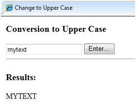

## Visual Studio IDE 사용

Visual Studio IDE를 사용하여 동일한 예제를 개발하겠습니다. 코드를 입력하는 대신 컨트롤을 디자인보기로 드래그 할 수 있습니다.

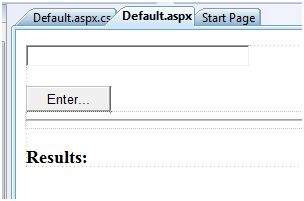

콘텐츠 파일이 자동으로 개발됩니다. 추가 할 필요가있는 것은 Button1_Click 루틴뿐입니다.

```csharp
protected void Button1_Click(object sender, EventArgs e)
{
   string buf = TextBox1.Text;
   changed_text.InnerHtml = buf.ToUpper();
}
```

콘텐츠 파일 코드는 다음과 같습니다.

```csharp
<%@ Page Language="C#" AutoEventWireup="true" CodeBehind="Default.aspx.cs" 
   Inherits="firstexample._Default" %>

<!DOCTYPE html PUBLIC "-//W3C//DTD XHTML 1.0 Transitional//EN" "http://www.w3.org/TR/xhtml1/DTD/xhtml1-transitional.dtd">

<html xmlns="http://www.w3.org/1999/xhtml" >

   <head runat="server">
      <title>
         Untitled Page
      </title>
   </head>
   
   <body>
   
      <form id="form1" runat="server">
         <div>
         
            <asp:TextBox ID="TextBox1" runat="server" style="width:224px">
            </asp:TextBox>
            
            <br />
            <br />
            
            <asp:Button ID="Button1" runat="server" Text="Enter..." style="width:85px" onclick="Button1_Click" />
            <hr />
            
            <h3> Results: </h3>
            <span runat="server" id="changed_text" />
            
         </div>
      </form>
      
   </body>
   
</html>
```

디자인보기에서 마우스 오른쪽 버튼을 클릭하고 팝업 메뉴에서 '브라우저에서보기'를 선택하여 예제를 실행하십시오. 이렇게하면 다음 결과가 생성됩니다.

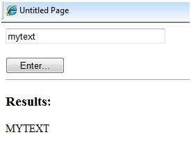


# ASP.NET - Event Handling

이벤트는 마우스 클릭, 키 누름, 마우스 이동 또는 시스템 생성 통지와 같은 조치 또는 발생입니다. 프로세스는 이벤트를 통해 통신합니다. 예를 들어, 인터럽트는 시스템 생성 이벤트입니다. 이벤트가 발생하면 응용 프로그램은 이벤트에 응답하고 이벤트를 관리 할 수 있어야합니다.

ASP.NET의 이벤트는 클라이언트 시스템에서 발생하고 서버 시스템에서 처리됩니다. 예를 들어 사용자가 브라우저에 표시된 버튼을 클릭합니다. Click 이벤트가 발생합니다. 브라우저는 서버에 게시하여이 클라이언트 측 이벤트를 처리합니다.

서버에는 이벤트가 발생할 때 수행 할 작업을 설명하는 서브 루틴이 있습니다. 이를 이벤트 핸들러라고합니다. 따라서 이벤트 메시지가 서버에 전송되면 Click 이벤트에 연결된 이벤트 처리기가 있는지 여부를 확인합니다. 이벤트 핸들러가 있으면 이벤트 핸들러가 실행됩니다.


## Event Arguments

ASP.NET 이벤트 처리기는 일반적으로 두 개의 매개 변수를 사용하고 void를 반환합니다. 첫 번째 매개 변수는 이벤트를 발생시키는 객체를 나타내고 두 번째 매개 변수는 이벤트 인수입니다.

이벤트의 일반적인 구문은 다음과 같습니다.

```csharp
private void EventName (object sender, EventArgs e);
```


## Application and Session Events

가장 중요한 응용 프로그램 이벤트는 다음과 같습니다.

- **Application_Start** - 응용 프로그램 / 웹 사이트가 시작될 때 발생합니다.
- **Application_End** - 응용 프로그램 / 웹 사이트가 중지되면 발생합니다.

비슷하게 가장 많이 사용되는 Session 이벤트는 다음과 같습니다.

- **Session_Start** - 사용자가 애플리케이션에서 페이지를 처음 요청할 때 발생합니다.
- **Session_End** - 세션이 끝나면 발생합니다.


## Page and Control Events

공통 페이지 및 제어 이벤트는 다음과 같습니다.

- **DataBinding** - 컨트롤이 데이터 소스에 바인딩 될 때 발생합니다.
- **Disposed** - 페이지 또는 컨트롤이 해제 될 때 발생합니다.
- **Error** - 처리되지 않은 예외가 발생할 때 발생하는 페이지 이벤트입니다.
- **Init** - 페이지 또는 컨트롤이 초기화 될 때 발생합니다.
- **Load** - 페이지 또는 컨트롤이로드 될 때 발생합니다.
- **PreRender** -  페이지 또는 컨트롤을 렌더링 할 때 발생합니다.
- **Unload** -  페이지 또는 컨트롤이 메모리에서 언로드 될 때 발생합니다.


Button 컨트롤의 ASP 태그 :

```csharp
<asp:Button ID="btnCancel" runat="server" Text="Cancel" />
```

Click 이벤트의 이벤트 처리기입니다.

```vbscript
Protected Sub btnCancel_Click(ByVal sender As Object, ByVal e As System.EventArgs) 

   Handles btnCancel.Click
   
End Sub
```

Handles 절을 사용하지 않고도 이벤트를 코딩 할 수 있습니다. 그런 다음 핸들러는 해당 컨트롤의 적절한 이벤트 속성에 따라 명명되어야합니다.

단추 컨트롤의 ASP 태그 :

``` csharp
<asp:Button ID="btnCancel" runat="server" Text="Cancel" Onclick="btnCancel_Click" />
```

Click 이벤트의 이벤트 처리기입니다.

```vbscript
Protected Sub btnCancel_Click(ByVal sender As Object, ByVal e As System.EventArgs)

End Sub
```


공통 제어 이벤트는 다음과 같습니다.

| **Event**            | **Attribute**          | **Controls**                                                 |
| -------------------- | ---------------------- | ------------------------------------------------------------ |
| Click                | OnClick                | Button, image button, link button, image map                 |
| Command              | OnCommand              | Button, image button, link button                            |
| TextChanged          | OnTextChanged          | Text box                                                     |
| SelectedIndexChanged | OnSelectedIndexChanged | Drop-down list, list box, radio button list, check box list. |
| CheckedChanged       | OnCheckedChanged       | Check box, radio button                                      |

일부 이벤트는 양식이 즉시 서버에 다시 게시되도록합니다. 이러한 이벤트를 다시 게시 이벤트라고합니다. 예를 들어, Button.Click과 같은 click 이벤트.

일부 이벤트는 즉시 서버에 다시 게시되지 않으며 비 포스트 백 이벤트라고합니다.

예를 들어, TextBox.TextChanged 또는 CheckBox.CheckedChanged와 같은 변경 이벤트 또는 선택 이벤트. nonpostback 이벤트는 AutoPostBack 속성을 true로 설정하여 즉시 포스트 백하도록 만들 수 있습니다.


## Default Events

Page 오브젝트의 기본 이벤트는 Load 이벤트입니다. 마찬가지로 모든 컨트롤에는 기본 이벤트가 있습니다. 예를 들어, 단추 컨트롤의 기본 이벤트는 Click 이벤트입니다.

디자인 뷰에서 컨트롤을 두 번 클릭하기 만하면 Visual Studio에서 기본 이벤트 처리기를 만들 수 있습니다. 다음 표는 일반 컨트롤에 대한 몇 가지 기본 이벤트를 보여줍니다.

| Control         | Default Event        |
| :-------------- | :------------------- |
| AdRotator       | AdCreated            |
| BulletedList    | Click                |
| Button          | Click                |
| Calender        | SelectionChanged     |
| CheckBox        | CheckedChanged       |
| CheckBoxList    | SelectedIndexChanged |
| DataGrid        | SelectedIndexChanged |
| DataList        | SelectedIndexChanged |
| DropDownList    | SelectedIndexChanged |
| HyperLink       | Click                |
| ImageButton     | Click                |
| ImageMap        | Click                |
| LinkButton      | Click                |
| ListBox         | SelectedIndexChanged |
| Menu            | MenuItemClick        |
| RadioButton     | CheckedChanged       |
| RadioButtonList | SelectedIndexChanged |

### Example

이 예제에는 레이블 컨트롤과 버튼 컨트롤이있는 간단한 페이지가 포함되어 있습니다. Page_Load, Page_Init, Page_PreRender 등의 페이지 이벤트가 발생하면 레이블 컨트롤에 의해 표시되는 메시지를 보냅니다. 단추를 클릭하면 Button_Click 이벤트가 발생하고 레이블에 표시 할 메시지를 보냅니다.

새 웹 사이트를 만들고 컨트롤 도구 상자에서 레이블 컨트롤과 버튼 컨트롤을 드래그하십시오. 속성 창을 사용하여 컨트롤의 ID를 .lblmessage로 설정합니다. .btnclick. 각기. Button 컨트롤의 Text 속성을 'Click'으로 설정합니다.

마크 업 파일 (.aspx) :

```asp
<%@ Page Language="C#" AutoEventWireup="true" CodeBehind="Default.aspx.cs" 
   Inherits="eventdemo._Default" %>

<!DOCTYPE html PUBLIC "-//W3C//DTD XHTML 1.0 Transitional//EN" 
   "http://www.w3.org/TR/xhtml1/DTD/xhtml1-transitional.dtd">

<html xmlns="http://www.w3.org/1999/xhtml" >

   <head runat="server">
      <title>Untitled Page</title>
   </head>
   
   <body>
      <form id="form1" runat="server">
         <div>
            <asp:Label ID="lblmessage" runat="server" >
            
            </asp:Label>
            
            <br />
            <br />
            <br />
            
            <asp:Button ID="btnclick" runat="server" Text="Click" onclick="btnclick_Click" />
         </div>
      </form>
   </body>
   
</html>
```

디자인 뷰를 두 번 클릭하여 코드 숨김 파일로 이동합니다. Page_Load 이벤트는 코드가 없어도 자동으로 생성됩니다. 다음과 같은 설명이 가능한 코드 행을 적어 두십시오.

```csharp
using System;
using System.Collections;
using System.Configuration;
using System.Data;
using System.Linq;

using System.Web;
using System.Web.Security;
using System.Web.UI;
using System.Web.UI.HtmlControls;
using System.Web.UI.WebControls;
using System.Web.UI.WebControls.WebParts;

using System.Xml.Linq;

namespace eventdemo {

   public partial class _Default : System.Web.UI.Page {
   
      protected void Page_Load(object sender, EventArgs e) {
         lblmessage.Text += "Page load event handled. <br />";
         
         if (Page.IsPostBack) {
            lblmessage.Text += "Page post back event handled.<br/>";
         }
      }
      
      protected void Page_Init(object sender, EventArgs e) {
         lblmessage.Text += "Page initialization event handled.<br/>";
      }
      
      protected void Page_PreRender(object sender, EventArgs e) {
         lblmessage.Text += "Page prerender event handled. <br/>";
      }
      
      protected void btnclick_Click(object sender, EventArgs e) {
         lblmessage.Text += "Button click event handled. <br/>";
      }
   }
}
```

페이지를 실행하십시오. 레이블은 페이지로드, 페이지 초기화 및 페이지 사전 렌더링 이벤트를 표시합니다. 효과를 보려면 단추를 클릭하십시오.

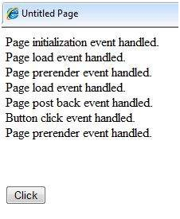


# ASP.NET - Server Side

우리는 페이지 수명주기와 페이지에 다양한 컨트롤이 포함 된 방법을 연구했습니다. 페이지 자체는 컨트롤 객체로 인스턴스화됩니다. 모든 웹 폼은 기본적으로 ASP.NET Page 클래스의 인스턴스입니다. 페이지 클래스에는 내장 객체에 해당하는 다음과 같은 매우 유용한 속성이 있습니다.

- Session
- Application
- Cache
- Request
- Response
- Server
- User
- Trace

우리는 정해진 시간에 이들 각각의 물체에 대해 토론 할 것입니다. 이 튜토리얼에서는 Server 객체, Request 객체 및 Response 객체를 살펴 보겠습니다.


## Server Object

Asp.NET의 Server 개체는 System.Web.HttpServerUtility 클래스의 인스턴스입니다. HttpServerUtility 클래스는 다양한 작업을 수행 할 수있는 다양한 속성과 메서드를 제공합니다.

### Server 객체의 속성 및 메서드

HttpServerUtility 클래스의 메서드와 속성은 ASP.NET에서 제공하는 Intrinsic Server 개체를 통해 노출됩니다.

다음 표에서는 속성 목록을 제공합니다.

| Property      | Description                                        |
| :------------ | :------------------------------------------------- |
| MachineName   | 서버 컴퓨터의 이름                                 |
| ScriptTimeOut | 요청 시간 제한 값을 초 단위로 가져오고 설정합니다. |


다음 표는 몇 가지 중요한 Method 목록을 제공합니다.

| Method                   | Description                                                  |
| :----------------------- | :----------------------------------------------------------- |
| CreateObject(String)     | ProgID (프로그램 ID)로 식별되는 COM 개체의 인스턴스를 만듭니다. |
| CreateObject(Type)       | 해당 Type으로 식별되는 COM 개체의 인스턴스를 만듭니다.       |
| Equals(Object)           | 지정된 Object가 현재 Object와 같은지 여부를 확인합니다.      |
| Execute(String)          | 현재 요청의 컨텍스트에서 지정된 가상 경로에 대한 처리기를 실행합니다. |
| Execute(String, Boolean) | 현재 요청의 컨텍스트에서 지정된 가상 경로에 대한 처리기를 실행하고 QueryString 및 Form 컬렉션을 지울지 여부를 지정합니다. |
| GetLastError             | 이전 예외를 리턴합니다.                                      |
| GetType                  | 현재 인스턴스의 Type을 가져옵니다.                           |
| HtmlEncode               | 일반 문자열을 유효한 HTML 문자로 변경합니다.                 |
| HtmlDecode               | Html 문자열을 일반 문자열로 변환합니다.                      |
| ToString                 | 현재 Object를 나타내는 String을 반환합니다.                  |
| Transfer(String)         | 현재 요청의 경우 현재 페이지의 실행을 종료하고 페이지의 지정된 URL 경로를 사용하여 새 페이지의 실행을 시작합니다. |
| UrlDecode                | URL 문자열을 일반 문자열로 변환합니다.                       |
| UrlEncodeToken           | UrlEncode와 같지만 Base64로 인코딩 된 데이터가 들어있는 바이트 배열에서 작동합니다. |
| UrlDecodeToken           | UrlDecode와 같지만 Base64로 인코딩 된 데이터가 들어있는 바이트 배열에서 작동합니다. |
| MapPath                  | 서버의 지정된 가상 파일 경로에 해당하는 실제 경로를 반환합니다. |
| Transfer                 | 실행을 현재 응용 프로그램의 다른 웹 페이지로 전송합니다.     |


## Request Object

요청 개체는 System.Web.HttpRequest 클래스의 인스턴스입니다. 페이지를 브라우저로로드하는 HTTP 요청의 값과 특성을 나타냅니다.

이 객체가 제공하는 정보는 상위 수준의 추상화 (웹 컨트롤 모델)로 래핑됩니다. 그러나이 객체는 클라이언트 브라우저 및 쿠키와 같은 일부 정보를 확인하는 데 도움이됩니다.

### 요청 객체의 속성과 메소드

다음 표는 Request 객체의 주목할만한 몇 가지 속성을 제공합니다.

| Property           | Description                                                  |
| :----------------- | :----------------------------------------------------------- |
| AcceptTypes        | 클라이언트가 지원하는 MIME 허용 유형의 문자열 배열을 가져옵니다. |
| ApplicationPath    | 서버에서 ASP.NET 응용 프로그램의 가상 응용 프로그램 루트 경로를 가져옵니다. |
| Browser            | 요청 클라이언트의 브라우저 기능에 대한 정보를 가져 오거나 설정합니다. |
| ContentEncoding    | 엔터티 본문의 문자 집합을 가져 오거나 설정합니다.            |
| ContentLength      | 클라이언트가 보낸 내용의 길이 (바이트)를 지정합니다.         |
| ContentType        | 들어오는 요청의 MIME 콘텐츠 형식을 가져 오거나 설정합니다.   |
| Cookies            | 클라이언트가 보낸 쿠키 컬렉션을 가져옵니다.                  |
| FilePath           | 현재 요청의 가상 경로를 가져옵니다.                          |
| Files              | 멀티 파트 MIME 형식으로 클라이언트가 업로드 한 파일 컬렉션을 가져옵니다.. |
| Form               | 폼 변수의 컬렉션을 가져옵니다.                               |
| Headers            | HTTP 헤더 컬렉션을 가져옵니다.                               |
| HttpMethod         | 클라이언트가 사용하는 HTTP 데이터 전송 방법 (예 : GET, POST 또는 HEAD)을 가져옵니다. |
| InputStream        | 들어오는 HTTP 엔터티 본문의 내용을 가져옵니다.               |
| IsSecureConnection | HTTP 연결이 보안 소켓 (즉, HTTPS)을 사용하는지 여부를 나타내는 값을 가져옵니다. |
| QueryString        | HTTP 쿼리 문자열 변수의 컬렉션을 가져옵니다.                 |
| RawUrl             | 현재 요청의 원시 URL을 가져옵니다.                           |
| RequestType        | 클라이언트가 사용하는 HTTP 데이터 전송 방법 (GET 또는 POST)을 가져 오거나 설정합니다. |
| ServerVariables    | 웹 서버 변수의 컬렉션을 가져옵니다.                          |
| TotalBytes         | 현재 입력 스트림에서 바이트 수를 가져옵니다.                 |
| Url                | 현재 요청의 URL에 대한 정보를 가져옵니다.                    |
| UrlReferrer        | 현재 URL에 링크 된 클라이언트의 이전 요청 URL에 대한 정보를 가져옵니다. |
| UserAgent          | 클라이언트 브라우저의 원시 사용자 에이전트 문자열을 가져옵니다. |
| UserHostAddress    | 원격 클라이언트의 IP 호스트 주소를 가져옵니다.               |
| UserHostName       | 원격 클라이언트의 DNS 이름을 가져옵니다.                     |
| UserLanguages      | 클라이언트 언어 환경 설정의 정렬 된 문자열 배열을 가져옵니다. |


다음 표는 몇 가지 중요한 방법 목록을 제공합니다.

| Method              | Description                                                  |
| :------------------ | :----------------------------------------------------------- |
| BinaryRead          | 현재 입력 스트림에서 지정된 바이트 수의 2 진 읽기를 수행합니다. |
| Equals(Object)      | 지정된 개체가 현재 개체와 같은지 여부를 확인합니다. (Object에서 상 속됨) |
| GetType             | 현재 인스턴스의 Type을 가져옵니다.                           |
| MapImageCoordinates | 입력 이미지 필드 양식 매개 변수를 적절한 x 좌표 및 y 좌표 값에 매핑합니다. |
| MapPath(String)     | 지정된 가상 경로를 실제 경로에 매핑합니다.                   |
| SaveAs              | HTTP 요청을 디스크에 저장합니다.                             |
| ToString            | 현재의 오브젝트를 나타내는 String를 돌려줍니다.              |
| ValidateInput       | Cookies, Form 및 QueryString 속성을 통해 액세스 된 컬렉션에 대해 유효성 검사가 수행됩니다. |


## Response Object

Response 개체는 클라이언트 요청에 대한 서버의 응답을 나타냅니다. 이것은 System.Web.HttpResponse 클래스의 인스턴스입니다.

ASP.NET에서 응답 개체는 클라이언트에 HTML 텍스트를 보내는 데 중요한 역할을하지 않습니다. 서버 쪽 컨트롤에는 자체 렌더링을위한 개체 지향 메서드가 중첩되어 있기 때문입니다.

그러나 HttpResponse 객체는 여전히 쿠키 기능 및 Redirect () 메소드와 같은 몇 가지 중요한 기능을 제공합니다. Response.Redirect () 메서드를 사용하면 응용 프로그램 외부뿐만 아니라 내부의 다른 페이지로 사용자를 전송할 수 있습니다. 왕복이 필요합니다.

### 응답 개체의 속성 및 메서드

다음 표에서는 Response 개체의 몇 가지 주목할만한 속성을 제공합니다.

| Property          | Description                                                  |
| :---------------- | :----------------------------------------------------------- |
| Buffer            | 출력을 버퍼링할지 여부를 나타내는 값을 가져 오거나 설정하고 전체 응답이 처리를 완료 한 후에 보냅니다. |
| BufferOutput      | 출력을 버퍼링할지 여부를 나타내는 값을 가져 오거나 설정하여 전체 페이지 처리가 완료된 후에 보냅니다. |
| Charset           | 출력 스트림의 HTTP 문자 집합을 가져 오거나 설정합니다.       |
| ContentEncoding   | 출력 스트림의 HTTP 문자 집합을 가져 오거나 설정합니다.       |
| ContentType       | 출력 스트림의 HTTP MIME 형식을 가져 오거나 설정합니다.       |
| Cookies           | 응답 쿠키 컬렉션을 가져옵니다.                               |
| Expires           | 브라우저에 캐시 된 페이지가 만료되기 전의 시간 (분)을 가져 오거나 설정합니다. |
| ExpiresAbsolute   | 캐시에서 캐시 된 정보를 제거 할 절대 날짜 및 시간을 가져 오거나 설정합니다. |
| HeaderEncoding    | 현재 머리글 출력 스트림의 인코딩을 나타내는 인코딩 개체를 가져 오거나 설정합니다. |
| Headers           | 응답 헤더의 컬렉션을 가져옵니다.                             |
| IsClientConnected | 클라이언트가 서버에 계속 연결되어 있는지 여부를 나타내는 값을 가져옵니다. |
| Output            | 나가는 HTTP 응답 스트림에 텍스트를 출력 할 수있게합니다.     |
| OutputStream      | 나가는 HTTP 콘텐츠 본문에 대한 이진 출력을 사용합니다.       |
| RedirectLocation  | Http Location 헤더의 값을 가져 오거나 설정합니다.            |
| Status            | 클라이언트에 반환되는 상태 줄을 설정합니다.                  |
| StatusCode        | 클라이언트에 반환되는 출력의 HTTP 상태 코드를 가져 오거나 설정합니다. |
| StatusDescription | 클라이언트에 반환되는 출력의 HTTP 상태 문자열을 가져 오거나 설정합니다. |
| SubStatusCode     | 응답의 상태 코드를 한정하는 값을 가져 오거나 설정합니다.     |
| SuppressContent   | HTTP 콘텐츠를 클라이언트에 보낼지 여부를 나타내는 값을 가져 오거나 설정합니다. |

다음 표는 몇 가지 중요한 Method 목록을 제공합니다.

| Method                     | Description                                                  |
| :------------------------- | :----------------------------------------------------------- |
| AddHeader                  | HTTP 헤더를 출력 스트림에 추가합니다. AddHeader는 이전 버전의 ASP와의 호환성을 위해 제공됩니다. |
| AppendCookie               | Infrastructure는 HTTP 쿠키를 내장 쿠키 컬렉션에 추가합니다.  |
| AppendHeader               | HTTP 헤더를 출력 스트림에 추가합니다.                        |
| AppendToLog                | 사용자 지정 로그 정보를 InterNet Information Services (IIS) 로그 파일에 추가합니다. |
| BinaryWrite                | HTTP 출력 스트림에 2 진수 문자열을 씁니다.                   |
| ClearContent               | 버퍼 스트림의 모든 내용 출력을 지 웁니다.                    |
| Close                      | 클라이언트에 대한 소켓 연결을 닫습니다.                      |
| End                        | 현재 버퍼링 된 모든 출력을 클라이언트에 보내고 페이지 실행을 중지하고 EndRequest 이벤트를 발생시킵니다. |
| Equals(Object)             | 지정된 개체가 현재 개체와 같은지 여부를 확인합니다.          |
| Flush                      | 현재 버퍼링 된 모든 출력을 클라이언트에 보냅니다.            |
| GetType                    | 현재 인스턴스의 Type을 가져옵니다.                           |
| Pics                       | HTTP PICS-Label 헤더를 출력 스트림에 추가합니다.             |
| Redirect(String)           | 요청을 새 URL로 리디렉션하고 새 URL을 지정합니다.            |
| Redirect(String, Boolean)  | 클라이언트를 새 URL로 리디렉션합니다. 새 URL과 현재 페이지의 실행을 종료할지 여부를 지정합니다. |
| SetCookie                  | 쿠키 컬렉션의 기존 쿠키를 업데이트합니다.                    |
| ToString                   | 현재 Object를 나타내는 String을 반환합니다.                  |
| TransmitFile(String)       | 메모리에 버퍼링하지 않고 지정된 파일을 HTTP 응답 출력 스트림에 직접 씁니다. |
| Write(Char)                | HTTP 응답 출력 스트림에 문자를 씁니다.                       |
| Write(Object)              | HTTP 응답 스트림에 개체를 씁니다.                            |
| Write(String)              | 문자열을 HTTP 응답 출력 스트림에 씁니다.                     |
| WriteFile(String)          | 지정된 파일의 내용을 HTTP 응답 출력 스트림에 파일 블록으로 직접 씁니다. |
| WriteFile(String, Boolean) | 지정된 파일의 내용을 HTTP 응답 출력 스트림에 메모리 블록으로 직접 씁니다. |

### Example

다음의 간단한 예제에는 사용자가 이름을 입력 할 수있는 텍스트 상자 컨트롤, 서버에 정보를 보내기위한 단추 및 클라이언트 컴퓨터의 URL을 표시하는 레이블 컨트롤이 있습니다.

콘텐츠 파일 :

```html
<%@ Page Language="C#" AutoEventWireup="true" CodeBehind="Default.aspx.cs" 
   Inherits="server_side._Default" %>

<!DOCTYPE html PUBLIC "-//W3C//DTD XHTML 1.0 Transitional//EN" 
   "http://www.w3.org/TR/xhtml1/DTD/xhtml1-transitional.dtd">

<html xmlns="http://www.w3.org/1999/xhtml" >

   <head runat="server">
      <title>Untitled Page</title>
   </head>
   
   <body>
      <form id="form1" runat="server">
         <div>
            
            Enter your name:
            <br />
            <asp:TextBox ID="TextBox1" runat="server"></asp:TextBox>
            <asp:Button ID="Button1" runat="server" OnClick="Button1_Click" Text="Submit" />
            <br />
            <asp:Label ID="Label1" runat="server"/>

         </div>
      </form>
   </body>
   
</html>
```

Button1_Click 뒤의 코드 :

```csharp
protected void Button1_Click(object sender, EventArgs e) {

   if (!String.IsNullOrEmpty(TextBox1.Text)) {
   
      // Access the HttpServerUtility methods through
      // the intrinsic Server object.
      Label1.Text = "Welcome, " + Server.HtmlEncode(TextBox1.Text) + ". <br/> The url is " + Server.UrlEncode(Request.Url.ToString())
   }
}
```

페이지를 실행하여 다음 결과를 확인합니다.

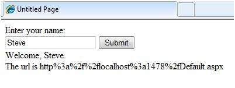


# ASP.NET - Server Controls

컨트롤은 텍스트 상자, 단추, 확인란, 목록 상자, 레이블 및 기타 여러 도구가 포함 된 그래픽 사용자 인터페이스의 작은 구성 요소입니다. 이러한 도구를 사용하여 사용자는 데이터를 입력하고 선택을하고 기본 설정을 나타낼 수 있습니다.

컨트롤은 유효성 검사, 데이터 액세스, 보안, 마스터 페이지 만들기 및 데이터 조작과 같은 구조 작업에도 사용됩니다.

ASP.NET은 다음과 같은 다섯 가지 유형의 웹 컨트롤을 사용합니다.

- HTML controls
- HTML Server controls
- ASP.NET Server controls
- ASP.NET Ajax Server controls
- User controls and custom controls

ASP.NET 서버 컨트롤은 ASP.NET에서 사용되는 기본 컨트롤입니다. 이러한 컨트롤은 다음 범주로 그룹화 할 수 있습니다.

- **Validation controls** - 이들은 사용자 입력의 유효성을 검사하는 데 사용되며 클라이언트 쪽 스크립트를 실행하여 작동합니다.
- **Data source controls** -  이러한 컨트롤은 다양한 데이터 소스에 대한 데이터 바인딩을 제공합니다.
- **Data view controls** -  이들은 다양한 목록과 테이블로, 데이터 소스의 데이터를 바인딩하여 표시 할 수 있습니다.
- **Personalization controls** - 이들은 사용자 정보를 기반으로 사용자 기본 설정에 따라 페이지의 개인 설정에 사용됩니다.
- **Login and security controls** - 이러한 컨트롤은 사용자 인증을 제공합니다.
- **Master pages** - 이러한 컨트롤은 응용 프로그램 전체에 일관된 레이아웃과 인터페이스를 제공합니다.
- **Navigation controls** - 이 컨트롤은 탐색에 도움이됩니다. 예 : 메뉴, 트리보기 등
- **Rich controls** - 이러한 컨트롤은 특수 기능을 구현합니다. 예를 들어, AdRotator, FileUpload 및 Calendar 컨트롤.

```aspx
<asp:controlType  ID ="ControlID" runat="server" Property1=value1  [Property2=value2] />
```

또한 Visual Studio에는 다음과 같은 기능이있어 오류없이 코딩 할 수 있습니다.

- 디자인보기에서 컨트롤 끌어서 놓기
- 속성을 표시하고 자동 완성하는 IntelliSense 기능
- 속성 값을 직접 설정하는 속성 창


### 서버 컨트롤의 속성

시각적 측면이있는 ASP.NET 서버 컨트롤은 WebControl 클래스에서 파생되며이 클래스의 모든 속성, 이벤트 및 메서드를 상속받습니다.

WebControl 클래스 자체와 시각적으로 렌더링되지 않은 다른 서버 컨트롤은 System.Web.UI.Control 클래스에서 파생됩니다. 예를 들어, PlaceHolder 컨트롤 또는 XML 컨트롤.

ASP.Net 서버 컨트롤은 WebControl 및 System.Web.UI.Control 클래스의 모든 속성, 이벤트 및 메서드를 상속합니다.

다음 표는 모든 서버 컨트롤에 공통적으로 상속되는 속성을 보여줍니다.

| Property                   | Description                                                  |
| :------------------------- | :----------------------------------------------------------- |
| AccessKey                  | Alt 키와 함께이 키를 누르면 컨트롤에 포커스가 이동합니다.    |
| Attributes                 | 이 속성은 컨트롤의 속성과 일치하지 않는 임의의 특성 (렌더링 전용)의 컬렉션입니다. |
| BackColor                  | 배경색.                                                      |
| BindingContainer           | T이 컨트롤의 데이터 바인딩을 포함하는 컨트롤입니다.          |
| BorderColor                | 테두리 색상.                                                 |
| BorderStyle                | 테두리 스타일입니다.                                         |
| BorderWidth                | 테두리 너비.                                                 |
| CausesValidation           | 유효성 검사가 발생하는지 여부를 나타냅니다.                  |
| ChildControlCreated        | 서버 컨트롤의 자식 컨트롤이 만들어 졌는지 여부를 나타냅니다. |
| ClientID                   | HTML 마크 업을위한 컨트롤 ID.                                |
| Context                    | 서버 컨트롤과 관련된 HttpContext 개체입니다.                 |
| Controls                   | 컨트롤 내에 포함 된 모든 컨트롤의 컬렉션입니다.              |
| ControlStyle               | 웹 서버 컨트롤의 스타일.                                     |
| CssClass                   | CSS class                                                    |
| DataItemContainer          | 명명 컨테이너가 IDataItemContainer를 구현하는 경우 명명 컨테이너에 대한 참조를 가져옵니다. |
| DataKeysContainer          | 명명 컨테이너가 IDataKeysControl을 구현하는 경우 명명 컨테이너에 대한 참조를 가져옵니다. |
| DesignMode                 | 컨트롤이 디자인 화면에서 사용되는지 여부를 나타냅니다.       |
| DisabledCssClass           | 컨트롤이 비활성화되었을 때 렌더링 된 HTML 요소에 적용 할 CSS 클래스를 가져 오거나 설정합니다. |
| Enabled                    | 컨트롤이 회색으로 표시되는지 여부를 나타냅니다.              |
| EnableTheming              | 테마가 컨트롤에 적용되는지 여부를 나타냅니다.                |
| EnableViewState            | 컨트롤의 뷰 상태가 유지되는지 여부를 나타냅니다.             |
| Events                     | 컨트롤의 이벤트 처리기 대리자 목록을 가져옵니다.             |
| Font                       | Font.                                                        |
| Forecolor                  | 전경색.                                                      |
| HasAttributes              | 컨트롤에 특성 세트가 설정되어 있는지 여부를 나타냅니다.      |
| HasChildViewState          | 현재 서버 컨트롤의 자식 컨트롤에 저장된 뷰 상태 설정이 있는지 여부를 나타냅니다. |
| Height                     | 높이 (픽셀 단위 또는 % 단위).                                |
| ID                         | 컨트롤의 식별자입니다.                                       |
| IsChildControlStateCleared | 이 컨트롤에 포함 된 컨트롤이 컨트롤 상태를 가지는지 여부를 나타냅니다. |
| IsEnabled                  | 컨트롤이 사용되는지 여부를 나타내는 값을 가져옵니다.         |
| IsTrackingViewState        | 서버 컨트롤이 뷰 상태의 변경 사항을 저장하는지 여부를 나타냅니다. |
| IsViewStateEnabled         | 이 컨트롤에 대해 뷰 상태를 사용할 수 있는지 여부를 나타냅니다. |
| LoadViewStateById          | 컨트롤이 뷰 상태를 인덱스 대신 ID로로드하는지 여부를 나타냅니다. |
| Page                       | 컨트롤이 포함 된 페이지입니다.                               |
| Parent                     | 부모 control.                                                |
| RenderingCompatibility     | 렌더링 된 HTML이 호환 될 ASP.NET 버전을 지정합니다.          |
| Site                       | 디자인 화면에 렌더링 될 때 현재 컨트롤을 호스팅하는 컨테이너입니다. |
| SkinID                     | 컨트롤에 적용 할 스킨을 가져 오거나 설정합니다.              |
| Style                      | 웹 서버 컨트롤의 외부 태그에 스타일 특성으로 렌더링 할 텍스트 특성 컬렉션을 가져옵니다. |
| TabIndex                   | 웹 서버 컨트롤의 탭 인덱스를 가져 오거나 설정합니다.         |
| TagKey                     | 이 웹 서버 컨트롤에 해당하는 HtmlTextWriterTag 값을 가져옵니다. |
| TagName                    | 컨트롤 태그의 이름을 가져옵니다.                             |
| TemplateControl            | 이 컨트롤이 포함 된 템플릿입니다.                            |
| TemplateSourceDirectory    | 이 컨트롤이 포함 된 페이지 또는 컨트롤의 가상 디렉터리를 가져옵니다. |
| ToolTip                    | 마우스 포인터가 웹 서버 컨트롤 위에있을 때 표시되는 텍스트를 가져 오거나 설정합니다. |
| UniqueID                   | 고유 식별자.                                                 |
| ViewState                  | 같은 페이지에 대한 여러 요청에서 서버 컨트롤의 뷰 상태를 저장하고 복원하는 상태 정보 사전을 가져옵니다. |
| ViewStateIgnoreCase        | StateBag 객체가 대 / 소문자를 구분하는지 여부를 나타냅니다.  |
| ViewStateMode              | 이 컨트롤의 뷰 상태 모드를 가져 오거나 설정합니다.           |
| Visible                    | 서버 컨트롤이 표시되는지 여부를 나타냅니다.                  |
| Width                      | 웹 서버 컨트롤의 너비를 가져 오거나 설정합니다.              |


### 서버 컨트롤의 메소드

다음 표는 서버 컨트롤의 메서드를 제공합니다.

| Method                        | Description                                                  |
| :---------------------------- | :----------------------------------------------------------- |
| AddAttributesToRender         | 지정된 HtmlTextWriterTag에 렌더링해야하는 HTML 특성 및 스타일을 추가합니다. |
| AddedControl                  | 자식 컨트롤이 컨트롤 개체의 Controls 컬렉션에 추가 된 후에 호출됩니다. |
| AddParsedSubObject            | 서버 컨트롤에 XML 또는 HTML 요소가 구문 분석되었음을 알리고 서버 컨트롤의 컨트롤 컬렉션에 요소를 추가합니다. |
| ApplyStyleSheetSkin           | 페이지 스타일 시트에 정의 된 스타일 속성을 컨트롤에 적용합니다. |
| ClearCachedClientID           | 하부 구조. 캐시 된 ClientID 값을 null로 설정합니다.          |
| ClearChildControlState        | 서버 컨트롤의 자식 컨트롤에 대한 컨트롤 상태 정보를 삭제합니다. |
| ClearChildState               | 서버 컨트롤의 자식 컨트롤에 대한 컨트롤 상태 정보를 삭제합니다. |
| ClearChildViewState           | 모든 서버 컨트롤의 자식 컨트롤에 대한 뷰 상태 정보를 삭제합니다. |
| CreateChildControls           | 자식 컨트롤을 만드는 데 사용됩니다.                          |
| CreateControlCollection       | 자식 컨트롤을 보유 할 새 ControlCollection 개체를 만듭니다.  |
| CreateControlStyle            | 모든 스타일 관련 속성을 구현하는 데 사용되는 스타일 객체를 만듭니다. |
| DataBind                      | 데이터 소스를 서버 컨트롤과 모든 자식 컨트롤에 바인딩합니다. |
| DataBind(Boolean)             | DataBinding 이벤트를 발생시키는 옵션을 사용하여 서버 컨트롤과 모든 자식 컨트롤에 데이터 소스를 바인딩합니다. |
| DataBindChildren              | 서버 컨트롤의 자식 컨트롤에 데이터 소스를 바인딩합니다.      |
| Dispose                       | 서버 컨트롤이 메모리에서 해제되기 전에 최종 정리를 수행 할 수 있습니다. |
| EnsureChildControls           | 서버 컨트롤에 자식 컨트롤이 있는지 여부를 확인합니다. 그렇지 않으면 하위 컨트롤을 만듭니다. |
| EnsureID                      | 식별자가없는 컨트롤의 식별자를 만듭니다.                     |
| Equals(Object)                | 지정된 개체가 현재 개체와 같은지 여부를 확인합니다.          |
| Finalize                      | 개체가 가비지 수집에서 회수되기 전에 개체가 리소스를 해제하고 다른 정리 작업을 수행하도록 허용합니다. |
| FindControl(String)           | 현재의 명명 컨테이너에서 지정된 id 매개 변수를 사용하여 서버 컨트롤을 검색합니다. |
| FindControl(String, Int32)    | 현재 명명 컨테이너에서 지정된 ID와 정수를 사용하여 서버 컨트롤을 검색합니다. |
| Focus                         | 입력 포커스를 컨트롤에 설정합니다.                           |
| GetDesignModeState            | 컨트롤의 디자인 타임 데이터를 가져옵니다.                    |
| GetType                       | 현재 인스턴스의 형식을 가져옵니다.                           |
| GetUniqueIDRelativeTo         | 지정된 컨트롤의 UniqueID 속성 접두사 부분을 반환합니다.      |
| HasControls                   | 서버 컨트롤에 자식 컨트롤이 있는지 여부를 확인합니다.        |
| HasEvents                     | 이벤트가 컨트롤 또는 자식 컨트롤에 등록되어 있는지 여부를 나타냅니다. |
| IsLiteralContent              | 서버 컨트롤에 리터럴 컨텐트 만 보유할지 여부를 결정합니다.   |
| LoadControlState              | 제어 상태 정보를 복원합니다.                                 |
| LoadViewState                 | 뷰 상태 정보를 복원합니다.                                   |
| MapPathSecure                 | 절대 경로 또는 상대 경로의 가상 경로가 매핑되는 물리적 경로를 검색합니다. |
| MemberwiseClone               | 현재의 오브젝트의  shallow copy본을  생성합니다.             |
| MergeStyle                    | 지정된 스타일의 비어 있지 않은 요소를 웹 컨트롤에 복사하지만 컨트롤의 기존 스타일 요소를 덮어 쓰지 않습니다. |
| OnBubbleEvent                 | 서버 컨트롤의 이벤트가 페이지의 UI 서버 컨트롤 계층에 전달되는지 여부를 결정합니다. |
| OnDataBinding                 | 데이터 바인딩 이벤트를 발생시킵니다.                         |
| OnInit                        | Init 이벤트를 발생시킵니다.                                  |
| OnLoad                        | Load 이벤트를 발생시킵니다.                                  |
| OnPreRender                   | PreRender 이벤트를 발생시킵니다.                             |
| OnUnload                      | Unload 이벤트를 발생시킵니다.                                |
| OpenFile                      | 파일을 읽는 데 사용되는 스트림을 가져옵니다.                 |
| RemovedControl                | 컨트롤 개체의 컨트롤 컬렉션에서 자식 컨트롤을 제거한 후에 호출됩니다. |
| Render                        | 지정된 HTML 라이터에 컨트롤을 렌더링합니다.                  |
| RenderBeginTag                | 컨트롤의 HTML 열기 태그를 지정된 작성기에 렌더링합니다.      |
| RenderChildren                | 서버 컨트롤의 자식 콘텐트를 제공된 HtmlTextWriter 개체로 출력합니다.이 개체는 렌더링 될 내용을 클라이언트에 씁니다. |
| RenderContents                | 컨트롤의 내용을 지정된 작성기로 렌더링합니다.                |
| RenderControl(HtmlTextWriter) | 제공된 HtmlTextWriter 개체에 서버 컨트롤 콘텐츠를 출력하고 추적 기능을 사용하는 경우 컨트롤에 대한 추적 정보를 저장합니다. |
| RenderEndTag                  | 컨트롤의 HTML 닫는 태그를 지정된 작성기에 렌더링합니다.      |
| ResolveAdapter                | 지정된 컨트롤의 렌더링을 담당하는 컨트롤 어댑터를 가져옵니다. |
| SaveControlState              | 페이지가 서버에 다시 게시 된 이후 발생한 모든 서버 제어 상태 변경 사항을 저장합니다. |
| SaveViewState                 | TrackViewState 메서드가 호출 된 후 수정 된 상태를 저장합니다. |
| SetDesignModeState            | 컨트롤의 디자인 타임 데이터를 설정합니다.                    |
| ToString                      | 현재 개체를 나타내는 문자열을 반환합니다.                    |
| TrackViewState                | 개체의 뷰 상태 속성에 컨트롤을 저장할 수 있도록 컨트롤이 뷰 상태의 변경 내용을 추적하도록합니다. |


### Example

트리 뷰 컨트롤 인 특정 서버 컨트롤을 살펴 보겠습니다. 트리보기 컨트롤은 탐색 컨트롤 아래에 있습니다. 기타 탐색 컨트롤은 메뉴 컨트롤과 SiteMapPath 컨트롤입니다.

페이지에 트리보기 컨트롤을 추가하십시오. 태스크에서 노드 편집 ...을 선택하십시오. 다음과 같이 트리보기 노드 편집기를 사용하여 각 노드를 편집하십시오.

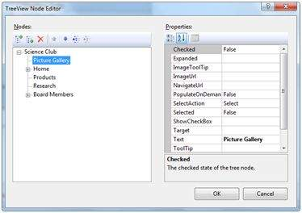

노드를 만들면 디자인보기에서 다음과 같이 나타납니다.

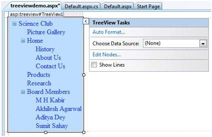

자동 서식 ... 작업을 사용하면 다음과 같이 트리보기의 서식을 지정할 수 있습니다.

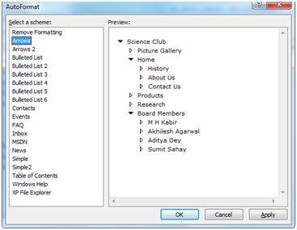

페이지에 레이블 컨트롤과 텍스트 상자 컨트롤을 추가하고 이름을 각각 lblmessage 및 txtmessage로 지정하십시오.

특정 노드를 선택하면 레이블 컨트롤에 노드 텍스트가 표시되고 그 아래에 모든 하위 노드가 텍스트 상자에 표시되는지 확인하는 몇 줄의 코드를 작성하십시오. 파일 뒤에있는 코드는 다음과 같아야합니다.

```csharp
using System;
using System.Collections;
using System.Configuration;
using System.Data;
using System.Linq;

using System.Web;
using System.Web.Security;
using System.Web.UI;
using System.Web.UI.HtmlControls;
using System.Web.UI.WebControls;
using System.Web.UI.WebControls.WebParts;

using System.Xml.Linq;
 
namespace eventdemo {
   public partial class treeviewdemo : System.Web.UI.Page {
   
      protected void Page_Load(object sender, EventArgs e) { 
         txtmessage.Text = " "; 
      }
      
      protected void TreeView1_SelectedNodeChanged(object sender, EventArgs e) {
      
         txtmessage.Text = " "; 
         lblmessage.Text = "Selected node changed to: " + TreeView1.SelectedNode.Text;
         TreeNodeCollection childnodes = TreeView1.SelectedNode.ChildNodes;
         
         if(childnodes != null) {
            txtmessage.Text = " ";
            
            foreach (TreeNode t in childnodes) {
               txtmessage.Text += t.Value;
            }
         }
      }
   }
}
```

결과를 보려면 페이지를 실행하십시오. 노드를 확장하거나 축소 할 수 있습니다.

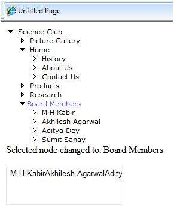


# ASP.NET - HTML Server

HTML 서버 컨트롤은 기본적으로 서버 사이드 프로세싱을 가능하게하는 표준 HTML 컨트롤입니다. 헤더 태그, 앵커 태그 및 입력 요소와 같은 HTML 컨트롤은 서버에서 처리하지 않지만 표시를 위해 브라우저로 전송됩니다.

이들은 특성 runat = 'server'를 추가하고 id 속성을 추가하여 서버 측 처리에 사용할 수 있도록함으로써 서버 제어로 변환됩니다.

예를 들어 HTML 입력 컨트롤을 생각해보십시오.

```html
<input type="text" size="40">
```

runat 및 id 속성을 추가하여 서버 컨트롤로 변환 할 수 있습니다.

```html
<input type="text" id="testtext" size="40" runat="server">
```

## HTML 서버 컨트롤을 사용할 때의 이점

ASP.NET 서버 컨트롤은 HTML 서버 컨트롤에 의해 수행되는 모든 작업을 수행 할 수 있지만 이후 컨트롤은 다음과 같은 경우에 유용합니다.

- 레이아웃 목적으로 정적 테이블 사용.
- ASP.NET에서 실행되도록 HTML 페이지 변환

다음 표에서는 HTML 서버 컨트롤에 대해 설명합니다.

| Control Name         | HTML tag                           |
| :------------------- | :--------------------------------- |
| HtmlHead             | <head>element                      |
| HtmlInputButton      | <input type=button\|submit\|reset> |
| HtmlInputCheckbox    | <input type=checkbox>              |
| HtmlInputFile        | <input type = file>                |
| HtmlInputHidden      | <input type = hidden>              |
| HtmlInputImage       | <input type = image>               |
| HtmlInputPassword    | <input type = password>            |
| HtmlInputRadioButton | <input type = radio>               |
| HtmlInputReset       | <input type = reset>               |
| HtmlText             | <input type = text\|password>      |
| HtmlImage            |  element                      |
| HtmlLink             | <link> element                     |
| HtmlAnchor           | <a> element                        |
| HtmlButton           | <button> element                   |
| HtmlButton           | <button> element                   |
| HtmlForm             | <form> element                     |
| HtmlTable            | <table> element                    |
| HtmlTableCell        | <td> and <th>                      |
| HtmlTableRow         | <tr> element                       |
| HtmlTitle            | <title> element                    |
| HtmlSelect           | <select&t; element                 |
| HtmlGenericControl   | All HTML controls not listed       |


### Example

다음 예제에서는 레이아웃에 기본 HTML 테이블을 사용합니다. 이름, 주소, 도시, 주 등 사용자가 입력하는 정보를 얻기 위해 일부 상자를 사용합니다. 또한 단추 컨트롤을 사용하여 클릭하면 테이블의 마지막 행에 사용자 데이터가 표시됩니다.

페이지는 디자인보기에서 다음과 같아야합니다.

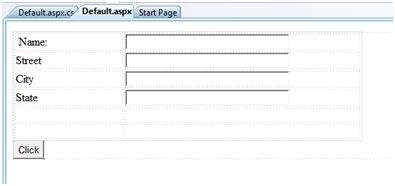

내용 페이지의 코드는 HTML 테이블 요소를 레이아웃에 사용하는 것을 보여줍니다.

```aspx
<%@ Page Language="C#" AutoEventWireup="true" CodeBehind="Default.aspx.cs" Inherits="htmlserver._Default" %>

<!DOCTYPE html PUBLIC "-//W3C//DTD XHTML 1.0 Transitional//EN" "http://www.w3.org/TR/xhtml1/DTD/xhtml1-transitional.dtd">

<html xmlns="http://www.w3.org/1999/xhtml" >

   <head runat="server">
      <title>Untitled Page</title>
      
      <style type="text/css">
         .style1
         {  
            width: 156px;
         }
         .style2
         {
            width: 332px;
         }
      </style>
      
   </head>
   
   <body>
      <form id="form1" runat="server">
         <div>
            <table style="width: 54%;">
               <tr>
                  <td class="style1">Name:</td>
                  <td class="style2">
                     <asp:TextBox ID="txtname" runat="server"  style="width:230px">
                     </asp:TextBox>
                  </td>
               </tr>
				
               <tr>
                  <td class="style1">Street</td>
                  <td class="style2">
                     <asp:TextBox ID="txtstreet" runat="server"  style="width:230px">
                     </asp:TextBox>
                  </td>
               </tr>
				
               <tr>
                  <td class="style1">City</td>
                  <td class="style2">
                     <asp:TextBox ID="txtcity" runat="server"  style="width:230px">
                     </asp:TextBox>
                  </td>
               </tr>
				
               <tr>
                  <td class="style1">State</td>
                  <td class="style2">
                     <asp:TextBox ID="txtstate" runat="server" style="width:230px">
                     </asp:TextBox>
                  </td>
               </tr>
				
               <tr>
                  <td class="style1"> </td>
                  <td class="style2"></td>
               </tr>
				
               <tr>
                  <td class="style1"></td>
                  <td ID="displayrow" runat ="server" class="style2">
                  </td>
               </tr>
            </table>
            
         </div>
         <asp:Button ID="Button1" runat="server" onclick="Button1_Click" Text="Click" />
      </form>
   </body>
</html>
```

버튼 컨트롤 뒤에있는 코드는 다음과 같습니다.

```csharp
protected void Button1_Click(object sender, EventArgs e)
{
   string str = "";
   str += txtname.Text + "<br />";
   str += txtstreet.Text + "<br />";
   str += txtcity.Text + "<br />";
   str += txtstate.Text + "<br />";
   displayrow.InnerHtml = str;
}
```

다음 사항을 준수하십시오.

- 표준 HTML 태그는 페이지 레이아웃에 사용되었습니다.
- HTML 테이블의 마지막 행은 데이터 표시에 사용됩니다. 서버 측 프로세싱이 필요했기 때문에 ID 속성과 runat 속성이 추가되었습니다.


# ASP.NET - Client Side

ASP.NET 클라이언트 측 코딩에는 두 가지 측면이 있습니다.

- **Client side scripts** : 그것은 브라우저에서 실행되며 차례로 페이지 실행을 가속화합니다. 예를 들어 유효하지 않은 데이터를 잡아 서버에 왕복하지 않고 그에 따라 사용자에게 경고 할 수있는 클라이언트 측 데이터 유효성 검사.
- **Client side source code** : ASP.NET 페이지에서이를 생성합니다. 예를 들어 ASP.NET 페이지의 HTML 소스 코드에는 숨겨진 필드와 자동 삽입 된 JavaScript 코드 블록이 포함되어 있습니다.이 블록은보기 상태와 같은 정보를 유지하거나 다른 작업이 페이지를 작동하게합니다.

## Client Side Scripts

모든 ASP.NET 서버 컨트롤을 사용하면 JavaScript 또는 VBScript를 사용하여 작성된 클라이언트 측 코드를 호출 할 수 있습니다. 일부 ASP.NET 서버 컨트롤은 클라이언트 사이드 스크립팅을 사용하여 서버에 다시 게시하지 않고 사용자에게 응답을 제공합니다. 예를 들어 유효성 검사 컨트롤.

이러한 스크립트 외에도 Button 컨트롤에는 단추를 클릭 할 때 클라이언트 측 스크립트를 실행할 수있는 OnClientClick 속성이 있습니다.

기존 HTML 컨트롤과 서버 HTML 컨트롤에는 발생시 스크립트를 실행할 수있는 다음 이벤트가 있습니다.

| Event         | Description                                                 |
| :------------ | :---------------------------------------------------------- |
| onblur        | 컨트롤이 포커스를 잃을 때                                   |
| onfocus       | 컨트롤이 포커스를 받으면                                    |
| onclick       | 컨트롤을 클릭하면                                           |
| onchange      | 컨트롤의 값이 변경되면                                      |
| onkeydown     | 사용자가 키를 누르면                                        |
| onkeypress    | 사용자가 영숫자 키를 누르면                                 |
| onkeyup       | 사용자가 키를 놓으면                                        |
| onmouseover   | 사용자가 마우스 포인터를 컨트롤 위로 이동하면               |
| onserverclick | 컨트롤을 클릭하면 컨트롤의 ServerClick 이벤트가 발생합니다. |


## Client Side Source Code

ASP.NET 페이지는 일반적으로 두 파일로 작성됩니다.

- 콘텐츠 파일 또는 마크 업 파일 (.aspx)
- 코드 숨김 파일

컨텐트 파일에는 HTML 또는 ASP.NET 컨트롤 태그와 리터럴이 포함되어 페이지의 구조를 구성합니다. 코드 숨김 파일에는 클래스 정의가 들어 있습니다. 런타임에 콘텐츠 파일은 구문 분석되어 페이지 클래스로 변환됩니다.

이 클래스는 코드 파일의 클래스 정의 및 시스템 생성 코드와 함께 게시 된 모든 데이터를 처리하고 응답을 생성 한 다음 클라이언트로 다시 보내는 실행 가능 코드 (어셈블리)를 만듭니다.

간단한 페이지를 생각해보십시오.

```aspx
<%@ Page Language="C#" AutoEventWireup="true" CodeBehind="Default.aspx.cs" 
   Inherits="clientside._Default" %>

<!DOCTYPE html PUBLIC "-//W3C//DTD XHTML 1.0 Transitional//EN" 
   "http://www.w3.org/TR/xhtml1/DTD/xhtml1-transitional.dtd">

<html xmlns="http://www.w3.org/1999/xhtml" >

   <head runat="server">
      <title>
         Untitled Page
      </title>
   </head>
   
   <body>
      <form id="form1" runat="server">
      
         <div>
            <asp:TextBox ID="TextBox1" runat="server"></asp:TextBox>  
            <asp:Button ID="Button1" runat="server" OnClick="Button1_Click" Text="Click" />
         </div>
         
         <hr />
         
         <h3> <asp:Label ID="Msg" runat="server" Text=""> </asp:Label> </h3>
      </form>
   </body>
   
</html>
```

이 페이지가 브라우저에서 실행될 때 소스보기 옵션은 ASP.Net 런타임에 의해 브라우저에 전송 된 HTML 페이지를 표시합니다.

```html
<!DOCTYPE html PUBLIC "-//W3C//DTD XHTML 1.0 Transitional//EN" 
   "http://www.w3.org/TR/xhtml1/DTD/xhtml1-transitional.dtd">
 
<html xmlns="http://www.w3.org/1999/xhtml" >

   <head>
      <title>
         Untitled Page
      </title>
   </head>
   
   <body>
      <form name="form1" method="post" action="Default.aspx" id="form1">
      
         <div>
            <input type="hidden" name="__VIEWSTATE" id="__VIEWSTATE" 
               value="/wEPDwUKMTU5MTA2ODYwOWRk31NudGDgvhhA7joJum9Qn5RxU2M=" />
         </div>
 
         <div>
            <input type="hidden" name="__EVENTVALIDATION"  id="__EVENTVALIDATION" 
               value="/wEWAwKpjZj0DALs0bLrBgKM54rGBhHsyM61rraxE+KnBTCS8cd1QDJ/"/>
         </div>

         <div>
            <input name="TextBox1" type="text" id="TextBox1" />  
            <input type="submit" name="Button1" value="Click" id="Button1" />
         </div>

         <hr />
         <h3><span id="Msg"></span></h3>
         
      </form>
   </body>
</html>
```

코드를 제대로 살펴보면 처음 두 개의 <div> 태그에 뷰 상태 및 유효성 검사 정보를 저장하는 숨겨진 필드가 있음을 알 수 있습니다


# ASP.NET - Basic Controls

이 장에서는 ASP.NET에서 사용할 수있는 기본 컨트롤에 대해 설명합니다.


## Button Controls

ASP.NET은 세 가지 유형의 Button 컨트롤을 제공합니다.

- **Button** : 사각형 영역 내에 텍스트를 표시합니다.
- **Link Button** :  하이퍼 링크처럼 보이는 텍스트를 표시합니다.
- **Image Button** :  이미지를 표시합니다.

사용자가 버튼을 클릭하면 두 가지 이벤트가 발생합니다 : 

Click과 Command. 버튼 컨트롤의 기본 구문 :

```aspx
<asp:Button ID="Button1" runat="server" onclick="Button1_Click" Text="Click" / >
```

Button 컨트롤의 일반적인 속성 :

| Property         | Description                                                  |
| :--------------- | :----------------------------------------------------------- |
| Text             | 버튼에 표시되는 텍스트입니다. 이것은 버튼 및 링크 버튼 컨트롤에만 해당됩니다. |
| ImageUrl         | 이미지 버튼 제어 전용. 버튼에 표시 할 이미지입니다.          |
| AlternateText    | AlternateText 이미지 버튼 제어 전용. 브라우저가 이미지를 표시 할 수없는 경우 표시 할 텍스트입니다. |
| CausesValidation | 사용자가 단추를 클릭 할 때 페이지 유효성 검사를 수행할지 여부를 결정합니다. 기본값은 true입니다. |
| CommandName      | 사용자가 단추를 클릭 할 때 명령 이벤트에 전달되는 문자열 값입니다. |
| CommandArgument  | 사용자가 단추를 클릭 할 때 명령 이벤트에 전달되는 문자열 값입니다. |
| PostBackUrl      | 사용자가 버튼을 클릭 할 때 요청되는 페이지의 URL입니다.      |


## Text Boxes and Labels

텍스트 상자 컨트롤은 일반적으로 사용자의 입력을 받아들이는 데 사용됩니다. 텍스트 상자 컨트롤은 TextMode 특성의 설정에 따라 하나 이상의 텍스트 줄을 허용 할 수 있습니다.

레이블 컨트롤을 사용하면 한 페이지에서 다음 페이지로 변경 될 수있는 텍스트를 쉽게 표시 할 수 있습니다. 변경되지 않는 텍스트를 표시하려면 리터럴 텍스트를 사용합니다.

텍스트 컨트롤의 기본 구문 :

```aspx
<asp:TextBox ID="txtstate" runat="server" ></asp:TextBox>
```

텍스트 상자 및 레이블의 공통 속성 :

| Property  | Description                                                  |
| :-------- | :----------------------------------------------------------- |
| TextMode  | 텍스트 상자의 유형을 지정합니다. SingleLine은 표준 텍스트 상자를 만들고 MultiLIne은 두 줄 이상의 텍스트를 사용할 수있는 텍스트 상자를 만들고 Password는 입력 된 문자를 마스크 처리합니다. 기본값은 SingleLine입니다. |
| Text      | 텍스트 상자의 텍스트 내용입니다.                             |
| MaxLength | 텍스트 상자에 입력 할 수있는 최대 문자 수입니다.             |
| Wrap      | 여러 줄 텍스트 상자에 텍스트가 자동으로 줄 바꿈되는지 여부를 결정합니다. 기본값은 true입니다. |
| ReadOnly  | 사용자가 상자의 텍스트를 변경할 수 있는지 여부를 결정합니다. 기본값은 false입니다. 즉, 사용자가 텍스트를 변경할 수 없습니다. |
| Columns   | 텍스트 상자의 너비 (문자)입니다. 실제 너비는 텍스트 입력에 사용되는 글꼴을 기반으로 결정됩니다. |
| Rows      | 행의 여러 줄 텍스트 상자의 높이입니다. 기본값은 0이며 한 줄짜리 텍스트 상자를 의미합니다. |

레이블 컨트롤에 주로 사용되는 속성은 레이블에 표시된 텍스트를 의미하는 '텍스트'입니다.


## Check Boxes and Radio Buttons

확인란은 사용자가 선택 또는 선택 취소 할 수있는 단일 옵션을 표시하며 라디오 버튼은 사용자가 단 하나의 옵션 만 선택할 수있는 옵션 그룹을 제공합니다.

라디오 버튼 그룹을 만들려면 그룹의 각 라디오 버튼의 GroupName 속성에 대해 동일한 이름을 지정합니다. 단일 양식에서 둘 이상의 그룹이 필요한 경우, 각 그룹마다 다른 그룹 이름을 지정하십시오.

양식이 처음 표시 될 때 선택란이나 단일 선택 단추를 선택하려면 선택 속성을 true로 설정하십시오. Checked 속성이 그룹의 여러 라디오 버튼에 대해 true로 설정된 경우 마지막 속성 만 true로 간주됩니다.

확인란의 기본 구문 :

```aspx
<asp:CheckBox ID= "chkoption" runat= "Server"> 
</asp:CheckBox>
```

라디오 버튼의 기본 구문 :

```aspx
<asp:RadioButton ID= "rdboption" runat= "Server"> 
</asp: RadioButton>
```

확인란 및 라디오 버튼의 일반적인 속성 :

| Property  | Description                                        |
| :-------- | :------------------------------------------------- |
| Text      | 확인란이나 라디오 버튼 옆에 표시되는 텍스트입니다. |
| Checked   | 선택 여부를 지정합니다. 기본값은 false입니다.      |
| GroupName | 컨트롤이 속한 그룹의 이름입니다.                   |


## List Controls

ASP.NET은 다음과 같은 컨트롤을 제공합니다.

- Drop-down list,
- List box,
- Radio button list,
- Check box list,
- Bulleted list.

이러한 컨트롤을 통해 사용자는 목록에서 하나 이상의 항목을 선택할 수 있습니다. 목록 상자 및 드롭 다운 목록에는 하나 이상의 목록 항목이 있습니다. 이러한 목록은 코드 또는 ListItemCollection 편집기에서로드 할 수 있습니다.

목록 상자 컨트롤의 기본 구문 :

```aspx
<asp:ListBox ID="ListBox1" runat="server" AutoPostBack="True"    OnSelectedIndexChanged="ListBox1_SelectedIndexChanged">
</asp:ListBox>
```

드롭 다운 목록 컨트롤의 기본 구문 :

```aspx
<asp:DropDownList ID="DropDownList1" runat="server" AutoPostBack="True"   OnSelectedIndexChanged="DropDownList1_SelectedIndexChanged">
</asp:DropDownList>
```

목록 상자 및 드롭 다운 목록의 일반적인 속성 :

| Property      | Description                                                  |
| :------------ | :----------------------------------------------------------- |
| Items         | 컨트롤의 항목을 나타내는 ListItem 개체의 컬렉션입니다. 이 속성은 ListItemCollection 형식의 개체를 반환합니다. |
| Rows          | 상자에 표시되는 항목 수를 지정합니다. 실제 목록에 표시된 행 수가 많으면 스크롤 막대가 추가됩니다. |
| SelectedIndex | 현재 선택된 항목의 색인입니다. 둘 이상의 항목이 선택되면 첫 번째로 선택된 항목의 색인입니다. 항목을 선택하지 않으면이 속성의 값은 -1입니다. |
| SelectedValue | 현재 선택된 항목의 값입니다. 둘 이상의 항목이 선택된 경우 첫 번째로 선택된 항목의 값입니다. 항목을 선택하지 않으면이 속성의 값은 빈 문자열 ("'')입니다. |
| SelectionMode | 목록 상자에서 단일 선택 또는 다중 선택을 허용하는지 여부를 나타냅니다. |

각 목록 항목 객체의 공통 속성 :

| Property | Description                            |
| :------- | :------------------------------------- |
| Text     | 항목에 대해 표시되는 텍스트입니다.     |
| Selected | 항목이 선택되었는지 여부를 나타냅니다. |
| Value    | 항목과 관련된 문자열 값입니다.         |

항목과 관련된 문자열 값입니다.

- 드롭 다운 목록 또는 목록 상자의 항목을 사용하려면 컨트롤의 Items 속성을 사용합니다. 이 속성은 목록의 모든 항목을 포함하는 ListItemCollection 개체를 반환합니다.
- 드롭 다운 목록 또는 목록 상자의 항목을 사용하려면 컨트롤의 Items 속성을 사용합니다. 이 속성은 목록의 모든 항목을 포함하는 ListItemCollection 개체를 반환합니다.


## The ListItemCollection

ListItemCollection 개체는 ListItem 개체의 컬렉션입니다. 각 ListItem 개체는 목록에서 하나의 항목을 나타냅니다. ListItemCollection의 항목에는 0부터 번호가 지정됩니다.

목록 상자에있는 항목이 lstcolor.Items.Add ( 'Blue')와 같은 문자열을 사용하여로드되면 목록 항목의 Text 및 Value 속성은 지정한 문자열 값으로 설정됩니다. 다르게 설정하려면 목록 항목 개체를 만든 다음 해당 항목을 컬렉션에 추가해야합니다.

ListItemCollection 편집기는 항목을 드롭 다운 목록 또는 목록 상자에 추가하는 데 사용됩니다. 이것은 항목의 정적 목록을 만드는 데 사용됩니다. 컬렉션 편집기를 표시하려면 스마트 태그 메뉴에서 항목 편집을 선택하거나 컨트롤을 선택한 다음 속성 창에서 Item 속성의 줄임표 단추를 클릭합니다.

ListItemCollection의 일반적인 속성 :

| Property      | Description                                              |
| :------------ | :------------------------------------------------------- |
| Item(integer) | 지정된 인덱스에있는 항목을 나타내는 ListItem 개체입니다. |
| Count         | 컬렉션의 항목 수입니다.                                  |

ListItemCollection의 일반적인 메소드 :

| Methods                   | Description                                                  |
| :------------------------ | :----------------------------------------------------------- |
| Add(string)               | 컬렉션의 끝에 새 항목을 추가하고 문자열 매개 변수를 항목의 Text 속성에 할당합니다. |
| Add(ListItem)             | 컬렉션의 끝에 새 항목을 추가합니다.                          |
| Insert(integer, string)   | 컬렉션의 지정된 인덱스 위치에 항목을 삽입하고 항목의 텍스트 속성에 문자열 매개 변수를 할당합니다. |
| Insert(integer, ListItem) | 컬렉션의 지정된 인덱스 위치에 항목을 삽입합니다.             |
| Remove(string)            | 문자열과 텍스트 값이 같은 항목을 제거합니다.                 |
| Remove(ListItem)          | 지정된 항목을 제거합니다.                                    |
| RemoveAt(integer)         | 지정된 인덱스에있는 항목을 정수로 제거합니다.                |
| Clear                     | 컬렉션의 모든 항목을 제거합니다..                            |
| FindByValue(string)       | 값이 문자열과 같은 항목을 반환합니다.                        |
| FindByValue(Text)         | 텍스트가 문자열과 동일한 항목을 반환합니다.                  |


## Radio Button list and Check Box list

라디오 버튼 목록은 상호 배타적 인 옵션 목록을 제공합니다. 확인란 목록은 독립 옵션 목록을 제공합니다. 이러한 컨트롤에는 컨트롤의 Items 속성을 통해 참조 할 수있는 ListItem 개체의 컬렉션이 포함되어 있습니다.

라디오 버튼 목록의 기본 구문 :

```aspx
<asp:RadioButtonList ID="RadioButtonList1" runat="server" AutoPostBack="True" 
   OnSelectedIndexChanged="RadioButtonList1_SelectedIndexChanged">
</asp:RadioButtonList>
```

확인란 목록의 기본 구문 :

```aspx
<asp:CheckBoxList ID="CheckBoxList1" runat="server" AutoPostBack="True" 
   OnSelectedIndexChanged="CheckBoxList1_SelectedIndexChanged">
</asp:CheckBoxList>
```

확인란 및 라디오 단추 목록의 일반적인 속성 :

| Property        | Description                                                  |
| :-------------- | :----------------------------------------------------------- |
| RepeatLayout    | 이 속성은 목록 태그가 렌더링 될 때 서식을 지정할 때 사용할 표 태그 또는 일반 html 플로우를 지정합니다. 기본값은 표입니다. |
| RepeatDirection | 컨트롤이 반복되는 방향을 지정합니다. 사용할 수있는 값은 가로 및 세로입니다. 기본값은 수직입니다. |
| RepeatColumns   | 컨트롤을 반복 할 때 사용할 열 수를 지정합니다.; default is 0. |


## Bulleted lists and Numbered lists

글 머리 기호 목록 컨트롤은 글 머리 기호 목록 또는 번호 매기기 목록을 만듭니다. 이러한 컨트롤에는 컨트롤의 Items 속성을 통해 참조 할 수있는 ListItem 개체의 컬렉션이 포함되어 있습니다.

글 머리 기호 목록의 기본 구문 :

```aspx
<asp:BulletedList ID="BulletedList1" runat="server">
</asp:BulletedList>
```

글 머리 기호 목록의 일반적인 속성 :

| Property        | Description                                                  |
| :-------------- | :----------------------------------------------------------- |
| BulletStyle     | 이 속성은 글 머리 기호 또는 스타일의 스타일과 모양을 지정합니다. |
| RepeatDirection | 컨트롤이 반복되는 방향을 지정합니다. 사용할 수있는 값은 가로 및 세로입니다. 기본값은 수직입니다. |
| RepeatColumns   | 컨트롤을 반복 할 때 사용할 열 수를 지정합니다. 기본값은 0입니다. |


## HyperLink Control

HyperLink 컨트롤은 HTML <a> 요소와 같습니다.

하이퍼 링크 컨트롤의 기본 구문 :

```aspx
<asp:HyperLink ID="HyperLink1" runat="server">
   HyperLink
</asp:HyperLink>
```

그것은 다음과 같은 중요한 속성을 가지고 있습니다 :

| Property    | Description                                   |
| :---------- | :-------------------------------------------- |
| ImageUrl    | 컨트롤에 의해 표시되는 이미지의 패스입니다.   |
| NavigateUrl | 대상 링크 URL.                                |
| Text        | 링크로 표시 할 텍스트입니다.                  |
| Target      | 연결된 페이지를로드하는 창 또는 프레임입니다. |


## Image Control

이미지 컨트롤은 이미지를 사용할 수없는 경우 웹 페이지 또는 일부 대체 텍스트에 이미지를 표시하는 데 사용됩니다. 

이미지 컨트롤의 기본 구문 :

```aspx
<asp:Image ID="Image1" runat="server">
```

그것은 다음과 같은 중요한 속성을 가지고 있습니다 :

| Property      | Description                                 |
| :------------ | :------------------------------------------ |
| AlternateText | 이미지가 없을 때 표시 할 대체 텍스트.       |
| ImageAlign    | 컨트롤의 정렬 옵션입니다.                   |
| ImageUrl      | 컨트롤에 의해 표시되는 이미지의 패스입니다. |


# ASP.NET - Directives

ASP.NET 지시문은 사용자 지정 컨트롤 및 페이지 언어 등록과 같은 선택적 설정을 지정하기위한 지침입니다. 이 설정은 웹 양식 (.aspx) 또는 사용자 정의 컨트롤 (.ascx) 페이지가 .Net 프레임 워크에서 처리되는 방식을 설명합니다.


<https://www.tutorialspoint.com/asp.net/asp.net_directives.htm>


# ASP.NET - Managing State

<https://www.tutorialspoint.com/asp.net/asp.net_managing_state.htm>

HTTP (Hyper Text Transfer Protocol)는 상태 비 저장 프로토콜입니다. 클라이언트가 서버와의 연결을 끊으면 ASP.NET 엔진이 페이지 개체를 버립니다. 이렇게하면 각 웹 응용 프로그램을 서버 메모리가 부족한 상태에서 동시에 여러 가지 요청을 처리 할 수 있도록 확장 할 수 있습니다.


# ASP.NET - Validators

<https://www.tutorialspoint.com/asp.net/asp.net_validators.htm>

ASP.NET 유효성 검사 컨트롤은 쓸모없고 인증되지 않은 데이터 또는 모순되는 데이터가 저장되지 않도록 사용자 입력 데이터의 유효성을 검사합니다.


# ASP.NET - Database Access

<https://www.tutorialspoint.com/asp.net/asp.net_database_access.htm>

ASP.NET을 사용하면 다음과 같은 데이터 원본을 액세스하고 사용할 수 있습니다.

- Databases (e.g., Access, SQL Server, Oracle, MySQL)
- XML documents
- Business Objects
- Flat files


# ADO.NET

<https://www.tutorialspoint.com/asp.net/asp.net_ado_net.htm>

ADO.NET은 프런트 엔드 컨트롤과 백 엔드 데이터베이스간에 브리지를 제공합니다. ADO.NET 개체는 모든 데이터 액세스 작업을 캡슐화하고 컨트롤이 이러한 개체와 상호 작용하여 데이터를 표시하므로 데이터 이동 세부 정보가 숨겨집니다.


# ASP.NET - File Uploading

<https://www.tutorialspoint.com/asp.net/asp.net_file_uploading.htm>

ASP.NET에는 사용자가 파일을 웹 서버에 업로드 할 수있는 두 가지 컨트롤이 있습니다. 서버가 게시 된 파일 데이터를 받으면 응용 프로그램은 저장하거나 체크하거나 무시할 수 있습니다. 다음 컨트롤은 파일 업로드를 허용합니다.

- **HtmlInputFile** - HTML 서버 컨트롤
- **FileUpload** - 및 ASP.NET 웹 컨트롤

두 컨트롤 모두 파일 업로드가 가능하지만 FileUpload 컨트롤은 폼의 인코딩을 자동으로 설정하지만 HtmlInputFile은 그렇게하지 않습니다.


# ASP.NET - Ad Rotator

<https://www.tutorialspoint.com/asp.net/asp.net_ad_rotator.htm>

AdRotator 컨트롤은 외부 XML 일정 파일에 지정된 배너 그래픽을 임의로 선택합니다. 이 외부 XML 스케줄 파일을 광고 파일이라고합니다.


# ASP.NET - Calendars

<https://www.tutorialspoint.com/asp.net/asp.net_calenders.htm>

달력 컨트롤은 다음과 같은 기능을 제공하는 기능이 풍부한 웹 컨트롤입니다.


# ASP.NET - Multi Views

<https://www.tutorialspoint.com/asp.net/asp.net_multi_views.htm>

MultiView 및 View 컨트롤을 사용하면 한 번에 하나의 그룹 만 표시하여 페이지의 내용을 다른 그룹으로 나눌 수 있습니다. 각 View 컨트롤은 하나의 내용 그룹을 관리하며 모든 View 컨트롤은 MultiView 컨트롤에 함께 유지됩니다.

MultiView 컨트롤은 한 번에 하나의 View 컨트롤을 표시 할 책임이 있습니다. 표시되는보기를 활성보기라고합니다.


# ASP.NET - Panel Controls

<https://www.tutorialspoint.com/asp.net/asp.net_panel_controls.htm>

Panel 컨트롤은 페이지의 다른 컨트롤에 대한 컨테이너 역할을합니다. 포함 된 컨트롤의 모양과 표시 여부를 제어합니다. 또한 프로그래밍 방식으로 컨트롤을 생성 할 수 있습니다.


# ASP.NET - Ajax Control

<https://www.tutorialspoint.com/asp.net/asp.net_ajax_control.htm>

AJAX는 비동기 JavaScript 및 XML의 약자입니다. 이것은 응답 시간을 단축하는 크로스 플랫폼 기술입니다. AJAX 서버는 브라우저에 의해 실행되고 처리되는 페이지에 스크립트 추가를 제어합니다.

그러나 다른 ASP.NET 서버 컨트롤과 마찬가지로 이러한 AJAX 서버 컨트롤에는 서버 측에서 처리되는 메서드 및 이벤트 처리기가 연결될 수 있습니다.


# ASP.NET - Data Sources

<https://www.tutorialspoint.com/asp.net/asp.net_data_sources.htm>

데이터 소스 컨트롤은 데이터 바인딩 컨트롤과 상호 작용하고 복잡한 데이터 바인딩 프로세스를 숨 깁니다. 이들은 데이터 바인딩 된 컨트롤에 데이터를 제공하고 삽입, 삭제, 정렬 및 업데이트와 같은 작업의 실행을 지원하는 도구입니다.


# ASP.NET - Data Binding

<https://www.tutorialspoint.com/asp.net/asp.net_data_binding.htm>

모든 ASP.NET 웹 양식 컨트롤은 부모 Control 클래스의 DataBind 메서드를 상속합니다.이 클래스는 데이터를 해당 속성 중 하나 이상에 바인딩 할 수있는 고유 한 기능을 제공합니다. 이를 **단순 데이터 바인딩** 또는 **인라인 데이터 바인딩**이라고합니다.

간단한 데이터 바인딩에는 IEnumerable 인터페이스 또는 DataSet 및 DataTable 클래스를 구현하는 컬렉션 (항목 컬렉션)을 컨트롤의 DataSource 속성에 연결하는 작업이 포함됩니다.

반면에 일부 컨트롤은 레코드, 목록 또는 데이터 열을 DataSource 컨트롤을 통해 구조에 바인딩 할 수 있습니다. 이러한 컨트롤은 BaseDataBoundControl 클래스에서 파생됩니다. 이를 **선언적 데이터 바인딩**이라고합니다.

데이터 소스 컨트롤은 데이터 바인딩 컨트롤이 데이터 컬렉션 정렬, 페이징 및 편집과 같은 기능을 구현하는 데 도움이됩니다.


# ASP.NET - Custom Controls

<https://www.tutorialspoint.com/asp.net/asp.net_custom_controls.htm>

ASP.NET을 사용하면 사용자가 컨트롤을 만들 수 있습니다. 이러한 사용자 정의 컨트롤은 다음과 같이 분류됩니다.


# ASP.NET - Personalization

<https://www.tutorialspoint.com/asp.net/asp.net_personalization.htm>

웹 사이트는 사용자의 반복 된 방문을 위해 설계되었습니다. 개인화를 통해 사이트는 사용자 신원 및 기타 정보 세부 정보를 기억할 수 있으며 개인별 환경을 각 사용자에게 제공합니다.

ASP.NET은 특정 클라이언트의 취향과 선호도에 맞게 웹 사이트를 개인화하는 서비스를 제공합니다.


# ASP.NET - Error Handling

<https://www.tutorialspoint.com/asp.net/asp.net_error_handling.htm>

ASP.NET의 오류 처리에는 세 가지 측면이 있습니다.


# ASP.NET - Debugging

<https://www.tutorialspoint.com/asp.net/asp.net_debugging.htm>

디버깅을 통해 개발자는 코드가 단계적으로 어떻게 작동하는지, 변수의 값이 어떻게 변하는 지, 객체가 어떻게 생성되고 파괴되는지 등을 볼 수 있습니다.

사이트가 처음 실행될 때 Visual Studio는 디버깅을 사용할지 여부를 묻는 프롬프트를 표시합니다.


# ASP.NET - LINQ

<https://www.tutorialspoint.com/asp.net/asp.net_linq.htm>

대부분의 응용 프로그램은 데이터 중심이지만 대부분의 데이터 저장소는 관계형 데이터베이스입니다. 수년 동안 디자이너와 개발자는 객체 모델을 기반으로 애플리케이션을 설계했습니다.

개체는 데이터 액세스 구성 요소 (DAL)에 연결해야합니다. 여기서 우리는 세 가지 사항을 고려해야합니다.


# ASP.NET - Security

<https://www.tutorialspoint.com/asp.net/asp.net_security.htm>

사이트 보안 구현에는 다음과 같은 측면이 있습니다.


# ASP.NET - Data Caching

<https://www.tutorialspoint.com/asp.net/asp.net_data_caching.htm>

## What is Caching?

캐싱은 자주 사용되는 데이터 / 정보를 메모리에 저장하는 기술이므로 다음에 동일한 데이터 / 정보가 필요할 때 응용 프로그램이 생성하지 않고 직접 메모리에서 검색 할 수 있습니다.

캐싱은 페이지 및 컨트롤이 여기에서 동적으로 생성되므로 ASP.NET의 성능 향상에 매우 중요합니다. 응답 시간 측면에서 비용이 많이 드는 데이터 관련 트랜잭션의 경우 특히 중요합니다.

캐싱은 자주 사용되는 데이터를 컴퓨터의 랜덤 액세스 메모리와 같이 빠르게 액세스되는 미디어에 저장합니다. ASP.NET 런타임에는 cache라는 CLR 개체의 키 - 값 맵이 포함되어 있습니다. 이것은 응용 프로그램과 함께 있으며 HttpContext 및 System.Web.UI.Page를 통해 사용할 수 있습니다.

어떤면에서 캐싱은 상태 객체를 저장하는 것과 유사합니다. 그러나 상태 객체에 정보를 저장하는 것은 결정적입니다. 즉, 거기에 저장된 데이터에 의존 할 수 있으며 데이터 캐싱은 비 결정적입니다.

다음과 같은 경우에는 데이터를 사용할 수 없습니다:

- If its lifetime expires,
- If the application releases its memory,
- If caching does not take place for some reason.


# ASP.NET - Web Services

<https://www.tutorialspoint.com/asp.net/asp.net_web_services.htm>

웹 서비스는 웹 응용 프로그램에서 사용할 웹 프로토콜을 사용하여 액세스하는 웹 기반 기능입니다. 웹 서비스 개발에는 세 가지 측면이 있습니다.

- Creating the web service
- Creating a proxy
- Consuming the web service

## Creating a Web Service

웹 서비스는 기본적으로 다른 응용 프로그램에서 사용할 수있는 메서드로 구성된 클래스 인 웹 응용 프로그램입니다. 또한 사용자 인터페이스가 없어도 ASP.NET 웹 페이지와 같은 코드 숨김 아키텍처를 따릅니다.

개념을 이해하기 위해 주가 정보를 제공하는 웹 서비스를 만들자. 고객은 주식 기호를 기반으로 주식의 이름과 가격을 질의 할 수 있습니다. 이 예제를 단순하게 유지하기 위해 값은 2 차원 배열로 하드 코드됩니다. 이 웹 서비스에는 세 가지 method 가  있습니다.

- A default HelloWorld method
- A GetName Method
- A GetPrice Method


웹 서비스를 만들려면 다음 단계를 수행하십시오.

**Step (1)** : Visual Studio에서 파일 -> 새로 만들기 -> 웹 사이트를 선택한 다음 ASP.NET 웹 서비스를 선택합니다.

**Step (2)** : Service.asmx라는 웹 서비스 파일과 코드 숨김 파일 Service.cs가 프로젝트의 App_Code 디렉토리에 만들어집니다.

**Step (3)** : 파일 이름을 StockService.asmx 및 StockService.cs로 변경하십시오.

**Step (4)** : .asmx 파일에는 WebService 지시문이 있습니다.

```xml
<%@ WebService Language="C#" CodeBehind="~/App_Code/StockService.cs" Class="StockService" %>
```

**Step (5)** :  StockService.cs 파일을 열면 생성 된 코드가 기본 Hello World 서비스입니다. 기본 웹 서비스 코드 숨김 파일은 다음과 같습니다.

```csharp
using System;
using System.Collections;
using System.ComponentModel;
using System.Data;
using System.Linq;

using System.Web;
using System.Web.Services;
using System.Web.Services.Protocols;

using System.Xml.Linq;

namespace StockService
{
   // <summary>
   // Summary description for Service1
   // <summary>
   
   [WebService(Namespace = "http://tempuri.org/")]
   [WebServiceBinding(ConformsTo = WsiProfiles.BasicProfile1_1)]
   [ToolboxItem(false)]
   
   // To allow this Web Service to be called from script, 
   // using ASP.NET AJAX, uncomment the following line. 
   // [System.Web.Script.Services.ScriptService]
   
   public class Service1 : System.Web.Services.WebService
   {
      [WebMethod]
      
      public string HelloWorld()
      {
         return "Hello World";
      }
   }
}
```

**Step (6)** : 파일 뒤에 코드를 변경하여 주식 기호, 이름 및 가격에 대한 문자열의 2 차원 배열과 주식 정보를 가져 오는 두 가지 웹 메소드를 추가하십시오.

```csharp
using System;
using System.Linq;

using System.Web;
using System.Web.Services;
using System.Web.Services.Protocols;

using System.Xml.Linq;

[WebService(Namespace = "http://tempuri.org/")]
[WebServiceBinding(ConformsTo = WsiProfiles.BasicProfile1_1)]

// To allow this Web Service to be called from script, 
// using ASP.NET AJAX, uncomment the following line. 
// [System.Web.Script.Services.ScriptService]

public class StockService : System.Web.Services.WebService
{
   public StockService () {
      //Uncomment the following if using designed components 
      //InitializeComponent(); 
   }
   
   string[,] stocks =
   {
      {"RELIND", "Reliance Industries", "1060.15"},
      {"ICICI", "ICICI Bank", "911.55"},
      {"JSW", "JSW Steel", "1201.25"},
      {"WIPRO", "Wipro Limited", "1194.65"},
      {"SATYAM", "Satyam Computers", "91.10"}
   };

   [WebMethod]
   public string HelloWorld() {
      return "Hello World";
   }
   
   [WebMethod]
   public double GetPrice(string symbol)
   { 
      //it takes the symbol as parameter and returns price
      for (int i = 0; i < stocks.GetLength(0); i++)
      {
         if (String.Compare(symbol, stocks[i, 0], true) == 0)
         return Convert.ToDouble(stocks[i, 2]);
      }
      
      return 0;
   }
   
   [WebMethod]
   public string GetName(string symbol)
   {
      // It takes the symbol as parameter and 
      // returns name of the stock
      for (int i = 0; i < stocks.GetLength(0); i++)
      {
         if (String.Compare(symbol, stocks[i, 0], true) == 0)
         return stocks[i, 1];
      }
      
      return "Stock Not Found";
   }
}
```

**Step (7)** :  웹 서비스 응용 프로그램을 실행하면 서비스 메서드를 테스트 할 수있는 웹 서비스 테스트 페이지가 제공됩니다.

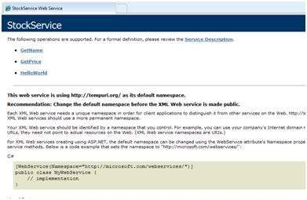

**Step (8)** : 메소드 이름을 클릭하고 메소드 이름이 제대로 실행되는지 확인하십시오.

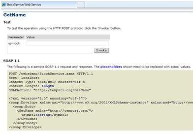

**Step (9)** : GetName 메서드를 테스트하려면 하드 코딩 된 주식 기호 중 하나를 제공하고 주식 이름을 반환합니다.

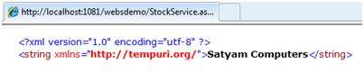


## Consuming the Web Service

웹 서비스를 사용하려면 동일한 솔루션으로 웹 사이트를 만드십시오. 이 작업은 솔루션 탐색기에서 솔루션 이름을 마우스 오른쪽 버튼으로 클릭하여 수행 할 수 있습니다. 웹 서비스를 호출하는 웹 페이지에는 반환 된 결과를 표시하는 레이블 컨트롤과 포스트 백과 서비스 호출을위한 두 개의 버튼 컨트롤이 있어야합니다.

웹 응용 프로그램의 콘텐츠 파일은 다음과 같습니다.

```aspx
<%@ Page Language="C#" AutoEventWireup="true" CodeBehind="Default.aspx.cs" Inherits="wsclient._Default" %>

<!DOCTYPE html PUBLIC "-//W3C//DTD XHTML 1.0 Transitional//EN" "http://www.w3.org/TR/xhtml1/DTD/xhtml1-transitional.dtd">

<html xmlns="http://www.w3.org/1999/xhtml" >

   <head runat="server">
      <title>
         Untitled Page
      </title>
   </head>
   
   <body>
   
      <form id="form1" runat="server">
         <div>
         
            <h3>Using the Stock Service</h3>
            
            <br /> <br />
            
            <asp:Label ID="lblmessage" runat="server"></asp:Label>
            
            <br /> <br />
            
            <asp:Button ID="btnpostback" runat="server" onclick="Button1_Click" Text="Post Back" style="width:132px" />
               
            <asp:Button ID="btnservice" runat="server" onclick="btnservice_Click"  Text="Get Stock" style="width:99px" />
            
         </div>
      </form>
      
   </body>
</html>
```

웹 응용 프로그램의 코드 숨김 파일은 다음과 같습니다.

```csharp
using System;
using System.Collections;
using System.Configuration;
using System.Data;
using System.Linq;

using System.Web;
using System.Web.Security;
using System.Web.UI;
using System.Web.UI.HtmlControls;
using System.Web.UI.WebControls;
using System.Web.UI.WebControls.WebParts;

using System.Xml.Linq;

//this is the proxy
using localhost;

namespace wsclient
{
   public partial class _Default : System.Web.UI.Page
   {
      protected void Page_Load(object sender, EventArgs e)
      {
         if (!IsPostBack)
         {
            lblmessage.Text = "First Loading Time: " +  DateTime.Now.ToLongTimeString
         }
         else
         {
            lblmessage.Text = "PostBack at: " + DateTime.Now.ToLongTimeString();
         }
      }
      
      protected void btnservice_Click(object sender, EventArgs e)
      {
         StockService proxy = new StockService();
         lblmessage.Text = String.Format("Current SATYAM Price:{0}",
         proxy.GetPrice("SATYAM").ToString());
      }
   }
}
```


## Creating the Proxy

프록시는 웹 서비스 코드를위한 스탠드입니다. 웹 서비스를 사용하기 전에 프록시를 만들어야합니다. 프록시는 클라이언트 응용 프로그램에 등록됩니다. 그런 다음 클라이언트 응용 프로그램은 로컬 메소드를 사용하는 것처럼 웹 서비스에 대한 호출을 작성합니다.

프록시는 호출을 받아 적절한 형식으로 랩핑하고 SOAP 요청으로 서버에 전송합니다. SOAP은 Simple Object Access Protocol의 약자입니다. 이 프로토콜은 웹 서비스 데이터를 교환하는 데 사용됩니다.

서버가 SOAP 패키지를 클라이언트에 반환하면 프록시는 모든 것을 디코딩하여 클라이언트 응용 프로그램에 제공합니다.

btnservice_Click을 사용하여 웹 서비스를 호출하기 전에 웹 참조를 응용 프로그램에 추가해야합니다. 이렇게하면 btnservice_Click 이벤트에서 사용되는 프록시 클래스가 투명하게 생성됩니다.

```csharp
protected void btnservice_Click(object sender, EventArgs e)
{
   StockService proxy = new StockService();
   lblmessage.Text = String.Format("Current SATYAM Price: {0}", 
   proxy.GetPrice("SATYAM").ToString());
}
```

프록시 생성을위한 다음 단계를 수행하십시오.

**Step (1)** : 솔루션 탐색기에서 웹 응용 프로그램 항목을 마우스 오른쪽 단추로 클릭하고 '웹 참조 추가'를 클릭하십시오.

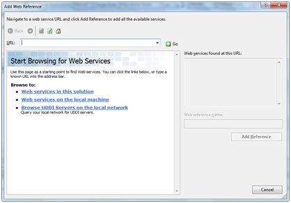

**Step (2)** :  '이 솔루션에서 웹 서비스'를 선택하십시오. StockService 참조를 반환합니다.

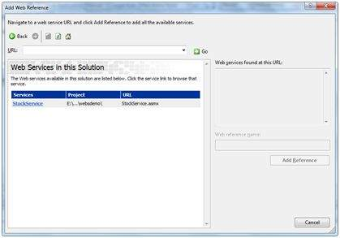

**Step (3)** : 서비스를 클릭하면 테스트 웹 페이지가 열립니다. 기본적으로 생성 된 프록시는 'localhost'라고하며, 이름을 바꿀 수 있습니다. 클라이언트 응용 프로그램에 프록시를 추가하려면 '참조 추가'를 클릭하십시오.

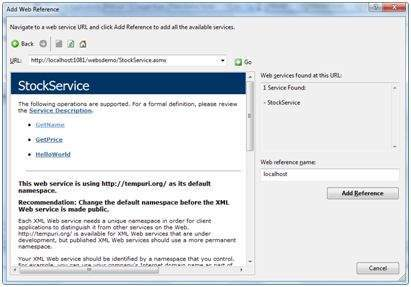

다음을 추가하여 코드 숨김 파일에 프록시를 포함시킵니다.

```csharp
using localhost;
```


# ASP.NET - Multi Threading

<https://www.tutorialspoint.com/asp.net/asp.net_multi_threading.htm>

스레드는 프로그램의 실행 경로로 정의됩니다. 각 스레드는 고유 한 제어 흐름을 정의합니다. 응용 프로그램에 데이터베이스 액세스 또는 일부 강력한 I / O 작업과 같이 복잡하고 시간이 많이 소요되는 작업이 포함 된 경우 각 스레드가 특정 작업을 수행하면서 서로 다른 실행 경로 또는 스레드를 설정하는 것이 유용합니다.


# ASP.NET - Configuration

<https://www.tutorialspoint.com/asp.net/asp.net_configuration.htm>

ASP.NET 응용 프로그램의 동작은 구성 파일의 다른 설정에 의해 영향을받습니다:

- machine.config
- web.config


# ASP.NET - Deployment

<https://www.tutorialspoint.com/asp.net/asp.net_deployment.htm>

ASP.NET 배포에는 두 가지 범주가 있습니다.