# Blazor 앱 만드는 방법

출처: https://www.codeproject.com/Articles/5253709/All-you-need-to-know-on-Blazor-app-and-create-ASP

Blazor 앱에 대해 알아야하고 VS 2019, .NET Core 3, 웹 API를 사용하여 ASP.NET Core Blazor CRUD 앱을 만들어야합니다.

[Download shanuBlazorCRUD.zip - 435.9 KB](https://www.codeproject.com/KB/aspnet/5253709/shanuBlazorCRUD.zip)


## 서론

이 기사에서는 Visual Studio 2019, .NET Core 3, Entity Framework 및 Web API를 사용하여 ASP.NET Core Blazor 용 간단한 CRUD 응용 프로그램을 만드는 방법을 살펴 봅니다. Blazor는 Microsoft에서 도입 한 새로운 프레임 워크입니다.

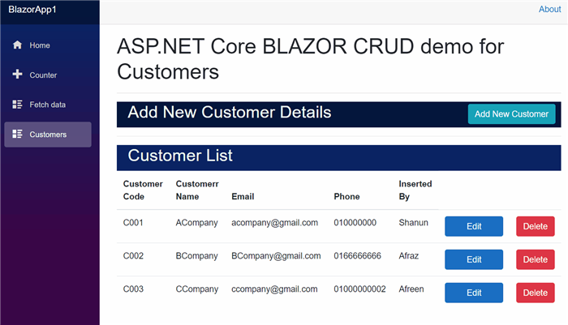

이 기사에서는 Visual Studio 2019, .NET Core 3, Entity Framework 및 Web API를 사용하여 ASP.NET Core Blazor 용 간단한 CRUD 응용 프로그램을 만드는 방법을 살펴 봅니다. Blazor는 Microsoft에서 도입 한 새로운 프레임 워크입니다.


### **Blazor:**

Blazor는 현재 미리보기에있는 Blazor Client 앱과 Blazor Server 앱이라는 두 가지 응용 프로그램 개발 기능을 가지고 있습니다. Blazor Client 앱은 WebAssembly에서 실행되고 Blazor Server 앱은 SignalR을 사용하여 실행됩니다. Blazor 앱은 JavaScript 대신 C #, Razor 및 HTML을 사용하여 만들 수 있습니다. Blazor WebAssembly는 모든 최신 웹 브라우저에서도 모바일 브라우저에서도 작동합니다. Blazor의 주요 장점은 C # 코드 파일이며 Razor 파일은 .NET 어셈블리로 컴파일됩니다. Blazor에는 재사용 가능한 구성 요소가 있으며 Blazor 구성 요소는 페이지, 대화 상자 또는 입력 양식으로 사용할 수 있으며 Blazor는 단일 페이지 응용 프로그램을 만드는 데에도 사용됩니다. Blazor는 두 가지 종류의 응용 프로그램을 만드는 데 사용됩니다. 하나는 Blazor Client-Side App이고 다른 하나는 Blazor Server Side APP입니다. 여기에서 자세한 내용을 볼 수 있습니다.


### **Blazor Client App:**

- Blazor 클라이언트 측은  미리보기 를 지원합니다.
- Blazor 클라이언트 측은 웹 어셈블리를 사용합니다
- Blazor Client Side에서 모든 .Net dll이 브라우저로 다운로드됩니다. 다운로드 크기가 더 클 수 있으며 클라이언트 브라우저에서 모든 다운로드가 발생하기 때문에로드 시간이 다소 지연 될 수 있습니다.
- Blazor 클라이언트 측 애플리케이션에 대한 서버 측 종속성이 필요하지 않습니다.
- 모든 Similer 종류의 JavaScript 코딩은 Blazor Client 앱에서 수행 할 수 있으며 JavaScript Interop을 사용할 필요는 없습니다.
- 정적 사이트로 배포 할 수 있으므로 오프라인도 지원합니다.
- 디버깅은 Blazor 서버 측보다 더 복잡합니다.
- 클라이언트 쪽에서 데이터베이스 연결이 누출되고 모든 응용 프로그램 코드가 클라이언트쪽에 있으며 보안 수준이 그리 좋지 않습니다.


### **Blazor Server App:**

- 서버에서 모든 구성 요소 프로세스가 진행됩니다.
- Blazor Server는 SignlR Connection을 사용하여 웹 서버에서 브라우저로 연결합니다.
- 클라이언트 측에서는 서버에서 모든 것이 발생하므로 데이터베이스 연결 누수가 발생하지 않습니다.
- 모든 양식 연결은 서버 측에서 이루어지며 클라이언트 측에 dll이 다운로드되지 않으며 모든 dll은 웹 서버에 있습니다.
- Blazor Client 앱보다 작은 다운로드 크기와 빠른 로딩 시간.
- Blazor 서버 측에서 .Net 코어를 사용할 수 있습니다.
- 디버깅은 Blazor 서버 측에서 훌륭합니다.
- WebAssemble이 없어도 모든 웹 브라우저에서 실행됩니다.
- 각 브라우저 세션은 SignalR 연결로 열립니다.


## Background

**전제 조건**

- [Visual Studio 2019 16.3](https://visualstudio.microsoft.com/vs/)[ or later](https://visualstudio.microsoft.com/downloads/?utm_medium=microsoft&utm_source=docs.microsoft.com&utm_campaign=button+cta&utm_content=download+vs2017)
-  [.NET Core 3.0 SDK](https://dotnet.microsoft.com/download/dotnet-core/3.0)


## 코드 사용

### 1 단계-데이터베이스 및 테이블 생성

WEB API 및 EF에 SQL Server 데이터베이스를 사용할 것입니다. 먼저 CustDB라는 데이터베이스와 CustDB라는 테이블을 만듭니다. 다음은 테이블에 데이터베이스 테이블 및 샘플 레코드 삽입 쿼리를 작성하는 SQL 스크립트입니다. 로컬 SQL Server에서 아래 제공된 쿼리를 실행하여 프로젝트에 사용할 데이터베이스와 테이블을 만듭니다.

```sql
USE MASTER       
GO       
       
-- 1) Check for the Database Exists .If the database is exist then drop and create new DB       
IF EXISTS (SELECT [name] FROM sys.databases WHERE [name] = 'CustDB' )       
DROP DATABASE CustDB       
GO       
       
CREATE DATABASE CustDB       
GO       
       
USE CustDB       
GO       
       
       
-- 1) //////////// Customer Masters    

IF EXISTS ( SELECT [name] FROM sys.tables WHERE [name] = 'CustomerMaster' )       
DROP TABLE CustomerMaster       
GO       
       
CREATE TABLE [dbo].[CustomerMaster](       
        [CustCd] [varchar](20) NOT NULL ,         
        [CustName] [varchar](100) NOT NULL,          
        [Email]  [nvarchar](100) NOT NULL,        
        [PhoneNo] [varchar](100) NOT NULL,           
        [InsertBy] [varchar](100) NOT NULL,   
        PRIMARY KEY (CustCd)  
)       
       
-- insert sample data to Student Master table       
INSERT INTO [CustomerMaster]   (CustCd,CustName,Email,PhoneNo,InsertBy)       
     VALUES ('C001','ACompany','acompany@gmail.com','01000007860','Shanun')       
       
INSERT INTO [CustomerMaster]   (CustCd,CustName,Email,PhoneNo,InsertBy)       
     VALUES ('C002','BCompany','bcompany@gmail.com','0100000001','Afraz')  

INSERT INTO [CustomerMaster]   (CustCd,CustName,Email,PhoneNo,InsertBy)       
     VALUES ('C003','CCompany','ccompany@gmail.com','01000000002','Afreen')  

INSERT INTO [CustomerMaster]   (CustCd,CustName,Email,PhoneNo,InsertBy)       
     VALUES ('C004','DCompany','dcompany@gmail.com','01000001004','Asha')  
            
     select * from CustomerMaster
```


### 2 단계-ASP.NET Core Blazor Server 응용 프로그램 만들기

위에 나열된 모든 필수 구성 요소를 설치 한 후 바탕 화면에서 시작 프로그램 Visual Studio 2019 Visual Studio 2019를 클릭합니다. 새 프로젝트를 클릭하십시오.

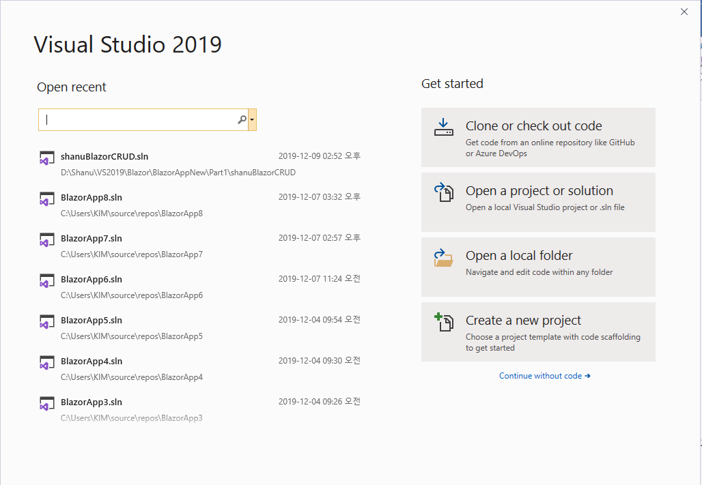

Blazor App을 선택하고 다음 버튼을 클릭하십시오.

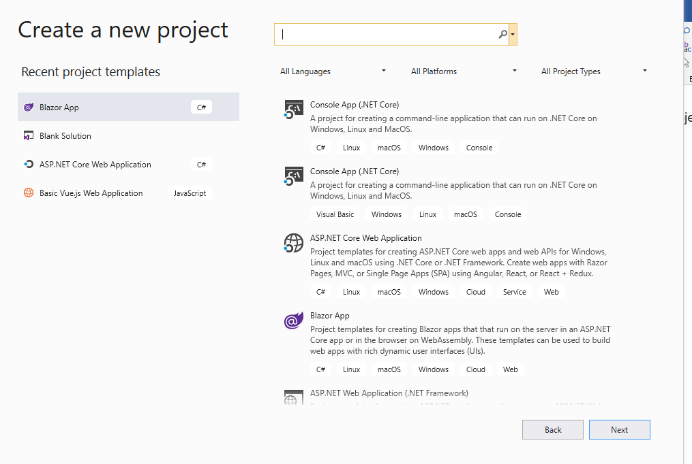

프로젝트 폴더를 선택하고 프로젝트 이름을 입력 한 다음 생성 버튼을 클릭하십시오.

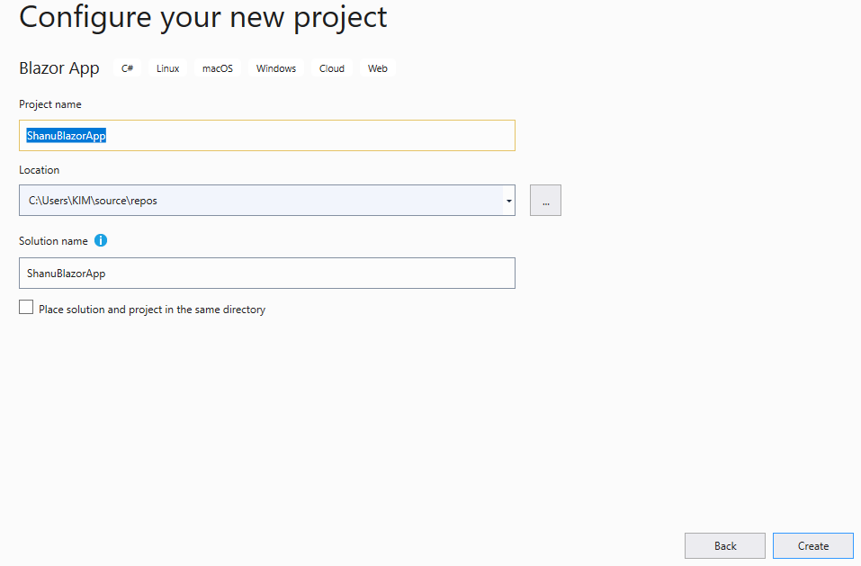

Blazor Server 앱 선택

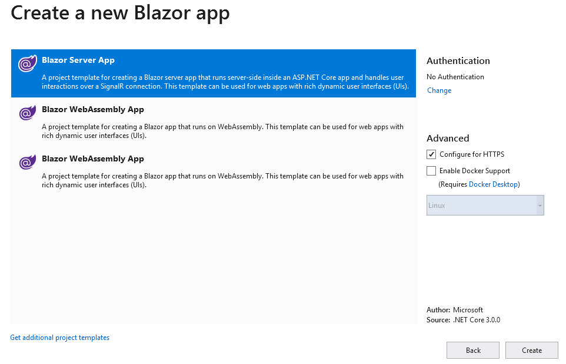

ASP.NET Core Blazor 서버 응용 프로그램을 만든 후 몇 초 동안 기다리십시오. 솔루션 탐색기에서 아래 구조를 볼 수 있습니다.

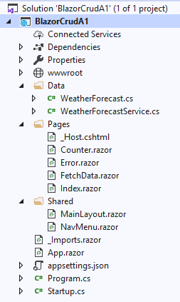

Data 폴더에서 모든 Model, DBContext Class, Services 및 Controller를 추가 할 수 있습니다.이 기사에서이를 확인할 수 있습니다.

Pages 폴더에서 모든 컴포넌트 파일을 추가 할 수 있습니다. 컴포넌트 파일은 모두 파일 이름을 가진 .razor 확장자를 가져야합니다.

공유 폴더에서 모든 왼쪽 메뉴 양식 NavMenu.razor 파일을 추가하고 MainLayout.razor 파일에서 기본 컨텐츠를 변경할 수 있습니다.

_Imports.razor 파일에서 모든 가져 오기 세트가 모든 구성 요소 페이지에서 사용되도록 순서대로 추가 된 것을 볼 수 있습니다.

App.razor 파일에서 브라우저에서 실행될 때 기본적으로 표시 할 기본 구성 요소를 추가합니다.

Appsertings.json을 사용하여 연결 문자열을 추가 할 수 있습니다.

Startup.cs 파일은 시작 구성 방법에 사용할 Controller 엔드 포인트, HTTP 클라이언트, 서비스 추가 및 dbcontext와 같은 모든 엔드 포인트 예제를 추가하는 중요한 파일입니다.

#### 응용 프로그램을 테스트하기 위해 실행

애플리케이션을 실행하면 왼쪽에 탐색이 있고 오른쪽에 데이터가 포함되어 있음을 알 수 있습니다. 기본 샘플 페이지와 메뉴가 Blazor 웹 사이트에 표시되는 것을 볼 수 있습니다. 페이지를 사용하거나 제거하고 자체 페이지로 시작할 수 있습니다.

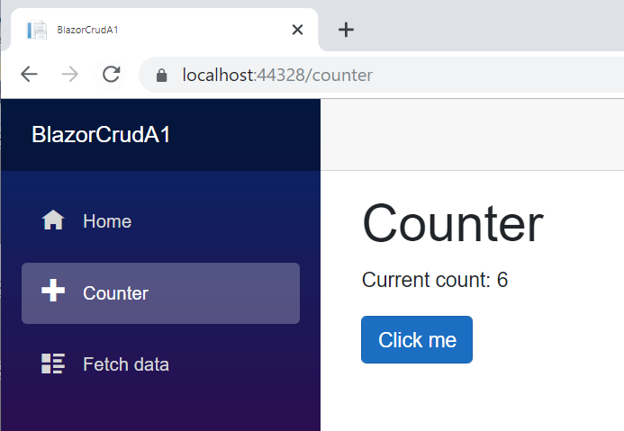

#### 컴포넌트에서 디버그

Blazor의 가장 큰 장점은 razor에서 C # 코드를 사용하고 코드 부분의 중단 점을 유지할 수 있고 브라우저에서 모든 비즈니스 로직이 제대로 작동하는지 확인하고 중단 포인트 로 모든 종류의 오류를 쉽게 추적 할 수 있다는 것입니다 

이를 위해 기존 카운터 구성 요소 페이지를 사용합니다.

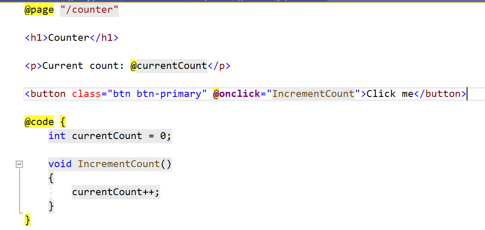

하나 이상의 버튼을 추가하고 버튼 클릭 이벤트에서 메소드를 호출하고 컴포넌트 페이지에서 이름을 바인딩합니다.

Html 디자인 부분에서 아래 코드를 추가합니다.

```html
<h1>My Blozor Code part</h1>
    My Name is : @myName   <br />
 <button @onclick="ClickMe">Click Me</button>
```

참고 : 모든 C # 코드 부분과 함수는 @code {} 부분으로 작성할 수 있습니다.ClickMe 메소드를 추가하고 @Code 부분에 이름을 바인딩하는 속성을 선언합니다.

```c#
[Parameter]
    public string myName { get; set; }
    private void ClickMe()
    {
        myName="Shanu";
    }
```

완전한 Coutner Component 페이지 코드는 다음과 같습니다.

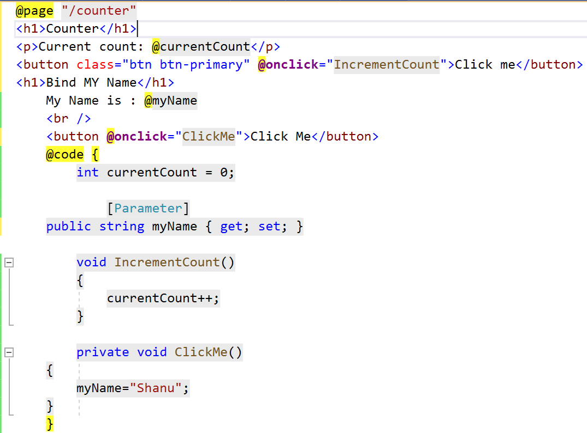

이제 ClickMe 메서드에 중단 점을 추가하겠습니다

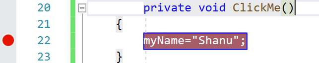

프로그램을 실행하고 카운터 페이지를여십시오.

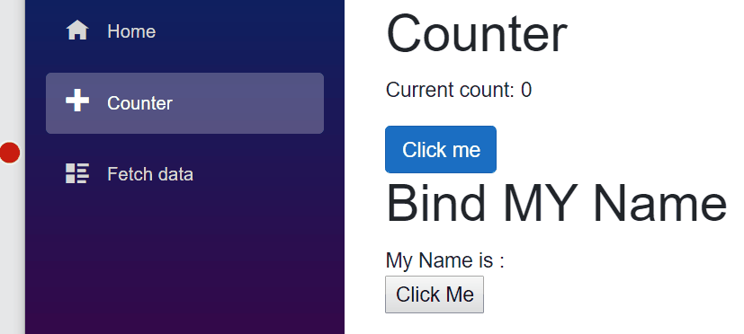

Click Me 버튼을 클릭하면 디버그하고 배치 한 중단 점에서 값을 확인할 수 있습니다.

이제 Bloazor에서 EF 및 웹 API를 사용하여 CRUD 작업 수행에 대해 살펴 보겠습니다.


### 3 단계-엔티티 프레임 워크 사용

Blazor 애플리케이션에서 Entity Framework를 사용하려면 아래 패키지를 설치해야합니다.

#### 패키지 설치

Microsoft.EntityFrameworkCore.SqlServer-EF 및 SQL Server 사용

Microsoft.EntityFrameworkCore.Tools-EF 및 SQL Server 사용

Microsoft.AspNetCore.Blazor.HTTTPClient-Blazor 구성 요소에서 WEB API를 통신합니다.

먼저 Microsoft.EntityFrameworkCore.SqlServer를 추가합니다. 프로젝트를 마우스 오른쪽 버튼으로 클릭하고 NuGet 패키지 관리를 클릭하십시오.


...