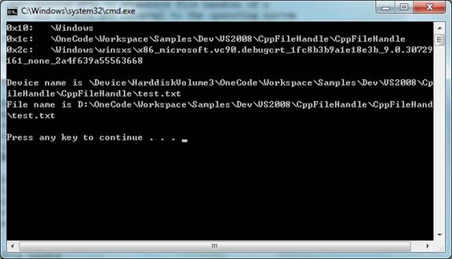

# CppFileHandle

출처: https://code.msdn.microsoft.com/windowsapps/CppFileHandle-03c8ea0b


이 VC ++ 코드 샘플에서는 파일 핸들을 사용하는 두 가지 일반적인 시나리오를 보여줍니다. 파일 핸들을 열거하고 파일 핸들에서 파일 이름 가져 오기.

다운로드[C++ (154.2 KB)](https://code.msdn.microsoft.com/windowsapps/CppFileHandle-03c8ea0b/file/52762/11/File handle operations demo (CppFileHandle).zip)

라이선스 [MS-LPL](javascript:showEula())


## CONSOLE APPLICATION (CppFileHandle)

CppFileHandle은 파일 핸들을 사용하는 두 가지 일반적인 시나리오를 보여줍니다.

- 프로세스의 파일 핸들을 열거 합니다.
- 파일 핸들에서 파일 이름을 가져옵니다.


### 샘플 실행하기




### 코드 사용

#### A. 프로세스의 파일 핸들을 열거.

프로세스의 파일 핸들을 열거하기 위해 문서화되지 않은 API를 사용해야합니다. 이러한 API와 구조체는 운영 체제 내부에서 실행되며 Windows 릴리스에서 다른 응용 프로그램으로 변경 될 수 있으므로 응용 프로그램의 호환성을 유지하려면 사용하지 않는 것이 좋습니다.

1. **NtQuerySystemInformation** 및 **NtQueryInformationFile**을 준비합니다. 이 함수에는 관련 가져 오기 라이브러리가 없습니다. LoadLibrary 및 GetProcAddress 함수를 사용하여 ntdll.dll에 동적으로 링크해야합니다.

```c++
    HINSTANCE hNtDll = LoadLibrary(_T("ntdll.dll")); 
    assert(hNtDll != NULL); 
 
 
    PFN_NTQUERYSYSTEMINFORMATION NtQuerySystemInformation =  
        (PFN_NTQUERYSYSTEMINFORMATION)GetProcAddress(hNtDll,  
        "NtQuerySystemInformation"); 
    assert(NtQuerySystemInformation != NULL); 
 
 
    PFN_NTQUERYINFORMATIONFILE NtQueryInformationFile =  
        (PFN_NTQUERYINFORMATIONFILE)GetProcAddress(hNtDll,  
        "NtQueryInformationFile"); 
 
```


2. 시스템 핸들 정보를 얻으십시오. (NtQuerySystemInformation, SystemHandleInformation, SYSTEM_HANDLE_INFORMATION) 전달 된 버퍼가 너무 작 으면 NtQuerySystemInformation이 올바른 필수 버퍼 크기를 반환하지 않습니다. 대신 함수가 더 이상 STATUS_INFO_LENGTH_MISMATCH를 반환하지 않을 때까지 버퍼 크기를 늘리는 동안 함수를 호출해야합니다.

```c++
	DWORD nSize = 4096, nReturn; 
    PSYSTEM_HANDLE_INFORMATION pSysHandleInfo = (PSYSTEM_HANDLE_INFORMATION) 
        HeapAlloc(GetProcessHeap(), 0, nSize); 
 
 
    // NtQuerySystemInformation은 전달 된 버퍼가 너무 작 으면 올바른 버퍼 크기를 반환하지 않습니다. 	// 대신 함수가 더 이상 STATUS_INFO_LENGTH_MISMATCH를 반환하지 않을 때까지
    // 버퍼 크기를 늘리며 함수를 호출해야합니다. 
    while (NtQuerySystemInformation(SystemHandleInformation, pSysHandleInfo,  
        nSize, &nReturn) == STATUS_INFO_LENGTH_MISMATCH) 
    { 
        HeapFree(GetProcessHeap(), 0, pSysHandleInfo); 
        nSize += 4096; 
        pSysHandleInfo = (SYSTEM_HANDLE_INFORMATION*)HeapAlloc( 
            GetProcessHeap(), 0, nSize); 
    } 
```


3. 프로세스의 파일 핸들을 열거하십시오. (SYSTEM_HANDLE_INFORMATION, HANDLE_TYPE_FILE, DuplicateHandle, NtQueryInformationFile) 핸들은 호스팅 프로세스에만 의미가 있기 때문에 다른 프로세스 핸들을 현재 프로세스 (DuplicateHandle)에 복제하여 파일 객체의 파일 정보를 더 쿼리해야합니다. NtQueryInformationFile은 파일 이름 정보를 검색하는 데 사용됩니다.

```c++
    DWORD dwFiles = 0; 
     
    // 대상 프로세스의 핸들을 가져옵니다. 
	// 핸들은 프로세스에서 파일 핸들을 복제하는 데 사용됩니다.
    HANDLE hProcess = OpenProcess( 
        PROCESS_DUP_HANDLE | PROCESS_QUERY_INFORMATION, FALSE, pid); 
    if (hProcess == NULL) 
    { 
        _tprintf(_T("OpenProcess failed w/err 0x%08lx\n"), GetLastError()); 
        return -1; 
    } 
 
 
    for (ULONG i = 0; i < pSysHandleInfo->NumberOfHandles; i++) 
    { 
        PSYSTEM_HANDLE pHandle = &(pSysHandleInfo->Handles[i]); 
 
 
        // 지정된 프로세스의 파일 핸들을 확인하십시오. 
        if (pHandle->ProcessId == pid &&  
            pHandle->ObjectTypeNumber == HANDLE_TYPE_FILE) 
        { 
            dwFiles++;    // 파일 핸들 수 늘리기 
 
 
            // 현재 프로세스에서 핸들 복제 
            HANDLE hCopy; 
            if (!DuplicateHandle(hProcess, (HANDLE)pHandle->Handle,  
                GetCurrentProcess(), &hCopy, MAXIMUM_ALLOWED, FALSE, 0)) 
                continue; 
 
 
            // 파일 객체에 대한 파일 이름 정보를 검색하십시오.
            IO_STATUS_BLOCK ioStatus; 
            PFILE_NAME_INFORMATION pNameInfo = (PFILE_NAME_INFORMATION) 
                malloc(MAX_PATH * 2 * 2); 
            DWORD dwInfoSize = MAX_PATH * 2 * 2; 
 
 
            if (NtQueryInformationFile(hCopy, &ioStatus, pNameInfo,  
                dwInfoSize, FileNameInformation) == STATUS_SUCCESS) 
            { 
                // 파일 이름을 가져 와서 인쇄하십시오. 
                WCHAR wszFileName[MAX_PATH + 1]; 
                StringCchCopyNW(wszFileName, MAX_PATH + 1,  
                    pNameInfo->FileName, /*must be WCHAR*/ 
                    pNameInfo->FileNameLength /*in bytes*/ / 2); 
 
 
                wprintf(L"0x%x:\t%s\n", pHandle->Handle, wszFileName); 
            } 
            free(pNameInfo); 
 
 
            CloseHandle(hCopy); 
        } 
    } 
 
 
    CloseHandle(hProcess); 
 
```


#### B. 파일 핸들에서 파일 이름 가져 오기

1. 파일 맵핑 오브젝트 (CreateFileMapping, MapViewOfFile)를 작성하십시오.

```c++
    hFileMap = CreateFileMapping(hFile, NULL, PAGE_READONLY, 0, 1, NULL); 
    if (!hFileMap) 
    { 
        _tprintf(_T("CreateFileMapping failed w/err 0x%08lx\n"),  
            GetLastError()); 
        return FALSE; 
    } 
 
 
    void* pMem = MapViewOfFile(hFileMap, FILE_MAP_READ, 0, 0, 1); 
    if (!pMem) 
    { 
        _tprintf(_T("MapViewOfFile failed w/err 0x%08lx\n"), GetLastError()); 
        CloseHandle(hFileMap); 
        return FALSE; 
    } 
 
```


2. GetMappedFileName 함수를 호출하여 파일 이름을 가져옵니다. GetMappedFileName에 의해 반환 된 파일 이름은 다음과 같은 장치 파일 이름을 포함합니다.

```c++
    if (GetMappedFileName(GetCurrentProcess(), pMem, szFileName, MAX_PATH)) 
    { 
        // szFileName은 다음과 같은 장치 파일 이름을 포함합니다.: 
        // \Device\HarddiskVolume2\Users\JLG\AppData\Local\Temp\HLe6098.tmp 
        _tprintf(_T("Device name is %s\n"), szFileName); 
 
 
        // 장치 이름이있는 경로를 드라이브 문자로 변환하십시오.
        TCHAR szTemp[BUFFER_SIZE]; 
        szTemp[0] = '\0'; 
 
 
        // 일련의 널 종료 문자열을 얻으십시오. 
        // 하나는 시스템의 유효한 각 드라이브에 대한 문자열이고, 다른 하나는 널 문자입니다. 
        // 각 문자열은 드라이브 이름입니다. 예 : C:\\0D:\\0\0
        if (GetLogicalDriveStrings(BUFFER_SIZE - 1, szTemp))  
        { 
            TCHAR szName[MAX_PATH]; 
            TCHAR szDrive[3] = _T(" :"); 
            BOOL bFound = FALSE; 
            TCHAR* p = szTemp; 
 
 
            do 
            { 
                // 드라이브 문자를 템플릿 문자열에 복사하십시오.
                *szDrive = *p; 
 
 
                // 각 장치 이름을 찾으십시오. 예를 들어 주어진 szDrive가 C:, 출력 
                // szName은 \Device\HarddiskVolume2 일 수 있습니다.
                if (QueryDosDevice(szDrive, szName, MAX_PATH)) 
                { 
                    UINT uNameLen = _tcslen(szName); 
 
 
                    if (uNameLen < MAX_PATH) 
                    { 
                        // 기기 이름과 일치시킵니다. e.g. \Device\HarddiskVolume2 
                        bFound = _tcsnicmp(szFileName, szName, uNameLen) == 0; 
 
 
                        if (bFound) 
                        { 
                            // szTempFile을 사용하여 szFileName 재구성
                            // 장치 경로를 DOS 경로로 바꾸십시오.
                            TCHAR szTempFile[MAX_PATH]; 
                            StringCchPrintf(szTempFile, MAX_PATH, _T("%s%s"),  
                                szDrive, szFileName + uNameLen); 
                            StringCchCopyN(szFileName, MAX_PATH + 1,  
                                szTempFile, _tcslen(szTempFile)); 
                        } 
                    } 
                } 
 
 
                // 다음 NULL 문자, 즉 다음 드라이브 이름으로 이동하십시오. 
                while (*p++); 
 
 
            } while (!bFound && *p); // End of string 
        } 
    } 
 
```

장치 이름이있는 경로를 드라이브 문자로 변환하려면 논리 드라이브 문자 (GetLogicalDriveStrings)를 열거하고 드라이버 문자에 해당하는 장치 이름을 가져온 다음 장치 이름을 GetMappedFileName에서 반환 한 이름과 비교해야합니다. 일치하는 항목이 있으면 파일 경로의 장치 이름을 드라이브 문자로 바꿉니다.


#### 추가 정보

MSDN: [파일 핸들에서 파일 이름 얻기](http://msdn.microsoft.com/en-us/library/aa366789.aspx)

