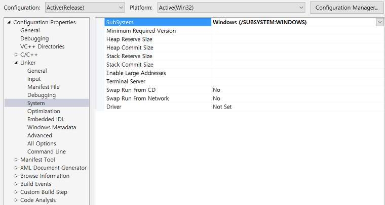

# 윈도우 콘솔 프로그램 숨기기

콘솔 프로그램을 백그라운드로 실행시키는 방법을 찾아보면 명령 프로모트(cmd)에서 start 명령어를 사용하여 백그라운드로 실행을 시킨다.

하지만 내가 원하는건 코드를 짤 때 백그라운드로 시작하는 것이였 기에 MSDN을 열심히 찾아 보았다.


단 두줄만 추가 해주면 백그라운드로 콘솔 프로그램이 실행되었다.

```c++
	HWND hWnd = GetForegroundWindow();

	ShowWindow(hWnd, SW_HIDE);
```

아쉬운건 실행 될 때 잠깐 콘솔창이 보이니 완벽하게 숨기는 건 아니다.

또 다른 방법을 찾아보니 옵션을 변경하여 숨기는 방법이다.



Linker -> System -> SubSystem 에서 Console 로 되어 있으면 Windows 로 변경해주면 된다.

아니면 WIN32 Console Project가 아닌 WIN32 Project로 생성하면 자동으로 설정이 되어있다.


만약 옵션을 변경하였으면 메인 함수를 변경해줘야한다.

보통 main을 사용하였을텐데 WinMain으로 변경하고 아래와 같은 파라미터를 입력해주면 되겠다.

```c++
int WINAPI WinMain(HINSTANCE hInstance, HINSTANCE hPrevInstance, char*, int nShowCmd)
{
}

```


출처: [https://eram.tistory.com/entry/%EC%BD%98%EC%86%94-%ED%94%84%EB%A1%9C%EA%B7%B8%EB%9E%A8-%EB%B0%B1%EA%B7%B8%EB%9D%BC%EC%9A%B4%EB%93%9C-%EC%8B%A4%ED%96%89](https://eram.tistory.com/entry/콘솔-프로그램-백그라운드-실행)

