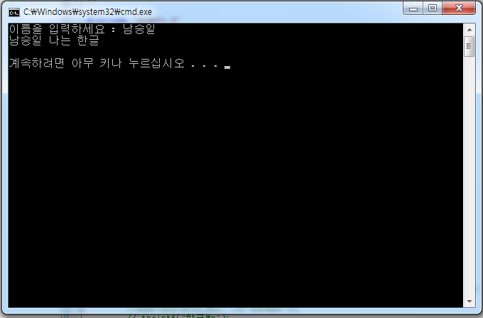

# COM ATL(Active Template Library) 예제 따라하기

출처: https://seungngil.tistory.com/entry/%EC%A0%9C-3%EA%B0%95COM-ATLActive-Template-Library-%EC%98%88%EC%A0%9C-%EB%94%B0%EB%9D%BC%ED%95%98%EA%B8%B0

\- ATL의 특징

ATL(Active Template Library)이란 C++ 템플릿(template)을 사용하여 작성된 클래스 라이브러리로서, 작고 빠르고 확정성을 갖는 COM 컴포넌트를 손쉽게 구현할 수 있게 하는 그 목적이 있다. 따라서, ATL에는 COM 객체를 구현하는데 필수적인 IUnknown, IClassFactory 등의 인터페이스에 대한 코드가 구현되어 있어, 개발자들이 이들 인터페이스를 반복하여 구현하지 않고도 COM 객체의 고유한 서비스를 구현하는 것만으로도 손쉽게 COM 컴포넌트를 생성할 수 있게 한다.

\- ATL의 장점

ATL의 첫번째 장점은 작고 빠르고 확정성을 갖는 COM 컴포넌트를 만들어준다는 것이다. ATL이 STL(Standard Template Library)의 전통을 이어받아 C++ 템플릿에 기반을 두고 있기 때문이다.

템플릿(template)은 C++ 역사에 있어서 비교적 최근에 C++ 언어 사양에 추가된 기능이다. 템플릿은 매개변수의 데이터형에 기초한 클래스 또한 함수를 생성하는 기능을 제공한다. 즉, 템플릿을 사용하면 각 데이터형에 대한 별도의 클래스 또는 함수를 구현할 필요없이, 단 하나의 클래스 또는 함수를 구현하여 여러 데이터형에 사용할 수 있다. 템플릿에는 클래스 템플릿(class template)과 함수 템플릿(function template) 등의 두가지 종류가 있다.

\- ATL 생성 예제

-----Server 만들기

Microsoft Visual Studio 2008에서 실습 되었다. **컴퓨터에 모든 권한은 관리자 권환**으로 되어 있어야 한다.

새 프로젝트를 만들어 ATL 프로젝트를 생성한다. 아래와 같은 솔루션이 생성 된다면 정상적으로 프로젝트가 생성되었다.

 

\- 중간설명

| 파일            | 설명                                                         |
| --------------- | ------------------------------------------------------------ |
| HelloServer.cpp | DllMain 함수를 비롯한 4개의 익스포트 함수에 대한 구현 코드를 포함한다. |
| HelloServer.def | 익스포트 함수 정의 파일                                      |
| HelloServer.idl | IDL 파일                                                     |
| HelloServer.rgs | 레지스트리 등록 파일                                         |
| HelloServer.rc  | 리소스 파일                                                  |
| resource.h      | 리소스 헤더 파일                                             |
| stdafx.cpp      | stdafx.h 파일을 포함한다.                                    |
| stdafx.h        | ATL 헤더 파일을 포함한다.                                    |

다음으로 프로젝트에 오른쪽 마우스 -> 추가 -> 클래스 추가를 해준다. 아래와 같이 ATL 단순 개체를 추가한다.

ATL 단순 개체 추가가 위와 같이 완료 되었다면 IHello에 메소드 하나를 만들어준다.

메소드 추가 까지 완료가 되었다면 sayHello에 아래와 같이 코드를 작성한다.

STDMETHODIMP CHello::sayHello(wchar_t* name, wchar_t** message)
{
 // TODO: 여기에 구현 코드를 추가합니다.
 wchar_t * buffer = (wchar_t *) ::CoTaskMemAlloc(256);
 if(buffer == NULL) return E_FAIL;
 ::wsprintf(buffer, L"%s 나는 한글\n", name);
 *message = (wchar_t*)buffer;

 return S_OK;
}

그리고 Debug하면 아래와 같이 dll 파일이 생성 될 것이다.

 

이와 같이 나오면, HelloServer 완성이 된다.

----- Client 만들기

 [HelloClient.zip](HelloClient.zip)

\- Client 코드

// HelloClient.cpp : 콘솔 응용 프로그램에 대한 진입점을 정의합니다.
//

\#include "stdafx.h"
\#include "wctype.h"
\#include "locale.h"
//#import "progid:HelloServer.Hello.1" no_namespace
\#import "..\HelloServer\HelloServer\Debug\HelloServer.tlb" no_namespace

using namespace std;

int _tmain(int argc, _TCHAR* argv[])
{
 ::CoInitializeEx(NULL, COINIT_APARTMENTTHREADED);

 try {
 IHelloPtr pIHello(__uuidof(Hello));

 _wsetlocale(LC_ALL, L"korean");

 wchar_t * message = NULL;
 wchar_t * name;
 wchar_t buffer[256];
 cout << "이름을 입력하세요 : ";
 //cin >> buffer;
 wscanf(L"%s", buffer);
 name = (wchar_t *)buffer;

 //pIHello->sayHello(name, &message);
 pIHello->sayHello((unsigned short *)name, (unsigned short **)&message);

 //wsetlocale(LC_ALL, _T("korean"));
 //_tprintf("한글\n");

 wcout << (wchar_t *)message << endl;
 //wprintf(L"%s\n", message);
 //cout << (wcharmessage << endl;
/*
 cout << "이름을 저장합니다." << endl;
 pIHello->name = _com_util::ConvertStringToBSTR((char*)name);
 cout << "이름을 읽습니다." << endl;
 name = (wchar_t*)_com_util::ConvertBSTRToString(pIHello->name);
 cout << "읽어온 이름 : " << (char*)name << endl;
 */ 
 ::CoTaskMemFree((LPVOID)message);
 }
 catch(_com_error& e) {
 cout << e.ErrorMessage() << endl;
 }

 ::CoUninitialize();

 return 0;
}

**해당 프로젝트의 압축을 푼뒤 , Server 프로젝트와 Client 프로젝트를 한 폴에 안에 넣고, 실행하면 완성**

 