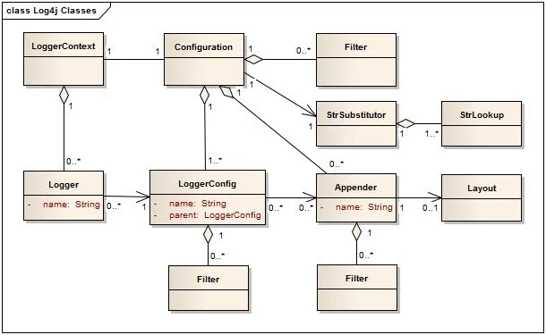
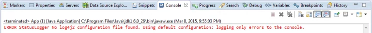
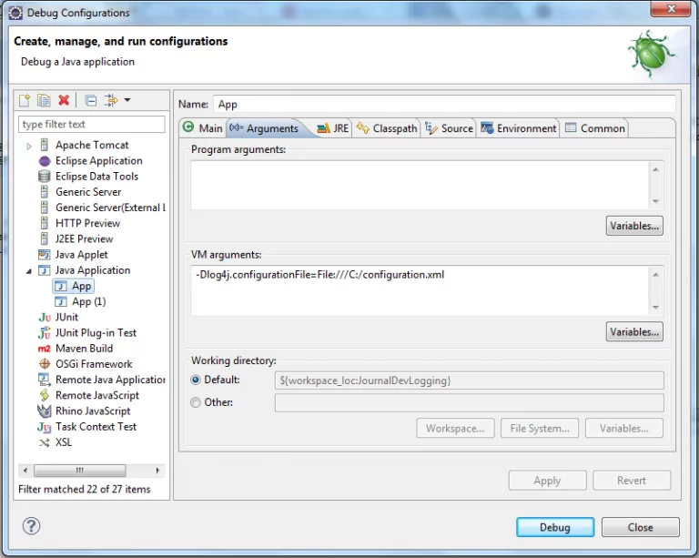
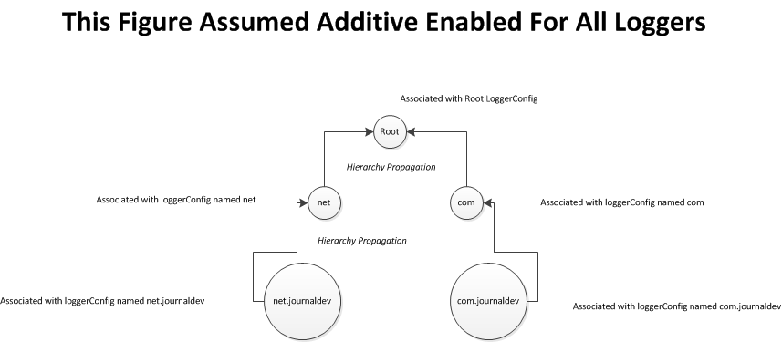
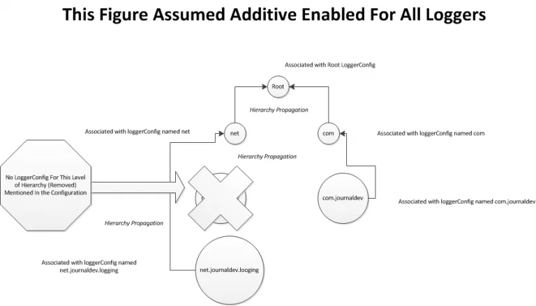

# Log4j2 Example Tutorial

출처: https://www.journaldev.com/7128/log4j2-example-tutorial-configuration-levels-appenders

Apache Log4j2 예제 자습서에 오신 것을 환영합니다. 애플리케이션의 가장 성가신 점에 대해 전문 개발자에게 물어 보면 답변은 로깅과 관련이있을 수 있습니다. 응용 프로그램에 적절한 로그가 없으면 유지 관리가 악몽이됩니다.

대부분의 애플리케이션은 개발 테스트, 단위 테스트, 통합 테스트를 거칩니다. 그러나 생산과 관련하여 항상 독특한 시나리오와 예외에 직면하게 될 것입니다. 따라서 특정 상황에서 발생한 일을 파악하는 유일한 방법은 로그를 통해 디버그하는 것입니다.

많은 프레임 워크가 기본 로깅 방법을 제공하지만 항상 업계 표준 로깅 메커니즘을 사용하는 것이 가장 좋습니다. Apache Log4j는 가장 널리 사용되는 로깅 프레임 워크 중 하나입니다. Apache Log4j 2는 Log4j보다 훨씬 나은 다음 버전입니다.


## Log4j Example Tutorial

이 Log4j2 예제 자습서에서는 Apache Log4j2를 시작하는 방법을 배웁니다. 또한 Log4j2 아키텍처, log4j2 구성, log4j2 로깅 수준, 어 펜더, 필터 등을 살펴볼 것입니다.

[
Log4j2 Overview](https://www.journaldev.com/7128/log4j2-example-tutorial-configuration-levels-appenders#log4j2)

[Log4j2 Architecture](https://www.journaldev.com/7128/log4j2-example-tutorial-configuration-levels-appenders#log4j2-architecture)

[Log4j2 Configuration](https://www.journaldev.com/7128/log4j2-example-tutorial-configuration-levels-appenders#log4j2-configuration)

[Log4j2 Levels](https://www.journaldev.com/7128/log4j2-example-tutorial-configuration-levels-appenders#log4j2-levels)

[Log4j2 Lookups](https://www.journaldev.com/7128/log4j2-example-tutorial-configuration-levels-appenders#log4j2-lookups)

[Log4j2 Appenders](https://www.journaldev.com/7128/log4j2-example-tutorial-configuration-levels-appenders#log4j2-appenders)

[Log4j2 Filters](https://www.journaldev.com/7128/log4j2-example-tutorial-configuration-levels-appenders#log4j2-filters)

[Log4j2 Layouts](https://www.journaldev.com/7128/log4j2-example-tutorial-configuration-levels-appenders#log4j2-layouts)

[Which Log4j2 Level should you use](https://www.journaldev.com/7128/log4j2-example-tutorial-configuration-levels-appenders#log4j2-levels-guide)

[Log4j2 Tutorial Summary](https://www.journaldev.com/7128/log4j2-example-tutorial-configuration-levels-appenders#log4j2-tutorial-summary)


### Log4j2 Overview

애플리케이션에서 Logging API를 사용하는 것은 사치스러운 일이 아니라 필수입니다. Log4j는 Apache Software에 따라 게시되고 라이선스가 부여 된 오픈 소스 라이브러리입니다.

Eclipse 디버깅 또는 기타 도구를 사용하여 애플리케이션을 디버그 할 수 있지만 프로덕션 환경에서는 충분하지 않고 실행 가능하지 않습니다.

로깅 메커니즘은 일반 디버깅에서는 찾을 수없는 몇 가지 이점을 제공합니다.

| Category / Operation (Debugging, Logging)     | Debugging                                    | Logging                                                      |
| --------------------------------------------- | -------------------------------------------- | ------------------------------------------------------------ |
| Human Intervention                            | 사람의 개입이 필요합니다                     | 사람의 개입이 필요 없음                                      |
| Persistent Medium                             | 영구 스토리지와 통합 할 수 없음              | 영구 저장소 (파일, 데이터베이스, NoSQL 데이터베이스 등)와 통합 가능 |
| May used for Auditing                         | 감사를 달성하는 데 사용할 수 없습니다.       | 효율적으로 사용하면 감사를 달성하는 데 사용할 수 있습니다.   |
| Sufficient for complicated structure and flow | 충분치 않은; 흐름으로 길을 잃을 수 있습니다. | 충분함                                                       |
| Productivity                                  | 생산성 저하                                  | 생산성 향상                                                  |

위에서 볼 수 있듯이 로깅 메커니즘을 사용하면 유지 관리 비용이 적게 들고 더 효율적입니다.

Apache Log4j는 Java 애플리케이션에 logging  하기위한 프론트 러너 도구이므로 사용해야합니다.


### Log4j2 Architecture

Log4j 예제 자습서를 진행하기 전에 Log4j2 아키텍처를 살펴 보는 것이 좋습니다. 아래 이미지는 Log4j2 API의 중요한 클래스를 보여줍니다.



위에 표시된 아키텍처에 대한 자세한 설명은 다음과 같습니다.

> 응용 프로그램은 LogManager에 특정 이름의 Logger를 요청합니다.

> LogManager는 적절한 LoggerContext를 찾은 다음 여기에서 Logger를 가져옵니다.

> Logger가 아직 생성되지 않은 경우 아래 세 가지 선택 사항에 따라 생성되고 LoggerConfig와 연결됩니다.

- 로거 인스턴스가 생성되고 동일한 이름을 가진 LoggerConfig와 연결됩니다. 예를 들어 getLogger (App.class)의 App.class는 String com.journaldev.App으로 평가됩니다. LoggerConfig 이름은 정규화 된 클래스 이름 (소프트웨어 구성 요소)과 동일합니다.
- Logger 인스턴스가 생성되고 Logger 상위 패키지가 동일한 LoggerConfig와 연결됩니다. 예를 들어 getLogger ( 'com.journaldev')의 com.journaldev
- 로거 인스턴스가 생성되고 루트 LoggerConfig와 연결됩니다. 루트 LoggerConfig는 구성 파일이 없거나 로거 선언에 정의되지 않은 이름을 가진 로거를 가져올 때 사용됩니다.

> LoggerConfig 개체는 구성 파일의 Logger 선언에서 생성됩니다. LoggerConfig는 또한 LogEvent를 처리하고 정의 된 Log4j2 Appender에 위임하는 데 사용됩니다.

> 루트 로거는 존재 측면에서 예외적 인 경우입니다. 항상 존재하며 모든 로거 계층의 맨 위에 있습니다.

> 아래 명령문을 사용하여 루트 로거를 얻을 수 있습니다.

- ```xml
  Logger logger = LogManager.getLogger(LogManager.ROOT_LOGGER_NAME);
  Logger logger = LogManager.getRootLogger();
  ```

> Log4j2 로거의 이름은 대소 문자를 구분합니다.

> 루트 로거를 제외한 모든 로거는 이름을 LogManager.getLogger ()에 전달하여 얻을 수 있습니다.

> LoggerContext는 애플리케이션 내부에 여러 LoggerContext가있을 수 있으므로 로깅 시스템의 보컬 포인트입니다. 각 LoggerContext마다 활성 구성을 설정해야합니다.

> Log4j2 구성에는 모든 로깅 시스템 자산이 포함됩니다. LoggerConfig (s), Appender (s), Filter (s) 및 기타 다수.

> 동일한 이름을 전달하여 LogManager.getLogger ()를 호출하면 항상 정확히 동일한 로거 인스턴스에 대한 참조가 반환됩니다.

> 로깅 시스템의 구성은 일반적으로 애플리케이션 초기화와 함께 수행됩니다. 이것은 다른 형태를 취할 수 있습니다. 프로그래밍 방식으로 또는 log4j2 구성 파일을 읽습니다.

모든 로거는 로거 계층을 구성하는 LoggerConfig 개체 집합 인 LoggerConfig 개체와 연결됩니다. 이 개념을 Logger Hierarchy라고합니다.

Logger Hierarchy는 상위-하위 관계가있는 LoggerConfig 개체 집합으로 구성됩니다. 모든 로거 계층의 최상위 요소는 루트 로거입니다.

Log4j2가 구성 파일을 찾지 못하면 루트 로거 만 로깅 수준이 ERROR 인 로깅에 사용됩니다. 아래 이미지는이 경우에 표시되는 경고 메시지를 보여줍니다.

오류 StatusLogger log4j2 구성 파일을 찾을 수 없습니다. 기본 구성 사용 : 콘솔에 오류 만 로깅합니다.



아래 표는 로거 계층의 상위-하위 관계를 보여줍니다.

|  LoggerConfig (Is A)   |   Root   |   com    | com.journaldev | com.journaldev.logging |
| :--------------------: | :------: | :------: | :------------: | :--------------------: |
|          Root          |    X     |  Child   |   descendant   |       descendant       |
|          com           |  Parent  |    X     |     Child      |       descendant       |
|     com.journaldev     | Ancestor |  Parent  |       X        |         Child          |
| com.journaldev.logging | Ancestor | Ancestor |     Parent     |           X            |

부모-자식 관계를 명확히하기 위해 위의 표는 다음과 같이 읽습니다.

> 루트는 com의 상위 항목입니다.

> 루트는 com.journaldev의 조상입니다.

> com은 Root의 자식입니다.

> com은 com.journaldev.logging의 조상입니다.

> com.journaldev.logging은 com.journaldev 등의 하위 항목입니다.

LoggerConfig의 인스턴스는 다른 LoggerConfig의 조상이라고합니다. 이름 뒤에 점이있는 경우 하위 이름의 접두사입니다.

LoggerConfig의 인스턴스는 다른 LoggerConfig의 부모라고합니다. 둘 사이에 인터리빙 이름이없는 경우.


### Log4j2 Configuration

응용 프로그램에서 Log4j2 구성을 사용하는 방법에는 여러 가지가 있습니다.

- XML, JSON, YAML 또는 속성 파일로 작성된 구성 파일 사용.
- 프로그래밍 방식으로 구성 팩토리 및 구성 구현을 만듭니다.
- 프로그래밍 방식으로 구성 인터페이스에 노출 된 API를 호출합니다.
- 프로그래밍 방식으로 내부 로거 클래스에서 메서드를 호출합니다.

주로 구성 파일에 중점을 둘 것입니다. 그러나 특정 로거에 대한 특정 로깅 전략을 구성하려는 경우 프로그래밍 접근 방식을 아는 것도 좋습니다.

먼저 구성 파일을 제공하지 않은 경우를 고려해 보겠습니다. Log4j2 구현에서는 log4j2 구성 파일의 위치를 가리키는 log4j.configurationFile 이라는 시스템 변수가 있다고 가정합니다.

``` java
package com.journaldev;
import org.apache.logging.log4j.LogManager;
import org.apache.logging.log4j.Logger;

public class App
{
    public static void main( String[] args ) {
    	Logger logger = LogManager.getRootLogger();
    	logger.trace("Configuration File Defined To Be :: "+System.getProperty("log4j.configurationFile"));
    }
}
```

간단한 log4j2 구성 파일은 다음과 같습니다.

`configuration.xml :`

``` xml
<?xml version="1.0" encoding="UTF-8"?>
<Configuration>
  <Appenders>
    <Console name="Console">
      <PatternLayout pattern="%d{HH:mm:ss.SSS} [%t] %-5level %logger{36} - %msg%n"/>
    </Console>
  </Appenders>
  <Loggers>
    <Root level="trace">
      <AppenderRef ref="Console"/>
    </Root>
  </Loggers>
</Configuration>
```

위에 나열된 코드에 대한 자세한 설명은 다음과 같습니다.

- 앱이 LogManager getRootLogger 메서드를 호출하여 루트 로거를 참조했습니다.

- LogManager에서 로거를 참조하면 Log4j 시스템이 시작되었습니다.

- Log4j는 log4j.configurationFile 시스템 속성을 검사하여 log4j2 구성 파일을 결정합니다. Log4j 구성은 JSON, YAML 및 XML로 작성할 수 있습니다.

- System.setProperties ( 'log4j.configurationFile', 'FILE_PATH')를 통해 log4j.configurationFile 시스템 속성을 설정하거나 아래 그림과 같이 JVM 매개 변수로 전달하여 설정할 수 있습니다. 파일 프로토콜 접두사에 유의하십시오.

  

- 시스템 속성이 정의되지 않은 경우 구성 순서가 다음과 같은 우선 순위를 갖습니다.

  - Property ConfigurationFactory는 클래스 경로에서 log4j2-test.properties를 찾습니다.
  - YAML ConfigurationFactory는 클래스 경로에서 log4j2-test.yaml 또는 log4j2-test.yml을 찾습니다.
  - JSON ConfigurationFactory는 클래스 경로에서 log4j2-test.jsn 또는 log4j2-test.json을 찾습니다.
  - XML ConfigurationFactory는 클래스 경로에서 log4j2-test.xml을 찾습니다.
  - Property ConfigurationFactory는 클래스 경로에서 log4j2.properties를 찾습니다.
  - YAML ConfigurationFactory는 클래스 경로에서 log4j2.yml 또는 log4j2.yaml을 찾습니다.
  - JSON ConfigurationFactory는 클래스 경로에서 log4j2.jsn 또는 log4j2.json을 찾습니다.
  - XML ConfigurationFactory는 클래스 경로에서 log4j2.xml을 찾습니다.
  - 구성 파일이 제공되지 않은 경우 DefaultConfiguration이 발생하고 다음과 같은 기본 동작 집합이 표시됩니다.
    - 루트 로거가 사용됩니다.
    - 루트 로거 수준이 ERROR로 설정됩니다.
    - 루트 로거는 로깅 메시지를 콘솔로 전파합니다.
    - PatternLayout이 `%d{HH:mm:ss.SSS} [%t] %-5level %logger{36} - %msg%n`으로 설정됩니다.

log4j2 구성 파일을 사용하면 log4j2 구성이 매우 간단 해지지 만 프로그래밍 방식으로 구성하는 방법을 살펴 보겠습니다. 이것은 ConfigurationFactory 사용에 관한 것입니다.

``` java

package com.journaldev;
import java.io.File;
import java.io.FileInputStream;
import java.io.FileNotFoundException;
import java.io.IOException;
import org.apache.logging.log4j.Level;
import org.apache.logging.log4j.core.Logger;
import org.apache.logging.log4j.core.LoggerContext;
import org.apache.logging.log4j.core.appender.ConsoleAppender;
import org.apache.logging.log4j.core.config.Configuration;
import org.apache.logging.log4j.core.config.ConfigurationFactory;
import org.apache.logging.log4j.core.config.ConfigurationSource;
import org.apache.logging.log4j.core.config.LoggerConfig;
import org.apache.logging.log4j.core.config.xml.XmlConfigurationFactory;
import org.apache.logging.log4j.core.layout.PatternLayout;
public class App
{
    public static void main( String[] args ) throws FileNotFoundException, IOException {
 
    	// Get instance of configuration factory; your options are default ConfigurationFactory, XMLConfigurationFactory,
    	// 	YamlConfigurationFactory & JsonConfigurationFactory
    	ConfigurationFactory factory =  XmlConfigurationFactory.getInstance();
 
    	// Locate the source of this configuration, this located file is dummy file contains just an empty configuration Tag
    	ConfigurationSource configurationSource = new ConfigurationSource(new FileInputStream(new File("C:/dummyConfiguration.xml")));
 
    	// Get a reference from configuration
    	Configuration configuration = factory.getConfiguration(configurationSource);
 
    	// Create default console appender
    	ConsoleAppender appender = ConsoleAppender.createDefaultAppenderForLayout(PatternLayout.createDefaultLayout());
 
    	// Add console appender into configuration
    	configuration.addAppender(appender);
 
    	// Create loggerConfig
    	LoggerConfig loggerConfig = new LoggerConfig("com",Level.FATAL,false);
 
    	// Add appender
    	loggerConfig.addAppender(appender,null,null);
 
    	// Add logger and associate it with loggerConfig instance
    	configuration.addLogger("com", loggerConfig);
 
    	// Get context instance
    	LoggerContext context = new LoggerContext("JournalDevLoggerContext");
 
    	// Start logging system
    	context.start(configuration);
 
    	// Get a reference for logger
    	Logger logger = context.getLogger("com");
 
    	// LogEvent of DEBUG message
    	logger.log(Level.FATAL, "Logger Name :: "+logger.getName()+" :: Passed Message ::");
 
    	// LogEvent of Error message for Logger configured as FATAL
    	logger.log(Level.ERROR, "Logger Name :: "+logger.getName()+" :: Not Passed Message ::");
 
    	// LogEvent of ERROR message that would be handled by Root
    	logger.getParent().log(Level.ERROR, "Root Logger :: Passed Message As Root Is Configured For ERROR Level messages");
    }
}

```

- Log4j2에서 제공하는 ConfigurationFactory 중 하나를 사용하거나 기본값을 사용할 수 있습니다. XMLConfigurationFactory를 사용하여 ConfigurationFactory의 인스턴스를 가져 왔습니다.
- Factory는 해당 구성 파일을 전달하여 필요한 구성 참조의 인스턴스를 제공합니다.
- 구성 인스턴스는 로깅 시스템을 시작하기 위해 LoggerContext와 함께 사용됩니다.
- 콘솔 어 펜더가 구성되고 기본 레이아웃으로 구성 인스턴스에 추가되었습니다. 이 Appender는 메시지를 콘솔에 인쇄합니다.
- LoggerConfig 인스턴스가 제공된 이름 (LEVEL)으로 생성되었으며 필터가 사용되지 않았습니다. 생성 된 Appender는이 LoggerConfig 인스턴스에 할당됩니다.
- LoggerConfig 인스턴스가 구성 인스턴스에 추가되었습니다.
- LoggerContext의 새 인스턴스가 정의 된 이름으로 생성됩니다.
- 구성 인스턴스는 LoggerContext 인스턴스에 대해 전달되었으며 후자에서 시작됩니다.
- LoggerContext에서 로거 인스턴스를 가져 왔습니다. 이 로거 인스턴스는 일련의 로그 이벤트를 발생시키는 데 사용됩니다.
- Logger 인스턴스는 Log4j2 레벨 섹션에 설명 된 세 가지 이벤트를 발생 시켰습니다.
- Com logger는 레벨이 FATAL 인 메시지를 인쇄하도록 구성했습니다.
- 기본적으로 루트 로거는 수준이 ERROR 인 메시지를 인쇄하도록 구성됩니다.
- ERROR 메시지는 레벨이 치명적이기 때문에‘com’로거에 의해 기록되지 않습니다.

YAML, JSON 또는 속성 파일을 사용하여 동일한 구성을 수행 할 수 있습니다. 그러나 log4j2 속성 파일 구성은 log4j 속성 파일과 다르므로 log4j2와 함께 log4j 속성 파일 구성을 사용하지 않는지 확인하십시오. 아래 오류가 발생합니다.

``` bash
ERROR StatusLogger No log4j2 configuration file found. Using default configuration: logging only errors to the console.
```

위의 코드를 처리하는 동안 아래 출력이 제공됩니다.

``` shell

Logger Name :: com :: Passed Message ::
00:01:27.705 [main] ERROR - Root Logger:: Passed Message As Root Is Configured For ERROR Level messages
```

로그의 첫 번째 줄은 com 로거에서 가져오고 두 번째 줄은 루트 로거에서 가져옵니다. Com 로거 오류 메시지는 레벨이 치명적이기 때문에 인쇄되지 않습니다.


### Log4j2 Levels

위의 코드 예제에서 LoggerConfig를 정의 할 때마다 로깅 수준도 제공한다는 것을 알 수 있습니다. 기본적으로 log4j2 로깅은 추가적입니다. 이는 특정 로거가 사용될 때 모든 상위 로거도 사용됨을 의미합니다. 아래 이미지는이 상황을 명확히 보여줍니다.



그리고 여기에 대한 설명이 있습니다.

- 앞서 언급했듯이 각 로거는 LoggerConfig 인스턴스와 연결되어 있습니다. 이 loggerConfig는 구성 범위에서 정의되었습니다.
- 로깅 수준은 LoggerConfig 범위에서 결정할 수 있습니다. 
- 로거는 이름, 상위 패키지 또는 루트 로거 자체를 지정하여 얻을 수 있습니다.
- 루트 로거는 모든 LoggerConfig 계층 구조의 최상위 노드입니다. 
- Com.journaldev 로거를 가져오고 로깅을위한 logEvent를 시작하면 loggerConfig (net.journaldev)가 메시지를 기록하고 메시지는 상위 로깅 수준을 고려하지 않고 계층 구조에서도 전파됩니다. 따라서 로그 이벤트는 com 및 Root 로거로 전파되고 정의 된 수준에 따라 각각 메시지를 기록합니다.
- Com 로거를 얻고 로깅을위한 logEvent를 시작하면 loggerConfig (com)가 메시지를 기록하고 메시지는 상위의 로깅 수준을 고려하지 않고 계층 구조에서도 전파됩니다. 즉, 루트 로거는 로그 이벤트를 전파하고 메시지도 기록합니다.
- Net.journaldev 계층 구조도 마찬가지입니다.
- 다음 섹션에서는 추가 개념에 대해 더 많은 설명을 추가합니다.
- 부모가 필터 개념을 사용하거나 추가 표시기를 false로 설정하여 메시지를 무시할 수 있으므로 로그 이벤트가 부모에게 전파되지 않습니다.
- 각 loggerConfig의 수준이 로그 이벤트 수준보다 높으면 로거가 메시지를 무시할 가능성이 있습니다.

이제 위에서 설명한 가산 성 개념과 관련된 예를 살펴 보겠습니다.

``` java

import net.NetApp;
import net.journaldev.NetJournalDevApp;
import com.ComApp;
import com.journaldev.ComJournalDevApp;
public class Main {
	public static void main(String [] args){
		new ComApp();
		new ComJournalDevApp();
		new NetApp();
		new NetJournalDevApp();
	}
}

```

``` java

package com.journaldev;
import org.apache.logging.log4j.LogManager;
import org.apache.logging.log4j.Logger;
public class ComJournalDevApp {
	public ComJournalDevApp(){
		Logger logger = LogManager.getLogger(ComJournalDevApp.class);
		logger.trace("COM :: JournalDev :: LEVEL :: ComJournalDevApp TRACE Message ::");
	}
}

```

``` java

package net;
import org.apache.logging.log4j.LogManager;
import org.apache.logging.log4j.Logger;
public class NetApp {
	public NetApp(){
		Logger logger = LogManager.getLogger(NetApp.class);
		logger.error("NET :: LEVEL :: NetApp ERROR Message ::");
	}
}

```

``` java

package net.journaldev;
import org.apache.logging.log4j.LogManager;
import org.apache.logging.log4j.Logger;
public class NetJournalDevApp {
	public NetJournalDevApp(){
		Logger logger = LogManager.getLogger(NetJournalDevApp.class);
		logger.error("NET :: JournalDev :: LEVEL :: NetJournalDevApp ERROR Message ::");
	}
}

```

Log4j2 구성 파일은 다음과 같습니다.

``` xml

<?xml version="1.0" encoding="UTF-8"?>
<Configuration>
  <Appenders>
    <Console name="Console">
      <PatternLayout pattern="%d{HH:mm:ss.SSS} [%t] %-5level %logger{36} - %msg%n"/>
    </Console>
  </Appenders>
  <Loggers>
    <Root level="ERROR">
      <AppenderRef ref="Console"/>
    </Root>
  	<logger name="com" level="TRACE">
  		<AppenderRef ref="Console"/>
  	</logger>
  	<logger name="com.journaldev" level="TRACE">
  		<AppenderRef ref="Console"/>
  	</logger>
  	<logger name="net" level="ERROR">
  		<AppenderRef ref="Console"/>
  	</logger>
  	<logger name="net.journaldev" level="ERROR">
  		<AppenderRef ref="Console"/>
  	</logger>
  </Loggers>
</Configuration>

```

Main 클래스를 실행하면 아래 결과를 찾을 수 있습니다.

``` shell

10:34:47.168 [main] TRACE com.ComApp - COM :: LEVEL :: ComApp TRACE Message ::
10:34:47.168 [main] TRACE com.ComApp - COM :: LEVEL :: ComApp TRACE Message ::
10:34:47.170 [main] TRACE com.journaldev.ComJournalDevApp - COM :: JournalDev :: LEVEL :: ComJournalDevApp TRACE Message ::
10:34:47.170 [main] TRACE com.journaldev.ComJournalDevApp - COM :: JournalDev :: LEVEL :: ComJournalDevApp TRACE Message ::
10:34:47.170 [main] TRACE com.journaldev.ComJournalDevApp - COM :: JournalDev :: LEVEL :: ComJournalDevApp TRACE Message ::
10:34:47.171 [main] ERROR net.NetApp - NET :: LEVEL :: NetApp ERROR Message ::
10:34:47.171 [main] ERROR net.NetApp - NET :: LEVEL :: NetApp ERROR Message ::
10:34:47.171 [main] ERROR net.journaldev.NetJournalDevApp - NET :: JournalDev :: LEVEL :: NetJournalDevApp ERROR Message ::
10:34:47.171 [main] ERROR net.journaldev.NetJournalDevApp - NET :: JournalDev :: LEVEL :: NetJournalDevApp ERROR Message ::
10:34:47.171 [main] ERROR net.journaldev.NetJournalDevApp - NET :: JournalDev :: LEVEL :: NetJournalDevApp ERROR Message ::

```

위에 나열된 코드에 대한 자세한 설명은 다음과 같습니다.

- 구성 파일에는 정의 된 5 개의 loggerConfig 인스턴스가 포함되며 Root, com, com.journaldev, net 및 net.journaldev입니다. 위에 표시된 Logger Hierarchy와 같습니다.

- 루트의 수준은 ERROR로 구성되어 있으며 실제로 기본값입니다.

- Com & com.journaldev 레벨은 TRACE로 구성됩니다.

- Net 및 net.journaldev 수준은 ERROR로 구성됩니다.

  - ComAPP 및 ComJournalDevApp 로거 메시지가 각각 2 번과 3 번 표시되었음을 알 수 있습니다. 이러한 메시지는 각각 com 및 com.journalDev 패키지에있는 ComApp 및 ComJournalDevApp의 로거 계층 구조에 따라 표시됩니다. NetApp 및 NetJournalDevApp 클래스에서도 비슷한 경우가 있습니다.
    추가 표시기가 기본적으로 true로 설정되어 있으므로 상위가 전파됩니다.
    - 로깅 공간은 Logger Hierarchy 외에도 로그 이벤트 수준과 loggerConfig의 수준을 고려합니다.

따라서 com의 LoggerConfig를 INFO로 변경하고 전체 프로그램을 그대로두면 어떻게 될까요?

``` xml

<?xml version="1.0" encoding="UTF-8"?>
<Configuration>
  <Appenders>
    <Console name="Console">
      <PatternLayout pattern="%d{HH:mm:ss.SSS} [%t] %-5level %logger{36} - %msg%n"/>
    </Console>
  </Appenders>
  <Loggers>
    <Root level="ERROR">
      <AppenderRef ref="Console"/>
    </Root>
  	<logger name="com" level="INFO">
  		<AppenderRef ref="Console"/>
  	</logger>
  	<logger name="com.journaldev" level="TRACE">
  		<AppenderRef ref="Console"/>
  	</logger>
  	<logger name="net" level="ERROR">
  		<AppenderRef ref="Console"/>
  	</logger>
  	<logger name="net.journaldev" level="ERROR">
  		<AppenderRef ref="Console"/>
  	</logger>
  </Loggers>
</Configuration>

```

그러면 결과는 다음과 같습니다.

```

11:08:10.305 [main] TRACE com.journaldev.ComJournalDevApp - COM :: JournalDev :: LEVEL :: ComJournalDevApp TRACE Message ::
11:08:10.305 [main] TRACE com.journaldev.ComJournalDevApp - COM :: JournalDev :: LEVEL :: ComJournalDevApp TRACE Message ::
11:08:10.305 [main] TRACE com.journaldev.ComJournalDevApp - COM :: JournalDev :: LEVEL :: ComJournalDevApp TRACE Message ::
11:08:10.307 [main] ERROR net.NetApp - NET :: LEVEL :: NetApp ERROR Message ::
11:08:10.307 [main] ERROR net.NetApp - NET :: LEVEL :: NetApp ERROR Message ::
11:08:10.308 [main] ERROR net.journaldev.NetJournalDevApp - NET :: JournalDev :: LEVEL :: NetJournalDevApp ERROR Message ::
11:08:10.308 [main] ERROR net.journaldev.NetJournalDevApp - NET :: JournalDev :: LEVEL :: NetJournalDevApp ERROR Message ::
11:08:10.308 [main] ERROR net.journaldev.NetJournalDevApp - NET :: JournalDev :: LEVEL :: NetJournalDevApp ERROR Message ::

```

- ComAPP 로그 이벤트가 무시되었음을 알 수 있으며 이는 com 패키지에 대해 정의 된 loggerConfig 수준 때문입니다. INFO (400) 수준은 TRACE (600)에있는 로그 이벤트 수준보다 낮습니다. 따라서 ComApp의 메시지가 더 이상 표시되지 않고 표시되도록하려면 com에 대한 LoggerConfig의 수준을 TRACE (600) 또는 ALL (Integer.MAX_VALUE)로 수정해야합니다.
  - 로그 이벤트가 표시되었는지 확인하려면 LoggerConfig의 수준이 로그 이벤트의 수준보다 크거나 같아야합니다.

아래 표는 log4j2 레벨과 각 레벨의 가중치를 보여줍니다.

| LEVEL |      Weight       |
| :---: | :---------------: |
|  OFF  |         0         |
| FATAL |        100        |
| ERROR |        200        |
| WARN  |        300        |
| INFO  |        400        |
| DEBUG |        500        |
| TRACE |        600        |
|  ALL  | Integer.MAX_VALUE |

위의 표는 단어 이상의 의미를 명확히하고 LoggerConfig의 수준이 INFO 인 동안 로그 이벤트 TRACE가 표시되지 않는 주요 원인을 제공합니다.

```
로거 계층 구조에서 로그 이벤트 전파는이 계산을 넘어서 레벨을 무시합니다.
```

그러나 구성에서 com.journaldev의 LoggerConfig를 제거하고 com.journaldev.logging에 대한 새 항목을 추가하여 구성 파일을 아래와 같이 만들면 어떻게됩니까?

``` xml

<?xml version="1.0" encoding="UTF-8"?>
<Configuration>
  <Appenders>
    <Console name="Console">
      <PatternLayout pattern="%d{HH:mm:ss.SSS} [%t] %-5level %logger{36} - %msg%n"/>
    </Console>
  </Appenders>
  <Loggers>
    <Root level="ERROR">
      <AppenderRef ref="Console"/>
    </Root>
  	<logger name="com" level="TRACE">
  		<AppenderRef ref="Console"/>
  	</logger>
  	<logger name="com.journaldev.logging" level="TRACE">
  		<AppenderRef ref="Console"/>
  	</logger>
  	<logger name="net" level="ERROR">
  		<AppenderRef ref="Console"/>
  	</logger>
  	<logger name="net.journaldev" level="ERROR">
  		<AppenderRef ref="Console"/>
  	</logger>
  </Loggers>
</Configuration>

```

위의 log4j2 구성에서 발생한 상황을 이해하는 데 더 편리한 아래 그림을 찾을 수 있습니다.

  

  

  다음은 위에 표시된 그림에 대한 몇 가지 설명과 이벤트 로깅 동작에 미치는 영향입니다.

- 로그 이벤트가 com.journaldev.logging이라는 로거에 의해 발생 된 경우 해당 이름 (예 : com.journaldev.logging)과 연결된 LoggerConfig가이를 처리하고 메시지를 인쇄하는 데 사용되었습니다.
- Com.journaldev.logging LoggerConfig의 추가 속성은 기본적으로 true로 설정되어 있으며이 경우 com.journaldev를 참조하는 상위 항목에 대한 로그 이벤트가 전파되었습니다.
- Com.journaldev LoggerConfig가 구성에 정의되어 있지 않으므로 작업이 수행되지 않으며 로그 이벤트가 com과 루트 LoggerConfig 인스턴스로 전파됩니다.
- Com & Root는 로그 이벤트를 수신하고 전송 된 레벨에 관계없이 출력합니다.

언급 된 포인트에 대한 결과로 다음과 같은 출력이 표시됩니다.

``` xml

14:08:37.634 [main] TRACE com.ComApp - COM :: LEVEL :: ComApp TRACE Message ::
14:08:37.634 [main] TRACE com.ComApp - COM :: LEVEL :: ComApp TRACE Message ::
14:08:37.636 [main] TRACE com.journaldev.ComJournalDevApp - COM :: JournalDev :: LEVEL :: ComJournalDevApp TRACE Message ::
14:08:37.636 [main] TRACE com.journaldev.ComJournalDevApp - COM :: JournalDev :: LEVEL :: ComJournalDevApp TRACE Message ::
14:08:37.637 [main] TRACE com.journaldev.logging.ComJounralDevLoggingApp - COM :: JournalDev :: LOGGING :: LEVEL :: ComJounralDevLoggingApp TRACE Message ::
14:08:37.637 [main] TRACE com.journaldev.logging.ComJounralDevLoggingApp - COM :: JournalDev :: LOGGING :: LEVEL :: ComJounralDevLoggingApp TRACE Message ::
14:08:37.637 [main] TRACE com.journaldev.logging.ComJounralDevLoggingApp - COM :: JournalDev :: LOGGING :: LEVEL :: ComJounralDevLoggingApp TRACE Message ::
14:08:37.638 [main] ERROR net.NetApp - NET :: LEVEL :: NetApp ERROR Message ::
14:08:37.638 [main] ERROR net.NetApp - NET :: LEVEL :: NetApp ERROR Message ::
14:08:37.640 [main] ERROR net.journaldev.NetJournalDevApp - NET :: JournalDev :: LEVEL :: NetJournalDevApp ERROR Message ::
14:08:37.640 [main] ERROR net.journaldev.NetJournalDevApp - NET :: JournalDev :: LEVEL :: NetJournalDevApp ERROR Message ::
14:08:37.640 [main] ERROR net.journaldev.NetJournalDevApp - NET :: JournalDev :: LEVEL :: NetJournalDevApp ERROR Message ::

```

그리고 다음을 알 수 있습니다.

