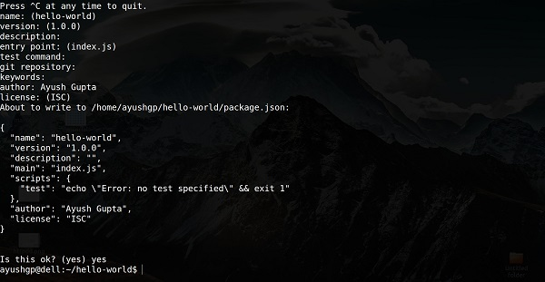
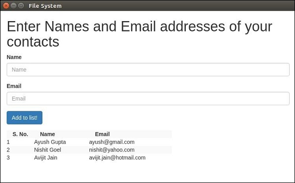
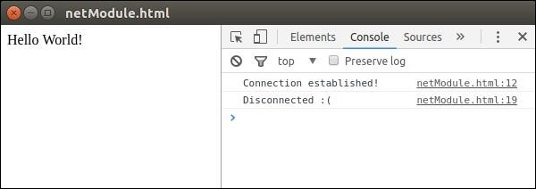
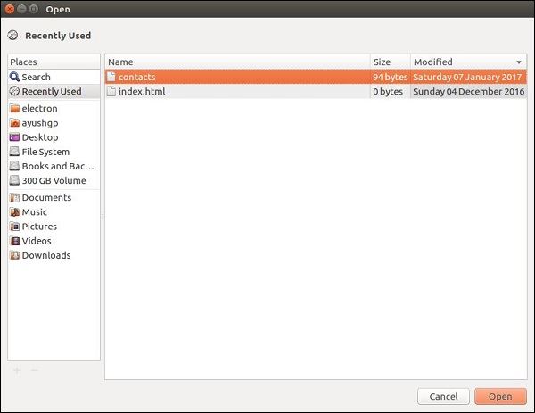
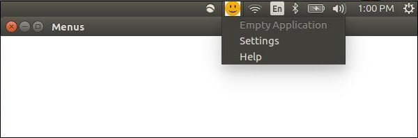
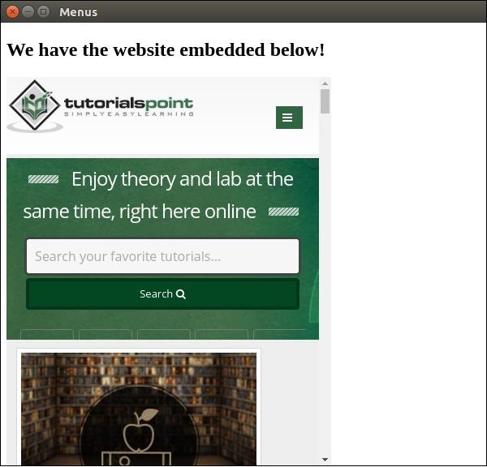
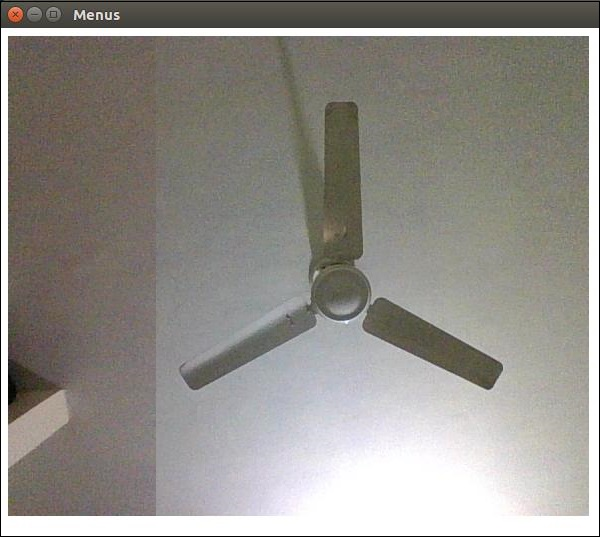
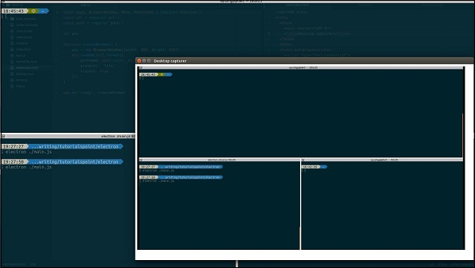
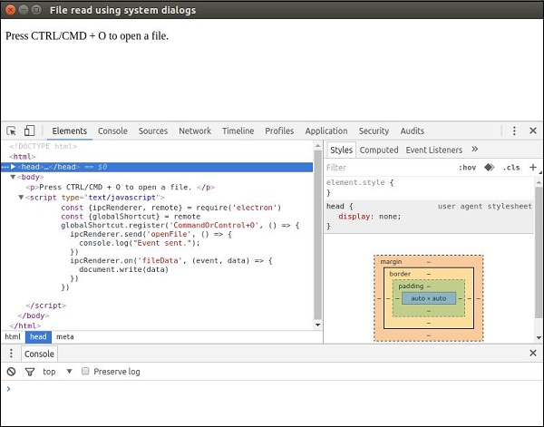
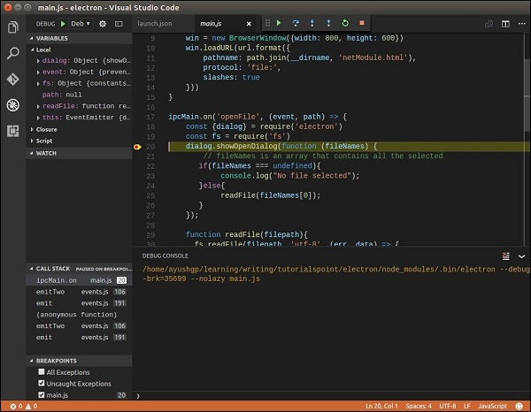

# Electron - Quick Guide

출처: https://www.tutorialspoint.com/electron/electron_quick_guide.htm


# Electron - Overview

## Why Electron?

Electron을 사용하면 풍부한 기본 (운영 체제) API로 런타임을 제공하여 순수 JavaScript로 데스크톱 애플리케이션을 만들 수 있습니다.

이것은 Electron이 그래픽 사용자 인터페이스 (GUI) 라이브러리에 대한 JavaScript 바인딩임을 의미하지 않습니다. 대신 Electron은 웹 페이지를 GUI로 사용하므로 JavaScript로 제어되는 최소 Chromium 브라우저로 볼 수도 있습니다. 따라서 모든 electron 앱은 기술적으로 OS API를 활용할 수있는 브라우저에서 실행되는 웹 페이지입니다.

## Who Uses Electron?

Github는 텍스트 편집기 Atom을 만들기 위해 Electron을 개발했습니다. 둘 다 2014 년에 오픈 소스였습니다. Electron은 Microsoft, Github, Slack 등과 같은 많은 회사에서 사용됩니다.

Electron은 여러 앱을 만드는 데 사용되었습니다. 다음은 몇 가지 주목할만한 앱입니다.

- Slack desktop
- Wordpress desktop app
- Visual Studio Code
- Caret Markdown Editor
- Nylas Email App
- GitKraken git client

# Electron - Installation

Electron을 사용하여 개발을 시작하려면 Node와 npm (node package manager)이 설치되어 있어야합니다. 아직 설치하지 않은 경우 [노드 설정](https://www.tutorialspoint.com/nodejs/nodejs_environment_setup.htm)으로 이동하여 로컬 시스템에 노드를 설치하십시오. 터미널에서 다음 명령을 실행하여 노드 및 npm이 설치되었는지 확인합니다.

```cmd
node --version
npm --version
```

위의 명령은 다음 출력을 생성합니다-

```cmd
v6.9.1
3.10.8
```

npm을 사용하여 프로젝트를 만들 때마다 프로젝트에 대한 모든 세부 정보가 포함 된 package.json 파일을 제공해야합니다. npm을 사용하면이 파일을 쉽게 설정할 수 있습니다. 개발 프로젝트를 설정하겠습니다.

- 터미널 / cmd를 실행하고 hello-world라는 새 폴더를 만들고 cd 명령을 사용하여 해당 폴더를 엽니 다.
- 이제 npm을 사용하여 package.json 파일을 생성하려면 다음 명령을 사용하십시오.

```cmd
npm init
```

- 다음 정보를 요청합니다.



Enter를 계속 누르고 "author name"필드에 이름을 입력하십시오.

새 폴더를 만들고 cd 명령을 사용하여 엽니 다. 이제 다음 명령을 실행하여 Electron을 전역으로 설치합니다.

```cmd
$ npm install -g electron-prebuilt
```

일단 실행되면 다음 명령을 실행하여 Electron이 올바르게 설치되었는지 확인할 수 있습니다.

```cmd
$ electron --version
```

다음과 같이 출력 되어야 합니다-

```cmd
v1.4.13
```

이제 Electron을 설정 했으므로 이를 사용하여 첫 번째 앱을 만들어 보겠습니다.

# How Electron Works

Electron은 package.json 파일에 정의 된 메인 파일을 가져와 실행합니다. 이 기본 파일은 렌더링 된 웹 페이지와 운영 체제의 기본 GUI (그래픽 사용자 인터페이스)와의 상호 작용을 포함하는 응용 프로그램 창을 만듭니다.

Electron을 사용하여 애플리케이션을 시작하면 기본 프로세스가 생성됩니다. 이 기본 프로세스는 운영 체제의 기본 GUI와 상호 작용합니다. 응용 프로그램의 GUI를 만듭니다.

메인 프로세스를 시작하는 것만으로는 애플리케이션 사용자에게 애플리케이션 창이 제공되지 않습니다. 이것은 BrowserWindow 모듈을 사용하여 주 파일의 주 프로세스에 의해 생성됩니다. 그런 다음 각 브라우저 창은 자체 렌더러 프로세스를 실행합니다. 렌더러 프로세스는 일반적인 CSS 파일, JavaScript 파일, 이미지 등을 참조하는 HTML 파일을 가져 와서 창에서 렌더링합니다.

메인 프로세스는 Electron에서 직접 사용할 수있는 모듈을 통해 네이티브 GUI에 액세스 할 수 있습니다. 데스크탑 애플리케이션은 파일 처리, HTTP 호출 요청 등을위한 파일 시스템 모듈과 같은 모든 노드 모듈에 액세스 할 수 있습니다.

## Difference between Main and Renderer processes

메인 프로세스는 BrowserWindow 인스턴스를 생성하여 웹 페이지를 생성합니다. 각 BrowserWindow 인스턴스는 자체 렌더러 프로세스에서 웹 페이지를 실행합니다. BrowserWindow 인스턴스가 파괴되면 해당 렌더러 프로세스도 종료됩니다.

기본 프로세스는 모든 웹 페이지와 해당 렌더러 프로세스를 관리합니다. 각 렌더러 프로세스는 격리되어 있으며 실행중인 웹 페이지에만 관심이 있습니다.

# Electron - Hello World

프로젝트 용 package.json 파일을 만들었습니다. 이제 Electron을 사용하여 첫 번째 데스크톱 앱을 만들 것입니다.

main.js라는 새 파일을 만듭니다. 그것에 다음 코드를 입력하십시오-

```javascript
const {app, BrowserWindow} = require('electron') 
const url = require('url') 
const path = require('path')  

let win  

function createWindow() { 
   win = new BrowserWindow({width: 800, height: 600}) 
   win.loadURL(url.format ({ 
      pathname: path.join(__dirname, 'index.html'), 
      protocol: 'file:', 
      slashes: true 
   })) 
}  

app.on('ready', createWindow) 
```

이번에는 index.html이라는 HTML 파일 인 다른 파일을 만듭니다. 다음 코드를 입력하십시오.

```html
<!DOCTYPE html>
<html>
   <head>
      <meta charset = "UTF-8">
      <title>Hello World!</title>
   </head>
   
   <body>
      <h1>Hello World!</h1>
      We are using node <script>document.write(process.versions.node)</script>,
      Chrome <script>document.write(process.versions.chrome)</script>,
      and Electron <script>document.write(process.versions.electron)</script>.
   </body>
</html>
```

다음 명령을 사용하여이 앱을 실행하십시오-

```
$ electron ./main.js
```

새 창이 열립니다. 다음과 같이 보일 것입니다-


## How Does This App Work?

메인 파일과 HTML 파일을 만들었습니다. 주 파일은 app과 BrowserWindow의 두 모듈을 사용합니다. 앱 모듈은 애플리케이션의 이벤트 수명주기를 제어하는 데 사용되며 BrowserWindow 모듈은 브라우저 창을 만들고 제어하는 데 사용됩니다.

새 BrowserWindow를 만들고이 BrowserWindow에 URL을 첨부하는 createWindow 함수를 정의했습니다. 앱을 실행할 때 렌더링되고 표시되는 HTML 파일입니다.

우리는 html 파일에서 기본 Electron 객체 프로세스를 사용했습니다. 이 객체는 Node.js 프로세스 객체에서 확장되었으며 더 많은 기능을 추가하면서 모든 t = its 기능을 포함합니다.

# Electron - Building UIs

Electron 앱의 사용자 인터페이스는 HTML, CSS 및 JS를 사용하여 구축됩니다. 따라서 여기에서도 프런트 엔드 웹 개발에 사용 가능한 모든 도구를 활용할 수 있습니다. Angular, Backbone, React, Bootstrap 및 Foundation과 같은 도구를 사용하여 앱을 빌드 할 수 있습니다.

Bower를 사용하여 이러한 프런트 엔드 종속성을 관리 할 수 있습니다. −를 사용하여 정자 설치

```cmd
$ npm install -g bower
```

이제 bower를 사용하여 사용 가능한 모든 JS 및 CSS 프레임 워크, 라이브러리, 플러그인 등을 얻을 수 있습니다. 예를 들어, 안정적인 최신 버전의 부트 스트랩을 얻으려면 다음 명령을 입력하십시오.

```cmd
$ bower install bootstrap
```

이것은 bower_components에 부트 스트랩을 다운로드합니다. 이제 HTML에서이 라이브러리를 참조 할 수 있습니다. 이 라이브러리를 사용하여 간단한 페이지를 만들어 보겠습니다.

이제 npm 명령을 사용하여 jquery를 설치하겠습니다.

```cmd
$ npm install --save jquery
```

또한 이것은 view.js 파일에 필요합니다. 우리는 이미 다음과 같이 main.js 설정을 가지고 있습니다.

```javascript
const {app, BrowserWindow} = require('electron')
const url = require('url')
const path = require('path')

let win

function createWindow() {
   win = new BrowserWindow({width: 800, height: 600})
   win.loadURL(url.format ({
      pathname: path.join(__dirname, 'index.html'),
      protocol: 'file:',
      slashes: true
   }))
}

app.on('ready', createWindow)
```

**index.html** 파일을 열고 다음 코드를 입력하십시오.

```
<!DOCTYPE html>
<html>
   <head>
      <meta charset = "UTF-8">
      <title>Hello World!</title>
      <link rel = "stylesheet" 
         href = "./bower_components/bootstrap/dist/css/bootstrap.min.css" />
   </head>
   
   <body>
      <div class = "container">
         <h1>This page is using Bootstrap and jQuery!</h1>
         <h3 id = "click-counter"></h3>
         <button class = "btn btn-success" id = "countbtn">Click here</button>
         <script src = "./view.js" ></script>
      </div>
   </body>
</html>
```

view.js를 생성하고 거기에 클릭 카운터 로직을 입력하십시오-

```
let $ = require('jquery')  // jQuery now loaded and assigned to $
let count = 0
$('#click-counter').text(count.toString())
$('#countbtn').on('click', () => {
   count ++ 
   $('#click-counter').text(count)
}) 
```

다음 명령을 사용하여 앱을 실행하십시오-

```
$ electron ./main.js
```

T위의 명령은 다음 스크린 샷과 같이 출력을 생성합니다.


웹 사이트를 구축하는 것처럼 네이티브 앱을 구축 할 수 있습니다. 사용자가 정확한 창 크기로 제한되는 것을 원하지 않는 경우 반응 형 디자인을 활용하여 사용자가 유연한 방식으로 앱을 사용할 수 있도록 할 수 있습니다.

# Electron - File Handling

파일 처리는 데스크톱 애플리케이션을 구축하는 데있어 매우 중요한 부분입니다. 거의 모든 데스크톱 앱이 파일과 상호 작용합니다.

앱에서 이름과 이메일 주소를 입력 할 양식을 만들 것입니다. 이 양식은 파일에 저장되고 출력으로 표시되는 목록이 생성됩니다.

**main.js** 파일에서 다음 코드를 사용하여 기본 프로세스를 설정하십시오.

```javascript
const {app, BrowserWindow} = require('electron')
const url = require('url')
const path = require('path')

let win

function createWindow() {
   win = new BrowserWindow({width: 800, height: 600})
   win.loadURL(url.format ({
      pathname: path.join(__dirname, 'index.html'),
      protocol: 'file:',
      slashes: true
   }))
}

app.on('ready', createWindow)
```

이제 **index.html** 파일을 열고 다음 코드를 입력하십시오.

```html
<!DOCTYPE html>
<html>
   <head>
      <meta charset = "UTF-8">
      <title>File System</title>
      <link rel = "stylesheet" 
         href = "./bower_components/bootstrap/dist/css/bootstrap.min.css" />
      
      <style type = "text/css">
         #contact-list {
            height: 150px;
            overflow-y: auto;
         }
      </style>
   </head>
   
   <body>
      <div class = "container">
         <h1>Enter Names and Email addresses of your contacts</h1>
         <div class = "form-group">
            <label for = "Name">Name</label>
            <input type = "text" name = "Name" value = "" id = "Name" 
               placeholder = "Name" class = "form-control" required>
         </div>
         
         <div class = "form-group">
            <label for = "Email">Email</label>
            <input type = "email" name = "Email" value = "" id = "Email" 
               placeholder = "Email" class = "form-control" required>
         </div>
         
         <div class = "form-group">
            <button class = "btn btn-primary" id = "add-to-list">Add to list!</button>
         </div>
         
         <div id = "contact-list">
            <table class = "table-striped" id = "contact-table">
               <tr>
                  <th class = "col-xs-2">S. No.</th>
                  <th class = "col-xs-4">Name</th>
                  <th class = "col-xs-6">Email</th>
               </tr>
            </table>
         </div>
         
         <script src = "./view.js" ></script>
      </div>
   </body>
</html>
```

이제 더하기 이벤트를 처리해야합니다. **view.js** 파일에서 이 작업을 수행합니다.

처음에 파일에서 연락처를로드하는 loadAndDisplayContacts () 함수를 만듭니다. loadAndDisplayContacts () 함수를 생성 한 후 목록에 추가 버튼에 클릭 핸들러를 생성합니다. 파일과 테이블 모두에 항목이 추가됩니다.

**view.js** 파일에 다음 코드를 입력하십시오.

```javascript
let $ = require('jquery')
let fs = require('fs')
let filename = 'contacts'
let sno = 0

$('#add-to-list').on('click', () => {
   let name = $('#Name').val()
   let email = $('#Email').val()

   fs.appendFile('contacts', name + ',' + email + '\n')

   addEntry(name, email)
})

function addEntry(name, email) {
   if(name && email) {
      sno++
      let updateString = '<tr><td>'+ sno + '</td><td>'+ name +'</td><td>' 
         + email +'</td></tr>'
      $('#contact-table').append(updateString)
   }
}

function loadAndDisplayContacts() {  
   
   //Check if file exists
   if(fs.existsSync(filename)) {
      let data = fs.readFileSync(filename, 'utf8').split('\n')
      
      data.forEach((contact, index) => {
         let [ name, email ] = contact.split(',')
         addEntry(name, email)
      })
   
   } else {
      console.log("File Doesn\'t Exist. Creating new file.")
      fs.writeFile(filename, '', (err) => {
         if(err)
            console.log(err)
      })
   }
}

loadAndDisplayContacts()
```

이제 다음 명령을 사용하여 응용 프로그램을 실행하십시오.

```
$ electron ./main.js
```

연락처를 추가하면 응용 프로그램은 다음과 같습니다.



더 많은 fs 모듈 API 호출은 [노드 파일 시스템 튜토리얼](https://www.tutorialspoint.com/nodejs/nodejs_file_system.htm)을 참조하십시오.

이제 Electron을 사용하여 파일을 처리 할 수 있습니다. 대화 상자 장에서 파일에 대한 저장 및 열기 대화 상자 (네이티브)를 호출하는 방법을 살펴 보겠습니다.

# Electron - Native Node Libraries

이전 장에서 노드 모듈 fs를 사용했습니다. 이제 Electron과 함께 사용할 수있는 다른 노드 모듈을 살펴 보겠습니다.

## OS module

OS 모듈을 사용하면 애플리케이션이 실행중인 시스템에 대한 많은 정보를 얻을 수 있습니다. 다음은 앱을 만드는 동안 도움이되는 몇 가지 방법입니다. 이러한 방법은 실행중인 OS에 따라 앱을 사용자 지정하는 데 도움이됩니다.

| Sr.No | Function & Description                                       |
| ----- | ------------------------------------------------------------ |
| 1     | **os.userInfo([options])**<br>os.userInfo () 메서드는 현재 유효한 사용자에 대한 정보를 반환합니다. 이 정보는 명시 적으로 정보를 요청하지 않고도 사용자를 위해 애플리케이션을 개인화하는 데 사용할 수 있습니다. |
| 2     | **os.platform()**<br/>Os.platform () 메서드는 운영 체제 플랫폼을 식별하는 문자열을 반환합니다. 사용자 OS에 따라 앱을 사용자 지정하는 데 사용할 수 있습니다. |
| 3     | **os.homedir()**<br/>os.homedir () 메서드는 현재 사용자의 홈 디렉토리를 문자열로 반환합니다. 일반적으로 모든 사용자의 구성은 사용자의 홈 디렉토리에 있습니다. 따라서 이것은 우리 앱에서 동일한 목적으로 사용될 수 있습니다. |
| 4     | **os.arch()**<br/>os.arch () 메서드는 운영 체제 CPU 아키텍처를 식별하는 문자열을 반환합니다. 이는 해당 시스템에 맞게 애플리케이션을 조정하기 위해 이국적인 아키텍처에서 실행할 때 사용할 수 있습니다. |
| 5     | **os.EOL**<br/>운영 체제 별 end-ofline 마커를 정의하는 문자열 상수입니다. 호스트 OS의 파일에서 줄을 끝낼 때마다 사용해야합니다. |

동일한 main.js 파일과 다음 HTML 파일을 사용하여 이러한 속성을 화면에 인쇄 할 수 있습니다.

```html
<html>
   <head>
      <title>OS Module</title>
   </head>
   
   <body>
      <script>
         let os = require('os')
         document.write('User Info: ' + JSON.stringify(os.userInfo()) + '<br>' + 
            'Platform: ' + os.platform() + '<br>' + 
            'User home directory: ' +  os.homedir() + '<br>' + 
            'OS Architecture: ' + os.arch() + '<br>')
      </script>
   </body>
</html>
```

이제 다음 명령을 사용하여 앱을 실행하십시오.

```cmd
$ electron ./main.js
```

위의 명령은 다음 출력을 생성합니다-

```cmd
User Info: {"uid":1000,"gid":1000,"username":"ayushgp","homedir":"/home/ayushgp",
   "shell":"/usr/bin/zsh"}
Platform: linux
User home directory: /home/ayushgp
OS Architecture: x64
```

## Net Module

net 모듈은 앱에서 네트워크 관련 작업에 사용됩니다. 이 모듈을 사용하여 서버와 소켓 연결을 모두 만들 수 있습니다. 일반적으로 네트워킹 관련 작업에 net 모듈을 사용하는 것보다 npm의 래퍼 모듈을 사용하는 것이 좋습니다.

다음 표는 모듈에서 가장 유용한 방법을 나열합니다.

| Sr.No | Function & Description                                       |
| ----- | ------------------------------------------------------------ |
| 1     | **net.createServer([options] [, connectionListener])**<br>새 TCP 서버를 만듭니다. connectionListener 인수는 'connection'이벤트에 대한 리스너로 자동 설정됩니다. |
| 2     | **net.createConnection(options[, connectionListener])**<br/>새로운 'net.Socket'을 반환하고 제공된 주소 및 포트에 연결하는 팩토리 메서드입니다. |
| 3     | **net.Server.listen(port[, host] [, backlog] [, callback])**<br/>지정된 포트 및 호스트에서 연결 수락을 시작합니다. 호스트가 생략되면 서버는 모든 IPv4 주소에 대한 연결을 허용합니다. |
| 4     | **net.Server.close([callback])**<br/>모든 연결이 종료되고 서버가 '닫기'이벤트를 생성하면 마지막으로 닫힙니다. |
| 5     | **net.Socket.connect(port[, host] [, connectListener])**<br/>주어진 소켓에 대한 연결을 엽니 다. 포트와 호스트가 주어지면 소켓은 TCP 소켓으로 열립니다. |

net 모듈에는 몇 가지 다른 방법도 함께 제공됩니다. 보다 포괄적 인 목록을 보려면 [여기](https://www.tutorialspoint.com/nodejs/nodejs_net_module.htm)를 참조하십시오.

이제 net 모듈을 사용하여 서버에 연결하는 전자 앱을 만들어 보겠습니다. 새 파일 인 **server.js**를 만들어야합니다.

```js
var net = require('net');
var server = net.createServer(function(connection) { 
   console.log('Client Connected');
   
   connection.on('end', function() {
      console.log('client disconnected');
   });
   
   connection.write('Hello World!\r\n');
   connection.pipe(connection);
});

server.listen(8080, function() { 
   console.log('Server running on http://localhost:8080');
});
```

동일한 main.js 파일을 사용하여 HTML 파일을 다음으로 바꿉니다.

```html
<html>
   <head>
      <title>net Module</title>
   </head>
   
   <body>
      <script>
         var net = require('net');
         var client = net.connect({port: 8080}, function() {
            console.log('Connection established!');  
         });
         
         client.on('data', function(data) {
            document.write(data.toString());
            client.end();
         });
         
         client.on('end', function() { 
            console.log('Disconnected :(');
         });
      </script>
   </body>
</html>
```

다음 명령을 사용하여 서버를 실행하십시오-

```
$ node server.js
```

다음 명령을 사용하여 응용 프로그램을 실행하십시오-

```
$ electron ./main.js
```

위의 명령은 다음 출력을 생성합니다-



서버에 자동으로 연결되고 자동으로 연결이 끊어지는 것을 관찰하십시오.

또한 Electron을 사용하여 프런트 엔드에서 직접 사용할 수있는 몇 가지 다른 노드 모듈이 있습니다. 이러한 모듈의 사용법은 사용하는 시나리오에 따라 다릅니다.

# Electron - Inter Process Communication

Electron은 **ipcMain** 및 **ipcRenderer**라는 2 개의 IPC (Inter Process Communication) 모듈을 제공합니다.

**ipcMain** 모듈은 기본 프로세스에서 렌더러 프로세스로 비동기 적으로 통신하는 데 사용됩니다. 메인 프로세스에서 사용되는 경우 모듈은 렌더러 프로세스 (웹 페이지)에서 보낸 비동기 및 동기 메시지를 처리합니다. 렌더러에서 보낸 메시지는이 모듈로 내보내집니다.

**ipcRenderer** 모듈은 렌더러 프로세스에서 기본 프로세스로 비동기 적으로 통신하는 데 사용됩니다. 렌더러 프로세스 (웹 페이지)에서 기본 프로세스로 동기 및 비동기 메시지를 보낼 수 있도록 몇 가지 메서드를 제공합니다. 메인 프로세스에서 답변을받을 수도 있습니다.

위의 모듈을 사용하여 서로 메시지를 보내는 메인 프로세스와 렌더러 프로세스를 생성합니다.

다음 내용으로 **main_process.js**라는 새 파일을 만듭니다.

```js
const {app, BrowserWindow} = require('electron')
const url = require('url')
const path = require('path')
const {ipcMain} = require('electron')

let win

function createWindow() {
   win = new BrowserWindow({width: 800, height: 600})
   win.loadURL(url.format ({
      pathname: path.join(__dirname, 'index.html'),
      protocol: 'file:',
      slashes: true
   }))
}

// Event handler for asynchronous incoming messages
ipcMain.on('asynchronous-message', (event, arg) => {
   console.log(arg)

   // Event emitter for sending asynchronous messages
   event.sender.send('asynchronous-reply', 'async pong')
})

// Event handler for synchronous incoming messages
ipcMain.on('synchronous-message', (event, arg) => {
   console.log(arg) 

   // Synchronous event emmision
   event.returnValue = 'sync pong'
})

app.on('ready', createWindow)
```

이제 새 **index.html** 파일을 만들고 그 안에 다음 코드를 추가합니다.

```js
<!DOCTYPE html>
<html>
   <head>
      <meta charset = "UTF-8">
      <title>Hello World!</title>
   </head>
   
   <body>
      <script>
         const {ipcRenderer} = require('electron')

         // Synchronous message emmiter and handler
         console.log(ipcRenderer.sendSync('synchronous-message', 'sync ping')) 

         // Async message handler
         ipcRenderer.on('asynchronous-reply', (event, arg) => {
            console.log(arg)
         })

         // Async message sender
         ipcRenderer.send('asynchronous-message', 'async ping')
      </script>
   </body>
</html>
```

다음 명령을 사용하여 앱을 실행하십시오-

```cmd
$ electron ./main_process.js
```

위의 명령은 다음 출력을 생성합니다-

```cmd
// On your app console
Sync Pong
Async Pong

// On your terminal where you ran the app
Sync Ping
Async Ping
```

렌더러 프로세스에서 무거운 / 차단 작업의 계산을 수행하지 않는 것이 좋습니다. 항상 IPC를 사용하여 이러한 작업을 기본 프로세스에 위임하십시오. 이는 애플리케이션의 속도를 유지하는 데 도움이됩니다.

# Electron - System Dialogs

모든 앱이 사용자 친화적 인 앱이되는 것은 매우 중요합니다. 결과적으로 alert () 호출을 사용하여 대화 상자를 작성해서는 안됩니다. Electron은 대화 상자를 만드는 작업을 수행 할 수있는 꽤 좋은 인터페이스를 제공합니다. 한 번 살펴 보겠습니다.

Electron은 파일 열기 및 저장, 경고 등을위한 기본 시스템 대화 상자를 표시하는 데 사용할 수있는 대화 상자 모듈을 제공합니다.

예제로 직접 이동하여 간단한 텍스트 파일을 표시하는 앱을 만들어 보겠습니다.

새 **main.js** 파일을 만들고 다음 코드를 입력하십시오.

```javascript
const {app, BrowserWindow} = require('electron') 
const url = require('url') 
const path = require('path') 
const {ipcMain} = require('electron')  

let win  

function createWindow() { 
   win = new BrowserWindow({width: 800, height: 600}) 
   win.loadURL(url.format ({ 
      pathname: path.join(__dirname, 'index.html'), 
      protocol: 'file:', 
      slashes: true 
   })) 
}  

ipcMain.on('openFile', (event, path) => { 
   const {dialog} = require('electron') 
   const fs = require('fs') 
   dialog.showOpenDialog(function (fileNames) { 
      
      // fileNames is an array that contains all the selected 
      if(fileNames === undefined) { 
         console.log("No file selected"); 
      
      } else { 
         readFile(fileNames[0]); 
      } 
   });
   
   function readFile(filepath) { 
      fs.readFile(filepath, 'utf-8', (err, data) => { 
         
         if(err){ 
            alert("An error ocurred reading the file :" + err.message) 
            return 
         } 
         
         // handle the file content 
         event.sender.send('fileData', data) 
      }) 
   } 
})  
app.on('ready', createWindow)
```

이 코드는 메인 프로세스가 렌더러 프로세스에서 'openFile'메시지를받을 때마다 열기 대화 상자를 엽니 다. 이 메시지는 파일 콘텐츠를 렌더러 프로세스로 다시 리디렉션합니다. 이제 내용을 인쇄해야합니다.

이제 다음 내용으로 새 **index.html** 파일을 만듭니다.

```html
<!DOCTYPE html> 
<html> 
   <head> 
      <meta charset = "UTF-8"> 
      <title>File read using system dialogs</title> 
   </head> 
   
   <body> 
      <script type = "text/javascript"> 
         const {ipcRenderer} = require('electron') 
         ipcRenderer.send('openFile', () => { 
            console.log("Event sent."); 
         }) 
         
         ipcRenderer.on('fileData', (event, data) => { 
            document.write(data) 
         }) 
      </script> 
   </body> 
</html>
```

이제 앱을 실행할 때마다 다음 스크린 샷과 같이 기본 열기 대화 상자가 나타납니다.



표시 할 파일을 선택하면 해당 내용이 앱 창에 표시됩니다.


이것은 Electron이 제공하는 네 가지 대화 중 하나 일뿐입니다. 그들은 모두 비슷한 사용법을 가지고 있습니다. showOpenDialog를 사용하여 수행하는 방법을 배우면 다른 대화 상자를 사용할 수 있습니다.

동일한 기능을 가진 대화 상자는-

- showSaveDialog([browserWindow, ]options[, callback])
- showMessageDialog([browserWindow, ]options[, callback])
- showErrorDialog(title, content)

# Electron - Menus

데스크톱 앱에는 애플리케이션 메뉴 (상단 표시 줄)와 컨텍스트 메뉴 (오른쪽 클릭 메뉴)의 두 가지 메뉴가 있습니다. 이 장에서는이 두 가지를 모두 만드는 방법을 배웁니다.

우리는 메뉴와 MenuItem 모듈이라는 두 개의 모듈을 사용할 것입니다. Menu 및 MenuItem 모듈은 기본 프로세스에서만 사용할 수 있습니다. 렌더러 프로세스에서 이러한 모듈을 사용하려면 원격 모듈이 필요합니다. 상황에 맞는 메뉴를 만들 때 이것을 보게 될 것입니다.

이제 메인 프로세스를위한 새로운 **main.js** 파일을 생성 해 보겠습니다.

```js
const {app, BrowserWindow, Menu, MenuItem} = require('electron')
const url = require('url')
const path = require('path')

let win

function createWindow() {
   win = new BrowserWindow({width: 800, height: 600})
   win.loadURL(url.format ({
      pathname: path.join(__dirname, 'index.html'),
      protocol: 'file:',
      slashes: true
   }))
}

const template = [
   {
      label: 'Edit',
      submenu: [
         {
            role: 'undo'
         },
         {
            role: 'redo'
         },
         {
            type: 'separator'
         },
         {
            role: 'cut'
         },
         {
            role: 'copy'
         },
         {
            role: 'paste'
         }
      ]
   },
   
   {
      label: 'View',
      submenu: [
         {
            role: 'reload'
         },
         {
            role: 'toggledevtools'
         },
         {
            type: 'separator'
         },
         {
            role: 'resetzoom'
         },
         {
            role: 'zoomin'
         },
         {
            role: 'zoomout'
         },
         {
            type: 'separator'
         },
         {
            role: 'togglefullscreen'
         }
      ]
   },
   
   {
      role: 'window',
      submenu: [
         {
            role: 'minimize'
         },
         {
            role: 'close'
         }
      ]
   },
   
   {
      role: 'help',
      submenu: [
         {
            label: 'Learn More'
         }
      ]
   }
]

const menu = Menu.buildFromTemplate(template)
Menu.setApplicationMenu(menu)
app.on('ready', createWindow)
```

여기서 템플릿으로 메뉴를 만들고 있습니다. 즉, 메뉴를 JSON으로 함수에 제공하고 나머지는 처리합니다. 이제이 메뉴를 응용 프로그램 메뉴로 설정해야합니다.

이제 index.html이라는 빈 HTML 파일을 만들고 다음을 사용하여이 응용 프로그램을 실행합니다.

```
$ electron ./main.js
```

응용 프로그램 메뉴의 정상적인 위치에 위 템플릿을 기반으로 한 메뉴가 표시됩니다.


우리는 메인 프로세스에서이 메뉴를 만들었습니다. 이제 앱의 상황에 맞는 메뉴를 만들어 보겠습니다. HTML 파일에서이 작업을 수행합니다.

```html
<!DOCTYPE html>
<html>
   <head>
      <meta charset = "UTF-8">
      <title>Menus</title>
   </head>
   
   <body>
      <script type = "text/javascript">
         const {remote} = require('electron')
         const {Menu, MenuItem} = remote

         const menu = new Menu()

         // Build menu one item at a time, unlike
         menu.append(new MenuItem ({
            label: 'MenuItem1',
            click() { 
               console.log('item 1 clicked')
            }
         }))
         
         menu.append(new MenuItem({type: 'separator'}))
         menu.append(new MenuItem({label: 'MenuItem2', type: 'checkbox', checked: true}))
         menu.append(new MenuItem ({
            label: 'MenuItem3',
            click() {
               console.log('item 3 clicked')
            }
         }))

         // Prevent default action of right click in chromium. Replace with our menu.
         window.addEventListener('contextmenu', (e) => {
            e.preventDefault()
            menu.popup(remote.getCurrentWindow())
         }, false)
      </script>
   </body>
</html>
```

원격 모듈을 사용하여 Menu 및 MenuItem 모듈을 가져 왔습니다. 그런 다음 메뉴를 만들고 메뉴 항목을 하나씩 추가했습니다. 또한 크롬에서 마우스 오른쪽 버튼을 클릭하는 기본 동작을 방지하고 메뉴로 대체했습니다.


Electron에서 메뉴를 만드는 것은 매우 간단한 작업입니다. 이제 이러한 항목에 이벤트 처리기를 연결하고 필요에 따라 이벤트를 처리 할 수 있습니다.

# Electron - System Tray

시스템 트레이는 응용 프로그램 창 밖의 메뉴입니다. MacOS 및 Ubuntu에서는 화면 오른쪽 상단에 있습니다. Windows에서는 오른쪽 하단에 있습니다. Electron을 사용하여 시스템 트레이에 애플리케이션 메뉴를 만들 수 있습니다.

새 **main.js** 파일을 만들고 다음 코드를 추가합니다. 시스템 트레이 아이콘에 사용할 수있는 png 파일을 준비하십시오.

```javascript
const {app, BrowserWindow} = require('electron')
const url = require('url')
const path = require('path')

let win

function createWindow() {
   win = new BrowserWindow({width: 800, height: 600})
   win.loadURL(url.format ({
      pathname: path.join(__dirname, 'index.html'),
      protocol: 'file:',
      slashes: true
   }))
}

app.on('ready', createWindow)
```

기본 브라우저 창을 설정 한 후 다음 내용으로 새 index.html 파일을 생성합니다.

```html
<!DOCTYPE html>
<html>
   <head>
      <meta charset = "UTF-8">
      <title>Menus</title>
   </head>
   <body>
      <script type = "text/javascript">
         const {remote} = require('electron')
         const {Tray, Menu} = remote
         const path = require('path')

         let trayIcon = new Tray(path.join('','/home/ayushgp/Desktop/images.png'))

         const trayMenuTemplate = [
            {
               label: 'Empty Application',
               enabled: false
            },
            
            {
               label: 'Settings',
               click: function () {
                  console.log("Clicked on settings")
               }
            },
            
            {
               label: 'Help',
               click: function () {
                  console.log("Clicked on Help")
               }
            }
         ]
         
         let trayMenu = Menu.buildFromTemplate(trayMenuTemplate)
         trayIcon.setContextMenu(trayMenu)
      </script>
   </body>
</html>
```

트레이 하위 모듈을 사용하여 트레이를 만들었습니다. 그런 다음 템플릿을 사용하여 메뉴를 만들고 메뉴를 트레이 개체에 추가했습니다.

다음 명령을 사용하여 응용 프로그램을 실행하십시오-

```cmd
$ electron ./main.js
```

위의 명령을 실행할 때 시스템 트레이에서 사용한 아이콘을 확인하십시오. 나는 내 응용 프로그램에 웃는 얼굴을 사용했습니다. 위의 명령은 다음 출력을 생성합니다-



# Electron - Notifications

Electron은 MacOS 전용 기본 알림 API를 제공합니다. 그래서 우리는 그것을 사용하지 않고 대신 node-notifier라는 npm 모듈을 사용할 것입니다. 이를 통해 Windows, MacOS 및 Linux 사용자에게 알릴 수 있습니다.

해당 폴더에서 다음 명령을 사용하여 앱 폴더에 노드 알림 모듈을 설치하십시오.

```cmd
$ npm install --save node-notifier
```

이제이 버튼을 클릭 할 때마다 알림을 생성하는 버튼이있는 앱을 만들어 보겠습니다.

새 **main.js** 파일을 만들고 다음 코드를 입력하십시오.

```javascript
const {app, BrowserWindow} = require('electron')
const url = require('url')
const path = require('path')

let win

function createWindow() {
   win = new BrowserWindow({width: 800, height: 600})
   win.loadURL(url.format ({
      pathname: path.join(__dirname, 'index.html'),
      protocol: 'file:',
      slashes: true
   }))
}

app.on('ready', createWindow)
```

이제 알림을 트리거 할 웹 페이지와 스크립트를 만들어 보겠습니다. 다음 코드로 새 index.html 파일을 만듭니다.

```html
<!DOCTYPE html>
<html>
   <head>
      <meta charset = "UTF-8">
      <title>Menus</title>
   </head>
   
   <body>
      <button type = "button" id = "notify" name = "button">
         Click here to trigger a notification!</button>
      <script type = "text/javascript">
         const notifier = require('node-notifier')
         const path = require('path');
         
         document.getElementById('notify').onclick = (event) => {
            notifier.notify ({
               title: 'My awesome title',
               message: 'Hello from electron, Mr. User!',
               icon: path.join('','/home/ayushgp/Desktop/images.png'),  // Absolute path 
                  (doesn't work on balloons)
               sound: true,  // Only Notification Center or Windows Toasters
               wait: true    // Wait with callback, until user action is taken 
               against notification
            
            }, function (err, response) {
               // Response is response from notification
            });

            notifier.on('click', function (notifierObject, options) {
               console.log("You clicked on the notification")
            });

            notifier.on('timeout', function (notifierObject, options) {
               console.log("Notification timed out!")
            });
         }
      </script>
   </body>
</html>
```

notify 메소드를 사용하면 알림을 사용자 정의하는 데 도움이되는 제목, 메시지, 썸네일 등과 같은 정보가 포함 된 객체를 전달할 수 있습니다. 알림에 이벤트 리스너를 설정할 수도 있습니다.

이제 다음 명령을 사용하여 앱을 실행하십시오.

```cmd
$ electron ./main.js
```

우리가 만든 버튼을 클릭하면 다음 스크린 샷과 같이 운영 체제의 기본 알림이 표시됩니다.


또한 사용자가 알림을 클릭하거나 알림 시간이 초과되는 이벤트를 처리했습니다. 이러한 메서드는 앱이 백그라운드에서 실행되는 경우 앱을보다 대화 형으로 만드는 데 도움이됩니다.

# Electron - Webview

webview 태그는 Electron 앱에 웹 페이지와 같은 '게스트'콘텐츠를 삽입하는 데 사용됩니다. 이 콘텐츠는 webview 컨테이너에 포함되어 있습니다. 앱에 포함 된 페이지는이 콘텐츠가 표시되는 방식을 제어합니다.

웹뷰는 앱과는 별도의 프로세스에서 실행됩니다. 악성 콘텐츠로부터 보안을 유지하기 위해 웹보기는 웹 페이지와 동일한 권한을 가지고 있지 않습니다. 이렇게하면 삽입 된 콘텐츠로부터 앱을 안전하게 보호 할 수 있습니다. 앱과 삽입 된 페이지 간의 모든 상호 작용은 비동기식입니다.

Electron 앱에 외부 웹 페이지가 삽입되는 것을 이해하는 예를 고려해 보겠습니다. 오른쪽에있는 앱에 tutorialspoint 웹 사이트를 삽입합니다. 다음 내용으로 새 **main.js** 파일을 만듭니다.

```cmd
const {app, BrowserWindow} = require('electron')
const url = require('url')
const path = require('path')

let win

function createWindow() {
   win = new BrowserWindow({width: 800, height: 600})
   win.loadURL(url.format ({
      pathname: path.join(__dirname, 'index.html'),
      protocol: 'file:',
      slashes: true
   }))
}

app.on('ready', createWindow)
```

이제 주요 프로세스를 설정 했으므로 tutorialspoint 웹 사이트를 포함 할 HTML 파일을 만들어 보겠습니다. 다음 내용으로 index.html이라는 파일을 만듭니다.

```html
<!DOCTYPE html>
<html>
   <head>
      <meta charset = "UTF-8">
      <title>Menus</title>
   </head>
   
   <body>
      <div>
         <div>
            <h2>We have the website embedded below!</h2>
         </div>
         <webview id = "foo" src = "https://www.tutorialspoint.com/" style = 
            "width:400px; height:480px;">
            <div class = "indicator"></div>
         </webview>
      </div>
      
      <script type = "text/javascript">
         // Event handlers for loading events.
         // Use these to handle loading screens, transitions, etc
         onload = () => {
            const webview = document.getElementById('foo')
            const indicator = document.querySelector('.indicator')

            const loadstart = () => {
               indicator.innerText = 'loading...'
            }

            const loadstop = () => {
               indicator.innerText = ''
            }

            webview.addEventListener('did-start-loading', loadstart)
            webview.addEventListener('did-stop-loading', loadstop)
         }
      </script>
   </body>
</html>
```

다음 명령을 사용하여 앱을 실행하십시오-

```
$ electron ./main.js
```

위의 명령은 다음 출력을 생성합니다-



webview 태그는 다른 리소스에도 사용할 수 있습니다. webview 요소에는 공식 문서에 나열된 이벤트 목록이 있습니다. 이러한 이벤트를 사용하여 웹보기에서 발생하는 사항에 따라 기능을 개선 할 수 있습니다.

인터넷에서 스크립트 또는 기타 리소스를 포함 할 때마다 webview를 사용하는 것이 좋습니다. 이것은 큰 보안 이점과 함께 제공되며 정상적인 동작을 방해하지 않으므로 권장됩니다.

# Electron - Audio and Video Capturing

오디오 및 비디오 캡처는 화면 공유, 음성 메모 등을위한 앱을 구축하는 경우 중요한 특성입니다. 프로필 사진을 캡처하기 위해 응용 프로그램이 필요한 경우에도 유용합니다.

Electron으로 오디오 및 비디오 스트림을 캡처하기 위해 getUserMedia HTML5 API를 사용할 것입니다. 먼저 **main.js** 파일에 다음과 같이 메인 프로세스를 설정하겠습니다.

```javascript
const {app, BrowserWindow} = require('electron')
const url = require('url')
const path = require('path')

let win

// Set the path where recordings will be saved
app.setPath("userData", __dirname + "/saved_recordings")

function createWindow() {
   win = new BrowserWindow({width: 800, height: 600})
   win.loadURL(url.format({
      pathname: path.join(__dirname, 'index.html'),
      protocol: 'file:',
      slashes: true
   }))
}

app.on('ready', createWindow)
```

이제 기본 프로세스를 설정 했으므로이 콘텐츠를 캡처 할 HTML 파일을 만들어 보겠습니다. 다음 내용으로 **index.html**이라는 파일을 만듭니다.

```html
<!DOCTYPE html>
<html>
   <head>
      <meta charset = "UTF-8">
      <title>Audio and Video</title>
   </head>
   
   <body>
      <video autoplay></video>
      <script type = "text/javascript">
         function errorCallback(e) {
            console.log('Error', e)
         }

         navigator.getUserMedia({video: true, audio: true}, (localMediaStream) => {
            var video = document.querySelector('video')
            video.src = window.URL.createObjectURL(localMediaStream)
            video.onloadedmetadata = (e) => {
               // Ready to go. Do some stuff.
            };
         }, errorCallback)
      </script>
   </body>
</html>
```

위의 프로그램은 다음 출력을 생성합니다-



이제 웹캠과 마이크 모두에서 스트림을 얻었습니다. 이 스트림을 네트워크를 통해 보내거나 원하는 형식으로 저장할 수 있습니다.

웹캠에서 이미지를 가져와 저장하기 위해 이미지를 캡처하려면 [MDN 설명서](https://developer.mozilla.org/en-US/docs/Web/API/WebRTC_API/Taking_still_photos#Capturing_a_frame_from_the_stream)를 참조하십시오. 이는 HTML5 getUserMedia API를 사용하여 수행되었습니다. Electron과 함께 제공되는 desktopCapturer 모듈을 사용하여 사용자 데스크톱을 캡처 할 수도 있습니다. 이제 화면 스트림을 가져 오는 방법의 예를 살펴 보겠습니다.

위와 동일한 main.js 파일을 사용하고 다음 내용을 갖도록 **index.htm**l 파일을 편집하십시오.

```html
desktopCapturer.getSources({types: ['window', 'screen']}, (error, sources) => {
   if (error) throw error
   for (let i = 0; i < sources.length; ++i) {
      if (sources[i].name === 'Your Window Name here!') {
         navigator.webkitGetUserMedia({
            audio: false,
            video: {
               mandatory: {
                  chromeMediaSource: 'desktop',
                  chromeMediaSourceId: sources[i].id,
                  minWidth: 1280,
                  maxWidth: 1280,
                  minHeight: 720,
                  maxHeight: 720
               }
            }
         }, handleStream, handleError)
         return
      }
   }
})

function handleStream (stream) {
   document.querySelector('video').src = URL.createObjectURL(stream)
}

function handleError (e) {
   console.log(e)
}
```

열려있는 각 창에 대한 정보를 얻기 위해 desktopCapturer 모듈을 사용했습니다. 이제 위의 if 문에 전달하는 이름에 따라 특정 애플리케이션 또는 전체 화면의 이벤트를 캡처 할 수 있습니다. 그러면 해당 화면에서 일어나는 일만 앱으로 스트리밍됩니다.



이 [StackOverflow 질문](https://stackoverflow.com/questions/36753288/saving-desktopcapturer-to-video-file-in-electron)을 참조하여 사용법을 자세히 이해할 수 있습니다.

# Electron - Defining Shortcuts

우리는 일반적으로 PC에서 매일 사용하는 모든 앱에 대한 특정 바로 가기를 기억했습니다. 응용 프로그램이 직관적이고 사용자가 쉽게 액세스 할 수 있도록하려면 사용자가 바로 가기를 사용할 수 있도록 허용해야합니다.

globalShortcut 모듈을 사용하여 앱에서 바로 가기를 정의합니다. 액셀러레이터는 + 문자로 결합 된 여러 수정 자와 키 코드를 포함 할 수있는 문자열입니다. 이러한 가속기는 응용 프로그램 전체에서 키보드 단축키를 정의하는 데 사용됩니다.

예를 들어서 바로 가기를 만들어 보겠습니다. 이를 위해 파일을 열기 위해 열린 대화 상자를 사용한 대화 상자 예제를 따릅니다. **CommandOrControl + O** 바로 가기를 등록하여 대화 상자를 표시합니다.

**main.js** 코드는 이전과 동일하게 유지됩니다. 따라서 새 **main.js** 파일을 만들고 다음 코드를 입력하십시오.

```js
const {app, BrowserWindow} = require('electron')
const url = require('url')
const path = require('path')
const {ipcMain} = require('electron')

let win

function createWindow() {
   win = new BrowserWindow({width: 800, height: 600})
   win.loadURL(url.format ({
      pathname: path.join(__dirname, 'index.html'),
      protocol: 'file:',
      slashes: true
   }))
}

ipcMain.on('openFile', (event, path) => {
   const {dialog} = require('electron')
   const fs = require('fs')
   dialog.showOpenDialog(function (fileNames) {
         
      // fileNames is an array that contains all the selected
      if(fileNames === undefined)
         console.log("No file selected")
      else
         readFile(fileNames[0])
   })

   function readFile(filepath){
      fs.readFile(filepath, 'utf-8', (err, data) => {
         if(err){
            alert("An error ocurred reading the file :" + err.message)
            return
         }
         
         // handle the file content
         event.sender.send('fileData', data)
      })
   }
})

app.on('ready', createWindow)
```

이 코드는 메인 프로세스가 렌더러 프로세스에서 'openFile'메시지를받을 때마다 열기 대화 상자를 엽니 다. 이전에는 앱이 실행될 때마다이 대화 상자가 표시되었습니다. 이제 **CommandOrControl + O**를 누를 때만 열리도록 제한하겠습니다.

이제 다음 내용으로 새 **index.html** 파일을 만듭니다.

```html
<!DOCTYPE html>
<html>
   <head>
      <meta charset = "UTF-8">
      <title>File read using system dialogs</title>
   </head>
   
   <body>
      <p>Press CTRL/CMD + O to open a file. </p>
      <script type = "text/javascript">
         const {ipcRenderer, remote} = require('electron')
         const {globalShortcut} = remote
         globalShortcut.register('CommandOrControl+O', () => {
            ipcRenderer.send('openFile', () => {
               console.log("Event sent.");
            })
            
            ipcRenderer.on('fileData', (event, data) => {
               document.write(data)
            })
         })
      </script>
   </body>
</html>
```

새 바로 가기를 등록하고이 바로 가기를 누를 때마다 실행되는 콜백을 전달했습니다. 바로 가기가 필요하지 않을 때 등록을 취소 할 수 있습니다.

이제 앱이 열리면 방금 정의한 바로 가기를 사용하여 파일을 열라는 메시지가 표시됩니다.


이러한 바로 가기는 사용자가 정의 된 작업에 대해 자신의 바로 가기를 선택할 수 있도록하여 사용자 정의 할 수 있습니다.

# Electron - Environment Variables

환경 변수는 코드 변경없이 애플리케이션 구성 및 동작을 제어합니다. 특정 Electron 동작은 명령 줄 플래그 및 앱 코드보다 먼저 초기화되기 때문에 환경 변수에 의해 제어됩니다.

전자에 인코딩 된 환경 변수에는 **Production variables** 와 **Development variables**의 두 가지 종류가 있습니다.

## Production Variables

다음 환경 변수는 패키지 된 Electron 애플리케이션에서 런타임에 사용하기위한 것입니다.

| Sr.No | Variable & Description                                       |
| ----- | ------------------------------------------------------------ |
| 1     | **GOOGLE_API_KEY**<br>Electron에는 Google의 지오 코딩 웹 서비스에 요청하기위한 하드 코딩 된 API 키가 포함되어 있습니다. 이 API 키는 Electron의 모든 버전에 포함되어 있기 때문에 종종 사용 할당량을 초과합니다.<br>이 문제를 해결하기 위해 환경에 고유 한 Google API 키를 제공 할 수 있습니다. 지오 코딩 요청을 할 브라우저 창을 열기 전에 다음 코드를 기본 프로세스 파일에 배치하십시오.<br>`process.env.GOOGLE_API_KEY = 'YOUR_KEY_HERE' ` |
| 2     | **ELECTRON_RUN_AS_NODE**<br/>일반 Node.js 프로세스로 프로세스를 시작합니다. |
| 3     | **ELECTRON_FORCE_WINDOW_MENU_BAR (Linux Only)**<br/>Linux에서 전역 메뉴 표시 줄을 사용하지 마십시오. |

## Development Variables

The following environment variables are intended primarily for development and debugging purposes.

| Sr.No | Variable & Description                                       |
| ----- | ------------------------------------------------------------ |
| 1     | **ELECTRON_ENABLE_LOGGING**<br>Chrome의 내부 로깅을 콘솔에 인쇄합니다. |
| 2     | **ELECTRON_ENABLE_STACK_DUMPING**<br/>Electron이 충돌 할 때 스택 추적을 콘솔에 인쇄합니다. |
| 3     | **ELECTRON_DEFAULT_ERROR_MODE**<br/>Electron이 충돌 할 때 Windows의 충돌 대화 상자를 표시합니다. |

이러한 환경 변수를 true로 설정하려면 콘솔에서 설정하십시오. 예를 들어, 로깅을 활성화하려면 다음 명령을 사용하십시오.

### For Windows

```cmd
> set ELECTRON_ENABLE_LOGGING=true
```

### For Linux

```bash
$ export ELECTRON_ENABLE_LOGGING=true
```

컴퓨터를 다시 시작할 때마다 이러한 환경 변수를 설정해야합니다. 그렇게하지 않으려면 **.bashrc** 파일에 다음 행을 추가하십시오.

# Electron - Debugging

애플리케이션을 실행하는 두 가지 프로세스가 있습니다. 메인 프로세스와 렌더러 프로세스입니다.

렌더러 프로세스는 브라우저 창에서 실행되는 프로세스이므로 Chrome Devtools를 사용하여 디버그 할 수 있습니다. DevTools를 열려면 단축키 "Ctrl+Shift+I"또는 F12 키를 사용하세요. [여기](https://developers.google.com/web/tools/chrome-devtools/)에서 devtools 사용 방법을 확인할 수 있습니다.

DevTools를 열면 다음 스크린 샷과 같이 앱이 표시됩니다.



## Debugging the Main Process

Electron 브라우저 창의 DevTools는 해당 창 (예 : 웹 페이지)에서 실행되는 JavaScript 만 디버깅 할 수 있습니다. 메인 프로세스에서 실행되는 JavaScript를 디버깅하려면 외부 디버거를 사용하고 --debug 또는 --debug-brk 스위치로 Electron을 시작해야합니다.

Electron은 지정된 포트에서 V8 디버거 프로토콜 메시지를 수신합니다. 외부 디버거는이 포트에 연결해야합니다. 기본 포트는 5858입니다.

다음을 사용하여 앱을 실행하십시오-

```cmd
$ electron --debug = 5858 ./main.js
```

이제 V8 디버거 프로토콜을 지원하는 디버거가 필요합니다. 이를 위해 VSCode 또는 노드 검사기를 사용할 수 있습니다. 예를 들어 다음 단계에 따라이 목적을 위해 VSCode를 설정해 보겠습니다. 설정하려면 다음 단계를 따르세요.

[VSCode](https://code.visualstudio.com/)를 다운로드하여 설치합니다. VSCode에서 Electron 프로젝트를 엽니 다.

다음 구성으로 .vscode / launch.json 파일을 추가하십시오-

```json
{
   "version": "1.0.0",
   "configurations": [
      {
         "name": "Debug Main Process",
         "type": "node",
         "request": "launch",
         "cwd": "${workspaceRoot}",
         "runtimeExecutable": "${workspaceRoot}/node_modules/.bin/electron",
         "program": "${workspaceRoot}/main.js"
      }
   ]
}
```

**Note** − Windows의 경우 **"${workspaceRoot}/node_modules/.bin/electron.cmd"** for **runtimeExecutable**.

**main.js**에서 몇 가지 중단 점을 설정하고 디버그보기에서 디버깅을 시작합니다. 중단 점에 도달하면 화면이 다음과 같이 보입니다.



VSCode 디버거는 매우 강력하며 오류를 빠르게 수정하는 데 도움이됩니다. 전자 앱 디버깅을위한 노드 검사기와 같은 다른 옵션도 있습니다.

# Electron - Packaging Apps

앱 패키징 및 배포는 데스크톱 애플리케이션 개발 프로세스의 필수적인 부분입니다. Electron은 크로스 플랫폼 데스크톱 애플리케이션 개발 프레임 워크이므로 모든 플랫폼을위한 앱 패키징 및 배포도 원활한 경험이어야합니다.

전자 커뮤니티는 우리를 위해 동일한 일을 처리하는  [electron-packager](https://github.com/electron-userland/electron-packager) 프로젝트를 만들었습니다. 이를 통해 JS 또는 CLI를 통해 Electron 앱을 OS 별 번들 (.app, .exe 등)로 패키징하고 배포 할 수 있습니다.

## Supported Platforms

Electron Packager는 다음 호스트 플랫폼에서 실행됩니다.

- Windows (32/64 bit)
- OS X
- Linux (x86/x86_64)

다음 대상 플랫폼에 대한 실행 파일 / 번들을 생성합니다.

- Windows (also known as win32, for both 32/64 bit)
- OS X (also known as darwin) / Mac App Store (also known as mas)
- Linux (for x86, x86_64, and armv7l architectures)

## Installation

다음을 사용하여 electron packager 를 설치하십시오. −

```cmd
# for use in npm scripts
$ npm install electron-packager --save-dev

# for use from cli
$ npm install electron-packager -g
```

## Packaging Apps

이 섹션에서는 명령 줄에서 패키저를 실행하는 방법을 살펴 봅니다. 명령의 기본 형식은 다음과 같습니다. −

```cmd
electron-packager <sourcedir> <appname> --platform=<platform> --arch=<arch> [optional flags...]
```

이것은 −

- Electron의 올바른 릴리스를 찾거나 다운로드하십시오.
- 해당 버전의 Electron을 사용하여 <output-folder>/<appname>-<platform>-<arch>에 앱을 만듭니다.

**--platform** 및 **--arch**는 두 가지 경우에 생략 할 수 있습니다. 대신 **--all**을 지정하면 대상 플랫폼 / 아키텍처의 모든 유효한 조합에 대한 번들이 생성됩니다. 그렇지 않으면 호스트 플랫폼 / 아키텍처에 대한 단일 번들이 생성됩니다.

# Electron - Resources

Electron에 대해 자세히 알아보기 위해 다음 리소스를 사용했습니다. 이 튜토리얼을 만드는 동안 이것들을 참조했습니다.

가장 중요한 리소스는 [Electron 문서](https://electron.atom.io/docs)입니다. 문서에는 프레임 워크의 거의 모든 기능과 단점에 대한 광범위한 범위가 있습니다. 그들은 혼자서 앱을 구축 할 수 있습니다.

또한 [electron-sample-apps](https://github.com/hokein/electron-sample-apps) 저장소에 제시된 매우 좋은 Electron 예제가 있습니다.

## Video Resources

[Desktop apps with web languages](https://www.youtube.com/watch?v=FNHBfN8c32U)

[Rapid cross platform desktop app development using JavaScript and Electron](https://www.youtube.com/watch?v=bo7eL1HpJXM)

## Blog Posts

[Building a desktop application with Electron](https://medium.com/developers-writing/building-a-desktop-application-with-electron-204203eeb658)

[Build a Music Player with React & Electron](https://scotch.io/tutorials/build-a-music-player-with-react-electron-i-setup-basic-concepts)

[Creating Your First Desktop App With HTML, JS and Electron](https://tutorialzine.com/2015/12/creating-your-first-desktop-app-with-html-js-and-electron/)

[Create Cross-Platform Desktop Node Apps with Electron](https://www.sitepoint.com/desktop-node-apps-with-electron/)


### 끝