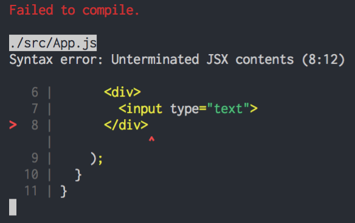
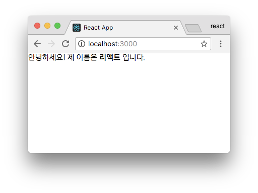

# [누구든지 하는 리액트](https://velopert.com/3613)

출처: https://velopert.com/3613

이 튜토리얼은 리액트를 1도 모르는 사람들을 위해 작성되었습니다. 만약에 여러분이 리액트를 배우고 싶은데, 아직 뭐가 뭔지 잘 모르겠다! 그렇다면 이 튜토리얼을 진행하고 나면 리액트가 무엇인지, 왜 사용하는지, 그리고 어떻게 사용하는지를 알아 갈 수 있을것입니다.

### 1편 [리액트는 무엇인가](https://velopert.com/3612)

프론트엔드 라이브러리는 뭐고, 리액트는 뭔지, 어쩌다가 만들어졌고 왜 사용해야 하는지에 대해서 다뤄봅니다.

### 2편 [리액트 프로젝트 시작하기](https://velopert.com/3621)

리액트 프로젝트를 진행하는데 필요한 작업환경을 여러분들의 컴퓨터에 설치합니다.

### 3편 [JSX](https://velopert.com/3626)

리액트에서 컴포넌트를 작성할 때 사용하는 JSX 라는 문법에 대해서 알아봅니다.

### 4편 [props 와 state](https://velopert.com/3629)

리액트에서 데이터를 다룰 때, 부모가 전달해주고, 고정적인 props, 그리고 컴포넌트 자신이 갖고있고 유동적인 state 에 대해서 알아봅니다.

### 5편 [LifeCycle API](https://velopert.com/3631)

리액트 컴포넌트가 페이지에 나타나고, 업데이트되고, 사라지는 과정에서 호출되는 라이프사이클 API 에 대하여 알아봅니다.

### 6편 [input 상태 관리하기](https://velopert.com/3634)

리액트에서 폼상태를 다루는 방법에 대해서 다뤄봅니다.

### 7편 [배열 다루기 (1) 생성과 렌더링](https://velopert.com/3636)

배열에 새로운 데이터를 집어넣고, 그 배열을 렌더링하는 방법에 대해서 알아봅니다.

### 8편 [배열 다루기 (2) 제거와 수정](https://velopert.com/3638)

배열에 추가한데이터를 제거하고 수정하는 방법에 대해서 알아봅니다.

### 9편 [불변성을 지키는 이유와 업데이트 최적화](https://velopert.com/3640)

상태를 업데이트 할 때 왜 불변성을 지켜야 하는지, 그리고 또 컴포넌트 업데이트를 어떻게 최적화하는지에 대해서 알아봅니다.

### 10편 [앞으로의 공부방향](https://velopert.com/3642)

튜토리얼을 마치며, 앞으로 무엇을 더 공부해야 하는지에 대해서 알아봅니다.


## [누구든지 하는 리액트 1편: 리액트는 무엇인가](https://velopert.com/3612)

> ### 프론트엔드 라이브러리 / 프레임워크

리액트는 정말 인기있는 프론트엔드 라이브러리입니다. 그런데 일단, 리액트에 대해서 알아보기전에, 이 프론트엔드 라이브러리란게 정확히 뭔지, 그리고 왜 필요한건지에 대해서 알아봅시다.

일단, 여러분이 웹사이트를 만들기 위해선, 사실 프론트엔드 라이브러리의 도움 없이도 만들어낼 수 있습니다. 그리고 단순히 정적 페이지를 만드는거라면 자바스크립트 없이도, 그냥 HTML 과 CSS 를 사용해서 만들면 되죠.

거기에 자바스크립트를 더해주면, 유저의 행동흐름에 따라서 동적으로 화면을 보여줄 수 있게 되겠죠.

그런데 요즘의 웹은요, 단순히 웹 **페이지** 가 아니라, 웹 **애플리케이션**이에요. 브라우저 상으로도 정말 자연스러운 흐름으로 매우 많은것들을 할 수가 있죠. 자, 그런데 어떠한 유저인터페이스를 동적으로 나타내기위해서는 정말 수많은 상태를 관리해줘야합니다.

예를 들어서 다음과 같은 HTML 코드가 있다고 가정해봅시다.

```html
 <div>
    <h1>Counter</h1>
    <h2 id="number">0</h2>
    <button id="increase">+</button>
  </div>
```

우리가, 버튼을 눌러서 저 숫자 0 값을 바꿔주려면 각 DOM 엘리먼트에 대한 레퍼런스를 찾고, 해당 DOM 에 접근하여 원하는 작업을 해줘야하죠.

```js
var number = 0;
var elNumber = document.getElementById('number');
var btnIncrease = document.getElementById('increase');

btnIncrease.onclick = function() {
  number++;
  elNumber.innerText = number;
}
```

만약에 jQuery 를 사용하게 된다면, `document.getElementById` 대신에 `$('#number')` 이런식으로 사용해서 DOM 을 가져오게 되겠죠.

여러분의 프로젝트가 사용자와의 인터랙션이 별로 없다면, 사실상 프론트엔드 라이브러리는 필요하지 않습니다. 그냥 직접 구현하는 것도 나쁘지 않아요. 하지만! 프로젝트가 규모가 커지고, 정말 다양한 유저 인터페이스와 인터랙션을 제공하게 된다면, 그 많은 DOM 요소들을 직접 관리하고 코드 정리하는건 진짜 진짜 갈수록 힘든 일 일것입니다.

물론, 제대로된 컨벤션을 가지고, 여러 규칙을 세워서 진행을 한다면 불가능한 일은 아닙니다만, 여전히 번거로운 것은 사실입니다.

웹 개발을 하게 될 때, 귀찮은 DOM 관리와 상태값 업데이트 관리를 최소화하고, 오직 기능 개발, 그리고 사용자 인터페이스를 구현하는 것에 집중 할 수 있도록 하기위해서 정말 여러 라이브러리들 혹은 프레임워크들이 만들어졌습니다.

대표적으로 Angular, Ember, Backbone, Vue, React 등이 있죠.

### 라이브러리 / 프레임워크의 선택

2017년 기준으로 이 프론트엔드 동네에서 3 대장으로는 React, Angular, Vue 가 있습니다. 무엇을 선택해야 할까요? 결국 이 세 라이브러리는, 똑같은 문제를 다른 방식으로 해결 할 뿐입니다. 이 중에서 하나를 고르라고 하는건, 정말 답이 없는 문제입니다. 이런 말 들어보셨죠? “장인은 도구를 탓하지 않는다.” 훌륭한 개발자, 훌륭한 팀이라면 이 셋중에서 뭘 선택하던지 훌륭한 프로젝트를 만들어 낼 수 있을 것 입니다.

이 셋 중에서 가장 좋은 도구를 고르는것은, 불가능한 것이지만, 여러분이 가장 좋아하는 도구를 고르는것은, 가능합니다. 되도록이면, 각 라이브러리/프레임워크를 기초수준이더라 하더라도, 한번쯤 사용해보세요. 각 도구들의 철학과 추구하고자 하는 방향이 서로 다르다는 것을 알게 될 것입니다. 그리고 나서, 맘에드는걸 사용하시면 됩니다.

제가 느낀 각 도구들에 대한 생각과 특징을 요약해보자면 다음과 같습니다.

#### Angular

UI 를 구현하게 되면서, 앵귤러만의 문법같은 것들이 다양하게 존재합니다. 특정 기능을 구현 할 때, 편리하게 대신 해주는 것들이 많습니다. 라우터, HTTP 클라이언트 등 웹 프로젝트에서 필요한 대부분의 도구들이 프레임워크 안에 내장되어 있습니다. 앵귤러1의 경우 만들어진지 꽤 오래 됐고, 기업에서 많이 사용이 돼서, 유지보수하고 있는 프로젝트가 많아서 사용률이 높은 편입니다. 앵귤러2의 경우 매우 성숙하긴 하지만, 인지도 측면에선 아직 성장하는 단계이며, 주로 타입스크립트랑 함께 사용됩니다.

#### React

“컴포넌트” 라는 개념에 집중이 되어있는 라이브러리입니다. 컴포넌트는 우리가 추후 더 자세히 배워보겠지만, 미리 간단히 설명하자면, 데이터를 넣으면 우리가 지정한 유저 인터페이스를 조립해서 보여줍니다. 페이스북 개발자들이 라이브러리의 성능과 개발자 경험을 개선하기 위해 많은 연구를 합니다. 리액트를 한번 해본 개발자들은 대부분 맘에 들어합니다. 생태계가 엄청 넓고, 사용하는 곳도 많습니다. **HTTP 클라이언트, 라우터, 심화적 상태 관리 등의 기능들은 내장되어있지 않습니다.** 따로 공식 라이브러리가 있는 것도 아니여서, 개발자가 원하는 스택을 맘대로 골라서 사용 할 수 있습니다 (혹은 직접 라이브러리를 만들어서 쓸 수도 있겠죠.)

#### Vue

입문자가 사용하기에, 정말 쉽습니다. 대부분 Webpack 같은 모듈 번들러를 사용하여 프로젝트를 구성해야하는 앵귤러와 리액트와 달리, 단순히 CDN 에 있는 파일을 로딩 하는 형태로 스크립트를 불러와서 사용하기도 편합니다. HTML 을 템플릿처럼 그대로 사용 할 수도 있어서 마크업을 만들어주는 디자이너/퍼블리셔가 있는 경우 작업 흐름이 매우 매끄럽습니다. 공식 라우터, 상태관리 라이브러리가 존재합니다.


### 소개

리액트의 매뉴얼을 보면 다음과 같은 내용이 있습니다.

> We built React to solve one problem: building large applications with data that changes over time.
> 번역: 우리는 지속해서 데이터가 변화하는 대규모 애플리케이션을 구축하기 위해 React를 만들었습니다

리액트를 사용하는게 여기서 유일한 해답이냐? 그건 아닙니다. 그저 여러가지 솔루션 중 하나인 것 이죠.


### 페이스북은 왜 리액트를 만들게 됐을까?

페이스북이 리액트를 만들기 전에도, 이미 Angular, Backbone, Knockout.js, Ember 등의 수많은 프레임워크들이 존재했습니다. 그리고 해당 프레임워크들은 데이터단을 담당하는 모델(Model), 사용자의 화면에서 보여지게 되는 뷰(View), 그리고 사용자가 발생시키는 이벤트를 처리해주는 컨트롤러 (Controller) 로 이뤄진 MVC 패턴, 그리고 MVC 에서부터 파생된 MVVM(View Model), MVW(Whatever) 등의 패턴들로 이뤄져있죠.

여기서 공통점은 바로 모델입니다. 방금 언급했던 프레임워크들의 모델은, 대부분 어떻게 작동하냐면, 양방향 바인딩을 통하여 모델에 있는 값이 변하면, 뷰에서도 이를 변화시켜줍니다. 여기서 핵심적인 부분은 **변화시켜준다는** 부분입니다. 일단 첫 화면을 보여주고, 변화에 따라 필요한곳을 바꿔주는거죠.

**”변화(Mutation)”**라는것은 상당히 복잡한 작업입니다. 특정 이벤트가 발생했을때, 모델에 변화를 일으키고, 변화를 일으킴에 따라 어떤 DOM 을 가져와서 어떠한 방식으로 뷰를 업데이트 해줄 지 로직을 정해줘야 하는데요, 페이스북에서는 리액트를 만들기전에 이러한 발상을 했습니다:

> 그냥 Mutation 을 하지 말자. 그 대신에, 데이터가 바뀌면 그냥 뷰를 날려버리고 새로 만들어버리면 어떨까?


그렇게 하면 진짜 간단하겠죠? 그런데 브라우저가 무슨 게임 엔진도 아니고, DOM 기반으로 작동하는 이 페이지는 그때 그때 새로 뷰를 만들어버리라고 하면 성능적으로 엄청난 문제가 있을 것입니다.

그래서 사용하는게 바로, Virtual DOM 입니다.

**Virtual DOM** 은 가상의 DOM 입니다. 변화가 일어나면, 실제로 브라우저의 DOM 에 새로운걸 넣는것이 아니라, 자바스크립트로 이뤄진 가상 DOM 에 한번 렌더링을 하고, 기존의 DOM 과 비교를 한 다음에 정말 변화가 필요한 곳에만 업데이트를 해주는 것이죠.

이 Virtual DOM 을 사용함으로서, 데이터가 바뀌었을 때 더 이상 어떻게 업데이트 할 지를 고려하는게 아니라, 그냥 일단 바뀐 데이터로 일단 그려놓고 비교를 한다음에, 바뀐 부분만 찾아서 바꿔주는거죠.

다음 동영상을 보시면 이해하기가 쉽습니다.

- React and the Virtual DOM (https://www.youtube.com/watch?v=muc2ZF0QIO4)

Virtual DOM 은 DOM 변화를 최소화 시켜주는 역할을 하는데요, 이 횟수를 최소화 시키는것은 성능적으로 매우 중요한 이슈입니다. 자세한 내용은 [리액트에 대해서 그 누구도 제대로 설명하기 어려운 것 – 왜 Virtual DOM 인가?](https://velopert.com/3236) 포스트에서 확인해보세요.


### React 만 Virtual DOM 쓰나?

리액트는 Virtual DOM 을 성공적으로 사용한 선발주자입니다. 이 아이디어를 다른 많은 라이브러리에서도 택했습니다. Virtual DOM 을 사용하는 라이브

러리는 꽤 많습니다.

- [Vue](https://kr.vuejs.org/v2/guide/comparison.html)
- [Marko](https://markojs.com/docs/why-is-marko-fast/)
- [Maquette](https://maquettejs.org/)
- [Mithril](https://mithril.js.org/vnodes.html)


### 리액트를 특별하게 만드는 점은?

그렇다면, 무엇이 리액트를 특별하게 만들까요? 이 부분은 여러가지 사항이 있겠지만, 제가 생각하는 주요 포인트는 다음 3가지입니다.

#### 엄청난 생태계

리액트 생태계에서의 개발자들의 열정은 마치 2006년쯤 jQuery 가 나왔을 때와 비슷합니다. 매우 뜨겁죠. 그 시절에는 웹 개발에서는 jQuery 를 사용하는게 너무나 당연했었죠. 그리고 이를 사용하는 수많은 플러그인이 나왔었습니다.

이것과 비슷하게, 리액트 라이브러리도 정말 많이 만들어집니다. jQuery, 혹은 일반 자바스크립트로 만들어진 라이브러리들도 리액트로 포팅되서 많이 작성되고있습니다. 뿐만 아니라, 그냥 단순히 특정 기능을 구현하기 위한 라이브러리 (예: 폼, 캐로절, 애니메이션, UI) 가 아니라, 프로젝트의 구조와 강하게 묶여있는 라우터, 상태 관리 라이브러리들도 매우 다양하죠.

#### 사용하는곳이 많다

리액트를 사용하는 서비스는 [여기](https://github.com/facebook/react/wiki/Sites-Using-React)에서 확인해볼 수 있습니다.

유명한 회사에서도 많이 사용되고 있죠 – Airbnb, BBC, Cloudflare, Codecademy, Coursera, Dailymotion, eBay, Twitch, Walmart, Yahoo…. 정말 수많은 곳에서 사용되고 있습니다.

하지만, 리액트의 사용률이 가장 높다고는 할 수 없습니다. 왜냐하면, 기존에 만들어진 프로젝트들중에서 이미 jQuery, Angular, Ember 등으로 만들어진 프로젝트들이 꽤 있기 때문이죠.

때문에, 새로 만들어지는 프로젝트, 혹은 리뉴얼되는 프로젝트에서 정말 많이 사용됩니다.

한국에도 이 리액트 부흥이 일어났습니다. 2015년만해도, [로켓펀치](https://i.imgur.com/cdx8vK8.png) 에서 리액트를 검색했을 때 나타나는 채용 정보가 10개 내외였는데, 이제는 무려 180개가 넘습니다.

#### 한번 사용해보면, 좋아하게 된다!

이것은 단순히 제 입장이 아니라, 통계적으로 그렇습니다.


한번 사용해본 사람들 리액트를 사용해본 14689 명에게 설문 조사를 했을 때 1020명을 제외한 나머지는 리액트를 다시 사용 할 의향이 있다고 합니다 (약 93%)

그리고 2017년에 가장 사랑을 많이 받은 라이브러리이기도 합니다.


### 리액트를 사용하게 됨으로써 앞으로 겪게 될 일들

리액트는 정말 자유도가 높은 라이브러리입니다. 예를들어서 라우터, 혹은 상태관리 같은 기능들이 리액트 자체에 내장되어있지도 않거니와, 공식적인 라이브러리도 없습니다. 하지만 써드파티 라이브러리가 존재하죠.

라우터쪽을 보자면, React-router, 그리고 Next.js, After.js 같은 라이브러리들이 있죠.

상태 관리 라이브러리만해도, Redux, MobX, fr(e)actal 같은 라이브러리들이 있습니다.

그리고 리액트 컴포넌트 스타일링을 할 때도 한가지 정해진 방식이 있는게 아니라 수많은 방식으로 할 수 있습니다.

이에 따른 장점은, 여러분들이 가장 맘에드는것을 사용하거나 심지어 직접 만들어서 사용 할 수도 있다는 점이고, 단점은 여러가지를 시도해볼 필요가 있고 선택장애(?) 가 일어날 수 있다는 점 입니다.

저는 이는 엄청 좋은 것이라고 합니다. 그리고 리액트 생태계 자체에도 정말 좋은 방식이라고 생각합니다. 리액트 라이브러리는 뷰 쪽만 관리하게 하고, 나머지 기능은 써드 파티 라이브러리가 담당하게 함으로서, 리액트는 리액트 라이브러리로서 더욱 성숙해질 수가 있는것이고 (페이스북 개발팀이 리액트 자체적인 기능에 더욱 많은 연구를 쏟을 수 있겠죠), 나머지 라이브러리들에서는 종류가 많다보니, 많은 개발자가 정말 다양한 시도를 하게 될 것이고, 덕분에 계속해서 성장합니다.

#### 끝없는 공부

생태계가 계속해서 발전해나가기에 우리는 끊임없이 공부를 해야합니다. 근데 이건 사실상 뭘 배우던 마찬가지입니다 🙂 어느정도 숙달을 해놓고 나면, 계속해서 최신 동향을 따라가지 않더라도 큰 문제는 없겠지만, 더 좋은 것들을 누리지 못한다는 생각이 들게 되기 마련입니다. 그런 생각을 하면 공부를 하지 않을 수가 없죠.


### 앞으로 어떻게 공부할까?

구글링을 해가면서 자신을 학습해가시면 됩니다. 하지만, 정말 수많은 자료가 나올 것이고, 한국 자료는 (아직까지는) 그렇게 아주 많지는 않습니다. 제가 이번 튜토리얼 시리즈에서, 필요한 부분만 콕콕 찝어서 재밌고 쉽게 배울 수 있도록 가이드를 해드리겠습니다 😉 앞으로 이어지는 포스트를 쭉 읽어보세요.

> ### Reference

[Introduction to React.js](https://www.youtube.com/watch?v=XxVg_s8xAms)


## [누구든지 하는 리액트 2편: 리액트 프로젝트 시작하기](https://velopert.com/3621)

리액트 프로젝트는 보통 우리가 옛날에 jQuery 같은것을 단순히 `<script src="..."><script>`의 형태로 불러와서 사용했던 것 처럼 사용하지는 않습니다. 그렇게 하려면 할 수 는 있는데 굉장히 제한적입니다. 그 대신에, 리액트 프로젝트를 제대로 작업 하려면 여러분의 컴퓨터에 **Node, yarn, Webpack, Babel** 등의 도구를 설치하여 프로젝트를 설정해주어야 합니다.

리액트 프로젝트를 바닥부터 설정하는 것은 초심자에겐 꽤나 복잡한 작업입니다. 다행히도, 페이스북에서 제공해주는 도구 [create-react-app](https://github.com/facebook/create-react-app) 를 통하여 이 작업을 간단하게 준비해줄 수 있답니다.

### Webpack, Babel 은 무슨 용도인가요?

리액트 프로젝트를 만들게 되면서, **컴포넌트** 를 여러가지 파일로 분리해서 저장 할 것이고, 또 이 컴포넌트는 일반 자바스크립트가 아닌 **JSX** 라는 문법으로 작성하게 됩니다. 여러가지의 파일을 한개로 결합하기 위해서 우리는 Webpack 이라는 도구를 사용하고, JSX 를 비롯한 새로운 자바스크립트 문법들을 사용하기 위해서 우리는 Babel 이라는 도구를 사용합니다.

> 아직까진 컴포넌트와 JSX~ 라는 개념이 익숙하지 않을 것입니다. 조만간 배우게 될 테니까 걱정하지마세요!


### 준비사항

앞으로 계속해서 튜토리얼을 진행하기 전에, 다음 항목들을 설치해주어야 합니다.

1. **Node.js**: Webpack 과 Babel 같은 도구들이 자바스크립트 런타임인 Node.js 를 기반으로 만들어져있습니다. 그렇기에 해당 도구들을 사용하기 위해서 Node.js 를 설치합니다.
2. **Yarn**: Yarn(얀) 은 조금 개선된 버전의 npm 이라고 생각하시면 됩니다. npm 은 Node.js 를 설치하게 될 때 같이 딸려오는 패키지 매니저 도구입니다. 프로젝트에서 사용되는 라이브러리를 설치하고 해당 라이브러리들의 버전 관리를 하게 될 때 사용하죠. 우리가 Yarn 을 사용하는 이유는, [더 나은 속도, 더 나은 캐싱 시스템](https://www.keycdn.com/blog/npm-vs-yarn/)을 사용하기 위함입니다.
3. **코드 에디터**: 그리고, 코드 에디터를 준비하세요. 여러분이 좋아하는 에디터가 있다면, 따로 새로 설치하지 않고 기존에 사용하시던걸 사용하셔도 됩니다. 저는 주로 VSCode 를 사용합니다. 이 외에도, Atom, WebStorm, Sublime 같은 훌륭한 선택지가 있습니다.
4. 윈도우의 경우, [Git for Windows](https://gitforwindows.org/) 를 설치해서 앞으로 터미널에 무엇을 입력하라는 내용이 있으면 함께 설치되는 Git Bash 를 사용하세요.

#### Node.js 설치하기

Node.js 를 현재 기준 LTS 버전인 v8 버전을 설치하세요. 윈도우의 경우에 [노드 공식 홈페이지 다운로드 페이지](https://nodejs.org/ko/download/) 에서 설치를 하면 됩니다.

그리고, macOS, Linux 의 경우 다음과 같이 [nvm](https://github.com/creationix/nvm) 을 통해서 설치하는것을 추천드립니다. nvm 은 여러 종류의 Node.js 버전을 설치 할 수 있게 해주는 버전입니다. 나중에 새 버전이 나왔을 때 업데이트 하기도 쉽고, 터미널을 통해 어떤 버전을 사용 할지 설정 할 수도 있어서 편리합니다.

```bash
curl -o- https://raw.githubusercontent.com/creationix/nvm/v0.33.8/install.sh | bash
nvm install --lts
```

### Yarn 설치하기

Yarn 설치는 [Yarn Installation](https://yarnpkg.com/en/docs/install) 페이지에서 여러분의 운영체제에 맞는 방식에 따라 설치하시면 됩니다.

#### VSCode 설치하기

여러분이 이미 익숙한 에디터가 있으시다면 무조건 VSCode 를 사용하라고 권하지는 않겠습니다. 하지만, 사용해본적이 없다면 한번쯤 사용해보시길 바랍니다. 꽤 가볍고 편하고 예쁜 에디터입니다.

다운로드는 [Visual Studio Code](https://code.visualstudio.com/) 에서 하실 수 있습니다.


### [create-react-app](https://github.com/facebook/create-react-app) 설치 및 사용

#### 설치

create-react-app 은 이름이 뜻하듯이, 리액트 앱을 만들어주는 도구입니다. 다음 명령어를 입력하여 설치 할 수 있습니다.

```bat
npm install -g create-react-app
```

만약에 yarn 을 통하여 설치하고 싶다면 다음과 같이 입력하시면 됩니다.

```
yarn global add create-react-app
```

윈도우라면 상관 없지만, 만약에 여러분이 리눅스, 혹은 macOS 유저여서 nvm 을 통하여 Node.js 를 설치했다면 yarn global 설치가 제대로 작동하기 위해선 다음 커맨드를 사전에 입력해주셔야 합니다:

```bash
# macOS:
echo 'export PATH="$(yarn global bin):$PATH"' >> ~/.bash_profile
# Linux:
echo 'export PATH="$(yarn global bin):$PATH"' >> ~/.bashrc
```

#### 사용

사용방법은 굉장히 간단합니다.

터미널에서 다음 명령어를 입력하세요.

```bash
create-react-app hello-react
```


성공적으로 설치되면 위와 같은 결과가 뜹니다. 위에서 나타난대로 다음과 같이

```bash
cd hello-react
yarn start
```

를 입력하시게 되면, 리액트 프로젝트가 시작 될 것입니다.

그러면 이렇게 브라우저창에서 다음과 같은 페이지가 나타나게 됩니다.


자, 그러면 이제 본격적으로 공부를 시작해봅시다.


## [누구든지 하는 리액트 3편: JSX](https://velopert.com/3626)

### 컴포넌트 파일 파헤치기

이전에 만든 hello-react 프로젝트를 열어보세요. 다음과 같이 프로젝트가 구성되어 있을 것입니다.


리액트를 사용하면 여러분의 웹 애플리케이션에서 사용하는 유저 인터페이스를 재사용 가능한 컴포넌트로 분리하여 작성함으로서, 프로젝트의 유지보수성을 우수하게 해줍니다.

여기서 컴포넌트에 해당하는 코드는, App.js 에서 확인해볼 수 있습니다. 한번 열어보세요.

```js
import React, { Component } from 'react';
import logo from './logo.svg';
import './App.css';

class App extends Component {
  render() {
    return (
      <div className="App">
        <header className="App-header">
          
          <h1 className="App-title">Welcome to React</h1>
        </header>
        <p className="App-intro">
          To get started, edit <code>src/App.js</code> and save to reload.
        </p>
      </div>
    );
  }
}

export default App;
```

어떤분에겐 익숙한 코드일수도있고, 어떤분에게는 Wow, 이게뭐지? 일 수도 있습니다. 우선 상단에 있는 코드부터 순서대로 살펴봅시다.

```js
import React, { Component } from 'react';
import logo from './logo.svg';
import './App.css';
```

import 한다는것은, 무엇을 불러온다는것입니다. 첫번째 코드는 리액트와 그 내부의 Component 를 불러옵니다. 파일에서 JSX 를 사용하려면, 꼭 React 를 import 해주어야 합니다.

그 아래에서는 같은 디렉토리에 있는 파일 logo.svg 과 App.css 파일을 불러왔습니다.

이렇게, import 를 하는 것은, 우리가 webpack 을 사용하기에 가능한 작업입니다. 이렇게 불러오고나면 나중에 프로젝트를 빌드하게 됐을 때 웹팩에서 파일의 확장자에 따라 다른 작업을 하게 됩니다. CSS 파일을 불러오게되면, 나중에 프로젝트에서 사용한 프로젝트를 한 파일에 모두 결합해주는 작업을 진행하고, 자바스크립트 파일을 불러오게되면 모든 코드들이 제대로 로딩되게끔 순서를 설정하고 하나의 파일로 합쳐주죠. (나중에 다뤄볼 얘기지만 규칙에 따라 여러 파일로 분리해서 저장하는것도 가능합니다.) 그리고, svg 처럼 사전에 따로 설정을 되지 않은 확장자의 경우, 그냥 파일로서 불러온다음에 나중에 특정 경로에 사본을 만들어주게되고, 해당 사본의 경로를 텍스트로 받아오게 됩니다.

그 다음으로 내려가볼까요?

```js
class App extends Component {
  ...
}
```

컴포넌트를 만드는 방법은 두가지가 있습니다. 그 중 하나는 위처럼 클래스를 통해서 만드는 것입니다. 또 다른 방법은 함수를 통하여 컴포넌트를 만드는 것인데요, 이에 대해서는 나중에 알아보겠습니다.

```js
  render() {
    return (
      <div className="App">
        <header className="App-header">
          
          <h1 className="App-title">Welcome to React</h1>
        </header>
        <p className="App-intro">
          To get started, edit <code>src/App.js</code> and save to reload.
        </p>
      </div>
    );
  }
```

클래스형태로 만들어진 컴포넌트에는 꼭, render 함수가 있어야 하구요, 그리고 그 내부에서는 JSX 를 return 해주어야 합니다. 위에 보이는 HTML 같은 코드가 바로, JSX 입니다.

마지막 줄에 있는 해당 코드는:

```js
export default App;
```

우리가 작성한 컴포넌트를 다른 곳에서 불러와서 사용 할 수 있도록 내보내기를 해줍니다.

index.js 파일을 보면, 다음 코드가 있는데요,

```js
import React from 'react';
import ReactDOM from 'react-dom';
import './index.css';
import App from './App';
import registerServiceWorker from './registerServiceWorker';

ReactDOM.render(<App />, document.getElementById('root'));
registerServiceWorker();
```

우리가 만든 컴포넌트를 불러올 때는 이렇게 import 를 사용해서 불러와줍니다

```js
import App from './App';
```

그리고 브라우저 상에 우리의 리액트 컴포넌트를 보여주기 위해서는 `ReactDOM.render` 함수를 사용합니다. 첫번째 파라미터는 렌더링 할 결과물이고, 두번째 파라미터는 컴포넌트를 어떤 DOM 에 그릴지 정해줍니다.

id 가 root 인 DOM 을 찾아서 그리도록 설정이 되어있는데요, 해당 DOM 은 public/index.html 파일에서 찾아보실 수 있습니다.

해당 파일 안에 있는

```js
<div id="root"></div>
```

를 찿아서 렌더링해주게 되는것이죠.


### JSX

JSX에 대해서 더 자세히 알아봅시다. 얼핏 보기에는 html 같죠? 하지만 **아닙니다**. 이건 자바스크립트입니다. 이게 무슨소리인가 싶죠?


http://bit.ly/2FJsJmo

만약에, 컴포넌트를 만들 때 우측에 있는 것처럼 작성해야한다면, 정말 작업하기 싫겠죠? 리액트 개발을 쉽게 하기 위해서, HTML 과 비슷한 문법으로 작성을 하면 이를 React.createElement 를 사용하는 자바스크립트 형태로 변환시켜줍니다.

XML 형태의 코드를, 자바스크립트로 변환해야 하기 때문에, JSX를 제대로 사용하기 위해서 우리는 몇가지 규칙을 준수해줘야 합니다. 딱히, 어렵지는 않습니다. 한번 알아볼까요?

함께 코드를 작성해가면서 하면 좀 더 이해하기 쉬울테니, 일단 컴포넌트에서 보여주던 내용들을 다 비워주겠습니다. 상단의 css 와 svg 도 지워주겠습니다.

```js
// src/App.js
import React, { Component } from 'react';

class App extends Component {
  render() {
    return (
      <div>
        
      </div>
    );
  }
}

export default App;
```

#### 꼭 닫혀야 하는 태그

태그는 꼭 닫혀있어야 합니다.`<div>`  태그를 열었으면, `</div>` 를 통하여 태그를 꼭 닫아주어야 합니다. 우리가 html 에서 input 이나 br 태그를 작성 할 때 태그를 안닫을때도 있는데요, 똑같이 리액트에서 하시면 이런 오류를 겪에 될 테니 참고하세요.

```js
import React, { Component } from 'react';

class App extends Component {
  render() {
    return (
      <div>
        <input type="text">
      </div>
    );
  }
}

export default App;
```



#### 감싸져 있는 엘리먼트

두개 이상의 엘리먼트는 무조건 하나의 엘리먼트로 감싸져있어야 합니다. 한번, 다음과 같이 코드를 작성해보세요.

```js
// src/App.js
import React, { Component } from 'react';

class App extends Component {
  render() {
    return (
      <div>
        Hello
      </div>
      <div>
        Bye
      </div>
    );
  }
}

export default App;
```


그러면 터미널 쪽에서 이러한 오류가 나타납니다. 하나의 태그로 감싸져있어야 한다고, 에러가 뜨죠.

그러면, 가장 간단하게 해결하는 방법은 이렇게 div 로 감싸주는 것 입니다.

```js
import React, { Component } from 'react';

class App extends Component {
  render() {
    return (
      <div>
        <div>
          Hello
        </div>
        <div>
          Bye
        </div>
      </div>
    );
  }
}

export default App;
```

간단하죠? 그런데, 가끔 어떠한 상황에선 단순히 감싸기 위해서 새로운 div 를 사용하는게 맘에들지 않을 수도 있습니다. 예를들어서, 스타일 관련 설정을 하면서 코드가 꼬이게 될 수도 있고, table 관련 태그를 작성 할 때 번거로워질 수도 있죠.

그러한 상황엔 다음과 같이 [Fragment](https://reactjs.org/docs/fragments.html) 라는것을 사용하면 됩니다. (이 기능은 v16.2 에 도입되었습니다.)

```js
import React, { Component, Fragment } from 'react';

class App extends Component {
  render() {
    return (
      <Fragment>
        <div>
          Hello
        </div>
        <div>
          Bye
        </div>
      </Fragment>
    );
  }
}

export default App;
```

#### JSX 안에 자바스크립트 값 사용하기

JSX 내부에서 자바스크립트 값을 사용 할 땐 이렇게 할 수 있습니다.

```js
import React, { Component } from 'react';

class App extends Component {
  render() {
    const name = 'react';
    return (
      <div>
        hello {name}!
      </div>
    );
  }
}

export default App;
```

혹시나, const 라는 키워드가 생소한 분들을 위해 설명드리자면, const 는 ES6 에 도입된 키워드로서, 한번 선언하고 바뀌지 않는 값을 설정 할 때 사용됩니다. 그리고, 바뀌게 될 수 있는 값은 let 을 사용하여 선언하죠.

기존 자바스크립트의 var 과 비슷하다고 생각하시면 되는데, 작동 방식에 있어서 scope 가 다릅니다.

**var 는 scope 가 함수단위**인데요:

```js
function foo() {
  var a = 'hello';
  if (true) {
    var a = 'bye';
    console.log(a); // bye
  }
  console.log(a); // bye
}
```

반면 **const 와 let 은 scope 가 블록 단위** 입니다.

```js
function foo() {
  let a = 'hello';
  if (true) {
    let a = 'bye';
    console.log(a); // bye
  }
  console.log(a); // hello
}
```

여기서 드는 의문, var, const, let 이 다른 키워드들을 어떨때 써야 할지? 궁금 할 수도 있습니다.

**ES6** 에서는, var 을 쓸 일이 없구요, **값을 선언 후 바꿔야 할 땐 let**, 그리고 **바꾸지 않을 땐 const** 를 사용하시면 됩니다.

#### 조건부 렌더링

JSX 내부에서 조건부 렌더링을 할 때는 보통 삼항 연산자를 사용하거나, AND 연산자를 사용합니다.

반면에 if 문을 사용 할 수는 없어요 (사용하려면 [IIFE](https://developer.mozilla.org/ko/docs/Glossary/IIFE)(즉시 실행 함수 표현) 을 사용해아합니다.)

코드로 예제를 한번 살펴볼까요?

먼저 삼항연산자부터 봅시다.

```js
import React, { Component } from 'react';

class App extends Component {
  render() {
    return (
      <div>
        {
          1 + 1 === 2 
            ? (<div>맞아요!</div>)
            : (<div>틀려요!</div>)
        }
      </div>
    );
  }
}

export default App;
```

이렇게 하면, 맞아요가 보여질 것입니다. 반면 1 + 1 === 2 부분을 1 + 1 === 3 으로 바꿔보세요. 그럼 틀려요가 나타납니다.

그 다음엔 AND 연산자를 사용해보겠습니다. 삼항연산자는 true 일 때와 false 일 때 다른것들을 보여주고 싶을 떄 사용하는 반면, AND 연산자의 경우 단순히 우리의 조건이 true 일 때만 보여주고 false 경우 아무것도 보여주고 싶지 않을 때 사용합니다.

```js
import React, { Component } from 'react';

class App extends Component {
  render() {
    return (
      <div>
        {
          1 + 1 === 2 && (<div>맞아요!</div>)
        }
      </div>
    );
  }
}

export default App;
```

대부분의 상황엔 위의 방식으로 해결 할 수 있지만, 가끔씩은 좀 복잡한 조건을 작성해야 할 때도 있습니다. 그러한 조건들은 웬만하면 JSX 밖에서 로직을 작성하는것이 좋습니다. 하지만, 꼭 JSX 내부에서 작성해야 한다면, 이렇게 IIFE 를 사용합니다.

```js
import React, { Component } from 'react';

class App extends Component {
  render() {
    const value = 1;
    return (
      <div>
        {
          (function() {
            if (value === 1) return (<div>하나</div>);
            if (value === 2) return (<div>둘</div>);
            if (value === 3) return (<div>셋</div>);
          })()
        }
      </div>
    );
  }
}

export default App;
```

if 문 대신에 switch 문을 사용하셔도 상관 없습니다. 그리고 위 코드는 다음과 같이 쓸 수도 있습니다.

```js
(() => {
  if (value === 1) return (<div>하나</div>);
  if (value === 2) return (<div>둘</div>);
  if (value === 3) return (<div>셋</div>);
                           
})()
```

여기서 사용된건 [화살표 함수](https://developer.mozilla.org/ko/docs/Web/JavaScript/Reference/Functions/애로우_펑션) 라고 부릅니다.

화살표 함수는 this, arguments, super 개념이 없는 **익명 함수**입니다. 앞으로 **ES6 에서 자주 사용**하게 될 것입니다.

#### style 과 className

JSX 에서 style 과 CSS 클래스를 설정 할 때, html 에서 하는 것과 사뭇 다릅니다.

우선, 스타일은 다음과 같이 작성 할 수 있습니다.

```js
import React, { Component } from 'react';

class App extends Component {
  render() {
    const style = {
      backgroundColor: 'black',
      padding: '16px',
      color: 'white',
      fontSize: '12px'
    };

    return (
      <div style={style}>
        hi there
      </div>
    );
  }
}

export default App;
```


html 에서는 그냥 텍스트형태로

`="backgroundColor: black; padding: 16px; ..."`이런식으로 작성했었지요? 리액트에서는 객체 형태로 작성해주셔야 합니다. 그리고 클래스를 설정하게 될 때에는 html 에서는 `<div class="hello"> `이렇게 작성했었는데요, 리액트 컴포넌트에서는 class 대신에 className 을 사용합니다.

한번 직접 해볼까요? App.css 파일을 열어서 다음과 같이 수정하세요:

```css
.App {
  background: black;
  color: aqua;
  font-size: 36px;
  padding: 1rem;
  font-weight: 600;
}
```

그리고, App.js 는 이렇게 수정해보세요.

```js
import React, { Component } from 'react';
import './App.css'

class App extends Component {
  render() {
    return (
      <div className="App">
        리액트
      </div>
    );
  }
}

export default App;
```


#### 주석

마지막으로, 주석은 어떻게 작성하는지 알아봅시다.

```js
import React, { Component } from 'react';

class App extends Component {
  render() {
    return (
      <div>
        {/* 주석은 이렇게 */}
        <h1
          // 태그 사이에
        >리액트</h1>
      </div>
    );
  }
}

export default App;
```

위에 보이는 바와 같이, `{/* ... */}` 사이에 넣거나, 태그 사이에 넣을 수도 있습니다.

### 정리

이제 우리는 JSX 를 작성하게 될 때 주의해야 할 점을 알아보았습니다. 다음 섹션에서는, 한번 새 컴포넌트를 만들어보면서, 컴포넌트에 전달해주는 값인 props 와, 컴포넌트 내부적으로 들고있는 값인 state 에 대해서 알아보겠습니다.


## [누구든지 하는 리액트 4편: props 와 state](https://velopert.com/3629)

리액트 컴포넌트에서 다루는 데이터는 두개로 나뉩니다. 바로 props 와 state 인데요, 미리 요약하여 설명드리자면 props 는 부모 컴포넌트가 자식 컴포넌트에게 주는 값입니다. 자식 컴포넌트에서는 props 를 받아오기만하고, 받아온 props 를 직접 수정 할 수 는 없습니다.

반면에 state 는 컴포넌트 내부에서 선언하며 내부에서 값을 변경 할 수 있습니다.

### 새 컴포넌트 만들기

자, 한번 새로운 컴포넌트를 만들어봅시다. src 디렉토리에 MyName 이라는 컴포넌트를 만들어보세요.

```jsx
import React, { Component } from 'react';

class MyName extends Component {
  render() {
    return (
      <div>
        안녕하세요! 제 이름은 <b>{this.props.name}</b> 입니다.
      </div>
    );
  }
}

export default MyName;
```

자신이 받아온 props 값은 `this.` 키워드를 통하여 조회 할 수 있습니다.
지금 name 이라는 props 를 보여주도록 설정해주었습니다. 자, 이제 이 컴포넌트를 사용해볼까요?

App.js 를 다음과 같이 열어보세요.

```js
import React, { Component } from 'react';
import MyName from './MyName';

class App extends Component {
  render() {
    return (
      <MyName name="리액트" />
    );
  }
}

export default App;
```

import 를 통하여 컴포넌트를 불러오고, 렌더링해보겠습니다. 이렇게 컴포넌트를 만들고나면, 일반 태그를 작성하듯이, 작성해주면 됩니다. 그리고 props 값은 `name="리액트"` 이런식으로 태그의 속성을 설정해주는 것 처럼 해주세요. 작성 후, 브라우저를 확인해볼까요?



### defaultProps

가끔씩은 실수로 props 를 빠트려먹을때가 있습니다. 혹은, 특정 상황에 props 를 일부러 비워야 할 때도 있구요. 그러한 경우에, props 의 기본값을 설정해줄 수 있는데요, 그것이 바로 defaultProps 입니다.

```js
import React, { Component } from 'react';

class MyName extends Component {
  static defaultProps = {
    name: '기본이름'
  }
  render() {
    return (
      <div>
        안녕하세요! 제 이름은 <b>{this.props.name}</b> 입니다.
      </div>
    );
  }
}

export default MyName;
```

이렇게 하면 만약에 `<MyName />` 이런식으로 name 값을 생략해버리면 “기본이름” 이 나타나게 될 것입니다. 참고로, defaultProps 는 다음과 같은 형태로도 설정 할 수 있습니다.

```js
import React, { Component } from 'react';

class MyName extends Component {
  render() {
    return (
      <div>
        안녕하세요! 제 이름은 <b>{this.props.name}</b> 입니다.
      </div>
    );
  }
}

MyName.defaultProps = {
  name: '기본이름'
};

export default MyName;
```

우리가 곧 알아볼 함수형 컴포넌트에서 defaultProps 를 설정할땐 위 방식으로 하면 됩니다.


### 함수형 컴포넌트

이렇게 단순히 props 만 받아와서 보여주기만 하는 컴포넌트의 경우엔 더 간편한 문법으로 작성할 수 있는 방법이 있습니다. 바로, 함수형태로 작성하는 것인데요, 한번 우리가 만들었던 MyName 컴포넌트를 다시 작성해보겠습니다.

```js
import React from 'react';

const MyName = ({ name }) => {
  return (
    <div>
      안녕하세요! 제 이름은 {name} 입니다.
    </div>
  );
};

export default MyName;
```

어떤가요? 훨씬 간단하죠? 함수형 컴포넌트와 클래스형 컴포넌트의 주요 차이점은, 우리가 조만간 배우게 될 state 와 LifeCycle 이 빠져있다는 점입니다. 그래서, 컴포넌트 초기 마운트가 아주 미세하게 빠르고, 메모리 자원을 덜 사용합니다. 미세한 차이이니, 컴포넌트를 무수히 많이 렌더링 하게 되는게 아니라면 성능적으로 큰 차이는 없습니다.


### state

자, 동적인 데이터를 다룰 땐 어떻게 할까요? 바로 state 를 사용합니다. 이번에 또 새로운 컴포넌트를 만들어볼게요. Counter 라는 파일을 생성해서 다음과 같이 입력해보세요.

```js
import React, { Component } from 'react';

class Counter extends Component {
  state = {
    number: 0
  }

  handleIncrease = () => {
    this.setState({
      number: this.state.number + 1
    });
  }

  handleDecrease = () => {
    this.setState({
      number: this.state.number - 1
    });
  }

  render() {
    return (
      <div>
        <h1>카운터</h1>
        <div>값: {this.state.number}</div>
        <button onClick={this.handleIncrease}>+</button>
        <button onClick={this.handleDecrease}>-</button>
      </div>
    );
  }
}

export default Counter;
```


#### state 정의

위에서부터 아래로 쭉 살펴봅시다. 우선, 컴포넌트의 state 를 정의할 때는 [class fields](https://babeljs.io/docs/plugins/transform-class-properties/) 문법을 사용해서 정의합니다.  이 코드는 만약에 class fields 를 사용하지 않는다면 다음과 같이 사용합니다.

```js
import React, { Component } from 'react';

class Counter extends Component {
  constructor(props) {
    super(props);
    this.state = {
      number: 0
    }
  }

  ...

 
}
```

우리가 class fields 를 사용하는건 편의를 위함입니다. 확실히 constructor 에 넣는것보다는 편해보이죠?

위 코드의 constructor 에서 `super(props)` 를 호출 한 이유는, 우리가 컴포넌트를 만들게 되면서, Component 를 상속했으며, 우리가 이렇게 constructor 를 작성하게 되면 기존의 클래스 생성자를 덮어쓰게 됩니다. 그렇기에, 리액트 컴포넌트가 지니고있던 생성자를 super 를 통하여 미리 실행하고, 그 다음에 우리가 할 작업 (state 설정) 을 해주는 것 입니다.

만약에 class fields 도 사용하고 constructor 도 사용하게 된다면, 어떤 부분이 더욱 늦게 설정될까요?


class fields 가 먼저 실행되고, 그 다음에 constructor 에서 설정된 것이 나옵니다.


#### 메소드 작성

```js
  handleIncrease = () => {
    this.setState({
      number: this.state.number + 1
    });
  }

  handleDecrease = () => {
    this.setState({
      number: this.state.number - 1
    });
  }
```

컴포넌트에 메소드를 작성해주었습니다. 컴포넌트에서 메소드는 다음과 같은 형식으로도 작성 할 수 있는데요,

```js
  handleIncrease() {
    this.setState({
      number: this.state.number + 1
    });
  }

  handleDecrease() {
    this.setState({
      number: this.state.number - 1
    });
  }
```

이렇게 하면, 나중에 버튼에서 클릭이벤트가 발생 했을 때, this 가 undefined 로 나타나서 제대로 처리되지 않게 됩니다. 이는 함수가 버튼의 클릭이벤트로 전달이 되는 과정에서 “this” 와의 연결이 끊겨버리기 때문인데요, 이를 고쳐주려면 constructor 에서

```js
 constructor(props) {
    super(props);
    this.handleIncrease = this.handleIncrease.bind(this);
    this.handleDecrease = this.handleDecrease.bind(this);
  }
```

처럼 해주거나, 우리가 이전에 작성한 코드처럼 아예 화살표 함수 형태로 하면 this 가 풀리는 것에 대해서 걱정하실 필요 없습니다.


### setState

자 이제 각 메소드에 들어있는 `this.setState` 에 대해서 알아봅시다. state 에 있는 값을 바꾸기 위해서는, this.setState 를 무조건 거쳐야합니다. 리액트에서는, 이 함수가 호출되면 컴포넌트가 리렌더링 되도록 설계되어있습니다.

이 함수에 대해서 조금 더 자세히 알아봅시다.

setState 는, 객체로 전달되는 값만 업데이트를 해줍니다.

지금은 state 에 number 값밖에 없지만 만약에 다음과 같이 다른 값이 있다고 가정해봅시다.

```js
  state = {
    number: 0,
    foo: 'bar'
  }
```

그러면, this.setState({ number: 1 }); 을 하게 된다면, foo 는 그대로 남고, number 값만 업데이트 됩니다.

setState 는 객체의 깊숙한곳 까지 확인하지 못합니다. 예를들어서, state 가 다음과 같이 설정되어있다고 가정한다면요,

```js
  state = {
    number: 0,
    foo: {
      bar: 0,
      foobar: 1
    }
  }
```

아래와 같이 한다고 해서 foobar 값이 업데이트 되지 않습니다.

```js
this.setState({
  foo: {
    foobar: 2
  }
})
```

이렇게 하게된다면 그냥 기존의 foo 객체가 바뀌어버립니다.

```js
{
  number: 0,
  foo: {
    foobar: 2
  }
}
```

그 대신에 위와 같은 상황에서는 이렇게 해주어야합니다:

```js
this.setState({
  number: 0,
  foo: {
    ...this.state.foo,
    foobar: 2
  }
});
```

… 은 자바스크립트의 [전개연산자](https://developer.mozilla.org/ko/docs/Web/JavaScript/Reference/Operators/Spread_operator) 입니다. 기존의 객체안에 있는 내용을 해당 위치에다가 풀어준다는 의미죠. 그 다음에, 우리가 설정하고 싶은 값을 또 넣어주면 해당 값을 덮어쓰게 됩니다.

이러한 작업이 꽤나 귀찮으므로, 나중에는 [immutable.js](https://velopert.com/3486) 혹은 [immer.js](https://github.com/mweststrate/immer) 를 사용하여 이 작업을 좀 더 간단하게 해볼 것입니다.


#### setState에 객체 대신 함수를 전달하기

setState 를 사용하여 값을 업데이트하게 될 때, 기존의 값을 참고하여 값을 업데이트를 하게 될 때, 조금 더 나은 문법으로 할 수 있습니다.

기존에 작성했던 코드는 이랬죠?

```js
this.setState({
  number: this.state.number + 1
});
```

큰 문제는 아니지만, 굳이 또 this.state 를 조회해야 하는데요, 이렇게 하면 조금 더 멋진 문법으로 작성 할 수 있습니다.

```js
this.setState(
  (state) => ({
    number: state.number
  })
);
```

setState 에 updater 함수를 만들어서 전달해 주었습니다. 여기서 조금 더 나아가면 이렇게 작성 할 수 있습니다.

```js
this.setState(
  ({ number }) => ({
    number: number + 1
  })
);
```

보면 (state) 가 ({ number }) 가 됐죠? 이건 [비구조화 할당](https://developer.mozilla.org/ko/docs/Web/JavaScript/Reference/Operators/Destructuring_assignment) 이라는 문법입니다.

이 문법은 이런식으로도 사용 할 수 있는데요,

```js
const { number } = this.state;
```

결국 코드를 조금 덜 작성하고 싶다면 이렇게도 할 수 있답니다.

```js
const { number } = this.state;
this.setState({
  number: number + 1
})
```

어떤 코드가 더 맘에 드시나요? 아무거나 사용하시면 됩니다.

그러면, 기존에 작성했던 함수를 각각 다른 방식으로 구현해보겠습니다.

```js
  handleIncrease = () => {
    const { number } = this.state;
    this.setState({
      number: number + 1
    });
  }

  handleDecrease = () => {
    this.setState(
      ({ number }) => ({
        number: number - 1
      })
    );
  }
```


### 이벤트 설정

render 함수에서 이벤트 설정을 한 부분을 확인해봅시다.

```js
  render() {
    return (
      <div>
        <h1>카운터</h1>
        <div>값: {this.state.number}</div>
        <button onClick={this.handleIncrease}>+</button>
        <button onClick={this.handleDecrease}>-</button>
      </div>
    );
  }
```

버튼이 클릭되면 우리가 준비한 함수가 각각 호출되도록 설정해주었습니다. 기존에 자바스크립트로 비슷한 작업을 해보신분이라면 아래에 있는 코드가 익숙하시겠죠?

```js
<button onclick="alert('hello');">Click Me</button>
```

html 에서는 onclick 속성에 클릭되면 실행 할 자바스크립트를 문자열 형태로 넣어줍니다. 반면 우리가 작성한 코드를 다시 봐보세요.

```js
<button onClick={this.handleIncrease}>+</button>
```

여기서 정말로 **주의**해주셔야 하는데요, 리액트에서 이벤트 함수를 설정할때 html 과 다음과 같은 사항이 다릅니다.

- 이벤트이름을 설정 할 때 **camelCase** 로 설정해주어야 합니다. 

  onclick 은 onClick, onmousedown 은 onMouseDown, onchange 는 onChange 이런식으로 말이죠.

- 이벤트에 전달해주는 값은 **함수** 여야 합니다. 

  만약에 `onClick={this.handleIncrease()}` 이런식으로 하게 된다면, 렌더링을 할 때 마다 해당 함수가 호출이됩니다. 그렇게 되면 정말 큰 일이 발생합니다. 렌더링 -> 함수 호출 -> setState -> 렌더링 -> 함수 호출 -> 무한반복.. 이렇게 되버리는 것이죠!

그러니까 꼭 주의하셔야 합니다. 렌더링 함수에서 이벤트를 설정 할 때 여러분이 만든 메소드를 호출하지 마세요!

자~ 그러면 설명이 끝났으니 이 컴포넌트를 App 에서 불러와서 렌더링 해보세요.

```js
import React, { Component } from 'react';
import Counter from './Counter';

class App extends Component {
  render() {
    return (
      <Counter />
    );
  }
}

export default App;
```


아래에 있는 버튼들을 눌러보면 숫자가 바뀔겁니다!

### 정리

리액트에서 props 를 전달하는 방법과, state 를 다루는 방법을 알아보았습니다. 지금은 아주 간단한 정보의 상태 조작만 했는데요, 앞으로 조금 더 복잡한 상태들을 관리하게 될거에요.

다음 섹션에서는, 리액트에서 매우 유용한 역할을 하는 LifeCycle API 에 대해서 알아보겠습니다.


## [누구든지 하는 리액트 5편: LifeCycle API](https://velopert.com/3631)

자 이번에는 리액트의 LifeCycle API 에 대해서 알아보겠습니다. 이 API 는 컴포넌트가 여러분의 브라우저에서 나타날때, 사라질때, 그리고 업데이트 될 때, 호출되는 API 입니다.

정말 중요한 역할을 하는데요! 한번 세세히 파헤쳐봅시다.

https://velopert.com/3631

