# ReactJS Tutorial

출처:  https://www.tutorialspoint.com/reactjs/index.htm 


 React는 Facebook에서 개발 한 프론트 엔드 라이브러리입니다. 웹 및 모바일 앱의보기 계층을 처리하는 데 사용됩니다. ReactJS를 사용하면 재사용 가능한 UI 구성 요소를 만들 수 있습니다. 현재 가장 인기있는 JavaScript 라이브러리 중 하나이며 강력한 기반과 그 뒤에 큰 커뮤니티가 있습니다. 


### Audience

이 튜토리얼은 ReactJS를 처음 다루는 JavaScript 개발자에게 도움이 될 것입니다. 우리는 쉽게 이해할 수있는 간단한 코드 예제를 보여줌으로써 모든 개념을 소개하려고 노력할 것입니다. 모든 장을 마치면 ReactJS와 함께 일하는 것에 자신감을 갖게 될 것입니다. 보너스로 ReactJS와 잘 작동하는 추가 요소를 소개하여 모범 사례를 배우고 최신 JavaScript 트렌드를 준수 할 수 있습니다. 


### Prerequisites

 ReactJS를 사용하려면 JavaScript, HTML5 및 CSS에 대한 지식이 있어야합니다. ReactJS가 HTML을 사용하지 않더라도 JSX는 유사하므로 HTML 지식이 매우 유용합니다. 다음 장 중 하나에서 더 자세히 설명하겠습니다. 또한 EcmaScript 2015 구문을 사용하므로이 영역에 대한 모든 지식이 도움이 될 수 있습니다. 


## Overview

 ReactJS는 재사용 가능한 UI 구성 요소를 빌드하는 데 사용되는 JavaScript 라이브러리입니다. React 공식 문서에 따르면 다음은 정의입니다. 

 React는 컴포저 블 사용자 인터페이스를 구축하기위한 라이브러리입니다. 시간이 지남에 따라 변경되는 데이터를 나타내는 재사용 가능한 UI 구성 요소를 만들도록 권장합니다. 많은 사람들이 MVC에서 React를 V로 사용합니다. React는 DOM을 추상화하여 더 간단한 프로그래밍 모델과 더 나은 성능을 제공합니다. React는 Node를 사용하여 서버에서 렌더링 할 수 있으며 React Native를 사용하여 기본 앱을 구동 할 수 있습니다. React는 단방향 반응 형 데이터 흐름을 구현하여 상용구를 줄이고 기존 데이터 바인딩보다 추론하기 쉽습니다. 

### React Features

- **JSX** − JSX는 JavaScript 구문 확장입니다. React 개발에 JSX를 사용할 필요는 없지만 권장됩니다. 
- **Components** −  반응은 컴포넌트에 관한 것입니다. 모든 것을 컴포넌트로 생각해야합니다. 이는 대규모 프로젝트에서 작업 할 때 코드를 유지하는 데 도움이됩니다. 
- **Unidirectional data flow and Flux** −  React는 단방향 데이터 흐름을 구현하므로 앱에 대해 쉽게 추론 할 수 있습니다. Flux는 데이터를 단방향으로 유지하는 데 도움이되는 패턴입니다. 
- **License** −  React는 Facebook Inc에 따라 라이센스가 부여됩니다. 문서는 CC BY 4.0에 따라 라이센스가 부여됩니다. 

### React Advantages

-  JavaScript 객체 인 virtual DOM을 사용합니다. JavaScript 가상 DOM이 일반 DOM보다 빠르기 때문에 앱 성능이 향상됩니다. 
-  클라이언트 및 서버 측뿐만 아니라 다른 프레임 워크에서도 사용할 수 있습니다. 
-  구성 요소 및 데이터 패턴은 가독성을 향상시켜 더 큰 앱을 유지하는 데 도움이됩니다. 

### React Limitations

-  앱의 뷰 계층 만 다루므로 개발을위한 완벽한 툴링 세트를 얻으려면 다른 기술을 선택해야합니다. 
-  인라인 템플릿 및 JSX를 사용하는데 일부 개발자에게는 어색해 보일 수 있습니다. 


## Environment Setup

 https://www.tutorialspoint.com/reactjs/reactjs_environment_setup.htm 

 이 장에서는 성공적인 React 개발을위한 환경을 설정하는 방법을 보여줍니다. 관련된 많은 단계가 있지만 나중에 개발 프로세스 속도를 높이는 데 도움이됩니다. NodeJS가 필요하므로 설치하지 않은 경우 다음 표에서 링크를 확인하십시오. 

| Sr.No. | Software & Description                                       |
| ------ | :----------------------------------------------------------- |
| 1      | **NodeJS and NPM**<br>NodeJS는 ReactJS 개발에 필요한 플랫폼입니다. NodeJS를 확인하십시오 [NodeJS Environment Setup](https://www.tutorialspoint.com/nodejs/nodejs_environment_setup.htm). |

 NodeJS를 성공적으로 설치 한 후 npm을 사용하여 React 설치를 시작할 수 있습니다. 두 가지 방법으로 ReactJS를 설치할 수 있습니다 

-  Webpack 및 babel 사용 
-  **Create-react-app** 명령 사용 


###  Webpack 및 babel을 사용하여 ReactJS 설치 

 Webpack은 모듈 번 들러입니다 (독립 모듈 관리 및로드). 종속 모듈을 사용하여 단일 (파일) 번들로 컴파일합니다. 명령 행을 사용하거나 webpack.config 파일을 사용하여 구성하여 앱을 개발할 때이 번들을 사용할 수 있습니다. 

 Babel은 JavaScript 컴파일러 및 변환기입니다. 한 소스 코드를 다른 소스 코드로 변환하는 데 사용됩니다. 이것을 사용하면 코드에서 새로운 ES6 기능을 사용할 수 있습니다. babel은 모든 브라우저에서 실행할 수있는 일반 ES5로 변환합니다. 


####  1 단계-루트 폴더 생성 

 Mkdir 명령을 사용하여 데스크탑에 이름이 reactApp 인 폴더를 작성하여 필요한 모든 파일을 설치하십시오. 

```bat
C:\Users\username\Desktop>mkdir reactApp
C:\Users\username\Desktop>cd reactApp
```

 모듈을 작성하려면 package.json 파일을 생성해야합니다. 따라서 폴더를 생성 한 후 package.json 파일을 생성해야합니다. 이렇게하려면 명령 프롬프트에서 npm init 명령을 실행해야합니다. 

```bat
C:\Users\username\Desktop\reactApp>npm init
```

 이 명령은 패키지 이름, 설명, 작성자 등과 같은 모듈에 대한 정보를 묻습니다. –y 옵션을 사용하여 건너 뛸 수 있습니다. 

```bat
C:\Users\username\Desktop\reactApp>npm init -y
Wrote to C:\reactApp\package.json:
{
   "name": "reactApp",
   "version": "1.0.0",
   "description": "",
   "main": "index.js",
   "scripts": {
      "test": "echo \"Error: no test specified\" && exit 1"
   },
   "keywords": [],
   "author": "",
   "license": "ISC"
}
```


####  2 단계-React 및 react dom 설치

 우리의 주요 임무는 ReactJS를 설치하고, npm의 install react 및 react-dom 명령을 각각 사용하여 설치하고 해당 dom 패키지를 설치하는 것입니다. --save 옵션을 사용하여 설치 한 패키지를 package.json 파일에 추가 할 수 있습니다. 

```bat
C:\Users\Tutorialspoint\Desktop\reactApp>npm install react --save
C:\Users\Tutorialspoint\Desktop\reactApp>npm install react-dom --save
```

 또는 단일 명령으로 모든 것을 설치할 수 있습니다- 

```bat
C:\Users\username\Desktop\reactApp>npm install react react-dom --save
```


####  3 단계-웹팩 설치 

 Webpack을 사용하여 번 들러 설치 webpack, webpack-dev-server 및 webpack-cli를 생성하고 있습니다. 

```bat
C:\Users\username\Desktop\reactApp>npm install webpack –save
C:\Users\username\Desktop\reactApp>npm install webpack-dev-server --save
C:\Users\username\Desktop\reactApp>npm install webpack-cli --save
```

 또는 단일 명령으로 모든 것을 설치할 수 있습니다- 

```bat
C:\Users\username\Desktop\reactApp>npm install webpack webpack-dev-server webpack-cli --save
```


####  4 단계-babel 설치 

 Babel 및 해당 플러그인 babel-core, babel-loader, babel-preset-env, babel-preset-react 및 html-webpack-plugin 설치 

```bat
C:\Users\username\Desktop\reactApp>npm install babel-core --save-dev
C:\Users\username\Desktop\reactApp>npm install babel-loader --save-dev
C:\Users\username\Desktop\reactApp>npm install babel-preset-env --save-dev
C:\Users\username\Desktop\reactApp>npm install babel-preset-react --save-dev
C:\Users\username\Desktop\reactApp>npm install html-webpack-plugin --save-dev
```

 또는 단일 명령으로 모든 것을 설치할 수 있습니다- 

```bat
C:\Users\username\Desktop\reactApp>npm install babel-core babel-loader babel-preset-env 
   babel-preset-react html-webpack-plugin --save-dev
```


####  5 단계-파일 작성 

 설치를 완료하려면 index.html, App.js, main.js, webpack.config.js 및 .babelrc와 같은 특정 파일을 만들어야합니다. 이러한 파일은 수동으로 또는 명령 프롬프트를 사용하여 만들 수 있습니다. 

```bat
C:\Users\username\Desktop\reactApp>type nul > index.html
C:\Users\username\Desktop\reactApp>type nul > App.js
C:\Users\username\Desktop\reactApp>type nul > main.js
    C:\Users\username\Desktop\reactApp>type nul > webpack.config.js
C:\Users\username\Desktop\reactApp>type nul > .babelrc
```


####  6 단계-컴파일러, 서버 및 로더 설정 

webpack-config.js 파일을 열고 다음 코드를 추가하십시오. 우리는 webpack 진입 점을 main.js로 설정하고 있습니다. 출력 경로는 번들 앱이 제공되는 장소입니다. 또한 개발 서버를 8001 포트로 설정하고 있습니다. 원하는 포트를 선택할 수 있습니다. 

**webpack.config.js**

```javascript
const path = require('path');
const HtmlWebpackPlugin = require('html-webpack-plugin');

module.exports = {
   entry: './main.js',
   output: {
      path: path.join(__dirname, '/bundle'),
      filename: 'index_bundle.js'
   },
   devServer: {
      inline: true,
      port: 8001
   },
   module: {
      rules: [
         {
            test: /\.jsx?$/,
            exclude: /node_modules/,
            loader: 'babel-loader',
            query: {
               presets: ['es2015', 'react']
            }
         }
      ]
   },
   plugins:[
      new HtmlWebpackPlugin({
         template: './index.html'
      })
   ]
}
```

 Package.json을 열고 'scripts'오브젝트에서 'test' 'echo \\'Error : no test specified \\ '&& exit 1'을 삭제하십시오. 이 자습서에서는 테스트를 수행하지 않으므로이 줄을 삭제합니다. 대신 시작 및 빌드 명령을 추가하십시오. 

```json
"start": "webpack-dev-server --mode development --open --hot",
"build": "webpack --mode production"
```


####  7 단계-index.html 

 이것은 단지 일반적인 HTML입니다. 앱의 루트 요소로 div id = "app" 를 설정하고 번들 앱 파일 인 **index_bundle.js** 스크립트를 추가합니다. 

```js
<!DOCTYPE html>
<html lang = "en">
   <head>
      <meta charset = "UTF-8">
      <title>React App</title>
   </head>
   <body>
      <div id = "app"></div>
      <script src = 'index_bundle.js'></script>
   </body>
</html>
```


####  8 단계-App.jsx 및 main.js 

 이것이 첫 번째 React 구성 요소입니다. 다음 장에서 React 컴포넌트에 대해 자세히 설명하겠습니다. 이 컴포넌트는 Hello World를 렌더링합니다. 

 **App.js** 

```js
import React, { Component } from 'react';
class App extends Component{
   render(){
      return(
         <div>
            <h1>Hello World</h1>
         </div>
      );
   }
}
export default App;
```

 이 컴포넌트를 가져 와서 루트 App 요소로 렌더링해야 브라우저에서 볼 수 있습니다. 

 **main.js** 

```js
import React from 'react';
import ReactDOM from 'react-dom';
import App from './App.js';

ReactDOM.render(<App />, document.getElementById('app'));
```

 **참조** : 무언가를 사용하고자 할 때마다 먼저 가져와야합니다. 구성 요소를 앱의 다른 부분에서 사용할 수있게하려면 생성 후 구성 요소를 내보내고 사용하려는 파일로 가져와야합니다. 

 이름이 .babelrc 인 파일을 작성하고 다음 컨텐츠를 파일로 복사하십시오. 

```
{
   "presets":["env", "react"]
}
```


####  9 단계-서버 실행 

 설정이 완료되었으며 다음 명령을 실행하여 서버를 시작할 수 있습니다. 

```bat
C:\Users\username\Desktop\reactApp>npm start
```

 브라우저에서 열어야 할 포트가 표시됩니다. 우리의 경우에는 http://localhost:8001/ 입니다. 우리가 열면 다음과 같은 결과가 나타납니다. 

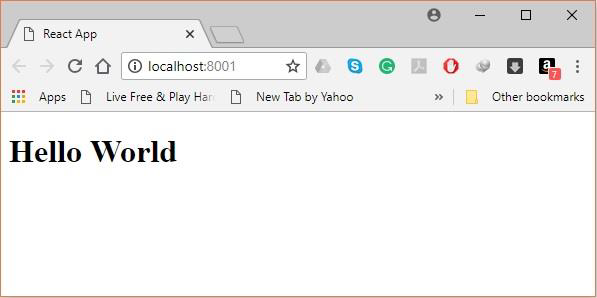


####  10 단계-번들 생성 

 마지막으로 번들을 생성하려면 명령 프롬프트에서 다음과 같이 빌드 명령을 실행해야합니다. 

```bat
C:\Users\Tutorialspoint\Desktop\reactApp>npm run build
```

 아래와 같이 현재 폴더에 번들이 생성됩니다. 

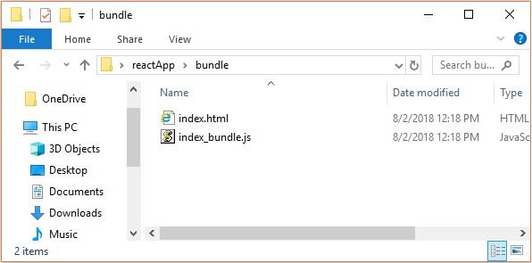


###  Create-react-app 명령 사용 

 Webpack 및 babel을 사용하는 대신 create-react-app를 설치하여 ReactJS를 더 간단하게 설치할 수 있습니다. 

####  1 단계-create-react-app 설치 

 바탕 화면을 탐색하고 아래와 같이 명령 프롬프트를 사용하여 React 앱 만들기를 설치하십시오- 

```bat
C:\Users\Tutorialspoint>cd C:\Users\Tutorialspoint\Desktop\
C:\Users\Tutorialspoint\Desktop>npx create-react-app my-app
```

 바탕 화면에 my-app라는 폴더가 생성되고 필요한 모든 파일이 설치됩니다. 

####  2 단계-모든 소스 파일 삭제 

 생성 된 my-app 폴더에서 src 폴더를 찾아 아래에 표시된 것처럼 모든 파일을 제거하십시오- 

```bat
C:\Users\Tutorialspoint\Desktop>cd my-app/src
C:\Users\Tutorialspoint\Desktop\my-app\src>del *
C:\Users\Tutorialspoint\Desktop\my-app\src\*, Are you sure (Y/N)? y
```

####  3 단계-파일 추가 

 Src 폴더에 index.css 및 index.js라는 이름의 파일을- 

```bat
C:\Users\Tutorialspoint\Desktop\my-app\src>type nul > index.css
C:\Users\Tutorialspoint\Desktop\my-app\src>type nul > index.js
```

 Index.js 파일에서 다음 코드를 추가하십시오 

```js
import React from 'react';
import ReactDOM from 'react-dom';
import './index.css';
```

#### 4 단계-프로젝트 실행 

 마지막으로 start 명령을 사용하여 프로젝트를 실행하십시오. 

```bat
npm start
```

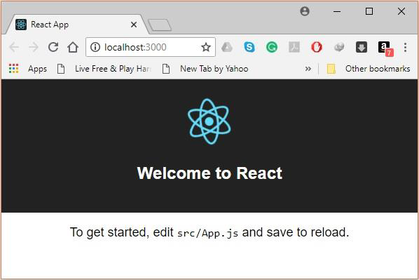


## JSX

출처:  https://www.tutorialspoint.com/reactjs/reactjs_jsx.htm 

 React는 일반적인 JavaScript 대신 템플릿을 위해 JSX를 사용합니다. 그것을 사용할 필요는 없지만 다음과 함께 제공되는 전문가가 있습니다. 

-  코드를 JavaScript로 컴파일하는 동안 최적화를 수행하기 때문에 더 빠릅니다. 
-  또한 형식이 안전하며 컴파일 중에 대부분의 오류가 발생할 수 있습니다. 
-  HTML에 익숙한 경우 템플릿을보다 쉽고 빠르게 작성할 수 있습니다. 


###  JSX 사용 

 대부분의 경우 JSX는 일반 HTML처럼 보입니다. 환경 설정 장에서 이미 사용했습니다. 우리가 div를 반환하는 App.jsx의 코드를보십시오. 

`App.jsx`

```jsx
import React from 'react';

class App extends React.Component {
   render() {
      return (
         <div>
            Hello World!!!
         </div>
      );
   }
}
export default App;
```

 HTML과 비슷하지만 JSX로 작업 할 때 명심해야 할 것이 몇 가지 있습니다. 


### Nested Elements

 더 많은 요소를 반환하려면 하나의 컨테이너 요소로 감싸 야합니다. **H1**, **h2** 및 **p** 요소의 래퍼로 **div**를 사용하는 방법에 주목하십시오. 

`App.jsx`

```jsx
import React from 'react';

class App extends React.Component {
   render() {
      return (
         <div>
            <h1>Header</h1>
            <h2>Content</h2>
            <p>This is the content!!!</p>
         </div>
      );
   }
}
export default App;
```

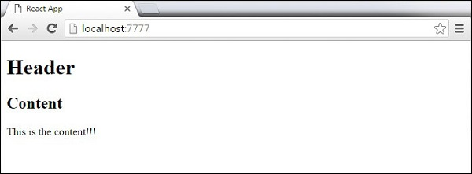

### Attributes

 일반 HTML 속성 및 속성 외에도 고유 한 사용자 정의 속성을 사용할 수 있습니다. 사용자 정의 속성을 추가하려면 **data- prefix**를 사용해야합니다. 다음 예에서는 **data-myattribute**를 **p** 요소의 속성으로 추가했습니다. 

```jsx
import React from 'react';

class App extends React.Component {
   render() {
      return (
         <div>
            <h1>Header</h1>
            <h2>Content</h2>
            <p data-myattribute = "somevalue">This is the content!!!</p>
         </div>
      );
   }
}
export default App;
```


### JavaScript Expressions

 JavaScript 표현식은 JSX 내부에서 사용할 수 있습니다. 중괄호 {}로 감싸 야합니다. 다음 예제는 **2**를 렌더링합니다. 

```jsx
import React from 'react';

class App extends React.Component {
   render() {
      return (
         <div>
            <h1>{1+1}</h1>
         </div>
      );
   }
}
export default App;
```

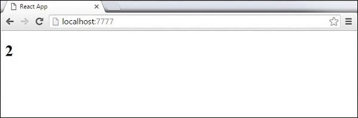

 JSX 내부에 else 문이 있으면 사용할 수 없으며 대신 조건부 (삼항) 표현식을 사용할 수 있습니다. 다음 예제에서 변수 **i** 는 **1**과 같으므로 브라우저는 **true**를 렌더링하고, 다른 값으로 변경하면 **false**를 렌더링합니다. 

```jsx
import React from 'react';

class App extends React.Component {
   render() {
      var i = 1;
      return (
         <div>
            <h1>{i == 1 ? 'True!' : 'False'}</h1>
         </div>
      );
   }
}
export default App;
```

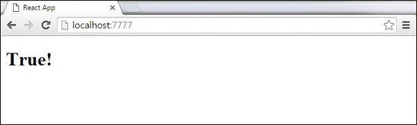

### Styling

인라인 스타일을 사용하는 것이 좋습니다. 인라인 스타일을 설정하려면 **camelCase** 구문을 사용해야합니다. React는 특정 요소의 숫자 값 뒤에 **px**를 자동으로 추가합니다. 다음 예제는 **myStyle** 인라인을 **h1** 요소에 추가하는 방법을 보여줍니다. 

```jsx
import React from 'react';

class App extends React.Component {
   render() {
      var myStyle = {
         fontSize: 100,
         color: '#FF0000'
      }
      return (
         <div>
            <h1 style = {myStyle}>Header</h1>
         </div>
      );
   }
}
export default App;
```

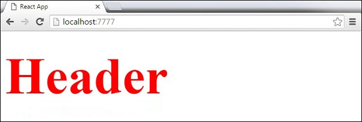

### Comments

 주석을 작성할 때 태그의 하위 섹션에 주석을 쓰려면 중괄호 **{}**를 넣어야합니다. 앱을 작성할 때 일관성을 유지하기 위해 주석을 작성할 때 항상 **{}**을 사용하는 것이 좋습니다. 

```jsx
import React from 'react';

class App extends React.Component {
   render() {
      return (
         <div>
            <h1>Header</h1>
            {//End of the line Comment...}
            {/*Multi line comment...*/}
         </div>
      );
   }
}
export default App;
```


### Naming Convention

 **HTML 태그**는 항상 **소문자** 태그 이름을 사용하지만 **React** 구성 요소는 **대문자로 시작**합니다.참고-**className** 및 **htmlFor**를 **class** 및 **for** 대신 XML 속성 이름으로 사용해야합니다.이것은 React 공식 페이지에서 다음과 같이 설명됩니다- 

 JSX는 JavaScript이므로 **class** 및 **for**와 같은 식별자는 XML 속성 이름으로 사용하지 않는 것이 좋습니다. 대신 React DOM 컴포넌트는 각각 **className** 및 **htmlFor**와 같은 DOM 특성 이름을 필요로합니다. 


## Components

이 장에서는 구성 요소를 결합하여 앱을보다 쉽게 유지 관리하는 방법을 배웁니다. 이 방법을 사용하면 나머지 페이지에 영향을주지 않고 구성 요소를 업데이트하고 변경할 수 있습니다. 


### Stateless Example

다음 예제의 첫 번째 구성 요소는 **App**입니다. 이 구성 요소는 **Header** 및 **Content** 의 소유자입니다. **Header** 와 **Content** 를 별도로 작성하고 **App** 컴포넌트의 JSX 트리에 추가하기 만하면됩니다. 앱 구성 요소 만 내 보내야합니다. 

`App.jsx`

```jsx
import React from 'react';

class App extends React.Component {
   render() {
      return (
         <div>
            <Header/>
            <Content/>
         </div>
      );
   }
}
class Header extends React.Component {
   render() {
      return (
         <div>
            <h1>Header</h1>
         </div>
      );
   }
}
class Content extends React.Component {
   render() {
      return (
         <div>
            <h2>Content</h2>
            <p>The content text!!!</p>
         </div>
      );
   }
}
export default App;
```

이를 페이지에서 렌더링하려면 main.js 파일에서 가져와 reactDOM.render ()를 호출해야합니다. 우리는 이미 환경을 설정하면서 이것을했습니다. 

`main.js`

```js
import React from 'react';
import ReactDOM from 'react-dom';
import App from './App.jsx';

ReactDOM.render(<App />, document.getElementById('app'));
```

 위의 코드는 다음과 같은 결과를 생성합니다. 

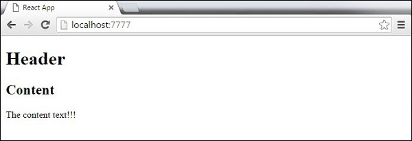

### Stateful Example

이 예에서는 소유자 구성 요소 (**App**)의 상태를 설정합니다. **Header** 구성 요소는 상태가 필요하지 않으므로 마지막 예와 같이 추가되었습니다. 콘텐츠 태그 대신 **table** 및 **tbody** 요소를 만들고 **data** array의 모든 객체에 대해 **TableRow**를 동적으로 삽입합니다. 

이전 JavaScript 구문보다 훨씬 깔끔하게 보이는 EcmaScript 2015 화살표 구문 (=>)을 사용하고 있음을 알 수 있습니다. 이렇게하면 코드 줄이 더 적은 요소를 만들 수 있습니다. 많은 항목이 포함 된 목록을 만들어야 할 때 특히 유용합니다. 

`App.jsx`

```jsx
import React from 'react';

class App extends React.Component {
   constructor() {
      super();
      this.state = {
         data: 
         [
            {
               "id":1,
               "name":"Foo",
               "age":"20"
            },
            {
               "id":2,
               "name":"Bar",
               "age":"30"
            },
            {
               "id":3,
               "name":"Baz",
               "age":"40"
            }
         ]
      }
   }
   render() {
      return (
         <div>
            <Header/>
            <table>
               <tbody>
                  {this.state.data.map((person, i) => <TableRow key = {i} 
                     data = {person} />)}
               </tbody>
            </table>
         </div>
      );
   }
}
class Header extends React.Component {
   render() {
      return (
         <div>
            <h1>Header</h1>
         </div>
      );
   }
}
class TableRow extends React.Component {
   render() {
      return (
         <tr>
            <td>{this.props.data.id}</td>
            <td>{this.props.data.name}</td>
            <td>{this.props.data.age}</td>
         </tr>
      );
   }
}
export default App;
```

`main.js`

```js
import React from 'react';
import ReactDOM from 'react-dom';
import App from './App.jsx';

ReactDOM.render(<App/>, document.getElementById('app'));
```

 **Note**  -  **map () 함수 안에서 key = {i}** 를 사용하고 있습니다. 이렇게하면 변경 사항이있을 때 React가 전체 목록을 다시 렌더링하는 대신 필요한 요소 만 업데이트 할 수 있습니다. 많은 수의 동적으로 생성 된 요소의 성능이 크게 향상됩니다. 

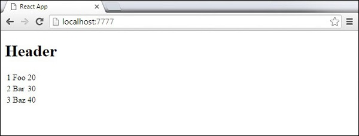


## State

**State** 는 데이터의 출처입니다. 우리는 항상 상태를 가능한 한 단순하게 만들고 상태 저장 구성 요소의 수를 최소화하려고 노력해야합니다. 예를 들어 상태의 데이터가 필요한 10 개의 구성 요소가있는 경우 모든 구성 요소의 상태를 유지하는 하나의 컨테이너 구성 요소를 만들어야합니다. 


###  State 사용 

 다음 샘플 코드는 EcmaScript2016 구문을 사용하여 상태 저장 컴포넌트를 작성하는 방법을 보여줍니다. 

`App.jsx`

```jsx
import React from 'react';

class App extends React.Component {
   constructor(props) {
      super(props);
		
      this.state = {
         header: "Header from state...",
         content: "Content from state..."
      }
   }
   render() {
      return (
         <div>
            <h1>{this.state.header}</h1>
            <h2>{this.state.content}</h2>
         </div>
      );
   }
}
export default App;
```

`main.js`

```js
import React from 'react';
import ReactDOM from 'react-dom';
import App from './App.jsx';

ReactDOM.render(<App />, document.getElementById('app'));
```

 결과는 다음과 같습니다. 

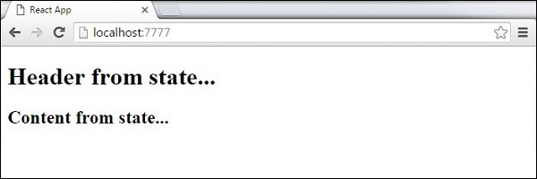


## Props Overview

 **State** 와 **Props** 의 주요 차이점은 **Props** 가 변경 불가능하다는 것입니다. 따라서 컨테이너 구성 요소는 업데이트 및 변경할 수있는 **State** 를 정의해야하며 하위 구성 요소는 **props**를 사용하여 **State** 에서 **Data** 만 전달해야합니다. 


### Props 사용 

 컴포넌트에 불변의 데이터가 필요할 때 **main.js**의 **reactDOM.render ()** 함수에 props를 추가하고 컴포넌트 내에서 사용할 수 있습니다. 

`App.jsx`

```jsx
import React from 'react';

class App extends React.Component {
   render() {
      return (
         <div>
            <h1>{this.props.headerProp}</h1>
            <h2>{this.props.contentProp}</h2>
         </div>
      );
   }
}
export default App;
```

`main.js`

```js
import React from 'react';
import ReactDOM from 'react-dom';
import App from './App.jsx';

ReactDOM.render(<App headerProp = "Header from props..." contentProp = "Content
   from props..."/>, document.getElementById('app'));

export default App;
```

 결과는 다음과 같습니다. 

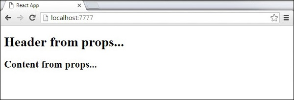

### Default Props

 **ReactDom.render()** 요소에 추가하는 대신 구성 요소 생성자에서 직접 기본 속성 값을 설정할 수도 있습니다. 

`App.jsx`

```jsx
import React from 'react';

class App extends React.Component {
   render() {
      return (
         <div>
            <h1>{this.props.headerProp}</h1>
            <h2>{this.props.contentProp}</h2>
         </div>
      );
   }
}
App.defaultProps = {
   headerProp: "Header from props...",
   contentProp:"Content from props..."
}
export default App;
```

`main.js`

```js
import React from 'react';
import ReactDOM from 'react-dom';
import App from './App.jsx';

ReactDOM.render(<App/>, document.getElementById('app'));
```

 출력은 이전과 동일합니다. 


### State and Props

 다음 예제는 앱에서 **State** 와 **Props**을 결합하는 방법을 보여줍니다. 부모 컴포넌트에서 **State** 를 설정하고 **props**를 사용하여 컴포넌트 트리 아래로 전달합니다. **render** 함수 내에서 하위 구성 요소에 사용되는 **headerProp** 및 **contentProp**를 설정합니다. 

`App.jsx`

```jsx
import React from 'react';

class App extends React.Component {
   constructor(props) {
      super(props);
      this.state = {
         header: "Header from props...",
         content: "Content from props..."
      }
   }
   render() {
      return (
         <div>
            <Header headerProp = {this.state.header}/>
            <Content contentProp = {this.state.content}/>
         </div>
      );
   }
}
class Header extends React.Component {
   render() {
      return (
         <div>
            <h1>{this.props.headerProp}</h1>
         </div>
      );
   }
}
class Content extends React.Component {
   render() {
      return (
         <div>
            <h2>{this.props.contentProp}</h2>
         </div>
      );
   }
}
export default App;
```

`main.js`

```js
import React from 'react';
import ReactDOM from 'react-dom';
import App from './App.jsx';

ReactDOM.render(<App/>, document.getElementById('app'));
```

결과는 이전 두 예제에서와 동일하지만 데이터 원본은 원래 상태에서 온 것입니다. 상태를 업데이트하려면 상태 만 업데이트하면 모든 하위 구성 요소가 업데이트됩니다. 자세한 내용은 이벤트 장을 참조하십시오. 


## Props Validation

 Properties  유효성 검사는 구성 요소를 올바르게 사용하도록하는 유용한 방법입니다. 앱이 커지면 개발 중에 향후 버그와 문제를 피하는 데 도움이됩니다. 또한 각 구성 요소를 어떻게 사용해야하는지 알 수 있으므로 코드를 더 읽기 쉽게 만듭니다.

### Validating Props

이 예에서는 필요한 모든 **Props** 로 **App**  component 를 만들고 있습니다. **App.propTypes**는 Props 검증에 사용됩니다. Props 중 일부가 우리가 할당 한 올바른 유형을 사용하지 않으면 콘솔 경고가 표시됩니다. 유효성 검사 패턴을 지정한 후 App.defaultProps를 설정합니다.  

`App.jsx`

```jsx
import React from 'react';

class App extends React.Component {
   render() {
      return (
         <div>
            <h3>Array: {this.props.propArray}</h3>
            <h3>Bool: {this.props.propBool ? "True..." : "False..."}</h3>
            <h3>Func: {this.props.propFunc(3)}</h3>
            <h3>Number: {this.props.propNumber}</h3>
            <h3>String: {this.props.propString}</h3>
            <h3>Object: {this.props.propObject.objectName1}</h3>
            <h3>Object: {this.props.propObject.objectName2}</h3>
            <h3>Object: {this.props.propObject.objectName3}</h3>
         </div>
      );
   }
}

App.propTypes = {
   propArray: React.PropTypes.array.isRequired,
   propBool: React.PropTypes.bool.isRequired,
   propFunc: React.PropTypes.func,
   propNumber: React.PropTypes.number,
   propString: React.PropTypes.string,
   propObject: React.PropTypes.object
}

App.defaultProps = {
   propArray: [1,2,3,4,5],
   propBool: true,
   propFunc: function(e){return e},
   propNumber: 1,
   propString: "String value...",
   
   propObject: {
      objectName1:"objectValue1",
      objectName2: "objectValue2",
      objectName3: "objectValue3"
   }
}
export default App;
```

`main.js`

```js
import React from 'react';
import ReactDOM from 'react-dom';
import App from './App.jsx';

ReactDOM.render(<App/>, document.getElementById('app'))
```

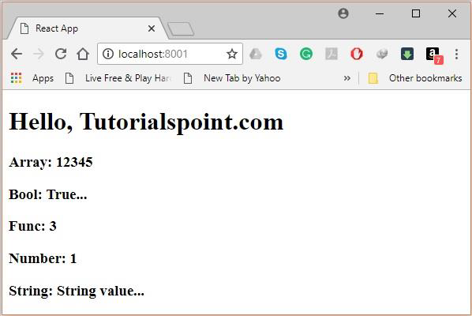


## Component API

 이 장에서는 React 컴포넌트 API에 대해 설명합니다. **SetState(), forceUpdate** 및 **ReactDOM.findDOMNode ()**의 세 가지 방법에 대해 설명합니다. 새로운 ES6 클래스에서는이를 수동으로 바인딩해야합니다. 예제에서 **this.method.bind (this)**를 사용합니다. 


### Set State

 **SetState()** 메서드는 구성 요소의 상태를 업데이트하는 데 사용됩니다. 이 방법은 상태를 바꾸지 않고 원래 상태에만 변경 사항을 추가합니다. 

```jsx
import React from 'react';

class App extends React.Component {
   constructor() {
      super();
		
      this.state = {
         data: []
      }
	
      this.setStateHandler = this.setStateHandler.bind(this);
   };
   setStateHandler() {
      var item = "setState..."
      var myArray = this.state.data.slice();
	  myArray.push(item);
      this.setState({data: myArray})
   };
   render() {
      return (
         <div>
            <button onClick = {this.setStateHandler}>SET STATE</button>
            <h4>State Array: {this.state.data}</h4>
         </div>
      );
   }
}
export default App;
```

 빈 배열로 시작했습니다. 버튼을 클릭 할 때마다 상태가 업데이트됩니다. 5 번 클릭하면 다음과 같은 결과가 나옵니다. 

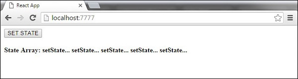


### Force Update

 때로는 구성 요소를 수동으로 업데이트하려고 할 수도 있습니다. 이는 **forceUpdate ()** 메소드를 사용하여 수행 할 수 있습니다. 

```jsx
import React from 'react';

class App extends React.Component {
   constructor() {
      super();
      this.forceUpdateHandler = this.forceUpdateHandler.bind(this);
   };
   forceUpdateHandler() {
      this.forceUpdate();
   };
   render() {
      return (
         <div>
            <button onClick = {this.forceUpdateHandler}>FORCE UPDATE</button>
            <h4>Random number: {Math.random()}</h4>
         </div>
      );
   }
}
export default App;
```

 버튼을 클릭 할 때마다 업데이트되는 난수를 설정합니다. 

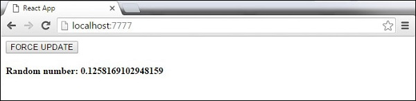


### Find Dom Node

 DOM 조작을 위해 **ReactDOM.findDOMNode ()** 메소드를 사용할 수 있습니다. 먼저  **react-dom** 을 가져와야합니다. 

```jsx
import React from 'react';
import ReactDOM from 'react-dom';

class App extends React.Component {
   constructor() {
      super();
      this.findDomNodeHandler = this.findDomNodeHandler.bind(this);
   };
   findDomNodeHandler() {
      var myDiv = document.getElementById('myDiv');
      ReactDOM.findDOMNode(myDiv).style.color = 'green';
   }
   render() {
      return (
         <div>
            <button onClick = {this.findDomNodeHandler}>FIND DOME NODE</button>
            <div id = "myDiv">NODE</div>
         </div>
      );
   }
}
export default App;
```

 버튼을 클릭하면 **myDiv** 요소의 색상이 녹색으로 바뀝니다. 

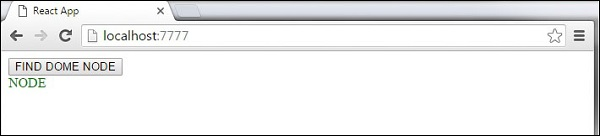

 **Note** −   0.14 업데이트 이후, ES6를 수용하기 위해 대부분의 이전 구성 요소 API 메소드가 더 이상 사용되지 않거나 제거됩니다. 


## Component Life Cycle

 이 장에서는 구성 요소 수명주기 방법에 대해 설명합니다. 


### Lifecycle Methods

- **componentWillMount**  서버와 클라이언트 측 모두에서 렌더링 전에 실행됩니다. 
- **componentDidMount**  클라이언트 측에서만 첫 번째 렌더링 후에 실행됩니다. 여기서 AJAX 요청과 DOM 또는 상태 업데이트가 발생합니다. 이 메소드는 다른 JavaScript 프레임 워크 및 **setTimeout** 또는 **setInterval**과 같이 실행이 지연된 함수와의 통합에도 사용됩니다. 다른 수명주기 메소드를 트리거 할 수 있도록 상태를 업데이트하는 데 사용합니다. 
- **componentWillReceiveProps**  다른 렌더가 호출되기 전에 props가 업데이트 되 자마자 호출됩니다. 상태를 업데이트 할 때 setNewNumber에서 트리거했습니다. 
- **shouldComponentUpdate**  True 또는 false 값을 반환해야합니다. 구성 요소를 업데이트할지 여부를 결정합니다. 기본적으로 true로 설정되어 있습니다. 상태 또는 소품이 업데이트 된 후 구성 요소를 렌더링 할 필요가없는 경우 false 값을 반환 할 수 있습니다. 
- **componentWillUpdate**  렌더링 직전에 호출됩니다 
- **componentDidUpdate** i 렌더링 직후에 호출됩니다. 
- **componentWillUnmount**  컴포넌트가 돔에서 마운트 해제 된 후 호출됩니다. **main.js**에서 컴포넌트를 마운트 해제하고 있습니다. 


 다음 예제에서는 생성자 함수에서 초기 **state** 를 설정합니다. **SetNewnumber**는 **state** 를 업데이트하는 데 사용됩니다. 모든 수명주기 방법은 Content 구성 요소 내에 있습니다. 

`App.jsx`

```jsx
import React from 'react';

class App extends React.Component {
   constructor(props) {
      super(props);
      
      this.state = {
         data: 0
      }
      this.setNewNumber = this.setNewNumber.bind(this)
   };
   setNewNumber() {
      this.setState({data: this.state.data + 1})
   }
   render() {
      return (
         <div>
            <button onClick = {this.setNewNumber}>INCREMENT</button>
            <Content myNumber = {this.state.data}></Content>
         </div>
      );
   }
}
class Content extends React.Component {
   componentWillMount() {
      console.log('Component WILL MOUNT!')
   }
   componentDidMount() {
      console.log('Component DID MOUNT!')
   }
   componentWillReceiveProps(newProps) {    
      console.log('Component WILL RECIEVE PROPS!')
   }
   shouldComponentUpdate(newProps, newState) {
      return true;
   }
   componentWillUpdate(nextProps, nextState) {
      console.log('Component WILL UPDATE!');
   }
   componentDidUpdate(prevProps, prevState) {
      console.log('Component DID UPDATE!')
   }
   componentWillUnmount() {
      console.log('Component WILL UNMOUNT!')
   }
   render() {
      return (
         <div>
            <h3>{this.props.myNumber}</h3>
         </div>
      );
   }
}
export default App;
```

`main.js`

```js
import React from 'react';
import ReactDOM from 'react-dom';
import App from './App.jsx';

ReactDOM.render(<App/>, document.getElementById('app'));

setTimeout(() => {
   ReactDOM.unmountComponentAtNode(document.getElementById('app'));}, 10000);
```

 초기 렌더링 후 다음과 같은 화면이 나타납니다. 

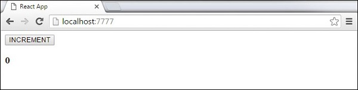


## Forms

출처:  https://www.tutorialspoint.com/reactjs/reactjs_forms.htm 

 이 장에서는 React에서 폼을 사용하는 방법을 배웁니다. 


## Simple Example

 다음 예에서는 **value = {this.state.data}** 인 입력 양식을 설정합니다. 입력 값이 변경 될 때마다 상태를 업데이트 할 수 있습니다. 우리는 입력 변경 사항을보고 그에 따라 상태를 업데이트하는 **onChange** 이벤트를 사용하고 있습니다. 

`App.jsx`

```jsx
import React from 'react';

class App extends React.Component {
   constructor(props) {
      super(props);
      
      this.state = {
         data: 'Initial data...'
      }
      this.updateState = this.updateState.bind(this);
   };
   updateState(e) {
      this.setState({data: e.target.value});
   }
   render() {
      return (
         <div>
            <input type = "text" value = {this.state.data} 
               onChange = {this.updateState} />
            <h4>{this.state.data}</h4>
         </div>
      );
   }
}
export default App;
```

`main.js`

```js
import React from 'react';
import ReactDOM from 'react-dom';
import App from './App.jsx';

ReactDOM.render(<App/>, document.getElementById('app'));
```

 결과는 다음과 같습니다. 

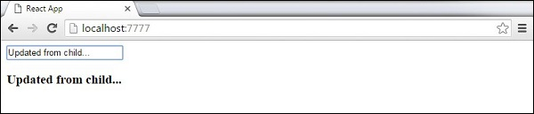


## Events

 이 장에서는 이벤트 사용 방법을 배웁니다. 

### Simple Example

 이것은 하나의 구성 요소 만 사용하는 간단한 예입니다. 버튼을 클릭하면 **updateState** 함수를 트리거하는 **onClick** 이벤트를 추가하고 있습니다. 

`App.jsx`

```jsx
import React from 'react';

class App extends React.Component {
   constructor(props) {
      super(props);
      
      this.state = {
         data: 'Initial data...'
      }
      this.updateState = this.updateState.bind(this);
   };
   updateState() {
      this.setState({data: 'Data updated...'})
   }
   render() {
      return (
         <div>
            <button onClick = {this.updateState}>CLICK</button>
            <h4>{this.state.data}</h4>
         </div>
      );
   }
}
export default App;
```

`main.js`

```js
import React from 'react';
import ReactDOM from 'react-dom';
import App from './App.jsx';

ReactDOM.render(<App/>, document.getElementById('app'));
```

 결과는 다음과 같습니다. 

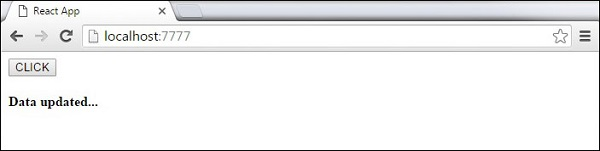


### Child Events

 자식 구성 요소에서 부모 구성 요소의 **state** 를 업데이트해야 할 때 부모 구성 요소에 이벤트 처리기 (**updateState**)를 만들고이를 호출 할 수있는 자식 구성 요소에 prop (**updateStateProp**)로 전달할 수 있습니다. 

`App.jsx`

```jsx
import React from 'react';

class App extends React.Component {
   constructor(props) {
      super(props);
      
      this.state = {
         data: 'Initial data...'
      }
      this.updateState = this.updateState.bind(this);
   };
   updateState() {
      this.setState({data: 'Data updated from the child component...'})
   }
   render() {
      return (
         <div>
            <Content myDataProp = {this.state.data} 
               updateStateProp = {this.updateState}></Content>
         </div>
      );
   }
}
class Content extends React.Component {
   render() {
      return (
         <div>
            <button onClick = {this.props.updateStateProp}>CLICK</button>
            <h3>{this.props.myDataProp}</h3>
         </div>
      );
   }
}
export default App;
```

`main.js`

```js
import React from 'react';
import ReactDOM from 'react-dom';
import App from './App.jsx';

ReactDOM.render(<App/>, document.getElementById('app'));
```

 결과는 다음과 같습니다. 

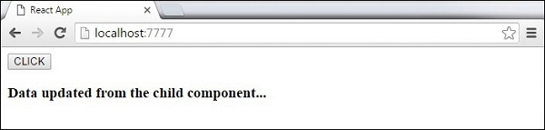


## Refs

 ref 는 요소에 대한 참조를 반환하는 데 사용됩니다. 대부분의 경우 **refs** 는 피해야하지만 DOM 측정이 필요하거나 구성 요소에 메소드를 추가 할 때 유용 할 수 있습니다. 


### Using Refs

 다음 예제는 refs를 사용하여 입력 필드를 지우는 방법을 보여줍니다. **ClearInput** 함수는 **ref =  "myInput"** 값을 가진 요소를 검색하고 상태를 재설정하며 버튼을 클릭 한 후 초점을 추가합니다. 

`App.jsx`

```jsx
import React from 'react';
import ReactDOM from 'react-dom';

class App extends React.Component {
   constructor(props) {
      super(props);
		
      this.state = {
         data: ''
      }
      this.updateState = this.updateState.bind(this);
      this.clearInput = this.clearInput.bind(this);
   };
   updateState(e) {
      this.setState({data: e.target.value});
   }
   clearInput() {
      this.setState({data: ''});
      ReactDOM.findDOMNode(this.refs.myInput).focus();
   }
   render() {
      return (
         <div>
            <input value = {this.state.data} onChange = {this.updateState} 
               ref = "myInput"></input>
            <button onClick = {this.clearInput}>CLEAR</button>
            <h4>{this.state.data}</h4>
         </div>
      );
   }
}
export default App;
```

`main.js`

```js
import React from 'react';
import ReactDOM from 'react-dom';
import App from './App.jsx';

ReactDOM.render(<App/>, document.getElementById('app'));
```

 버튼을 클릭하면 입력이 지워지고 초점이 맞춰집니다. 

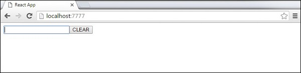


## Keys

 반응 **Keys** 는 동적으로 생성 된 구성 요소를 사용하거나 사용자가 목록을 변경할 때 유용합니다. **key** 값을 설정하면 변경 후에도 구성 요소를 고유하게 식별 할 수 있습니다. 


### Using Keys

 고유 인덱스 (i)를 사용하여 **Content** 요소를 동적으로 작성해 봅시다. 지도 함수는 **data** 배열에서 세 가지 요소를 만듭니다. **key** 값은 모든 요소마다 고유해야하므로 i 를 생성 된 각 요소의 키로 지정합니다. 

`App.jsx`

```jsx
import React from 'react';

class App extends React.Component {
   constructor() {
      super();
		
      this.state = {
         data:[
            {
               component: 'First...',
               id: 1
            },
            {
               component: 'Second...',
               id: 2
            },
            {
               component: 'Third...',
               id: 3
            }
         ]
      }
   }
   render() {
      return (
         <div>
            <div>
               {this.state.data.map((dynamicComponent, i) => <Content 
                  key = {i} componentData = {dynamicComponent}/>)}
            </div>
         </div>
      );
   }
}
class Content extends React.Component {
   render() {
      return (
         <div>
            <div>{this.props.componentData.component}</div>
            <div>{this.props.componentData.id}</div>
         </div>
      );
   }
}
export default App;
```

`main.js`

```js
import React from 'react';
import ReactDOM from 'react-dom';
import App from './App.jsx';

ReactDOM.render(<App/>, document.getElementById('app'));
```

 각 요소의 키 값에 대해 다음 결과를 얻습니다. 

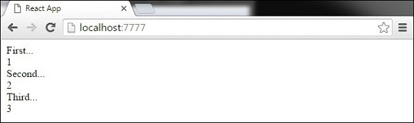

 나중에 일부 요소를 추가 또는 제거하거나 동적으로 생성 된 요소의 순서를 변경하면 React는 키 값을 사용하여 각 요소를 추적합니다. 


## Router

출처:  https://www.tutorialspoint.com/reactjs/reactjs_router.htm 

 이 장에서는 앱의 라우팅을 설정하는 방법을 배웁니다. 

### Step 1 - Install a React Router

 반응 라우터를 설치하는 간단한 방법은 명령 프롬프트 창에서 다음 코드 스니펫을 실행하는 것입니다. 

```bat
C:\Users\username\Desktop\reactApp>npm install react-router
```

### Step 2 - Create Components

이 단계에서는 네 가지 구성 요소를 만듭니다. 앱 구성 요소는 탭 메뉴로 사용됩니다. 경로가 변경되면 다른 세 가지 구성 요소 (홈), (정보) 및 (연락처)가 렌더링됩니다. 

`main.js`

```js
import React from 'react';
import ReactDOM from 'react-dom';
import { Router, Route, Link, browserHistory, IndexRoute } from 'react-router'

class App extends React.Component {
   render() {
      return (
         <div>
            <ul>
            <li>Home</li>
            <li>About</li>
            <li>Contact</li>
            </ul>
            {this.props.children}
         </div>
      )
   }
}
export default App;

class Home extends React.Component {
   render() {
      return (
         <div>
            <h1>Home...</h1>
         </div>
      )
   }
}
export default Home;

class About extends React.Component {
   render() {
      return (
         <div>
            <h1>About...</h1>
         </div>
      )
   }
}
export default About;

class Contact extends React.Component {
   render() {
      return (
         <div>
            <h1>Contact...</h1>
         </div>
      )
   }
}
export default Contact;
```

### Step 3 - Add a Router

 이제 앱에 경로를 추가하겠습니다. 이전 예제에서와 같이 App 요소를 렌더링하는 대신 이번에는 라우터가 렌더링됩니다. 각 경로에 대한 구성 요소도 설정합니다. 

`main.js`

```js
ReactDOM.render((
   <Router history = {browserHistory}>
      <Route path = "/" component = {App}>
         <IndexRoute component = {Home} />
         <Route path = "home" component = {Home} />
         <Route path = "about" component = {About} />
         <Route path = "contact" component = {Contact} />
      </Route>
   </Router>
), document.getElementById('app'))
```

 앱이 시작되면 경로를 변경하는 데 사용할 수있는 클릭 가능한 링크 3 개가 표시됩니다. 

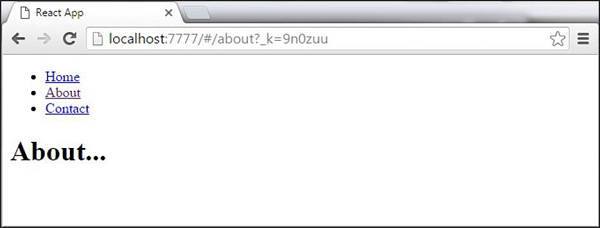


## Flux Concept

Flux는 데이터가 단방향 인 프로그래밍 개념입니다. 이 데이터는 앱에 들어가서 화면에 렌더링 될 때까지 한 방향으로 흐릅니다. 


###  플럭스 요소 

 다음은 플럭스 개념에 대한 간단한 설명입니다. 다음 장에서는 앱에이를 구현하는 방법을 배웁니다. 

- **Actions** −  데이터 플로우를 트리거하기 위해 조치가 디스패처로 전송됩니다. 
- **Dispatcher** −  앱의 중심 허브입니다. 모든 데이터가 파견되어 상점으로 전송됩니다. 
- **Store** −  Store는 응용 프로그램 상태와 논리가 유지되는 장소입니다. 모든 상점은 특정 상태를 유지하고 있으며 필요할 때 업데이트됩니다. 
- **View** −  보기는 상점에서 데이터를 수신하고 앱을 다시 렌더링합니다. 

 데이터 흐름은 다음 이미지에 나와 있습니다. 

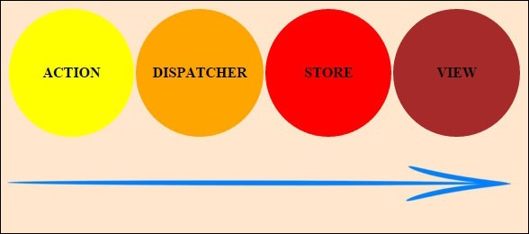

### Flux Pros

단일 방향 데이터 흐름은 이해하기 쉽습니다.

앱을 유지 관리하기가 더 쉽습니다.

앱 파트가 분리되었습니다. 


## Using Flux

 이 장에서는 React 애플리케이션에서 플럭스 패턴을 구현하는 방법을 학습합니다. 우리는 Redux 프레임 워크를 사용할 것입니다. 이 장의 목표는 Redux와 React를 연결하는 데 필요한 모든 가장 간단한 예를 제시하는 것입니다. 

### Step 1 - Install Redux

 명령 프롬프트 창을 통해 Redux를 설치합니다. 

```bat
C:\Users\username\Desktop\reactApp>npm install --save react-redux
```

### Step 2 - Create Files and Folders

 이 단계에서는 작업, 감속기 및 구성 요소를위한 폴더와 파일을 만듭니다. 이 작업을 마친 후에는 폴더 구조가 어떻게 생겼는지입니다. 

```bat
C:\Users\Tutorialspoint\Desktop\reactApp>mkdir actions
C:\Users\Tutorialspoint\Desktop\reactApp>mkdir components
C:\Users\Tutorialspoint\Desktop\reactApp>mkdir reducers
C:\Users\Tutorialspoint\Desktop\reactApp>type nul > actions/actions.js
C:\Users\Tutorialspoint\Desktop\reactApp>type nul > reducers/reducers.js
C:\Users\Tutorialspoint\Desktop\reactApp>type nul > components/AddTodo.js
C:\Users\Tutorialspoint\Desktop\reactApp>type nul > components/Todo.js
C:\Users\Tutorialspoint\Desktop\reactApp>type nul > components/TodoList.js
```

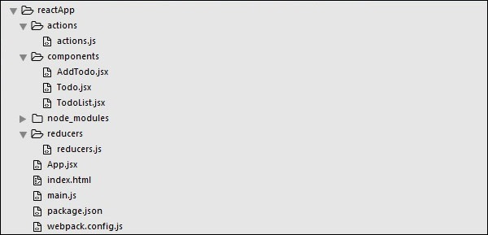

### Step 3 - Actions

 조치는 유형 특성을 사용하여 상점으로 전송해야하는 데이터에 대해 알리는 JavaScript 오브젝트입니다. 목록에 새 항목을 추가하는 데 사용될 ADD_TODO 작업을 정의하고 있습니다. AddTodo 함수는 액션을 생성하고 생성 된 모든 아이템의 id를 설정하는 액션 생성자입니다. 

`actions/actions.js`

```js
export const ADD_TODO = 'ADD_TODO'

let nextTodoId = 0;

export function addTodo(text) {
   return {
      type: ADD_TODO,
      id: nextTodoId++,
      text
   };
}
```

### Step 4 - Reducers

 작업은 앱에서 변경 사항 만 트리거하지만 감속기는 해당 변경 사항을 지정합니다. 우리는 switch 문을 사용하여 ADD_TODO 작업을 검색하고 있습니다. 감속기는 업데이트 된 상태를 계산하고 리턴하기 위해 두 개의 매개 변수 (상태 및 조치)를 취하는 함수입니다. 

 첫 번째 기능은 새 항목을 만드는 데 사용되며 두 번째 기능은 해당 항목을 목록으로 푸시합니다. 결국 우리는 앞으로 사용할 새로운 감속기를 추가 할 수있는 combineReducers 도우미 기능을 사용하고 있습니다. 

`reducers/reducers.js`

```js
import { combineReducers } from 'redux'
import { ADD_TODO } from '../actions/actions'

function todo(state, action) {
   switch (action.type) {
      case ADD_TODO:
         return {
            id: action.id,
            text: action.text,
         }
      default:
         return state
   }
}
function todos(state = [], action) {
   switch (action.type) {
      case ADD_TODO:
         return [
            ...state,
            todo(undefined, action)
         ]
      default:
         return state
   }
}
const todoApp = combineReducers({
   todos
})
export default todoApp
```

### Step 5 - Store

 스토어는 앱의 상태를 유지하는 장소입니다. 리듀서가 있으면 상점을 만드는 것이 매우 쉽습니다. 우리는 상점 속성을 공급자 요소에 전달하여 경로 구성 요소를 래핑합니다. 

`main.js`

```js
import React from 'react'

import { render } from 'react-dom'
import { createStore } from 'redux'
import { Provider } from 'react-redux'

import App from './App.jsx'
import todoApp from './reducers/reducers'

let store = createStore(todoApp)
let rootElement = document.getElementById('app')

render(
   <Provider store = {store}>
      <App />
   </Provider>,
	
   rootElement
)
```

### Step 6 - Root Component

 앱 구성 요소는 앱의 루트 구성 요소입니다. 루트 구성 요소 만 redux를 알고 있어야합니다. 주목해야 할 중요한 부분은 루트 구성 요소 앱을 상점에 연결하는 데 사용되는 연결 기능입니다.

이 함수는 select 함수를 인수로 사용합니다. Select 함수는 상점에서 상태를 가져 와서 컴포넌트에서 사용할 수있는 props (visibleTodos)를 리턴합니다. 

`App.jsx`

```jsx
import React, { Component } from 'react'
import { connect } from 'react-redux'
import { addTodo } from './actions/actions'

import AddTodo from './components/AddTodo.js'
import TodoList from './components/TodoList.js'

class App extends Component {
   render() {
      const { dispatch, visibleTodos } = this.props
      
      return (
         <div>
            <AddTodo onAddClick = {text =>dispatch(addTodo(text))} />
            <TodoList todos = {visibleTodos}/>
         </div>
      )
   }
}
function select(state) {
   return {
      visibleTodos: state.todos
   }
}
export default connect(select)(App);
```

### Step 7 - Other Components

 이러한 구성 요소는 redux를 인식해서는 안됩니다. 

`components/AddTodo.js`

```js
import React, { Component, PropTypes } from 'react'

export default class AddTodo extends Component {
   render() {
      return (
         <div>
            <input type = 'text' ref = 'input' />
				
            <button onClick = {(e) => this.handleClick(e)}>
               Add
            </button>
         </div>
      )
   }
   handleClick(e) {
      const node = this.refs.input
      const text = node.value.trim()
      this.props.onAddClick(text)
      node.value = ''
   }
}
```

`components/Todo.js`

```js
import React, { Component, PropTypes } from 'react'

export default class Todo extends Component {
   render() {
      return (
         <li>
            {this.props.text}
         </li>
      )
   }
}
```

`components/TodoList.js`

```js
import React, { Component, PropTypes } from 'react'
import Todo from './Todo.js'

export default class TodoList extends Component {
   render() {
      return (
         <ul>
            {this.props.todos.map(todo =>
               <Todo
                  key = {todo.id}
                  {...todo}
               />
            )}
         </ul>
      )
   }
}
```

 앱을 시작하면 목록에 항목을 추가 할 수 있습니다. 

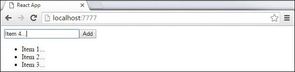


## Animations

이 장에서는 React를 사용하여 요소에 애니메이션을 적용하는 방법을 배웁니다.


### 1 단계-React CSS Transitions Group 설치

이것은 기본 CSS 전환 및 애니메이션을 만드는 데 사용되는 React 애드온입니다. 명령 프롬프트 창에서 설치합니다.

``` bash
C:\Users\username\Desktop\reactApp>npm install react-addons-css-transition-group
```


### 2 단계-CSS 파일 추가

새 파일 style.css를 만들어 보겠습니다.

``` bash
C:\Users\Tutorialspoint\Desktop\reactApp>type nul > css/style.css
```

앱에서 사용할 수 있으려면 index.html의 head 요소에 링크해야합니다.

``` html
<!DOCTYPE html>
<html lang = "en">
   <head>
      <link rel = "stylesheet" type = "text/css" href = "./style.css">
      <meta charset = "UTF-8">
      <title>React App</title>
   </head>
   <body>
      <div id = "app"></div>
      <script src = 'index_bundle.js'></script>
   </body>
</html>
```

### 3 단계-애니메이션 표시

기본적인 React 컴포넌트를 만들 것입니다. ReactCSSTransitionGroup 요소는 애니메이션을 적용 할 구성 요소의 래퍼로 사용됩니다. transitionAppear 및 transitionAppearTimeout을 사용하는 반면 transitionEnter 및 transitionLeave는 false입니다.

`app.jsx`

``` jsx
import React from 'react';
var ReactCSSTransitionGroup = require('react-addons-css-transition-group');

class App extends React.Component {
   render() {
      return (
         <div>
            <ReactCSSTransitionGroup transitionName = "example"
               transitionAppear = {true} transitionAppearTimeout = {500}
               transitionEnter = {false} transitionLeave = {false}>
					
               <h1>My Element...</h1>
            </ReactCSSTransitionGroup>
         </div>      
      );
   }
}
export default App;
```

`main.js`

```js
import React from 'react'
import ReactDOM from 'react-dom';
import App from './App.jsx';

ReactDOM.render(<App />, document.getElementById('app'));
```

CSS 애니메이션은 매우 간단합니다.

`css/style.css`

``` css
.example-appear {
   opacity: 0.04;
}
.example-appear.example-appear-active {
   opacity: 2;
   transition: opacity 50s ease-in;
}
```

앱을 시작하면 요소가 페이드 인됩니다.

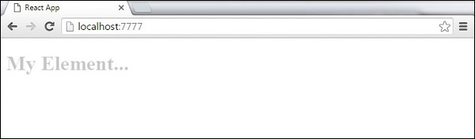

### 4 단계-애니메이션 입력 및 종료

목록에서 요소를 추가하거나 제거하고자 할 때 입력 및 종료 애니메이션을 사용할 수 있습니다.

`App.jsx`

``` jsx
import React from 'react';
var ReactCSSTransitionGroup = require('react-addons-css-transition-group');

class App extends React.Component {
   constructor(props) {
      super(props);
		
      this.state = {
         items: ['Item 1...', 'Item 2...', 'Item 3...', 'Item 4...']
      }
      this.handleAdd = this.handleAdd.bind(this);
   };
   handleAdd() {
      var newItems = this.state.items.concat([prompt('Create New Item')]);
      this.setState({items: newItems});
   }
   handleRemove(i) {
      var newItems = this.state.items.slice();
      newItems.splice(i, 1);
      this.setState({items: newItems});
   }
   render() {
      var items = this.state.items.map(function(item, i) {
         return (
            <div key = {item} onClick = {this.handleRemove.bind(this, i)}>
               {item}
            </div>
         );
      }.bind(this));
      
      return (
         <div>      
            <button onClick = {this.handleAdd}>Add Item</button>
				
            <ReactCSSTransitionGroup transitionName = "example" 
               transitionEnterTimeout = {500} transitionLeaveTimeout = {500}>
               {items}
            </ReactCSSTransitionGroup>
         </div>
      );
   }
}
export default App;
```

`main.js`

``` js
import React from 'react'
import ReactDOM from 'react-dom';
import App from './App.jsx';

ReactDOM.render(<App />, document.getElementById('app'));
```

`css/style.css`

``` css
.example-enter {
   opacity: 0.04;
}
.example-enter.example-enter-active {
   opacity: 5;
   transition: opacity 50s ease-in;
}
.example-leave {
   opacity: 1;
}
.example-leave.example-leave-active {
   opacity: 0.04;
   transition: opacity 50s ease-in;
}
```

앱을 시작하고 항목 추가 버튼을 클릭하면 프롬프트가 나타납니다.

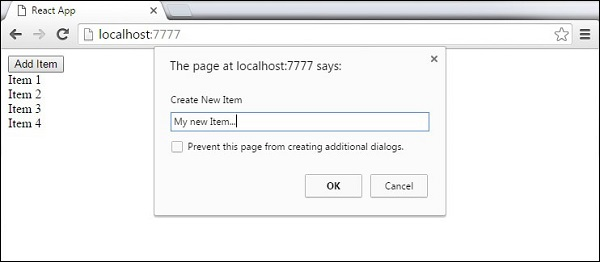

이름을 입력하고 확인을 누르면 새 요소가 페이드 인됩니다.

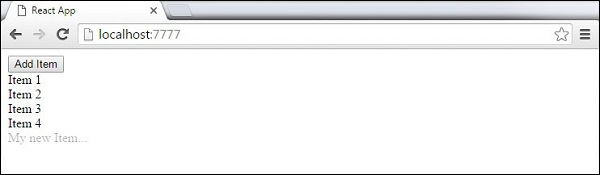

이제 일부 항목 (항목 3 ...)을 클릭하여 삭제할 수 있습니다. 이 항목은 목록에서 사라집니다.

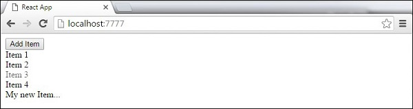


---

## Higher Order Components

상위 구성 요소는 기존 구성 요소에 추가 기능을 추가하는 데 사용되는 JavaScript 함수입니다. 이러한 함수는 순수하므로 데이터를 수신하고 해당 데이터에 따라 값을 반환합니다. 데이터가 변경되면 다른 데이터 입력으로 고차 함수가 다시 실행됩니다. 반환되는 구성 요소를 업데이트하려면 HOC를 변경할 필요가 없습니다. 함수가 사용하는 데이터를 변경하기 만하면됩니다.

**Higher Order Component** (HOC) 는 '정상'구성 요소를 둘러싸고 추가 데이터 입력을 제공합니다. 실제로 하나의 구성 요소를 취하고 원래 구성 요소를 래핑하는 다른 구성 요소를 반환하는 함수입니다.

이 개념이 어떻게 작동하는지 쉽게 이해하기 위해 간단한 예를 살펴 보겠습니다. MyHOC는 데이터를 MyComponent로 전달하는 데만 사용되는 고차 함수입니다. 이 함수는 MyComponent를 가져 와서 newData로 향상시키고 화면에 렌더링 될 향상된 구성 요소를 반환합니다.

``` js
import React from 'react';

var newData = {
   data: 'Data from HOC...',
}

var MyHOC = ComposedComponent => class extends React.Component {
   componentDidMount() {
      this.setState({
         data: newData.data
      });
   }
   render() {
      return <ComposedComponent {...this.props} {...this.state} />;
   }
};
class MyComponent extends React.Component {
   render() {
      return (
         <div>
            <h1>{this.props.data}</h1>
         </div>
      )
   }
}

export default MyHOC(MyComponent);
```

앱을 실행하면 데이터가 MyComponent로 전달되는 것을 볼 수 있습니다.

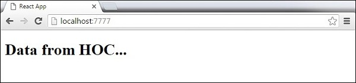

> **Note** −  다른 기능에 대해 고차 구성 요소를 사용할 수 있습니다. 이러한 순수 함수는 함수형 프로그래밍의 핵심입니다. 익숙해지면 앱을 유지 관리하거나 업그레이드하기가 더 쉬워지는 것을 알 수 있습니다.


---

## Best Practices

이 장에서는 앱 개발 중에 일관성을 유지하는 데 도움이되는 React 모범 사례, 방법 및 기술을 나열합니다.

- **State** − 상태는 가능한 한 피해야합니다. 상태를 중앙 집중화하고 구성 요소 트리에 소품으로 전달하는 것이 좋습니다. 동일한 데이터가 필요한 구성 요소 그룹이있을 때마다 상태를 유지할 컨테이너 요소를 설정해야합니다. Flux 패턴은 React 앱에서 상태를 처리하는 좋은 방법입니다.
- **PropTypes** − PropTypes는 항상 정의되어야합니다. 이것은 앱의 모든 소품을 추적하는 데 도움이되며 동일한 프로젝트에서 작업하는 모든 개발자에게도 유용합니다.
- **Render** −  대부분의 앱 로직은 render 메서드 내에서 이동해야합니다. 컴포넌트 라이프 사이클 메소드에서 로직을 최소화하고 해당 로직을 렌더링 메소드로 이동해야합니다. 우리가 사용하는 상태와 소품이 적을수록 코드가 더 깔끔해집니다. 우리는 항상 상태를 가능한 한 단순하게 만들어야합니다. state 나 props에서 무언가를 계산해야한다면 render 메서드 내에서 계산할 수 있습니다.
- **Composition** − React 팀은 단일 책임 원칙을 사용할 것을 제안합니다. 이는 하나의 구성 요소가 하나의 기능 만 담당해야 함을 의미합니다. 일부 구성 요소에 둘 이상의 기능이있는 경우 모든 기능에 대해 새 구성 요소를 리팩터링하고 만들어야합니다.
- **Higher Order Components (HOC)** − 이전 React 버전은 재사용 가능한 기능을 처리하기위한 믹스 인을 제공했습니다. 믹스 인은 이제 더 이상 사용되지 않으므로 해결책 중 하나는 HOC를 사용하는 것입니다.


## Useful Resources

다음 리소스에는 ReactJS에 대한 추가 정보가 포함되어 있습니다. 이것에 대한 더 깊은 지식을 얻으려면 그들을 사용하십시오.

### Useful Links on ReactJS

- [ReactJS Wiki](https://en.wikipedia.org/wiki/React_(JavaScript_library)) − Wikipedia Reference for ReactJS
- [ReactJS](https://reactjs.org/) − Official Website of ReactJS


### - 끝 -

