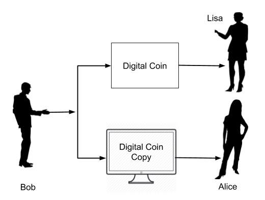
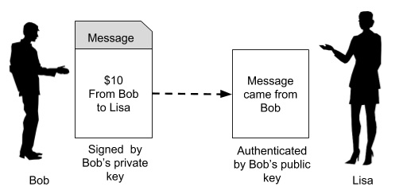
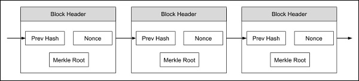

# Blockchain Tutorial

블록 체인 (blockchain)은 블록이라는 암호화 된 레코드 목록입니다. 각 블록은 이전 블록의 암호화 해시, 타임 스탬프 및 트랜잭션 데이터를 포함합니다. 요즘 Blockchain은 많은 인기를 얻고 있습니다. 이것이 바로 세계에서 가장 유명한 cryptocurrency 인 Bitcoin의 중추이기 때문입니다. 많은 정부와 선도 은행들은 Blockchain 개념을 기반으로하는 기존의 거래를 많이 가져 오기로 결정했습니다. 이 프레임 워크의 응용 프로그램과 잠재력은 거대하며 다양한 도메인에서 트랜잭션이 이루어지는 방식을 변경하는 것으로 간주됩니다.

# Audience

이 튜토리얼은 Blockchain의 기초를 배우고 자하는 전문가를 위해 준비되었습니다. Bitcoin Crypto Currency를 통해 Blockchain 개념을 설명하려고했습니다. 이 과정은 Blockchain 기술 분야에서 커리어를 쌓기를 희망하는 학생들과 전문가들에게 큰 이해를 제공 할 것입니다.

이 튜토리얼은 블록 체인 기술, cryptocurrency의 원동력 인 Bitcoin을 가르쳐 줄 것입니다. 암호화, 블록 생성 및 연결 프로세스, 네트워크 및 채광 및 블록 체인 (blockchain) 네트워크 설계를 포함한 블록 체인 기술과 관련된 많은 다른 개념을 배우게됩니다.

# Blockchain - Introduction

최근 몇 년 동안 Blockchain에는 많은 화제가 있습니다. 많은 사람들은 이것을 가장 파괴적인 기술로 묘사했습니다. 특히 금융 시장이 가장 큰 영향을 미칠 수 있습니다.

이 기술은 의료, 의약품, 보험, 스마트 속성, 자동차 및 심지어 정부와 같은 여러 분야에 적용되고 있습니다.

그러나 지금까지 Blockchain을 가장 성공적으로 구현 한 것은 Bitcoin - Peer-to-Peer 전자 현금 시스템으로, 블록 체인 기술의 첫 번째 구현이기도합니다. 따라서 블록 체인 기술을 이해하려면 Bitcoin 시스템이 어떻게 설계되고 구현되는지 이해하는 것이 가장 좋습니다.

이 기사에서는 Blockchain과 그 아키텍처, 구현 방법 및 다양한 기능에 대해 알아 봅니다. Blockchain의 복잡성을 설명하면서 Bitcoin 구현을 사이트에 배치 할 것입니다.

블록 체인 아키텍처는 그렇게 사소하지 않고 많은 사람들이 여러 기사를 포함하여 좋은 기사, 자습서를 작성했습니다. 초보자부터 전문가까지 다양한 잠재 고객이 있습니다. 이 튜토리얼에서는 블록 체인 아키텍처에 대한 개념적 이해에 중점을두고 초보자와 전문가 모두를 염두에 둔다. 블록 체인을 탐구하기 전에이 새로운 기술에 대한 필요성이 왜 나타나는지를 아는 것이 중요합니다. 이 질문에 대한 대답은 **이중 지출**로 알려져 있습니다.

# Blockchain - Double Spending

이미지에 나타난 상황을 고려해보십시오.

여기에서 분명히 알 수 있듯이 Bob은 책을 교환하면서 Lisa에게 10 달러짜리 지폐를 제출하고 있습니다. Lisa가이 실제 10 달러짜리 지폐를 받으면, 실제 통화가 Lisa가 소유하고 있기 때문에 Bob이이 돈을 다른 거래에 재사용 할 수있는 방법이 없습니다.

이제 돈이 디지털 형식으로 지급되는 상황을 고려해보십시오. 이것은 이미지에 묘사되어있다.

화폐 교환의 형식은 디지털 형식이므로 본질적으로 Bob의 장치 어딘가에 저장된 이진 실제 파일입니다. Bob이 Lisa에게이 파일 (디지털 돈)을 주면 Alice에게 파일 사본을 줄 수도 있습니다. 두 사람 모두 이제는 디지털 코인을 인증 할 방법이 없어도 돈을 받았고 따라서 각각의 상품을 밥에게 배달 할 것이라고 생각합니다. 이것은 발신자가 여러 공급 업체의 서비스 또는 물품을 얻기 위해 둘 이상의 장소에서 동일한 돈을 지출하는 이중 지출이라고합니다.

이중 지출 문제를 해결하기 위해 모든 거래를 모니터링하는 중앙 권한을 사용합니다. 이것은 이미지에 묘사되어있다.

일반적으로 귀하의 거래 은행 인 중앙 집중 형 기관은 모든 거래를 기록한 원장을 보유하고 있습니다. 이제 Bob은 그의 디지털 장을 은행에 보내야합니다. 그는 장부에 Bob의 계좌를 인출 할 항목을 입력해야합니다. Bob이 보내려고하는 디지털 화폐에 대해 지불 할 수있는 충분한 잔고가 있는지 확인한 후 Lisa에게 대금을 자신의 대장에 계좌로 입금합니다.

이제 Bob이 돈을 두 배로 쓸 수 없다는 보장이 있습니다. 모든 디지털 거래가 이와 같이 중앙 집중식 기관을 통해 라우팅되는 경우 이중 지출 문제가 해결됩니다. 이것은 또한 거래에서받는 각 동전 (디지털 화폐)의 진위 여부를 검증하는 또 다른 이점을 제공합니다. 그래서 가짜 돈 (복사본을 사용하여 앨리스에게 지불하는 밥의 경우와 같은 돈)이 쉽게 발견되어 유통되지 않게됩니다.

중앙 집중식 권위의 도입은 이중 지출 문제를 해결하지만 중앙 집중화 된 권위 자체를 창출하고 유지하는 비용과 같은 또 다른 주요 문제를 야기합니다.

은행은 업무를 위해 돈이 필요하기 때문에 고객을 위해하는 각각의 통화 거래에 대한 수수료를 삭감하기 시작합니다. 이것은 때로는 여러 에이전트 (은행)가 전체 거래에 관여 할 수있는 해외 송금에서 매우 비쌀 수 있습니다.

위의 모든 문제는 Bitcoin이라는 디지털 통화의 도입으로 해결됩니다. Bitcoin이 디자인과 아키텍처를 탐구하기 전에 Bitcoin이 무엇인지에 대한 간단한 배경을 알려 드리겠습니다.

# Bitcoin - Brief History

Bitcoin은 2008 년에 Bitcoin : 피어 - 투 - 피어 전자 현금 시스템이라는 제목의 연구 - 스타일 백서를 통해 나코모토 사토시 (Satoshi Nakamoto)에 의해이 세상에 소개되었습니다.

Bitcoin은 이중 지출 문제를 해결했을뿐만 아니라 더 많은 이점을 제공했습니다. 여기서 언급 할 가치가있는 장점 중 하나는 거래의 익명 성입니다. 체계를 창조하고이 체계에 몇몇 동전을 처리 한 Satoshi는 전 세계에 완전하게 익명이다.

이 소셜 미디어의 세계에서 각 개인의 사생활이 위험에 처해있을 때 세계는 지금까지 사토시가 누구인지 추적 할 수 없다고 상상해보십시오. 사실 우리는 사토시가 개인 이건 집단 이건간에 알지 못합니다. 인터넷 검색을 통해 나코모토 사토시 (Bitoshin Nakamoto)가 보유한 비트 코 (bitcoins)가 약 194 억 달러에 달한다는 사실이 드러났습니다.이 돈은 이제 Bitcoin 시스템에서 청구되지 않았습니다. Bitcoin은 무엇입니까?

## What is Bitcoin?

이전에 보았 듯이 은행은 각 거래를 기록하는 원장을 보유합니다. 이 원장은 비공개이며 은행에서 관리합니다. 사토시는이 장부를 공개하고 공동체가 유지하도록 제안했다.

이러한 원장을 공개하는 순간 몇 가지 고려 사항이 마음에들 것입니다. 이 원장은 아무도 자신의 출품작을 수정할 수 없도록 위조 방지 조치를 취해야합니다. 원장의 각 항목이 공개적으로 표시 될 때 익명 성을 유지하는 방법을 알아 내야합니다. 분명히 전 세계의 모든 사람들이 제가 100 만 달러를 지불했음을 알기를 원하지 않을 것입니다.

또한 세계의 모든 거래를 추적하는 단 하나의 원장이 있기 때문에 원장의 크기도 또 다른 큰 관심사입니다. 이러한 복잡한 문제에 대한 해결책을 제공하는 것은 쉽지 않은 일이며, 단순한 단어로 Bitcoin의 기본 아키텍처를 이해할 수 있도록 여기에서 시도하고 있습니다.

이 기본 아키텍처는 블록 체인이며이 튜토리얼의 내용입니다. Blockchain 아키텍처를 이해하려면 해당 블록 체인의 기반이되는 몇 가지 주요 기능을 이해해야합니다. PKI (공개 키 암호화)를 시작합시다.

# Blockchain - Public Key Cryptography

공개 키 암호화 또는 짧은 PKI에서 비대칭 암호화라고도합니다. 공개 키와 비공개 키의 두 쌍을 사용합니다. 키는 긴 이진수입니다. 공개 키는 전세계에 배포되며 이름에서 알 수 있듯이 공개됩니다. 개인 키는 엄격하게 개인적으로 보관해야하며 절대 잃어 버릴 수 없습니다.

Bitcoin의 경우 Bitcoin 지갑의 개인 키를 잃어 버리면 지갑의 전체 내용이 즉시 도난 당할 수 있으며이를 알기도 전에 모든 돈 (지갑 내용)은 사라집니다. 시스템에서 누가 그것을 훔쳤는지를 추적하는 메커니즘 - 이전에 언급 한 시스템의 익명 성입니다.

PKI는 암호화 / 암호 해독 메커니즘을 통해 인증 및 메시지 개인 정보 보호의 두 가지 기능을 수행합니다. 이제이 두 기능을 설명 할 것입니다.

## Authentication

두 당사자가 메시지를 교환 할 때 발신자와 수신자간에 신뢰를 설정하는 것이 중요합니다. 특히, 수신자는 메시지 소스를 신뢰해야합니다. 우리의 초기 시나리오 (그림 1 참조)에서 Lisa에게 돈을 보내고 그녀로부터 물건을 구입할 때 PKI가 Bob과 Lisa 사이에 어떻게 신뢰를 구축하는지 봅시다. 아래 그림을 봅시다.

첫 번째로, Bob이 Lisa에게 돈을 보내고 싶다면, 자신의 개인/공개 키를 만들어야합니다. 두 키는 항상 함께 쌍을 이루며 서로 다른 개인 또는 다른 인스턴스의 개인 키와 공개 키를 혼합 할 수 없습니다.

이제 Bob은 Lisa에게 10 달러를 보내고 있다고 말합니다. 그래서 그는 Bob (송신자) 공개 키, Lisa (수신자) 공개 키 및 금액 ($ 10)을 포함하는 메시지 (일반 텍스트 메시지)를 만듭니다.

\"나는 너에게서 호박을 사고 싶다\"와 같은이 송금의 목적도 메시지에 추가됩니다. 전체 메시지는 이제 Bob의 개인 키를 사용하여 서명됩니다. Lisa는이 메시지를 받으면 PKI의 서명 확인 알고리즘과 Bob의 공개 키를 사용하여 메시지가 실제로 Bob에서 유래되었는지 확인합니다. PKI 작동 방식은이 자습서의 범위를 벗어납니다. 관심있는 독자는 PKI에 대한 자세한 내용을 보려면이 사이트를 참조하십시오. 이것은 메시지 발신자의 진위를 확립합니다. 이제 메시지 프라이버시를 살펴 보겠습니다.

## Message Privacy

이제 Lisa가 지불금을 받으면서 Bob이 구입하려는 eBook에 링크를 보내려고합니다. 그래서 Lisa는 메시지를 만들어서 Bob에게 보냅니다.

Lisa는 \"요청한 내 전자 서적 링크입니다.\"와 같은 메시지를 작성하고 Bob의 요청 메시지에서받은 Bob의 공개 키로 서명하고 두 개의 메시지간에 공유되는 일부 비밀 키를 사용하여 메시지를 암호화합니다 HTTPS 핸드 셰이크 중.

이제 Lisa는 Bob만이 보유한 개인 키를 사용하여 메시지를 암호화 하며,  Bob 만이 메시지를 디코딩 할 수 있다고 확신합니다. 또한 메시지를 가로 챈 사람은 내용이 Bob과 Alice만이 보유한 비밀 키로 암호화되므로 내용을 복구 할 수 없습니다. 리사는 eBook에 대한 액세스가 Bob에게만 부여됨을 보장합니다.

PKI에 의해 암시 된 인증 및 메시지 개인 정보 보호 기능을 모두 보아서 Bitcoin이 \"Bitcoin이란 무엇인가?\"장에서 언급 한 공공 원장을 보호하기 위해 어떻게 PKC를 사용하는지 살펴 봅시다.

당신의 지식을 위해 - 가장 인기있는 PKI 알고리즘은 RSA와 ECDSA이고, Bitcoin은 후자를 사용합니다.

# Blockchain - Hashing

PKI에서 가장 중요한 기능 중 하나는 해시 기능입니다. 해시 함수는 임의의 크기의 데이터를 고정 된 크기의 데이터로 매핑합니다. Bitcoin은 크기 256 비트 (32 바이트)의 해시 (출력)를 생성하는 SHA-256 해시 함수를 사용합니다. 이것은 이미지에 묘사되어있다.

Bob은 Lisa와 함께 주문하는 동안 위에 표시된 것과 비슷한 메시지를 생성합니다. 이 메시지는 32 바이트 해시를 생성하는 해시 함수를 통해 해시됩니다. 이 해시의 장점은 모든 실제 목적을 위해 해시 (256 비트 숫자)가 메시지 내용에 대해 고유 한 것으로 간주된다는 것입니다. 메시지가 수정되면 해시 값이 변경됩니다. 주어진 해시 값뿐만 아니라 원본 메시지를 재구성하는 것은 불가능합니다.

해싱의 중요성을 알게 된 후 Bitcoin의 또 다른 개념 인 **광업, 채굴(mining)**으로 넘어 갑니다.

# Bitcoin - Mining

Bob이 Lisa에 대한 구매 요청을 할 때, Lisa에게 요청하지 않습니다. 오히려 요청 메시지는 그가 연결된 전체 네트워크에서 방송됩니다. Bob의 네트워크는 이미지로 묘사됩니다.

메시지는 연결된 모든 노드 (기계)로 이동합니다. 다이어그램의 일부 노드는 광부로 표시됩니다. 이들은 bitcoin 메시지를 마이닝하기위한 소프트웨어를 실행하는 기계입니다. 이 광산이 무엇을 의미하는지 지금 설명하겠습니다.

## Mining Process

전체 네트워크가 널리 보급됨에 따라 네트워크의 모든 광부는 특정 기간 동안 여러 공급 업체로부터 여러 메시지를받을 것으로 예상됩니다. 광부가하는 일은이 메시지를 하나의 블록에 결합하는 것입니다. 이것은 이미지에 묘사되어있다.

메시지 블록이 형성되면 광부는 앞에서 설명한 해시 함수를 사용하여 블록에 해시를 만듭니다. 이제 제 3자가이 블록의 내용을 수정했는지 알다시피 해시가 무효화됩니다. 덧붙여 말하자면, 각 메시지는 블록의 해시 값에 영향을 미치지 않으면 서 누구도 시간 순서를 수정할 수 없도록 타임 스탬프가 지정됩니다. 따라서 블록의 메시지는 변조로부터 완벽하게 보호됩니다. 이 사실이 네트워크의 모든 트랜잭션을 보호하는 데 어떻게 사용되는지 자세히 설명합니다.

# Blockchain - Chaining Blocks

다양한 광부들이 만든 블록은 서로 연결되어 진정한 분산 공공 장부로 알려진 블록을 형성합니다.

체인의 각 블록은 그림 8에서 볼 수 있듯이 여러 메시지 (트랜잭션)를 포함합니다. 체인의 블록은 모든 광부에서 올 수 있습니다. 블록 체인을 생성하는 동안 이전 블록의 해시가 현재 블록에 추가된다는 규칙을 준수합니다.

따라서 블록을 만드는 동안 광부는 체인의 마지막 블록의 해시를 선택하고 메시지의 고유 집합과 결합하여 새로 생성 된 블록에 대한 해시를 만듭니다. 이렇게 새로 생성 된 블록이 이제 체인의 새로운 끝이되어 광부가 블록을 추가함에 따라 체인이 계속 성장합니다.

# Blockchain - Proof of Work

모든 트랜잭션에 시간이 기록되므로 피어 투 피어 네트워크에 분산 타임 스탬프 서버를 구현해야합니다. 여기에는 몇 가지 추가 구현이 필요하며 지금 설명 할 작업 증명입니다. 각 블록에 아래 그림과 같이 Nonce라는 항목을 하나 더 추가합니다.

Nonce는 블록의 해시가 특정 기준을 충족시키는 숫자입니다. 이 기준은 생성 된 해시의 첫 번째 네 자리가 0이어야 함을 나타낼 수 있습니다.

따라서 생성 된 해시는 000010101010xxx와 같습니다. 일반적으로 광부는 Nonce 값이 0부터 시작하여 생성 된 해시가 지정된 기준을 충족 할 때까지 계속 증가시킵니다.

해시 생성은 무작위로 작동하며 제어 할 수 없습니다. 즉 해시 함수가 특정 해시를 생성하도록 할 수는 없습니다. 따라서 네 개의 선행 0이있는 원하는 해시가 생성 될 때까지 여러 번 반복 할 수 있습니다. 비트 코인 시스템에서 블록을 생성하는 예상 시간은 10 분입니다. 일단 광부가 블록을 성공적으로 채광하면 시스템에서이를 채취하여 체인의 마지막 블록으로 만듭니다.

합법적 인 블록을 생성하기 위해 경쟁하는 광부가 여러 명 있다는 점에 유의하십시오. 비트 코인 (Bitcoin) 시스템은 첫 번째 성공적인 광부에게 비트 코인을주는 상을 수여합니다. 일반적으로 더 많은 계산 능력을 갖춘 광부가 초기 승자가 될 수 있습니다. 이것은 거대한 처리 능력을 가진 사람들에 의한 전체 시스템에 대한 공격을 야기 할 수 있습니다. 공격을 설명하고이 공격이 이 자습서의 끝 부분에서 어떻게 완화되는지 설명합니다.

# Blockchain - Network & Mining

위에서 설명한 단계를 요약 해 보겠습니다. 이것은 네트워크에서 일어나는 일입니다.

- 네트워크를 통해 광고 한 제 3 자의 서비스를 얻으려는 사람은 먼저 트랜잭션 (원하는 수신자에게 보내는 메시지)을 만듭니다.
- 일정 기간 동안 이러한 거래를하는 많은 발신자 (구매자)와 수신자 (판매자)가있을 수 있습니다.
- 모든 트랜잭션은 네트워크에서 모든 노드로 브로드 캐스트됩니다. 주어진 트랜잭션이 네트워크의 다른 모든 노드에 도달해야 할 필요는 없습니다.
- 각 노드는 새 트랜잭션을 블록으로 어셈블합니다. 각 블록의 트랜잭션 집합은 다른 트랜잭션에 의해 생성 된 블록 세트와는 독립적이며 다른 트랜잭션 블록과 자연히 다릅니다. 이것은 중요하지 않습니다. 시스템은 합리적인 시간 동안 네트워크상의 모든 트랜잭션 브로드 캐스트가 일부 블록에 포함되도록 보장합니다. 일반적으로 보낸 사람은 광부에게 일정량의 비트 동전을 제공하여 노드에 대한 인센티브를 부여합니다. 광부는 인센티브가 높은 사람들에게 블록에 우선 순위를 부여 할 수 있습니다.
- 이제 노드는 조립 된 블록에 대한 작업 증명을 찾는 작업을합니다.
- 노드가 작업 증명을 찾으면 네트워크에서 조립 된 블록을 브로드 캐스트합니다.
- 새 블록을 수신하는 노드는 블록의 모든 트랜잭션이 유효하고 아직 소비되지 않았 음을 확인한 후에 만이를 수락합니다.
- 블록이 유효한 것으로 승인되면 자체 블록에서 작업중인 노드는 트랜잭션을 복제하지 않도록 해당 블록에서 트랜잭션을 다시 어셈블해야합니다. 이제 노드는 새로 생성 된 블록에서 작업 증명을 찾는 작업을합니다. 그렇게하는 동안 허용 된 블록의 해시를 이전 해시로 사용합니다.
- 마찬가지로 블록 체인은 계속해서 성장합니다.

이제 전체 시스템이 어떻게 작동하는지 보았으므로 몇 가지 부작용과 해결 방법을 설명하겠습니다.

# Blockchain - Incentives to Miners

Bitcoin-Mining 장에서 보았 듯이, 광부는 주어진 기간 동안 많은 거래로 넘쳐날 수 있습니다. 블록의 최대 크기는 시스템에서 사전 정의되어 특정 수의 트랜잭션 만 블록에 포함되도록합니다.

블록의 트랜잭션 수는 미리 정의 된 블록 크기와 각 블록의 평균 길이에 의해 결정됩니다. 여기에서 중요한 팁은 보낸 사람이 메시지에 너무 많은 정보를 포함  시키지 말아야 합니다,  짧은 메시지를 만들어서 다른 긴 메시지보다 먼저 광부가 받아 들이도록 하여야한다는 것을 의미합니다.

보낸 사람은 일반적으로 특정 비트 코스트의 관점에서 거래 수수료를 추가하여 광부가 그의 블록에 일찍 포함되도록 인센티브를 부여합니다.

블록 체인을 구축 할 때의 또 다른 결과는 단순한 크기입니다. 일정 기간 동안 전체 블록 체인이 노드에서 디스크에 저장하기에는 너무 커질 수 있습니다. 이것은 다음에 설명하는 Merkle Tree를 사용하여 해결됩니다.

# Blockchain - Merkle Tree

노드의 디스크 공간 문제는 블록의 모든 트랜잭션이 이미지와 같이 Merkle Tree에서 해싱되기 때문에 쉽게 극복됩니다.

이제 블록 헤더에는 Merkle Tree의 현재 블록에있는 모든 트랜잭션의 이전 블록 해시, Nonce 및 루트 해시가 포함됩니다. 이 루트 해시에는 블록 내의 모든 트랜잭션의 해시가 포함되므로 이러한 트랜잭션을 디스크 공간을 절약하기 위해 정리할 수 있습니다. 이제 블록 체인은 아래 이미지처럼 보일 것입니다.

이로 인해 디스크 공간을 많이 절약 할 수 있습니다. 이 전략은 다른 고객으로부터 지급금을받는 것에 관심이있는 일반 고객이 사용합니다. **그러나 광부는 전체 블록 체인을 저장**해야합니다. 이제 수신자가 수신 된 동전의 출처를 추적 할 수있는 능력이 없어도 수신자가 지불을 확인하는 방법에 대한 질문이 제기됩니다. 이것은 다음에 설명됩니다.

# Blockchain - Payment Verification

공급 업체로서 과거에 이루어진 특정 지불액을 확인하기를 원할 수도 있습니다. 이전 그림에 표시된 것처럼 블록 헤더 만 포함되어 있으므로 검색중인 트랜잭션이 블록 체인 복사본에 없습니다.

이제 원하는 트랜잭션이 타임 스탬프 된 블록을 찾을 때까지 블록 체인 복사본에서 거꾸로 검색 할 수 있습니다. 이제 선택한 블록의 Merkle 트리를 요청하면 찾고있는 트랜잭션이 생깁니다. 이것은 아래 그림에 나와 있습니다.

여기서는 Tx103을 찾고 있다고 가정합니다. Tx103의 내용을 볼 수는 없지만 체인이 속한 블록과 체인의 모든 후속 블록에서이 내용이 수용되었음을 알 수 있습니다. 따라서이 거래를 안전하게 신뢰하고 사업을 진행할 수 있습니다.

# Blockchain - Resolving Conflicts

우리가 본 Bitcoin 네트워크에는 여러 광부가 있습니다. 두 명의 다른 광부가 동시에 작업 증명을 풀어 체인의 마지막 블록에 블록을 추가하는 것이 가능합니다. 이것은 아래 그림에 나와 있습니다.

이제 블록 3 다음에 두 개의 분기가 있습니다. 두 가지 분기가 모두 유효합니다. 따라서 다음 채굴 된 블록은 분기 중 하나에 추가 될 수 있습니다. 광부가 새로 채광 한 블록을 블록 104-A에 추가한다고 가정하면, 블록 104-A를 포함하는 브랜치는 블록 104-B를 포함하는 브랜치보다 길다. 이것은 아래 그림에 나와 있습니다.

Bitcoin 아키텍처에서 가장 긴 분기가 항상 이기고 더 짧은 분기가 제거됩니다. 따라서 블록 (104-B)은 제거되어야한다. 이 블록을 제거하기 전에이 블록의 모든 트랜잭션이 트랜잭션 풀로 반환되어 채굴되고 이후의 일부 블록에 추가됩니다. 이것은 충돌이 해결되고 단일 블록 체인 만 시스템에서 유지 관리하는 방식입니다.

# Blockchain - Privacy

모든 비트 코인 거래를 기록하는 장부가 공개로 설정됨에 따라 프라이버시가 위태로워졌습니다. 누가 세계 어느 누구에게 돈을 지불했는지 알 수 있습니까? 전통적인 은행 시스템은 기록을 기밀로 유지함으로써 이러한 종류의 프라이버시를 유지할 수 있습니다.

Bitcoin 시스템의 개인 정보 보호는 다른 전략에 의해 달성됩니다. 우리는 비트 코인를 보낸 사람이 누구에게 지불해야 하는지를 알아야한다고 말했습니다. 그래서 그는 지불하고자하는 공급 업체의 공개 키를 요구합니다. 이 공개 키는 익명 일 수 있습니다.

그 의미에서, 일부 서비스의 공급 업체로서, 누군가가 지불 할 곳을 묻는다면, 그에게 공개 키를 보내면됩니다. 이 공개 키와 귀하와의 연결은 원장의 아무 곳에 나 기록되지 않습니다. 그렇게하면이 거래가 아닌 사람은 얼마나 많은 돈이 거래되고 어느 공개 키로 돈이 지불되는지 알 수 있습니다.

프라이버시를 높이기 위해 모든 거래마다 각 거래마다 새로운 개인/공개 키를 생성 할 수 있으므로 귀하가 만든 여러 거래를 제 3자가 함께 그룹화 할 수 없습니다. 외부인의 경우, 이는 더 작은 값의 여러 트랜잭션이 만들어지고 공통 소스에 연결되지 않음을 의미합니다.

마지막으로 온라인 인터넷 기반 시스템은 악용에 취약합니다. 이제 Bitcoin 시스템에 대한 가능한 공격 유형과 그 완화 방법에 대해 설명합니다.

# Bitcoin - Mitigating Attacks

Bitcoin 시스템에서 세 가지 유형의 공격 가능성에 대해 논의 할 것입니다.

## Race Attack

공격자는 서로 다른 두 대의 기계를 사용하여 코인을 서로 다른 공급 업체에 신속하게 보낼 수 있습니다. 공급 업체가 상품을 인도하기 전에 블록 확인을 기다리지 않으면 곧 채굴 작업중에 거래가 거부되었음을 알게 될 것입니다. 이러한 종류의 공격에 대한 해결책은 공급 업체가 물품을 보내기 전에 적어도 하나의 블록 확인을 기다려야한다는 것입니다.

## Finney Attack

이 경우 공격자는 광부입니다. 광부는 거래와 함께 블록을 채취하고 시스템에서이를 해제하지 않습니다. 그는 이제 두 번째 트랜잭션에서 동일한 동전을 사용한 다음 사전 채광 블록을 해제합니다. 분명히 두 번째 거래는 다른 광부들에 의해 결국 거절 될 것이지만 이것은 약간의 시간이 걸릴 것입니다. 이러한 위험을 줄이기 위해 판매자는 물건을 내놓기 전에 적어도 6 번 블록 확인을 기다려야합니다.

## The 51% Attack

이러한 종류의 공격에서 우리는 누군가가 네트워크의 컴퓨팅 능력의 51 %를 소유한다는 비현실적인 가정을 생각해냅니다. 이런 종류의 공격에서 공격자는 동전을 두 배 소비하는 사설 블록 체인을 채굴합니다.

그는 컴퓨팅 능력의 대부분을 소유하고 있기 때문에 어떤 시점에서 사적인 블록 체인이 \"정직한\"네트워크 사슬보다 길다는 보장을받습니다. 그런 다음 시스템에서 사적인 블록 체인을 해제하여 정직한 블록 체인에 기록 된 모든 트랜잭션을 무효화합니다.

이러한 종류의 공격은 전체 네트워크의 컴퓨팅 성능의 51 %와 같거나 초과하는 컴퓨팅 성능을 확보하는 데 매우 비쌉니다.

# Blockchain - Conclusion

이 짧은 자습서에서는 Bitcoin을 사례 연구로 사용하여 Blockchain의 여러 개념을 소개했습니다. Bitcoin은 블록 체인을 처음으로 성공적으로 구현 한 것입니다. 오늘날, 세계는 중앙 집중식 권위를 수반하지 않는 신뢰가 요구되는 여러 산업 분야에서 블록 체인 기술의 적용을 발견했습니다. Blockchain의 세계에 오신 것을 환영합니다.

**끝**

