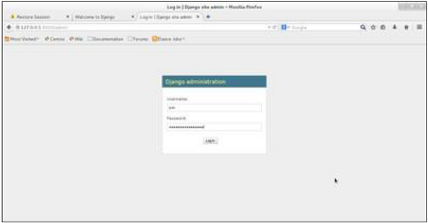
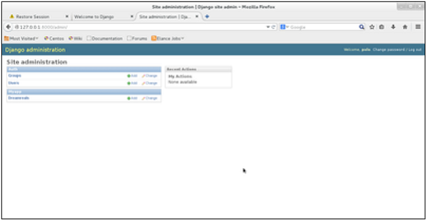
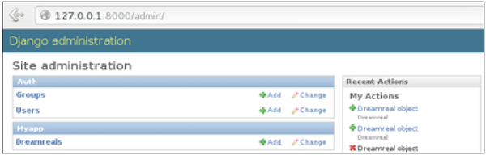
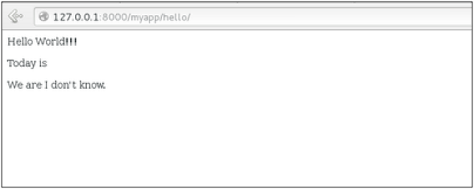
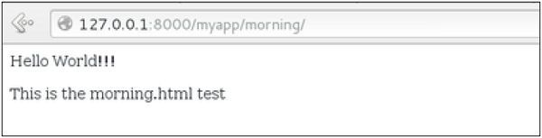
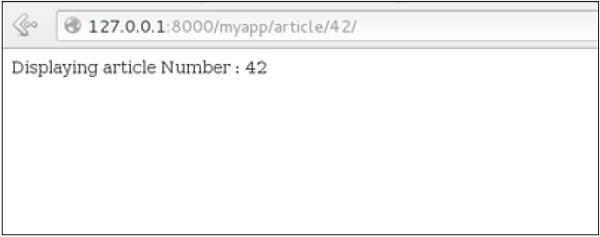
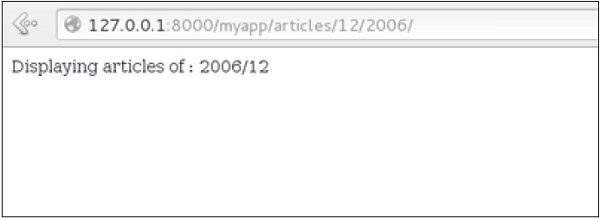
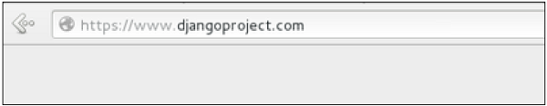
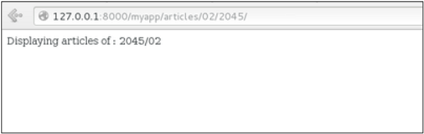
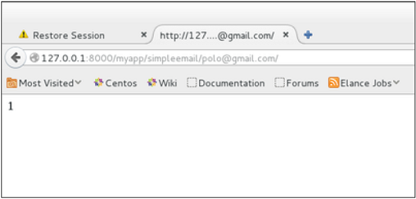

# Django Tutorial

출처: https://www.tutorialspoint.com/django/index.htm

Django는 웹 개발 프레임 워크로 양질의 웹 애플리케이션을 구축하고 유지 관리하는 데 도움을줍니다. Django는 반복적 인 작업을 제거하여 개발 프로세스를 쉽고 시간 절약적인 경험으로 만듭니다. 이 튜토리얼은 Django에 대한 완전한 이해를 제공합니다.


### Audience

이 튜토리얼은 Django가 제공하는 스마트 기술과 도구를 사용하여 고품질 웹 애플리케이션을 개발하는 방법을 배우려는 개발자를 위해 설계되었습니다.


### Prerequisites

계속 진행하기 전에 절차 및 객체 지향 프로그래밍의 기본 사항 (제어 구조, 데이터 구조 및 변수, 클래스, 객체 등)을 이해해야합니다.


## Django - Basics

Django는 빠른 개발과 깨끗하고 실용적인 디자인을 장려하는 고급 Python 웹 프레임 워크입니다. Django는 더 적은 코드로 더 나은 웹 앱을 더 쉽고 빠르게 구축 할 수 있도록합니다.

**Note** - Django는 Django Software Foundation의 등록 상표이며 BSD 라이센스에 따라 라이센스가 부여됩니다.


### History of Django

- 2003-Adrian Holovaty와 Simon Willison이 Lawrence Journal-World 신문의 내부 프로젝트로 시작했습니다.
- 2005-2005 년 7 월에 출시되어 재즈 기타리스트 인 장고 라인 하르트의 이름을 따서 장고로 명명했습니다.
- 2005-트래픽이 많은 여러 사이트를 처리 할 수있을만큼 성숙합니다.
- 현재-Django는 이제 전 세계에 기여자가있는 오픈 소스 프로젝트입니다.


### Django – Design Philosophies

장고에는 다음과 같은 디자인 철학이 있습니다.

- 느슨하게 결합-장고는 스택의 각 요소를 다른 요소와 독립적으로 만드는 것을 목표로합니다.
- 적은 코딩-적은 코드로 빠른 개발.
- 스스로 반복하지 마십시오 (DRY)-모든 것이 반복해서 반복되는 것이 아니라 정확히 한 곳에서만 개발되어야합니다.
- 빠른 개발-장고의 철학은 초고속 개발을 촉진하기 위해 가능한 모든 것을하는 것입니다.
- 깔끔한 디자인-Django는 자체 코드 전체에서 깔끔한 디자인을 엄격하게 유지하며 최상의 웹 개발 방법을 쉽게 따를 수 있습니다.


### Advantages of Django

Django를 사용하면 다음과 같은 장점이 있습니다.

- ORM (Object-Relational Mapping) 지원-Django는 데이터 모델과 데이터베이스 엔진 간의 브리지를 제공하며 MySQL, Oracle, Postgres 등을 포함한 대규모 데이터베이스 시스템을 지원합니다. Django는 Django-nonrel 포크를 통해 NoSQL 데이터베이스도 지원합니다. 현재 지원되는 유일한 NoSQL 데이터베이스는 MongoDB 및 Google 앱 엔진입니다.
- 다국어 지원 – Django는 내장 국제화 시스템을 통해 다국어 웹 사이트를 지원합니다. 따라서 여러 언어를 지원하는 웹 사이트를 개발할 수 있습니다.
- 프레임 워크 지원-Django는 Ajax, RSS, 캐싱 및 기타 다양한 프레임 워크를 기본적으로 지원합니다.
- 관리 GUI-Django는 관리 활동을위한 사용하기 편리한 사용자 인터페이스를 제공합니다.
- 개발 환경-Django는 엔드 투 엔드 애플리케이션 개발 및 테스트를 용이하게하는 경량 웹 서버와 함께 제공됩니다.


## Django - Overview

이미 알고 있듯이 Django는 Python 웹 프레임 워크입니다. 그리고 대부분의 최신 프레임 워크와 마찬가지로 Django는 MVC 패턴을 지원합니다. 먼저 MVC (Model-View-Controller) 패턴이 무엇인지 살펴보고 MVT (Model-View-Template) 패턴에 대한 Django의 특이성을 살펴 보겠습니다.


### MVC Pattern

UI (웹 또는 데스크톱)를 제공하는 응용 프로그램에 대해 이야기 할 때 일반적으로 MVC 아키텍처에 대해 이야기합니다. 이름에서 알 수 있듯이 MVC 패턴은 Model, View 및 Controller의 세 가지 구성 요소를 기반으로합니다. 자세한 내용은 MVC 튜토리얼을 확인하십시오.


### DJANGO MVC - MVT Pattern

MVT (Model-View-Template)는 MVC와 약간 다릅니다. 실제로 두 패턴의 주요 차이점은 Django 자체가 컨트롤러 부분 (모델과 뷰 간의 상호 작용을 제어하는 소프트웨어 코드)을 관리하여 템플릿을 남겨둔다는 것입니다. 템플릿은 Django 템플릿 언어 (DTL)와 혼합 된 HTML 파일입니다.

다음 다이어그램은 MVT 패턴의 각 구성 요소가 서로 상호 작용하여 사용자 요청을 처리하는 방법을 보여줍니다.


개발자는 모델, 뷰 및 템플릿을 제공 한 다음 URL에 매핑하기 만하면 장고는 마법을 사용하여 사용자에게 제공합니다.


## Django - Environment

Django 개발 환경은 Python, Django 및 데이터베이스 시스템 설치 및 설정으로 구성됩니다. Django는 웹 응용 프로그램을 다루므로 웹 서버 설정도 필요하다는 점을 언급 할 가치가 있습니다.


### Step 1 – Installing Python

Django는 100 % 순수 Python 코드로 작성되었으므로 시스템에 Python을 설치해야합니다. 최신 Django 버전에는 Python 2.6.5 이상이 필요합니다

최신 Linux 또는 Mac OS X 배포판 중 하나 인 경우 이미 Python이 설치되어있을 것입니다. 명령 프롬프트에서 python 명령을 입력하여 확인할 수 있습니다. 이와 같은 것이 보이면 파이썬이 설치된 것입니다.

``` bash
$ python
Python 2.7.5 (default, Jun 17 2014, 18:11:42)
[GCC 4.8.2 20140120 (Red Hat 4.8.2-16)] on linux2
```

그렇지 않으면 링크에서 최신 버전의 Python을 다운로드하여 설치할 수 있습니다 . [http://www.python.org/download](https://www.python.org/downloads/).


### Step 2 - Installing Django

장고 설치는 매우 쉽지만 설치에 필요한 단계는 운영 체제에 따라 다릅니다. Python은 플랫폼 독립적 언어이므로 Django에는 운영 체제에 관계없이 모든 곳에서 작동하는 하나의 패키지가 있습니다.

링크에서 최신 버전의 Django를 다운로드 할 수 있습니다.  [http://www.djangoproject.com/download](https://www.djangoproject.com/download/).


#### UNIX/Linux and Mac OS X Installation

Linux 또는 Mac OS 시스템을 실행하는 경우 Django를 설치하는 두 가지 방법이 있습니다-

- OS의 패키지 관리자를 사용하거나 easy_install 또는 pip (설치된 경우)를 사용할 수 있습니다.
- 이전에 다운로드 한 공식 아카이브를 사용하여 수동으로 설치하십시오.

첫 번째 옵션은 OS 배포에 따라 두 번째 옵션을 다룹니다. 첫 번째 옵션을 따르기로 결정했다면 설치중인 Django 버전에주의하십시오.

위 링크에서 아카이브를 받았다고 가정하면 Django-x.xx.tar.gz와 같은 것이어야합니다.

압축 해제 하고 설치 합니다.

```bash
$ tar xzvf Django-x.xx.tar.gz
$ cd Django-x.xx
$ sudo python setup.py install
```

이 명령을 실행하여 설치를 테스트 할 수 있습니다-

``` bash
$ django-admin.py --version
```

화면에 Django의 현재 버전이 인쇄되어 있으면 모든 것이 설정된 것입니다.

주 – Django의 일부 버전에서는 django-admin이되며 '.py'는 제거됩니다.


#### Windows Installation

Django 아카이브와 Python이 컴퓨터에 설치되어 있다고 가정합니다.

먼저 PATH 검증.

일부 버전의 windows (Windows 7)에서는 경로 시스템 변수에 경로가 다음 C:\\Python34\\;C:\\Python34\\Lib\\site-packages\\django\\bin\\ 경로인지 확인해야합니다. 파이썬 버전에 따라.

그런 다음 Django를 추출하여 설치하십시오.

```bash
c:\>cd c:\Django-x.xx
```

그런 다음 Windows 셸 'cmd'에서 관리자 권한이 필요한 다음 명령을 실행하여 Django를 설치하십시오.

```bash
c:\Django-x.xx>python setup.py install
```

설치를 테스트하려면 명령 프롬프트를 열고 다음 명령을 입력하십시오-

```bash
c:\>python -c "import django; print(django.get_version())"
```

Django의 현재 버전이 화면에 인쇄되면 모든 것이 설정됩니다.

또는

'cmd'프롬프트를 시작하고 python을 입력 한 다음-

```cmd
c:\> python
>>> import django
>>> django.VERSION
```


### Step 3 – Database Setup

Django는 여러 주요 데이터베이스 엔진을 지원하며 사용자의 편의에 따라 엔진을 설정할 수 있습니다.

- [MySQL (http://www.mysql.com/)](http://www.mysql.com/)
- [PostgreSQL (http://www.postgresql.org/)](http://www.postgresql.org/)
- [SQLite 3 (http://www.sqlite.org/)](http://www.sqlite.org/)
- [Oracle (http://www.oracle.com/)](http://www.oracle.com/index.html)
- [MongoDb (https://django-mongodb-engine.readthedocs.org)](https://django-mongodb-engine.readthedocs.org/en/latest/)
- [GoogleAppEngine Datastore (https://cloud.google.com/appengine/articles/django-nonrel)](https://cloud.google.com/appengine/articles/django-nonrel)


선택한 데이터베이스 설치 및 구성에 대해서는 해당 설명서를 참조하십시오.

참조 : 5 번과 6 번은 NoSQL 데이터베이스입니다.


### Step 4 – Web Server

Django는 응용 프로그램 개발 및 테스트를위한 경량 웹 서버와 함께 제공됩니다. 이 서버는 Django와 함께 작동하도록 미리 구성되어 있으며, 더 중요한 것은 코드를 수정할 때마다 다시 시작됩니다.

그러나 Django는 Apache 및 Lighttpd와 같은 널리 사용되는 웹 서버를 지원합니다. 우리는 다른 장들과 함께 일하면서 다음 장의 두 가지 접근법에 대해 논의 할 것입니다.


## Django - Creating a Project

Django를 설치 했으므로 이제 사용을 시작하겠습니다. Django에서는 생성하려는 모든 웹 앱을 프로젝트라고합니다. 프로젝트는 응용 프로그램의 합계입니다. 응용 프로그램은 MVT 패턴에 의존하는 코드 파일 세트입니다. 예를 들어 웹 사이트를 만들고 싶다고 가정하고 웹 사이트는 프로젝트이며 포럼, 뉴스, 연락 엔진은 응용 프로그램입니다. 이 구조는 모든 응용 프로그램이 독립적이기 때문에 프로젝트간에 응용 프로그램을보다 쉽게 이동할 수 있습니다.


### Create a Project

Windows 또는 Linux에 관계없이 터미널이나 cmd 프롬프트를 가져 와서 프로젝트를 만들 위치로 이동 한 다음이 코드를 사용하십시오-

``` bash
$ django-admin startproject myproject
```

이것은 다음 구조를 가진 'myproject'폴더를 만듭니다-

```
myproject/
   manage.py
   myproject/
      __init__.py
      settings.py
      urls.py
      wsgi.py
```


### The Project Structure

'myproject'폴더는 프로젝트 컨테이너 일 뿐이며 실제로 두 가지 요소를 포함합니다.

- manage.py-이 파일은 명령 행을 통해 프로젝트와 상호 작용하기위한 일종의 프로젝트 로컬 django-admin입니다 (개발 서버 시작, 동기화 db ...). Manage.py를 통해 액세스 가능한 전체 명령 목록을 얻으려면 코드를 사용할 수 있습니다-

``` bash
$ python manage.py help
```

- “myproject”하위 폴더 –이 폴더는 프로젝트의 실제 파이썬 패키지입니다. 그것은 네 개의 파일이 포함되어 있습니다-
  - "_ _init _ _".py-파이썬에서만이 폴더를 패키지로 취급하십시오.
  - settings.py-이름에서 알 수 있듯이 프로젝트 설정.
  - urls.py-프로젝트의 모든 링크와 호출 할 함수 프로젝트의 일종의 목차.
  - wsgi.py − WSGI를 통해 프로젝트를 배포해야하는 경우


### Setting Up Your Project

프로젝트는 myproject/settings.py 하위 폴더에 설정되어 있습니다. 다음은 설정해야 할 중요한 옵션입니다.

```python
DEBUG = True
```

이 옵션을 사용하면 프로젝트가 디버그 모드인지 여부를 설정할 수 있습니다. 디버그 모드를 사용하면 프로젝트 오류에 대한 자세한 정보를 얻을 수 있습니다. 라이브 프로젝트를 위해 절대 'True'로 설정하지 마십시오. 그러나 Django 라이트 서버가 정적 파일을 제공하도록하려면이 값을 '참'으로 설정해야합니다. 개발 모드에서만 수행하십시오.

```python
DATABASES = {
   'default': {
      'ENGINE': 'django.db.backends.sqlite3',
      'NAME': 'database.sql',
      'USER': '',
      'PASSWORD': '',
      'HOST': '',
      'PORT': '',
   }
}
```

데이터베이스는‘데이터베이스’사전에 설정되어 있습니다. 위의 예는 SQLite 엔진에 대한 것입니다. 앞서 언급했듯이 Django는 다음을 지원합니다.

- MySQL (django.db.backends.mysql)
- PostGreSQL (django.db.backends.postgresql_psycopg2)
- Oracle (django.db.backends.oracle) and NoSQL DB
- MongoDB (django_mongodb_engine)

새 엔진을 설정하기 전에 올바른 db 드라이버가 설치되어 있는지 확인하십시오.

TIME_ZONE, LANGUAGE_CODE, TEMPLATE…와 같은 다른 옵션을 설정할 수도 있습니다.

이제 프로젝트가 생성되고 구성되었으므로 작동하는지 확인하십시오-

``` bash
$ python manage.py runserver
```


위의 코드를 실행하면 다음과 같은 것을 얻을 수 있습니다-

``` bash
Validating models...

0 errors found
September 03, 2015 - 11:41:50
Django version 1.6.11, using settings 'myproject.settings'
Starting development server at http://127.0.0.1:8000/
Quit the server with CONTROL-C.
```


## Django - Apps Life Cycle

프로젝트는 많은 응용 프로그램의 합계입니다. 모든 응용 프로그램에는 목표가 있으며 웹 사이트의 연락처 양식이 응용 프로그램이 될 수 있고 다른 사람이 재사용 할 수있는 것처럼 다른 프로젝트에 재사용 할 수 있습니다. 프로젝트의 모듈로 참조하십시오.


### Create an Application

프로젝트 폴더에 있다고 가정합니다. 기본“myproject”폴더에서 동일한 폴더와 manage.py

``` bash
$ python manage.py startapp myapp
```

방금 myapp 응용 프로그램을 만들었고 프로젝트와 마찬가지로 Django는 응용 프로그램 구조로“myapp”폴더를 만듭니다.

```
myapp/
   __init__.py
   admin.py
   models.py
   tests.py
   views.py
```

- `__init__.py` − 파이썬 이이 폴더를 패키지로 처리하도록하십시오.
- **admin.py** − 이 파일을 통해 관리자 인터페이스에서 앱을 수정할 수 있습니다.
- **models.py** − 여기에는 모든 응용 프로그램 모델이 저장됩니다.
- **tests.py** − 이것은 당신의 단위 테스트가있는 곳입니다.
- **views.py** − 애플리케이션 뷰가있는 곳입니다.


### Get the Project to Know About Your Application

이 단계에서 우리는 'myapp'응용 프로그램을 가지고 있습니다. 이제 Django 프로젝트 'myproject'에 등록해야합니다. 이렇게하려면 프로젝트의 settings.py 파일에서 INSTALLED_APPS 튜플을 업데이트하십시오 (앱 이름 추가)-

``` python
INSTALLED_APPS = (
   'django.contrib.admin',
   'django.contrib.auth',
   'django.contrib.contenttypes',
   'django.contrib.sessions',
   'django.contrib.messages',
   'django.contrib.staticfiles',
   'myapp',
)
```


## Django - Admin Interface

Django는 관리 활동을위한 즉시 사용 가능한 사용자 인터페이스를 제공합니다. 우리 모두는 웹 프로젝트에서 관리자 인터페이스가 어떻게 중요한지 알고 있습니다. Django는 프로젝트 모델을 기반으로 관리 UI를 자동으로 생성합니다.


### Starting the Admin Interface

관리 인터페이스는 django.countrib 모듈에 따라 다릅니다. 제대로 작동하려면 myproject / settings.py 파일의 INSTALLED_APPS 및 MIDDLEWARE_CLASSES 튜플에서 일부 모듈을 가져와야합니다.

INSTALLED_APPS의 경우-

``` python
INSTALLED_APPS = (
   'django.contrib.admin',
   'django.contrib.auth',
   'django.contrib.contenttypes',
   'django.contrib.sessions',
   'django.contrib.messages',
   'django.contrib.staticfiles',
   'myapp',
)
```

MIDDLEWARE_CLASSES의 경우-

```python
MIDDLEWARE_CLASSES = (
   'django.contrib.sessions.middleware.SessionMiddleware',
   'django.middleware.common.CommonMiddleware',
   'django.middleware.csrf.CsrfViewMiddleware',
   'django.contrib.auth.middleware.AuthenticationMiddleware',
   'django.contrib.messages.middleware.MessageMiddleware',
   'django.middleware.clickjacking.XFrameOptionsMiddleware',
)
```

서버를 시작하기 전에 관리 인터페이스에 액세스하려면 데이터베이스를 시작해야합니다-

``` bash
$ python manage.py migrate
```

syncdb는 관리 인터페이스를 실행하는 데 필요한 db 유형에 따라 필요한 테이블 또는 컬렉션을 만듭니다. 수퍼 유저가없는 경우에도 수퍼 유저를 작성하라는 메시지가 표시됩니다.

이미 수퍼 유저가 있거나 잊어 버린 경우 언제든지 다음 코드를 사용하여 수퍼 유저를 만들 수 있습니다.

``` bash
$ python manage.py createsuperuser
```

관리 인터페이스를 시작하려면 관리 인터페이스에 대한 URL을 구성해야합니다. myproject / url.py를 열고 다음과 같은 것이 있어야합니다-

``` python
from django.conf.urls import patterns, include, url

from django.contrib import admin
admin.autodiscover()

urlpatterns = patterns('',
   # Examples:
   # url(r'^$', 'myproject.views.home', name = 'home'),
   # url(r'^blog/', include('blog.urls')),

   url(r'^admin/', include(admin.site.urls)),
)
```

이제 서버를 실행하십시오.

``` bash
$ python manage.py runserver
```

관리자 인터페이스는 다음에서 액세스 할 수 있습니다.  http://127.0.0.1:8000/admin/



슈퍼 유저 계정에 연결되면 다음 화면이 표시됩니다-



이 인터페이스를 통해 Django 그룹 및 사용자와 앱에 등록 된 모든 모델을 관리 할 수 있습니다. 인터페이스는 모델에서 최소한 'CRUD'(만들기, 읽기, 업데이트, 삭제) 작업을 수행 할 수있는 기능을 제공합니다.


## Django - Creating Views

보기 함수 또는 간단히 '보기'는 단순히 웹 요청을 받아 웹 응답을 반환하는 Python 함수입니다. 이 응답은 웹 페이지의 HTML 내용, 리디렉션, 404 오류 또는 XML 문서 또는 이미지 등일 수 있습니다. 예 :보기를 사용하여 웹 페이지를 작성하고보기를 연관시켜야합니다. 웹 페이지로 보려면 URL로 연결하십시오.

장고에서는 앱 views.py 파일에 뷰를 생성해야합니다.


### Simple View

myapp에서 '"welcome to my app!'라는 간단한보기를 만듭니다.

다음보기를 참조하십시오-

``` python
from django.http import HttpResponse

def hello(request):
   text = """<h1>welcome to my app !</h1>"""
   return HttpResponse(text)
```

이 뷰에서 HttpResponse를 사용하여 HTML을 렌더링합니다 (아마도 HTML 하드 코딩 된 뷰가 있음). 이보기를 페이지로 보려면 URL에 매핑하기 만하면됩니다 (다음 장에서 설명).

HttpResponse를 사용하여 뷰에서 HTML을 렌더링했습니다. 페이지를 렌더링하는 가장 좋은 방법은 아닙니다. Django는 MVT 패턴을 지원하므로 선행 뷰를 만들려면 Django-MVT와 마찬가지로 다음이 필요합니다.

템플릿 : myapp / templates / hello.html

이제 우리의 관점은 다음과 같습니다-

``` python
from django.shortcuts import render

def hello(request):
   return render(request, "myapp/template/hello.html", {})
```

뷰는 매개 변수를 사용할 수 있습니다-

``` python
from django.http import HttpResponse

def hello(request, number):
   text = "<h1>welcome to my app number %s!</h1>"% number
   return HttpResponse(text)
```

URL에 연결되면 페이지에 매개 변수로 전달 된 숫자가 표시됩니다. 매개 변수는 URL을 통해 전달됩니다 (다음 장에서 설명).


## Django - URL Mapping

이제 우리는 이전 장에서 설명한 작업 뷰를 가졌습니다. URL을 통해 해당 뷰에 액세스하려고합니다. Django는 고유 한 URL 맵핑 방법을 가지고 있으며 프로젝트 url.py 파일 (myproject / url.py)을 편집하여 수행됩니다. Url.py 파일은 다음과 같습니다-

``` python
from django.conf.urls import patterns, include, url
from django.contrib import admin
admin.autodiscover()

urlpatterns = patterns('',
   #Examples
   #url(r'^$', 'myproject.view.home', name = 'home'),
   #url(r'^blog/', include('blog.urls')),

   url(r'^admin', include(admin.site.urls)),
)
```

사용자가 웹앱에서 페이지를 요청하면 Django 컨트롤러가 url.py 파일을 통해 해당보기를 찾은 다음 HTML 응답 또는 404를 찾을 수 없음 오류를 반환합니다. Url.py에서 가장 중요한 것은 'urlpatterns'튜플입니다. URL과보기 간의 매핑을 정의하는 곳입니다. 매핑은 다음과 같은 URL 패턴의 튜플입니다.

``` python
from django.conf.urls import patterns, include, url
from django.contrib import admin
admin.autodiscover()

urlpatterns = patterns('',
   #Examples
   #url(r'^$', 'myproject.view.home', name = 'home'),
   #url(r'^blog/', include('blog.urls')),

   url(r'^admin', include(admin.site.urls)),
   url(r'^hello/', 'myapp.views.hello', name = 'hello'),
)
```

표시된 행은 URL '/ home'을 myapp / view.py 파일에서 작성된 hello보기에 맵핑합니다. 위에서 볼 수 있듯이 매핑은 세 가지 요소로 구성됩니다.

- **The pattern** −  해결하고 매핑하려는 URL과 일치하는 정규 표현식. Python 're'모듈에서 작동 할 수있는 모든 것은 패턴에 적합합니다 (url을 통해 매개 변수를 전달하려는 경우에 유용함).
- **The python path to the view** −  모듈을 가져올 때와 동일합니다.
- **The name** − URL 반전을 수행하려면 위 예에서와 같이 이름이 지정된 URL 패턴을 사용해야합니다. 완료되면 서버를 시작하여 다음을 통해보기에 액세스하십시오 : http://127.0.0.1/hello


### Organizing Your URLs

지금까지“myprojects / url.py”파일에 URL을 만들었지 만 장고에 대해 앞서 언급하고 앱을 만들 때 다른 프로젝트에서 응용 프로그램을 재사용 할 수있는 것이 가장 좋습니다. 모든 URL을 'projecturl.py'파일에 저장하면 문제가 무엇인지 쉽게 확인할 수 있습니다. 따라서 가장 좋은 방법은 응용 프로그램 당 'url.py'를 만들고 주 프로젝트 url.py 파일에 포함시키는 것입니다 (이전에 관리자 인터페이스 용 관리자 URL을 포함했습니다).



### How is it Done?

다음 코드를 사용하여 myapp에 url.py 파일을 만들어야합니다-

``` python
from django.conf.urls import patterns, include, url

urlpatterns = patterns('', url(r'^hello/', 'myapp.views.hello', name = 'hello'),)
```

그런 다음 myproject / url.py는 다음과 같이 변경됩니다-

``` python
from django.conf.urls import patterns, include, url
from django.contrib import admin
admin.autodiscover()

urlpatterns = patterns('',
   #Examples
   #url(r'^$', 'myproject.view.home', name = 'home'),
   #url(r'^blog/', include('blog.urls')),

   url(r'^admin', include(admin.site.urls)),
   url(r'^myapp/', include('myapp.urls')),
)
```

myapp 애플리케이션의 모든 URL이 포함되었습니다. “/ hello”를 통해 액세스 한 home.html은 이제“/ myapp / hello”이며 이는 웹 앱을위한 더 좋고 이해하기 쉬운 구조입니다.



이제 myapp“morning”에 또 다른 관점이 있다고 가정하고 myapp / url.py에 맵을 매핑하려는 경우 myapp / url.py를 다음과 같이 변경합니다.

``` python
from django.conf.urls import patterns, include, url

urlpatterns = patterns('',
   url(r'^hello/', 'myapp.views.hello', name = 'hello'),
   url(r'^morning/', 'myapp.views.morning', name = 'morning'),
)
```

이것은 다음과 같이 리팩터링 될 수 있습니다.

``` python
from django.conf.urls import patterns, include, url

urlpatterns = patterns('myapp.views',
   url(r'^hello/', 'hello', name = 'hello'),
   url(r'^morning/', 'morning', name = 'morning'),)
```

보시다시피, 이제 urlpatterns 튜플의 첫 번째 요소를 사용합니다. 앱 이름을 변경하려는 경우에 유용합니다.




### Sending Parameters to Views

이제 URL을 매핑하고 구성하는 방법을 알게되었으므로 매개 변수를 뷰에 보내는 방법을 살펴 보겠습니다. 기본 샘플은 기사 예제입니다 ( '/ articles / article_id'를 통해 기사에 액세스하려는 경우).

URL 패턴의 regexp로 매개 변수를 캡처하여 전달 매개 변수를 수행합니다. “myapp / view.py”에 다음과 같은 뷰가있는 경우

```python
from django.shortcuts import render
from django.http import HttpResponse

def hello(request):
   return render(request, "hello.html", {})

def viewArticle(request, articleId):
   text = "Displaying article Number : %s"%articleId
   return HttpResponse(text)
```

'/ myapp / article / articleId'를 통해 액세스 할 수 있도록 myapp / url.py에 매핑하려고합니다. 'myapp / url.py'에 다음이 필요합니다.

```python
from django.conf.urls import patterns, include, url

urlpatterns = patterns('myapp.views',
   url(r'^hello/', 'hello', name = 'hello'),
   url(r'^morning/', 'morning', name = 'morning'),
   url(r'^article/(\d+)/', 'viewArticle', name = 'article'),)
```

Django는 '/ myapp / article / 42'라는 URL을 볼 때 매개 변수 '42'를 viewArticle보기로 전달하고 브라우저에서 다음 결과를 얻습니다-



여기서 매개 변수의 순서는 중요합니다. 한 달의 기사 목록을 원한다고 가정하고 viewArticles보기를 추가합시다. 우리의 view.py는-

``` python
from django.shortcuts import render
from django.http import HttpResponse

def hello(request):
   return render(request, "hello.html", {})

def viewArticle(request, articleId):
   text = "Displaying article Number : %s"%articleId
   return HttpResponse(text)

def viewArticle(request, month, year):
   text = "Displaying articles of : %s/%s"%(year, month)
   return HttpResponse(text)
```

해당 url.py 파일은 다음과 같습니다-

``` python
from django.conf.urls import patterns, include, url

urlpatterns = patterns('myapp.views',
   url(r'^hello/', 'hello', name = 'hello'),
   url(r'^morning/', 'morning', name = 'morning'),
   url(r'^article/(\d+)/', 'viewArticle', name = 'article'),
   url(r'^articles/(\d{2})/(\d{4})', 'viewArticles', name = 'articles'),)
```

이제 '/ myapp / articles / 12 / 2006 /'로 이동하면 '기사 표시 : 2006/12'가 표시되지만 매개 변수를 반대로 바꾸면 동일한 결과를 얻을 수 없습니다.



이를 방지하기 위해 URL 매개 변수를보기 매개 변수에 링크 할 수 있습니다. 이를 위해 url.py는 다음과 같이됩니다.

``` python
from django.conf.urls import patterns, include, url

urlpatterns = patterns('myapp.views',
   url(r'^hello/', 'hello', name = 'hello'),
   url(r'^morning/', 'morning', name = 'morning'),
   url(r'^article/(\d+)/', 'viewArticle', name = 'article'),
   url(r'^articles/(?P\d{2})/(?P\d{4})', 'viewArticles', name = 'articles'),)
```


### Django - Template System

Django를 사용하면 파이썬과 HTML을 분리 할 수 있으며, 파이썬은 뷰로, HTML은 템플릿으로 이동합니다. 이 둘을 연결하기 위해 Django는 렌더링 기능과 Django Template 언어를 사용합니다.


### The Render Function

이 기능은 세 가지 매개 변수를 사용합니다-

- **Request** - 초기 요청.
- **The path to the template** −  이것은 프로젝트 settings.py 변수의 TEMPLATE_DIRS 옵션에 상대적인 경로입니다.
- **Dictionary of parameters** − 템플릿에 필요한 모든 변수가 포함 된 사전입니다. 이 변수를 만들거나 locals ()를 사용하여 뷰에 선언 된 모든 로컬 변수를 전달할 수 있습니다


### Django Template Language (DTL)

Django의 템플릿 엔진은 응용 프로그램의 사용자 대면 계층을 정의 할 수있는 미니 언어를 제공합니다.

**hello.html**

```html
<html>
   
   <body>
      Hello World!!!<p>Today is {{today}}</p>
   </body>
   
</html>
```

그러면 우리의 view 는-

```python
def hello(request):
   today = datetime.datetime.now().date()
   return render(request, "hello.html", {"today" : today})
```

URL / myapp / hello에 액세스 한 후 다음과 같은 결과를 얻습니다.

```
Hello World!!!
Today is Sept. 11, 2015
```

알다시피, 변수가 문자열이 아니면 Django는 __str__ 메소드를 사용하여 변수를 표시합니다. 동일한 원칙으로 파이썬에서와 마찬가지로 객체 속성에 액세스 할 수 있습니다. 예를 들어 날짜 연도를 표시하려는 경우 변수는 {{today.year}}입니다.


#### Filters

표시 시간에 변수를 수정하는 데 도움이됩니다. 필터 구조는 {{var|filters}}와 같습니다.

몇 가지 예-
```
- **{{string|lower}}** − 문자열을 소문자로 변환합니다.

- **{{string|escape|linebreaks}}** − 문자열 내용을 이스케이프 한 다음 줄 바꿈을 태그로 변환합니다.
```
변수의 기본값을 설정할 수도 있습니다.


#### Tags

태그를 사용하면 if 조건, for 루프, 템플릿 상속 등의 작업을 수행 할 수 있습니다.

##### Tag if

파이썬에서와 마찬가지로 템플릿에서 if, else 및 elif를 사용할 수 있습니다-

```html
<html>
   <body>
   
      Hello World!!!<p>Today is {{today}}</p>
      We are
      
      
      the first day of month.
      
      
      the last day of month.
      
      
      I don't know.
      
      
   </body>
</html>
```

이 새 템플릿에서는 날짜에 따라 템플릿이 특정 값을 렌더링합니다.

##### Tag for

'if'와 마찬가지로 'for'태그가 있는데 이는 파이썬에서와 동일하게 작동합니다. 헬로우 뷰를 변경하여 목록을 템플릿으로 전송하자-

``` python
def hello(request):
   today = datetime.datetime.now().date()
   
   daysOfWeek = ['Mon', 'Tue', 'Wed', 'Thu', 'Fri', 'Sat', 'Sun']
   return render(request, "hello.html", {"today" : today, "days_of_week" : daysOfWeek})
```

{{for}}를 사용하여 해당 목록을 표시하는 템플릿-

``` html
<html>
   <body>
      
      Hello World!!!<p>Today is {{today}}</p>
      We are
      
      
      the first day of month.
      
      
      the last day of month.
      
      
      I don't know.
      
      
      <p>
         
         {{day}}
      </p>
		
      
      
   </body>
</html>
```

그리고 우리는 다음과 같은 것을 얻어야합니다-

```
Hello World!!!
Today is Sept. 11, 2015
We are I don't know.
Mon
Tue
Wed
Thu
Fri
Sat
Sun
```


##### 태그 차단 및 확장

템플릿 상속없이 템플릿 시스템을 완성 할 수 없습니다. 즉, 템플릿을 디자인 할 때 페이지에 선택한 탭에 대한 특수 CSS가 필요할 수 있으므로 child의 템플릿이 필요에 따라 채울 수있는 구멍이있는 기본 템플릿이 있어야합니다.

Hello_html 템플릿을 main_template.html에서 상속하도록 변경해 보겠습니다.

**main_template.html**

``` html
<html>
   <head>
      
      <title>
         Page Title
      </title>
      
   </head>
	
   <body>
   
      
         Body content
      
      
   </body>
</html>
```

**hello.html**

``` html

My Hello Page


Hello World!!!<p>Today is {{today}}</p>
We are


the first day of month.


the last day of month.


I don't know.


<p>
   
   {{day}}
</p>



```

위의 예에서 / myapp / hello를 호출해도 여전히 이전과 동일한 결과를 얻을 수 있지만 이제 코드를 리팩터링하기 위해 extends 및 block에 의존합니다.

Main_template.html에서 태그 블록을 사용하여 블록을 정의합니다. 제목 블록에는 페이지 제목이 포함되고 내용 블록에는 페이지 기본 내용이 포함됩니다. Home.html에서 extends를 사용하여 main_template.html에서 상속 한 다음 위에서 정의한 블록 (콘텐츠 및 제목)을 채 웁니다.


##### Comment Tag

주석 태그는 HTML 주석이 아닌 템플릿에 주석을 정의하는 데 도움이되며 HTML 페이지에 표시되지 않습니다. 문서화하거나 한 줄의 코드에 주석을 달 때 유용 할 수 있습니다.


## Django - Models

모델은 DB에서 테이블 또는 컬렉션을 나타내는 클래스이며 클래스의 모든 속성은 테이블 또는 컬렉션의 필드입니다. 모델은 app / models.py (예 : myapp / models.py)에 정의되어 있습니다.


### Creating a Model

다음은 예제로 만든 dreamreal 모델입니다.

``` python
from django.db import models

class Dreamreal(models.Model):

   website = models.CharField(max_length = 50)
   mail = models.CharField(max_length = 50)
   name = models.CharField(max_length = 50)
   phonenumber = models.IntegerField()

   class Meta:
      db_table = "dreamreal"
```

모든 모델은 django.db.models.Model 에서 상속됩니다.

우리 클래스에는 4 개의 속성 (3 CharField 및 1 Integer)이 있으며 이는 테이블 필드입니다.

Db_table 속성이있는 Meta 클래스를 사용하면 실제 테이블 또는 컬렉션 이름을 정의 할 수 있습니다. Django는 테이블 또는 컬렉션의 이름을 자동으로 myapp_modelName으로 지정합니다. 이 수업을 통해 테이블 이름을 원하는대로 강요 할 수 있습니다.

Django.db.models에는 더 많은 필드 유형이 있으며 https://docs.djangoproject.com/en/1.5/ref/models/fields/#field-types에서 자세한 내용을 확인할 수 있습니다.

모델을 만든 후 실제 데이터베이스를 생성하려면 장고가 필요합니다-

``` bash
$python manage.py syncdb
```


### Manipulating Data (CRUD)

모델에서 CRUD 작업을 수행 할 수있는 방법을보기 위해 'crudops'보기를 만들어 보겠습니다. Myapp / views.py는 다음과 같이 보일 것입니다-

**myapp/views.py**

```python
from myapp.models import Dreamreal
from django.http import HttpResponse

def crudops(request):
   #Creating an entry
   
   dreamreal = Dreamreal(
      website = "www.polo.com", mail = "sorex@polo.com", 
      name = "sorex", phonenumber = "002376970"
   )
   
   dreamreal.save()
   
   #Read ALL entries
   objects = Dreamreal.objects.all()
   res ='Printing all Dreamreal entries in the DB : <br>'
   
   for elt in objects:
      res += elt.name+"<br>"
   
   #Read a specific entry:
   sorex = Dreamreal.objects.get(name = "sorex")
   res += 'Printing One entry <br>'
   res += sorex.name
   
   #Delete an entry
   res += '<br> Deleting an entry <br>'
   sorex.delete()
   
   #Update
   dreamreal = Dreamreal(
      website = "www.polo.com", mail = "sorex@polo.com", 
      name = "sorex", phonenumber = "002376970"
   )
   
   dreamreal.save()
   res += 'Updating entry<br>'
   
   dreamreal = Dreamreal.objects.get(name = 'sorex')
   dreamreal.name = 'thierry'
   dreamreal.save()
   
   return HttpResponse(res)
```


### 다른 데이터 조작

모델에서 수행 할 수있는 다른 조작을 살펴 보겠습니다. CRUD 작업은 모델 인스턴스에서 수행되었으므로 이제 모델을 나타내는 클래스와 직접 작업합니다.

myapp / views.py에서 '데이터 조작'보기를 만들어 봅시다.

``` python
from myapp.models import Dreamreal
from django.http import HttpResponse

def datamanipulation(request):
   res = ''
   
   #Filtering data:
   qs = Dreamreal.objects.filter(name = "paul")
   res += "Found : %s results<br>"%len(qs)
   
   #Ordering results
   qs = Dreamreal.objects.order_by("name")
   
   for elt in qs:
      res += elt.name + '<br>'
   
   return HttpResponse(res)
```


### Linking Models

장고 ORM은 모델을 연결하는 세 가지 방법을 제공합니다-

여기서 볼 첫 번째 사례 중 하나는 일대 다 관계입니다. 위의 예에서 볼 수 있듯이 Dreamreal 회사는 여러 온라인 웹 사이트를 보유 할 수 있습니다. Django.db.models.ForeignKey를 사용하여 관계가 정의되도록 정의-

**myapp/models.py**

``` python
from django.db import models

class Dreamreal(models.Model):
   website = models.CharField(max_length = 50)
   mail = models.CharField(max_length = 50)
   name = models.CharField(max_length = 50)
   phonenumber = models.IntegerField()
   online = models.ForeignKey('Online', default = 1)
   
   class Meta:
      db_table = "dreamreal"

class Online(models.Model):
      domain = models.CharField(max_length = 30)
   
   class Meta:
      db_table = "online"
```

업데이트 된 myapp / models.py에서 볼 수 있듯이 온라인 모델을 추가하고이를 Dreamreal 모델에 연결했습니다.

이 모든 것이 manage.py shell을 통해 어떻게 작동하는지 확인해 봅시다-

먼저 장고 셸에서 테스트 할 회사 (드림 리얼 출품작)를 만들어 보겠습니다.

``` bash
$python manage.py shell

>>> from myapp.models import Dreamreal, Online
>>> dr1 = Dreamreal()
>>> dr1.website = 'company1.com'
>>> dr1.name = 'company1'
>>> dr1.mail = 'contact@company1'
>>> dr1.phonenumber = '12345'
>>> dr1.save()
>>> dr2 = Dreamreal()
>>> dr1.website = 'company2.com'
>>> dr2.website = 'company2.com'
>>> dr2.name = 'company2'
>>> dr2.mail = 'contact@company2'
>>> dr2.phonenumber = '56789'
>>> dr2.save()
```

이제 일부 호스팅 된 도메인-

``` bash
>>> on1 = Online()
>>> on1.company = dr1
>>> on1.domain = "site1.com"
>>> on2 = Online()
>>> on2.company = dr1
>>> on2.domain = "site2.com"
>>> on3 = Online()
>>> on3.domain = "site3.com"
>>> dr2 = Dreamreal.objects.all()[2]
>>> on3.company = dr2
>>> on1.save()
>>> on2.save()
>>> on3.save()
```

온라인 도메인에서 호스팅 회사 (Dreamreal 항목)의 속성에 액세스하는 것은 간단합니다-

``` bash
>>> on1.company.name
```

Dreamreal에서 회사가 호스팅하는 모든 온라인 도메인을 알고 싶다면 다음 코드를 사용합니다.

``` bash
>>> dr1.online_set.all()
```

QuerySet을 얻으려면 이전에 본 모든 조작 방법 (filter, all, exclude, order_by ....)에 유의하십시오.

필터링 작업을 위해 링크 된 모델 속성에 액세스 할 수도 있습니다. Dreamreal 이름에 'company'가 포함 된 모든 온라인 도메인을 가져 오려고합니다.

``` bash
>>> Online.objects.filter(company__name__contains = 'company'
```

참조 : 이러한 종류의 쿼리는 SQL DB에 대해서만 지원됩니다. 조인이없고 두 개의 '_'가있는 비 관계형 DB에서는 작동하지 않습니다.

그러나 이것이 모델을 연결하는 유일한 방법은 아닙니다. OneToOneField는 두 개체 간의 관계가 고유함을 보장하는 링크입니다. 위의 예에서 OneToOneField를 사용한 경우 모든 Dreamreal 항목에 대해 하나의 온라인 항목 만 가능하고 다른 방식으로 가능합니다.

그리고 마지막은 테이블 간의 (n-n) 관계에 대한 ManyToManyField입니다. 이는 SQL 기반 DB와 관련이 있습니다.


## Django - Page Redirection

웹 애플리케이션에서 여러 가지 이유로 페이지 리디렉션이 필요합니다. 특정 작업이 발생하거나 기본적으로 오류가 발생하면 사용자를 다른 페이지로 리디렉션 할 수 있습니다. 예를 들어, 사용자가 웹 사이트에 로그인하면 종종 기본 홈 페이지 또는 개인 대시 보드로 리디렉션됩니다. Django에서 리디렉션은 '리디렉션'방법을 사용하여 수행됩니다.

'redirect'메소드는 인수로 사용됩니다. 문자열 A보기의 이름으로 경로 재 지정하려는 URL.

myapp / views는 지금까지 다음과 같습니다-

``` python
def hello(request):
   today = datetime.datetime.now().date()
   daysOfWeek = ['Mon', 'Tue', 'Wed', 'Thu', 'Fri', 'Sat', 'Sun']
   return render(request, "hello.html", {"today" : today, "days_of_week" : daysOfWeek})
	
def viewArticle(request, articleId):
   """ A view that display an article based on his ID"""
   text = "Displaying article Number : %s" %articleId
   return HttpResponse(text)
	
def viewArticles(request, year, month):
   text = "Displaying articles of : %s/%s"%(year, month)
   return HttpResponse(text)
```

Hello 뷰를 djangoproject.com으로 리디렉션하고 viewArticle을 내부 '/ myapp / articles'로 리디렉션하도록 변경해 봅시다. 그렇게하기 위해 myapp / view.py는-

``` python
from django.shortcuts import render, redirect
from django.http import HttpResponse
import datetime

# Create your views here.
def hello(request):
   today = datetime.datetime.now().date()
   daysOfWeek = ['Mon', 'Tue', 'Wed', 'Thu', 'Fri', 'Sat', 'Sun']
   return redirect("https://www.djangoproject.com")
	
def viewArticle(request, articleId):
   """ A view that display an article based on his ID"""
   text = "Displaying article Number : %s" %articleId
   return redirect(viewArticles, year = "2045", month = "02")
	
def viewArticles(request, year, month):
   text = "Displaying articles of : %s/%s"%(year, month)
   return HttpResponse(text)
```

위의 예에서 먼저 django.shortcuts에서 리디렉션을 가져 왔고 Django 공식 웹 사이트로 리디렉션하기 위해 전체 URL을 'redirect'메소드에 문자열로 전달하고 두 번째 예 (viewArticle보기)에는 'redirect' 메소드는 뷰 이름과 그의 매개 변수를 인수로 사용합니다.

/ myapp / hello에 액세스하면 다음 화면이 나타납니다-



그리고 / myapp / article / 42에 액세스하면 다음 화면이 나타납니다-



Permanent = True 매개 변수를 추가하여 '리디렉션'이 임시인지 영구인지 여부를 지정할 수도 있습니다. 사용자에게는 차이가 없지만 검색 엔진이 웹 사이트 순위를 매길 때 고려하는 세부 사항입니다.

또한 URL을 매핑하면서 url.py에 정의한 'name'매개 변수를 기억하십시오.

``` bash
url(r'^articles/(?P\d{2})/(?P\d{4})/', 'viewArticles', name = 'articles'),
```

그 name (여기 기사)은 '리디렉션'메소드에 대한 인수로 사용할 수 있습니다. 그러면 우리의 viewArticle 리디렉션은-

``` python
def viewArticle(request, articleId):
   """ A view that display an article based on his ID"""
   text = "Displaying article Number : %s" %articleId
   return redirect(viewArticles, year = "2045", month = "02")
```

**To** −

``` python
def viewArticle(request, articleId):
   """ A view that display an article based on his ID"""
   text = "Displaying article Number : %s" %articleId
   return redirect(articles, year = "2045", month = "02")
```

참고-URL을 생성하는 기능도 있습니다. 리디렉션과 같은 방식으로 사용됩니다. 'reverse'메소드 (django.core.urlresolvers.reverse). 이 함수는 HttpResponseRedirect 객체를 반환하지 않고 전달 된 인수로 컴파일 된보기의 URL을 포함하는 문자열을 반환합니다.


## Django - Sending E-mails

Django는 이메일을 보낼 준비가되어 있고 사용하기 쉬운 라이트 엔진과 함께 제공됩니다. 파이썬과 비슷하게 smtplib를 가져 오기만하면됩니다. 장고에서는 django.core.mail을 가져 오기만하면됩니다. 이메일 전송을 시작하려면 프로젝트 settings.py 파일을 편집하고 다음 옵션을 설정하십시오-

- **EMAIL_HOST** − smtp server.
- **EMAIL_HOST_USER** − Smtp 서버의 로그인 자격 증명.
- **EMAIL_HOST_PASSWORD** − Smtp 서버의 비밀번호 자격 증명.
- **EMAIL_PORT** − Smtp 서버 포트.
- **EMAIL_USE_TLS or _SSL** − 안전한 연결이면 true입니다.


### Sending a Simple E-mail

간단한 전자 메일을 보내기 위해 'sendSimpleEmail'보기를 만들어 봅시다.

``` python
from django.core.mail import send_mail
from django.http import HttpResponse

def sendSimpleEmail(request,emailto):
   res = send_mail("hello paul", "comment tu vas?", "paul@polo.com", [emailto])
   return HttpResponse('%s'%res)
```

다음은 send_mail의 매개 변수에 대한 세부 사항입니다.

- **subject** − 이메일 제목.
- **message** − 이메일 본문.
- **from_email** − 보낸사람.
- **recipient_list** − 수신자의 이메일 주소 목록.
- **fail_silently** − Bool, false 인 경우 send_mail은 오류 발생시 예외를 발생시킵니다.
- **auth_user** − Settings.py에서 설정하지 않은 경우 사용자 로그인.
- **auth_password** − Settings.py에서 설정하지 않은 경우 사용자 비밀번호.
- **connection** − 이메일 백엔드.
- **html_message** − (Django 1.7의 새로운 기능) 존재하는 경우 전자 메일은 여러 부분으로 대체됩니다.

view 에 액세스 할 수있는 URL을 만들어 봅시다-

``` python
from django.conf.urls import patterns, url

urlpatterns = paterns('myapp.views', url(r'^simpleemail/(?P<emailto>
   [\w.%+-]+@[A-Za-z0-9.-]+\.[A-Za-z]{2,4})/', 
   'sendSimpleEmail' , name = 'sendSimpleEmail'),)
```

따라서 /myapp/simpleemail/polo@gmail.com에 액세스하면 다음 페이지가 표시됩니다-

