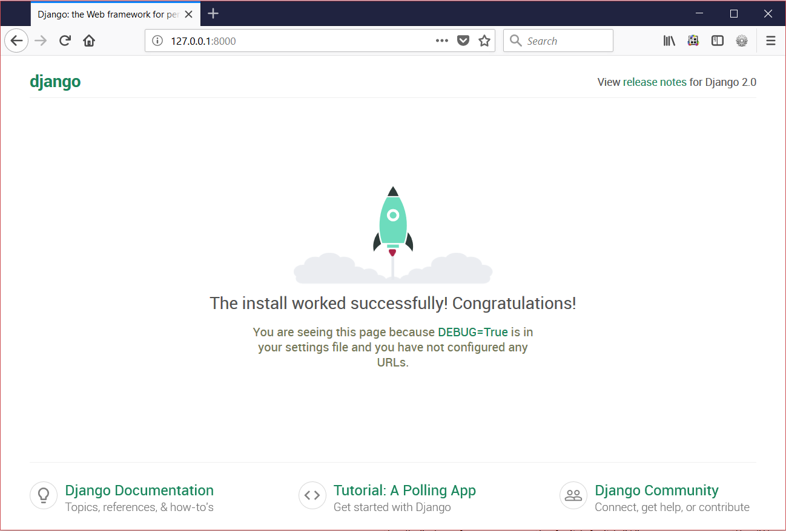
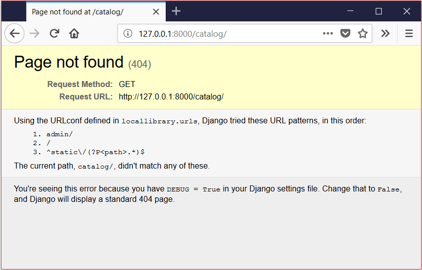
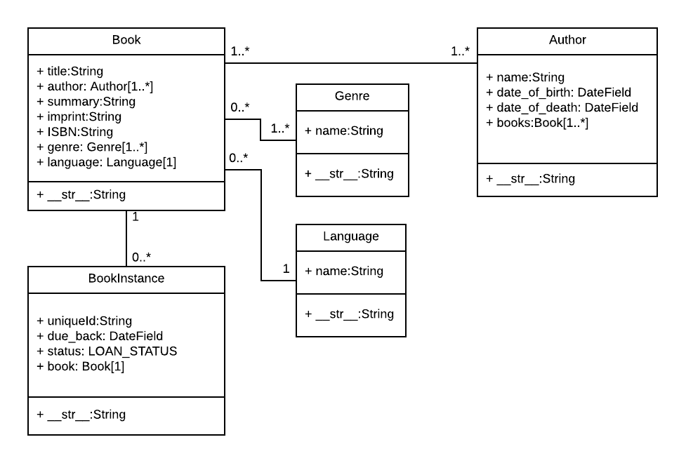

# Django 웹 프레임워크 (파이썬)

출처: https://developer.mozilla.org/ko/docs/Learn/Server-side/Django

Django는 파이썬으로 구성된, 인기 많고 완벽한 기능을 갖춘 서버-사이드 웹 프레임워크입니다. 이 모듈은 Django가 웹 서버 프레임워크 중 가장 유명한 이유, 개발환경을 설정하는 방법, 그리고 이를 통해 자신만의 웹 애플리케이션을 만드는 방법을 알려줍니다. 

## 전제조건

이 모듈을 시작하기에 앞서, 당신이 Django에 대해 미리 알 필요는 전혀 없습니다. 하지만 [Server-side website programming first steps](https://developer.mozilla.org/ko/docs/Learn/Server-side/First_steps) 모듈을 보면서 과연 서버-사이드 웹 프로그래밍과 웹 프레임워크가 무엇인가에 대해서는 이해 할 필요가 있습니다.

프로그래밍 개념 그리고 [Python](https://developer.mozilla.org/ko/docs/Glossary/Python)에 대한 일반적인 지식을 공부하는 것은 권장합니다. 하지만 이것이 Django의 핵심 개념을 이해하는데 반드시 필요한 것은 아닙니다.

**노트**: Python은 초보자가 읽고 이해할 수 있는 가장 쉬운 프로그래밍 언어 중 하나 입니다. 즉, 만약 당신이 이 모듈을 더 깊이 이해하고 싶다면, 인터넷에서 많은 무료 서적과 자습서들을 이용할 수 있습니다. ( 초보 프로그래머들은 python.org wiki 에서 [Python for Non Programmers](https://wiki.python.org/moin/BeginnersGuide/NonProgrammers) 페이지를 확인해도 좋습니다.).

## 가이드

- [Django 소개](https://developer.mozilla.org/ko/docs/Learn/Server-side/Django/Introduction)

  이 문서에서는 "Django란 무엇인가?"  라는 물음에 답을 합니다. 그리고 이 웹 프레임워크를 특별하게 만드는 요소에 대해 대략적으로 살펴볼 것입니다. 우리는 여기서  Django의 주요 특징들 (자세히 설명할 시간은 없는 심화된 기능들 포함) 을 훑어볼 것입니다. 또한 Django 애플리케이션의 주요 구성 요소들 중 일부를 보여줍니다. 따라서 당신이 Django 애플리케이션을 설정하고 시작하기 전에, 우리는 Django가 무슨 일을 해 줄 수 있는지에 대해 알려줄 것입니다. 

- [Django 개발 환경 설정](https://developer.mozilla.org/ko/docs/Learn/Server-side/Django/development_environment)

  이제 Django가 무엇인지 알았으므로 Windows, Linux (Ubuntu) 및 Mac OS X에서 Django 개발 환경을 설정하고 테스트하는 방법을 살펴봅시다. 이 문서에서는 당신이 어떠한 운영 체제를 사용하든지 상관없습니다. 우리는 당신이 Django로 앱 개발을 시작하기 전에 필요한 것을 마땅히 알려줘야 합니다. 

- [Django Tutorial: The Local Library website](https://developer.mozilla.org/en-US/docs/Learn/Server-side/Django/Tutorial_local_library_website)

  이 (실용적) 튜토리얼의 첫번째 문서에서는 앞으로 무엇을 배울지 알아봅니다. -  우리가 후속 문서에서 계속 작업하고 개발해 나갈 "지역 도서관" 의 예제 웹사이트를 살펴봅니다.

- [Django Tutorial Part 2: Creating a skeleton website](https://developer.mozilla.org/en-US/docs/Learn/Server-side/Django/skeleton_website)

  이 수업에서는 웹사이트의 기본인 "뼈대"를 만드는 방법을 살펴봅니다. 그런 다음 사이트별로 settings, urls, models, views, templates 을 사용하여 채워 넣을 것입니다.

- [Django Tutorial Part 3: Using models](https://developer.mozilla.org/en-US/docs/Learn/Server-side/Django/Models)

  이 수업에서는 지역 도서관 웹사이트에서 모델을 저장하는 방법에 대해 알아봅니다. 모델이란 웹 앱의 자료구조를 나타내며, Django의 데이터 베이스에 데이터를 저장할 수 있도록 해줍니다. 여기서는 모델이 무엇인지, 어떻게 선언하는지, 그리고 몇몇 중요한 필드 타입도 살펴볼 것입니다. 그리고 모델 데이터에 접근하는 몇가지 주요 방법도 간단하게 알아봅니다. 

- [Django Tutorial Part 4: Django admin site](https://developer.mozilla.org/en-US/docs/Learn/Server-side/Django/Admin_site)

  앞에서 지역 도서관 웹사이트의 모델을 생성했다면, 이제는 Django 관리자 사이트를 사용해서 "실제" 책 데이터를 추가할 차례입니다. 먼저 관리자 사이트에 모델에 등록하는 방법을 보여줄 것입니다. 그 다음에 로그인 하고 데이터를 생성하는 방법도 배울 것입니다. 마지막 순서에서는 관리자 사이트의 PT를 향상시키는 더 많은 방법도 알아볼 것입니다. 

- [Django Tutorial Part 5: Creating our home page](https://developer.mozilla.org/en-US/docs/Learn/Server-side/Django/Home_page)

  이제 우리는 처음으로 완성된 페이지(홈페이지 개념으로 모델 종류를 기록하고 사이드바나 다른 페이지의 링크들이 있음)를 표시하기 위한 코드를 입력할 준비가 되었습니다. 이 방법을 통해 기본적인 URL 맵이나 뷰를 작성하고, 데이터베이스에 기록하고, 템플릿을 사용하는 실용적인 경험을 얻을 것입니다. 

- [Django Tutorial Part 6: Generic list and detail views](https://developer.mozilla.org/en-US/docs/Learn/Server-side/Django/Generic_views)

  이 수업에서는 우리가 만든  local library의 웹사이트를 확장해 볼 것입니다. 목록, 책이나 저자 정보를 담은 자세한 페이지들을 추가할 것입니다. 여기서는 일반적인 클래스 기반의 view를 배우고 보통 상황에서 어떻게 코드의 양을 줄일 수 있는지 살펴볼 것입니다. 우리는 또한 URL 핸들링에 대해 정말 자세히 들어가서, 기본적인 패턴 매칭을 어떻게 해야 하는지도 볼 것입니다. 

- [Django Tutorial Part 7: Sessions framework](https://developer.mozilla.org/en-US/docs/Learn/Server-side/Django/Sessions)

  여기서는 우리가 만든 로컬 라이브러리의 웹사이트에 '세션 기반 방문자 수 계산기' 를 홈페이지에 추가할 것입니다. 이것은 비교적 간단한 예제입니다. 하지만 귀하는 이 예제를 통해, 세션 프레임워크를 사용해서 어떻게 사이트에 방문하는 이름없는 사용자들의 반복적인 행동을 볼 수 있는지 (그 방법을) 알 수 있습니다. 

- [Django Tutorial Part 8: User authentication and permissions](https://developer.mozilla.org/en-US/docs/Learn/Server-side/Django/Authentication)

  이 수업에서는 유저들에게 그들의 계정으로 웹사이트에 로그인 하게 하는 방법에 대해 배웁니다. 그리고 로그인 상태에 따라 그들이 보고 작성할 수 있는 범위를 통제하는 방법, 그들에게 허가를 내주는 방법을 배웁니다. 우리는 연습을 위해서 로컬 라이브러리 웹사이트를 확장해 볼 것입니다. 로그인 및 로그아웃 페이지를 추가하고, 대출 도서를 보여주는 페이지를 사용자용, 관리자용 각각 따로 만들어 볼 것입니다. 

- [Django Tutorial Part 9: Working with forms](https://developer.mozilla.org/en-US/docs/Learn/Server-side/Django/Forms)

  여기서는 Django에서 [HTML Forms](https://developer.mozilla.org/en-US/docs/Web/Guide/HTML/Forms)을 어떻게 사용하는 살펴볼 것입니다. HTML은 특히 모델을 생성하고, 갱신하고, 지우는 등의 폼을 작성하는 가장 쉬운 방법입니다. 이번 연습에서는 로컬 라이브러리의 웹사이트를 확장하는 것도 포함되어 있습니다. 여기서 우리는 도서관 사서들이 (관리자 어플리케이션 보다는) 우리가 작성한 폼을 이용해서 책을 고치고, 생성하고, 업데이트하고 정보를 삭제할 수 있도록 웹사이트를 확장해 볼 것입니다. 

- [Django Tutorial Part 10: Testing a Django web application](https://developer.mozilla.org/en-US/docs/Learn/Server-side/Django/Testing)

  웹사이트가 확장되어감에 따라 일일이 확인하기가 점점 어려워질 것입니다. 테스트해야할 요소 자체가 많아질 뿐만 아니라 요소간의 상호관계도 복잡해지면서 작은 요소의 변화가 다른 큰 요소들에까지 영향을 미치게됩니다.  이런 문제에 대한 걱정을 덜어줄 수 있는 방법은 자동 테스트 코드를 작성하는 것입니다. 자동 테스트 코드는 소스에 변화가 생길때마다 작동하는 코드입니다. 이번 강좌에서는 성능이 우수하면서도 작성이 간단한 Django의 테스트 프레임워크로 어떻게 당신의 웹사이트를 단위 테스트할수 있는지 알아봅니다.

- [Django Tutorial Part 11: Deploying Django to production](https://developer.mozilla.org/en-US/docs/Learn/Server-side/Django/Deployment)

  이제 당신은 훌륭한 로컬저장소 웹사이트를 만들었으니, 로컬저장소가 아닌 공개 서버에 업로드 함으로써 인터넷을 통해 관리자와 사용자들이 접근할 수 있도록 하고싶을 겁니다. 이 수업에서는 호스트 업체를 찾고 웹사이트를 등록하는 방법과 사이트에 상품가치를 부여하는 방법을 알아봅니다.

- [Django web application security](https://developer.mozilla.org/en-US/docs/Learn/Server-side/Django/web_application_security)

  사용자의 데이터를 보호하는 것은 웹사이트 디자인에서 중요한 부분입니다. 이전에 [Web security](https://developer.mozilla.org/en-US/docs/Web/Security) 수업에서 일반적인 보안 위협들에 대해 알아보았습니다. 이번 항목에서는 Django에 내장된  보호 시스템이 이런 위협을 어떻게 처리하는지 실질적인 예시에 대해 살펴봅니다. 

## 평가

밑에 제시되어있는 평가는 위에 설명 된 대로, 장고(Django)를 사용하여 웹 사이트를 만드는 방법에 대한 이해도를 테스트합니다.

- [DIY Django 미니 블로그](https://developer.mozilla.org/ko/docs/Learn/Server-side/Django/django_assessment_blog)

  이 평가에서, 귀하는 여기서 배운 지식을 활용해서 자신만의 블로그를 만들 수 있습니다. 


# Django 소개


  Django의 첫번째 문서에서는 "Django가 뭐지?"라는 질문에 답해보고, Django 웹 프레임워크의 특별한 부분에 대해 전반적으로 살펴봅니다. 우리가 이 수업에서 자세히 다루지는 않을 고급 기능들까지 포함하여 간단하게 전반적인 부분을 살펴 볼겁니다. 또한, Django 애플리케이션을 구성하는 중요한 요소도 살펴보겠습니다. (물론 지금 시점에서는 테스트를 할 개발환경을 가지고 있지 않겠지만요.)

| 요구 사항 | 기본적인 컴퓨터 지식.  [server-side website 프로그래밍](https://developer.mozilla.org/en-US/docs/Learn/Server-side/First_steps)에 대한 전반적인 이해, 그리고 웹사이트의 [client-server interactions](https://developer.mozilla.org/en-US/docs/Learn/Server-side/First_steps/Client-Server_overview) 의 매커니즘에 대한 특정한 지식. |
| :-------- | ------------------------------------------------------------ |
| 목표      | Django란 무엇인지, 어떤 기능이 있는지, Django 어플리케이션의 주요 구성요소는 어떤것들인지에 대해 익숙해지기 |


## Django란?

Djano란 보안이 우수하고 유지보수가 편리한 웹사이트를 신속하게 개발하는 하도록 도움을 주는 파이썬 웹 프레임워크입니다. 훌륭한 개발자에 의해 만들어진 이 프레임워크는, 웹 개발을 하는데 많은 도움을 주기 때문에 새롭게 웹 개발을 시작할 필요없이 그저 프레임워크를 활용하여 앱 개발에만 집중할 수 있게되죠. 무료 오픈소스인데다가, 활발한 커뮤니티들이 있고, 좋은 참고자료와 무료 및 유료 지원을 하는 옵션들이 제공됩니다.

Django는 다음과 같은 소프트웨어를 개발하는데 도움을 줍니다.

- Complete(완결성 있는)

  Django는 "Batteries included" 의 철학을 기반으로 개발자들이 개발하고 싶은 거의 모든것을 개발하는데 도움을 줍니다. 개발자들이 원하는 것은 모두 하나의 "결과물"의 일부일 것이기 때문에 도달하고자 하는 목표지점은 같으며 이 덕분에 일관된 디자인 룰을 적용하여  [광범위한 최신 문서](https://docs.djangoproject.com/en/2.2/)를 제공합니다.

- Versatile(다용도의)

  Django는 문서관리시스템과 Wiki부터 SNS, 뉴스에 이르기까지 다양한 종류의 웹 사이트를 빌드하는데 사용할 수 있고 사용되어 왔습니다. 또한 어떠한 클라이언트측 프레임워크와도 협업할 수 있고, 대부분의 형식(HTML, RSS 피드, JSON, XML 등)으로 컨텐츠를 전송할 수 있습니다. 당신이 보고 있는 이 사이트도 Django 기반입니다!  내부적으로 Django는 당신이 원하는 대부분의 기능들(몇몇 유명한 데이터베이스들, 템플릿 엔진 등)을 제공하지만, 필요하다면 다른 컴포넌트들을 사용하기 위해 확장될 수 있습니다. 

- Secure(안전한)

  Django 는 개발자들이 웹사이트를 개발할 때 실수하기 쉽지만 고려해야하는 보안 문제에 대해서 많은 도움을 줍니다. 예를 들면, 장고는 유저의 계정과 비밀번호를 관리하는 안전한 방법을 제공합니다. 이 예에서 발생할 수 있는 개발자들의 실수로 세션의 정보를 보안에 취약한 위치에 있는 쿠키(해결책은 쿠키는 그저 key값을 가지도록 하는 반면 실제 데이터는 데이터 베이스에 저장하도록 하는 것입니다)에 넣는 실수를 하는 것입니다. 또 달리 쉽게할 수 있는 실수는 비밀번호를 hash를 통하지 않고 그대로 변형없이 저장하는 것이 있습니다.  *비밀번호에 사용되는 hash 는 cryptographic hash function에 의해 생성된 고정된 길이의 값을 가집니다. Django는 이렇게 변형되어 입력된 비밀번호가 유효한지 hash 함수를 통해 확인할 수 있습니다. 하지만 "단방향" 적인 함수의 특성상, 저장된 hash 값을 웹을 공격하는 사람들이 알아낸다고 하더라도 원본 비밀번호는 알아낼 수 없습니다.*  Django 는 SQL 인젝션, cross-site 스크립팅, cross-site 요청 forgery 그리고 clickjacking (이러한 공격 방법에 대한 상세 정보는 [Website security](https://developer.mozilla.org/en-US/docs/Learn/Server-side/First_steps/Website_security) 에서 볼 수 있습니다)과 같은 보안 취약점을 보완할 방법 기본적으로 제공합니다.

- Scalable(확장성 있는)

  Django는 컴포넌트 기반의 “[shared-nothing](https://en.wikipedia.org/wiki/Shared_nothing_architecture)” 아키텍쳐(각각의 아키텍쳐가 독립적이어서 필요하다면 교체 및 변경할 수 있는)를 사용합니다. 각 부분이 분명하게 분리되면 어떤 레벨에서든(예를 들면 캐싱서버, 데이터베이스 서버, 혹은 어플리케이션 서버) 하드웨어를 추가해서 발생하는 늘어난 트래픽에 대응해 크기를 변경할 수 있게 됩니다. 사용자가 가장 많은 몇몇 사이트는 요구사항에 맞춰서 Django의 크기를 성공적으로 변경했습니다. (예를들면 Instagram, Disqus 등)

- Maintainable(유지보수가 쉬운)

  Django 코드는 유지보수가 쉽고 재사용하기 좋게끔 하는 디자인 원칙들과 패턴들을 이용하여 작성됩니다. 특히 Don't Repeat Yourself (DRY) 원칙을 적용해서 불필요한 중복이 없고 많은 양의 코드를 줄였습니다. 또한 Django는 관련된 기능들을 재사용 가능한 "applications"로 그룹화했고, 더 낮은 레벨에서 관련된 코드들을 모듈로 만들었습니다. ([Model View Controller (MVC)](https://developer.mozilla.org/en-US/Apps/Fundamentals/Modern_web_app_architecture/MVC_architecture) 패턴과 유사합니다).

- Portable(포터블한)

  장고는 파이썬으로 작성되어 있으며, 파이썬은 많은 플랫폼에서 작동합니다. 그것은 특정한 서버 플랫폼에 얽매이지 않는다는 것을 의미하며, 리눅스, 윈도우 그리고 맥 OS X 등등 다양한 운영체제에서 작동할 수 있다는 뜻입니다. 나아가, 장고는 많은 웹 호스팅 공급자들에 의해서 지원되고 있습니다. 그들은 장고 사이트의 호스팅과 관련해서 특정한 인프라와 문서를 제공합니다. 

## 탄생 배경은 어떻게 되나요?

장고는 신문 웹사이트를 제작 및 관리하던 어떤 웹 팀에 의해 2003년에서 2005년 사이에 처음으로 개발이 시작되었습니다. 여러 사이트들을 만들면서 웹 팀은 많은 공통 코드와 설계 패턴을 뽑아내어 재사용하였습니다. 이 공통 코드는 일반 웹 개발 프레임워크로 발전했습니다. 그리고 2005년 7월 "장고" 프로젝트로서 오픈소스화 되었죠.. 

장고는 2008년 9월 첫 번째 주요 릴리즈(1.0)에서부터 2017년의 최근 버전(2.0)까지 성장하고 발전했습니다. 장고는 각각의 버전에서 기능을 추가하고 버그를 수정했습니다. 새로운 유형의 데이터베이스, 탬플릿 엔진들 그리고 캐싱에 대한 지원에서부터 "일반 보기 함수와 클래스들의 추가까지요(이를 통해 여러 프로그래밍 작업을 위해 개발자들이 작성해야 할 코드를 줄여줍니다). 

**Note**: 장고를 더 좋게 만들기 위해 어떤 작업이 이루어지고 있는지, 최근 버전에서 어떤 변경이 있었는지 확인하려면 장고 웹사이트의 [release notes](https://docs.djangoproject.com/en/1.10/releases/) 를 살펴보세요.

장고는 수많은 사용자와 기여자가 있는 협력적이고 번성하는 프로젝트입니다. 여전히 몇 가지 장고만의 특징이 있지만, 장고는 모든 유형의 웹사이트를 개발할 수 있는 다용도적인 웹 프레임워크로 발전했습니다.

## Django의 인기는 어떤가요?

사실 서버 측 프레임워크의 인기에 대해 쉽고 확정적인 측정값은 없습니다(다만 [Hot Frameworks](http://hotframeworks.com/) 와 같은 사이트는 각 플랫폼에 대해 GitHub 프로젝트와 StackOverflow 질문의 숫자를 세는 방법으로 인기에 대해 접근하려고 합니다). 장고가 인기없는 플랫폼의 문제를 피할 수 있을 만큼 "충분히 인기있는지"가 더 좋은 질문입니다. 장고가 계속 발전하나요? 도움이 필요할 때 받을 수 있나요? 장고를 배우면 돈을 받고 일할 기회가 생기나요?

장고를 사용하는 상위 사이트의 숫자, 장고 코드베이스에 기여하는 사람들의 숫자, 그리고 급여가 지불되거나 지불되지 않거나에 상관없이 지원을 제공하는 사람들의 숫자에 근거해서, 맞습니다. 장고는 인기있는 프레임워크 입니다!

장고를 사용하는 상위 사이트는 다음을 포함합니다 : Disqus, Instagram, Knight Foundation, MacArthur Foundation, Mozilla, National Geographic, Open Knowledge Foundation, Pinterest, and Open Stack (출처: [Django home page](https://www.djangoproject.com/)).

## Django는 독선적인가요?

많은 웹 프레임웍들이 흔히 스스로를 "독선적(opinionated)"이라거나 "관용적(unopinionated)"이라고 표현합니다.

독선적인 프레임웍들은 어떤 특정 작업을 다루는 "올바른 방법"에 대한 분명한 의견을 가지고 있습니다. 그것들은 대체로 특정 도메인(특정 타입의 문제를 해결하는)내에서 빠른 개발방법을 제시합니다. 어떤 작업에 대한 올바른 방법이란 보통 잘 알려져있고 문서화가 잘되어있기 때문입니다. 하지만 그것들은 주요 도메인을 벗어난 문제에 대해서는 그리 유연하지 못한 해결책을 제시할 수 있습니다. 또한 이용할수 있는 접근법이나 선택가능한 구성요소가 그리 많지 않을것입니다. 

반면에, 관용적인 프레임웍들은, 구성요소를 한데 붙여서 해결해야 한다거나 심지어 어떤 컴퍼넌트를 써야한다는 '올바른 방법'에 대한 제약이 거의 없다시피 합니다. 그것들은 개발자들이 특정 작업을 완수하는데에 가장 적절한 도구들을 이용하기 쉽게 만들어줍니다. 비록 당신 스스로가 그 컴퍼넌트들을 찾아야 한다는 수고는 해야하긴 하지만 말이죠.

Django는 "다소 독선적" 입니다. 그럼으로써 "양쪽 세계의 최선"의 결과를 전달합니다. Django는 대부분의 웹 개발 작업을 다루는 컴퍼넌트 세트와 그 세트를 이용하는 한, 두가지의 인기있는 방법을 제공합니다. 하지만 Django의 비결합 구조 (decoupled  architecture) 덕분에 당신은  꽤 많은 옵션들중에서 다른 방법을 선택하거나 원한다면 완전히 새로운 방법을 만들어 낼 수도 있습니다.

## Django 코드는 어떻게 생겼나요?

전형적인 데이터 기반 웹 사이트에서 웹 어플리케이션은 웹 브라우저(또는 다른 클라이언트)로부터 HTTP 요청(Request)을 기다립니다. 요청을 받으면, 웹 어플리케이션은 URL과 `POST` 데이터 또는 `GET` 데이터의 정보에 기반하여 요구사항을 알아냅니다. 그 다음 무엇이 필요한 지에 따라, 데이터베이스로부터 정보를 읽거나 쓰고, 또는 필요한 다른 작업들을 수행할 것입니다. 그 다음 웹 어플리케이션은 웹 브라우저에 응답(Response)을 반환하는데, 주로 동적인 HTML 페이지를 생성하면서 응답합니다.

Django 웹 어플리케이션은 전형적으로 아래와 같이 분류된 파일들에 대해 일련의 단계를 수행하는 코드로 구성되어 있습니다:


- **URLs:** 단일 함수를 통해 모든 URL 요청을 처리하는 것이 가능하지만, 분리된 뷰 함수를 작성하는 것이 각각의 리소스를 유지보수하기 훨씬 쉽습니다. URL mapper는 요청 URL을 기준으로 HTTP 요청을 적절한 view로 보내주기 위해 사용됩니다. 또한 URL mapper는 URL에 나타나는 특정한 문자열이나 숫자의 패턴을 일치시켜 데이터로서 뷰 함수에 전달할 수 있습니다.
- **View:** view는 HTTP 요청을 수신하고 HTTP 응답을 반환하는 요청 처리 함수입니다. View는 Model을 통해 요청을 충족시키는 데 필요한 데이터에 접근합니다. 그리고 탬플릿에게 응답의 서식 설정을 맡깁니다.
- **Models:** Model은 application의 데이터 구조를 정의하고 데이터베이스의 기록을 관리(추가, 수정, 삭제)하고 query하는 방법을 제공하는 파이썬 객체입니다.. 
- **Templates:** 탬플릿은 파일의 구조나 레이아웃을 정의하고(예: HTML 페이지), 실제 내용을 보여주는 데 사용되는 플레이스홀더를 가진 텍스트 파일입니다. view는 HTML 탬플릿을 이용하여 동적으로 HTML 페이지를 만들고 model에서 가져온 데이터로 채웁니다. 탬플릿으로 모든 파일의 구조를 정의할 수 있습니다.탬플릿이 꼭 HTML 타입일 필요는 없습니다!

**Note**: 장고는 이 구조를 "모델 뷰 템플릿(Model View Template)(MVT)" 아키텍처라고 부릅니다. 이것은 더 익숙한 [Model View Controller](https://developer.mozilla.org/en-US/docs/Web/Apps/Fundamentals/Modern_web_app_architecture/MVC_architecture) 아키텍처와 많은 유사점을 가지고 있습니다.


아래 부문들은 장고 앱의 주요 부분들이 어떻게 보일지에 대한 단서를 보여줄 것입니다          (우리는 개발 환경을 설치한 이후에 세부적인 디테일에 대해 다룰겁니다).

### 요청을 알맞은 view에 보내기 (urls.py)

URL mapper는 보통 **urls.py**라는 이름의 파일에 저장되어 있습니다. 아래 예시에서 mapper (`urlpatterns`) 는 경로들(특정 URL 패턴들)과 해당하는 view 함수에 대한 mapping 목록들을 정의합니다. 만약 지정된 URL 패턴과 일치하는 HTTP 요청이 수신된다면 관련된 view 함수가 요청을 전달합니다.

```python
urlpatterns = [
    path('admin/', admin.site.urls),
    path('book/<int:id>/', views.book_detail, name='book_detail'),
    path('catalog/', include('catalog.urls')),
    re_path(r'^([0-9]+)/$', views.best),
]
```

  

 `urlpatterns` 객체는 `path()` 및/또는 `re_path()` 함수의 리스트(list)입니다 (파이썬 리스트는 대괄호를 사용하여 구분되며, 항목은 쉼표로 분리되고 선택적으로 후행 쉼표가 있을 수 있습니다. 예시: [item1, item2, item3, ]).

두 메소드의 첫 번째 인수는 일치시킬 경로(패턴)입니다. `path()` 메소드는 꺾쇠 괄호()를 사용해서 인수를 정의합니다. 이 인수는 URL의 한 부분으로, 명명된 인수로써 수집되어 view 함수로 보내집니다. `re_path()` 함수는 정규식이라는 유연한 패턴 매칭 접근을 사용합니다. 이것에 대해서는 나중에 다루도록 하겠습니다!

두 번째 인수는 패턴이 일치할 때 호출되는 다른 함수입니다. `views.book_detail` 은 이 함수가 `book_detail()`이며  `views` 모듈 안에서 찾을 수 있다는 것을 나타냅니다.(즉, `views.py`라는 파일 안에서요)

 

### 요청 처리하기 (views.py)

view들은 웹 클라이언트로부터 HTTP 요청을 수신하고 HTTP 응답을 되돌려주는 웹 어플리케이션의 심장입니다. 그 사이에 그들은 데이터베이스에 접근하고 템플릿을 렌더링하기 위해 프레임워크읟 다른 자원들을 정리합니다.

 아래 예시는 이전 예시의 URL mapper가 불러올 수 있는 최소 view 함수 `index()`를 보여줍니다. 다른 모든 view 함수처럼 이 함수도 `HttpRequest` 객체를 (`request`)의 인자로 받고 `HttpResponse` 객체를 반환합니다. 이 예시에서는 요청에 관해서는 아무것도 하지 않고, 단순히 하드코딩된 문자열을 반환합니다. 요청에 관련해서는 이후 글에서 더 자세하게 다루겠습니다.

```python
## filename: views.py (Django view functions)

from django.http import HttpResponse

def index(request):
    # Get an HttpRequest - the request parameter
    # perform operations using information from the request.
    # Return HttpResponse
    return HttpResponse('Hello from Django!')
```

**Note**: 파이썬에 관하여:

- [Python modules](https://docs.python.org/3/tutorial/modules.html) 는 우리가 코드에 쓰고 싶을지도 모르며 분리된 파일로 저장되어 있는 함수의 "라이브러리" 입니다. 여기서 우리는  우리의 view: `from django.http import`에서 사용하기 위해 `HttpResponsedjango.http`모듈의 `HttpResponse` 객체만을  import 했습니다.  모듈에서 여럿, 아니면 전체 모듈을 import 할 수 있는 몇 가지 방법이 있습니다.
- 함수들은 위에 보여진 것과 같이`def` 키워드로 정의됩니다. 함수의 이름 뒤 괄호 안에 는 명명된 인자들이 나열되어 있습니다. 전체 줄은 콜론으로 끝납니다. 그 아랫 줄이 모두 **들여쓰기 되어있다는 것**에 유의하세요. 들여쓰기는 코드 행이 특정한 블록 안에 있다는 것을 나타내기 때문에 중요합니다(필수적인 들여쓰기는 파이썬의 주요 기능이며, 파이썬 코드가 읽기 쉬운 이유 중 하나이기도 합니다).


view들은 보통 **views.py**.라는 파일 안에 저장되어 있습니다.

### 데이터 모델 정의하기 (models.py)

장고 웹 어플리케이션은 models라는 파이썬 객체를 통해 데이터를 관리하고 쿼리합니다. 모델은 필드 타입과 그들의 최대 크기, 기본 값들, 선택 목록 옵션, 문서의 도움말 텍스트, form들을 위한 labe text등을 포함하여 저장된 데이터의 구조를 정의합니다. 모델의 정의는 기본 데이터베이스와 별개입니다. 본인의 프로젝트 설정의 일부로써 여러 모델 중 하나를 선택할 수 있습니다. 본인이 사용할 데이터베이스를 정했다면, 그것에 직접적으로 접근할 필요가 없습니다. 그저 모델 구조와 다른 코드들을 작성하면, 장고가 당신과 데이터베이스가 소통하는 데 필요한 모든 더러운 작업들을 처리합니다.

아래 코드는 `Team` 객체를 위한 아주 간단한 장고 모델을 보여줍니다. `Team` 객체는 장고 클래스`models.Model`에서 파생되었습니다. 이 객체는 팀 이름과 팀 레벨을 캐릭터 필드로 정의하고 각각의 기록에 저장될 최대 캐릭터 숫자를 정합니다. The `team_level` can be one of several values, so we define it as a choice field and provide a mapping between choices to be displayed and data to be stored, along with a default value. 

```python
# filename: models.py

from django.db import models 

class Team(models.Model): 
    team_name = models.CharField(max_length=40) 

    TEAM_LEVELS = (
        ('U09', 'Under 09s'),
        ('U10', 'Under 10s'),
        ('U11', 'Under 11s'),
        ...  #list other team levels
    )
    team_level = models.CharField(max_length=3,choices=TEAM_LEVELS,default='U11')
```

**Note**: 약간의 파이썬 ::

- Python은 코드를 객체로 구성하는 프로그래밍 스타일 인 '객체 지향 프로그래밍'을 지원합니다. 여기에는 관련 데이터 및 해당 데이터를 조작하기위한 함수가 포함됩니다. 객체는 다른 객체로부터 상속 / 확장 / 파생 할 수있어 관련 객체 간의 공통 동작을 공유 할 수 있습니다. 파이썬에서는 키워드 클래스를 사용하여 객체의 '청사진'을 정의합니다. 클래스의 모델을 기반으로 객체 유형의 여러 특정 인스턴스를 만들 수 있습니다.

  예를 들어 여기 Model 클래스에서 파생 된 Team 클래스가 있습니다. 이는 모델이며 모델의 모든 방법을 포함하지만 자체 기능도 제공 할 수 있습니다. 이 모델에서는 데이터베이스가 데이터를 저장하는 데 필요한 필드를 정의하여 특정 이름을 지정합니다. Django는 필드 이름을 포함한 이러한 정의를 사용하여 기본 데이터베이스를 만듭니다.

### Querying data (views.py)

Django 모델은 데이터베이스 검색을위한 간단한 쿼리 API를 제공합니다. 이는 서로 다른 기준 (예 : 대소 문자를 구분하지 않고 대 / 소문자 등)을 사용하여 한 번에 여러 필드와 일치 할 수 있으며 복잡한 설명을 지원할 수 있습니다 (예 : 팀이있는 U11 팀에서 검색을 지정할 수 있음) 'Fr'로 시작하거나 'al'로 끝나는 이름).

코드 스 니펫에는 모든 U09 팀을 표시하기위한보기 기능 (리소스 핸들러)이 표시됩니다. 굵은 줄은 모델 쿼리 API를 사용하여 'team_level'필드에 정확히"U09"라는 텍스트가있는 모든 레코드에 대해 필터링 할 수있는 방법을 보여줍니다 (이 기준이 필드 이름과 함께 인수로 filter () 함수에 전달되는 방법에 유의하십시오. 일치 유형은 이중 밑줄로 구분됩니다 (team_level__exact).

```
## filename: views.py

from django.shortcuts import render
from .models import Team 

def index(request):
    list_teams = Team.objects.filter(team_level__exact="U09")
    context = {'youngest_teams': list_teams}
    return render(request, '/best/index.html', context)
```


이 함수는 render () 함수를 사용하여 브라우저로 다시 전송되는 HttpResponse를 만듭니다. 이 기능은 지름길입니다. 지정된 HTML 템플릿과 템플릿에 삽입 할 데이터를 결합하여 HTML 파일을 생성합니다 ( '컨텍스트'라는 변수에 제공). 다음 섹션에서는 템플릿을 생성하기 위해 템플릿에 데이터를 삽입하는 방법을 보여줍니다.

### 데이터 렌더링하기 (HTML 템플릿들)

템플릿 시스템을 사용하면 페이지가 생성 될 때 채워질 데이터에 자리 표시자를 사용하여 출력 문서의 구조를 지정할 수 있습니다. 템플릿은 종종 HTML을 만드는 데 사용되지만 다른 유형의 문서를 만들 수도 있습니다. Django는 기본 템플릿 시스템과 Jinja2라는 인기있는 Python 라이브러리를 모두 지원합니다 (필요한 경우 다른 시스템을 지원하도록 만들 수도 있음).

코드 스 니펫은 이전 섹션의 render () 함수가 호출 한 HTML 템플릿의 모양을 보여줍니다. 이 템플릿은 렌더링 될 때 'youngest_teams'라는 목록 변수에 액세스 할 수 있다는 가정하에 작성되었습니다 (위의 render () 함수 내의 컨텍스트 변수에 포함됨). HTML 스켈레톤 안에는 youngest_teams 변수가 있는지 확인한 다음 for 루프에서 반복하는 표현식이 있습니다. 각 반복에서 템플리트는 각 팀의 team_name 값을 li 요소로 표시합니다.

```
## filename: best/templates/best/index.html

<!DOCTYPE html>
<html lang="en">
<body>

 
    <ul>
    
        <li>{{ team.team_name }}</li>
    
    </ul>

    <p>No teams are available.</p>


</body>
</html>
```

## 또 무엇을 할수 있나요?

이전 섹션에서는 거의 모든 웹 응용 프로그램에서 사용할 주요 기능인 URL 매핑, 뷰, 모델 및 템플릿을 보여줍니다. Django가 제공하는 다른 것들은 다음과 같습니다.

- **Forms**: HTML 양식은 서버에서 처리 할 사용자 데이터를 수집하는 데 사용됩니다. Django는 양식 작성, 유효성 검사 및 처리를 단순화합니다.
- **User authentication and permissions**: Django에는 보안을 염두에두고 구축 된 강력한 사용자 인증 및 권한 시스템이 포함되어 있습니다.
- **Caching**: 컨텐츠를 동적으로 작성하는 것은 정적 컨텐츠를 제공하는 것보다 계산 집약적이며 느립니다. Django는 유연한 캐싱을 제공하여 렌더링 된 페이지 전체 또는 일부를 저장하여 필요할 때를 제외하고 다시 렌더링하지 않도록 할 수 있습니다.
- **Administration site**: Django 관리 사이트는 기본 스켈레톤을 사용하여 앱을 만들 때 기본적으로 포함됩니다. 사이트 관리자가 사이트의 모든 데이터 모델을 작성, 편집 및 볼 수있는 관리 페이지를 쉽게 제공 할 수 있습니다.
- **Serialising data**: Django를 사용하면 데이터를 XML 또는 JSON으로 쉽게 직렬화하고 제공 할 수 있습니다. 이 기능은 웹 서비스 (다른 응용 프로그램이나 사이트에서 사용하기 위해 순수하게 데이터를 제공하고 자체를 표시하지 않는 웹 사이트)를 만들거나 클라이언트 측 코드가 모든 응용 프로그램을 처리하는 웹 사이트를 만들 때 유용 할 수 있습니다. 데이터 렌더링.

## 요약하기

축하합니다. 이제 Django 여행의 첫발을 떼셨군요! 이제 우리는 Django의 주요 이점과 역사를 조금 알게됐고 Django 응용프로그램의 주요한 부분을 대략 이해했습니다. 또한 목록, 함수 및 클래스 구문을 포함하여 Python 프로그래밍 언어에 대해 몇 가지 사실을 배워야합니다.

위의 실제 Django 코드를 이미 보았지만 클라이언트 측 코드와 달리 실행하기 위해서는 개발 환경을 설정해야합니다. 그것이 우리의 다음 단계입니다.


# Django 개발 환경 세팅하기


이제 Django가 무엇인지 알았으니, 윈도우, 리눅스(우분투), 맥 OS X에서 어떻게 Django 개발환경을 세팅하는지, 설치 후에는 어떻게 테스트하는지 살펴보겠습니다. 즉 이 문서를 통해서는 사용하고 있는 운영체제가 무엇인지와 상관없이 Django 어플리케이션 개발을 시작하기 위해 필요한 것들을 배우게 됩니다.

| 미리 필요한 것: | 터미널 또는 커맨드 창을 열 수 있어야 합니다. 또, 자신이 사용하는 PC의 운영체제에 따라 PC에 소프트웨어 패키지를 설치할 수 있어야 합니다. |
| :-------------- | ------------------------------------------------------------ |
| 목표:           | Django가 컴퓨터에서 실행될 수 있도록 개발 환경을 세팅합니다. |

## Django 개발 환경 개요

Django는 개발 환경을 세팅하고 웹 어플리케이션을 개발하는 것이 매우 쉽습니다. 이 섹션에서는 개발 환경이 제공하는 것들과, 개발 환경 세팅 시 옵션사항을 알아봅니다. 또 우분투, 맥 OS X, 윈도우에서 Django 개발 환경을 설치하는 방법과 설치 후 테스트하는 방법을 설명합니다.

### Django 개발 환경이란?

Django 개발 환경이란, Django를 로컬 컴퓨터에 설치하여 Django 어플리케이션을 개발, 실행, 테스트할 수 있는 환경을 말합니다. 로컬 컴퓨터는 자신이 어플리케이션을 개발하는 데 사용하는 컴퓨터입니다. 어플리케이션을 실제 배포하기 전에 로컬 컴퓨터 위에서 어플리케이션을 실행 및 테스트할 수 있습니다.

Django 자체가 제공하는 주요 툴에는 Django 프로젝트를 생성하고 작업하기 위한 파이썬 스크립트들과 심플한 개발용 웹 서버가 있습니다. 이 개발용 웹 서버로 우리는 로컬 컴퓨터에서 개발한 Django 어플리케이션을 같은 로컬 컴퓨터에서 테스트해볼 수 있습니다. 예를 들면, 자신의 PC에서 개발한 Django 웹 어플리케이션을 크롬 브라우저와 같은 웹 브라우저 상에서 실행하고 테스트해볼 수 있습니다.

앞서 설명한 것 외에도 Django 개발 환경은 여러 툴을 제공합니다. 코드 작성을 돕는 텍스트 에디터와 IDE, 소스코드의 버전을 안전하게 관리하기 위한 Git과 같은 소스 관리 도구와 같은 것들이 있습니다. 그러나 이것들은 여기서는 다루지 않습니다. 또 여기서는 미리 텍스트 에디터를 설치했다고 가정할 것입니다. 그러므로 텍스트 에디터를 아직 설치하지 않았다면 설치해주세요. 자주 사용하는 텍스트 에디터로는 [Sublime Text 3](https://www.sublimetext.com/3), [Gedit](https://wiki.gnome.org/Apps/Gedit#Download), [Atom](https://atom.io/) 등이 있습니다.)

### What are the Django setup options?

장고는 설치 및 구성에서 매우 유연합니다.

Django는 다음 사항이 가능합니다:

- 여러 운영 체제에서 설치가 가능합니다.
- 소스에서, 파이썬 패키지 인덱스(PyPi)에서 그리고 많은 경우 호스트 컴퓨터의 패키지 매니저 어플리케이션에서 설치가 가능합니다.
- 별도로 설치 및 구성되어있어야 하는 여러가지 데이터베이스 중 하나를 사용하도록 설정할 수 있습니다.
- 메인 시스템의 파이썬 환경 또는 별도의 파이썬 가상 환경에서 실행됩니다.

이러한 각각의 옵션들은 모두 조금씩 다른 구성과 설치가 필요합니다. 이어지는 subsections 에서 몇 가지 선택 사항을 설명합니다. 이하 글에서는 몇 가지 운영체제에서 장고를 설치 및 설정하는 방법을 보여주고, 나머지 튜토리얼에서는 모두 이 설정을 가정해서 진행됩니다.

**주의**: 공식 장고 문서에서 다른 설치 옵션을 찾을 수 있습니다. 링크 : [appropriate documents below](https://developer.mozilla.org/ko/docs/Learn/Server-side/Django/development_environment#furtherreading).

#### 어떤 운영체제가 지원되나요?

장고는 파이썬 3 프로그래밍 언어를 실행할 수 있는 거의 모든 기계에서 실행될 수 있습니다 : 윈도우, 맥 OS X, 리눅스/유닉스, 솔라리스 등등. 거의 모든 컴퓨터가 개발 중에 장고를 실행할 수 있는 성능을 갖고 있습니다.

이 글에서는 윈도우, 맥 OS X, 리눅스/유닉스에 관해 설명하도록 하겠습니다.

#### Python은 어느 버전을 사용해야 할까?

가능한 최신 버전을 사용할 것을 권장합니다. - 이 글을 작성할 때 가장 최신 버전은 파이썬 3.7입니다.

필요에 따라 Python 3.4 혹은 그 이후의 버전이 사용될 수 있습니다. (Python 3.4는 차후에 지원이 안될 수도 있습니다).

**Note**: Python 2.7은 Django 2.0에서 사용할 수 없습니다. (Django 1.11.x series에서 마지막으로 Python 2.7을 지원했습니다).

#### Django는 어디서 다운로드 할 수 있나요?

Django를 다운로드 할 수 있는 3가지 방법 :

- pip tool을 사용해 파이썬 패키지 The Python Package Repository (PyPi)에서 다운로드하기. 이 방법이 Django의 최신 버전을 받을 수 있는 최적의 방법입니다.
- 본인 컴퓨터의 패키지 매니저에 있는 버전을 사용하세요. 운영체제와 함께 제공되는 장고는 친숙한 설치 방법을 제공합니다. 다만 이것은 상당히 오래된 버전일 것이며, (아마 그렇게 원하지 않을)시스템 파이썬 환경에만 설치될 수 있다는 것에 유의하세요.
- 소스에서 설치하기. 소스에서 장고의 최신버전을 다운로드하여 설치할 수 있습니다. 초심자에게는 추천하지 않지만, 당신이 장고에게 기여할 수 있는 준비가 됐다면 필요합니다.

아래 글은 최신의 안정된 버전을 얻기 위해 PyPi에서 장고를 설치하는 방법을 보여줍니다.

#### 어떤 Database를 써야 하나요?

장고는 네 가지 메인 데이터베이스(PostgreSQL, MySQL, Oracle 그리고 SQLite)를 지원합니다. 그리고 다른 인기있는 SQL과 NOSQL 데이터베이스들을 다양한 레벨로 지원하는 커뮤니티 라이브러리가 있습니다. 우리는 생산과 개발에 동일한 데이터베이스를 선택하는 것을 추천합니다(장고는 ORM(Object-Relational Mapper)을 사용해 데이터베이스간의 차이 대부분을 추상화하긴 하지만, 아직 피하는게 나은 잠재적 문제들([potential issues](https://docs.djangoproject.com/en/2.0/ref/databases/))이 있습니다.

이 글에서(그리고 이 모듈의 거의 모든 부분에서) 우리는 데이터를 파일로 저장하는 SQLite 데이터베이스를 사용할 것입니다. SQLite는 가벼운 데이터베이스로 사용하기에 적합하고 높은 수준의 동시성을 지원하지 않습니다. 그렇지만 주로 읽기 전용인 응용 프로그램을 위해서는 아주 좋은 선택입니다.

**Note**: Django는 *django-admin과 같이 웹사이트를 만드는 표준 도구를 사용하면* SQLite가 기본 값으로 설정되어 있습니다. 이는 추가적인 설정이 필요하지 않으므로 시작하기에 좋습니다. 

#### 시스템 전체에 설치할까요, 파이썬 가상환경에 설치할까요?

파이썬 3를 설치하면 모든 파이썬3 코드가 공유하는 하나의 글로벌 환경이 만들어집니다. 그 환경에 원하는 어떤 파이썬 패키지라도 설치할 수 있지만, 각 패키지의 하나의 버전만 설치할 수 있습니다.

**Note**: 글로벌 환경에 설치된 파이썬 응용 프로그램들은 서로 충돌할 가능성이 있습니다 (예: 같은 패키지의 다른 버전일 때). 

만약 장고를 기본/전역 환경에 설치한다면 컴퓨터에서 하나의 장고 버전만을 대상으로 지정할 수 있습니다. 이것은 당신이 옛날 버전으로 작동하는 웹사이트를 관리하면서 새로운 웹사이트를(최신 버전의 장고를 이용해)만들고 싶을 때 문제가 됩니다.

결과적으로, 경험있는 파이썬/장고 개발자들은 일반적으로 독립적인 파이썬 환경에서 파이썬 앱들을 실행합니다. 이것은 여러 다른 장고 환경이 하나의 컴퓨터에서 작동 가능하게 합니다. 장고 개발팀에서도 당신이 파이썬 가상 환경을 사용하는 것을 추천합니다!

 이 모듈은 당신이 장고를 가상 환경에 설치했다고 가정합니다. 아래에서 어떻게 설치하는지 알려드리겠습니다.

## Python 3 설치

 Django를 사용하기 위해서 당신은 Python을 당신의 운영체제에 설치해야 됩니다. 만일 당신이 *Python 3를 사용하고 있다면* [Python Package Index](https://pypi.python.org/pypi) tool — *pip3* —Django에서 사용되는 Python packages/libraries와 다른 Python apps을 관리하는(설치, 업데이트, 제거) tool 또한 설치해야 합니다.

이번 섹션에서는 현재 당신의 파이썬 버전이 무엇인지 확인하고, 필요에 따라 운영체제(Ubuntu Linux 16.04, macOS X, and Windows 10)별로 새로운 버전 설치 방법을 간단하게 설명합니다.

**Note**: 당신의 플랫폼에 따라서 또한 운영체제의 고유한 패키지 매니저나 다른 방법을 통해 Python/pip를 설치할 수 있을 겁니다. 거의 모든 플랫폼에서 필요한 설치 파일들을  https://www.python.org/downloads/ 에서 다운로드할 수 있고 플랫폼마다 적절한 방법을 통해 설치할 수 있습니다.

### 우분투 16.04

우분투 리눅스 18.04 LTS는 파이썬 3.6.6을 기본적으로 포함하고 있습니다. bash 터미널에서 아래 코드를 실행하여 이것을 확인할 수 있습니다.:

```bash
python3 -V
 Python 3.6.6
```

그러나 파이썬3의 패키지 설치를 위한 Python Package Index tool(장고를 포함해)는 기본적으로 설치되어있지 않습니다. bash terminal에서 아래 코드를 사용하여 pip3를 설치할 수 있습니다:

```bash
sudo apt install python3-pip
```

### 맥OS X

맥OS X "엘 캐피탄" 이후의 최신 버전에서는 파이썬3를 포함하고 있지 않습니다. bash 터미널에서 아래 코드를 실행해서 확인할 수 있습니다.:

```bash
python3 -V
 -bash: python3: command not found
```

당신은[ python.org](https://www.python.org/)에서 파이썬3를(pip3 도구도 함께) 쉽게 설치할 수 있습니다:

1. 필요한 설치 파일을 다운로드하세요:
   1. https://www.python.org/downloads/ 로 가세요.
   2. **Download Python 3.7.0** 버튼을 선택하세요 (정확한 마이너 버전 숫자는 다를 수도 있습니다).
2. 파인더를 통해 파일을 찾아, 패키지 파일을 더블클릭 하세요. 그리고선 설치 과정을 따릅니다.

이제 아래와 같이 파이썬3의 성공적인 설치를 확인할 수 있습니다:

```bash
python3 -V
 Python 3.7.0
```

가능한 패키지들의 목록을 불러옴으로써 pip3가 설치된 것을 확인할 수 있습니다:

```bash
pip3 list
```

### 윈도우 10

윈도우는 파이썬을 기본적으로 포함하고 있지 않지만, [python.org](https://www.python.org/)에서(pip3 도구와 함께) 쉽게 설치할 수 있습니다:

1. 필요한 설치 파일을 다운로드하세요:
   1. https://www.python.org/downloads/ 로 가세요
   2. **Download Python 3.7.1** 버튼을 선택하세요 (정확한 마이너 버전 숫자는 다를 수도 있습니다).
2. 다운로드된 파일을 더블클릭해서 파이썬을 설치하세요.

명령 프롬프트에서 아래 텍스트를 입력해서 파이썬3가 설치된 것을 확인할 수 있습니다:

```bash
py -3 -V 
 Python 3.7.1
```

 윈도우 버전의 설치 파일은 pip3(파이썬 패키지 관리자)가 기본적으로 포함되어 있습니다. 아래 코드로 설치된 패키지 목록을 볼 수 있습니다:

```bash
pip3 list
```

**Note**: 설치파일은 위 코드들이 실행되기 위한 모든 것을 설치해줄 것입니다. 만약 파이썬을 찾을 수 없다는 메시지가 나오면, 파이썬을 당신의 시스템 경로에 추가하는 것을 깜빡했을 수가 있습니다. 당신은 설치파일을 다시 실행해서 'Modify'를 선택 후 두 번째 페이지에 있는 "Add Python to environment variables" 박스에 체크함으로써 시스템 경로에 파이썬을 추가할 수 있습니다.

## Python 가상 환경에서 Django 사용하기[섹션](https://developer.mozilla.org/ko/docs/Learn/Server-side/Django/development_environment#Python_가상_환경에서_Django_사용하기)

우리가 가상 환경을 만드는 데 사용할 라이브러리들은 [virtualenvwrapper](https://virtualenvwrapper.readthedocs.io/en/latest/index.html) (리눅스와 맥 OS X) 그리고 [virtualenvwrapper-win](https://pypi.python.org/pypi/virtualenvwrapper-win) (윈도우)입니다. 둘 다  [virtualenv](https://developer.mozilla.org/en-US/docs/Python/Virtualenv) 도구를 사용하죠. wrapper 도구는 모든 플랫폼의 인터페이스를 관리하기 위한 일관적인 인터페이스를 생성합니다.

### 가상 환경 소프트웨어 설치하기[섹션](https://developer.mozilla.org/ko/docs/Learn/Server-side/Django/development_environment#가상_환경_소프트웨어_설치하기)

#### 우분투 가상 환경 셋업

파이썬과 pip를 설치한 후에 (virtualenv를 포함하는)virtualenvwrapper를 설치할 수 있습니다. 공식 설치 가이드는 여기([here](http://virtualenvwrapper.readthedocs.io/en/latest/install.html))서 찾을 수 있습니다. 아니면 아래 설명을 따라오세요.

pip3를 사용해서 그 도구를 설치하세요:

```
sudo pip3 install virtualenvwrapper
```

그리고 당신의 shell 스타트업 파일(이것은 당신의 홈 디렉토리에 있는 숨겨진 **.bashrc** 파일 이름입니다)의 끝에 아래 코드를 추가하세요. 이 코드들은 가상 환경이 활동할 위치, 당신의 개발 프로젝트 디렉토리 위치, 그리고 이 패키지와 함께 설치된 스크립트의 위치를 설정합니다:

```
export WORKON_HOME=$HOME/.virtualenvs
export VIRTUALENVWRAPPER_PYTHON=/usr/bin/python3
export VIRTUALENVWRAPPER_VIRTUALENV_ARGS=' -p /usr/bin/python3 '
export PROJECT_HOME=$HOME/Devel
source /usr/local/bin/virtualenvwrapper.sh
```

**Note**:`VIRTUALENVWRAPPER_PYTHON` 와 `VIRTUALENVWRAPPER_VIRTUALENV_ARGS `변수는 파이썬3의 일반적인 설치 위치를 가리킵니다. 그리고 `source /usr/local/bin/virtualenvwrapper.sh` 는 `virtualenvwrapper.sh` 스크립트의 일반적인 위치를 가리킵니다. 만약 테스트 중에 virtualenv가 작동하지 않는다면, 확인해야 할 일 중 하나는 파이썬과 스크립트가 알맞은 위치에 있는지 입니다(그리고 스타트업 파일을 그에 맞게 바꾸세요).

 `which virtualenvwrapper.sh` 와 `which python3`커맨드를 사용해서 당신의 시스템에 알맞은 위치를 찾을 수 있습니다.

그리고 아래 코드를 터미널에서 실행하여 스타트업 파일을 다시 불러오세요:

```
source ~/.bashrc
```

이 시점에서 아래와 같이 한 다발의 스크립트가 실행되는 걸 볼 수 있습니다 :

```
virtualenvwrapper.user_scripts creating /home/ubuntu/.virtualenvs/premkproject
virtualenvwrapper.user_scripts creating /home/ubuntu/.virtualenvs/postmkproject
...
virtualenvwrapper.user_scripts creating /home/ubuntu/.virtualenvs/preactivate
virtualenvwrapper.user_scripts creating /home/ubuntu/.virtualenvs/postactivate
virtualenvwrapper.user_scripts creating /home/ubuntu/.virtualenvs/get_env_details
```

이제 `mkvirtualenv`명령으로 새로운 가상 환경을 생성할 수 있습니다.

#### 맥OS X 가상 환경 설정

맥OS X에서 *virtualenvwrapper*를 설정하는 것은 우분트와 거의 다를바가 없습니다. (다시 말하지만,  [공식 설치 가이드](http://virtualenvwrapper.readthedocs.io/en/latest/install.html) 를 따라하거나 아래 내용을 따라해도 됩니다).

아래와 같이 pip를 이용해 *virtualenvwrapper* (와 동봉된 *virtualenv*)를 설치하세요.

```
sudo pip3 install virtualenvwrapper
```

그리고 쉘 시작 파일(shell startup file)의 맨 아랫쪽에 아래 코드를 추가하세요.

```
export WORKON_HOME=$HOME/.virtualenvs
export VIRTUALENVWRAPPER_PYTHON=/usr/bin/python3
export PROJECT_HOME=$HOME/Devel
source /usr/local/bin/virtualenvwrapper.sh
```

**참고사항**: `VIRTUALENVWRAPPER_PYTHON` 변수는 파이썬3의 일반적인 설치 위치를 가리키며, `source /usr/local/bin/virtualenvwrapper.sh`는  `virtualenvwrapper.sh`스크립트의 일반적인 위치를 가리킵니다. 당신이 테스트할 때 *virtualenv* 가 동작하지 않는다면, 한가지 체크해볼 것은 파이썬과 해당 스크립트가 위에서 가리키는 위치에 있는지 여부입니다( 다르다면 startup 파일을 적절하게 수정해야 합니다).

 

예를 들어,  맥OS상의 어떤 시스템의 설치 테스트에서는 startup 파일에 아래와 같은 코드를 추가할 필요가 있었습니다 :

```
export WORKON_HOME=$HOME/.virtualenvs
export VIRTUALENVWRAPPER_PYTHON=/Library/Frameworks/Python.framework/Versions/3.7/bin/python3
export PROJECT_HOME=$HOME/Devel
source /Library/Frameworks/Python.framework/Versions/3.7/bin/virtualenvwrapper.sh
```

`which virtualenvwrapper.sh`와 `which python3`.명령을 이용하여 당신 시스템 환경에서의 정확한 위치를 찾을 수 있습니다.

 

이 코드들은 우분트에서도 같은 코드이지만, startup 파일은 당신의 홈 디렉토리에 위치하며 다른 이름 **.bash_profile**을 가진 숨겨진 파일입니다.

**Note**: 파인더(finder)에서**.bash-profile** 파일을 찾을 수 없다면, 터미널에서 nano를 이용해 이 파일을 열 수 있습니다. 

터미널 명령은 대체로 아래와 같습니다 :

```
cd ~  # Navigate to my home directory
ls -la #List the content of the directory. YOu should see .bash_profile
nano .bash_profile # Open the file in the nano text editor, within the terminal
# Scroll to the end of the file, and copy in the lines above
# Use Ctrl+X to exit nano, Choose Y to save the file.
```

 

그 다음엔, 터미널에서 아래 명령을 호출하여 startup 파일을 재실행 하세요 :

```
source ~/.bash_profile
```

이 시점에서 한 다발의 스크립트가 실행되는 걸 볼 수 있습니다( Ubuntu 설치때와 같은 스크립트 입니다). 이제 `mkvirtualenv` 명령으로 새로운 가상환경을 생성할 수 있어야 합니다.

#### 윈도우 10 가상 환경 설정

[virtualenvwrapper-win](https://pypi.python.org/pypi/virtualenvwrapper-win) 를 설치하는것이 virtualenvwrapper를 설치하는 것보다 훨씬 쉬운데, 가상 환경 정보를 어디에 저장해야할지 설정할 필요가 없기 때문입니다 (기본값이 있습니다). 아래 명령을 명령 프롬프트에서 실행하는 것이 당신이 해야할 전부입니다:

```
pip3 install virtualenvwrapper-win
```

이제 `mkvirtualenv` 명령으로 새로운 가상환경을 생성할 수 있습니다.

### 가상 환경 생성하기[섹션](https://developer.mozilla.org/ko/docs/Learn/Server-side/Django/development_environment#가상_환경_생성하기)

일단 virtualenvwrapper 나 virtualenvwrapper-win 을 설치했다면 가상 환경으로 작업하는 것은 모든 플랫폼별에서 차이가 거의 없습니다.

이제 mkvirtualenv 명령으로 새로운 가상 환경을 생성할 수 있습니다. 이 명령이 수행될 때 환경이 설정되는 과정을 보게됩니다( 플랫폼에 따라 보이는 것이 다릅니다). 명령이 완료되면 새로운 가상환경이 활성화 됩니다 — 괄호내에 있는 가상환경의 이름으로 프롬프트가 시작하는 것으로 알 수 있습니다 (아래는 우분투의 경우인데, 마지막 라인은 윈도우/맥OS 도 유사합니다).

```
$ mkvirtualenv my_django_environment

Running virtualenv with interpreter /usr/bin/python3
...
virtualenvwrapper.user_scripts creating /home/ubuntu/.virtualenvs/t_env7/bin/get_env_details
(my_django_environment) ubuntu@ubuntu:~$
```

이제 당신은 가상환경내에 있으며 Django를 설치하고 개발을 시작할 수 있습니다.

**주의할 점**: 이 시점부터 이 기사 ( 정확히는 이 모듈)에서 실행되는 모든 명령은 위에서 우리가 설정한 파이썬 가상환경내에서 실행되는 것으로 간주합니다.

### 가상 환경 사용하기[섹션](https://developer.mozilla.org/ko/docs/Learn/Server-side/Django/development_environment#가상_환경_사용하기)

당신이 알아야 하는 명령이 몇 가지 더 있다.(도구 문서에는 더 많이 있긴하지만, 아래 명령이 꾸준히 사용하게될 명령들이다):

- `deactivate` — 활성화된 파이썬 가상 환경을 비활성화한다
- `workon` — 사용가능한 가상 환경 목록을 보여준다
- `workon name_of_environment` — 특정 파이썬 가상 환경을 활성화한다
- `rmvirtualenv name_of_environment` — 특정 환경을 제거한다.

## Django 설치하기[섹션](https://developer.mozilla.org/ko/docs/Learn/Server-side/Django/development_environment#Django_설치하기)

일단 가상 환경을 하나 생성하고, 진입하기 위해 `workon` 을 호출하면 Django를 설치하기 위해 pip3를 사용할 수 있다. 

```
workon my_django_environment
```


```bash
pip3 install django
```

아래 명령을 실행하여 Django가 설치되었는지 테스트할 수 있다 (이 명령은 단지 파이썬이 Django 모듈을 찾을 수 있는지 테스트한다):

```bash
# Linux/macOS X
python3 -m django --version
 2.0

# Windows
py -3 -m django --version 
 2.0
```

**주의할 점**: 위의 윈도우 명령이 django 모듈이 존재하는지 보여주지 않으면, 아래명령을 시도해보세요:

```
py -m django --version
```

당신의 설치 방법에 따라 변할수도 있긴 하지만, 윈도우에서는 파이썬 3 스트립트는 `py -3`을 명령앞에 붙여야 실행됩니다. 명령 실행에 문제가 있으면 `-3`옵션을 빼 보세요. 리눅스/맥OS  X 에서는 `python3`명령입니다.

**중요사항**: 이 **모듈** 의 나머지부분에서는 파이썬 3를 실행하는 명령으로 리눅스 명령 (`python3`) 을 사용합니다. 당신이 윈도우에서 진행중이라면 단지 명령 앞부분을 `py -3`로 변경하면 됩니다.

## 설치한 것 확인하기

위 테스트는 성공해도 그리 재미있는 작업은 아니었습니다. 더 흥미있는 테스트는 기초적인 프로젝트를 생성해서 동작하는것을 보는것입니다. 이것을 해보기 위해, 명령 프롬프트/터미널에서 Django 앱을 저장할 부모폴더로 이동하세요. 테스트 사이트용 폴더를 생성하고 그 폴더안으로 이동하세요.

```bash
mkdir django_test
cd django_test
```

그 다음 아래와 같이 **django-admin** 도구를 이용해 "*mytestsite*" 라는 사이트의 기본 토대를 생성할 수 있습니다. 사이트를 생성한 이후 그 폴더로 가면 해당 프로젝트를 관리할수 있는 **manage.py** 라는 이름의 메인 스크립트파일을 발견할 것입니다.

```bash
django-admin startproject mytestsite
cd mytestsite
```

이 폴더내에서 `runserver` 명령과 **manage.py** 를 이용하여 아래와 같이 개발용 웹 서버를 실행할 수 있습니다.

```bash
$ python3 manage.py runserver 
Performing system checks...

System check identified no issues (0 silenced).

You have 15 unapplied migration(s). Your project may not work properly until you apply the migrations for app(s): admin, auth, contenttypes, sessions.
Run 'python manage.py migrate' to apply them.

October 26, 2018 - 07:06:30
Django version 2.1.2, using settings 'mytestsite.settings'
Starting development server at http://127.0.0.1:8000/
Quit the server with CONTROL-C.
```

**참고사항**: 위 명령은 Linux/macOS X 명령을 보여준다. 지금 시점에서는  "15 unapplied migration(s)" 의 경고 문구는 무시해도 됩니다 !

일단 서버가 실행중이면 당신 시스템의 웹 브라우저로 아래 URL에 가서 만들어진 사이트를 볼 수 있습니다: `http://127.0.0.1:8000/`. 방문한 사이트에서 아래와 같은 모습이 보여야 합니다:




## 요약

당신은 이제 Django 개발 환경을 구축하고 당신의 컴퓨터에서 실행중입니다..

마지막 확인섹션에서  `django-admin startproject` 명령을 이용해 어떻게 새로운 Django 웹사이트를 생성할 수 있는지 간단하게 확인했습니다. 그리고 개발용 웹 서버를 이용해 당신의 브라우저로 웹사이트를 실행했습니다(`python3 manage.py runserver`). 다음 튜토리얼에서는 간단하지만 완전한 웹 어플리케이션을 구축하는 이 과정을 좀 더 상세히 설명합니다.

## 더불어 보기

- [빠른 설치 가이드](https://docs.djangoproject.com/en/2.0/intro/install/) (Django 문서)
- [Django 설치하는 법 — 완벽 가이드](https://docs.djangoproject.com/en/2.0/topics/install/) (Django 문서) - Django를 제거하는 방법도 포함됨
- [윈도우에 장고 설치하기](https://docs.djangoproject.com/en/2.0/howto/windows/) (Django 문서)


# Django 튜토리얼: 지역 도서관 웹사이트

이번은 실전 튜토리얼 시리즈의 첫번째 파트로서 당신이 배울 내용을 설명하고, 이어지는 튜토리얼 시리즈에서 개발하고 개선시켜볼  "지역 도서관" 예제 웹사이트에 대한 개요를 제공한다.

| 사전학습: | [Django 소개](https://developer.mozilla.org/ko/docs/Learn/Server-side/Django/Introduction) 파트를 읽으세요. 이어지는 파트를 위해서는 [Django개발 환경 설치하기](https://developer.mozilla.org/ko/docs/Learn/Server-side/Django/development_environment) 파트도 필요합니다. |
| :-------- | ------------------------------------------------------------ |
| 학습목표: | 이 튜토리얼에서 사용될 예제 어플리케이션을 소개하고, 여기서 논의될 토픽들의 범위에 대해 이해하기 |

## 개요

MDN "로컬 라이브러리" Django 튜토리얼에서 오신 것을 환영합니다. 여기에서는 , "로컬 라이브러리" 카탈로그를 운영하는데 사용될 수 있는 웹사이트를 개발 할 것이다. 

이 튜토리얼 시리즈는 아래 내용을 다룬다:

- 웹 애플리케이션의 골격을 만들기 위해 Django 도구 사용하기.
- 개발 서버 시작하기와 끝내기.
- 애플리케이션 데이터의 틀이 되는 모델 생성하기.
- 데이터를 입력하기 위해서 Django 관리자(admin) 사이트 사용하기
- 여러가지 요청에 따른 특정 데이터를 가져오는 뷰(view)와, 브라우저상에서 이 데이타를 볼수 있도록 HTML로 렌더링하는 템플릿을 생성하기
- 여러가지 URL 패턴과  특정한 뷰를 연결하는 맵퍼(mappers) 만들기
- 사이트 동작과 접속을 통제하기 위한 유저 인증(authorisation) & 세션 추가하기.
- 폼으로 작업하기.
- 앱을 테스트할 코드 작성하기.
- Django의 보안도구를 효과적으로 사용하기
- 애플리케이션을 운영환경에 배포하기.

여러분은 이 토픽들중 일부는 이미 배웠고, 나머지는 가볍게 경험했다. 이 튜토리얼 시리즈를 완료하면, 여러분은 간단한 Django 앱을 혼자서 충분히 개발할 수 있다. 

## 지역 도서관 웹사이트

*지역 도서관는 이 튜토리얼 시리즈에서 우리가 만들고 개선시켜나갈 웹사이트의 이름이다.*  이름에서 예상되듯이, 이용자들이 대여가능한 책을 찾아보고 사용자 계정을 관리할 수 있는, 작은 지역 도서관을 위한 온라인 도서목록을 제공하는 것이 목적이다.

이 예제는, 우리가 필요에 따라 크게 혹은 작게 확장할 수 있고, 대부분은 Django의 특성을 보여줄 수 있도록 아주 신중하게 선택된 예제이다. 더욱 중요한 것은 이 예제는 Django 웹 프레임워크의 가장 중요한 기능들을 경험해 보도록 안내된 경로를 제공한다:

- 처음 몇몇의 튜토리얼에서, 사용자가 어떤 책을 이용할 수 있는지 찾아볼 수 있도록, 간단한 둘러보기 전용 도서관기능을 정의할 것이다. 이 내용은 거의 모든 웹사이트에서 일반적으로 제공되는 동작(데이타베이스에서 내용을 읽고 보여주는 것)을 탐색해볼 수 있도록 해줄것이다.
- 튜토리얼을 좀 더 진행해 가면서, 도서관 예제는 좀 더 고급의 Django 기능을 보여줄 수 있도록 자연스럽게 확장된다. 예를 들면, 사용자가 책을 예약하도록 기능을 확장할 수 있고 이것을 이용해 폼을 사용하는 방법과 사용자 인증을 지원하는방법을 보여줄 수 있다.

이것은 매우 확장성있는 예제이지만, 다음과 같은 이유로 ***Local**Library(Local에 강조)로 이름을 지었다. 그 이유는, 당신이 Django 개발을 빠르게 착수할 수 있도록, 필요한 최소한의 정보만 보여주고자 의도한 것이다. 결과적으로 책, 책의 판본, 저자및 다른 Key 정보를 저장할 것이다. 하지만 그외의 일반적인 도서관이 추가로 저장할만한 정보는 저장하지 않을 것이며, 여러개의 도서관 사이트를 지원하거나, "커다란 도서관"을 위한 기능은 제공하지 않을것이다.*

## 개발중에 막혔어요, 소스코드는 어딨죠?

튜토리얼을 진행하면서, 각 포인트마다 복사해서 붙여넣기 할 수 있는 적절한 토막코드가 제공될 것이다. 또한 당신이 스스로 (약간의 안내문과 함께) 도전해볼수 있는 부분도 있을 것이다.

개발중에 진행이 어렵다면, 여기[ Github](https://github.com/mdn/django-지역 도서관-tutorial)에 완전히 개발된 버전의 웹사이트 소스코드를 참고할 수도 있다.

## 요약

지역 도서관 웹사이트와 당신이 앞으로 배울 내용에 대해 좀 더 알게되었다. 이제 우리 예제를 담을 [뼈대 프로젝트(skeleton project)](https://developer.mozilla.org/ko/docs/Learn/Server-side/Django/skeleton_website)를 생성해볼 차례이다.  


# 장고 튜토리얼 강좌 2 : 뼈대 사이트 만들기

이 두 번째 [Django Tutorial](https://developer.mozilla.org/en-US/docs/Learn/Server-side/Django/Tutorial_local_library_website)은 당신이 어떻게 Web Site 의 "**뼈대**"를 만들 수 있는지 기초부터 보여주고, 계속 Django의 Site 에 특화된 설정, paths, models, views, and templates를 다루는데 도움이 될 것입니다.

| 사전 준비: | [Set up a Django development environment](https://developer.mozilla.org/en-US/docs/Learn/Server-side/Django/development_environment)(장고 개발 환경을 설치하세요). [Django Tutorial](https://developer.mozilla.org/en-US/docs/Learn/Server-side/Django/Tutorial_local_library_website)을 복습하세요. |
| :--------- | ------------------------------------------------------------ |
| 목표:      | 당신만의 새로운 웹사이트 프로젝트를 시작하기 위해 장고의 도구들을 사용할 수 있는 능력 기르기. |

## 개요

이 글은 웹사이트의 "뼈대" 를 생성하는 법을 보여줍니다. 그리고 이 사이트는 site-specific settings, paths, models, views, 그리고 templates 등으로 채울 수 있습니다(이후 글에서 이것들에 관해 다루겠습니다).

과정은 직관적입니다:

1. 프로젝트 폴더, basic file templates, 그리고 프로젝트 관리 스크립트 (**manage.py**)를 만들기 위해서 `django-admin` 을 사용합니다.

2. 하나 또는 그 이상의 애플리케이션을 만들기 위해서 

   manage.py

    를 사용합니다.

   **Note**: 하나의 웹사이트는 하나 또는 그 이상의 section으로 구성될 수 있습니다. (예를 들어 main site, blog, wiki, downloads area 등). 장고는 필요할 때에 다른 프로젝트에서 재사용이 가능할 수 있게 , 이 요소들을 분리된 어플리케이션으로 개발하는 것을 추천합니다.

3. 프로젝트에 포함시키기 위해 새 어플리케이션들을 등록(register)합니다.

4. 각 어플리케이션에 대해 url/mapper를 연결(hook up)합니다.

[Local Library website](https://developer.mozilla.org/en-US/docs/Learn/Server-side/Django/Tutorial_local_library_website) 용으로 웹사이트 폴더와 프로젝트 폴더는 지역 도서관라고 이름지어질 것입니다. 그리고 catalog라는 단 하나의 어플리케이션을 가질 겁니다. 그러므로 최상위 폴더 구조는 아래와 같습니다:

```bash
지역 도서관/         # Website folder
    manage.py         # Script to run Django tools for this project (created using django-admin)
    지역 도서관/     # Website/project folder (created using django-admin)
    catalog/          # Application folder (created using manage.py)
```

 다음 섹션에서는 프로세스 단계를 자세히 설명하고 변화를 테스트할 수 있는 방법을 설명합니다. 글의 마지막에서 당신이 이 단계에서 수행해야 하는 몇 가지 다른 사이트 전체 설정에 관해 논의합니다.


## 프로젝트 만들기 (wonsool bookmark)

첫째로는 명령 프롬프트/터미널을 열어서, 당신이 [virtual environment](https://developer.mozilla.org/en-US/docs/Learn/Server-side/Django/development_environment#Using_a_virtual_environment) 안에 있는지 확인하고, 어디에 당신의 Django apps (당신의 '문서'와 같이 찾기 쉬운 어딘가로 하세요) 저장을 원하는지 탐색합니다. 그리고 당신의 새로운 웹사이트 폴더를 만드세요 (이 예제에서는: *지역 도서관*). 그리고 cd 명령어(change directory)를 사용하여 해당 폴더로 들어가세요:

```bash
mkdir 지역 도서관 
cd 지역 도서관
```

밑에 보이는 바와 같이 `django-admin startproject` 명령을 사용하여 새로운 프로젝트를 만들고, 그 폴더 안으로 들어가세요. (변역자주: 실제 해보니 위의 문장은 하지 말아야 합니다. 하나의 parent folder 가 더 만들어집니다. 즉, 지역 도서관-지역 도서관-지역 도서관 )

```bash
django-admin startproject 지역 도서관
cd 지역 도서관
```

`django-admin` 도구가 아래와 같이 폴더/파일 구조를 생성합니다:

```bash
지역 도서관/
    manage.py
    지역 도서관/
        __init__.py
        settings.py
        urls.py
        wsgi.py
```

지역 도서관 프로젝트의 하위 폴더는 웹사이트의 시작점입니다:

- **__init__.py** 는 빈 파일입니다. 이 파일은 Python에게 이 디렉토리를 하나의 Python 패키지로 다루도록 지시합니다.
- **settings.py** 는 웹사이트의 모든 설정을 포함하고 있습니다. 이 곳에는 우리가 만드는 어떤 application이라도 등록이 되는 곳이며,  static files의 위치, database 세부 설정 등이 들어갑니다.
- **urls.py** 는 사이트의 url - view의 연결을 지정해줍니다. 여기에는 모든 url 매핑 코드가 포함될 수 있지만, 특정한 어플리케이션에 매핑의 일부를 할당해주는 것이 일반적입니다.
- **wsgi.py** 는 당신의 장고 어플리케이션이 웹서버와 연결 및 소통하는 것을 돕습니다. 당신은 이것을 표준 형식(boilerplate)으로 다뤄도 무방합니다.

 **manage.py** 는 어플리케이션을 생성하고, 데이터베이스와 작업하고, 그리고 개발 웹 서버를 시작하기 위해 사용됩니다. 

## catalog application 만들기[섹션](https://developer.mozilla.org/ko/docs/Learn/Server-side/Django/skeleton_website#catalog_application_만들기)

다음으로, 지역 도서관 프로젝트 안에 생성될 catalog 어플리케이션을 만들기 위해 아래 명령어를 실행하세요 (이것은 프로젝트의 **manage.py**와 같은 폴더 안에서 실행되어야 합니다):

```bash
python3 manage.py startapp catalog
```

**주의** : 위 명령어는 리눅스/macOS X를 위한 명령어입니다. 윈도우에서의 명령어는 다음과 같습니다 : `py -3 manage.py startapp catalog`

만약 윈도우에서 작업한다면, 이 모듈 전체에서  `python3` 를 `py -3` 로 바꾸십시오.

만약 파이썬 3.7.0 이상을 사용한다면  `py manage.py startapp catalog `만을 사용하면 됩니다.

이 도구는 새로운 폴더를 생성하고 폴더를 어플리케이션의 파일들로 채웁니다(아래에 굵게 표시). 대부분의 파일들은 그것의 목적에서 따온 이름을 갖고 있습니다(예: view들은 **views.py**에 저장되어 있고, model 들은 **models.py**에, test 들은 **tests.py**에, 관리자 사이트 설정은 **admin.py**, 어플리케이션 등록(registration)은 **apps.py**에 있습니다). 그리고 관련 객체(object)에 대한 작업을 위한 최소한의 표준 코드를 포함합니다.

이제 업데이트된 프로젝트 디렉토리는 다음과 같아야 합니다:

```bash
지역 도서관/
    manage.py
    지역 도서관/
    catalog/
        admin.py
        apps.py
        models.py
        tests.py
        views.py
        __init__.py
        migrations/
```

 추가로 다음을 갖게 됐습니다:

- "migration"들을 저장할 migration 폴더 — 모델을 수정할 때 마다 자동으로 데이터베이스를 업데이트하는 것을 가능하게 해줄 파일들입니다. 
- **__init__.py** — 장고/파이썬이 폴더를 [Python Package](https://docs.python.org/3/tutorial/modules.html#packages) 로 인식하게 할 빈 파일입니다. 또한 프로젝트의 다른 부분에서 객체(object)를 사용할 수 있게 합니다.

**주의** : 위의 파일 리스트에서 뭔가 부족한게 있다는 것을 알아챘나요? view 와 model 과 관련된 파일은 있는 반면 url mappings, templates 과 static files 과 연관된 파일이 없습니다. 그들을 어떻게 생성하는지에 관해서는 추후에 보여드리겠습니다(이것들은 모든 웹사이트에서 필요하진 않지만 우리 프로젝트에서는 필요합니다).

## catalog application 등록하기[섹션](https://developer.mozilla.org/ko/docs/Learn/Server-side/Django/skeleton_website#catalog_application_등록하기)

이제 어플리케이션이 생성되었으니 프로젝트에 등록(register)해야합니다. 도구가 실행될 때 프로젝트에 포함시키기 위해서 말이죠(예를 들어 모델을 데이터베이스에 추가할 때 처럼요). 어플리케이션들은 프로젝트 설정 안의 `INSTALLED_APPS`  리스트에 추가함으로써 등록할 수 있습니다. 

프로젝트의 설정 파일을( **지역 도서관/지역 도서관/settings.py** )열고 `INSTALLED_APPS` 리스트의 정의 부분을 찾으세요. 그리고 그 리스트 제일 밑에 다음과 같이 기입해 주세요.

```bash
INSTALLED_APPS = [
    'django.contrib.admin',
    'django.contrib.auth',
    'django.contrib.contenttypes',
    'django.contrib.sessions',
    'django.contrib.messages',
    'django.contrib.staticfiles',
    'catalog.apps.CatalogConfig', 
]
```

새로운 행은 어플리케이션 구성 객체(application configuration object) (`CatalogConfig`)를 지정하게 됩니다. 이것은 어플리케이션을 생성할 때  **/지역 도서관/catalog/apps.py** 안에 생성됩니다.

**주의**: 당신은 이미 많은 `INSTALLED_APPS` (그리고 더 아래 설정 파일에 있는 `MIDDLEWARE`들)가 있다는 것을 알아챌 겁니다. 이것들을 통해 [Django administration site](https://developer.mozilla.org/en-US/docs/Learn/Server-side/Django/Admin_site) 를 지원할 수 있으며, 결과적으로 장고 관리 사이트가 사용하는 많은 기능들을 지원할 수 있습니다(세션, 인증 등).

## Database 설정하기[섹션](https://developer.mozilla.org/ko/docs/Learn/Server-side/Django/skeleton_website#Database_설정하기)

 이제 보통 프로젝트에 사용할 데이터베이스를 지정하는 시점 입니다—  가능한 한 개발과 결과물에 동일한 데이터베이스를 사용하여 사소한 동작 차이를 방지해야 합니다. [Databases](https://docs.djangoproject.com/en/2.0/ref/settings/#databases) 에서 가능한 다른 옵션을 확인할 수 있습니다(장고 문서). 

이 예제에서는 SQLite 데이터베이스를 사용합니다. 데모 데이터베이스에서 많은 동시 접속을 예상하지 않고, 설정에 추가적인 작업이 필요없기 때문입니다! 이 데이터베이스가 어떻게 설정되어 있는지 **settings.py** 에서 확인할 수 있습니다(더 많은 정보 또한 아래에 있습니다):

```
DATABASES = {
    'default': {
        'ENGINE': 'django.db.backends.sqlite3',
        'NAME': os.path.join(BASE_DIR, 'db.sqlite3'),
    }
}
```

 우리는 SQLite를 사용하기 때문에 여기서 다른 어떤 작업도 할 필요가 없습니다. 다음으로 가죠!

## 프로젝트의 다른 설정[섹션](https://developer.mozilla.org/ko/docs/Learn/Server-side/Django/skeleton_website#프로젝트의_다른_설정)

**settings.py** 파일은 또한 다른 많은 설정을 조정하는 데에 사용됩니다. 그러나 지금은 [TIME_ZONE](https://docs.djangoproject.com/en/2.0/ref/settings/#std:setting-TIME_ZONE) 만을 바꿔 봅시다— 이 부분은 표준화된 [List of tz database time zones](https://en.wikipedia.org/wiki/List_of_tz_database_time_zones) 과 일치되는 문자열을 사용해야 합니다 (테이블의 TZ 열의 값들을 참고하세요). `TIME_ZONE` 값을 당신의 타임존에 알맞은 문자열로 바꾸세요. 예를 들어:

```
TIME_ZONE = 'Europe/London'
```

지금은 바꾸지 않지만 알아둬야 할 두 가지 설정이 있습니다:

- `SECRET_KEY`. 이것은 장고의 웹사이트 보안 전략의 일부로 사용되는 비밀 키 입니다. 만약 이 코드를 개발 과정에서 보호하지 않는다면 제품화(production) 과정에서 다른 코드(아마 환경 변수나 파일에서 읽어오는)를 사용해야 할 것입니다. 
- `DEBUG`. 이것은 에러가 발생했을 때 HTTP 상태 코드 응답 대신 디버깅 로그가 표시되게 합니다. 디버깅 정보는 공격자에게 유용하기 때문에 제품화된(production) 환경에서는 `False` 로 설정해야 합니다. 하지만, 지금은 `True`로 설정합시다.

## URL 매퍼 연결하기[섹션](https://developer.mozilla.org/ko/docs/Learn/Server-side/Django/skeleton_website#URL_매퍼_연결하기)

웹사이트는 프로젝트 폴더 안의 URL mapper file (**urls.py**) 과 같이 생성됩니다. urls.py 를 통해 모든 URL 매핑들을 관리할 수 있지만, 연관된 어플리케이션에 따라 매핑을 다르게 하는 것이 일반적입니다.

 **지역 도서관/지역 도서관/urls.py** 파일을 열어서 URL 매퍼를 사용하는 몇 가지 방법을 설명하는 설명 문서를 살펴보세요. 

```
"""지역 도서관 URL Configuration

The `urlpatterns` list routes URLs to views. For more information please see:
    https://docs.djangoproject.com/en/2.0/topics/http/urls/
예제:
Function views 일 경우
    1. Add an import:  from my_app import views
    2. Add a URL to urlpatterns:  path('', views.home, name='home')
Class-based views 일 경우
    1. Add an import:  from other_app.views import Home
    2. Add a URL to urlpatterns:  path('', Home.as_view(), name='home')
다른 참조할 URL FILE 들을 포함시켜야 하는경우
    1. Import the include() function: from django.urls import include, path
    2. Add a URL to urlpatterns:  path('blog/', include('blog.urls'))
"""
from django.contrib import admin
from django.urls import path

urlpatterns = [
    path('admin/', admin.site.urls),
]
```

 URL 매핑은 path() 함수 list 변수인 `urlpatterns` 을 통해 관리됩니다. (번역자주: urlpattenr= [  path(...), path(...), path(...), path(...) ] 식으로).각각의 `path()` 함수는 패턴이 일치할 때 표시(displayed)될 지정된 뷰에 URL 패턴을 연결하거나, 다른 URL 패턴 테스트 코드 목록에 연결합니다(이 두 번째 경우에서 패턴은 대상 모듈에서 정의된 패턴의 "기본 URL"이 됩니다). `urlpatterns` 리스트는 맨 처음에 관리자 어플리케이션의 고유한 URL 매핑 정의를 갖고 있는 `admin.site.urls` 모듈에 admin/ 패턴을 가지고 있는 모든 URL을 매핑하는 단일 함수를 정의합니다.

**주의**: `path()` 속의 경로는 일치시킬 URL 패턴을 정의하는 문자열입니다. 이 문자열은 명명된(named) 변수를 포함할 수 있습니다 (꺽쇠 괄호 안에요), 예시: `'catalog/<id>/'`. 이 패턴은 URL을 **/catalog/***any_chars***/** 처럼 일치시키고 *any_chars* 를 뷰에 매개 변수 이름이 `id` 인 문자열로 전달합니다. 경로(path) 함수(method)와 경로(route) 패턴에 대해서는 추후에 더 논의하겠습니다.

` urlpatterns` 리스트에 새로운 리스트 항목을 추가하기 위해서 아래 코드를 파일의 마지막에 추가하세요. 이 새로운 항목은 요청(request)을 모듈 `catalog.urls`(관련 URL **/catalog/urls.py**가 있는 파일) 에  `catalog/`  패턴과 함께 전달하는 `path()` 를 포함합니다. (번역자주: 만일 www.xxxx.com/catalog 로 시작되는 request 가 오면 catalog/urls.py 를 참조해서 관련된 화일을 mapping 하겠다는 의미. )

```
# Use include() to add paths from the catalog application 
from django.conf.urls import include
from django.urls import path

urlpatterns += [
    path('catalog/', include('catalog.urls')),
]
```

 이제 사이트의 루트 URL(즉, `127.0.0.1:8000`) 을 URL `127.0.0.1:8000/catalog/` 로 리다이렉트 하도록 합시다; 이것이 우리가 이 프로젝트에서 사용하는 유일한 어플리케이션입니다. 이것을 하기 위해서는 특별한 뷰 함수(`RedirectView`)를 사용할 겁니다. 이 함수는 `path()` 에서 지정된 URL 패턴이 일치할 때(위의 경우에선 루트 URL이죠) 첫 번째 인자를 (`/catalog/`)로 리다이렉트할 새로운 상대 URL로 간주합니다.

 파일의 하단에 아래 코드를 다시 추가하세요:

```
#Add URL maps to redirect the base URL to our application
from django.views.generic import RedirectView
urlpatterns += [
    path('', RedirectView.as_view(url='/catalog/', permanent=True)),
]
```

 path 함수의 첫 번째 매개 변수(parameter)를 비워 놓으면 '/'를 의미합니다. 만약 첫 번째 매개 변수(parameter)를 '/'라고 작성한다면 개발 서버를 시작할 때 장고는 아래의 경고를 보여줄 겁니다:

```
System check identified some issues:

WARNINGS:
?: (urls.W002) Your URL pattern '/' has a route beginning with a '/'. 
Remove this slash as it is unnecessary. 
If this pattern is targeted in an include(), ensure the include() pattern has a trailing '/'.
```

 장고는 기본적으로 CSS, JavaScript, 그리고 이미지와 같은 정적 파일을 제공하지 않지만, 이들은 사이트에 매우 유용할 수 있습니다. 최종적으로 이 URL 매퍼에 추가할 것은 개발 중에 정적 파일들을 제공하는 것을 가능하게 하는 아래 코드입니다. 

아래 코드를 파일의 하단에 추가하세요:

```
# Use static() to add url mapping to serve static files during development (only)
from django.conf import settings
from django.conf.urls.static import static

urlpatterns += static(settings.STATIC_URL, document_root=settings.STATIC_ROOT)
```

 **주의**: `urlpatterns` 리스트를 확장하는 여러 가지 방법들이 있습니다(위에서는 코드들을 명백하게 구분하기 위해서 간단히 `+=` 연산자를 사용해서 새로운 리스트 항목을 추가했습니다). 대신 원래의 리스트 정의 안에 새로운 패턴-맵을 추가하는 방법이 있습니다:

```
urlpatterns = [
    path('admin/', admin.site.urls),
    path('catalog/', include('catalog.urls')),
    path('', RedirectView.as_view(url='/catalog/', permanent=True)),
] + static(settings.STATIC_URL, document_root=settings.STATIC_ROOT)
```

 추가적으로 임포트(import) 코드(`from django.urls import include`)를 그것을 사용하는 코드 바로 위에 선언했지만(무엇을 추가했는지 보기 쉽도록) 대개 import 문장은 파이썬 파일의 상단에 포함하는 것이 일반적입니다.

마지막으로 **urls.py**라는 파일을 catalog 폴더 안에 생성하세요. 그리고 임포트된 (텅 빈(emptyt))`urlpatterns`를 정의하기 위해 아래 코드를 추가하세요. 어플리케이션을 만들면서 패턴들을 이곳에 추가할 것입니다. 

```
from django.urls import path
from catalog import views


urlpatterns = [

]
```

## Website framework 테스트 하기

지금 우리는 이 프로젝트의 뼈대(skeleton) 를 만들었습니다. 웹사이트는 아직 아무것도 하지 않지만, 우리들이 여기까지 완성한 프로젝트가 오류 없이 돌아가는지 한번 실행해볼 필요가 있습니다. 

 그 전에, 첫째로 데이터베이스로의 마이그레이션(migration) 작업을 해야 합니다. 이것은 데이터베이스에 우리의 어플리케이션에 속한 모든 model 들을 포함하도록 업데이트 합니다(그리고 몇몇 빌드 경고의 원인을 제거합니다).

### 데이터베이스 마이그레이션(migration) 실행하기

 장고는 ORM(Object-Relational-Mapper : 객체-관계-매퍼)를 사용하여 장고 코드 안에 있는 모델 정의(객체)를 기본 데이터베이스에서 사용하는 데이터 구조(관계형 DB)에 매핑합니다. 모델의 정의를 바꿀 때 마다, 장고는 변화를 추적해서, 데이터베이스 안의 기본 데이터 구조가 모델과 일치하도록 자동적으로 migrate하는 스크립트를(**/지역 도서관/catalog/migrations/**안에)생성할 수 있습니다.

 웹사이트를 생성할 때 장고는 사이트의 관리자 섹션(나중에 살펴볼)에서 사용할 여러 모델들을 자동으로 추가했습니다. 데이터베이스 안의 그 모델들을 위한 테이블들을 정의하기 위해 아래 명령어를 실행하세요(**manage.py**파일이 포함되어 있는 디렉토리 에서 실행 합니다):

```bash
python3 manage.py makemigrations
python3 manage.py migrate
```

 **중요**:  저장되어야 할 데이터의 구조에 영향을 미치는 방식으로 모델이 변경될 때마다 위의 명령어를 실행해야 합니다(모든 모델과 개별적인 필드의 추가와 제거를 포함하여).

` makemigrations` 명령어는 프로젝트에 설치된 모든 어플리케이션에 대한 migration들을 생성합니다(하지만 적용하진 않습니다)(또한 그저 단일 프로젝트를 위한 migration을 실행하기 위해 어플리케이션 이름을 지정할 수 있습니다). 이것으로 migration들이 적용되기 전에 코드를 점검할 기회를 가질 수 있습니다 — 당신이 장고 전문가가 되었을 땐 그것들을 조금 조정할 수도 있습니다!

 `migrate` 명령어는 migration들을 실제로 데이터베이스에 적용합니다(장고는 현재 데이터베이스에 어떤 것들이 추가되었는지 추적합니다).

**주의**: 덜 사용되는 migration 명령어에 대한 추가적인 정보는 [Migrations](https://docs.djangoproject.com/en/2.0/topics/migrations/) (장고 문서)를 참고하세요.

### 웹사이트 실행하기

 개발 중에 먼저 개발 웹 서버를 사용해서 웹사이트를 서비스한 후 로컬 웹 브라우저에서 볼 수 있습니다. 

**주의**: 개발용 웹 서버는 견고하거나 제품에 쓰일 만큼 충분하진 않지만, 개발 중에 편하고 빠른 테스트를 위해 장고 웹사이트를 실행할 수 있는 아주 쉬운 방법입니다. 기본적으로 사이트를 당신의 로컬 컴퓨터에(`http://127.0.0.1:8000/)`서비스 하지만, 네트워크에 있는 다른 컴퓨터를 지정해서 서비스하도록 할 수 있습니다.  [django-admin and manage.py: runserver](https://docs.djangoproject.com/en/2.0/ref/django-admin/#runserver) (장고 문서)에서 더 많은 정보를 확인하세요.

  `runserver` 명령어를 (**manage.py**와 같은 디렉토리 안에서)실행하여 개발 웹 서버를 실행해 보세요 :

```bash
python3 manage.py runserver

 Performing system checks...

 System check identified no issues (0 silenced).
 August 15, 2018 - 16:11:26
 Django version 2.1, using settings '지역 도서관.settings'
 Starting development server at http://127.0.0.1:8000/
 Quit the server with CTRL-BREAK.
```

 서버가 실행된다면 로컬 웹 브라우저에서 `http://127.0.0.1:8000/` 으로 이동하여 사이트를 볼 수 있습니다. 아래와 같은 사이트 에러 페이지가 뜰 겁니다:

  

걱정 마세요! 예상된 에러페이지 입니다. 그 이유는 아직(사이트의 루트에 대한 URL을 가져올 때 리다이렉트되는) `catalogs.urls` 모듈 안에 정의된 page/url들이 없기 때문입니다. 

**주의**: 위 페이지는 중요한 장고 기능을 보여줍니다— 자동화된 디버그 기록(logging)이죠. 에러 화면은 페이지를 찾을 수 없거나, 코드에서 에러가 발생했을 어떤 때라도 유용한 정보가 표시될 겁니다. 이 경우엔 (목록에 있는 대로)우리가 제공한 URL과 일치하는 어떤 URL 패턴도 없다는 것을 볼 수 있습니다 . 디버그 기록(logging)은 제품화되었을(웹에 라이브로 사이트를 올려놓으면) 때는 꺼져 있을 겁니다. 정보는 더 적지만, 사용자 친화적인 페이지가 서비스되는 것이죠.

이 지점에서 장고가 작동한다는 것을 알 수 있습니다! 

**주의**: 어떤 때라도 중요한 변경이 있은 후에는 migration들을 재실행하고 사이트를 다시 테스트해야 합니다. 그렇게 오래 걸리진 않으니까 꼭 하세요!

## 도전 과제

 **catalog/** 디렉토리는 view, model, 그리고 어플리케이션의 다른 부분들을 위한 파일들을 포함하고 있습니다. 이 파일들을 열고 표준 코드(boilerplate)들을 점검해 보세요. 

 위에서 본 것 처럼, 관리자 사이트를 위한 URL 매핑은 이미 프로젝트의 **urls.py** 안에 추가되어 있습니다. 브라우저에서 관리자 영역으로 이동하여 어떤 일이 일어나는지 살펴보세요(위서 살펴본 매핑에서 올바른 URL을 추론할 수 있습니다).


## 요약

 이제 urls, models, views, 그리고 templates 으로 채울 수 있는 완벽한 뼈대 웹사이트 프로젝트를 만들었습니다.

 [Local Library website](https://developer.mozilla.org/en-US/docs/Learn/Server-side/Django/Tutorial_local_library_website) 를 위한 뼈대는 완성되어서 실행되고 있고, 이제는 이 웹사이트가 해야 할 일을 하게 만드는 코드를 작성할 시간입니다. 

## 참고 항목

- [Writing your first Django app - part 1](https://docs.djangoproject.com/en/2.0/intro/tutorial01/)  (Django docs)
- [Applications](https://docs.djangoproject.com/en/2.0/ref/applications/#configuring-applications) (Django Docs). 어플리케이션의 구성(configuring)에 관한 정보를 갖고 있습니다.


# Django Tutorial Part 3: Using models

이 article에서는 [지역 도서관](https://developer.mozilla.org/en-US/docs/Learn/Server-side/Django/Tutorial_local_library_website) website의 모델을 어떻게 정의할지 보여줄 것입니다. 모델이라는 것이 무엇인지, 어떻게 선언하는지, 그리고 주된 field type들에 대해서 설명합니다. 그리고 모델의 데이터에 접근할 수 있는 몇몇 방법에 대해서 간단히 보여줄 것입니다.

| 사전 준비: | [Django Tutorial Part 2: Creating a skeleton website](https://developer.mozilla.org/en-US/docs/Learn/Server-side/Django/skeleton_website). |
| :--------- | ------------------------------------------------------------ |
| 목표:      | 적절한 필드를 사용하여 모델을 설계 및 생성할 줄 알기.        |

## 개요

 장고 웹 어플리케이션들은 모델이라는 파이썬 객체를 통해 데이터에 접속하고 관리합니다. 모델은 저장된 데이터의 구조를 정의합니다. 그것엔 필드 타입, 그리고 데이터의 최대 크기, 기본값, 선택 리스트 옵션, 문서를 위한 도움 텍스트, 폼을 위한 라벨 텍스트 등등이 있습니다. 모델의 정의는 기초 데이터베이스에 대해 독립적입니다 — 프로젝트 설정의 일부로 여러 옵션 중 하나를 선택할 수 있습니다. 사용할 데이터베이스를 정했다면 데이터베이스에 직접적으로 말할 필요가 없습니다 — 그저 모델 구조와 기타 코드를 작성하면, 장고가 데이터베이스와 소통하는 모든 더러운 작업을 대신해줍니다.

이 튜토리얼은 [지역 도서관 website](https://developer.mozilla.org/en-US/docs/Learn/Server-side/Django/Tutorial_local_library_website) 예제에서 어떻게 모델을 정의하고 그것에 접근하는지에 대해 보여줍니다.

## 지역 도서관 models 디자인하기

모델을 코딩하기 전에, 우리가 어떤 데이터를 저장할 것인지, 그리고 다른 객체(object)들에 대한 관계를 어떻게 지정할 것인지 생각해 봅시다.

우리는 책에 관한 정보들을 저장할 필요가 있고 (제목, 요약, 저자, 작성된 언어, 분류, ISBN) 여러 개의 사본을 사용할 수 있어야 합니다(전 세계적으로 고유한 ID, 가용성 상태 등). 저자에 대해서 그들의 이름 뿐만 아니라 더 많은 정보를 저장해야 할 수도 있습니다. 여러 명의 같거나 비슷한 이름의 저자가 있을 수도 있기 때문이죠. 우리는 정보를 책 제목, 저자, 언어, 그리고 분류에 따라 정렬할 수 있기를 원합니다.

 모델을 디자인할 때는 각각의 "객체"(object)(관련된 정보의 모임)마다 분리된 모델을 가지는 것이 타당합니다. 이 예시에서 명백히 확인할 수 있는 객체(object)들은 책, 책 인스턴스와 저자입니다.

 선택을 웹사이트 자체에 하드 코딩 하는 것 보다는 모델을 사용해서 선택-리스트 옵션을 나타내도록(예시: 드롭 다운 목록)할 수 있습니다 — 이것은 모든 옵션들을 미리 알 수 없거나 옵션들이 변할 수 있을 때에 추천됩니다. 이 경우에 명백한 모델의 후보자로 책의 장르(예시: 공상 과학, 프랑스 시, 등등)와 언어(영어, 프랑스어, 한국어)가 있습니다.

우리가 우리의 모델과 필드를 결정하고 나면, 우리는 그 관계에 대해서 생각해야 합니다. 장고는 당신이 그 관계를 다음과 같이 세 가지로 설정할 수 있게 하는데, 일대 일 (`OneToOneField`), 일대 다 (`ForeignKey`) 그리고 다대 다의 관계(`ManyToManyField`)가 그것입니다.

 그것들을 염두에 두고 아래의 UML 관계 다이어그램을 살펴봅시다. 이 다이어그램은 우리가 이 예시에서 정의할 모델들을 상자로 보여줍니다. 위에서 살펴본 바와 같이, 우리는 책(Book)(책의 일반적인 세부 사항들), 책 인스턴스(BookInstance)(시스템에서 사용 가능한 책의 특정한 물리적 복사본의 상태), 그리고 저자(Author)를 모델로 생성했습니다. 우리는 또한 장르(Genre)에 대한 모델을 만들어서 값들이 관리자 인터페이스에서 생성/선택이 가능하도록 만들었습니다. 우리는 `BookInstance:status` 에 대한 모델을 생성하지 않았습니다 — 값들을(`LOAN_STATUS`) 하드코딩 했죠. 왜냐하면 그것은 변하지 않는 값들이기 때문입니다. 각각의 상자 안에서 모델 이름, 필드 이름과 타입, 그리고 또한 함수(method)와 그들의 반환 타입(return type)을 확인할 수 있습니다.

 이 다이어그램은 또한 다중도(multiplicities)을 포함한 모델 간의 관계를 보여줍니다. 다중도(multiplicities)는 관계 안에 존재하는 각각의 모델의 숫자(최대 그리고 최소)를 보여주는 다이어그램 위의 숫자입니다. 예를 들어, 상자 사이를 연결하는 선은 책과 장르가 연관되어 있다는 것을 보여줍니다. 장르(Genre) 모델에 가까이 있는 숫자들은 책이 하나 또는 그 이상의 장르(원하는 만큼 많이)를 가지고 있어야 함을 보여주는 반면, 선의 반대편 끝에 있는 책(Book) 모델 옆의 숫자들은 장르 모델이 0 또는 여러 개의 관련된 책 모델을 가질 수 있음을 보여줍니다 .



**주의**: 다음 섹션은 모델이 어떻게 정의되고 사용되는지에 대한 초보적인 설명입니다. 읽으면서 위 다이어그램의 각각의 모델들을 어떻게 구성할 지 생각해 보십시오.

## 모델 입문서

이 부분에서는 어떻게 모델을 정의하는지, 그리고 더 중요할 지도 모르는 필드와 필드의 인자에 대해서 간단한 개요를 제공합니다.

### 모델의 정의

모델들은 보통 어플리케이션의 **models.py** 파일에서 정의됩니다. 이들은 `django.db.models.Model`의 서브 클래스로 구현되며 필드, 메소드 그리고 메타데이터를 포함할 수 있습니다. 아래의 코드 조각은 `MyModelName`라고 이름지어진 "전형적인" 모델을 보여줍니다:

```python
from django.db import models

class MyModelName(models.Model):
    """A typical class defining a model, derived from the Model class."""

    # Fields
    my_field_name = models.CharField(max_length=20, help_text='Enter field documentation')
    ...

    # Metadata
    class Meta: 
        ordering = ['-my_field_name']

    # Methods
    def get_absolute_url(self):
        """Returns the url to access a particular instance of MyModelName."""
        return reverse('model-detail-view', args=[str(self.id)])
    
    def __str__(self):
        """String for representing the MyModelName object (in Admin site etc.)."""
        return self.field_name
```

아래 섹션에서 모델 안에 있는 각각의 요소들을 세부적으로 다뤄봅시다:

#### 필드(Fields)

모델은 모든 타입의, 임의의 숫자의 필드를 가질 수 있습니다 — 각각의 필드는 우리의 데이터베이스 목록(table)에 저장하길 원하는 데이터 열(column)을 나타냅니다. 각각의 데이터베이스 레코드(행, row)는 각 필드 값들 중 하나로 구성되어 있습니다. 위의 예제를 살펴봅시다:

```python
my_field_name = models.CharField(max_length=20, help_text='Enter field documentation')
```

위 예제는 `my_field_name`이라는 하나의 필드를 가지고 있고, `models.CharField` 타입입니다 — 즉, 이 필드가 영숫자(alphanumeric) 문자열을 포함한다는 뜻이죠. 필드 타입들은 특정한 클래스들을 사용하여 등록되며, HTML 양식(form)(즉, 유효한 값을 구성하는) 에서 값을 수신할 때 사용할 유효성 검증 기준과 함께 데이터베이스에 데이터를 저장하는 데 사용되는 레코드의 타입을 결정합니다. 필드 타입은 또한 필드가 어떻게 저장되고 사용될 지 지정하는 인수를 사용할 수 있습니다. 이 예제에서는 필드에 두 가지 인수를 줍니다:

- `max_length=20` — 이 필드에서 값의 최대 길이는 20자임을 알립니다.
- `help_text='Enter field documentation'` — 이 값이 HTML 양식(form)에서 사용자들에게 입력될 때 어떤 값을 입력해야 하는지 사용자들에게 알려주기 위해 보여주는 텍스트 라벨을 제공합니다.

 필드 이름은 쿼리 및 탬플릿에서 이를 참조하는 데 쓰입니다. 필드는 또한 인수로 지정된 라벨(`verbose_name`)을 가지고 있거나, 또는 필드 변수 이름의 첫자를 대문자로 바꾸고 밑줄을 공백으로 바꿔서 기본 라벨을 추정할 수 있습니다(예를 들어 `my_field_name` 은 My field name을 기본 라벨로 가지고 있습니다) .

필드가 선언된 순서는 모델이 폼에서 렌더링 된다면(예시 : 관리자 사이트) 기본 순서에 영향을 미치지만, 이것은 재정렬될 수 있습니다.

##### 일반적(common) 필드 인수

 아래의 일반적인 인수들은 많은/거의 대부분의 서로 다른 필드 타입들을 선언할 때 사용할 수 있습니다:

- [help_text](https://docs.djangoproject.com/en/2.0/ref/models/fields/#help-text): 위에서 다뤘던 것 처럼, HTML 양식(form)에 대해 텍스트 라벨을 제공합니다 (예시 : 관리자 사이트).
- [verbose_name](https://docs.djangoproject.com/en/2.0/ref/models/fields/#verbose-name): 필드 라벨 안에서 사용되는 인간이 읽을 수 있는 필드 이름입니다. 지정되지 않았다면, 장고가 기본 verbose_name을 필드 이름으로부터 유추합니다.
- [default](https://docs.djangoproject.com/en/2.0/ref/models/fields/#default): 필드를 위한 기본값입니다. 이것은 값 또는 호출 가능한 객체일 수 있습니다. 이때 객체는 새로운 레코드가 생성될 때 마다 호출됩니다.
- [null](https://docs.djangoproject.com/en/2.0/ref/models/fields/#null): 만약 `True`라면, 장고는 빈 `NULL` 값을 필드를 위한 데이터베이스에 저장할 것입니다( `CharField` 는 대신 빈 문자열을 저장할 것입니다). 기본값은 `False`입니다.
- [blank](https://docs.djangoproject.com/en/2.0/ref/models/fields/#blank): 만약 `True`라면, 필드는 양식(form) 안에서 비워두는 것이 허락됩니다. 기본값은 `False`이며, 이것은 장고의 양식(form) 검증이 값을 입력하도록 강제한다는 뜻입니다. 이것은 종종  `null=True` 와 함께 사용됩니다. blank 값을 허락할 때, 데이터베이스에서도 공백값을 적절하게 표시할 수 있어야 하기 때문입니다.
- [choices](https://docs.djangoproject.com/en/2.0/ref/models/fields/#choices): 필드를 위한 선택들의 모임입니다. 이 인수가 제공된다면, 대응하는 기본 양식(form) 위젯은 표준 텍스트 필드가 아닌 이 선택 항목을 가진 선택 상자입니다.
- [primary_key](https://docs.djangoproject.com/en/2.0/ref/models/fields/#primary-key): 만약 `True`라면, 현재 필드를 모델의 primary key로 설정합니다(primary key는 모든 다른 테이블 레코드들을 고유하게 확인하도록 지정된 특별한 데이터베이스 열입니다). primary key로 지정된 필드가 없다면 장고가 자동적으로 이 목적의 필드를 추가합니다.

다른 많은 옵션들이 있습니다 — 여기([full list of field options here](https://docs.djangoproject.com/en/2.0/ref/models/fields/#field-options))에서 모든 필드 옵션 목록을 볼 수 있습니다.

##### 일반적인(common) 필드 타입

아래의 목록은 일반적으로 사용되는 필드 타입들을 보여줍니다. 

- [CharField](https://docs.djangoproject.com/en/2.0/ref/models/fields/#django.db.models.CharField) 는 작거나 중간 크기의 고정된 길이의 문자열을 정의할 때 사용합니다. 저장되기 위해서는 데이터의 최대 길이( `max_length`)를 정해주어야 합니다.
- [TextField](https://docs.djangoproject.com/en/2.0/ref/models/fields/#django.db.models.TextField) 는 임의의 긴 문자열에 사용됩니다. 필드의 최대 길이( `max_length` )를 지정해야 할 수도 있지만, 그것은 필드가 양식(form) 안에 표시될 때만 지정하면 됩니다(데이터베이스 레벨에서 강제되지 않습니다).
- [IntegerField](https://docs.djangoproject.com/en/2.0/ref/models/fields/#django.db.models.IntegerField) 은 정수값(모든 숫자)을 저장하는 필드입니다. 그리고 양식(form)에 입력된 값이 정수임을 검증하기도 합니다.
- [DateField](https://docs.djangoproject.com/en/2.0/ref/models/fields/#datefield) 와 [DateTimeField](https://docs.djangoproject.com/en/2.0/ref/models/fields/#datetimefield) 는 날짜와 날짜/시간 정보를 저장/표현하는 데 사용됩니다 (각각 파이썬  `datetime.date`  그리고 `datetime.datetime` 객체로). 이 필드들은 추가적으로 (서로 독점적인) `auto_now=True` (모델이 저장될 때 마다 필드를 현재 날짜로 설정하기 위해), `auto_now_add` (모델이 처음 생성되었을 때만 날짜를 설정하기 위해) , 그리고 `default` (사용자에 의해 변경될 수 있는 기본 날짜를 설정하기 위해) 매개 변수를 선언할 수 있습니다.
- [EmailField](https://docs.djangoproject.com/en/2.0/ref/models/fields/#emailfield) 는 이메일 주소를 저장하고 검증하기 위해 사용합니다.
- [FileField](https://docs.djangoproject.com/en/2.0/ref/models/fields/#filefield) 와 [ImageField](https://docs.djangoproject.com/en/2.0/ref/models/fields/#imagefield) 는 각각 파일과 이미지를 업로드하기 위해 사용됩니다 ( `ImageField` 는 단지 업로드된 파일이 이미지임을 확인하는 추가 검증을 더할 뿐입니다). 이것들은 업로드된 파일들이 어디에 어떻게 저장되는지 정의하는 매개 변수를 가집니다.
- [AutoField](https://docs.djangoproject.com/en/2.0/ref/models/fields/#autofield) 는 자동적으로 증가하는 `IntegerField` 의 특별한 타입입니다. 이 타입의 primary key는 명시적으로 지정하지 않는 이상 모델에 자동적으로 추가됩니다.
- [ForeignKey](https://docs.djangoproject.com/en/2.0/ref/models/fields/#foreignkey) 는 다른 데이터베이스 모델과 일-대-다 관계를 지정하기 위해 사용됩니다 (예시: 차는 하나의 제조사를 갖고 있지만 제조사는 많은 차들을 만들 수 있습니다). 일대다에서 "일"쪽이 key를 포함하는 모델입니다.
- [ManyToManyField](https://docs.djangoproject.com/en/2.0/ref/models/fields/#manytomanyfield) 는 다-대-다 관계를 지정하기 위해 사용됩니다 (예시: 책은 여러 장르를 가질 수 있고, 각각의 장르에도 많은 책들이 있습니다). 우리 예제인 도서관 어플리케이션에서는 이 필드를  `ForeignKeys`와 매우 유사하게 사용할 겁니다. 하지만 그룹 사이의 관계를 보여주기 위해서는 더욱 복잡한 방식으로 사용될 수 있습니다. 이것은 레코드가 삭제됐을 때 어떤 일이 일어나는지 정의하기 위해  `on_delete` 매개 변수를 가집니다 (예시:  `models.SET_NULL`의 값은 단순히 `NULL`값으로 설정될 겁니다).

 다른 많은 타입의 필드들이 많이 있습니다. 서로 다른 타입의 숫자를 위한 필드 (큰 정수, 작은 정수, 부동소수(float)), 불리언(booleans), URL들, slug들, unique id들, 그리고 다른 "시간-관련된" 정보들(지속(duration), time, 등등)들을 포함해서요. 모든 목록을 여기([full list here](https://docs.djangoproject.com/en/2.0/ref/models/fields/#field-types))서 확인할 수 있습니다.

#### 메타데이터

아래와 같이  `class Meta`, 와 선언하여 모델에 대한 모델-레벨의 메타데이타를 선언할 수 있습니다.

```python
class Meta:
    ordering = ['-my_field_name']
```

이 메타데이터의 가장 유용한 기능들 중 하나는 모델 타입을 쿼리(query)할 때 반환되는 기본 레코드 순서를 제어하는 것입니다. 이렇게 하려면 위와 같이 필드 이름 목록의 일치 순서를  `ordering` 속성에 지정해야 합니다. 순서는 필드의 타입에 따라 달라질 것입니다(문자 필드는 알파벳 순서에 따라 정렬될 것이고, 반면 날짜 필드는 날짜순으로 정렬될 것입니다). 위와 같이, 반대로 정렬하고 싶다면 마이너스 기호(-)를 필드 이름 앞에 접두사로 붙이면 됩니다.

예를 들어, 우리가 기본적으로 아래와 같이 책들을 정렬하려고 한다면:

```python
ordering = ['title', '-pubdate']
```

책들은 A-Z까지 알파벳 순으로 정렬되고, 그 후에는 제목(title) 안에 있는 발행일 별로 가장 최근 것부터 가장 오래된 것 순으로 정렬될 것입니다.

다른 일반적인(common) 속성은 `verbose_name` 이며, 단일 및 복수 형식(form)의 클래스를 위한 자세한(verbose) 이름입니다:

```python
verbose_name = 'BetterName'
```

다른 유용한 속성들은 모델을 위한 새로운 "접근 권한"을 생성 및 적용 가능하게 하며(기본 권한은 자동적으로 적용됨), 다른 필드에 기반한 순서 정렬을 허용하거나, 또는 클래스가 "추상(abstract)"(레코드를 생성할 수 없고, 대신 다른 모델들을 만들기 위해 파생되는 기본 클래스)임을 선언할 수 있습니다.

 여러가지 메타데이터 옵션들은 모델에 무슨 데이터베이스를 사용해야만 하는가 그리고 데이터가 어떻게 저장되는가를 제어한다 (이것들은 모델을 기존 데이터베이스에 매핑할 때만 유용하다).

메타데이터 옵션의 모든 목록은 여기에서 볼 수 있습니다: [Model metadata options](https://docs.djangoproject.com/en/2.0/ref/models/options/) (장고 문서).

#### 메소드(Methods)

모델은 또한 메소드를 가질 수 있습니다.

**최소한, 모든 모델마다 표준 파이썬 클래스의 메소드인 __str__() 을 정의하여 각각의 object가 사람이 읽을 수 있는 문자열을 반환(return)하도록 합니다.** 이 문자열은 관리자 사이트에 있는 개별적인 레코드들을 보여주는 데 사용됩니다(그리고 모델 인스턴스를 참조해야 하는 다른 모든 곳에도요). 종종 이것은 모델에서 제목(title)이나 이름 필드(name field)를 반환할 것입니다 .

```python
def __str__(self):
    return self.field_name
```

장고 모델에 포함할 다른 일반적인 메소드는 `get_absolute_url()`입니다. 웹사이트의 개별적인 모델 레코드들을 보여주기 위한 URL을 반환하는 메소드 입니다(만약 이 메소드를 정의했다면 장고는 관리자 사이트 안의 모델 레코드 수정 화면에 "View on Site" 버튼을 자동적으로 추가할 것입니다). 아래에서 `get_absolute_url()` 의 표준적인 사용을 볼 수 있습니다.

```python
def get_absolute_url(self):
    """Returns the url to access a particular instance of the model."""
    return reverse('model-detail-view', args=[str(self.id)])
```

```
주의: 모델의 개별적인 레코드들을 보여주기 위해서 /myapplication/mymodelname/2 와 같은 URL을 사용한다고 가정한다면("2"는 특정한 레코드를 위한 id 입니다), 응답과 id를 "모델 디테일 뷰(model detail view)"에 전달하기 위해 (레코드를 표시하기 위한 작업을 할)URL 매퍼를 만들 필요가 있습니다 . 위의 reverse() 함수는 알맞은 포맷의 URL을 생성하기 위해서 URL 매퍼를(위 경우에선 'model-detail-view'라고 명명됨) "반전" 시킬 수 있습니다.

 물론 이것이 작동하기 위해선 URL 매핑, 뷰, 그리고 탬플릿을 작성해야 합니다!
```

또한 원하는 메소드를 정의해서 (그들이 어떤 변수도 가지고 있지 않다면)코드나 탬플릿에서 불러올 수 있습니다.

### 모델 관리(management)

 모델 클래스들을 정의한 이후엔 클래스들을 사용해서 레코드들을 생성, 업데이트, 또는 삭제할 수 있고, 모든 레코드 또는 레코드의 특정 하위 집합을 가져오기 위해 쿼리를 실행할 수 있습니다. 튜토리얼에서 뷰를 정의할 때 그 방법을 보여줄 것이지만, 아래에 간략한 요약이 있습니다.

#### 레코드의 생성과 수정

 레코드를 생성하려먼 모델의 인스턴스를 정의하고 `save()`를 호출할 수 있습니다.

```python
# Create a new record using the model's constructor.
record = MyModelName(my_field_name="Instance #1")

# Save the object into the database.
record.save()
```

```
Note: 만약 당신이 어떤 필드도 primary_key를 선언하지 않았다면, 새로운 레코드는 자동적으로 id라는 필드 이름을 가진 primary_key 가 주어지게 됩니다. 위의 레코드를 저장한 후 이 id 필드를 쿼리할 수 있는데, 1의 값을 가질 겁니다.
```

이 새로운 레코드 안의 필드에 점 구문(.)을 사용해서 접근하여 값을 변경할 수 있습니다. 수정된 값들을 데이터베이스에 저장하기 위해 `save()` 를 호출해야 합니다.

```python
# Access model field values using Python attributes.
print(record.id) # should return 1 for the first record. 
print(record.my_field_name) # should print 'Instance #1'

# Change record by modifying the fields, then calling save().
record.my_field_name = "New Instance Name"
record.save()
```

#### 레코드 검색하기

모델의 객체(`objects`) 속성(기본 클래스에서 제공됨)을 사용하여 특정 기준과 일치하는 레코드를 검색할 수 있습니다.

 **주의:** "추상(abstract)" 모델과 필드 이름을 사용하여 레코드들을 검색하는 방법을 설명하는 것은 조금 혼란스러울 수 있습니다. 아래에서는 `title`과 `genre` 필드가 있는 `Book` 모델을 참조하겠습니다. 이 때 genre는 또한 `name`이라는 단일 필드를 가지고 있는 모델입니다.

우리는` objects.all()`을 사용하여 모델의 모든 레코드들을 `QuerySet`으로 가져올 수 있습니다. `QuerySet` 은 반복가능한(iterable) 객체이며, 이것은 반복/루프할 수 있는 많은 객체들을 포함하고 있다는 의미입니다.

```python
all_books = Book.objects.all()
```

장고의 `filter()` 는 반환된 `QuerySet` 이 지정된 문자(**text**) 또는 숫자(**numeric)** 필드를 특정한 기준에 맞추어 필터링할 수 있게 합니다. 예를 들어서, "wild"를 제목 안에 포함하는 책들을 필터링하여 그 숫자를 세어 보려면, 아래와 같이 하면 됩니다.

```python
wild_books = Book.objects.filter(title__contains='wild')
number_wild_books = Book.objects.filter(title__contains='wild').count()
```

기준이 될 필드와 타입은 필터 매개 변수 이름에서 정의됩니다. 다음 포맷을 이용해서요: `field_name__match_type` (주의:위의 `title` 과 `contains` 사이 밑줄은 두 개입니다). 위에서 우리는 대소문자를 구분하여 `title` 을 필터링합니다. 다른 많은 유형의 일치방법이 있습니다: `icontains` (대소문자 구분 X), `iexact` (대소문자 구분 안하는 exact 일치), `exact` (대소문자 구분하는 exact 일치) 그리고 `in`, `gt` (보다 더 큰(greater than)), `startswith`, 등등이 있습니다. 모든 일치방법 목록은 여기([full list is here](https://docs.djangoproject.com/en/2.0/ref/models/querysets/#field-lookups)) 있습니다.

 어떤 경우엔 일-대-다 관계를 다른 모델에 정의하는 필드를 필터링해야 할 때도 있습니다 (예:`ForeignKey`). 이 경우에 추가적인 이중 밑줄을 사용하여 관련 모델 안의 필드에 "색인(index)"할 수 있습니다. 예를 들어 특정한 장르 패턴을 가진 책들을 필터링하려면, 아래와 같이 `genre `필드를 통해서 `name` 에 색인(index)해야 할 겁니다.

```python
# Will match on: Fiction, Science fiction, non-fiction etc.
books_containing_genre = Book.objects.filter(genre__name__icontains='fiction')
```

**주의**: 밑줄들 (__) 을 사용하여 원하는 만큼 다양한 레벨의 관계(`ForeignKey`/`ManyToManyField`)를 탐색할 수 있습니다. 예를 들어서 추가적인 "cover" 관계를 사용하여 정의된 다른 타입의 `Book`은 다음과 같은 매개 변수 이름을 가질겁니다 :`type__cover__name__exact='hard'.`

 관련된 모델의 역방향 검색, 필터 변경, 값의 더 작은 집합 반환하기 등 쿼리로 할 수 있는 일들은 더욱 많이 있습니다. 더 많은 정보를 보려면 [Making queries](https://docs.djangoproject.com/en/2.0/topics/db/queries/) (장고 문서)를 참고하세요.


## 지역 도서관 모델 정의하기[섹션](https://developer.mozilla.org/ko/docs/Learn/Server-side/Django/Models#지역 도서관_모델_정의하기)

 이 섹션에서는 도서관을 위한 모델을 정의하기 시작할 겁니다. m*odels.py ( /지역 도서관/catalog/에 있음)파일을 여세요*. 페이지 상단의 표준 코드(boilerplate)는 우리들의 모델이 상속받을 모델 기본 클래스 `models.Model` 을 포함하는 models 모듈을 가져옵니다(import).

```python
from django.db import models

# Create your models here.
```

### 장르(Genre) 모델

아래의 장르(`Genre`) 모델 코드를 복사해서 `models.py` 파일에 붙여넣기 하세요. 이 모델은 책 카테고리에 관한 정보를 저장하는 데 사용됩니다 — 예를 들어 소설인지, 논픽션인지, 로맨스인지 군사 역사물인지 등등. 위에서 말했던 것 처럼, 우리는 장르를 자유 텍스트나 선택 목록으로 만들지 않고 모델을 이용해 만들었습니다. 가능한 값들이 하드코딩되기 보다는 데이터베이스를 통해 관리되도록 하기 위해서입니다.

```python
class Genre(models.Model):
    """Model representing a book genre."""
    name = models.CharField(max_length=200, help_text='Enter a book genre (e.g. Science Fiction)')
    
    def __str__(self):
        """String for representing the Model object."""
        return self.name
```

`모델은 하나의 CharField` 필드 (`name`)을 가지고 있습니다. 이것은 장르의 이름을 나타냅니다 . 이것은 200자로 제한되어 있고 몇 가지 `help_text`를 갖고 있습니다. 모델의 마지막에서 우리는 `__str__()` 메소드를 선언합니다. 이 메소드는 특정한 레코드에 의해 정의된 장르의 이름을 단지 반환합니다. 아무런 자세한 이름(verbose name)도 정의되지 않았기 때문에, 필드는 폼(form)에서 `Name` 으로 호출(call)될 겁니다.

### 책(Book) 모델

 아래의 책(Book) 모델을 복사해서 파일의 아래에 붙여넣기 하세요. 책 모델은 일반적으로 사용 가능한 책에 대한 모든 정보들을 보여주지만, 대여 가능한 특정한 물리적 "인스턴스(instance)"나 "복사본(copy)"은 보여주지 않습니다. 모델은 `CharField`를 사용하여 책의 `title`과 `isbn`을 나타냅니다(  `isbn`이 이름을 지정하지 않은 첫 번째 매개 변수를 사용하여 라벨을 "ISBN"으로 지정한 것에 주목하세요. 만약 그러지 않았다면 기본 라벨은 "Isbn"이었을 것입니다). 텍스트가 상당히 길 것이기 때문에 `summery`에는 TextField를 사용합니다.

```python
from django.urls import reverse # Used to generate URLs by reversing the URL patterns

class Book(models.Model):
    """Model representing a book (but not a specific copy of a book)."""
    title = models.CharField(max_length=200)
    author = models.ForeignKey('Author', on_delete=models.SET_NULL, null=True)
    
    # Foreign Key used because book can only have one author, but authors can have multiple books
    # Author as a string rather than object because it hasn't been declared yet in the file.
    summary = models.TextField(max_length=1000, help_text='Enter a brief description of the book')
    isbn = models.CharField('ISBN', max_length=13, help_text='13 Character <a href="https://www.isbn-international.org/content/what-isbn">ISBN number</a>')
    
    # ManyToManyField used because genre can contain many books. Books can cover many genres.
    # Genre class has already been defined so we can specify the object above.
    genre = models.ManyToManyField(Genre, help_text='Select a genre for this book')
    
    def __str__(self):
        """String for representing the Model object."""
        return self.title
    
    def get_absolute_url(self):
        """Returns the url to access a detail record for this book."""
        return reverse('book-detail', args=[str(self.id)])
```

장르는 책이 여러 개의 장르를 가지고, 장르도 여러 개의 책을 가질 수 있는 다대다 필드(`ManyToManyField`)입니다. 저자는 `ForeignKey` 로 선언됩니다. 따라서 각각의 책은 하나의 저자만 가질 수 있지만, 저자는 여러 개의 책들을 가질 수 있습니다(실제로는 책이 여러 명의 작가를 가질 수 있지만, 이 구현에서는 아닙니다!).

 두 필드 타입들 안에서 관련된 모델 클래스는 모델 클래스나 관련된 모델의 이름을 포함하는 문자열을 사용하여 이름없는 첫 번째 매개 변수로 선언됩니다. 연관된 클래스가 참조되기 전에 파일 안에서 아직 정의되지 않았다면 모델의 이름을 문자열로 사용해야 합니다! 저자 ( `author` )필드에서 관심을 가져야 할 다른 변수는 `null=True`와 `on_delete=models.SET_NULL`입니다. `null=True`는 어떤 저자도 선택되지 않았다면 데이터베이스에 `Null` 값을 저장하도록 하고, `on_delete=models.SET_NULL`은 관련된 저자(author) 레코드가 삭제되었을 때 저자(author)의 값을 `Null`로 설정할 겁니다.

모델은 또한  `Book` 레코드를 나타내는 책의 `title` 필드를 사용하여 `__str__()` 를 정의합니다. 마지막 메소드 `get_absolute_url()` 은 이 모델의 세부 레코드에 접근하는 데에 사용될 수 있는 URL을 반환합니다 (이것이 작동하도록 하기 위해선 `book-detail`이라는 이름의 URL 매핑을 정의하고, 관련 뷰와 탬플릿을 정의해야 합니다).

### 책 인스턴스(BookInstance) 모델

 다음으로,  `BookInstance` 모델(아래에 있는)을 다른 모델들 아래에 복사하세요. `BookInstance` 은 누군가 빌릴지도 모를 특정한 책의 복사본을 나타냅니다. 그리고 복사본이 사용 가능한지 여부, 언제 되돌려받을 수 있을지, "출판사(imprint)" 또는 버전 세부 사항, 그리고 도서관 안에 있는 책의 고유 id에 대한 정보를 포함합니다.

 이제 몇몇 필드와 메소드는 친숙할 겁니다. BookInstance 모델은 아래를 사용합니다

- `ForeignKey` : 연관된 `Book` 을 식별하기 위해(각각의 책은 많은 복사본을 가질 수 있지만, 복사본은 하나의 `Book`만을 가질 수 있음).
- `CharField` : 책의 출판사(imprint)(특정한 발간일)을 나타내기 위해.

```python
import uuid # Required for unique book instances

class BookInstance(models.Model):
    """Model representing a specific copy of a book (i.e. that can be borrowed from the library)."""
    id = models.UUIDField(primary_key=True, default=uuid.uuid4, help_text='Unique ID for this particular book across whole library')
    book = models.ForeignKey('Book', on_delete=models.SET_NULL, null=True) 
    imprint = models.CharField(max_length=200)
    due_back = models.DateField(null=True, blank=True)

    LOAN_STATUS = (
        ('m', 'Maintenance'),
        ('o', 'On loan'),
        ('a', 'Available'),
        ('r', 'Reserved'),
    )

    status = models.CharField(
        max_length=1,
        choices=LOAN_STATUS,
        blank=True,
        default='m',
        help_text='Book availability',
    )

    class Meta:
        ordering = ['due_back']

    def __str__(self):
        """String for representing the Model object."""
        return f'{self.id} ({self.book.title})'
```

추가적으로 몇 가지 새로운 타입의 필드를 선언합니다:

-  `UUIDField` 는 `id` 필드가 이 모델의 `primary_key` 로 설정되는 데 사용됩니다. 이 타입의 필드는 각 인스턴스에 전역적으로 고유한 값을 할당합니다 (도서관에서 찾을 수 있는 모든 책 마다 하나씩).
- `DateField` 는 `due_back` (만기일) 날짜에 사용됩니다 (책이 빌려지거나 유지 보수된 이후 사용할 수 있을 것으로 예상되는 날짜). 이 값은 `blank` 나 `null` 이 될 수 있습니다(책을 사용하 할 수 있는 경우 필요). 메타데이터 모델 (`Class Meta`) 은 레코드들이 쿼리에서 반환되었을 때 레코드들을 정렬하기 위해서 이 필드를 사용합니다 .
- `status` 는 선택/선택 목록(choice/selection list)을 정의하는 `CharField` 입니다. 보시다시피, 우리는 열쇠-값(key-value) 쌍의 튜플(tuple)을 포함하는 튜플을 정의해서 choices 인자에 전달합니다. 열쇠/값(key/value) 쌍에서 값(value)은 사용자가 선택할 수 있는 표시값인 반면, 열쇠(key)는 그 옵션이 선택되었을 때 실제로 저장되는 값입니다. 또한 책이 선반에 저장되기 전에는 사용할 수 없으므로 기본값인 'm'(유지 관리, maintenanace)을 설정했습니다.

 모델 ` __str__()`  은 그것의 고유한 id 그리고 연관된 `Book`의 제목을 조합하여 `BookInstance` 객체를 나타냅니다.

```
주의: 조금의 파이썬:

파이썬 3.6에서부터 문자열 보간 구문을 쓸 수 있습니다 (f-strings로 잘 알려진): f'{self.id} ({self.book.title})'.
이 튜토리얼의 옛 버전에서는 formatted string 구문을 사용했고, 이것 또한 파이썬 안에 문자열을 형식화(formatting)하는 유효한 방법입니다 (예 : '{0} ({1})'.format(self.id,self.book.title)).
```

### 저자(Author) 모델

 **models.py** 안에 작성된 코드 아래에 `Author` 모델을 복사 붙여넣기 하세요 (아래에 있습니다).

 이제 모든 필드/메소드들이 익숙할 겁니다. 모델은 저자를 이름(first name), 성(last name), 생일, 그리고 (선택적으로) 사망일을 가진다고 정의합니다. 기본적으로 `__str__()` 는 name을 첫째로 성(last name), 그 다음 이름(first name)이 오는 순서로 반환합니다. `get_absolute_url()` 메소드는 개별 저자를 나타내기 위한 URL을 가져오기 위해 `author-detail` URL 매핑을 반대로 합니다.

```python
class Author(models.Model):
    """Model representing an author."""
    first_name = models.CharField(max_length=100)
    last_name = models.CharField(max_length=100)
    date_of_birth = models.DateField(null=True, blank=True)
    date_of_death = models.DateField('Died', null=True, blank=True)

    class Meta:
        ordering = ['last_name', 'first_name']
    
    def get_absolute_url(self):
        """Returns the url to access a particular author instance."""
        return reverse('author-detail', args=[str(self.id)])

    def __str__(self):
        """String for representing the Model object."""
        return f'{self.last_name}, {self.first_name}'
```


##  데이터베이스 마이그레이션 재실행하기

 모든 모델이 생성되었습니다. 이제 데이터베이스 migration을 재실행하여 모델들을 데이터베이스에 추가하세요.

```batch
python3 manage.py makemigrations
python3 manage.py migrate
```

## 도전과제 - 언어(Language) 모델

 지역 후원자가 다른 언어로 저술된 새로운 책들을 후원한다고 생각해 보세요(아마도, 프랑스어?). 도전과제는 이것이 도서관 웹사이트에서 이것을 가장 잘 나타낼 수 있는 방법을 찾아내고, 모델에 추가하는 것입니다.

고려해야 할 사항들:

- "언어"(language)는 `Book`, `BookInstance`, 아니면 어떤 다른 객체와 연관되어야 할까요?
-  서로 다른 언어들은 모델로 나타내어야 할까요? 아니면 자유 텍스트 필드?그것도 아니라면 하드-코딩된 선택 리스트로 나타내어야 할까요?

결정을 내린 후에, 필드를 추가하세요. 우리가 선택한 것은 여기([here](https://github.com/mdn/django-locallibrary-tutorial/blob/master/catalog/models.py)) 깃허브에서 볼 수 있습니다.


## 요약

 이 글에서 우리는 모델이 어떻게 정의되는지 배웠고, 이 정보를 지역 도서관 웹사이트를 위한 적절한 모델을 설계하고 구현하기 위해 사용했습니다.

At this point we'll divert briefly from creating the site, and check out the *Django Administration site*. This site will allow us to add some data to the library, which we can then display using our (yet to be created) views and templates.


# Django Tutorial Part 4: Django admin site

https://developer.mozilla.org/ko/docs/Learn/Server-side/Django/Admin_site

[지역 도서관](https://developer.mozilla.org/en-US/docs/Learn/Server-side/Django/Tutorial_local_library_website) website의 모델을 만들었으므로, 우리는 Django Admin 을 이용해서 "실제" book data를 추가할 것입니다. 첫째로 우리는 당신에게 관리자 사이트에 모델들을 등록는 방법과, 이후 어떻게 로그인해서 데이터를 만들지를 보여줄 것입니다. 끝으로는 Admin site를 더 개선할 수 있는 방법들에 대해서 알아볼 것입니다.


## 개요

 장고의 관리자 어플리케이션은 모델을 사용하여 당신이 만들고, 보고, 업데이트하고, 그리고 삭제하는 데에 사용할 수 있는 사이트 영역을 자동적으로 만드는 데에 사용할 수 있습니다. 이는 당신이 시간을 많이 절약할 수 있도록 돕고, 모델을 쉽게 테스트 할 수 있게 하며 당신이 정확한 데이터를 가지고 있다는 느낌을 가질수 있도록 돕습니다. 관리자 어플리케이션은 또한 웹 사이트의 유형에 따라 production의 데이터를 관리하는 데 유용합니다. 모델 중심 접근 방식은 모델에 관한 많은 불필요한 세부 사항을 사용자들에게 노출하는, 모든 사용자들에게 가장 좋은 방식이라고 말할 수 없기 때문에, 장고 프로젝트는 internal 데이터 관리만을(즉, 관리자, 또는 당신의 조직 안에 있는 사람들을 위한 사용만을) 위해서 사용하는 것을 추천합니다.

웹사이트 안에 관리자 어플리케이션을 포함시키기 위해 요구되는 모든 설정은 [created the skeleton project](https://developer.mozilla.org/en-US/docs/Learn/Server-side/Django/skeleton_website)를 생성했을 때 자동적으로 완료됩니다(실제 종속성에 대한 정보는, 여기 [Django docs here](https://docs.djangoproject.com/en/2.0/ref/contrib/admin/)를 확인하세요). 결과적으로, 모델을 관리자 어플리케이션에 추가하기 위해서 **꼭 해야만** 하는 것은 그것들을 등록하는(register) 것입니다. 이 글의 마지막에서 모델 데이터를 더 잘 나타내기 위한 관리자 영역의 추가적인 설정을 짧게 보여드리겠습니다.