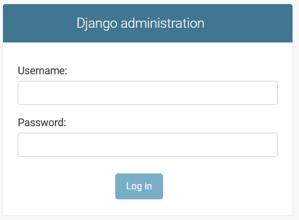
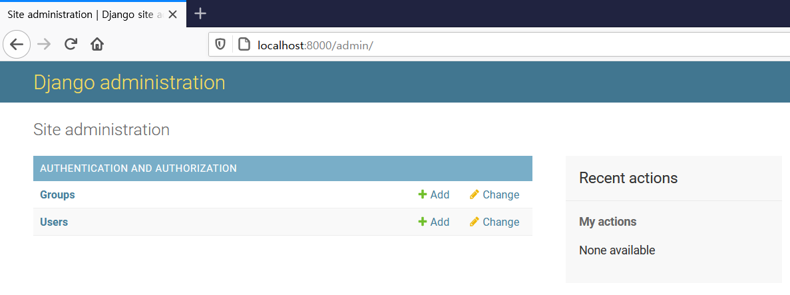
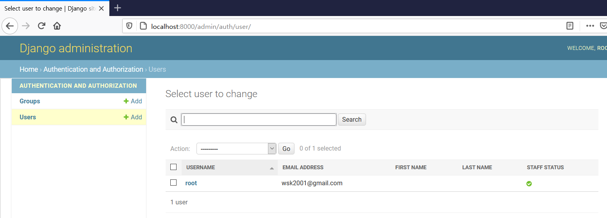

# 파이썬 django로 todo list web 개발하기

출처: https://lsjsj92.tistory.com/477


### get-pip.py 설치

``` bash
$ curl https://bootstrap.pypa.io/get-pip.py | python3
$ sudo apt-get -y install python3-distutils
```


### django 설치

``` bash
$ pip install django
```


###  todoSubject라는 project 생성

``` bash
$ django-admin startproject todoSubject
```


### 장고 서버 실행

``` bash
$ cd todoSubject
$ python3 manage.py migrate
$ python3 manage.py runserver 3000
```

- 동작 확인 : http://127.0.0.1:3000/
- 기본 포트인 8000 이 막혀 있어 3000 으로 테스트

### app을 만들기

app은 말 그대로 application이므로 동작하는 하나의 app을 만들게 됩니다. 여기서는 main과 todo list를 담당하는 board 2개가 필요합니다.

``` bash
$ python3 manage.py startapp todo_main
$ python3 manage.py startapp todo_board

# 생성된 File 및 Directory
$ la -al
-rwxrwxrwx 1 wonsool wonsool   0 Mar 22 07:12 db.sqlite3
-rwxrwxrwx 1 wonsool wonsool 667 Mar 22 07:09 manage.py
drwxrwxrwx 1 wonsool wonsool 512 Mar 22 07:12 todoSubject
drwxrwxrwx 1 wonsool wonsool 512 Mar 22 07:15 todo_board
drwxrwxrwx 1 wonsool wonsool 512 Mar 22 07:15 todo_main

```

todoSubject는 아까 저희가 startproject로 만들었던 것이구요. 여기에는 setting과 url 등 각종 설정을 합니다. 프로젝트 전체에 대한 설정이구요, 그리고 todo_board와 todo_main은 저희가 app을 만들었던 것입니다.


### migration 실행

자 이제 본격적인 시작에 앞서 python manage.py migrate를 진행합니다. 데이터베이스를 적용시킬 때 진행하는 방법입니다. 만약 데이터 베이스가 추가되거나 설정이 바뀌면 make migrations를 통해 만들어주고 migrate를 해주면 됩니다.

``` bash
$ python3 manage.py migrate
```

그리고 나서 다시 python3 manage.py runserver를 합니다. 이후 주소를 http://127.0.0.1:8000/admin으로 들어가면 login 화면이 나옵니다. 여기는 슈퍼계정(관리자 계정)으로 들어가는 장소입니다.

#### 확인

``` bash
$ python3 manage.py runserver
```





### 관리자 계정 생성

python3 manage.py createsuperuser를 통해 관리자 계정을 생성합니다.

``` bash
$ python3 manage.py createsuperuser
Username (leave blank to use 'wonsool'): root
Email address: wsk2001@gmail.com
Password: root
Password (again): root
The password is too similar to the username.
This password is too short. It must contain at least 8 characters.
This password is too common.
Bypass password validation and create user anyway? [y/N]: y
Superuser created successfully.
wonsool todoSubject$
```

#### 확인

관리자 계정 생성 후 실행 후 접속

``` bash
$ python3 manage.py runserver

```

- http://localhost:8000/admin

  - 위에서 생성한 계정 입력 (root // root)

- 로그인 후 화면

  

여기서 저 users를 보게 되면



이렇게 관리자 계정을 볼 수 있습니다.  다음 포스팅은 페이지를 생성합니다. templates 디렉토리를 만들어서 실제 페이지를 보이게 하겠습니다!


### mysql 연동, 페이지 생성(view, template, static)

https://lsjsj92.tistory.com/478?category=837589

완성된 코드  github 주소 : https://github.com/lsjsj92/django_todo_app


 

지난번 포스팅에서 django를 설치하고 앱을 생성하고, 데이터베이스 migrate도 해보았습니다.

그리고 admin user를 만들었죠

이번 포스팅은 이제 실제 웹 페이지를 띄우도록 합니다

view와 template부분, static 부분을 연동하는 과정을 진행합니다.

todo list 게시판을 만들기 위한 전초 작업입니다.

사실.. django로 게시판 만들기와 같다고 생각하시면 됩니다.

 

저는 먼저 static 폴더를 하나 만들었습니다. todo_main에 디렉토리를 하나 만들어서 그 밑에 css, js를 만들고

그 아래에 필요한 라이브러리 파일을 넣었습니다.

sortable.js는 마우스 드래그를 통해 게시판 목록을 섞을 수 있는 js이고, css에 들어간 것은 부트스트랩(bootstrap)을 활용하기 위한 css 파일입니다.

css는 저 파일들이 다 필요하지 않습니다. 부트스트랩만 적용이 되면 됩니다!

위 파일들은 구글링을 통해 받을 수 있습니다. 그리고 굳이 iso.css, animate.css 이게 다 필요는 없습니다.

단지, 부트스트랩만 되면 됩니다

 


 

그리고 todoSubject의 프로젝트 폴더에 들어가서 settings.py를 확인합니다.

 


 

여기에서 저희가 추가했던 app을 추가해줍니다. INSTALLED_APPS에다가 추가해주시면 됩니다

 


 

그리고 밑에 LANGUAGE_CODE와 TIME_ZONE, STATIC_URL, MEDIA_URL 등을 설정해줍니다.

언어는 당연히 한국이 되어야 하구요. static파일과 media 파일이 어디로 들어갈지 경로를 설정해주는 것입니다.

 

 


 

그리고 아까 todo_main -> static 디렉토리에 넣었던 자료들이 적용되게 하기 위하여

python manage.py collectstatic을 진행합니다

 


 

그러면 위와 같이 todo_main이 아닌 프로젝트 제일 상위 디렉토리 아래에 static이 만들어진 것을 볼 수 있습니다.

 


 

다음은 다시 settings.py에 가서 mysql과 연동하기 위한 설정을 진행합니다.

pymysql이 설치되어 있으셔야 합니다.

pip install pymysql로 간단히 설치가 가능합니다

 


 

그리고 데이터베이스 설정값을 넣어줍니다.

 

### 저 데이터베이스 NAME 그대로 사용하실 필요가 없습니다.

### 여러분들이 사용하시는 설정으로 바꾸시면 되세요!

저도 사진으로는 programmers_subjects라고 나와있지만, 실제로는 todo_app 으로 명명했습니다.

 

mysql을 사용하기에 mysql과 관련된 설정을 하고 db이름, db계정, 비밀번호, db호스트 등의 정보를 넣어줍니다.

아직 사용하지는 않습니다. 하지만, DB 정보는 있어야 하기 때문에 DB는 만들어두세요!

 

자 이제 django와 mysql 연동이 되었습니다.

이제 본격적으로 project와 app을 연동해보죠


 

todoSubject의 프로젝트 폴더로 들어가면 urls.py가 있습니다

 


 

이 부분을 위와 같이 수정합니다.

만약 localhost:8000/ 으로 들어오면 todo_main.urls에 연동시키겠다

만약 localhost:8000/index으로 들어오면 todo_main.urls에 연동시키겠다 이런 뜻입니다

그러면 todo_main.urls에서 받을 준비를 해야겠죠?

 


 

여기도 마찬가지로 urls.py를 만들어줍니다. 여기는 처음에는 없을겁니다. 만들어주시면 됩니다

 


 

그리고 위와 같이 만들어줍니다.

만약 todo_main으로 localhost:8000 패턴으로 오게 된다면(r'^$') Todo_main.as_view 행동을 취해라! 이런 뜻입니다.

그러면 Todo_main은 어딨을까요?

이 부분은 view에서 설정해줍니다

 


 

view.py에 가셔서 generic view를 통해 페이지를 만들어줍니다.

django에서는 function based view와 generic view 크게 2가지 형태의 view 개발이 있습니다.

function based view는 사용자가 세세하게 코딩할 부분이 있으면 사용합니다.

generic view는 간편하게 사용할 수 있고 코드가 매우 간결하고 단순합니다.

저는 이 generic view와 function based view를 섞으면서 진행할 것입니다. 필요에 따라서 나뉠 것입니다!

아무튼 저렇게 하면 Todo_main에는 TemplateView(일반적인 view)를 보여주는데 get 방식으로 받았을 때는

todo_main/index.html 로 이동하라! 라는 것입니다

 


 

그러면 todo_main에 index.html을 만들어줘야겠죠

templates라는 디렉토리를 만들고 그 밑에 todo_main 폴더를 하나 더 만들고 그 아래에 index.html을 만들어줍니다

 


 

그리고 위와 같이 내용을 아무렇게나 사용하고

python manage.py runserver를 가동!

 


 

이렇게 나오게 됩니다

이번 포스팅은 여기까지입니다!


### 3편. template extends

#### 완성된 코드는 아래 github 주소에 있습니다!

#### 도움이 되셨다면 좋아요와 깃허브 스타를 눌러주세요! 저에게 있어 큰 힘이 됩니다 ㅠㅠ

#### https://github.com/lsjsj92/django_todo_app

 

지난 포스팅에 app을 만들어서 화면을 띄웠습니다

이번 포스팅은 상단 메뉴 header 부분을 따로 빼놓고 실제 main은 이 header를 extends 하는 방법을 사용해서

템플릿을 따로 만들어 놓겠습니다.

장고에는 template language가 있습니다. html 템플릿 안에서 ,  문 등을 사용할 수 있죠

그리고 저희가 앞서 static 폴더에 파일을 놓은 것을 을 통해 가져올 수도 있습니다

그리고 위에서 말씀드린 것처럼 템플릿 상속도 가능한데요!

이렇게 하는 이유는 기능 별로 template을 따로 만들고 공통적인 것이 한 번에 관리 되도록 하기 때문입니다.


 

앞 포스팅을 보셨다면 common 디렉토리에 header.html이 있으신 것을 보셨을 겁니다

그 header 부분입니다. header는 여러분들이 꾸미고 싶은대로 꾸미시면 됩니다

그리고 저는 중간에  ~ 을 만들었습니다.

이 부분은 블록이라는 개념인데요. 이 블록을 이제 상속 받은 자식 템플릿이 구현해줍니다

 


 

이렇게 말이죠!



  

​    내용

  

이런 식으로 만들어주면 됩니다

extends는 말 그대로 위의 header.html을 상속하겠다는 이야기고, block은 위에서 설명드린 것처럼 main block에 자식 템플릿이 구현을 하는 영역입니다

 


 

그리고 static을 인지해야하는데요

저희가 앞서 javascript 파일들과 css 파일들을 static 폴더에 넣었습니다.

그 파일들은 위와 같이  로 해주시면 됩니다

 

 


 

자! 이렇게 하니까 위와 같이 화면이 나오네요 ㅎㅎ

이제 다음 포스팅에서 진행됩니다


### 4편. mysql 연동과 값 가져오기

완성된 코드는 아래 github 주소에 있습니다!도움이 되셨다면 좋아요와 깃허브 스타를 눌러주세요!

저에게 있어 큰 힘이 됩니다 ㅠㅠ

https://github.com/lsjsj92/django_todo_app

 

지난 포스팅에서 간단하게 django와 mysql을 연동했습니다.

하지만 값을 가져오거나 그런 행동을 취하진 않았죠

그냥 settings.py에다가 pymysql을 가져와서 설정만 해주었습니다.

이제 실제 db를 가져오고 연동하는 방법을 알아보겠습니다

MTV 패턴에서 M(Model)부분에 해당됩니다

 


 

CREATE DATABASE todo_app;


use todo_app;


CREATE TABLE TODO_LIST(
NO INT NOT NULL AUTO_INCREMENT PRIMARY KEY,
PCODE CHAR(4) NOT NULL,
USER_ID VARCHAR(50),
TITLE VARCHAR(200),
CONTENT VARCHAR(1000),
IS_COMPLETE BOOLEAN,
PRIORITY INT,
END_DATE DATE
);


CREATE TABLE PROJECT_CODE(
PCODE CHAR(4) NOT NULL PRIMARY KEY,
PNAME VARCHAR(100) NOT NULL
);


insert into PROJECT_CODE(PCODE, PNAME) values('1', '수진일정');
insert into TODO_LIST(PCODE, USER_ID, TITLE, CONTENT, IS_COMPLETE) values('1', 'guest', '공부하기', '자바와 파이썬 공부', false);
insert into TODO_LIST(PCODE, USER_ID, TITLE, CONTENT, IS_COMPLETE, END_DATE) values('1', 'guest', '운동하기', '뱃살좀 빼자..', false, '2019-05-20');
insert into TODO_LIST(PCODE, USER_ID, TITLE, CONTENT, IS_COMPLETE, END_DATE) values('1', 'guest', '개발하기', 'todo list!!!', false, '2019-05-18');
insert into TODO_LIST(PCODE, USER_ID, TITLE, CONTENT, IS_COMPLETE) values('1', 'guest', '힘내기!', '할 수 있어 임마', true);
insert into TODO_LIST(PCODE, USER_ID, TITLE, CONTENT, IS_COMPLETE, END_DATE) values('1', 'guest', '마감기한', 'todo list!!!', true, '2019-05-18');
insert into TODO_LIST(PCODE, USER_ID, TITLE, CONTENT, IS_COMPLETE, END_DATE) values('1', 'guest', '마감기한 테스트', 'todo list!!!', true, '2019-05-17');


alter table todo_list add PRIORITY INT AFTER IS_COMPLETE

 

데이터베이스 설계는 위를 따라하시면 되겠습니다!

 

 

저는 위와 같이 데이터베이스에 값을 넣은 상태입니다

 


 

보통은 이렇게 models 파일에 값을 설정합니다. class가 하나의 테이블이라고 생각하시면 됩니다

그리고 그 밑에 modesl.AutoField는 auto_increment이구요 CharField는 캐릭터 필드, TextField는 Text필드 등을 뜻합니다. DateField는 데이트 값이겠죠 ㅎㅎ

이렇게 하고 나서 DB에 적용시키면 됩니다

적용 시키는 과정은 아래와 같습니다

 


 

데이터베이스를 적용시키기 위해서 model이 적용되도록 합니다. 

여기서 makemigrations와 migrate 명령어가 있습니다.

makemigrations는 models.py에 적용된 내용을 파일로 생성하는 것입니다. 일종의 초안? 작업이라고 보시면 되죠

그리고 그 적용 사항을 migrate 명령어를 통해 실제 db에 적용시켜줍니다

 

근데 저는 이미 db를 만들어놨습니다.

굳이 저 작업을 할 필요가 없죠

그러면 이미 만들어진 db를 어떻게 models.py에 옮겨놓느냐?? 그게 문제죠

장고는 이런 것들을 지원해줍니다.

python manage.py inspectdb 명령어를 통해

db를 감지합니다.

 


 

이렇게요!

그럼 db 내용들이 쭉 나오는데요

 


 

제꺼는 여기 나오네요!

엄청 간단하죠. 이 내용을 가지고 models 파일에 넣어주면 됩니다

그냥 복붙 하시면 됩니다!

 


 

짠! 이렇게 복붙했습니다

매우 간단하죠?

 


 

그리고 적용을 다시 시켜줍니다. 아직 파일로 읽히고 연동이 되진 않은 상태입니다

models.py가 변화가 있었으니까요!

자 이제 db 값을 실제로 가져와야겠죠??

 


 

views.py에 가서 위와 같이 진행을 합니다.

from .model import TodoList를 가져와서

todo_list = TodoList.objects.all()을 통해 모든 객체를 가져옵니다

그리고 그 결과 값을 {"todo_list": todo_list} 에 담아서 이제 template으로 넘겨줍니다~

 


 

템플릿에서는 view를 통해 넘어온 데이터를 받아야겠죠?

todo_list라는 값을 받았습니다. 그러면 django template language를 사용하면 됩니다.



  {{ list.title }}



 

를 통해 값을 가져오죠!

 


 

이렇게 가져와서 출력이 되는 것을 확인할 수 있습니다!!

근데 그냥 저렇게 출력되는 것은 너무 무미건조하죠?

그래서 조금?? 꾸며봅시다

 


 

바로 input type checkbox를 통해 값을 넣어줍니다

별것없죠 ㅎㅎ..


이렇게 나옵니다!

이제 다음 포스팅에서 계속 진행됩니다~


### 5편. django form을 이용한 게시판 글쓰기

완성된 코드는 아래 github 주소에 있습니다!

도움이 되셨다면 좋아요와 깃허브 스타를 눌러주세요! 저에게 있어 큰 힘이 됩니다 ㅠㅠhttps://github.com/lsjsj92/django_todo_app

 

이번 포스팅은 django의 forms.py를 이용해서 todo 게시판에 글을 작성하였을 때 글쓰기가 가능하게 만들어봅니다~

실제 mysql에 데이터도 넣어지는 것을 확인할 수 있습니다

django에서 forms.py는 form을 만들어주는 역할을 합니다. form은 말 그대로 폼인데요. 회원가입 폼, 로그인 폼 등 어떠한 폼을 만들면 forms.py를 통해 직접 django가 만들어줍니다~


 

todo board 아래에 보시면 forms.py가 있을겁니다. 저것을 이용합니다

 


 

forms.py에는 models을 import합니다. from .models import TodoList를 통해 TodoList 모델을 가져옵니다.

그리고 forms.ModelForm을 상속받고 class Meta 안에 model은 TodoList고 필드는 title, content, end_date를 작성합니다. ModelForm은 Meta class에게 의존하여 필드를 자동으로 생성해줍니다


 

그리고 메인에서 위와 같이 일정추가 버튼을 만들어줍니다.

(아래에서는 글쓰기 버튼으로 나오게 됩니다. 수정하는 단계에서 버튼 text가 바뀌었습니다. 죄송합니다.)

이제 urls.py에 대한 내용을 나중에 추가해주면 됩니다.

일단은 insert.html을 따로 만들어서 아래와 같이 내용을 추가해줍니다.

 


 

insert.html에서는 위와 같이 만들어줍니다.

form method는 POST로 설정하고 을 통해 데이터가 보안상 잘 가져오도록 해줍니다.

이것은 CSRF 문제인데요. CSRF란 사이트 간 요청 위조(Cross-site request forgery)라는 웹사이트 공격 중 하나를 말합니다. 그리서 이런 취약점을 막기 위해서 CSRF 토큰 방식을 django는 제공합니다. 그래서 장고는 POST를 할 때 저 방식을 써줘서 토큰이 유효한지 체크한다고 합니다.

 


 

뭐 아무튼 저렇게 하면 폼이 이렇게 짠! 하고 나올겁니다. ㅎㅎ 알아서 나와주죠

(바로 나오지 않습니다. 아래 과정을 해야 이렇게 나오는 것입니다!)

 

그리고 잠깐 models.py로 돌아갑니다

 


 

여기에서 def todo_save(self): self.save()를 만들어줍니다.

즉, 저장 버튼을 누르면 바로 저장을 하지 않고, todo_save 함수를 호출하면 그제서야 저장을 하도록 합니다.

이렇게 하는 이유는 여러가지가 있습니다만, 저는 save하기 전에 defalut로 db 값을 넣어주도록 하기 위해서 했습니다.

예를 들어서 넣자마자 is_complete는 1이 아닌 0의 값을 가져야 하기 때문에 0으로 넣어주는 등의 작업이죠!

 


 

그리고 다시 insert.html로 돌아와서 form action을 넣어줍니다. url은 todo_board:todo_board_insert로 가라~ 라고 

명시를 해줍니다. 그러면 save 버튼을 누르게 되면 저 url로 이동하게 됩니다.

 

근데 아까도 글쓰기(일정추가) 버튼을 누르면 todo_board_insert로 가게 했죠?

여기서는 글쓰면 save가 되는 것이니 POST로 넘어갑니다.

아까는 단순히 페이지가 넘어가니까 GET으로 넘어갑니다.

이것에 대한 설정을 해줘야합니다.

 

 


 

urls.py로 가서 url을 만들어줍니다. todo_board_insert라는 name을 가졌고 저 url을 오면 views.check_post로 가도록 합니다

 


 

check_post는 위와 같습니다. POST일 때와 GET일 때로 나눠집니다. post일 때는 request.POST를 통해 값을 가져오고 is_valid()를 이용해서 유효한지 검사합니다. 유효하면 form.save를 하는데요. 여기서 commit=False로 합니다.

이후 저희가 아까 만들었던 todo_save() 함수를 호출해서 최종적으로 저장하도록 만들었습니다

그리고 완료가 되면 todo_board_success.html로 가게 했는데요

 


 

todo_board_success.html은 위와 같이 했습니다. message를 alert으로 띄어주고, todo_board:todo_board로 다시 돌아가게 했습니다

 


 

이제 실제로 넣어봅니다.

넣기 전에는 위와 같이 있었습니다.

 


이제 여기에 데이터를 삽입합니다

date는 아직 구현을 안했으니 그냥 아무것도 넣지 않고 넣어줍니다

save!

 


 

추가했다는 메세지가 나옵니다

그리고!

 


방금 넣었던 이수진 데이터 삽입!이 보이게 됩니다 ㅎㅎ

자! 여기까지 해서 django 게시판 글쓰기 (board write)를 구현했습니다~


### 6편. detail view

완성된 코드는 아래 github 주소에 있습니다!

도움이 되셨다면 좋아요와 깃허브 스타를 눌러주세요! 저에게 있어 큰 힘이 됩니다 ㅠㅠhttps://github.com/lsjsj92/django_todo_app

 

 

지난 포스팅까지 forms.py를 이용해서 글을 쓰고 실제로 mysql db에 들어가는 것까지 보았습니다

보통 게시판이라고 하면은

글쓰기, 읽기, 수정, 삭제 이렇게 있죠?

 

현재 저희는 글쓰기까지 진행을 했는데요. 이번 포스팅은 읽기 부분입니다. 즉, 상세보기 페이지를 만들겁니다

바로 시작합니다

 


 

상세보기를 하려면 먼저 urls.py를 수정해야합니다

url 부분에 ?P<pk>[0-9]+ 부분을 넣고 detail 식으로 들어가죠?

pk는 게시판 고유 번호입니다. 즉 고유번호/detail url로 들어가면 해당 고유번호에 따른 게시판을 상세보기로 볼 수 있다는 것이죠

 


 

이제 views.py에서 view 작업을 해줍니다. generic에 있는 DetailView를 이용하면 정말 편하게 상세보기 페이지를 만들 수 있어요!

model 은 TodoList를 하고

template_name과 context_object_name을 설정해주면 됩니다.

context_object_name은 해당 object의 이름을 설정해주는 것입니다. 그래서 template에서 저 이름을 가지고 접근을 하게 되죠

 

 


 

자 그리고 list.html을 수정해줍니다.

만약 클릭을 했을 때 todo_board:todo_board_detail의 url로 가게 하는데! pk 값을 list.no로 설정해라! 라는 것입니다

 


 

그리고 todo_detail html 파일을 하나 만듭니다. 여기서 todo_list를 기준으로 접근을 하죠?

아까 context_object_name에 설정해준 이름입니다

그래서 제목과 컨텐츠를 가져오겠다~ 라는 뜻입니다

 

여기까지 하고 다시 서버를 재실행합니다!

python manage.py runserver를 진행

 

 


 

그럼 해당 게시판 리스트가 있는 페이지에서 리스트 목록을 누릅니다

그러면 게시판 상세보기가 되어야겠죠?

 


 

이렇게 게시판 상세보기가 됩니다

여기까지가 파이썬 장고를 활용한 todo 게시판 만들기 상세보기 편이었습니다

다음에는 게시판 업데이트(update) 부분을 진행합니다


### 7편. update view

완성된 코드는 아래 github 주소에 있습니다!

도움이 되셨다면 좋아요와 깃허브 스타를 눌러주세요! 저에게 있어 큰 힘이 됩니다 ㅠㅠhttps://github.com/lsjsj92/django_todo_app

 

 

지난 포스팅까지 python django 프레임워크를 활용해서 todo 게시판 만들기 detail view와 list view를 만들었습니다.

이제 게시판에 필요한 update(수정)과 delete(삭제)만 남았군요!

이번 포스팅은 게시판 수정(update)를 만들어보겠습니다

바로 시작하죠!

장고에서는 update와 관련한 기능도 제공해줍니다. 그것을 활용할 것입니다


 

먼저 상세보기 페이지에서 수정 키워드를 넣습니다

update를 하기 위하여 todo_board:todo_board_update의 urls.py에 하나를 추가를 해야 하겠죠?

그리고 수정을 하려면 고유 pk값이 필요하기에 list.pk를 넣어줍니다

 


 

해당 url을 받을 수 있도록 update url을 만들어줍니다. 상세보기 페이지 때와 마찬가지로 pk 값을 받을 수 있도록 (?P<pk>[0-9]를 받게 합니다

 


 

django에서는 수정과 관련된 뷰를 제공해줍니다

generic.updateview가 그것입니다. update와 관련된 기능을 제공해주기에 save 기능과 form 데이터를 받아오는 기능이 필요합니다.

왜냐하면 수정할 때 게시판에서 작성한 글을 가지고 와서 update를 해야하기 때문이죠

똑같이 model은 todolist를 받습니다. fields는 title, content, date를 받구요

만약 form이 유효하다면 form_valid 함수를 실행합니다. 그리고 form.save()를 통해 저장하도록 만들어둡니다

그리고 get으로 수정 페이지에 들어간다면(수정 페이지에서 수정완료 버튼을 누른 상태가 아닙니다. 상세보기 -> 수정 버튼을 눌렀을 때 나오는 페이지입니다)

기존에 작성한 내용이 적용되어 있어야겠죠? 그래서 object를 받아오고 get_form_class를 통해 폼을 가져옵니다.

이후 get_context_data를 통해서 context를 만들고 render_to_response를 해주면 그 전에 있던 값이 적용될 것입니다.

 


 

이제 실제 수정을 해보겠습니다

내가 원하는 게시글을 클릭을 합니다

게시판 리스트 중에서 아무거나 클릭!


 

그럼 url이 상세보기 화면으로 바뀝니다.

아까 수정 버튼을 만들었죠? 저 수정을 누릅니다

 


 

그러면 update로 url이 바뀌는 것을 볼 수 있습니다!

또한, 기존에 작성했던 내용이 적용되어 있는 것을 볼 수 있죠

여기서 게시판 내용을 입력하고 수정하면

 


 

업데이트 되었다는 알람과 함께

 


 

수정이 되었을 겁니다

다시 저 게시글 상세보기로 들어가면

 


 

수정이 되어있는 것을 확인할 수 있습니다!

여기까지가 파이썬 장고를 활용해서 todo 게시판 만들기 수정(update) 편이었습니다

다음 포스팅은 삭제(delete)를 구현하겠습니다.


### 8편. delete view

완성된 코드는 아래 github 주소에 있습니다!

도움이 되셨다면 좋아요와 깃허브 스타를 눌러주세요! 저에게 있어 큰 힘이 됩니다 ㅠㅠhttps://github.com/lsjsj92/django_todo_app

 

 

지난 포스팅까지 진행하면서 update view까지 만들었습니다.

이제 게시판에 필요한 delete view를 만들어봅니다

그러면 todo app에 필요한 추가(write), 상세보기(read), 수정(update), 삭제(delete)까지 전부 완성됩니다 ㅎㅎ


 

먼저 삭제 버튼을 만듭니다.

 


 

마찬가지로 delete에 해당되는 url을 만들어줍니다

게시판을 삭제해야 하니까 pk값이 필요합니다. pk값도 넘겨주는 코드를 작성합니다

 


 

그리고 django의 generic의 deleteview를 상속해줍니다

이 deleteview를 이용하면 손쉽게 삭제 화면을 만들 수 있습니다

그러면 여기까지 하고 실행을 해보죠

 


 

진행을 하면 위와 같이 에러 화면이 나올 것입니다. 이 화면의 에러가 무엇이냐?

template does not exist 하다는 것입니다. 그럼 어떤 template이 존재하지 않은 것인가?

todolist_confirm_delete.html 페이지가 없다고 나오네요

그럼 해당 페이지를 만들어줍니다

 


 

 templates에 위와 같이 todolist_confirm_delete.html 파일을 만들어줍니다

 


 

그리고 내용은 위와 같이 작성합니다

csrf_token을 받아오고 제목을 화면에 표시해주면서 정말 삭제하나요? 라고 물어봅니다

삭제는 함부로 지울 수 없기에 꼭 한 번 물어봅니다

그리고 버튼을 만들어서 confirm하도록 합니다

 


 

자 이제 기능이 동작이 되는지 확인해봅니다

먼저 게시판에 테스트로 추가한 아무 데이터를 클릭합니다

 


 

그러면 위와 같이 삭제가 나와 있을 탠데요

저 삭제를 눌러줍니다

 


 

그러면 방금 만든 confirm.html을 통해서 deleteview가 연동이 되어 삭제 화면이 위와 같이 나옵니다

confirm을 눌러줍니다

 


 

실제로 삭제가 된 것을 확인할 수 있습니다

자! 여기까지가 파이썬 장고(django)를 활용해서 게시판 글쓰기, 글 수정, 글 삭제, 글 읽기를 구현했습니다!

이제 다음 글에서는 일정에 대한 로직이 아직 구현이 되어 있지 않은데요

이 날짜에 대한 로직을 추가하려고 합니다~

그리고 python django와 restful api를 연동시켜서 개발을 진행하도록 합니다


### 9편. 일정에 날짜 값 삽입

완성된 코드는 아래 github 주소에 있습니다!

도움이 되셨다면 좋아요와 깃허브 스타를 눌러주세요! 저에게 있어 큰 힘이 됩니다 ㅠㅠhttps://github.com/lsjsj92/django_todo_app

 

 

지난 포스팅에서 python django를 활용하여 게시판 만들기

todo 게시글 추가, 상세보기, 수정, 삭제를 만들었습니다

근데 아직 일정에 date 값을 넣지 못했는데요

todo list에서 마감 시간까지 넣을 수 있는 end date 값을 넣을 수 있게 해봅니다

 

보통 일반적으로 bootstrap(부트스트랩) 등을 이용해서 date 정보를 input하려고 하면

calcalendar를 만들거나 하는 등으로 날짜를 입력 받을 수 있게 구현을 해줘야합니다.

이게 말이 쉽지 결코 쉽지 않습니다. 어떤 날짜는 28일이고 어떤 날짜는 30일이고 31이고 다 다르기 때문이죠

또한, ui로 만들어줘야 사용자가 쉽게 이용할 수 있습니다. 이런 것들이 조금 힘들죠

하지만 django에서는 이러한 date input을 쉽게 해줍니다

DATE_INPUT_FORMAT을 이용하면 됩니다


setting.py에다가 DATE_INPUT_FORMATS를 해줍니다

그러면 DATE를 입력 받는 장소가 아래 사진처럼 될 것입니다

 

 


 

이렇게요! 정말 신기하지 않나요

장고의 강력함이라고 생각할 수 있습니다

 


 

그리고 현재 날짜와 비교를 해서 기한을 체크해줍니다

 

해당 코드는 Ajax 등의 코드가 들어가면서 코드 길이가 상당히 길어졌습니다.

그래서 게시글 위에 깃허브 주소를 참고하셔서 소스 코드를 보시는 것을 추천드립니다.

복잡하게 이 코드, 저 코드 설명하면 더 혼란을 초래할 것 같아서 이와 같이 진행하였음을 양해 부탁드립니다.

 

현재 날짜 기준으로 기한이 지난 일정들이나, 마감 날짜가 다가오는 일정들을 체크해주기 위함이죠

저런 것들을 체크해주면 알람식으로 보여줄 수 있을 겁니다

 


 

이렇게 말이죠

ui를 개인적으로 조금 바꿨습니다

기한 있는 일정과 기한 없는 일정, 마감 된 일정을 나누어서 넣었습니다

date에 대한 로직만 추가하고, ui만 바꾸면 되는 것입니다 ㅎㅎ

 

이번 포스팅은 여기까지 입니다!

위에서도 말씀드렸지만 꼭 깃허브 코드를 참고하시길 바랍니다.

#### 하트와 스타는 저에게 큰 힘이 됩니다.


### 10편. Ajax를 활용해보자

완성된 코드는 아래 github 주소에 있습니다!

도움이 되셨다면 좋아요와 깃허브 스타를 눌러주세요! 저에게 있어 큰 힘이 됩니다 ㅠㅠhttps://github.com/lsjsj92/django_todo_app

 

 

지난 포스팅까지 진행하면서 파이썬 장고를 활용해 todo 게시판 만들기 틀이 갖추어졌습니다.

게시판 삭제, 수정, 글쓰기, 상세보기와 날짜를 추가하는 과정도 넣었는데요

 

아무래도 웹 개발을 하다보면 Ajax를 많이 쓰기 마련입니다.

AJax는 JavaScript의 라이브러리중 하나이죠~ 이것을 사용하면 자바스크립트를 활용해서 비동기 통신이 가능합니다.

여기서 비동기 방식이라는 것은 웹페이지를 reload(새로고침 등)하지 않고 데이터를 불러오는 과정을 뜻합니다. 즉 새로고침 과정이 필요없고 백단 서버에서 처리한 결과를 보여줄 수 있는 것이죠

 

이제 todo 게시판에서 Ajax를 활용해 게시판을 효과적으로 만들어봅니다

바로 체크박스(checkbox)에서 체크박스가 클릭, 해체 되었을 때 Ajax를 활용해 통신하는 방법입니다


이렇게 페이지가 되어 있으면

저 체크박스를 클릭을 하게 되면 일정이 마감되는 것입니다.

일정이 마감되면 일정 -> 마감 일정으로 옮겨야 되죠

즉, 오른쪽 마감 된 일정을 보시면 체크박스가 쳐진 것을 볼 수 있습니다. 그리고 기한 있는 일정과, 기한 없는 일정은 체크박스가 체크 되어 있지 않죠

이런 것을 체크박스를 체크했을 때 Ajax를 활용해 바로바로 이동하는 것을 보여줄겁니다.

 

 


이를 위해서 데이터베이스 table에 IS_COMPLETE를 둡니다. 0이면 마감이 되지 않은 것. 1이면 마감이 된 것입니다.

그러면 저 체크박스가 클릭 되었을 때 이벤트(event)가 추가되어야 하죠?

그 이벤트 추가는 JavaScript로 합니다.


 

자 이렇게 합니다.

먼저 document.getElementsByName()을 통해서 이름을 통해 checkbox 내용을 가져옵니다.

그리고 일정이 마감 된 것들은 checked를 True로 둡니다. (디비에 값이 따로 저장되어 있으니까요)

 

자 이제 Ajax를 활용해서 체크박스가 클릭되었을 때 이벤트를 추가해야하는데요

 


 

여기서 보시면 input[name*=complete]가 되어 있는데요. input type에서 name이 complete가 포함된 모든 애들에 대해서 change 즉, 바뀌었을 때 이벤트를 추가한다는 것입니다.

그리고 그 이벤트가 만약 is checked이면, pk 값을 가져오고 그 값과 함께 ajax를 통해서 django server단으로 보내줍니다.

url과 data가 있는데요. url은 django url으로 써주면됩니다.

그리고 데이터는 pk값을 보내줍니다

이후 만약 성공이 되면 window.location.href를 통해 url을 이동시켜줍니다.

 


 

그리고 체크박스가 해제되었을 때는 위와 같이 이벤트 처리를 합니다.

url만 다르고 나머지는 같습니다.

 


 

그러면 url이 추가되었죠? 이 url을 추가시켜줍니다.

urls.py에 가셔서 위처럼 url을 추가시켜 주시면 됩니다.

 


 

그리고 views.py에서 function base 부분에서 해당 request에 따른 로직을 추가해줍니다.

아까 data에서 pk 값을 보냈죠? 이 pk값을 보냅니다.

그리고 이 pk 값을 활용해서 checkbox_event로 보내주고 그 결과 값을 return해줍니다.

 


 

자! 그럼 테스트를 해보죠

여기서 저 위의 빨간색 체크박스는 지금 기한 있는 일정이고 마감이 되어 있지 않습니다.

저 체크박스를 누르면~

 


 

이렇게 화면이 이동이 됩니다!

 


그리고 실제 db 값에서도 바뀐 것을 볼 수 있습니다.

이렇게 Django에서 Ajax를 활용하는 방법에 대해서 알아보았습니다


### 11편. Ajax로 우선순위 바꾸기

완성된 코드는 아래 github 주소에 있습니다!

도움이 되셨다면 좋아요와 깃허브 스타를 눌러주세요! 저에게 있어 큰 힘이 됩니다 ㅠㅠhttps://github.com/lsjsj92/django_todo_app

 

 

지난 포스팅까지 진행하면서 django에서 Ajax를 활용한 것을 보여드렸습니다.

Ajax를 활용해서 checkbox 체크 여부에 따라 일정이 완료 되었는지, 완료되지 않았는지 바로바로 보여질 수 있도록 했죠

그러면 게시판 글쓰기, 수정하기, 삭제도 되고 Ajax를 활용해서 일정 완료 여부 기능까지 만들었는데요

이번 포스팅에서 뭘 할것이냐?

이 Ajax를 다시 사용해봅니다

그래서 일정의 우선순위를 만들어서 우선순위 별로 정렬되어 웹 화면에 출력이 되도록 할 것입니다!


 

먼저 DB에서 PRIORITY 컬럼을 추가해줬습니다. 이 정보에는 우선순위에 대한 정보가 들어가있는데요

숫자 값으로 되어 있습니다.

 


 

제가 생각하는 것은 이미 마우스 드래그를 하면 저 div 영역이 바뀌는 것은 템플릿상 되어 있으니까

저렇게 드래그 해서 아래에 있는 '우선순위 저장' 버튼을 누르면 우선순위가 저장이 되어 화면에 출력이 되도록 하는 것입니다. 

 


 

그러기 위해서 먼저 위와 같이 div 영역에 div_pk라는 임의의 속성을 두어야 합니다. 이 속성을 이용해서 정렬 데이터를 핸들링할 것입니다. 이 속성 값에는 list.no 즉, pk 값을 넣어줍니다 

 


 

그리고 우선순위 저장 버튼을 만들어주는데요

javascript onclick event를 활용해서 priority_save() 함수를 호출하도록 합니다.

 


 

priority_save 함수는 위와 같습니다. list-group을 가지고 와서 아까 설정한 div_pk를 key로, 그리고 value는 i + 1로 해서 둡니다.

이렇게 하면 key-value 쌍으로 어떤 no의 값을 가진 todo 일정이 1번째, 2번째 인지 알 수 있죠!

그리고 ajax를 통해서 todo_board:todo_board_save_priority로 넘겨주게 합니다.

데이터는 위에서 만든 todo_dict을 보내주고요!

 


 

자 그러면 views.py로 와서 위 처럼 코드를 작성해줍니다.

우선 순위가 어떻게 왔을까요?

print를 이용해 찍어봅니다.

 


 

자! 이렇게 나와있습니다. 1번 pk를 가진 todo는 4번째 우선순위, 2번 pk 값은 3번째 우선순위를 가지고 있네요

즉, 이렇게 우선순위 데이터를 가져와서 얘를 핸들링 해주면 됩니다 

 


 

실제로 개발자 도구를 통해 보면 위 처럼 우선순위별, div_pk가 있는 것을 볼 수 있습니다!

빨간색 동그라미 오른쪽에 priority 값이 있죠!

 


 

그래서 먼저 위와 같은 화면에서 진행됩니다.

 


우선순위는 위 사진처럼 되어 있습니다.

운동하기가 우선순위 4번, 친구들 약속이 1번, 블로그 글 올리기는 없고, 프로젝트 하기가 3번, rest api 공부하기가 2번입니다.

실제 웹 화면에서도 위 priority 기준으로 정렬이 되서 출력이 되어 있죠!

 

 


 

자! 이제 우선순위를 위 화면처럼 바꾸었습니다. 마우스 드래그로 바꾸었고

이제 우선순위 저장 버튼을 눌러봅니다!

친구들 약속이 우선순위 1번이었는데 아래로 내려갔고 rest api도 2번이었는데 1번으로 올라갔죠???

 


 

저장 버튼을 누르면 위 화면처럼 실제 db에 적용이 된 것을 볼 수 있습니다.

 


그리고 웹 화면에서도 위 처럼 보이게 되죠!

자! 여기까지가 ajax를 활용해서 우선순위를 저장하는 방법이었습니다.

django를 활용한 게시판 만들기가 거의 막바지로 왔네요

다음 포스팅부터는 django에 rest api를 적용하는 글을 차례대로 작성하겠습니다.


### 파이썬 Django REST API 개발 - 1편. djangorestframework 설치 및 셋팅

완성된 코드는 아래 github 주소에 있습니다!

도움이 되셨다면 좋아요와 깃허브 스타를 눌러주세요! 저에게 있어 큰 힘이 됩니다 ㅠㅠhttps://github.com/lsjsj92/django_todo_app

 

 

파이썬 장고(django)로 웹 개발하는 시리즈를 오랜만에 올립니다.

이미 내용은 다 있지만 블로그에 올릴 시간이 없었네요 ㅎㅎ

지난번 내용은 장고와 Ajax를 연동시켜서 웹 개발을 하는 것까지 진행했습니다.

(https://lsjsj92.tistory.com/490)

 

이번 포스팅부터는 django와 REST API를 연동하는 작업을 진행하려고 합니다.

REST API는 굉장히 많이 들어보셨을겁니다. RESTful API 라고도 하죠.

 

REST API는 HTTP의 기능도 지원해줘서 HTTP의 장점이 그대로 적용이 됩니다.

REST는 자원의 이름(resource name)을 가지고 클라이언트와 서버가 통신하는 방법을 뜻합니다.

약자가.. REpresentational Stateful Transfer였나? 아마 그랬을겁니다.

 

파이썬 장고에서는 이 REST API를 정말 쉽게 연동할 수 있습니다.

이미 라이브러리가 제공되고 있기 때문이죠!

 

자 그럼 시작해볼까요?

 


 

먼저 pip install djangorestframework를 입력해서 django rest api를 설치해줍니다.

 

아! 그리고 여기서 주의하셔야 할 것이

 

### 실제 장고(django) 서버와 REST 서버는 따로 운영이 되어야 합니다.

즉, 2개가 실행되고 있어야 한다는 것이죠!

 


 

그러면, 또 다른 project를 하나 만듭니다. 이 프로젝트는 저는 todoSubject_restfulAPI 라고 하겠습니다.

그리고 app도 하나 만들어줍니다.

저는 이 app을 todo_subject_restful_main 이라고 명명하겠습니다.

이 포스팅은 쭈욱 진행되고 있는 내용이 todo 게시판을 만드는 것이기 때문입니다.

todo board를 만드는데 있어 기존에는 그냥 DB와 연동했다면 이제 rest api와 연동하는 것이니까요

 

python manage.py startapp todo_subject_restful_main 이라고 합니다.

 


 

자! 그러면 project setting.py에 들어가보면 위와 같은 구역이 있을탠데요

여기서 INSTALLED_APPS에다가 rest_framework를 추가해줍니다.

그리고 아까 만들었던 app도 추가해줍니다.

 

 


 

그리고 추가했던 app에 보시면 serializers.py가 있어요

이 시리얼라이저(serializers)는 시리얼라이즈(serialize)라고도 불리우는데요.

이것은 객체와 같은 보기 힘든 데이터를 JSON이나 XML처럼 보기 쉽게 데이터를 바꾸어 통신하게 해주는 역할을 합니다.

그래서 여기 serializers.py에다가 시리얼라이저를 설정해주어야 어떤 데이터를 통신할 지 설정할 수 있는 것이죠!

REST API를 만들 때 필수적입니다. 데이터를 통신해줘야 하니까요

 


 

저는 serializers.py에다가 위와 같이 썼습니다. 

from rest_framework import serializers를 한 뒤 HyperlinkedModelSerializer를 상속해줍니다.

그 이후 model은 TodoList를 설정해줍니다. 통신할 모델을 설정해주는 것이죠

그리고 필드는 title, content와 같은 통신할 데이터 필드를 설정해주면 끝!

 


 

그리고 아까 만들었던 app에 해당되는 models.py에 들어갑니다.

여기에 models에 대한 설정을 해주면 됩니다.

그럼 여기에 설정한 model을 가지고 serializer 통신을 하게 됩니다.

 


 

그리고 views.py로 넘어갑니다.

view에서는 방금 만들었던 serializer와 model을 연동시켜줍니다.

rest_framework에 있는 viewset에서 modelViewSet을 가져와서 연동시켜줍니다.

 


 

다음은 urls.py입니다.

여기서는 rest_framework에서 routers를 가져옵니다.

그리고 todo_board라는 이름으로 views에 있는 방금 만들었던 view에 있는 클래스를 연동시켜주죠

 

자! 이제 이 프로젝트를 실행시켜줍니다

 

python manage.py runserver나 아니면 nginx 등을 하고 있으면 다른 것으로 할 수 있겠죠

아무튼 실행시켜줍니다!

 


 

그러면 위와 같은 화면이 나옵니다

신기하죠? 그냥 지원이 됩니다 이런 화면이 ㅎㅎ

이게 장고의 장점이지 않을까 싶습니다.

 

근데 우리가 원하는 데이터가 보이지 않네요?

아까 저희가 model.py를 통해서 model을 연동시켰죠?

근데 model은 연동시켰는데 막상 mysql과 연동은 안시켜놨습니다

 


 

그래서 setting.py에서 pymysql을 이용해서 mysql과 연동해줍니다.

 


 

이렇게 정보를 입력해주고요~

다시 실행시켜줍니다.

 


 

그리고 다시 보면 http://localhost:8088/todo"라고 적혀져있죠?

저대로 입력해봅니다

 


 

그러면 이렇게 나오는 것을 확인할 수 있습니다!

이 화면이 rest api의 R 부분이라고 보시면 됩니다

READ 부분이죠. 전체 데이터를 볼 수 있습니다.

그 외 CREATE(INSERT), UPDATE 등도 가능합니다.

기능을 추가해야겠지만요 ㅎㅎ 아무튼 가능합니다.

 


 

실제 insert를 해볼까요? 위 처럼 데이터를 입력해서 넣습니다.

POST는 REST API에서 INSERT에 해당됩니다.

PUT이 UPDATE이죠 ㅎㅎ

 


 

이렇게 하면 실제 DB에 들어간 것을 볼 수 있습니다.

 

 


그리고 파이썬에서 requests 라이브러리를 사용해서 통신을 해 가져오면 이렇게 가져오는 것을 볼 수 있습니다.

자! 여기까지 파이썬 django를 활용해서 rest api를 연동시킨 작업입니다.

이제 다음 포스팅에서 진행했던 todo app을 rest api 버전으로 바꿔보겠습니다!


### 파이썬 django로 REST API 개발하자! - 2편. django와 REST API를 이용한 게시판 개발

완성된 코드는 아래 github 주소에 있습니다!

도움이 되셨다면 좋아요와 깃허브 스타를 눌러주세요! 저에게 있어 큰 힘이 됩니다 ㅠㅠhttps://github.com/lsjsj92/django_todo_app

 

 

지난번 포스팅에서 django와 REST API를 연동해서 개발을 진행해봤습니다.

 

생각보다 어렵지 않은 작업이었죠?

이제 이 작업을 기반으로 detail view를 만들어봅니다.

지난번 포스팅이 list view였다고 생각하시면 됩니다. 하지만 이번 과정에서 조금 수정을 해주겠습니다.

 

만약, REST API를 활용해 웹 개발을 하시면 이것은 기존에 웹 게시판을 개발한 것과는 다릅니다.

기존 게시판은 단순히 웹과 DB가 연동해서 진행되었지만

이제는 REST API 서버가 DB를 바라보고 웹은 REST API를 바라보게 됩니다.

즉, DB <-> REST API <-> 웹 이렇게 구성이 되는 것이죠!

 

그러면 어떻게 detail view를 만들어 줄 수 있을까요?

REST API에서 detail view, update, delete 등이 구현이 되어 있어야 웹과 연동을 할 수 있겠죠? 

 

 


 

먼저 지난번 내용과 조금 변경되는 부분이 LIST VIEW 부분입니다. 조금 수정해주겠습니다.

rest_framework에 있는 ListAPIView를 불러옵니다.

저것을 활용해서 LIST VIEW를 만들 수 있습니다.

 


 

urls.py도 기존과 다릅니다. 지난번 내용에서 작성한 부분이 주석처리가 되었고 views.as_view() 형태의 url을 추가했습니다.

list view를 이렇게 조금 수정해줍니다.

 

 


 

자! 그러면 위와 같이 잘 나오는 것을 확인할 수 있습니다.

이제 detail view를 개발해보죠

 


 

detail view는 RetrieveAPIView를 상속해주면 됩니다.

마찬가지로 rest_framework.generics에 있습니다.

 


 

또한, serializers.py도 수정해줘야겠죠?

list view에 해당하는 시리얼라이저만 있으니 detail용 serializer를 추가해줍니다.

model과 fields를 통해 값을 설정!

 


 

url도 그에 맞게 추가해줍니다!

그러면!

 


짠!

이렇게 상세보기가 가능합니다.

 

다음 포스팅에서는 update view와 delete view를 하겠습니다.

 

그러면 REST API의 CRUD에서 C(Create)를 제외한 모든 것이 구현이 될 것입니다.


### python django REST API 개발 - 3편. django rest api update, delete

안녕하세요.

파이썬 장고를 활용한 게시판 웹 개발 14편입니다.

지난 포스팅까지 진행하면서 django rest api의 read 부분을 공부해봤습니다.

rest api에는 CRUD가 있는데요. 현재 여기서 Read 부분만 한 것이죠?

그럼 django rest api에서 Update, Delete는 어떻게 할까요?

이번 포스팅은 update와 delete에 대해서 알아봅니다.

 


 

먼저 django rest api를 위해 만들었던 프로젝트에 들어갑니다.

여기에 보시면 UpdateAPIView와 DestroyAPIView를 상속했죠?

마찬가지로 rest_framework.generics 아래에 있습니다.

 


 

그리고 delete와 update에 해당되는 url도 추가해주셔야합니다.

detail때와 마찬가지로 (?P<no>\d+)를 통해 Primary key를 이용하여서 update와 delete가 가능하도록 합니다.

 


 

자! 그럼 실제로 url로 들어갑니다.

localhost:8088/todo_list/7/update 이렇게 들어가니까 위처럼 나오게 되죠?

PUT 버튼이 있습니다. 참고로 REST API에서 update는 PUT입니다.

Create는 PUSH이구요!

 


현재 실제 값은 위 사진과 같이 되어 있습니다.

업데이트를 시켜보죠

 


 

수정하는 글을 작성합니다.

 


 

그리고 실제로 수정이 된 것을 확인할 수 있습니다!

rest api의 update는 이렇게 만들 수 있습니다.

 


 

이제 삭제를 봐보죠

localhost:8088/todo_list/8/delete로 들어갑니다.

마찬가지로 DELETE 버튼이 있는데요

 


 

삭제를 누르게 되면 한번 더 확인을 합니다.

delete 버튼을 눌러줍니다.

 


 

실제 삭제가 된 것을 볼 수 있습니다.

이것을 파이썬 프로그램이나 Django에서 사용하려면 python requests를 이용하면 됩니다.

 


 

requests.put('http://localhost:8088/todo_list/7/update/', data = d)

이런식으로요!

d는 dictionary 데이터를 넣어주면 됩니다.

 


 

실제로 값이 바뀌는 것을 볼 수 있습니다.

django에 위와 같이 requests를 이용하면 기존에 db와 연동하는 것이 아닌, rest api와 연동하여 프로그램을 작성할 수 있습니다.


### 파이썬 Django REST API 개발하기 - 4편. REST API CREATE

지난 포스팅까지 django rest api framework를 활용해서 rest api를 연동하고, update, delete, list view를 진행했었습니다.

이번 포스팅이 django rest api 시리즈 마지막편 4편입니다.

마지막은 이제 CRUD에서 하지 않았던 Create 부분을 하겠습니다.

 


 

역시 먼저 serializers.py를 설정해줘야겠죠!

serializers.ModelSerializer를 상속해줘서 create serializer를 만들어줍니다.

이제 views.py로 넘어갑니다.

 


 

views.py에서는 당연히 방금 만든 serializer를 import 해야겠죠?

그리고 rest_framework.generic에 있는 CreateAPIView를 import해줍니다.

이게 바로 create view입니다!

 


 

그리고 create를 담당하는 class를 하나 만들죠. 당연히 상속을 CreateAPIView를 해야겠구요

serializer_class를 아까 만든 CreateSerializer로 설정해줍니다.

 

다음은 urls.py입니다!

 


 

view.py에 class를 생성해놨으니 당연히 url과 연동을 해줘야겠죠? 방금 만든 class를 연동시켜줍니다.

그러면 이제 rest api에서의 create 부분은 끝!

실제로 봐봅시다

 


 

create를 담당하는 url 영역에 왔습니다.

POST 버튼이 하나 있네요? 이전 포스트에서 말씀드렸지만 CREATE는 POST, UPDATE는 PUT이라고 말씀드렸습니다.

 


 

이제 여기에 값을 입력을 해줍니다.

title, content에 해당하는 값을 입력해서 POST를 하면!

 


 

실제 DB에 들어간 것을 볼 수 있습니다.

그러면 Python 자체에서 REST API와 통신하려면 어떻게 할까요?

requests를 사용하면 되겠죠?

import requests를 하신다음

 


 

d = {

  "title":"값",

  "content" : "값",

  "is_complete" : "값"

}

이렇게 값을 넣어주시구요.

data = requests.post()를 이용해 보내주시면됩니다.

여기서도 마찬가지로 post를 쓰는 것을 볼 수 있습니다.

 


 

실제 값이 들어간 것도 DB에서 확인할 수 있습니다.

 

자! 여기까지가 djangorestframework 라이브러리를 활용해서 django rest api를 만들어보았습니다.

CRUD에서 create, read, update, delete view를 전부 만들어보았습니다.

 

이제 이것을 응용해서 rest api 서버를 구축해보시면 될 것 같네요 ㅎㅎ

