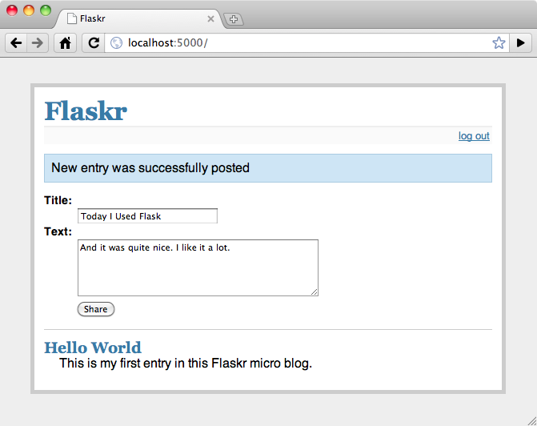

# Flask 튜토리얼

출처: https://flask-docs-kr.readthedocs.io/ko/latest/tutorial/index.html


# 튜토리얼

파이썬과 Flask로 어플리케이션을 개발하기를 원하는가? 여기서 예제를 가지고 그것을 배울 기회를 가질 수 있다. 이 튜토리얼에서는 우리는 간단한 마이크로 블로그 어플리케이션을 개발할 것이다. 텍스트만 입력가능한 한 명의 사용자만 지원하며 피드백이나 커멘트를 달 수 없다. 그러나 여러분이 시작하기에 필요한 모든 내용들이 있을 것이다. 우리는 Flask와 파이썬 범위에서 벗어난 데이타베이스로 SQLite를 사용할 것이다. 그 밖에 필요한 것들은 없다.

만약 여러분이 미리 또는 비교를 위해 모든 소스코드를 원한다면 [example source](https://github.com/pallets/flask/tree/main/examples/tutorial/flaskr/) 를 확인 하길 바란다.

- [Flaskr 소개하기](https://flask-docs-kr.readthedocs.io/ko/latest/tutorial/introduction.html)
- [스텝 0: 폴더를 생성하기](https://flask-docs-kr.readthedocs.io/ko/latest/tutorial/folders.html)
- [스텝 1: 데이터베이스 스키마](https://flask-docs-kr.readthedocs.io/ko/latest/tutorial/schema.html)
- [스텝 2: 어플리케이션 셋업 코드](https://flask-docs-kr.readthedocs.io/ko/latest/tutorial/setup.html)
- [스텝 3: 데이터베이스 생성하기](https://flask-docs-kr.readthedocs.io/ko/latest/tutorial/dbinit.html)
- [스텝 4: 데이터베이스 커넥션 요청하기](https://flask-docs-kr.readthedocs.io/ko/latest/tutorial/dbcon.html)
- 스텝 5: 뷰 함수들
  - [작성된 글 보여주기](https://flask-docs-kr.readthedocs.io/ko/latest/tutorial/views.html#id2)
  - [새로운 글 추가하기](https://flask-docs-kr.readthedocs.io/ko/latest/tutorial/views.html#id3)
  - [로그인과 로그아웃](https://flask-docs-kr.readthedocs.io/ko/latest/tutorial/views.html#id4)
- 스텝 6: 템플릿
  - [layout.html](https://flask-docs-kr.readthedocs.io/ko/latest/tutorial/templates.html#layout-html)
  - [show_entries.html](https://flask-docs-kr.readthedocs.io/ko/latest/tutorial/templates.html#show-entries-html)
  - [login.html](https://flask-docs-kr.readthedocs.io/ko/latest/tutorial/templates.html#login-html)
- [스텝 7: 스타일 추가하기](https://flask-docs-kr.readthedocs.io/ko/latest/tutorial/css.html)
- [보너스: 어플리케이션 테스트 하기](https://flask-docs-kr.readthedocs.io/ko/latest/tutorial/testing.html)


# Flaskr 소개하기

우리는 우리의 블로깅 어플리케이션을 flaskr 이라고 부를 것이다. 웬지 덜 웹 2.0스러운 이름을 선택해야할 것 같은 느낌에서 자유로워 진것 같다. 기본적으로 우리는 flaskr을 통해서 다음 사항들을 하기를 원한다:

- 1.사용자가 지정한 자격증명 설정을 이용하여 로그인/로그아웃을 할 수 있게 한다.

  사용자는 단한명만 지원한다.

- 2.사용자가 로그인하면 사용자는 제목과 내용을 몇몇 HTML과 텍스트로만 입력할 수 있다.

  우리는 사용자를 신뢰하기 때문에 HTML에 대한 위험성 검증은 하지 않는다.

- 3.flaskr 페이지에서는 지금까지 등록된 모든 항목들을 시간의 역순으로 상단에 보여준다 최근것을 제일 위로)`(최근것을 제일 위로) 로그인한 사용자는 새로 글을 추가 할 수 있다.

이정도 규모의 어플리케이션에서 사용하기에는 SQLite3도 충분한 선택이다. 그러나 더 큰 규모의 어플리케이션을 위해서는 더 현명한 방법으로 데이타베이스 연결을 핸들링하고 다른 RDBMS를 사용이 가능한 [SQLAlchemy](http://www.sqlalchemy.org/) 를 사용하는 것이 맞다. 만약 여러분의 데이타가 NoSQL에 더 적합하다면 인기있는 NoSQL 데이타베이스 중 하나를 고려하기를 원할 수도 있다.

아래는 최종 완성된 어플리케이션의 스크린샷이다.:



계속해서 스텝 0 폴더 생성하기를 보자. [스텝 0: 폴더를 생성하기](https://flask-docs-kr.readthedocs.io/ko/latest/tutorial/folders.html#tutorial-folders).


# 스텝 0: 폴더를 생성하기

어플리케이션 개발을 시작하기전에, 어플리케이션에서 사용할 폴더를 만들자

```
/flaskr
    /static
    /templates
```

flaskr 폴더는 Python 패키지가 아니다. 단지 우리의 파일들을 저장할 장소이다. 우리는 이 폴더 안에 데이터베이스 스키마 뿐만 아니라 다른 앞으로 소개될 다른 스텝에 나오는 주요 모듈들 넣을 곳이다. static 폴더 내 파일들은 HTTP 를 통해 어플리케이션 사용자들이 이용할 수 있다. 이 폴더는 css와 javascript 파일들이 저장되는 곳이다. Flasks는 templates 폴더에서 [Jinja2](http://jinja.pocoo.org/2/) 템플릿을 찾을 것이다

계속해서 Step 1:데이타베이스 스키마를 보자 [스텝 1: 데이터베이스 스키마](https://flask-docs-kr.readthedocs.io/ko/latest/tutorial/schema.html#tutorial-schema).


# 스텝 1: 데이터베이스 스키마

먼저 우리는 데이터베이스 스키마를 생성해야 한다. 우리의 어플리케이션을 위해서는 단지 하나의 테이블만 필요하며 사용이 매우 쉬운 SQLite를 지원하기를 원한다. 다음의 내용을 schema.sql 이라는 이름의 파일로 방금 생성한 flaskr 폴더에 저장한다.

```
drop table if exists entries;
create table entries (
  id integer primary key autoincrement,
  title string not null,
  text string not null
);
```

이 스키마는 entries 라는 이름의 테이블로 구성되어 있으며 이 테이블의 각 row에는 id, title, text 컬럼으로 구성된다. id 는 자동으로 증가되는 정수이며 프라이머리 키(primary key) 이다. 나머지 두개의 컬럼은 null이 아닌 문자열(strings) 값을 가져야 한다.

계속해서 Step 2: 어플리케이션 셋업 코드를 보자. [스텝 2: 어플리케이션 셋업 코드](https://flask-docs-kr.readthedocs.io/ko/latest/tutorial/setup.html#tutorial-setup).


# 스텝 2: 어플리케이션 셋업 코드

이제 우리는 데이터베이스 스키마를 가지고 있고 어플리케이션 모듈을 생성할 수 있다. 우리가 만들 어플리케이션을 flaskr 폴더안에 있는 flaskr.py 라고 부르자. 시작하는 사람들을 위하여 우리는 import가 필요한 모듈 뿐만 아니라 설정 영역도 추가할 것이다. 소규모 어플리케이션을 위해서는 우리가 여기에서 할 모듈 안에 설정을 직접 추가하는 것이 가능하다. 그러나 더 깔끔한 해결책은 설정을 .ini 또는 .py 로 분리하여 생성하여 로드하거나 그 파일로부터 값들을 import하는 것이다.

아래는 flaskr.py 파일 내용이다:

In flaskr.py:

```
# all the imports
import sqlite3
from flask import Flask, request, session, g, redirect, url_for, \
     abort, render_template, flash

# configuration
DATABASE = '/tmp/flaskr.db'
DEBUG = True
SECRET_KEY = 'development key'
USERNAME = 'admin'
PASSWORD = 'default'
```

다음으로 우리는 우리의 실제 어플리케이션을 생성하고 같은 파일의 설정을 가지고 어플리케이션을 초기화할 수 있다. flaskr.py 내용은

```
# create our little application :)
app = Flask(__name__)
app.config.from_object(__name__)
```

[`from_object()`](https://flask-docs-kr.readthedocs.io/ko/latest/ko/api.html#flask.Config.from_object) 는 인자로 주어진 객체를 설정값을 읽어 오기 위해 살펴 볼 것이다. (만약 인자 값이 문자열이면 해당 객체를 임포트 할것이다.) 그리고나서 거기에 정의된 모든 대문자 변수들을 찾을 것이다. 우리의 경우, 우리가 위에서 몇 줄의 코드로 작성했던 설정이다. 여러분은 분리된 파일로도 설정값들을 이동시킬 수 있다.

일반적으로 설정 파일에서 설정값을 로드하는 것은 좋은 생각이다. 위에서 사용한 [`from_object()`](https://flask-docs-kr.readthedocs.io/ko/latest/ko/api.html#flask.Config.from_object) 대신 [`from_envvar()`](https://flask-docs-kr.readthedocs.io/ko/latest/ko/api.html#flask.Config.from_envvar) 를 사용하여 설정값을 로드할 수도 있다:

```
app.config.from_envvar('FLASKR_SETTINGS', silent=True)
```

위와 같은 방식으로 환경변수를 호출하여 설정값을 로드할 수도 있다. `FLASKR_SETTINGS` 에 명시된 설정 파일이 로드되면 기본 설정값들은 덮어쓰기가 된다. silent 스위치는 해당 환경변수가 존재 하지 않아도 Flask가 작동하도록 하는 것이다.

클라이언트에서의 세션을 안전하게 보장하기 위해서는 secret_key 가 필요하다. secret_key는 추측이 어렵도록 가능한 복잡하게 선택하여야 한다. 디버그 플래그는 인터랙ㅌ브 디버거를 활성화 시키거나 비활성화 시키는 일을 한다. *운영시스템에서는 디버그 모드를 절대로 활성화 시키지 말아야 한다.* 왜냐하면 디버그 모드에서는 사용자가 서버의 코드를 실행할수가 있기 때문이다.

우리는 또한 명세화된 데이터베이스에 쉽게 접속할 수 있는 방법을 추가할 것이다. 이방법으로 Python 인터랙티브 쉘이나 스크립트에서 요청에 의해 커넥션을 얻기위해 사용할 수 있다. 이 방법을 뒤에서 좀더 편리하게 만들어 볼 것이다.

```
def connect_db():
    return sqlite3.connect(app.config['DATABASE'])
```

마지막으로 우리는 파일의 마지막에 단독 서버로 실행되는 애플리케이션을 위한 서버 실행 코드를 한줄 추가 하였다.:

```
if __name__ == '__main__':
    app.run()
```

여기까지 되어있으면 문제없이 어플리케이션을 시작할 수 있어야 한다. 다음 명령어로 실행이 가능하다:

```
python flaskr.py
```

서버가 접근가능한 주소로 실행되었다고 알려주는 메시지를 접할 수 있을 것이다.

우리가 아직 아무런 뷰(view)를 만들지 않았기 때문에 브라우저에서는 페이지를 찾을 수 없다는 404에러를 볼 수 있을 것이다. 이부분에 대해서는 좀 더 후에 살펴 보도록 할 것이다. 먼저 살펴봐야 할 것은 데이터베이스가 작동되는지 확인하는 것이다.

외부에서 접근가능한 서버

당신의 서버를 외부에 공개하고 싶다면 다음 섹션을 참고 하라 [externally visible server](https://flask-docs-kr.readthedocs.io/ko/latest/en/quickstart.html#public-server)

Continue with [스텝 3: 데이터베이스 생성하기](https://flask-docs-kr.readthedocs.io/ko/latest/tutorial/dbinit.html#tutorial-dbinit).


# 스텝 3: 데이터베이스 생성하기

Flaskr은 이전에 설명한 대로 데이터베이스를 사용하는 어플리케이션이고 좀더 정확하게는 관계형 데이터베이스 시스템에 의해 구동되는 어플리케이션이다. 이러한 시스템은 어떻게 데이터를 저장할지에 대한 정보를 가지고 있는 스키마가 필요하다. 그래서 처음으로 서버를 실행하기 전에 스키마를 생성하는 것이 중요하다.

이러한 스키마는 schema.sql 파일을 이용하여 sqlite3 명령어를 사용하여 다음과 같이 만들 수 있다.:

```
sqlite3 /tmp/flaskr.db < schema.sql
```

이방법에서의 단점은 sqlite3 명령어가 필요하다는 점인데, sqlite3 명령어는 모든 시스템들에서 필수적으로 설치되어 있는 것은 아니기 때문이다. 한가지 추가적인 문제는 데이터베이스 경로로 제공받은 어떤 경로들은 오류를 발생시킬 수도 있다는 것이다. 당신의 어플리케이션에 데이터베이스를 초기화 하는 함수를 추가하는 것은 좋은 생각이다.

만약 당신이 데이터베이스를 초기화 하는 함수를 추가하기 원한다면 먼저 contextlib 패키지에 있는 [`contextlib.closing()`](http://docs.python.org/dev/library/contextlib.html#contextlib.closing) 함수를 import 해야한다. 만약 Python 2.5를 사용하고 싶다면 먼저 with 구문을 추가적으로 사용해야 하다. (__future__ 를 반드시 제일 먼저 import 해야 한다.). 따라서, 다음의 라인들을 기존의 flaskr.py 파일에 추가한다.

```
from __future__ import with_statement
from contextlib import closing
```

다음으로 우리는 데이터베이스를 초기화 시키는 init_db 함수를 만들 수 있다. 이 함수에서 우리는 앞서 정의한 connect_db 함수를 사용할 수 있다. flaskr.py 파일의 connect_db 함수 아래에 다음의 내용을 추가 하자.:

```
def init_db():
    with closing(connect_db()) as db:
        with app.open_resource('schema.sql') as f:
            db.cursor().executescript(f.read())
        db.commit()
```

[`closing()`](http://docs.python.org/dev/library/contextlib.html#contextlib.closing) 함수는 with 블럭안에서 연결한 커넥션을 유지하도록 도와준다. [`open_resource()`](https://flask-docs-kr.readthedocs.io/ko/latest/ko/api.html#flask.Flask.open_resource) 는 어플리케이션 객체의 함수이며 영역 밖에서도 기능을 지원하며 with 블럭에서 직접적으로 사용할 수 있다. 이 함수를 통해서 리소스 경로(flaskr 의 폴더)의 파일을 열고 그 값을 읽을 수 있다. 우리는 이것을 이용하여 데이터베이스에 연결하는 스크립트를 실행시킬 것이다.

우리가 데이터베이스에 연결할 때 우리는 커서를 제공하는 커넥션 객체를 얻는다. (여기에서는 db 라고 부르려고 한다.) 커서에는 전체 스크립트를 실행하는 메소드를 가지고 있다. 마지막으로, 우리는 변경사항들을 커밋해야 한다. SQLite 3 이다 다른 트랜잭션 데이터베이스들은 명시적으로 커밋을 하도록 선언하지 않는 이상 진행하지 않는다.

이제 Python 쉘에서 다음 함수를 import 하여 실행시키면 데이터베이스 생성이 가능하다.:

```
>>> from flaskr import init_db
>>> init_db()
```

Troubleshooting

만약 테이블을 찾을 수 없다는 예외사항이 발생하면 init_db 함수를 호출하였는지 확인하고 테이블 이름이 정확한지 확인하라. (예를들면 단수형, 복수형과 같은 실수..)

다음 섹션에서 계속된다. [스텝 4: 데이터베이스 커넥션 요청하기](https://flask-docs-kr.readthedocs.io/ko/latest/tutorial/dbcon.html#tutorial-dbcon)


# 스텝 4: 데이터베이스 커넥션 요청하기

이제 우리는 어떻게 데이터베이스 커넥션을 생성할 수 있고 스크립트에서 어떻게 사용되는지 알고 있다. 하지만 어떻게 하면 좀더 근사하게 커넥션 요청을 할 수 있을까? 우리는 우리의 모든 함수에서 데이터베이스 커넥션을 필요로 한다. 그러므로 요청이 오기전에 커넥션을 초기화 하고 사용이 끝난 후 종료시키는 것이 합리적이다.

Flask에서는 [`before_request()`](https://flask-docs-kr.readthedocs.io/ko/latest/ko/api.html#flask.Flask.before_request) , [`after_request()`](https://flask-docs-kr.readthedocs.io/ko/latest/ko/api.html#flask.Flask.after_request) 그리고 [`teardown_request()`](https://flask-docs-kr.readthedocs.io/ko/latest/ko/api.html#flask.Flask.teardown_request) 데코레이터(decorators)를 이용할 수 있다.:

```
@app.before_request
def before_request():
    g.db = connect_db()

@app.teardown_request
def teardown_request(exception):
    g.db.close()
```

파라미터가 없는 [`before_request()`](https://flask-docs-kr.readthedocs.io/ko/latest/ko/api.html#flask.Flask.before_request) 함수는 리퀘스트가 실행되기 전에 호출되는 함수이다. [`after_request()`](https://flask-docs-kr.readthedocs.io/ko/latest/ko/api.html#flask.Flask.after_request) 함수는 리퀘스트가 실행된 다음에 호출되는 함수이며 클라이언트에게 전송된 응답(reponse)를 파리미터로 넘겨주어야 한다. 이 함수들은 반드시 사용된 응답(response)객체 혹은 새로운 응답(respone)객체를 리턴하여야 한다. 그러나 이 함수들은 예외가 발생할 경우 반드시 실행됨을 보장하지 않는다. 이 경우 예외상황은 [`teardown_request()`](https://flask-docs-kr.readthedocs.io/ko/latest/ko/api.html#flask.Flask.teardown_request) 으로 전달된다. 이 함수들은 응답객체가 생성된 후 호출된다. 이 ㅎ마수들은 request객체를 수정할 수 없으며, 리턴 값들은 무시된다. 만약 리퀘스트가 진행중에 예외사항이 발생 했을 경우 해당 리퀘스트는 다시 각 함수들에게로 전달되며 그렇지 않을 경우에는 None 이 전달된다.

우리는 현재 사용중인 데이터베이스 커넥션을 특별하게 저장한다. Flask 는 [`g`](https://flask-docs-kr.readthedocs.io/ko/latest/ko/api.html#flask.g) 라는 특별한 객체를 우리에게 제공한다. 이 객체는 각 함수들에 대해서 오직 한번의 리퀘스트에 대해서만 유효한 정보를 저장하하고 있다. 쓰레드환경의 경우 다른 객체에서 위와 같이 사용 할경우 작동이 보장되지 않기 때문에 결코 사용해서는 안된다.

이 특별한 [`g`](https://flask-docs-kr.readthedocs.io/ko/latest/ko/api.html#flask.g) 객체는 보이지않는 뒷편에서 마법과 같은 어떤일을 수행하여 쓰레드환경에서도 위와같은 사용이 올바르게 작동하도록 해준다.

다음 섹션에서 계속 [스텝 5: 뷰 함수들](https://flask-docs-kr.readthedocs.io/ko/latest/tutorial/views.html#tutorial-views).

힌트

어느 곳에 이 소스코드를 위치시켜야 하나요?

만얀 당신이 이 튜토리얼을 따라서 여기까지 진행했다면, 아마도 당신은 이번 스텝과 다음스텝 어디에 코드를 작성해 넣어야 하는지 궁금할 수 있습니다. 논리적인 위치는 함수들이 함께 그룹핑되는 모듈 레벨의 위치 이고, 새로 만든 `before_request` 와 `teardown_request` 함수를 기존의 [``](https://flask-docs-kr.readthedocs.io/ko/latest/tutorial/dbcon.html#id2)init_db` 함수 아래에 작성할 수 있다. (튜토리얼을 따라 한줄씩 작성한다.)

만약 현시점에서 각 부분들의 관계를 알고 싶다면, [예제 소스](http://github.com/mitsuhiko/flask/tree/master/examples/flaskr/) 가 어떻게 구성되어 있는지 눈여겨 볼 필요가 있다. Flask에서는 하나의 Python 파일에 당신의 모든 어플리케이션 코드를 다 작성하여 넣는것도 가능하다. 물론 정말 그렇게 할 필요는 없다. 만약 당신의 어플리케이션이 [grows larger](https://flask-docs-kr.readthedocs.io/ko/latest/patterns/packages.html#larger-applications) 점점 커져간다면 이것은 좋은 생각이 아니다.


# 스텝 5: 뷰 함수들

이제 데이터베이스 연결이 제대로 작동하므로 우리는 이제 뷰함수 작성을 시작할 수 있다. 우리는 뷰함수중 네가지를 사용합니다.

## 작성된 글 보여주기

이뷰는 데이터베이스에 저장된 모든 글들을 보여준다. 이뷰에서는 어플리케이션 루트에서 대기하고 있다가 요청이 오면 데이터베이스의 title 컬럼과 text 컬럼에서 자료를 검색하여 보여준다. 가장 큰 값을 가지고 있는 id (가장 최신 항목)를 제일 위에서 보여준다. 커서를 통해 리턴되는 row들은 select 구문에서 명시된 순서대로 정리된 튜플(tuples)이다. 여기에서 다루는 예에서 사용하는 작은 어플리케이션에게는 이정도 기능만으로도 충분하다. 하지만 튜플들을 dict타입으로 변경하고 싶을수도 있을것이다. 만약 어떻게 변경이 가능한지 흥미있다면 다음의 예제를 참고 할 수 있다. [쉬운 질의하기](https://flask-docs-kr.readthedocs.io/ko/latest/patterns/sqlite3.html#easy-querying) 예제.

뷰 함수는 데이터베이스에서 검색된 항목들을 dict 타입으로 show_entries.html template 에 렌더링하여 리턴한다.

```
@app.route('/')
def show_entries():
    cur = g.db.execute('select title, text from entries order by id desc')
    entries = [dict(title=row[0], text=row[1]) for row in cur.fetchall()]
    return render_template('show_entries.html', entries=entries)
```

## 새로운 글 추가하기

이뷰는 로그인한 사용자에게 새로운 글을 작성하게 해준다. 이뷰는 오직 POST 리퀘스트에만 응답하도록 하고 이와 관련된 실제 form은 show_entries 페이지에 있다. 만약 모든것이 제대로 작동하고 있다면 [`flash()`](https://flask-docs-kr.readthedocs.io/ko/latest/ko/api.html#flask.flash) 에서 메시지로 새로작성된 글에 대한 정보를 보여주고 show_entries 페이지로 리다이렉션한다.:

```
@app.route('/add', methods=['POST'])
def add_entry():
    if not session.get('logged_in'):
        abort(401)
    g.db.execute('insert into entries (title, text) values (?, ?)',
                 [request.form['title'], request.form['text']])
    g.db.commit()
    flash('New entry was successfully posted')
    return redirect(url_for('show_entries'))
```

우리는 여기에서 사용자가 로그인되었는지 체크 할 것이라는 것을 주목하자. (세션에서 logged_in 키가 존재하고 값이 True 인지 확인한다.)

Security Note

위의 예에서 SQL 구문을 생성할때 물음표를 사용하도록 해야 한다. 그렇지 않고 SQL 구문에서 문자열 포맷팅을 사용하게 되면 당신의 어플리케이션은 SQL injection에 취약해질 것이다. 다음의 섹션을 확인해보자:ref:sqlite3

## 로그인과 로그아웃

이 함수들은 사용자의 로그인과 로그아웃에 사용된다. 로그인을 할때에는 입력받은 사용자이름과 패스워드를 설정에서 셋팅한 값과 비교하여 세션의 logged_in 키에 값을 설정하여 로그인상태와 로드아웃상태를 결정한다. 만약 사용자가 성공적으로 로그인 되었다면 키값에 True 를 셋팅한 후에 show_entries 페이지로 리다이렉트한다.

또한 사용자가 성공적으로 로그인되었는지 메시지로 정보를 보여준다. 만약 오류가 발생하였다면, 템플릿에서 오류내용에 대해 통지하고 사용자에게 다시 질문하도록 한다.:

```
@app.route('/login', methods=['GET', 'POST'])
def login():
    error = None
    if request.method == 'POST':
        if request.form['username'] != app.config['USERNAME']:
            error = 'Invalid username'
        elif request.form['password'] != app.config['PASSWORD']:
            error = 'Invalid password'
        else:
            session['logged_in'] = True
            flash('You were logged in')
            return redirect(url_for('show_entries'))
    return render_template('login.html', error=error)
```

다른 한편으로 로그아웃 함수는 세션에서 logged_in 키값에 대하여 로그인 설정에 대한 값을 제거한다. 우리는 여기에서 정교한 트릭을 사용할 것이다 : 만약 당신이 dict객체의 [`pop()`](http://docs.python.org/dev/library/stdtypes.html#dict.pop) 함수에 두번째 파라미터(기본값)를 전달하여 사용하면 이 함수는 만약 해당 키가 dcit객체에 존재하거나 그렇지 않은 경우 dict객체에서 해당 키를 삭제할 것이다. 이 방법은 사용자가 로그인 하였는지 아닌지 체크할 필요가 없기 때문에 유용하다.

```
@app.route('/logout')
def logout():
    session.pop('logged_in', None)
    flash('You were logged out')
    return redirect(url_for('show_entries'))
```

다음 섹션에 계속된다. [스텝 6: 템플릿](https://flask-docs-kr.readthedocs.io/ko/latest/tutorial/templates.html#tutorial-templates).


# 스텝 6: 템플릿

이제 우리는 템플릿을 작업해야 한다. 만약 우리가 지금까지 만든 flaskr에 URL을 요청하는 경우 Flask는 템플릿(templates)을 찾을 수 없다는 예외를 발생시킬것이다. 템플릿들은 [Jinja2](http://jinja.pocoo.org/2/documentation/templates) 문법을 사용하고 있고 autoescaping 가 기본으로 활성화되있다. 이 의미는 개발자가 직접 :class”~flask.Markup 이나 혹은 `|safe` 필터를 템플릿에서 직접 관리하지 않아도 된다는 뜻이다. Jinja2는 `<` 혹은 `>` 와 같은 특별한 문자들에 대하여 XML에서 표기하는 동등한 표기법으로 탈피할 수 있도록 보장한다.

우리는 또한 가능한 모든 페이지에서 웹 사이트의 레이아웃을 재사용 할 수있도록 템플릿 상속을 할 수 있도록 하고 있다.

다음의 템플릿을 templates 폴더에 넣도록 하자:

## layout.html

이 템플릿은 HTML의 뼈대(skeleton)을, 헤더 및 로그인링크 (혹은 사용자가 로그인 한 경우에는 로그아웃 링크)들을 포함하고 있다. 또한 상황에 딸라 메시지를 보여주기도 한다. 부모 템플릿의 `` 블럭은 이를 상속받은 후손 템플릿에서 동일한 이름의 블럭위치에 치환된다.

[`session`](https://flask-docs-kr.readthedocs.io/ko/latest/ko/api.html#flask.session) dict 객체도 템플릿안에서 사용 가능할 수 있으며 이를 이용해 사용자가 로그인되어 있는지 그렇지 않은지 확인 할 수 있다.

Jinja에서는 세션에서 키(key)가 없는 경우에도 제공된 dict 객체의 누락된 속성값이나 객체에 접근이 가능하다. 세션곅체에 `'logged_in'` 키가 없는 경우에도 가능하다.

```
<!doctype html>
<title>Flaskr</title>
<link rel=stylesheet type=text/css href="{{ url_for('static', filename='style.css') }}">
<div class=page>
  <h1>Flaskr</h1>
  <div class=metanav>
  
    <a href="{{ url_for('login') }}">log in</a>
  
    <a href="{{ url_for('logout') }}">log out</a>
  
  </div>
  
    <div class=flash>{{ message }}</div>
  
  
</div>
```

## show_entries.html

이 템플릿은 layout.html 템플릿을 상속받는 메시지를 보여주는 템플릿이다. 유의할 점은 for 루프는 우리가 [`render_template()`](https://flask-docs-kr.readthedocs.io/ko/latest/ko/api.html#flask.render_template) 함수에서 전달한 메시지에들 만큼 반복된다는 점이다. 우리는 또한 form이 전송될때 add_entry 함수가 HTTP`의 `POST 메소드를 통해서 전송된다는 것을 이야기 해둔다.:

```


  
    <form action="{{ url_for('add_entry') }}" method=post class=add-entry>
      <dl>
        <dt>Title:
        <dd><input type=text size=30 name=title>
        <dt>Text:
        <dd><textarea name=text rows=5 cols=40></textarea>
        <dd><input type=submit value=Share>
      </dl>
    </form>
  
  <ul class=entries>
  
    <li><h2>{{ entry.title }}</h2>{{ entry.text|safe }}
  
    <li><em>Unbelievable.  No entries here so far</em>
  
  </ul>

```

## login.html

마지막으로 로그인 템플릿은 기본적으로 사용자가 로그인을 할 수 있도록 보여주는 form 이다. :

```


  <h2>Login</h2>
  <p class=error><strong>Error:</strong> {{ error }}
  <form action="{{ url_for('login') }}" method=post>
    <dl>
      <dt>Username:
      <dd><input type=text name=username>
      <dt>Password:
      <dd><input type=password name=password>
      <dd><input type=submit value=Login>
    </dl>
  </form>

```

다음 섹션에서 계속 [스텝 7: 스타일 추가하기](https://flask-docs-kr.readthedocs.io/ko/latest/tutorial/css.html#tutorial-css).


# 스텝 7: 스타일 추가하기

이제 모든것들이 작동한다. 이제 약간의 스타일을 어플리케이션에 추가해볼 시간이다. 전에 생성해 두었던 static 폴더에 style.css 이라고 불리는 스타일시트를 생성해서 추가해 보자:

```
body            { font-family: sans-serif; background: #eee; }
a, h1, h2       { color: #377BA8; }
h1, h2          { font-family: 'Georgia', serif; margin: 0; }
h1              { border-bottom: 2px solid #eee; }
h2              { font-size: 1.2em; }

.page           { margin: 2em auto; width: 35em; border: 5px solid #ccc;
                  padding: 0.8em; background: white; }
.entries        { list-style: none; margin: 0; padding: 0; }
.entries li     { margin: 0.8em 1.2em; }
.entries li h2  { margin-left: -1em; }
.add-entry      { font-size: 0.9em; border-bottom: 1px solid #ccc; }
.add-entry dl   { font-weight: bold; }
.metanav        { text-align: right; font-size: 0.8em; padding: 0.3em;
                  margin-bottom: 1em; background: #fafafa; }
.flash          { background: #CEE5F5; padding: 0.5em;
                  border: 1px solid #AACBE2; }
.error          { background: #F0D6D6; padding: 0.5em; }
```

다음 섹션에서 계속 [보너스: 어플리케이션 테스트 하기](https://flask-docs-kr.readthedocs.io/ko/latest/tutorial/testing.html#tutorial-testing).


# 보너스: 어플리케이션 테스트 하기

이제 당신은 어플리케이션 개발을 끝마쳤고 모든것들이 예상한대로 작동한다. 미래에 어플리케이션을 수정하게될 경우를 대비해 테스트를 자동화하는 것은 나쁜 생각이 아니다. 위에서 소개한 어플리케이션은 유닛테스트를 어떻게 수행하는지에 대한 기본적인 예제를 가지고 있다. 이 문서의 [Flask 어플리케이션 테스트하기](https://flask-docs-kr.readthedocs.io/ko/latest/testing.html#testing) 섹션을 참고하라. 해당 문서를 살펴보고 어떻게 쉽게 Flask 어플리케이션을 테스트 할 수있는지 알아보자


