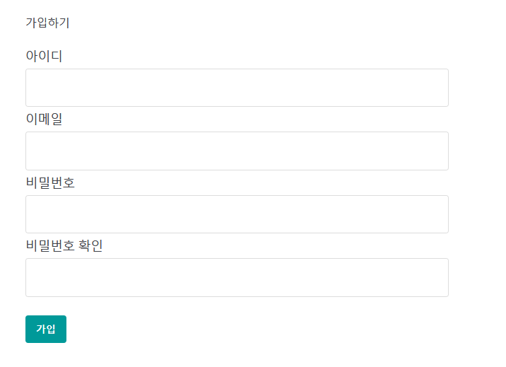

# 파이썬 Flask 사용법 

출처: https://hleecaster.com/flask-introduction/


# 파이썬 Flask 사용법 1 (완전 기초)

- [Python](https://hleecaster.com/blog/work/python/)
- 2020년 10월 13일

[Flask](https://flask.palletsprojects.com/)는 웹 애플리케이션 개발을 위한 파이썬 프레임워크다. 

물론 파이썬으로 웹 개발을 할 때 많이 쓰이는 프레임워크로 가장 유명한 것은 [Django](https://www.djangoproject.com/)(장고)인데, Django는 너무 무겁고 기능이 많아서 복잡하다. 나처럼 웹에 대한 이해가 풍부하지 않은 초보 입장에서 사용하기 어렵다는  뜻이기도 하다. 그래서 내가 필요한 기능만 최대한 라이트하게 개발을 하기 위해서는 Flask처럼 가벼운 프레임워크가 딱이다. 

본 포스팅에서는 Flask에 대한 소개와 함께 초간단 사용법을 적어보려 한다. 일단 목차는 아래와 같다.

- 마이크로 웹 프레임워크 Flask
- Flask로 Hello, World!
- Route (URL에 웹페이지 연결하기)
- HTML 렌더링
- 동적 URL 다루는 방법

------


## 마이크로 웹 프레임워크 Flask

Flask는 홈페이지에서도 “micro” 프레임워크라는 점을 강조하고 있다. 즉, 최소한의 구성 요소와 요구 사항을 제공하기 때문에 시작하기 쉽고 필요에 따라 유연하게 사용할 수 있다. 그렇다고 해서 완전한 기능을 갖춘 앱을 만들기에 제약이 있다는 뜻은 아니고, 오히려 쉽게 확장할 수 있도록 설계되어 있기 때문에 개발을 하는 입장에서는 본인이 필요한 도구와 라이브러리를 자유롭게  선택해서 적용 가능하다는 게 가장 큰 장점이 아닐까 싶다. (데이터베이스를 통합하거나 계정 인증 등을 포함하는 복잡한 앱 뿐만  아니라 단순한 정적 웹 사이트를 만드는 데도 유용하다.)


## Flask로 Hello, World!

일단 플라스크로 프로젝트를 할 폴더에 가상환경을 만들고, 플라스크를 설치하자. (파이썬 가상환경 사용 관련 안내는 [여기](https://hleecaster.com/python-venv/)를 참고.) [Flask 공식 문서](https://flask.palletsprojects.com/en/1.1.x/installation/#python-version)에서도 가상환경을 통한 설치를 안내하고 있다.

플라스크 설치는 그냥 `pip install Flask`를 치면 끝. 그리고 프로젝트 폴더 안에 app.py라는 스크립트 파일을 만들어 아래 코드를 넣고 파일을 실행해보자.

``` py
from flask import Flask

app = Flask(__name__)

@app.route('/')
def home():
    return 'Hello, World!'

if __name__ == '__main__':
    app.run(debug=True)
```

`app.run()` 괄호 안에 `debug=True`라고 명시하면 해당 파일의 코드를 수정할 때마다 Flask가 변경된 것을 인식하고 다시 시작한다. 스터디 용도로 코딩을 할 때 내용을 바로 반영해서 결과를 확인하기 편리하다.

어쨌든 이렇게 해놓고 실행을 하면 Running on http://127.0.0.1:5000/라는 메시지가 뜨는데 로컬 환경에서 5000번 포트를 통해 해당 웹 페이지를 확인할 수 있다. 헬로 월드가 찍혀 있는 걸 보게 되면 이미 Flask로 웹 사이트 만드는 게 너무나 쉽다는 감이 올 거다.


## Route (URL에 웹페이지 연결하기)

웹 브라우저에서 URL을 방문하면 서버에 요청을 보내고, 서버는 그 요청을 처리해서 브라우저에 응답을 반환하게 된다. 그 반환된 결과를 HTML 문서로 보내주면 그 웹 페이지를 브라우저가 띄워주는 거다.

Flask에서는 URL을 방문 할 때 준비된 함수가 트리거되도록 바인딩 하기 위해 `route()` 데코레이터를 사용한다. 이를 라우팅이라 한다. (파이썬 데코레이터는 골뱅이@를 사용하는 건데 좀 복잡하니 설명은 생략한다. 깊이 들어가면 나도 잘 모른다.)

어쨌든 위에서 실습한 app.py를 아래와 같이 수정해보자. 

``` py
from flask import Flask

app = Flask(__name__)

@app.route('/')
@app.route('/home')
def home():
    return 'Hello, World!'

@app.route('/user')
def user():
    return 'Hello, User!'

if __name__ == '__main__':
    app.run(debug=True)
```

http://127.0.0.1:5000/ 뒤에 “/home”이라고 붙여도 동일하게 헬로 월드가 출력되는 페이지가 뜬다. “/”이나 “/home”이나 둘 다 같은 페이지를 출력하도록 연결했기 때문에. 그리고 만약 “/user”로 접속하면 헬로 유저가 뜰 거다. Flask에서는 이렇게 쉽게 웹  페이지를 라우팅 할 수 있다.

단, 이렇게 `@app.route('/경로')` 를 쓸 때 URL 경로는 반드시 “/” (슬래시)로 시작해야 한다.


## 동적 URL 다루는 방법

위에서는 route () 데코레이터를 사용해서 고정된 URL을 뷰 함수에 바인딩하는 방법을 알아봤다. 그런데 경우에 따라 변경되는 동적 URL을 사용하려면 어떻게 해야 할까?

Flask에서는 뷰 함수에 바인딩 할 URL을 지정할 때 `<variable_name>`을 명시하는 게 가능하다. 그러면 이 변수는 뷰 함수에 인수 형태로 전달이 된다. 

다시 app.py에서 이번엔 `@app.route('/user')`와 `user()`함수를 아래와 같이 수정해보자.

``` py
from flask import Flask

app = Flask(__name__)

@app.route('/')
@app.route('/home')
def home():
    return 'Hello, World!'

@app.route('/user/<user_name>/<int:user_id>')
def user(user_name, user_id):
    return f'Hello, {user_name}({user_id})!'

if __name__ == '__main__':
    app.run(debug=True)
```

반환되는 값으로 f-string 포맷을 활용해서 문자열에 변수를 넣고 h1 태그를 적용해봤다. (파이썬 문자열 다룰 때는 f-string이 짱이다. 아무튼.)

이렇게 하면 “/user/유저이름/유저아이디” 형식의 URL을 입력 받았을 때 유저이름과 유저아이디를 활용한 내용의 HTML 문서를 반환할 수 있다.

그리고 URL은 문자열이기 때문에 <converter : variable_name> 구문을 사용해서 URL에서 받은 변수 타입을 변형할 수 있다. converter로 사용할 수 있는 옵션은 아래와 같다. ([Flask 공식 문서](https://flask.palletsprojects.com/en/1.1.x/quickstart/?highlight=converter#variable-rules) 참고)

- `string` (기본값) : slash가 포함되지 않은 문자열
- `int`
- `float`
- `path` : `string`과 동일하지만 slash를 포함한다.
- `uuid` : [UUID(범용고유식별자)](https://ko.wikipedia.org/wiki/범용_고유_식별자) 형식


## HTML 렌더링

`@app.route()`아래 적어주는 뷰 함수에서 return하는 응답은 일반 텍스트, 데이터 등 다양한 형식이 될 수 있는데, 일반적으로는 웹 페이지에서 렌더링 할 HTML을 직접 반환하게 될 거다.

app.py에서 home()함수를 아래와 같이 수정해보자. (return 되는 값으로 HTML 형식의 문자열을 바로 넣어주었다.)

``` py
from flask import Flask

app = Flask(__name__)

@app.route('/')
@app.route('/home')
def home():
    return '''
    <h1>이건 h1 제목</h1>
    <p>이건 p 본문 </p>
    <a href="https://flask.palletsprojects.com">Flask 홈페이지 바로가기</a>
    '''

@app.route('/user/<user_name>/<int:user_id>')
def user(user_name, user_id):
    return f'Hello, {user_name}({user_id})!'

if __name__ == '__main__':
    app.run(debug=True)
```

실행해서 home화면에 들어가보면 문자열로 반환된 HTML이 렌더링 되어서 화면에 잘 나타나는 걸 알 수 있다. Flask 참 쉽다.

------

일단 Flask 기초 사용법은 여기까지. 

이어서 HTML 문서를 렌더링 할 때 템플릿, 그 안에서 변수와 조건문/반복문 사용하는 방법, form 양식 활용하는 법도 알아보자.

- 파이썬 Flask 사용법 1 (완전 기초)
- [파이썬 Flask 사용법 2 (Jinja2 템플릿, 변수, 조건문/반복문)](https://hleecaster.com/flask-jinja2/)
- [파이썬 Flask 사용법 3 (form)](https://hleecaster.com/flask-form/)


---

# 파이썬 Flask 사용법 2 (Jinja2 템플릿, 변수, 조건문/반복문)

[이전 포스팅](https://hleecaster.com/flask-introduction/)에서 파이썬 Flask(플라스크) 초간단 사용법을 익혀봤다. 그 글에서는 클라이언트에게 돌려줄 웹 페이지로 단순한 HTML 형식의  문자열을 작성하는 예시를 사용했다. 물론 이렇게 해도 웹페이지가 잘 나타나긴 하지만 만약 제대로 된 웹 사이트, 즉  애플리케이션이라는 걸 만들고자 한다면 모든 페이지마다 HTML 파일을 각각 작성할 게 아니라 일관된 구조와 기능을 가진  템플릿(template)을 활용해야 한다.

Flask에서는 [Jinja2](https://jinja.palletsprojects.com/en/2.11.x/)라는 템플릿 엔진을 사용해서 애플리케이션 내 변수와 반복문, 조건문 등을 포함하는 HTML 파일을 렌더링할 수 있다. 그래서 본  포스팅에서는 Jinja2 사용법과 함께 템플릿 내에서 변수, 조건문/반복문 사용법에 대해 익혀보려 한다. 최대한 쉽게!

- 템플릿 렌더링해서 URL에 연결하기
- 템플릿에서 변수 사용하기 (filter 기능 활용)
- 템플릿에서 if 조건문 사용하기
- 템플릿에서 for 반복문 사용하기
- 템플릿 상속 (Inheritance)
- 코드 예시 – 포스팅 내용 종합 요약

------

## 템플릿 렌더링해서 URL에 연결하기

일단 프로젝트 폴더 내에는 app.py라는 파일을 아래와 같이 작성해보자.

``` py
from flask import Flask, render_template

app = Flask(__name__)

@app.route('/')
def index():
    return render_template("index.html")

if __name__ == '__main__':
    app.run(debug=True)
```

그리고 프로젝트 폴더 내에 **templates**라는 폴더를 생성하고 (폴더 이름은 반드시 templates여야 한다.) 

그 안에 index.html이라는 파일을 생성하고 아래와 같이 넣어보자.

``` html
<!DOCTYPE html>
<html>
<body>
    <h1>메인 화면</h1>
</body>
</html>
```

그리고 app.py를 실행하면 Running on http://127.0.0.1:5000/라는 메시지가 뜨는데 (로컬 환경에서 5000번 포트를 사용한다는 뜻) 웹 브라우저로 여기 들어가보면 된다.

그러면 첫 화면이 index.html을 띄워줄 거다. `@app.route('/')`에 바인딩 된 함수가 `render_template("index.html")`이라고 되어 있기 때문에 해당 문서를 렌더링해서 반환하는 거다. Flask 참 쉽다.

## 템플릿에서 변수 사용하기 (filter 기능 활용)

템플릿 내에서 변수를 사용하려면 `render_template()` 괄호 안에 렌더링 할 HTML 파일 이름에 이어 변수명을 키워드 인수를 추가해주면 된다. 둘 이상의 변수를 추가하려면 쉼표로 구분하면 그만이다.

실제로 템플릿에서 이 변수를 사용할 때는 `{{ 변수명 }}`과 같은 식으로 불러와서 쓰면 된다.

그리고 이 변수를 템플릿 내에서 파이썬 함수처럼 **filter** 기능으로 처리하는 방법도 있다. `{{ 변수명 | 필터 }}`와 같은 식으로 써주면 된다. ([Jinja2 공식 문서](https://jinja.palletsprojects.com/en/2.11.x/templates/#builtin-filters) 참고)

## 템플릿에서 if 조건문 사용하기

`` 괄호 안에 조건문을 써주고, ``로 마무리하면 된다. 예를 들면 이렇게.

``` html

  <p>{{ template_variable }}, World!</p> 

```

elif와 else도 파이썬에서 직접 사용하는 것과 같은 문법으로 사용할 수 있다.

``` html

  <p>{{ template_variable }}은 20보다 작다.</p> 

   <p>{{ template_variable }}은 20보다 크다.</p> 

   <p>{{ template_variable }}은 20이다.</p> 

```

## 템플릿에서 for 반복문 사용하기

`` 괄호 안에 반목문을 써주고, ``로 마무리하면 된다. 예를 들면 이렇게.

``` html
<ul>

    <li>{{ x }}</li>

</ul>
```

딕셔너리도 당연히 활용 가능하다. 

``` html
<ul>

    <li>{{ key }} : {{ value }}</li>

</ul>
```

`dictsort` 필터를 사용할 때는 (뒤에 굳이 `.items()`를 붙여주지 말고) 이런 식으로 써야 하더라. 이것 때문에 삽질 좀 했다.

``` html
<ul>

    <li>{{ key }} : {{ value  }}</li>

</ul>
```


## 템플릿 상속 (Inheritance)

웹 사이트 레이아웃의 일관성을 유지하거나, header와 footer를 여러곳에 사용하기 위해서는 템플릿 상속 기능을 사용하면 된다.

- 부모문서를 만들고, 자식문서가 들어갈 부분에 `` ``라고 작성한다.
- 자식문서 윗부분에 ``라고 명시한 후 ``와 ``사이에 내용을 작성한다.

예를 들어 **base.html**이라는 부모문서를 이렇게 작성하고

``` html
<html>
  <head>
    <title>내 웹사이트</title>
  </head>
  <body>
  
  </body>
</html>
```

(예를 들어 **index.html**이라는 이름으로 자식 문서를 만들면) 자식문서에는 이렇게 적어주면 되겠다.

``` html



    <p>자식문서에 포함될 내용</p>

```

실제로 **index.html**이라는 문서를 `render_template("index.html")`와 같이 렌더링 해서 확인하면 아래와 같이 구성이 된다는 걸 알 수 있다.

``` html
<html>
  <head>
    <title>내 웹사이트</title>
  </head>
  <body>
    <p>자식문서에 포함될 내용</p>
  </body>
</html>
```

Flask 템플릿 상속 쉽다.

이제 지금까지 학습한 내용을 한 방에 예시로 익혀보자.


## 코드 예시 – 포스팅 내용 종합 요약

Flask 템플릿 내에서 변수 필터링 및 조건문/반복문, 템플릿 상속을 테스트하기 위한 간단한 예시.

학생들의 정보와 시험 성적을 딕셔너리로 만들어놓은 후, 메인 페이지에서 이름을 확인하면 해당 학생의 성적이 리스트로 출력되는 페이지를 만들어보았다. 

**app.py**

``` py
from flask import Flask, render_template

app = Flask(__name__)

student_data = {
    1: {"name": "슈퍼맨", "score": {"국어": 90, "수학": 65}},
    2: {"name": "배트맨", "score": {"국어": 75, "영어": 80, "수학": 75}}
}

@app.route('/')
def index():
    return render_template("index.html", 
            template_students = student_data)

@app.route("/student/<int:id>")
def student(id):
    return render_template("student.html", 
            template_name=student_data[id]["name"], 
            template_score=student_data[id]["score"])

if __name__ == '__main__':
    app.run(debug=True)
```

**base.html**

``` html
<!DOCTYPE html>
<html lang="ko">
<head>
    <meta charset="UTF-8">
    <meta name="viewport" content="width=device-width, initial-scale=1.0">
    <title>시험성적 확인 사이트</title>
</head>
<body>
    <div>
        <a href="/">메인화면 바로가기</a>
    </div>
    
</body>
</html>
```

**index.html**

``` html


    <h1>시험 성적 확인하기</h1>
    <p>이름을 클릭하세요.</p>
    <ul>
        
            <li><a href="/student/{{ key }}">{{ value["name"] }}</a></li>
        
    </ul>

```

**student.html**

``` html


    <h2>{{ template_name }} 님의 성적</h2>
    <ul>
        
            <li>{{ key }} : {{ value }}</li>
        
    </ul>

```

일단 Flask 템플릿 사용법은 여기까지, 이어서 form 양식 활용하는 법도 알아보자.

- [파이썬 Flask 사용법 1 (완전 기초)](https://hleecaster.com/flask-introduction/)
- 파이썬 Flask 사용법 2 (Jinja2 템플릿, 변수, 조건문/반복문)
- [파이썬 Flask 사용법 3 (form)](https://hleecaster.com/flask-form/)


---

# 파이썬 Flask 사용법 3 (form)

웹 사이트에서 빠뜨릴 수 없는 기능 중 하나가 바로 사용자로부터 정보를 수집하는 거다. 계정에 로그인하고, 상품을 주문하거나 설문조사를 하는 등. 이렇게 사용자로부터 정보를 입력 받는 방식을 form이라 한다.

form을 사용하더라도 막상 정보를 깔끔하고 체계적으로 수집하려면 만만치가 않은데, 파이썬 웹 프레임워크 Flask(플라스크)를 사용하면 필드를 표시하고 데이터를 쉽게 수집하는 절차를 초보자도 깔끔히 처리할 수 있다.

이 포스팅에서는 웹 form에 대한 기초 지식과 함께 Flask에서 어떻게 form 데이터를 수집하고 처리하는지 (회원가입 폼 양식 예제를 통해) 최대한 쉽게 소개하려 한다.

- Flask에서 form 활용을 위한 프로젝트 폴더, 파일 관리
- (1) FlaskForm을 활용하여 클래스 만들기 (forms.py)
- (2) GET, POST 요청 처리에 따라 실행될 뷰 함수 (app.py)
- (3) form이 포함된 템플릿 작성 (register.html) – 템플릿 상속, 스타일 적용

만약 Flask에 익숙하지 않다면 아래 두 포스팅 먼저 읽는 것을 추천.

1. [파이썬 Flask 사용법 1 (완전 기초)](https://hleecaster.com/flask-introduction/)
2. [파이썬 Flask 사용법 2 (Jinja2 템플릿, 변수, 조건문/반복문)](https://hleecaster.com/flask-jinja2/)

------

## Flask에서 form 활용을 위한 프로젝트 폴더, 파일 관리

자, 이제 Flask(플라스크)로 웹 앱을 만들기 위한 프로젝트 폴더 내에서 파일 구조를 어떻게 가져가면 편한지 간단한 형태로 구성해서 설명해야겠다.

- **forms.py** : form을 활용하기 위한 클래스를 담아놓는 파일. 유효성 검사와 같은 기능을 포함해놓을 수 있고, 이후에 flask 앱에서는 여기서 미리 생성해놓은 form 클래스를 가져다 쓰기만 하면 된다.
- **app.py** : Flask 앱을 구동시킬 실행시킬 파일. URL와 템플릿을 연결하는 route 데코레이터와 그에 해당하는 뷰 함수가 담겨 있다.
- ***.html** : 모든 HTML 문서, 즉 템플릿 파일은 templates라는 폴더 안에 담아놓아야 한다. 이 템플릿 내에서 내가 쓸 폼을 플라스크 변수 형태로 담아 사용할 수 있다.


## (1) FlaskForm을 활용하여 클래스 만들기 (forms.py)

프로젝트 폴더 내에서 forms.py를 만들고 아래와 같이 회원 가입을 위한 form을 구성하는 파일을 만들어보자.

``` py
from flask_wtf import FlaskForm
from wtforms import StringField, PasswordField, SubmitField
from wtforms.validators import DataRequired, Length, Email, EqualTo

class RegistrationForm(FlaskForm):
    username =  StringField("아이디", 
                            validators=[DataRequired(), Length(min=4, max=20)])
    email =  StringField("이메일", 
                            validators=[DataRequired(), Email()])
    password = PasswordField("비밀번호", 
                            validators=[DataRequired(), Length(min=4, max=20)])
    confirm_password = PasswordField("비밀번호 확인", 
                            validators=[DataRequired(), EqualTo("password")] )
    submit = SubmitField("가입")
```

- 일단 `FlaskWTF`의 `FlaskForm`를 불러오는데, 내가 원하는 form을 만들기 위해서는 `FlaskForm`이라는 부모 클래스를 상속 받아 자식 클래스를 만들어 사용하면 된다. (자식클래스를 선언할때 소괄호로 부모클래스를 포함시키게 되면 자식클래스에서는 부모클래스의 속성과 메소드는 기재하지 않아도 알아서 포함이 된다.)
-  그리고 이와 함께 `wtforms`라는 라이브러리를 사용한다. 예를 들면 문자열인지(StringField), 화면에 표시되지 않아야 할 패스워드인지(PasswordField), 제출 버튼인지(SubmitField)에 따라 원하는 폼을 지정할 수 있고, 이 후 `wtforms.validators`를 통해 필수입력값인지(DataRequired), 길이는 어떻게 제한하는지(Length), 이메일인지(Emil), 이미 입력한 값과 같은 값을 입력했는지(EqualTo) 등의 유효성 검사를 할 수 있다.

예제에서 생성한 클래스를 보면 일단 폼의 종류와 함께, 그 입력란의 label이 무엇인지 적어주고, validators를 통해 유효성 검사 항목을 포함해주면 끝이다.


## (2) GET, POST 요청 처리에 따라 실행될 뷰 함수 (app.py)

웹에서는 클라이언트가 서버와 통신 할 때마다 요청(request)이라는 걸 하게 된다. Flask에서는 웹 페이지를 route하게 되면 기본적으로 **GET** 요청만 지원한다. 해당 URL에 접속했을 때 브라우저 창에 어떤 내용을 표시할지 요청하는 거다. 만약 웹 사이트를 통해 사용자가 form을 입력해서 그 양식을 제출하면 POST 요청으로 전송된다. 이 경우에는 `route()` 데코레이터의 `method` 인수로 **POST**를 지정해서 그 요청을 처리할 수가 있다. 이렇게.

``` py
@ app.route ( "/", methods = [ "GET", "POST"])
```

위와 같이 하면 GET 요청과 POST 요청 모두 처리할 수 있는 거다. (`method`를 지정하지 않으면 기본값은 GET이다.)

실제로 위에서 만든 **forms.py**의 클래스를 가져와 회원가입 기능을 **app.py**에 연결하려면 아래와 같이 적어주면 된다.

``` py
from flask import Flask, render_template, url_for, flash, redirect
from forms import RegistrationForm

app = Flask(__name__)
app.config["SECRET_KEY"] = 'd2707fea9778e085491e2dbbc73ff30e'

@app.route('/')
def home():
    return render_template('layout.html')

@app.route('/register', methods=["GET", "POST"])
def register():
    form = RegistrationForm()
    if form.validate_on_submit():
        # 알람 카테고리에 따라 부트스트랩에서 다른 스타일을 적용 (success, danger) 
        flash(f'{form.username.data} 님 가입 완료!', 'success')
        return redirect(url_for('home'))
    return render_template('register.html', form=form)

if __name__ == '__main__':
    app.run(debug=True)
```

- `from forms import RegistrationForm`로 일단 **forms.py**에서 작성한 내 회원가입 폼을 불러왔다. 곧 이어서 `app.config["SECRET_KEY"] = "복잡한 문자열"`라는 코드가 보이는데, 이건 CSRF(Cross-Site Request Forgery)라고 웹 애플리케이션을 공격하는 걸로부터  보호하기 위해 사용하는 거다. 일단 아무거나 적어주자. (뒤에서 HTML 템플릿 구성할 때 이어서 설명한다.) 어쨌든 난  SECRET_KEY 값을 생성할 때 파이썬 secrets 모듈을 활용했다. `import secrets` 한 후 `secrets.token_hex(16)`라고 적어주면 이렇게 복잡한 문자열이 하나 생성된다.

- ‘/register’라는 URL을 회원가입으로 사용하기 위해 `methods=["GET", "POST"]`  을 사용해 데코레이터를 만들어 라우팅 시킨 후 그 아래에 `register()` 라는 뷰 함수를 작성했다. 일단 `form` 이라는 인스턴스를 생성해놓았다.

  1. 일단 클라이언트가 ‘/register’ URL에 그냥 접속했다면 (폼을 작성해 POST 요청한 게 아니라 그냥 GET 요청) 한 것이기 때문에 `render_template('register.html', form=form)`을 돌려줘야 한다. 회원가입 페이지를 바로 띄워주는 거다. 이때 form이라는 템플릿 변수에다가 미리 생성한 `form` 인스턴스를 연결했다.
  2. 만약 클라언트가 POST 요청을 통해 form을 정상적으로 제출했다면 if 조건문 `form.validate_on_submit()`으로 확인해서 요청을 처리해야 한다. 여기서는 처리한 후 `redirect(url_for('home'))`을 반환하여 `home`이라는 뷰 함수와 연결된 곳,  즉 루트 URL로 리다이렉트 시켰다. (`url_for()` 안에는 URL을 써주는 게 아니라 뷰 함수이름을 써줘야 한다.) 

그리고 `flash`는 부트스트랩을 사용해서 알림 메시지를 띄우기 위해 사용한 건데, 굳이 안 써도  된다. 메시지와 함께 카테고리 success나 danger 중 하나를 써주면 초록색, 혹은 붉은 색으로 HTML 문서에 알림을  띄울 수 있다. (이후에 템플릿을 통해 확인해보자.)

어쨌든 위와 같이 작성하고 나면 이제 실제 HTML 템플릿을 작성해야 한다.


## (3) form이 포함된 템플릿 작성 (register.html)

Jinja2 템플릿을 활용하는 거기 때문에 **register.html**에는 원래 이렇게 써주면 된다.

``` html
<form action="/" method="post">

    {{ form.hidden_tag() }}

    {{ form.username.label }}
    {{ form.username() }}

    {{ form.email.label }}
    {{ form.email() }}

    {{ form.password.label }}
    {{ form.password() }}

    {{ form.confirm_password.label }}
    {{ form.confirm_password() }}

    {{ form.submit() }}

</form>
```

그러면 실제로 렌더링 된 HTML 파일은 이런 식으로 나타날 거다.

``` html
<form action="/" method="post">

    <input id="csrf_token" name="csrf_token" type="hidden" value="IjRiNzcxYTc5Mjg1NDNkZWY2MTJlZDgzOTlkMzdkN2U5NDBhMGVjNmEi.X4mQ0w.0DG_S08r-lH5AmF0XTAxRhYwngo">

    <label for="username">아이디</label>
    <input id="username" name="username" required="" type="text" value="">

    <label for="email">이메일</label>
    <input id="email" name="email" required="" type="text" value="">

    <label for="password">비밀번호</label>
    <input id="password" name="password" required="" type="password" value="">

    <label for="confirm_password">비밀번호 확인</label>
    <input id="confirm_password" name="confirm_password" required="" type="password" value="">

    <input id="submit" name="submit" type="submit" value="가입">

</form>
```

- 첫번째 `{{ template_form.hidden_tag() }}`는 화면에 표시되지는 않지만 CSRF로부터 보호하는 데 필요한 작업을 처리한다. 그래서 실제 HTML 문서를 보면 복잡한 코드가 자동으로 포함된다.
- 이후에 `{{ form.username.label() }}`과 같은 식으로 레이블을 가져오고, 이어서 양식을 작성할 부분에는 `{{ form.username }}`이라고 적어주면 그만이다.

#### ※ 템플릿 상속, 스타일 적용

위와 같이 하면 너무 단순하니까 부트스트랩을 활용해서 조금 꾸며보자. (아까 구성했던 알림 메시지도 띄워보고, validator로 에러 메시지도 띄워보고.

일단 layout.html이라는 레이아웃 템플릿을 만들고, 회원가입 페이지에 활용할 register.html에서는 이 레이아웃을 상속 받아 사용할 거다.

**layout.html**

```html
<!DOCTYPE html>
<html>
<head>
    <meta charset="UTF-8">
    <meta name="viewport" content="width=device-width, initial-scale=1, shrink-to-fit=no">
    <link rel="stylesheet" href="https://cdn.jsdelivr.net/npm/bootstrap@4.5.3/dist/css/bootstrap.min.css" integrity="sha384-TX8t27EcRE3e/ihU7zmQxVncDAy5uIKz4rEkgIXeMed4M0jlfIDPvg6uqKI2xXr2" crossorigin="anonymous">
</head>

<body>
    <main role="main" class="container">
        <div class="row">
            <div class="col-md-8">

                
                    
                        
                            <div class="alert alert-{{ category }}">
                                {{ message }}
                            </div>
                        
                    
                

                
                
            </div>
        </div>
    </main>
    <script src="https://code.jquery.com/jquery-3.5.1.slim.min.js" integrity="sha384-DfXdz2htPH0lsSSs5nCTpuj/zy4C+OGpamoFVy38MVBnE+IbbVYUew+OrCXaRkfj" crossorigin="anonymous"></script>
    <script src="https://cdn.jsdelivr.net/npm/bootstrap@4.5.3/dist/js/bootstrap.bundle.min.js" integrity="sha384-ho+j7jyWK8fNQe+A12Hb8AhRq26LrZ/JpcUGGOn+Y7RsweNrtN/tE3MoK7ZeZDyx" crossorigin="anonymous"></script>
</body>
</html>
```

일단 부트스트랩 스타일을 활용을 위해 [여기](https://getbootstrap.com/docs/4.5/getting-started/introduction/#quick-start)에 있는 코드를 <link>태그로 붙여넣어놨다. 그리고 2가지만 보면 되는데, 

-  라는 with 문을 활용해, 만약 메시지가 있을 경우 카테고리(success, danger)에 따라 출력되도록 했다.
- 와  사이에 상속받을 HTML 파일 내용을 넣어줄 예정이다.

이제 실제 **register.html** 파일은 이렇게 구성된다.

``` html




    <div class="content-section">
        <form method="post" action="">

            {{ form.hidden_tag() }}
            
            <fieldset class="form-group">
                <legend class="border-bottom mb-4">가입하기</legend>

                <div class="form-group">
                    {{ form.username.label(class="form-control-label") }}

                    
                        {{ form.username(class="form-control form-control-lg is-invalid") }}
                        <div class="invalid-feedback">
                            
                                <span>{{ error }}</span>
                            
                        </div>
                    
                        {{ form.username(class="form-control form-control-lg") }}
                    
                </div>

                <div class="form-group">
                    {{ form.email.label(class="form-control-label") }}
                    
                        {{ form.email(class="form-control form-control-lg is-invalid") }}
                        <div class="invalid-feedback">
                            
                                <span>{{ error }}</span>
                            
                        </div>
                    
                        {{ form.email(class="form-control form-control-lg") }}
                    
                </div>

                <div class="form-group">
                    {{ form.password.label(class="form-control-label") }}
                    
                        {{ form.password(class="form-control form-control-lg is-invalid") }}
                        <div class="invalid-feedback">
                            
                                <span>{{ error }}</span>
                            
                        </div>
                    
                        {{ form.password(class="form-control form-control-lg") }}
                    
                </div>

                <div class="form-group">
                    {{ form.confirm_password.label(class="form-control-label") }}
                    
                        {{ form.confirm_password(class="form-control form-control-lg is-invalid") }}
                        <div class="invalid-feedback">
                            
                                <span>{{ error }}</span>
                            
                        </div>
                    
                        {{ form.confirm_password(class="form-control form-control-lg") }}
                    
                </div>
                
            </fieldset>

            <div class="form-group">
                {{ form.submit(class="btn btn-outline-info") }}
            </div>

        </form>
    </div>


```

이러면 아래와 같이 좀 더 예쁜 화면이 등장한다. 




