# PyWebIO 1.3.0 소개


## 1. Python을 사용하여 스크립트 방식으로 대화형 웹 앱 작성

HTML 및 JS에 대한 지식 없이 여러 줄의 Python 코드로 웹 애플리케이션 구축

출처: https://towardsdatascience.com/pywebio-write-interactive-web-app-in-script-way-using-python-14f50155af4e

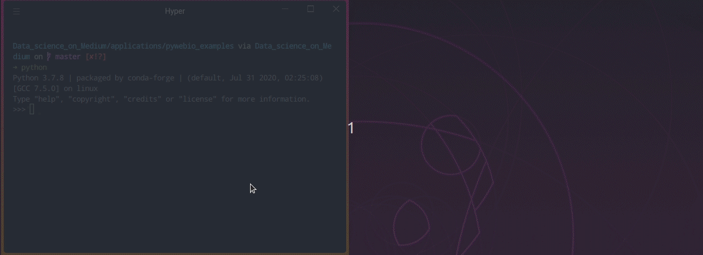

### Motivation

몇 줄의 Python 코드만으로 웹 애플리케이션을 만들고 싶었던 적이 있습니까? Streamlit을 사용하면 그렇게 할 수 있지만 입력 상자, 출력, 레이아웃 및 페이지를 사용자 지정할 수 있는 많은 옵션을 제공하지 않습니다.
Django 및 Flask보다 배우기 쉽지만 Streamlit보다 사용자 정의가 가능한 것을 찾고 있다면 PyWebIO를 좋아할 것입니다.


### PyWebIO란 무엇입니까?

PyWebIO는 HTML 및 Javascript에 대한 지식 없이도 간단한 웹 응용 프로그램을 빌드할 수 있는 Python 라이브러리입니다. PyWebIO는 Flask 또는 Django와 같은 기존 웹 서비스에 쉽게 통합될 수도 있습니다.

PyWebIO를 설치하려면 다음을 입력하십시오.

``` python
pip install -U pywebio
```


### Get Started

#### Input

PyWebIO는 사용자로부터 입력을 받을 수 있는 다양한 옵션을 제공합니다. 아래 GIF는 이러한 옵션 중 일부가 어떻게 보이는지 보여줍니다.

``` python
from pywebio.input import *
from pywebio.output import *

input("What's your name?")
select("Select food", ['Orange', 'Apple'])
checkbox("Are your okay?", options=["I'm okay."])
radio("What do you like to do?", options=['Eat', 'Sleep', 'Study'])
```


#### Output

PyWebIO는 또한 다양한 출력 옵션을 제공합니다. [여기](https://pywebio.readthedocs.io/en/latest/output.html#pywebio.output.put_processbar)에서 전체 출력 목록을 확인하세요. 이러한 출력 옵션 중 일부가 어떻게 보이는지 살펴보겠습니다.

``` python
from pywebio.output import *
from pywebio.input import * 
import time

put_markdown('## Hello there')

put_text("I hope you are having a great day! Here is our menu")

put_table([
    ['Food', 'Price'],
    ['Noodle', 10], 
    ['Chicken and rice', 11]
    ])

with popup("Subscribe to the page"):
    put_text("Join other foodies!")

food = select("Choose your favorite food", ['noodle', 'chicken and rice'])

put_text(f"You chose {food}. Please wait until it is served!")

put_processbar('bar')
for i in range(1, 11):
    set_processbar('bar', i / 10)
    time.sleep(0.1)
put_markdown("Here is your food! Enjoy!")

if food == 'noodle':
    put_image(open('noodle.jpeg', 'rb').read())
else:
    put_image(open('chicken_and_rice.jpeg', 'rb').read())

put_file("You can download the food here", b"Hello")
```

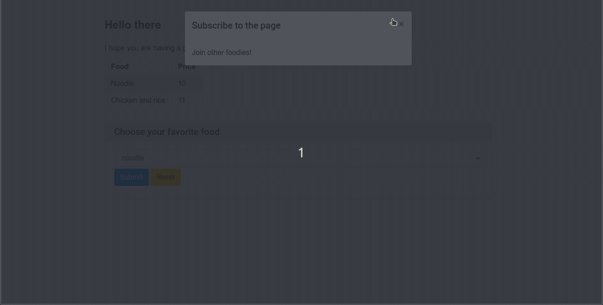

위의 코드에서는 다음을 사용합니다.

- 마크다운을 작성하기 위한 put_markdown
- 일반 텍스트를 만드는 put_text
- 메뉴 테이블을 만드는 put_table
- 드롭다운 막대를 만드는 select
- 음식 이미지를 출력하는 put_image
- 파일 다운로드 링크를 출력하는 put_file

몇 줄의 코드로 이렇게 흥미로운 애플리케이션을 만들 수 있습니다. 얼마나 멋진 일입니까!

지금까지 배운 내용을 적용하여 생성해 보겠습니다.

- 주어진 텍스트를 제공하는 PDF를 생성하는 간단한 앱
- 업로드하는 CSV 파일에 대한 아름다운 고밀도 시각화를 생성하는 앱


### PDF를 생성하는 앱 만들기

아래와 같이 주어진 텍스트가 제공된 PDF를 생성하는 간단한 앱을 만들 것입니다.

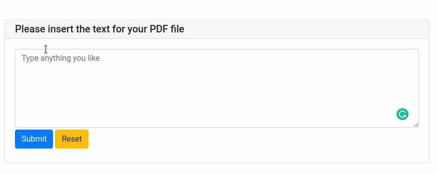

앱의 입력 상자와 출력을 만드는 것부터 시작하겠습니다.

``` python
from pywebio.input import textarea, input
from pywebio import start_server


def app():
    text = textarea("Please insert the text for your PDF file", 
                    placeholder="Type anything you like", 
                    required=True)
                    
    save_location = input("What is the name of your PDF file?", required=True)
    put_text("Congratulations! A PDF file is generated for you.")


if __name__ == '__main__':
    start_server(app, port=36535, debug=True)
```

위의 코드에 대한 설명:

- `input` : 텍스트 입력 상자를 만듭니다.
- `textarea` : 여러 줄 텍스트 입력 상자를 만듭니다.
- `placeholder` : 입력 상자에 입력할 수 있는 내용을 사용자에게 제안합니다.
- `required` : 입력이 필요한지 여부를 지정합니다.
- `start_server` : PyWebIO 애플리케이션을 웹 서비스로 제공하기 위해 서버를 시작합니다. Debug=True는 코드가 변경될 때 자동으로 다시 로드하도록 서버에 지시합니다.

아래와 같이 표시되어야 합니다.

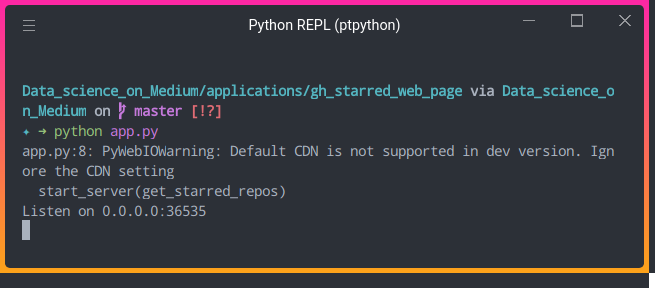

앱으로 플레이하려면 http://0.0.0.0:36535/로 이동하십시오. 이제 아래와 같은 입력 상자가 있는 간단한 웹 앱이 생겼습니다!

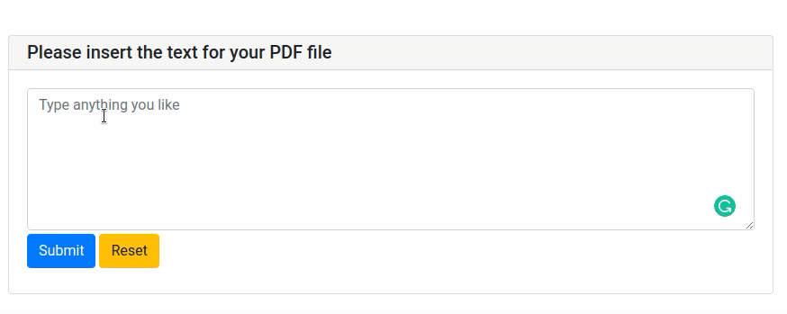

이제 입력 상자와 출력을 만드는 방법을 알았으므로 입력 텍스트에 대한 PDF를 생성할 코드를 작성해 보겠습니다. 이를 위해 [PyFPDF](https://pyfpdf.readthedocs.io/en/latest/)를 사용할 것입니다.

``` bash
pip install fpdf
```

``` python
from fpdf import FPDF
from pywebio.input import textarea, input
from pywebio import start_server
from pywebio.output import put_text

def app():
    text = textarea("Please insert the text for your PDF file", 
                    placeholder="Type anything you like", 
                    required=True)
                    
    save_location = input("What is the name of your PDF file?", required=True)
    create_pdf(text, save_location)
    put_text("Congratulations! A PDF file is generated for you.")
    
def create_pdf(text: str, save_location: str="output.pdf"):
    pdf = FPDF()
    pdf.add_page()
    pdf.set_font('Arial', '', 16)

    lines = text.split('\n')
    for i, sent in enumerate(lines):
        pdf.cell(40, 10, sent, 0, i+1)
        
    pdf.output(save_location, 'F')

if __name__ == '__main__':
    start_server(app, port=36535, debug=True)
```

모든 정보를 입력하면 output.pdf라는 파일이 현재 디렉토리에 저장됩니다. 입력 텍스트가 'Hello'인 경우 아래와 같이 표시됩니다.

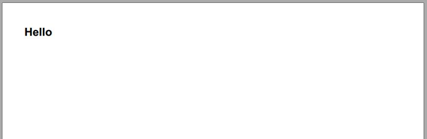

이제 앱의 기본 사항을 다룹니다. 사용자가 더 쉽게 사용할 수 있도록 몇 가지 기능을 더 추가해 보겠습니다.

#### 버튼 그룹 추가

사용자는 PDF에 둘 이상의 페이지를 추가할 수 있습니다. 따라서 사용자가 다른 페이지를 추가할지 여부를 결정할 수 있는 버튼 그룹을 추가합니다. 우리는 action 메소드로 이것을 할 수 있습니다.

``` python
add_more = actions(label="Would you like to add another page?", 
                    buttons=[{'label': 'Yes', 'value': True}, 
                             {'label':'No', 'value': False}])
```

- `label` : 버튼의 이름
- `value` : 사용자가 버튼을 클릭했을 때의 값

while add_more를 사용하여 사용자가 '아니요'를 클릭할 때까지 다른 페이지를 추가하도록 계속 요청합니다. 또한 페이지 목록을 입력으로 사용하도록 이전 함수 create_pdf를 수정합니다.

``` python
from pywebio.input import *
from pywebio import start_server
from pywebio.output import put_text
from fpdf import FPDF


def app():
    add_more = True
    pages = []
    
    while add_more:
        page = textarea("Please insert the text for your PDF file",  placeholder="Type anything you like")
        pages.append(page)

        add_more = actions(label="Would you like to add another page?", 
                        buttons=[{'label': 'Yes', 'value': True}, 
                                 {'label':'No', 'value': False}])

    save_location = input("What is the name of your PDF file?")
    create_pdf(pages, font='Arial', size=16, save_location=save_location)
    put_text("Congratulations! A PDF file is generated for you.")
    
def create_page(pdf, text: str, font: str, size: int):
    pdf.add_page()
    pdf.set_font(font, '', size)

    lines = text.split('\n')
    for i, sent in enumerate(lines):
        pdf.cell(40, 10, sent, 0, i+1)

def create_pdf(pages: list, font: str, size: int, save_location: str="output.pdf"):

    pdf = FPDF()
    for page in pages:
        create_page(pdf, page, font, size)
        
    pdf.output(save_location, 'F')
```

사용해 봅시다!

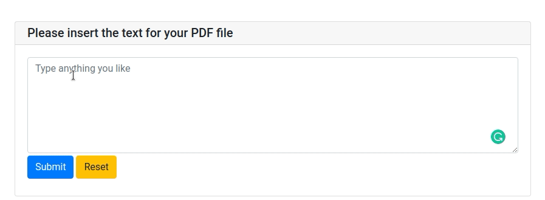

이제 아래와 같은 2페이지의 PDF 파일이 있어야 합니다!


### 그룹 드롭다운 및 숫자 입력

또한 드롭다운 및 숫자 입력 상자를 사용하여 사용자가 텍스트의 크기와 글꼴을 사용자 지정할 수 있도록 할 수 있습니다. 그러나 이번에는 사용자에게 한 번에 입력 집합을 요청할 수 있도록 하나의 형식으로 그룹화합니다.

``` python
FONTS = ['Helvetica', 'Calibri', 'Futura', 'Garamond', 'Times New Roman',
        'Arial', 'Cambria', 'Verdana', 'Rockwell', 'Franklin Gothic']

text_info = input_group('Text Fonts and Size', [
                  select(label='Select your font', options=FONTS, value='Arial', name='font'),
                  input("Select your text size", value='16', type=NUMBER, name='size')
                  ])

create_pdf(pages, text_info['font'], text_info['size'], save_location)
```

이제 text_info['fonts'] 및 text_info['size'] 를 사용하여 text_info에서 글꼴 및 크기 값에 액세스할 수 있습니다. 이 값을 create_page 함수의 매개변수로 사용하십시오.

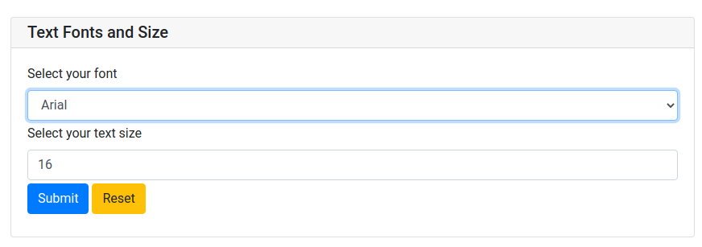

그리고 드롭다운 상자와 입력 상자가 같은 형태로 있습니다! 최종 출력은 다음과 같아야 합니다.


### 업로드된 CSV 파일에 대한 아름다운 시각화를 생성하는 앱 만들기

업로드한 CSV 파일에 대한 멋진 시각화를 자동으로 생성하는 웹 애플리케이션을 만들고 싶었던 적이 있습니까? PyWebIO로 쉽게 할 수 있습니다. 아래는 어떻게 생겼는지입니다.


위의 웹 애플리케이션을 생성하는 코드입니다.

``` python
import sweetviz as sv
import pandas as pd
from pywebio.input import file_upload
from pywebio.output import put_html, put_loading
from pywebio import start_server
import csv 
import re

def app():
    file = file_upload(label='Upload your CSV file', accept='.csv')
    content = file['content'].decode('utf-8').splitlines()

    df = content_to_pandas(content)
    create_profile(df)
    
def create_profile(df: pd.DataFrame):
    with put_loading(shape='grow'):
        report = sv.analyze(df)
        report.show_html()
    with open('SWEETVIZ_REPORT.html', 'r') as f:
        html = f.read()
        put_html(html)

def content_to_pandas(content: list):

    with open("tmp.csv", "w") as csv_file:
        writer = csv.writer(csv_file, delimiter = '\t')
        for line in content:
            writer.writerow(re.split('\s+',line))
    return pd.read_csv("tmp.csv")
    

if __name__=='__main__':
    start_server(app, port=37791, debug=True)
```

위와 같이 웹 애플리케이션을 생성하는 데 3단계만 필요합니다.

- [sweetviz](https://github.com/fbdesignpro/sweetviz)를 사용하여 pandas DataFrame에 대한 HTML 보고서 생성
- PyWebIO의 put_html 메소드를 사용하여 HTML 렌더링
- put_loading 메소드를 사용하여 로딩 프롬프트 출력

얼마나 멋진 일입니까!

### Conclusion

축하합니다! PyWebIO를 사용하여 간단한 웹 애플리케이션을 만드는 방법을 배웠습니다. PyWebIO를 사용하면 짧은 시간에 유용한 웹 애플리케이션을 구축할 수 있습니다! PyWebIO로 할 수 있는 다른 멋진 일을 찾으려면 [PyWebIO의 문서](https://pywebio.readthedocs.io/en/latest/guide.html)를 읽는 것이 좋습니다.

[여기](https://github.com/khuyentran1401/Data-science/tree/master/applications/pywebio_examples)에서 이 기사의 소스 코드를 마음껏 플레이하고 포크하세요.


## 2. 탭 추가, 입력 고정 및 다른 입력을 기반으로 입력 업데이트

몇 줄의 코드로 유용한 Python 앱 만들기

출처: https://towardsdatascience.com/pywebio-1-3-0-add-tabs-pin-input-and-update-an-input-based-on-another-input-e81a139fefcb


### Motivation

PyWebIO는 몇 줄의 코드로 아래와 같은 웹 애플리케이션을 쉽게 만들 수 있게 해주는 Python 라이브러리입니다.


[지난 기사](https://towardsdatascience.com/pywebio-write-interactive-web-app-in-script-way-using-python-14f50155af4e) 에서 PyWebIO의 기본적인 사용법을 소개했지만 이러한 기본 기능 이상을 수행하고 싶을 수도 있습니다. 운 좋게도 PyWebIO 1.3.0에는 몇 줄의 코드로 복잡한 인터페이스를 생성할 수 있는 더 유용한 도구가 도입되었습니다.

이 문서에서는 다음을 수행하는 방법을 배웁니다.

- 더 나은 탐색을 위해 탭 추가
- 다른 입력 값을 기반으로 한 입력 업데이트
- 입력 유지

PyWebIO 1.3.0을 설치하려면 다음을 입력하십시오.

``` bash
pip install pywebio==1.3.0
```


### put_tabs — 더 나은 탐색을 위한 탭 추가

PyWebIO 1.3.0 을 사용하면 아래와 같이 앱에 탭을 추가할 수 있습니다.

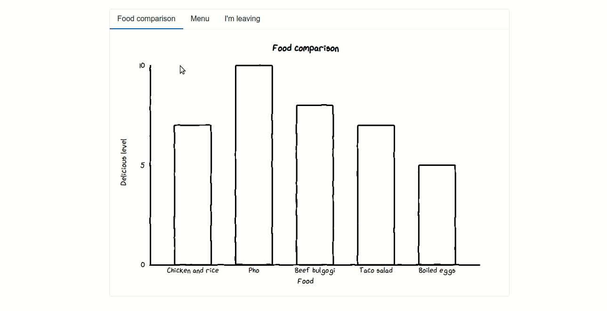

탭을 추가하려면 put_tabs 위젯을 사용하기만 하면 됩니다. put_tabs의 인수는 아래와 같은 dictionaries list 입니다.

``` python
put_tabs([
{'title': 'Food comparison', 'content': put_html(chart.render_notebook())},
{'title': 'Menu', 'content': put_table([
        ['Food', 'Price'],
        ['Chicken and rice', '8'],
        ['Pho', '10'],
        ['Beef bulgogi', '8']
    ])},
{'title': "I'm leaving", 'content': put_image(open('bye.jpeg', 'rb').read())}
])
```

Full code:

``` python
from pywebio.input import * 
from pywebio.output import * 
from pywebio import start_server
from cutecharts.charts import Bar
from cutecharts.faker import Faker
import numpy as np 

def create_chart(labels: list, values: list):
    chart = Bar("Food comparison")
    chart.set_options(labels=labels, x_label="Food", y_label="Delicious level")
    chart.add_series("Delicious level", values)
    return chart 


def app():

    food_items = ['Chicken and rice', 'Pho', 'Beef bulgogi', 'Taco salad', 'Boiled eggs']
    delicious_level = [7, 10, 8, 7, 5]

    chart = create_chart(food_items, delicious_level)
    
    put_tabs([
    {'title': 'Food comparison', 'content': put_html(chart.render_notebook())},
    {'title': 'Menu', 'content': put_table([
            ['Food', 'Price'],
            ['Chicken and rice', '8'],
            ['Pho', '10'],
            ['Beef bulgogi', '8']
        ])},
    {'title': "I'm leaving", 'content': put_image(open('bye.jpeg', 'rb').read())}
    ])

if __name__ == '__main__':
    start_server(app, debug=True, port='44315')
```


### input_update — 다른 입력이 변경되면 하나의 입력 업데이트

때로는 한 입력의 옵션이 다른 입력의 값에 따라 변경되기를 원할 수 있습니다.

예를 들어 아래 GIF에서 주제를 변경하면 기사 옵션도 변경됩니다.

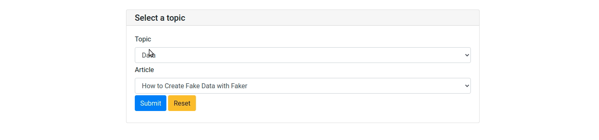

두 위젯 간에 이러한 종속성을 어떻게 만들 수 있습니까? 먼저 서로 의존하지 않는 2개의 드롭다운을 생성해 보겠습니다.

``` python
topics_to_articles = {
    'Data': ['How to Create Fake Data with Faker', 'Introduction to Schema: A Python Libary to Validate your Data'],
    'Machine Learning': ['human-learn: Create a Human Learning Model by Drawing', 'Introduction to Weight & Biases: Track and Visualize your Machine Learning Experiments in 3 Lines of Code'],
    'Visualization': ['How to Sketch your Data Science Ideas With Excalidraw', 'How to Create Mathematical Animations like 3Blue1Brown Using Python']
}

topics = list(topics_to_articles.keys())

#------------------------Input widgets without update-------------------------#

resource = input_group('Select a topic', [
    select('Topic', options=topics, name='topic'),
    select('Article', options=topics_to_articles[topics[0]], name='article')
])
article = resource['article']
put_markdown(f"You selected *{article}*")
```

예상대로 주제를 변경해도 기사 옵션은 변경되지 않습니다.

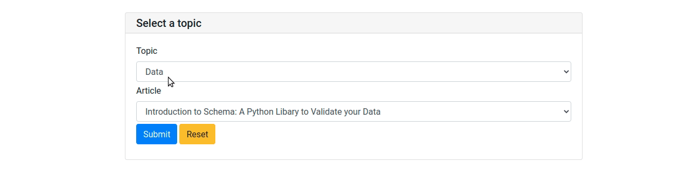

이제 이 두 드롭다운 간에 종속성을 생성할 구성 요소를 추가해 보겠습니다. 그것은 input_update 입니다.

Input_update 는 입력 함수의 onchange 콜백에 넣어야 합니다. 즉, 입력 기능이 변경되면 input_update가 트리거됩니다.

``` python
topics_to_articles = {
    'Data': ['How to Create Fake Data with Faker', 'Introduction to Schema: A Python Libary to Validate your Data'],
    'Machine Learning': ['human-learn: Create a Human Learning Model by Drawing', 'Introduction to Weight & Biases: Track and Visualize your Machine Learning Experiments in 3 Lines of Code'],
    'Visualization': ['How to Sketch your Data Science Ideas With Excalidraw', 'How to Create Mathematical Animations like 3Blue1Brown Using Python']
}

#--------------------------Input Update--------------------------#

topics = list(topics_to_articles.keys())
resource = input_group('Select a topic', [
    select('Topic', options=topics, name='topic',
            onchange=lambda t: input_update('article', options=topics_to_articles[t])),
    select('Article', options=topics_to_articles[topics[0]], name='article')
])
```

Code: onchange=lambda t: input_update('article', options=topics_to_articles[t]) 선택한 주제에 따라 입력 'article'의 옵션을 업데이트합니다.

Full code:

``` python
from pywebio.input import * 
from pywebio.output import * 
from pywebio import start_server

def app():
    topics_to_articles = {
        'Data': ['How to Create Fake Data with Faker', 'Introduction to Schema: A Python Libary to Validate your Data'],
        'Machine Learning': ['human-learn: Create a Human Learning Model by Drawing', 'Introduction to Weight & Biases: Track and Visualize your Machine Learning Experiments in 3 Lines of Code'],
        'Visualization': ['How to Sketch your Data Science Ideas With Excalidraw', 'How to Create Mathematical Animations like 3Blue1Brown Using Python']
    }

    topics = list(topics_to_articles.keys())
    resource = input_group('Select a topic', [
        select('Topic', options=topics, name='topic',
                onchange=lambda t: input_update('article', options=topics_to_articles[t])
                ),
        select('Article', options=topics_to_articles[topics[0]], name='article')
    ])
    article = resource['article']
    put_markdown(f"You selected *{article}*")


if __name__ == '__main__':
    start_server(app, debug=True, port='44315')
```

Output:


### Pin — 입력 고정

PyWebIO에는 select, input, radio 및checkbox와 같은 유용한 입력 방법이 많이 있습니다. 일반적으로 다음과 같이 입력을 제출하면 입력 양식이 사라집니다.

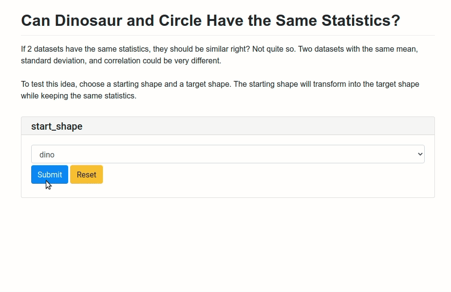

Code:

``` python
from pywebio.input import *
from pywebio.output import *
from pywebio import start_server
from utils import IMAGE_TO_LINK

def create_text():
  pass

def app():
    create_text()
    start_shapes = ['dino', 'big_slant']
    target_shapes = ['x', 'h_lines', 'v_lines', 'wide_lines', 'high_lines', 'slant_up', 'slant_down',
                     'center', 'star', 'down_parab', 'circle', 'bullseye', 'dots']

    start_shape = select(label='start_shape', options=start_shapes)
    target = select(label='target', options=target_shapes)
    put_image(IMAGE_TO_LINK[f'{start_shape}_{target}.gif'], width='100%')

if __name__ == '__main__':
    start_server(app, debug=True, port='44315')
```

그러나 아래와 같이 입력을 제출한 후 입력 양식이 사라지기를 원하지 않는다면 어떻게 될까요?

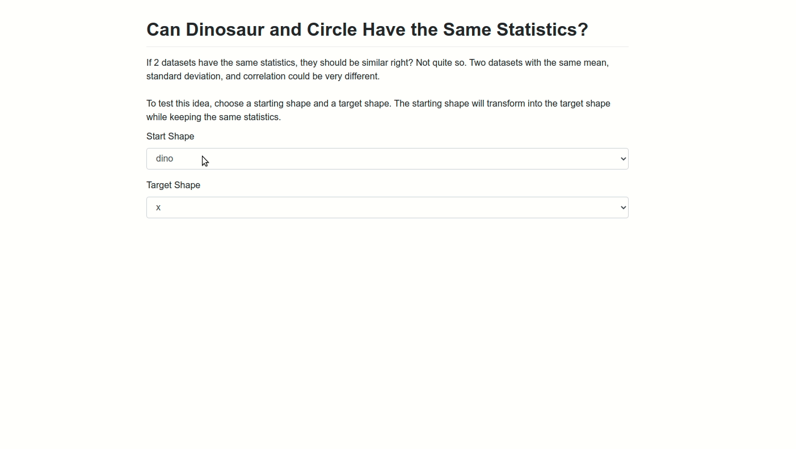

그럴 때 핀이 유용합니다. 입력이 지속되도록 하려면 먼저 input.select 위젯을 pin.put_select 위젯으로 바꿉니다.

``` python
put_select(label='Start Shape', name='start_shape', options=start_shapes)
put_select(label='Target Shape', name='target', options=target_shapes)
```

위젯 pywebio.input은 제출 성공 후 사라지지만 pywebio.pin의 위젯은 제출 후에도 사라지지 않습니다.
이제 pin_wait_change를 사용하여 핀 위젯 목록을 수신합니다. 위젯의 값이 변경되면 함수는 해당 위젯의 이름과 값을 반환합니다.

``` python
new_shape = pin_wait_change(['start_shape', 'target'])
print(new_shape)
```

아래 GIF에서는 위젯을 변경할 때마다 터미널에 모양이 인쇄됩니다. 이것은 위젯을 변경할 때 new_shape에 새로운 값이 할당된다는 것을 의미합니다.

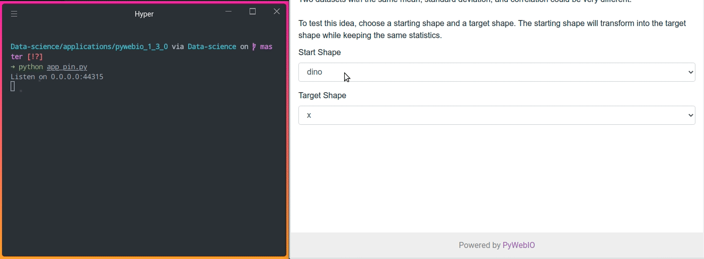

새 모양을 가져와 현재 핀 위젯에 할당하려면 다음을 사용하세요.

``` python
if new_shape['name'] == 'start_shape':
    pin.start_shape = new_shape['value']
else:
    pin.target = new_shape['value']
```

마지막으로 위의 코드를 use_scope(..., clear=True)로 감싸서 새 이미지가 나타나기 전에 이전 이미지를 지우도록 합니다.

모든 것을 합치십시오:

``` python
from pywebio.input import *
from pywebio.output import *
from pywebio.pin import *
from pywebio import start_server
from utils import IMAGE_TO_LINK

def create_text():
  pass

def app():
    create_text()
    start_shapes = ['dino', 'big_slant']
    target_shapes = ['x', 'h_lines', 'v_lines', 'wide_lines', 'high_lines', 'slant_up', 'slant_down',
                     'center', 'star', 'down_parab', 'circle', 'bullseye', 'dots']

    put_select(label='Start Shape', name='start_shape', options=start_shapes)
    put_select(label='Target Shape', name='target', options=target_shapes)
    while True:
        new_shape = pin_wait_change(['start_shape', 'target'])
        with use_scope('shape', clear=True):
          
            if new_shape['name'] == 'start_shape':
                pin.start_shape = new_shape['value']
            else:
                pin.target = new_shape['value']
            put_image(IMAGE_TO_LINK[f'{pin.start_shape}_{pin.target}.gif'], width='100%')
          
if __name__ == '__main__':
    start_server(app, debug=True, port='44315')
```

Output:


[여기](https://pywebio.readthedocs.io/en/v1.3.0/pin.html) 에서 핀 위젯의 전체 목록을 찾을 수 있습니다.


### Conclusion

축하합니다! PyWebIO의 3가지 새로운 기능에 대해 방금 배웠습니다. 여기서 언급할 수 없는 PyWebIO의 멋진 기능이 훨씬 더 많습니다. 다른 기능에 대해서는 [PyWebIO 웹사이트](https://www.pyweb.io/)를 확인하는 것이 좋습니다. 


[여기](https://github.com/khuyentran1401/Data-science/tree/master/applications/pywebio_1_3_0) 에서 이 기사의 소스 코드로 자유롭게 플레이하고 포크할 수 있습니다.

저는 기본적인 데이터 과학 개념에 대해 글을 쓰고 다양한 알고리즘과 데이터 과학 도구를 사용하는 것을 좋아합니다. LinkedIn 및 Twitter에서 저와 연결할 수 있습니다.
내가 작성한 모든 기사의 코드를 확인하려면 이 리포지토리에 별표를 표시하십시오. 다음과 같은 최신 데이터 과학 기사에 대한 정보를 얻으려면 Medium에서 저를 팔로우하세요.

