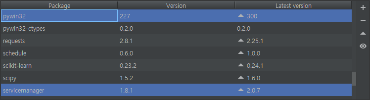
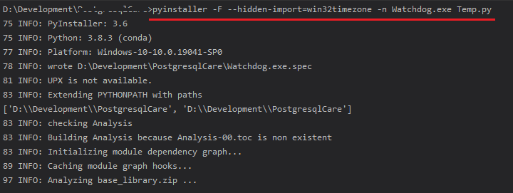
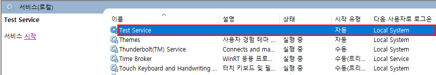

# Python 파이썬 Windows 서비스 등록

출처: https://nick2ya.tistory.com/16

이번 시간에는 파이썬으로 제작한 exe 실행파일을 Windows 서비스에 등록하여 실행시키는 방법에 대해 알아보도록 하겠습니다. 최종적으로 구현하고자 하는 방식은 아래와 같습니다.

 ***[ 프로그램 구성 ]*** 

\- Watchdog.exe  (Windows Service 등록)

\- Main.exe


 ***[ 프로그램 실행 방식 ]*** 

1. **서비스 시작**

 1) Windows Service 에서 Watchdog 서비스(ex, Test Service) 시작

 2) Watchdog.exe 가 Main.exe 프로그램 실행

 

2. **서비스 중지**

 1) Windows Service 에서 Watchdog 서비스(ex, Test Service) 중지

 2) Watchdog.exe 가 Main.exe 프로그램 종료(kill)


# ***1. 테스트 환경***

Python : 3.7

servicemanager : 1.8.1

pywin32 : 227





------

# ***2. 참조 소스***

``` python
import servicemanager
import socket
import sys
import win32event
import win32service
import win32serviceutil
import time
import subprocess
import os


class TestService(win32serviceutil.ServiceFramework):
  _svc_name_ = "TestService"
  _svc_display_name_ = "Test Service"
  _svc_description_ = "Service description"

  def __init__(self, args):
    win32serviceutil.ServiceFramework.__init__(self, args)
    self.hWaitStop = win32event.CreateEvent(None, 0, 0, None)
    socket.setdefaulttimeout(60)
    self.is_running = False

  def SvcStop(self):
    # Main.exe Process Kill
    # 서비스 중지 시 Main.exe 프로세스 taskkill 명령어로 중지.
    subprocess.Popen("taskkill /im Main.exe /f", shell=True)  
    time.sleep(1)

    self.ReportServiceStatus(win32service.SERVICE_STOP_PENDING)
    # is_running 를 False로 바꿔 줌으로써 Main.exe 주기적 호출 막기
    self.is_running = False 
    win32event.SetEvent(self.hWaitStop)

  def SvcDoRun(self):
    self.is_running = True
    # 현재 위치 체크
    current_location = str(os.path.abspath(os.path.dirname(sys.argv[0])))  

    # self.is_running 이 True인 경우에만 while 실행
    while self.is_running: 
      rc = win32event.WaitForSingleObject(self.hWaitStop, 5000)
      if rc == win32event.WAIT_OBJECT_0:
        break
      else:
        # 현재 경로에 위치한 Main.exe 프로그램 실행
        subprocess.Popen([current_location + "\\Main.exe"]) 
        time.sleep(55)

if __name__ == '__main__':
  if len(sys.argv) == 1:
    servicemanager.Initialize()
    servicemanager.PrepareToHostSingle(TestService)
    servicemanager.StartServiceCtrlDispatcher()
  else:
    win32serviceutil.HandleCommandLine(TestService)

```


------

# ***3. Windows Service exe 실행파일 만들기***

 Windows Service에 등록하기 위한 Watchdog 프로그램을 빌드하는 경우 pyinstaller를 활용하여 아래의 명령어로 exe 파일을 만들면 됩니다.

 

 \#pyinstaller -F --hidden-import=win32timezone -n Watchdog.exe py파일명


[ Watchdog exe 파일 생성 ]


------

# ***4. Windows Service 등록***

 *"**cmd창을 관리자 권한으로 실행"*** 한 다음 Watchdog 파일(ex, Watchdog.exe)이 위치한 경로로 이동해 줍니다.

그리고 아래의 명령어를 통해 서비스 등록 및 삭제를 진행하시면 됩니다.

 

 **1) Windows 서비스 등록**

  \#exe파일명 --startup=auto install


[ Windows Service 등록 ]

[ Windows Service에 등록된 화면 ]


 **2) Windows 서비스 삭제**

  \#exe파일명 remove

[ Windows Service 삭제 ]


---

## python 프로그램 window 서비스로 등록 시키기

출처: https://pydjango.tistory.com/30


python Win32모듈 다운로드 후 아래 코드 작성

[다운로드](http://sourceforge.net/projects/pywin32/files/pywin32/Build 218/)

아래 코드 작성 저장후 서비스 등록은 python filename.py install, 서비스 시작은 python filename.py start

\### Run Python scripts as a service example (ryrobes.com)
\### Usage : python aservice.py install (or / then start, stop, remove)


``` python
import win32service
import win32serviceutil
import win32api
import win32con
import win32event
import win32evtlogutil
import os, sys, string, time

class aservice(win32serviceutil.ServiceFramework):
    _svc_name_ = "Service short Name"
    _svc_display_name_ = "Service Display Name"
    _svc_description_ = "Service description"


    def __init__(self, args):
        win32serviceutil.ServiceFramework.__init__(self, args)
        self.hWaitStop = win32event.CreateEvent(None, 0, 0, None)

    def SvcStop(self):
        self.ReportServiceStatus(win32service.SERVICE_STOP_PENDING)
        win32event.SetEvent(self.hWaitStop)

    def SvcDoRun(self):
        import servicemanager
        servicemanager.LogMsg(servicemanager.EVENTLOG_INFORMATION_TYPE,
                              servicemanager.PYS_SERVICE_STARTED,(self._svc_name_, ''))

       self.timeout = 640000    #640 seconds / 10 minutes (value is in milliseconds)
       #self.timeout = 120000     #120 seconds / 2 minutes
       # This is how long the service will wait to run / refresh itself (see script below)

       while 1:
          # Wait for service stop signal, if I timeout, loop again
          rc = win32event.WaitForSingleObject(self.hWaitStop, self.timeout)
          # Check to see if self.hWaitStop happened
          if rc == win32event.WAIT_OBJECT_0:
            # Stop signal encountered
            servicemanager.LogInfoMsg("SomeShortNameVersion - STOPPED!")  #For Event Log
            break
          else:
            t=time.localtime()
            if t.tm_min==0 or t.tm_min==30:
                #Ok, here's the real money shot right here.
                #[actual service code between rests]
                try:
                    file_path = "C:\PYTHON\filename.py"
                    execfile(file_path)             #Execute the script
                except:
                    pass
                #[actual service code between rests]
            else:
                pass


def ctrlHandler(ctrlType):
    return True

if __name__ == '__main__':
   win32api.SetConsoleCtrlHandler(ctrlHandler, True)
   win32serviceutil.HandleCommandLine(aservice)


```

