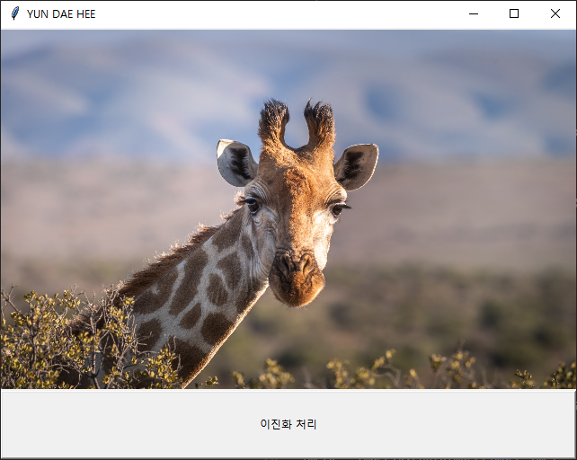

# **Python tkinter 강좌**

출처: https://076923.github.io/posts/Python-tkinter-1/


## 1. tkinter

`tkinter`는 `GUI`에 대한 `표준 Python 인터페이스`이며 `Window 창`을 생성할 수 있습니다. 


### tkinter 사용

```
import tkinter
```

상단에 `import tkinter`를 사용하여 `GUI 모듈`을 포함시킵니다. tkinter 함수의 사용방법은 `tkinter.*`를 이용하여 사용이 가능합니다. 

```python
import tkinter

window=tkinter.Tk()
window.mainloop()
```

`윈도우이름=tkinter.Tk()`를 이용하여 가장 상위 레벨의 `윈도우 창`을 **생성할 수 있습니다.**

`윈도우이름.mainloop()`를 사용하여 `윈도우이름`의 윈도우 창을 **윈도우가 종료될 때 까지 실행시킵니다.**

`생성` 구문과 `반복` 구문 사이에 `위젯`을 생성하고 적용합니다.

`tkinter.Tk()`를 적용할 경우 가장 기본적인 `윈도우 창`이 생성됩니다. 


### Window 창 설정

```python
import tkinter

window=tkinter.Tk()

window.title("YUN DAE HEE")
window.geometry("640x400+100+100")
window.resizable(False, False)

window.mainloop()
```

`윈도우이름.title("제목")`을 이용하여 `윈도우 창`의 `제목`을 설정할 수 있습니다.

`윈도우이름.geometry("너비x높이+x좌표+y좌표")`를 이용하여 `윈도우 창`의 `너비와 높이`, 초기 화면 위치의 `x좌표와 y좌표`를 설정할 수있습니다.

`윈도우이름.resizeable(상하, 좌우)`을 이용하여 `윈도우 창`의 `창 크기 조절 가능 여부`를 설정할 수 있습니다. `True`로 설정할 경우 `윈도우 창`의 크기를 조절할 수 있습니다.


- Tip : `resizeable()`을 적용할 때, `True=1`, `False=0`을 의미하여 `상수`를 입력해도 적용이 가능합니다.

`윈도우 창`의 이름이 `YUN DAE HEE`로 설정되었으며 `크기`와 `초기 화면 위치`, `윈도우 창의 크기 조절 불가`로 설정된 것을 확인할 수 있습니다. 


### Widget 배치

```python
import tkinter

window=tkinter.Tk()

window.title("YUN DAE HEE")
window.geometry("640x400+100+100")
window.resizable(False, False)

label=tkinter.Label(window, text="안녕하세요.")
label.pack()

window.mainloop()
```

`위젯이름=tkinter.Label(윈도우창, text="내용")`을 사용하여 `윈도우 창`에 `Label` 위젯을 설정할 수 있습니다.

`위젯이름.pack()`을 사용하여 **위젯을 배치할 수 있습니다.**


속성을 설정하지 않아 `기본 속성`으로 설정되어 **가장 최상단에 라벨이 배치된 것을 확인할 수 있습니다.** 


### 2. Label (라벨)

`Label`을 이용하여 삽입한 이미지나 도표, 그림 등에 사용되는 `주석문`을 생성할 수 있습니다. 


### Label 사용

```python
import tkinter

window=tkinter.Tk()
window.title("YUN DAE HEE")
window.geometry("640x400+100+100")
window.resizable(False, False)

label=tkinter.Label(window, text="파이썬", width=10, height=5, fg="red", relief="solid")
label.pack()

window.mainloop()
```


```python
label=tkinter.Label(window, text="파이썬", width=10, height=5, fg="red", relief="solid")
label.pack()
```


`tkinter.Label(윈도우 창, 파라미터1, 파라미터2, 파라미터3, ...)`을 사용하여 해당 `윈도우 창`에 표시할 `라벨의 속성`을 설정할 수 있습니다.

`파라미터`를 사용하여 `라벨의 속성`을 설정합니다.

 

### Label Parameter

------

##### 라벨 문자열 설정

| 이름         | 의미                                      | 기본값 | 속성                               |
| ------------ | ----------------------------------------- | ------ | ---------------------------------- |
| text         | 라벨에 표시할 문자열                      | -      | -                                  |
| textvariable | 라벨에 표시할 문자열을 가져올 변수        | -      | -                                  |
| anchor       | 라벨안의 문자열 또는 이미지의 위치        | center | n, ne, e, se, s, sw, w, nw, center |
| justify      | 라벨의 문자열이 여러 줄 일 경우 정렬 방법 | center | center, left, right                |
| wraplength   | 자동 줄내림 설정 너비                     | 0      | 상수                               |

##### 라벨 형태 설정

| 이름           | 의미                             | 기본값           | 속성                                       |
| -------------- | -------------------------------- | ---------------- | ------------------------------------------ |
| width          | 라벨의 너비                      | 0                | 상수                                       |
| height         | 라벨의 높이                      | 0                | 상수                                       |
| relief         | 라벨의 테두리 모양               | flat             | flat, groove, raised, ridge, solid, sunken |
| borderwidth=bd | 라벨의 테두리 두께               | 2                | 상수                                       |
| background=bg  | 라벨의 배경 색상                 | SystemButtonFace | color                                      |
| foreground=fg  | 라벨의 문자열 색상               | SystemButtonFace | color                                      |
| padx           | 라벨의 테두리와 내용의 가로 여백 | 1                | 상수                                       |
| pady           | 라벨의 테두리와 내용의 세로 여백 | 1                | 상수                                       |

##### 라벨 형식 설정

| 이름     | 의미                                                    | 기본값        | 속성                                                         |
| -------- | ------------------------------------------------------- | ------------- | ------------------------------------------------------------ |
| bitmap   | 라벨에 포함할 기본 이미지                               | -             | info, warring, error, question, questhead, hourglass, gray12, gray25, gray50, gray75 |
| image    | 라벨에 포함할 임의 이미지                               | -             | -                                                            |
| compound | 라벨에 문자열과 이미지를 동시에 표시할 때 이미지의 위치 | none          | bottom, center, left, none, right, top                       |
| font     | 라벨의 문자열 글꼴 설정                                 | TkDefaultFont | font                                                         |
| cursor   | 라벨의 마우스 커서 모양                                 | -             | [커서 속성](https://076923.github.io/posts/Python-tkinter-2/#reference-1) |

##### 라벨 상태 설정

| 이름               | 의미                                  | 기본값             | 속성                                                         |
| ------------------ | ------------------------------------- | ------------------ | ------------------------------------------------------------ |
| state              | 상태 설정                             | normal             | [normal](https://076923.github.io/posts/Python-tkinter-2/#reference-2), active, disabled |
| activebackground   | active 상태일 때 라벨의 배경 색상     | SystemButtonFace   | color                                                        |
| activeforeground   | active 상태일 때 라벨의 문자열 색상   | SystemButtonText   | color                                                        |
| disabledforeground | disabeld 상태일 때 라벨의 문자열 색상 | SystemDisabledText | color                                                        |

##### 라벨 하이라이트 설정

| 이름                | 의미                                                         | 기본값            | 속성  |
| ------------------- | ------------------------------------------------------------ | ----------------- | ----- |
| highlightcolor      | 라벨이 선택되었을 때 색상                                    | SystemWindowFrame | color |
| highlightbackground | 라벨이 선택되지 않았을 때 색상                               | SystemButtonFace  | color |
| highlightthickness  | 라벨이 선택되었을 때 두께 [(두께 설정)](https://076923.github.io/posts/Python-tkinter-2/#reference-3) | 0                 | 상수  |

 

### 3. Button (버튼)

`Button`을 이용하여 `메소드` 또는 `함수` 등을 실행시키기 위한 `단추`를 생성할 수 있습니다. 


### Button 사용

```
import tkinter

window=tkinter.Tk()
window.title("YUN DAE HEE")
window.geometry("640x400+100+100")
window.resizable(False, False)

count=0

def countUP():
    global count
    count +=1
    label.config(text=str(count))

label = tkinter.Label(window, text="0")
label.pack()

button = tkinter.Button(window, overrelief="solid", width=15, command=countUP, repeatdelay=1000, repeatinterval=100)
button.pack()

window.mainloop()
```


```
count=0

def countUP():
    global count
    count +=1
    label.config(text=str(count))

label = tkinter.Label(window, text="0")
label.pack()

button = tkinter.Button(window, overrelief="solid", width=15, command=countUP, repeatdelay=1000, repeatinterval=100)
button.pack()
```


`tkinter.Button(윈도우 창, 파라미터1, 파라미터2, 파라미터3, ...)`을 사용하여 해당 `윈도우 창`에 표시할 `버튼의 속성`을 설정할 수 있습니다.

`파라미터`를 사용하여 `버튼의 속성`을 설정합니다.

파라미터 중 `command`를 이용하여 `사용자 정의 함수 : countUP`을 실행시킬 수 있습니다.


### Button Method

------

| 이름     | 의미      |
| -------- | --------- |
| invoke() | 버튼 실행 |
| flash()  | 깜빡임    |

- Tip : `invoke()` : 버튼을 클릭했을 때와 동일한 실행
- Tip : `flash()` : `normal` 상태 배경 색상과 `active` 상태 배경 색상 사이에서 깜빡임

### Button Parameter

------

##### 버튼 문자열 설정

| 이름         | 의미                                      | 기본값 | 속성                               |
| ------------ | ----------------------------------------- | ------ | ---------------------------------- |
| text         | 버튼에 표시할 문자열                      | -      | -                                  |
| textvariable | 버튼에 표시할 문자열을 가져올 변수        | -      | -                                  |
| anchor       | 버튼안의 문자열 또는 이미지의 위치        | center | n, ne, e, se, s, sw, w, nw, center |
| justify      | 버튼의 문자열이 여러 줄 일 경우 정렬 방법 | center | center, left, right                |
| wraplength   | 자동 줄내림 설정 너비                     | 0      | 상수                               |

##### 버튼 형태 설정

| 이름           | 의미                                         | 기본값           | 속성                                       |
| -------------- | -------------------------------------------- | ---------------- | ------------------------------------------ |
| width          | 버튼의 너비                                  | 0                | 상수                                       |
| height         | 버튼의 높이                                  | 0                | 상수                                       |
| relief         | 버튼의 테두리 모양                           | flat             | flat, groove, raised, ridge, solid, sunken |
| overrelief     | 버튼에 마우스를 올렸을 때 버튼의 테두리 모양 | raised           | flat, groove, raised, ridge, solid, sunken |
| borderwidth=bd | 버튼의 테두리 두께                           | 2                | 상수                                       |
| background=bg  | 버튼의 배경 색상                             | SystemButtonFace | color                                      |
| foreground=fg  | 버튼의 문자열 색상                           | SystemButtonFace | color                                      |
| padx           | 버튼의 테두리와 내용의 가로 여백             | 1                | 상수                                       |
| pady           | 버튼의 테두리와 내용의 세로 여백             | 1                | 상수                                       |

##### 버튼 형식 설정

| 이름     | 의미                                                    | 기본값        | 속성                                                         |
| -------- | ------------------------------------------------------- | ------------- | ------------------------------------------------------------ |
| bitmap   | 버튼에 포함할 기본 이미지                               | -             | info, warring, error, question, questhead, hourglass, gray12, gray25, gray50, gray75 |
| image    | 버튼에 포함할 임의 이미지                               | -             | -                                                            |
| compound | 버튼에 문자열과 이미지를 동시에 표시할 때 이미지의 위치 | none          | bottom, center, left, none, right, top                       |
| font     | 버튼의 문자열 글꼴 설정                                 | TkDefaultFont | font                                                         |
| cursor   | 버튼의 마우스 커서 모양                                 | -             | [커서 속성](https://076923.github.io/posts/Python-tkinter-3/#reference-1) |

##### 버튼 상태 설정

| 이름               | 의미                                  | 기본값             | 속성                                                         |
| ------------------ | ------------------------------------- | ------------------ | ------------------------------------------------------------ |
| state              | 상태 설정                             | normal             | [normal](https://076923.github.io/posts/Python-tkinter-3/#reference-2), active, disabled |
| activebackground   | active 상태일 때 버튼의 배경 색상     | SystemButtonFace   | color                                                        |
| activeforeground   | active 상태일 때 버튼의 문자열 색상   | SystemButtonText   | color                                                        |
| disabledforeground | disabeld 상태일 때 버튼의 문자열 색상 | SystemDisabledText | color                                                        |

##### 버튼 하이라이트 설정

| 이름                | 의미                                                         | 기본값            | 속성  |
| ------------------- | ------------------------------------------------------------ | ----------------- | ----- |
| highlightcolor      | 버튼이 선택되었을 때 색상                                    | SystemWindowFrame | color |
| highlightbackground | 버튼이 선택되지 않았을 때 색상                               | SystemButtonFace  | color |
| highlightthickness  | 버튼이 선택되었을 때 두께 [(두께 설정)](https://076923.github.io/posts/Python-tkinter-3/#reference-3) | 0                 | 상수  |

##### 버튼 동작 설정

| 이름           | 의미                                                         | 기본값 | 속성         |
| -------------- | ------------------------------------------------------------ | ------ | ------------ |
| takefocus      | Tab 키를 이용하여 위젯 이동 허용 여부                        | True   | Boolean      |
| command        | 버튼이 active 상태일 때 실행하는 메소드(함수)                | -      | 메소드, 함수 |
| repeatdelay    | [버튼이 눌러진 상태에서 command 실행까지의 대기 시간](https://076923.github.io/posts/Python-tkinter-3/#reference-4) | 0      | 상수(ms)     |
| repeatinterval | [버튼이 눌러진 상태에서 command 실행의 반복 시간](https://076923.github.io/posts/Python-tkinter-3/#reference-5) | 0      | 상수(ms)     |

 


### 4. Entry (기입창)

`Entry`을 이용하여 텍스트를 `입력`받거나 `출력`하기 위한 `기입창`을 생성할 수 있습니다 


### Entry 사용

```
import tkinter
from math import*

window=tkinter.Tk()
window.title("YUN DAE HEE")
window.geometry("640x480+100+100")
window.resizable(False, False)

def calc(event):
    label.config(text="결과="+str(eval(entry.get())))

entry=tkinter.Entry(window)
entry.bind("<Return>", calc)
entry.pack()

label=tkinter.Label(window)
label.pack()

window.mainloop()
```


```
def calc(event):
    label.config(text="결과="+str(eval(entry.get())))

entry=tkinter.Entry(window)
entry.bind("<Return>", calc)
entry.pack()

label=tkinter.Label(window)
label.pack()
```


`tkinter.Entry(윈도우 창, 파라미터1, 파라미터2, 파라미터3, ...)`을 사용하여 해당 `윈도우 창`에 표시할 `기입창의 속성`을 설정할 수 있습니다.

`파라미터`를 사용하여 `기입창의 속성`을 설정합니다.

`Entry.bind()`를 이용하여 `key`나 `mouse` 등의 `event`를 처리하여 `메소드`나 `함수`를 실행시킬 수 있습니다.

`기입창`에 간단한 `수학함수` 등을 작성 후 `Enter 키`를 입력시, `라벨`에 결과가 표시됩니다.

- Tip : `4+4*cos(0.5)`을 입력시 `결과=7.51033...`이 반환됩니다.

### Entry Method

------

| 이름                                 | 의미                                                         |
| ------------------------------------ | ------------------------------------------------------------ |
| insert(index, “문자열”)              | `index` 위치에 `문자열` 추가                                 |
| delete(start_index, end_index)       | `start_index`부터 `end_index`까지의 문자열 삭제              |
| get()                                | 기입창의 텍스트를 문자열로 반환                              |
| index(index)                         | `index`에 대응하는 위치 획득                                 |
| icursor(index)                       | `index` 앞에 키보드 커서 설정                                |
| select_adjust(index)                 | `index` 위치까지의 문자열을 블록처리                         |
| select_range(start_index, end_index) | `start_index`부터 `end_index`까지 블록처리                   |
| select_to(index)                     | 키보드 커서부터 `index`까지 블록처리                         |
| select_from(index)                   | 키보드 커서의 색인 위치를 `index` 위치에 문자로 설정하고 선택 |
| select_present()                     | 블록처리 되어있는 경우 `True`, 아닐 경우 `False`             |
| select_clear()                       | 블록처리 해제                                                |
| xview()                              | 가로스크롤 연결                                              |
| xview_scroll(num, str)               | 가로스크롤의 속성 설정                                       |

- xview_scroll

  - ```
    num
    ```

    - num > 0 : 왼쪽에서 오른쪽으로 스크롤
    - num < 0 : 오른쪽에서 왼쪽으로 스크롤

  - ```
    str
    ```

    - `units` : 문자 너비로 스크롤
    - `pages` : 위젯 너비로 스크롤 

### Entry Parameter

------

##### 기입창 문자열 설정

| 이름         | 의미                                        | 기본값 | 속성                                                         |
| ------------ | ------------------------------------------- | ------ | ------------------------------------------------------------ |
| show         | 기입창에 표시되는 문자                      | -      | [문자](https://076923.github.io/posts/Python-tkinter-4/#reference-1) |
| textvariable | 기입창에 표시할 문자열을 가져올 변수        | -      | -                                                            |
| justify      | 기입창의 문자열이 여러 줄 일 경우 정렬 방법 | center | center, left, right                                          |

##### 기입창 형태 설정

| 이름              | 의미                                 | 기본값           | 속성                                       |
| ----------------- | ------------------------------------ | ---------------- | ------------------------------------------ |
| width             | 기입창의 너비                        | 0                | 상수                                       |
| relief            | 기입창의 테두리 모양                 | flat             | flat, groove, raised, ridge, solid, sunken |
| borderwidth=bd    | 기입창의 테두리 두께                 | 2                | 상수                                       |
| background=bg     | 기입창의 배경 색상                   | SystemButtonFace | color                                      |
| foreground=fg     | 기입창의 문자열 색상                 | SystemButtonFace | color                                      |
| insertwidth       | 기입창의 키보드 커서 너비            | 2                | 상수                                       |
| insertborderwidth | 기입창의 키보드 커서 테두리 두께     | 0                | 상수                                       |
| insertbackground  | 기입창의 키보드 커서 색상            | SystemWindowText | color                                      |
| selectborderwidth | 기입창의 문자열 블록처리 테두리 두께 | 0                | 상수                                       |
| selectbackground  | 기입창의 문자열 블록처리 배경 색상   | SystemHighlight  | color                                      |
| selectforeground  | 기입창의 문자열 블록처리 문자열 색상 | SystemHighlight  | color                                      |

##### 기입창 형식 설정

| 이름           | 의미                          | 기본값        | 속성                                                         |
| -------------- | ----------------------------- | ------------- | ------------------------------------------------------------ |
| font           | 기입창의 문자열 글꼴 설정     | TkDefaultFont | font                                                         |
| cursor         | 기입창의 마우스 커서 모양     | -             | [커서 속성](https://076923.github.io/posts/Python-tkinter-4/#reference-2) |
| xscrollcommand | 기입창의 가로스크롤 위젯 적용 | -             | Scrollbar위젯.set                                            |

##### 기입창 상태 설정

| 이름               | 의미                                    | 기본값             | 속성                                                         |
| ------------------ | --------------------------------------- | ------------------ | ------------------------------------------------------------ |
| state              | 상태 설정                               | normal             | [normal](https://076923.github.io/posts/Python-tkinter-4/#reference-3), readonly, disabled |
| readonlybackground | readonly 상태일 때 기입창의 배경 색상   | SystemButtonFace   | color                                                        |
| disabledbackground | disabeld 상태일 때 기입창의 배경 색상   | SystemButtonFace   | color                                                        |
| disabledforeground | disabeld 상태일 때 기입창의 문자열 색상 | SystemDisabledText | color                                                        |

##### 기입창 하이라이트 설정

| 이름                | 의미                                                         | 기본값            | 속성  |
| ------------------- | ------------------------------------------------------------ | ----------------- | ----- |
| highlightcolor      | 기입창이 선택되었을 때 색상                                  | SystemWindowFrame | color |
| highlightbackground | 기입창이 선택되지 않았을 때 색상                             | SystemButtonFace  | color |
| highlightthickness  | 기입창이 선택되었을 때 두께 [(두께 설정)](https://076923.github.io/posts/Python-tkinter-4/#reference-4) | 0                 | 상수  |

##### 기입창 동작 설정

| 이름          | 의미                                           | 기본값 | 속성     |
| ------------- | ---------------------------------------------- | ------ | -------- |
| takefocus     | Tab 키를 이용하여 위젯 이동 허용 여부          | True   | Boolean  |
| insertontime  | 기입창의 키보드 커서 깜빡임이 보이는 시간      | 600    | 상수(ms) |
| insertofftime | 기입창의 키보드 커서 깜빡임이 보이지 않는 시간 | 300    | 상수(ms) |

 

### 5. Listbox (리스트박스)

`Listbox`을 이용하여 목록을 불러와 `추가`, `제거` 또는 `선택`하기 위한 `리스트박스`를 생성할 수 있습니다

### Listbox 사용

------

```
import tkinter

window=tkinter.Tk()
window.title("YUN DAE HEE")
window.geometry("640x480+100+100")
window.resizable(False, False)

listbox = tkinter.Listbox(window, selectmode='extended', height=0)
listbox.insert(0, "1번")
listbox.insert(1, "2번")
listbox.insert(2, "2번")
listbox.insert(3, "2번")
listbox.insert(4, "3번")
listbox.delete(1, 2)
listbox.pack()

window.mainloop()
```

```
listbox = tkinter.Listbox(window, selectmode='extended', height=0)
listbox.insert(0, "1번")
listbox.insert(1, "2번")
listbox.insert(2, "2번")
listbox.insert(3, "2번")
listbox.insert(4, "3번")
listbox.delete(1, 2)
listbox.pack()
```

`tkinter.Listbox(윈도우 창, 파라미터1, 파라미터2, 파라미터3, ...)`을 사용하여 해당 `윈도우 창`에 표시할 `리스트박스의 속성`을 설정할 수 있습니다.

`파라미터`를 사용하여 `리스트박스의 속성`을 설정합니다.

`리스트박스.insert(index, "항목")`을 통하여 항목을 `추가`할 수 있습니다.

`리스트박스.delete(start_index, end_index)`를 통하여 항목을 `삭제`할 수 있습니다.

- Tip : `리스트박스.delete(index)`를 통하여 `단일 항목`만 `삭제`할 수 있습니다.

### Listbox Method

------

| 이름                           | 의미                                                       |
| ------------------------------ | ---------------------------------------------------------- |
| insert(index, “항목”)          | `index` 위치에 항목 추가                                   |
| delete(start_index, end_index) | `start_index`부터 `end_index`까지의 항목 삭제              |
| size()                         | 항목 개수 반환                                             |
| activate(index)                | `index` 위치에 항목 선택                                   |
| curselection()                 | 선택된 항목을 튜플로 반환                                  |
| get(start_index, end_index)    | `start_index`부터 `end_index`까지의 항목을 튜플로 반환     |
| index(index)                   | `index`에 대응하는 위치 획득                               |
| nearest(y)                     | 현재 보이는 리스트박스의 항목 중 y에 가장 가까운 값을 반환 |
| see(index)                     | `index`가 보이도록 리스트박스의 위치 조정                  |
| xview()                        | 가로스크롤 연결                                            |
| xview_scroll(num, str)         | 가로스크롤의 속성 설정                                     |
| xview_moveto(num)              | 가로스크롤 이동 (0~1)                                      |
| yview()                        | 세로스크롤 연결                                            |
| yview_scroll(num, str)         | 세로스크롤의 속성 설정                                     |
| yview_moveto(num)              | 세로스크롤 이동 (0~1)                                      |

- xview_scroll
  - `num` : 스크롤 이동 횟수
  - `str`
    - `units` : 문자 너비로 스크롤
    - `pages` : 위젯 너비로 스크롤

- yview_scroll
  - `num` : 스크롤 이동 횟수
  - `str`
    - `units` : 줄 높이로 스크롤
    - `pages` : 위젯 높이로 스크롤 

### Listbox Parameter

------

##### 리스트박스 문자열 설정

| 이름         | 의미                                     | 기본값 | 속성 |
| ------------ | ---------------------------------------- | ------ | ---- |
| listvariable | 리스트박스에 표시할 문자열을 가져올 변수 | -      | -    |

##### 리스트박스 형태 설정

| 이름              | 의미                                   | 기본값           | 속성                                                         |
| ----------------- | -------------------------------------- | ---------------- | ------------------------------------------------------------ |
| width             | 리스트박스의 너비                      | 20               | [상수](https://076923.github.io/posts/Python-tkinter-5/#reference-1) |
| height            | 리스트박스의 높이                      | 10               | [상수](https://076923.github.io/posts/Python-tkinter-5/#reference-1) |
| relief            | 리스트박스의 테두리 모양               | flat             | flat, groove, raised, ridge, solid, sunken                   |
| borderwidth=bd    | 리스트박스의 테두리 두께               | 2                | 상수                                                         |
| background=bg     | 리스트박스의 배경 색상                 | SystemButtonFace | color                                                        |
| foreground=fg     | 리스트박스의 문자열 색상               | SystemButtonFace | color                                                        |
| selectbackground  | 리스트박스 항목의 블록처리 배경 색상   | SystemHighlight  | color                                                        |
| selectforeground  | 리스트박스 항목의 블록처리 문자열 색상 | SystemHighlight  | color                                                        |
| selectborderwidth | 리스트박스 항목의 블록처리 테두리 두께 | 0                | 상수                                                         |

##### 리스트박스 형식 설정

| 이름            | 의미                              | 기본값        | 속성                                                         |
| --------------- | --------------------------------- | ------------- | ------------------------------------------------------------ |
| font            | 리스트박스의 문자열 글꼴 설정     | TkDefaultFont | font                                                         |
| cursor          | 리스트박스의 마우스 커서 모양     | -             | [커서 속성](https://076923.github.io/posts/Python-tkinter-5/#reference-2) |
| xscrollcommand  | 리스트박스의 가로스크롤 위젯 적용 | -             | Scrollbar위젯.set                                            |
| yscrollcommand  | 리스트박스의 세로스크롤 위젯 적용 | -             | Scrollbar위젯.set                                            |
| exportselection | 리스트박스간의 항목 선택 유지     | True          | [Boolean](https://076923.github.io/posts/Python-tkinter-5/#reference-3) |
| setgrid         | 리스트박스의 격자 크기 조정 설정  | False         | Boolean                                                      |

##### 리스트박스 상태 설정

| 이름               | 의미                                        | 기본값             | 속성                                                         |
| ------------------ | ------------------------------------------- | ------------------ | ------------------------------------------------------------ |
| state              | 상태 설정                                   | normal             | [normal](https://076923.github.io/posts/Python-tkinter-5/#reference-4), readonly, disabled |
| disabledforeground | disabeld 상태일 때 리스트박스의 문자열 색상 | SystemDisabledText | color                                                        |

##### 리스트박스 하이라이트 설정

| 이름                | 의미                                                         | 기본값            | 속성  |
| ------------------- | ------------------------------------------------------------ | ----------------- | ----- |
| highlightcolor      | 리스트박스가이 선택되었을 때 색상                            | SystemWindowFrame | color |
| highlightbackground | 리스트박스가이 선택되지 않았을 때 색상                       | SystemButtonFace  | color |
| highlightthickness  | 리스트박스가이 선택되었을 때 두께 [(두께 설정)](https://076923.github.io/posts/Python-tkinter-5/#reference-5) | 0                 | 상수  |

##### 리스트박스 동작 설정

| 이름        | 의미                                  | 기본값    | 속성                                                         |
| ----------- | ------------------------------------- | --------- | ------------------------------------------------------------ |
| takefocus   | Tab 키를 이용하여 위젯 이동 허용 여부 | True      | Boolean                                                      |
| activestyle | 리스트박스의 선택된 항목의 표시 형태  | underline | [underline, none, dotbox](https://076923.github.io/posts/Python-tkinter-5/#reference-6) |
| selectmode  | 리스트박스의 항목 선택 방법           | browse    | [browse, single, mulitple, extended](https://076923.github.io/posts/Python-tkinter-5/#reference-7) |


### 6. Checkbutton (체크버튼)

------

`Checkbutton`을 이용하여 `옵션` 등을 **다중 선택**하기 위한 `체크버튼`을 생성할 수 있습니다.

### Checkbutton 사용

------

```
import tkinter

window=tkinter.Tk()
window.title("YUN DAE HEE")
window.geometry("640x480+100+100")
window.resizable(False, False)

def flash():
    checkbutton1.flash()

CheckVariety_1=tkinter.IntVar()
CheckVariety_2=tkinter.IntVar()

checkbutton1=tkinter.Checkbutton(window, text="O", variable=CheckVariety_1, activebackground="blue")
checkbutton2=tkinter.Checkbutton(window, text="△", variable=CheckVariety_2)
checkbutton3=tkinter.Checkbutton(window, text="X", variable=CheckVariety_2, command=flash)

checkbutton1.pack()
checkbutton2.pack()
checkbutton3.pack()

window.mainloop()
```

```
def flash():
    checkbutton1.flash()

CheckVariety_1=tkinter.IntVar()
CheckVariety_2=tkinter.IntVar()

checkbutton1=tkinter.Checkbutton(window, text="O", variable=CheckVariety_1, activebackground="blue")
checkbutton2=tkinter.Checkbutton(window, text="△", variable=CheckVariety_2)
checkbutton3=tkinter.Checkbutton(window, text="X", variable=CheckVariety_2, command=flash)

checkbutton1.pack()
checkbutton2.pack()
checkbutton3.pack()
```

`tkinter.Checkbutton(윈도우 창, 파라미터1, 파라미터2, 파라미터3, ...)`을 사용하여 해당 `윈도우 창`에 표시할 `체크버튼의 속성`을 설정할 수 있습니다.

`파라미터`를 사용하여 `체크버튼의 속성`을 설정합니다.

파라미터 중 `command`를 이용하여 `사용자 정의 함수 : flash()`을 실행시킬 수 있습니다.

### Checkbutton Method

------

| 이름       | 의미           |
| ---------- | -------------- |
| select()   | 체크 상태      |
| deselect() | 해제 상태      |
| toggle()   | 토글           |
| invoke()   | 체크 버튼 실행 |
| flash()    | 깜빡임         |

- Tip : `toggle()` : 체크일 경우 해제되며, 해제일 경우 체크됨
- Tip : `invoke()` : 체크버튼을 클릭했을 때와 동일한 실행
- Tip : `flash()` : `normal` 상태 배경 색상과 `active` 상태 배경 색 사이에서 깜빡임

### Checkbutton Parameter

------

##### 체크버튼 문자열 설정

| 이름         | 의미                                          | 기본값 | 속성                               |
| ------------ | --------------------------------------------- | ------ | ---------------------------------- |
| text         | 체크버튼에 표시할 문자열                      | -      | -                                  |
| textvariable | 체크버튼에 표시할 문자열을 가져올 변수        | -      | -                                  |
| anchor       | 체크버튼안의 문자열 또는 이미지의 위치        | center | n, ne, e, se, s, sw, w, nw, center |
| justify      | 체크버튼의 문자열이 여러 줄 일 경우 정렬 방법 | center | center, left, right                |
| wraplength   | 자동 줄내림 설정 너비                         | 0      | 상수                               |

##### 체크버튼 형태 설정

| 이름          | 의미                                                 | 기본값           | 속성                                       |
| ------------- | ---------------------------------------------------- | ---------------- | ------------------------------------------ |
| width         | 체크버튼의 너비                                      | 0                | 상수                                       |
| height        | 체크버튼의 높이                                      | 0                | 상수                                       |
| relief        | 체크버튼의 테두리 모양                               | flat             | flat, groove, raised, ridge, solid, sunken |
| overrelief    | 체크버튼에 마우스를 올렸을 때 체크버튼의 테두리 모양 | raised           | flat, groove, raised, ridge, solid, sunken |
| background=bg | 체크버튼의 배경 색상                                 | SystemButtonFace | color                                      |
| foreground=fg | 체크버튼의 문자열 색상                               | SystemButtonFace | color                                      |
| selectcolor   | 체크버튼 상태의 배경 색                              | SystemWindow     | color                                      |
| padx          | 체크버튼의 테두리와 내용의 가로 여백                 | 1                | 상수                                       |
| pady          | 체크버튼의 테두리와 내용의 세로 여백                 | 1                | 상수                                       |

##### 체크버튼 형식 설정

| 이름        | 의미                                                         | 기본값        | 속성                                                         |
| ----------- | ------------------------------------------------------------ | ------------- | ------------------------------------------------------------ |
| bitmap      | 체크버튼에 포함할 기본 이미지                                | -             | info, warring, error, question, questhead, hourglass, gray12, gray25, gray50, gray75 |
| image       | 체크버튼에 포함할 임의 이미지                                | -             | -                                                            |
| selectimage | [체크버튼의 체크 상태일 때 표시할 임의 이미지](https://076923.github.io/posts/Python-tkinter-6/#reference-1) | -             | -                                                            |
| compound    | 체크버튼에 문자열과 이미지를 동시에 표시할 때 이미지의 위치  | none          | bottom, center, left, none, right, top                       |
| font        | 체크버튼의 문자열 글꼴 설정                                  | TkDefaultFont | font                                                         |
| cursor      | 체크버튼의 마우스 커서 모양                                  | -             | [커서 속성](https://076923.github.io/posts/Python-tkinter-6/#reference-2) |

##### 체크버튼 상태 설정

| 이름               | 의미                                      | 기본값             | 속성                                                         |
| ------------------ | ----------------------------------------- | ------------------ | ------------------------------------------------------------ |
| state              | 상태 설정                                 | normal             | [normal](https://076923.github.io/posts/Python-tkinter-6/#reference-3), active, disabled |
| activebackground   | active 상태일 때 체크버튼의 배경 색상     | SystemButtonFace   | color                                                        |
| activeforeground   | active 상태일 때 체크버튼의 문자열 색상   | SystemButtonText   | color                                                        |
| disabledforeground | disabeld 상태일 때 체크버튼의 문자열 색상 | SystemDisabledText | color                                                        |

##### 체크버튼 하이라이트 설정

| 이름                | 의미                                                         | 기본값            | 속성  |
| ------------------- | ------------------------------------------------------------ | ----------------- | ----- |
| highlightcolor      | 체크버튼이 선택되었을 때 색상                                | SystemWindowFrame | color |
| highlightbackground | 체크버튼이 선택되지 않았을 때 색상                           | SystemButtonFace  | color |
| highlightthickness  | 체크버튼이 선택되었을 때 두께 [(두께 설정)](https://076923.github.io/posts/Python-tkinter-6/#reference-4) | 0                 | 상수  |

##### 체크버튼 동작 설정

| 이름        | 의미                                              | 기본값   | 속성                                                         |      |
| ----------- | ------------------------------------------------- | -------- | ------------------------------------------------------------ | ---- |
| :——————-:   | :——————————:                                      | :—————–: | :—-:                                                         | boo  |
| takefocus   | Tab 키를 이용하여 위젯 이동 허용 여부             | True     | Boolean                                                      |      |
| command     | 체크버튼이 active 상태일 때 실행하는 메소드(함수) | -        | 메소드, 함수                                                 |      |
| variable    | 체크버튼의 상태를 저장할 제어 변수                | -        | tkinter.IntVar()                                             |      |
| onvalue     | 체크버튼이 체크 상태일 때 연결된 제어 변수의 값   | True     | Boolean                                                      |      |
| offvalue    | 체크버튼이 해제 상태일 때 연결된 제어 변수의 값   | False    | Boolean                                                      |      |
| indicatoron | 체크버튼의 위젯 일치화 여부                       | True     | [Boolean](https://076923.github.io/posts/Python-tkinter-6/#reference-5) |      |

 


### 7. Radiobutton (라디오버튼)

------

`Radiobutton`을 이용하여 `옵션` 등을 **단일 선택**하기 위한 `라디오버튼`을 생성할 수 있습니다.

### Radiobutton 사용

------

```
import tkinter

window=tkinter.Tk()
window.title("YUN DAE HEE")
window.geometry("640x480+100+100")
window.resizable(False, False)

def check():
    label.config(text= "RadioVariety_1 = " + str(RadioVariety_1.get()) + "\n" +
                       "RadioVariety_2 = " + str(RadioVariety_2.get()) + "\n\n" +
                       "Total = "          + str(RadioVariety_1.get() + RadioVariety_2.get()))

RadioVariety_1=tkinter.IntVar()
RadioVariety_2=tkinter.IntVar()

radio1=tkinter.Radiobutton(window, text="1번", value=3, variable=RadioVariety_1, command=check)
radio1.pack()

radio2=tkinter.Radiobutton(window, text="2번(1번)", value=3, variable=RadioVariety_1, command=check)
radio2.pack()

radio3=tkinter.Radiobutton(window, text="3번", value=9, variable=RadioVariety_1, command=check)
radio3.pack()

label=tkinter.Label(window, text="None", height=5)
label.pack()

radio4=tkinter.Radiobutton(window, text="4번", value=12, variable=RadioVariety_2, command=check)
radio4.pack()

radio5=tkinter.Radiobutton(window, text="5번", value=15, variable=RadioVariety_2, command=check)
radio5.pack()

window.mainloop()
```

```
def check():
    label.config(text= "RadioVariety_1 = " + str(RadioVariety_1.get()) + "\n" +
                       "RadioVariety_2 = " + str(RadioVariety_2.get()) + "\n\n" +
                       "Total = "          + str(RadioVariety_1.get() + RadioVariety_2.get()))

RadioVariety_1=tkinter.IntVar()
RadioVariety_2=tkinter.IntVar()

radio1=tkinter.Radiobutton(window, text="1번", value=3, variable=RadioVariety_1, command=check)
radio1.pack()

radio2=tkinter.Radiobutton(window, text="2번(1번)", value=3, variable=RadioVariety_1, command=check)
radio2.pack()

radio3=tkinter.Radiobutton(window, text="3번", value=9, variable=RadioVariety_1, command=check)
radio3.pack()

label=tkinter.Label(window, text="None", height=5)
label.pack()

radio4=tkinter.Radiobutton(window, text="4번", value=12, variable=RadioVariety_2, command=check)
radio4.pack()

radio5=tkinter.Radiobutton(window, text="5번", value=15, variable=RadioVariety_2, command=check)
radio5.pack()
```

`tkinter.Radiobutton(윈도우 창, 파라미터1, 파라미터2, 파라미터3, ...)`을 사용하여 해당 `윈도우 창`에 표시할 `라디오버튼의 속성`을 설정할 수 있습니다.

`파라미터`를 사용하여 `라디오버튼의 속성`을 설정합니다.

파라미터 중 `command`를 이용하여 `사용자 정의 함수 : check()`을 실행시킬 수 있습니다.

파라미터 중 `value`를 이용하여 `라디오버튼의 값`을 설정할 수 있습니다. `value`의 값이 겹치는 경우 **같이 선택됩니다.**

파라미터 중 `variable`를 이용하여 `tkinter.IntVar()`의 그룹이 같을 경우 하나의 묶음으로 간주하며 ‘value’의 값이 저장됩니다.

`tkinter.IntVar()`에 저장된 `value` 값은 `변수이름.get()`을 통하여 불러올 수 있습니다.

### Radiobutton Method

------

| 이름       | 의미           |
| ---------- | -------------- |
| select()   | 체크 상태      |
| deselect() | 해제 상태      |
| invoke()   | 체크 버튼 실행 |
| flash()    | 깜빡임         |

- Tip : `invoke()` : 라디오버튼을 클릭했을 때와 동일한 실행
- Tip : `flash()` : `normal` 상태 배경 색상과 `active` 상태 배경 색상 사이에서 깜빡임

### Radiobutton Parameter

------

##### 라디오버튼 문자열 설정

| 이름         | 의미                                            | 기본값 | 속성                               |
| ------------ | ----------------------------------------------- | ------ | ---------------------------------- |
| text         | 라디오버튼에 표시할 문자열                      | -      | -                                  |
| textvariable | 라디오버튼에 표시할 문자열을 가져올 변수        | -      | -                                  |
| anchor       | 라디오버튼안의 문자열 또는 이미지의 위치        | center | n, ne, e, se, s, sw, w, nw, center |
| justify      | 라디오버튼의 문자열이 여러 줄 일 경우 정렬 방법 | center | center, left, right                |
| wraplength   | 자동 줄내림 설정 너비                           | 0      | 상수                               |

##### 라디오버튼 형태 설정

| 이름          | 의미                                                     | 기본값           | 속성                                       |
| ------------- | -------------------------------------------------------- | ---------------- | ------------------------------------------ |
| width         | 라디오버튼의 너비                                        | 0                | 상수                                       |
| height        | 라디오버튼의 높이                                        | 0                | 상수                                       |
| relief        | 라디오버튼의 테두리 모양                                 | flat             | flat, groove, raised, ridge, solid, sunken |
| overrelief    | 라디오버튼에 마우스를 올렸을 때 라디오버튼의 테두리 모양 | raised           | flat, groove, raised, ridge, solid, sunken |
| background=bg | 라디오버튼의 배경 색상                                   | SystemButtonFace | color                                      |
| foreground=fg | 라디오버튼의 문자열 색상                                 | SystemButtonFace | color                                      |
| selectcolor   | 라디오버튼 상태의 배경 색상                              | SystemWindow     | color                                      |
| padx          | 라디오버튼의 테두리와 내용의 가로 여백                   | 1                | 상수                                       |
| pady          | 라디오버튼의 테두리와 내용의 세로 여백                   | 1                | 상수                                       |

##### 라디오버튼 형식 설정

| 이름        | 의미                                                         | 기본값        | 속성                                                         |
| ----------- | ------------------------------------------------------------ | ------------- | ------------------------------------------------------------ |
| bitmap      | 라디오버튼에 포함할 기본 이미지                              | -             | info, warring, error, question, questhead, hourglass, gray12, gray25, gray50, gray75 |
| image       | 라디오버튼에 포함할 임의 이미지                              | -             | -                                                            |
| selectimage | [라디오버튼의 체크 상태일 때 표시할 임의 이미지](https://076923.github.io/posts/Python-tkinter-7/#reference-1) | -             | -                                                            |
| compound    | 라디오버튼에 문자열과 이미지를 동시에 표시할 때 이미지의 위치 | none          | bottom, center, left, none, right, top                       |
| font        | 라디오버튼의 문자열 글꼴 설정                                | TkDefaultFont | font                                                         |
| cursor      | 라디오버튼의 마우스 커서 모양                                | -             | [커서 속성](https://076923.github.io/posts/Python-tkinter-7/#reference-2) |

##### 라디오버튼 상태 설정

| 이름               | 의미                                        | 기본값             | 속성                                                         |
| ------------------ | ------------------------------------------- | ------------------ | ------------------------------------------------------------ |
| state              | 상태 설정                                   | normal             | [normal](https://076923.github.io/posts/Python-tkinter-7/#reference-3), active, disabled |
| activebackground   | active 상태일 때 라디오버튼의 배경 색상     | SystemButtonFace   | color                                                        |
| activeforeground   | active 상태일 때 라디오버튼의 문자열 색상   | SystemButtonText   | color                                                        |
| disabledforeground | disabeld 상태일 때 라디오버튼의 문자열 색상 | SystemDisabledText | color                                                        |

##### 라디오버튼 하이라이트 설정

| 이름                | 의미                                                         | 기본값            | 속성  |
| ------------------- | ------------------------------------------------------------ | ----------------- | ----- |
| highlightcolor      | 라디오버튼이 선택되었을 때 색상                              | SystemWindowFrame | color |
| highlightbackground | 라디오버튼이 선택되지 않았을 때 색상                         | SystemButtonFace  | color |
| highlightthickness  | 라디오버튼이 선택되었을 때 두께 [(두께 설정)](https://076923.github.io/posts/Python-tkinter-7/#reference-4) | 0                 | 상수  |

##### 라디오버튼 동작 설정

| 이름        | 의미                                                | 기본값 | 속성                                                         |
| ----------- | --------------------------------------------------- | ------ | ------------------------------------------------------------ |
| takefocus   | Tab 키를 이용하여 위젯 이동 허용 여부               | True   | Boolean                                                      |
| command     | 라디오버튼이 active 상태일 때 실행하는 메소드(함수) | -      | 메소드, 함수                                                 |
| variable    | 라디오버튼의 상태를 저장할 제어 변수                | -      | tkinter.IntVar(), tkinter.StringVar()                        |
| value       | 라디오버튼이 가지고 있는 값                         | -      | [variable의 속성](https://076923.github.io/posts/Python-tkinter-7/#reference-5) |
| indicatoron | 라디오버튼의 위젯 일치화 여부                       | True   | [Boolean](https://076923.github.io/posts/Python-tkinter-7/#reference-6) |


### 8. Menu (메뉴)

------

`Menu`을 이용하여 `자주 사용하는 기능` 등을 **다양한 선택사항으로 나누는** `메뉴`을 생성할 수 있습니다.

### Menu 사용

------

```
import tkinter

window=tkinter.Tk()
window.title("YUN DAE HEE")
window.geometry("640x480+100+100")
window.resizable(False, False)

menubar=tkinter.Menu(window)

menu_1=tkinter.Menu(menubar, tearoff=0)
menu_1.add_command(label="하위 메뉴 1-1")
menu_1.add_command(label="하위 메뉴 1-2")
menu_1.add_separator()
menu_1.add_command(label="하위 메뉴 1-3", command=window.quit())
menubar.add_cascade(label="상위 메뉴 1", menu=menu_1)

menu_2=tkinter.Menu(menubar, tearoff=0, selectcolor="red")
menu_2.add_radiobutton(label="하위 메뉴 2-1", state="disable")
menu_2.add_radiobutton(label="하위 메뉴 2-2")
menu_2.add_radiobutton(label="하위 메뉴 2-3")
menubar.add_cascade(label="상위 메뉴 2", menu=menu_2)

menu_3=tkinter.Menu(menubar, tearoff=0)
menu_3.add_checkbutton(label="하위 메뉴 3-1")
menu_3.add_checkbutton(label="하위 메뉴 3-2")
menubar.add_cascade(label="상위 메뉴 3", menu=menu_3)

window.config(menu=menubar)

window.mainloop()
```

```
menubar=tkinter.Menu(window)

menu_1=tkinter.Menu(menubar, tearoff=0)
menu_1.add_command(label="하위 메뉴 1-1")
menu_1.add_command(label="하위 메뉴 1-2")
menu_1.add_separator()
menu_1.add_command(label="하위 메뉴 1-3", command=window.quit())
menubar.add_cascade(label="상위 메뉴 1", menu=menu_1)

menu_2=tkinter.Menu(menubar, tearoff=0, selectcolor="red")
menu_2.add_radiobutton(label="하위 메뉴 2-1", state="disable")
menu_2.add_radiobutton(label="하위 메뉴 2-2")
menu_2.add_radiobutton(label="하위 메뉴 2-3")
menubar.add_cascade(label="상위 메뉴 2", menu=menu_2)

menu_3=tkinter.Menu(menubar, tearoff=0)
menu_3.add_checkbutton(label="하위 메뉴 3-1")
menu_3.add_checkbutton(label="하위 메뉴 3-2")
menubar.add_cascade(label="상위 메뉴 3", menu=menu_3)

window.config(menu=menubar)
```

`메뉴 이름=tkinter.Menu(윈도우 창)`을 사용하여 해당 `윈도우 창`에 `메뉴`를 사용할 수 있습니다.

`상위 메뉴 이름=tkinter.Menu(메뉴 이름, 파라미터1, 파라미터2, 파라미터3, ...)`을 사용하여 해당 `메뉴창`에 표시할 `상위 메뉴의 속성`을 설정할 수 있습니다. `파라미터`를 사용하여 `상위 메뉴의 속성`을 설정합니다.

`상위 메뉴 이름.메소드(파라미터1, 파라미터2, 파라미터3, ...)`를 사용하여 `메소드`에 해당하는 `하위 메뉴`를 추가할 수 있습니다. `파라미터`를 사용하여 `하위 메뉴의 속성`을 설정합니다.

`윈도우 창.config(menu=메뉴 이름)`을 통하여 해당 `윈도우 창`에 `메뉴`를 등록할 수 있습니다.

### Menu Method

------

| 이름                           | 의미                                                         |
| ------------------------------ | ------------------------------------------------------------ |
| add_command(파라미터)          | 기본 메뉴 항목 생성                                          |
| add_radiobutton(파라미터)      | 라디오버튼 메뉴 항목 생성                                    |
| add_checkbutton(파라미터)      | 체크버튼 메뉴 항목 생성                                      |
| add_cascade(파라미터)          | 상위 메뉴와 하위 메뉴 연결                                   |
| add_separator()                | 구분선 생성                                                  |
| add(유형, 파라미터)            | `특정 유형`의 메뉴 항목 생성                                 |
| delete(start_index, end_index) | `start_index`부터 `end_index`까지의 항목 삭제                |
| entryconfig(index, 파라미터)   | `index` 위치의 메뉴 항목 수정                                |
| index(item)                    | `item` 메뉴 항목의 `index` 위치 반환                         |
| insert_separator (index)       | `index` 위치에 구분선 생성                                   |
| invoke(index)                  | `index` 위치의 항목 실행                                     |
| type(속성)                     | 선택 유형 반환 (command, radiobutton, checkbutton, cascade, separator, tearoff) |

- Tip : 파라미터 중, : `label=이름`을 이용하여 메뉴의 이름을 설정할 수 있습니다.
- Tip : `메뉴 이름.add_cascade(label="상위 메뉴 이름", menu=연결할 상위 메뉴)`를 이용하여 메뉴를 부착할 수 있습니다.

### Menu Parameter

------

##### 메뉴 형태 설정

| 이름          | 의미                          | 기본값           | 속성                                       |
| ------------- | ----------------------------- | ---------------- | ------------------------------------------ |
| relief        | 메뉴의 테두리 모양            | flat             | flat, groove, raised, ridge, solid, sunken |
| background=bg | 메뉴의 배경 색상              | SystemButtonFace | color                                      |
| foreground=fg | 메뉴의 문자열 색상            | SystemButtonFace | color                                      |
| selectcolor   | 하위 메뉴의 선택 표시(√) 색상 | SystemWindow     | color                                      |

##### 메뉴 형식 설정

| 이름   | 의미                    | 기본값        | 속성                                                         |
| ------ | ----------------------- | ------------- | ------------------------------------------------------------ |
| font   | 메뉴의 문자열 글꼴 설정 | TkDefaultFont | font                                                         |
| cursor | 메뉴의 마우스 커서 모양 | -             | [커서 속성](https://076923.github.io/posts/Python-tkinter-8/#reference-1) |

##### 메뉴 상태 설정

| 이름               | 의미                                  | 기본값             | 속성  |
| ------------------ | ------------------------------------- | ------------------ | ----- |
| activeborderwidth  | active 상태일 때 메뉴의 테두리 두께   | 1                  | 상수  |
| activebackground   | active 상태일 때 메뉴의 배경 색상     | SystemHighlight    | color |
| activeforeground   | active 상태일 때 메뉴의 문자열 색상   | SystemButtonText   | color |
| disabledforeground | disabeld 상태일 때 메뉴의 문자열 색상 | SystemDisabledText | color |

##### 메뉴 동작 설정

| 이름           | 의미                                       | 기본값 | 속성         |
| -------------- | ------------------------------------------ | ------ | ------------ |
| postcommand    | 메뉴가 선택되었을 때 실행하는 메소드(함수) | -      | 메소드, 함수 |
| tearoff        | 하위메뉴의 분리 기능 사용 유/무            | False  | Boolean      |
| title          | 하위메뉴의 분리 기능의 제목                | -      | 문자열       |
| tearoffcommand | 메뉴의 위젯 일치화 여부                    | -      | 메소드, 함수 |


### 9. Menubutton (메뉴버튼)

------

`Menubutton`을 이용하여 `메뉴`기능을 가진 `단추`를 생성할 수 있습니다.

### Menubutton 사용

------

```
import tkinter

window=tkinter.Tk()
window.title("YUN DAE HEE")
window.geometry("640x400+100+100")
window.resizable(False, False)

menubutton=tkinter.Menubutton(window,text="메뉴 메뉴버튼", relief="raised", direction="right")
menubutton.pack()

menu=tkinter.Menu(menubutton, tearoff=0)
menu.add_command(label="하위메뉴-1")
menu.add_separator()
menu.add_command(label="하위메뉴-2")
menu.add_command(label="하위메뉴-3")

menubutton["menu"]=menu

window.mainloop()
```

```
menubutton=tkinter.Menubutton(window,text="메뉴 메뉴버튼", relief="raised", direction="right")
menubutton.pack()

menu=tkinter.Menu(menubutton, tearoff=0)
menu.add_command(label="하위메뉴-1")
menu.add_separator()
menu.add_command(label="하위메뉴-2")
menu.add_command(label="하위메뉴-3")

menubutton["menu"]=menu
```

`tkinter.Menubutton(윈도우 창, 파라미터1, 파라미터2, 파라미터3, ...)`을 사용하여 해당 `윈도우 창`에 표시할 `메뉴버튼의 속성`을 설정할 수 있습니다.

`파라미터`를 사용하여 `메뉴버튼의 속성`을 설정합니다.

이 후, `tkinter.Menu(메뉴버튼 이름, 파라미터1, 파라미터2, 파라미터3, ...)`을 사용하여 `메뉴의 속성`을 설정할 수 있습니다.

마지막으로 메뉴버튼의 파라미터 중 `menu`를 마지막에 사용하여 `메뉴버튼과 메뉴`를 연결합니다.

### Menubutton Parameter

------

##### 메뉴버튼 문자열 설정

| 이름         | 의미                                          | 기본값 | 속성                               |
| ------------ | --------------------------------------------- | ------ | ---------------------------------- |
| text         | 메뉴버튼에 표시할 문자열                      | -      | -                                  |
| textvariable | 메뉴버튼에 표시할 문자열을 가져올 변수        | -      | -                                  |
| anchor       | 메뉴버튼안의 문자열 또는 이미지의 위치        | center | n, ne, e, se, s, sw, w, nw, center |
| justify      | 메뉴버튼의 문자열이 여러 줄 일 경우 정렬 방법 | center | center, left, right                |
| wraplength   | 자동 줄내림 설정 너비                         | 0      | 상수                               |

##### 메뉴버튼 형태 설정

| 이름          | 의미                                 | 기본값           | 속성                                       |
| ------------- | ------------------------------------ | ---------------- | ------------------------------------------ |
| width         | 메뉴버튼의 너비                      | 0                | 상수                                       |
| height        | 메뉴버튼의 높이                      | 0                | 상수                                       |
| relief        | 메뉴버튼의 테두리 모양               | flat             | flat, groove, raised, ridge, solid, sunken |
| background=bg | 메뉴버튼의 배경 색상                 | SystemButtonFace | color                                      |
| foreground=fg | 메뉴버튼의 문자열 색상               | SystemButtonFace | color                                      |
| padx          | 메뉴버튼의 테두리와 내용의 가로 여백 | 5                | 상수                                       |
| pady          | 메뉴버튼의 테두리와 내용의 세로 여백 | 4                | 상수                                       |

##### 메뉴버튼 형식 설정

| 이름     | 의미                                                        | 기본값        | 속성                                                         |
| -------- | ----------------------------------------------------------- | ------------- | ------------------------------------------------------------ |
| bitmap   | 메뉴버튼에 포함할 기본 이미지                               | -             | info, warring, error, question, questhead, hourglass, gray12, gray25, gray50, gray75 |
| image    | 메뉴버튼에 포함할 임의 이미지                               | -             | -                                                            |
| compound | 메뉴버튼에 문자열과 이미지를 동시에 표시할 때 이미지의 위치 | none          | bottom, center, left, none, right, top                       |
| font     | 메뉴버튼의 문자열 글꼴 설정                                 | TkDefaultFont | font                                                         |
| cursor   | 메뉴버튼의 마우스 커서 모양                                 | -             | [커서 속성](https://076923.github.io/posts/Python-tkinter-9/#reference-1) |

##### 메뉴버튼 상태 설정

| 이름               | 의미                                      | 기본값             | 속성                                                         |
| ------------------ | ----------------------------------------- | ------------------ | ------------------------------------------------------------ |
| state              | 상태 설정                                 | normal             | [normal](https://076923.github.io/posts/Python-tkinter-9/#reference-2), active, disabled |
| activebackground   | active 상태일 때 메뉴버튼의 배경 색상     | SystemButtonFace   | color                                                        |
| activeforeground   | active 상태일 때 메뉴버튼의 문자열 색상   | SystemButtonText   | color                                                        |
| disabledforeground | disabeld 상태일 때 메뉴버튼의 문자열 색상 | SystemDisabledText | color                                                        |

##### 메뉴버튼 하이라이트 설정

| 이름                | 의미                                                         | 기본값            | 속성  |
| ------------------- | ------------------------------------------------------------ | ----------------- | ----- |
| highlightcolor      | 메뉴버튼이 선택되었을 때 색상                                | SystemWindowFrame | color |
| highlightbackground | 메뉴버튼이 선택되지 않았을 때 색상                           | SystemButtonFace  | color |
| highlightthickness  | 메뉴버튼이 선택되었을 때 두께 [(두께 설정)](https://076923.github.io/posts/Python-tkinter-9/#reference-3) | 0                 | 상수  |

##### 메뉴버튼 동작 설정

| 이름        | 의미                                               | 기본값 | 속성                                                         |
| ----------- | -------------------------------------------------- | ------ | ------------------------------------------------------------ |
| takefocus   | Tab 키를 이용하여 위젯 이동 허용 여부              | True   | Boolean                                                      |
| menu        | 메뉴버튼이 선택되었을 때 나타나는 메뉴 위젯        | -      | tktiner.Menu()                                               |
| direction   | 메뉴버튼이 선택되었을 때 나타나는 메뉴 위젯의 방향 | below  | above, below, left, right, flush                             |
| indicatoron | 메뉴버튼의 위젯 일치화 여부                        | False  | [Boolean](https://076923.github.io/posts/Python-tkinter-9/#reference-4) |

 

### 10. pack (상대 위치 배치)

------

[](https://076923.github.io/assets/images/Python/tkinter/ch10/1.png)

`pack`을 이용하여 `위젯`들을 배치할 수 있습니다.

### pack 사용

------

```
import tkinter

window=tkinter.Tk()
window.title("YUN DAE HEE")
window.geometry("640x400+100+100")
window.resizable(False, False)

b1=tkinter.Button(window, text="top")
b1_1=tkinter.Button(window, text="top-1")

b2=tkinter.Button(window, text="bottom")
b2_1=tkinter.Button(window, text="bottom-1")

b3=tkinter.Button(window, text="left")
b3_1=tkinter.Button(window, text="left-1")

b4=tkinter.Button(window, text="right")
b4_1=tkinter.Button(window, text="right-1")

b5=tkinter.Button(window, text="center", bg="red")

b1.pack(side="top")
b1_1.pack(side="top", fill="x")

b2.pack(side="bottom")
b2_1.pack(side="bottom", anchor="e")

b3.pack(side="left")
b3_1.pack(side="left", fill="y")

b4.pack(side="right")
b4_1.pack(side="right", anchor="s")

b5.pack(expand=True, fill="both")

window.mainloop()
```

```
b1.pack(side="top")
b1_1.pack(side="top", fill="x")

b2.pack(side="bottom")
b2_1.pack(side="bottom", anchor="e")

b3.pack(side="left")
b3_1.pack(side="left", fill="y")

b4.pack(side="right")
b4_1.pack(side="right", anchor="s")

b5.pack(expand=True, fill="both")
```

`위젯이름.pack(파라미터1, 파라미터2, 파라미터3, ...)`을 사용하여 해당 `윈도우 창`에 표시할 `위젯의 배치 속성`을 설정할 수 있습니다.

배치되는 우선 순위는 **가장 처음 선언한** `pack`부터 배치됩니다.

`pack`의 `파라미터`로 인하여 **위젯의 크기가 변경될 수 있습니다.**

`pack()`은 `grid()`와 **같이 사용될 수 없으며**, `place()`와는 **같이 사용할 수 있습니다.**

### pack Parameter

------

| 이름   | 의미                         | 기본값 | 속성                               |
| ------ | ---------------------------- | ------ | ---------------------------------- |
| side   | 특정 위치로 공간 할당        | top    | top, bottom, left, right           |
| anchor | 할당된 공간 내에서 위치 지정 | center | center, n, e, s, w, ne, nw, se, sw |
| fill   | 할당된 공간에 대한 크기 맞춤 | none   | none, x, y, both                   |
| expand | 미사용 공간 확보             | False  | Boolean                            |
| ipadx  | 위젯에 대한 x 방향 내부 패딩 | 0      | 상수                               |
| ipady  | 위젯에 대한 y 방향 내부 패딩 | 0      | 상수                               |
| padx   | 위젯에 대한 x 방향 외부 패딩 | 0      | 상수                               |
| pady   | 위젯에 대한 y 방향 외부 패딩 | 0      | 상수                               |

- `side` : 해당 구역으로 위젯을 `이동`시킨다.
- `anchor` : `현재 배치된 구역` 안에서 `특정 위치`로 이동시킨다.
- `fill` : 할당된 공간에 맞게 `크기가 변경`된다.
- `expand` : 할당되지 않은 `미사용 공간`을 모두 **현재 위젯의 할당된 공간으로 변경한다.**

 

### 11. grid (셀 단위 배치)

------

[](https://076923.github.io/assets/images/Python/tkinter/ch11/1.png)

`grid`을 이용하여 `위젯`들을 배치할 수 있습니다.

### grid 사용

------

```
import tkinter

window=tkinter.Tk()
window.title("YUN DAE HEE")
window.geometry("640x400+100+100")
window.resizable(False, False)

b1=tkinter.Button(window, text="(0, 0)")
b2=tkinter.Button(window, text="(0, 1)", width=20)
b3=tkinter.Button(window, text="(0, 2)")

b4=tkinter.Button(window, text="(1, 0)")
b5=tkinter.Button(window, text="(1, 1)")
b6=tkinter.Button(window, text="(1, 3)")

b7=tkinter.Button(window, text="(2, 1)")
b8=tkinter.Button(window, text="(2, 2)")
b9=tkinter.Button(window, text="(2, 4)")

b1.grid(row=0, column=0)
b2.grid(row=0, column=1)
b3.grid(row=0, column=2)

b4.grid(row=1, column=0, rowspan=2)
b5.grid(row=1, column=1, columnspan=3)
b6.grid(row=1, column=3)

b7.grid(row=2, column=1, sticky="w")
b8.grid(row=2, column=2)
b9.grid(row=2, column=99)

window.mainloop()
```

```
b1.grid(row=0, column=0)
b2.grid(row=0, column=1)
b3.grid(row=0, column=2)

b4.grid(row=1, column=0, rowspan=2)
b5.grid(row=1, column=1, columnspan=3)
b6.grid(row=1, column=3)

b7.grid(row=2, column=1, sticky="w")
b8.grid(row=2, column=2)
b9.grid(row=2, column=99)
```

`위젯이름.grid(파라미터1, 파라미터2, 파라미터3, ...)`을 사용하여 해당 `윈도우 창`에 표시할 `위젯의 배치 속성`을 설정할 수 있습니다.

배치되는 우선 순위는 **가장 처음 선언한** `grid`부터 배치됩니다.

`grid`의 `셀 단위`로 배치되며, `한 번에 여러 셀`을 **건너 뛰어 배치할 수 없습니다.**

`grid()`은 `pack()`과 **같이 사용될 수 없으며**, `place()`와는 **같이 사용할 수 있습니다.**

- Tip : `column`을 `99`로 위치시키더라도, 그 전 `grid` 배치에서 `최대 column의 값`이 `3`이 였으므로 자동적으로 `4`로 할당됩니다.

### grid Parameter

------

| 이름       | 의미                           | 기본값 | 속성                       |
| ---------- | ------------------------------ | ------ | -------------------------- |
| row        | 행 위치                        | 0      | 상수                       |
| column     | 열 위치                        | 0      | 상수                       |
| rowspan    | 행 위치 조정                   | 1      | 상수                       |
| columnspan | 열 위치 조정                   | 1      | 상수                       |
| sticky     | 할당된 공간 내에서의 위치 조정 | -      | n, e, s, w, nw, ne, sw, se |
| ipadx      | 위젯에 대한 x 방향 내부 패딩   | 0      | 상수                       |
| ipady      | 위젯에 대한 y 방향 내부 패딩   | 0      | 상수                       |
| padx       | 위젯에 대한 x 방향 외부 패딩   | 0      | 상수                       |
| pady       | 위젯에 대한 y 방향 외부 패딩   | 0      | 상수                       |

- `row`, `column` : 해당 구역으로 위젯을 `이동`시킨다.
- `rowspan`, `columnspan` : 현재 배치된 구역에서 위치를 `조정`한다.
- `sticky` : `현재 배치된 구역` 안에서 `특정 위치`로 이동시킨다.

 

### 12. place (절대 위치 배치)

------


`plaec`을 이용하여 `위젯`들을 배치할 수 있습니다.

### place 사용

------

```
import tkinter

window=tkinter.Tk()
window.title("YUN DAE HEE")
window.geometry("640x400+100+100")
window.resizable(False, False)

b1=tkinter.Button(window, text="(50, 50)")
b2=tkinter.Button(window, text="(50, 100)")
b3=tkinter.Button(window, text="(100, 150)")
b4=tkinter.Button(window, text="(0, 200)")
b5=tkinter.Button(window, text="(0, 300)")
b6=tkinter.Button(window, text="(0, 300)")

b1.place(x=50, y=50)
b2.place(x=50, y=100, width=50, height=50)
b3.place(x=100, y=150, bordermode="inside")
b4.place(x=0, y=200, relwidth=0.5)
b5.place(x=0, y=300, relx=0.5)
b6.place(x=0, y=300, relx=0.5, anchor="s")

window.mainloop()
```

```
b1.place(x=50, y=50)
b2.place(x=50, y=100, width=50, height=50)
b3.place(x=100, y=150, bordermode="inside")
b4.place(x=0, y=200, relwidth=0.5)
b5.place(x=0, y=300, relx=0.5)
b6.place(x=0, y=300, relx=0.5, anchor="s")
```

`위젯이름.place(파라미터1, 파라미터2, 파라미터3, ...)`을 사용하여 해당 `윈도우 창`에 표시할 `위젯의 배치 속성`을 설정할 수 있습니다.

배치되는 우선 순위는 **가장 처음 선언한** `place`부터 배치됩니다.

`place`의 `절대 위치`로 배치되며, `크기`를 조정할 수 있습니다.

`place()`은 `pack()`, `grid()`와는 **같이 사용할 수 있습니다.**

### grid Parameter

------

| 이름      | 의미             | 기본값 | 속성                       |
| --------- | ---------------- | ------ | -------------------------- |
| x         | x좌표 배치       | 0      | 상수                       |
| y         | y좌표 배치       | 0      | 상수                       |
| relx      | x좌표 배치 비율  | 0      | 0 ~ 1                      |
| rely      | y좌표 배치 비율  | 0      | 0 ~ 1                      |
| width     | 위젯의 너비      | 0      | 상수                       |
| height    | 위젯의 높이      | 0      | 상수                       |
| relwidth  | 위젯의 너비 비율 | 0      | 0 ~ 1                      |
| relheight | 위젯의 높이 비율 | 0      | 0 ~ 1                      |
| anchor    | 위젯의 기준 위치 | nw     | n, e, w, s, ne, nw, se, sw |

- `x`, `y`, `relx`, `rely` : 해당 구역으로 위젯을 `이동`시킨다.
- `width`, `height`, `relwidth`, `relheight` : 위젯의 `크기`를 변경시킨다.
- `anchor` : `위젯의 기본 조정 위치`를 변경시킨다. `(기본값 = 왼쪽 상단 모서리)`


### 13. Frame (프레임)

------

[](https://076923.github.io/assets/images/Python/tkinter/ch13/1.png)

`Frame`을 이용하여 **다른 위젯들을 포함**하기 위한 `프레임`을 생성할 수 있습니다.

### Frame 사용

------

```
import tkinter

window=tkinter.Tk()
window.title("YUN DAE HEE")
window.geometry("640x400+100+100")
window.resizable(False, False)

frame1=tkinter.Frame(window, relief="solid", bd=2)
frame1.pack(side="left", fill="both", expand=True)

frame2=tkinter.Frame(window, relief="solid", bd=2)
frame2.pack(side="right", fill="both", expand=True)

button1=tkinter.Button(frame1, text="프레임1")
button1.pack(side="right")

button2=tkinter.Button(frame2, text="프레임2")
button2.pack(side="left")

window.mainloop()
```

```
frame1=tkinter.Frame(window, relief="solid", bd=2)
frame1.pack(side="left", fill="both", expand=True)

frame2=tkinter.Frame(window, relief="solid", bd=2)
frame2.pack(side="right", fill="both", expand=True)

button1=tkinter.Button(frame1, text="프레임1")
button1.pack(side="right")

button2=tkinter.Button(frame2, text="프레임2")
button2.pack(side="left")
```

`tkinter.Frame(윈도우 창, 파라미터1, 파라미터2, 파라미터3, ...)`을 사용하여 해당 `윈도우 창`에 표시할 `프레임의 속성`을 설정할 수 있습니다.

`파라미터`를 사용하여 `프레임의 속성`을 설정합니다.

위젯의 파라미터 중 `윈도우 창`에서 `프레임 이름`을 이용하여 해당 프레임에 위젯을 `포함`시킬 수 있습니다.

### Frame Parameter

------

##### 프레임 형태 설정

| 이름          | 의미                                                         | 기본값           | 속성                                       |
| ------------- | ------------------------------------------------------------ | ---------------- | ------------------------------------------ |
| width         | [프레임의 너비](https://076923.github.io/posts/Python-tkinter-13/#reference-1) | 0                | 상수                                       |
| height        | [프레임의 높이](https://076923.github.io/posts/Python-tkinter-13/#reference-1) | 0                | 상수                                       |
| relief        | 프레임의 테두리 모양                                         | flat             | flat, groove, raised, ridge, solid, sunken |
| background=bg | 프레임의 배경 색상                                           | SystemButtonFace | color                                      |
| padx          | 프레임의 테두리와 내용의 가로 여백                           | 1                | 상수                                       |
| pady          | 프레임의 테두리와 내용의 세로 여백                           | 1                | 상수                                       |

##### 프레임 형식 설정

| 이름     | 의미                             | 기본값 | 속성                                                         |
| -------- | -------------------------------- | ------ | ------------------------------------------------------------ |
| cursor   | 프레임의 마우스 커서 모양        | -      | [커서 속성](https://076923.github.io/posts/Python-tkinter-13/#reference-2) |
| class_   | 클래스 설정                      | -      | -                                                            |
| visual   | 시각적 정보 설정                 | -      | -                                                            |
| colormap | 256 색상을 지정하는 색상 맵 설정 | -      | new                                                          |

##### 프레임 하이라이트 설정

| 이름                | 의미                                                         | 기본값            | 속성  |
| ------------------- | ------------------------------------------------------------ | ----------------- | ----- |
| highlightcolor      | 프레임이 선택되었을 때 색상                                  | SystemWindowFrame | color |
| highlightbackground | 프레임이 선택되지 않았을 때 색상                             | SystemButtonFace  | color |
| highlightthickness  | 프레임이 선택되었을 때 두께 [(두께 설정)](https://076923.github.io/posts/Python-tkinter-13/#reference-3) | 0                 | 상수  |

##### 프레임 동작 설정

| 이름      | 의미                                                         | 기본값 | 속성    |
| --------- | ------------------------------------------------------------ | ------ | ------- |
| takefocus | Tab 키를 이용하여 위젯 이동 허용 여부                        | False  | Boolean |
| container | [응용 프로그램이 포함될 컨테이너로 사용](https://076923.github.io/posts/Python-tkinter-13/#reference-4) | False  | Boolean |

 

### 14. Message (메세지)

------

`Message`를 이용하여 **여러줄의 문자열을 포함**하기 위한 `메세지`를 생성할 수 있습니다.

### Message 사용

------

```
import tkinter

window=tkinter.Tk()
window.title("YUN DAE HEE")
window.geometry("640x400+100+100")
window.resizable(False, False)

message=tkinter.Message(window, text="메세지입니다.", width=100, relief="solid")
message.pack()

window.mainloop()
```

```
message=tkinter.Message(window, text="메세지입니다.", width=100, relief="solid"
message.pack()
```

`tkinter.Message(윈도우 창, 파라미터1, 파라미터2, 파라미터3, ...)`을 사용하여 해당 `윈도우 창`에 표시할 `메세지의 속성`을 설정할 수 있습니다.

`파라미터`를 사용하여 `메세지의 속성`을 설정합니다.

### Message Parameter

------

##### 메세지 문자열 설정

| 이름         | 의미                                        | 기본값 | 속성                               |
| ------------ | ------------------------------------------- | ------ | ---------------------------------- |
| text         | 메세지에 표시할 문자열                      | -      | -                                  |
| textvariable | 메세지에 표시할 문자열을 가져올 변수        | -      | -                                  |
| anchor       | 메세지안의 문자열의 위치                    | center | n, ne, e, se, s, sw, w, nw, center |
| justify      | 메세지의 문자열이 여러 줄 일 경우 정렬 방법 | center | center, left, right                |

##### 메세지 형태 설정

| 이름           | 의미                                                         | 기본값           | 속성                                       |
| -------------- | ------------------------------------------------------------ | ---------------- | ------------------------------------------ |
| width          | 메세지의 최대 허용 너비                                      | 0                | 상수                                       |
| height         | 메세지의 최대 허용 높이                                      | 0                | 상수                                       |
| relief         | 메세지의 테두리 모양                                         | flat             | flat, groove, raised, ridge, solid, sunken |
| borderwidth=bd | 메세지의 테두리 두께                                         | 1                | 상수                                       |
| background=bg  | 메세지의 배경 색상                                           | SystemButtonFace | color                                      |
| foreground=fg  | 메세지의 문자열 색상                                         | SystemButtonFace | color                                      |
| padx           | 메세지의 테두리와 내용의 가로 여백                           | -1               | 상수                                       |
| pady           | 메세지의 테두리와 내용의 세로 여백                           | -1               | 상수                                       |
| aspect         | [메시지의 높이에 대한 너비 비율](https://076923.github.io/posts/Python-tkinter-14/#reference-1) | 150              | 상수                                       |

##### 메세지 형식 설정

| 이름   | 의미                      | 기본값        | 속성                                                         |
| ------ | ------------------------- | ------------- | ------------------------------------------------------------ |
| font   | 메세지의 문자열 글꼴 설정 | TkDefaultFont | font                                                         |
| cursor | 메세지의 마우스 커서 모양 | -             | [커서 속성](https://076923.github.io/posts/Python-tkinter-14/#reference-2) |

##### 메세지 하이라이트 설정

| 이름                | 의미                                                         | 기본값            | 속성  |
| ------------------- | ------------------------------------------------------------ | ----------------- | ----- |
| highlightcolor      | 메세지가 선택되었을 때 색상                                  | SystemWindowFrame | color |
| highlightbackground | 메세지가 선택되지 않았을 때 색상                             | SystemButtonFace  | color |
| highlightthickness  | 메세지가 선택되었을 때 두께 [(두께 설정)](https://076923.github.io/posts/Python-tkinter-14/#reference-3) | 0                 | 상수  |

##### 메세지 동작 설정

| 이름      | 의미                                  | 기본값 | 속성    |
| --------- | ------------------------------------- | ------ | ------- |
| takefocus | Tab 키를 이용하여 위젯 이동 허용 여부 | True   | Boolean |

##### 참고

------

- `aspect`를 150으로 설정하였을 경우, `100:150=높이:너비`를 의미함, width나 height가 설정된 경우 `aspect`설정 값은 **무시됨**

- cursor 파라미터
  - arrow, based_arrow_down, based_arrow_up, boat, bogosity, bottom_left_corner, bottom_right_corner, bottom_side, bottom_tee, box_spiral, center_ptr, circle, clock, coffee_mug, cross, cross_reverse, crosshair, diamond_cross, dot, dotbox, double_arrow, draft_large, draft_small, draped_box, exchange, fleur, gobbler, gumby, hand1, hand2, heart, icon, iron_cross, left_ptr, left_side, left_tee, leftbutton, ll_angle, lr_angle, man, middlebutton, mouse, pencil, pirate, plus, question_arrow, right_ptr, right_side, right_tee, rightbutton, rtl_logo, sailboat, sb_down_arrow, sb_h_double_arrow, sb_left_arrow, sb_right_arrow, sb_up_arrow, sb_v_double_arrow, shuttle, sizing, spider, spraycan, star, target, tcross, top_left_arrow, top_left_corner, top_right_corner, top_side, top_tee, trek, ul_angle, umbrella, ur_angle, watch, wait, xterm, X_cursor

- `highlightbackground`를 설정하였을 경우, 메세지가 선택되지 않았을 때에도 두께가 표시됨


### 15. Canvas (캔버스)

------

[](https://076923.github.io/assets/images/Python/tkinter/ch15/1.png)

`Canvas`을 이용하여 `선`, `다각형`, `원`등을 그리기 위한 `캔버스`을 생성할 수 있습니다.

### Canvas 사용

------

```
import tkinter

window=tkinter.Tk()
window.title("YUN DAE HEE")
window.geometry("640x400+100+100")
window.resizable(False, False)

canvas=tkinter.Canvas(window, relief="solid", bd=2)

line=canvas.create_line(10, 10, 20, 20, 20, 130, 30, 140, fill="red")
polygon=canvas.create_polygon(50, 50, 170, 170, 100, 170, outline="yellow")
oval=canvas.create_oval(100, 200, 150, 250, fill="blue", width=3)
arc=canvas.create_arc(100, 100, 300, 300, start=0, extent=150, fill='red')

canvas.pack()

window.mainloop()
```

```
canvas=tkinter.Canvas(window, relief="solid", bd=2)

line=canvas.create_line(10, 10, 20, 20, 20, 130, 30, 140, fill="red")
polygon=canvas.create_polygon(50, 50, 170, 170, 100, 170, outline="yellow")
oval=canvas.create_oval(100, 200, 150, 250, fill="blue", width=3)
arc=canvas.create_arc(100, 100, 300, 300, start=0, extent=150, fill='red')

canvas.pack()
```

`tkinter. Canvas(윈도우 창, 파라미터1, 파라미터2, 파라미터3, ...)`을 사용하여 해당 `윈도우 창`에 표시할 `캔버스의 속성`을 설정할 수 있습니다.

`파라미터`를 사용하여 `캔버스의 속성`을 설정합니다.

`메소드`를 이용하여 캔버스에 `도형`을 그릴 수 있습니다.

### Canvas Method

------

| 이름                                               | 의미   | 설명                                                         |
| -------------------------------------------------- | ------ | ------------------------------------------------------------ |
| create_line(x1, y1, x2, x3, … , xn, yn, option)    | 선     | (x1, y1), (x2, y2), …, (xn, yn) 까지 연결되는 선 생성        |
| create_polygon(x1, y1, x2, x3, … , xn, yn, option) | 다각형 | (x1, y1), (x2, y2), …, (xn, yn) 의 꼭지점을 같는 다각형 생성 |
| create_oval(x1, y1, x2, y2, option)                | 원     | (x1, y1)에서 (x2, y2)의 크기를 가지는 원 생성                |
| create_arc(x1, y1, x2, y2, start, extent, option)  | 호     | (x1, y1)에서 (x2, y2)의 크기를 가지며 `start` 각도부터 `extent`의 각을 지니는 호 생성 |
| create_image(x, y, image, option)                  | 이미지 | (x, y) 위치의 `image` 생성                                   |

- option
  - `fill` : 배경 색상
  - `outline` : 두께 색상
  - `width` : 두께
  - `fill` : 배경 색상
  - `anchor` : 위치 지정

- Tip : 이외에도 여러 `option`이 존재

### Entry Parameter

------

##### 캔버스 형태 설정

| 이름           | 의미                 | 기본값           | 속성                                       |
| -------------- | -------------------- | ---------------- | ------------------------------------------ |
| width          | 캔버스의 너비        | 378              | 상수                                       |
| height         | 캔버스의 높이        | 265              | 상수                                       |
| relief         | 캔버스의 테두리 모양 | flat             | flat, groove, raised, ridge, solid, sunken |
| borderwidth=bd | 캔버스의 테두리 두께 | 0                | 상수                                       |
| background=bg  | 캔버스의 배경 색상   | SystemButtonFace | color                                      |
| offset         | 캔버스의 오프셋 설정 | 0,0              | `x, y`, n, e, w, s, ne, nw, se, sw         |

##### 캔버스 형식 설정

| 이름             | 의미                          | 기본값 | 속성                                                         |
| ---------------- | ----------------------------- | ------ | ------------------------------------------------------------ |
| cursor           | 캔버스의 마우스 커서 모양     | -      | [커서 속성](https://076923.github.io/posts/Python-tkinter-15/#reference-1) |
| xscrollcommand   | 캔버스의 가로스크롤 위젯 적용 | -      | Scrollbar위젯.set                                            |
| yscrollcommand   | 캔버스의 세로스크롤 위젯 적용 | -      | Scrollbar위젯.set                                            |
| xscrollincrement | 캔버스 가로스크롤의 증가량    | 0      | 상수                                                         |
| yscrollincrement | 캔버스 가로스크롤의 증가량    | 0      | 상수                                                         |
| scrollregion     | 캔버스 스크롤 영역 크기 설정  | -      | n, e, w, s                                                   |
| confine          | 캔버스의 스크롤 영역 내 제한  | True   | Boolean                                                      |

##### 캔버스 하이라이트 설정

| 이름                | 의미                                                         | 기본값            | 속성  |
| ------------------- | ------------------------------------------------------------ | ----------------- | ----- |
| highlightcolor      | 캔버스가 선택되었을 때 색상                                  | SystemWindowFrame | color |
| highlightbackground | 캔버스가 선택되지 않았을 때 색상                             | SystemButtonFace  | color |
| highlightthickness  | 캔버스가 선택되었을 때 두께 [(두께 설정)](https://076923.github.io/posts/Python-tkinter-15/#reference-2) | 0                 | 상수  |

##### 캔버스 동작 설정

| 이름      | 의미                                  | 기본값 | 속성    |
| --------- | ------------------------------------- | ------ | ------- |
| takefocus | Tab 키를 이용하여 위젯 이동 허용 여부 | True   | Boolean |


### 16. Scrollbar (스크롤바)

------

[](https://076923.github.io/assets/images/Python/tkinter/ch16/1.png)

`Scrollbar`을 이용하여 `위젯`에 `스크롤`을 적용하기 위한 `스크롤바`을 생성할 수 있습니다.

### Scrollbar 사용

------

```
import tkinter

window=tkinter.Tk()
window.title("YUN DAE HEE")
window.geometry("640x400+100+100")
window.resizable(False, False)

frame=tkinter.Frame(window)

scrollbar=tkinter.Scrollbar(frame)
scrollbar.pack(side="right", fill="y")

listbox=tkinter.Listbox(frame, yscrollcommand = scrollbar.set)
for line in range(1,1001):
   listbox.insert(line, str(line) + "/1000")
listbox.pack(side="left")

scrollbar["command"]=listbox.yview

frame.pack()

window.mainloop()
```

```
frame=tkinter.Frame(window)

scrollbar=tkinter.Scrollbar(frame)
scrollbar.pack(side="right", fill="y")

listbox=tkinter.Listbox(frame, yscrollcommand = scrollbar.set)
for line in range(1,1001):
   listbox.insert(line, str(line) + "/1000")
listbox.pack(side="left")

scrollbar["command"]=listbox.yview

frame.pack()
```

`tkinter. Scrollbar(윈도우 창, 파라미터1, 파라미터2, 파라미터3, ...)`을 사용하여 해당 `윈도우 창`에 표시할 `스크롤바의 속성`을 설정할 수 있습니다.

`파라미터`를 사용하여 `스크롤바의 속성`을 설정합니다.

`스크롤바`를 생성 후, `스크롤바의 객체`를 생성하여 `위젯과 위젯을 연결`합니다.

이 후, `command` 파라미터를 `적용할 위젯`과 연결합니다.

- Tip : `스크롤바`와 `연결된 위젯`은 각각의 객체이므로 `프레임`으로 **연결하여 사용하는 것을 권장합니다.** 

### Scrollbar Method

------

| 이름                    | 의미                      | 설명                                                   |
| ----------------------- | ------------------------- | ------------------------------------------------------ |
| set                     | 스크롤 부착               | 위젯에 스크롤바 적용                                   |
| set(좌측상단, 우측하단) | 스크롤 부착               | 위젯에 스크롤바의 좌측상단 좌표와 우측하단 좌표에 고정 |
| get()                   | (좌측상단, 우측하단) 반환 | 현재 스크롤바의 좌측상단 좌표와 우측하단 좌표를 반환   |

### Scrollbar Parameter

------

##### 스크롤바 형태 설정

| 이름               | 의미                      | 기본값           | 속성                                       |
| ------------------ | ------------------------- | ---------------- | ------------------------------------------ |
| width              | 스크롤바의 너비           | 17               | 상수                                       |
| relief             | 스크롤바의 테두리 모양    | flat             | flat, groove, raised, ridge, solid, sunken |
| borderwidth=bd     | 스크롤바의 테두리 두께    | 0                | 상수                                       |
| background=bg      | 스크롤바의 배경 색상      | SystemButtonFace | color                                      |
| elementborderwidth | 스크롤 요소의 테두리 두께 | -1               | 상수                                       |
| orient             | 스크롤의 표시 방향        | vertical         | vertical, horizontal                       |

##### 스크롤바 형식 설정

| 이름   | 의미                        | 기본값 | 속성                                                         |
| ------ | --------------------------- | ------ | ------------------------------------------------------------ |
| cursor | 스크롤바의 마우스 커서 모양 | -      | [커서 속성](https://076923.github.io/posts/Python-tkinter-16/#reference-1) |

##### 스크롤바 상태 설정

| 이름             | 의미                                    | 기본값           | 속성                                       |
| ---------------- | --------------------------------------- | ---------------- | ------------------------------------------ |
| activebackground | active 상태일 때 스크롤바의 배경 색상   | SystemButtonFace | color                                      |
| activerelief     | active 상태일 때 스크롤바의 테두리 모양 | raised           | flat, groove, raised, ridge, solid, sunken |

##### 스크롤바 하이라이트 설정

| 이름                | 의미                                                         | 기본값            | 속성  |
| ------------------- | ------------------------------------------------------------ | ----------------- | ----- |
| highlightcolor      | 스크롤바가 선택되었을 때 색상                                | SystemWindowFrame | color |
| highlightbackground | 스크롤바가 선택되지 않았을 때 색상                           | SystemButtonFace  | color |
| highlightthickness  | 스크롤바가 선택되었을 때 두께 [(두께 설정)](https://076923.github.io/posts/Python-tkinter-16/#reference-2) | 0                 | 상수  |

##### 스크롤바 동작 설정

| 이름           | 의미                                                         | 기본값 | 속성         |
| -------------- | ------------------------------------------------------------ | ------ | ------------ |
| takefocus      | Tab 키를 이용하여 위젯 이동 허용 여부                        | True   | Boolean      |
| command        | 스크롤이 active 상태일 때 실행하는 메소드(함수)              | -      | 메소드, 함수 |
| jump           | 스크롤이 동작할때 마다 command callback 호출                 | False  | Boolean      |
| repeatdelay    | [버튼이 눌러진 상태에서 command 실행까지의 대기 시간](https://076923.github.io/posts/Python-tkinter-16/#reference-3) | 300    | 상수(ms)     |
| repeatinterval | [버튼이 눌러진 상태에서 command 실행의 반복 시간](https://076923.github.io/posts/Python-tkinter-16/#reference-4) | 100    | 상수(ms)     |


### 17. Scale (수치 조정 바)

------

`Scale`을 이용하여 `값`을 `설정`하기 위한 `수치 조정 바`를 생성할 수 있습니다.

### Scale 사용

------

```
import tkinter

window=tkinter.Tk()
window.title("YUN DAE HEE")
window.geometry("640x400+100+100")
window.resizable(False, False)

def select(self):
    value="값 : "+str(scale.get())
    label.config(text=value)

var=tkinter.IntVar()

scale=tkinter.Scale(window, variable=var, command=select, orient="horizontal", showvalue=False, tickinterval=50, to=500, length=300)
scale.pack()

label=tkinter.Label(window, text="값 : 0")
label.pack()

window.mainloop()
```

```
def select(self):
    value="값 : "+str(scale.get())
    label.config(text=value)

var=tkinter.IntVar()

scale=tkinter.Scale(window, variable=var, command=select, orient="horizontal", showvalue=False, tickinterval=50, to=500, length=300)
scale.pack()

label=tkinter.Label(window, text="값 : 0")
label.pack()
```

`tkinter. Scrollbar(윈도우 창, 파라미터1, 파라미터2, 파라미터3, ...)`을 사용하여 해당 `윈도우 창`에 표시할 `수치 조정 바의 속성`을 설정할 수 있습니다.

`파라미터`를 사용하여 `수치 조정 바의 속성`을 설정합니다.

`수치 조정 바`를 생성 후, `command` 파라미터를 `적용할 함수`와 연결합니다.

- Tip : `scale.get()`는 현재 `수치 조정 바`에 표시된 값을 가져오며, `var.get()`은 `var`에 저장된 값을 가져옵니다.

### Scale Method

------

| 이름  | 의미    | 설명                     |
| ----- | ------- | ------------------------ |
| set() | 값 변경 | 수치 조정 바의 값을 변경 |
| get() | 값 반환 | 수치 조정 바의 값을 반환 |

### Scale Parameter

------

##### 수치 조정 바 텍스트 설정

| 이름      | 의미                         | 기본값 | 속성    |
| --------- | ---------------------------- | ------ | ------- |
| label     | 수치 조정 바에 표시되는 문자 | -      | 문자    |
| showvalue | 수치 조정 바에 값 표시 유/무 | True   | Boolean |

##### 수치 조정 바 형태 설정

| 이름           | 의미                                                         | 기본값           | 속성                                       |
| -------------- | ------------------------------------------------------------ | ---------------- | ------------------------------------------ |
| width          | 수치 조정 바의 슬라이드 너비                                 | 15               | 상수                                       |
| length         | 수치 조정 바의 길이                                          | 100              | 상수                                       |
| relief         | 수치 조정 바의 테두리 모양                                   | flat             | flat, groove, raised, ridge, solid, sunken |
| borderwidth=bd | 수치 조정 바의 테두리 두께                                   | 0                | 상수                                       |
| background=bg  | 수치 조정 바의 배경 색상                                     | SystemButtonFace | color                                      |
| troughcolor    | 수치 조정 바의 내부 배경 색상                                | SystemScrollbar  | color                                      |
| orient         | 수치 조정 바의 표시 방향                                     | vertical         | vertical, horizontal                       |
| sliderlength   | 수치 조정 바의 슬라이더 길이                                 | 30               | 상수                                       |
| sliderrelief   | 수치 조정 바의 슬라이더 테두리 모양                          | raised           | flat, groove, raised, ridge, solid, sunken |
| tickinterval   | [수치 조정 바의 수치 값 간격](https://076923.github.io/posts/Python-tkinter-17/#reference-1) | 0                | 상수                                       |

##### 수치 조정 바 형식 설정

| 이름       | 의미                                                         | 기본값        | 속성                                                         |
| ---------- | ------------------------------------------------------------ | ------------- | ------------------------------------------------------------ |
| font       | 수치 조정 바의 문자열 글꼴 설정                              | TkDefaultFont | font                                                         |
| cursor     | 수치 조정 바의 마우스 커서 모양                              | -             | [커서 속성](https://076923.github.io/posts/Python-tkinter-17/#reference-2) |
| digits     | 수치 조정 바의 숫자 값을 문자열로 변활 할 때 사용할 숫자의 수 | 0             | 상수                                                         |
| from_      | 수치 조정 바의 최솟값                                        | 0             | 상수                                                         |
| to         | 수치 조정 바의 최댓값                                        | 100           | 상수                                                         |
| resolution | 수치 조정 바의 간격                                          | 1             | 상수                                                         |

##### 수치 조정 바 상태 설정

| 이름             | 의미                                          | 기본값           | 속성                     |
| ---------------- | --------------------------------------------- | ---------------- | ------------------------ |
| state            | 상태 설정                                     | normal           | normal, active, disabled |
| activebackground | active 상태일 때 수치 조정 바의 슬라이더 색상 | SystemButtonFace | color                    |

##### 수치 조정 바 하이라이트 설정

| 이름                | 의미                                                         | 기본값            | 속성  |
| ------------------- | ------------------------------------------------------------ | ----------------- | ----- |
| highlightcolor      | 수치 조정 바가 선택되었을 때 색상                            | SystemWindowFrame | color |
| highlightbackground | 수치 조정 바가 선택되지 않았을 때 색상                       | SystemButtonFace  | color |
| highlightthickness  | 수치 조정 바가 선택되었을 때 두께 [(두께 설정)](https://076923.github.io/posts/Python-tkinter-17/#reference-3) | 2                 | 상수  |

##### 수치 조정 바 동작 설정

| 이름           | 의미                                                         | 기본값 | 속성                                  |
| -------------- | ------------------------------------------------------------ | ------ | ------------------------------------- |
| takefocus      | Tab 키를 이용하여 위젯 이동 허용 여부                        | False  | Boolean                               |
| command        | 수치 조정 바가 active 상태일 때 실행하는 메소드(함수)        | -      | 메소드, 함수                          |
| variable       | 수치 조정 바의 상태를 저장할 제어 변수                       | -      | tkinter.IntVar(), tkinter.StringVar() |
| bigincrement   | [수치 조정 바가 Tab된 상태에서 Ctrl 키를 이용하여 한 번에 이동할 양](https://076923.github.io/posts/Python-tkinter-17/#reference-4) | 0      | 상수                                  |
| repeatdelay    | [버튼이 눌러진 상태에서 command 실행까지의 대기 시간](https://076923.github.io/posts/Python-tkinter-17/#reference-5) | 300    | 상수(ms)                              |
| repeatinterval | [버튼이 눌러진 상태에서 command 실행의 반복 시간](https://076923.github.io/posts/Python-tkinter-17/#reference-6) | 100    | 상수(ms)                              |

##### 참고

------

- `tickinterval`를 설정하였을 경우, 수치 조정 바에 `tickinterval` 값 마다 수치가 표시됨

- cursor 파라미터
  - arrow, based_arrow_down, based_arrow_up, boat, bogosity, bottom_left_corner, bottom_right_corner, bottom_side, bottom_tee, box_spiral, center_ptr, circle, clock, coffee_mug, cross, cross_reverse, crosshair, diamond_cross, dot, dotbox, double_arrow, draft_large, draft_small, draped_box, exchange, fleur, gobbler, gumby, hand1, hand2, heart, icon, iron_cross, left_ptr, left_side, left_tee, leftbutton, ll_angle, lr_angle, man, middlebutton, mouse, pencil, pirate, plus, question_arrow, right_ptr, right_side, right_tee, rightbutton, rtl_logo, sailboat, sb_down_arrow, sb_h_double_arrow, sb_left_arrow, sb_right_arrow, sb_up_arrow, sb_v_double_arrow, shuttle, sizing, spider, spraycan, star, target, tcross, top_left_arrow, top_left_corner, top_right_corner, top_side, top_tee, trek, ul_angle, umbrella, ur_angle, watch, wait, xterm, X_cursor

- `highlightbackground`를 설정하였을 경우, 수치 조정 바가 선택되지 않았을 때에도 두께가 표시됨

- `takefocus`가 `True`로 설정한 뒤, `Tab`이 된 상태에서 `Ctrl`키와 `좌우 방향키`를 동시에 눌러 `bigincrement`의 값 만큼 한 번에 이동됨

- `repeatdelay=100` 일 경우, **누르고 있기 시작한 0.1초 후**에 `command`가 실행됨

- `repeatdelay=1000`, `repeatinterval=100` 일 경우, **1초 후에 command가 실행되며 0.1초마다 버튼을 뗄 때까지** `command`가 계속 실행됨


### 18. Text (텍스트)

------

`Text`을 이용하여 `여러 줄`의 `문자열`을 출력하기 위한 `텍스트`를 생성할 수 있습니다.

### Text 사용

------

```
import tkinter

window=tkinter.Tk()
window.title("YUN DAE HEE")
window.geometry("640x400+100+100")
window.resizable(True, True)

text=tkinter.Text(window)

text.insert(tkinter.CURRENT, "안녕하세요.\n")
text.insert("current", "반습니다.")
text.insert(2.1, "갑")

text.pack()

text.tag_add("강조", "1.0", "1.6")
text.tag_config("강조", background="yellow") 
text.tag_remove("강조", "1.1", "1.2")

window.mainloop()
```

```
text=tkinter.Text(window)

text.insert(tkinter.CURRENT, "안녕하세요.\n")
text.insert("current", "반습니다.")
text.insert(2.1, "갑")

text.pack()

text.tag_add("강조", "1.0", "1.6")
text.tag_config("강조", background="yellow") 
text.tag_remove("강조", "1.1", "1.2")
```

`tkinter.Text(윈도우 창, 파라미터1, 파라미터2, 파라미터3, ...)`을 사용하여 해당 `윈도우 창`에 표시할 `텍스트의 속성`을 설정할 수 있습니다.

`파라미터`를 사용하여 `텍스트의 속성`을 설정합니다.

### Text Method

------

##### 텍스트 문자열 메소드

| 이름                           | 의미             | 설명                                            |
| ------------------------------ | ---------------- | ----------------------------------------------- |
| insert(index, “문자열”)        | 문자열 삽입      | 해당 `index` 위치에 `문자열`을 삽입             |
| delete(start_index, end_index) | 문자열 삭제      | `start_index`부터 `end_index`까지의 문자열 삭제 |
| get(start_index, end_index)    | 문자열 반환      | `start_index`부터 `end_index`까지의 문자열 반환 |
| index(index)                   | 인덱스 반환      | `index`가 음수 일 경우, `1.0`으로 반환          |
| see(index)                     | 문자열 표시 반환 | `index` 위치에 텍스트가 표시되면 `True` 반환    |

- Tip : `index`는 `y.x`를 사용, `y줄, x번째 문자`를 의미함 `예) 첫 번째 줄, 첫 번째 문자 = 1.0`

##### 텍스트 마크 메소드

| 이름                       | 의미                       | 설명                                                 |
| -------------------------- | -------------------------- | ---------------------------------------------------- |
| mark_set(mark, index)      | 마크 위치 설정             | 해당 마크의 위치 재설정                              |
| mark_unset(mark)           | 마크 위치 제거             | 해당 마크의 표시 제거                                |
| mark_gravity(mark,gravity) | 키보드 커서 삽입 위치 변경 | 해당 마크 사용 시, 좌측 삽입 또는 우측 삽입으로 변경 |
| index(mark)                | 마크 위치 반환             | 해당 마크 위치 반환                                  |
| mark_names()               | 모든 마크 반환             | 텍스트에서 사용된 모든 마크를 반환                   |

- Tip : `gravity`는 `left`(좌측 삽입)와 `right`(우측 삽입)로 사용, 기본값은 `right`를 사용

##### 텍스트 마크

| 이름              | 텍스트 이름        | 의미                                    |
| ----------------- | ------------------ | --------------------------------------- |
| -                 | `y.x`              | y 번째 줄 x 번째 문자                   |
| -                 | `1.0`              | 첫 번째 줄 첫 번째 문자                 |
| -                 | `y.0`              | y 번째 줄 첫 번째 문자                  |
| -                 | `y.end`            | y 번째 줄 마지막 문자                   |
| tkinter.INSERT    | insert             | 삽입 커서의 위치                        |
| tkinert.CURRENT   | current            | 마우스 포인터에 가장 가까운 문자의 위치 |
| tkinter.END       | end                | 텍스트의 마지막 문자 위치               |
| tkinert.SEL_FIRST | sel.firs t         | 블록처리 되었을 때의 앞 부분            |
| tkinert.SEL_LAST  | sel.last           | 블록처리 되었을 때의 뒷 부분            |
| -                 | `[마크]` linestart | 마크에서 앞의 행                        |
| -                 | `[마크]` lineend   | 마크에서 뒤의 행                        |
| -                 | `[마크]` wordstart | 마크에서 단어의 앞                      |

- Tip : `3.5 wordstart`로 마크를 사용할 경우, `3번째 줄 5 번째에 포함된 단어`의 앞 부분으로 설정됩니다.

##### 텍스트 마크 메소드

| 이름                                         | 의미      | 설명                                                      |
| -------------------------------------------- | --------- | --------------------------------------------------------- |
| tag_add(tagname, start_index, end_index)     | 태그 생성 | `start_index`부터 `end_index`까지의 `tagname`을 생성      |
| tag_remove(tagname, start_index, end_index)  | 태그 제거 | `start_index`부터 `end_index`까지의 `tagname`의 설정 제거 |
| tag_delete(tagname)                          | 태그 삭제 | `tagname`의 설정 및 선언 삭제                             |
| tag_config(tagname, 파라미터1, 파라미터2, …) | 태그 부착 | `tagname` 범위 만큼 속성 설정                             |

### Text Parameter

------

##### 텍스트 텍스트 설정

| 이름      | 의미                                                         | 기본값    | 속성                                                         |
| --------- | ------------------------------------------------------------ | --------- | ------------------------------------------------------------ |
| wrap      | [자동 줄 내림 설정 방법](https://076923.github.io/posts/Python-tkinter-18/#reference-1) | char      | none, char, word                                             |
| tabs      | 텍스트의 Tab 간격                                            | 56        | 상수                                                         |
| tabstyle  | 텍스트의 Tab 간격 형식                                       | tabular   | tabular, [wordprocessor](https://076923.github.io/posts/Python-tkinter-18/#reference-2) |
| startline | 텍스트의 데이터 저장소에 저장될 시작 줄                      | 시작 줄   | 상수                                                         |
| endline   | 텍스트의 데이터 저장소에 저장될 마지막 줄                    | 마지막 줄 | 상수                                                         |
| spacing1  | 텍스트의 상단 수직 간격                                      | 0         | 상수                                                         |
| spacing2  | 텍스트의 줄과 줄 사이 간격                                   | 0         | 상수                                                         |
| spacing3  | 텍스트의 하단 수직 간격                                      | 0         | 상수                                                         |

##### 텍스트 형태 설정

| 이름                     | 의미                                                         | 기본값              | 속성                                       |
| ------------------------ | ------------------------------------------------------------ | ------------------- | ------------------------------------------ |
| width                    | 텍스트의 너비                                                | 80                  | 상수                                       |
| height                   | 텍스트의 높이                                                | 24                  | 상수                                       |
| relief                   | 텍스트의 테두리 모양                                         | flat                | flat, groove, raised, ridge, solid, sunken |
| borderwidth=bd           | 텍스트의 테두리 두께                                         | 1                   | 상수                                       |
| background=bg            | 텍스트의 배경 색상                                           | SystemButtonFace    | color                                      |
| foreground=fg            | 텍스트의 문자열 색상                                         | SystemButtonFace    | color                                      |
| insertwidth              | 텍스트의 키보드 커서 너비                                    | 2                   | 상수                                       |
| insertborderwidth        | 텍스트의 키보드 커서 테두리 두께                             | 0                   | 상수                                       |
| insertbackground         | 텍스트의 키보드 커서 색상                                    | SystemWindowText    | color                                      |
| selectborderwidth        | 텍스트의 문자열 블록처리 테두리 두께                         | 0                   | 상수                                       |
| selectbackground         | 텍스트의 문자열 블록처리 배경 색상                           | SystemHighlightText | color                                      |
| selectforeground         | 텍스트의 문자열 블록처리 문자열 색상                         | SystemHighlightText | color                                      |
| inactiveselectbackground | 텍스트의 문자열 블록처리 중 다른 위젯 선택시 블록처리 배경 색상 | -                   | color                                      |
| padx                     | 텍스트의 테두리와 내용의 가로 여백                           | 1                   | 상수                                       |
| pady                     | 텍스트의 테두리와 내용의 세로 여백                           | 1                   | 상수                                       |

##### 텍스트 형식 설정

| 이름            | 의미                          | 기본값        | 속성                                                         |
| --------------- | ----------------------------- | ------------- | ------------------------------------------------------------ |
| font            | 텍스트의 문자열 글꼴 설정     | TkDefaultFont | font                                                         |
| cursor          | 텍스트의 마우스 커서 모양     | -             | [커서 속성](https://076923.github.io/posts/Python-tkinter-18/#reference-3) |
| xscrollcommand  | 텍스트의 가로스크롤 객체 적용 | -             | Scrollbar위젯.set                                            |
| yscrollcommand  | 텍스트의 세로스크롤 객체 적용 | -             | Scrollbar위젯.set                                            |
| exportselection | 텍스트의 선택 항목 여부 설정  | True          | Boolean                                                      |
| setgrid         | 텍스트의 격자 크기 조정 설정  | False         | Boolean                                                      |

##### 텍스트 상태 설정

| 이름  | 의미      | 기본값 | 속성             |
| ----- | --------- | ------ | ---------------- |
| state | 상태 설정 | normal | normal, disabled |

##### 텍스트 하이라이트 설정

| 이름                | 의미                                                         | 기본값            | 속성  |
| ------------------- | ------------------------------------------------------------ | ----------------- | ----- |
| highlightcolor      | 텍스트가 선택되었을 때 색상                                  | SystemWindowFrame | color |
| highlightbackground | 텍스트가 선택되지 않았을 때 색상                             | SystemButtonFace  | color |
| highlightthickness  | 텍스트가 선택되었을 때 두께 [(두께 설정)](https://076923.github.io/posts/Python-tkinter-18/#reference-4) | 0                 | 상수  |

##### 텍스트 동작 설정

| 이름           | 의미                                                         | 기본값 | 속성    |
| -------------- | ------------------------------------------------------------ | ------ | ------- |
| takefocus      | Tab 키를 이용하여 위젯 이동 허용 여부                        | False  | Boolean |
| blockcursor    | 텍스트의 키보드 커서를 블록으로 사용                         | False  | Boolean |
| undo           | [텍스트의 실행 취소 사용 여부](https://076923.github.io/posts/Python-tkinter-18/#reference-5) | False  | Boolean |
| maxundo        | 텍스트의 실행 취소 최대 횟수                                 | -      | 상수    |
| autoseparators | [텍스트의 실행 취소 자동 저장 여부](https://076923.github.io/posts/Python-tkinter-18/#reference-6) | True   | Boolean |

##### 참고

------

- wrap 파라미터
  - `none` : 줄 내림 하지 않음
  - `char` : 글자 단위로 줄 내림
  - `word` : 단어 단위로 줄 내림

- `wordprocessor`로 사용할 경우, 워드프로세서 기준 `표준 간격`으로 사용함

- cursor 파라미터
  - arrow, based_arrow_down, based_arrow_up, boat, bogosity, bottom_left_corner, bottom_right_corner, bottom_side, bottom_tee, box_spiral, center_ptr, circle, clock, coffee_mug, cross, cross_reverse, crosshair, diamond_cross, dot, dotbox, double_arrow, draft_large, draft_small, draped_box, exchange, fleur, gobbler, gumby, hand1, hand2, heart, icon, iron_cross, left_ptr, left_side, left_tee, leftbutton, ll_angle, lr_angle, man, middlebutton, mouse, pencil, pirate, plus, question_arrow, right_ptr, right_side, right_tee, rightbutton, rtl_logo, sailboat, sb_down_arrow, sb_h_double_arrow, sb_left_arrow, sb_right_arrow, sb_up_arrow, sb_v_double_arrow, shuttle, sizing, spider, spraycan, star, target, tcross, top_left_arrow, top_left_corner, top_right_corner, top_side, top_tee, trek, ul_angle, umbrella, ur_angle, watch, wait, xterm, X_cursor

- `highlightbackground`를 설정하였을 경우, 텍스트가 선택되지 않았을 때에도 두께가 표시됨

- `Ctrl + Z`를 사용하여 **실행 취소**, `Ctrl + Y`를 사용하여 **다시 실행**

- `autoseparators`를 `True`로 설정하였을 경우, **단 시간 내에 입력된 문자열을 실행 취소할 때** 기록을 매번 저장하지 않아 모두 지워짐


### 19. LabelFrame (라벨 프레임)

------

`LabelFrame`을 이용하여 **다른 위젯들을 포함**하고 `캡션`이 있는 `라벨 프레임`를 생성할 수 있습니다.

### LabelFrame 사용

------

```
import tkinter

window=tkinter.Tk()
window.title("YUN DAE HEE")
window.geometry("640x400+100+100")
window.resizable(True, True)

def check():
    label.config(text=RadioVariety_1.get())
    
labelframe=tkinter.LabelFrame(window, text="플랫폼 선택")
labelframe.pack()

RadioVariety_1=tkinter.StringVar()
RadioVariety_1.set("미선택")

radio1=tkinter.Radiobutton(labelframe, text="Python", value="가능", variable=RadioVariety_1, command=check)
radio1.pack()
radio2=tkinter.Radiobutton(labelframe, text="C/C++", value="부분 가능", variable=RadioVariety_1, command=check)
radio2.pack()
radio3=tkinter.Radiobutton(labelframe, text="JSON", value="불가능", variable=RadioVariety_1, command=check)
radio3.pack()
label=tkinter.Label(labelframe, text="None")
label.pack()

window.mainloop()
```

```
def check():
    label.config(text=RadioVariety_1.get())
    
labelframe=tkinter.LabelFrame(window, text="플랫폼 선택")
labelframe.pack()

RadioVariety_1=tkinter.StringVar()
RadioVariety_1.set("미선택")

radio1=tkinter.Radiobutton(labelframe, text="Python", value="가능", variable=RadioVariety_1, command=check)
radio1.pack()
radio2=tkinter.Radiobutton(labelframe, text="C/C++", value="부분 가능", variable=RadioVariety_1, command=check)
radio2.pack()
radio3=tkinter.Radiobutton(labelframe, text="JSON", value="불가능", variable=RadioVariety_1, command=check)
radio3.pack()
label=tkinter.Label(labelframe, text="None")
label.pack()
```

`tkinter.LabelFrame(윈도우 창, 파라미터1, 파라미터2, 파라미터3, ...)`을 사용하여 해당 `윈도우 창`에 표시할 `라벨 프레임의 속성`을 설정할 수 있습니다.

`파라미터`를 사용하여 `라벨 프레임의 속성`을 설정합니다.

`라벨 프레임` 안에 `위젯`이 포함되어 있지 않을 경우, **표시되지 않습니다.**

### LabelFrame Parameter

------

##### 라벨 프레임 텍스트 설정

| 이름        | 의미                           | 기본값 | 속성                       |
| ----------- | ------------------------------ | ------ | -------------------------- |
| text        | 라벨 프레임에 표시할 문자열    | -      | -                          |
| labelwidget | 라벨 프레임에 표시할 위젯      | -      | -                          |
| labelanchor | 라벨 프레임의 문자열 위치 설정 | nw     | n, e, w, s, ne, nw, se, sw |

##### 라벨 프레임 형태 설정

| 이름           | 의미                                                         | 기본값           | 속성                                       |
| -------------- | ------------------------------------------------------------ | ---------------- | ------------------------------------------ |
| width          | [라벨 프레임의 너비](https://076923.github.io/posts/Python-tkinter-19/#reference-1) | 0                | 상수                                       |
| height         | [라벨 프레임의 높이](https://076923.github.io/posts/Python-tkinter-19/#reference-1) | 0                | 상수                                       |
| relief         | 라벨 프레임의 테두리 모양                                    | flat             | flat, groove, raised, ridge, solid, sunken |
| borderwidth=bd | 라벨 프레임의 테두리 두께                                    | 2                | 상수                                       |
| background=bg  | 라벨 프레임의 배경 색상                                      | SystemButtonFace | color                                      |
| foreground=fg  | 라벨 프레임의 문자열 색상                                    | SystemButtonFace | color                                      |
| padx           | 라벨 프레임의 테두리와 내용의 가로 여백                      | 0                | 상수                                       |
| pady           | 라벨 프레임의 테두리와 내용의 세로 여백                      | 0                | 상수                                       |

##### 라벨 프레임 형식 설정

| 이름     | 의미                             | 기본값        | 속성                                                         |
| -------- | -------------------------------- | ------------- | ------------------------------------------------------------ |
| font     | 라벨 프레임의 문자열 글꼴 설정   | TkDefaultFont | font                                                         |
| cursor   | 라벨 프레임의 마우스 커서 모양   | -             | [커서 속성](https://076923.github.io/posts/Python-tkinter-19/#reference-2) |
| class_   | 클래스 설정                      | -             | -                                                            |
| visual   | 시각적 정보 설정                 | -             | -                                                            |
| colormap | 256 색상을 지정하는 색상 맵 설정 | -             | new                                                          |

##### 라벨 프레임 하이라이트 설정

| 이름                | 의미                                                         | 기본값            | 속성  |
| ------------------- | ------------------------------------------------------------ | ----------------- | ----- |
| highlightcolor      | 라벨 프레임이가 선택되었을 때 색상                           | SystemWindowFrame | color |
| highlightbackground | 라벨 프레임이가 선택되지 않았을 때 색상                      | SystemButtonFace  | color |
| highlightthickness  | 라벨 프레임이가 선택되었을 때 두께 [(두께 설정)](https://076923.github.io/posts/Python-tkinter-19/#reference-3) | 0                 | 상수  |

##### 라벨 프레임 동작 설정

| 이름      | 의미                                                         | 기본값 | 속성    |
| --------- | ------------------------------------------------------------ | ------ | ------- |
| takefocus | Tab 키를 이용하여 위젯 이동 허용 여부                        | False  | Boolean |
| container | [응용 프로그램이 포함될 컨테이너로 사용](https://076923.github.io/posts/Python-tkinter-19/#reference-4) | False  | Boolean |

##### 참고

------

- 내부에 위젯이 존재할 경우, `width`와 `height` 설정을 무시하고 `크기 자동 조절`

- cursor 파라미터
  - arrow, based_arrow_down, based_arrow_up, boat, bogosity, bottom_left_corner, bottom_right_corner, bottom_side, bottom_tee, box_spiral, center_ptr, circle, clock, coffee_mug, cross, cross_reverse, crosshair, diamond_cross, dot, dotbox, double_arrow, draft_large, draft_small, draped_box, exchange, fleur, gobbler, gumby, hand1, hand2, heart, icon, iron_cross, left_ptr, left_side, left_tee, leftbutton, ll_angle, lr_angle, man, middlebutton, mouse, pencil, pirate, plus, question_arrow, right_ptr, right_side, right_tee, rightbutton, rtl_logo, sailboat, sb_down_arrow, sb_h_double_arrow, sb_left_arrow, sb_right_arrow, sb_up_arrow, sb_v_double_arrow, shuttle, sizing, spider, spraycan, star, target, tcross, top_left_arrow, top_left_corner, top_right_corner, top_side, top_tee, trek, ul_angle, umbrella, ur_angle, watch, wait, xterm, X_cursor

- `highlightbackground`를 설정하였을 경우, 라벨 프레임이 선택되지 않았을 때에도 두께가 표시됨

- `container`를 `True`로 설정하였을 경우, 라벨 프레임의 내부에 `위젯`이 포함되어 있지 않아야 함


### 20. PanedWindow (내부 윈도우)

------

[](https://076923.github.io/assets/images/Python/tkinter/ch20/1.png)

`PanedWindow`을 이용하여 **다른 위젯들을 포함**하고 **구역을 나눌 수 있는** `내부 윈도우`를 생성할 수 있습니다.

### PanedWindow 사용

------

```
import tkinter

window=tkinter.Tk()
window.title("YUN DAE HEE")
window.geometry("640x400+100+100")
window.resizable(True, True)

panedwindow1=tkinter.PanedWindow(relief="raised", bd=2)
panedwindow1.pack(expand=True)
 
left=tkinter.Label(panedwindow1, text="내부윈도우-1 (좌측)")
panedwindow1.add(left)

panedwindow2=tkinter.PanedWindow(panedwindow1, orient="vertical", relief="groove", bd=3)
panedwindow1.add(panedwindow2)

right=tkinter.Label(panedwindow1, text="내부윈도우-2 (우측)")
panedwindow1.add(right)

top=tkinter.Label(panedwindow2, text="내부윈도우-3 (상단)")
panedwindow2.add(top)

bottom=tkinter.Label(panedwindow2, text="내부윈도우-4 (하단)")
panedwindow2.add(bottom)

window.mainloop()
```

```
panedwindow1=tkinter.PanedWindow(relief="raised", bd=2)
panedwindow1.pack(expand=True)
 
left=tkinter.Label(panedwindow1, text="내부윈도우-1 (좌측)")
panedwindow1.add(left)

panedwindow2=tkinter.PanedWindow(panedwindow1, orient="vertical", relief="groove", bd=3)
panedwindow1.add(panedwindow2)

right=tkinter.Label(panedwindow1, text="내부윈도우-2 (우측)")
panedwindow1.add(right)

top=tkinter.Label(panedwindow2, text="내부윈도우-3 (상단)")
panedwindow2.add(top)

bottom=tkinter.Label(panedwindow2, text="내부윈도우-4 (하단)")
panedwindow2.add(bottom)
```

`tkinter.PanedWindow(윈도우 창, 파라미터1, 파라미터2, 파라미터3, ...)`을 사용하여 해당 `윈도우 창`에 표시할 `내부 윈도우의 속성`을 설정할 수 있습니다.

`파라미터`를 사용하여 `내부 윈도우의 속성`을 설정합니다.

`내부 윈도우의 새시`를 이동하여 컨테이너를 움직일 수 있습니다.

### PanedWindow Method

------

| 이름              | 의미      | 설명                             |
| ----------------- | --------- | -------------------------------- |
| add(위젯, option) | 위젯 추가 | 해당 `위젯`을 내부 윈도우에 추가 |

- option
  - after : 내부 윈도우의 위젯 순서를 앞에 배치, `panedwindow2.add(top, after=bottom)`
  - before : 내부 윈도우의 위젯 순서를 뒤에 배치, `panedwindow2.add(bottom, before=top)`
  - width : 내부 윈도우 자식의 너비
  - height : 내부 윈도우 자식의 높이
  - minsize : 내부 윈도우 새시의 최소 이동 제한 크기
  - sticky : 할당된 공간 내에서의 위치 조정
  - padx : 내부 윈도우의 가로 여백
  - pady : 내부 윈도우의 세로 여백

- Tip : 위젯이 **추가된 순서**에 따라 `내부 윈도우`에서 위젯의 **배열 순서를 결정**

### PanedWindow Parameter

------

##### 내부 윈도우 형태 설정

| 이름           | 의미                                                         | 기본값           | 속성                                       |
| -------------- | ------------------------------------------------------------ | ---------------- | ------------------------------------------ |
| width          | [내부 윈도우의 너비](https://076923.github.io/posts/Python-tkinter-20/#reference-1) | 0                | 상수                                       |
| height         | [내부 윈도우의 높이](https://076923.github.io/posts/Python-tkinter-20/#reference-1) | 0                | 상수                                       |
| relief         | 내부 윈도우의 테두리 모양                                    | flat             | flat, groove, raised, ridge, solid, sunken |
| borderwidth=bd | 내부 윈도우의 테두리 두께                                    | 2                | 상수                                       |
| background=bg  | 내부 윈도우의 배경 색상                                      | SystemButtonFace | color                                      |
| orient         | 내부 윈도우의 표시 방향                                      | vertical         | vertical, horizontal                       |
| sashwidth      | 내부 윈도우 새시의 너비                                      | 3                | 상수                                       |
| sashrelief     | 내부 윈도우 새시의 테두리 모양                               | flat             | flat, groove, raised, ridge, solid, sunken |
| sashpad        | 내부 윈도우 새시의 여백                                      | 0                | 상수                                       |
| showhandle     | 내부 윈도우 새시의 손잡이 표시 유/무                         | False            | Boolean                                    |
| handlesize     | 내부 윈도우 새시의 손잡이 크기                               | 8                | 상수                                       |
| handlepad      | 내부 윈도우 새시의 손잡이 위치                               | 8                | 상수                                       |
| opaqueresize   | 내부 윈도우 새시의 불투명바 제거 유/무                       | True             | Boolean                                    |

##### 내부 윈도우 형식 설정

| 이름       | 의미                                | 기본값 | 속성                                                         |
| ---------- | ----------------------------------- | ------ | ------------------------------------------------------------ |
| cursor     | 내부 윈도우의 마우스 커서 모양      | -      | [커서 속성](https://076923.github.io/posts/Python-tkinter-20/#reference-2) |
| sashcursor | 내부 윈도우 새시의 마우스 커서 모양 | -      | [커서 속성](https://076923.github.io/posts/Python-tkinter-20/#reference-2) |

##### 참고

------

- 미 입력시, `width`와 `height`를 `자동 조절`

- cursor 파라미터
  - arrow, based_arrow_down, based_arrow_up, boat, bogosity, bottom_left_corner, bottom_right_corner, bottom_side, bottom_tee, box_spiral, center_ptr, circle, clock, coffee_mug, cross, cross_reverse, crosshair, diamond_cross, dot, dotbox, double_arrow, draft_large, draft_small, draped_box, exchange, fleur, gobbler, gumby, hand1, hand2, heart, icon, iron_cross, left_ptr, left_side, left_tee, leftbutton, ll_angle, lr_angle, man, middlebutton, mouse, pencil, pirate, plus, question_arrow, right_ptr, right_side, right_tee, rightbutton, rtl_logo, sailboat, sb_down_arrow, sb_h_double_arrow, sb_left_arrow, sb_right_arrow, sb_up_arrow, sb_v_double_arrow, shuttle, sizing, spider, spraycan, star, target, tcross, top_left_arrow, top_left_corner, top_right_corner, top_side, top_tee, trek, ul_angle, umbrella, ur_angle, watch, wait, xterm, X_cursor


### 21. Font (글꼴)

------

`Font`를 이용하여 위젯들의 문자열에 `글꼴`을 설정할 수 있습니다.

### Font 사용

------

```
import tkinter
import tkinter.font

window=tkinter.Tk()
window.title("YUN DAE HEE")
window.geometry("640x400+100+100")
window.resizable(True, True)

font=tkinter.font.Font(family="맑은 고딕", size=20, slant="italic")

label=tkinter.Label(window, text="파이썬 3.6", font=font)
label.pack()

window.mainloop()
```

```
import tkinter.font
```

```
font=tkinter.font.Font(family="맑은 고딕", size=20, slant="italic")

label=tkinter.Label(window, text="파이썬 3.6", font=font)
label.pack()
```

`tkinter.font.Font(파라미터1, 파라미터2, 파라미터3, ...)`을 사용하여 `위젯`에 표시할 `글꼴`을 설정할 수 있습니다.

`파라미터`를 사용하여 `글꼴`를 설정합니다.

글꼴을 적용할 `위젯의 font 파라미터`에 사용합니다.

### Font Parameter

------

| 이름       | 의미               | 기본값        | 속성          |
| ---------- | ------------------ | ------------- | ------------- |
| family     | 텍스트의 글꼴      | TkDefaultFont | 글꼴 이름     |
| size       | 텍스트의 글꼴 크기 | 16            | 상수          |
| weight     | 텍스트의 진하게    | normal        | normal, bold  |
| slant      | 텍스트의 기울임    | roman         | roamn, italic |
| underline  | 텍스트의 밑줄      | False         | Boolean       |
| overstrike | 텍스트의 취소선    | False         | Boolean       |

 


### 22. PhotoImage (이미지)

------

`PhotoImage`를 이용하여 위젯들의 공간에 `이미지`를 설정할 수 있습니다.

### PhotoImage 사용

------

```
import tkinter

window=tkinter.Tk()
window.title("YUN DAE HEE")
window.geometry("640x400+100+100")
window.resizable(True, True)

image=tkinter.PhotoImage(file="a.png")

label=tkinter.Label(window, image=image)
label.pack()

window.mainloop()
```

```
image=tkinter.PhotoImage(file="a.png")

label=tkinter.Label(window, image=image)
label.pack()
```

`tkinter.PhotoImage(경로)`을 사용하여 `위젯`에 표시할 `이미지`의 경로를 설정할 수 있습니다.

글꼴을 적용할 `위젯의 image 파라미터`에 사용합니다.

기본 경로는 현재 사용하고 있는 `프로젝트의 위치`가 기본 경로입니다.

- Tip : 프로젝트가 저장된 위치와 이미지의 위치가 `동일`하다면 **이미지 파일의 이름만 입력**


### 23. Bind (이벤트 실행)

------

`Bind`를 이용하여 위젯들의 `이벤트`와 실행할 `함수`를 설정할 수 있습니다.

### Bind 사용

------

```
import tkinter

window=tkinter.Tk()
window.title("YUN DAE HEE")
window.geometry("640x400+100+100")
window.resizable(True, True)

width=1

def drawing(event):
    if width>0:
        x1=event.x-1
        y1=event.y-1
        x2=event.x+1
        y2=event.y+1
        canvas.create_oval(x1, y1, x2, y2, fill="blue", width=width)

def scroll(event):
    global width
    if event.delta==120:
        width+=1
    if event.delta==-120:
        width-=1
    label.config(text=str(width))

canvas=tkinter.Canvas(window, relief="solid", bd=2)
canvas.pack(expand=True, fill="both")
canvas.bind("<B1-Motion>", drawing)
canvas.bind("<MouseWheel>", scroll)

label=tkinter.Label(window, text=str(width))
label.pack()

window.mainloop()
```

```
width=1

def drawing(event):
    if width>0:
        x1=event.x-1
        y1=event.y-1
        x2=event.x+1
        y2=event.y+1
        canvas.create_oval(x1, y1, x2, y2, fill="blue", width=width)

def scroll(event):
    global width
    if event.delta==120:
        width+=1
    if event.delta==-120:
        width-=1
    label.config(text=str(width))

canvas=tkinter.Canvas(window, relief="solid", bd=2)
canvas.pack(expand=True, fill="both")
canvas.bind("<B1-Motion>", drawing)
canvas.bind("<MouseWheel>", scroll)

label=tkinter.Label(window, text=str(width))
label.pack()

window.mainloop()
```

`위젯.Bind("이벤트", 함수)`를 사용하여 `위젯`의 `이벤트`가 작동할 때 실행할 `함수`를 설정할 수 있습니다.

`Bind`를 `중복`해서 사용하여도 `모두 적용`됩니다.

`event.delta`를 이용하여 `마우스 휠`의 `delta`값을 확인할 수 있습니다.

`event.delta`의 값이 `120`일 경우 `업 스크롤`이며, `-120`일 경우 `다운 스크롤`입니다.

### Bind Event

------

##### Button

| 이름         | 의미                         |
| ------------ | ---------------------------- |
| <Button-1>   | 마우스 왼쪽 버튼을 누를 때   |
| <Button-2>   | 마우스 휠 버튼을 누를 때     |
| <Button-3>   | 마우스 오른쪽 버튼을 누를 때 |
| <Button-4>   | 스크롤 업                    |
| <Button-5>   | 스크롤 다운                  |
| <MouseWheel> | 마우스 휠 이동               |

##### Motion

| 이름        | 의미                                    |
| ----------- | --------------------------------------- |
| <B1-Motion> | 마우스 왼쪽 버튼을 누르면서 움직일 때   |
| <B2-Motion> | 마우스 휠 버튼을 누르면서 움직일 때     |
| <B3-Motion> | 마우스 오른쪽 버튼을 누르면서 움직일 때 |

##### Release

| 이름              | 의미                       |
| ----------------- | -------------------------- |
| <ButtonRelease-1> | 마우스 왼쪽 버튼을 뗄 때   |
| <ButtonRelease-2> | 마우스 휠 버튼을 뗄 때     |
| <ButtonRelease-3> | 마우스 오른쪽 버튼을 뗄 때 |

##### Double Click

| 이름              | 의미                                |
| ----------------- | ----------------------------------- |
| <Double-Button-1> | 마우스 왼쪽 버튼을 더블 클릭할 때   |
| <Double-Button-2> | 마우스 휠 버튼을 더블 클릭할 때     |
| <Double-Button-3> | 마우스 오른쪽 버튼을 더블 클릭할 때 |

##### Widget Operation

| 이름        | 의미                                      |
| ----------- | ----------------------------------------- |
| <Enter>     | 위젯 안으로 마우스 포인터가 들어왓을 때   |
| <Leave>     | 위젯 밖으로 마우스 포인터가 나갔을 때     |
| <FocusIn>   | 위젯 안으로 Tab 키를 이용하여 들어왔을 때 |
| <FocusOut>  | 위젯 밖으로 Tab 키를 이용하여 나갔을 때   |
| <Configure> | 위젯의 모양이 수정되었을 때               |

##### Key Input

| 이름        | 의미                          |
| ----------- | ----------------------------- |
| <Key>       | 특정 키가 입력되었을 때       |
| <Return>    | Enter 키가 입력되었을 때      |
| <Cancel>    | Break 키가 입력되었을 때      |
| <Pause>     | Pause 키가 입력되었을 때      |
| <Backspace> | 백스페이스 키가 입력되었을 때 |
| <Caps_Lock> | 캡스 락 키가 입력되었을 때    |
| <Escape>    | 이스케이프 키가 입력되었을 때 |
| <Home>      | Home 키가 입력되었을 때       |
| <End>       | End 키가 입력되었을 때        |
| <Print>     | Print 키가 입력되었을 때      |
| <Insert>    | Insert 키가 입력되었을 때     |
| <Delete>    | Delete 키가 입력되었을 때     |
| <Prior>     | Page UP 키가 입력되었을 때    |
| <Up>        | 윗쪽 방향키가 입력되었을 때   |
| <Down>      | 아랫쪽 방향키가 입력되었을 때 |
| <Right>     | 오른쪽 방향키가 입력되었을 때 |
| <Left>      | 왼쪽 방향키가 입력되었을 때   |

- Tip : `<Key>` 이벤트 입력 시, `<s>`, `<0>`, `<F1>`, `<F4>` 등 특정 문자가 입력되었을 때도 가능, `공백`은 **제외**

##### Assistant Key Input

| 이름           | 의미                            |
| -------------- | ------------------------------- |
| <Shift-`Key`>  | Shift + 특정 키가 입력되었을 때 |
| <Contrl-`Key`> | Ctrl + 특정 키가 입력되었을 때  |
| <Alt-`Key`>    | Alt + 특정 키가 입력되었을 때   |

 

 Toplevel (외부 윈도우)

------

`Toplevel`을 이용하여 **다른 위젯들을 포함**하는 `외부 윈도우`를 생성할 수 있습니다.


### 24. Toplevel 사용

------

```
import tkinter

window=tkinter.Tk()
window.title("YUN DAE HEE")
window.geometry("640x400+100+100")
window.resizable(False, False)

menubar=tkinter.Menu(window)

menu_1=tkinter.Menu(menubar, tearoff=0)
menu_1.add_command(label="하위 메뉴 1-1")
menu_1.add_command(label="하위 메뉴 1-2")
menu_1.add_separator()
menu_1.add_command(label="하위 메뉴 1-3")
menubar.add_cascade(label="상위 메뉴 1", menu=menu_1)

toplevel=tkinter.Toplevel(window, menu=menubar)
toplevel.geometry("320x200+820+100")

label=tkinter.Label(toplevel, text="YUN DAE HEE")
label.pack()

window.mainloop()
```

```
menubar=tkinter.Menu(window)

menu_1=tkinter.Menu(menubar, tearoff=0)
menu_1.add_command(label="하위 메뉴 1-1")
menu_1.add_command(label="하위 메뉴 1-2")
menu_1.add_separator()
menu_1.add_command(label="하위 메뉴 1-3")
menubar.add_cascade(label="상위 메뉴 1", menu=menu_1)

toplevel=tkinter.Toplevel(window, menu=menubar)
toplevel.geometry("320x200+820+100")

label=tkinter.Label(toplevel, text="YUN DAE HEE")
label.pack()
```

`tkinter.Toplevel(윈도우 창, 파라미터1, 파라미터2, 파라미터3, ...)`을 사용하여 해당 `윈도우 창`에 표시할 `외부 윈도우의 속성`을 설정할 수 있습니다.

`파라미터`를 사용하여 `외부 윈도우의 속성`을 설정합니다.

`메인 윈도우 창`에도 동일하게 적용할 수 있습니다.

### Toplevel Method

------

| 이름                      | 의미                                                   |
| ------------------------- | ------------------------------------------------------ |
| title(“제목”)             | 외부 윈도우 창의 제목 설정                             |
| resizable(너비, 높이)     | 외부 윈도우 창의 너비, 높이 설정                       |
| maxsize(너비, 높이)       | 외부 윈도우 창의 최대 너비, 최대 높이 설정             |
| minsize(너비, 높이)       | 외부 윈도우 창의 최소 너비, 최소 높이 설정             |
| aspect(n1, d1, n2, d2)    | 외부 윈도우 창의 너비, 높이 비율 제한 (n1/d1, n2/d2)   |
| state()                   | 외부 윈도우 창의 상태 반환 (normal, iconic, withdrawn) |
| iconify()                 | 외부 윈도우 창을 아이콘으로 변경                       |
| withdraw()                | 외부 윈도우 창을 화면에서 제거                         |
| deiconify()               | 외부 윈도우 창을 복원                                  |
| overrideredirect(Boolean) | 외부 윈도우 창의 상태 표시줄 유/무                     |
| frame()                   | 외부 윈도우 창의 고유 식별자 반환                      |
| lift()                    | 윈도우 겹침 순서를 맨 위로 이동                        |
| lower()                   | 윈도우 겹침 순서를 맨 아래로 이동                      |
| transient(윈도우)         | 지정된 윈도우 창에 대해 임시 창으로 전환               |
| sizefrom(컨트롤러)        | 크기 컨트롤러 설정                                     |
| positionfrom(컨트롤러)    | 위치 컨트롤러 설정                                     |
| group(윈도우)             | 관리 그룹에 윈도우 창 추가                             |
| protocol(이름, 함수)      | 호출될 함수를 콜백으로 등록                            |

### Toplevel Parameter

------

##### 외부 윈도우 형태 설정

| 이름           | 의미                                                         | 기본값           | 속성                                       |
| -------------- | ------------------------------------------------------------ | ---------------- | ------------------------------------------ |
| width          | [외부 윈도우의 너비](https://076923.github.io/posts/Python-tkinter-24/#reference-1) | 0                | 상수                                       |
| height         | [외부 윈도우의 높이](https://076923.github.io/posts/Python-tkinter-24/#reference-1) | 0                | 상수                                       |
| relief         | 외부 윈도우의 테두리 모양                                    | flat             | flat, groove, raised, ridge, solid, sunken |
| borderwidth=bd | 외부 윈도우의 테두리 두께                                    | 0                | 상수                                       |
| background=bg  | 외부 윈도우의 배경 색상                                      | SystemButtonFace | color                                      |
| padx           | 외부 윈도우의 테두리와 내용의 가로 여백                      | 0                | 상수                                       |
| pady           | 외부 윈도우의 테두리와 내용의 세로 여백                      | 0                | 상수                                       |

##### 외부 윈도우 형식 설정

| 이름     | 의미                             | 기본값 | 속성                                                         |
| -------- | -------------------------------- | ------ | ------------------------------------------------------------ |
| cursor   | 외부 윈도우의 마우스 커서 모양   | -      | [커서 속성](https://076923.github.io/posts/Python-tkinter-24/#reference-2) |
| class_   | 클래스 설정                      | -      | -                                                            |
| visual   | 시각적 정보 설정                 | -      | -                                                            |
| colormap | 256 색상을 지정하는 색상 맵 설정 | -      | new                                                          |

##### 외부 윈도우 하이라이트 설정

| 이름                | 의미                                                         | 기본값            | 속성  |
| ------------------- | ------------------------------------------------------------ | ----------------- | ----- |
| highlightcolor      | 외부 윈도우가 선택되었을 때 색상                             | SystemWindowFrame | color |
| highlightbackground | 외부 윈도우가 선택되지 않았을 때 색상                        | SystemButtonFace  | color |
| highlightthickness  | 외부 윈도우가 선택되었을 때 두께 [(두께 설정)](https://076923.github.io/posts/Python-tkinter-24/#reference-3) | 0                 | 상수  |

##### 외부 윈도우 동작 설정

| 이름      | 의미                                                         | 기본값 | 속성      |
| --------- | ------------------------------------------------------------ | ------ | --------- |
| takefocus | Tab 키를 이용하여 위젯 이동 허용 여부                        | False  | Boolean   |
| container | [응용 프로그램이 포함될 컨테이너로 사용](https://076923.github.io/posts/Python-tkinter-24/#reference-4) | False  | Boolean   |
| menu      | 외부 윈도우에 메뉴 부착                                      | -      | Menu 위젯 |

##### 참고

------

- 내부에 위젯이 존재할 경우, `width`와 `height` 설정을 무시하고 `크기 자동 조절`

- cursor 파라미터
  - arrow, based_arrow_down, based_arrow_up, boat, bogosity, bottom_left_corner, bottom_right_corner, bottom_side, bottom_tee, box_spiral, center_ptr, circle, clock, coffee_mug, cross, cross_reverse, crosshair, diamond_cross, dot, dotbox, double_arrow, draft_large, draft_small, draped_box, exchange, fleur, gobbler, gumby, hand1, hand2, heart, icon, iron_cross, left_ptr, left_side, left_tee, leftbutton, ll_angle, lr_angle, man, middlebutton, mouse, pencil, pirate, plus, question_arrow, right_ptr, right_side, right_tee, rightbutton, rtl_logo, sailboat, sb_down_arrow, sb_h_double_arrow, sb_left_arrow, sb_right_arrow, sb_up_arrow, sb_v_double_arrow, shuttle, sizing, spider, spraycan, star, target, tcross, top_left_arrow, top_left_corner, top_right_corner, top_side, top_tee, trek, ul_angle, umbrella, ur_angle, watch, wait, xterm, X_cursor

- `highlightbackground`를 설정하였을 경우, 외부 윈도우가이 선택되지 않았을 때에도 두께가 표시됨

- `container`를 `True`로 설정하였을 경우, 외부 윈도우의 내부에 `위젯`이 포함되어 있지 않아야 함


### 25. Spinbox (수치 조정 기입창)

------

[](https://076923.github.io/assets/images/Python/tkinter/ch25/1.png)

`Spinbox`을 이용하여 **수치를 조정하고 입력**받는 `수치 조정 기입창`를 생성할 수 있습니다.

### Spinbox 사용

------

```
import tkinter

window=tkinter.Tk()
window.title("YUN DAE HEE")
window.geometry("640x400+100+100")
window.resizable(False, False)

label=tkinter.Label(window, text="숫자를 입력하세요.", height=3)
label.pack()

def value_check(self):
    label.config(text="숫자를 입력하세요.")
    valid = False
    if self.isdigit():
        if (int(self) <= 50 and int(self) >= 0):
            valid = True
    elif self == '':
        valid = True
    return valid

def value_error(self):
    label.config(text=str(self) + "를 입력하셨습니다.\n올바른 값을 입력하세요.")

validate_command=(window.register(value_check), '%P')
invalid_command=(window.register(value_error), '%P')

spinbox=tkinter.Spinbox(window, from_ = 0, to = 50, validate = 'all', validatecommand = validate_command, invalidcommand=invalid_command)
spinbox.pack()
```

```
label=tkinter.Label(window, text="숫자를 입력하세요.", height=3)
label.pack()

def value_check(self):
    label.config(text="숫자를 입력하세요.")
    valid = False
    if self.isdigit():
        if (int(self) <= 50 and int(self) >= 0):
            valid = True
    elif self == '':
        valid = True
    return valid

def value_error(self):
    label.config(text=str(self) + "를 입력하셨습니다.\n올바른 값을 입력하세요.")

validate_command=(window.register(value_check), '%P')
invalid_command=(window.register(value_error), '%P')

spinbox=tkinter.Spinbox(window, from_ = 0, to = 50, validate = 'all', validatecommand = validate_command, invalidcommand=invalid_command)
spinbox.pack()
```

`tkinter.Spinbox(윈도우 창, 파라미터1, 파라미터2, 파라미터3, ...)`을 사용하여 `수치 조정 기입창의 속성`을 설정할 수 있습니다.

`파라미터`를 사용하여 `수치 조정 기입창의 속성`을 설정합니다.

`사용자 정의 함수`에 `래핑`하여 `콜백`을 포함하여야 `유효성 검사`를 실행할 수 있습니다.

`validate`를 이용하여 `유효성 검사`를 `반응 조건`을 설정합니다.

`validatecommand`를 이용하여 유효성을 검사하며, `invalidcommand`를 통하여 올바르지 않을 때의 함수를 실행합니다.

### Spinbox Method

------

##### 수치 조정 기입창 메소드

| 이름                           | 의미        | 설명                                                         |
| ------------------------------ | ----------- | ------------------------------------------------------------ |
| insert(index, “문자열”)        | 문자열 삽입 | 해당 `index` 위치에 `문자열`을 삽입                          |
| delete(start_index, end_index) | 문자열 삭제 | `start_index`부터 `end_index`까지의 문자열 삭제              |
| get(start_index, end_index)    | 문자열 반환 | `start_index`부터 `end_index`까지의 문자열 반환              |
| index(index)                   | 인덱스 반환 | `index`가 음수 일 경우, `1.0`으로 반환                       |
| identify(x, y)                 | 요소 식별   | `x, y` 위치의 위젯 요소 반환 (`entry`, `buttonup`, `buttondown`, `''`) |
| invoke(button)                 | 버튼 실행   | `buttonup` 또는 `buttondown` 실행                            |

##### 수치 조정 기입창 콜백

| 이름 | 의미                    | 설명                                                         |
| ---- | ----------------------- | ------------------------------------------------------------ |
| %d   | 액션 코드 반환          | `삭제=0`, `삽입=1`, `포커스 인=textvariable`, `포커스 아웃=textvariable` |
| %i   | 텍스트 수정 인덱스 반환 | `삽입 또는 삭제=해당 index`, `포커스인 또는 포커스 아웃=-1`  |
| %P   | 텍스트 부여 값          | 변경이 가능한 경우 텍스트에 부여될 값                        |
| %s   | 텍스트가 변경되기 전 값 | 텍스트가 변경되기 전의 유효한 값                             |
| %S   | 텍스트 변경된 후 값     | 텍스트가 변경된 후의 유효한 값                               |
| %v   | validate 현재 값        | 수치 조정 기입창의 validate 파라미터의 현재 값               |
| %V   | 콜백 확인               | 어떤 호출로 인하여 콜백되었는지 확인                         |
| %W   | 위젯의 이름             | 호출된 위젯의 이름을 확인                                    |

### Spinbox Parameter

------

##### 수치 조정 기입창 텍스트 설정

| 이름         | 의미                                                  | 기본값 | 속성                |
| ------------ | ----------------------------------------------------- | ------ | ------------------- |
| textvariable | 수치 조정 기입창에 표시할 문자열을 가져올 변수        | -      | -                   |
| justify      | 수치 조정 기입창의 문자열이 여러 줄 일 경우 정렬 방법 | left   | center, left, right |

##### 수치 조정 기입창 형태 설정

| 이름              | 의미                                           | 기본값              | 속성                                       |
| ----------------- | ---------------------------------------------- | ------------------- | ------------------------------------------ |
| width             | 수치 조정 기입창의 너비                        | 20                  | 상수                                       |
| relief            | 수치 조정 기입창의 테두리 모양                 | sunken              | flat, groove, raised, ridge, solid, sunken |
| borderwidth=bd    | 수치 조정 기입창의 테두리 두께                 | 0                   | 상수                                       |
| background=bg     | 수치 조정 기입창의 배경 색상                   | SystemButtonFace    | color                                      |
| foreground=fg     | 수치 조정 기입창의 문자열 색상                 | SystemButtonFace    | color                                      |
| insertwidth       | 수치 조정 기입창의 키보드 커서 너비            | 2                   | 상수                                       |
| insertborderwidth | 수치 조정 기입창의 키보드 커서 테두리 두께     | 0                   | 상수                                       |
| insertbackground  | 수치 조정 기입창의 키보드 커서 색상            | SystemWindowText    | color                                      |
| selectborderwidth | 수치 조정 기입창의 문자열 블록처리 테두리 두께 | 0                   | 상수                                       |
| selectbackground  | 수치 조정 기입창의 문자열 블록처리 배경 색상   | SystemHighlightText | color                                      |
| selectforeground  | 수치 조정 기입창의 문자열 블록처리 문자열 색상 | SystemHighlightText | color                                      |
| buttonbackground  | 수치 조정 기입창의 수치 조정 버튼 배경 색상    | SystemButtonFace    | color                                      |

##### 수치 조정 기입창 형식 설정

| 이름            | 의미                                               | 기본값        | 속성                                                         |
| --------------- | -------------------------------------------------- | ------------- | ------------------------------------------------------------ |
| font            | 수치 조정 기입창의 문자열 글꼴 설정                | TkDefaultFont | font                                                         |
| cursor          | 수치 조정 기입창의 마우스 커서 모양                | -             | [커서 속성](https://076923.github.io/posts/Python-tkinter-25/#reference-1) |
| buttoncursor    | 수치 조정 기입창의 수치 조정 버튼 마우스 커서 모양 | -             | [커서 속성](https://076923.github.io/posts/Python-tkinter-25/#reference-1) |
| xscrollcommand  | 수치 조정 기입창의 가로스크롤 위젯 적용            | -             | Scrollbar위젯.set                                            |
| from_           | 수치 조정 기입창의 최솟값                          | 0             | 상수                                                         |
| to              | 수치 조정 기입창의 최댓값                          | 0             | 상수                                                         |
| increment       | 수치 조정 기입창의 수치 간격                       | 1             | 상수                                                         |
| values          | 수치 조정 기입창의 사용자 정의 수치 값             | -             | [list, tuple 등](https://076923.github.io/posts/Python-tkinter-25/#reference-2) |
| format_         | 수치 조정 기입창의 수치 표시 형식                  | -             | 정밀도 설정                                                  |
| exportselection | 수치 조정 기압창의 선택 항목 여부 설정             | True          | Boolean                                                      |

##### 수치 조정 기입창 상태 설정

| 이름               | 의미                                              | 기본값             | 속성                       |
| ------------------ | ------------------------------------------------- | ------------------ | -------------------------- |
| state              | 상태 설정                                         | normal             | normal, readonly, disabled |
| activebackground   | active 상태일 때 수치 조정 기입창의 배경 색상     | SystemButtonFace   | color                      |
| readonlybackground | readonly 상태일 때 수치 조정 기입창의 배경 색상   | SystemButtonFace   | color                      |
| disabledbackground | disabeld 상태일 때 수치 조정 기입창의 배경 색상   | SystemButtonFace   | color                      |
| disabledforeground | disabeld 상태일 때 수치 조정 기입창의 문자열 색상 | SystemDisabledText | color                      |

##### 수치 조정 기입창 하이라이트 설정

| 이름                | 의미                                                         | 기본값            | 속성  |
| ------------------- | ------------------------------------------------------------ | ----------------- | ----- |
| highlightcolor      | 수치 조정 기입창이가 선택되었을 때 색상                      | SystemWindowFrame | color |
| highlightbackground | 수치 조정 기입창이가 선택되지 않았을 때 색상                 | SystemButtonFace  | color |
| highlightthickness  | 수치 조정 기입창이가 선택되었을 때 두께 [(두께 설정)](https://076923.github.io/posts/Python-tkinter-25/#reference-3) | 0                 | 상수  |

##### 수치 조정 기입창 동작 설정

| 이름            | 의미                                                         | 기본값 | 속성                                                         |
| --------------- | ------------------------------------------------------------ | ------ | ------------------------------------------------------------ |
| takefocus       | Tab 키를 이용하여 위젯 이동 허용 여부                        | False  | Boolean                                                      |
| command         | 수치 조정 기입창에서 수치가 조정될 때 실행하는 메소드(함수)  | -      | 메소드, 함수                                                 |
| wrap            | 수치 조정 기입창에서 수치가 초과되거나 미만일 경우, 최솟값이나 최댓값으로 변경 | False  | Boolean                                                      |
| insertontime    | 기입창의 키보드 커서 깜빡임이 보이는 시간                    | 600    | 상수(ms)                                                     |
| insertofftime   | 기입창의 키보드 커서 깜빡임이 보이지 않는 시간               | 300    | 상수(ms)                                                     |
| repeatdelay     | [수치 조정 버튼이 눌러진 상태에서 command 실행까지의 대기 시간](https://076923.github.io/posts/Python-tkinter-25/#reference-4) | 400    | 상수(ms)                                                     |
| repeatinterval  | [수치 조정 버튼이 눌러진 상태에서 command 실행의 반복 시간](https://076923.github.io/posts/Python-tkinter-25/#reference-5) | 100    | 상수(ms)                                                     |
| validate        | 수치 조정 기입창의 유효성 검사 실행 조건                     | none   | [none, focus, focusin, focusout, key, all](https://076923.github.io/posts/Python-tkinter-25/#reference-6) |
| validatecommand | 유효성 검사 평가 함수                                        | -      | 함수                                                         |
| invalidcommand  | validateCommand가 False를 반환 할 때 실행할 함수             | -      | 함수                                                         |

##### 참고

------

- cursor 파라미터
  - arrow, based_arrow_down, based_arrow_up, boat, bogosity, bottom_left_corner, bottom_right_corner, bottom_side, bottom_tee, box_spiral, center_ptr, circle, clock, coffee_mug, cross, cross_reverse, crosshair, diamond_cross, dot, dotbox, double_arrow, draft_large, draft_small, draped_box, exchange, fleur, gobbler, gumby, hand1, hand2, heart, icon, iron_cross, left_ptr, left_side, left_tee, leftbutton, ll_angle, lr_angle, man, middlebutton, mouse, pencil, pirate, plus, question_arrow, right_ptr, right_side, right_tee, rightbutton, rtl_logo, sailboat, sb_down_arrow, sb_h_double_arrow, sb_left_arrow, sb_right_arrow, sb_up_arrow, sb_v_double_arrow, shuttle, sizing, spider, spraycan, star, target, tcross, top_left_arrow, top_left_corner, top_right_corner, top_side, top_tee, trek, ul_angle, umbrella, ur_angle, watch, wait, xterm, X_cursor

- `values`를 `[5, 10, 50, 100]`으로 설정하였을 경우, `목록의 순서`로 증감

- `highlightbackground`를 설정하였을 경우, 수치 조정 기입창이 선택되지 않았을 때에도 두께가 표시됨

- `repeatdelay=100` 일 경우, **누르고 있기 시작한 0.1초 후**에 `command`가 실행됨

- `repeatdelay=1000`, `repeatinterval=100` 일 경우, **1초 후에 command가 실행되며 0.1초마다 버튼을 뗄 때까지** `command`가 계속 실행됨

- validate 파라미터
  - `none` : 수치 조정 기입창의 유효성 검사 실행하지 않음
  - `focus` : 수치 조정 기입창이 포커스를 받거나 잃을 때 validateCommand 실행
  - `focusin` : 수치 조정 기입창이 포커스를 받을 때 validateCommand 실행
  - `focusout` : 수치 조정 기입창이 포커스를 잃을 때 validateCommand 실행
  - `key` : 수치 조정 기입창이 수정될 경우 validateCommand 실행
  - `all` : 수치 조정 기입창의 모든 validate에 대해 validateCommand 실행

 

 

### 26. Combobox (콤보박스)

------

`Combobox`을 이용하여 **텍스트와 허용된 값의 드롭다운 목록**을 표시하는 `콤보박스`를 생성할 수 있습니다.

### Spinbox 사용

------

```
import tkinter
import tkinter.ttk

window=tkinter.Tk()
window.title("YUN DAE HEE")
window.geometry("640x400+100+100")
window.resizable(False, False)

values=[str(i)+"번" for i in range(1, 101)] 

combobox=tkinter.ttk.Combobox(window, height=15, values=values)
combobox.pack()

combobox.set("목록 선택")

window.mainloop()
```

```
import tkinter.ttk
```

상단에 `import tkinter.ttk`를 사용하여 `ttk 모듈`을 포함시킵니다. tkinter.ttk 함수의 사용방법은 `tkinter.ttk.*`를 이용하여 사용이 가능합니다.

```
values=[str(i)+"번" for i in range(1, 101)] 

combobox=tkinter.ttk.Combobox(window, height=15, values=values)
combobox.pack()

combobox.set("목록 선택")
```

`tkinter.ttk.Combobox(윈도우 창, 파라미터1, 파라미터2, 파라미터3, ...)`을 사용하여 `콤보박스의 속성`을 설정할 수 있습니다.

`파라미터`를 사용하여 `콤보박스의 속성`을 설정합니다.

### Combobox Method

------

##### 콤보박스 메소드

| 이름           | 의미        | 설명                        |
| -------------- | ----------- | --------------------------- |
| set(“문자열”)  | 표시값 변경 | 콤보박스의 현재 텍스트 변경 |
| get()          | 표시값 반환 | 콤보박스의 현재 텍스트 반환 |
| current(index) | 목록 표시   | 해당 `index`의 목록 표시    |

### Combobox Parameter

------

##### 콤보박스 텍스트 설정

| 이름         | 의미                                          | 기본값 | 속성                |
| ------------ | --------------------------------------------- | ------ | ------------------- |
| textvariable | 콤보박스에 표시할 문자열을 가져올 변수        | -      | -                   |
| justify      | 콤보박스의 문자열이 여러 줄 일 경우 정렬 방법 | left   | center, left, right |

##### 콤보박스 형태 설정

| 이름   | 의미                                    | 기본값 | 속성 |
| ------ | --------------------------------------- | ------ | ---- |
| width  | 콤보박스의 너비                         | 20     | 상수 |
| height | 콤보박스의 드롭 다운 목록이 표시할 개수 | 20     | 상수 |

##### 콤보박스 형식 설정

| 이름            | 의미                                   | 기본값 | 속성                                                         |
| --------------- | -------------------------------------- | ------ | ------------------------------------------------------------ |
| cursor          | 콤보박스의 마우스 커서 모양            | -      | [커서 속성](https://076923.github.io/posts/Python-tkinter-26/#reference-1) |
| class_          | 클래스 설정                            | -      | -                                                            |
| xscrollcommand  | 콤보박스의 가로스크롤 위젯 적용        | -      | Scrollbar위젯.set                                            |
| values          | 콤보박스의 목록 값                     | -      | [list, tuple 등](https://076923.github.io/posts/Python-tkinter-26/#reference-2) |
| exportselection | 수치 조정 기압창의 선택 항목 여부 설정 | True   | Boolean                                                      |

##### 콤보박스 동작 설정

| 이름            | 의미                                                         | 기본값 | 속성                                                         |
| --------------- | ------------------------------------------------------------ | ------ | ------------------------------------------------------------ |
| takefocus       | Tab 키를 이용하여 위젯 이동 허용 여부                        | False  | Boolean                                                      |
| postcommand     | 콤보박스에서 드롭다운 목록을 클릭할 때 실행하는 메소드(함수) | -      | 메소드, 함수                                                 |
| validate        | 콤보박스의 유효성 검사 실행 조건                             | none   | [none, focus, focusin, focusout, key, all](https://076923.github.io/posts/Python-tkinter-26/#reference-3) |
| validatecommand | 유효성 검사 평가 함수                                        | -      | 함수                                                         |
| invalidcommand  | validateCommand가 False를 반환 할 때 실행할 함수             | -      | 함수                                                         |

##### 참고

------

- cursor 파라미터
  - arrow, based_arrow_down, based_arrow_up, boat, bogosity, bottom_left_corner, bottom_right_corner, bottom_side, bottom_tee, box_spiral, center_ptr, circle, clock, coffee_mug, cross, cross_reverse, crosshair, diamond_cross, dot, dotbox, double_arrow, draft_large, draft_small, draped_box, exchange, fleur, gobbler, gumby, hand1, hand2, heart, icon, iron_cross, left_ptr, left_side, left_tee, leftbutton, ll_angle, lr_angle, man, middlebutton, mouse, pencil, pirate, plus, question_arrow, right_ptr, right_side, right_tee, rightbutton, rtl_logo, sailboat, sb_down_arrow, sb_h_double_arrow, sb_left_arrow, sb_right_arrow, sb_up_arrow, sb_v_double_arrow, shuttle, sizing, spider, spraycan, star, target, tcross, top_left_arrow, top_left_corner, top_right_corner, top_side, top_tee, trek, ul_angle, umbrella, ur_angle, watch, wait, xterm, X_cursor

- `values`를 `[5, 10, 50, 100]`으로 설정하였을 경우, `목록의 순서`로 드롭다운 목록 표시

- validate 파라미터
  - `none` : 콤보박스의 유효성 검사 실행하지 않음
  - `focus` : 콤보박스가 포커스를 받거나 잃을 때 validateCommand 실행
  - `focusin` : 콤보박스가 포커스를 받을 때 validateCommand 실행
  - `focusout` : 콤보박스가 포커스를 잃을 때 validateCommand 실행
  - `key` : 콤보박스가 수정될 경우 validateCommand 실행
  - `all` : 콤보박스의 모든 validate에 대해 validateCommand 실행


### 27. Progressbar (프로그래스바)

------

`Progressbar`을 이용하여 **현재 진행 상황**을 표시하는 `프로그래스바`를 생성할 수 있습니다.

### Progressbar 사용

------

```
import tkinter
import tkinter.ttk

window=tkinter.Tk()
window.title("YUN DAE HEE")
window.geometry("640x400+100+100")
window.resizable(False, False)

progressbar=tkinter.ttk.Progressbar(window, maximum=100, mode="indeterminate")
progressbar.pack()

progressbar.start(50)

window.mainloop()
```

```
import tkinter.ttk
```

상단에 `import tkinter.ttk`를 사용하여 `ttk 모듈`을 포함시킵니다. tkinter.ttk 함수의 사용방법은 `tkinter.ttk.*`를 이용하여 사용이 가능합니다.

```
progressbar=tkinter.ttk.Progressbar(window, maximum=100, mode="indeterminate")
progressbar.pack()

progressbar.start(50)
```

`tkinter.ttk.Progressbar(윈도우 창, 파라미터1, 파라미터2, 파라미터3, ...)`을 사용하여 `프로그래스바의 속성`을 설정할 수 있습니다.

`파라미터`를 사용하여 `프로그래스바의 속성`을 설정합니다.

### Progressbar Method

------

##### 프로그래스바 메소드

| 이름        | 의미    | 설명                                  |
| ----------- | ------- | ------------------------------------- |
| start(ms)   | 시작    | 프로그래스바가 `밀리 초`마다 움직임   |
| step(value) | 값 증가 | 현재 표시되는 값에서 `value`만큼 증가 |
| stop()      | 종료    | 프로그래스바 작동 종료                |

### Progressbar Parameter

------

##### 프로그래스바 형태 설정

| 이름   | 의미                       | 기본값      | 속성                                                         |
| ------ | -------------------------- | ----------- | ------------------------------------------------------------ |
| length | 프로그래스바의 너비        | 100         | 상수                                                         |
| orient | 프로그래스바의 표시 방향   | vertical    | vertical, horizontal                                         |
| mode   | 프로그래스바의 표시 스타일 | determinate | [determinate , indeterminate](https://076923.github.io/posts/Python-tkinter-27/#reference-1) |

##### 프로그래스바 형식 설정

| 이름     | 의미                                | 기본값 | 속성                                                         |
| -------- | ----------------------------------- | ------ | ------------------------------------------------------------ |
| cursor   | 프로그래스바의 마우스 커서 모양     | -      | [커서 속성](https://076923.github.io/posts/Python-tkinter-27/#reference-2) |
| class_   | 클래스 설정                         | -      | -                                                            |
| maximum  | 프로그래스바의 최댓값 설정          | 100    | 상수                                                         |
| value    | 프로그래스바의 현재값을 설정        | 0      | 상수                                                         |
| variable | 프로그래스바의 현재값을 가져올 변수 | -      | -                                                            |
| phase    | 프로그래스바의 고유값을 설정        | 0      | 상수                                                         |

##### 프로그래스바 동작 설정

| 이름      | 의미                                  | 기본값 | 속성    |
| --------- | ------------------------------------- | ------ | ------- |
| takefocus | Tab 키를 이용하여 위젯 이동 허용 여부 | False  | Boolean |

##### 참고

------

- mode 파라미터
  - `determinate` : 표시기가 처음부터 끝까지 채워짐
  - `indeterminate` : 표시기가 처음부터 끝까지 반복 이동


### 28. Notebook (탭 메뉴)

------

[](https://076923.github.io/assets/images/Python/tkinter/ch28/1.png)`Notebook`을 이용하여 **페이지**를 나눌 수 있는 `탭 메뉴`를 생성할 수 있습니다.

### Notebook 사용

------

```
import tkinter
import tkinter.ttk

window=tkinter.Tk()
window.title("YUN DAE HEE")
window.geometry("640x400+100+100")
window.resizable(False, False)

notebook=tkinter.ttk.Notebook(window, width=300, height=300)
notebook.pack()

frame1=tkinter.Frame(window)
notebook.add(frame1, text="페이지1")

label1=tkinter.Label(frame1, text="페이지1의 내용")
label1.pack()

frame2=tkinter.Frame(window)
notebook.add(frame2, text="페이지2")

label2=tkinter.Label(frame2, text="페이지2의 내용")
label2.pack()

frame3=tkinter.Frame(window)
notebook.add(frame3, text="페이지4")

label3=tkinter.Label(frame3, text="페이지4의 내용")
label3.pack()

frame4=tkinter.Frame(window)
notebook.insert(2, frame4, text="페이지3")

label4=tkinter.Label(frame4, text="페이지3의 내용")
label4.pack()

window.mainloop()
```

```
import tkinter.ttk
```

상단에 `import tkinter.ttk`를 사용하여 `ttk 모듈`을 포함시킵니다. tkinter.ttk 함수의 사용방법은 `tkinter.ttk.*`를 이용하여 사용이 가능합니다.

```
notebook=tkinter.ttk.Notebook(window, width=300, height=300)
notebook.pack()

frame1=tkinter.Frame(window)
notebook.add(frame1, text="페이지1")

label1=tkinter.Label(frame1, text="페이지1의 내용")
label1.pack()

frame2=tkinter.Frame(window)
notebook.add(frame2, text="페이지2")

label2=tkinter.Label(frame2, text="페이지2의 내용")
label2.pack()

frame3=tkinter.Frame(window)
notebook.add(frame3, text="페이지4")

label3=tkinter.Label(frame3, text="페이지4의 내용")
label3.pack()

frame4=tkinter.Frame(window)
notebook.insert(2, frame4, text="페이지3")

label4=tkinter.Label(frame4, text="페이지3의 내용")
label4.pack()
```

`tkinter.ttk.Notebook(윈도우 창, 파라미터1, 파라미터2, 파라미터3, ...)`을 사용하여 `탭 메뉴의 속성`을 설정할 수 있습니다.

`파라미터`를 사용하여 `탭 메뉴의 속성`을 설정합니다.

`프레임`을 이용하여 `탭 페이지`를 설정할 수 있습니다.

### Notebook Method

------

##### 탭 메뉴 메소드

| 이름                           | 의미             | 설명                                   |
| ------------------------------ | ---------------- | -------------------------------------- |
| add(frame, option)             | 페이지 추가      | 탭 메뉴의 페이지를 추가                |
| insert(tabname, frame, option) | 페이지 삽입      | 탭 메뉴의 tabname 위치에 페이지를 추가 |
| forget(tabname)                | 페이지 삭제      | 탭 메뉴의 tabname 페이지를 삭제        |
| hide(tabname)                  | 페이지 숨김      | 탭 메뉴의 tabname 페이지를 숨김        |
| select(tabname)                | 페이지 선택      | 탭 메뉴의 tabname 페이지를 선택        |
| index(tabname)                 | 페이지 위치 반환 | 탭 메뉴의 tabname 페이지의 위치를 반환 |
| tab(tabname)                   | 페이지 설정 반환 | 탭 메뉴의 tabname 페이지의 설정을 반환 |
| tabs()                         | 페이지 반환      | 탭 메뉴의 페이지 tabname 반환          |
| enable_traversal()             | 키 바인딩 허용   | 탭 메뉴의 키 바인딩을 허용             |

- `tabname` : `index`로 사용하거나, `frame` 위젯의 **변수 이름**으로 사용
- `current` : 현재 선택된 탭 페이지의 메뉴, (문자열)
- `end` : 탭 메뉴의 탭 페이지 개수, (문자열)

- enable_traversal()
  - `Ctrl + Tab` 을 이용하여 다음 페이지로 이동 가능
  - `Shift + Ctrl + Tab`을 이용하여 이전 페이지로 이동 가능

##### 탭 메뉴 Option

| 이름      | 의미                                                         | 속성                                   |
| --------- | ------------------------------------------------------------ | -------------------------------------- |
| text      | 탭 페이지에 표시할 문자열                                    | 문자열                                 |
| underline | 탭 페이지의 문자열 중 index에 해당되는 문자에 밑줄 표시      | 상수                                   |
| sticky    | 탭 페이지의 할당된 공간 내에서의 위치 조정                   | n, e, w, s, ne, nw, se, sw             |
| state     | 탭 페이지의 상태 설정                                        | normal, disabled, hidden               |
| image     | 탭 페이지에 포함할 임의 이미지                               | -                                      |
| compound  | 탭 페에지에 문자열과 이미지를 동시에 표시할 때 이미지의 위치 | none, center, left, right, top, bottom |

### Notebook Parameter

------

##### 탭 메뉴 형태 설정

| 이름    | 의미           | 기본값 | 속성 |
| ------- | -------------- | ------ | ---- |
| width   | 탭 메뉴의 너비 | 0      | 상수 |
| height  | 탭 메뉴의 높이 | 0      | 상수 |
| padding | 탭 메뉴의 여백 | 0      | 상수 |

##### 탭 메뉴 형식 설정

| 이름   | 의미                       | 기본값 | 속성                                                         |
| ------ | -------------------------- | ------ | ------------------------------------------------------------ |
| cursor | 탭 메뉴의 마우스 커서 모양 | -      | [커서 속성](https://076923.github.io/posts/Python-tkinter-28/#reference-1) |
| class_ | 클래스 설정                | -      | -                                                            |

##### 탭 메뉴 동작 설정

| 이름      | 의미                                  | 기본값 | 속성    |
| --------- | ------------------------------------- | ------ | ------- |
| takefocus | Tab 키를 이용하여 위젯 이동 허용 여부 | False  | Boolean |


### 29. Sizegrip (크기 조절)

------

[](https://076923.github.io/assets/images/Python/tkinter/ch29/1.png)`Sizegrip`을 이용하여 **위젯의 크기를 조절**할 수 있는 `크기 조절`를 생성할 수 있습니다.

### Sizegrip 사용

------

```
import tkinter
import tkinter.ttk

window=tkinter.Tk()
window.title("YUN DAE HEE")
window.geometry("640x400+100+100")
window.resizable(False, False)

def Drag(event):

    x=sizegrip.winfo_x()+event.x
    y=sizegrip.winfo_y()+event.y
    sz_width=sizegrip.winfo_reqwidth()
    sz_height=sizegrip.winfo_reqheight()

    text["width"]=x-sz_width
    text["height"]=y-sz_height

    if x >= sz_width and y >= sz_height and x < window.winfo_width() and y ㅠ< window.winfo_height():
        text.place(x=0, y=0, width=x, height=y)
        sizegrip.place(x=x-sz_width, y=y-sz_height)

text=tkinter.Text(window)
text.place(x=0, y=0)

sizegrip=tkinter.ttk.Sizegrip(window)
sizegrip.place(x=text.winfo_reqwidth()-sizegrip.winfo_reqwidth() , y=text.winfo_reqheight()-sizegrip.winfo_reqheight() )
sizegrip.bind("<B1-Motion>", Drag)

window.mainloop()
```

```
import tkinter.ttk
```

상단에 `import tkinter.ttk`를 사용하여 `ttk 모듈`을 포함시킵니다. tkinter.ttk 함수의 사용방법은 `tkinter.ttk.*`를 이용하여 사용이 가능합니다.

```
def Drag(event):

    x=sizegrip.winfo_x()+event.x
    y=sizegrip.winfo_y()+event.y
    sz_width=sizegrip.winfo_reqwidth()
    sz_height=sizegrip.winfo_reqheight()

    text["width"]=x-sz_width
    text["height"]=y-sz_height

    if x >= sz_width and y >= sz_height and x < window.winfo_width() and y < window.winfo_height():
        text.place(x=0, y=0, width=x, height=y)
        sizegrip.place(x=x-sz_width, y=y-sz_height)

text=tkinter.Text(window)
text.place(x=0, y=0)

sizegrip=tkinter.ttk.Sizegrip(window)
sizegrip.place(x=text.winfo_reqwidth()-sizegrip.winfo_reqwidth() , y=text.winfo_reqheight()-sizegrip.winfo_reqheight() )
sizegrip.bind("<B1-Motion>", Drag)
```

`tkinter.ttk.Sizegrip(윈도우 창, 파라미터1, 파라미터2, 파라미터3, ...)`을 사용하여 `크기 조절의 속성`을 설정할 수 있습니다.

`파라미터`를 사용하여 `크기 조절의 속성`을 설정합니다.

`마우스 포인터`의 위치와 `위젯의 크기`에 대한 정보를 활용하여 `위젯의 크기`를 조절 할 수 있습니다.

`winfo_*`를 활용하여 `위젯에 대한 정보`를 확인할 수 있습니다.

`x 변수`와 `y 변수`는 마우스로 크기를 조절할 때 `해당 위젯의 좌표`를 의미합니다.

`sz_width 변수`와 `sz_height 변수`는 크기 조절 위젯의 `실제 크기`를 의미합니다.

`if문`을 활용하여 위젯의 크기를 조절할 때 `윈도우 창`을 벗어나지 않게 설정합니다.

`sizegrip.place()`의 좌표를 변경하여 `위젯의 내부`가 아닌 `위젯의 외부`로 위치를 이동시킬 수 있습니다.

### winfo_ Method

------

| 이름                        | 의미                         | 속성                                                         |
| --------------------------- | ---------------------------- | ------------------------------------------------------------ |
| winfo_atom(“문자열 식별자”) | 식별자 부여                  | 해당 위젯의 정수 식별자를 부여                               |
| winfo_atomname(정수 식별자) | 식별자 반환                  | 해당 위젯의 문자열 식별자를 확인                             |
| winfo_cells()               | 컬러맵 반환                  | 해당 위젯의 컬러맵 셀의 수 반환                              |
| winfo_children()            | 하위 위젯 반환               | 해당 위젯에 포함되어 있는 하위 위젯들을 반환                 |
| winfo_class()               | 클래스 명 반환               | 해당 위젯의 클래스 명을 반환                                 |
| winfo_colormapfull()        | 컬러맵 확인                  | 해당 위젯에 컬러맵이 포함되어있다면 참 값 반환               |
| winfo_containing(x, y)      | 경로 이름 반환               | 해당 위젯에 x, y 위치의 위젯 경로 이름을 반환                |
| winfo_depth()               | 비트 깊이 반환               | 해당 위젯의 비트 깊이를 반환                                 |
| winfo_exists()              | 존재 여부 반환               | 해당 위젯이 존재한다면 참 값 반환                            |
| winfo_fpixels(화소)         | 화소 값 반환                 | 해당 위젯의 화소 부동 소수점 값 반환                         |
| winfo_geometry()            | 위젯 설정 반환               | 해당 위젯의 width x height + x + y 형식의 위젯 설정 반환     |
| winfo_width()               | 위젯 너비 반환               | 해당 위젯의 너비 반환                                        |
| winfo_height()              | 위젯의 높이 반환             | 해당 위젯의 높이 반환                                        |
| winfo_id()                  | 고유 식별자 반환             | 해당 위젯의 16진수 고유 식별자 반환                          |
| winfo_interps()             | 디스플레이 인터프리터 반환   | 해당 위젯에 대한 디스플레이 Tcl 인터프리터 이름 반환         |
| winfo_ismapped()            | 매핑 반환                    | 해당 위젯이 매핑되어있다면 참 값 반환                        |
| winfo_manager()             | 지오메트리 매니저 이름 반환  | 해당 위젯의 지오메트리 매니저의 값을 반환                    |
| winfo_name()                | 위젯 이름 반환               | 해당 위젯의 이름 반환                                        |
| winfo_parent()              | 상위 위젯 반환               | 해당 위젯의 상위 위젯 이름을 반환                            |
| winfo_pathname(id)          | 경로 이름 반환               | 해당 id의 위젯의 경로 이름 반환                              |
| winfo_pixel(화소)           | 화소 값 반환                 | 해당 위젯의 화소 정수 값 반환                                |
| winfo_pointerx()            | 마우스 포인터 x 값 반환      | 해당 위젯에서 마우스 포인터 x 좌표 값 반환                   |
| winfo_pointery()            | 마우스 포인터 y 값 반환      | 해당 위젯에서 마우스 포인터 y 좌표 값 반환                   |
| winfo_pointerxy()           | 마우스 포인터 (x, y) 값 반환 | 해당 위젯에서 마우스 포인터 (x, y) 좌표 값 반환              |
| winfo_reqwidth()            | 위젯 너비 반환               | 해당 위젯의 요청된 너비 반환                                 |
| winfo_reqheight()           | 위젯 높이 반환               | 해당 위젯의 요청된 높이 반환                                 |
| winfo_rgb(color)            | (r, g, b) 반환               | color에 해당하는 (r, g, b) 값 반환                           |
| winfo_rootx()               | 위젯 좌측 상단 x 값 반환     | 해당 위젯의 좌측 상단 x 좌표 값 반환                         |
| winfo_rooty()               | 위젯 좌측 상단 y 값 반환     | 해당 위젯의 좌측 상단 y 좌표 값 반환                         |
| winfo_screen()              | 위젯 화면 이름 반환          | 해당 위젯의 화면 이름 반환                                   |
| winfo_screencells()         | 위젯 화면 픽셀 수 반환       | 해당 위젯의 화면 픽셀 수 반환                                |
| winfo_screendepth()         | 위젯 화면 픽셀 깊이 반환     | 해당 위젯의 화면 깊이 반환                                   |
| winfo_screenmmwidth()       | 위젯 화면 너비 반환          | 해당 위젯의 화면 너비 반환                                   |
| winfo_screenmmheight()      | 위젯 화면 높이 반환          | 해당 위젯의 화면 높이 반환                                   |
| winfo_screenvisual()        | 위젯 화면 색상 모델 반환     | 해당 위젯의 화면 색상 모델 반환                              |
| winfo_server()              | 윈도우 서버 정보 반환        | 해당 위젯의 서버 (1)버전 (2)개정 번호 (3)공급 업체 (4)서버 릴리즈 번호를 반환 |
| winfo_toplevel()            | 최상위 위젯 반환             | 해당 위젯의 최상위 위젯 반환                                 |
| winfo_viewable()            | 위젯 매핑 여부 반환          | 해당 위젯이 최상위 윈도우 까지 매핑되어있다면 참 값 반환     |
| winfo_visual()              | 위젯 색상 모델 반환          | 해당 위젯의 색상 모델 반환                                   |
| winfo_visualid()            | 비주얼 식별자 반환           | 해당 위젯의 비주얼 식별자 반환                               |
| winfo_visualsavailable()    | 비주얼 목록 확인             | 해당 위젯에서 사용할 수 있는 모든 비주얼 목록 확인           |
| winfo_vrootwidth()          | 위젯 가상 루트 너비 반환     | 해당 위젯의 가상 루트 너비 반환                              |
| winfo_vrootheight()         | 위젯 가상 루트 높이 반환     | 해당 위젯의 가상 루트 높이 반환                              |
| winfo_x()                   | 위젯 좌측 상단 x 값 반환     | 해당 위젯의 부모에서 좌측 상단 x 좌표 값 반환                |
| winfo_height()              | 위젯 좌측 상단 y 값 반환     | 해당 위젯의 부모에서 좌측 상단 y 좌표 값 반환                |

- 화소 형식 : “1i”, “2.0c”
- r, g, b 범위 : 0~65535
- 색상 모델 반환 값 : truecolor, staticgray, staticcolor, pseudocolor, grayscale, directcolor

### Sizegrip Parameter

------

##### 크기 조절 형식 설정

| 이름   | 의미                         | 기본값 | 속성                                                         |
| ------ | ---------------------------- | ------ | ------------------------------------------------------------ |
| cursor | 크기 조절의 마우스 커서 모양 | -      | [커서 속성](https://076923.github.io/posts/Python-tkinter-29/#reference-1) |
| class_ | 클래스 설정                  | -      | -                                                            |

##### 크기 조절 동작 설정

| 이름      | 의미                                  | 기본값 | 속성    |
| --------- | ------------------------------------- | ------ | ------- |
| takefocus | Tab 키를 이용하여 위젯 이동 허용 여부 | False  | Boolean |


### 30. Treeview (표)

------

[](https://076923.github.io/assets/images/Python/tkinter/ch30/1.png)`Treeview`을 이용하여 **행과 열**로 구성된 `표`를 생성할 수 있습니다.

### Treeview 사용

------

```
import tkinter
import tkinter.ttk

window=tkinter.Tk()
window.title("YUN DAE HEE")
window.geometry("640x400+100+100")
window.resizable(False, False)

def cc(self):
    treeview.tag_configure("tag2", background="red")

treeview=tkinter.ttk.Treeview(window, columns=["one", "two"], displaycolumns=["two", "one"])
treeview.pack()

treeview.column("#0", width=70)
treeview.heading("#0", text="num")

treeview.column("one", width=100, anchor="center")
treeview.heading("one", text="문자", anchor="e")

treeview.column("#2", width=100, anchor="w")
treeview.heading("two", text="ASCII", anchor="center")

treelist=[("A", 65), ("B", 66), ("C", 67), ("D", 68), ("E", 69)]

for i in range(len(treelist)):
    
    treeview.insert('', 'end', text=i, values=treelist[i], iid=str(i)+"번")

top=treeview.insert('', 'end', text=str(len(treelist)), iid="5번", tags="tag1")
top_mid1=treeview.insert(top, 'end', text="5-2", values=["SOH", 1], iid="5번-1")
top_mid2=treeview.insert(top, 0, text="5-1", values=["NUL", 0], iid="5번-0", tags="tag2")
top_mid3=treeview.insert(top, 'end', text="5-3", values=["STX", 2], iid="5번-2", tags="tag2")

treeview.tag_bind("tag1", sequence="<<TreeviewSelect>>", callback=cc)

window.mainloop()
```

```
import tkinter.ttk
```

상단에 `import tkinter.ttk`를 사용하여 `ttk 모듈`을 포함시킵니다. tkinter.ttk 함수의 사용방법은 `tkinter.ttk.*`를 이용하여 사용이 가능합니다.

```
def cc(self):
    treeview.tag_configure("tag2", background="red")

treeview=tkinter.ttk.Treeview(window, columns=["one", "two"], displaycolumns=["two", "one"])
treeview.pack()

treeview.column("#0", width=70)
treeview.heading("#0", text="num")

treeview.column("one", width=100, anchor="center")
treeview.heading("one", text="문자", anchor="e")

treeview.column("#2", width=100, anchor="w")
treeview.heading("two", text="ASCII", anchor="center")

treelist=[("A", 65), ("B", 66), ("C", 67), ("D", 68), ("E", 69)]

for i in range(len(treelist)):
    
    treeview.insert('', 'end', text=i, values=treelist[i], iid=str(i)+"번")

top=treeview.insert('', 'end', text=str(len(treelist)), iid="5번", tags="tag1")
top_mid1=treeview.insert(top, 'end', text="5-2", values=["SOH", 1], iid="5번-1")
top_mid2=treeview.insert(top, 0, text="5-1", values=["NUL", 0], iid="5번-0", tags="tag2")
top_mid3=treeview.insert(top, 'end', text="5-3", values=["STX", 2], iid="5번-2", tags="tag2")

treeview.tag_bind("tag1", sequence="<<TreeviewSelect>>", callback=cc)
```

`tkinter.ttk.Treeview(윈도우 창, 파라미터1, 파라미터2, 파라미터3, ...)`을 사용하여 `표의 속성`을 설정할 수 있습니다.

`표.column()`, `표.heading()`을 이용하여 `행`을 설정할 수 있습니다.

`표.insert()`를 이용하여 `열`을 설정할 수 있습니다.

`변수 이름`과 `iid`는 서로 대체하여 사용할 수 있습니다.

### Treeview Method

------

##### 표 메소드 (1)

| 이름                                 | 의미                                                         |
| ------------------------------------ | ------------------------------------------------------------ |
| column(col, column_option)           | 표 열의 속성을 설정                                          |
| heading(col, heading_option)         | 표의 행 제목 설정                                            |
| insert(상위 항목, 삽입 위치, option) | 표에 항목을 삽입 위치에 삽입                                 |
| item(iid, option)                    | iid 값을 가지는 항목을 수정                                  |
| move(iid, 상위 항목, 삽입 위치)      | iid 값을 가지는 항목을 상위 항목의 삽입 위치로 이동          |
| reattach(iid, 상위 항목, 삽입 위치)  | iid 값을 가지는 항목을 상위 항목의 삽입 위치로 이동 (move와 동일) |
| delete(iid)                          | iid 값을 가지는 항목 삭제                                    |
| detach(iid)                          | iid 값을 가지는 항목 연결 해제 및 숨김                       |
| index(iid)                           | iid 값을 가지는 항목의 index 값 반환                         |
| focus(iid)                           | iid 값을 가지는 항목에 포커스                                |
| xview()                              | 가로스크롤 연결                                              |
| yview()                              | 세로스크롤 연결                                              |

- Tip : `col` : **#0**은 열의 첫번째 위치를 의미, **#1, #2, #3, …** 또는 열**의 이름1, 열의 이름2, 열의 이름3, …**을 이용하여 열을 선택 가능

##### 표 메소드 column_option

| 이름     | 의미                                       | 기본값 | 속성                               |
| -------- | ------------------------------------------ | ------ | ---------------------------------- |
| anchor   | 행 제목의 문자열 위치 설정                 | w      | n, e, w, s, ne, nw, se, sw, center |
| width    | 열의 너비                                  | 200    | 상수                               |
| minwidth | 열의 최소 너비                             | 20     | 상수                               |
| stretch  | 위젯 크기 조정 시 열의 너비 조정 설정 여부 | TRUE   | Boolean                            |

##### 표 메소드 heading_option

| 이름    | 의미                                      | 기본값 | 속성                               |
| ------- | ----------------------------------------- | ------ | ---------------------------------- |
| text    | 행 제목의 이름                            | -      | 문자열                             |
| image   | 행 제목의 이미지                          | -      | -                                  |
| anchor  | 열의 문자열 위치 설정                     | w      | n, e, w, s, ne, nw, se, sw, center |
| command | 행 제목을 클릭할 때 실행하는 메소드(함수) | -      | 메소드, 함수                       |

##### 표 메소드 option

| 이름   | 의미                     | 기본값 | 속성    |
| ------ | ------------------------ | ------ | ------- |
| text   | 표 항목에 표시할 텍스트  | -      | 문자열  |
| image  | 표에 포함할 임의 이미지  | -      | -       |
| values | 표 행에 포함될 항목      | -      | -       |
| open   | 표의 하위 항목 숨김 여부 | False  | Boolean |
| tags   | 표의 태그 이름 설정      | -      | 문자열  |
| iid    | 표의 고유값 설정         | -      | -       |

##### 표 메소드 (2)

| 이름                                      | 의미                                                         |
| ----------------------------------------- | ------------------------------------------------------------ |
| bbox(iid, column=상수)                    | iid 값을 가지는 행과 column 값의 (width, height, x, y) 값 반환 |
| get_children()                            | 표의 하위 항목 반환                                          |
| get_children(iid)                         | iid 값을 가지는 하위 항목 반환                               |
| set_children(iid, 하위 iid, 하위 iid, … ) | iid 값을 가지는 상위 항목에서 하위 iid값을 가지는 항목만 남김 |
| exists(iid)                               | iid 값을 가지는 항목이 있다면 참 값 반환                     |
| identify(component, x, y)                 | 표의 x, y 위치에 지정된 component의 세부 사항 반환           |
| identify_row(y)                           | 표의 y 위치의 iid 값을 반환                                  |
| identify_column(x)                        | 표의 x 위치의 열 식별자 반환                                 |
| identify_element(x, y)                    | 표의 x, y 위치에 요소를 반환                                 |
| identify_region(x, y)                     | 표의 x, y 위치에 세부 사항 반환                              |
| next(iid)                                 | iid 값을 가지는 항목의 다음 순서 iid 값 반환                 |
| parent(iid)                               | iid 값을 가지는 항목의 상위 항목 반환                        |
| prev(iid)                                 | iid 값을 가지는 항목의 이전 순서 iid 값 반환                 |
| see(iid)                                  | iid 값을 가지는 항목이 보이는지 확인                         |
| selection_set(iid)                        | iid 값을 가지는 항목 선택                                    |
| selection_add(iid)                        | iid 값을 가지는 항목 다중 선택                               |
| selection_remove(iid)                     | iid 값을 가지는 항목 선택 취소                               |
| selection_toggle(iid)                     | iid 값을 가지는 항목 반전 선택                               |
| set(iid)                                  | iid 값을 가지는 항목의 사전 값 반환                          |
| set(iid, column=col)                      | iid 값을 가지는 항목에서 col의 값 반환                       |
| set(iid, column=col, value=val)           | iid 값을 가지는 항목에서 col의 값을 val로 변경               |

- component : element, region, item, column, row
- identify_region(x, y)의 반환값
  - heading : 행 제목
  - separator : 사이 간격 선
  - tree : 열 제목
  - cell : 셀 영역

##### 표 태그 메소드

| 이름                                                  | 의미                                                    | 속성    |
| ----------------------------------------------------- | ------------------------------------------------------- | ------- |
| tag_bind(태그 이름, sequence=”이벤트”, callback=함수) | 태그 이름의 목록에서 이벤트가 실행되었을 때 함수를 실행 | -       |
| tag_configure(태그 이름, tag_option)                  | 태그 이름에 형태 설정                                   | -       |
| tag_has(태그 이름)                                    | 태그 이름에 할당된 iid 값 반환                          | -       |
| tag_has(태그 이름, item=iid)                          | 태그 이름과 iid 값 비교                                 | Boolean |

##### 표 태그 메소드 sequence

| 이름             | 의미                  |
| ---------------- | --------------------- |
| «TreeviewSelect> | 표의 항목이 선택될 때 |
| «TreeviewOpen»   | 표의 항목을 열 때     |
| «TreeviewClose»  | 표의 항목을 닫을 때   |

##### 표 태그 메소드 tag_option

| 이름       | 의미                     | 기본값           | 속성  |
| ---------- | ------------------------ | ---------------- | ----- |
| background | 표의 배경 색상           | SystemButtonFace | color |
| foreground | 표의 문자열 색상         | SystemButtonFace | color |
| image      | 표에 포함할 임의 이미지  | -                | -     |
| font       | 표 안의 문자열 글꼴 설정 | TkDefaultFont    | font  |

### Treeview Parameter

------

##### 표 형태 설정

| 이름    | 의미         | 기본값 | 속성 |
| ------- | ------------ | ------ | ---- |
| height  | 표의 행 높이 | 10     | 상수 |
| padding | 표의 여백    | 0      | 상수 |

##### 표 형식 설정

| 이름           | 의미                  | 기본값        | 속성                                                         |
| -------------- | --------------------- | ------------- | ------------------------------------------------------------ |
| cursor         | 표의 마우스 커서 모양 | -             | [커서 속성](https://076923.github.io/posts/Python-tkinter-30/#reference-1) |
| class_         | 클래스 설정           | -             | -                                                            |
| columns        | 표의 열 이름 설정     | -             | 리스트                                                       |
| displaycolumns | 표의 열 순서 설정     | -             | 리스트                                                       |
| selectmode     | 표의 선택 형식 설정   | extended      | [extended, browse, none](https://076923.github.io/posts/Python-tkinter-30/#reference-2) |
| show           | 표의 제목 표시 여부   | tree headings | [tree headings, tree, headings](https://076923.github.io/posts/Python-tkinter-30/#reference-3) |

##### 표 동작 설정

| 이름      | 의미                                  | 기본값 | 속성    |
| --------- | ------------------------------------- | ------ | ------- |
| takefocus | Tab 키를 이용하여 위젯 이동 허용 여부 | False  | Boolean |

##### 참고

------

- cursor 파라미터
  - arrow, based_arrow_down, based_arrow_up, boat, bogosity, bottom_left_corner, bottom_right_corner, bottom_side, bottom_tee, box_spiral, center_ptr, circle, clock, coffee_mug, cross, cross_reverse, crosshair, diamond_cross, dot, dotbox, double_arrow, draft_large, draft_small, draped_box, exchange, fleur, gobbler, gumby, hand1, hand2, heart, icon, iron_cross, left_ptr, left_side, left_tee, leftbutton, ll_angle, lr_angle, man, middlebutton, mouse, pencil, pirate, plus, question_arrow, right_ptr, right_side, right_tee, rightbutton, rtl_logo, sailboat, sb_down_arrow, sb_h_double_arrow, sb_left_arrow, sb_right_arrow, sb_up_arrow, sb_v_double_arrow, shuttle, sizing, spider, spraycan, star, target, tcross, top_left_arrow, top_left_corner, top_right_corner, top_side, top_tee, trek, ul_angle, umbrella, ur_angle, watch, wait, xterm, X_cursor

- selectmode 파라미터
  - `extended` : Ctrl 키 또는 Shift 키를 활용하여 모록을 다중 선택 가능
  - `browse` : 한 번에 하나의 목록만 선택 가능
  - `none` : 목록 선택 불가

- show 파라미터
  - `tree headings` : 행 제목과 열 제목 표시
  - `tree` : 행 제목 표시하지 않음
  - `headings` : 열 제목 표시하지 않음


### 31. Separator (구분선)

------

[](https://076923.github.io/assets/images/Python/tkinter/ch31/1.png)`Separator`를 이용하여 **위젯의 구역**을 나눌 수 있는 `구분선`을 생성할 수 있습니다.

### Separator 사용

------

```
import tkinter
import tkinter.ttk

window=tkinter.Tk()
window.title("YUN DAE HEE")
window.geometry("640x480+100+100")
window.resizable(False, False)

button1=tkinter.Button(window, width=10, height=5, text="1번")
button1.grid(row=0, column=0)

button2=tkinter.Button(window, width=10, height=5, text="2번")
button2.grid(row=0, column=2)

button3=tkinter.Button(window, width=10, height=5, text="3번")	
button3.grid(row=1, column=1)
		
button4=tkinter.Button(window, width=10, height=5, text="4번")
button4.grid(row=2, column=0)
		
button5=tkinter.Button(window, width=10, height=5, text="5번")
button5.grid(row=2, column=2)

s=tkinter.ttk.Separator(window, orient="vertical")	
s.grid(row=0,column=1, sticky='ns')

s2=tkinter.ttk.Separator(window, orient="horizontal")	
s2.grid(row=1,column=2, sticky='ew')

s3=tkinter.ttk.Separator(window, orient="vertical")
s3.grid(row=1,column=0, sticky='ns')

window.mainloop()
```

```
import tkinter.ttk
```

상단에 `import tkinter.ttk`를 사용하여 `ttk 모듈`을 포함시킵니다. tkinter.ttk 함수의 사용방법은 `tkinter.ttk.*`를 이용하여 사용이 가능합니다.

```
button1=tkinter.Button(window, width=10, height=5, text="1번")
button1.grid(row=0, column=0)

button2=tkinter.Button(window, width=10, height=5, text="2번")
button2.grid(row=0, column=2)

button3=tkinter.Button(window, width=10, height=5, text="3번")	
button3.grid(row=1, column=1)
		
button4=tkinter.Button(window, width=10, height=5, text="4번")
button4.grid(row=2, column=0)
		
button5=tkinter.Button(window, width=10, height=5, text="5번")
button5.grid(row=2, column=2)

s=tkinter.ttk.Separator(window, orient="vertical")	
s.grid(row=0,column=1, sticky='ns')

s2=tkinter.ttk.Separator(window, orient="horizontal")	
s2.grid(row=1,column=2, sticky='ew')

s3=tkinter.ttk.Separator(window, orient="vertical")
s3.grid(row=1,column=0, sticky='ns')
```

`tkinter.ttk.Separator(윈도우 창, 파라미터1, 파라미터2, 파라미터3, ...)`을 사용하여 `구분선의 속성`을 설정할 수 있습니다.

`구분선.grid()`의 파라미터에서 `sticky`의 값을 설정하여 할당된 공간 내에서의 `위치를 조정`할 수 있습니다.

`orient`의 속성이 `horizontal`일 경우 `sticky`의 속성은 고정적으로 `ew`입니다.

`orient`의 속성이 `vertical`일 경우 `sticky`의 속성은 고정적으로 `ns`입니다.

### Separator Parameter

------

##### 구분선 형태 설정

| 이름   | 의미               | 기본값 | 속성                 |
| ------ | ------------------ | ------ | -------------------- |
| orient | 구분선의 표시 방향 | -      | horizontal, vertical |

##### 구분선 형식 설정

| 이름   | 의미                      | 기본값 | 속성                                                         |
| ------ | ------------------------- | ------ | ------------------------------------------------------------ |
| cursor | 구분선의 마우스 커서 모양 | -      | [커서 속성](https://076923.github.io/posts/Python-tkinter-31/#reference-1) |
| class_ | 클래스 설정               | -      | -                                                            |

##### 구분선 동작 설정

| 이름      | 의미                                  | 기본값 | 속성    |
| --------- | ------------------------------------- | ------ | ------- |
| takefocus | Tab 키를 이용하여 위젯 이동 허용 여부 | False  | Boolean |

##### 참고

------

- cursor 파라미터
  - arrow, based_arrow_down, based_arrow_up, boat, bogosity, bottom_left_corner, bottom_right_corner, bottom_side, bottom_tee, box_spiral, center_ptr, circle, clock, coffee_mug, cross, cross_reverse, crosshair, diamond_cross, dot, dotbox, double_arrow, draft_large, draft_small, draped_box, exchange, fleur, gobbler, gumby, hand1, hand2, heart, icon, iron_cross, left_ptr, left_side, left_tee, leftbutton, ll_angle, lr_angle, man, middlebutton, mouse, pencil, pirate, plus, question_arrow, right_ptr, right_side, right_tee, rightbutton, rtl_logo, sailboat, sb_down_arrow, sb_h_double_arrow, sb_left_arrow, sb_right_arrow, sb_up_arrow, sb_v_double_arrow, shuttle, sizing, spider, spraycan, star, target, tcross, top_left_arrow, top_left_corner, top_right_corner, top_side, top_tee, trek, ul_angle, umbrella, ur_angle, watch, wait, xterm, X_cursor


## **제 32강 - OpenCV 적용하기**




`OpenCV`와 `tkinter`를 결합해 GUI로 표시할 수 있습니다.

이 때 `PIL` 라이브러리를 활용합니다.

`PIL` 모듈은 **Python Imaging Library**로, 다양한 이미지 파일 형식을 지원하는 범용 라이브러리입니다.


### OpenCV & PIL

```python
import cv2
import tkinter
from PIL import Image
from PIL import ImageTk

def convert_to_tkimage():
    global src

    gray = cv2.cvtColor(src, cv2.COLOR_BGR2GRAY)
    _, binary = cv2.threshold(gray, 100, 255, cv2.THRESH_BINARY)

    img = Image.fromarray(binary)
    imgtk = ImageTk.PhotoImage(image=img)

    label.config(image=imgtk)
    label.image = imgtk

window=tkinter.Tk()
window.title("YUN DAE HEE")
window.geometry("640x480+100+100")

src = cv2.imread("giraffe.jpg")
src = cv2.resize(src, (640, 400))

img = cv2.cvtColor(src, cv2.COLOR_BGR2RGB)

img = Image.fromarray(img)
imgtk = ImageTk.PhotoImage(image=img)

label = tkinter.Label(window, image=imgtk)
label.pack(side="top")

button = tkinter.Button(window, text="이진화 처리", command=convert_to_tkimage)
button.pack(side="bottom", expand=True, fill='both')

window.mainloop()
```

```python
import cv2
import tkinter
from PIL import Image
from PIL import ImageTk
```

상단에 `from PIL import Image`, `from PIL import ImageTk`를 사용하여 `PIL 모듈`을 포함시킵니다.

`OpenCV`의 `numpy` 형식 이미지를 표시하려면 `PIL` 모듈을 사용합니다.

```python
img = cv2.cvtColor(src, cv2.COLOR_BGR2RGB)
```

`tkinter`의 색상 체계는 `OpenCV`와 다르게 `RGB` 패턴을 사용합니다.

그러므로, **BGR**에서 **RGB**로 변환합니다.

```python
img = Image.fromarray(img)
imgtk = ImageTk.PhotoImage(image=img)
```

`PIL.Image` 모듈의 `fromarray` 함수를 활용해 `Numpy` 배열을 `Image` 객체로 변환합니다.

`PIL.ImageTk` 모듈의 `PhotoImage` 함수를 활용해 `tkinter`와 호환되는 객체로 변환합니다.


```python
label=tkinter.Label(window, image=imgtk)
label.pack(side="top")
```

`라벨(Label)`의 `image` 매개변수에 `imgtk`를 적용해 **이미지를 표시할 수 있습니다.**


```python
button=tkinter.Button(window, text="이진화 처리", command=convert_to_tkimage)
button.pack(side="bottom", expand=True, fill='both')
```

`버튼(Button)`의 `command` 매개변수에 `convert_to_tkimage` 함수를 실행시킵니다.


```python
def convert_to_tkimage():
    global src

    gray = cv2.cvtColor(src, cv2.COLOR_BGR2GRAY)
    _, binary = cv2.threshold(gray, 100, 255, cv2.THRESH_BINARY)

    img = Image.fromarray(binary)
    imgtk = ImageTk.PhotoImage(image=img)

    label.config(image=imgtk)
    label.image = imgtk
```

`global src`를 적용해 `src` 변수를 가져옵니다.

`이진화`를 처리한 다음, 앞의 형식과 동일하게 `tkinter`와 호환되는 이미지로 변환합니다.

이미지를 갱신하기 위해 `config`를 통해 `image` 매개변수를 설정합니다.

또한, `가비지 컬렉터(garbage collector)`가 이미지를 삭제하지 않도록 라벨의 `image` 매개변수에 `imgtk`를 **한 번 더 등록합니다.**


## **제 33강 - 매개변수 전달**

## 매개변수 전달(Command parameter)

------

`tkinter`의 `command`에 매개변수를 전달할 수 있습니다.

`람다(lambda)` 함수를 사용해 함수에 여러 매개변수를 전달할 수 있습니다.


`람다 사용하기` : [22강 바로가기](https://076923.github.io/posts/Python-21/)


## 람다 함수 적용

------

```
import tkinter

window=tkinter.Tk()
window.title("YUN DAE HEE")
window.geometry("640x400+100+100")
window.resizable(True, True)

def command_args(argument1, argument2, argument3):
    global arg1
    arg1 = argument1 * 2
    print(argument1, argument2, argument3)

arg1 = 1
arg2 = "alpha"
arg3 = "beta"

button = tkinter.Button(window, width=25, height=10, text="버튼", command=lambda: command_args(arg1, arg2, arg3))
button.pack(expand=True, anchor="center")

window.mainloop()
```


```
def command_args(argument1, argument2, argument3):
    global arg1
    arg1 = argument1 * 2
    print(argument1, argument2, argument3)
```


`command_args` 함수를 정의하고, 세 가지의 매개변수를 적용합니다.

`arg1` 변수는 **전역 변수**로 설정합니다.

- Tip : `전역 변수(global)`를 사용하면, 함수 밖에서 선언된 `arg1`을 변경할 수 있습니다.


```
button = tkinter.Button(window, width=25, height=10, text="버튼", command=lambda: command_args(arg1, arg2, arg3))
```

`command`에 `람다 함수(lambda)`를 적용합니다.

`command=lambda: 함수(매개변수1, 매개변수2, 매개변수3, ...)`으로 설정합니다.

람다 함수를 사용하면 `n` 개 이상의 매개변수를 전달할 수 있습니다.


## 클래스에서 함수 적용

------

```python
import tkinter

class windows_tkinter:
    def __init__(self, window):
        self.window = window
        self.window.title("YUN DAE HEE")
        self.window.geometry("640x400+100+100")
        self.window.resizable(True, True)

        self.arg1 = 1
        self.arg2 = "alpha"
        self.arg3 = "beta"
        self.__main__()

    def command_args(self, argument1, argument2, argument3):
        print(argument1, argument2, argument3)
        self.arg1 = argument1 * 2

    def __main__(self):
        button = tkinter.Button(self.window, width=25, height=10, text="버튼", command=lambda: self.command_args(self.arg1, self.arg2, self.arg3))
        button.pack(expand=True, anchor="center")

if __name__ == '__main__':    
    window = tkinter.Tk()
    windows_tkinter(window)
    window.mainloop()
```


`command_args` 함수를 정의하고, 세 가지의 매개변수를 적용합니다.

클래스에서 함수 사용법과 동일하게 `self`는 생략해서 전달합니다.

- Tip : 클래스로 구현하면 `전역 변수(global)`를 사용하지 않아도 `arg1`을 변경할 수 있습니다.