# 파이썬 GUI 프로그래밍 PyQt

출처: [예제로 배우는 파이썬 프로그래밍 - 파이썬 GUI 프로그래밍 (pythonstudy.xyz)](http://pythonstudy.xyz/python/article/101-파이썬-GUI-프로그래밍)

#### 파이썬 GUI 프로그래밍

파이썬에서 데스크탑 프로그램 혹은 GUI 프로그램을 만들기 위해서는 여러 GUI Framework (혹은 Toolkit) 들을 사용할 수 있다. GUI Framework/Toolkit에는 파이썬에서 기본적으로 제공되는 표준 GUI 라이브러리인 Tkinter로부터, Qt 프레임워크를 파이썬에서 사용하도록 한 PyQt와 PySide, GTK 툴킷을 파이썬에서 사용하게 한 PyGTK 등등 다양한 툴들이 있다.

여기서는 이 중 많이 사용되고 있는 PyQt를 사용하여 GUI 프로그램을 만드는 방법을 중점적으로 설명한다. PyQt를 사용하면, 동일한 파이썬코드를 사용하여 윈도우즈, Mac, 리눅스에서 모두 동작하는 GUI 프로그램을 작성할 수 있다. PyQt는 크게 PyQt4 버젼과 PyQt5 버젼이 있는데, 이들 각 버젼은 Qt v4와 Qt v5를 파이썬에서 쓸 수 있도록 한 것이다. 하나의 언어에서 작성된 라이브러리나 서비스를 다른 언어에서 사용할 수 있도록 하는 것을 [Language Binding](https://en.wikipedia.org/wiki/Language_binding) 이라 한다. PyQt는 Qt의 Python Language Binding 중의 하나이다. Qt는 C++로 작성된 크로스 플랫폼 프레임워크로 The Qt Company에서 작성한 프로그램이다. 그동안 많이 사용되어 왔던 PyQt는 PyQt4 버젼이지만, The Qt Company는 더이상 Qt v4를 지원하지 않으므로, 새로운 GUI 개발 프로젝트에서는 PyQt5를 고려해 볼 필요가 있다.

PyQt는 오픈소스로서 개인용으로는 무료이지만 상업용으로는 License를 구입해야 한다. 반면, PyQt4와 거의 비슷한 PySide는 오픈소스로서 상업용으로도 무료이다. 하지만, PyQt는 [Riverbank](https://riverbankcomputing.com/)에서 지속적으로 관리하는 반면, PySide는 이러한 부분이 소홀한 만큼 상업용 프로젝트를 개발할 때는 이러한 점을 참고하는 것이 좋다.


### PyQt4 설치

#### 1. PyQt4 설치

Qt (보통 큐트(Cute)로 발음)는 C++에서 크로스 플랫폼 GUI 프로그램을 만들기 위해 만들어 졌으며, Qt 자체도 C++로 작성되어 있다 (주: Qt는 GUI 이외의 네트워크, DB 엑세스 등의 다른 기능도 제공함). Qt를 파이썬에 사용하기 위해 Python Language Binding 중에 하나인 PyQt를 설치하여 사용할 수 있다. 여기서는 그동안 많이 사용되어 왔던 PyQt4를 중심으로 설명한다.

##### 윈도우즈에서 설치

PyQt4를 윈도우즈에서 설치하는 방법은 다음과 같다. PyQt 설치가 완료되면, PyQt 모듈들을 import 하여 사용하게 된다.

1. python.org 에서 파이썬 버전 3.4 를 설치한다.
2. Riverbank에서 더이상 PyQt4 빌드를 제공하지 않으므로, http://www.lfd.uci.edu/~gohlke/pythonlibs/#pyqt4 사이트를 방문하여 PyQt4 wheel 파일을 로컬에 다운 받는다. 이때, 주의할 점은 *cp34*.whl 파일을 32비트 / 64비트 버전에 맞게 선택한다.
   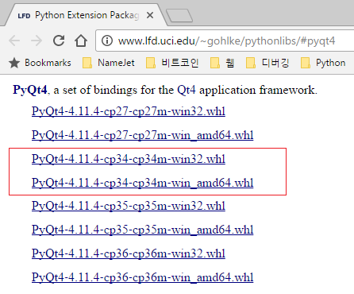
   (주: 예전에는 [Riverbank의 PyQt 다운로드 사이트](https://www.riverbankcomputing.com/software/pyqt/download)에서 파이썬 3.4용 PyQt4 를 다운받아 설치하였으나, Riverbank에서 더이상 공식 빌드를 제공하지 않고 소스코드만 제공하고 있다.)
3. Cmd.exe를 실행해서 Python 3.4가 설치된 디렉토리 밑 Scripts 폴더로 이동한 후, pip install {wheel파일} 명령을 실행한다.
   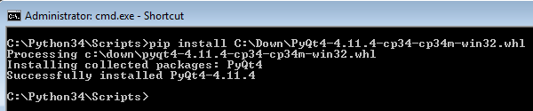
4. (Optional) PyQt 설치 후 PyCharm을 사용할 때, 만약 IntelliSense 가 동작하지 않으면, File - Invalidate Caches and Restart 메뉴를 선택하고 [Invalidate and Restart] 버튼을 선택한다.

##### Mac에서 설치

PyQt4를 Mac에서 설치하는 방법들 중 하나로 MacPorts 를 이용하는 방법이 있는데, 이는 다음과 같다.

1. Xcode가 설치되어 있지 않으면, Xcode를 설치한다

2. MacPorts 패키지가 설치되어 있지 않으면, http://www.macports.org/install.php 에서 MacPorts 패키지를 설치한다

3. Termial 창에서 다음을 실행한다

   ```bash
   $ sudo port install py34-pyqt4
   ```

4. (Optional) PyQt 설치 후 PyCharm을 사용할 때, MacPorts에 의해 새로 설치된 Python 3.4를 사용하도록 Preferences에서 새 Python Intepreter를 설정한다. (MacPorts로 설치된 Python Intepreter가 목록에 없으면 추가해야 함)
   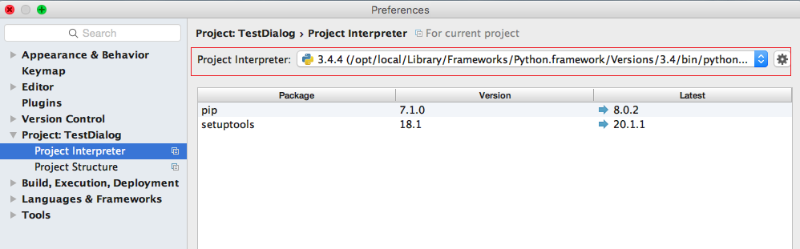

5. (Optional) PyQt 설치 후 PyCharm을 사용할 때, 만약 IntelliSense 가 동작하지 않으면, File - Invalidate Caches and Restart 메뉴를 선택하고 [Invalidate and Restart] 버튼을 선택한다.


#### 2. PyQt4 도움말

PyQt4에 대한 도움말은 [PyQt 도움말 링크](http://pyqt.sourceforge.net/Docs/PyQt4) 에 자세히 설명되어 있으며, 특히 PyQt의 각 클래스별 도움말은 [PyQt 클래스 도움말](http://pyqt.sourceforge.net/Docs/PyQt4/classes.html) 에서 찾아볼 수 있다. PyQt 클래스들은 모두 기본적으로 Q로 시작한다. 각 클래스 도움말은 해당 클래스의 메서드, 변수, 이벤트(Signal) 등을 설명하고 있다.


### 간단한 GUI 프로그램

#### 1. 간단한 GUI 프로그램

PyQt 설치되었으면, 간단한 GUI 프로그램을 만들어 보자. 우선 PyQt를 사용하여 GUI 프로그램을 만들기 위해서는, PyQt4.QtGui 모듈을 Import 하여야 한다. 즉, QtGui의 모든 함수, 클래스 들을 사용하기 위하여 아래와 같이 "from PyQt4.QtGui import *"을 사용한다.

```python
from PyQt4.QtGui import *
 
app = QApplication([])
dialog = QDialog()
dialog.show()
app.exec_()
```

PyQt의 QApplication 클래스는 GUI Application을 관리하는 클래스로서 QApplication 객체의 exec_() 메서드를 호출하면 메인 메시지 루프를 만들며 GUI 이벤트를 핸들링하게 된다. 한편, QDialog 클래스는 다이얼로그 클래스를 가리키는 것으로 여기서는 그냥 빈 다이얼로그를 표시(show)하게 한다. 위 예제를 실행하면, 아래와 같이 python이라는 타이틀(디폴트임)을 갖는 빈 다이얼로그 하나가 화면에 나타난다.

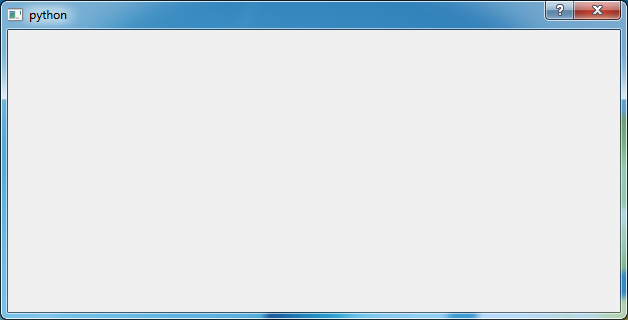


### PyQt 위젯

#### 1. 위젯 (Widget)

GUI 프로그램에서 사용하는 버튼, 레이블, 텍스트박스, 다이얼로그, 메인윈도우 등의 모든 UI 요소들을 가리켜 위젯(Widget)이라 부른다. 위젯의 가장 상위에 있는 클래스인 QWidget은 모든 UI 오브젝트 혹은 컨트롤들의 Base 클래스이다.

PyQt에서 제공되는 버튼(QPushButton), 레이블(QLabel), 텍스트박스(QLineEdit), 콤보박스(QComboBox), 다이얼로그(QDialog), 메인윈도우(QMainWindow) 등의 UI 요소들은 모두 QWidget으로부터 파생된 파생클래스(Derived Class)들이다.

#### 2. 위젯 사용하기

GUI 프로그램에서 다이얼로그, 버튼, 레이블, 텍스트박스 등의 위젯을 사용하여 간단한 다이얼로그 프로그램을 만들어 보자. 우선 *사용자 정의 다이얼로그*를 만들기 위해서는 PyQt의 QDialog 다이얼로그 클래스로부터 파생된 서브클래스를 만들어야 한다. 아래 예제에선 MyDialog라는 사용자 정의 다이얼로그를 만들었다. 이렇게 정의된 사용자 정의 다이얼로그로부터 객체를 생성한 후 (예제 마지막 부분의 dialog = MyDialog()와 같이), 다이얼로그의 show() 메서드로 화면에 보여주게 된다.

다이얼로그에 위젯들을 놓기 위해서는 MyDialog 클래스의 생성자에서 필요한 위젯들을 추가하게 된다. 생성자의 첫 라인은 일반적으로 Base 클래스의 생성자를 호출하는 코드를 넣는다. 여기서는 QDialog의 생성자 QDialog.__init__()을 호출하고 있다.


### PyQt 이벤트 핸들링

#### 1. 이벤트 핸들링

GUI 프로그램에서 버튼이 클릭되거나 콤보박스에서 아이템이 선택되거나 하는 것 같이 어떤 일이 발생하는 것을 이벤트(event)라 부른다. 이러한 이벤트들이 발생하면 특정 코드를 실행하도록 하는데, 이러한 이벤트 처리 코드(함수)를 이벤트핸들러(event handler)라 부른다. 참고로 Qt 에서는 이를 약간 다르게 표현하는데, 이벤트(event)를 Signal이라 칭하고, 이벤트핸들러를 Slot이라 부른다.

#### 2. 이벤트핸들러 추가하기

앞의 [위젯] 아티클에서 만든 예제에서 OK 버튼이 클릭되었을 때 버튼 클릭 이벤트가 핸들링 되는 코드를 추가해 보자. 이벤트 핸들링을 정의하는 것은 문법적으로 특정한 이벤트를 이벤트핸들러 함수와 연결시키면 된다. 즉, 버튼의 경우 QPushButton 버튼 클래스에 있는 clicked 라는 이벤트를 특정한 함수와 연결(connect) 시키는 것이다. 이는 아래 예제와 같이 "UI객체.이벤트명.connect(핸들러함수명)"을 사용하여 구현할 수 있는데, 버튼 클릭 clicked 이벤트가 발생하면 self.btnOkClicked 함수가 실행되는 것이다.

여기서 한가지 주목할 점은 생성자가 아닌 다른 메서드에서 위젯을 사용하기 위해서는 해당 위젯을 "self.위젯객체" 와 같이 self 를 붙여 인스턴스 변수로 만들어 주어야 한다는 것이다. 아래 예제에서 editName은 btnOkClicked()라는 다른 메서드에서 사용되므로 생성자에서 self.editName 으로 하였다. lblName 이나 btnOk는 생성자 이외의 메서드에서 사용되지 않으므로 인스턴스 변수로 만들지 않았고 로컬 변수로 사용하였다.

``` python
class MyDialog(QDialog):
    def __init__(self):
        QDialog.__init__(self)
 
        lblName = QLabel("Name")
        self.editName = QLineEdit()
        btnOk = QPushButton("OK")
 
        layout = QVBoxLayout()
        layout.addWidget(lblName)
        layout.addWidget(self.editName)
        layout.addWidget(btnOk)
        self.setLayout(layout)
 
        btnOk.clicked.connect(self.btnOkClicked)
 
    def btnOkClicked(self):
        name = self.editName.text()
        QMessageBox.information(self, "Info", name)
```

위의 btnOkClicked() 메서드를 보면, editName 텍스트박스로부터 입력된 텍스트를 읽어서 이를 메시지박스로 보여주고 있다. 텍스트는 editName.text() 메서드를 사용하여 읽어오고, QMessageBox 클래스의 information() 메서드를 사용하여 메시지를 뿌려주게 된다. QMessageBox.information() 메서드의 첫번째 파라미터는 부모위젯을 표시하는 것으로 보통 self를 쓰면 되고, 두번째 파라미터는 메시지 박스의 타이틀을, 세번째 파라미터는 실제 메시지를 넣어 준다.


### PyQt 자주 사용되는 위젯

#### 1. 자주 사용되는 위젯

GUI 프로그램에서 자주 사용되는 위젯들을 몇가지 살펴보자. 위젯은 클래스로 되어 있으며, 위젯 클래스마다 서로 다른 메서드와 이벤트들을 제공한다.

#### 2. QLineEdit 위젯

QLineEdit 은 한 라인을 편집할 수 텍스트박스 위젯이며, 복수 라인을 편집하기 위해서는 QTextEdit을 사용한다. 몇가지 자주 사용되는 메서드로는 텍스트를 쓰는 setText(), 현재 텍스트를 읽는 text() 메서드, Watermark 텍스트를 표시하는 setPlaceholderText(), 에디트 내의 텍스트를 모두 선택하는 selectAll(), 읽기 전용 에디트로 만드는 setReadOnly(), 주로 암호 스타일의 에디트에 많이 사용되는 setEchoMode() 등을 들 수 있다.

``` python
ed = QLineEdit()
 
ed.setText("홍길동")  #텍스트 쓰기
text = ed.text()    #텍스트 읽기
 
# Watermark로 텍스트 표시
ed.setPlaceholderText("이름을 입력하시오") 
 
# 텍스트 모두 선택
ed.selectAll()
 
# 에디트는 읽기 전용으로
ed.setReadOnly(True)
 
# Password 스타일 에디트
e.setEchoMode(QLineEdit.Password)
```


#### 2. QLabel 위젯

QLabel은 텍스트나 이미지, 혹은 동영상을 표시하는데 사용된다. QLabel에서 자주 사용되는 메서드로는 레이블에 텍스트를 쓰는 setText(), 현재 레이블을 읽는 text() 메서드가 있는데, 특히 setText()에서는 Plain 텍스트 뿐만 아니라 HTML을 사용할 수 있다. 예를 들어, 굵은 문자체로 만들기 위해 아래 처럼 HTML <b> 태그를 사용할 수 있다.

``` python
label = QLabel()
 
# 레이블에 텍스트 쓰기
label.setText("Normal") 
label.setText("<b>Bold</b>") 
 
# 레이블에 텍스트 쓰기
s = label.text()
```


#### 3. QCheckBox 위젯

QCheckBox은 체크박스를 위한 위젯으로 자주 사용되는 메서드로는 체크박스를 체크하거나 체크를 지우는 setChecked(), 현재 체크되어 있는지를 검사하는 isChecked() 등이 있으며, 체크 상태가 변함에 따라 적절한 핸들링 코드를 넣을 수 있는 stateChanged 이벤트가 있다.

``` python
chk = QCheckBox()
 
# 체크하기
chk.setChecked(True) 
 
# 체크지우기
chk.setChecked(False) 
 
# 체크 상태 검사
checked = chk.isChecked()
 
# stateChanged 이벤트
chk.stateChanged.connect(self.checkChanged)
```


#### 4. QComboBox 위젯

QComboBox는 콤보박스를 위한 위젯으로 자주 사용되는 메서드로는 콤보박스에 하나의 아이템을 넣는 addItem(), 복수 컬렉션을 한꺼번에 아이템으로 넣는 addItems(), 현재 선택된 아이템의 인덱스를 리턴하는 currentIndex(), 현재 선택된 아이템의 텍스트를 리턴하는 currentText() 등이 있으며, 자주 사용되는 이벤트로는 아이템 선택이 변경되면 발생하는 currentIndexChanged 이벤트가 있다.

``` python
cbo = QComboBox()
 
# 콤보박스에 아이템 하나씩 넣기
cbo.addItem("Apple")
cbo.addItem("Banana")
cbo.addItem("Grape")
 
# 콤보박스에 아이템 리스트 넣기
cbo.addItems(['Apple','Banana','Grape'])
 
# currentIndexChanged 이벤트 핸들러
self.cbo.currentIndexChanged.connect(self.selectionChanged)
 
def selectionChanged(self):
    txt = self.cbo.currentText()
    idx = self.cbo.currentIndex()
    # 생략...
```


### PyQt 메인 윈도우

#### 메인 윈도우

PyQt에서 메인윈도우는 QMainWindow 클래스로 표현되는데, 메인 메뉴 및 툴바, 그리고 하단에 상태바 등을 갖는 윈도우이다. 단순히 GUI 프로그램은 다이얼로그를 사용할 수 있겠지만, 많은 복잡한 GUI 프로그램은 종종 메인윈도우를 사용한다.

메인 윈도우를 사용하기 위해서는 QMainWindow 클래스로부터 파생된 서브클래스를 만들며, 그 생성자에 위젯 컨트롤들을 배치하게 된다. 아래 예제에서 MyWindow 는 QMainWindow로부터 파생된 사용자 정의 메인 윈도우 클래스이며, 그 생성자에 버튼 2개를 추가하고 있다.

``` python
import sys
from PyQt4.QtGui import *
from PyQt4.QtCore import *
 
 
class MyWindow(QMainWindow):
    def __init__(self):
        QMainWindow.__init__(self)
 
        # 윈도우 특성 설정
        self.setWindowTitle('내 윈도우')  # 윈도우 타이클 지정
        self.setGeometry(600, 600, 400, 400)  # 윈도우 위치/크기 설정
        self.setWindowIcon(QIcon('umbrella.png'))  # 아이콘 지정
        self.statusBar().showMessage('준비')
 
        # 버튼1 추가
        btn1 = QPushButton('메시지 버튼', self)
        btn1.setToolTip('이 버튼을 누르면 <b>메시지 박스</b>가 나옴')
        btn1.resize(btn1.sizeHint())
        btn1.move(50, 50)
        btn1.clicked.connect(self.btnClicked)
 
        # 종료 버튼 추가
        btnQuit = QPushButton('종료', self)
        btnQuit.move(50, 100)
        btnQuit.clicked.connect(QCoreApplication.instance().quit)
 
        # 윈도우 화면에 표시
        self.show()
 
    def btnClicked(self):
        QMessageBox.information(self, "버튼", "버튼 클릭!")
 
 
def main():
    app = QApplication(sys.argv)
    ex = MyWindow()
    sys.exit(app.exec_())
 
 
if __name__ == '__main__':
    main()
```

MyWindow 생성자의 첫 부분은 윈도우 혹은 폼의 속성을 설정하는 코드들이다. setWindowTitle() 메서드는 윈도우 타이틀을 지정하는 것이고, setGeometry() 메서드는 윈도우의 위치 및 크기를 지정하는 것이다. setWindowIcon()는 윈도우 좌측 상단에 폼 아이콘을 설정하는 것이며, statusBar()는 윈도우 하단의 상태바를 참조할 때 사용한다.

위 예제에서 윈도우 특성 설정 후에 두 개의 버튼을 추가하고 있는데, 첫째는 "메시지 버튼" 이라고 쓰인 버튼(btn1)으로 btnClicked() 라는 이벤트핸들러와 연결되어 있다. 두번째 버튼(btnQuit)은 종료 버튼으로 이 버튼은 PyQt에서 제공하는 quit 메서드를 호출하여 프로그램을 종료하게 한다.


### PyQt Designer

#### 1. QtDesigner 소개

지금까지 GUI 프로그램의 기본 개념들을 이해하기 위해 파이썬 코드를 사용하여 UI 요소들을 생성하고 사용하였다. 하지만, 복잡한 UI 인 경우 혹은 UI 작업이 많은 경우, 일일이 UI 요소를 코드에서 생성하는 것은 효율적이지 않다. 이러한 단점을 극복하기 위해 PyQt 안에는 QtDesigner라는 Qt UI Designer 도구가 포함되어 있다. QtDesigner는 UI 위젯들을 드래그-앤-드랍으로 배치할 수 있으며, 각 위젯들의 속성을 쉽게 설정할 수 있다. 이러한 UI 디자인 작업은 .ui 파일(XML 포맷 파일)로 일단 저장되고, PyQt의 Converter를 사용하여 .py 파일로 변환할 수 있다.

#### 2. QtDesigner 실행

QtDesigner 실행파일은 PyQt가 설치된 디렉토리에 있는데, 예를 들어 윈도우즈의 경우 C:\Python34\Lib\site-packages\PyQt4\designer.exe 와 같은 경로를 갖는다 (파이썬이 C:\Python34에 설치된 경우). QtDesigner가 실행되면 아래와 같이 새로운 폼을 만들도록 화면이 나오는데, 여기서 메인윈도우 폼 혹은 다이얼로그 폼 등을 선택할 수 있다.

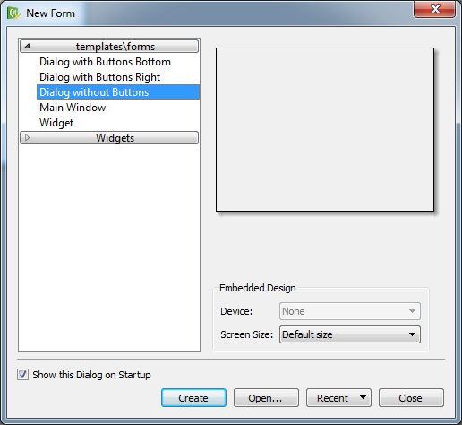

#### 3. QtDesigner UI 작업

QtDesigner는 크게 세 영역으로 나누어져 있는데, 왼쪽에 여러 위젯들을 모아 놓은 도구상자인 Widget Box가 있고, 중앙에는 WYSIWYG으로 폼(Form)을 조작하는 화면이 있으며, 오른쪽에는 (1)폼 상에 있는 객체들을 트리 구조로 표시한 Object Inspector (2) 각 위젯의 속성들을 설정하는 Property Editor (3) 이벤트(Signal)와 관련 핸들러(Slot)를 표시한 Signal/Slot Editor (그리고 기타 QAction을 편집할 수 있는 Action Editor, 리소스를 관리할 수 있는 Resource Browser)가 있다.

QtDesigner에서의 UI 작업은 Widget Box에서 필요한 위젯 컨트롤을 끌어다 중앙의 폼에 옮겨 놓으면서 하게 된다. 위젯들은 드래그-앤-드랍한 위치에 놓이게 되는데, 필요하면 상단 툴바에 있는 레이아웃 버튼을 눌러 해당 레이아웃에 맞게 자동 조절되게 할 수도 있다. 그리고 꼭 필요한 것은 아니지만, 일반적으로 각 위젯에 대해 필요한 속성을 Property Editor에서 새로 지정해 주게 된다. 특히, 위젯의 objectName 속성은 향후 파이쎤 코드에서 사용될 수 있으므로 의미있는 이름으로 지정해 주는 것이 좋다. 아래는 간단하게 QLabel, QLineEdit, QPushButton 컨트롤을 드래그-앤-드랍하여 만들어 본 화면이다. 참고로 QtDesigner에서 Form - Preview 메뉴를 선택하면 실행시의 폼 화면을 미리 볼 수 있다.

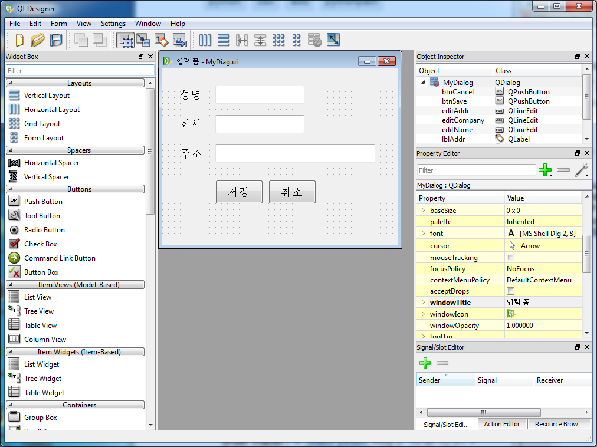

#### 4. UI 파이썬 파일 생성

QtDesigner으로 UI 작업이 모두 끝났으면, File - Save 를 눌러 저장한다. 이때 결과물은 .ui 파일로 저장되는데, 이 .ui 파일은 UI 작업 내용을 XML 형태로 저장한 것이다. 이렇게 저장된 .ui 파일은 다음과 같이 pyuic4 라는 명령을 통해 파이썬 .py 파일로 변환한다. pyuic4은 QtDesigner가 있는 디렉토리와 같은 디렉토리에 있다.

```bash
C> pyuic4 ".ui파일명" -o ".py파일명"
```


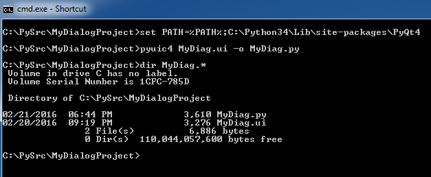

#### 5. UI 파이썬 파일 사용

위와 같이 생성된 .py 파일은 UI 폼 (메인윈도우 혹은 다이얼로그) 에 대한 클래스를 담고 있으며, 그 클래스 안에 각 위젯에 대한 인스턴스 변수들을 제공하고 있다. 따라서, 기본적으로 파이썬 프로그램에서 이 UI 폼 클래스의 객체를 생성해서 폼을 화면에 표시하면 된다. 또한, 해당 UI 폼 안에 있는 각 위젯들을 엑세스하여 값을 읽고 쓸 수 있으며, 필요하면 각 위젯에 대해 이벤트핸들러를 추가해 주면 된다.

아래 예제는 QtDesigner로 생성한 UI 다이얼로그를 사용하여 이를 화면에 보여주는 코드이다. 먼저 QtDesigner로부터 생성된 파이썬 UI 파일이 MyDiag.py라고 가정하고, 이 모듈이 아래 코드가 있는 폴더에 복사되어 있다고 가정하자.

``` python
from PyQt4.QtGui import *
import sys
 
# MyDiag.py 모듈 import
import MyDiag
 
# MyDiag 모듈 안의 Ui_MyDialog 클래스로부터 파생
class XDialog(QDialog, MyDiag.Ui_MyDialog):
    def __init__(self):
        QDialog.__init__(self)
        # setupUi() 메서드는 화면에 다이얼로그 보여줌
        self.setupUi(self)
 
app = QApplication(sys.argv)
dlg = XDialog()
dlg.show()
app.exec_()
```

위 예제는 먼저 MyDiag.py 파일을 import해서 로딩한 후, MyDiag.py 모듈 안에 있는 Ui_MyDialog 라는 다이얼로그 클래스를 사용하고 있다. 여기서 Ui_MyDialog는 QtDesigner에서 다이얼로그에 임의로 지정한 objectName으로부터 생성된 이름이다. 파생클래스 XDialog는 두개의 Base 클래스를 갖는데, 하나는 PyQt의 QDialog 클래스이고, 다른 하나는 UI로부터 생성한 MyDiag.Ui_MyDialog 클래스이다. (주: 파이썬은 Multiple Inheritance가 가능하다)
XDialog 클래스의 생성자에서 MyDialog를 화면에 표시하기 위해 Ui_MyDialog 클래스 안에 있는 setupUi() 메서드를 호출하였다.

#### 6. UI 핸들링을 파이썬 코드

UI 폼을 실제 핸들링하는 일은 파이썬 코드로 작성해 준다. 즉, UI 요소들의 값을 읽거나 변경하는 일, 혹은 버튼 컨트롤에 대해 이벤트 핸들러를 추가하는 일 등은 파이썬 코드에서 추가해 준다. 아래 예제를 보면, [저장] 버튼이 클릭되었을 때 saveData() 라는 메서드를 실행하고, [취소] 버튼이 클릭되었을 때 clearData() 라는 메서드를 실행하게 된다.

``` python
from PyQt4.QtGui import *
import MyDiag
import sys
 
class XDialog(QDialog, MyDiag.Ui_MyDialog):
    def __init__(self):
        QDialog.__init__(self)
        self.setupUi(self)
 
        # 버튼 이벤트 핸들러
        self.btnSave.clicked.connect(self.saveData)
        self.btnCancel.clicked.connect(self.clearData)
 
    # 저장 버튼 클릭시
    def saveData(self):
        with open("data.csv", "a", encoding="utf-8") as f:
            s = "%s,%s,%s\n" % (self.editName.text(),
                                self.editCompany.text(),
                                self.editAddr.text())
            f.write(s)
        QMessageBox.information(self, "저장", "성공적으로 저장")
 
    # 취소 버튼 클릭시
    def clearData(self):
        self.editName.clear()
        self.editCompany.clear()
        self.editAddr.clear()
 
app = QApplication(sys.argv)
dlg = XDialog()
dlg.show()
app.exec_()
```

저장 버튼 이벤트 핸들러 saveData()에서는 self.editName.text() 와 같이 각 텍스트 위젯으로부터 입력 텍스트를 읽어 데이타 파일에 저장하고 메시지박스를 띄워 표시해 주고 있다. 여기서 데이타 파일은 UTF-8 인코딩을 사용하도록 정의하여 한글OS가 아닌 곳에서도 한글이 깨지지 않게 하였다.
또한 취소 버튼이 클릭되면, clearData() 메서드에서 모든 텍스트 위젯들의 값을 지우도록 코딩하였다.


### PyQt 메인 윈도우

#### 1. QtDesigner 메인윈도우

이번 아티클에서는 QtDesigner를 이용하여 메인윈도우 폼을 만들어 보자. QtDesigner를 실행한 후, Main Window 폼을 선택하여 메인윈도우를 생성하고, 아래 화면과 같이 메뉴, 툴바, 위젯들을 배치한다.

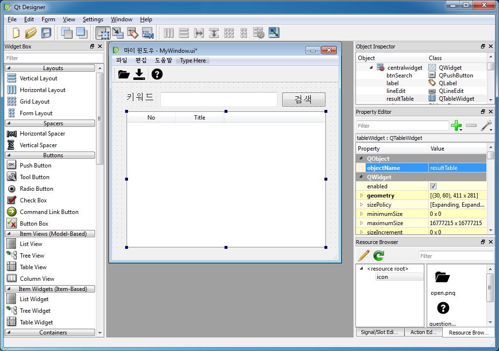

##### 메뉴

메뉴(QMenu)는 "Type Here"를 더블 클릭하고 메뉴 텍스트를 입력하고 Enter를 치면 된다. 상위 메뉴가 입력되면 서브메뉴를 넣을 수 있는 "Type Here"가 표시되며, 필요한 경우 "Add Separator"를 클릭하여 메뉴 분리선을 추가할 수 있다. 이 예제에서는 화면에 보이진 않지만 [파일] 메뉴 밑에 [열기]와 [저장] 서브메뉴를 생성하였다.

##### 툴바

툴바는 메뉴 바로 밑에 위치하는데, 보통 메뉴들 중 중요한 기능들을 툴바에 이미지 버튼으로 표시한다. 툴바를 생성하기 위해서는 폼에서 Rightclick한 후, Add Tool Bar를 선택한다. 툴바가 생성된 후에는 오른쪽 하단의 Action Editor 탭을 선택하고 메뉴에서 이미 생성한 [열기]와 [저장] 아이템을 드래그-앤-드랍으로 툴바에 끌어 놓으면 된다. 이어 툴바 버튼에 이미지를 넣기 위해서 먼저 Qt 리소스를 생성하여 이미지를 리소스에 넣어야 한다.

##### 리소스 생성

QtDesigner에서 이미지 등을 관리하기 위해 리소스 파일을 사용한다. 리소스 파일은 .qrc 확장자를 갖는 파일인데, 리소트 파일 안에는 리소스에 대한 XML 데이타를 가지고 있다. 먼저 리소스 파일을 생성하기 위해, 오른쪽 하단의 Resource Browser 탭을 선택한 후, 아래 그림과 같이 연필 모양의 [Edit Resources] 툴바를 선택한다.

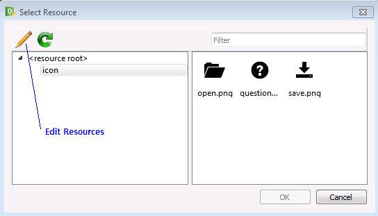

이어 [Edit Resources] 다이얼로그의 좌측 하단에 있는 [New Resource File] 아이콘을 선택하고, 적절한 리소스 파일명(예: myres.qrc)을 적는다. 이어 화면 중앙 하단의 [Add Prefix] 아이콘을 눌러 적당한 Prefix명 (예: icon)을 적고, 다음 [Add Files] 버튼을 눌러 아이콘이나 이미지 파일을 import 하면 된다. 이렇게 이미지 리소스들을 추가한 후 OK를 눌러 [Select Resource] 다이얼로그로 돌아간다. 위의 [Select Resource] 화면은 이러한 방식으로 3개의 아이콘들(open.png ~ save.png)을 추가한 후의 화면이다.

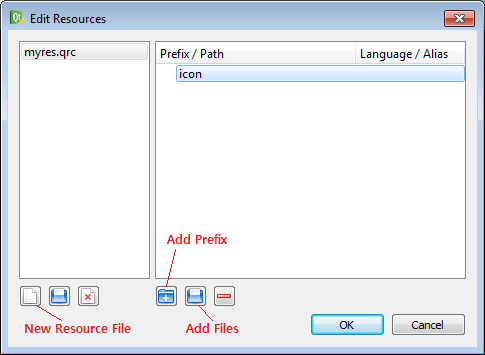

이렇게 리소스 파일로 import 된 이미지들은 이미지를 표시할 수 있는 여러 위젯들에 사용될 수 있다. 툴바에서 이미지를 넣기 위해서는 [Action Editor]에서 해당 Action을 선택한 후, [Property Editor]에서 Icon 속성을 클릭하고 아래 그림과 같이 [Choose Resource...]을 선택하고 리소스 이미지를 지정하면 된다.

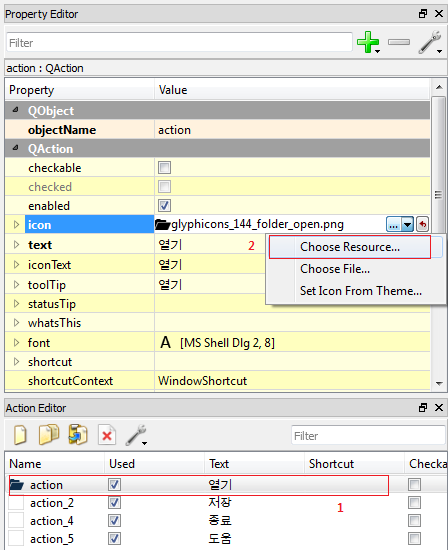

##### 기타 위젯들

위 첫번째 그림에 있는 "마이 윈도우" 화면을 완성하기 위해 몇가지 위젯들을 추가해야 한다. 즉, "키워드"라는 텍스트를 가진 QLabel, 입력 텍스트 박스인 QLineEdit (objectName: txtKeyword), "검색" 버튼인 QPushButton (btnSearch), 그리고 중앙에 결과를 표시하는 QTableWidget (resultTable) 등을 위 그림과 같이 배치한다. QTableWidget에서 컬럼을 추가하기 위해서는 QTableWidget을 선택한 후 Rightclick하여 [Edit Items] 메뉴를 선택하고 No와 Title 이라는 컬럼 두 개를 정의하면 된다.

#### 2. 리소스 파이썬 파일 생성

QtDesigner에서 UI가 대충 완성되었으면, 이를 MyWindow.ui라는 파일로 저장하고, 앞 아티클에서 설명한 대로 pyuic4 명령을 사용하여 .py 파이썬 파일을 생성한다. 그런데, 이번 UI는 리소스 파일(.qrc 파일)도 사용하고 있으므로, 이 리소스 파일도 pyrcc4 명령을 사용하여 .py 파이썬 파일으로 생성해 주어야 한다. 파이썬 파일 생성을 위한 pyrcc4 명령은 아래와 같은데, 여기서는 Python 3 를 사용하므로 -py3 옵션을 반드시 지정해 주어야 한다.

```bash
C> pyrcc4 "리소스명.qrc" -o "리소스명_rc.py" -py3
```

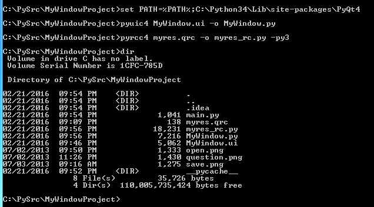

여기서 한가지 중요한 사항은 리소스 파일 myres.qrc 에 대해 파이썬 출력 파일명을 myres_rc.py 와 같이 리소스명(myres) 뒤에 "_rc" 를 붙여야 한다는 것이다. 만약 다른 이름을 사용하면 프로그램 실행시 에러가 발생한다.

#### 3. 메인윈도우를 위한 파이썬 코드

이제 UI와 리소스를 각각 파이썬 파일로 변경하였으므로, 파이썬 코드에서 UI 윈도우를 화면에 표시하고 핸들링하는 것을 살펴보자. 앞 아티클의 다이얼로그와 마찬가지로, MyWindow UI 모듈을 import하여 MyWindow.Ui_MainWindow 클래스를 베이스로한 사용자 정의 메인윈도우 클래스 XWindow를 아래와 같이 정의하였다. 그리고 XWindow의 생성자에서 setupUi() 메서드를 호출하여 UI 초기화를 실행한다. setupUi()으로 UI 초기화를 마친 후, self.show() 호출하면 메인윈도우 화면을 볼 수 있다.

``` python
from PyQt4.QtGui import *
import MyWindow
import sys
import pickle
 
class XWindow(QMainWindow, MyWindow.Ui_MainWindow):
    def __init__(self):
        QMainWindow.__init__(self)
        self.setupUi(self)
 
        # 초기 샘플데이타
        self.initData()
 
        # 검색 버튼 이벤트 핸들링
        self.btnSearch.clicked.connect(self.search)
 
        # 메뉴, 툴바 클릭 이벤트 핸들링
        self.actionSave.triggered.connect(self.saveData)
        self.actionOpen.triggered.connect(self.openData)
         
        # 메인윈도우 보이기
        self.show()
 
    def search(self):
        keyword = self.txtKeyword.text()
        resultData = self.sampleData[keyword]
        self.resultTable.setRowCount(len(resultData))
        row = 0
        for item in resultData:
            self.resultTable.setItem(row, 0, QTableWidgetItem(keyword))
            self.resultTable.setItem(row, 1, QTableWidgetItem(item))
            row += 1
 
    def initData(self):
        self.sampleData = {
            'Python': ['Fluent Python', 'Python Programming', 'Learning Python'],
            'go' : 'The Go Programming Language',
            'C#' : ['Inside C#', 'C# In Depth'],
            'C' : 'The C Programming Language'
        }
 
    def saveData(self):
        with open("test.data","wb") as f:
            pickle.dump(self.sampleData, f)
        QMessageBox.information(self, "저장", "데이타 저장됨")
     
    def openData(self):
        with open("test.data","rb") as f:
            self.sampleData = pickle.load(f)
        QMessageBox.information(self, "오픈", "데이타 로딩됨")
 
app = QApplication(sys.argv)
xwin = XWindow()
app.exec_()

```

여기서 검색 기능을 추가해 보기 위해, initData() 메서드에 임의의 간단한 Map 데이타를 만들었다 (실제로는 DB나 외부 저장소에서 데이타를 가져올 것임) . 그리고 [검색] 버튼 (btnSearch)의 클릭 이벤트를 search() 메서드에 연결 시켰으며, 이 메서드 안에서 입력 검색어 (txtKeyword.text())에 따라 Map 을 검색해서 결과를 QTableWidget (resultData)에 표시해 주고 있다.

추가적으로 메뉴 및 툴바에 연결된 QAction들 (actionSave, actionOpen)에 대한 이벤트 핸들러 예를 보이기 위하여, 이들의 triggered 이벤트에 각각 saveData(), openData() 핸들러를 연결하였다. QAction의 triggered 이벤트는 메뉴가 클릭되었거나 툴바가 클릭되었을 때, 혹은 해당 단축키 눌려 졌을 때 발생하는 이벤트이다. 여기서는 전체 맥락에 잘 맞진 않지만 테스트 예제로서 Map 데이타를 저장하고 불러오는 코드를 saveData(), openData() 메서드에 넣었다. 특히 이들 메서드에서 파이썬의 pickle 모듈을 사용하였는데, pickle.dump()는 파이썬 객체를 바이트들로 변환하여 파일 스트림과 같은 스트림에 저장하는 것이고 (Serialization이라고 함), pickle.load()은 반대로 스트림에서 바이트 데이타를 읽어 파이썬 객체로 복원(Deserialization이라고 함)하는 것이다.

아래는 프로그램이 실행되었을 때의 화면이다.

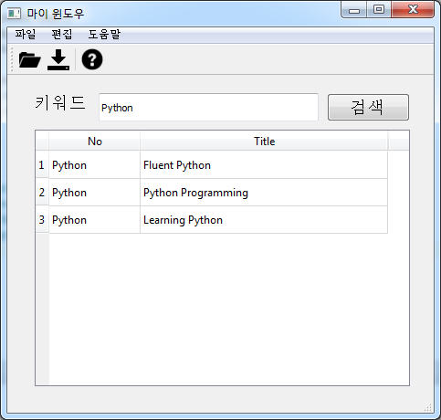


### PyQt Layout 사용 하기

GUI프로그래밍을 도와주는 PyQt에서 창크기에 따라 내부 요소들의 크기들이 자동으로 변경될 수 있도록 하는 방법을 알아보겠습니다.

PyQt의 Qt designer를 이용해서 다음과 같은 형태의 프로그램 UI를 디자인했습니다.


키워드를 맨위에 있는 박스에 입력하고 검색버튼을 누르면 아래에 결과가 나타나는 그런 동작을 수행할 UI되겠습니다.

위젯 구성은 다음과 같습니다.


메인 윈도우에 Grid Layout을 먼저 깔고 lineEdit, pushButton, tableWidget을 베치하였습니다.

Grid Layout은 내부에 웨젯 배치를 손쉽게 해주기 위해서 그리드형태로 위젯의 위치에 대한 가이드를 잡아주는 역할을 합니다. 그래서 필요한 위젯을 드레그 해서 Grid Layout 위로 가져가면 상하좌우에 하이라이트 표시가 생기면서 어느 부분에 스냅을 시킬것인지 선택할 수 있게 됩니다.


그래서 맨처음 그림에서 보시는 것처럼 위젯들을 가로 3줄, 세로 3줄 형태로 배치를 하였습니다.

이렇게 구성된 Grid Layout은 크기가 변경되면 그 내부에 포함되어 있는 위젯들도 다같이 동일한 비율을 유지하며 Grid Layout의 크기에 맞추어 변경이 됩니다.


그렇지만 이렇게 해서는 Grid Layout이 창과는 연동되지 않아서 창크기가 변경되어도 내부 요소들의 크기는 따라 변경되지를 않습니다.


보시는 것처럼 창의 크기가 줄어들었지만 내부의 위젯의 크기는 그대로 유지되고 있습니다.

모든 위젯의 크기가 창크기에 의존적으로 조절될 수 있도록 하려면 여기서 한가지만 더 해주면 됩니다.


Qt designer편집화면에서, 생성한 메인 윈도우의 여백부분을 선택한후 마우스 우클릭을 한다음 "Lay out > Lay Out in a Grid"를 선택해줍니다.

그러면 만들어둔 Grid Layout이 창의 크기 꽉 맞도록 자동으로 크기가 변경됩니다. 그리고 메인 윈도우 크기를 조절해보면 내부의 위젯들이 모두 비율을 유지하면서 따라서 크기가 조정되는 걸 확인할 수 있습니다.


PyQt는 정말 간단하네요.

Grid Layout 외에도 수식 수평 방향의 가이드를 잡아주는 Vertical Layout, Horizontal Layout이 있습니다. 필요에 따라서 골라서 사용하면 되겠네요.


### Pyinstaller 패키징 때 PyQt ui 파일 포함시키는 방법(여러개도 됨)

출처: https://kwonkyo.tistory.com/534?category=781723

## 문제점

파이썬으로 GUI 프로그램을 만들 때 PyQt를 애용하고 있습니다. PyQt는 ".ui"라는 확장자를 사용하는 별도의 GUI 리소스 파일이 있어서 파이썬에서 이 UI파일을 읽어오기만 하면 되기 때문에 아주 편리하게 사용할 수 있습니다. 그래서 UI가 약간 수정이 있다 해도 메인 소스를 손댈 필요가 없어서 생산성 측면에서 큰 장점이 있습니다.

그런데 이렇게 별도의 UI 파일이 있는 프로그램은 Pyinstaller로 패키징 할 때 리소스 파일이 누락되어서 패키징이 제대로 되지 않을 때가 있습니다. 


제가 경험해본 바로는 UI 파일을 스크립트에서 불러올 때 상대 경로로 접근하는 경우 Pyinstaller로 패키징 할 때 UI가 누락되는 걸 경험했습니다. 그래서 이런 경우는 UI파일을 참조할 때 절대 경로를 사용하면 해결할 수 있습니다.

PYTHON

닫기

 줄바꿈

```python
import os

Ui_MainWindow, QtBaseClass = uic.loadUiType('C:\myproject\myfolder\GUI.ui')

class MyWindow(QMainWindow):
	def __init__(self):
		super(MyWindow, self).__init__()
		self.ui = Ui_MainWindow()
```

그런데 이렇게 되면, 컴퓨터를 여기저기 옮겨가면서 코딩을 할 때 문제가 됩니다. 사용하는 컴퓨터마다 프로젝트 저장 위치가 다를 수 있기 때문에 테스트하려면 사용 환경에 따라서 매번 3행의 UI 절대 경로를 수정해야 합니다.

그렇다면 UI파일을 불러올 때 파이썬 코드가 실행되는 위치를 확인하고 그걸 절대 경로로 변환한 다음 UI 파일을 불러오면 되겠죠. 그래서 "__file__" 키워드를 사용해서 현재 코드가 실행되는 위치를 확인하고 UI파일 앞에 경로로 붙여줌으로써 절대 경로를 만들어서 사용을 해 봤습니다.

PYTHON

닫기

 줄바꿈

```python
import os

## python실행파일 디렉토리
BASE_DIR = os.path.dirname(os.path.abspath(__file__)) 
Ui_MainWindow, QtBaseClass = uic.loadUiType(BASE_DIR + r'\GUI.ui')

class MyWindow(QMainWindow):
	def __init__(self):
		super(MyWindow, self).__init__()
		self.ui = Ui_MainWindow()
```

그런데 이 방법으로는 UI파일을 제대로 접근할 수가 없었습니다. 처음에는 "__file__"이라는 키워드가 스크립트로 실행될 때와 onefile 패키징 상태에서 실행될 때 반환되는 값이 다르다는 걸 얼마 전 확인했었기 때문에 이와 관련한 문제인 줄 알았고 이걸 잘 이용하면 해결할 수 있을 거라 생각했습니다.

 이전에 공부했던 패키징 여부에 따라서 프로그램 실행 경로가 달라질 수 있음을 생각해서 절대 경로를 만들어주는 함수를 만들어 봤습니다.

``` python
def resource_path(relative_path): 
	if getattr(sys, 'frozen', False):
		# 패키징 상태로 실행될 때
		base_path = os.getcwd()
		return os.path.join(base_path, relative_path)
	else:
		# 스크립트로 실행될 때
		base_path = getattr(sys, '_MEIPASS', os.path.dirname(os.path.abspath(__file__)))
		return os.path.join(base_path, relative_path)
```

그런데 아쉽게도 이 방법도 안되더군요. 스크립트로 실행하는 데는 문제가 없고 패키징 한 상태에서 UI파일의 경로도 잘 나오지만 UI파일이 패키징에 포함되지 않아서 파일을 찾을 수 없다는 에러가 발생했습니다.


> 해결책

결국 구글링으로 해결책을 찾았습니다. 이 방법은 pyinstaller가 패키징을 할 때 UI파일을 수동으로 포함하도록 지정해 주는 방법으로 UI파일이 2개 이상인 경우에도 사용할 수 있는 유용한 방법입니다. 

먼저 파이썬 스크립트는 처음 구상했던 대로 실행 위치를 기준으로 UI파일의 절대 경로를 찾아서 실행할 수 있도록 만들어 줍니다.

``` python
import os

## python실행파일 디렉토리
BASE_DIR = os.path.dirname(os.path.abspath(__file__)) 
Ui_MainWindow, QtBaseClass = uic.loadUiType(BASE_DIR + r'\GUI.ui')

class MyWindow(QMainWindow):
	def __init__(self):
		super(MyWindow, self).__init__()
		self.ui = Ui_MainWindow()
```

이렇게 되면 스크립트 실행 상태에서는 문제없지만 패키징 상태에서는 문제가 되죠. 그래서 이제 패키징에 UI파일을 포함시키기 위해서 아래 과정을 추가로 진행합니다.

``` cmd
pyinstaller.exe -w -F .\MyCode.py
```

일단 스크립트를 pyinstaller로 한번 패키징 합니다. 이때 최종 결과에 반영할 옵션을 걸어서 실행합니다. 저는 커맨드 창을 숨기고(-w) 하나의 파일로(-F) 패키징을 하도록 했습니다. 이렇게 하고 나면 실행파일(.exe)도 만들어지지만 작업 폴더에 보면 ".spec"이라는 확장자의 파일이 만들어져 있습니다. (예: MyCode.spec)

pyinstaller가 작업을 하는데 필요한 각종 설정이 저장된 파일인데요. 이 파일을 열어서 아래 그림처럼 수정해 줍니다. Analysis(datas) 부분이 UI 과련 리소스를 지정하는 부분인데 여기에 UI파일을 명기하면 됩니다. 

. 


그리고 또 하나 유용한 게 만약 UI파일이 여러 개인 경우라면 대괄호 안에 리스크 형태로 포맷을 맞춰서 추가할 파일을 더 써주면 됩니다.


이렇게 수정했으면 이 .spec파일을 이용해서 다시 한번 패키징을 해 줍니다.

``` cmd
pyinstaller.exe .\MyCode.spec
```

이때는 앞서 사용했던 -w -F 옵션이 이미 .spec파일에 반영되어 있기 때문에 다시 지정할 필요는 없습니다.

이렇게 하면 UI파일이 패키징에 포함되어서 하나의 파일만으로도 GUI 프로그램이 잘 실행됩니다. UI파일 2개도 해봤는데 잘 되네요.

#### - 끝 -

