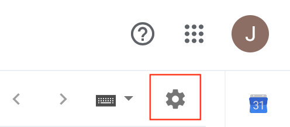
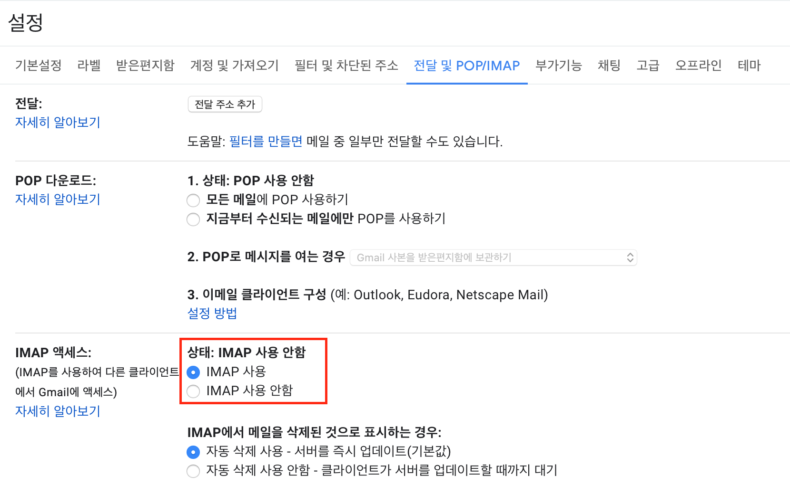
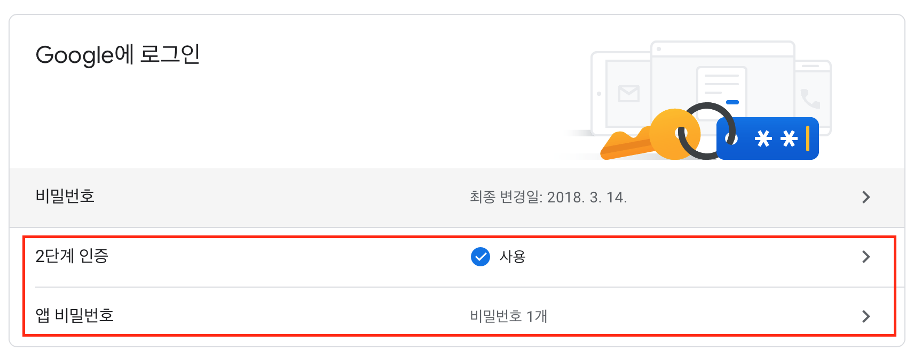

# 파이썬으로 메일보내기 (파일첨부)

출처: https://minimin2.tistory.com/44?category=732988

안녕하세요, 오늘은 파이썬으로 메일 보내는 법을 알아보겠습니다.

 메일은 gmail 기준으로 IMAP, 보안설정부터 하도록 하겠습니다.

 우선 gmail로 로그인 해 줍니다.

그럼 우측 상단에 톱니바퀴모양 아이콘이 있습니다. 클릭해 주시고, 설정에 들어갑니다.





 


설정의 상단 탭 중에 '전달 및 POP/IMAP' 설정으로 들어갑니다.

하단의 그림처럼 IMAP 사용을 체크하고 저장해 줍니다.





 

위의 설정을 마쳤으면 다음 링크에 들어가 보안설정을 해줍니다.

https://myaccount.google.com/security





위 링크에 접속하면 위의 화면이 뜨는데, 2단계 인증을 사용함으로 바꿔줍니다.

앱 비밀번호도 클릭하여 생성해주는데, 이때 생성된 16글자의 비밀번호를 따로 저장해 두시면 됩니다.

(생성된 비밀번호는 구글계정에 완전한 접근이 가능하므로, 공유하지 않길 권장드립니다.)

 

이제 계정의 세팅은 완료되었습니다.

python 코드를 통해서 이메일 보내는 법을 알아보겠습니다.

 

```python
import smtplib
from email.mime.text import MIMEText
from email.mime.multipart import MIMEMultipart
from email.mime.base import MIMEBase
from email import encoders

# 세션생성, 로그인
s = smtplib.SMTP('smtp.gmail.com', 587)
s.starttls()
s.login('위의 세팅된 gmail계정', '위의 16글자 비밀번호')

# 제목, 본문 작성
msg = MIMEMultipart()
msg['Subject'] = '제목'
msg.attach(MIMEText('본문', 'plain'))

# 파일첨부 (파일 미첨부시 생략가능)
attachment = open('파일명', 'rb')
part = MIMEBase('application', 'octet-stream')
part.set_payload((attachment).read())
encoders.encode_base64(part)
part.add_header('Content-Disposition', "attachment; filename= " + filename)
msg.attach(part)

# 메일 전송
s.sendmail("보내는 메일계정", "받는 메일계정", msg.as_string())
s.quit()
```

위 소스에서 '제목', '본문', '파일명', 'gmail계정', '비밀번호', '보내는 메일', '받는 메일'을 각각 사용자에 맞게 수정하고 실행하면 됩니다.

