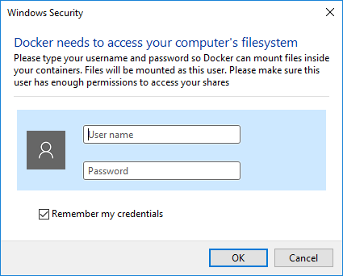

# Docker Postgresql 설치 및 셋팅하기

출처 : https://judo0179.tistory.com/96

리눅스 컨테이너 즉 docker는 프로세스 형태로 자원을 격리하여 사용하기 때문에 컨테이너가 삭제되면 기존에 저장되었던 데이터는 사라진다. 이를 예방하기 위해서 docker volume을 사용하거나 로컬 컴퓨터 파일에 마운트하여 docker 내부에 생성되는 데이터를 저장하는 과정이 필요하다. 이번에는 postgres 데이터베이스를 통해서 실습을 진행하도록 하겠다.

```sh
$ docker run -p 5432:5432 --name postgres -e POSTGRES_PASSWORD=1q2w3e4r -d postgres

Unable to find image 'postgres:latest' locally
latest: Pulling from library/postgres
d121f8d1c412: Already exists
9f045f1653de: Pull complete
fa0c0f0a5534: Pull complete
54e26c2eb3f1: Pull complete
cede939c738e: Pull complete
69f99b2ba105: Pull complete
218ae2bec541: Pull complete
70a48a74e7cf: Pull complete
c0159b3d9418: Pull complete
353f31fdef75: Pull complete
03d73272c393: Pull complete
8f89a54571bf: Pull complete
4885714928b5: Pull complete
3060b8f258ec: Pull complete
Digest: sha256:0171a93d62342d2ab2461069609175674d2a1809a1ad7ce9ba141e2c09db1156
Status: Downloaded newer image for postgres:latest
2093fec3b2acf3ef12a69268a5652625e2344b85a3ed6b9a50c009024caac548
$ docker ps -a 
CONTAINER ID        IMAGE               COMMAND                  CREATED             STATUS                      PORTS                    NAMES
2093fec3b2ac        postgres            "docker-entrypoint.s…"   2 minutes ago       Up 2 minutes                0.0.0.0:5432->5432/tcp   postgres
```

 여기서 처음보는 명령어들이 많이 보이는데, -e 옵션의 경우 docker의 환경변수를 지정하는 것이다. 각각의 환경변수는 이미지에 따라서 다르기 때문에 Docker Hub의 내용을 확인하길 바란다.

 다음 컨테이너에 접속하여 사용자와 데이터베이스를 생성하고 테이블을 만든다.

```shell
$ docker exec -it postgres /bin/bash

root@ac61c662ee4c:/# psql -U postgres
psql (13.0 (Debian 13.0-1.pgdg100+1))
Type "help" for help.

postgres=# CREATE USER seongwon PASSWORD '1q2w3e4r' SUPERUSER;
CREATE ROLE

postgres=# CREATE DATABASE test OWNER seongwon;
CREATE DATABASE

postgres=# \c test seongwon
You are now connected to database "test" as user "seongwon".
test=# CREATE TABLE star (
id integer NOT NULL,
name character varying(255),
class character varying(32),
age integer,
radius integer,
lum integer,
magnt integer,
CONSTRAINT star_pk PRIMARY KEY (id)
);
CREATE TABLE

test=# \dt
        List of relations
 Schema | Name | Type  |  Owner
--------+------+-------+----------
 public | star | table | seongwon
(1 row)
```

 가장 기본적인 데이터베이스 생성과정을 완료하였다. 첫 번째로 컨테이너를 종료하고 다시 시작했을 때, 데이터가 남아있는지 확인해 보도록 하겠다.

```shell
$ docker exec -it postgres /bin/bash

root@ac61c662ee4c:/#  psql -U postgres
psql (13.0 (Debian 13.0-1.pgdg100+1))
Type "help" for help.

postgres=# \du
                                   List of roles
 Role name |                         Attributes                         | Member of
-----------+------------------------------------------------------------+-----------
 postgres  | Superuser, Create role, Create DB, Replication, Bypass RLS | {}
 seongwon  | Superuser                                                  | {}

postgres=# \c test seongwon
You are now connected to database "test" as user "seongwon".

test=# \dt
        List of relations
 Schema | Name | Type  |  Owner
--------+------+-------+----------
 public | star | table | seongwon
(1 row)
```

컨테이너만 종료되고 다시 시작했을 때는 기존에 저장되어 있던 데이터가 잘 살아 있는 것을 확인할 수 있다. 이번에는 컨테이너를 삭제해 보도록 하겠다.

```shell
$ docker stop postgres 
postgres

$ docker rm postgres
postgres

$ docker exec -it postgres /bin/bash
Error: No such container: postgres
```

컨테이너가 삭제되었기 때문에 다시 접속할 수가 없으며, 이때는 다시 컨테이너를 생성해야 하기 때문에 docker run을 다시 실행해야 한다.

```shell
$ docker run -p 5432:5432 --name postgres -e POSTGRES_PASSWORD=1q2w3e4r -d postgres
$ docker exec -it postgres /bin/bash
root@fd7f90041ffa:/# psql -U postgres
psql (13.0 (Debian 13.0-1.pgdg100+1))
Type "help" for help.

postgres=# SELECT * FROM PG_USER;
 usename  | usesysid | usecreatedb | usesuper | userepl | usebypassrls |  passwd  | valuntil | useconfig
----------+----------+-------------+----------+---------+--------------+----------+----------+-----------
 postgres |       10 | t           | t        | t       | t            | ******** |          |
(1 row)

postgres=# \q
```

 지금까지 생성했던 계정 자체가 존재하지 않는다. 즉 해당 컨테이너를 생성하고 데이터를 변경했을 때, 컨테이너만 종료했을 경우 컨테이너 내부에 있는 데이터는 그대로 남아 있지만 컨테이너 자체를 삭제하는 경우 해당 베이스 이미지만 그대로 사용하기 때문에 더이상 데이터가 남아 있지 않으며, 이 경우 우리가 했던 과정을 처음부터 다시 해야한다. 따라서 데이터를 종속시키기 위해서는 컨테이너 볼륨이나 로컬 컴퓨터에 데이터를 저장할 수 있는 공간을 따로 생성하여 외부에 저장할 수 있는 상태로 만들어야 하며, 이를 통해 데이터를 보관할 수 있게할 수 있다. 다음은 볼륭과 마운트를 통해 데이터를 저장하는 방법을 보여준다.

```shell
# 모든 컨테이너를 종료하고 삭제한다. 
$ docker stop $(docker ps -a -q)
$ docker rm $(docker ps -a -q)

$ docker volume create pgdata # 데이터를 저장할 볼륨을 생성한다. 
pgdata

$ docker run -p 5432:5432 --name postgres -e POSTGRES_PASSWORD=1q2w3e4r -d -v pgdata:/var/lib/postgresql/data postgres
```

생성된 볼륨을 -v 옵션을 통해 지정해주었다. 다시 컨테이너에 접속하여 계정을 생성해 보고, 컨테이너 삭제후에 계정 정보가 남아 있는지 확인해 보도록 하겠다.

```shell
docker exec -it postgres /bin/bash
root@608f0aa10061:/# psql -U postgres
psql (13.0 (Debian 13.0-1.pgdg100+1))
Type "help" for help.

postgres=# CREATE USER seongwon PASSWORD '1q2w3e4r' SUPERUSER;
postgres=# \du
                                   List of roles
 Role name |                         Attributes                         | Member of
-----------+------------------------------------------------------------+-----------
 postgres  | Superuser, Create role, Create DB, Replication, Bypass RLS | {}
 seongwon  | Superuser                                                  | {}
$ docker stop postgres
$ docker rm postgres
$ docker run -p 5432:5432 --name postgres -e POSTGRES_PASSWORD=1q2w3e4r -d -v pgdata:/var/lib/postgresql/data postgres
791984a503b91542aaadd48703c6b694e745b3004c3a7c2f00d0eedf91cf27ea

$ docker exec -it postgres /bin/bash

root@791984a503b9:/# psql -U postgres
psql (13.0 (Debian 13.0-1.pgdg100+1))
Type "help" for help.

postgres=# \du
                                   List of roles
 Role name |                         Attributes                         | Member of
-----------+------------------------------------------------------------+-----------
 postgres  | Superuser, Create role, Create DB, Replication, Bypass RLS | {}
 seongwon  | Superuser                                                  | {}

postgres=# \q
```

 컨테이너를 삭제했음에도 불구하고 계정정보가 저장 되어 있는것을 확인할 수 있다. 그렇다면 볼륨 정보는 어디에 저장되어 있을까?

```shell
$  docker volume list
local               pgdata

$ docker volume inspect pgdata
[
    {
        "CreatedAt": "2020-10-09T07:13:50Z",
        "Driver": "local",
        "Labels": {},
        "Mountpoint": "/var/lib/docker/volumes/pgdata/_data",
        "Name": "pgdata",
        "Options": {},
        "Scope": "local"
    }
]
```

각 운영체제 별로 상의할 수 있으나 위의 명령을 통해서 볼륨 리스트와 해당 볼륨의 위치 및 상세 정보를 확인할 수 있다. 다음으로 해당 볼륨을 삭제하고 로컬 컴퓨터에 디렉토리를 생성하여 데이터를 저장하는 방법을 알아보도록 하겠다.

```shell
$ docker volume remove pgdata
Error response from daemon: remove pgdata: volume is in use - [791984a503b91542aaadd48703c6b694e745b3004c3a7c2f00d0eedf91cf27ea] 

# docker 컨테이너가 실행되고 있는 상태에서 볼륨을 삭제하는 경우에는 에러가 발생하기 때문에 컨테이너를 종료하고 볼륨을 삭제한다. 
$ docker stop postgres
postgres

$ docker rm postgres
postgres

$ docker volume remove pgdata
pgdata

# docker에서 모든 볼륨을 삭제하고 싶다면 다음 명령을 입력한다. 
$  docker volume prune
WARNING! This will remove all local volumes not used by at least one container.
Are you sure you want to continue? [y/N] y 
Total reclaimed space: 7.402GB
$ mkdir ~/pgdata

$ docker run -p 5432:5432 --name postgres -e POSTGRES_PASSWORD=1q2w3e4r -d -v ~/pgdata:/var/lib/postgresql/data postgres
06006c5d1160b471eaeb73b429e6a08329f9087a7f32b86aab811fe7e4246a65
```

 상대경로에 pgdata라는 디렉토리를 만들고 -v 옵션을 통해 해당 디렉토리랑 마운트한 것을 볼 수 있다. 해당 디렉터리로 이동하여 postgresql 데이터가 저장되어 있는지 확인한다.

``` shell
##################################################################################
docker run -p 5432:5432 --name postgres -e POSTGRES_PASSWORD=1q2w3e4r -d -v ~/pgdata:/var/lib/postgresql/data:z postgres

## :z 을 추가 하지 않으면 보이지 않는다.
## 이 옵션은 다른데서 찾음 : 
##################################################################################
```


```shell
$ cd pgdata
$ ls -l
total 112
-rw-------   1 seongwon  staff      3 10  9 16:35 PG_VERSION
drwx------   5 seongwon  staff    160 10  9 16:35 base
drwx------  59 seongwon  staff   1888 10  9 16:35 global
drwx------   2 seongwon  staff     64 10  9 16:35 pg_commit_ts
drwx------   2 seongwon  staff     64 10  9 16:35 pg_dynshmem
-rw-------   1 seongwon  staff   4782 10  9 16:35 pg_hba.conf
-rw-------   1 seongwon  staff   1636 10  9 16:35 pg_ident.conf
drwx------   5 seongwon  staff    160 10  9 16:35 pg_logical
drwx------   4 seongwon  staff    128 10  9 16:35 pg_multixac
...
```

실제 로컬 컴퓨터에 postgresql를 사용하기 위한 데이터가 저장되어 있는 것을 확인할 수 있다. 이 상태에서 위와 동일한 방법으로 진행하면 컨테이너 내부에서 변경된 모든 데이터는 해당 디렉토리가 삭제되지 않는 이상 사라지지 않으며, 설정파일을 직접 수정하여 적용할 수도 있다. 이러한 특성을 살려서 CIFS나 NFS를 통한 외부 스토리지에 저장하여 데이터를 저장하는 방식을 채택할 수 있다.

 리눅스의 경우 해당 디렉토리에 퍼미션으로 인해 접속이 되지 않을 수도 있다. 이 경우 root 권한으로 접속해서 볼 수 있으며, 만약 디렉토리를 만들었음에도 불구하고 데이터가 저장되지 않거나 컨테이너가 재대로 실행되지 않은 경우, 소유자 권한 오류로 인해서 docker 컨테이너가 해당 디렉토리에 접근하지 못할 가능성이 크다. 따라서 이런 에러가 발생하는 경우에는 소유자 권한을 변경하면 정상적으로 사용할 수 있다.

```shell
$ sudo chown -R 200:200 some_dir 
```

 또한 컨테이너를 실행할 때, 디렉토리를 마운트 하는 경우에는 대부분 절대경로를 사용하는 것을 추천한다. 이는 해당 상황에 따라서 다르긴 하지만 절대경로로 작성하는 것이 실수를 줄일 수 있는 좋은 방법이 된다.


---

## Windows의 Docker-호스트 디렉토리 마운트

출처: https://rominirani.com/docker-on-windows-mounting-host-directories-d96f3f056a2c

Windows에서 Docker의 기본 릴리스가 잘 작동했습니다. 나에게 중요한 사용 사례 중 하나는 개발 / 디버그 / 테스트주기에 Docker를 사용하는 것입니다. 이를 활성화하고 빠르게 작동하려면 로컬 시스템의 디렉터리를 Windows 호스트 시스템으로 읽을 수있는 디렉터리를 도커 컨테이너에 매핑 할 수 있어야합니다. 이것은 볼륨 마운팅을 통해 수행되며이 게시물은 작동하는지 확인하기위한 단계별 가이드입니다.

이 게시물에서는 Windows 네이티브 애플리케이션 용 Docker 베타에 액세스 할 수 있고 Windows 10 컴퓨터에서이를 실행하고 실행할 수 있다고 가정합니다.

볼륨 매핑을 테스트 할 준비를하려면 Windows 시스템에서 사용 가능한 디렉토리와 전체 프로세스를 검증 할 파일이 있어야합니다. 이것은 내 컴퓨터에서 수행하려는 작업이며 초기 기초 작업을 수행하는 단계는 다음과 같습니다.

- D 드라이브에 data라는 이름의 폴더 (예 : d:\data)를 노출하고 싶습니다.
- 예를 들어 d:\data에 몇 개의 파일을 만들었습니다. file1.txt 및 file2.txt.

위의 폴더와 파일을 만들고 싶지 않더라도 괜찮습니다. 어떤 폴더를 노출하고 컨테이너에서 사용할 수 있는지 알고 있다고 가정합니다.

여기에 단계가 있습니다.

1) 시스템 트레이에 귀여운 도커 고래가 수영해야합니다. 마우스 오른쪽 버튼을 클릭하고 설정을 선택합니다.


2)  표시되는 설정 대화 상자에서 공유 드라이브를 클릭합니다. Windows 시스템에서 사용 가능한 드라이브를 나열 할 수 있어야합니다. 제 경우에는 C 및 D 드라이브가 있으며 **D:\data** 폴더를 컨테이너에 노출하기를 원하기 때문에 **D:** 드라이브를 공유하도록 선택했습니다.


3) **Apply**를 클릭합니다. 자격 증명 대화 상자가 나타나고 현재 Windows 자격 증명을 제공해야합니다. 올바르게 제공했는지 확인하십시오. 또한 관리자가되어야한다고 생각합니다.



4)  Apply라는 항목을 클릭하고 완료되었다고 가정하면 일반적으로 불편합니다. 발생한 일을 추적하고 실제로 확인할 수있는 로그 파일이 있습니까? 네, 있습니다. 설정 대화 상자에서 진단 및 피드백으로 이동하여 추적 로그를 클릭하십시오. 드라이브 공유를 활성화하기 위해 실행되는 일부 명령이 표시되어야합니다. 내 컴퓨터에있는 로그를 첨부하고 있습니다.


5)  이제 괜찮아 보입니다. Powershell 프롬프트 또는 오래된 명령 줄로 이동하여 몇 개의 Docker 컨테이너를 실행하여 볼륨 매핑의 유효성을 검사 할 수 있습니다. 여기서 사용하기 위해 Docker 이미지를 이미 가져 왔다고 가정합니다. 제 경우에는 Alpine Linux 이미지를 로컬에서 사용할 수 있으므로 실행하겠습니다.

6)  컨테이너에 호스트 디렉토리 (d:\data)를 마운트하기 위해 컨테이너를 실행하는 동안 -v (볼륨) 플래그를 사용합니다. 여기에 샘플 실행이 표시됩니다.

``` cmd
D:\>docker run -v d:/data:/data alpine ls /data
file1.txt
file2.txt
```

-v 플래그에 전달한 값이 혼란 스러우면 다음과 같이 읽습니다.

``` cmd
-v <host-directory>:<container-path>
```

7)  이제 컨테이너로 이동합니다.

``` cmd
docker run -it -v d:/data:/data alpine /bin/sh
/ # ls
bin dev home linuxrc mnt root sbin sys usr
data etc lib media proc run srv tmp var
/ # ls data
file1.txt file2.txt
/ # cat data/file1.txt
this is file1 data
```

모든 것이 좋아 보인다. 컨테이너에서 파일을 만드는 것을 볼 수도 있으며 Windows 폴더에 다시 반영된다는 것을 알 수 있습니다. 예 : 컨테이너 셸에서 다음을 수행했습니다.

``` bash
/# cat > file3.txt
this is file3 data
```

그런 다음 d:\data의 폴더를 보면 폴더 내부에서 만든 새 파일이 표시됩니다.


이 메모가 도움이 되었기를 바랍니다. 이에 대한 자세한 내용은 내 [Docker 자습서](https://rominirani.com/docker-tutorial-series-a7e6ff90a023#.f9au66qxg)를 확인하십시오.

