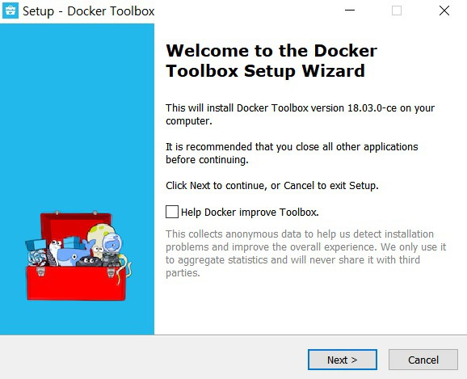
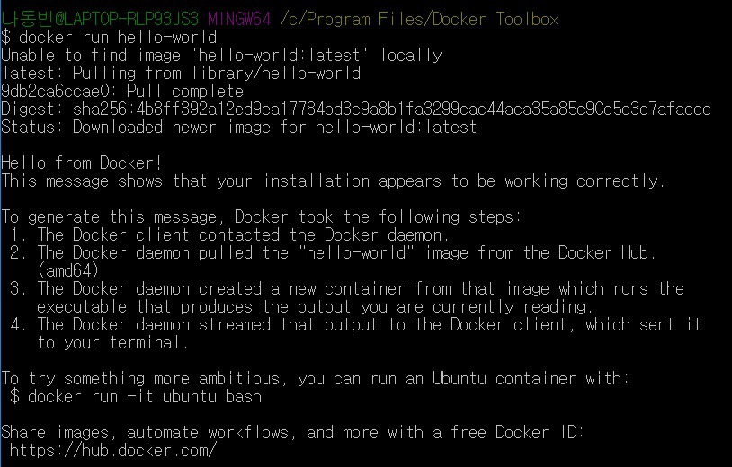

# Docker 알아보기

출처: https://ndb796.tistory.com/90?category=1009977

### # 주의 Docker 를 설치하기 위해 Hiper-V 를 활성화 하면 VMware 를 사용 할 수 없다.

```
관리자 명령 프롬프트 에서 
bcdedit /set hypervisorlaunchtype off
입력 후 OS 재 시작 하면 VMware 사용 가능

관리자 명령 프롬프트 에서 
bcdedit /set hypervisorlaunchtype auto
입력 후 OS 재 시작 하면 Docker 사용 가능

```


## 1. 도커(Docker)의 개요

**※ 도커의 개요 ※**

  이번 시간에는 최근까지 소프트웨어 개발자들에게 계속 핫한 주제였던 도커(Docker)에 대해서 알아보도록 하겠습니다. **도커(Docker)**란 리눅스 컨테이너를 기반으로 하여 특정한 서비스를 패키징하고 배포하는데 유용한 오픈소스 프로그램입니다.


도커 공식 서비스는 위 사진과 같이 귀여운 고래 모양의 캐릭터를 메인 로고로서 사용하고 있습니다.


**※ 도커를 사용해야 하는 이유 ※**


  이번 글에서는 도커를 사용해야 하는 이유에 대해서만 제대로 이해하셔도 충분합니다. 기존에 다양한 형태로 개발을 하셨던 분들이라면 Maven, Gradle, FTP 등의 다양한 패키징 및 배포 도구를 사용해보신 적 있으실 거에요. 이러한 **배포 도구**들이 사용되었던 이유는, 특정한 소프트웨어를 개발한 이후에 배포하고자 할 때 해당 프로그램이 어디에선가 손쉽게 구동이 되도록 하기 위해서에요. 예를 들어 열심히 웹 개발을 했는데, 실제로 접속이 가능한 웹 서버에 배포를 하지 못한다면 누구도 그 서비스를 이용할 수 없겠죠?


  예를 들어 저는 이전에 JSP를 이용해서 웹 사이트를 개발하는 방법에 대해 소개한 적이 있었어요. 웹 사이트를 개발한 이후 마지막 단계는 배포 및 운영 단계입니다. 그럴 때는 카페 24나 AWS 등의 클라우드 서비스를 이용해 웹 서비스를 배포하는 것이 일반적이에요. 그런데, 일반적으로 이러한 '호스팅 서비스'는 우리의 로컬 컴퓨터와는 차이점이 존재해요. 특정한 서버 환경에 우리가 만든 웹 서비스를 맞추어서 배포해야 하므로 갖가지 설정이 필요하죠. 초기 상태에서 시작한다면 JVM을 설치해야 되고, 톰캣(Tomcat)도 필요하고, 등 할 게 많아요. 또 같은 리눅스라고 해서 괜찮은 것도 아니고, 리눅스 버전에 따라서도 설치 방법이 다르답니다.


  그래서 등장한 것이 바로 '컨테이너(Container)'의 개념이에요. 도커를 설치하면, 컨테이너에 '이미지(Image)'를 담아서 구동시키는 방식으로 손쉽게 배포할 수 있어요. 이러한 컨테이너를 어떻게 만들고, 활용할 지에 대해서는 미리 도커 소프트웨어가 정의를 해 놓고 있어서 도커를 사용하는 우리들은 단순히 이미 배포된 소프트웨어 이미지를 도커를 통해 컨테이너에 올리면 되요. 다시 말해서 우리는 도커만 설치를 하면 나머지는 알아서 설정이 이루어지는 겁니다. JVM, 톰캣 등을 따로따로 설치할 필요가 없으며 도커 하나만 있으면 이 친구가 알아서 해결해줘요.

나중에 자세히 알아보겠지만, 도커 파일(Docker File)이라는 것을 만들어서 '나는 어떠한 소프트웨어를 컨테이너에 담아서 구동시킬 것이다.'라는 것만 정확히 명시해주고 빌드(Build)를 해주면, 알아서 도커 이미지가 그에 맞게 생성이 됩니다. 그래서 그 이미지를 구동시키면 순식간에(웹 서버도 몇 초만에 뚝딱!) 도커 컨테이너 위에서 실행이 됩니다.


  물론 도커 이전에도 이러한 컨테이너(Container) 기반의 기술이 다수 존재했었어요. 하지만 도커의 고유한 창의적인 기능들과 편리함 때문에 현재 도커가 패키징, 배포 시장을 잠식하고 있는 상태랍니다. 도커는 말씀 드렸듯이 컨테이너(Container) 형태로 동작하는데, 기존에 VM(Virtual Machine) 서비스를 이용해 본 적이 있으신 분들이라면 다소 헷갈릴 수 있어요. 그래서 VM과 도커가 어떻게 다른 기술인지 확실히 이해할 필요가 있답니다.


**※ VM(Virtual Machine)과 컨테이너(Container)는 무엇이 다를까 ※**


  기본적으로 기존에 우리가 많이 사용하던 VM(가상 머신)과 컨테이너는 큰 차이가 있습니다. **가상 머신**은 가상화 기능을 사용해 Guest OS라는 것을 만들어냅니다. 예를 들어 윈도우(Windows) 운영체제를 사용하는 사람이 칼리 리눅스를 새롭게 가상 머신 위에서 구동시킨다면, 윈도우는 Host OS이고 칼리 리눅스는 Guest OS입니다. 다시 말해 Guest OS와 Host OS는 사실상 완전히 별개로 존재할 수 있다는 점에서 서로 의존적이지 않습니다. 대신에 Guest OS의 I/O 기능이 사실상 Host OS를 거쳐서 이루어지기 때문에 속도가 느리다는 단점이 있습니다. 뿐만 아니라 Guest OS 자체가 완전히 새로운 운영체제로서 존재해야되기 때문에 아무리 가벼운 OS를 설치하려고 해도, 용량이 큽니다.


반면에 **컨테이너(Container)**는 가상 머신 대신에 도커 엔진(Docker Engine) 위에서 동작한다는 특징이 있어요. 이렇게 해주면 별도의 Guest OS가 사용되지 않아서 성능적으로 매우 개선됩니다. 메모리 용량도 적게 차지하고요. 다만 기본적으로 사용하고 있는 운영체제와 도커의 컨테이너(Container)에 의존성이 존재합니다. 이로 인해 각종 보안 문제로 공격을 받은 적이 있었구요. 기본적으로 윈도우(Windows) 운영체제를 사용하고 있는 컴퓨터는, 도커 엔진 위에 올라가는 컨테이너도 윈도우 컨테이너(Windows Container)여야 합니다. (다행히도 최근에는 도커와 윈도우의 호환성이 매우 높아지고 있어서 사실상 리눅스 컨테이너와 윈도우 컨테이너의 구분이 모호해지고 있습니다.)


  도커는 Container라서 VM에 비해 이미지 파일의 크기가 작아 빠르게 이미지를 만들고 실행할 수 있다는 특징이 있습니다. 예를 들어 대표적인 리눅스 운영체제 배포판 중에서 알파인(Alpine)은 최소한의 기능만 들어가 있어서 5MB 가량으로 작게 구성되어 있습니다. 가상 머신 기술을 이용하는 경우 아무리 운영체제를 가볍게 설치하려고 해도 최소한 기가 바이트 단위인데, 이렇게 Container를 이용하면 그 크기가 200MB 전후로 줄어들 수 있어서 가히 초경량 배포 도구라고 할 수 있답니다.


**※ Solomon Hykes의 도커(Docker) ※**


  도커의 시작을 알린 사람은 Solomon Hykes로 2013년 PyCon에서 '리눅스 컨테이너의 미래'라는 제목으로 도커에 대해서 발표했습니다. 발표 내용은 유튜브(YouTube)에도 올라와 있어서 손쉽게 확인할 수 있습니다. (https://www.youtube.com/watch?v=wW9CAH9nSLs)


보시면 솔로몬 씨가 'Hello World'라는 문장을 띄운 것을 알 수 있습니다. 도대체 Hello World를 띄운 것이 뭐가 그렇게 대단하다고 사람들이 이렇게 도커에 열광하는 걸까요? 그것은 'Hello World'가 새로운 운영체제 위에서 출력이 된 것이기 때문입니다. 이것은 엄청난 발전입니다. 아니, 몇 초 만에 별도의 운영체제를 생성한 뒤에 'Hello World'를 출력한 것이니까요. VM을 사용해보신 분들이라면 이게 얼마나 편리한 것인지 감이 오실 겁니다.


  리눅스 컨테이너(Linux Container)는 오래 전부터 개발되던 기술입니다. 그 역사만 10년이 넘었습니다. 하지만 리눅스 컨테이너를 개발하거나 활용하는 기술은 복잡하고 까다로웠습니다. 그래서 다양한 회사가 컨테이너 기술을 사용하고 있음에도 불구하고 일반 개발자들 사이까지 널리 퍼지지는 못했습니다. 그러한 배경에서 도커가 등장함에 따라 그 방향이 바뀌게 됩니다. 리눅스 컨테이너 기술을 기반으로 하되, 매우 편리한 인터페이스 및 명령어를 가지고 있어서 컨테이너 기술을 잘 모르는 개발자들도 손쉽게 도커를 이용해 컨테이너를 띄워볼 수 있게 된 것입니다.


**※ 도커는 어떻게 만들어졌을까? ※**


  도커는 기본적으로 도커 엔진(Docker Engine)에 의해 동작합니다. 도커 엔진의 핵심 로직은 Google의 Go 언어로 개발이 되어 있습니다. Go로 개발된 도커 엔진은 기존의 C언어로 개발된 모듈보다 더욱 빠르게 동작합니다. Go 프로그래밍 언어는 기본적으로 포인터 등의 기능을 지원하며 Garbage Collector나 클래스 등의 기능까지 지원하는 언어입니다. 최근에는 깃(Git) 서버도 Go 언어로 개발이 되고 있습니다. 실제로 그렇게 Go로 개발한 서버 모듈이 빠르게 동작하죠. Go로 개발된 소프트웨어 중에서 가장 잘 나가고 있는 것이 바로 도커(Docker)인 것입니다.


**※ 도커 패러다임 ※**


  도커는 **변경 불가능한 인프라(Immutable Infrastructure)**를 주요 패러다임으로 상정하고 있습니다. 기본적으로 특정한 소프트웨어가 자주 수정되는 경우 서비스 안정성에 여러 가지 문제가 발생할 수 있습니다. 특히 언제 어떠한 부분이 변경되었는지 등의 이력 관리를 제대로 하는 것이 매우 중요합니다. 그러한 배경에서 아예 변경 자체를 못하도록 하자고 해서 '변경 불가능한 인프라'의 개념이 나타나게 되었는데, 이것은 서버를 구축한 이후에는 변경이나 업데이트를 할 수 없도록 하는 것입니다.


  **그렇다면 서버에 문제가 생겨서 업데이트를 해야 되는 경우는 어떻게 할까요? 그냥 삭제해버리는 겁니다!**


  서버 패치 등은 지속적으로 이루어져야 하는데 '어떻게 한 번 서버를 구축하고 나서 업데이트를 안 할 수 있을까요?' 사실 이는 처음 들었을 때 이해하기 힘들 수도 있는데요. 도커를 쓰다보면 서버 자체를 들었다 놨다 하는 것이 익숙해지실 겁니다. 다시 말해, 서버를 업데이트를 해야 할 때는 새로운 도커 이미지 자체를 업데이트 해서 그냥 컨테이너에 올리는 겁니다. 기존에 돌아가던 컨테이너는 완전히 '제거' 해버리구요.


  도커에서는 그냥 이미지를 도커 위에 올리는 것 만으로도 배포가 끝나버립니다. '변경 불가능한(Immutable)' 이라는 의미는 그 자체로 '상태가 없는(Stateless)', '확장 가능한(Scalable)' 형태입니다. **도커로 돌아가는 소프트웨어 자체는 어떠한 데이터도 가지고 있으면 안 되고, 임시 파일 정도만 가지고 있는 상태에서 돌아가야 합니다. 사용자 계정 정보와 같은 실질적인 데이터들은 외부 스토리지로 빼 놓아야 하는 겁니다.** 최근에 자주 언급되고 있는 마이크로 서비스(Micro Service)의 특징과 매우 닮아있습니다.


**※ 리눅스 컨테이너 ※**

  도커는 말했듯이 대표적인 컨테이너 기술입니다. 일반적으로 **리눅스 컨테이너(LXC)**란 리눅스상에서 여러 개의 격리된 리눅스 시스템을 동작시키기 위한 운영체제 단의 가상화 기술을 의미합니다. Warden, Libvirt가 그 대표적인 예시입니다. 리눅스 커널(Kernel) 위에 Libvirt가 돌아가며 그 위에 컨테이너가 올라가는 방식이지요. 그래서 이러한 LXC 기술에 대한 이해가 높으신 분은 사실 도커와 같은 기술을 자체적으로 개발할 수도 있는 겁니다. 구글이 발표한 자료에 따르면 매주 수십억 개의 컨테이너가 전 세계적으로 구동된다고 합니다. 또한 구글이 운영하는 모든 서비스는 컨테이너를 기반으로 돌아갑니다. 왜냐구요? 성능이 좋으니까요. 구글은 도커 이전에도 이미 이러한 리눅스 컨테이너 기술을 사용하고 있었고, 최근에는 도커 기반의 기술을 많이 활용하고 있답니다.


  앞에서도 언급했지만 도커 이전의 LXC 기술들은 기본적으로 오래 전부터 사용되고 있었으나 설정이 매우 복잡하고, 사용하기 어려워 널리 알려지지 않았던 것입니다. 도커가 출시되면서 10분도 채 소요되지 않는 시간에 대부분의 서비스를 구동시킬 수 있어서 실질적으로 대부분의 개발자가 이용할 수 있는 레벨까지 편리성을 제공하게 된 것입니다.


##   2. 윈도우에 도커 설치하기

  윈도우에서 도커 툴 박스(Docker Toolbox)를 설치해서 도커 구동시키기


**※ 도커의 동작 과정 살펴보기 ※**


  지난 시간에는 간단히 도커(Docker)에 대한 소개를 하는 시간을 가졌습니다. 이번 시간에는 직접 윈도우(Windows) 운영체제에 도커를 설치해서 구동시켜보는 시간을 가져보도록 하겠습니다. 먼저 간단하게 도커를 설치하기 이전에 이해도를 높이기 위해서 도커를 설치한 뒤의 실행 화면을 먼저 살펴보도록 하겠습니다. 이전 시간에도 잠깐 소개했던 솔로몬(Solomon) Hykes의 도커에 대한 발표 내용입니다.

  '리눅스 컨테이너의 미래'라는 거창한 이름의 발표입니다. 일단 바로 중반부에 등장하는 내용을 발췌해보겠습니다.


**docker ps**

=> 현재 돌아가고 있는 컨테이너를 확인하는 명령어입니다.


**docker images**

=> 현재 도커 머신에 설치된 도커 이미지를 확인하는 명령어입니다.


**docker run -a busybox echo 'Hello World'**

=> 먼저 로컬 서버에서 busybox라는 이미지를 찾습니다.

=> 로컬 서버에 해당 이미지가 없으면 도커 허브(Docker Hub)에서 자동으로 다운로드 받습니다.

=> 해당 이미지를 이용해 컨테이너를 실행합니다.

=> 컨테이너 실행 과정에서 디스크 및 메모리를 할당해서 순식간에 리눅스 서버를 구축합니다.

=> 새롭게 생성된 리눅스 서버에서 'Hello World'를 출력합니다.

=> 출력된 결과를 유닉스 소켓을 이용해 클라이언트로 전송하여 화면에 출력합니다.


  발표에서는 정말 쉽게 쉽게 명령어를 입력하고 있는 것처럼 보이지만, 내부적으로는 엄청난 일들이 일어나고 있는 겁니다!


**※ 도커 소프트웨어의 개요 ※**


  도커는 크게 ① 오픈소스 무료 버전(Community Edition), ② 유료 버전(Enterprise Edition)으로 나뉩니다.


  기본적으로 CE 버전으로도 도커의 모든 기능을 이용하는데 큰 제약이 없지만 안정적으로 실 서버에 도커를 운용하려면 EE를 사용하는 것이 훨씬 유리합니다. 기본적으로 도커 EE를 쓰면 각 서버별로 연간 1,000 달러 이내의 라이선스 비용이 소요됩니다. 다만 전반적인 배포 과정을 훨씬 편리하게 해주어 효용이 높습니다. 또한 현재는 기본적으로 도커 엔진 자체가 사실상 스웜(Swarm)이나 쿠버네티스(Kubernetes) 기술을 지원하고 있어서 유료 서비스만 잘 엮어서 쓰면 매우 강력한 기능을 쉽게 이용할 수 있습니다.


  **도커 엔진(Docker Engine)**: 특정한 소프트웨어를 도커 컨테이너로 만들고 실행하게 해주는 데몬(Daemon)을 의미합니다. 도커 엔진과 도커 클라이언트 사이에는 REST API가 사용됩니다. REST API 서버에 요청을 보내는 것이 도커 클라이언트입니다.


  **도커 클라이언트(Docker Client)**: 도커 엔진과 통신하는 소프트웨어로 개발자가 직접 이용할 수 있습니다. 윈도우(Window)/맥(Mac)/리눅스(Linux)를 지원합니다. 물론 윈도우는 도커를 사용하기에 최악의 조건이고, 리눅스가 제일 최상의 조건이지만 도커는 공식적으로 윈도우를 제대로 지원하고 있습니다.


  **도커 호스트 운영체제(Docker Host OS)**: 도커 엔진을 설치할 수 있는 운영체제 환경을 의미합니다. 64비트 리눅스 커널 버전 3.10 이상 환경을 의미하고, 32비트 환경에서는 도커 엔진이 돌아가지 않는답니다. 애초에 초기의 도커 이미지는 심지어 오직 우분투(Ubuntu) 운영체제 전용이었어요. 현재는 우분투, CentOS, Debian, Fedora 등에서 사용할 수 있게 되었지만요.


  추가적으로 언급하자면, **사실 윈도우는 Docker Host OS가 될 수 없습니다.** 당연한 거죠. 도커 엔진은 기본적으로 리눅스 OS 위에서 돌아가는거니까 가상화 기능이 필요합니다. 하지만 다행히도 마이크로소프트(Microsoft)는 기본적으로 도커(Docker)에 많은 관심을 가지고 있는 상황입니다. 그 결과 마이크로소프트는 도커의 초기 버전부터 많은 모듈을 덧붙여서 윈도우 파일 시스템과 도커의 파일 시스템이 연동될 수 있도록 모듈을 개발하여, 현재는 윈도우 컨테이너가 도커 명령어로 정상적으로 작동하고 리눅스 컨테이너와 상호 통신까지 가능합니다.


  **도커 머신(Docker Machine)**: 로컬 및 원격지 서버에 도커 엔진을 설치하고, 다양한 환경 설정을 자동으로 수행해주는 클라이언트를 의미합니다.


  우리가 이번 시간에 설치하게 될 도커 툴박스(Docker Toolbox)는 도커 CE의 이전 버전인데, 윈도우 10 Enterprise/Professional 이전 버전의 윈도우 사용자는 필수적으로 이러한 도커 툴박스를 이용해야 합니다. 물론 기능상으로 큰 문제는 없기 때문에 그냥 이용하시면 됩니다.


**▶ 도커 툴 박스 설치 사이트:** https://docs.docker.com/toolbox/toolbox_install_windows/


  위 사이트에 접속하면 기본적으로 윈도우 10 Enterprise/Professional은 툴박스가 아니라 윈도우 도커(Docker For Windows) 애플리케이션을 설치할 것을 권장하는 것을 알 수 있습니다. 하지만 **우리는 최신 버전의 도커 애플리케이션을 이용하지 않고, 툴박스를 이용**할 겁니다. 툴박스를 이용해도 기능적으로는 문제가 없습니다. 이용상의 장단점에 대해서는 차차 알아가시면 됩니다.

  

  우리가 설치할 도커 툴박스는 기본적으로 오라클 VM VirtualBox를 기반으로 동작합니다. 쉽게 말하면 **윈도우 위에 리눅스 가상 머신을 돌리고, 그 위에서 도커 엔진을 돌리는 방식**이라고 이해할 수 있습니다. 그래서 일단 기본적인 VM 가상화 기능을 사용할 수 있어야 합니다. 따라서 윈도우 운영체제에서 '작업 관리자'의 '성능' 탭에 들어갔을 때 가상화 기능이 활성화 되어있어야 합니다.


  위 사진은 제 컴퓨터의 '작업 관리자'입니다. 저는 윈도우 10 홈(Home) 버전을 쓰고 있어서 이렇게 나오는 건데요, 그냥 '가상화'가 '사용'이라고 되어 있는 것을 체크하시면 됩니다. VM 기능을 이용할 수 있는 상태이므로 바로 도커 툴박스 버전을 설치하면 되는 겁니다. 만약에 '가상화'가 비활성화 되어있으신 분은 노트북 혹은 데스크탑을 재부팅하셔서 바이오스(Bios)에 진입하여 '가상화' 기능을 활성화 해주시면 됩니다.


이제 바로 위와 같이 'Get Docker Toolbox for Windows'를 눌러서 툴박스 설치 프로그램을 다운로드 받아주세요!

https://github.com/docker/toolbox/releases


**※ 툴박스를 설치하면 자동으로 설치되는 것들 ※**


\- 도커 엔진이 이미지 및 컨테이너를 생성할 수 있도록 해주는 **도커 클라이언트(Docker Client)**

\- 윈도우 터미널에서 사용하는 도커 엔진 명령어를 이용하게 해주는 **도커 머신(Docker Machine)**

\- **도커 컴포즈(Docker Compose)** 기능

\- 도커 GUI 도구인 **카이트메틱(Kitematic)**

\- 도커 명령어 입력이 가능한 **도커 빠른시작 터미널(Docker QuickStart Shell)**

\- **오라클 VM VirtualBox**


  말했듯이 윈도우에서는 기본적으로 도커 엔진을 구동시킬 수 없습니다. 그래서 작은 크기의 VM 리눅스 위에서 도커 머신 명령어를 입력하는 식으로 도커 엔진에 접근할 수 있습니다. 즉, VM이 도커 엔진의 호스트 역할을 수행하게 되는 겁니다. 그렇기 때문에 당연히 도커 툴박스 관리 도구 및 ISO 파일이 함께 설치됩니다. 이 ISO 파일이 오라클 VM VirtualBox 위에서 동작하는 것이라고 볼 수 있습니다.



  도커 툴박스 설치 프로그램을 실행하면 위와 같습니다.


  설치 경로를 물어보는데 기본 경로로 넣으시면 됩니다. 나중에 이 경로가 도커 기본 터미널의 경로로 설정됩니다.

  이제 설치 구성 목록을 물어보는데, 전체 설치(Full Installation)으로 설정해주세요. 보시면 도커 컴포즈(Docker Compose) 및 VirtualBox와 Kitematic이 설치되는 것을 알 수 있습니다. 전부 위에서 언급했던 것들이에요. 추가적으로 추후에 도커 이미지 생성을 위한 각종 파일들은 모두 깃(Git)을 이용해서 관리하는 것이 일반적이므로 혹여나 깃이 설치되어있지 않으신 분들은 설치해주시는 것을 강력히 추천합니다.


  이후에 위와 같이 기본적인 환경설정 요소를 체크해주시고 넘어가시면 됩니다.


 이제 설치를 진행합니다.


  설치 완료 이후에는 다음과 같이 세 개의 아이콘이 바탕화면에 나타날 겁니다.


**※ 도커의 기본 컨셉 ※**


  도커는 기본적으로 개발, 배포, 실행 단계를 지원하는 목적으로 사용됩니다. 애플리케이션을 배포할 때는 **컨테이너화(Containerization)**하여 배포하게 되는데, 말 그대로 특정한 애플리케이션을 컨테이너에 담아서 구동시키는 것을 의미합니다. 컨테이너가 가지는 다양한 특징들 때문에 '컨테이너화' 기술은 매우 각광받게 되었습니다.


\- 유동성(Flexible): 매우 복잡한 소프트웨어들이 컨테이너화 될 수 있습니다.

\- 가벼움(Lightweight): 컨테이너는 호스트 커널의 기능을 극대화하고 공유할 수 있습니다.

\- 상호변경성(Interchangable): 업데이트 및 업그레이드를 즉시 수행할 수 있습니다.

\- 이식성(Portable): 로컬에서 빌드하고, 클라우드에 배포하고, 어디에서나 실행할 수 있습니다.

\- 확장성(Scalable): 컨테이너의 복제품을 자동적으로 증가시키고 분배할 수 있습니다.

\- 수직성(Stackable): 다양한 서비스를 쌓아 올려 훌륭한 서비스를 만들 수 있습니다.


**※ 도커 기본 사용법 ※**


위 사진은 도커 실행 화면입니다.


**docker --version** 명령어를 입력해서 설치된 도커의 버전을 확인할 수 있습니다.

**docker info** 명령어를 입력해서 설치된 도커의 버전을 보다 상세하게 확인할 수 있습니다.



**docker run hello-world**: 도커에서 헬로우 월드(Hello World)를 띄우는 명령어입니다. 우리 눈에는 보이지 않지만 다음의 과정이 포함되는 겁니다.


1) hello-world라는 이미지를 검색한다.

2) 로컬에 이미지가 있으면 쓰고, 없으면 도커 허브(Docker Hub)에서 내려받는다.

3) 해당 이미지를 컨테이너로 동작시킨다.


  결과적으로 위 화면과 같이 Hello World가 성공적으로 출력되었습니다.


  **docker images**: 현재 도커 머신에 존재하는 이미지 목록을 출력합니다.


  **docker ps -a**: 현재 도커 머신에 존재하는 컨테이너를 출력합니다.


# Windows10pro docker 설치하기

로컬환경에서 웹 프로그램 개발시 다양한 도구들을 설치하게 된다. 그중 대표적으로 짜증나는 녀석은 DB 일것이다.

Oracle, Mysql, MariaDB 등을 훌륭한 것들이지만 문제는 설치시 손이 미끄러져 재대로 설치가 안되는경우가 간혹 있다. 또는 이미 설치된 DB를 삭제해야 하는경우가 종종 있는데

이때 이미 내 로컬 OS의 레지스터리는 더럽혀지기 때문에, 일일이 손을 봐야 할 곳이 많이 생기게 된다. 공부할것도 많고 개발할것도 많은데 이딴거 때문에 정력을 낭비하는건 여간 손해가 아니다.

위와 같은 문제를 방지하기 위해 로컬에 Docker 컨테이너 가상화 환경을 만들고 그 위에 DB를 설치해볼 생각이다. Docker는 그 내용이 방대하기 때문에(사실 지금도 공부중)이만 넘어가고 바로 Windows10 pro 에 Docker를 설치해보자

### Windows10 PRO에 Docker 설치 방법

**이글은 Windows10 pro에 docker를 설치하는 방법이다.** **Windows10 pro는 Docker Tool Box를 설치하지 않는다.** 구글링 해보니 Windows10 pro와 일반 Windows10과 Docker설치 방법이 다른듯 하다. 아마도 Windows10 Pro 에서는 hyper-v기능이 있기 때문인듯 하다. 일반 Windows10은 Docker tool box를 설치해야 하는데, 여기에는 hyper-v를 대신할 vitualbox가 포함되어 있다. Windows10 pro가 설치된 노트북에 Docker tool box 를 설치했었는데, 문제가 좀 있는지 정상동작을 하지 않았다. **Windows10 pro가 아닌 사람은 이 글을 더이상 읽지 말고, Docker tool box 설치방법을 구글에서 검색하기를 바란다.**

#### 1.Windows10 Pro에 Docker 설치 준비

윈도우에서 작업관리자를 열어 가상화 항목이 사용인지 확인하자. 사용이 아닌경우 본인의 CPU가 가상화 기능을 지원하는지 여부를 확인 해야 하며, 가상화를 지원한다면 컴퓨터 부팅시 Bios에 접근하여 해당 가상화 기능을 활성화 시켜야 한다. 만약 본인의 컴퓨터의 cpu가 가상화 기능이 없다면 Docker를 사용 할수 없을것이다. 아마도?...

일단 윈도우 작업관리자 - 성능 에서 가상화 여부가 사용으로 나오는지 확인하자


그리고 윈도우 - 설정 에서 Windows 기능 창에서 Hyper-V항목을 활성화 하자.


Hyper-V를 활성화 하면 윈도우 리부팅을 하도록 하자.

#### 2.Windows10 Pro용 Docker 설치파일 다운로드

https://docs.docker.com/ 이동 -> Get Docker -> Docker CE -> Windows -> Download from Docker Store -> Get Docker 버튼 클릭


아래 링크를 클릭하면 바로 다운로드가 된다. [https://download.docker.com/win/stable/Docker%20for%20Windows%20Installer.exe](https://download.docker.com/win/stable/Docker for Windows Installer.exe)


다운로드한,위 파일을 설치하도록 하자. 설치를 진행하면 윈도우 로그아웃을 요청하며 윈도우 로그아웃후 다시 로그인 하면 다음과 같이 도커가 시작되고 있는것을 확인 할 수 있다


Docker가 시작되는대 조금 시간이 걸리며, Docker가 시작되면 아래처럼 로그인 창이 열린다. https://hub.docker.com/ 에서 간단히 이메일을 통해 계정을 만든 뒤, 그 계정을 통하여 로그인 하면 Docker를 사용 할 수 있다. 참고로 도커 허브는 도커에서 사용할 이미지들을 공유하는 공용 리파지토리이다.


로그인 후 윈도우 숨겨진 아이콘에서 docker를 확인해보면 로그인 된것을 확인 할 수 있다.


#### 4.Kitematic 설치

도커가 설치되면 Kitematic를 설치해야 한다. Kitematic은 도커를 관리 할수 있는 GUI툴이다.

Kitematic를 클릭해보자


Docker최초 설치시에는 Kitematic가 설치되어 있지 않으므로 다운로드를 하라고 창이 뜬다. 다운로드를 하자.


아래처럼 zip파일이 다운로드가 된다.


zip파일을 앞축을 푼뒤 폴더명을 Kitematic로 변경하고 C드라이브 / Program Files / Doker 폴더로 이동 시키자.


#### 5.Windows10 Pro에 docker 동작 확인

이제 Windows10 pro에서 도커를 사용할수 있는 준비를 끝냈다. 다시 Kitematic를 클릭해보자.


위 처럼 도커허브 계정을 로그인 하라고 나온다. 로그인 하자.


로그인을 하면, 위처럼 Kitematic도구가 열리며 도커에 설치할 수 있는 이미지들이 나오는 것을 확인 할 수 있다.

아래처럼 Kitematic 좌측 하단의 Docker CLI를 클릭하면 윈도우 파워쉘이 열리며 Docker 명령어를 입력 할 수 있다.


#### 마무리

이로써 Windows10 pro에서 도커를 설치해 보았다. 주의할 점은 Windows10 pro에는 Docker tool box가 아니라 그냥 Docker for windows installer.exe 설치파일을 이용해야 한다.


# Docker 활용

## 도커 이미지

이미지는 컨테이너를 생성할 때 필요한 요소이며, 가상 머신을 생성할 때 사용하는 ISO 파일과 비슷한 개념입니다. 이미지는 도커 명령어로 다운로드가 되기 때문에 별도로 설치를 할 필요가 없으며 기본적으로 아래와 같이 구성됩니다.

```
[저장소 이름]/[이미지 이름]:[태그]

jungwoon/ubuntu:14:04
```

또는 `저장소 이름`은 `생략`이 가능해서 아래와 같이도 구성할 수 있습니다.

```
[이미지 이름]:[태그]

ubuntu:14:04
```

만약 `태그` 생략시 `latest`로 붙습니다. `ex) ubuntu:latest`

## 도커 컨테이너

이미지를 이용하면 목적별로 독립된 시스템 및 공간을 만들 수 있는데 이를 `도커 컨테이너`라고 합니다. 컨테이너는 이미지를 읽기 전용으로 사용하고, 이미지에서 변경된 내용은 컨테이너 계층만 영향을 받기 때문에 이미지는 변화하지 않습니다.

------

## 도커 명령어

### 버전 확인하기

```
$ docker -v # 버전 확인
Docker version 18.09.0, build 4d60db4
```

------

### 도커 컨테이너 내부 쉘에서 나가기

도커 컨테이너 내부 쉘에서 나가는 방법은 두 가지가 있습니다.

- `exit` : 명령어로 `exit`를 누르고 엔터
- `Ctrl + D` : 해당 단축키를 누르면 바로 종료

위의 두 가지 방법은 컨테이너를 종료시키고 나오는 방법입니다. 아래 방법은 컨테이너를 종료시키지 않고 나오는 방법 입니다.

- `Ctrl + P, Q` : 컨테이너를 종료시키지 않고 나오기 (다시 들어가려면 `$ docker attach [컨테이너 명]`)

------

### 도커 이미지 가져오기

아래 명령어를 사용하면 도커 공식 이미지 저장소에서 이미지를 내려받습니다.

```
$ docker pull [이미지 이름]:[태그]
```

예제를 보도록 하겠습니다, 그럼 도커 공식 이미지 저장소에서 `centos:7` 이미지를 다운받게 됩니다.

```
ex)

$ docker pull centos:7
```

------

### 이미지 확인하기

```
$ docker images

REPOSITORY          TAG                 IMAGE ID            CREATED             SIZE
ubuntu              14.04               7e4b16ae8b23        2 weeks ago         188MB
centos              7                   1e1148e4cc2c        5 weeks ago         202MB
```

------

### 컨테이너 생성하기

이미지로 컨테이너 생성하기

```
$ docker create [옵션] [이미지 이름]:[태그]
```

예제를 보겠습니다.

```
$ docker create -i -t centos:7
```

- `-i` : 상호 입출력
- `-t` : tty를 활성화하여 bash 쉘을 사용

------

### 컨테이너 실행하기

만들어진 도커 컨테이너를 실행하는 명령어 입니다.

```
$ docker start centos:7
```

------

### 컨테이너 들어가기

도커의 내부쉘로 들어가는 명령어 입니다.

```
$ docker attach centos:7
```

------

### 컨테이너 만들고 실행하기

위의 `생성 -> 실행 -> 들어가기` 까지 한번에 해주는 명령어 입니다.

```
$ docker run [옵션] [이미지 이름]:[태그] 
```

- `-i` : 상호 입출력
- `-t` : tty를 활성화하여 bash 쉘을 사용

```
ex)

$ docker run -i -t ubuntu:14.04
```

보통은 컨테이너를 생성함과 동시에 시작하기 때문에 `run` 명령어를 더 많이 사용합니다.

------

### 컨테이너 목록 확인

만들어진 컨테이너 목록을 확인할 수 있습니다.

```
$ docker ps
CONTAINER ID        IMAGE               COMMAND             CREATED             STATUS              PORTS                NAMES
aab67382350b        ubuntu:14.04        "/bin/bash"         16 minutes ago      Up 16 minutes       0.0.0.0:80->80/tcp   mywebserver
```

대신 위의 명령어는 현재 실행중인 컨테이너 목록만 확인할 수 있기 때문에, 정지된 컨테이너까지 보고 싶으면, 아래와 같이 `-a` 옵션을 같이 넣어줍니다.

```
$ docker ps -a
CONTAINER ID        IMAGE               COMMAND             CREATED             STATUS                      PORTS               NAMES
99627ff61fd7        centos:7            "/bin/bash"         42 hours ago        Exited (0) 42 hours ago                         mycentos
1758dcf92334        ubuntu:14.04        "/bin/bash"         43 hours ago        Exited (255) 25 hours ago                       determined_brattain
```

- `CONTAINER ID` : 컨테이너에게 자동으로 할당되는 `고유한 ID`
- `IMAGE` : 컨테이너를 생성할 때 사용된 이미지 이름
- `COMMAND` : 컨맨드는 컨테이너가 시작될 때 실행될 명렁어, 기본은 `/bin/bash` 명령어라 명령을 쓸 수 있습니다.
- `CREATED` : 컨테이너가 생성되고 난 뒤 흐른 시간
- `STATUS` : 컨테이너의 상태 ex) Up(실행 중), Exited(종료), Pause(일시 중지)
- `PORTS` : 컨테이너가 개방한 포트와 호스트에 연결한 포트
- `NAMES` : 컨테이너의 고유한 이름, `--name 옵션`으로 이름을 설정하지 않으면 도커 엔진이 임의의로 설정

------

### 컨테이너 이름 변경

```
$ docker rename [기존 이름] [변경 하고자 하는 이름]
$ docker rename determined_brattain my_container
```

결과

```
$ docker rename determined_brattain my_container
$ docker ps -a
CONTAINER ID        IMAGE               COMMAND             CREATED             STATUS                      PORTS               NAMES
99627ff61fd7        centos:7            "/bin/bash"         42 hours ago        Exited (0) 42 hours ago                         mycentos
1758dcf92334        ubuntu:14.04        "/bin/bash"         44 hours ago        Exited (255) 25 hours ago                       my_container
```

------

### 컨테이너 삭제

```
$ docker rm [컨테이너 이름]
```

결과

```
$ docker rm mycentos
mycentos
```

만약 container가 실행 중이면 종료하고 삭제를 하거나 -f 옵션을 이용해서 강제로 삭제를 해야합니다.

```
$ docker stop mycentos
$ docker rm mycentos
$ docker rm -f centos
```

------

### 컨테이너 외부에 노출

컨테이너는 가상 머신과 마찬가지로 가상 IP를 할당 받습니다. 테스트를 위해서 `network_test`란 컨테이너를 만들어 보겠습니다.

기본적으로 도커는 172.17.0.x의 IP부터 순차적으로 할당합니다.

```
$ docker run -i -t --name network_test ubuntu:14.04
root@7b5213595de1:/# ifconfig
eth0      Link encap:Ethernet  HWaddr 02:42:ac:11:00:02
          inet addr:172.17.0.2  Bcast:172.17.255.255  Mask:255.255.0.0
          UP BROADCAST RUNNING MULTICAST  MTU:1500  Metric:1
          RX packets:17 errors:0 dropped:0 overruns:0 frame:0
          TX packets:0 errors:0 dropped:0 overruns:0 carrier:0
          collisions:0 txqueuelen:0
          RX bytes:1366 (1.3 KB)  TX bytes:0 (0.0 B)

lo        Link encap:Local Loopback
          inet addr:127.0.0.1  Mask:255.0.0.0
          UP LOOPBACK RUNNING  MTU:65536  Metric:1
          RX packets:0 errors:0 dropped:0 overruns:0 frame:0
          TX packets:0 errors:0 dropped:0 overruns:0 carrier:0
          collisions:0 txqueuelen:1
          RX bytes:0 (0.0 B)  TX bytes:0 (0.0 B)
```

아무 설정을 하지 않으면 기본적으로 컨테이너는 외부에서 접근할 수 업으며 도커가 설치된 호스트에서만 접근 가능합니다.

외부에 컨테이너의 어플리케이션을 노출하기 위해서는 eth0의 IP와 포트를 호스트의 IP와 포트에 바인딩해야 합니다.

테스트를 위해 아래의 새로운 컨테이너를 생성하는데 -p 옵션을 이용해 컨테이너의 포트를 호스트의 포트와 바인딩해 연결할 수 있게 설정합니다.

```
-p [호스트의 포트]:[컨테이너의 포트]
$ docker run -i -t --name mywebserver -p 80:80 ubuntu:14.04
```

만약 여러개의 포트 설정이 필요하면 `-p 옵션`을 여러번 사용 할 수 있고, 호스트의 특정 IP를 사용하려면 `192.168.0.100:7777:80`과 같이 바인딩할 IP와 포트를 직접 명시할 수도 있습니다.

예시)

```
$ docker run -i -t -p 3306:3306 -p 192.168.0.100:7777:80 ubuntu:14.04
```

테스트를 위해서 위에서 만든 `mywebserver`에 apache를 설치합니다.

```
$ apt-get update # apt-get 업데이트
$ apt-get install apache2 -y # 아파치2 설치, -y 옵션은 중간에 "설치하시겠습니까?"에 대해서 Yes라는 의미
$ service apache2 restart # 설치한 아파치2 실행
```

그리고 컨테이너의 IP가 아닌 자신의 로컬 호스트의 IP로 웹브라우저를 통해서 접근하면 Apache가 보입니다.


## Docker 설치 후 이미지 보관 디렉토리 변경

Docker를 설치하고 난 뒤 반드시
Docker image, container 등의 정보가 쌓이는 디렉토리의 위치를 변경해줘야 합니다.

기본설정을 유지하면 나중에 root(/) 가 꽉차는 불상사를 당할 수 있습니다.

### Docker Installation

설치방법은 공식 [Docker 페이지](https://docs.docker.com/install/)에서 확인을 부탁드립니다.

예전에 다른 글에서 설치방법을 적었었는데
Docker 버전이 올라가면서 설치방법이 바뀌더군요.
적어놓더라도 의미가 없을 것 같아서 링크를 남깁니다.

참고로 Docker는 EE(Enterpise Edition)와 CE(Community Edition)가 있습니다.
EE를 설치 하기 위해서는 Docker 사이트에 가입하고 문의 후 trial URL을 받아야 합니다.

저의 경우에는 Ubuntu에서 apt-get 으로 CE를 설치 후 진행했습니다.
인터넷이 안되는 환경에서는 [binary 설치](https://docs.docker.com/install/linux/docker-ce/binaries/) 방법으로 진행 가능합니다.

EE와 CE의 기능차이는 아래링크에서 확인하시면 됩니다.

- https://docs.docker.com/ee/supported-platforms/

### Docker 이미지 보관 디렉토리

Ubuntu/Debian의 경우 `/var/lib/docker`에 docker image, container 등의 정보가 쌓입니다.
root(/)가 꽉차게 되면 문제가 될 수 있으니 root(/)가 아닌 다른 path에 정보가 쌓이도록 변경해야합니다.

Symbolic-link를 이용한 방법도 있지만 docker 옵션파라미터를 이용하는 방법으로 진행하겠습니다.

#### 변경 전 확인

```
$ sudo lsof | grep /var/lib/docker
```

`/var/lib/docker` 디렉토리에 위치한 여러파일들을 dockerd, docker-co 프로세스들이 사용중인 것을 확인할 수 있습니다.
참고로 sudo 를 써주서야 확인이 가능합니다.

#### Docker 프로세스 중지

```
$ sudo service docker stop
```

#### 디렉토리 생성

Docker image, container 정보들을 보관할 디렉토리를 생성합니다.
임의로 `/data/docker_dir` 라고 정해서 진행하겠습니다.

```
$ mkdir -p /data/docker_dir
```

#### Docker_OPTS 변경

`/etc/default/docker` 파일을 열어서 DOCEKR_OPTS 에 `-g` 옵션을 추가합니다.

```
# vi /etc/default/docker
DOCKER_OPTS="-g /data/docker_dir"
```

Fedora/Centos의 경우 `/etc/sysconfig/docker` 파일을 열어서 `other_args`를 수정하시면 됩니다.

##### References


- [How do I change the Docker image installation directory?](https://forums.docker.com/t/how-do-i-change-the-docker-image-installation-directory/1169)

#### 주의사항

Ubuntu와 Windows를 멀티부팅으로 사용하는 노트북에서 테스트를 하다가 우연히 에러에 부딪혔습니다.

docker 디렉토리를 변경 전에는 정상적이었는데
docker 디렉토리를 변경 후 container를 기동하는 과정 중에 발생한 에러입니다.

```
docker: Error response from daemon: error creating overlay mount to /data/docker_dir/overlay2/e1c62b0a2633cbbe1ae9ad587f163c29a8e270ca307dc71891503572567a1c89-init/merged: invalid argument.
See 'docker run --help'.
```

입력한 옵션을 다 빼봤지만 동일한 에러가 발생했고
docker를 지운 후 다시 설치해봤지만 동일한 에러가 발생했습니다.

알고보니 제가 mount해둔 `/data` 디렉토리가 Windows와 Ubuntu의 자료를 공유할 목적으로 NTFS 포멧으로 파티션을 생성했습니다.

다른 파티션으로 docker 디렉토리를 변경해보니 정상적으로 되는 것을 확인했습니다.
파티션 포멧에 따라 overlay2 관련해서 에러가 발생할 수 있는 것으로 추측됩니다.

#### Docker 프로세스 시작

```
$ sudo service docker start
```

#### 변경 후 확인

```
$ ps -ef | grep docker
```

docker 프로세스 실행명령어를 보면 `-g` 옵션이 들어간 것을 확인할 수 있습니다.

```
$ sudo lsof | grep /var/lib/docker
$ sudo lsof | grep /data/docker_dir
```

`/var/lib/docker` 디렉토리에 access하고 있는 프로세스는 없고
`/data/docker_dir`디렉토리에 위치한 여러파일들을 dockerd, docker-co 프로세스들이 사용중인 것을 확인할 수 있습니다.

```
$ du /data/docker_dir/ -sh
```

`/data/docker_dir` 디렉토리 용량을 체크하는 것으로도 확인 가능합니다.
새로운 이미지를 pulling하거나 컨테이너를 띄우면 디렉토리 용량이 변하는 것을 확인 가능합니다.

### 백업 & 복구

`/data/docker_dir` 해당 디렉토리를 특정시점에 백업해뒀다면
Docker를 지우고 새로 설치하더라도 이미지 보관 디렉토리 설정을 `/data/docker_dir`로 다시 해주면
해당 시점의 image와 container 들을 복구할 수 있습니다.

올바른 Docker 사용법이 아닐 수는 있어도 서비스를 운영하는 입장에서는 쉬운 백업 방법 중 하나입니다.

다른 OS에서 위와 같은 복구가 가능한지는 테스트해보지 않았습니다.