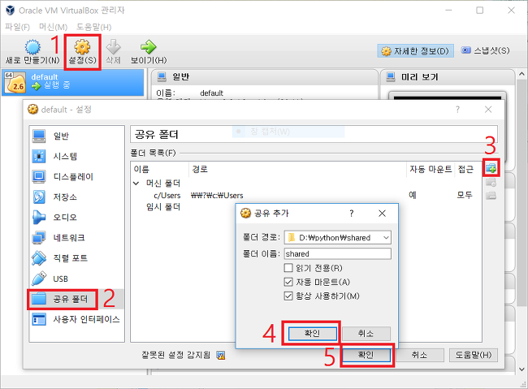
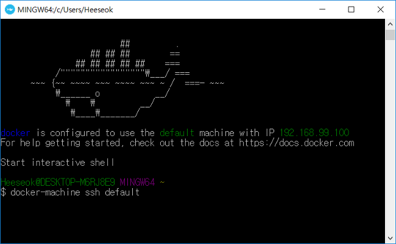
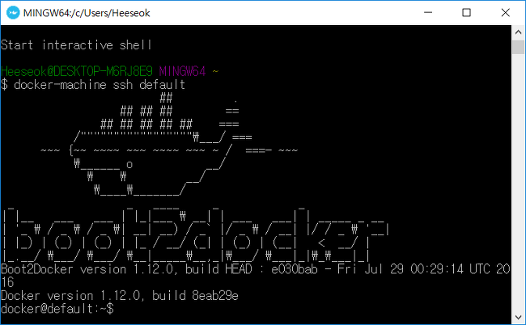
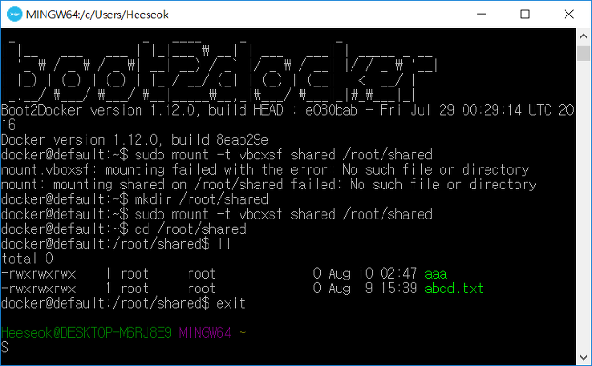
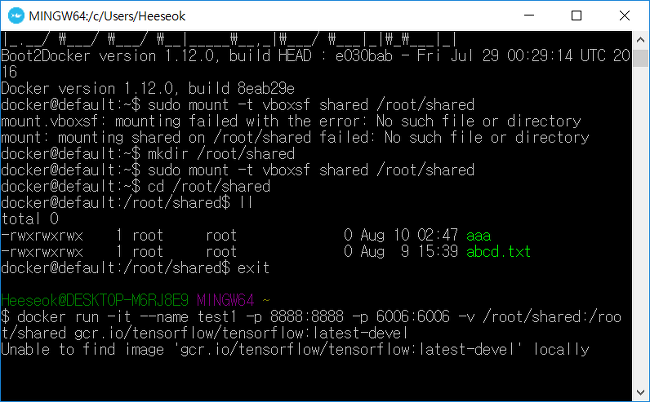
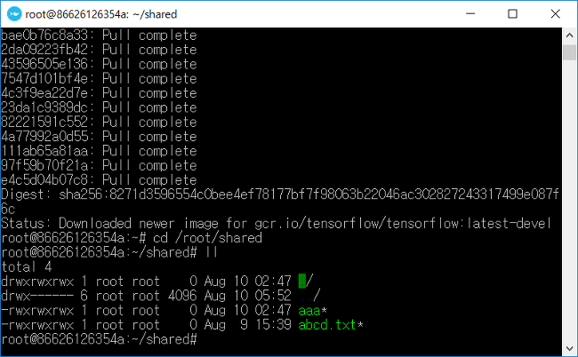

# Windows Docker Toolbox에서 Host PC의 폴더 공유

`예제`

``` bash
$ docker run -it --name ubuntu -v /c/Users/username/shared:/home/shared:z ubuntu:20.04
```

위 처럼 하면 되는데 내가 원하는것은 내가 지정한 directory 를 docker  OS 와 공유하는것 이므로 다음과 같이 수정 하여 작업을 진행 하였다.

- Oracle VM VirtualBox 관리자 에서 default image 를 선택 한 다음 `공유 폴더` 를 선택 한다.
- Popup 창이 나오면 우측 에 `+` 아이콘을 눌러 공유를 추가 한다.
  - 폴더 경로 : C:\Warehouse\Docker
  - 폴더 이름 : DockerShared
  - 자동 마운트 check
  - 마운트 지점 : DockerHost
  - 항상 사용하기 check
- 위처럼 설정 하면 `C:\Warehouse\Docker` 경로를 `DockerShared` 이름 으로 공유 한다고 설정한것임.


### Docker Quick Start 에서 확인 (안됨 추가 작업 필요)

#### 1. Docker 실행 및 mount

``` bash
docker run -itd --name ubuntu -v /DockerShared:/home/shared ubuntu:20.04
```

#### 2. 확인

``` bash
$ docker exec -it ubuntu /bin/bash

root@d7b72fbbc678:/# cd /home/shared
root@d7b72fbbc678:/home/shared# echo "docker test message" > aaa.txt
```

`C:\Warehouse\Docker` 에 aaa.txt 파일이 있는지 확인 하고 docker 에서 기록한 내용이 들어 있는지 확인 한다.

#### 3. 결론

파일 생성, 수정, 삭제, 폴더(directory) 생성 삭제 잘됨.


---

## Windows Docker Toolbox에서 Host PC와 폴더 공유하기

출처: https://bryan7.tistory.com/797

Windows Docker Toolbox에서 Host PC와 폴더 공유하는 것을 해결은 했는데, 생각보다 꾀 복잡하군요. 

Docker for Windows 에서는 Settings 메뉴에서 Shared Drives 항목에서 공유하고자 하는 Drive를 체크만 해주고 Docker run 시킬때 -v 옵션으로 폴더 경로만 지정해 주면 되었는데...

Windows용의 Docker Toolbox에서는 default VM에서 공유 폴더 설정을 해 주고, 다시 default VM으로 들어가서 마운트 해 주고, Docker Image를 Container로 띄울 때 마운트 해 준 경로 이름으로 -v 옵션을 줘야 폴더 공유가 됩니다. 이것 때문에 반나절 이상 삽질을... ㅠㅠ 


하는 방법을 간단히 공유하면...

Docker Toolbox 쓰면 VirtualBox 가 기본으로 설치되면서 default 라는 VM 이 자동으로 생깁니다.

VirtualBox에서 설정 버튼을 눌러서 **공유폴더** 설정해주고, default VM에 ssh에 접속해서 설정한 공유폴더의 이름으로 mount 해줍니다.

``` bash
$ docker-machine ssh default

docker@default:~$ sudo mount -t vboxsf shared /root/shared
```

이렇게 하면 default VM과 Windows Host PC 간에 서로 폴더 공유가 되어야 하므로 잘 되는지 체크. (그래야 나중에 Docker Image에서도 폴더 공유가 됨.)

그 mount 해준 경로 이름으로 docker run 시킬 때 -v 옵션 줘야 공유가 됩니다.

그래서 결국 아래와 같이 Host PC가 Windows 임에도 불구하고 -v 옵션 줄때 Host 경로가 default VM에서 mount 해준 경로로 들어갑니다.

``` bash
$ docker run -it --name {CONTAINER_이름} -p 8888:8888 -p 6006:6006 -v /root/shared:/root/shared gcr.io/tensorflow/tensorflow:latest-devel
```






``` sh
docker-machine ssh default
```







``` bash
$ mkdir /root/shared
$ sudo mount -t vboxsf shared /root/shared
$ cd /root/shared
$ ll
```




``` bash
docker run -itd --name ubuntu -v /root/shared:/home/wonsool/shared ubuntu_django
```





Host PC를 재부팅하거나 default VM을 재부팅하는 경우 docker-machine ssh default 로 들어가서 다시 mount 를 해줘야 합니다.


이것을 자동으로 해주기 위해서는

``` sh
$ docker-machine ssh default

docker@default:~$ cd /var/lib/boot2docker/

docker@default:/mnt/sda1/var/lib/boot2docker$ sudo vi bootlocal.sh
```

파일 내용을 다음과 같이 입력합니다.

``` bash
#!/bin/sh

mkdir /root/shared

mount -t vboxsf shared /root/shared

docker@default:/mnt/sda1/var/lib/boot2docker$ sudo chmod +x bootlocal.sh
```

default VM이 재부팅되면 파일 내용이 초기화 되는데, 위 경로에 넣어야지만 초기화가 안되고 보존됩니다.  재부팅되면 /root/shared 디렉터리도 사라지기 때문에 mkdir 로 폴더를 만들어줘야 합니다. 

exit 로 default VM 에서 나오고, Oracle VM VirtualBox에서 default VM을 종료한 후에 Docker Quickstart Terminal을 다시 실행해줘야지 적용됩니다.

다음과 같이 Docker Terminal 창에서 종료했다가 다시 시작해줘도 됩니다.

``` bash
$ docker-machine stop

$ docker-machine start
```


[참고] http://stackoverflow.com/questions/26639968/boot2docker-startup-script-to-mount-local-shared-folder-with-host

```shell
/var/lib/boot2docker/bootlocal.sh` fits your need probably, it will be run by initial script `/opt/bootscripts.sh
```

And `bootscripts.sh` will also put the output into the `/var/log/bootlocal.log`, see segment below (boot2docker 1.3.1 version)

```shell
# Allow local HD customisation
if [ -e /var/lib/boot2docker/bootlocal.sh ]; then
   /var/lib/boot2docker/bootlocal.sh > /var/log/bootlocal.log 2>&1 &
fi 
```

