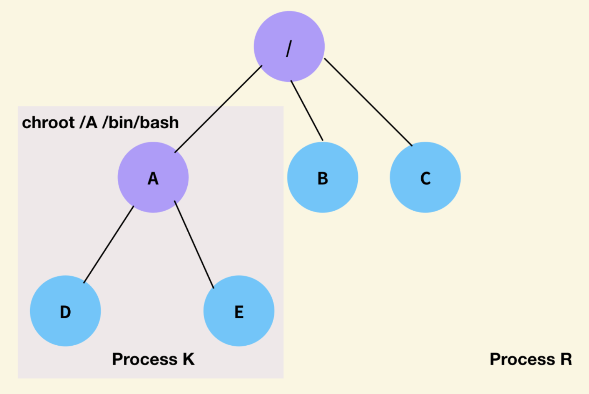
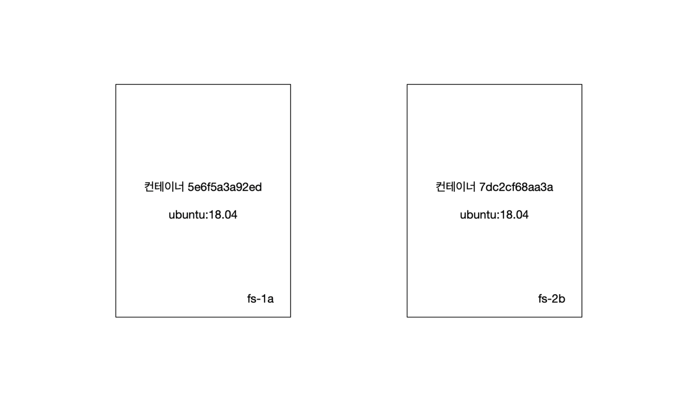
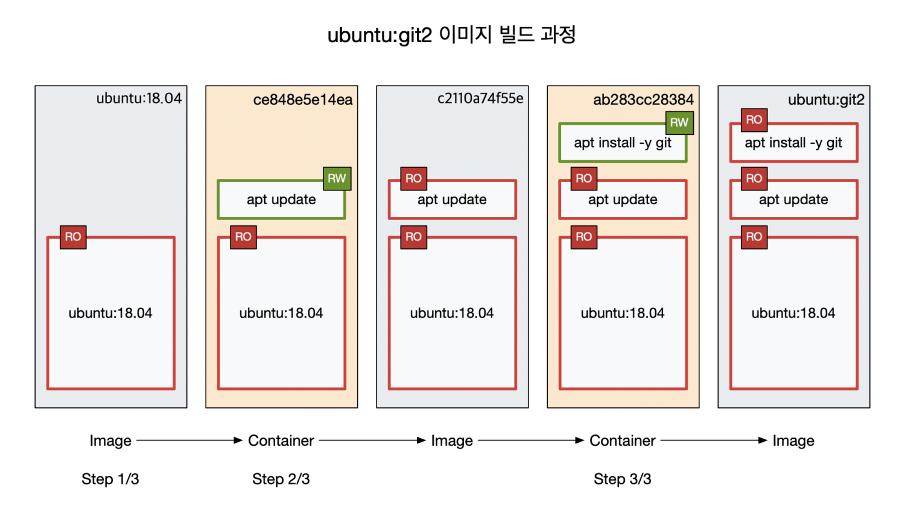
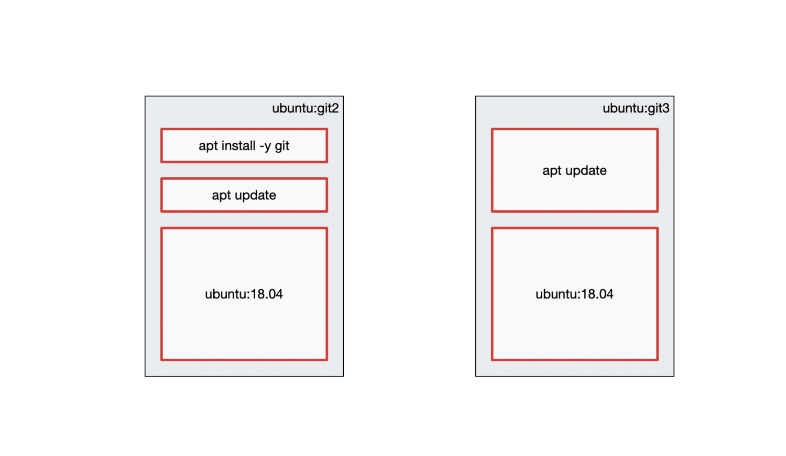
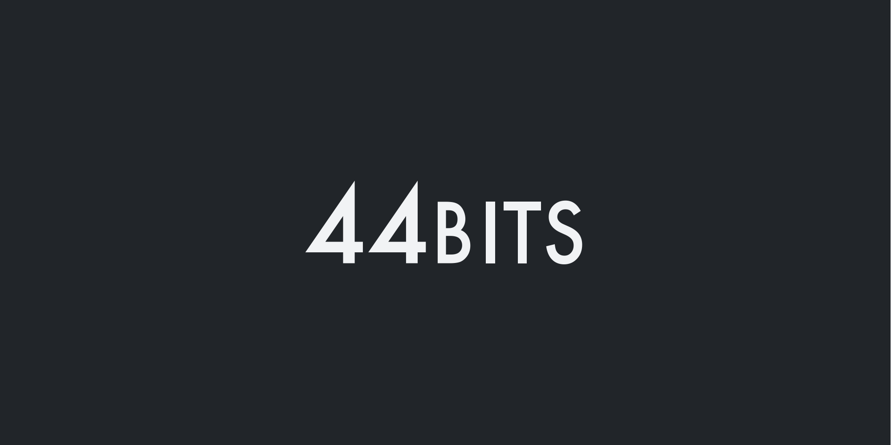

# 도커 이미지 빌드와 Dockerfile 기초

출처: https://www.44bits.io/ko/post/building-docker-image-basic-commit-diff-and-dockerfile

commit, diff 그리고 Dockerfile

- [들어가며](https://www.44bits.io/ko/post/building-docker-image-basic-commit-diff-and-dockerfile#들어가며)
- [도커 이미지(Docker image) 기초](https://www.44bits.io/ko/post/building-docker-image-basic-commit-diff-and-dockerfile#도커-이미지docker-image-기초)
- [도커에서 제공하는 베이스 이미지](https://www.44bits.io/ko/post/building-docker-image-basic-commit-diff-and-dockerfile#도커에서-제공하는-베이스-이미지)
- [컨테이너의 이해: 컨테이너마다 고유의 공간을 가진다](https://www.44bits.io/ko/post/building-docker-image-basic-commit-diff-and-dockerfile#컨테이너의-이해-컨테이너마다-고유의-공간을-가진다)
- [docker commit 명령어로 이미지 만들기](https://www.44bits.io/ko/post/building-docker-image-basic-commit-diff-and-dockerfile#docker-commit-명령어로-이미지-만들기)
- [Dockerfile: FROM / RUN](https://www.44bits.io/ko/post/building-docker-image-basic-commit-diff-and-dockerfile#dockerfile-from-run)
- [도커 이미지의 레이어 이해하기](https://www.44bits.io/ko/post/building-docker-image-basic-commit-diff-and-dockerfile#도커-이미지의-레이어-이해하기)
- [퀴즈 풀이](https://www.44bits.io/ko/post/building-docker-image-basic-commit-diff-and-dockerfile#퀴즈-풀이)


## 들어가며

도커Docker에서 **이미지**(image)는 컨테이너(container)와 함께 가장 중요한 개념입니다. 모든 컨테이너는 이미지를 바탕으로 실행되며, 이 때 이미지는 컨테이너가 실행되는 파일 시스템입니다. 도커에서는 다양한 베이스 이미지와 애플리케이션 이미지를 제공할뿐만 아니라, 사용자는 이러한 이미지를 기반으로 해서 새로운 커스텀 이미지를 만들 수 있습니다. 이 커스텀 이미지로 미리 특정 애플리케이션이 실행가능한 프로비저닝(Provisioning)된 환경을 구축하고, 언제 어디서나 컨테이너로 실행하는 것이 가능합니다. 이 글에서는 도커 이미지의 기본적인 원리에 대해서 알아보고자 합니다.

먼저, 도커 기초에 대해서는 다음 글을 참고해주세요.

- [도커(Docker) 입문편: 컨테이너 기초부터 서버 배포까지 | 44BITS](https://www.44bits.io/ko/post/easy-deploy-with-docker)

이 글의 내용은 도커 입문편에서 다룬 내용을 기반으로 합니다. 도커 입문편에도 `commit` 명령어와 `Dockerfile로` 도커 이미지를 빌드해보는 내용을 포함하고 있습니다. 이번에는 도커 이미지에 포커스를 맞춰서 설명을 해보겠습니다.


## 도커 이미지(Docker image) 기초

VMWare나 버추얼 박스VirtualBox와 같은 가상 머신을 사용해보았다면 가상 머신 이미지에 익숙할 것입니다. 사용자는 가상 머신의 특정 상태를 그대로 저장해두고, 이를 나중에 다시 복원하는 것이 가능합니다. 가상머신의 이미지는 일반적으로 매우 큰 편이며, 파일 시스템을 비롯해 이미지를 만드는 시점의 메모리 내용과 그 외에 시스템을 구성하기 위한 다양한 정보들을 포함하고 있습니다. 도커 이미지는 이러한 가상머신 이미지와는 약간 차이가 있습니다. 도커의 이미지는 그냥 순수한 파일들의 집합입니다. 메모리 정보나 그 이외의 독자적인 형식으로 저장해둔 시스템의 정보 같은 것은 없습니다. 파일이 아닌 것이 있다면, 이미지에 대한 메타데이터 정도가 있을 뿐입니다.

LXC나 systemd-nspwn과 같은 초기 컨테이너 도구들은 초기에 **chroot on steroids**라는 별명으로 불리곤 했습니다. 한국어로 번역하자면 “스테로이드 맞은 chroot” 정도가 되겠죠. 컨테이너에서 가장 핵심적인 역할을 하는 기능이 바로 chroot와 같이 프로세스가 바라보는 루트 디렉터리를 바꾸는 기능입니다. 일반적으로 리눅스 시스템에서 모든 프로세스는 같은 루트를 공유합니다. 그런데 chroot를 사용하면 실제 루트가 아닌 다른 디렉터리를 루트로 바라보는 프로세스를 실행하는 것이 가능합니다. chroot만 가지고도 그럴싸한 초보적인 단계의 컨테이너를 만들어보는 게 가능합니다.

chroot로 실행한 프로세스 K: /A를 새로운 루트로 사용한다

실제로 chroot를 어떻게 사용하는지 궁금하시다면 다음 글을 참고해주세요.

- [컨테이너 기초 - chroot를 사용한 프로세스의 루트 디렉터리 격리 | 44BITS](https://www.44bits.io/ko/post/change-root-directory-by-using-chroot)

여기서 이야기할 주제가 chroot는 아닙니다만, 이미지를 이해하기 위해서는 **루트를 바꾼다**는 개념을 기억할 필요가 있습니다. 거칠게 말해서 이미지는 컨테이너가 바라보는 새로운 루트 디렉터리라고 할 수 있습니다.

리눅스에는 굉장히 흥미로운 특징이 있습니다. 예를 들어 우분투 배포판 위에 아마존 리눅스Amazon Linux 배포판의 파일을 준비하고, chroot로 프로세스의 루트를 아마존 리눅스 배포판 디렉터리로 지정하면, 해당 프로세스는 마치 아마존 리눅스의 프로세스처럼 동작합니다. 다른 리눅스 배포판의 파일들을 준비해도 마찬가지입니다. 따라서 각 배포판의 파일들만 준비한다면 하나의 시스템에서 마치 서로 다른 배포판을 사용하는 것과 같이 프로세스를 실행하는 것이 가능합니다. 단순히 chroot만으로는 사실 완벽하게 동작하지 않지만, 도커와 같이 더 다양한 프로세스 격리 기술이 사용되는 컨테이너 런타임을 사용하면 컨테이너는 거의 완벽히 다른 배포판으로 동작합니다.

```shell
$ uname -a
Linux ubuntu-bionic 4.15.0-99-generic #100-Ubuntu SMP Wed Apr 22 20:32:56 UTC 2020 x86_64 x86_64 x86_64 GNU/Lin
$ cat /etc/*-release | tail -n 1
UBUNTU_CODENAME=bionic

$ docker run -it amazonlinux bash
420a6503505# uname -a
Linux 3f46d4ca84c1 4.15.0-99-generic #100-Ubuntu SMP Wed Apr 22 20:32:56 UTC 2020 x86_64 x86_64 x86_64 GNU/Linux
420a6503505# cat /etc/*-release | tail -n 1
Amazon Linux release 2 (Karoo)
```

컨테이너의 특별한 점은 호스트의 루트가 아닌 별도로 준비된 배포판의 파일들을 담은 이미지를 루트 디렉터리로 사용한다는 점입니다. 하지만 실행이 되는 동안 호스트 시스템의 리눅스 커널은 그대로 공유합니다.


## 도커에서 제공하는 베이스 이미지

도커를 사용한다면 이미 리눅스의 배포판이라는 개념에 친숙할 것입니다. 리눅스 커널을 사용하는 다양한 리눅스 배포판들이 있습니다. 범용 배포판으로는 우분투Ubuntu, 데비안Debian, 레드햇Red Hat, 오픈수세openSUSE, 젠투Gentoo, 아치Arch, 아마존 리눅스Amazon Linux 등이 있으며 도커에서 경량 환경으로 애용되는 알파인Alpine도 있습니다. 최근에는 애플 M1 칩에서 동작하기 위한 [아사히 리눅스Asahi Linux](https://github.com/AsahiLinux) 프로젝트도 개발되고 있습니다.

정말 제로에서 도커 이미지를 만드는 방법도 있습니다만, 사용자들은 일반적으로는 이러한 리눅스 배포판 이미지를 베이스 이미지로 삼아 커스텀 이미지를 만듭니다. 진짜 제로부터 이미지를 만드는 게 궁금하다면 다음 글을 참고해주세요.

- [컨테이너 기초 - 정적 링크 프로그램을 chroot와 도커(Docker) scratch 이미지로 실행하기 | 44BITS](https://www.44bits.io/ko/post/static-compile-program-on-chroot-and-docker-scratch-image)

도커에서 제공하는 리눅스 배포판 이미지들은 도커 허브에서 확인할 수 있습니다.

- [도커(Docker) 공식 리눅스 배포판 이미지 목록](https://hub.docker.com/search?q=&type=image&category=os&image_filter=official)

배포판 이미지는 버전 별로 준비되어있습니다. 실제로는 더 많은 빌드 시점별로 더 다양한 이미지들이 있습니다만, [우분투 이미지](https://hub.docker.com/_/ubuntu)의 경우 이미지 페이지에 다음과 같은 대표 이미지 태그를 소개하고 있습니다.

- 18.04, bionic-20201119, bionic
- 20.04, focal-20201106, focal, latest
- 20.10, groovy-20201125.2, groovy, rolling
- 21.04, hirsute-20201119, hirsute, devel
- 14.04, trusty-20191217, trusty
- 16.04, xenial-20201030, xenial

이미지의 풀 네임은 이미지 이름과 태그 이름으로 조합됩니다. `ubuntu:18.04`를 지정하면 18.04 버전을 사용할 수 있고, `ubuntu:21.04`를 지정하면 2021년 1월 현재 최신 버전인 21.04를 사용하는 것도 가능합니다.***** 실제로 `ubuntu:18.04`와 `ubuntu:21.04`는 태그가 다를 뿐만 아니라 완전히 다른 이미지라고 생각해도 무방합니다. 이 이미지들은 각 우분투 배포판 버전의 파일들로 구성된 서로 다른 이미지입니다.

***** `bionic`은 18.04의 코드명이고, `hirsute`는 21.04의 코드명입니다.

이러한 배포판 이미지들이 일반적으로 커스텀 이미지를 만들 때 기반이 되어줍니다. 그럼 바로 커스텀 이미지를 만들어보겠습니다.

## 컨테이너의 이해: 컨테이너마다 고유의 공간을 가진다

여기서 만들어볼 이미지는 `git`이 설치된 `ubuntu:18.04` 이미지입니다. 사용자용으로 우분투 배포판을 설치하는 경우 미리 다양한 애플리케이션이 설치되어있습니다만, 도커에서 제공하는 배포판 이미지들의 경우 컨테이너로 사용하기 위해 최소화된 이미지를 사용합니다. `ubuntu:18.04` 이미지는 용량이 고작 63.3MB밖에 되지 않습니다.

```bash
$ docker pull ubuntu:18.04
18.04: Pulling from library/ubuntu
f22ccc0b8772: Pull complete
3cf8fb62ba5f: Pull complete
e80c964ece6a: Pull complete
Digest: sha256:fd25e706f3dea2a5ff705dbc3353cf37f08307798f3e360a13e9385840f73fb3
Status: Downloaded newer image for ubuntu:18.04
docker.io/library/ubuntu:18.04

$ docker images | grep 18.04
ubuntu              18.04                 2c047404e52d        6 weeks ago         63.3MB
```

이 이미지에는 `git`과 같은 애플리케이션이 기본적으로 설치되어있지 않습니다.

```bash
$ docker run -it ubuntu:18.04 git --version
docker: Error response from daemon: OCI runtime create failed: container_linux.go:349: starting container process caused "exec: \"git\": executable file not found in $PATH": unknown.
ERRO[0000] error waiting for container: context canceled
```

먼저 셸 명령어로 컨테이너를 실행하는 기법을 사용해 `git`을 설치해보도록 하겠습니다(컨테이너 5e6f5a3a92ed).

```bash
$ docker run -it ubuntu:18.04 bash
5e6f5a3a92ed# apt update
5e6f5a3a92ed# apt install -y git
5e6f5a3a92ed# git --version
git version 2.17.1
```

`git`이 잘 설치된 것을 확인할 수 있습니다. 하지만 컨테이너는 독립적인 파일 시스템을 가지기 때문에 bash 셸을 종료하고 다시 컨테이너(7dc2cf68aa3a)를 실행해보면 `git`은 존재하지 않습니다.

```bash
$ docker run -it ubuntu:18.04 bash
7dc2cf68aa3a# git --version
bash: git: command not found
```

여기서 주목할 부분은 이미지는 고정되어있다는 점입니다. 컨테이너 안에서 원래 이미지의 파일을 삭제하더라도, 다시 해당 이미지로 컨테이너를 실행하면 삭제한 파일들은 그대로 남아있습니다. 컨테이너 입장에서 이미지의 내용을 직접 바꿀 수 있는 방법은 없습니다.*****

***** 정말로 이미지의 내용을 변경할 수 없는 것은 아닙니다. 단, 이미지의 내용을 변경하는 것은 정상적이지 않은 방법이기 때문에 여기서는 이미지의 내용을 바꿀 수 없다고 하고 이야기를 이어가겠습니다.

자 그럼 앞서 만든 2개의 컨테이너를 생각해보겠습니다. 5e6f5a3a92ed에서는 `git`이 실행되지만, 7dc2cf68aa3a에서는 `git`이 실행되지 않습니다. 이는 컨테이너, 즉 bash 셸이 서로 다른 환경(파일 시스템)에서 실행되고 있기 때문입니다. 도커에서는 컨테이너를 이미지 기반으로 실행합니다. 하지만 이 말이 이미지 위에서 컨테이너를 실행한다는 의미는 아닙니다.

2개의 컨테이너, 그리고 2개의 컨테이너용 파일 공간

먼저 `ubuntu:18.04` 이미지에는 `git`이 설치되어있지 않습니다. 이제 `docker run` 명령을 사용해 `ubuntu:18.04` 이미지로 컨테이너를 실행시키면 도커는 `ubuntu:18.04` 이미지의 파일들을 기반으로 이 컨테이너(5e6f5a3a92ed) 전용의 파일 시스템을 준비합니다. 이를 fs-1a라고 해보겠습니다. 컨테이너는 이 공간을 루트로 사용해서 실행됩니다. 프로세스에서는 이 공간의 파일을 변경하는 것이 가능합니다. 즉, 위에서 실행한 `apt update`나 `apt install git` 명령어는 fs-a라는 공간의 파일들을 변경하는 작업들을 수행합니다.*****

***** 아직 이해가 어렵다면 `ubuntu:18.04` 이미지의 모든 파일을 fs-1a에 복사한 다음 컨테이너를 실행한다고 이해해도 무방합니다. 이에 대한 정확한 이해를 위해서는 유니온 마운트를 이해해야합니다. 이 부분에 좀 더 관심이 있다면 다음 글을 참고해주세요: [만들면서 이해하는 도커(Docker) 이미지: 도커 이미지 빌드 원리와 OverlayFS](https://www.44bits.io/ko/post/how-docker-image-work)

다시 새로운 컨테이너를 실행해봅니다. 이번에도 `ubuntu:18.04` 이미지를 기반으로 컨테이너가 실행됩니다. 하지만 이번에도 이미지에서 컨테이너가 바로 실행되는 게 아니라, 이 이미지의 파일들을 기반으로 컨테이너(7dc2cf68aa3a) 전용 파일 시스템을 준비합니다. 이를 fs-b라고 해보겠습니다. 이 공간에는 아직 아무런 명령어도 실행한 적이 없습니다. 따라서 fs-1a와 달리 fs-2b에는 git과 관련된 파일들이 존재하지 않고, 여기에서 `git`을 실행하면 당연히 실행되지 않습니다.

## docker commit 명령어로 이미지 만들기

더 정확하게 알아보기 위해서 다시 한 번 컨테이너를 실행하고서 어떤 변경이 일어나는지 추적해보도록 하겠습니다.

```bash
$ docker run -it ubuntu:18.04 bash
877c9dd67d76# 
```

세 번째 컨테이너(877c9dd67d76)도 역시 `ubuntu:18.04`를 기반으로 고유의 공간을 부여 받습니다. 이를 fs-3c라고 부르겠습니다. 도커에서는 컨테이너의 기반이 되는 이미지와 컨테이너 고유의 공간(여기서는 fs-3c) 사이의 차이를 비교하는 기능을 제공합니다. 컨테이너의 bash 셸은 그대로 놔두고 창을 하나 더 띄워서, `diff` 서브 커맨드를 사용해봅니다.

```bash
$ docker diff 877c9dd67d76
```

아무것도 출력되지 않는다면, 정상입니다. `ubuntu:18.04` 이미지와 fs-3c 사이에는 아무것도 달라진 것이 없기 때문입니다. 이번에는 `hello`와 `world`라는 파일을 추가해보겠습니다. 컨테이너 셸에서 다음 명령어들을 실행해봅니다.

```bash
877c9dd67d76# touch hello world
877c9dd67d76# ls
bin  boot  dev  etc  hello  home  lib  lib64  media  mnt  opt  proc  root  run  sbin  srv  sys  tmp  usr  var  world
```

루트 디렉터리에 `hello`와 `world` 파일이 추가된 것을 확인할 수 있습니다. 다시 다른 창으로 가서 `diff`를 실행해봅니다.

```bash
$ docker diff 877c9dd67d76
A /world
A /hello
```

출력 결과가 조금 달라졌습니다. 여기서 A는 파일이 추가되었다는 것을 의미합니다. 즉, `/hello`와 `/world` 파일이 추가된 것을 알 수 있습니다.

이게 바로 커스텀 이미지를 만드는 가장 기본이 되는 원리입니다. 이미지의 내용은 달라지지 않습니다. 새로 만들어진 컨테이너용 공간 fs-1a, fs-2b, fs-3c의 내용만이 달라질 뿐입니다. fs-3c에는 `/hello`와 `/world` 파일이 추가되었고, 이 fs-3c의 내용을 저장해 새로운 커스텀 이미지를 만들 수 있습니다. 이 때 사용하는 컨테이너의 파일 공간을 이미지로 저장하는 명령어가 바로 `commit`입니다. 그럼 실제로 새로운 `ubuntu:hello-world` 이미지를 만들어보겠습니다.

```bash
$ docker commit 877c9dd67d76 ubuntu:hello-world
```

첫 번째 인자는 컨테이너 ID를 지정해주고, 두 번째 인자에는 새로운 이미지 이름을 지정합니다.

```bash
$ docker images | grep hello-world
ubuntu              hello-world           273cd0702dc8        31 seconds ago      63.3MB
```

`ubuntu:hello-world` 이미지가 만들어진 것을 확인할 수 있습니다.

이번에는 `ubuntu:hello-world` 이미지로 컨테이너를 실행해보겠습니다.

```bash
$ docker run -it ubuntu:hello-world
adbcf3be3d09# ls
bin  boot  dev  etc  hello  home  lib  lib64  media  mnt  opt  proc  root  run  sbin  srv  sys  tmp  usr  var  world
```

`/hello`와 `/world` 파일이 존재하는 것을 확인할 수 있습니다. 그런 이 컨테이너의 `diff`는 어떻게 출력될까요?

```bash
$ docker diff adbcf3be3d09
```

아무것도 출력되지 않습니다! 앞에서 이야기한대로 이야기를 재구성해본다면, 새로 만든 adbcf3be3d09 컨테이너는 `ubuntu:hello-world` 이미지의 내용을 기반으로한 fs-4d 공간에서 실행되었습니다. fs-4d 공간에는 처음부터 `/hello`와 `/world` 파일이 존재했기 때문에 `diff`는 아무것도 출력하지 않습니다. `diff`는 컨테이너의 기반이 된 이미지(`ubuntu:hello-world`)와 현재 컨테이너의 파일 공간 fs-4d와의 차이를 보여주기 때문입니다.

자, 그럼 이제 다시 `git`으로 돌아가보겠습니다. 그럼 다시 처음부터, `ubuntu:18.04` 이미지를 기반으로 새로운 컨테이너를 만들어봅니다.

```bash
$ docker run -it ubuntu:18.04 bash
5414b8a0279f#
```

새로운 컨테이너(5414b8a0279f)의 파일 공간을 fs-5e라고 부르겠습니다. 여기서 `apt update`를 실행하고, `docker diff`를 실행해봅니다.

```bash
$ docker diff 5414b8a0279f
C /var
C /var/lib
C /var/lib/apt
C /var/lib/apt/lists
....
A /var/lib/apt/lists/archive.ubuntu.com_ubuntu_dists_bionic-updates_restricted_binary-amd64_Packages.lz4
```

약 20여개의 목록이 출력됩니다. 여기서 A는 앞서 설명했듯이 파일이 추가됐다는 의미입니다. 새롭게 C가 보이는데 C는 원래 존재하던 파일이 변경되었다는 의미입니다. 즉, `ubuntu:18.04`와 `fs-5e` 사이에는 20여개 파일이 추가되거나 변경되었다는 의미입니다. 커스텀 이미지를 만드는 과정은 이런 식으로 컨테이너의 파일 시스템을 변경해나가는 과정입니다. 어떤 명령어를 실행하면 파일 공간에 변화를 일으킵니다. `apt`와 같은 패키지 매니저는 파일 공간에 큰 변화를 일으키는 대표적인 도구입니다.

그럼 이번에는 `apt install -y git` 명령어로 git을 설치해봅니다.

```bash
5414b8a0279f# apt install -y git
5414b8a0279f# git --version
git version 2.17.1
```

git이 정상적으로 설치된 것을 확인할 수 있습니다. 다시 `diff`를 실행해봅니다.

```bash
$ docker diff 5414b8a0279f | wc -l
3522
```

git이 설치되는 과정에서 약 3522개의 파일이 변경되거나 추가된 것을 확인할 수 있습니다. 이제 5414b8a0279f 컨테이너의 파일공간 fs-5e를 이미지로 저장해서 `git`이 설치된 우분투 18.04 이미지를 만들 수 있습니다.

```bash
$ docker commit 5414b8a0279f ubuntu:git
```

이걸로 두 번째 커스텀 이미지까지 만들어보았습니다. 이제 이 이미지로 컨테이너를 실행하면 바로 `git`을 실행할 수 있습니다.

```bash
$ docker run -it ubuntu:git bash
2ca6f422483e# git --version
git version 2.17.1
```

하지만 여전히 `ubuntu:18.04`에는 `git`이 없습니다. 지겨울 수도 있지만, 다시 한 번 확인해보도록 하겠습니다.

```bash
$ docker run -it ubuntu:18.04 bash
ba110882d5ce# git
bash: git: command not found
```

자, 그럼 아래 퀴즈도 한 번 풀어보시기 바랍니다.

- **퀴즈1:** `ubuntu:18.04`에는 `tree`와 `wget`이 설치되어있지 않습니다. `tree`와 `wget`이 설치된 도커 이미지를 만들어보세요.
- **퀴즈2:** `ubuntu:18.04` 대신 `centos:8`을 기반으로 `git`이 설치된 이미지를 만들어보세요. CentOS의 패키지 매니저는 `yum`입니다.

## Dockerfile: FROM / RUN

**하지만** 도커를 사용할 때 이렇게 이미지를 만드는 경우는 매우 드뭅니다. 대부분의 경우 커스텀 이미지는 Dockerfile을 사용해서 작성합니다. Dockerfile은 도커 이미지 생성을 위한 DSL입니다. DSL이라고 겁먹을 필요는 없습니다. Dockerfile에서 사용할 수 있는 20개 남짓한 키워드들이 있습니다만, 딱 2개만 알면 커스텀 이미지를 만드는 게 가능합니다.

바로 FROM과 RUN입니다. 먼저 FROM은 이렇게 사용합니다.

```bash
FROM <IMAGE_NAME>
```

`FROM`은 항상 `Dockerfile`의 맨 첫줄에 옵니다. `IMAGE_NAME`에는 커스텀 이미지의 기반이 되는 이미지 이름을 지정해줍니다. 끝입니다. 간단하죠?

두번째는 `RUN`입니다. `RUN`은 명령어를 실행하는 키워드입니다. 다음과 같이 사용합니다.

```bash
RUN <COMMAND>
```

간단하죠?

그럼 우리가 앞서 `ubuntu:git` 이미지를 생성했던 과정을 다시 정리해보겠습니다. 먼저 `ubuntu:18.04` 이미지로 bash 셸을 실행하고, `apt update`, `apt install -y git` 명령어를 차례로 실행했습니다. 이 내용을 Dockerfile을 다시 작성하면 다음과 같습니다.

```bash
FROM ubuntu:18.04
RUN apt update
RUN apt install -y git
```

깜짝 놀랄만큼 간단합니다. 마치 우리가 리눅스에 접속해서 명령어를 한 줄 한 줄 입력해서 프로비저닝을 하듯이, 도커 파일에 필요한 명령어들을 RUN과 함께 쭉 써주기만 하면 됩니다. 빈 디렉터리에 이 Dockerfile을 만들고, Dockerfile로 커스텀 이미지를 빌드해보겠습니다.

```bash
$ ls
Dockerfile
$ docker build -t ubuntu:git2 .
```

여기서 `-t`는 이미지 이름을 지정하는 옵션입니다. 마지막에 `.`은 빌드 컨텍스트를 의미하는데, 여기서는 설명하지 않고 넘어가겠습니다. 특별한 이유가 없다면 도커 빌드는 `Dockerfile`이 있는 디렉터리에서 실행하며 마지막 인자로는 현재 디렉터리를 의미하는 `.`을 넘겨줍니다.

```bash
$ docker build -t ubuntu:git2 .
Sending build context to Docker daemon  2.048kB
Step 1/3 : FROM ubuntu:18.04
 ---> 2c047404e52d
Step 2/3 : RUN apt update
 ---> Running in ce848e5e14ea
...
Removing intermediate container 48b27207c998
 ---> 5c6d001d54a5
Successfully built 5c6d001d54a5
Successfully tagged ubuntu:git2
```

빌드가 정상적으로 진행되었습니다. 이제 `ubuntu:git2`라는 이미지를 사용해볼 수 있습니다.

```bash
$ docker run -it ubuntu:git2 bash
3b541525465f# git --version
git version 2.17.1
```

`ubuntu:git2` 커스텀 이미지에도 `git` 2.17.1 버전이 잘 설치된 것을 확인할 수 있습니다!

여기서 주의할 점은 `Dockerfile`을 기반으로 이미지 빌드를 하는 동안 키보드 입력이 불가능하다는 점입니다. `apt install -y git` 대신 `apt install git`을 실행하면 중간에 정말로 설치할 건지 확인하는 과정이 있습니다. 이 때 키보드 `y`를 입력해야 설치가 진행되는데, 도커 빌드 과정에서는 입력이 불가능합니다. 따라서 반드시 `-y` 옵션을 빼먹지 않아야합니다. 다른 명령어를 실행할 때도 인터렉티브한 입력이 필요한 경우 진행이 불가능하기 때문에, 인터렉티브하게 입력을 받지 않도록 하는 옵션을 찾아야합니다.

여기서는 딱 `FROM`과 `RUN` 만을 소개했습니다만, 사실 이 두 개면 거의 모든 커스텀 이미지를 만드는 것이 가능합니다. 이외에도 자주 쓰이는 키워드들이 있습니다만, `Dockerfile`을 만들기 전에 어떤 명령어를 실행해서 프로비저닝을 할 것인지를 고민하는 것이 먼저입니다. 따라서 무작정 `Dockerfile`부터 만들기보다는 베이스 이미지로 셸을 실행하고 프로비저닝 과정을 먼저 진행해보는 것을 추천합니다. 원하는대로 프로비저닝이 이루어지는 것을 확인한 다음에는 RUN만 가지고도 충분히 Dockerfile을 작성하는 것이 가능합니다.

자 그럼 간단히 Dockerfile들을 몇 개 더 만들어보겠습니다. 이번에는 이번에는 앞의 퀴즈들을 `Dockerfile`로 만들어보시기 바랍니다.

- **퀴즈3:** `ubuntu:18.04`에는 `tree`와 `wget`이 설치되어있지 않습니다. `tree`와 `wget`이 설치된 이미지를 만드는 Dockerfile을 작성해보세요.
- **퀴즈4:** `ubuntu:18.04` 대신 `centos:8`을 기반으로 `git`이 설치된 이미지를 만드는 `Dockerfile`을 작성해보세요.

## 도커 이미지의 레이어 이해하기

처음에 `commit`으로 만들었던 `ubuntu:git`과 `Dockerfile`로 만든 `ubuntu:git2`에는 사실 조금 차이가 있습니다. 다시 한 번 `Dockerfile`을 살펴보겠습니다. 편의상 이 `Dockerfile`을 FileX이라고 부르겠습니다.

```bash
FROM ubuntu:18.04
RUN apt update
RUN apt install -y git
```

`RUN`이 두 번 사용된 것을 알 수 있습니다. 앞서 커밋으로 이미지를 만들었던 것과 같은 `Dockerfile`은 사실 `RUN`을 한 번만 사용해야합니다. 아래와 같이 말이죠.

```bash
FROM ubuntu:18.04
RUN apt update && apt install -y git
```

차이가 이해되시나요? 셸에서 `&&`는 두 개의 명령어를 연결하는 연산자입니다. 즉, `RUN` 하나에 2개의 명령어를 실행하도록 변경했습니다. 이런 기법은 `Dockerfile`에서는 매우 흔하게 사용되는 기법이므로 잘 기억해둘 필요가 있습니다. 이 `Dockerfile`은 FileY라고 부르겠습니다.

FileX, FileY 두 Dockerfile로 빌드한 이미지는 **거의** 같습니다만, 레이어 개수에 차이가 있습니다.

FileX로 도커 빌드가 이루어지는 과정을 좀 더 풀어서 설명해보겠습니다. 먼저 `ubuntu:18.04` 이미지를 베이스로 컨테이너를 하나 생성합니다. 그리고 이 컨테이너에서 `apt update` 명령어를 실행합니다.

```bash
$ docker build -t ubuntu:git2 .
Sending build context to Docker daemon  2.048kB
Step 1/3 : FROM ubuntu:18.04
 ---> 2c047404e52d
Step 2/3 : RUN apt update
 ---> Running in ce848e5e14ea
...
 ---> c2110a74f55e
```

매우 중요한 부분입니다. 여기까지의 출력을 잘봐주세요. 두 번째 스탭으로 `Running in ce848e5e14ea`을 출력하고, `apt-update`를 수행하고 `c2110a74f55e` 메세지를 출력했습니다. 앞의 `Running in ce848e5e14ea`은 명령어가 실행되는 컨테이너 ID입니다. 뒤의 `c2110a74f55e`는 이 내용을 commit해서 만든 이미지 이름입니다. 즉, 도커에서는 커스텀 빌드할 때 `RUN` 한 번에 하나의 이미지를 만듭니다. 원래 이미지와 명령어를 실행된 이후의 파일 시스템 간의 차분을 저장한 것을 레이어라고 부릅니다. 정확히는 기존 이미지에 새로운 레이어를 연결하고, 이를 새로운 이미지로 저장합니다. 단, 이는 빌드 중간 과정에서 생성된 이미지이므로, 따로 이름을 붙이지 않고, 이미지 ID만 보여줍니다.

다음 내용도 이어서 살펴보겠습니다.

```bash
Step 3/3 : RUN apt install -y git
 ---> Running in ab283cc28384
...
Removing intermediate container 48b27207c998
 ---> 5c6d001d54a5
Successfully built 5c6d001d54a5
Successfully tagged ubuntu:git2
```

여기서는 단순 반복이라 어렵지 않게 이해할 수 있습니다. 앞에서 만들었던 `c2110a74f55e` 이미지에서 `(Running in) ab283cc28384` 컨테이너를 실행하고, 여기서 `apt install -y git` 명령어를 실행합니다. 그리고 이 내용을 커밋해서 `5c6d001d54a5` 이미지로 저장합니다. 여기서 이미지 빌드는 끝이 났습니다. 이 이미지에 `ubuntu:git2` 이름을 붙여, 빌드를 마무리합니다.

이번에는 FileY를 빌드해봅니다.

```bash
$ docker build -t ubuntu:git3 .
Sending build context to Docker daemon  2.048kB

Step 1/2 : FROM ubuntu:18.04
 ---> 2c047404e52d
Step 2/2 : RUN apt update && apt install -y git
 ---> Running in 09ddc9d3b67c
...
Removing intermediate container 9e758220651a
 ---> c3e3fa06c798
Successfully built c3e3fa06c798
Successfully tagged ubuntu:git3
```

출력 결과가 좀 더 심플합니다. 이 내용을 해석해보면 commit 한 번으로 이미지를 생성했다는 것을 알 수 있습니다. 이걸로 FileX와 FileY의 차이를 이해하셨으리라고 생각합니다.

앞서 `ubuntu:18.04` 이미지로 여러 번에 걸쳐서 컨테이너를 생성했습니다. 컨테이너들은 fs-1a, fs-2b, fs-3c… 각각 고유한 파일 공간을 가지고 있습니다. 각각의 파일 공간은 `ubuntu:18.04`에서 시작합니다만, 이 내용을 매번 복사하는 것은 아닙니다. 도커는 계층화된 파일 시스템을 구현하는 유니온 마운트 기술을 사용합니다. 따라서 `ubuntu:18.04` 일기 전용 이미지 레이어는 그대로 놔두고 단지 참조만 할 뿐입니다. 컨테이너를 실행할 때마다 텅 비어있는 쓰기 가능한 전용 레이어를 컨테이너에 할당해줍니다. 바로 이 컨테이너 전용 쓰기 레이어가 fs-1a, fs-2b, fs-3c,… 입니다. 말그대로 텅비어있고, 컨테이너는 바로 여기에만 변경 사항을 기록할 수 있습니다. 즉, 우리가 `apt`로 `git`을 설치하고 commit하건, Dockerfile로 `apt`를 실행하건 빈 공간에 git 설치에 관련된 파일들만 추가해서 이를 저장하는 별도의 레이어를 만드는 셈입니다.

`ubuntu:git2`(FileX) 이미지를 빌드하는 과정을 그려보면 다음과 같습니다.

ubuntu:git2 Dockerfile 이미지 빌드 과정

FileX와 FileY로 빌드한 이미지를 비교해보면 다음과 같습니다.

ubuntu:git2와 ubuntu:git3의 레이어 구조

도커 이미지 빌드는 베이스 이미지를 기반으로 컨테이너를 실행하고 컨테이너 전용 파일 공간(레이어)에 변경사항을 저장해서 이미지를 만들고, 다시 이 이미지로 컨테이너를 만들고… 반복하며 만들어집니다. 레이어는 논리적인 단위로 나누기도 하고, 캐시를 고려해서 나누기도 하기 때문에, FileX와 FileY 둘 중에 어느 쪽이 정답이라고는 할 수 없습니다. 상황에 따라 적절히 구성해야합니다.

컨테이너를 만드는데 유니온 마운트가 필수적인 것은 아닙니다만, 도커에서는 유니온 마운트 기능 덕분에 매우 효율적으로 이미지를 활용하는 것이 가능합니다. 유니온 마운트를 사용하면 컨테이너가 매우 가벼워질 뿐만 아니라, 캐시를 통해서 효율적으로 빌드를 수행할 수 있고, 도커 허브와 같이 원격 레지스트리에서 이미지를 공유하는 데도 유리합니다. 현재는 리눅스 커널에 유니온 마운트 구현체인 OverlayFS가 포함되어 도커에서도 이 구현체를 기본적으로 사용하고 있습니다. OverlayFS에 대한 더 자세한 내용은 아래 글에서 소개합니다.

- [만들면서 이해하는 도커(Docker) 이미지: 도커 이미지 빌드 원리와 OverlayFS | 44BITS](https://www.44bits.io/ko/post/how-docker-image-work)

## 퀴즈 풀이

퀴즈 3. 퀴즈1은 퀴즈 3풀이로 대체합니다.

```bash
FROM ubuntu:18.04
RUN apt update
RUN apt install -y tree wget
```

퀴즈 4. 퀴즈2는 퀴즈 4풀이로 대체합니다.

```bash
FROM centos:8
RUN yum install -y git
```

이 글의 저자는 [Daegwon Nacyot Kim](https://www.44bits.io/ko/author/Daegwon Nacyot Kim)입니다. 2021년 01월 15일에 공개하고, 2021년 02월 14일에 마지막으로 수정했습니다.

**Daegwon Nacyot Kim** [웹사이트](https://nacyot.com/) [@nacyo_t](https://twitter.com/nacyo_t) [페이스북](https://www.facebook.com/daegwon.kim.nacyot) [링크드인](https://www.linkedin.com/in/daegwonkim/)

\* **[당근마켓](https://www.daangn.com/)**에서 클라우드 엔지니어이자 SRE로 일하고 있습니다.
\* [개발자 팟캐스트 스탠다드아웃](https://stdout.fm/)에 참여하고 있으며, 클라우드 블로그 44BITS를 운영하고 있습니다.
\* 프로그래밍 언어 루비, 리눅스, 아마존 웹 서비스를 좋아합니다



## [컨테이너란? 리눅스의 프로세스 격리 기능](https://www.44bits.io/ko/keyword/linux-container)

**🏷️ 키워드, 2020-01-23 -** 리눅스 컨테이너는 운영체제 수준의 가상화 기술로 리눅스 커널을 공유하면서 프로세스를 격리된 환경에서 실행하는 기술을 의미합니다. 하드웨어를 가상화하는 가상 머신과 달리 커널을 공유하는 방식이기 때문에 실행 속도가 빠르고, 성능 상의 손실이 거의 없다는 장점이 있습니다.

**도움이 되셨나요?**

✔ **[RSS](http://www.44bits.io/ko/feed/all)** 리더 **[피들리](https://feedly.com/i/subscription/feed/https://www.44bits.io/ko/feed/all)**에서 최신 글을 구독할 수 있습니다.

✔ **[트위터](https://twitter.com/fortyfourbits)**, **[페이스북](https://facebook.com/fortyfourbits)**으로 44BITS의 새소식을 전해드립니다.

✔ 44BITS의 다른 활동도 확인해보세요. [다양한 채널에서 만나볼 수 있습니다](https://www.notion.so/44bits/Project-44BITS-1943ba4a41124bfda865aa854609f703).

✔ 따뜻한 댓글 하나와 피드백은 큰 힘이 됩니다.

