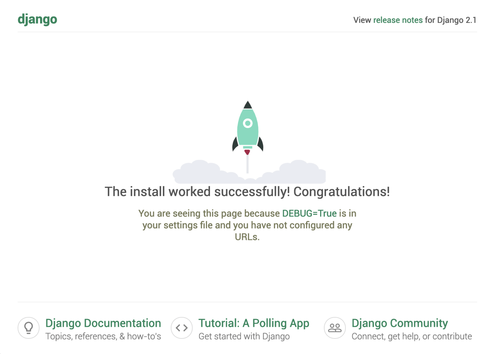

# 도커 컴포즈를 활용하여 완벽한 개발 환경 구성하기

출처: https://www.44bits.io/ko/post/almost-perfect-development-environment-with-docker-and-docker-compose

## 컨테이너 시대의 Django 개발환경 구축하기


### 0 (사전 학습) 도커가 뭐야?

아직 도커Docker를 잘 모르는 분께는 [도커 튜토리얼: 깐 김에 배포까지](https://blog.nacyot.com/articles/2014-01-27-easy-deploy-with-docker/)를 추천합니다. 도커를 왜 써야할지 설득이 필요한 분께는 [왜 굳이 도커를 써야 하나요?](https://www.44bits.io/ko/post/why-should-i-use-docker-container) 글을 추천합니다.

그럼, 바로 본론으로 넘어갑니다.


### 1 개발 환경 구성이라는 어려움

새 프로젝트를 시작하거나 기존 프로젝트에 참여한 후 가장 먼저 하는 일은 바로, 개발 환경 구성일 겁니다. 파이썬Python을 사용하는 프로젝트라면 보통 `pip` 명령과 `requirements.txt` 파일을 사용해 의존 패키지를 설치합니다.

``` bash
$ pip install -r requirements.txt
```

거의 언제나 하나 이상의 프로젝트를 진행해야 하니까, 의존성이 섞이지 않게 [virtualenv](https://github.com/pypa/virtualenv)도 사용합니다.

``` bash
$ virtualenv my-env
$ source /usr/local/bin/my-env/bin/activate
$ pip install -r requirements.txt
```

이렇게 프로젝트별로 의존성을 관리하더라도 문제가 없는 것은 아닙니다. 의존성 패키지를 설치하는 과정이 무사히 성공하면 좋겠지만 실제로는 다음 상황을 거의 항상 겪기 마련입니다.

1. 패키지 설치가 막힌다(SSL, LDAP 관련).
2. (실수가 있건 없건) 로컬 컴퓨터에 이미 존재하는 환경과 꼬였다.
3. 막상 배포를 했더니 개발 환경과 서버 환경이 같지 않아서 문제가 발생했다.

보안 관련 패키지에서는 이런 식의 오류를 만납니다.

``` bash
$ pip install -r requirements.txt
...

build/temp.macosx-10.11-x86_64-3.5/_openssl.c:400:10:
    fatal error: 'openssl/aes.h' file not found
#include <openssl/aes.h>
         ^
1 error generated.
error: command 'clang' failed with exit status 1
```

데이터베이스와 관련해서는 이런 오류도 만나고요.

``` bash
...
ld: library not found for -lpq
collect2: ld returned 1 exit status
ld: library not found for -lpq
collect2: ld returned 1 exit status
error: command 'clang' failed with exit status 1
```

이미지 관련 패키지는 이런 오류를 선사합니다.

``` bash
...
building '_imaging' extension
creating build/temp.macosx-10.8-intel-2.7
creating build/temp.macosx-10.8-intel-2.7/libImaging
...
unable to execute clang: No such file or directory
error: command 'clang' failed with exit status 1
```

어떤 패키지는 sudo 권한을 달라고도 하고요.

``` bash
...
Skipping installation of /Library/Python/2.7/site-packages/
    virtualenvwrapper/init.py (namespace package)
copying virtualenvwrapper/hook_loader.py -> /Library/Python/
    2.7/site-packages/virtualenvwrapper
error: /Library/Python/2.7/site-packages/virtualenvwrapper:
    Permission denied
```

해결책은 이런 것들입니다.

``` bash
$ export XXXXXXX=-xxxxxx
$ sudo pip install xxx  # 절대 따라하지 마세요
$ brew install xxx
```

물론 설치가 잘 끝났어도 이런 오류를 만날 수 있죠.

``` bash
ImportError: No module named xxx
```

`설치야 어차피 한 번만 하고 마는 것 아닌가?`하고 생각하실 수도 있겠지만, 프로젝트에 새로운 사람이 합류하면 내가 겪었을 어려움 혹은 그 사람의 개발 환경에 따른 또다른 어려움들을 겪게 됩니다. 문서화를 잘 해두었다면 조금은 수월할 수도 있겠지만, 이미 개발 환경을 구성한 사람이라면 굳이 개발 환경 구성에 시간을 더 들일 필요가 없으니 가이드 문서는 금새 낡아버립니다. 게다가 설치 과정 외에도 신경 써야 할 요소(환경 변수, 데이터베이스 인코딩 등)가 항상 발목을 잡기 마련입니다.

개발 환경 구성에 대한 문서를 계속 업데이트한다면 이런 문제가 최소화되겠지만, 상상하는 것만으로도 진이 빠지는 일인 건 분명합니다.

### 2 도커로 개발 환경 구성하기

도커를 통해 여러 환경에 동일한 서버를 배포할 수 있다는 점에 주목하면, 개발 환경도 어디서나 동일하게 구성할 수 있겠다고 상상할 수 있습니다. 먼저, 간단한 웹 애플리케이션의 개발 환경을 도커로 구성해보고 불편한 점을 살펴본 후, 이를 편하게 만들어 주는 도커 컴포즈Docker Compose로 넘어가겠습니다.*****

***** 도커에 익숙한 분이라면 **도커 컴포즈로 개발 환경 구성하기**로 건너뛰어도 좋습니다.

먼저 도커 컴포즈 용 예시 프로젝트 저장소를 클론합니다.

``` bash
$ git clone https://github.com/raccoonyy/django-sample-for-docker-compose.git
```

#### 2.1 도커 이미지 빌드

이제 프로젝트의 루트 디렉터리에서 도커 이미지를 만듭니다.

``` bash
$ docker build -t django-sample .
```

이렇게 하면 `docker-sample`이라는 도커 이미지가 만들어집니다.

``` bash
$ docker image ls | grep django-sample
django-sample   latest   bac627808fb8   1 minute ago   995MB
```

#### 2.2 Django 앱 컨테이너 실행

이제 Django 앱 컨테이너를 실행해봅시다. 다음 명령은 `django-sample` 이미지를 컨테이너로 실행합니다.

``` bash
$ docker run -it --rm \
    -p 8000:8000 \
    django-sample \
    ./manage.py runserver 0:8000
```

데이터베이스가 연결되지 않았기 때문에, 마지막 부분에 이런 오류가 나타날 겁니다.

``` bash
django.db.utils.OperationalError: could not connect to server: Connection refused
    Is the server running on host "localhost" (127.0.0.1) and accepting
    TCP/IP connections on port 5432?
could not connect to server: Cannot assign requested address
    Is the server running on host "localhost" (::1) and accepting
    TCP/IP connections on port 5432?
```

#### 2.3 데이터베이스 컨테이너 실행

물론 데이터베이스 서버도 도커로 실행할 수 있습니다. 터미널 창을 하나 더 열고 다음 명령을 입력해보세요.

``` bash
$ docker run -it --rm postgres
```

데이터베이스 서버가 실행되었지만, 앱 개발 서버는 여전히 동작하지 않을 겁니다. 일단 두 컨테이너의 터미널 창에서 `Ctrl + C` 키를 눌러 컨테이너를 종료하고, 이 문제를 해결해봅시다.

#### 2.4 데이터베이스 연결하기

기본적으로 도커 컨테이너들은 각각 격리된 환경에서 실행됩니다. 다시 말해, 별도의 옵션을 지정하지 않으면 다른 컨테이너의 존재를 알 수 없죠. 앞에서는 앱 컨테이너에 별 옵션을 지정하지 않고 실행한 후, 데이터베이스 컨테이너를 실행했습니다. 따라서 앱 컨테이너는 PostgreSQL 컨테이너가 실행되었는지 여부를 알지 못합니다.

앱 컨테이너에게 데이터베이스 컨테이너의 존재를 알려주기 위해서는 다음 과정을 거쳐야 합니다.

1. 데이터베이스 컨테이너를 실행하면서 컨테이너 이름을 붙이고(`db`라고 하죠),
2. 앱 컨테이너를 실행할 때 `db` 컨테이너를 연결해 줍니다.

먼저 데이터베이스 컨테이너를 실행해보죠.

``` bash
$ docker run --rm \
    --name db \
    -e POSTGRES_DB=djangosample \
    -e POSTGRES_USER=sampleuser \
    -e POSTGRES_PASSWORD=samplesecret \
    postgres
```

- 이번에는 `-it` 옵션을 삭제하여, 컨테이너를 데몬 형태로 실행했습니다.
- `--name`: 데이터베이스 컨테이너에 `db`라는 이름을 붙였습니다.
- `-e`: 환경변수를 설정하여 컨테이너를 실행할 수 있습니다. 여기서는 컨테이너 시작과 함께 `djangosample` 데이터베이스를 만들고(`POSTGRES_DB`) `sampleuser`라는 사용자에게 접속 권한을 부여(`POSTGRES_USER`, `POSTGRES_PASSWORD`)합니다. *****

***** [도커 허브의 공식 포스트그레SQL 저장소](https://hub.docker.com/_/postgres/)에 가보면 설정할 수 있는 환경 변수 종류를 알 수 있습니다.

참고로, 여기서 설정한 사용자 이름이나 비밀번호, 데이터베이스 이름 같은 환경변수들은 `djangosample/settings.py` 파일 안에 설정해 둔 기본값들입니다.

이제 앱 컨테이너를 실행하면서 `db` 컨테이너를 연결(`link`)해 줍시다.

``` bash
$ docker run -it --rm \
    -p 8000:8000 \
    --link db \
    -e DJANGO_DB_HOST=db \
    -e DJANGO_DEBUG=True \
    django-sample \
    ./manage.py runserver 0:8000
```

- `--link`: 참조할 다른 컨테이너를 지정합니다.

이렇게 해서 Django 서버가 잘 실행되었다면 다음과 같은 Django 실행 화면을 볼 수 있습니다.

Django 개발 서버가 잘 실행되었습니다

이제 개발만 하면 될까요? 아쉽게도 그렇지 않습니다.

#### 2.5 코드 변경이 실시간으로 반영되게 하기

프로젝트의 `Dockerfile`을 살펴보면 `ADD ./djangosample /app/djangosample/` 부분이 존재합니다(10행). 도커 이미지가 만들어지다가 10행을 만나면 컨테이너 밖의 소스 코드가 컨테이너 속에 추가되고, 이 시점부터 컨테이너 밖의 소스 코드 변경에 영향을 받지 않습니다. 그래서, 평소 개발하듯 소스 코드를 아무리 수정하더라도 Django 개발 서버가 이를 반영하여 재시작하는 일이 발생하지 않습니다.

이를 해결하고자 격리된 컨테이너에 통로를 하나 만듭니다. 수정할 소스 코드의 디렉터리를 앱 컨테이너 내부의 소스 코드와 연결하여, 코드를 바꿀 때마다 컨테이너 속 코드도 바뀌게 해보겠습니다. `Ctrl + C` 키를 눌러 앱 컨테이너를 종료한 후, 다음 명령어를 실행합니다.

``` bash
$ docker run -it --rm \
    -p 8000:8000 \
    --link db \
    -e DJANGO_DB_HOST=db \
    -e DJANGO_DEBUG=True \
    --volume=$(pwd):/app/ \
    django-sample \
    ./manage.py runserver 0:8000
```

- `--volume`: 이 옵션을 사용하여 로컬 디렉터리의 특정 경로를 컨테이너 내부로 마운트할 수 있습니다. (`$(pwd)`는 이 명령을 실행하는 현재 디렉터리의 절대 경로입니다.)

이제 마지막 문제가 남았습니다. 현재 상태에서 `Ctrl + C` 키를 눌러 앱 컨테이너를 종료하고, `docker stop db` 명령을 사용해 데이터베이스 컨테이너도 종료해봅시다. 개발하면서 만들었던 데이터들은 다 어떻게 될까요?

#### 2.6 데이터베이스 데이터를 보존하기

앞에서 데이터베이스 컨테이너를 실행하면서 `--rm` 옵션을 지정했는데요. 이렇게 하면 데이터베이스 컨테이너가 종료와 함께 삭제되면서 컨테이너 내부에 쌓였던 데이터베이스 데이터들도 모두 사라집니다. 깔끔해서 좋긴 하지만 개발용 데이터를 매번 쌓기가 귀찮은 경우도 있습니다.

데이터베이스가 데이터를 저장할 때 파일 시스템을 사용한다는 점을 생각해보면, 이를 해결할 때도 역시 `--volume` 옵션을 사용할 수 있습니다. 다음 명령을 살펴봅시다.

``` bash
$ mkdir -p ./docker/data
$ docker run -it --rm \
    --name db \
    -e POSTGRES_DB=djangosample \
    -e POSTGRES_USER=sampleuser \
    -e POSTGRES_PASSWORD=samplesecret \
    --volume=$(pwd)/docker/data:/var/lib/postgresql/data \
    postgres:
```

- `--volume`: 데이터베이스 컨테이너 내부의 디렉터리(`/var/lib/postgresql/data`)를 로컬 컴퓨터의 디렉터리(`$(pwd)/docker/data`)로 연결하였습니다. 이제 데이터베이스가 데이터를 저장할 파일 시스템으로 로컬 컴퓨터의 `$(pwd)/docker/data` 디렉터리를 사용합니다.

#### 2.7 순서를 맞춰 컨테이너 재실행하기

이제 컨테이너들을 실행하는 `run` 명령어는 모두 완성되었으니, 모든 컨테이너를 종료한 후 순서를 맞춰 컨테이너들을 재시작해봅시다.

데이터베이스 컨테이너를 실행하고,

``` bash
$ docker run -it --rm \
    --name db \
    -e POSTGRES_DB=djangosample \
    -e POSTGRES_USER=sampleuser \
    -e POSTGRES_PASSWORD=samplesecret \
    --volume=$(pwd)/docker/data:/var/lib/postgresql/data \
    postgres
```

새 터미널 창에서 앱 컨테이너를 실행합니다.

``` bash
$ docker run -it --rm \
    -p 8000:8000 \
    --link db \
    -e DJANGO_DB_HOST=db \
    -e DJANGO_DEBUG=True \
    --volume=$(pwd):/app/ \
    django-sample \
    ./manage.py runserver 0:8000
```

이제 Django 서버가 데이터베이스와 잘 연결되고, 소스 코드를 변경하면 개발 서버가 알아서 재시작하며, 컨테이너를 종료해도 데이터베이스에 쌓인 데이터가 사라지지 않습니다.

그런데 개발에 앞서 매번 이 명령어들을 입력한다고 생각해보면… 그리 유쾌하진 않겠죠?

#### 2.8 도커가 별로 편하진 않네요?

도커로 개발 환경을 구성하는 데 성공하긴 했지만, 몇몇 불편한 부분이 남았습니다.

- 장황한 옵션

개발 서버를 실행할 때마다 장황한 도커 명령어의 옵션들을 적기가 귀찮습니다. 헷갈리기도 하고, 빼먹는 경우도 생깁니다. 옵션들을 미리 적어두고 한 번에 짜잔~! 실행하면 좋겠는데 말이죠.

- 앱 컨테이너와 데이터베이스 컨테이너의 실행 순서

반드시 데이터베이스 컨테이너를 실행한 다음에 앱 컨테이너를 실행해야 합니다. 그렇지 않으면 앱 컨테이너에서 데이터베이스 컨테이너를 찾을 수 없기 때문이죠. 깜박하고 앱 컨테이너부터 실행했다면? 종료하고 데이터베이스 컨테이너 실행하고, 다시 앱 컨테이너를 실행하는 불편함이 있죠.

### 3 도커 컴포즈로 개발 환경 구성하기

실행하기 불편하다는 이유로 도커를 포기하기에는 환경 독립성이 주는 장점이 너무 컸나봅니다. 도커가 출시된지 얼마 지나지 않아 독립된 개발 환경을 빠르게 구성할 수 있는 [피그Fig 프로젝트](http://www.fig.sh/)가 선보였습니다. 이때만 해도 도커 명령을 실행하는 서드파티 같은 도구였으나 피그가 인기를 얻자, 도커에서는 피그 프로젝트를 흡수하여 [도커 컴포즈Docker Compose라는 이름의 도구로 만들어버립니다](https://blog.docker.com/2015/02/announcing-docker-compose/).

도커 컴포즈를 사용하면 컨테이너 실행에 필요한 옵션을 `docker-compose.yml`이라는 파일에 적어둘 수 있고, 컨테이너 간 실행 순서나 의존성도 관리할 수 있습니다.

#### 3.1 선행 조건

이후의 과정을 따라하려면, 도커 엔진의 버전이 1.13.1 이상이어야 하고, 도커 컴포즈의 버전은 1.6.0 이상이어야 합니다. 최근에 도커를 설치했다면 큰 문제가 없을 겁니다.

이제 `docker-compose.yml` 파일을 만들어 봅시다.

#### 3.2 docker-compose.yml 파일

`docker-compose.yml`은 장황한 도커 실행 옵션을 미리 적어둔 문서라고 볼 수 있습니다. 프로젝트 루트에 파일을 만들고, 다음 내용을 붙여 넣습니다. ([gist 링크](https://gist.github.com/raccoonyy/2db75b86f73bc0b337a0c2c3f94709a1/79fe204485726b37ce73486fc93d73cef1b55004))

``` bash
version: '3'

services:
  db:
    image: postgres
    volumes:
      - ./docker/data:/var/lib/postgresql/data
    environment:
      - POSTGRES_DB=sampledb
      - POSTGRES_USER=sampleuser
      - POSTGRES_PASSWORD=samplesecret
      - POSTGRES_INITDB_ARGS=--encoding=UTF-8

  django:
    build:
      context: .
      dockerfile: ./compose/django/Dockerfile-dev
    environment:
      - DJANGO_DEBUG=True
      - DJANGO_DB_HOST=db
      - DJANGO_DB_PORT=5432
      - DJANGO_DB_NAME=sampledb
      - DJANGO_DB_USERNAME=sampleuser
      - DJANGO_DB_PASSWORD=samplesecret
      - DJANGO_SECRET_KEY=dev_secret_key
    ports:
      - "8000:8000"
    command: 
      - python manage.py runserver 0:8000
    volumes:
      - ./:/app/
```

이제 파일의 윗부분부터 한 줄씩 살펴봅시다.

##### 3.2.1 version

``` bash
version: '3'
```

`docker-compose.yml` 파일의 첫 줄에는 파일 규격 버전을 적습니다. 파일의 규격에 따라 지원하는 옵션이 달라지는데, “3”이라만 적으면 3으로 시작하는 최신 버전을 사용한다는 의미입니다. (파일 규격 버전에 따른 자세한 내용은 [compose 파일의 버전과 호환성을 안내한 공식 문서](https://docs.docker.com/compose/compose-file/compose-versioning/)를 참고하세요.)

##### 3.2.2 services

``` bash
services:
```

이 항목 밑에 실행하려는 컨테이너들을 정의합니다. 컴포즈에서는 컨테이너 대신 서비스라는 개념을 사용합니다.

##### 3.2.3 db

``` bash
services:
  db:
```

postgres 서비스의 이름을 `db`로 정하였습니다.

##### 3.2.4 image

``` bash
services:
  db:
    image: postgres
```

`db` 서비스에서 사용할 도커 이미지를 적습니다. 여기서는 [dockerhub의 공식 postgres 이미지](https://hub.docker.com/_/postgres/)를 사용하였습니다.

##### 3.2.5 volumes

``` bash
services:
  db:
    volumes:
      - ./docker/data:/var/lib/postgresql/data
```

`docker run`으로 db 컨테이너를 실행할 때 `--volume` 옵션을 사용하여 데이터베이스의 데이터를 로컬 컴퓨터에 저장했던 부분과 같습니다. 다만 `docker-compose.yml`의 `volumes`에는 상대 경로를 지정할 수 있어서 편리합니다.

`docker run`으로 db 컨테이너를 실행할 때와 마찬가지로, 프로젝트 루트 아래의 `docker/data` 디렉터리에 데이터를 저장하기로 했습니다.

##### 3.2.6 environment

``` bash
services:
  db:
    environment:
      - POSTGRES_DB=sampledb
      - POSTGRES_USER=sampleuser
      - POSTGRES_PASSWORD=samplesecret
      - POSTGRES_INITDB_ARGS=--encoding=UTF-8
```

`docker run` 명령어의 `-e` 옵션에 적었던 내용들입니다. 마지막의 `POSTGRES_INITDB_ARGS` 부분이 추가되었는데, 데이터베이스 서버의 인코딩을 UTF-8로 설정하기 위함입니다.

##### 3.2.7 django

``` bash
services:
  django:
```

앱 서비스의 이름은 `django`로 지정하였습니다.

##### 3.2.8 build

``` bash
services:
  django:
    build:
      context: .
      dockerfile: ./compose/django/Dockerfile-dev
```

db 서비스와 달리 앱 서비스는 특정 이미지 대신 `build` 옵션을 추가합니다.

`context`는 `docker build` 명령을 실행할 디렉터리 경로라고 보시면 됩니다.

`dockerfile`에는 **‘개발용’ 도커 이미지**를 빌드하는 데 사용할 Dockerfile을 지정하면 됩니다. Dockerfile-dev 파일에서는 (운영용 Dockerfile과는 달리) 소스코드를 컨테이너에 넣지 않습니다.

##### 3.2.9 environment

``` bash
services:
  django:
    environment:
      - DJANGO_DEBUG=True
      - DJANGO_DB_HOST=db
      - DJANGO_DB_PORT=5432
      - DJANGO_DB_NAME=sampledb
      - DJANGO_DB_USERNAME=sampleuser
      - DJANGO_DB_PASSWORD=samplesecret
```

환경 변수는 `docker run`을 할 때보다 좀더 자세하게 적었습니다. 각 값은 앱 서비스의 환경 변수로 설정되며, Django 설정 파일(`djangosample/settings.py`)에서 불러와 사용하게 됩니다. (데이터베이스 관련 정보들은 db 서비스에서 설정한 값들과 일치해야 합니다.)

##### 3.2.10 ports

``` bash
services:
  django:
    ports:
      - "8000:8000"
```

`docker run` 명령어의 `-p` 옵션에 해당하는 부분입니다.

##### 3.2.11 command

``` bash
services:
  django:
    command:
      - python manage.py runserver 0:8000
```

`docker run`으로 앱 컨테이너를 실행할 때 가장 마지막에 적었던 명령어 부분입니다.

##### 3.2.12 volumes

``` bash
services:
  django:
    volumes:
      - ./:/app/
```

`docker run`으로 앱 컨테이너를 실행할 때 `-v` 옵션을 사용하여 프로젝트 루트 디렉터리를 컨테이너 안의 `/app` 디렉터리와 연결했던 부분과 같습니다.

이렇게 해서 `docker-compose.yml` 파일을 모두 살펴보았습니다.

#### 3.3 드디어 실행!

`docker-compose.yml`을 모두 작성했다면 드디어 서비스를 실행할 차례입니다.

``` bash
$ docker-compose up -d
Creating network "djangosample_default" with the default driver
Creating djangosample_db_1
Creating djangosample_django_1
Attaching to djangosample_db_1, djangosample_django_1
db_1       | Initializing database
... (DB 초기화 진행) ...
django_1   | Django version 2.1, using settings 'djangosample.settings'
django_1   | Starting development server at http://0.0.0.0:8000/
django_1   | Quit the server with CONTROL-C.
```

이제 [http://127.0.0.1:8000](http://127.0.0.1:8000/)에 접속해보면 개발 서버가 잘 작동함을 확인할 수 있습니다.

각 컨테이너를 실행하던 길고 복잡한 명령어들이 사라졌고, 간단한 명령어 한 줄로 개발 서버와 데이터베이스를 모두 실행하였습니다.

##### 3.3.1 그런데… 앱 서비스에서 db 서비스를 어떻게 찾았지?

사실 `docker-compose.yml`에는 `docker run`에서 사용하던 옵션 중 하나가 보이지 않습니다. 바로 `--link` 옵션인데요. 도커 컴포즈 파일 버전이 2일 때는 다음과 같은 항목으로 연결할 서비스를 명시하곤 했습니다.

``` bash
services:
  django:
    links:
      - db
```

도커 컴포즈 파일 버전 3으로 와서는 `links` 항목을 사용하지 않더라도 한 네트워크 안에 있는 서비스끼리 서로 통신을 할 수 있기 때문에, 이 항목을 사용하지 않았습니다. (관련 문서인 [Links topic in Networking in Compose](https://docs.docker.com/compose/networking/#links)도 참고하세요.) 한 네트워크로 선언한 적이 없다고요? 한 `docker-compose.yml` 안에 있는 서비스들은 별도로 지정하지 않으면 하나의 네트워크에 속합니다. (네트워크와 관련된 더 자세한 내용은 [Networking in Compose](https://docs.docker.com/compose/networking/)를 참고하세요.)

#### 3.4 개발용 Dockerfile을 별도로 관리하기

앞에서 개발 서버용 `Dockerfile-dev` 파일을 짧게 언급하고 넘어갔는데요. 여기서 조금 더 자세히 살펴보겠습니다.

크게 보자면 개발 서버에 필요 없는 내용은 지우고, 개발 서버에만 필요한 내용은 추가하면 됩니다. 먼저 `./compose/django/Dockerfile-dev` 파일의 내용을 살펴봅시다.

``` bash
FROM python:3

RUN apt-get update && apt-get -y install \
    libpq-dev

WORKDIR /app
ADD    ./requirements.txt   /app/
RUN    pip install -r requirements.txt

# ADD    ./djangosample   /app/djangosample/
# ADD    ./manage.py      /app/

# CMD ["python", "manage.py", "runserver", "0:8000"]
```

위에서 주석으로 처리한 부분들은 원래 `Dockerfile`에는 있었지만 개발 서버용 도커 이미지에서 삭제한 내용입니다.

- 앱 코드: 앱 코드는 컨테이너 안에 집어 넣지 않고 로컬 컴퓨터의 디렉터리를 참조합니다. (`docker-compose.yml`의 `volume` 부분)
- `CMD`: 도커 컴포즈의 `command`로 관리하는 편이 더 쉽습니다.

이제 `./compose/django/Dockerfile-dev`의 내용은 다음과 같습니다. ([gist 링크](https://gist.github.com/raccoonyy/3674be1c8f24f6299b1949a92dbe5795))

``` bash
FROM python:3

RUN apt-get update && apt-get -y install \
    libpq-dev

WORKDIR /app
ADD    requirements.txt    /app/
RUN    pip install -r requirements.txt
```

이렇게만 해도 개발 환경을 구성하고 실행하기가 한결 수월해지지만, 실제로 사용하다보니 소소하게 불편한 점들이 있더군요. 이를 개선해보겠습니다.

#### 3.5 개선할 점 몇 가지

##### 3.5.1 데이터베이스 데이터용 볼륨 추가

지금까지는 데이터베이스의 실제 데이터를 `./docker/data`에 저장하고 있었는데, 실수로 이 디렉터리가 지워진다거나 소스코드 버전 관리 시스템에 들어가버리면 낭패일 겁니다. 이 디렉터리를 직접 관리하지 말고 도커에 맡겨봅시다. `docker-compose.yml` 파일을 다음과 같이 수정합니다.

``` bash
version: '3'

# 변경 부분!
volumes:
  django_sample_db_dev: {}

services:
  db:
    image: postgres
    volumes:
      # 여기도!
      - django_sample_db_dev:/var/lib/postgresql/data
    environment:
      ...
```

처음 바뀐 부분에서는 `django_sample_db_dev`라는 이름으로 볼륨을 하나 만듭니다. 이렇게 만들어진 볼륨은 `docker volume ls` 명령으로 확인할 수 있습니다. (볼륨은 도커가 관리하는 가상 디스크라고 생각하면 됩니다.)

``` bash
$ docker volume ls
local               django_sample_db_dev
```

이렇게 만든 볼륨을 db 서비스에서 사용하려면, db 서비스 선언부 안에 `volumes` 항목을 넣고 `- 가상디스크_이름:컨테이너_속_디렉터리`처럼 지정합니다. 이후로는 모든 데이터베이스 데이터가 `django_sample_db_dev` 볼륨에 저장됩니다. (이 볼륨을 지우려면 `docker volume rm django_sample_db_dev` 명령을 사용합니다.)

##### 3.5.2 파이썬 로그가 한 발 느리게 출력되는 문제 수정

도커 컴포즈에서 파이썬 로그가 한 발 늦게 출력된다는 느낌을 받을 때가 있습니다. 파이썬에서 출력 버퍼가 기본으로 작동하면서 출력 로그를 붙잡고 있기 때문인데요. 이 버퍼링을 없애려면 `PYTHONUNBUFFERED` 환경변수를 추가하면 됩니다.

`./compose/django/Dockerfile-dev`에 다음 내용을 추가합니다. (설정할 값은 0이든 1이든 상관 없고, 환경변수가 존재하기만 하면 됩니다.)

``` bash
ENV PYTHONUNBUFFERED=0
```

이렇게 해서 도커 컴포즈로 개발 환경을 어떻게 구성하는지 살펴보았습니다. 이제 도커 컴포즈에서 주로 사용하는 명령어를 간략하게 훑어보겠습니다.

##### 3.5.3 Django 서버가 데이터베이스를 못 찾아요

이는 대부분 첫 실행시에만 발생하는 문제입니다. 데이터베이스 서비스가 실행된 후 초기화되기 전에(대략 5초~10초) Django 서버가 실행되기 때문인데요. 가장 간단한 해결 방법은 서비스를 중지하고 다시 실행하는 것이지만 근본적인 해결책은 아닙니다. 이를 위해 [wait-for-it.sh](https://github.com/vishnubob/wait-for-it/)이라는 셸 스크립트를 사용해보겠습니다.

wait-for-it.sh는 이름이 알려주듯 특정 서버의 특정 포트로 접근할 수 있을 때까지 기다려주는 스크립트입니다. 이 스크립트를 도커 이미지 안에 넣고, 이미지 실행 명령 앞에 붙여주면 됩니다.

`./compose/django/Dockerfile-dev` 파일의 마지막 부분에 다음 내용을 추가합니다.

``` bash
ADD    https://raw.githubusercontent.com/vishnubob/wait-for-it/master/wait-for-it.sh /
```

그리고 `docker-compose.yml` 파일의 `command` 부분을 다음처럼 수정합니다.

``` bash
services:
  django:
    command:
      - bash
      - -c
      - |
        /wait-for-it.sh db:5432 -t 10
        python manage.py runserver 0:8000
```

이렇게 하면, db 서비스의 5432 포트가 사용 가능할 때까지 기다린 후, Django 개발 서버가 실행되기 때문에 오류가 발생하지 않습니다.

#### 3.6 도커 컴포즈의 주요 명령어

`docker-compose` 명령어를 짧은 alias로 등록해두면 편리합니다. 저는 oh-my-zsh에서 기본으로 제공하는 `dco`를 사용하고 있습니다.

##### up -d

`docker-compose.yml` 파일의 내용에 따라 이미지를 빌드하고 서비스를 실행합니다. 자세한 진행 과정은 다음과 같습니다.

1. 서비스를 띄울 네트워크 설정
2. 필요한 볼륨 생성(혹은 이미 존재하는 볼륨과 연결)
3. 필요한 이미지 풀(pull)
4. 필요한 이미지 빌드(build)
5. 서비스 의존성에 따라 서비스 실행

`up` 명령에 사용할 수 있는 몇 가지 옵션도 존재합니다.

- `-d`: 서비스 실행 후 콘솔로 빠져나옵니다. (`docker run`에서의 `-d`와 같습니다.)
- `--force-recreate`: 컨테이너를 지우고 새로 만듭니다.
- `--build`: 서비스 시작 전 이미지를 새로 만듭니다.

#### ps

현재 환경에서 실행 중인 각 서비스의 상태를 보여줍니다.

``` bash
$ docker-compose ps
        Name                       Command               State           Ports
--------------------------------------------------------------------------------
djangosample_db_1       /docker-entrypoint.sh postgres   Up      5432/tcp
djangosample_django_1   /bash -c python manage.py        Up      0.0.0.0:8000->8000/tcp
```

##### stop, start

서비스를 멈추거나, 멈춰 있는 서비스를 시작합니다.

``` bash
$ docker-compose stop
Stopping djangosample_django_1 ...
Stopping djangosample_db_1 ...

$ docker-compose start
Starting db ... done
Starting django ... done
```

##### down

서비스를 지웁니다. 컨테이너와 네트워크를 삭제하며, 옵션에 따라 볼륨도 지웁니다.

``` bash
$ docker-compose down --volume
Removing myproject_django_1 ... done
Removing myproject_db_1 ... done
Removing network djangosample_default
Removing volume django_sample_db_dev
```

- `--volume`: 볼륨까지 삭제합니다.

##### exec

실행 중인 컨테이너에서 명령어를 실행합니다. 자동화된 마이그레이션용 파일 생성이나 유닛 테스트, lint 등을 실행할 때 사용합니다.*****

***** 비슷한 명령으로 `run`이 존재합니다. `run`은 새 컨테이너를 만들어서 명령어를 실행합니다. `docker run`과 마찬가지로 `--rm` 옵션을 추가하지 않으면, 컨테이너가 종료된 후에도 삭제되지 않습니다. (이런 이유 때문에 개인적으로는 `exec`를 선호하지만, 컨테이너에서 추천하는 방식은 사실 `run`입니다.)

``` bash
$ docker-compose exec django ./manage.py makemigrations
...
$ docker-compose exec node npm run test
> expresssample@0.1.0 test /www/service
> mocha $(find test -name '*.spec.js')
...
```

##### logs

서비스의 로그를 확인할 수 있습니다. `logs` 뒤에 서비스 이름을 적지 않으면 도커 컴포즈가 관리하는 모든 서비스의 로그를 함께 보여줍니다.

``` bash
$ docker-compose logs django
Attaching to djangosample_django_1
django_1     | System check identified no issues (0 silenced).
django_1     | February 13, 2017 - 16:32:28
django_1     | Django version 1.10.4, using settings 'djangosample.settings'
django_1     | Starting development server at http://0.0.0.0:8000/
django_1     | Quit the server with CONTROL-C.
```

- `-f`: 지금까지 쌓인 로그를 다 보여준 후에도 셸로 빠져나오지 않고, 로그가 쌓일 때마다 계속해서 출력합니다.

#### 3.7 도커 컴포즈 단축 명령어 등록하기

편의성을 위해 도커 컴포즈를 도입했는데 `docker-compose`라는 명령어 자체가 너무 길어서 오히려 불편할 수도 있겠죠. 이를 위해 `~/.bashrc`나 `~/.zshrc`에 다음 내용을 추가합니다.

``` bash
alias dco='docker-compose'
alias dcb='docker-compose build'
alias dce='docker-compose exec'
alias dcps='docker-compose ps'
alias dcr='docker-compose run'
alias dcup='docker-compose up'
alias dcdn='docker-compose down'
alias dcl='docker-compose logs'
alias dclf='docker-compose logs -f'
```

이제 `docker-compose up` 대신 `dcup`을, `docker-compose exec django bash` 대신 `dce django bash`를 실행하면 됩니다.

마지막으로, 몇 가지 삽질 경험을 바탕으로 나름의 팁을 정리해보겠습니다.

#### 3.8 나름의 팁

##### 3.8.1 docker-compose.yml 파일을 수정했다면?

`docker-compose.yml` 파일을 수정하고 이를 서비스에 적용하려면 서비스를 멈추고(`stop`), 서비스를 지우고(`rm`), 서비스를 시작해야(`up`) 합니다.

하지만 `up` 명령만 실행해도, (현재 실행 중인 서비스 설정과 달라진 부분이 있다면) **알아서 컨테이너를 재생성하고 서비스를 재시작**해줍니다.*****

``` bash
$ docker-compose up -d [서비스_이름]
```

***** 혹시 컨테이너를 재생성하지 않는 것 같다면, `--force-recreate` 옵션을 붙이면 됩니다.

#### 3.8.2 Dockerfile-dev 파일을 수정했다면?

`Dockerfile-dev` 파일을 수정했을 땐 `build` 명령을 사용하여 도커 이미지를 새로 만들어야 합니다. 이후 서비스 중지와 삭제, 재시작을 해야 하죠.

하지만 `up` 명령에 다음과 같이 `--build` 옵션을 넣으면 **알아서 이미지를 새로 만들고 서비스를 재시작**합니다.

``` bash
$ docker-compose up -d --build [서비스_이름]
```

##### 3.8.3 Dockerfile-dev도 신경 써야 함

개발용 이미지를 담당하는 Dockerfile-dev 파일과 배포용 이미지를 담당하는 Dockerfile 파일이 따로 존재한다는 점을 꼭 기억해야 합니다. 간혹 `Dockerfile`만 고치면서 개발 환경에서 **‘외않돼?’**라고 생각한 경우가 있습니다. (저만 그럴수도요;;)

##### 3.8.4 데이터베이스 내용도 지우고 싶다면

열심히 개발하다 보면 데이터베이스에 원치 않는 데이터가 남는 경우가 있습니다. 데이터베이스에 접속해서 테이블을 삭제하거나 할 수도 있겠지만, `down` 명령에 `--volume` 옵션을 추가하면 서비스에서 사용하는 볼륨(=데이터베이스 데이터가 저장되는 곳)을 삭제하기 때문에, 데이터베이스를 깨끗하게 초기화할 수 있습니다.

``` bash
$ docker-compose down --volume
```

##### 3.8.5 MySQL보다는 PostgreSQL이 조금 더 편한 듯

로컬 컴퓨터에 데이터베이스 서버가 없어도, 서비스를 시작하기만 하면 알아서 데이터베이스 서버가 시작된다는 점은 굉장한 매력이었습니다. 그런데 MySQL과 PostgreSQL의 초기화 과정에 걸리는 시간이 꽤 차이가 나더군요.

제 컴퓨터 기준이긴 하지만 MySQL 초기화에는 대략 15초, PostgreSQL 초기화에 대략 5초 남짓한 시간이 걸립니다. 데이터베이스 초기화가 자주 필요한 일은 아니지만 그래도 15초와 5초의 차이는 꽤 크죠.*****

***** 아울러, 데이터를 로컬에 쌓기보다는 도커가 관리하는 가상 디스크를 사용하는 편이 속도 면에서 좀더 유리합니다.

##### 3.8.6 ERROR: ‘No space left on device’

도커를 열심히 사용하고 있는데 갑자기 다음과 같은 메시지가 뜨면서 새 이미지를 빌드할 수 없는 경우가 발생합니다.

``` bash
ERROR: 'No space left on device'
```

하드디스크에 용량이 엄청 많이 남아 있었는데도 말이죠. 이는 도커에서 사용하는 가상 파일 시스템의 기본 최대 값이 64기가바이트여서 발생하는 문제입니다.

**주의! 다음 내용을 진행하면 도커 이미지와 컨테이너, 볼륨이 모두 사라집니다.**

이 경우 도커의 환경 설정에서 `Reset disk image` 버튼을 누르면 해결됩니다.

도커 메뉴의 환경 설정을 선택합니다

Reset disk image 버튼을 누릅니다

이렇게 해서 개발 환경 구성하기를 마쳤습니다. 장황해보이지만, 실제로는 한 번 잘 구성해 두면 다른 프로젝트에는 그저 옮겨 붙이는 정도로 쉽게 적용할 수 있을 겁니다.

이 글의 저자는 [raccoony](https://www.44bits.io/ko/author/raccoony)입니다. 2019년 03월 20일에 공개하고, 2021년 02월 14일에 마지막으로 수정했습니다.