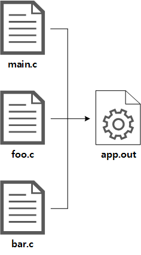
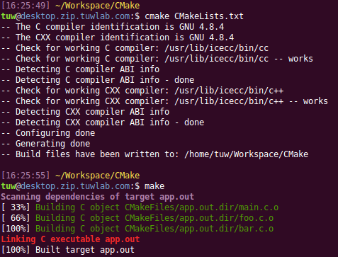
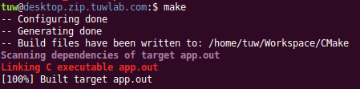
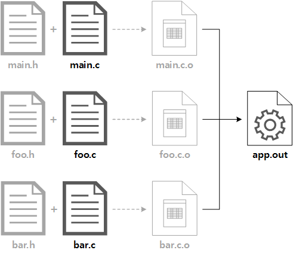

# CMake 튜토리얼

출처: https://www.tuwlab.com/ece/27234


## 1. CMake 소개와 예제, 내부 동작 원리

▶ [Makefile 튜토리얼](https://www.tuwlab.com/27193)에서는 C 프로젝트를 빌드하기 위한 Makefile을 작성하는 방법에 대해 다뤘습니다. 이번 글에서는 Makefile을 보다 쉽고 편리하게 작성할 수 있는 툴인 **CMake**에 대해 소개하고, 동작 원리를 소개하도록 하겠습니다.


### Make의 아킬레스건: 항상 신경써야 하는 Makefile 유지/보수

**"소스코드를 수정해서 의존성이 바뀔 때마다 Makefile에 보고해야 한다.
그렇지 않으면 당신의 빌드를 비비 꼬이게 만들어 주겠다."**
~~(Makefile이 툴인지 보스인지, 내가 Makefile을 관리하는건지 Makefile이 나를 관리하는건지..ㅁㄴㅇㄹ)~~

Make는 쉘 스크립트 기반 빌드에 비해 편리하지만, 프로젝트의 규모가 거대해지면서 관리해야 할 소스 파일들이 많아지고 의존성 관계가 서로 복잡하게 뒤엉키면 점점 그 한계를 드러내기 시작합니다. Makefile 자체적으로 의존성을 파악하고 어느 정도 자동화를 해 주긴 하지만, 이는 어디까지나 Makefile에 기술된 의존성 정보가 소스코드의 내용에 부합하게 올바르게 관리되고 있다는 것에 전제합니다.

**'Makefile에 기술된 의존성 정보'**란 다음과 같이 Object파일이 의존하는 소스코드나 헤더 파일을 기술한 구문을 의미합니다.

`Makefile의 의존성 정의 구문 예시`

``` makefile
main.o: foo.h bar.h main.c
foo.o: foo.h foo.c
bar.o: bar.h bar.c
```

Make에서는 의존성 정보를 검사할 때 소스파일까지 일일이 뒤져서 어떤 헤더파일이 포함되어 있는지 조사하지 않으므로, Makefile에 의존성 정보가 잘못 기술되어 있으면 빌드시 변경 사항이 제대로 반영되지 않는 소위 '빌드가 꼬이는'상황이 발생합니다. 이렇게 빌드가 꼬이면 매번 Clean build를 해야 하므로 결국 Make의 가장 강력한 기능 중 하나인 Incremental build를 활용할 수 없게 됩니다.


### CMake를 사용하면: 소스코드-결과물 사이를 깔끔하게 추상화

**"내가 관심있는건 소스코드와 실행 바이너리뿐,
부산물(Object파일)들은 (생기던 말던 어디 처박혀 있던) 내 알 바가 아니다."**


CMake를 사용하면 의존성 정보를 일일이 기술해 주지 않아도 되므로 빌드 스크립트의 관리 측면에서 매우 효율적입니다. 프로젝트를 처음 시작할 때 Build Step만 잘 구성해 놓으면, 이후에는 소스 파일(*.c)을 처음 추가할 때만 CMakeLists.txt 파일을 열어서 등록해 주면 됩니다. (그다지 추천하는 방법은 아니지만, 소스파일을 자동으로 찾아서 추가하도록 구성하는 방법도 있습니다.) 이후에는 소스코드를 어떻게 수정하더라도 빌드에서 제외하지 않는 한 스크립트를 수정하지 않아도 됩니다.

CMake도 Make와 마찬가지로 의존성 검사를 해서 Incremental Build를 수행하지만, 가장 큰 차이점은 CMake는 소스파일 내부까지 들여다보고 분석해서 의존성 정보를 스스로 파악한다는 점입니다. 예를 들어, 소스파일에 헤더파일을 추가(#include)하면, 직후 빌드부터 의존성 관계 변화가 자동으로 추적되어 헤더 파일의 변화까지 추적하기 시작합니다.

또한, Makefile에서는 빌드 중간생성물인 Object파일들의 이름과 의존성 정보까지 모두 기술해 줘야 하지만, CMake에서는 그럴 필요가 전혀 없습니다. 뒤에서 살펴보겠지만, CMake의 빌드 스크립트인 CMakeLists.txt에서는 **최종 빌드 결과물**과 이를 빌드하기 위한 **소스 파일**들만 명시해 주면 그것으로 끝입니다. (여기서 최종 빌드 결과물은 실행 바이너리나 라이브러리가 됩니다.)

그렇다고 CMake가 Make보다 훠얼~씬 좋고 편리한 전혀 다른 ~~오버테크놀러지의~~ 새로운 무언가[!]라는게 아니고, Makefile의 다소 지저분한 루틴들을 추상화(Abstraction)해서 보다 직관적으로 빌드 과정을 기술해주는 것입니다. 즉, CMake는 Makefile을 보다 쉽게 기술해 주는 일종의 Meta-Makefile이라고 할 수 있습니다. CMake로 프로젝트를 관리하더라도 결국 최종 빌드는 Make와 마찬가지로 make 명령으로 수행합니다.

그 외에 CMake로 프로젝트를 관리하면 CLion이나 Eclipse와 같은 범용 IDE에서 프로젝트 설정 파일로 사용할 수 있다는 장점도 있습니다. 따라서 협업 프로젝트에서 프로젝트를 체계적으로 관리하면서도 각 개발자마다 선호하는 개발 환경에서 작업을 할 수 있습니다.


### 빌드 예제

빌드 예제는 직전 글인 Make 튜토리얼에서 다뤘던 내용과 거의 비슷합니다. 다만, Makefile과 달리 CMakeLists.txt에서는 중간 생성물인 Object 파일들은 기술할 필요가 없으므로 생략하였습니다.



세 개의 소스파일로부터 하나의 실행파일을 만드는 예제이며, main.c에서는 foo.c와 bar.c에서 정의된 함수들을 호출하는 의존성이 존재합니다.


### 전격 비교 분석: Makefile VS CMakeLists.txt

[지난 글(Makefile 튜토리얼)](https://www.tuwlab.com/27193)에서 작성했던 위의 예제를 빌드하기 위한 **Makefile**의 최종 버전은 다음과 같습니다.

``` makefile
OBJS=main.o foo.o bar.o
TARGET=app.out
 
all: $(TARGET)
  
clean:
    rm -f *.o
    rm -f $(TARGET)
 
$(TARGET): $(OBJS)
    $(CC) -o $@ $(OBJS)
  
main.o: foo.h bar.h main.c
foo.o: foo.h foo.c
bar.o: bar.h bar.c
```

중간 생성물인 Object 파일명과 빌드 바이너리명을 최상단에서 정의하고, 이어서 각 빌드 Target을 정의했습니다. 끝으로 각 Object 파일들의 의존성을 기술하는 구문이 필요했습니다. 지난 글이야 뭐; 주제가 Makefile 튜토리얼이었으니 별 언급은 하지 않았지만, 여전히 뭔가 좀 긴 것 같지 않나요?^^

위와 같은 기능을 하는 CMake 빌드 스크립트인 **CMakeLists.txt**파일은 다음과 같습니다.
(...?! 달랑 한 줄?? 이걸로 될까 싶긴 하지만 일단 믿어 봅시다...)

`CMakeLists.txt`

``` txt
ADD_EXECUTABLE( app.out main.c foo.c bar.c )
```

위와 같이 작성하고 이로부터 Makefile을 생성하기 위해 다음 명령을 실행합니다.

``` bash
cmake CMakeLists.txt
```

이렇게 하면 Makefile이 생성되는데, 이제 다음과 같이 make 명령으로 빌드를 할 수 있습니다.
(왜 CMake인데 Makefile이 생성되지?? 라고 머리 위에 물음표 뜨신 분들은 위로 올라가서 글을 다시 읽고 와 주세요..)

``` bash
make
```



CMakeLists.txt에 한 줄만 썼다고 해서 app.out만 생성하는 make명령만 되는 게 아닙니다. 'make main.c.o'와 같이 개별 Object파일들을 생성하는 명령은 물론, 'make all', 'make clean'과 같은 매크로들도 모두 정의되어 있습니다.

이 쯤에서 빌드 명령이 두 개(cmake + make)가 된 것 같아서 뭔가 손해 보는것 같기도 하지만, 'cmake CMakeLists.txt' 명령은 자동 생성된 Makefile을 삭제하지 않는 한 최초 한 번만 실행해 주면 됩니다. 생성된 Makefile을 실행할 때 CMakeLists.txt파일의 변경 여부를 검사해서 필요한 경우 Makefile을 자동으로 재생성해 줍니다. 즉, cmake 명령은 최초 한 번만 쓰고, 이후에는 계속 make명령만으로 지지고 볶고 다 할 수 있습니다.

실제로, CMakeLists.txt파일을 수정하고 make명령을 실행하면 다음과 같이 변경 사항을 Makefile에 먼저 반영(--로 시작하는 세 줄)한 뒤 빌드를 수행함을 알 수 있습니다.




### 심화: CMake 내부 동작

위의 예제에서 살펴봤듯이, CMake 빌드 스크립트에서 빌드 대상 바이너리 정의 구문(ADD_EXECUTABLE)에 들어가는 내용은 출력 바이너리 이름과 소스 파일 목록이 전부입니다. 그 외의 소스 파일에 포함되는 헤더 파일들과 각 소스 파일을 컴파일한 Object파일들은 명시할 필요가 없으며, CMake 내부적으로 알아서 처리됩니다.

다음 그림에서 흐리게 표시한 부분이 CMake 내부적으로 처리되어서 빌드 스크립트에 명시하지 않아도 되는 부분입니다.



**헤더 파일(\*.h)**은 직접적인 빌드 대상은 아니지만 소스 파일에 포함되어서 해당 Object 파일과 내재적 의존 관계를 만듭니다. CMake는 각 Object파일을 생성하기 전에 소스 파일을 분석하여 어떤 헤더 파일들이 포함되어 있는지 파악하고, 이들 헤더 파일의 변경 여부를 검사하여 필요시 다시 컴파일을 수행합니다.

**Object 파일(\*.o)**은 신경쓰지 않아도 되지만, CMake 내부적으로는 빌드를 수행할 때 자동 생성되는 CMakeFiles 디렉토리 안에 생성됩니다. 빌드 후 지저분하게 소스 파일과 Object 파일이 섞여 있지 않으므로 프로젝트 디렉토리를 깔끔하게 유지할 수 있습니다.

참고로, cmake를 실행하면 프로젝트 디렉토리에 다음과 같은 파일과 디렉토리가 자동으로 생성됩니다.

- Makefile
- CMakeCache.txt
- cmake_install.cmake
- [CMakeFiles]

자동 생성되 파일과 디렉토리들은 언제든지 삭제해도 무방합니다. 즉, GIT으로 버전관리를 한다면, .gitignore 파일에 다음 네 줄을 추가해 주면 됩니다.

```
/CMakeCache.txt
/cmake_install.cmake
/CMakeFiles/
/Makefile
```

make 명령으로 CMake로 생성한 Makefile을 실행하면 가장 먼저 CMakeLists.txt파일이 변경됬는지 여부를 검사하고, 변경된 경우 Makefile을 다시 생성하여 실행합니다.

다음으로 Makefile에 정의된 각 Target별로 빌드를 수행하는데, 이 때 내부 Build Step에 따라 cmake명령으로 각 Target을 빌드하는 데 필요한 Sub-Makefile을 생성합니다. 이 때 생성되는 Sub-Makefile들도 역시 CMakeFiles 디렉토리 내부에 저장됩니다. 자동 생성되는 Sub-Makefile들도 역시 의존성 검사를 통해 이전에 만들어 뒀던 것을 재활용하거나, 다시 생성합니다.

실제로 CMake로 자동 생성된 Makefile을 뜯어보면, Target 빌드 Recipe에 다음과 같이 Sub-Makefile을 make 명령으로 호출하는 구문 하나만 달랑 써져 있음을 알 수 있습니다.

``` makefile
main.c.o:
$(MAKE) -f CMakeFiles/app.out.dir/build.make CMakeFiles/app.out.dir/main.c.o
```


★ 다음 글에서는 본격적으로 CMake 빌드 스크립트인 CMakeLists.txt 파일을 작성하는 방법과, 전형적인 패턴에 대해 다루도록 하겠습니다.


## 2. CMakeLists.txt 주요 명령과 변수 정리

▶ 이 글에서는 CMake 빌드 스크립트인 CMakeLists.txt 파일을 작성하는 방법에 대해 다룹니다. **CMake 2.8.x 버전 기준**이며, C언어 프로젝트를 기준으로 자주 사용되는 명령과 변수들을 선별하여 기능에 따라 구분하여 기술하였습니다. 여기서 다루지 않은 구문들은 다음 CMake 공식 문서를 참조해 주세요.


[**[CMake 2.8.12 Documentation\]** https://cmake.org/cmake/help/v2.8.12/cmake.html](https://cmake.org/cmake/help/v2.8.12/cmake.html)

공식 매뉴얼에 들어가 보시면 알겠지만, 전체 매뉴얼이 한 개의 매우 긴 페이지로 되어 있고[...] 세부 옵션 설명을 난잡하게 문장으로 기술해 놓은 등 가독성이 참 떨어지게 만들어 놓았습니다. 3.x 버전 매뉴얼은 그나마 검색해서 항목별로 찾아볼 수 있게 해 놓았지만, 본문은 여전히 2.x 매뉴얼을 거의 그대로 복붙한 것이어서 역시 가독성이 좋지 않습니다. CMake의 강력한 기능에 비해 매뉴얼이 부실한 점은 약간 아쉬운 대목입니다.


### SET() - 변수 정의

CMakeLists.txt를 열었을 때 첫 화면에서, 또 가장 자주 쓰이는 명령이 바로 이 변수를 정의하는 SET() 명령이 아닐까 합니다.

CMake 빌드 스크립트를 작성할 때도 Makefile을 비롯한 여타 스크립트와 마찬가지로 상단에는 설정 변수를 정의하는 명령들을 몰아놓고, 하단에서는 이 설정에 따라 빌드 절차를 결정하도록 구성합니다. 이렇게 하면 빌드 환경이나 구성이 바뀌어서 빌드 스크립트를 수정해야 할 필요가 있을 때, 필요한 부분을 금방 찾아서 고칠 수 있습니다.

 

#### 변수 정의

```
SET ( <변수명> <값> )
```

<값>에 공백이 포함되어 있는 경우, 큰따옴표 **"..."**로 둘러주면 됩니다.


#### 목록(List) 변수 정의

```
SET ( <목록_변수명> <항목> <항목> <항목> ... )
```

<항목>들은 공백문자로 구분합니다. <항목>값에 공백이 포함되어 있는 경우, 역시 큰따옴표로 둘러주면 됩니다. 목록 변수의 항목들은 기본적으로 세미콜론(;)으로 구분되어 저장됩니다.


#### 변수 참조

변수를 참조하고자 할 때는 다음과 같이 변수명 앞에 **$**를 붙이거나, **${...}**로 둘러 주면 됩니다.

```cmake
$변수명
${<변수명>}
```

다음은 빌드 대상 소스 파일 목록을 SRC_FILES 변수로 지정하고, 이들로부터 app.out 실행파일을 생성하기 위한 스크립트입니다. (여기서 ADD_EXECUTABLE(...)은 빌드 바이너리를 정의하는 명령이며, 뒤에서 자세히 설명합니다.)

```cmake
SET ( SRC_FILES main.c foo.c bar.c )
ADD_EXECUTABLE ( app.out ${SRC_FILES} )
```

목록 변수는 자신이 참조되는 위치에 따라 적절하게 자동으로 직렬화(Serialization) 됩니다. (정확히는 명령을 처리하는 함수 내에서 상황에 맞도록 직렬화 하는 것입니다.)

위 예시에서 ${SRC_FILES}위치에는 본래 공백 문자로 구분된 소스파일명이 나열되어야 하지만, 이렇게 목록 변수를 입력하면 항목들이 공백문자로 구분되어 자동으로 직렬화 됩니다. 즉, 위 예시의 두 번째 줄은 명령을 실행할 때 다음과 같이 해석됩니다.

```cmake
ADD_EXECUTABLE ( app.out main.c foo.c bar.c )
```


#### 예약 변수

CMake에 내장되어 있는 예약 변수들은 전체 빌드 흐름을 좌지우지할 정도로 중요한 역할을 하지만, 사용자 정의 변수처럼 **SET()** 명령으로 값을 변경할 수 있습니다. 후술할 대다수의 명령들의 실체가 사실은 이 내장 변수들을 적절하게 조작하는 함수들입니다.

CMake에서 제공하는 명령들이 이 예약 변수들을 모두 커버하지는 않기 때문에 일부 예약 변수는 **SET()** 명령으로 직접 지정해 줘야 합니다. 혹은, 명령으로 설정한 변수들이 올바르게 설정되었는지 확인하는 등 빌드 스크립트 디버깅 목적으로 이들을 참조해야 하는 경우도 있습니다.

CMake 빌드 스크립트를 쉽게 작성하려면 예약 변수를 잘 알아야 합니다. 수많은 예약 변수들이 있지만, 이 글에서는 빌드를 제어하는 중요한 것들만 추려서 소개하도록 하겠습니다.

\* 예약 변수를 한 데 모아서 설명하기 보다는, 주제별로 연관된 명령과 함께 소개하는 편이 좋을 것으로 판단하여 글을 재구성 하였습니다.

 

### 프로젝트 전반 관련

#### CMAKE_MINIMUM_REQUIRED() - 필요 CMake 최소 버전 명시

CMake 빌드 스크립트를 실행하기 위한 최소 버전을 명시합니다. 보통 CMakeLists.txt의 최상단에 위치하며, 여기에 명시한 버전보다 낮은 CMake가 해당 빌드 스크립트를 해석하려고 하면 오류를 출력하고 종료합니다.

``` cmake
CMAKE_MINIMUM_REQUIRED ( VERSION <버전> )
```

- **<버전>** : x.y.z.w 형식의 최소 요구 CMake 버전. Major version인 x는 반드시 명시되어야 하고, 나머지는 생략할 수 있습니다.

예) 다음 명령은 해당 빌드 스크립트를 해석하기 위해 요구되는 CMake의 최소 버전이 2.8임을 나타냅니다.

``` cmake
CMAKE_MINIMUM_REQUIRED ( VERSION 2.8 )
```


#### PROJECT() - 프로젝트 이름 설정

프로젝트 이름을 설정합니다. 프로젝트 이름에 공백이 포함되어 있는 경우 큰따옴표로 둘러 주면 되지만, 가급적이면 공백을 포함하지 않는 편이 좋습니다.

``` cmake
PROJECT ( <프로젝트명> )
```


#### CMAKE_PROJECT_NAME - 프로젝트 이름

**PROJECT()** 명령으로 설정한 프로젝트 이름이 이 변수에 저장됩니다.

예) 다음은 프로젝트 이름을 콘솔에 출력합니다.

``` cmake
MESSAGE ( ${CMAKE_PROJECT_NAME} )
```


#### CMAKE_BUILD_TYPE - 빌드 형상(Configuration)

CMake 빌드 시스템에서도 여타 IDE에서와 같이 빌드 형상을 지정할 수 있습니다. 빌드 형상이란 빌드 목적(디버깅용인지, 배포용인지, ~~삽질용인지~~)에 따라 서로 다른 옵션을 지정해서 빌드하는 것으로, 대표적으로 **Debug**와 **Release**가 있습니다.

CMake에서는 기본적으로 다음과 같이 네 가지 빌드 형상을 지원하며, 필요한 경우 사용자 정의 빌드 형상을 정의할 수도 있습니다.

- **Debug** : 디버깅 목적의 빌드
- **Release** : 배포 목적의 빌드
- **RelWithDebInfo** : 배포 목적의 빌드지만, 디버깅 정보 포함
- **MinSizeRel** : 최소 크기로 최적화한 배포 목적 빌드

이 변수를 지정하면 Makefile을 작성할 때 빌드 형상에 따라 서로 다른 빌드 옵션(플래그)을 삽입해 줍니다. 따라서 빌드 목적별로 빌드 스크립트를 각각 따로 만들어 줘야 할 수고를 하지 않아도 되므로 편리합니다.


#### MESSAGE() - 콘솔에 메시지 출력

콘솔에 메시지나 변수를 출력합니다. 빌드 스크립트 디버깅시 요긴하게 활용할 수 있습니다.

``` cmake
MESSAGE ( [<Type>] <메시지> )
```

<Type>은 다음중 하나이며, 생략할 수 있습니다.

- **STATUS** : 상태 메시지 출력 (메시지 앞에 '--'가 추가되서 출력됨)
- **WARNING** : 경고 메시지를 출력하고, 계속 진행
- **AUTHOR_WARNING** : 프로젝트 개발자용 경고 메시지를 출력하고, 계속 진행
- **SEND_ERROR** : 오류 메시지를 출력하고 계속 진행하지만, Makefile 생성은 하지 않음
- **FATAL_ERROR** : 오류 메시지를 출력하고, 작업을 즉시 중단

<Type>을 생략하면 중요한 정보임을 나타내며, 콘솔에 메시지를 출력합니다.
(당연한 소리지만) <메시지>에는 변수를 입력할 수 있습니다.

예) 다음 명령은 오류 메시지 "Fatal error occurred!" 를 출력하고 Makefile 작성을 즉시 중단합니다.

``` cmake
MESSAGE ( FATAL_ERROR "Fatal error occurred!" )
```

한 가지 유의할 사항은, 이 명령은 CMakeLists.txt로부터 Makefile을 생성하는 시점에 메시지를 출력한다는 점입니다. 즉, 이 명령으로 출력하는 메시지는 실제 빌드시에는 출력되지 않습니다. 빌드 중간에 메시지를 출력하고 싶다면, 뒤에서 설명할 **ADD_CUSTOM_COMMAND()** 명령의 COMMAND 옵션에 echo문을 추가하는 방식으로 해야 합니다.


#### CMAKE_VERBOSE_MAKEFILE - Verbose Makefile 작성 여부

이 변수는 Switch변수이며, 다음과 같이 값을 true(또는 1)로 지정하면 빌드 상세 과정을 모두 출력하는 Makefile을 생성합니다.

``` cmake
SET ( CMAKE_VERBOSE_MAKEFILE true )
```

빌드 과정에서 CMake가 실행하는 실제 빌드 명령을 모두 볼 수 있으므로 빌드 스크립트를 작성할 때 이 옵션을 켜 놓는 것이 좋습니다. 이 옵션을 끄고 생성한 Makefile은 빌드 과정에서 어떤 파일을 생성했는지 결과만 한줄씩 출력하기 때문에 실수로 플래그 등을 잘못 지정했더라도 확인할 길이 없습니다.

※ 이 변수는 **PROJECT()** 명령을 만나면 false로 초기화되므로, 반드시 이보다 뒤에 위치해야 합니다.


### 빌드 대상(Target) 관련

빌드 대상(Target)이란 모든 빌드가 끝나고 최종적으로 출력되는 실행 파일과 라이브러리를 의미합니다.


#### ADD_EXECUTABLE() - 빌드 대상 바이너리 추가

빌드 최종 결과물로 생성할 실행 파일을 추가합니다. 이 명령을 반복하여 생성할 실행 파일을 계속 추가할 수 있습니다.

빌드 스크립트에 이 한 줄만 달랑 써져 있어도 동작하므로, 이거 하나만 알고 있으면 Makefile을 만들기 귀찮을 때 요긴하게 써먹을 수 있습니다.

``` cmake
ADD_EXECUTABLE ( <실행_파일명> <소스_파일> <소스_파일> ... )
```

- **<실행_파일명>** : 생성할 바이너리의 파일명
- **<소스_파일>** : 실행 파일을 생성하는 데 필요한 소스 파일

예) 다음 명령은 {main.c, foo.c, bar.c} 소스 파일로부터 app.out 이라는 이름의 바이너리를 생성합니다.

``` cmake
ADD_EXECUTABLE ( app.out main.c foo.c bar.c )
```


#### ADD_LIBRARY() - 빌드 대상 라이브러리 추가

빌드 최종 결과물로 생성할 라이브러리를 추가합니다. 이 명령을 반복하여 생성할 라이브러리를 계속 추가할 수 있습니다.

``` cmake
ADD_LIBRARY ( <라이브러리_이름> [STATIC|SHARED|MODULE] <소스_파일> <소스_파일> ... )
```

- **<라이브러리_이름>** : 생성할 라이브러리 이름 (lib~.a / lib~.so 에서 ~에 들어갈 값)
- **[STATIC|SHARED|MODULE]** : 라이브러리 종류 (생략시 STATIC)
- **<소스_파일>** : 라이브러리를 생성하는 데 필요한 소스 파일

예) 다음 명령은 {foo.c, bar.c} 소스 파일로부터 libapp.a라는 이름의 라이브러리를 생성합니다.

``` cmake
ADD_LIBRARY ( app STATIC foo.c bar.c )
```


#### ADD_CUSTOM_TARGET() - 사용자 정의 Target 추가

통상적인 빌드 절차로 생성할 수 없는 Target을 추가합니다.. 라지만, 실상은 make 매크로를 정의할 때 더 많이 사용합니다.(make flash 라던가.) Taget의 Recipe를 직접 지정해야 하는 경우 유용하게 활용할 수 있습니다.

이 명령으로 정의한 Target은 출력 파일을 생성하지 않아도 무방하며, 항상 'Outdated'로 간주되므로 매 빌드마다 COMMAND 루틴이 실행됩니다. 의존성에 따라 실행 여부를 선택하도록 하려면 ADD_CUSTOM_COMMAND() 명령을 사용해야 합니다.

``` cmake
ADD_CUSTOM_TARGET (
                <이름> [ALL]
                [COMMENT <출력_메시지>]
                [DEPENDS <의존_대상_목록>]
                [WORKING_DIRECTORY <작업_디렉토리>]
                COMMAND <명령>
                [COMMAND <명령>]
                [VERBATIM]
                ...
)
```

- **<이름>**: Target 이름
- **[ALL]**: make(또는 make all) 명령에서 기본 빌드 대상에 포함할 지 여부
- **<출력_메시지>**: 명령 실행 전에 콘솔에 출력할 메시지
- **<의존_대상_목록>**: 이 Target이 의존하는 대상 목록 (공백으로 구분)
- **<작업_디렉토리>**: 명령을 실행할 위치(pwd)
- **<명령>** : Target을 생성하기 위한 명령(Recipe)
- **[VERBATIM]**: <명령>을 Escape하지 않고 그대로 사용하려는 경우 추가 (변수, 공백, 따옴표 등)

예) 다음 구문은 ESP8266 프로젝트에서 생성한 바이너리(app.bin)를 Flashing하기 위한 make flash 매크로를 정의합니다.

```cmake
ADD_CUSTOM_TARGET ( flash
COMMENT "Flashing binary"
WORKING_DIRECTORY ${CMAKE_RUNTIME_OUTPUT_DIRECTORY}
COMMAND python esptool.py write_flash app.bin
DEPENDS app.out
)
```


#### ADD_DEPENDENCIES() - Target간 의존성 정의

Top-level Target간의 의존성을 지정합니다. Top-level Target이란 ADD_EXECUTABLE, ADD_LIBRARY, ADD_CUSTOM_TARGET 명령으로 정의한 Target들을 의미합니다.

Target을 빌드할 때 이 명령으로 정의한 의존 대상들이 'Outdated'인 경우 이들에 대한 빌드를 먼저 수행합니다.

``` cmake
ADD_DEPENDENCIES ( <Target_이름> <의존_대상> <의존_대상> ... )
```

- **<Target_이름>** : Target 이름
- **<의존_대상>** : 이 Target이 의존하는 대상

예) 다음 명령은 flash(매크로)가 app.out에 의존적임을 명시합니다. 이렇게 작성하고 'make flash'를 실행하면 app.out이 최신인지 여부를 먼저 검사해서 필요시 app.out을 먼저 빌드하고 flash 매크로를 실행합니다.

``` cmake
ADD_DEPENDENCIES ( flash app.out )
```

※ 여기서 짚고 넘어가야 할 점이 한가지 있는데, 이 명령은 CMake 내부적으로 파악이 불가능한 Target 사이의 의존성을 명시할 때 사용한다는 점입니다. Target과 소스 파일간 의존성은 ADD_EXECUTABLE이나 ADD_LIBRARY 구문에서 묵시적으로 지정되므로 이 명령으로 명시할 필요가 없습니다.


### INSTALL() - 설치 매크로(make install) 정의

Makefile에서 관용적으로 설치용 Target으로 사용되는 install target의 동작 방식을 정의합니다. 즉, **'make install'** 명령을 실행했을 때 무슨 동작을 수행할지를 지정합니다.

Makefile 튜토리얼에서 언급했듯이 사실 리눅스 시스템에서 설치(install)란 별 게 아니고, 빌드 완료된 실행 바이너리와 라이브러리 및 기타 부속물(헤더 파일, 리소스 등)들을 시스템의 적절한 위치로 복사하는 동작입니다.

CMake 빌드스크립트에서 INSTALL() 명령을 이용하면 설치 매크로를 쉽게 작성할 수 있습니다.(이게 별로 마음에 안 들면 ADD_CUSTOM_TARGET(...)명령으로 설치 매크로를 직접 작성하면 됩니다.)

\* 이 명령은 상당히 많은 옵션을 제외하고 설명하였습니다. 권한(Permission)을 지정하거나, 파일이나 디렉토리를 복사하는 등의 여러 동작을 수행하는 옵션을 제공합니다. 자세한 내용은 [공식 매뉴얼](https://cmake.org/cmake/help/v2.8.12/cmake.html#command:install)을 참조해 주세요.

``` cmake
INSTALL ( TARGETS <Target_목록>
        RUNTIME DESTINATION <바이너리_설치_경로>
        LIBRARY DESTINATION <라이브러리_설치_경로>
        ARCHIVE DESTINATION <아카이브_설치_경로>
        )
```

설치 경로가 상대 경로인 경우 **CMAKE_INSTALL_PREFIX** 변수에 지정한 경로 아래에 설치됩니다.

설치 경로가 모두 같은 경우, 다음과 같이 축약된 형태로도 사용할 수 있습니다.

``` cmake
INSTALL ( TARGETS <Target_목록> DESTINATION <설치_경로> )
```

예) 다음 명령은 app.out은 /usr/local/bin에, libapp.a는 /usr/local/lib에 설치하는 install target을 추가합니다.

``` cmake
INSTALL ( TARGETS app.out app
        RUNTIME_DESTINATION /usr/local/bin
        ARCHIVE_DESTINATION /usr/local/lib
        )
```


#### CMAKE_INSTALL_PREFIX - 설치 디렉토리

설치 매크로(make install)에서 실행 바이너리와 라이브러리 등의 최종 생성물을 복사할 설치 디렉토리를 지정합니다. INSTALL() 명령에서 상대 경로를 사용한 경우, 이 변수에 지정한 디렉토리가 Base 디렉토리가 됩니다.

예) 다음은 설치 기본 경로를 /usr/bin 으로 지정합니다.

``` cmake
SET ( CMAKE_INSTALL_PREFIX /usr/bin )
```

\* 이 변수를 별도로 지정하지 않으면 기본값은 /usr/local 입니다.


### 전역 빌드 설정 관련

다음은 모든 Target에 공통으로 적용되는 빌드 옵션을 지정하는 변수와 명령들입니다.

한 가지 유의할 사항은, 이 전역 빌드 설정 **명령**들은 선언 **이후**에 정의되는 Target들에게만 적용된다는 점입니다. 따라서 여기서 소개하는 명령들은 대상 Target들이 정의되기 전인 CMakeLists.txt의 상단에 위치시켜야 합니다.


#### CMAKE_C_COMPILER - C 컴파일러

컴파일 및 링크 과정에서 사용할 컴파일러의 경로를 지정합니다.


#### ADD_COMPILE_OPTIONS() - 컴파일 옵션 추가

소스 파일을 컴파일하여 Object 파일을 생성할 때 컴파일러에 전달할 옵션(플래그)을 추가합니다.

``` cmake
ADD_COMPILE_OPTIONS ( <옵션> <옵션> ... )
```

예) 다음 명령은 컴파일시 디버깅 목적의 심벌 테이블을 포함(-g)하고, 모든 경고 메시지를 표시(-Wall)하도록 합니다.

```cmake
ADD_COMPILE_OPTIONS( -g -Wall )
```


#### CMAKE_C_FLAGS_<빌드_형상> - 빌드 형상별 컴파일 옵션

특정 빌드 형상에서만 사용할 컴파일 옵션(플래그)를 지정합니다.

예) 다음은 Release 빌드시에만 CONFIG_RELEASE 매크로를 정의하고 3단계 최적화를 수행하도록 컴파일 옵션을 지정합니다.

```cmake
SET ( CMAKE_C_FLAGS_RELEASE "-DCONFIG_RELEASE -O3" )
```

**※ 주의:** 옵션이 여러개인 경우 목록으로 정의하지 말고, 위의 예시와 같이 쌍따옴표 "..." 로 둘러서 하나의 문자열로 정의해야 합니다. 그렇지 않으면 각 옵션 항목들이 공백 문자가 아닌 세미콜론으로 구분되어 컴파일 명령에 입력되므로 오류가 발생합니다.


#### ADD_DEFINITIONS() - 전처리기 매크로 추가 (-D)

전처리기에 전달할 매크로를 정의합니다. 컴파일러 옵션중 **-D**에 해당합니다.

```cmake
ADD_DEFINITIONS ( -D<매크로> -D<매크로> -D<매크로>=값 ... )
```

예) 다음 명령은 ICACHE_FLASH 매크로 변수를 정의하고, MY_DEBUG라는 이름의 전처리 매크로값을 1로 정의합니다.

``` cmake
ADD_DEFINITIONS( -DICACHE_FLASH -DMY_DEBUG=1 )
```


#### INCLUDE_DIRECTORIES() - 헤더 디렉토리 추가 (-I)

각 소스 파일에서 #include 구문으로 포함시킨 헤더 파일을 찾을 디렉토리 목록을 추가합니다. 컴파일러 옵션중 **-I**에 해당합니다.

``` cmake
INCLUDE_DIRECTORIES ( <디렉토리> <디렉토리> ... )
```

예) 다음 명령은 include 디렉토리와 driver/include 디렉토리에서 헤더 파일을 찾도록 합니다.

``` cmake
INCLUDE_DIRECTORIES ( include driver/include )
```


#### LINK_DIRECTORIES() - 라이브러리 디렉토리 지정 (-L)

링크 과정에서 필요한 라이브러리 파일들을 찾을 디렉토리 목록을 지정합니다. 컴파일러 옵션중 **-L**에 해당합니다.

``` cmake
LINK_DIRECTORIES ( <디렉토리> <디렉토리> ... )
```

예) 다음 명령은 링크시 lib 및 /var/lib 디렉토리에서 라이브러리 파일을 찾도록 합니다.

``` cmake
LINK_DIRECTORIES ( lib /var/lib )
```


#### LINK_LIBRARIES() - 링크 옵션 추가

링크시 포함할 라이브러리 목록을 지정합니다. 이 때, 라이브러리 파일명의 Prefix 및 Postfix는 제외하고 라이브러리 이름만 입력합니다. (e.g. libxxx.a에서 xxx에 해당하는 부분만 입력) 컴파일러 옵션중 **-l**에 해당합니다.

```cmake
LINK_LIBRARIES ( <라이브러리> <라이브러리> ... )
```

\* 이 명령으로 링크 옵션도 함께 지정할 수 있습니다. <라이브러리>값이 하이픈('-')으로 시작하는 경우 링크 명령에 그대로 포함되고, 그렇지 않은 경우 앞에 '-l'이 자동으로 추가됩니다.

예) 다음 명령은 링크 라이브러리로 libuart.a(또는 libuart.so)와 libwifi.a(또는 libwifi.so)를 추가하고, Shared 라이브러리를 제외하는 옵션(-static)을 추가합니다.

``` cmake
LINK_LIBRARIES ( uart wifi -static )
```


#### CMAKE_EXE_LINKER_FLAGS_<빌드_형상> - 빌드 형상별 링크 옵션

특정 빌드 형상에서만 사용할 링크 옵션(플래그)를 지정합니다.

예) 다음은 Debug 빌드시에만 CONFIG_DEBUG 매크로를 정의하고 모든 Symbol을 포함하도록 링크 옵션을 지정합니다.

```cmake
SET ( CMAKE_EXE_LINKER_FLAGS_DEBUG "-DCONFIG_DEBUG -Wl,-whole-archive" )
```

※ 역시 마찬가지로, 옵션이 여러개인 경우 쌍따옴표로 둘러 줘야 합니다.


#### RUNTIME_OUTPUT_DIRECTORY - 실행 바이너리 출력 디렉토리

빌드 완료한 실행 바이너리를 저장할 디렉토리를 지정합니다.

예) 다음 구문은 빌드한 실행 바이너리를 프로젝트 디렉토리 내의 output/bin 에 저장하도록 합니다.

``` cmake
SET ( RUNTIME_OUTPUT_DIRECTORY output/bin )
```


#### LIBRARY_OUTPUT_DIRECTORY - 라이브러리 출력 디렉토리

빌드 완료한 라이브러리를 저장할 디렉토리를 지정합니다.

예) 다음 구문은 빌드한 라이브러리를 프로젝트 디렉토리 내의 output/lib 에 저장하도록 합니다.


#### ARCHIVE_OUTPUT_DIRECTORY - 아카이브 출력 디렉토리

빌드 완료한 아카이브(Static 라이브러리)를 저장할 디렉토리를 지정합니다.

예) 다음 구문은 빌드한 아카이브를 프로젝트 디렉토리 내의 output/lib/static 에 저장하도록 합니다.

```cmake
SET ( ARCHIVE_OUTPUT_DIRECTORY output/lib/static )
```


### 특정 Target 한정 빌드 설정 관련

다음은 특정 Target에 한정해서 빌드 옵션을 지정하는 명령들입니다. 최종 생성 Target이 여러개이고, Target마다 빌드 옵션을 서로 다르게 지정해야 할 필요가 있을 경우 사용합니다.

이 단락에서 소개하는 명령들은 모두 **'TARGET_'으로 시작**하고, **첫 번째 인수는 Target 이름**입니다. 이 명령들을 선언하기 전에 대상 Target은 반드시 미리 선언되어 있어야 합니다.


#### TARGET_COMPILE_OPTIONS() - Target 컴파일 옵션 추가

Target의 소스 파일을 컴파일할 때 전달할 옵션(플래그)을 추가합니다.

- **<Target_이름>** : Target 이름
- **PUBLIC** : 전역 컴파일 옵션 변수(COMPILE_OPTIONS)와 인터페이스 컴파일 옵션 변수(INTERFACE_COMPILE_OPTIONS)를 확장합니다. 보통의 경우 PUBLIC으로 두면 됩니다.
  (그 외 가능한 값으로 INTERFACE와 PRIVATE이 있으며, 자세한 설명은 [공식 매뉴얼](https://cmake.org/cmake/help/v2.8.12/cmake.html#command:target_compile_options)을 참조하세요.)
- **<옵션>** : 컴파일 옵션

예) 다음 명령은 app.out을 컴파일할 때 디버깅 목적의 심벌 테이블을 포함(-g)하고, 모든 경고 메시지를 표시(-Wall)하도록 합니다.

``` cmake
TARGET_COMPILE_OPTIONS ( app.out PUBLIC -g -Wall )
```


#### TARGET_COMPILE_DEFINITIONS() - Target 전처리기 매크로 정의 (-D)

Target의 소스 파일을 컴파일하여 Object 파일을 생성할 때 전처리기에 전달할 매크로를 정의합니다. 컴파일러 옵션중 **-D**에 해당합니다.

```cmake
TARGET_COMPILE_DEFINITIONS ( <Target_이름> PUBLIC <매크로> <매크로> <매크로>=<값> ... )
```

\* ADD_DEFINITIONS()와는 달리, <매크로>를 지정할 때 선행 -D는 생략 가능합니다. 즉, <매크로>가 '-D'으로 시작하는 경우 컴파일 명령에 그대로 포함되고, 그렇지 않은 경우 -D가 자동으로 추가됩니다.

예) 다음 명령은 app.out을 컴파일할 때 UART_BUFFERED, ICACHE 매크로 변수를 정의하고, DEBUG라는 이름의 전처리 매크로값을 1로 정의합니다.

```cmake
TARGET_COMPILE_DEFINITIONS ( app.out PUBLIC UART_BUFFERED -DICACHE DEBUG=1 )
```


##### TARGET_INCLUDE_DIRECTORIES() - Target 헤더 디렉토리 추가 (-I)

Target에 포함된 소스 파일에서 #include 구문으로 포함시킨 헤더 파일을 찾을 디렉토리 목록을 추가합니다. 컴파일러 옵션중 **-I**에 해당합니다.

``` cmake
TARGET_INCLUDE_DIRECTORIES ( <Target_이름> PUBLIC <디렉토리> <디렉토리> ... )
```

예) 다음 명령은 app.out을 빌드할 때 include 디렉토리와 driver/include 디렉토리에서 헤더 파일을 찾도록 합니다.

``` cmake
TARGET_INCLUDE_DIRECTORIES ( include driver/include )
```


#### TARGET_LINK_LIBRARIES() - Target 링크 옵션 및 라이브러리 지정 (-l)

Target 링크시 포함할 라이브러리 목록을 지정합니다. 이 때, 라이브러리 파일명의 Prefix 및 Postfix는 제외하고 라이브러리 이름만 입력합니다. (e.g. libxxx.a에서 xxx에 해당하는 부분만 입력) 컴파일러 옵션중 **-l**에 해당합니다.

``` cmake
TARGET_LINK_LIBRARIES ( <Target_이름> <라이브러리> <라이브러리> ... )
```

\* 이 명령으로 링크 옵션도 함께 지정할 수 있습니다. <라이브러리>값이 하이픈('-')으로 시작하는 경우 링크 명령에 그대로 포함되고, 그렇지 않은 경우 앞에 '-l'이 자동으로 추가됩니다.

예) 다음 명령은 app.out을 빌드할 때 libuart.a(또는 libuart.so)와 libwifi.a(또는 libwifi.so)를 포함하고, Shared 라이브러리를 제외하는 옵션(-static)을 지정합니다.

``` cmake
TARGET_LINK_LIBRARIES ( app.out uart wifi -static )
```


### 빌드 절차(Build Step) 관련

#### CONFIGURE_FILE() - 템플릿 파일로부터 파일 자동 생성

**빌드 시작 직전**에 템플릿 파일 내용 중 빌드 스크립트에 정의된 변수를 치환해서 출력 파일로 작성합니다. 컴파일러를 실행하기 전에 수행하는 '전전처리' 과정이라 할 수 있습니다.

``` cmake
CONFIGURE_FILE ( <템플릿_파일명> <출력_파일명> )
```

템플릿 파일 내용 중 **${<변수명>}** 또는 **@<변수명>@**이 모두 변수 값으로 치환되어 출력 파일로 저장됩니다.

이 명령은 주로 프로그램의 버전을 명시하는 헤더 파일을 빌드 직전에 자동 생성해야 하는 경우 사용합니다. 이렇게 하면 프로그램 내에 버전을 명시할 때 헤더 파일을 수정하는 대신 빌드 스크립트에서 일괄 관리할 수 있으므로 편리합니다.

예) 다음은 version.h.in을 읽어들여서 버전 정보(1.0.9.7)를 입력하고 version.h로 저장하기 위한 구문입니다.

``` cmake
SET ( PROJECT_VERSION_MAJOR 1 )
SET ( PROJECT_VERSION_MINOR 0 )
SET ( PROJECT_VERSION_PATCH 9 )
SET ( PROJECT_VERSION_TWEAK 7 )
CONFIGURE_FILE ( version.h.in version.h )
```

템플릿 파일인 version.h.in의 내용이 다음과 같다면,

``` cmake
#define VERSION "${PROJECT_VERSION_MAJOR}.${PROJECT_VERSION_MINOR}.${PROJECT_VERSION_PATCH}.${PROJECT_VERSION_TWEAK}"
```

출력 파일인 version.h이 빌드 직전에 다음과 같이 자동 생성됩니다.

`version.h`

``` c
#define VERSION "1.0.9.7"
```


#### ADD_CUSTOM_COMMAND(OUTPUT) - 사용자 정의 출력 파일 추가

통상적인 빌드 절차로 생성할 수 없는 출력 파일을 추가합니다. 출력 파일의 Recipe를 직접 지정해야 하는 경우 유용하게 활용할 수 있습니다.

사용자 정의 Target을 추가하는 명령인 **ADD_CUSTOM_TARGET()** 명령과의 차이점은 다음과 같습니다.

- 생성하는 출력 파일들이 최신인지 여부를 검사해서 명령(Recipe)을 실행할지 여부를 결정합니다. 따라서, 사용자 정의 출력 파일을 생성하는 데 많은 시간이 걸리는 경우 사용하면 유용합니다.
- 명령(Recipe)을 실행했을 때 최소 한 개 이상의 출력 파일이 있어야 하며, Outdated 판정을 위해 출력 파일을 OUTPUT 인수로 명시해야 합니다. 

``` cmake
ADD_CUSTOM_COMMAND (
                OUTPUT <출력_파일_목록>
                [COMMENT <출력_메시지>]
                [DEPENDS <의존_대상_목록>]
                [WORKING_DIRECTORY <작업_디렉토리>]
                COMMAND <명령>
                [COMMAND <명령>]
                [VERBATIM]
                ...
)
```

예) 다음은 app.out으로부터 임베디드 프로세서에 Flashing하기 위한 app.bin을 생성하는 명령입니다.

``` cmake
ADD_CUSTOM_COMMAND (
                OUTPUT app.bin
                COMMENT "Generating binary from executable"
                DEPENDS app.out
                COMMAND python tools/elf2bin.py app.out app.bin
)
```

#### ADD_CUSTOM_COMMAND(TARGET) - 빌드 과정 명령 추가

특정 Target의 빌드 전(Pre-build)/중(Pre-link)/후(Post-build)에 수행할 명령을 추가합니다.

ELF파일로부터 임베디드 프로세서에 Flashing하기 위한 BIN파일을 생성하는 것과 같이 통상적인 빌드 과정에서 수행되는 명령으로는 처리할 수 없는 동작을 빌드 대상물에 수행해 줘야 할 필요가 있을 경우 사용합니다.

``` cmake
ADD_CUSTOM_COMMAND (
                TARGET <대상_Target_이름>
                <PRE_BUILD|PRE_LINK|POST_BUILD>
                [COMMENT <출력_메시지>]
                [WORKING_DIRECTORY <작업_디렉토리>]
                COMMAND <명령>
                [COMMAND <명령>]
                [VERBATIM]
                ...
)
```

- **<대상_Target_이름>** : 여기 지정한 Target의 빌드 과정을 대상으로 합니다.
- **<PRE_BUILD|PRE_LINK|POST_BUILD>** : 명령 실행 시점

예) 다음은 app.out을 빌드 완료한 뒤, 이로부터 임베디드 프로세서에 Flashing하기 위한 app.bin을 생성하는 명령입니다.

``` cmake
ADD_CUSTOM_COMMAND (
                TARGET app.out
                POST_BUILD
                COMMENT "Generating binary from executable"
                COMMAND python tools/elf2bin.py app.out app.bin
)
```

\* ADD_CUSTOM_COMMAND(OUTPUT)에서 제시한 예시에서는 OUTPUT에 지정한 파일들이 Outdated인 경우에만 실행되지만, 여기에서는 출력물의 최신 여부에 관계 없이 TARGET에 지정한 **대상 Target이 빌드되는 경우**에만 실행됩니다.

 

이 글에서는 CMake의 빌드 스크립트인 CMakeLists.txt를 작성하기 위한 주요 문법과 내장 변수들에 대해 다뤘습니다. 다음 글에서는 통상적으로 많이 사용되는 CMakeLists.txt 패턴을 제시하면서 튜토리얼을 마치도록 하겠습니다.

 

## 3. CMakeLists.txt 기본 패턴

출처: https://www.tuwlab.com/27270

이 글에서는 ~~복붙으로~~ 바로 활용할 수 있는 CMakeLists.txt 빌드 스크립트의 기본 패턴을 제시합니다. 빌드 결과물이 실행 바이너리 1개인 C 프로젝트를 관리하는 CMake 빌드 스크립트이며, **소스 파일 목록과 빌드 형상(Configuration)별 컴파일·링크 플래그, 링크 라이브러리**를 관리할 수 있습니다. 여기서 제시하는 패턴을 기본으로 [이전 글](http://tuwlab.com/27260)을 참조하여 추가적으로 필요한 기능을 더해서 사용하시면 됩니다.

다음은 CMake 빌드 스크립트의 기본 패턴입니다. **<...>**로 표시한 부분만 적절히 수정하면 C 프로젝트 빌드 스크립트로 활용할 수 있습니다.

`CMakeLists.txt`

``` cmake
# 요구 CMake 최소 버전
CMAKE_MINIMUM_REQUIRED ( VERSION <버전> )
 
# 프로젝트 이름 및 버전
PROJECT ( "<프로젝트_이름>" )
SET ( PROJECT_VERSION_MAJOR <주_버전> )
SET ( PROJECT_VERSION_MINOR <부_버전> )
 
# 빌드 형상(Configuration) 및 주절주절 Makefile 생성 여부
SET ( CMAKE_BUILD_TYPE <Debug|Release> )
SET ( CMAKE_VERBOSE_MAKEFILE <true|false> )
 
# 빌드 대상 바이너리 파일명 및 소스파일 목록
SET ( OUTPUT_ELF
        "${CMAKE_PROJECT_NAME}-${PROJECT_VERSION_MAJOR}.${PROJECT_VERSION_MINOR}.out"
        )
SET ( SRC_FILES
        <소스_파일>
        <소스_파일>
        ...
        )
 
# 공통 컴파일러
SET ( CMAKE_C_COMPILER "<컴파일러>" )
 
# 공통 헤더 파일 Include 디렉토리 (-I)
INCLUDE_DIRECTORIES ( <디렉토리> <디렉토리> ... )
 
# 공통 컴파일 옵션, 링크 옵션
ADD_COMPILE_OPTIONS ( <컴파일_옵션> <컴파일_옵션> ... )
SET ( CMAKE_EXE_LINKER_FLAGS "<링크_옵션> <링크_옵션> ..." )
 
# 공통 링크 라이브러리 (-l)
LINK_LIBRARIES( <라이브러리> <라이브러리> ... )
 
# 공통 링크 라이브러리 디렉토리 (-L)
LINK_DIRECTORIES ( <디렉토리> <디렉토리> ... )
 
# "Debug" 형상 한정 컴파일 옵션, 링크 옵션
SET ( CMAKE_C_FLAGS_DEBUG "<컴파일_옵션> <컴파일_옵션> ..." )
SET ( CMAKE_EXE_LINKER_FLAGS_DEBUG "<링크_옵션> <링크_옵션> ..." )
 
# "Release" 형상 한정 컴파일 옵션, 링크 옵션
SET ( CMAKE_C_FLAGS_RELEASE "<컴파일_옵션> <컴파일_옵션> ..." )
SET ( CMAKE_EXE_LINKER_FLAGS_RELEASE "<링크_옵션> <링크_옵션> ..." )
 
# 출력 디렉토리
SET ( CMAKE_RUNTIME_OUTPUT_DIRECTORY ${CMAKE_BUILD_TYPE} )
SET ( CMAKE_LIBRARY_OUTPUT_DIRECTORY ${CMAKE_BUILD_TYPE}/lib )
SET ( CMAKE_ARCHIVE_OUTPUT_DIRECTORY ${CMAKE_BUILD_TYPE}/lib )
 
# 빌드 대상 바이너리 추가
ADD_EXECUTABLE( ${OUTPUT_ELF} ${SRC_FILES} )
```


예) 다음 빌드 스크립트는 main.c, foo.c, bar.c 세 개의 파일로 구성된 C 프로젝트를 빌드하기 위한 CMake 빌드 스크립트입니다.

`CMakeLists.txt`

``` cmake
# 요구 CMake 최소 버전
CMAKE_MINIMUM_REQUIRED ( VERSION 2.8 )
 
# 프로젝트 이름 및 버전
PROJECT ( "andromeda" )
SET ( PROJECT_VERSION_MAJOR 0 )
SET ( PROJECT_VERSION_MINOR 1 )
 
# 빌드 형상(Configuration) 및 주절주절 Makefile 생성 여부
SET ( CMAKE_BUILD_TYPE Debug )
SET ( CMAKE_VERBOSE_MAKEFILE true )
 
# 빌드 대상 바이너리 파일명 및 소스 파일 목록
SET ( OUTPUT_ELF
        "${CMAKE_PROJECT_NAME}-${PROJECT_VERSION_MAJOR}.${PROJECT_VERSION_MINOR}.out"
        )
SET ( SRC_FILES
        bar.c
        foo.c
        main.c
        )
 
# 공통 컴파일러
SET ( CMAKE_C_COMPILER "gcc" )
 
# 공통 헤더 파일 Include 디렉토리 (-I)
INCLUDE_DIRECTORIES ( include driver/include )
 
# 공통 컴파일 옵션, 링크 옵션
ADD_COMPILE_OPTIONS ( -g -Wall )
SET ( CMAKE_EXE_LINKER_FLAGS "-static -Wl,--gc-sections" )
 
# 공통 링크 라이브러리 (-l)
LINK_LIBRARIES( uart andromeda )
 
# 공통 링크 라이브러리 디렉토리 (-L)
LINK_DIRECTORIES ( /usr/lib )
 
# "Debug" 형상 한정 컴파일 옵션, 링크 옵션
SET ( CMAKE_C_FLAGS_DEBUG "-DDEBUG -DC_FLAGS" )
SET ( CMAKE_EXE_LINKER_FLAGS_DEBUG "-DDEBUG -DLINKER_FLAGS" )
 
# "Release" 형상 한정 컴파일 옵션, 링크 옵션
SET ( CMAKE_C_FLAGS_RELEASE "-DRELEASE -DC_FLAGS" )
SET ( CMAKE_EXE_LINKER_FLAGS_RELEASE "-DRELEASE -DLINKER_FLAGS" )
 
# 출력 디렉토리
SET ( CMAKE_RUNTIME_OUTPUT_DIRECTORY ${CMAKE_BUILD_TYPE} )
SET ( CMAKE_LIBRARY_OUTPUT_DIRECTORY ${CMAKE_BUILD_TYPE}/lib )
SET ( CMAKE_ARCHIVE_OUTPUT_DIRECTORY ${CMAKE_BUILD_TYPE}/lib )
 
# 빌드 대상 바이너리 추가
ADD_EXECUTABLE( ${OUTPUT_ELF} ${SRC_FILES} )
```

**※ 소스 파일 목록(SRC_FILES) 관리에 대하여**

이 글에서 제시한 패턴에서는 빌드 대상 소스 파일을 **SRC_FILES**변수에 모두 일일이 나열하도록 작성되어 있습니다. 프로젝트를 진행하면서 소스 파일을 추가하거나 삭제할 일이 있을 때마다 이 목록을 수정해 나가면 됩니다. 뭔가 좀 깔끔하지 못한(?)것 같은 기분이 들긴 하지만, ~~그냥 기분탓이니까~~ 다소 불편하더라도 소스 파일 목록은 이렇게 수동으로 관리하는 것이 옳습니다.

CMake에서 제공하는 Generator Expression을 활용하면 단 한 줄로 특정 확장자의 파일들을 일괄적으로 찾아서 목록에 넣을 수 있습니다. 이렇게 빌드 스크립트를 작성하면 더욱 깔끔한 것 같다는 착각이 들수 있지만, 실상은 그 반대입니다. 그 이유는 Visual Studio와 같은 IDE에서 왜 같은 프로젝트 디렉토리에 있는 소스 파일을 자동으로 탐지해서 프로젝트에 포함시키지 않는지에 대해 잘 생각해 보면 알 수 있습니다.

디버깅을 할 때 오류의 원인을 찾기 위해 특정 소스파일을 빌드 대상에서 제외하고 시험 빌드를 수행하는 경우가 있습니다. 혹은, 같은 프로젝트 디렉토리 내에 서로 다른 버전의 써드파티 소스코드를 위치시키고 필요에 따라 바꿔 가며 빌드를 시도하는 경우가 있습니다. 소스 파일 목록을 모두 나열해 놓은 경우 **빌드에서 제외할 소스 파일만 주석 처리하고 빌드를 시도하면 끝**입니다. 반면, 소스 파일 일괄 추가 방식으로 빌드 스크립트를 작성했다면... 머리에 쥐가 나기 시작할 것입니다. 최악의 경우 결국 소스 파일 목록을 작성해야 할 수도 있습니다.

그러니까, 이런 불상사를 막기 위해 프로젝트 시작 시점부터 소스 파일 목록은 수동으로 관리하도록 해야 합니다. 파일을 첨삭할 때 알파벳 순서로 정렬해 놓으면 나중에 찾을 때 보다 수월합니다. 프로젝트 규모가 점점 방대해져서 소스 파일 갯수가 관리하기 힘들 정도로 많아지면, 적절한 기준에 따라 소스 파일 목록을 나누고 각 목록별로 라이브러리를 작성하도록 한 뒤, 이들 라이브러리를 모아서 최종 실행 바이너리를 작성하도록 빌드 스크립트를 구성하면 됩니다. 튜토리얼에서는 다루지 않았지만, CMake 빌드 스크립트를 여러개로 쪼개서 계층화시켜 관리하는 기법도 생각해 볼 수 있습니다.

예전에 모 오픈소스 임베디드 펌웨어의 소스 코드를 받았는데, Makefile에다가 소위 "Recursion Magic"이라고 해서 모든 디렉토리를 재귀적으로 뒤져서 소스 파일을 자동으로 찾아 빌드하도록 해놓아서 기겁을 했던 적이 있습니다.
\- 빌드 스크립트를 그렇게 깔끔하게(?) 만들어서 배포하면 열어 보는 사람이 "우와! 신기하다 @.@" 이럴 것 같죠? 절대 그렇지 않습니다. 빌드 절차가 어떻게 구성되는지 파악조차 하기 어렵고, 대체 어떤 소스 파일들이 빌드 대상인지도 알 수가 없으며, 프로젝트를 필요에 따라 수정하면서 디버깅하기 매우 난감하기 때문에 (들리지는 않겠지만) 욕만 바가지로 얻어먹을 것입니다.

결국 그걸 다 일일이 분석하고 CMake 빌드 스크립트로 다시 작성하면서 수도 없이 ... ~~이거 만든넘 Shi발 Shi벌^^~~ 했었다는 후문입니다. 오픈소스인지라 뭐 이런 불만을 표출할 수도 없고, 차라리 눈에 안띄었으면 나았는데 그것도 아니고 그랬으니 말이죠. (헌데 그때 한 삽질에서 쌓은 내공 덕문에 이 튜토리얼을 쓰고 있는지도 모르겠네요.ㅎㅎ)

Makefile과 마찬가지로 CMakeLists.txt도 처음 만들어놓고 팽개쳐놓는 게 아닌, 프로젝트를 진행하면서 점진적으로 관리해야 할 대상으로 여겨야 합니다. 그 관리 대상 중 대표적인 것이 바로 **소스 파일 목록**입니다.

프로젝트가 일단 정궤도에 오르면 Makefile과 달리 의존성을 일일이 나열할 필요 없이 파일 목록만 첨삭하면 되므로 훠얼~씬 간편하기도 하니 말이죠.ㅎㅎ

