# How to Install DRBD on CentOS Linux

 출처: https://linuxhandbook.com/install-drbd-linux/

이 단계별 자습서는 CentOS Linux에서 DRDRBD (Distributed Replicated Block Device)를 설치하는 방법을 보여줍니다.

 ### DRBD 란 무엇입니까?

 DRBD (Distributed Replicated Block Device)는 Linux 기반 시스템을위한 소프트웨어 패키지입니다. 스토리지 장치를 네트워크를 통해 한 노드에서 다른 노드로 복제하는 데 사용됩니다.

 재난 복구 및 장애 조치를 처리하는 데 도움을 줄 수 있습니다. DRBD는 하드웨어의 고 가용성으로 이해 될 수 있으며 네트워크 공유 스토리지의 대체물로 간주 될 수 있습니다.

###  DRBD는 어떻게 작동합니까?

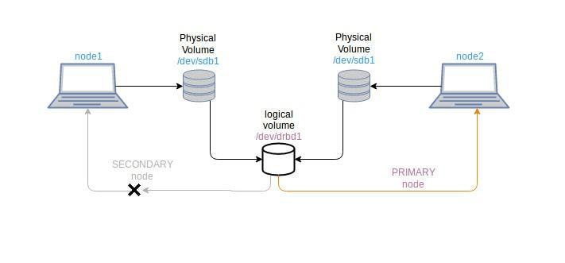

 #### drbd 설정 개요

두 개의 centos 시스템에서 스토리지 파티션을 클러스터링한다고 가정하면 두 시스템 모두에 /dev/ sdb1과 같은 블록 장치가 필요합니다. 이러한 시스템은 기본 노드 및 보조 노드 (기본 및 보조 노드를 전환 할 수 있음)로 정의됩니다. DRBD는 가상 블록 장치 (drbd0와 같은)를 사용하여 두 시스템의 /dev/sdb1 블록 장치를 공유합니다. 기본 노드는 가상 드라이브 drbd0 이 읽기/쓰기 목적으로 마운트 된 노드입니다.

 먼저 가상 디스크 drbd0을 만드는 데 사용되는 DRBD 패키지를 설치해야합니다. /dev/drbd0 장치를 사용하기 위해 xfs 또는 ext3 파일 시스템으로 포맷 할 수 있습니다.

drbd0 장치는 두 시스템 모두에서 /dev/sdb1 블록 장치를 사용하도록 구성되어 있습니다. 우리는 이제 drbd0 장치에서만 작동합니다.

 drbd0은 기본 노드에만 마운트 할 수 있으므로 contents 는 한 번에 기본 노드에서만 액세스됩니다. 어쨌든 기본 시스템이 중단되면 시스템 파일이 손실 될 수 있지만 가상 장치 drbd0을 사용할 수 있습니다. 초기 보조 노드를 기본 노드로 전환하고 내용에 다시 액세스 할 수 있습니다.

### CentOS에서 DRBD 사용

 이 튜토리얼은 CentOS 7에서 수행되었지만 다른 CentOS 버전에서도 작동합니다. [CentOS 버전을 확인하는 방법](https://linuxhandbook.com/check-centos-version/)을 알아 보려면이 내용을 읽으십시오.

#### 요구 사항

- Centos 설치 시스템 2 개

- 두 시스템 모두에서 /dev/sdb1과 같은 무료 블록 장치 (같은 크기를 선호 함)

- Selinux 허용 또는 비활성화

  ```
  vi /etc/sysconfig/selinux
  
  SELINUX=disabled
  
  reboot
  ```

  

- 방화벽에서 포트 7788 허용

  ```
  firewall-cmd --permanent --add-port=7788/tcp
  
  firewall-cmd --reload
  
  firewall-cmd --list-all
  ```

  

-  노드는 동일한 네트워크 내에 있어야합니다.

#### Installation

 drbd 패키지는 centos 배포판에서 사용할 수 없으므로 epel 저장소를 추가하여 설치합니다.

```sh
$ rpm -ivh http://www.elrepo.org/elrepo-release-7.0-2.el7.elrepo.noarch.rpm
$ rpm -ivh http://www.elrepo.org/elrepo-release-7.0-4.el7.elrepo.noarch.rpm

```

두 노드 모두에 GPG 키를 추가하십시오. GPG 키는 노드 간 통신을 암호화하는 데 사용되는 공개 키입니다.

```sh
$ rpm --import /etc/pki/rpm-gpg/RPM-GPG-KEY-elrepo.org
```

 이제 yum을 사용하여 drbd 패키지를 설치할 수 있습니다. 커널이 지원하는 drbd 버전을 식별해야합니다. 커널에 사용 가능한 drbd 버전을 확인하십시오.

```sh
$ yum info *drbd* | grep Name
```

 출력은 다음과 같습니다.

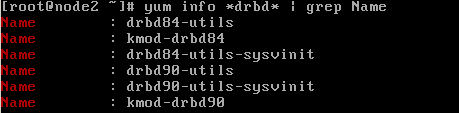

 이제 필요한 커널 모듈과 함께 필요한 버전의 drbd를 설치하십시오.

```sh
$ yum -y install drbd90-utils kmod-drbd90
```

 커널 모듈의 로드 여부를 확인하십시오.

```sh
$ lsmod | grep -i drbd
```

위 명령의 응답이 빈 출력을 제공하면 커널 모듈이로드되지 않습니다. 

**시스템을 재부팅**하고 다음을 시도하십시오.

```sh
$ modprobe drbd
```

 modprobe는 Linux 커널에서 모듈을 지능적으로 추가하거나 제거하는 명령입니다. 부팅 할 때마다 모듈을로드하기 위해 systemd-modules-load 서비스가 사용됩니다. 따라서 /etc/modulesload.d 안에 drbd.conf라는 파일을 만듭니다.

```sh
$ echo drbd > /etc/modules-load.d/drbd.conf
```

###  DRBD 구성

 DRBD 구성 파일은 /etc/drbd.d/에 있습니다.
기본적으로 /etc/drbd.d/global_common.conf는 전역 또는 기본 구성을 포함하는 전역에서 사용할 수 있습니다. 다른 구성 파일은 * .res 확장자를 가진 자원 파일이라고합니다.
이제 지정된 블록 장치에 drbd를 사용하기 위해 두 노드 모두에 리소스 구성 파일을 만듭니다.

 

Linuxhandbook.res라는 리소스 파일을 생성 합니다.

```sh
$ vi /etc/drbd.d/linuxhandbook.res
```

 아래 내용을 복사하여 리소스 파일에 붙여 넣습니다.

```
resource linuxhandbook {
protocol C;          
on node1 {
                device /dev/drbd0;
                disk /dev/sdb1;
                address 192.168.194.143:7788;
                meta-disk internal;
                }
on node2 {
                device /dev/drbd0;
                disk /dev/sdb1;
                address 192.168.194.144:7788;
                meta-disk internal;
                }
} 
```

-- 현재 내 가상버신 에는 **disk /dev/sdb1;** => **disk /dev/sdb;** 로 되어 있음. 다음 명령어로 확인

```bash
$ lsblk
```


`linuxhandbook.res` 설명

-  linuxhandbook은 리소스 이름입니다. 리소스 이름은 항상 고유해야합니다.
-  protocol C는 동기식 통신에 사용됩니다. 완전 동기식 복제 프로토콜입니다. 사용 가능한 다른 프로토콜은 프로토콜 A와 프로토콜 B입니다. 
  - 프로토콜 A : 비동기 복제 프로토콜. 일반적으로 장거리 네트워크의 노드에 적합합니다.
  -  프로토콜 B : semi 동기식 복제 프로토콜. 메모리 동기 프로토콜이라고도합니다.
  -  프로토콜 C : 근거리 네트워크의 노드에 적합합니다.
-  node1과 node2는 개별 노드의 호스트 이름입니다. 블록을 식별하는 데만 사용합니다.
-  device /dev/drbd0 은 장치로 사용하기 위해 생성 된 논리 장치입니다.
-  disk /dev/sdb1은 drbd0 이 차지할 물리적 블록 장치입니다.
- 주소 192.168.194.143:7788 및 주소 192.168.194.144:7788은 열린 tcp 포트 7788 이있는 두 개의 각 노드의 ipaddress입니다.
-  meta-disk internal 는 디스크의 초기 메타 데이터를 사용하도록 정의하는 데 사용됩니다.

 **두 노드에서 구성이 동일해야합니다.**

 이제 각 노드에서 메타 데이터 스토리지를 초기화해야합니다.

```sh
$ drbdadm create-md linuxhandbook
```

오류가 발생하면 더미 데이터 파일을 수동으로 작성하고 나중에 위의 명령을 다시 시도해야합니다.

```sh
-- 오류 발생시 실행 (wonsool 2020.02.10)
$ dd if=/dev/zero of=/dev/sdb1 bs=1024k count=1024
```

dd 명령은 지정된 메모리의 임의 파일을 작성하는 데 사용됩니다.
create-md 명령은 성공해야합니다.

논리 장치를 사용할 수있게되면 drbd0 장치를 두 노드의 sdb1 디스크에 연결하십시오. 

lsblk의 출력 참조

```sh
$ lsblk
```

 출력은 다음과 같아야합니다.

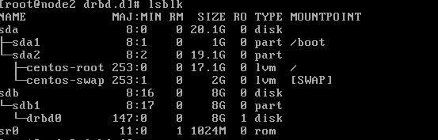

그렇지 않은 경우 자원 파일을 통해 drbd0 장치를 sdb1 디스크에 연결하십시오.

```sh
$ drbdadm attach linuxhandbook
또는
-- 이 명령이 적용됨
$ drbdadm up linuxhandbook

다시 확인
$ lsblk
```

 두 노드 모두에서 drbd 서비스를 시작하고 활성화하십시오.

```sh
$ systemctl start drbd
$ systemctl enable drbd
```

 drbd start가 한 노드에서 빠르면 다른 노드에 시간이 걸릴 수 있습니다.


#### 기본 및 보조 노드 설정

DRDB는 한 번에 **하나의 node 만** 읽기 및 쓰기를 수행 할 수있는 **primary 노드**로 사용합니다.

 먼저 node1을 primary 노드로 지정합니다.

```sh
$ drbdadm primary linuxhandbook --force
```

 drbd 프로세스의 상태를 확인하십시오.

```sh
$ cat /proc/drbd 
또는 
$ drbd-overview
```

결과는 다음과 같습니다.

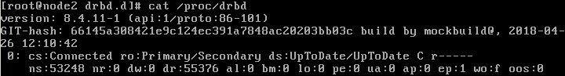

 

여기서 얻을 수있는 정보는 다음과 같습니다.

-  현재 어느 노드가 primay이고 어떤 노드가 secondary인지 나타냅니다.
   - Primary/Secondary 로 되어 있으면 primary 이고 Secondary/Primary 로 되어 있으면 secondary 임.
-  데이터 동기화 프로세스.
-  drbd 장치 상태. like: Inconsistent, Uptodate, Diskless.

 다른 노드 인 node2는 자동으로 secondary 노드로 설정됩니다. drbd 개요 프로세스 상태를 참조하십시오.

아직 수행하지 않은 주요 단계는 **drbd0 장치를 포맷**하는 것입니다. 이는 **노드 중 하나에서만 수행** 해야 합니다.
여기에서 drbd0을 ext4으로 포맷합니다. xfs 파일 시스템도 작동합니다. /dev/sdb1과 동일한 디스크 유형을 사용하는 것이 좋습니다.

```sh
$ mkfs -t ext4 /dev/drbd0
```

 이제 다시 기본 노드에서 (예 :이 자습서의 node1) drbd0 장치를 마운트해야 작동 할 수 있습니다.

```sh
$ mount /dev/drbd0  /mnt 
```

 /mnt 대신 필요한 마운트 지점을 선택할 수 있습니다. 예를 들어, /dev/drbd0 장치를 /home/mysql/data 에 마운트하여 mysql 데이터베이스를  drbd에서 사용할 수 있습니다.

```
NOTE
항상 프로세스를 기억하십시오. 먼저 노드를 DRBD의 primary 노드로 만들어야합니다. 그런 다음 drbd0 장치를 시스템에 마운트하면 장치에서 작업을 수행 할 수 있습니다. 노드를 primary 노드로 설정하지 않으면 drb0 장치를 마운트 할 수 없으며 해당 장치의 내용을 사용할 수 없습니다.
```


### DRBD 프로세스 테스트

drbd가 두 노드 모두에 설정되면 하나의 노드가 primary 노드가됩니다. /mnt 위치에 장치를 마운트했습니다. 이제 drbd 노드의 동기화를 테스트 할 파일을 작성하십시오.

```sh
$ touch  /mnt/drbdtest.txt
$ ll /mnt/
```

그런 다음 node1을 secondary로 설정하고 node2를 primary로 설정합니다. 이 과정은 유사하게 반영됩니다. 노드 1 (인스턴스 기본 노드)에서 /dev/drbd0 장치를 마운트 해제하고 보조 장치로 만드십시오. node2 (인스턴스 secondary 노드)에서 primary 노드로 만들고 필요한 위치에 마운트하십시오.

 노드 1에서 :

```sh
$ umount  /mnt
$ drbdadm secondary linuxhandbook
```

노드 2에서 :

```sh
$ drbdadm primary linuxhandbook
$ mount /dev/drbd0  /mnt
```

node2에 마운트 한 후 /mnt 폴더의 파일을 확인하십시오. drbdtest.txt 파일 (node1에 작성)이 표시되어야합니다.

```sh
$ ll  /mnt/
```

drbd 클러스터 노드를 관리하고 시각화하기위한 GUI 인터페이스가 필요한 경우 [LCMC](http://lcmc.sourceforge.net/) (Linux Cluster Management Console)를 사용할 수 있습니다.


# DRBD 사용자 안내서

출처: [https://allthatlinux.com/dokuwiki/doku.php?id=drbd_%EC%82%AC%EC%9A%A9%EC%9E%90_%EC%95%88%EB%82%B4%EC%84%9C](https://allthatlinux.com/dokuwiki/doku.php?id=drbd_사용자_안내서)


## DRBD 소개

### DRBD 기본 사항

DRBD는 호스트간에 블록 장치 (하드 디스크, 파티션, 논리 볼륨 등)의 컨텐츠를 미러링하는 소프트웨어 기반의 공유 기능이없는 복제 된 스토리지 솔루션입니다.
DRBD는 데이터를 미러링합니다.

- 실시간으로. 응용 프로그램이 장치의 데이터를 수정하는 동안 복제가 계속 발생합니다.
- 투명하게. 응용 프로그램은 데이터가 여러 호스트에 저장되어 있다는 것을 인식 할 필요가 없습니다.
- 동기 또는 비동기. 동기식 미러링을 사용하면 응용 프로그램은 모든 (연결된) 호스트에서 쓰기가 수행 된 후 쓰기 완료를 알립니다. 비동기 미러링을 사용하면 응용 프로그램이 로컬에서 완료 될 때 쓰기 완료를 통보 받게됩니다. 일반적으로 쓰기가 완료되면 다른 호스트로 전파됩니다.

### 커널 모듈

DRBD의 핵심 기능은 Linux 커널 모듈을 통해 구현됩니다. 특히, DRBD는 가상 블록 장치 용 드라이버를 구성하므로 DRBD는 시스템의 I / O 스택 맨 아래에 있습니다. 이 때문에 DRBD는 매우 유연하고 다양한 기능을 제공하므로 모든 응용 프로그램에 고 가용성을 추가하는 데 적합한 복제 솔루션입니다.

DRBD는 정의에 따라 Linux 커널 아키텍처가 위임 한대로 계층 위의 계층을 불가지론합니다. 따라서 DRBD가 갖고 있지 않은 상위 계층에 기능을 기적적으로 추가하는 것은 불가능합니다. 예를 들어, DRBD는 파일 시스템 손상을 자동 감지하거나 ext3 또는 XFS와 같은 파일 시스템에 활성 - 활성 클러스터링 기능을 추가 할 수 없습니다.

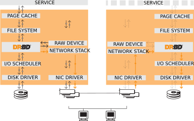

## DRBD 특징

### Single-primary mode : 단일 기본 모드 : 싱글 마스터

단일 기본 모드에서 자원은 주어진 시간에 단 하나의 클러스터 구성원에 대한 기본 역할에 있습니다. 언제든지 하나의 클러스터 노드 만 데이터를 조작하도록 보장되므로이 모드는 기존 파일 시스템 (ext3, ext4, XFS 등)과 함께 사용할 수 있습니다.

단일 기본 모드에서 DRBD를 배포하는 것은 고 가용성 (장애 조치 가능) `클러스터에 대한 표준 접근 방식`입니다.

### Dual-primary mode : 이중 기본 모드 : 멀티 마스터

이중 기본 모드에서 자원은 주어진 시간에 두 개의 클러스터 노드에서 주 역할을 수행합니다. 데이터에 대한 동시 액세스가 가능하기 때문에이 모드에서는 `분산 잠금 관리자를 사용하는 공유 클러스터 파일 시스템을 사용해야`합니다. 예로는 GFS 및 OCFS2가 있습니다.

듀얼 기본 모드에서 DRBD를 배포하는 것은 두 노드에서 동시에 데이터 액세스가 필요한 클러스터의로드 균형 조정에 적합한 방법입니다 (예 : 실시간 마이그레이션이 필요한 가상화 환경 이 모드는 기본적으로 비활성화되어 있으므로 DRBD의 구성 파일에서 명시 적으로 활성화해야합니다.

특정 자원에 대한 이중 기본 모드 활성화에 대한 정보는 이중 기본 모드 활성화를 참조하십시오 .

```
현재 DRBD-9.0 버전을 이중 기본 모드로 실행하는 것은 권장되지 않습니다 (테스트 부족으로 인해).
DRBD-9.1에서는 동시에 2 개 이상의 마스터노드를 가질 수 있습니다.
```


### 복제 모드

DRBD는 3 가지 복제 모드를 지원하여 3 가지 복제 동시성을 허용합니다.

#### 프로토콜 A : Async

비동기 복제 프로토콜. 기본 노드에서의 로컬 쓰기 작업은 로컬 디스크 쓰기가 완료되고 복제 패킷이 로컬 TCP 송신 버퍼에 배치되는 즉시 완료된 것으로 간주됩니다. 강제 장애 조치 (failover)가 발생할 경우 데이터 손실이 발생할 수 있습니다. 대기 노드의 데이터는 장애 극복 후 일관성이 있습니다. 그러나 충돌 이전에 수행 된 가장 최근 업데이트가 손실 될 수 있습니다. 프로토콜 A는 장거리 복제 시나리오에서 가장 자주 사용됩니다. DRBD 프록시와 함께 사용하면 효과적인 재해 복구 솔루션이됩니다. 자세한 내용은 DRBD 프록시를 통한 장거리 복제를 참조하십시오.

#### 프로토콜 B : Semi-Async

메모리 동기 (반 동기) 복제 프로토콜 기본 디스크 쓰기가 발생하고 복제 패킷이 피어 노드에 도달하면 즉시 기본 노드의 로컬 쓰기 작업이 완료된 것으로 간주됩니다. 일반적으로 강제 장애 조치 (failover)의 경우 쓰기가 손실되지 않습니다. 그러나 두 노드에서 동시에 전원이 중단 되고 동시에 주 데이터 저장소가 비가 역적으로 파괴되는 경우 주 노드에서 완료된 최신 쓰기가 손실 될 수 있습니다.

#### 프로토콜 C : Sync

동기 복제 프로토콜. 기본 노드의 로컬 쓰기 작업은 로컬 디스크 쓰기와 원격 디스크 쓰기가 모두 확인 된 후에 만 완료된 것으로 간주됩니다. 따라서 단일 노드의 손실로 인해 데이터 손실이 발생하지 않습니다. 물론 모든 노드 (저장소 하위 시스템)가 동시에 비가역 적으로 파괴되는 경우이 복제 프로토콜을 사용하더라도 데이터 손실이 불가피합니다.

지금까지 DRBD 설정에서 가장 `일반적으로 사용되는 복제 프로토콜은 프로토콜 C`입니다.

복제 프로토콜의 선택은 배포의 두 가지 요소 인 보호 및 대기 시간에 영향을줍니다 . 대조적으로 처리량은 선택된 복제 프로토콜과 크게 독립적입니다.

https://docs.linbit.com/docs/users-guide-9.0/


# VMware 에 HDD 추가 및 DRBD 에서 사용하기

이번장 에서는 WMware 에 HDD 를 추가 하여 DRBD 를 이용한 이중화 에 사용 하기 위한 방법을 기술 합니다.

설치 OS 는 CentOS-7.6 을 이용 합니다.  이 문서는 VMware Workstation 을 이용하여 Linux 를 설치 하는 방법을 아는 사용자를 기준으로 설명 합니다. 따라서 설치 전체 과정을 기술 하지는 않으며, 설치시 필요한 부분만 기술 하도록 합니다.


### node1 centos 설치

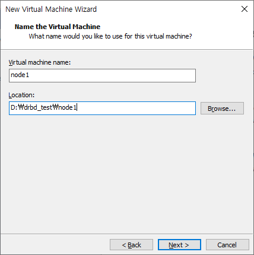

기본 HDD 는 40G 를 설정 하고, cpu 4 개, memory 4G 를 설정 합니다. 


네트워크 & 호스트 설정 부분에서 호스트 이름을 node1 으로 바꿉니다.

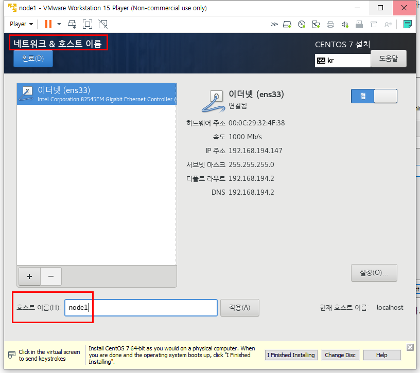


설치가 완료 되었으면 vmware 에서 guest os( 설치된 node1) 을 종료 합니다.

vmware 에서 종료된 node1 을 선택 후

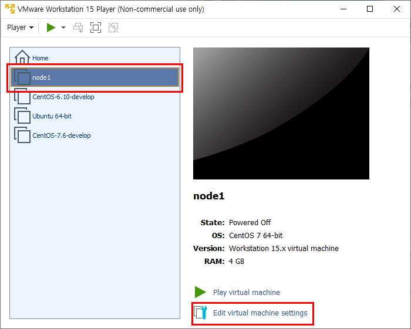


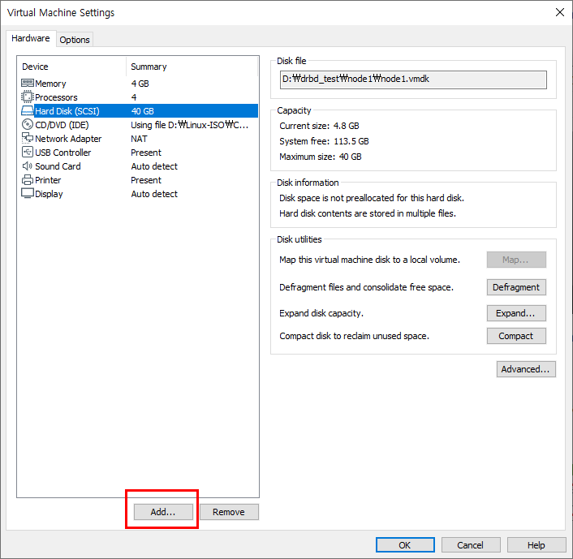


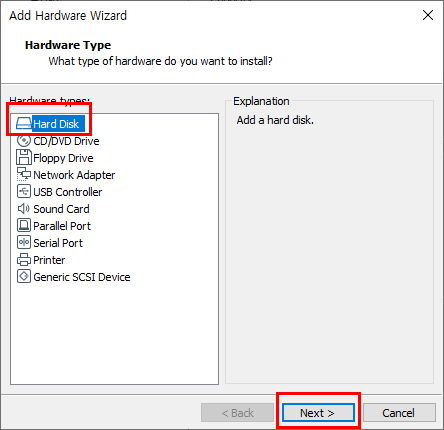


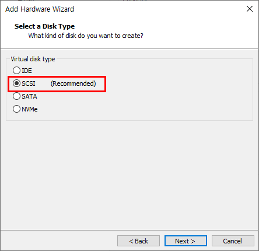


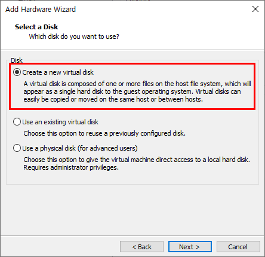


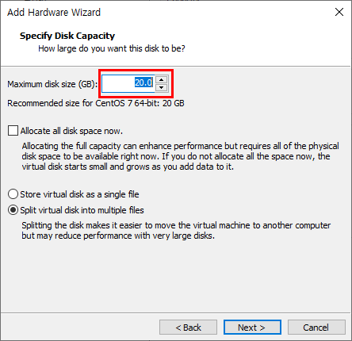


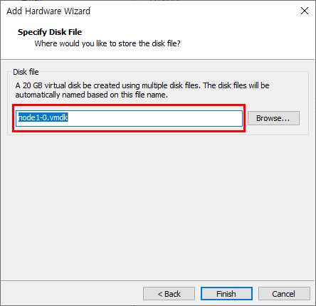


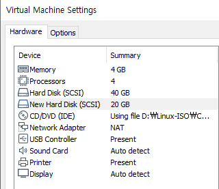


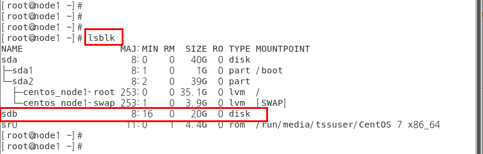


### node2 centos 설치

node2 centos 도 동일한 과정으로 설치 하며 호스트 이름 부분만 node2 로 하여 설치 합니다.