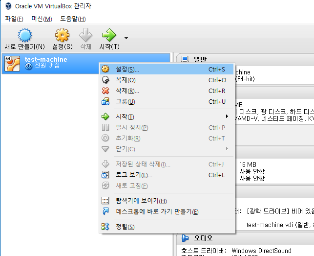
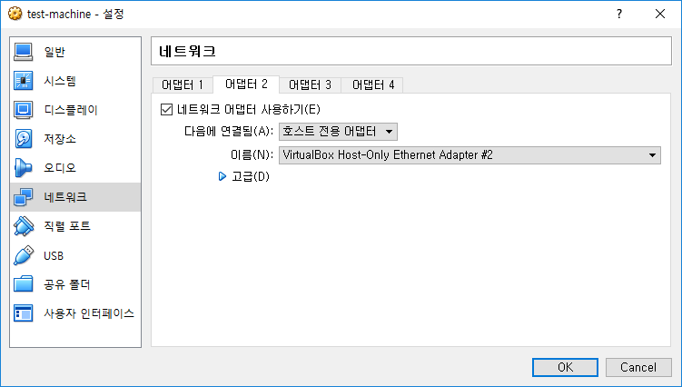
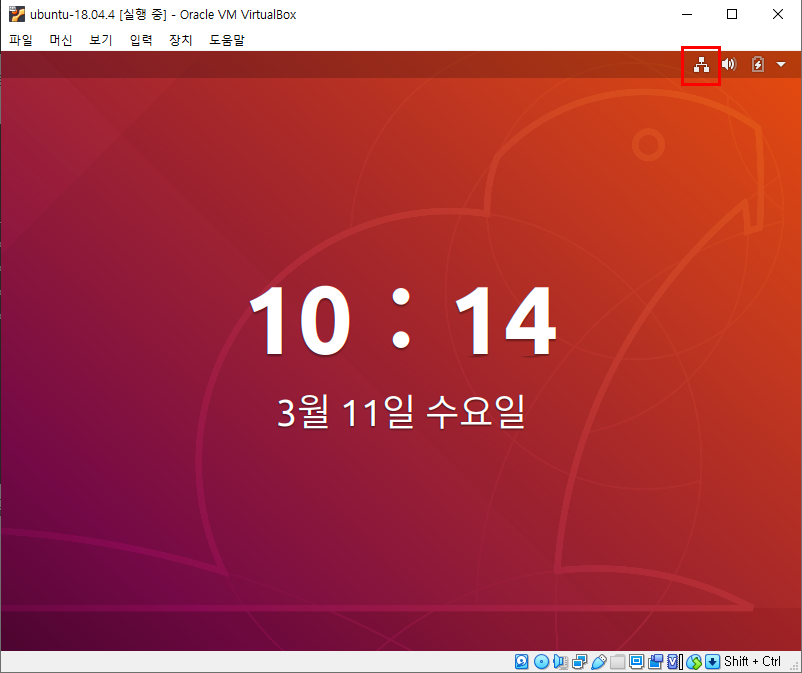
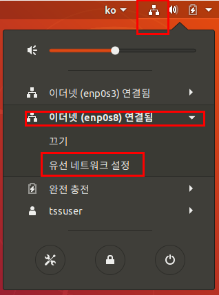

# VirtualBox 호스트 전용 어댑터 설정

출처: https://blog.hkwon.me/virtualbox-hoseuteu-jeonyong-eodaebteo-seoljeong-2/


`VirtualBox`에서 기본으로 `vm`을 설치하면 NAT 네트워크로 연결이 되서 그냥 ssh client로 접속하는데 꽤 불편하다.

호스트 전용 어탭터 설정을 통해 내부 고정 IP로 세팅하는 방법을 기술해본다.

Windows 기준이지만 mac도 거의 동일하다.

## VirtualBox 환경설정에서 어댑터 IP 확인

VirtualBox- 파일 - 호스트 네트워크 관리자 메뉴에서 어댑터의 IPv4 주소를 확인 한다. 또 DHCP 기능은 사용하지 않으므로 체크되지 않는 것을 확인한다.


예제는 `192.168.99.1` 인 것을 볼 수 있다. (**개인마다 다름**)


## VM 설정에서 어댑터 추가

VM설정에서 환경설정에서 추가한 어댑터를 추가한다. VM이 종료된 상태에서 작업을 진행해야 한다.



어댑터2번에 신규로 추가한 `#2`번 의 호스트 전용 어댑터를 추가한다.



GUEST OS를 시작한다.

## GUEST OS 네트워크 설정

ifconfig으로 현재 어댑터 정보를 확인해본다.

```bash
$ ifconfig -a
enp0s3    Link encap:Ethernet  HWaddr 08:00:27:ec:8e:1c  
          inet addr:10.0.2.15  Bcast:10.0.2.255  Mask:255.255.255.0
          inet6 addr: fe80::a00:27ff:feec:8e1c/64 Scope:Link
          UP BROADCAST RUNNING MULTICAST  MTU:1500  Metric:1
          RX packets:6 errors:0 dropped:0 overruns:0 frame:0
          TX packets:56 errors:0 dropped:0 overruns:0 carrier:0
          collisions:0 txqueuelen:1000 
          RX bytes:1596 (1.5 KB)  TX bytes:7105 (7.1 KB)

enp0s8    Link encap:Ethernet  HWaddr 08:00:27:86:ed:d1  
          UP BROADCAST RUNNING MULTICAST  MTU:1500  Metric:1
          RX packets:0 errors:0 dropped:0 overruns:0 frame:0
          TX packets:0 errors:0 dropped:0 overruns:0 carrier:0
          collisions:0 txqueuelen:1000 
          RX bytes:10303 (0.0 KB)  TX bytes:0 (0.0 KB)

lo        Link encap:Local Loopback  
          inet addr:127.0.0.1  Mask:255.0.0.0
          inet6 addr: ::1/128 Scope:Host
          UP LOOPBACK RUNNING  MTU:65536  Metric:1
          RX packets:164 errors:0 dropped:0 overruns:0 frame:0
          TX packets:164 errors:0 dropped:0 overruns:0 carrier:0
          collisions:0 txqueuelen:1 
          RX bytes:12080 (12.0 KB)  TX bytes:12080 (12.0 KB)
```

`enp0s3` 로 현재 nat 어댑터로 구성이 되어 있고 신규로 `enp0s8` 어댑터에 대해서 호스트 전용 네트워크를 설정한다.


네트워크 설정 절차는 다음 그림들을 참조 합니다.



화면 우측 상단의 네트워크 아이콘을 클릭 한다.


 

어댑터2 에 연결되어 있는 이더넷(enp0s8) 선택 후 유선 네트워크 설정을 선택 한다.


 

우측의 설정 버튼을 누른다.


 

IPv4 탭 에서 주소, 네트마스크, 게이트웨이, 네임서버를 입력 한다.

게이트웨이는 어댑터 IP 를 입력 하고, 주소에는 동일한 IP 대역중 사용하지 않는 번호를 입력 한다.


위 설정이 끝나면 SSH 를 연결할 준비가 된것으로 SSH 가 설치되어 있지 않은 경우는 다음을 참조 한다.

```
$ dpkg -l | grep openssh-server
$ sudo apt-get install openssh-server
$ sudo service ssh start
```


### CentOS 의 경우 설정

```bash
$ vi /etc/sysconfig/network-scripts/ifcfg-enp0s8 


TYPE=Ethernet
PROXY_METHOD=none
BROWSER_ONLY=no
BOOTPROTO=none
DEFROUTE=yes
IPV4_FAILURE_FATAL=no
IPV6INIT=yes
IPV6_AUTOCONF=yes
IPV6_DEFROUTE=yes
IPV6_FAILURE_FATAL=no
IPV6_ADDR_GEN_MODE=stable-privacy
NAME=enp0s8
UUID=939e6ab8-88fc-49ff-aa31-6d8201b3b0c5
DEVICE=enp0s8
ONBOOT=yes
IPADDR=192.168.99.117
PREFIX=24
GATEWAY=192.168.99.1
DNS1=8.8.8.8

ONBOOT=no 를 ONBOOT=yes 로 바꾼다.
```


