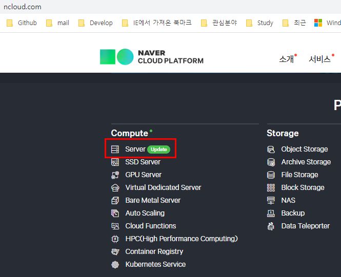

# 네이버 클라우드 플랫폼 Micro 생성하는 방법

출처: https://mainia.tistory.com/5615

네이버는 얼마전부터 클라우드 플랫폼 서비스를 본격적으로 시작했습니다. 이미 많은 곳에서 사업을 진행하고 있는데, 대표적인 곳이 AWS(아마존 웹 서비스), Azure(마이크로소프트 애저), Google Cloud Platform 등입니다. 국내 서비스는 스마일 서브, 스쿨호스팅, 우비, 카페24, 퍼니오 등이 있습니다. 가격은 비슷합니다. 네이버가 얼마나 경쟁력을 가지고 살아 남을지 지켜 봐야겠네요. 오늘은 네이버에서 제공하는 클라우드 플랫폼 중에서 무료로 사용할 수 있는 Micro 리눅스 서버를 생성하는 방법에 대해 알아 보겠습니다.

“네이버 클라우드” 로 검색합니다. 검색 결과에서 B2B전용을 클릭해서 사이트에 접속합니다. 실제 주소는 다음과 같습니다. https://www.ncloud.com/

서버를 생성하기 전에 회원가입을 먼저 해야 합니다. 네이버 계정이 있다고 해서 바로 로그인할 수 있는 건 아닙니다. 회원가입 후 네이버 계정과 연결은 가능합니다. 로그인 후 메인 화면에서 **Server** 를 클릭합니다. 

