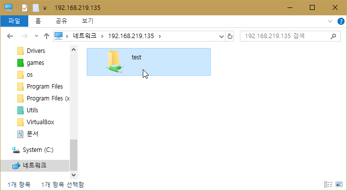
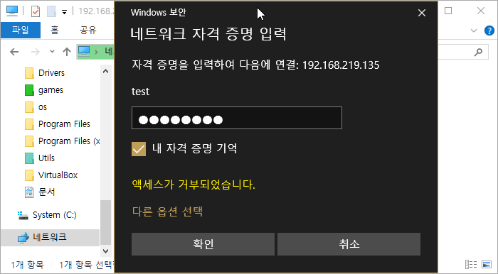

# 우분투에서 samba 설치 및 설정

출처: https://topis.me/92

삼바(samba)는 Windows 운영체제를 사용하는 PC에서 Linux 또는 UNIX 서버에 접속하여 파일이나 프린터를 공유하여 사용할 수 있도록 해 주는 소프트웨어이다. = 위키백과

오늘은 우분투에 samba를 설치하고 samba 계정 추가, 삭제 등 삼바를 사용하는 전반적인 방법에 대해 알아보겠다. 필자의 시스템이 우분투라서 '우분투에서'라는 수식어를 달았는데 대부분의 리눅스 데비안(Debian), 페도라(Fedora), CentOS, 라즈베리 파이(Raspberry Pi) 등 많은 리눅스에서 아래의 설정으로 사용 가능하다.

## samba(삼바) 설치

```
tssuser@ubuntu:~$ sudo apt-get install samba

```

위 명령으로 samba를 설치한다.


## samba 설정

```
tssuser@ubuntu:~$ sudo vi /etc/samba/smb.conf
```

해당 파일의 끝에 다음 설정 정보를 추가 한다.

``` ini
[user]
comment = welcome user
path = /home/folder
valid users = user
writable = yes
create mask = 0644
directory mask = 0755

# 위 부분은 설명을 위한 부분 이며 실제 예는 다음과 같다.
[tssuser]
comment = welcome user
path = /home/tssuser/samba_data
valid users = tssuser,root
writable = yes
create mask = 0644
directory mask = 0755
```

설정파일 설명

- [user] :  삼바를 이용할 대표 계정을 넣는다.   테스트를 위한 설정 에는 tssuser 를 설정 하였음.
- comment : welcome message
- path: 리눅스 시스템에서 공유할 디렉토리이다. 절대 경로로 설정한다.
- valid users: 접속을 허락할 계정을 적으면 된다. ','로 여러 계정을 추가할 수 있다. (예, user,testuser2,testuser3) 
- writable: samba 에 쓰기를 허용 하려면 yes 로 설정 하여야 한다.
- create mask: 파일 생성 시 속성값을 설정 한다.
- directory mask: directory 생성시 mask 값을 설정 한다.


## 리눅스에서 계정 추가 및 삭제

삼바와 별도로 리눅스에서는 계정을 관리하는 몇 가지 명령이 있다.

### 리눅스에서 계정 추가

```
$sudo adduser test
$sudo useradd test
```

둘 다 계정을 추가하는 명령이다. adduser를 사용하면 홈디렉토리, 패스워드 등을 물어온다. 즉, 계정에 필요한 정보들을 입력 할 수 있다. useradd는 계정만 추가되고 기타 설정은 따로 해줘야 한다. 어느 쪽을 사용해도 상관없지만 어차피 계정 추가 후 패스워드 등 기본 정보를 설정해야 한다면 adduser로 추가하는 걸 추천한다.

### 계정 정보 수정

참고로 계정 추가 후 다음의 명령으로 계정 정보를 수정할 수 있다.

```
$sudo usermod [옵션] [계정명]
```

옵션

-c : [Comment] - 계정 Comment를 수정한다.
-d : [Home Diretory] - 계정 홈 디렉토리를 수정한다.
-e : [Expiredate] - 계정 만기 날짜를 수정한다.
-L : [Lock User] - 사용자 계정을 잠근다.
-U : [Unlock] - 잠금처리되어 있는 계정을 풀어준다.
-h : [Help] - 명령어 옵션 설명을 표시해준다.

### 패스워드 설정

패스워드는 다음의 명령으로 추가나 수정이 가능하다.

```
$sudo passwd [계정명]
```

(예, $sudo passwd root) root 계정의 패스워드를 추가(최초 실행시)하거나 변경 할 수 있다.

### 계정 삭제

```
$sudo deluser [계정명]
```

위의 명령으로 더 이상 사용하지 않는 계정을 삭제할 수 있다.

## 삼바 패스워드 설정

다시 삼바로 돌아와 리눅스에서 추가한 계정의 패스워드를 설정한다. 삼바를 위해 꼭 리눅스 계정을 추가할 필요는 없다. 즉, 기존 계정을 사용해도 무방하다. 단 삼바에서 사용할 계정은 리눅스 시스템에도 등록되어 있는 계정 이여야 한다.

```bash
tssuser@ubuntu:~$ sudo smbpasswd -a tssuser
[sudo] password for tssuser:
New SMB password:
Retype new SMB password:
Added user tssuser.

```

삼바 이용 시 사용할 패스워드를 설정한다.


### 삼버에 등록된 유저 확인

참고로 삼바 서버에 등록된 유저를 확인을 하려면 아래의 명령으로 확인 가능하다.

```
$sudo pdbedit -L
```

좀 더 자세한 정보는 아래의 명령으로 확인 가능하다.

```
$sudo pdbedit -L -v
```


### 삼바에 등록된 유저 삭제

```
$sudo smbpasswd -x test
```

위 명령으로 삭제 가능하다.


### 삼바 재 시작

```
$sudo service smbd restart
```


## 윈도우(windows) 시스템에서 공유 폴더 확인

이제 원도우(windows) OS에서 리눅스에서 공유한 폴더가 잘 잡혀있는 확인한다. 보통의 경우 윈도우 탐색기에서 '네트워크'항목으로 들어가면 공유된 기기의 이름과 폴더가 표시되지만 표시되지 않는다면 \\[리눅스시스템의 ip]로 접근 가능하다. (예, \\192.168.219.135)



접근 시 삼바에서 설정한 패스워드를 입력한다.



쓰기가 가능한지 새 파일이나 폴더를 하나 만들어 테스트 한다. 이상 우분투 등 리눅스에서 samba 설치와 설정이었습니다.


