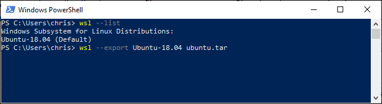
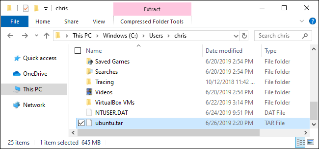
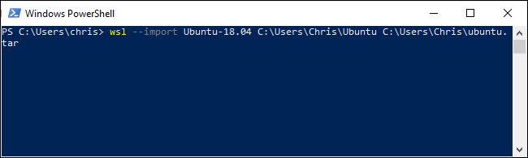
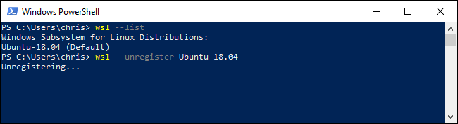

# WSL Export and Import

Windows 10에서 Linux 시스템을 내보내고 가져오는 방법

출처: https://www.howtogeek.com/426562/how-to-export-and-import-your-linux-systems-on-windows-10/


이제 Windows 10에서 [설치된 Linux 환경](https://www.howtogeek.com/249966/how-to-install-and-use-the-linux-bash-shell-on-windows-10/)을 내보내 다른 PC에서 가져올 수 있는 루트 파일 시스템의 TAR 파일을 만들 수 있습니다. 컴퓨터 간에 구성된 시스템을 복사하거나 다른 사람과 공유하거나 백업을 저장합니다.


### 작동 원리

가져오기 및 내보내기 기능은 2019년 5월 업데이트(Windows 10 버전 1903)에 추가되었습니다. 아직 설치하지 않은 경우 이러한 명령줄 옵션을 사용할 수 없습니다.

Windows wsl 명령에 대한 두 가지 새로운 옵션인 --export 및 --import만 있으면 됩니다. --export 옵션은 Linux 배포판의 루트 파일 시스템을 TAR 파일로 내보냅니다. --import 옵션을 사용하면 Linux 배포의 루트 파일 시스템을 TAR 파일로 가져올 수 있습니다.

**RELATED:** [***How to Install and Use the Linux Bash Shell on Windows 10\***](https://www.howtogeek.com/249966/how-to-install-and-use-the-linux-bash-shell-on-windows-10/)


### Linux 시스템 내보내기(백업) 방법

wsl 명령은 Windows 명령인 wsl.exe입니다. Linux용 Windows 하위 시스템 환경이 아닌 PowerShell 또는 명령 프롬프트 환경에서 실행해야 합니다. 시작 버튼을 마우스 오른쪽 버튼으로 클릭하거나 Windows+x를 누른 다음 'Windows PowerShell'을 클릭하여 열 수 있습니다.

설치된 배포판을 나열하려면 다음 명령을 실행합니다.

``` cmd
wsl --list
```

이제 다음 명령을 사용하여 배포판의 파일 시스템을 TAR 파일로 내보냅니다.

``` cmd
wsl --export distro_name file_name.tar
```

예를 들어 Ubuntu 18.04 시스템을 ubuntu.tar라는 파일로 내보내려면 다음을 실행합니다.

``` cmd
wsl --export Ubuntu-18.04 ubuntu.tar
```



이제 Linux 배포판의 파일 시스템이 포함된 TAR 파일이 생겼습니다. 꽤 표준적인 Ubuntu 18.04 LTS 시스템을 기반으로 만든 파일의 크기는 645MB였습니다. 배포판에 더 많은 소프트웨어를 설치했다면 더 커질 것입니다.



### Linux 시스템 가져오기(복원) 방법

--import 옵션과 함께 wsl 명령을 사용하여 이러한 방식으로 생성된 TAR 파일을 가져올 수 있습니다. PowerShell 또는 명령 프롬프트 창에서 다음 명령을 실행합니다.

``` cmd
wsl --import distro_name install_location file_name.tar
```

예를 들어 C:\Users\Chris\ubuntu.tar에 있는 TAR 파일에서 배포판을 가져와서 'Ubuntu-18.04'라고 부르고 C:\Users\Chris\ubuntu에 저장하려고 한다고 가정해 보겠습니다. 다음을 실행합니다.

``` cmd
wsl --import Ubuntu-18.04 C:\Users\Chris\ubuntu C:\Users\Chris\ubuntu.tar
```

Windows가 기본적으로 기본적으로 설치하는 위치를 일치시키려면 일반적으로 `C:\Users\NAME\AppData\Local\Packages.`의 자체 폴더에 있습니다. 예를 들어 Ubuntu를 `C:\Users\NAME\AppData\Local\Packages\Ubuntu`에 넣을 수 있습니다.



### Linux 시스템 등록 취소(삭제) 방법

이름과 함께 --unregister 옵션을 사용하여 배포판을 제거할 수 있습니다. 그러면 모든 Linux 배포 파일이 삭제됩니다.

설치된 모든 배포판을 보려면 다음 명령을 사용하십시오.

``` cmd
wsl --list
```

그런 다음 삭제할 배포를 지정합니다.

``` cmd
wsl --unregister distro_name
```

예를 들어 Ubuntu-18.04라고 하면 다음을 실행합니다.

``` cmd
wsl --unregister Ubuntu-18.04
```



<span style="color:red">또한 이 기능을 사용하면 설치된 배포판을 다른 폴더나 드라이브로 빠르고 쉽게 이동할 수 있습니다. 배포판을 TAR 파일로 내보내고 시스템에서 등록을 취소한 다음 TAR 파일을 시스템의 다른 위치로 가져오기만 하면 됩니다.</span>

