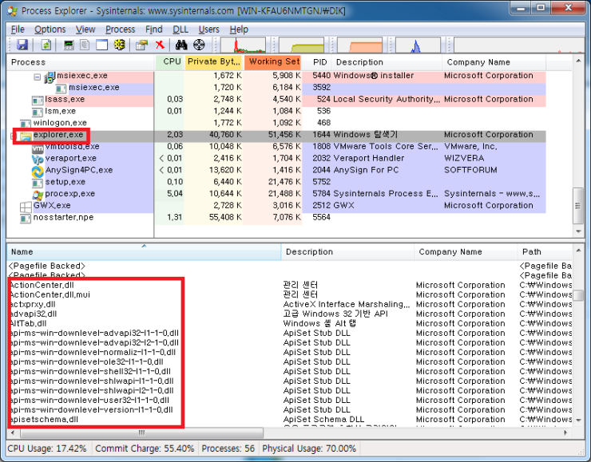

# DLL Injection

출처: https://reversecore.com/38?category=216978


## 다른 프로세스에 침투하기 - 1


### DLL Injection 이란?


다른 프로세스에 특정 DLL 파일을 **강제로 삽입**시키는 것입니다.

더 정확히 표현하면 다른 프로세스에게 LoadLibrary() API 를 호출하도록 명령하여 내가 원하는 DLL 을 loading 시키는 것입니다. 따라서 DLL Injection 이 일반적인 DLL loading 과 다른점은 loading 대상이 되는 프로세스가 내 자신이냐 아니면 다른 프로세스냐 하는 것입니다. 아래 그림을 봐주세요.


notepad 프로세스에 myhack.dll 을 강제로 삽입시켰습니다.
(원래 notepad 는 myhack.dll 을 로딩하지 않습니다.)

notepad 프로세스에 로딩된 myhack.dll 은 notepad 프로세스 메모리에 대한 (정당한) 접근권한이 생겼기 때문에 사용자가 원하는 어떤 일이라도 수행할 수 있습니다. (예: notepad 에 통신기능을 추가하여 메신저나 텍스트 웹브라우저 등으로 바꿔버릴 수도 있습니다.)


### DLL Injection 사용 목적

LoadLibrary() API 를 이용해서 어떤 DLL 을 로딩시키면 해당 DLL 의 DllMain() 함수가 실행됩니다.

DLL Injection 의 동작원리는 외부에서 다른 프로세스로 하여금 LoadLibrary() API 를 호출하도록 만드는 것이기 때문에 (일반적인 DLL loading 과 마찬가지로) 강제 삽입된 DLL 의 **DllMain() 함수가 실행**됩니다.

또한 삽입된 DLL 은 해당 프로세스의 **메모리에 대한 접근권한**을 갖기 때문에 사용자가 원하는 다양한 일(버그 패치, 기능 추가, 기타)을 수행 할 수 있습니다.

그런데 문제는 대부분 **악의적인 용도**로 사용된다는 것입니다.

**- 악성 코드**
정상적인 프로세스(winlogon.exe, services.exe, svchost.exe, explorer.exe, etc)에 몰래 숨어들어가 악의적인 짓들을 합니다. 다른 악성 파일을 다운받거나, 몰래 백도어를 열어두고 외부에서 접속하거나, 키로깅 등의 나쁜짓을 하는 것이죠.

정상 프로세스 내부에서 벌어지는 일이라서 일반적인 PC 사용자들은 눈치채기 어렵습니다.
만약 explorer.exe 가 80 포트로 어떤 사이트에 접속시도를 한다고 생각해보세요.
일반인들은 그냥 정상 프로세스의 정상적인 동작으로 생각하기 쉽습니다.

**- 유해 프로그램, 사이트 차단 프로그램**

부모님들께서 아이들의 건전한 PC 사용을 위해 설치하는 '프로세스 차단 프로그램' 등이 있습니다.
주로 게임 프로그램과 성인 사이트 접속 등을 방지하는 역할을 하지요.

아이들 입장에서야 원수(?)같은 프로그램이라서 미친듯이 해당 프로세스를 종료하려 듭니다.
DLL Injection 기법으로 정상 프로세스에 살짝 숨어들어간다면 들키지도 않고, 프로세스 강제 종료에도 안전하게 됩니다. (Windows 핵심 프로세스를 종료하면 시스템이 같이 종료되기 때문에 결국 '차단' 하려는 목적을 달성하는 셈이지요.)

**- 기능 개선 및 (버그) 패치** 

만약 어떤 프로그램의 소스 코드가 없거나 수정이 여의치 않을 때 DLL Injection 을 사용하여 전혀 새로운 기능을 추가하거나 (PlugIn 개념) 문제가 있는 코드, 데이타를 수정할 수 있습니다.
일단 프로세스 메모리에 침투한 DLL 은 해당 프로세스의 메모리에 자유롭게 접근 할 수 있기 때문에 코드, 데이타를 고칠 수 있습니다.
저도 예전에 인터넷에서 다운받은 헥사 에디터에 버그가 있길래 DLL Injection 기법을 이용해서 해당 버그 코드를 간단히 패치해서 사용한 적이 있습니다. (그냥 다른 헥사 에디터를 다운 받아도 써도 되지만 고쳐 쓰고 싶은 마음에... ^^)

**- API Hooking**

다음번에 설명드릴 주제인데요, API Hooking 에 DLL Injection 기법이 많이 사용됩니다.
정상적인 API 호출을 중간에서 후킹하여 제가 원하는 기능을 추가 (혹은 기존 기능을 제거)하는 목적으로 사용됩니다.

이 역시 삽입된 DLL 은 해당 프로세스의 메모리에 대한 접근 권한을 가지고 있다는 특성을 잘 활용한 것입니다.


### DLL Injection 간단 실습

notepad.exe 프로세스에 myhack.dll 을 injection 시키도록 하겠습니다.
=> myhack.dll 은 [www.naver.com/index.html](http://www.naver.com/index.html) 을 다운받도록 프로그래밍 하였습니다.

[ myhack.dll](https://reversecore.com/attachment/cfile21.uf@151C910B4A5F9CAA264F75.dll)

[ InjectDll.exe](https://reversecore.com/attachment/cfile23.uf@14338F0D4A5FA1312AD2B7.exe)


1) InjectDll.exe 와 myhack.dll 을 다운받아 C:\ 에 복사합니다.
2) 메모장(notepad.exe) 을 실행합니다.
3) InjectDll.exe 를 실행합니다.

Process Explorer 를 이용하여 notepad.exe 프로세스에 Injection 된 myhack.dll 을 확인해 보겠습니다.


notepad.exe 프로세스 메모리 공간에 myhack.dll 이 들어와 있는게 보이시죠?

C:\index.html (네이버 초기화면 html) 파일이 정상적으로 생겼는지 볼까요?


index.html 파일을 메모장으로 열어보겠습니다.


정상적으로 notepad.exe 프로세스에 myhack.dll 이 Injection 되어 http://www.naver.com/index.html 파일을 받아왔습니다.

이와 같이 다른 프로세스에 침투하여 원하는 동작을 마음껏 수행할 수 있는 Dll Injection 기법의 원리와 구현 방법에 대해서 알아보겠습니다.


## 다른 프로세스에 침투하기 - 2

몇 가지 구현 방법이 있습니다.

그 중에서 가장 유명한 방법이 **CreateRemoteThread() API 를 이용**하는 방법입니다.

이 방법은 윈도우즈 프로그래밍 서적의 바이블인 ***Jeffrey Richter\*** 의 ***[Programming Applications for Microsoft Windows ](http://www.amazon.com/Programming-Applications-Microsoft-Windows-General/dp/1572319968/ref=sr_1_1?ie=UTF8&s=books&qid=1247712516&sr=1-1)\***에 소개된 내용입니다.

일단 소스 코드를 보겠습니다. (엔지니어에게는 백 마디 설명 보다는 역시 소스 코드를 한번 보는게 낫죠.)

먼저 Injection 시킬 myhack.dll 소스 코드입니다.

[ myhack.cpp](https://reversecore.com/attachment/cfile5.uf@180A86214A5FA8FE2ACECA.cpp)

```c++
// myhack.cpp

#include "stdio.h"
#include "windows.h"

#pragma comment(lib, "urlmon.lib")

#define DEF_NAVER_ADDR ("http://www.naver.com/index.html")
#define DEF_INDEX_PATH ("c:\\index.html")

DWORD WINAPI ThreadProc(LPVOID lParam)
{
    URLDownloadToFile(NULL, DEF_NAVER_ADDR, DEF_INDEX_PATH, 0, NULL);
    return 0;
}

BOOL WINAPI DllMain(HINSTANCE hinstDLL, DWORD fdwReason, LPVOID lpvReserved)
{
    HANDLE hThread = NULL;

    switch( fdwReason )
    {
        case DLL_PROCESS_ATTACH :
            hThread = CreateThread(NULL, 0, ThreadProc, NULL, 0, NULL);
            CloseHandle(hThread);
            break;
    }
  
    return TRUE;
}
```

아주 간단한 코드입니다.

DllMain() 을 보시면 DLL 이 로딩(DLL_PROCESS_ATTACH)될 때 스레드(ThreadProc)를 실행합니다.

ThreadProc() 의 내용은 urlmon.dll 의 URLDownloadToFile() 함수를 실행시켜서 네이버 초기화면(index.html)을 다운받습니다.

프로세스에 DLL Injection 이 발생하면 해당 DLL 의 DllMain() 함수가 호출된다고 [이전 포스트](http://www.reversecore.com/38)에서 설명드렸습니다. 따라서 notepad.exe 프로세스에 myhack.dll 이 Injection 되면 결국 URLDownloadToFile() 함수가 실행될 것입니다.

** DLLMain() 에서 직접 URLDownloadToFile() 을 호출하면 간혹 hang 이 걸리는 경우가 있어서, 별도의 스레드를 생성하여 호출하도록 프로그래밍 하였습니다.*


이제 myhack.dll 을 notepad.exe 프로세스에 Injection 시켜줄 프로그램(InjectDll.exe)의 소스코드를 보시겠습니다.


[ InjectDll.cpp](https://reversecore.com/attachment/cfile3.uf@1726581F4A5FA924226707.cpp)


```c++
// InjectDll.exe

#include "stdio.h"
#include "windows.h"
#include "tlhelp32.h"

#define DEF_PROC_NAME ("notepad.exe")
#define DEF_DLL_PATH ("c:\\myhack.dll")

DWORD FindProcessID(LPCTSTR szProcessName);
BOOL InjectDll(DWORD dwPID, LPCTSTR szDllName);

int main(int argc, char* argv[])
{
    DWORD dwPID = 0xFFFFFFFF;
 
    // find process
    dwPID = FindProcessID(DEF_PROC_NAME);
    if( dwPID == 0xFFFFFFFF )
    {
        printf("There is no <%s> process!\n", DEF_PROC_NAME);
        return 1;
    }

    // inject dll
    InjectDll(dwPID, DEF_DLL_PATH); 

    return 0;
}

DWORD FindProcessID(LPCTSTR szProcessName)
{
    DWORD dwPID = 0xFFFFFFFF;
    HANDLE hSnapShot = INVALID_HANDLE_VALUE;
    PROCESSENTRY32 pe;

    // Get the snapshot of the system
    pe.dwSize = sizeof( PROCESSENTRY32 );
    hSnapShot = CreateToolhelp32Snapshot( TH32CS_SNAPALL, NULL );

    // find process
    Process32First(hSnapShot, &pe);
    do
    {
        if(!_stricmp(szProcessName, pe.szExeFile))
        {
            dwPID = pe.th32ProcessID;
            break;
        }
    }
    while(Process32Next(hSnapShot, &pe));

    CloseHandle(hSnapShot);

    return dwPID;
}

BOOL InjectDll(DWORD dwPID, LPCTSTR szDllName)
{
    HANDLE hProcess, hThread;
    HMODULE hMod;
    LPVOID pRemoteBuf;
    DWORD dwBufSize = lstrlen(szDllName) + 1;
    LPTHREAD_START_ROUTINE pThreadProc;
    
    // #1. dwPID 를 이용하여 대상 프로세스(notepad.exe)의 HANDLE을 구함
    if ( !(hProcess = OpenProcess(PROCESS_ALL_ACCESS, FALSE, dwPID)) )
        return FALSE;

    // #2. 대상 프로세스(notepad.exe) 메모리에 szDllName 크기만큼 메모리를 할당
    pRemoteBuf = VirtualAllocEx(hProcess, NULL, dwBufSize, MEM_COMMIT, PAGE_READWRITE);

    // #3. 할당 받은 메모리에 myhack.dll 경로("c:\\myhack.dll")를 씀
    WriteProcessMemory(hProcess, pRemoteBuf, (LPVOID)szDllName, dwBufSize, NULL);

    // #4. LoadLibraryA() API 주소를 구함
    hMod = GetModuleHandle("kernel32.dll");
    pThreadProc = (LPTHREAD_START_ROUTINE)GetProcAddress(hMod, "LoadLibraryA");

    // #5. notepad.exe 프로세스에 스레드를 실행
    hThread = CreateRemoteThread(hProcess, NULL, 0, pThreadProc, pRemoteBuf, 0, NULL);
    WaitForSingleObject(hThread, INFINITE); 

    CloseHandle(hThread);
    CloseHandle(hProcess);

    return TRUE;
}
```

역시 코드가 간결합니다. (편의상 예외처리, 리턴값 체크 등의 코드는 생략하였습니다.)

main() 함수에서는 2개의 서브 함수를 호출하고 있습니다.

FindProcessID(DEF_PROC_NAME) 함수는 프로세스 이름으로 PID(Process ID) 를 구해주는 함수입니다. (설명은 생략합니다.) 그리고 InjectDll(dwPID, DEF_DLL_PATH) 함수가 바로 DLL Injection 을 해주는 핵심 함수입니다.


InjectDll() 함수를 자세히 살펴보겠습니다.

InjectDll() 함수는 대상 프로세스(notepad.exe)로 하여금 스스로 **LoadLibrary("myhack.dll")** API 를 호출하도록 명령하는 기능을 가지고 있습니다.

**#1. 대상 프로세스 핸들 구하기
**
hProcess = OpenProcess(PROCESS_ALL_ACCESS, FALSE, dwPID))

OpenProcess() API 를 이용해서 notepad.exe 의 프로세스 핸들을 구합니다. (이때 미리 구해놓은 PID 를 사용함)
이 프로세스 핸들(hProcess)을 이용해서 해당 프로세스(notepad.exe)를 제어할 수 있습니다.

**#2-3. 대상 프로세스 메모리에 Injection 시킬 DLL 경로를 써주기
**
pRemoteBuf = VirtualAllocEx(hProcess, NULL, dwBufSize, MEM_COMMIT, PAGE_READWRITE);

대상 프로세스(notepad.exe)에게 로딩할 DLL 파일의 경로(문자열)를 알려줘야 합니다.
아무 메모리 공간에 쓸 수 없으므로 VirtualAllocEx() API 를 이용하여 대상 프로세스(notepad.exe) 메모리 공간에 버퍼를 할당합니다. 버퍼 크기는 DLL 경로 문자열 길이(NULL 포함)입니다. 

\* 주의! 
VirtualAllocEx() 함수의 리턴값(pRemoteBuf)은 할당된 버퍼 주소입니다. 이 주소는 내 프로세스(Inject.exe)의 메모리 주소가 아니라 hProcess 핸들이 가리키는 대상 프로세스(notepad.exe)의 메모리 주소라는것을 꼭 기억하시기 바랍니다.

WriteProcessMemory(hProcess, pRemoteBuf, (LPVOID)szDllName, dwBufSize, NULL);

할당 받은 버퍼 주소(pRemoteBuf)에 WriteProcessMemory() API 를 이용하여 DLL 경로 문자열("C:\\myhack.dll")을 써줍니다.

이로써 대상 프로세스(notepad.exe) 메모리 공간에 Injection 시킬 DLL 파일의 경로가 생겼습니다.

\* 참고
Win32 프로그래밍을 처음 배울 때 분명 다른 프로세스의 메모리에 읽고 쓰는 일이 어렵다고(혹은 불가능하다고) 배웠습니다. 하지만 실제로는 다른 프로세스의 메모리 공간에 접근을 못하면 운영체제도 답답해 집니다. (예를 들어 다른 프로세스 메모리에 접근 할 수 없다면 디버거 제작이 불가능해지지요.) 그래서 Windows 운영체제는 Debug API 를 제공하여 다른 프로세스 메모리 공간에 접근 할 수 있도록 하였습니다. 대표적인 Debug API 가 바로 위에서 소개해 드린 VirtualAllocEx(), VirtualFreeEx(), WriteProcessMemory(), ReadProcessMemory() 등이 있습니다.

**#4. LoadLibraryA() API 주소를 구하기**

hMod = GetModuleHandle("kernel32.dll");
pThreadProc = (LPTHREAD_START_ROUTINE)GetProcAddress(hMod, "LoadLibraryA");

LoadLibrary() API 를 호출시키기 위해 그 주소가 필요합니다.
(LoadLibraryA() 는 LoadLibrary() 의 ASCII 문자열 버전입니다.)

위 코드의 **의미**를 잘 생각해봐야 합니다.
우리는 분명 notepad.exe 에 로딩된 kernel32.dll 의 LoadLibraryA() API 의 시작 주소를 알아내야 합니다.
하지만 위 코드는 InjectDll.exe 에 로딩된 kernel32.dll 의 LoadLibraryA() API 의 시작 주소를 얻어내고 있습니다.

notepad.exe 에 로딩된 kernel32.dll 과 InjectDll.exe 에 로딩된 kernel32.dll 의 메모리 시작 위치(ImageBase)가 동일 하다면 위 코드는 문제가 없습니다.

일반적인 DLL 파일의 ImageBase 는 0x10000000 으로 설정되기 때문에 a.dll 과 b.dll 을 차례대로 로딩하면 a.dll 은 정상적으로 0x1000000 주소에 로딩이 되겠지만 b.dll 은 자신이 원하는 0x10000000 주소에 로딩되지 못하고 다른 비어 있는 주소 공간에 로딩됩니다. 즉, DLL Relocation 이 발생하는 것입니다. (a.dll 이 같은 주소에 이미 로딩되어 있기 때문입니다.)

만약 kernel32.dll 이 프로세스마다 다른 주소에 로딩된다면 위 코드는 잘못된 것입니다.
하지만 실제 Winodows 운영체제에서 kernel32.dll 은 프로세스마다 같은 주소에 로딩됩니다.

어째서 그런걸까요?

PE View 를 통해서 Windows 운영체제의 핵심 DLL 파일들의 ImageBase 값을 조사해 봤습니다.
(Windows XP SP3 KOR 버전입니다. Windows 업데이트 상태에 따라서 아래 값들은 달라질 수 있습니다.)

```
DLL file        ImageBase       SizeOfImage
--------------------------------------------
msvcrt.dll      77BC0000        00058000
user32.dll      77CF0000        00090000
gdi32.dll       77E20000        00049000
advapi32.dll    77F50000        000A8000
kernel32.dll    7C7D0000        00130000
shell32.dll     7D5A0000        007FD000
...
```

Microsoft 에서 친절하게 OS 핵심 DLL 파일들의 ImageBase 값을 이쁘게 정리해놨습니다.
즉, 자신들끼리 절대로 겹치지 않고 따라서 DLL Relocation 이 발생하지 않습니다.

Dll Injection 기법은 위와같이 OS 핵심 DLL 들은 자신만의 고유한 주소에 로딩된는 것을 보장해주는 Windows 특성을 이용한 것입니다. (이 특성이 Windows 보안 취약점으로 이용되기도 합니다.)

따라서 InjectDll.exe 프로세스에 import 된 LoadLibraryA() 주소와 notepad.exe 프로세스에 import 된 LoadLibraryA() 주소는 동일합니다.

\* 참고!
모든 Windows 프로세스는 kernel32.dll 을 로딩합니다.
PE Header 를 조작하여 IAT 에서 kernel32.dll 항목을 제거해버려도 loader 가 강제로 kernel32.dll 을 로딩시켜버립니다. (XP 부터 해당됨. 2000 에서는 실행불가.)

**#5. 대상 프로세스에 스레드를 실행 시킴**

모든 준비는 끝났고 마지막으로 notepad.exe 로 하여금 LoadLibraryA() API 를 호출하도록 명령만 내리면 됩니다. 하지만 Windows 에서는 그런 API 를 제공하지 않습니다.

그래서 편법(?)으로 CreateRemoteThread() API 를 사용합니다.
(편법이라기 보다는 DLL Injection 의 정석이라고 말 할 수 있지요.)

CreateRemoteThread() API 는 다른 프로세스에게 스레드를 실행시켜주는 함수입니다.

```c++
HANDLE WINAPI CreateRemoteThread(
  __in   HANDLE                   hProcess,             // 프로세스 핸들
  __in   LPSECURITY_ATTRIBUTES    lpThreadAttributes,
  __in   SIZE_T                   dwStackSize,
  __in   LPTHREAD_START_ROUTINE   lpStartAddress,       // 스레드 함수 주소
  __in   LPVOID                   lpParameter,          // 스레드 파라미터 주소
  __in   DWORD                    dwCreationFlags,
  __out  LPDWORD                  lpThreadId
);
```

첫번째 파라미터인 hProcess 만 빼면 일반적으로 사용되는 CreateThread() 함수와 다 똑같습니다.

hProcess 파라미터가 바로 스레드를 실행시킬 프로세스의 핸들입니다.
lpStartAddress 와 lpParameter 파라미터는 각각 스레드 함수 주소와 스레드 파라미터 주소입니다.
중요한건 이 주소들이 대상 프로세스의 가상 메모리 공간의 주소이어야 한다는 것입니다. (그래야 그 프로세스에서 인식을 할 수 있겠죠.)

좀 어리둥절 하시죠?
다른 프로세스에 DLL 을 injection 시키는데 스레드가 무슨 상관일까요?

스레드 함수 ThreadProc() 과 LoadLibrary() API 를 보시면 힌트를 얻을 수 있습니다.

```c++
DWORD WINAPI ThreadProc(
  __in  LPVOID           lpParameter
);

HMODULE WINAPI LoadLibrary(
  __in  LPCTSTR          lpFileName
);
```

두 함수 모두 4 byte 파라미터를 받고, 4 byte 값을 리턴하지요.
바로 여기서 아이디어를 얻은 것입니다.

CreateRemoteThread() 를 호출해서 4 번째 파라미터 *lpStartAddress* 에 "LoadLibrary() 주소"를 주고, 5 번째 파라미터 *lpParameter* 에 원하는 "DLL 의 경로" 문자열을 주면 됩니다. (반드시 대상 프로세스의 가상 메모리 공간에의 주소이여야 합니다.)

우린 이미 위에서 다 준비해놨지요. 편안하게 호출해주면 됩니다.

hThread = CreateRemoteThread(hProcess, NULL, 0, pThreadProc, pRemoteBuf, 0, NULL);

 *pThreadProc = notepad.exe 의 LoadLibraryA() 주소
 pRemoteBuf = notepad.exe 의 "c:\\myhack.dll" 문자열 주소*

**CreateRemoteThread() 는 스레드를 생성하는 것이 아니라 실제로는 LoadLibraryA() 를 호출 시키는 것입니다.**


+---+

CreateRemoteThread() 를 이용한 Dll Injection 기법에 대한 설명을 마치겠습니다.

처음에는 잘 이해가 되지 않을 수 있습니다. 설명을 다시 차근차근 읽어보시고 직접 실습해 보세요.

다음 번에는 다른 Dll Injection 기법들과 한번 Injection 된 Dll 을 꺼내는 (Ejection) 방법에 대해서 설명드리도록 하겠습니다.


## 다른 프로세스에 침투하기 - 3

```
앞에서 DLL Injection 의 개념에 대해서 알아보았고 CreateRemoteThread() API 를 이용하여 DLL Injection 을 실제로 구현 해보았습니다.

이번에는 DLL Injection 의 또 다른 구현 방법들에 대해서 알아보도록 하겠습니다.
```


### AppInit_DLLs

Windows 운영체제에서 기본으로 제공하는 레지스트리 키 중에서 AppInit_DLLs 란 것이 있습니다.

```ini
HKEY_LOCAL_MACHINE\SOFTWARE\Microsoft\Windows NT\CurrentVersion\Windows
  AppInit_DLLs
```


AppInit_DLLs 값에 인젝션을 원하는 DLL 경로를 써준 후 재부팅하면, 이후 Windows 운영체제는 재부팅하면서 실행되는 모든 프로세스에 해당 DLL 을 인젝션 시켜줍니다. 너무 간단하면서도 너무 강력한 기능이지요.

간단한 실습을 해보겠습니다. 일단 아래 myhack2.cpp 소스를 보시죠.

```c++
// myhack2.cpp

#include "windows.h"

#define DEF_CMD  "c:\\Program Files\\Internet Explorer\\iexplore.exe"
#define DEF_ADDR "www.naver.com"
#define DEF_DST_PROC "notepad.exe"

BOOL WINAPI DllMain(HINSTANCE hinstDLL, DWORD fdwReason, LPVOID lpvReserved)
{
    char szCmd[MAX_PATH]  = {0,};
    char szPath[MAX_PATH] = {0,};
    char *szProcess = NULL;
    STARTUPINFO si = {0,};
    PROCESS_INFORMATION pi = {0,};

    si.cb = sizeof(STARTUPINFO);
    si.dwFlags = STARTF_USESHOWWINDOW;
    si.wShowWindow = SW_HIDE;

    switch( fdwReason )
    {
        case DLL_PROCESS_ATTACH :
            if( !GetModuleFileName( NULL, szPath, MAX_PATH ) )
                break;
   
            if( !(szProcess = strrchr(szPath, '\\')) )
                break;

            szProcess++;
            if( stricmp(szProcess, DEF_DST_PROC) )
                break;

            wsprintf(szCmd, "%s %s", DEF_CMD, DEF_ADDR);
            if( !CreateProcess(NULL, (LPTSTR)(LPCTSTR)szCmd,
                               NULL, NULL, FALSE, 
                               NORMAL_PRIORITY_CLASS,
                               NULL, NULL, &si, &pi) )
                break;

            if( pi.hProcess != NULL )
                CloseHandle(pi.hProcess);

            break;
    }
  
    return TRUE;
}
```

소스 코드 내용은 간단합니다.
현재 자신을 로딩한 프로세스 이름이 "notepad" 라면 IE(Internet Explorer) 를 숨김모드로 실행시켜 Naver 사이트에 접속하게 됩니다. 목적에 따라서 다양한 업무를 수행할 수 있겠죠?

차례대로 따라해보겠습니다.

**#1. 파일 복사

**

**[ myhack2.dll](https://reversecore.com/attachment/cfile25.uf@1645911D4A6E23D932ADB7.dll)**


첨부된 파일을 적절한 위치에 복사합니다. (제 경우엔 C:\work\myhack2.dll)

**#2. 레지스트리 값(AppInit_DLLs) 입력**

regedit.exe 를 실행하여 아래와 같이 입력합니다. (myhack2.dll 의 전체경로를 입력해주세요.)

HKEY_LOCAL_MACHINE\SOFTWARE\Microsoft\Windows NT\CurrentVersion\Windows


**#3. 재부팅**

재부팅이 완료되었으면 Process Explorer 를 이용해서 과연 myhack.dll 이 모든 프로세스에 인젝션 되었는지 확인해 보겠습니다.


myhack2.dll 이 모든 프로세스에 성공적으로 인젝션 되었습니다.
인젝션된 myhack2.dll 은 아무 동작을 하고 있지 않습니다. (notepad 프로세스만 대상으로 한다는 걸 기억하세요.)

notepad 를 실행하면 아래 그림과 같이 IE 가 (숨김 속성으로) 실행되는걸 확인할 수 있습니다.


*** 주의!**
AppInit_DLLs 레지스트리 키는 너무나 강력해서 모든 프로세스에 DLL 을 인젝션 시켜버립니다.
만약 인젝션되는 DLL 에 문제(버그)가 있다면 자칫 Windows 부팅이 안되는 상황이 발생할 수 있습니다.
이 경우 Window Preinstalled Environment 부팅 CD (예:BartPE)가 없다면 복구할 수 없습니다.
따라서 AppInit_Dlls 를 사용할 때는 사전에 철저한 테스트가 필요합니다.


**SetWindowsHookEx() - message hook**

------


SetWindowsHookEx() API 를 이용하여 메시지 훅을 설치하면 OS 에서 hook procedure 를 담고 있는 DLL 을 (윈도우를 가진) 프로세스에 강제로 인젝션 시켜줍니다.

이 또한 DLL Injection 의 한 기법입니다.

자세한 설명은 제 글을 참고하시기 바랍니다.

\- [Windows Message Hooking (윈도우 메시지 후킹)](http://www.reversecore.com/30)


다음번에는 실행파일의 PE Header 정보를 조작하여 원하는 DLL 파일을 로딩시키는 방법에 대해서 알아보겠습니다. (엄밀히 말하면 DLL Injection 이라고 할 수 는 없습니다만, 리버싱에서 즐겨 사용되는 방법이기에 같이 소개합니다.)


## 다른 프로세스에 침투하기 - 4

```
지금까지 우리가 원하는 DLL 을 "실행중인" 프로세스에 강제로 Injection 시키는 방법에 대해서 알아봤습니다.

이번에는 접근 방법을 바꿔서 아예 대상 프로그램 "파일을 직접 수정"하여 DLL 을 강제로 로딩하도록 해보겠습니다.
이 방법은 한 번 적용해 놓으면 (별도의 Injection 과정없이) 프로세스가 시작할 때마다 원하는 DLL 을 로딩하게 만들 수 있습니다. 일종의 크랙이라고 생각하시면 됩니다.
```

**목표**는 notepad.exe 파일을 직접 수정하여 실행 시 myhack3.dll 을 로딩하도록 만드는 것입니다.
이를 위해서는 PE Header 를 자유자재로 다룰 수 있는 실력이 필요합니다.

IDT(Import Directory Table)와 기타 PE File Format 에 대해서는 아래의 글을 참조하시기 바랍니다.

\- [PE(Portable Executable) File Format (6) - PE Header](http://www.reversecore.com/23)


### **myhack3.dll**

먼저 로딩 시킬 DLL 의 소스를 보겠습니다.

```c++
// myhack2.cpp
// ReverseCore

include "windows.h"

#define DEF_CMD  "c:\\Program Files\\Internet Explorer\\iexplore.exe"
#define DEF_ADDR "www.naver.com"

#ifdef __cplusplus
extern "C" {
#endif
__declspec(dllexport) BOOL start()
{
    char szCmd[MAX_PATH] = {0,};
    STARTUPINFO si = {0,};
    PROCESS_INFORMATION pi = {0,};

    si.cb = sizeof(STARTUPINFO);
    si.dwFlags = STARTF_USESHOWWINDOW;
    si.wShowWindow = SW_HIDE;

    // IE 를 hidden window 로 실행시켜 naver 에 접속합니다.
    wsprintf(szCmd, "%s %s", DEF_CMD, DEF_ADDR);
    if( !CreateProcess(NULL, (LPTSTR)(LPCTSTR)szCmd, 
                       NULL, NULL, FALSE,
                       NORMAL_PRIORITY_CLASS,
                       NULL, NULL, &si, &pi) )
        return FALSE;

    if( pi.hProcess != NULL )
        CloseHandle(pi.hProcess);

    return TRUE;
}
#ifdef __cplusplus
}
#endif

BOOL WINAPI DllMain(HINSTANCE hinstDLL, DWORD fdwReason, LPVOID lpvReserved)
{
    switch( fdwReason )
    {
        case DLL_PROCESS_ATTACH :
            start();
            break;
    }
  
    return TRUE;
}
```

기능은 지난번과 마찬가지로 IE 를 hidden 속성으로 실행시켜 Naver 초기화면에 접속시키는 것입니다.

가장 눈에 띄는 것은 start() EXPORT 함수입니다.

PE 파일에서 어떤 DLL 을 IMPORT 한다는 것은 코드내에서 그 DLL 의 EXPORT **함수를** **호출**한다는 의미입니다. 그래서 myhack3.dll 파일은 형식적인 완전성을 위해 EXPORT 함수를 제공해야 합니다. (실제로 notepad.exe 내부에는 myhack3.dll!start() 함수를 호출하는 코드 같은건 존재하지 않습니다.)

프로그래밍에서 DLL 의 IMPORT 는 컴파일러/링커가 해주지만, 저는 이 작업을 PE View 와 Hex Editor 만을 가지고 수동으로 해보겠습니다. (제 환경은 WinXP SP3 KOR 버전입니다. OS 와 SP 버전에 따라서 방법이 약간 틀려질 수 있습니다.)


### **파일 변경 아이디어** 

notepad.exe 파일이 실행될 때 자동으로 myhack3.dll 파일을 로딩하기 위해서는 PE Header 의 IMPORT DIRECTORY TABLE 에 myhack3.dll 을 (IMPORT 하도록) 추가해야 합니다.

notepad.exe 원본과 제가 수정한 notepad_hack.exe 를 첨부합니다.


[ notepad.exe](https://reversecore.com/attachment/cfile1.uf@114B09204A72F6490B7CDC.exe)

[ notepad_hack.exe](https://reversecore.com/attachment/cfile2.uf@1230ED204A72F64A35739F.exe)


PE View 를 이용하여 notepad.exe 의 IDT 의 주소를 확인해 보겠습니다. IMAGE_OPTIONAL_HEADER 의 IMPORT Table RVA 값이 바로 IDT 의 RVA 입니다.


위 그림에서 IDT 주소는 RVA 로 7604 입니다. 이를 PE View 로 따라가 보겠습니다. (PE View 의 주소 보기 옵션을 "RVA" 로 해주세요.)


IDT 는 <Fig. 2> 와 같이 IMAGE_IMPORT_DESCRIPTOR(이하 IID) 구조체 배열로 되어 있으며, 마지막은 NULL 구조체로 끝납니다. IMPORT 하는 DLL 파일 하나당 IID 구조체 하나가 필요합니다. (IID 구조체 하나의 크기는 14h bytes)

PE View 의 주소 보기 옵션을 "File Offset" 으로 변환하면 IDT 의 file offset 은 6A04 입니다.
Hex editor 를 이용해 6A04 주소를 찾으면 아래 그림과 같습니다.


IDT 는 file offset 으로 6A04 ~ 6ACC 범위에 있으며, 전체 크기는 C8 입니다.
마지막 NULL 구조체를 포함하여 총 10개의 IID 구조체가 있습니다. 

처음에 전 IDT 마지막에 myhack3.dll 을 위한 IID 구조체를 추가하려 했습니다만, 더 이상 추가할 공간이 없습니다. (마지막 NULL 구조체는 꼭 필요하거든요.)

그래서 Hex editor 로 notepad.exe 의 빈 영역(사용되지 않는 영역)을 찾아 보았습니다.
<Fig. 4> 에서 보이는 것처럼 마침 파일 끝부분에 알맞은 크기가 비어 있네요.

\* 만약 파일에 빈 영역이 보이지 않는다면 파일 끝에 새로운 섹션을 추가하거나, 또는 마지막 섹션의 크기를 늘리는 방법을 사용해야 합니다.


바로 이 위치(file offset = 10710, RVA = 13310)에 새로운 IID 를 만들것입니다.

주의 하실 점은 저 영역(file:10710 ~ 107FF, RVA:13310 ~ 133FF)이 과연 메모리에 로딩되는 영역인지 확인하는 것입니다.
파일에 존재한다고 해서 반드시 메모리에 로딩되는 것은 아닙니다. 섹션 헤더에 명시된 영역만 메모리에 로딩됩니다.

notepad 의 마지막 섹션 헤더(".rsrc") 를 살펴보겠습니다.


RVA = B000 이고 VirtualSize = 8304 이므로 메모리에 로딩되는 영역은 RVA = 13304 까지입니다.
하지만 <Fig. 4> 의 파란색 영역(RVA:13310 ~ 133FF)은 포함되지 않는 영역입니다.

그렇다면 이부분은 메모리에 로딩되지 않을까요?
실제로는 메모리에 로딩됩니다. 이유는 notepad 에서 IMAGE_OPTIONAL_HEADER 의 SectionAlignment 값이 1000 이기 때문에 마지막 섹션(".rsrc")헤더에 명시된 위치(RVA=13304)는 실제로 14000 까지 확장됩니다. (기본 단위의 배수)

디버거에서 확인해 보겠습니다.


위 그림을 보시면 notepad 프로세스 메모리에서 마지막 섹션(".rsrc")의 VirtualSize 값이 9000 으로 확장된 것을 보실 수 있습니다. <Fig. 5> 의 실제 VirtualSize 값은 8304 였으나 SectionAlignment (1000) 의 배수인 9000 으로 자동 확장된 것입니다.

따라서 RVA = 13310 위치에 새로운 IID 를 만드는 것은 문제가 없습니다.


### **IDT(Import Directory Table) 변경**

notepad.exe 를 복사하셔서 이름을 notepad_hack.exe 로 변경해주세요.
이제부터 notepad_hack.exe 파일을 가지고 변경 작업을 진행합니다.

**#1. IMPORT Table 의 RVA 값 변경**

PE View 를 기준으로 설명드리겠습니다.
IMAGE_OPTIONAL_HEADER 의 IMPORT Table 구조체 멤버는 IDT 의 위치와 크기를 알려줍니다. <Fig. 1> 을 보시면 현재 IMPORT Table 의 RVA 값은 7604 입니다. Hex editor 에서 이 값을 새로운 IDT 의 RVA 값인 13310 으로 변경합니다. 그리고 Size 값을 기존 C8 에 14 (IID 구조체 크기) 를 더한 값인 DC 로 변경합니다. (Size 멤버는 수정 하지 않아도 됩니다.)


PE View 로 확인하면 아래 그림과 같습니다.


이제 notepad 실행 시 PE Loader 는 IDT 가 RVA = 13310 에 존재한다고 간주합니다.
**
\#2. BOUND IMPORT TABLE 사용 안함**

PE HEADER 에서 BOUND IMPORT TABLE 은 DLL 로딩 속도를 조금 향상시킬 수 있는 기법입니다. 이 값을 그냥 놔둬도 문제 없는 경우가 많지만, 제가 테스트할 때는 myhack3.dll 이 정상동작하지 않았습니다. (편하게 작업하시려면 이 값을 무조건 0 으로 밀어버리시기 바랍니다.)

Hex editor 를 이용해서 BOUND IMPORT Table 영역(RVA, Size)을 0 으로 밀어버립니다.


PE View 로 확인해 볼까요?


**#3. 새로운 IDT 생성**

기존 IDT (file = 6A04 ~ 6ACB, RVA = 7604 ~ 76CB) 를 복사하여 새로운 위치(file = 10710, RVA = 13310)에 붙여넣고, 나머지 지저분한 데이타들은 깔끔하게 NULL 로 밀어버립니다.


이 상태에서 아래와 같이 myhack3.dll 을 위한 IID 를 구성하여 새로운 IDT 끝에 추가시킵니다.
(각 멤버의 데이타에 대해서는 아래에서 따로 설명드리겠습니다.)

```c++
typedef struct _IMAGE_IMPORT_DESCRIPTOR {
    union {
        DWORD   Characteristics;            
        DWORD   OriginalFirstThunk;       // INT(Import Name Table) => 8750
    };
    DWORD   TimeDateStamp;                // => FFFFFFFF
    DWORD   ForwarderChain;               // => FFFFFFFF
    DWORD   Name;                         // library name => 8760
    DWORD   FirstThunk;                   // IAT(Import Address Table) => 1348
} IMAGE_IMPORT_DESCRIPTOR;
```

아래는 Hex editor 로 작업한 그림입니다. (IDT 마지막에 myhack3.dll 을 위한 IID 를 추가)


**#4. IID(IMAGE_IMPORT_DESCRIPTOR) 구성**

앞 단계에서 추가한 IID 구조체 멤버들이 정상적으로 동작하기 위해서 적절한 세팅이 필요합니다.

먼저 **INT(Import Name Table)** 와 **Name** 멤버 설명입니다. 
이 값들은 각각 RVA = 8750 (file = 7B50), RVA = 8760 (file = 7B60) 입니다.

참고로 이 위치는 첫번째 섹션(".text")의 끝부분으로써 빈 영역입니다. 제가 편의상 이 영역을 선정한 것이며 다른 위치에 선정하셔도 상관 없습니다.

일단 Hex Editor 로 RVA = 8750 (file = 7B50) 위치로 가서 아래 그림과 같이 값을 입력합니다.


위 그림에 나타난 값들의 의미를 설명드리겠습니다.

**INT** 는 쉽게 말해서 RVA 배열인데요, 배열의 각 원소는 Import 하는 함수의 Ordinal(2 bytes) + Func Name String 구조체의 주소(RVA) 를 나타내며 배열의 끝은 NULL 입니다. 

<Fig. 13> 에서 INT 에는 1 개의 원소가 있고 그 값은 RVA 8770 입니다. RVA 8770 으로 가보면 Import 하려는 함수의 Ordinal (2 bytes) 와 함수 이름 문자열이 나타납니다.

**Name** 은 Import 하는 함수를 제공하는 DLL 파일의 이름 문자열 입니다. "myhack3.dll" 이라고 보이시죠?

마지막으로 IID 의 **IAT(Import Address Table)** 멤버에 대해 설명드리겠습니다.

\#3 에서 IAT 값을 RVA = 1348 (file = 748) 로 세팅하였습니다. 참고로 이 위치는 원래 notepad 의 IAT 영역의 끝 부분입니다.
(INT 데이타와 IAT 데이타는 각각 뭉쳐서 존재합니다.)


IAT 역시 RVA 배열입니다. 각 원소는 INT 와 같은 값을 가져도 좋고 NULL 을 가져도 좋습니다. INT 가 정확하다면 IAT 는 다른 값을 가져도 상관없습니다. 어차피 실행 시에 PE Loader 에 의해 메모리 상에서 실제 함수 주소로 덮어써집니다. (간혹 NULL 을 넣었을때 에러는 발생하지 않지만 DLL 이 정상 동작하지 않을 때가 있습니다. 확실한 건 INT 와 같은 값을 써주면 정확히 동작합니다.)

\* 반드시 IAT 를 기존 IAT 영역에 쓸 필요는 없습니다만, 프로세스에 따라서 혹은 DLL 에 따라서 정상 동작하지 않는 경우가 있습니다. 세심한 테스트가 필요한 부분입니다.

여기까지 제대로 따라 하셨으면 작업끝입니다.


### **검증 (Test)**

새로 만든 notepad_hack.exe 파일을 PE View 로 열어보겠습니다.


마지막 섹션(".rsrc")로 IDT 가 옮겨졌으며, myhack3.dll 을 IMPORT 시키기 위한 IID 구조체가 정상적으로 세팅된 것을 확인 하실 수 있습니다.


<Fig. 16> 에서 추가된 INT 도 확인 하실 수 있습니다.

notepad_hack.exe 와 myhack3.dll 파일을 같은 폴더에 넣고 notepad_hack.exe 를 실행해 보겠습니다.
Process Explorer 로 확인하면 아래 그림과 같습니다.


notepad_hack.exe 에 myhack3.dll 이 로딩되어서 IE 가 정확하게 실행되는 화면을 보실 수 있습니다.

성공입니다!


### **Epilogue**

설명이 길어서 자칫 복잡하게 느끼실 수 있습니다.

**Import Directory Table 에 내가 원하는 dll 을 추가시켜서 실행 시 자동으로 로딩하게 한다**는 기본 원리만 확실히 이해하시고, 관련된 PE Header 를 참고하시면 쉽게 하실 수 있으실 겁니다.

단, OS 와 SP 버전에 따라서 PE Loader 의 구현이 조금씩 다를 수 있으니 처음 하시는 분들께서는 약간의 시행 착오를 거치셔야 합니다. 또한 대상 프로세스와 DLL 파일의 프로그래밍에 따라서 약간씩 방법을 달리 적용해야 하는 경우도 있습니다.

그러나 위의 원리를 이해하신다면 어렵지 않게 해내실 걸로 생각합니다.


+---+


다음번에는 프로세스에 Injection 된 DLL 을 강제로 꺼내는 기법인 DLL Ejection 에 대해서 알아보도록 하겠습니다.


## 정상인이 쓴 dll 인젝션을 사용한 api 후킹

출처: [https://bpsecblog.wordpress.com/2016/07/28/%EC%A0%95%EC%83%81%EC%9D%B8%EC%9D%B4-%EC%93%B4-dll-%EC%9D%B8%EC%A0%9D%EC%85%98%EC%9D%84-%EC%82%AC%EC%9A%A9%ED%95%9C-api-%ED%9B%84%ED%82%B9/](https://bpsecblog.wordpress.com/2016/07/28/정상인이-쓴-dll-인젝션을-사용한-api-후킹/)

안녕하세요. 저는 새우잡이 어선에서 **가장 정상**인 **업무요정 IGIs**라고 합니다요.
아무래도 다른 선원들과 다르게 저는 지극히 **정상**이기 때문에 매우 매우 포멀한,
약 따위는 빨지 않은 API 후킹에 대한 글을 **제 위주로 제가 한대로 제가 이해한만큼만** 써보도록 하겠습니다요.
여러분들의 이해따위는 중요하지 않아요…
왜냐구요? 저도 모르는걸요.
왜 모르냐구요? 전 컴공을 졸업한 **컴맹**이니까요.

------

#### **1. Dll**

이건 제가 절대 귀찮아서 그러는게 아니라 저희 블로그에 매우 잘 설명된 글이 있어요.

**[요기보면 라이브러리 설명이 있고, 다이나믹 링크 얘기가 있거든요.](https://bpsecblog.wordpress.com/2016/03/07/about_got_plt_1/)**

이걸 이해할 수 있을 때까지 읽고 이 두가지를 잘 조합한 다음에
Google 신에게 dll이란? 이라는 키워드로 검색해보세요.

이해되셨죠?

------

#### 2. Dll 인젝션(Injection)

자 이제 Dll을 알았으니까 Dll 인젝션을 알려드릴게요.

> injection 미국·영국 [ɪn|dƷekʃn]
>
> \1. 주사 2. (상황・사업 등의 개선을 위한 거액의) 자금 투입 3. (액체의) 주입

네x버 사전에서 가져왔어요.

이거 보시면 아시겠죠? Dll을 삽입하는 겁니다. 간단하죠?
자 그럼 제 **의식의 흐름에 따라 설명**을 해볼게요. 전 **설명충**이니까.

일단 **프로세스가 실행되면 Dll들을 막 불러와요. 프로그램을 실행하려면 Dll이 필요하니까요.**



프로세스에 필요한 dll 이 올라간 그림 (feat.Process Explorer)

이렇게 불러오는데, 얘네들은 이 **프로세스에게 할당된 메모리에 올라가는거죠.**

그러니까 이 **프로세스에게 할당된 메모리**라는게 뭐냐…
뭐 당연한거지만 **프로세스들끼리 메모리가 겹치면 문제가 생기겠죠?**

예를 들면 스타크래프트의 SCV 정보가 들어가야 할 메모리에 워크래프트의 피전트 정보가 들어가서
스타를 하는데 SCV대신 오크가 뛰어다니는 (졸라 재밌겠다.) 일이 생기진 않겠지만, 말이 그렇다는 겁니다. (설마 스타크래프트 몰라요? 워크래프트 몰라요? 아니죠? 내가 나이가 많은건가…)

여기까진 웃자고 하는 소리고…(보통 제가 이런 개그를 치면 우리 선원들은 대화의 장을 떠나 업무에 몰두 하더군요. 나라는 업무요정.)

어쨌든… 제대로 설명드리면

> ##### **프로세스?**
>
> 프로그램과 프로세스
> **프로그램은 일반적으로 하드 디스크 등에 저장되어 있는 실행코드**를 뜻하고, **프로세스는 프로그램을 구동하여 프로그램 자체와 프로그램의 상태가 메모리 상에서 실행되는 작업 단위**를 지칭한다. 예를 들어, 하나의 프로그램을 여러 번 구동하면 여러 개의 프로세스가 메모리 상에서 실행된다.

위키에서 가져왔어요.

보통 **프로그램에 메모리가 붙으면 프로세스**라고 합니다.
그러니까 메모리가 붙어서 **실행 중인 프로그램**이 프로세스다. 이렇게 이해하시면 쉽네요.

> ##### 메모리 할당?
>
> 프로그램이 돌아가려면 그 안에 변수라던가 코드들이라던가 온갖 **정보들이 필요**하니까요.
> **그것들에 대한 메모리**가 필요한거죠.

그리고 그 **정보가 겹치면 당연히 문제**가 생기겠죠. 여기서 필요한 정보가 저기서 쓰이고 그러면 안되니까요. 특히 운영 체제에서 사용하는 메모리 정보에 다른 놈(?)들이 접근해서 정보를 수정하거나 분탕질을 친다면 아주 큰일이 납니다요.

그래서 **프로세스 별로 메모리를 주고 접근 권한을 주는 거죠.**

뭐 이제 그 접근 권한에 대한건 뒤에서 다시 설명드리도록 하고

> ##### DLL인젝션?
>
> 드디어 Dll인젝션입니다. 선행지식을…장황하게 설명했지만 간단히 말해서
>
> **내가 만든 Dll**이 **타겟 프로세스 메모리에 삽입(Injection)**되어서
> **내가 원하는 행위**를 하도록 만드는 것입니다.


이렇게 들어가서 막 원래 프로세스에는 없던 행위(내가 만든 Dll에 들어있는)를 하고 그러는 겁니다.
이 행위를 통해서 후킹(Hooking)이라던가, 후킹(Hooking)이라던가? 후킹(Hooking)을 할 수 있죠.

------

#### 3. API 후킹

> ##### **후킹(HOOKING)???**
>
> 후킹(영어: hooking)은 소프트웨어 공학 용어로, **운영 체제나 응용 소프트웨어 등의 각종 컴퓨터 프로그램에서 소프트웨어 구성 요소 간에 발생하는 함수 호출, 메시지, 이벤트 등을 중간에서 바꾸거나 가로채는 명령, 방법, 기술이나 행위**를 말한다. 이때 이러한 간섭된 함수 호출, 이벤트 또는 메시지를 처리하는 코드를 후크(영어: hook)라고 한다.
>
> 크래킹(불법적인 해킹)을 할 때 크래킹 대상 컴퓨터의 메모리 정보, 키보드 입력 정보 등을 빼돌리기 위해서 사용되기도 한다.
>
> 예를 들어 특정한 API를 후킹하게 되면 해당 API의 리턴값을 조작하는 등의 동작을 수행할 수 있다.

위키에서 가져왔어요.

**바꾸기, 가로채기** 라고 생각하시면 되요!

> ##### API???
>
> API(Application Programming Interface, 응용 프로그램 프로그래밍 인터페이스)는 **응용 프로그램에서 사용할 수 있도록, 운영 체제나 프로그래밍 언어가 제공하는 기능을 제어할 수 있게 만든 인터페이스**를 뜻한다. 주로 파일 제어, 창 제어, 화상 처리, 문자 제어 등을 위한 인터페이스를 제공한다.

흠…이거는 쉽게 말해서 일반적으로 사용자가 코드를 모르기 때문에 또는 권한이 없기 때문에 접근할 수 없는 시스템 자원(운영 체제에서 관리하는 자원들)을 사용할 수 있게 만들어주는 함수들이라고 생각하면 됩니다.

우리는 **API라는 이름으로 주어진 함수를 정해진 방법으로 시스템 자원을 사용**할 수 있습니다.

대표적으로 이런게 있어요.

> ##### OPENPROCESS(PROCESS_ALL_ACCESS, FALSE, DWPID)
>
> 이렇게 사용하면 이 프로세스에 의해 생성 된 프로세스가 핸들을 상속하지 않도록 설정된, 대상 프로세스에 대한 모든 권한을 가진, 대상 프로세스의 핸들을 획득할 수 있습죠.

자… 이 API를 후킹하면 위에서 얘기한대로 소프트웨어 구성 요소 간에 발생하는 함수 호출, 메시지, 이벤트 등을 중간에서 가로채는게 가능합니다. 바꿔줄 수도 있고요.

그러면 **원래는 접근하지 못하던 시스템 자원에 마음껏 영향을 줄 수 있는거**죠.

간단하게 주요 정보를 얻어오는 것부터 시작해서

심각하게 시스템에 **분탕질**을 칠 수 있습니다.

신나는 일이죠!!! 분탕질이라니!!!

> ##### 분탕질
>
>  1 . 집안의 재물을 다 없애 버리는 짓.
> 2 . 아주 야단스럽고 부산하게 소동을 일으키는 짓.
> 3 . 남의 물건 따위를 약탈하거나 노략질하는 짓을 비유적으로 이르는 말.

전 2번이 좋네요. 2번으로 가겠…..

> ##### API 후킹 준비물
>
> SetPrivilege()
> OpenProcessToken()
> GetCurrentProcess()
> LookupPrivilegeValue()
> AdjustTokenPrivileges()
> GetProcAddress()
> GetModuleHandle()
> VirtualProtect()
> memcpy()
> VirtualAllocEx()
> WriteProcessMemory()
> CreateRemoteThread()
> VirtualFreeEx()

------

#### 4. 가볼까?


아 이거 코드는 제가 공부할 때 사용했던 **리버싱 핵심 원리**라는 책에 있던 코드를 상당 부분 사용 했습니다요. (이 책 쩔어요. 꼭 보세요. 두 번 보세요. 세번 보세요.)

##### COREDLL.CPP

- Coredll.dll을 생성
- dll injection을 통해 대상 프로그램에서 로드되는 CreateProcess에 후킹하기 위한 코드 탑재

```cPP
#include "windows.h"
#include "stdio.h"
#include "tchar.h   // TCHAR 사용을 위함
#include "psapi.h"  // API 사용을 위함
 
#pragma warning(disable : 4996) // 비쥬얼 스튜디오 C4996 에러 해결하기 위한 옵션
 
#define _CRT_SECURE_NO_DEPRECATE
#define STR_MODULE_NAME     (L"Coredll.dll")    // 생성될 dll 이름
#define STR_TARGET_PROCESS_NAME (L"iexplore.exe")   // 타겟 프로그램 이름(추후 사용)
 
#define STATUS_SUCCESS  (0x00000000L)
 
typedef LONG NTSTATUS;
 
// 타입 캐스팅을 위한 선언
typedef BOOL(WINAPI *PFCREATEPROCESSA)(
    LPCTSTR lpApplicationName,
    LPTSTR lpCommandLine,
    LPSECURITY_ATTRIBUTES lpProcessAttributes,
    LPSECURITY_ATTRIBUTES lpThreadAttributes,
    BOOL bInheritHandles,
    DWORD dwCreationFlags,
    LPVOID lpEnvironment,
    LPCTSTR lpCurrentDirectory,
    LPSTARTUPINFO lpStartupInfo,
    LPPROCESS_INFORMATION lpProcessInformation
    );
 
typedef BOOL(WINAPI *PFCREATEPROCESSW)(
    LPCTSTR lpApplicationName,
    LPTSTR lpCommandLine,
    LPSECURITY_ATTRIBUTES lpProcessAttributes,
    LPSECURITY_ATTRIBUTES lpThreadAttributes,
    BOOL bInheritHandles,
    DWORD dwCreationFlags,
    LPVOID lpEnvironment,
    LPCTSTR lpCurrentDirectory,
    LPSTARTUPINFO lpStartupInfo,
    LPPROCESS_INFORMATION lpProcessInformation
    );
 
BYTE g_pOrgCPA[5] = { 0, };     // CreateProcessA 원래 시작 주소
BYTE g_pOrgCPW[5] = { 0, };     // CreateProcessW 원래 시작 주소
 
// CoreHook.exe에서 사용할 후킹 코드
BOOL hook_by_code(LPCSTR szDllName, LPCSTR szFuncName, PROC pfnNew, PBYTE pOrgBytes)
{
    FARPROC pFunc;  // 프로세스 주소
    DWORD dwOldProtect, dwAddress;  // 상대 거리 주소
    BYTE pBuf[5] = { 0xE9, 0, };
    PBYTE pByte;
 
    // GetProcAddress를 호출, szDllName의 szFuncName 주소를 가져옴
    // 후킹 대상 API 주소를 구함
    pFunc = (FARPROC)GetProcAddress(GetModuleHandleA(szDllName), szFuncName);
    pByte = (PBYTE)pFunc;
 
    // 이미 후킹되어 있다면 FALSE 반환
    if (pByte[0] == 0xE9)
        return FALSE;
 
    // 변경할 시작 주소, 변경할 크기, 변경할 설정 값, 변경 전 상태를 저장할 변수 포인터
    // 보호 특성을 변경할 가상 메모리의 기준 주소에 대한 포인터, 변경할 메모리 페이지 영역의 크기, 적용할 메모리 보호 형식, 이전 메모리 보호 값에 대한 포인터
    // 5바이트 패치를 위해 메모리에 WRITE 속성 추가
    VirtualProtect((LPVOID)pFunc, 5, PAGE_EXECUTE_READWRITE, &dwOldProtect);
 
    // 기존코드(5바이트) 백업
    memcpy(pOrgBytes, pFunc, 5);
 
    // 원본 API 코드 시작 부분의 5바이트를 ‘JMP XXXXXXXX’ 명령어로 변환하기 위한 JMP 주소 계산(E9 XXXXXXXX)
    // 점프할 주소 – 현재 명령어 주소 – 현재 명령어 길이(JMP = 5)
    dwAddress = (DWORD)pfnNew - (DWORD)pFunc - 5;
    memcpy(&pBuf[1], &dwAddress, 4);
 
    // Hook: 5바이트 패치(JMP XXXXXXXX)
    memcpy(pFunc, pBuf, 5);
 
    // 메모리 속성 복원
    VirtualProtect((LPVOID)pFunc, 5, dwOldProtect, &dwOldProtect);
 
    return TRUE;
}
 
// CoreHook.exe에서 사용할 언후킹 코드
// 훅할 때의 역순
BOOL unhook_by_code(LPCSTR szDllName, LPCSTR szFuncName, PBYTE pOrgBytes)
{
    FARPROC pFunc;
    DWORD dwOldProtect;
    PBYTE pByte;
 
    pFunc = (FARPROC)GetProcAddress(GetModuleHandleA(szDllName), szFuncName);
    pByte = (PBYTE)pFunc;
 
    if (pByte[0] != 0xE9)
        return FALSE;
 
    VirtualProtect((LPVOID)pFunc, 5, PAGE_EXECUTE_READWRITE, &dwOldProtect);
 
    memcpy(pFunc, pOrgBytes, 5);
 
    VirtualProtect((LPVOID)pFunc, 5, dwOldProtect, &dwOldProtect);
 
    return TRUE;
}
 
// 권한 획득
BOOL SetPrivilege(LPCTSTR lpszPrivilege, BOOL bEnablePrivilege)
{
    TOKEN_PRIVILEGES tp;
    HANDLE hToken;
    LUID luid;
 
    if (!OpenProcessToken(GetCurrentProcess(),
        TOKEN_ADJUST_PRIVILEGES | TOKEN_QUERY,
        &hToken))
    {
        printf("OpenProcessToken error: %u\n", GetLastError());
        return FALSE;
    }
 
    if (!LookupPrivilegeValue(NULL,     // lookup privilege on local system
        lpszPrivilege,          // privilege to lookup
        &luid))                 // receives LUID of privilege
    {
        printf("LookupPrivilegeValue error: %u\n", GetLastError());
        return FALSE;
    }
 
    tp.PrivilegeCount = 1;
    tp.Privileges[0].Luid = luid;
    if (bEnablePrivilege)
        tp.Privileges[0].Attributes = SE_PRIVILEGE_ENABLED;
    else
        tp.Privileges[0].Attributes = 0;
 
    // Enable the privilege or disable all privileges.
    if (!AdjustTokenPrivileges(hToken,
        FALSE,
        &tp,
        sizeof(TOKEN_PRIVILEGES),
        (PTOKEN_PRIVILEGES)NULL,
        (PDWORD)NULL))
    {
        printf("AdjustTokenPrivileges error: %u\n", GetLastError());
        return FALSE;
    }
 
    if (GetLastError() == ERROR_NOT_ALL_ASSIGNED)
    {
        printf("The token does not have the specified privilege. \n");
        return FALSE;
    }
 
    return TRUE;
}
 
// dll을 삽입
BOOL InjectDLL2(HANDLE hProcess, LPCTSTR szDllName)
{
    HANDLE hThread;
    LPVOID pRemoteBuf;
    DWORD dwBufSize = (DWORD)(_tcslen(szDllName) + 1) * sizeof(TCHAR);
    FARPROC pThreadProc;
 
    pRemoteBuf = VirtualAllocEx(hProcess, NULL, dwBufSize, MEM_COMMIT, PAGE_READWRITE);
 
    if (pRemoteBuf == NULL)
        return FALSE;
 
    WriteProcessMemory(hProcess, pRemoteBuf, (LPVOID)szDllName, dwBufSize, NULL);
 
    pThreadProc = GetProcAddress(GetModuleHandleA("kernel32.dll"), "LoadLibraryW");
    hThread = CreateRemoteThread(hProcess, NULL, 0, (LPTHREAD_START_ROUTINE)pThreadProc, pRemoteBuf, 0, NULL);
    WaitForSingleObject(hThread, INFINITE);
 
    VirtualFreeEx(hProcess, pRemoteBuf, 0, MEM_RELEASE);
 
    CloseHandle(hThread);
 
    return TRUE;
}
 
// 기존의 CreateProcessA 대신 불리는 함수
//
BOOL WINAPI NewCreateProcessA(
    LPCTSTR lpApplicationName,
    LPTSTR lpCommandLine,
    LPSECURITY_ATTRIBUTES lpProcessAttributes,
    LPSECURITY_ATTRIBUTES lpThreadAttributes,
    BOOL bInheritHandles,
    DWORD dwCreationFlags,
    LPVOID lpEnvironment,
    LPCTSTR lpCurrentDirectory,
    LPSTARTUPINFO lpStartupInfo,
    LPPROCESS_INFORMATION lpProcessInformation
    )
{
    BOOL bRet;
    FARPROC pFunc;
    DWORD addr;
    FILE *fp;
 
    // unhook
    unhook_by_code("kernel32.dll", "CreateProcessA", g_pOrgCPA);
 
    // original API 호출
    pFunc = GetProcAddress(GetModuleHandleA("kernel32.dll"), "CreateProcessA");
    bRet = ((PFCREATEPROCESSA)pFunc)(lpApplicationName,
        lpCommandLine,
        lpProcessAttributes,
        lpThreadAttributes,
        bInheritHandles,
        dwCreationFlags,
        lpEnvironment,
        lpCurrentDirectory,
        lpStartupInfo,
        lpProcessInformation);
 
    ###요기다가 하고 싶은거 넣으시면 되요!!!!
 
    // 생성된 자식 프로세스에 Coredll.dll을 인젝션 시킴
    if (bRet)
        InjectDLL2(lpProcessInformation->hProcess, STR_MODULE_NAME);
 
    // hook
    hook_by_code("kernel32.dll", "CreateProcessA", (PROC)NewCreateProcessA, g_pOrgCPA);
 
    return bRet;
}
 
// 기존의 CreateProcessW 대신에 불리는 함수
//
 
BOOL WINAPI NewCreateProcessW(
    LPCTSTR lpApplicationName,
    LPTSTR lpCommandLine,
    LPSECURITY_ATTRIBUTES lpProcessAttributes,
    LPSECURITY_ATTRIBUTES lpThreadAttributes,
    BOOL bInheritHandles,
    DWORD dwCreationFlags,
    LPVOID lpEnvironment,
    LPCTSTR lpCurrentDirectory,
    LPSTARTUPINFO lpStartupInfo,
    LPPROCESS_INFORMATION lpProcessInformation
    )
{
    BOOL bRet;
    FARPROC pFunc;
    DWORD addr;
    FILE *fp;
 
    // unhook
    unhook_by_code("kernel32.dll", "CreateProcessW", g_pOrgCPW);
 
    // original API 호출
    pFunc = GetProcAddress(GetModuleHandleA("kernel32.dll"), "CreateProcessW");
    bRet = ((PFCREATEPROCESSW)pFunc)(lpApplicationName,
        lpCommandLine,
        lpProcessAttributes,
        lpThreadAttributes,
        bInheritHandles,
        dwCreationFlags,
        lpEnvironment,
        lpCurrentDirectory,
        lpStartupInfo,
        lpProcessInformation);
 
    ###요기다가 하고 싶은거 넣으시면 되요!!!!
 
    // 생성된 자식 프로세스에 Coredll.dll을 인젝션 시킴
    if (bRet)
        InjectDLL2(lpProcessInformation->hProcess, STR_MODULE_NAME);
 
    // hook
    hook_by_code("kernel32.dll", "CreateProcessW",
        (PROC)NewCreateProcessW, g_pOrgCPW);
    return bRet;
}
 
BOOL WINAPI DllMain(HINSTANCE hinstDLL, DWORD fdwReason, LPVOID lpvReserved)
{
    char szCurProc[MAX_PATH] = { 0, };
    char *p = NULL;
 
    GetModuleFileNameA(NULL, szCurProc, MAX_PATH);
    p = strrchr(szCurProc, '\\');
 
    if ((p != NULL) && !_stricmp(p + 1, "CoreHook.exe"))
        return TRUE;
 
    // change privilege
    SetPrivilege(SE_DEBUG_NAME, TRUE);
 
    switch (fdwReason)
    {
    case DLL_PROCESS_ATTACH:
        // hook
        hook_by_code("kernel32.dll", "CreateProcessA",
            (PROC)NewCreateProcessA, g_pOrgCPA);
        hook_by_code("kernel32.dll", "CreateProcessW",
            (PROC)NewCreateProcessW, g_pOrgCPW);
        break;
 
    case DLL_PROCESS_DETACH:
        // unhook
        unhook_by_code("kernel32.dll", "CreateProcessA",
            g_pOrgCPA);
        unhook_by_code("kernel32.dll", "CreateProcessW",
            g_pOrgCPW);
        break;
    }
 
    return TRUE;
}
```


##### COREHOOK.CPP

```c++
#include "windows.h"
#include "stdio.h"
#include "tlhelp32.h"
#include "tchar.h"
 
#define STR_TARGET_PROCESS_NAME (L"iexplore.exe")
 
enum { INJECTION_MODE = 0, EJECTION_MODE };
 
// 권한 설정
BOOL SetPrivilege(LPCTSTR lpszPrivilege, BOOL bEnablePrivilege)
{
    TOKEN_PRIVILEGES tp;
    HANDLE hToken;
    LUID luid;
 
    // 현재 프로세스의 핸들을 가져와 관련된 액세스토큰을 가져옴.
    if (!OpenProcessToken(GetCurrentProcess(),
        TOKEN_ADJUST_PRIVILEGES | TOKEN_QUERY,
        &hToken))
    {
        printf("OpenProcessToken error: %u\n", GetLastError());
        return FALSE;
    }
 
    // 로컬 시스템에 대한 LUID를 가져옴.
    if (!LookupPrivilegeValue(NULL,          // lookup privilege on local system
        lpszPrivilege,   // privilege to lookup
        &luid))         // receives LUID of privilege
    {
        printf("LookupPrivilegeValue error: %u\n", GetLastError());
        return FALSE;
    }
 
    tp.PrivilegeCount = 1;
    tp.Privileges[0].Luid = luid;
 
    if (bEnablePrivilege)
        tp.Privileges[0].Attributes = SE_PRIVILEGE_ENABLED;
    else
        tp.Privileges[0].Attributes = 0;
 
    // Enable the privilege or disable all privileges.
    if (!AdjustTokenPrivileges(hToken,  // 액세스 토큰 핸들
        FALSE,  // TURE일 경우 모든 권한 비활성화
        &tp,        // TOKEN_PRIBILEGES 구조체 포인터
        sizeof(TOKEN_PRIVILEGES),   // 다음에 오는 버퍼의 사이즈
        (PTOKEN_PRIVILEGES)NULL,    // 이전 상태 없어도 됨
        (PDWORD)NULL))
    {
        printf("AdjustTokenPrivileges error: %u\n", GetLastError());
        return FALSE;
    }
 
    if (GetLastError() == ERROR_NOT_ALL_ASSIGNED)
    {
        printf("The token does not have the specified privilege. \n");
        return FALSE;
    }
 
    return TRUE;
}
 
BOOL InjectDll(DWORD dwPID, LPCTSTR szDllPath)
{
    HANDLE                  hProcess, hThread;
    LPVOID                  pRemoteBuf;
    DWORD                   dwBufSize = (DWORD)(_tcslen(szDllPath) + 1) * sizeof(TCHAR);
    LPTHREAD_START_ROUTINE  pThreadProc;
 
    // 파라미터로 받은 프로세스의 핸들을 받아옴.
    if (!(hProcess = OpenProcess(PROCESS_ALL_ACCESS, FALSE, dwPID)))
    {
        printf("OpenProcess(%d) failed!!!\n", dwPID);
        return FALSE;
    }
 
    // 해당 프로세스의 가상메모리 공간을 할당 받음.
    // 대상 핸들, 할당할 메모리 번지 지정(NULL이면 시스템이 자동 지정), 할당할 메모리 양,
    // 할당 방법 지정, 할당한 페이지의 액세스 타입 지정
    // 할당한 메모리 번지 반환 / NULL 반환
    pRemoteBuf = VirtualAllocEx(hProcess, NULL, dwBufSize,
        MEM_COMMIT, PAGE_READWRITE);
 
    // 해당 프로세스 메모리를 조작.
    // 조작할 대상 프로세스 핸들, 조작할 가상메모리 주소, 메모리에 적을 값(인젝션 시킬 DLL 경로),
    // 메모리에 쓸 크기, 특정 프로세스의 바뀔 바이트를 받는 변수(NULL 사용 안함)
    WriteProcessMemory(hProcess, pRemoteBuf,
        (LPVOID)szDllPath, dwBufSize, NULL);
 
    pThreadProc = (LPTHREAD_START_ROUTINE)
        GetProcAddress(GetModuleHandle(L"kernel32.dll"),
            "LoadLibraryW");
 
    hThread = CreateRemoteThread(hProcess, NULL, 0,
        pThreadProc, pRemoteBuf, 0, NULL);
    WaitForSingleObject(hThread, INFINITE);
 
    VirtualFreeEx(hProcess, pRemoteBuf, 0, MEM_RELEASE);
 
    CloseHandle(hThread);
    CloseHandle(hProcess);
 
    return TRUE;
}
 
// 삽입했던 Dll 제거
// 삽입과 역순
BOOL EjectDll(DWORD dwPID, LPCTSTR szDllPath)
{
    BOOL                    bMore = FALSE, bFound = FALSE;
    HANDLE                  hSnapshot, hProcess, hThread;
    MODULEENTRY32           me = { sizeof(me) };
    LPTHREAD_START_ROUTINE  pThreadProc;
 
    if (INVALID_HANDLE_VALUE ==
        (hSnapshot = CreateToolhelp32Snapshot(TH32CS_SNAPMODULE, dwPID)))
        return FALSE;
 
    bMore = Module32First(hSnapshot, &me);
    for (; bMore; bMore = Module32Next(hSnapshot, &me))
    {
        if (!_tcsicmp(me.szModule, szDllPath) ||
            !_tcsicmp(me.szExePath, szDllPath))
        {
            bFound = TRUE;
            break;
        }
    }
 
    if (!bFound)
    {
        CloseHandle(hSnapshot);
        return FALSE;
    }
 
    if (!(hProcess = OpenProcess(PROCESS_ALL_ACCESS, FALSE, dwPID)))
    {
        printf("OpenProcess(%d) failed!!!\n", dwPID);
        CloseHandle(hSnapshot);
        return FALSE;
    }
 
    pThreadProc = (LPTHREAD_START_ROUTINE)
        GetProcAddress(GetModuleHandle(L"kernel32.dll"),
            "FreeLibrary");
    hThread = CreateRemoteThread(hProcess, NULL, 0,
        pThreadProc, me.modBaseAddr, 0, NULL);
    WaitForSingleObject(hThread, INFINITE);
 
    CloseHandle(hThread);
    CloseHandle(hProcess);
    CloseHandle(hSnapshot);
 
    return TRUE;
}
 
int _tmain(int argc, TCHAR* argv[])
{
    int nMode = INJECTION_MODE;
 
    if (argc != 3)
    {
        printf("\n Usage  : CoreHook.exe <-hook|-unhook> <dll path>\n\n");
        return 1;
    }
 
    // change privilege
    SetPrivilege(SE_DEBUG_NAME, TRUE);
 
    // Inject(Eject) Dll to all process
    if (!_tcsicmp(argv[1], L"-unhook"))
        nMode = EJECTION_MODE;
 
    InjectTargetProcess(nMode, argv[2]);
 
    return 0;
}
```

Win 7 울트 K 32비트 기준으로 짜여져 있습니다.

------

#### 맺으며

감사합니다.
역시 제가 제일 노멀하고 포멀한 것 같아요.


내일 작업

https://keybreak.tistory.com/117