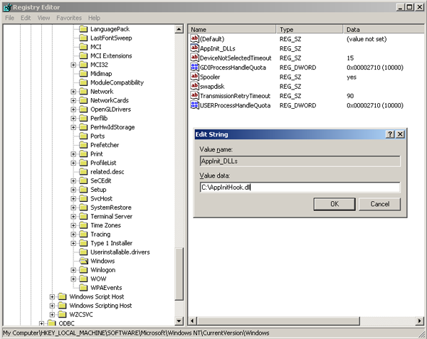

# Easy way to set up global API hooks

출처: https://www.codeproject.com/Articles/49319/Easy-way-to-set-up-global-API-hooks

이 기사는 시스템 전체의 글로벌 API 후크를 설정하는 쉬운 방법을 설명합니다.

- [Download AppInitHook - 69.9 KB](https://www.codeproject.com/KB/vista/api-hooks/AppInitHook.zip)


## 1. Introduction

이 기사는 시스템 전체의 글로벌 API 후크를 설정하는 쉬운 방법을 설명합니다. DLL 삽입을위한 AppInit_DLLs 레지스트리 키와 API 후킹을위한 Mhook 라이브러리를 사용합니다. 이 기법을 설명하기 위해 실행중인 프로세스 목록에서 calc.exe를 쉽게 숨기는 방법을 보여줍니다.


### 1.1 API 후킹이란 무엇입니까?

API 후킹은 일부 API 함수 호출을 가로채는 것을 의미합니다. 이를 통해 모든 소프트웨어의 동작을 변경할 수 있습니다. 후크는 바이러스 백신, 보안 응용 프로그램, 시스템 유틸리티, 프로그래밍 도구 등에서 널리 사용됩니다.


### 1.2 로컬 및 글로벌 훅

후크에는 로컬 및 글로벌 두 가지 유형이 있습니다. 로컬 후크는 특정 응용 프로그램에만 적용됩니다. 전역 후크는 시스템의 모든 프로세스에 적용됩니다. 이 문서에 나와있는 후크 기술은 전역 적이며 특정 데스크톱에 바인딩 된 SetWindowsHooks 방식과 달리 모든 세션의 모든 프로세스에 영향을줍니다.


## 2. AppInit_DLLs 인프라

AppInit_DLLs 인프라는 User32.dll과 연결된 모든 사용자 모드 프로세스에서 임의의 DLL 목록을로드하기위한 메커니즘입니다 (사실, 링크되지 않은 실행 파일은 거의 없습니다). DLL은 초기화시 User32.dll에 의해로드됩니다.

AppInit_DLLs 인프라의 동작은 레지스트리의 HKEY_LOCAL_MACHINE\\SOFTWARE\\Microsoft\\Windows NT\\CurrentVersion\\Windows 키에 저장된 일련의 값으로 구성됩니다. 이 레지스트리 값은 표에 설명되어 있습니다.

| **Value**                             | **Description**                                              | **Sample values**                                            |
| ------------------------------------- | ------------------------------------------------------------ | ------------------------------------------------------------ |
| LoadAppInit_DLLs (REG_DWORD)          | AppInit_DLL을 전역 적으로 활성화하거나 비활성화하는 값입니다. | 0x0 – AppInit_DLLs are disabled. <br/>0x1 – AppInit_DLLs are enabled. |
| AppInit_DLLs (REG_SZ)                 | 로드 할 공백 또는 쉼표로 구분 된 DLL 목록. DLL의 전체 경로는 짧은 파일 이름을 사용하여 지정해야합니다. | C:\PROGRA~1\Test\Test.dll                                    |
| RequireSignedAppInit_DLLs (REG_DWORD) | 코드 서명 된 DLL이 필요합니다.                               | 0x0 – Load any DLLs.<br/>0x1 – Load only code-signed DLLs.   |


## 3. Mhook 라이브러리

API 후킹을위한 여러 라이브러리가 있습니다. 그들이 하는 전형적인 일은 :

- 사용자 정의 코드 (소위 트램폴린)로 대상 함수의 시작을 덮어 씁니다. 함수가 실행되면 훅 핸들러로 점프합니다.
- 대상 함수의 덮어 쓴 원래 코드를 어딘가에 저장합니다. 올바른 대상 기능이 작동해야합니다.
- 대상 기능의 덮어 쓴 부분을 복원합니다.

Mhook은 API 후킹을위한 무료 오픈 소스 라이브러리입니다. X86 및 x64 플랫폼을 모두 지원하며 사용이 매우 쉽습니다. Mhook 인터페이스는 간단하고 자체 설명입니다.

```c++
BOOL  Mhook_SetHook(PVOID *ppSystemFunction, PVOID pHookFunction);
BOOL  Mhook_Unhook(PVOID *ppHookedFunction);
```

라이브러리 사용법에 대한 자세한 내용은 다음 단락에 표시된 코드 샘플을 참조하거나 [Mhook 홈 페이지](http://codefromthe70s.org/mhook22.aspx)를 방문하십시오.


## 4. 코드 작성

사용자 모드 DLL을 작성하려고합니다. 먼저 최신 Mhook 소스를 다운로드하여 프로젝트에 추가해야합니다. 미리 컴파일 된 헤더를 사용하는 경우 Mhook 파일에 대해 헤더를 끕니다.

위에서 언급했듯이이 예제는 실행중인 프로세스 목록에서 calc.exe를 숨 깁니다.

### 4.1 원래 기능

실행중인 프로세스 목록은 NTAPI 함수 NtQuerySystemInformation을 호출하여 조회합니다. 따라서 프로젝트에 NTAPI를 추가해야합니다. 불행히도 winternl.h 헤더에는 완전한 정보가 포함되어 있지 않으므로 필요한 데이터 유형을 직접 정의해야합니다.

```c++
/////////////////////////////////////////////////////////////////////////
// Defines and typedefs

#define STATUS_SUCCESS  ((NTSTATUS)0x00000000L)

typedef struct _MY_SYSTEM_PROCESS_INFORMATION 
{
    ULONG                   NextEntryOffset;
    ULONG                   NumberOfThreads;
    LARGE_INTEGER           Reserved[3];
    LARGE_INTEGER           CreateTime;
    LARGE_INTEGER           UserTime;
    LARGE_INTEGER           KernelTime;
    UNICODE_STRING          ImageName;
    ULONG                   BasePriority;
    HANDLE                  ProcessId;
    HANDLE                  InheritedFromProcessId;
} MY_SYSTEM_PROCESS_INFORMATION, *PMY_SYSTEM_PROCESS_INFORMATION;

typedef NTSTATUS (WINAPI *PNT_QUERY_SYSTEM_INFORMATION)(
    __in       SYSTEM_INFORMATION_CLASS SystemInformationClass,
    __inout    PVOID SystemInformation,
    __in       ULONG SystemInformationLength,
    __out_opt  PULONG ReturnLength
    );
```

원래 함수 주소를 저장하려면 전역 변수를 작성하고 초기화하십시오.

```c++
//////////////////////////////////////////////////////////////////////////
// Original function

PNT_QUERY_SYSTEM_INFORMATION OriginalNtQuerySystemInformation = 
    (PNT_QUERY_SYSTEM_INFORMATION)::GetProcAddress(::GetModuleHandle(L"ntdll"), "NtQuerySystemInformation");
```

#### 4.2 후크 기능

후크 된 함수에서 먼저 원래 함수를 호출합니다. 그런 다음 SystemInformationClass를 확인하십시오. 이것이 SystemProcessInformation 인 경우 실행중인 프로세스 목록을 반복하고 calc.exe에 대한 모든 항목을 찾아 목록에서 잘라냅니다. 그게 다야!

참고 :이 기능은 원래 서명과 동일한 서명을 가져야합니다.

```c++
//////////////////////////////////////////////////////////////////////////
// Hooked function

NTSTATUS WINAPI HookedNtQuerySystemInformation(
    __in       SYSTEM_INFORMATION_CLASS SystemInformationClass,
    __inout    PVOID                    SystemInformation,
    __in       ULONG                    SystemInformationLength,
    __out_opt  PULONG                   ReturnLength
    )
{
    NTSTATUS status = OriginalNtQuerySystemInformation(SystemInformationClass,
        SystemInformation,
        SystemInformationLength,
        ReturnLength);

    if (SystemProcessInformation == SystemInformationClass && STATUS_SUCCESS == status)
    {
        //
        // Loop through the list of processes
        //

        PMY_SYSTEM_PROCESS_INFORMATION pCurrent = NULL;
        PMY_SYSTEM_PROCESS_INFORMATION pNext    = (PMY_SYSTEM_PROCESS_INFORMATION)SystemInformation;
        
        do
        {
            pCurrent = pNext;
            pNext    = (PMY_SYSTEM_PROCESS_INFORMATION)((PUCHAR)pCurrent + pCurrent->NextEntryOffset);

            if (!wcsncmp(pNext->ImageName.Buffer, L"calc.exe", pNext->ImageName.Length))
            {
                if (0 == pNext->NextEntryOffset)
                {
                    pCurrent->NextEntryOffset = 0;
                }
                else
                {
                    pCurrent->NextEntryOffset += pNext->NextEntryOffset;
                }

                pNext = pCurrent;
            }            
        } 
        while(pCurrent->NextEntryOffset != 0);
    }

    return status;
}
```


### 4.3 후크 설정

후크를 설정하는 것은 매우 쉽습니다. DLL이 새로운 프로세스로로드 될 때 DllMain에서 Mhook_SetHook을 호출하십시오.

```c++
//////////////////////////////////////////////////////////////////////////
// Entry point

BOOL WINAPI DllMain(
    __in HINSTANCE  hInstance,
    __in DWORD      Reason,
    __in LPVOID     Reserved
    )
{        
    switch (Reason)
    {
    case DLL_PROCESS_ATTACH:
        Mhook_SetHook((PVOID*)&OriginalNtQuerySystemInformation, HookedNtQuerySystemInformation);
        break;
```


### 4.4 언훅

프로세스에서 DLL을 언로드 할 때 DllMain에서 Mhook_Unhook을 호출하여 언훅을 수행합니다.

```c++
//////////////////////////////////////////////////////////////////////////
// Entry point

BOOL WINAPI DllMain(
    __in HINSTANCE  hInstance,
    __in DWORD      Reason,
    __in LPVOID     Reserved
    )
{        
    switch (Reason)
    {
    ...
    case DLL_PROCESS_DETACH:
        Mhook_Unhook((PVOID*)&OriginalNtQuerySystemInformation);
        break;
    }
```


## 5. 샘플 실행

이제 설명 된 후크를 보여줄 차례입니다. 프로젝트를 빌드하고 결과 AppInitHook.dll을 디스크 C의 루트에 넣습니다.


레지스트리 편집기를 열고 AppInit_DLLs 레지스트리 키를 찾으십시오 (키는 HKEY_LOCAL_MACHINE\\SOFTWARE\\Microsoft\\Windows NT\\CurrentVersion\\Windows입니다). 그런 다음 후크 DLL의 경로를 지정하십시오 (이 경우 C:\\AppInitHook.dll).



그림 2 – 레지스트리 수정

레지스트리가 수정 된 후 후크가 작동하기 시작합니다. Calc.exe 인스턴스를 몇 개 실행하겠습니다. 그런 다음 Windows 작업 관리자를 열고 프로세스 탭을보십시오. Calc.exe가 전혀 없습니다!


그림 3-Windows 작업 관리자 프로세스 탭

Mark Russinovich (프로세스 탐색기)가 작성한 또 다른 인기있는 도구를 보여줍니다.

.png)

그림 4-프로세스 탐색기에 calc.exe가 표시되지 않습니다.

모든 calc.exe 인스턴스가 숨겨져 있습니다. 마지막으로 command line tool tasklist.exe를 실행하십시오.


그림 5-실행중인 프로세스의 Tasklist.exe 목록

후크가 작동합니다!


## 6. 한계

이 후크 기술에는 몇 가지 제한 사항이 있습니다.

- 앞에서 언급했듯이이 후크는 User32.dll에 연결된 프로세스에만 적용됩니다.
- User32.dll의 DllMain에서 후킹이 수행되므로 Kernel32.dll 및 Ntdll.dll에서만 함수를 호출 할 수 있습니다 (다른 라이브러리는 아직 초기화되지 않음).
- Windows7/Windows 2008 R2에는 새로운 보안 기능이 도입되었습니다. AppInit DLL은 디지털 서명되어야하지만이 기능을 해제 할 수있는 레지스트리 키가 있습니다.
- AppInit DLL의 파일 경로에는 공백이 없어야합니다.


## 7. 유용한 참고 자료

1. This article on the [Apriorit website](https://www.apriorit.com/dev-blog/160-apihooks)
2. [Working with the AppInit_DLLs registry value](http://support.microsoft.com/kb/197571)
3. [AppInit DLLs in Windows 7 and Windows Server 2008 R2](http://download.microsoft.com/download/7/E/7/7E7662CF-CBEA-470B-A97E-CE7CE0D98DC2/AppInit_Win7.docx)
4. [API hooking revealed](http://www.codeproject.com/KB/system/hooksys.aspx)
5. [Mhook, an API hooking library, v2.2](http://codefromthe70s.org/mhook22.aspx)
6. [Microsoft Research's Detours](http://research.microsoft.com/en-us/projects/detours/)
7. [DllMain Callback Function](http://msdn.microsoft.com/en-us/library/ms682583(VS.85).aspx)


[HKEY_LOCAL_MACHINE\\SOFTWARE \\ Microsoft \\ Windows NT \\ CurrentVersion \\ Windows \\ AppInit_DLLs]는 32 비트 및 64 비트 OS 용입니다.

그러나 64 비트 컴퓨터에서 32 비트 프로세스를 실행하려면 다음 레지스트리 키를 수정해야합니다. [HKEY_LOCAL_MACHINE \\ SOFTWARE \\ Wow6432Node \\ Microsoft \\ Windows NT \\ CurrentVersion \\ Windows \\ AppInit_DLLs]

Wow는 기본적으로 64 비트 시스템을 32 비트 프로세스 실행과 호환 가능하게 만드는 개념입니다.

32 및 64 비트 OS에서 프로그램을 실행하고 64 비트 컴퓨터에서 32 비트 프로세스를 실행 한 후 확인했습니다.

그 후

32/64 비트 OS 용 HKEY_LOCAL_MACHINE \\ SOFTWARE \\ Microsoft \\ Windows NT \\ CurrentVersion \\ Windows \\ AppInit_DLLs

64 비트 OS에서 32 비트 프로세스에 대한 HKEY_LOCAL_MACHINE \\ SOFTWARE \\ Wow6432Node \\ Microsoft \\ Windows NT \\ CurrentVersion \\ Windows \\ AppInit_DLLs