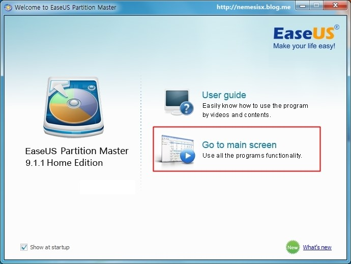
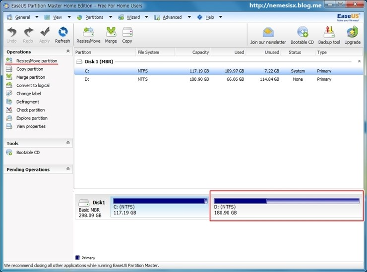
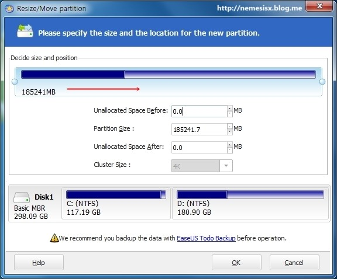
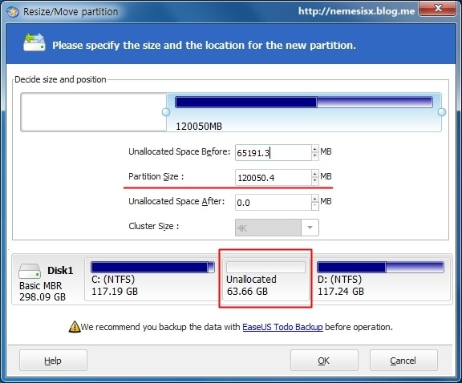
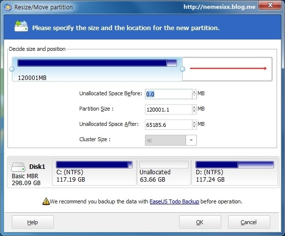
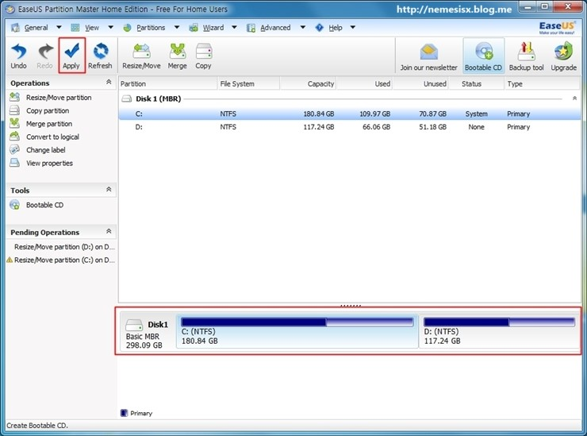
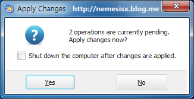
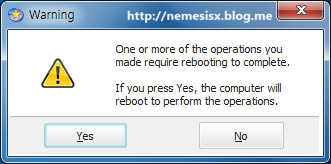
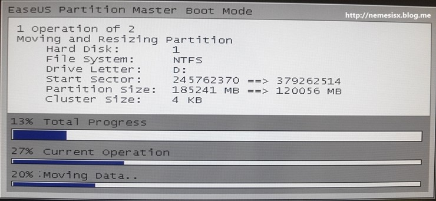
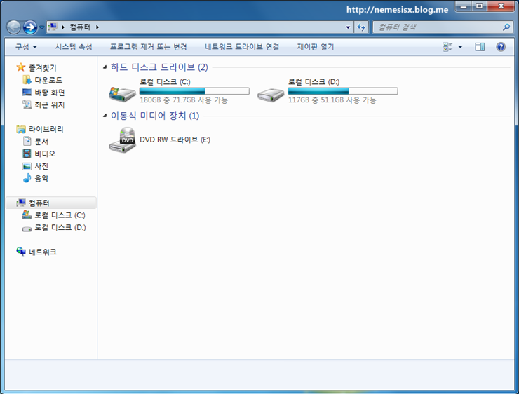

# 포맷없이 파티션 사이즈 조절

### EaseUS Partition Master 9.1.1 Home Edition - 

하드 디스크의 파티션 분할이 잘못되어 한쪽으로만 데이터가 쌓여 사이즈를 변경하고 싶을 때 사용할 수 있는 프로그램이 바로 **EaseUS Partition Master** 프로그램이다. 

이 프로그램은 한글을 지원하지 않지만 사용방법은 간단한다. 설치 후 Go to main screen을 눌러 메인화면으로 이동하자.

하드 디스크 파티션을 보면 C드라이브는 데이터가 Full로 차있고 D드라이브는 용량이 남아돈다. 이런 잘못된 분할을 고쳐 C드라이브는 117G에서 180G로 변경하고 D드라이브는 180G에서 117G로 변경할 것이다. 일단 사이즈를 줄일 D드라이브를 선택하고 좌측에 Resize/Move partiton을 누른다. 

C드라이브의 용량을 늘려줘야 되기 때문에 왼쪽에서 오른쪽으로 밀어 줄여준다. 그래야 가운데 빈공간이 생긴다. 만약 C드라이브를 줄이고 D드라이브를 늘리려면 C드라이브를 선택하고 오른쪽에서 왼쪽으로 줄여줘야 한다. 줄일 수 있는 용량은 저장되어 있는 데이터보다 커야한다. 

D드라이브를 줄이면 위와 같이 중간에 빈공간이 생긴다. Unallocated가 현재 지정되지 않은 빈공간 부분이다. 

그럼 다시 C드라이브를 선택하고  Resize/Move partiton을 누른다. 남아 있는 공간만큼 오른쪽으로 사이즈를 조절한다. 

그럼 최종 사이즈가 조절된 파티션의 모습을 볼 수 있다. Apply 아이콘을 눌러 작업을 시작하자. 

2개의 설정 작업과 리부팅 후 작업이 시작된다는 경고 메시지가 나온다. 모두 Yes를 누르면 재부팅 후 파티션 사이즈 작업이 시작된다.

부팅 후 작업의 화면이다. 일단 D드라이브의 파일들을 뒤로 이동시킨뒤 D드라이브의 앞쪽의 공간과 C드라이브의 공간 병합이 진행된다.

절대 작업중 재부팅이나 전원을 끄면 안된다. 작업시간은 하드디스크의 데이터에 따라 오래걸릴 수 있다.

최종 변경된 후의 하드디스크 파티션 상태

<http://www.partition-tool.com/landing/home-download.htm>

[http://download.cnet.com/EaseUS-Partition-Master-Home-Edition/3000-2248_4-10863346.htm](http://download.cnet.com/EaseUS-Partition-Master-Home-Edition/3000-2248_4-10863346.html)

### 끝

