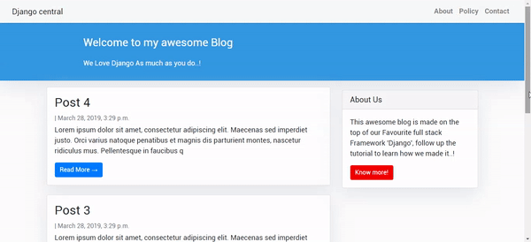
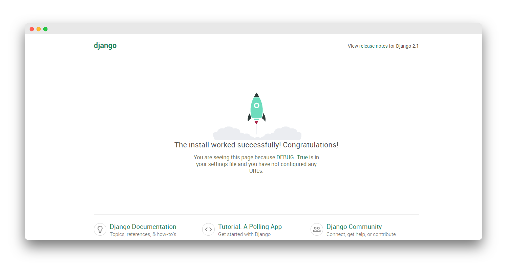
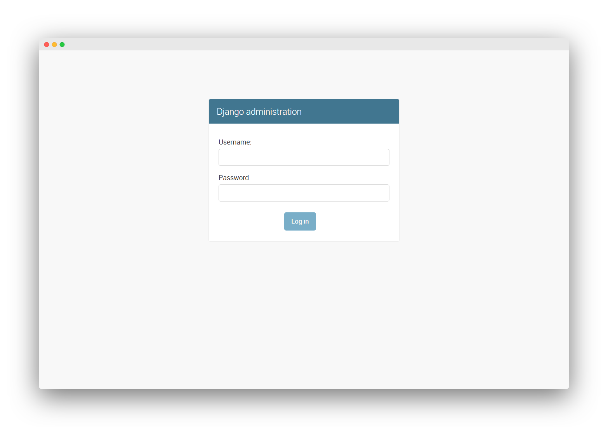
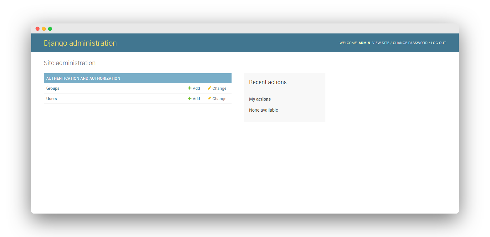
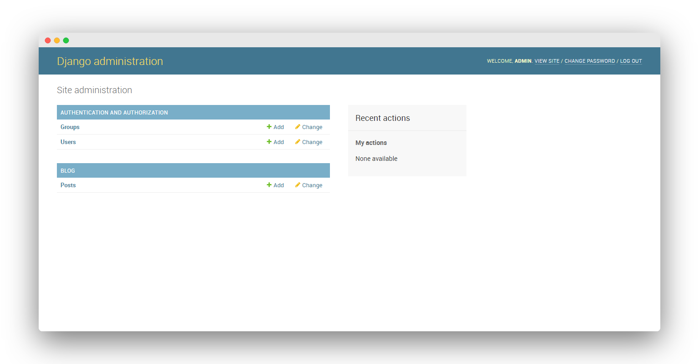
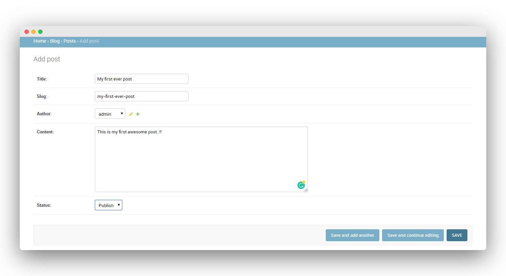
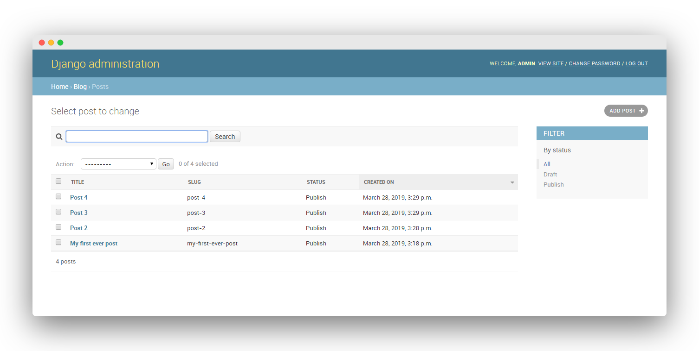
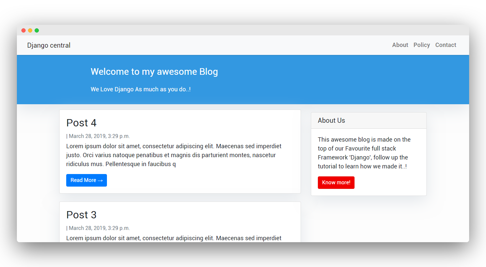
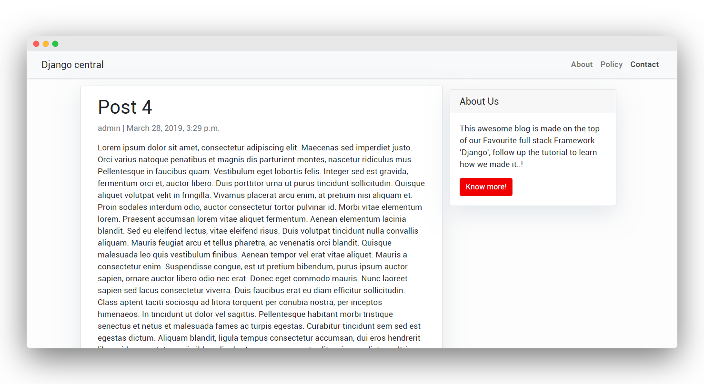

# Building A Blog Application With Django

출처: https://djangocentral.com/building-a-blog-application-with-django/

이 튜토리얼에서는 사용자가 게시물을 작성, 편집 및 삭제할 수 있도록 Django로 블로그 애플리케이션을 빌드합니다. 홈페이지에는 모든 블로그 게시물이 나열되며 각 개별 게시물에 대한 전용 상세 페이지가 있습니다. Django는 더 발전된 것을 만들 수 있지만 블로그를 만드는 것은 프레임 워크를 잘 이해하기위한 훌륭한 첫 단계입니다. 이 장의 목적은 Django의 작동에 대한 일반적인 아이디어를 얻는 것입니다.

다음은 우리가 만들 제품을 살짝 엿볼 수있는 것입니다.



시작하기 전에이 프로젝트에 사용할 프레임 워크에 대한 간략한 아이디어를 이미 알고 계 셨으면합니다.

다음 기사 : [Django – Web Framework For Perfectionists](https://djangocentral.com/django-introduction/).


## Pre-Requirements

Django는 Python으로 작성된 오픈 소스 웹 프레임 워크로, model-view-template 아키텍처 패턴을 따릅니다. 따라서 Python을 컴퓨터에 설치해야합니다. 안타깝게도 몇 년 전 Python 버전이 크게 업데이트되어 기존 버전 인 Python 2와 현재 개발중인 버전 인 Python 3이 크게 분할되었습니다.

Python 3은 현재 개발중인 현재 버전이고 Python의 미래로 다뤄 졌기 때문에 Django는 중요한 업데이트를 출시했으며 이제 Django 2.0 이후의 모든 릴리스는 Python 3.x 와만 호환됩니다. 따라서이 튜토리얼은 Python 3.x를위한 것입니다. 아래 가이드를 따르지 않으면 Python 3이 컴퓨터에 설치되어 있는지 확인하십시오.


## Creating And Activating A Virtual Environment

Python 프로젝트를 빌드하는 동안 프로젝트를 유지하기 위해 가상 환경에서 작업하는 것이 좋으며 종속성은 머신에 격리되어 있습니다. 가상의 중요성에 대한 전체 기사가 있습니다.

여기에서 확인하십시오 :  [How To A Create Virtual Environment for Python](https://djangocentral.com/how-to-a-create-virtual-environment-for-python/)


### Windows Users

``` shell
(django) $ cd Desktop
(django) $ virtualenv django
(django) $ cd django
(django) $ Scripts\activate.bat
```


### Mac and Unix Users

``` shell
(django) $ mkdir django
(django) $ cd django
(django) $ python3 -m venv django
(django) $ source django/bin/activate
```

이제 터미널에 접두사 (django)가 표시되어야합니다. 이는 가상 환경이 성공적으로 활성화되었음을 나타냅니다. 그렇지 않으면 가이드를 다시 진행합니다.


## Installing Django In The Virtual Environment

Django를 이미 설치 한 경우이 섹션을 건너 뛰고 프로젝트 설정 섹션으로 바로 이동할 수 있습니다. 가상 환경에 Django를 설치하려면 아래 명령을 실행하십시오.

``` shell
(django) $ pip install Django
```

이렇게하면 가상 환경에 최신 버전의 Django가 설치됩니다.

Django 설치에 대해 자세히 알아 보려면 다음을 읽어보세요: [How To Install Django](https://djangocentral.com/how-to-install-django/)

**Note –**  2.0보다 큰 Django 버전을 설치해야합니다.


## Setting Up The Project

작업 공간에서 mysite라는 디렉토리를 만들고이 디렉토리로 이동합니다.

``` shell
(django) $ cd Desktop
(django) $ mkdir mysite
(django) $ cd mysite
```

이제 쉘에서 다음 명령을 실행하여 Django 프로젝트를 만듭니다.

``` shell
(django) $ django-admin startproject mysite
```

이것은 여러 디렉토리와 파이썬 스크립트가있는 프로젝트 구조를 생성합니다.

``` shell
├── mysite
│   ├── __init__.py
│   ├── settings.py
│   ├── urls.py
│   ├── wsgi.py
├── manage.py
```

파일의 기능에 대해 자세히 알아 보려면 다음을 읽으십시오:  [Starting A Django Project](https://djangocentral.com/starting-a-django-project/)

다음으로 blog라는 Django 애플리케이션을 만들어야합니다. Django 애플리케이션은 특정 작업을 수행하기 위해 존재합니다. 사이트에서 원하는 기능을 제공 할 책임이있는 특정 응용 프로그램을 만들어야합니다.

manage.py 스크립트가있는 외부 디렉토리로 이동하여 아래 명령을 실행하십시오.

``` shell
(django) $ cd mysite
(django) $ python manage.py startapp blog
```

그러면 프로젝트에서 blog라는 앱이 생성됩니다.

``` shell
├── db.sqlite3
├── mysite
│   ├── __init__.py
│   ├── settings.py
│   ├── urls.py
│   ├── wsgi.py
├── manage.py
└── blog
    ├── __init__.py
    ├── admin.py
    ├── apps.py
    ├── migrations
    │   └── __init__.py
    ├── models.py
    ├── tests.py
    └── views.py
```

이제 Django에게 새 애플리케이션이 생성되었음을 알리고 settings.py 파일을 열고 설치된 앱 섹션으로 스크롤해야합니다. 여기에는 이미 설치된 앱이 있어야합니다.

``` python
INSTALLED_APPS = [
    'django.contrib.admin',
    'django.contrib.auth',
    'django.contrib.contenttypes',
    'django.contrib.sessions',
    'django.contrib.messages',
    'django.contrib.staticfiles',
]
```

이제 하단에 새로 생성 된 앱 블로그를 추가하고 저장합니다.

``` python
INSTALLED_APPS = [
    'django.contrib.admin',
    'django.contrib.auth',
    'django.contrib.contenttypes',
    'django.contrib.sessions',
    'django.contrib.messages',
    'django.contrib.staticfiles',
    'blog'
]
```

다음으로 마이그레이션하십시오.

``` shell
python manage.py migrate
```

이것은 Django 설치와 함께 제공되는 SQLite 데이터베이스에 적용되지 않은 모든 마이그레이션을 적용합니다.

Django의 내장 개발 서버를 실행하여 구성을 테스트 해 보겠습니다.

``` shell
(django) $ python manage.py runserver
```

브라우저를 열고 http://127.0.0.1:8000/ 주소로 이동하십시오. 모든 것이 잘 진행되면 이 페이지가 표시됩니다.



## Database Models

이제 블로그의 데이터 모델을 정의하겠습니다. 모델은 django.db.models.Model을 하위 클래스로 만드는 Python 클래스로, 각 속성은 데이터베이스 필드를 나타냅니다. 이 하위 클래스 기능을 사용하여 django.db.models.Models 내의 모든 항목에 자동으로 액세스하고 원하는대로 추가 필드와 메서드를 추가 할 수 있습니다. 데이터베이스에 게시물을 저장하기위한 Post 모델이 있습니다.

``` python
from django.db import models
from django.contrib.auth.models import User


STATUS = (
    (0,"Draft"),
    (1,"Publish")
)

class Post(models.Model):
    title = models.CharField(max_length=200, unique=True)
    slug = models.SlugField(max_length=200, unique=True)
    author = models.ForeignKey(User, on_delete= models.CASCADE,related_name='blog_posts')
    updated_on = models.DateTimeField(auto_now= True)
    content = models.TextField()
    created_on = models.DateTimeField(auto_now_add=True)
    status = models.IntegerField(choices=STATUS, default=0)

    class Meta:
        ordering = ['-created_on']

    def __str__(self):
        return self.title
```

맨 위에는 클래스 모델을 가져옵니다. 그런 다음 다른 일반적인 블로그와 마찬가지로 models.Model 하위 클래스를 생성합니다. 각 블로그 게시물에는 제목, 슬러그, 작성자 이름 및 기사가 게시되거나 마지막으로 업데이트 된 날짜 또는 타임 스탬프가 있습니다.

템플릿으로 렌더링 할 때 초안 및 게시 된 게시물을 분리하여 유지하기 위해 게시물의 STATUS에 대한 튜플을 선언 한 방법에 주목하십시오.

모델 내부의 Meta 클래스에는 메타 데이터가 포함되어 있습니다. Django에게 데이터베이스를 쿼리 할 때 기본적으로 created_on 필드의 결과를 내림차순으로 정렬하도록 지시합니다. 음수 접두사를 사용하여 내림차순을 지정합니다. 이렇게하면 최근에 게시 된 게시물이 먼저 표시됩니다.

`__str __()`메서드는 사람이 읽을 수있는 기본 객체 표현입니다. Django는 관리 사이트와 같은 여러 곳에서 이를 사용할 것입니다.

새로운 데이터베이스 모델이 생성되었으므로 새로운 마이그레이션 레코드를 생성하고 변경 사항을 데이터베이스로 마이그레이션해야합니다.

``` shell
(django) $ python manage.py makemigrations 
(django) $ python manage.py migrate
```

이제 데이터베이스 작업이 끝났습니다.


## Creating An Administration Site

게시물을 만들고 관리하기위한 관리자 패널을 만들 것입니다. 다행히 Django는 이러한 작업을위한 내장 된 관리 인터페이스를 제공합니다.

Django 관리자를 먼저 사용하려면 프롬프트에서 다음 명령을 실행하여 수퍼 유저를 만들어야합니다.

``` shell
(django) $ python manage.py createsuperuser
```

이메일, 비밀번호 및 사용자 이름을 입력하라는 메시지가 표시됩니다. 보안상의 이유로 비밀번호는 표시되지 않습니다.

``` shell
Username (leave blank to use 'user'): admin
Email address: admin@gamil.com
Password:
Password (again):
```

나중에 언제든지 변경할 수있는 세부 정보를 입력합니다. 그 후 개발 서버를 다시 실행하고 주소 http://127.0.0.1:8000/admin/으로 이동하십시오.

``` shell
(django) $ python manage.py runserver
```

로그인 페이지가 나타나면 수퍼 유저에 대해 제공 한 세부 정보를 입력해야합니다.



로그인하면 django.contrib.auth에있는 Django 인증 프레임 워크에서 가져온 그룹 및 사용자 모델이있는 기본 관리자 패널이 표시됩니다.



그래도 관리자에게 게시물 모델을 추가하는 데 필요한 패널에서 게시물을 만들 수 없습니다.


## Adding Models To The Administration Site

`blog/admin.py` 파일을 열고 다음과 같이 Post 모델을 등록합니다.

``` python
from django.contrib import admin
from .models import Post 

admin.site.register(Post)
```

파일을 저장하고 페이지를 새로 고치면 거기에 Posts 모델이 표시됩니다.



이제 첫 번째 블로그 게시물을 작성하고 게시물 옆에있는 추가 아이콘을 클릭하면 게시물을 작성할 수있는 다른 페이지로 이동합니다. 각 양식을 작성하고 첫 번째 게시물을 작성하십시오.



게시가 완료되면 지금 저장하면 상단에 성공 메시지가있는 게시물 목록 페이지로 리디렉션됩니다.

작업을 수행하지만 편의에 따라 관리 패널에 데이터가 표시되는 방식을 사용자 지정할 수 있습니다. `admin.py` 파일을 다시 열고 아래 코드로 바꿉니다.

``` bash
from django.contrib import admin
from .models import Post

class PostAdmin(admin.ModelAdmin):
    list_display = ('title', 'slug', 'status','created_on')
    list_filter = ("status",)
    search_fields = ['title', 'content']
    prepopulated_fields = {'slug': ('title',)}
  
admin.site.register(Post, PostAdmin)
```

이것은 우리의 관리 대시 보드를 더 효율적으로 만들 것입니다. 이제 게시물 목록을 방문하면 게시물에 대한 자세한 내용을 볼 수 있습니다.



테스트를 위해 몇 가지 게시물을 추가했습니다.

`list_display` 속성은 이름이 제안하는대로 각 게시물에 대한 게시물 목록의 튜플에 언급 된 속성을 표시합니다.

오른쪽에 보시면, 상태에 따라 게시물을 필터링하는 필터가 있습니다. 이것은 `list_filter` 메소드에 의해 수행됩니다.

이제 목록 상단에 `search_fields` 속성에서 데이터베이스를 검색하는 검색 표시 줄이 있습니다. 마지막 속성 인 `prepopulated_fields`가 슬러그를 채 웁니다. 이제 게시물을 생성하면 슬러그가 제목에 따라 자동으로 채워집니다.

이제 데이터베이스 모델이 완성되었으므로 웹 애플리케이션에 정보를 표시 할 수 있도록 필요한 뷰, URL 및 템플릿을 만들어야합니다.


## Building Views

Django 뷰는 웹 요청을 받고 웹 응답을 반환하는 Python 함수입니다. 클래스 기반 view 를 사용한 다음 각view 에 대한 URL을 매핑하고 view 에서 반환 된 데이터에 대한 HTML 템플릿을 만들 것입니다.

`blog/views.py` 파일을 열고 코딩을 시작합니다.

``` python
from django.views import generic
from .models import Post

class PostList(generic.ListView):
    queryset = Post.objects.filter(status=1).order_by('-created_on')
    template_name = 'index.html'

class PostDetail(generic.DetailView):
    model = Post
    template_name = 'post_detail.html'
```

제네릭 클래스 기반 뷰의 하위 클래스 인 내장 된 ListView는 템플릿을 언급하기 만하면되는 지정된 모델의 객체로 목록을 렌더링합니다. 마찬가지로 DetailView는 제공된 주형.

PostList view의 경우 게시 된 상태의 게시물 만 블로그의 프런트 엔드에 표시되도록 필터를 적용했습니다. 또한 동일한 쿼리에서 모든 게시물을 생성 날짜별로 정렬했습니다. created_on 앞의 (–) 기호는 최신 게시물이 맨 위에 있음을 나타냅니다.


## Adding URL patterns for Views

위에서 만든 view 의 URL을 매핑해야합니다. 사용자가 웹 앱에서 페이지를 요청하면 Django 컨트롤러가 urls.py 파일을 통해 해당 view 를 찾은 다음 HTML 응답 또는 찾을 수없는 경우 404 찾을 수 없음 오류를 반환합니다.

블로그 애플리케이션 디렉토리에 `urls.py` 파일을 만들고 다음 코드를 추가합니다.

``` python
from . import views
from django.urls import path

urlpatterns = [
    path('', views.PostList.as_view(), name='home'),
    path('<slug:slug>/', views.PostDetail.as_view(), name='post_detail'),
]
```

path 함수를 사용하여 뷰에 대한 일반적인 URL 패턴을 매핑했습니다. 첫 번째 패턴은 ''로 표시된 빈 문자열을 취하고 기본적으로 홈페이지에 대한 게시물 목록 인 PostList view에서 생성 된 결과를 반환하며 마침내 기본적으로 나중에 표시 될 view 의 이름 인 선택적 매개 변수 이름이 있습니다. 템플릿에 사용됩니다.

이름은 선택적 매개 변수이지만 뷰에 고유하고 기억하기 쉬운 이름을 지정하는 것이 좋습니다. 이렇게하면 템플릿을 디자인하는 동안 작업을 쉽게 할 수 있고 URL 수가 증가함에 따라 구성을 유지할 수 있습니다.

다음으로, 슬러그 (ASCII 문자 또는 숫자로 구성된 문자열)를 해결하는 PostDetail보기에 대한 일반화 된 표현식이 있습니다. Django는 꺾쇠 괄호 `< >`를 사용하여 URL에서 값을 캡처하고 동등한 게시물 세부 정보 페이지를 반환합니다.

이제 `mysite/urls.py` 파일을 열기 위해 이러한 블로그 URL을 실제 프로젝트에 포함해야합니다.

``` python
from django.contrib import admin

urlpatterns = [
    path('admin/', admin.site.urls),
]
```

이제 먼저 include 함수를 가져온 다음 URL 패턴 목록에서 새 `urls.py` 파일에 경로를 추가하십시오.

``` python
from django.contrib import admin
from django.urls import path, include

urlpatterns = [
    path('admin/', admin.site.urls),
    path('', include('blog.urls')),
]
```

이제 모든 요청이 블로그 앱에서 직접 처리됩니다.


## Creating Templates For The Views

모델 및 뷰 작업이 끝났으므로 이제 사용자에게 결과를 렌더링 할 템플릿을 만들어야합니다. Django 템플릿을 사용하려면 먼저 템플릿 설정을 구성해야합니다.

기본 디렉터리에 디렉터리 템플릿을 만듭니다. 이제 프로젝트의 `settings.py` 파일을 열고 BASE_DIR 바로 아래에 다음과 같이 템플릿 디렉토리에 경로를 추가합니다.

``` python
TEMPLATES_DIRS = os.path.join(BASE_DIR,'templates')
```

이제 `settings.py` 에서 다음과 같은 템플릿으로 스크롤합니다.

``` python
TEMPLATES = [
    {
        'BACKEND': 'django.template.backends.django.DjangoTemplates',
        'DIRS': [],
        'APP_DIRS': True,
        'OPTIONS': {
            'context_processors': [
                'django.template.context_processors.debug',
                'django.template.context_processors.request',
                'django.contrib.auth.context_processors.auth',
                'django.contrib.messages.context_processors.messages',
            ],
        },
    },
]
```

이제 새로 생성 된 TEMPLATE_DIRS를 DIRS에 추가합니다.

``` python
TEMPLATES = [
    {
        'BACKEND': 'django.template.backends.django.DjangoTemplates',
        #  Add  'TEMPLATE_DIRS' here
        'DIRS': [TEMPLATE_DIRS],
        'APP_DIRS': True,
        'OPTIONS': {
            'context_processors': [
                'django.template.context_processors.debug',
                'django.template.context_processors.request',
                'django.contrib.auth.context_processors.auth',
                'django.contrib.messages.context_processors.messages',
            ],
        },
    },
]
```

이제 구성을 마친 파일을 저장하고 닫습니다.

Django를 사용하면 python과 HTML을 분리 할 수 있으며, python은 뷰로 이동하고 HTML은 템플릿으로 이동합니다. Django에는 데이터 표시 방법을 지정할 수있는 강력한 템플릿 언어가 있습니다. 템플릿 태그, 템플릿 변수 및 템플릿 필터를 기반으로합니다.

base.html 파일과 이 파일에서 상속되는 index.html 파일부터 시작하겠습니다. 그런 다음 나중에 홈페이지에 대한 템플릿을 추가하고 상세 페이지를 게시 할 때에도 base.html에서 상속 할 수 있습니다.

navbar 및 footer와 같은 모든 페이지에서 블로그에 대한 공통 요소가있는 base.html 파일부터 시작하겠습니다. 또한 UI 및 Roboto 글꼴에 Bootstrap을 사용하고 있습니다.

``` html
<!DOCTYPE html>
<html>

    <head>
        <title>Django Central</title>
        <link href="https://fonts.googleapis.com/css?family=Roboto:400,700" rel="stylesheet">
        <meta name="google" content="notranslate" />
        <meta name="viewport" content="width=device-width, initial-scale=1" />
        <link rel="stylesheet" href="https://maxcdn.bootstrapcdn.com/bootstrap/4.0.0/css/bootstrap.min.css" integrity="sha384-Gn5384xqQ1aoWXA+058RXPxPg6fy4IWvTNh0E263XmFcJlSAwiGgFAW/dAiS6JXm"
            crossorigin="anonymous" />
    </head>

    <body>
        <style>
            body {
            font-family: "Roboto", sans-serif;
            font-size: 17px;
            background-color: #fdfdfd;
        }
        .shadow {
            box-shadow: 0 4px 2px -2px rgba(0, 0, 0, 0.1);
        }
        .btn-danger {
            color: #fff;
            background-color: #f00000;
            border-color: #dc281e;
        }
        .masthead {
            background: #3398E1;
            height: auto;
            padding-bottom: 15px;
            box-shadow: 0 16px 48px #E3E7EB;
            padding-top: 10px;
        }
    </style>

        <!-- Navigation -->
        <nav class="navbar navbar-expand-lg navbar-light bg-light shadow" id="mainNav">
            <div class="container-fluid">
                <a class="navbar-brand" href="">Django central</a>
                <button class="navbar-toggler navbar-toggler-right" type="button" data-toggle="collapse" data-target="#navbarResponsive"
                    aria-controls="navbarResponsive" aria-expanded="false" aria-label="Toggle navigation">
                    <span class="navbar-toggler-icon"></span>
                </button>
                <div class="collapse navbar-collapse" id="navbarResponsive">
                    <ul class="navbar-nav ml-auto">
                        <li class="nav-item text-black">
                            <a class="nav-link text-black font-weight-bold" href="#">About</a>
                        </li>
                        <li class="nav-item text-black">
                            <a class="nav-link text-black font-weight-bold" href="#">Policy</a>
                        </li>
                        <li class="nav-item text-black">
                            <a class="nav-link text-black font-weight-bold" href="#">Contact</a>
                        </li>
                    </ul>
                </div>
            </div>
        </nav>
        
        <!-- Content Goes here -->
        
        <!-- Footer -->
        <footer class="py-3 bg-grey">
            <p class="m-0 text-dark text-center ">Copyright &copy; Django Central</p>
        </footer>
    </body>
</html>
```

이것은 템플릿 태그라고하는 중괄호 `{ }` 안의 태그를 제외하고는 일반 HTML 파일입니다.

`` 절대 경로 참조를 반환하며 게시물의 목록 보기 이기도 한 홈보기에 대한 링크를 생성합니다.

`` 자식 템플릿에 의해 재정의 될 수있는 블록을 정의합니다. 여기에서 다른 HTML 파일의 콘텐츠가 삽입됩니다.

다음으로 사이트 전체의 모든 페이지에 상속 될 작은 사이드 바 위젯을 만들 것입니다. 사이드 바도 base.html 파일에 삽입되어 기본 파일을 상속하는 페이지에서 전체적으로 사용할 수 있습니다.

``` html


<style>
        .card{
            box-shadow: 0 16px 48px #E3E7EB;
        }
       
</style>

<!-- Sidebar Widgets Column -->
<div class="col-md-4 float-right ">
<div class="card my-4">
        <h5 class="card-header">About Us</h5>
    <div class="card-body">
        <p class="card-text"> This awesome blog is made on the top of our Favourite full stack Framework 'Django', follow up the tutorial to learn how we made it..!</p>
        <a href="https://djangocentral.com/building-a-blog-application-with-django"
           class="btn btn-danger">Know more!</a>
    </div>
</div>
</div>


```

다음으로 홈페이지 인 블로그의` index.html` 파일을 만듭니다.

``` html
 

<style>
    body {
        font-family: "Roboto", sans-serif;
        font-size: 18px;
        background-color: #fdfdfd;
    }
    
    .head_text {
        color: white;
    }
    
    .card {
        box-shadow: 0 16px 48px #E3E7EB;
    }
</style>

<header class="masthead">
    <div class="overlay"></div>
    <div class="container">
        <div class="row">
            <div class=" col-md-8 col-md-10 mx-auto">
                <div class="site-heading">
                    <h3 class=" site-heading my-4 mt-3 text-white"> Welcome to my awesome Blog </h3>
                    <p class="text-light">We Love Django As much as you do..! &nbsp
                    </p>
                </div>
            </div>
        </div>
    </div>
</header>
<div class="container">
    <div class="row">
        <!-- Blog Entries Column -->
        <div class="col-md-8 mt-3 left">
            
            <div class="card mb-4">
                <div class="card-body">
                    <h2 class="card-title">{{ post.title }}</h2>
                    <p class="card-text text-muted h6">{{ post.author }} | {{ post.created_on}} </p>
                    <p class="card-text">{{post.content|slice:":200" }}</p>
                    <a href="" class="btn btn-primary">Read More &rarr;</a>
                </div>
            </div>
            
        </div>
          
    </div>
</div>

```

`` 템플릿 태그를 사용하여 Django에게 base.html 템플릿에서 상속하도록 지시합니다. 그런 다음 기본 템플릿의 콘텐츠 블록을 콘텐츠로 채 웁니다.

Django 템플릿의 힘인 HTML에서 for 루프를 사용하여 HTML을 동적으로 만듭니다. 루프는 게시물을 반복하고 게시물의 표준 URL에 대한 제목의 링크를 포함하여 제목, 날짜, 작성자 및 본문을 표시합니다.

게시물 본문에서도 템플릿 필터를 사용하여 발췌 부분의 단어를 200 자로 제한합니다. 템플릿 필터를 사용하면 표시 할 변수를 수정할 수 있습니다 `{{ variable | filter }}`.

이제 서버를 실행하고 http://127.0.0.1:8000/을 방문하면 블로그 홈페이지가 표시됩니다.



Looks good..!

이 lorem ipsum 생성기 도구를 사용하여 동일한 작업을 수행 할 수있는 페이지를 채우기 위해 일부 더미 콘텐츠를 가져온 것을 눈치 채 셨을 것입니다.

이제 게시물을 자세히보기위한 HTML 템플릿을 만들어 보겠습니다.

다음으로 post_detail.html 파일을 만들고 거기에 아래 HTML을 붙여 넣습니다.

``` html
 

<div class="container">
  <div class="row">
    <div class="col-md-8 card mb-4  mt-3 left  top">
      <div class="card-body">
        <h1> {{ object.title }} </h1>
        <p class=" text-muted">{{ post.author }} | {{ post.created_on }}</p>
        <p class="card-text ">{{ object.content | safe }}</p>
      </div>
    </div>
      
  </div>
</div>


```

맨 위에는이 템플릿이 `base.html` 에서 상속하도록 지정합니다. 그런 다음 컨텍스트 개체에서 본문을 표시합니다. 그러면 DetailView가 개체로 액세스 할 수 있습니다.

이제 홈페이지를 방문하여 더 읽기를 클릭하면 게시물 상세 페이지로 리디렉션됩니다.




## 응용 프로그램 확장

코멘트 시스템 추가 – https://djangocentral.com/creating-comments-system-with-django/

색인 페이지에 페이지 매김 추가 – https://djangocentral.com/adding-pagination-with-django/

PostgreSQL과 Django 통합 – https://djangocentral.com/using-postgresql-with-django/

정적 자산 구성 – https://djangocentral.com/static-assets-in-django/

Summernote WYSIWYG 편집기 통합 – [Integrating Summernote WYSIWYG Editor in Django ](https://djangocentral.com/integrating-summernote-in-django/)

Sitemap 생성 – https://djangocentral.com/creating-sitemaps-in-django/

피드 생성 – https://djangocentral.com/creating-feeds-with-django/

이미지 업로드 – [How To Upload Images With Django](https://djangocentral.com/uploading-images-with-django/)

Django 애플리케이션 배포 – [How To Deploy Django App with Nginx, Gunicorn, PostgreSQL and Let’s Encrypt SSL on Ubuntu](https://djangocentral.com/deploy-django-with-nginx-gunicorn-postgresql-and-lets-encrypt-ssl-on-ubuntu/)


## Wrapping It Up

이 튜토리얼이 끝났습니다. 여기까지 읽어 주셔서 감사합니다. 이 게시물은 장고로 할 수있는 일의 수를 고려할 때 빙산의 일각 일뿐입니다.

우리는 처음부터 기본적인 블로그 애플리케이션을 구축했습니다! Django 관리자를 사용하여 콘텐츠를 생성, 편집 또는 삭제할 수 있으며 Django의 클래스 기반 뷰를 사용했으며 마지막에는 멋진 템플릿을 만들어 렌더링했습니다.


어떤 단계에서든 멈춘 경우 이 [GitHub 저장소](https://github.com/TheAbhijeet/Django_blog/releases/tag/1)를 참조하세요.

역자 주) 소스 파일은 download 하여 [./files/Django_blog-1.tar.gz](./files/Django_blog-1.tar.gz), [./files/Django_blog-1.zip](./files/Django_blog-1.zip) 로 저장 하였음. 

