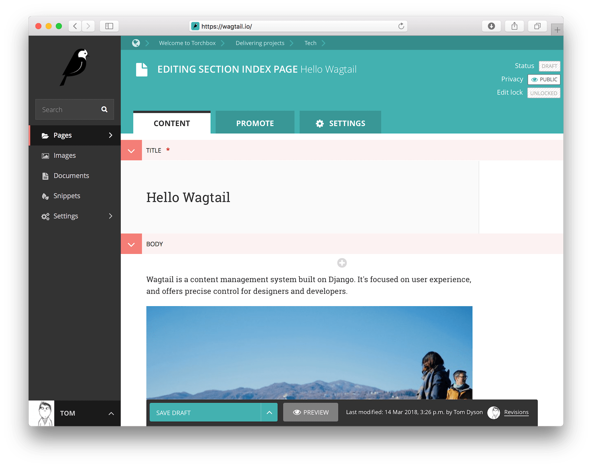
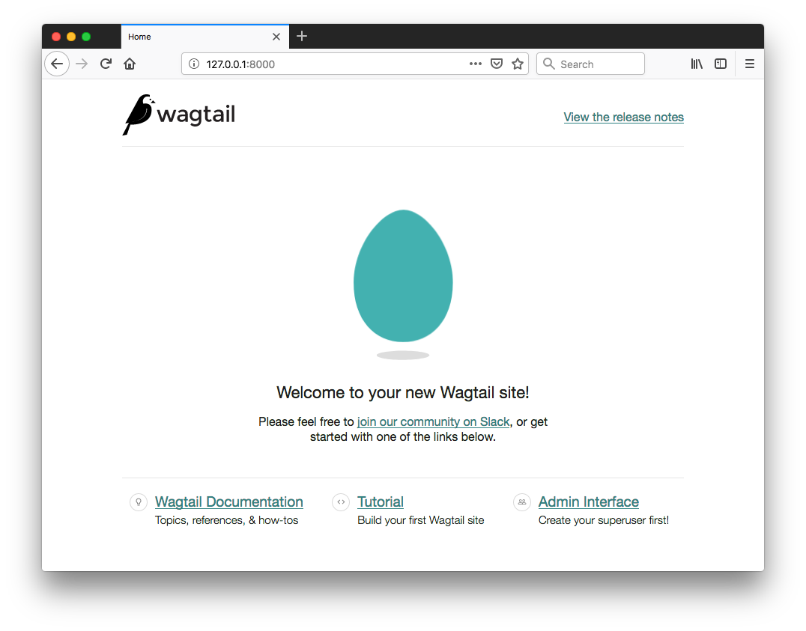
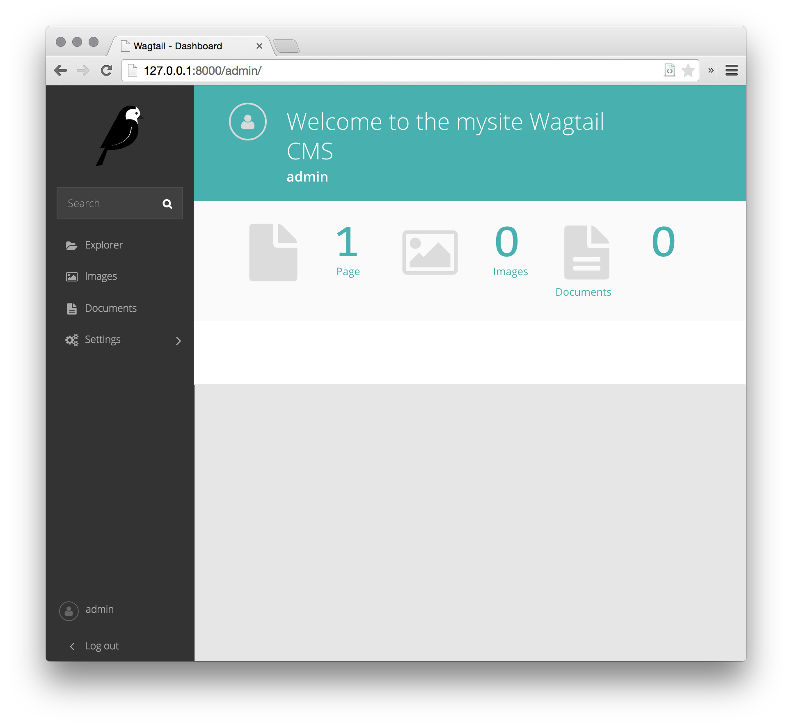

# Python Django CMD wagtail 설치

git 저장소: https://github.com/wagtail/wagtail


## 설치

설치 명령 (# 으로 되어 있는 부분은 설명을 위한 부분 이므로 실제 입력 하지는 않는다.)

``` shell
python3 -m venv wagtail              # 가상 환경  생성
source wagtail/bin/activate          # 가상 환경 활성화
pip install --upgrade pip            # package 관리자 upgrade

pip install wagtail                  # wagtail package 설치
wagtail start cms                    # wagtail 을 이용해 cms site 를 생성. cms 는 다른이름(musite) 으로 변경가능
cd cms                               #
pip install -r requirements.txt      # 종속성 모듈 설치
python manage.py migrate             # django migration
python manage.py createsuperuser     # django cms 관리자 생성
	Username (leave blank to use 'wonsool'): wonsool # 관리자 계정
	Email address: wsk2001@gmail.com                 # 관리자 email
	Password:                                        # 관리자 password : kang0192
	Password (again):
	Superuser created successfully.
python manage.py runserver	         # cms server 실행

```


## 테스트 (내 notebook)

- WSL Terminal 획득

- alias 로 등록되어 있는 cms 실행

  alias 로 등록되어 있는 cms 실행
   /mnt/c/home/docker/django로 이동된다.

- source wagtail/bin/activate  실행

  python 가상 환경 획득

- app 실행

  ```
  $> cd cms
  $> python manage.py runserver
  ```

- 접속

  http://127.0.0.1:8000/admin/

  wonsool // kang0192


## Gitgub 의 소개 글

https://github.com/wagtail/wagtail

# [](https://camo.githubusercontent.com/8372cb5a69bd80844e75625bccf5465479acfbe3ceae772402e6457e4d8aca76/68747470733a2f2f63646e2e6a7364656c6976722e6e65742f67682f7761677461696c2f7761677461696c406d61696e2f2e6769746875622f7761677461696c2e737667)  

Wagtail은 Django에 구축 된 오픈 소스 콘텐츠 관리 시스템으로 강력한 커뮤니티 및 상업적 지원을 제공합니다. 사용자 경험에 초점을 맞추고 디자이너와 개발자에게 정확한 제어를 제공합니다.



### Features

- 저자를 위한 빠르고 매력적인 인터페이스
- 프런트 엔드 설계 및 구조에 대한 완벽한 제어
- 수백만 페이지와 수천 명의 편집기로 확장
- 즉시 사용 가능하며 필요할 때 캐시 친화적
- 분리 된 프런트 엔드가있는 '헤드리스'사이트 용 콘텐츠 API
- Raspberry Pi 또는 다중 데이터 센터 클라우드 플랫폼에서 실행
- StreamField는 구조를 손상시키지 않고 유연한 콘텐츠를 장려합니다.
- Elasticsearch 또는 PostgreSQL을 사용하는 강력한 통합 검색
- 이미지 및 임베디드 콘텐츠에 대한 탁월한 지원
- 다중 사이트 및 다중 언어 지원
- Django 수용 및 확장

[wagtail.io](https://wagtail.io/) 에서 자세히 알아보세요.


### Getting started

Wagtail은 모든 플랫폼에서 Python 3 와 함께 작동합니다.  Wagtail을 시작하려면 가상 환경에서 다음을 실행하십시오.

``` bash
pip install wagtail
wagtail start mysite
cd mysite
pip install -r requirements.txt
python manage.py migrate
python manage.py createsuperuser
python manage.py runserver
```

자세한 설치 및 설정 문서는 [docs.wagtail.io](https://docs.wagtail.io/) 를 참조하십시오.

### Who’s using it?

Wagtail 은 다음에서 사용됩니다.

-  NASA, Google, Oxfam, the NHS, Mozilla, MIT, the Red Cross, Salesforce, NBC, BMW, and the US and UK governments. 

자신의 Wagtail 사이트를 [madewithwagtail.org](https://madewithwagtail.org/) 에 추가하십시오.

### Documentation

[docs.wagtail.io](https://docs.wagtail.io/) 는 Wagtail에 대한 전체 참조이며 릴리스 노트 및 로드맵과 함께 개발자, 디자이너 및 편집자를위한 가이드를 포함합니다.

### Compatibility

(GitHub에서 이 내용을 읽고 있다면 여기 에있는 세부 정보가 현재 출시 된 버전을 나타내지 않을 수 있습니다. Wagtail 문서에서 호환 가능한 Django/Python 버전을 참조하십시오.)

**Wagtail 지원 :**

- Django 3.0.x, 3.1.x and 3.2.x
- Python 3.6, 3.7, 3.8 and 3.9
- PostgreSQL, MySQL and SQLite as database backends

이전 버전의 Wagtail은 Python 2.7 및 Django 1.x-2.x를 추가로 지원했습니다.

### Community Support

Stack Overflow에  질문에 응답하는 Wagtail 사용자 및 개발자의 활발한 커뮤니티가 있습니다. 질문을 게시 할 때 [질문하는 방법에](https://stackoverflow.com/help/how-to-ask) 대한 Stack Overflow의 조언을 읽고 질문에 'wagtail'태그를 지정하는 것을 잊지 마십시오.

Stack Overflow의 질문 및 답변 형식에 맞지 않는 주제와 토론을 위해 Slack 작업 공간과 Wagtail Support 메일 링리스트가 있습니다. 여러 곳에서 같은 질문을하지 않음으로써 자원 봉사자들의 시간과 노력을 존중 해주십시오.

[Awesome Wagtail](https://github.com/springload/awesome-wagtail)에서 선별 된 타사 패키지, 기사 및 기타 리소스 목록을 유지합니다.

### Commercial Support

Wagtail은 Torchbox에서 후원합니다. Wagtail을 구현하거나 호스팅하는 데 도움이 필요하면 hello@torchbox.com으로 문의하십시오. 전 세계의 전문 Wagtail 개발자는 [madewithwagtail.org/developers/](https://madewithwagtail.org/developers/)를 참조하십시오.

### Security

우리는 Wagtail 및 우리가 유지하는 관련 패키지의 보안을 중요하게 생각합니다. 프로젝트에서 보안 문제를 발견 한 경우 security@wagtail.io로 이메일을 보내 주시면 함께 협력하여 문제를 찾고 패치 할 수 있습니다. 보안 관련 문제에 대해 책임감있게 공개해 주셔서 감사합니다. Github 문제를 만들기 전에 먼저 문의 해 주시기 바랍니다.

암호화 된 이메일 (선택 사항)을 보내려는 경우 security@wagtail.io의 공개 키 ID는 0x6ba1e1a86e0f8ce8이며이 공개 키는 가장 일반적으로 사용되는 키 서버에서 사용할 수 있습니다.

### Release schedule

Wagtail의 기능 릴리스는 3 개월마다 릴리스됩니다. 선택한 릴리스는 LTS (장기 지원) 릴리스로 지정되며 보안 및 데이터 손실 관련 문제를 해결하기 위해 연장 된 기간 동안 유지 관리 업데이트를 받게됩니다. 과거 및 향후 릴리스 날짜와 지원 기간은 릴리스 일정을 참조하십시오.

**Nightly releases**

릴리스 전에 최신 기능을 사용해보기 위해 매일 밤 main에서 빌드를 만듭니다. https://releases.wagtail.io/nightly/index.html에서 최신 야간 릴리스를 설치하는 방법에 대한 지침을 찾을 수 있습니다.

### Contributing

Python 또는 Django 개발자라면 리포지토리를 포크하고 꼼짝 못하게하세요! Slack 작업 영역에는 개발자 중심의 여러 채널이 있습니다.

기여 가이드 라인을 검토하고 좋은 첫 번째 문제 레이블로 문제를 확인하는 것으로 시작할 수 있습니다.

Wagtail 인터페이스 번역도 환영합니다. 번역 작업은 [Transifex](https://www.transifex.com/projects/p/wagtail/)를 통해 제출해야합니다.

### License

[BSD](https://github.com/wagtail/wagtail/blob/main/LICENSE)

### Thanks

Wagtail의 개발에 사용 된 서비스에 대해 다음 조직에 감사드립니다.

[](https://www.browserstack.com/)

BrowserStack은 프로젝트에 라이브 웹 기반 브라우저 테스트 도구 및 자동화 된 Selenium 클라우드 테스트에 대한 무료 액세스를 제공합니다.

[](https://www.squash.io/)

Squash는 풀 요청 검토를위한 무료 테스트 환경을 프로젝트에 제공합니다.


---

# [ Wagtail Documentation](https://docs.wagtail.io/)

출처: https://docs.wagtail.io/en/stable/

# Welcome to Wagtail’s documentation

Wagtail은 Python으로 작성되고 Django 웹 프레임 워크에 구축 된 오픈 소스 CMS입니다.

다음은 Wagtail을 시작하는 데 도움이되는 몇 가지 유용한 링크입니다.

Wagtail에 대해 빠르게 알고 싶다면 브라우저에서 임시 개발자 환경을 가동 해보십시오 (Gitpod에서 실행-작동 방식은 다음과 같습니다).

- First steps
  - [Getting started](https://docs.wagtail.io/en/stable/getting_started/index.html)
  - [Your first Wagtail site](https://docs.wagtail.io/en/stable/getting_started/tutorial.html)
  - [Demo site](https://docs.wagtail.io/en/stable/getting_started/demo_site.html)
- Using Wagtail
  - [Page models](https://docs.wagtail.io/en/stable/topics/pages.html)
  - [Writing templates](https://docs.wagtail.io/en/stable/topics/writing_templates.html)
  - [How to use images in templates](https://docs.wagtail.io/en/stable/topics/images.html)
  - [Search](https://docs.wagtail.io/en/stable/topics/search/index.html)
  - [Third-party tutorials](https://docs.wagtail.io/en/stable/advanced_topics/third_party_tutorials.html)
- For editors
  - [Editors guide](https://docs.wagtail.io/en/stable/editor_manual/index.html)

# Getting started

https://docs.wagtail.io/en/stable/getting_started/index.html

`note`

```
이 지침은 가상 환경 및 Django 웹 프레임 워크에 익숙하다고 가정합니다. 자세한 지침은 첫 번째 Wagtail 사이트를 참조하십시오. 기존 Django 프로젝트에 Wagtail을 추가하려면 Django 프로젝트에 Wagtail 통합을 참조하세요.
```

## Dependencies needed for installation

- 파이썬 3
- libjpeg 및 zlib, Django의 Pillow 라이브러리에 필요한 라이브러리 Pillow의 플랫폼 별 설치 지침을 참조하십시오.

## Quick install

선택한 가상 환경에서 다음을 실행하십시오.

``` bash
$ pip install wagtail
```

(가상 환경 외부에 설치하려면 sudo가 필요할 수 있습니다.)

Wagtail이 설치되면 Django의 django-admin startproject와 유사한 명령을 제공하여 새 사이트/프로젝트를 생성합니다.

``` bash
$ wagtail start mysite
```

시작하는 데 필요한 모든 것이 포함 된 템플릿을 기반으로 새 폴더 mysite가 생성됩니다. 해당 템플릿에 대한 자세한 내용은 프로젝트 템플릿 참조에서 확인할 수 있습니다.

Mysite 폴더 내에서 Django 프로젝트에 필요한 설정 단계를 실행합니다.

``` bash
$ pip install -r requirements.txt
$ ./manage.py migrate
$ ./manage.py createsuperuser
$ ./manage.py runserver
```

이제 http://localhost:8000 에서 사이트에 액세스 할 수 있으며 http://localhost:8000/admin/ 에서 관리 백엔드를 사용할 수 있습니다.

그러면 새로운 독립형 Wagtail 프로젝트가 설정됩니다. 대신 기존 Django 프로젝트에 Wagtail을 추가하려면 [Django 프로젝트에 Wagtail 통합](https://docs.wagtail.io/en/stable/getting_started/integrating_into_django.html)을 참조하세요.

기본적으로 설치되지 않지만 성능을 향상 시키거나 Wagtail에 기능을 추가하는 데 권장되는 몇 가지 선택적 패키지가 있습니다.

- [Elasticsearch](https://docs.wagtail.io/en/stable/advanced_topics/performance.html).
- [Feature Detection](https://docs.wagtail.io/en/stable/advanced_topics/images/feature_detection.html#image-feature-detection).

- [Your first Wagtail site](https://docs.wagtail.io/en/stable/getting_started/tutorial.html)
- [Demo site](https://docs.wagtail.io/en/stable/getting_started/demo_site.html)
- [Integrating Wagtail into a Django project](https://docs.wagtail.io/en/stable/getting_started/integrating_into_django.html)
- [The Zen of Wagtail](https://docs.wagtail.io/en/stable/getting_started/the_zen_of_wagtail.html)


# Your first Wagtail site

https://docs.wagtail.io/en/stable/getting_started/tutorial.html

`Note`

```
이 튜토리얼은 새로운 Wagtail 프로젝트 설정을 다룹니다. 대신 기존 Django 프로젝트에 Wagtail을 추가하려면 Django 프로젝트에 Wagtail 통합을 참조하세요.
```

## Install and run Wagtail

### Install dependencies

Wagtail은 Python 3.6, 3.7, 3.8 및 3.9를 지원합니다.

Python 3의 적절한 버전이 있는지 확인하려면

``` bash
$ python3 --version
```

버전 번호가 반환되지 않거나 3.6보다 낮은 버전이 반환되는 경우 Python 3을 설치해야합니다.

`중요`

```
Wagtail을 설치하기 전에 (Python Pillow 라이브러리를 통해) JPEG, PNG 및 GIF 이미지 작업을 지원하는 libjpeg 및 zlib 라이브러리를 설치해야합니다. 이를 수행하는 방법은 플랫폼에 따라 다릅니다. Pillow의 플랫폼 별 설치 지침을 참조하십시오.
```

### 가상 환경 생성 및 활성화

다른 프로젝트에서 설치된 종속성을 격리하는 가상 환경을 사용하는 것이 좋습니다. 이 자습서에서는 Python 3과 함께 패키지 된 venv를 사용합니다.

Windows (cmd.exe) :

``` cmd
> python3 -m venv mysite\env
> mysite\env\Scripts\activate.bat
```

**On GNU/Linux or MacOS** (bash):

``` bash
$ python3 -m venv mysite/env
$ source mysite/env/bin/activate
```

다른 셸에 대해서는 venv 설명서를 참조하십시오.

`Note`

```
버전 관리 (예 : git)를 사용하는 경우 mysite가 프로젝트의 디렉토리가됩니다. 그 안의 env 디렉토리는 모든 버전 제어에서 제외되어야합니다.
```

### Install Wagtail

Python과 함께 패키지 된 pip를 사용하여 Wagtail 및 해당 종속성을 설치합니다.

``` bash
$ pip install wagtail
```

### 사이트 생성

Wagtail은 django-admin startproject와 유사한 시작 명령을 제공합니다. 프로젝트에서 wagtail start mysite를 실행하면 필수 프로젝트 설정, 빈 HomePage 모델 및 기본 템플릿이있는 "홈"앱, 샘플 "검색"앱을 비롯한 몇 가지 Wagtail 관련 추가 항목이 포함 된 새 mysite 폴더가 생성됩니다.

mysite 폴더가 이미 venv에 의해 생성되었으므로 추가 인수로 wagtail start를 실행하여 대상 디렉터리를 지정합니다.

``` bash
$ wagtail start mysite mysite
```

`Note`

```
일반적으로 Wagtail에서 각 페이지 유형 또는 콘텐츠 유형은 단일 앱으로 표시됩니다. 그러나 서로 다른 앱이 서로를 인식하고 서로의 데이터에 액세스 할 수 있습니다. 모든 앱은 설정 파일의 INSTALLED_APPS 섹션에 등록해야합니다. 이 파일을보고 시작 명령이이 파일을 어떻게 나열했는지 확인하십시오.
```

### 프로젝트 종속성 설치

``` bash
$ cd mysite
$ pip install -r requirements.txt
```

이렇게하면 Wagtail, Django 및 방금 만든 프로젝트에 대한 기타 종속성의 관련 버전이 있습니다.

### 데이터베이스 생성

프로젝트 설정을 업데이트하지 않은 경우 이 파일은 프로젝트 디렉토리에있는 SQLite 데이터베이스 파일이됩니다.

``` bash
$ python manage.py migrate
```

이 명령은 데이터베이스의 테이블이 프로젝트의 모델과 일치하는지 확인합니다. 모델을 변경할 때마다 (예 : 모델에 필드를 추가 할 수 있음) 데이터베이스를 업데이트하기 위해 이 명령을 실행해야합니다.

### 관리자 생성

``` bash
$ python manage.py createsuperuser
```

관리 사이트에 로그인하면 수퍼 유저는 모든 권한을 가지며 데이터베이스를 보고 / 생성 / 관리 할 수 있습니다.

### 서버 시작

``` bash
$ python manage.py runserver
```

모든 것이 작동하면 http://127.0.0.1:8000 에 환영 페이지가 표시됩니다.



이제 http://127.0.0.1:8000/admin에서 관리 영역에 액세스 할 수 있습니다.



### HomePage 모델 확장

기본적으로 "home"앱은 홈페이지를 생성하고 이를 사용하도록 Wagtail을 구성하는 마이그레이션과 함께 models.py 에 빈 홈페이지 모델을 정의합니다.

모델에 본문 필드를 추가하려면 home/models.py 를 다음과 같이 편집하십시오.

``` python
from django.db import models

from wagtail.core.models import Page
from wagtail.core.fields import RichTextField
from wagtail.admin.edit_handlers import FieldPanel


class HomePage(Page):
    body = RichTextField(blank=True)

    content_panels = Page.content_panels + [
        FieldPanel('body', classname="full"),
    ]
```

본문은 특수 Wagtail 필드 인 RichTextField로 정의됩니다. blank = True이면 이 필드가 필수가 아니며 비어있을 수 있음을 의미합니다. Django 핵심 필드를 사용할 수 있습니다. content_panels는 편집 인터페이스의 기능과 레이아웃을 정의합니다. content_panels에 필드를 추가하면 Wagtail 인터페이스에서 편집 할 수 있습니다. 페이지 모델 생성에 대해 자세히 알아보십시오.

python manage.py makemigrations (마이그레이션 파일 생성)를 실행 한 다음 python manage.py migrate (마이그레이션을 실행하고 모델 변경 사항으로 데이터베이스 업데이트)를 실행합니다. 모델 정의를 변경할 때마다 위의 명령을 실행해야합니다.

이제 Wagtail 관리 영역 (페이지, 홈페이지, 편집으로 이동) 내에서 홈페이지를 편집하여 새 본문 필드를 볼 수 있습니다. 본문 필드에 텍스트를 입력하고 페이지를 게시합니다.

이제 페이지 템플릿을 업데이트하여 모델의 변경 사항을 반영해야합니다. Wagtail은 일반 Django 템플릿을 사용하여 각 페이지 유형을 렌더링합니다. 기본적으로 앱과 모델 이름에서 대문자를 밑줄로 구분하여 형성된 템플릿 파일 이름을 찾습니다 (예 : '홈'앱 내의 홈페이지가 home / home_page.html이 됨). 이 템플릿 파일은 Django의 템플릿 규칙에서 인식하는 모든 위치에 존재할 수 있습니다. 일반적으로 앱 내의 템플릿 폴더 아래에 배치됩니다.

다음을 포함하도록 home/templates/home/home_page.html을 편집합니다.

``` html




template-homepage


    {{ page.body|richtext }}

```

base.html은 상위 템플릿을 참조하며 항상 템플릿에서 사용되는 첫 번째 템플릿 태그 여야합니다. 이 템플릿에서 확장하면 코드를 다시 작성하지 않아도되고 앱 전체에서 페이지가 유사한 프레임을 공유 할 수 있습니다 (하위 템플릿에서 블록 태그를 사용하여 상위 템플릿 내의 특정 콘텐츠를 재정의 할 수 있음).

wagtailcore_tags도 템플릿 상단에로드되어야하며 Django에서 제공하는 태그에 추가 태그를 제공해야합니다.

작업중 ~~~
