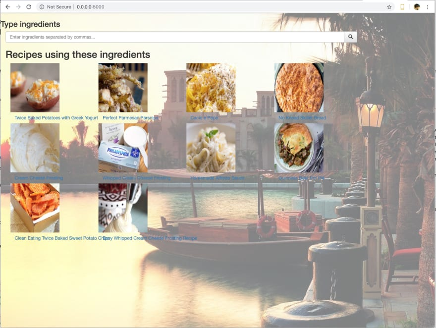
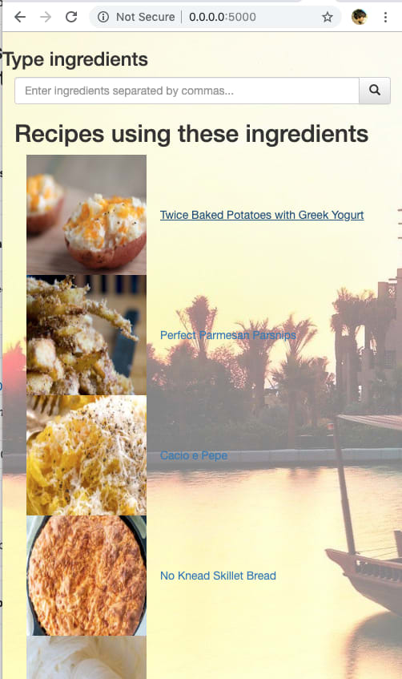

# Flask 글 모음

## <span style="color:blue">0. 플라스크</span>

출처: [여기](https://palletsprojects.com/p/flask/)

플라스크는 경량 [WSGI](https://wsgi.readthedocs.io/) 웹 응용 프로그램 프레임워크입니다. 복잡한 응용 프로그램으로 확장할 수 있는 기능을 통해 빠르고 쉽게 시작할 수 있도록 설계되었습니다. 그것은 [Werkzeug와](https://palletsprojects.com/p/werkzeug) [Jinja](https://palletsprojects.com/p/jinja) 주변의 간단한 래퍼로 시작하고 가장 인기있는 파이썬 웹 응용 프로그램 프레임 워크 중 하나가되었다.

플라스크는 제안을 제공하지만 종속성이나 프로젝트 레이아웃을 적용하지는 않습니다. 사용하려는 도구와 라이브러리를 선택하는 것은 개발자의 달려 있습니다. 커뮤니티에서 제공하는 많은 확장 프로그램이 제공되어 새로운 기능을 쉽게 추가할 수 있습니다.

`예`

```python
from flask import Flask, escape, request

app = Flask(__name__)

@app.route('/')
def hello():
    name = request.args.get("name", "World")
    return f'Hello, {escape(name)}!'
```

```basj
$ env FLASK_APP=hello.py flask run
 * Serving Flask app "hello"
 * Running on http://127.0.0.1:5000/ (Press CTRL+C to quit)
```


## <span style="color:blue">1. Flask 웹 어플리케이션 만들기</span>

출처: [여기]([https://velog.io/@decody/%ED%8C%8C%EC%9D%B4%EC%8D%AC-Flask%EB%A1%9C-%EA%B0%84%EB%8B%A8-%EC%9B%B9%EC%84%9C%EB%B2%84-%EA%B5%AC%EB%8F%99%ED%95%98%EA%B8%B0](https://velog.io/@decody/파이썬-Flask로-간단-웹서버-구동하기))

### 1.1 파이썬 Flask로 간단 웹서버 구동하기

Flask는 Python으로 구동되는 웹 어플리케이션 프레임워크이다. Django 프레임워크보다 가볍고, 스케일이 작은 서버부터 스케일 큰 서버를 만들 수가 있으며, `Jinja`와 `Werkzeug`를 포함하고 있다.

Flask 프레임워크: https://palletsprojects.com/p/flask/

우선 가상환경을 만들고, Flask를 설치한다.

#### 1.1.1 Flask 설치

``` bash
# Flask 설치
$ pip install flask

# Flask 확인
$ flask --version
```


#### 1.1.2 Flask 어플리케이션 만들기

pyflask 폴더를 만들고, `app.py` 파일을 생성한다.

`app.py`

``` python
from flask import Flask
app = Flask(__name__)

@app.route('/')
def index():
    return 'Hello Flask'
    
@app.route('/info')
def info():
    return 'Info'
```


#### 1.1.3 Flask 서버 구동 확인하기

CLI환경에서 pyflask 폴더에서 `flask run` 입력하고, Chrome에서 `http://127.0.0.1:5000/`으로 접속하면 된다. info 라우터를 확인하려면 `http://127.0.0.1:5000/info/`에 접속하면 확인 가능하다.


#### 1.1.4 템플릿 추가하기

pyflask 폴더 내에 `templates` 폴더를 추가하고, `index.html`과 `info.html` 파일을 추가한다.

**app.py에 템플릿 코드 추가**

``` python
from flask import Flask, render_template
app = Flask(__name__)

@app.route('/')
def index():
    return render_template('index.html')
    
@app.route('/info')
def info():
    return return render_template('info.html')
```

**templates/index.html**

```html
<!DOCTYPE html>
<html lang="ko">
<head>
    <meta charset="UTF-8">
    <meta name="viewport" content="width=device-width, initial-scale=1.0">
    <meta http-equiv="X-UA-Compatible" content="ie=edge">
    <title>Flask Index</title>
</head>
<body>

<h1>Hello Flask</h1>
<p>This page is for Flask tutorial.</p>

</body>
</html>
```

**templates/info.html**

``` python
<!DOCTYPE html>
<html lang="ko">
<head>
    <meta charset="UTF-8">
    <meta name="viewport" content="width=device-width, initial-scale=1.0">
    <meta http-equiv="X-UA-Compatible" content="ie=edge">
    <title>Flask Info</title>
</head>
<body>

<p>This page is Info page.</p>

</body>
</html>
```


### 추가된 페이지 확인

`app.py`의 `router`를 통해 `http://127.0.0.1:5000/`과 `http://127.0.0.1:5000/info/`에 접속하면 `index.html`과 `info.html`를 확인할 수 있다.


### 1.2 Flask Template에 Jinja2 사용하기

#### 1.2.1 Jinja2란

`Jinja2`(이하 Jinja)는 Python 웹 프레임워크인 Flask에 내장되어 있는 Template 엔진이다. Jinja는 JSP의 문법이나 ES6의 template string과 비슷한 문법을 가지고 있다.

`Jinja` 문법은 간단히 아래와 같다.

- `{{ ... }}` : 변수나 표현식
- `` : if나 for같은 제어문
- `{# ... #}` : 주석

Jinja의 자세한 문법은 https://jinja.palletsprojects.com/en/2.10.x/ 에서 살펴볼 수 있다.


#### 1.2.2 template/index.html

```html
<!DOCTYPE html>
<html lang="ko">
<head>
    <meta charset="UTF-8">
    <meta name="viewport" content="width=device-width, initial-scale=1.0">
    <meta http-equiv="X-UA-Compatible" content="ie=edge">
    
    <title>{{ title }}</title>
    
</head>
<body>

<h1>Bind string: {{ home_str }}</h1>
<p>This page is for Flask tutorial.</p>
<p>Bind list value: {{ home_list[2:4] }}</p>
<ul>
  
  <li>{{ idx }}</li>
  
</ul>

</body>
</html>
```


#### 1.2.3 app.py

``` python
from flask import Flask, render_template
app = Flask(__name__)

@app.route('/')
@app.route('/index')
def index():
    return render_template(
                'index.html',
                title     = 'Flask Template Test',
                home_str  = 'Hello Flask!',
                home_list = [1, 2, 3, 4, 5]
            )

@app.route('/info')
def info():
    return render_template('info.html')
  
# app.run(debug = True)
```

Conda CLI 환경의 `pytest` 폴더에서 `flask run`을 입력하여 Flask 서버를 기동한 후, `http://127.0.0.1:5000/`로 접속가능하다


## <span style="color:blue">2. 플라스크 활용 글</span>

[여기](https://essim92.tistory.com/8?category=921165) 참조


## <span style="color:blue">3. jinja2</span>

Jinja 템플릿은 Python Flask 패키지에 내장된 Template 엔진입니다. 개발자가 동적으로 변하는 웹 페이지를 쉽게 구현할 수 있도록 도와줍니다. 고정적으로 출력되어야 할 서식은 html 코드를  기록하고 동적으로 변해야할 자리는 Jinja2 문법으로 비워둡니다. 이후 클라이언트가 웹 브라우저를 통해 엔드포인트에 접근하면 아까 비워둔 자리에 값을 설정하여 클라이언트에게 출력합니다. 이처럼 고정적인 행위와 변해야할 행위를 쉽게 할 수 있다는 장점이 있습니다.

### 3.1 Jinja 템플릿 디렉토리 생성

Jinja 템플릿을 사용하기 위해서는 우리가 구성한 Flask 웹 서버 모듈의 위치에 "templates" 라는 디렉토리를 반드시 생성해줘야 합니다. 그리고 이 templates 디렉토리 하위에는 우리가 실제 사용할 HTML 템플릿 파일들을 저장할 것입니다. 이전 포스팅에서 다룬 Flask 웹 서버 모듈인 app.py과 templates 폴더 위치를 표로 나타내면 아래와 같습니다.

``` bash
./app.py
./templates
	   /test.j2
```

자 이제 템플릿 파일을 생성해보겠습니다. 우선 템플릿 파일이 쓰이는 목적과 어떻게 표시할것인지 알아야합니다.

 

### 3.1 Jinja 템플릿 파일 생성

클라이언트가 웹브라우저를 통해 엔드포인트에 접근하였을 때 현재 시간을 출력시키는 템플릿을 생성해보겠습니다.

여기서 중요한 것은 "Current Time : " 의 문자열은 절대 변하지 않는다는 것입니다. 저 문자열은 항상 그 자리에 고정으로 들어가고 단지 "시간" 값 만 바뀐다는 것을 알 수 있습니다. 이런 경우 사용하는게 Jinja 템플릿입니다. HTML의 서식을 고정으로 만들어놓고 저 값의 자리만 Python에서 처리해주면 됩니다. 템플릿 파일의 확장자는 j2로 설정하겠습니다.

**현재 시간 알리미**

**Current Time : {시간} 입니다.**

``` html
<html>
<head>
</head>
<body>

현재 시간 알리미<br>
Current Time : {{ current_time }} 입니다.

</body>
</html>
```

자 위와 같이 test.j2 문서를 작성하였을 때 특이한 부분이 있습니다. HTML 문법에서 {{, }} 와 같은 문법은 존재하지 않습니다. 저런 형식은 바로 jinja2 템플릿 문법입니다. HTML 문서를 렌더링 할때 "{{" 와 "}}" 사이에 있는 것은 변수명으로 판단하며 이는 Python에서 전달한 값을 참조합니다. 즉 "{{ current_time }}" 문구는 Python에서 전달한 current_time 값을 이곳에 써라 라는 말이 됩니다. 자 그렇다면 이제 우리가 이전 포스팅에서 구현했던 app.py을 수정하여 실제 current_time 값에 현재 시간의 값을 전달해야합니다. 만약 현재 시간을 구하는 **"datetime" 파이선 패키지** 를 설치하지 않았다면 pip3 명령을 통해 설치합니다.

 현재 시간을 구하기 위해 datetime 모듈을 import하고 jinja2 템플릿을 사용하기 위해 render_template 모듈을 import 합니다. 이후 이전 포스팅에서 구현한 "/homepage" 엔드포인트를 수정하였으며 최종적으로 "return render_template('test.j2', current_time=now)" 구문으로 인해 클라이언트의 웹 브라우저에 우리가 생각했던 시나리오의 결과를 얻을 수 있습니다.

`app.py`

```python
from flask import Flask, render_template
import datetime

app = Flask(__name__)

@app.route('/homepage')
def start_homepage():
	now = datetime.datetime.now()
	return render_template('test.j2', current_time=now)

app.run('0.0.0.0', port = 5010, threaded = True)
```

current_time=now 구문을 통해 현재 시간을 "current_time" 이라는 이름의 변수로 전달하고 있습니다. 이후 이 값은 j2 문서에서 읽어질 것입니다.

클라이언트가 웹브라우저에 접속 할 때마다 "현재 시간"의 값만 바뀌고 있습니다. 이처럼 고정적인 내용와 동적인 값 변경이 필요할 때 사용하는것이 jinja2 템플릿입니다.


## <span style="color:blue">4. Flask-Login 예제</span>

출처: https://github.com/mcchae/Flask-Login

### 동기

Flask에서 RESTful API 등을 간단하게 작성하고 나서, 해당 API 가 각 세션별로 login 및 logout 되기 전에 호출되는 각 함수들이 보호되어야할 필요가 있습니다. 이런 작업을 도와주는 역할로써 [Flask-Login](https://flask-login.readthedocs.io/en/latest/) 이라는 모듈이 존재합니다.

바로 사용해 볼 만한 샘플이 존재하지 않아 며칠 삽질을 했고 그 결과를 공유합니다. 또한 HTTPS 통신을 통해 채널 보안도 했습니다. Users 관련 작업을 더 하거나 OAuth2 등과 연동을 하는 등의 약간만 더 손질을 보면 Production에도 충분히 사용할 만 할 것입니다.

### requirements.txt

```
Flask==0.11.1
Flask-RESTful==0.3.5
Flask-Login==0.4.0
Flask-API==0.6.9
pyOpenSSL==16.2.0
requests==2.11.1
```

위와 같은 모듈 의존성을 만족하면 됩니다.

시작할 때

```
pip install -r requirements.txt
```

라고 실행시키면 됩니다.

> 주의: VirtualEnv 가 아니면 앞에 sudo 를 붙입니다.

### appauth.py (서버쪽 Flask 실행 프로그램)

#### 시작하며

우선 시작할 때,

```python
################################################################################
app = Flask(__name__)
app.secret_key = os.urandom(24)
login_manager = LoginManager()
login_manager.init_app(app)
```

라고 선언해 줍니다.

```python
app.secret_key = os.urandom(24)
```

코드는 사용자 세션 관리를 할 때 필요한 정보입니다.

```python
login_manager = LoginManager()
login_manager.init_app(app)
```

`login_manager`는 Flask-Login 에서 가져온 것으로 필요한 코드입니다.

#### 사용자 User 클래스 정의

```python
################################################################################
class User:
    # ==========================================================================
    def __init__(self, user_id, email=None, passwd_hash=None,
                 authenticated=False):
        self.user_id = user_id
        self.email = email
        self.passwd_hash = passwd_hash
        self.authenticated = authenticated

    # ==========================================================================
    def __repr__(self):
        r = {
            'user_id': self.user_id,
            'email': self.email,
            'passwd_hash': self.passwd_hash,
            'authenticated': self.authenticated,
        }
        return str(r)

    # ==========================================================================
    def can_login(self, passwd_hash):
        return self.passwd_hash == passwd_hash

    # ==========================================================================
    def is_active(self):
        return True

    # ==========================================================================
    def get_id(self):
        return self.user_id

    # ==========================================================================
    def is_authenticated(self):
        return self.authenticated

    # ==========================================================================
    def is_anonymous(self):
        return False
```

`User` 라는 사용자 정의 클래스를 만들어 사용합니다. User-Login에 user 에서 미리 정의된 스펙에 따라 위에 내용에서 더 추가할 수 있습니다.

#### 글로벌 사용자 정보

```python
################################################################################
USERS = {
    "user01": User("user01", passwd_hash='user_01'),
    "user02": User("user02", passwd_hash='user_02'),
    "user03": User("user03", passwd_hash='user_03'),
}
```

글로벌로 위와 같이 해쉬로 가지고 있는데 간단하게 /etc/passwd 와 유사한 방법으로 관리할 수 있겠습니다.

#### 로그인 객체 가져오기

```python
################################################################################
@login_manager.user_loader
def user_loader(user_id):
    return USERS[user_id]
```

이 정보는 해당 `user_id`로 해당 사용자 객체를 가져오는 코드로 login_manager에 의해 불려지는 코드를 정의합니다.

#### 인증하기를 원하는 함수

```python
################################################################################
@app.route("/api/auth_func", methods=['POST'])
@login_required
def auth_func():
    user = current_user
    json_res = {'ok': True, 'msg': 'auth_func(%s),user_id=%s'
                                   % (request.json, user.user_id)}
    return jsonify(json_res)
```

위와 같이 인증을 원하는 함수 위에 `@login_required`라는 데코레이터만 줍니다. 또한 `current_user`라는 login_manager에서 가지고 있는 글로벌에 따라 현재 사용자(`User` 객체)를 구해와서 사용 가능합니다. 패러미터 중 `methods`는 `POST`만 가능하다고 지정합니다.

만약 로그인을 하지 않고 본 함수를 호출하면 HTTP 리턴 코드 `401` 인 `인증 오류`가 발생합니다.

#### 인증을 요하지 않는 함수

```python
################################################################################
@app.route("/api/notauth_func", methods=['POST'])
def notauth_func():
    json_res = {'ok': True, 'msg': 'notauth_func(%s)'
                                   % request.json}
    return jsonify(json_res)
```

`@login_required`라는 데코레이터만 없으면 됩니다. 또한 current_user 라는 글로벌 접근을 할 수 없습니다. (접근을 할 수는 있지만 `User` 인스턴스가 아닌 디폴트 `MixedIn.AnonymousUser` 인스턴스 입니다.

#### 로그인 함수

```python
################################################################################
@app.route('/api/login', methods=['POST'])
def login():
    user_id = request.json['user_id']
    passwd_hash = request.json['passwd_hash']
    if user_id not in USERS:
        json_res={'ok': False, 'error': 'Invalid user_id or password'}
    elif not USERS[user_id].can_login(passwd_hash):
        json_res = {'ok': False, 'error': 'Invalid user_id or password'}
    else:
        json_res={'ok': True, 'msg': 'user <%s> logined' % user_id}
        USERS[user_id].authenticated = True
        login_user(USERS[user_id], remember=True)
    return jsonify(json_res)
```

주의할 것은

```python
        login_user(USERS[user_id], remember=True)
```

라고 호출하여 User 인스턴스를 current_user에 등록한다는 것입니다.

#### 로그아웃 함수

```python
################################################################################
@app.route('/api/logout', methods=['POST'])
@login_required
def logout():
    user = current_user
    user.authenticated = False
    json_res = {'ok': True, 'msg': 'user <%s> logout' % user.user_id}
    logout_user()
    return jsonify(json_res)
    logout_user()
```

위와 같이 logout_user() 라고 호출하여 login_manager에게 해당 세션의 사용자를 로그아웃하겠다고 알려줍니다.

위와 같이 간단한 Flask 이용 함수 인증을 하는 서버를 만들 수 있습니다.

### appauth_test.py (Requests를 이용한 클라이언트)

UnitTest로 로그인을 하지 않거나 또는 로그인 후 인증 / 비인증 함수 호출을 하고 그 결과가 맞는가를 확인하는 프로그램입니다.

#### 클라이언트를 돌리면

```python
test0000_init (__main__.TU) ... ok
test0080_notauth_api_call (__main__.TU) ... {'msg': "notauth_func({'param11': 'param-04', 'param10': 'param-03'})", 'ok': True}
ok
test0100_auth_api_call (__main__.TU) ... ok
test0200_login (__main__.TU) ... {'msg': 'user <user01> logined', 'ok': True}
ok
test0280_notauth_api_call (__main__.TU) ... {'msg': "notauth_func({'param12': 'param-03', 'param13': 'param-04'})", 'ok': True}
ok
test0300_auth_api_call (__main__.TU) ... {'msg': "auth_func({'param3': 'param-01', 'param4': 'param-02'}),user_id=user01", 'ok': True}
ok
test0400_logout (__main__.TU) ... {'msg': 'user <user01> logout', 'ok': True}
ok
test0480_notauth_api_call (__main__.TU) ... {'msg': "notauth_func({'param14': 'param-03', 'param15': 'param-04'})", 'ok': True}
ok
test0500_auth_api_call (__main__.TU) ... ok

----------------------------------------------------------------------
Ran 9 tests in 0.216s

OK
```

라는 결과가 나오고 모두 정상동작하는 것을 확인할 수 있습니다.

#### requests 세션 이용

로그인을 하고 인증될 함수를 호출할 때 암호화된 cookies 객체를 이용합니다. 따라서

```python
r = request.post(..., cookies=cookies)
cookies = r.cookies
r = request.post(..., cookies=cookies)
cookies = r.cookies
```

하는 대신

```python
s = requests.Session()
s.post(...)
s.post(...)
```

와 같은 식으로 호출하면 브라우저 처럼 세션을 자동으로 관리합니다.


## <span style="color:blue">5. Flask series Series' Articles</span>

출처: https://dev.to/brunooliveira/series/2955


### 5.1 Flask series: part I: 소개

아시다시피, 저는 대부분 매일 Java로 작업하며 그 외에도 솔직히 말해서 자유 시간 동안 많은 실제 웹 앱을 만들지 않습니다. 그래서, 나는 동기를 유지하는 좋은 방법을 찾았습니다. 그것에 관한 새로운 게시물 시리즈를 작성하는 것입니다! 내가 얼마나 멀리 가자 보자.

**단일 페이지 웹앱**

내가 구축 할 응용 프로그램은 REST를 사용하는 매우 간단 레시피 수집기 입니다.

쉼표로 구분 된 재료 목록을 입력하고 검색 버튼을 누를 수있는 검색 창이 사용자에게 표시됩니다.

그런 다음 검색어로 인해 레시피 제목을 클릭하고 현재 페이지의 하위보기에서 레시피 세부 사항, 재료 목록을 볼 수있는 대화식 레시피 목록을 다시 얻습니다. 이미지 등

이 정보를 얻기 위해 온라인에서 사용할 수있는 많은 무료 및 프리미엄 API 중 하나를 사용합니다. 아주 사소한 것처럼 보이지만 이전에 많은 물건을 만든 적이 없다면 약간 압도적 일 수 있습니다 ... 우리의 노력을 안내하는 일종의 로드맵을 증류합시다.

**Flask: our framework of choice**

우리가 따라갈 수있는 로드맵은 다음과 같습니다.

1) Python과 Flask를 로컬로 설치하고 구성해야합니다.

2) 우리가 소비 할 API에 연결하고 Postman과 같은 도구에서 사용할 엔드 포인트를 이상적으로 테스트하여 모든 기능이 작동하는지 확인하십시오.

3) 프런트 엔드에 페이지를 표시하는 방법을 결정하십시오. 이를 위해 Flask에는 우리가 사용할 Jinja라는 작은 템플릿 엔진이 있습니다. 물론 프리젠 테이션을위한 CSS :)

4) 파이썬으로 바닐라 가져 오기 / 포스트 요청을하는 방법과 플라스크의 철학과 어떻게 연결되는지 이해하십시오.

5) JSON 응답을 자체 프론트 엔드 모델 오브젝트에 적용하여 수신 할 JSON 응답을 잠재적으로 모델링하고 Jinja가 반복 및 테이블 작성과 같은 기능을 지원하는지 파악하는 방법.

6) 다음 단계는 기록에 대한 드릴 다운입니다. 클릭 한 현재 레코드에 대한 정보와 관련 정보를 검색하는 방법이 필요합니다.

7) 사용자 입력 및 / 또는 유효하지 않은 응답으로 오류를 처리하는 것도 보안상의 이유와 UX의 이유로 인해 우리의 관심사입니다.

8) 이것을 Heroku와 같은 무료 배포 플랫폼에 배포하여 모두 함께 묶어 사용하고 실제로 볼 수있게하십시오!

와! 그것은 작은 응용 프로그램에 대한 아주 긴 목록입니다! 이것은 분명히 무언가를 스스로 구축 할 때의 이점 중 하나입니다. 이러한 간단한 웹 응용 프로그램을 구축하는 것조차 얼마나 많은 작업을 수행하고 있는지 알 수 있습니다. 도로의 모든 이정표에서 배울 수있는 귀중한 교훈을 생각해보십시오. 도전적이고 보람이 있으며 물론 쉽지는 않습니다! 그러나 얻은 지식과 성취감은 커질 것입니다! :)

**Flask Hello World**

``` python
from flask import Flask
app = Flask(__name__)

@app.route('/')
def hello_world():
    return 'Hello, World!'
```

꽤 간단 해 보이죠?

마술은 다음 줄에서 일어난다.

``` python
app = Flask(__name__)
```

이 줄은 Flask 클래스의 인스턴스를 만들어 새로운 Flask 응용 프로그램을 만듭니다.
첫 번째 인수는 응용 프로그램의 모듈 또는 패키지 이름입니다. 단일 모듈을 사용하는 경우 (이 예에서와 같이) 응용 프로그램으로 시작했는지 또는 모듈로 가져 왔는지에 따라 이름이 달라지기 때문에 이름을 사용해야합니다 ( '주'와 실제 가져 오기 이름). Flask가 템플릿, 정적 파일 등을 찾을 위치를 알 수 있도록하기 위해 필요합니다.

그런 다음 route () 데코레이터를 사용하여 Flask에게 어떤 URL이 함수를 트리거해야하는지 알려줍니다.

함수에는 특정 함수에 대한 URL을 생성하는 데 사용되는 이름이 지정되며 사용자 브라우저에 표시하려는 메시지를 반환합니다.

hello.py 또는 이와 유사한 것으로 저장하십시오. 플라스크 자체와 충돌 할 수 있으므로 애플리케이션을 flask.py 로 만들지 마십시오.

응용 프로그램을 실행하려면 플라스크 명령 또는 플라스크와 함께 파이썬의 -m 스위치를 사용하면됩니다. 이를 수행하기 전에 FLASK_APP 환경 변수를 내 보내어 터미널에 작업 할 애플리케이션을 알려야합니다.

``` bash
$ export FLASK_APP=hello.py
$ flask run
 * Running on http://127.0.0.1:5000/
```

또는 python -m flask를 사용할 수 있습니다.

``` bash
$ export FLASK_APP=hello.py
$ python -m flask run
 * Running on http://127.0.0.1:5000/
```

이것은 매우 간단한 내장 서버를 시작하여 테스트하기에는 충분하지만 프로덕션 환경에서 사용하려는 것은 아닙니다. 바라건대, 배포 구성의 실제 사례를 더 잘 구현할 수 있기를 바랍니다.

**Conclusion**

이제 http://127.0.0.1:5000/으로 가면  hello world 인사말을 볼 수 있습니다.

희망적으로 재미있는 Flask 시리즈의 첫 번째 부분입니다!

읽어 주셔서 감사합니다.


### 5.2 Flask series part 2-Spoonacular API를 사용하여 간단한 앱 빌드

출처: https://dev.to/brunooliveira/flask-series-part-2-building-a-simple-app-with-the-spoonacular-api-4hea

**Introduction**

Flask에 대한 학습의 1 부에 대한 후속 조치로서, 사용자가 검색 창에 입력을 입력 한 후 일부 API 데이터로 채워지는 간단한 입력 페이지를 작성하는 방법을 보여줄 것입니다.

이는 완전히 반응하고 모바일 장치에서 잘 작동하며 더 많은 기능을 개발하기위한 기반이 될 것입니다.

**최종 제품**

시작하기 전에, 이것이 우리가 만들 것입니다 :



그리고 우리가 그것을 휴대 전화에서 보면 :



레시피가 서로 겹쳐 쌓이는 방법과 더 중요한 점은 전체 화면을 가져 와서 전체 화면 크기에 비례하여 크기를 유지하여 검색 막대에 초점을 맞추는 것입니다. 앱의 초기 단계에서도 반응이 빠르고 휴대 전화에서 사용하기 쉽습니다. 수상 경력은 없지만 훌륭한 출발입니다!

직접 만드는 법을 배우자!

**아키텍처 및 플라스크 라우팅에 대한 몇 가지 기본 사항**

이 방문 페이지에 대한 아이디어는 매우 간단합니다.

- 일부 데이터를 입력하십시오 (성분의 쉼표로 구분 된 이름으로).
- 플라스크 라우팅 메커니즘에 의해 처리 될 백엔드로 데이터를 전송하여 추가 처리
- 올바른 엔드 포인트에 도달하면 '정리 된'값을 입력으로 사용하여 API에서 사용할 수있는 형식으로 API에 GET 요청을 수행하고 응답으로 JSON을 수신합니다.
- json 에 응답이 있으면 Jinja 템플릿 (Jinja는 Flask와 함께 사용하여 페이지를 생성하는 템플릿 엔진)에 연결 한 다음 UI에 원하는대로 표시되도록 할 수 있습니다.

이 모든 것이 상당히 많은 작업이 될 것이므로 단계별로 세분화합시다.

**Data input: version 0.1**

분명히,이 데이터 입력 방식에는 결함이 있으므로 나중에 개선해야합니다.

사용자가 쉼표로 구분 된 값을 수동으로 입력으로 입력하게하는 것은 재난을위한 레시피이지만, 현재는이 프로토 타입과 현재 상태를 유지하기위한 동기 부여입니다.

**동기를 유지하는 방법을 아는 것이 중요하며, 무언가를 만들고, 반복하고 개선하는 것이 그렇게하는 좋은 방법이 될 수 있습니다.**

시작하기 위해 뷰를 구성 할 템플릿의 HTML을 볼 수 있습니다.

``` html
<form method="POST">
    <div class='col-xs-12 col-sm-12 col-md-10 col-lg-10'>
        <div class='input-group'>
            <input class='form-control' type='text' name='restaurant_name'
                   placeholder='Enter ingredients separated by commas...'/>
            <span class="input-group-btn">
              <button type='submit' class='btn btn-default'>
                <span class='glyphicon glyphicon-search'></span>
              </button>
            </span>

        </div>
    </div>
</form>
```

이 기사의 시작 부분에서 위에서 본 페이지를 강화하는 전체 Jinja 템플릿의 작은 조각입니다.

여기에는 POST 방법으로 구성된 양식이 포함되어있어 서버에 데이터를 POST 할 수 있습니다.

cheese,steak 와 같은 입력을 입력하면 양식 내용으로 백엔드에 POST됩니다.

플라스크 측면에서, 엔드 포인트와 처리하려는 실제 데이터 사이의 '바인딩'은 다음을 통해 발생합니다.

- 프론트 엔드로부터의 입력 바 'restaurant_name'의 name 프로퍼티.
- 현재 컨텍스트에 대한 프록시 역할을하며 양식 요청 (request.form [])에 액세스하는 데 사용되는 메소드 요청 (POST, GET 등)을 확인하는 데 사용할 수있는 Flask 요청 오브젝트 다른 것들. 이 오브젝트 오브젝트는 WSGI 환경에서 첫 번째 인수로 작성되며 WSW 환경에 'werkzeug.request'로 추가되어 모든 엔드 포인트에서 사용할 수있게됩니다.

엔드 포인트에서 데이터를 사용할 수있게되면 간단히 데이터를 처리 할 수 있습니다 (이 경우 API는 요청하려는 특정 형식을 요구하므로 처리를 수행해야 함). API에 요청하고 JSON 응답을받은 다음 필요한 데이터로 템플릿을 렌더링하면 초기 페이지가 완성됩니다!

**작업을 수행 할 Flask 엔드 포인트**

이제 데이터를 전송할 수 있으므로 데이터를 수신하고 조작 할 엔드 포인트를 구성해야하므로 유용한 정보를 얻을 수 있습니다!

Flask를 사용하여 이러한 엔드 포인트를 구성 할 수있는 방법은 Flask 앱 인스턴스에 바인딩되고 들어오는 요청을 제어하고 올바른 처리 방법으로 리디렉션하는 데 사용되는 경로를 정의하는 것입니다.

경로는 요청과 일치하는 경로 (think, URL mapping) 및 지원할 방법을받습니다.

라우트는 실제 메소드 이름 위에 데코레이터로 추가되어 특정 엔드 포인트를 참조하기 위해 클라이언트 측에서 사용합니다.

``` python
@app.route('/', methods=['GET', 'POST'])
def recipes():
    if request.method == 'POST':
        content = requests.get(
            "https://api.spoonacular.com/recipes/findByIngredients?ingredients=" +
            convert_input(request.form['restaurant_name']) +
            "&apiKey=" + API_KEY)
        json_response = json.loads(content.text)
        print json_response
        return render_template("restaurant_list.html", response=json_response) if json_response != [] else render_template(
            "restaurant_list.html", response="")
    else:
        return render_template("restaurant_list.html")
```

이 경우 라우트 데코레이터는 '/'이며 다른 특정 경로가 아닌 홈페이지와 일치하므로 (URL 일치는 0.0.0.0:5000) 엔드 포인트는 다음과 같은 이유로 POST 및 GET 메소드를 모두 지원해야합니다.

- 페이지가 처음로드되면 홈페이지에 GET 요청이 수행되어 초기 페이지가 화면 (다른 부분)에 렌더링 될 수 있습니다.
- 검색 창에 무언가를 입력하면 양식에서 데이터를 POST하기 위해 홈페이지에서도 POST 요청이 발생하므로 두 가지 방법 모두 지원해야합니다.

엔드 포인트 자체의 논리는 비교적 간단합니다. POST 요청을받는 경우 API에 GET 요청을 수행하여 원하는 데이터를 검색하고 JSON 응답을 수신하고 해당 데이터가 풍부한 템플릿을 해당 데이터로 풍부하게 렌더링합니다. UI를 채우십시오.

python requests 모듈을 사용하여 GET 요청을 수행하고 응답을받습니다. 방법

convert_input (request.form [ 'restaurant_name'])은 입력 매개 변수의 형식이 올바른지 API에 필요한 형식으로 유지하는 데 사용하는 간단한 도우미 메소드입니다. 이를 알기 위해서는 API에 대한 사용 가능한 문서 (현재 코드에 대한 문서)를 읽고 모두 올바른지 확인하는 것이 좋습니다.

페이지가 처음로드되면 응답이 비어 있으며 Jinja 측에서는 수신 된 응답에 따라 필요한 내용 만 렌더링하므로 결과는 다음과 같습니다.

**프런트 엔드에서 데이터 렌더링**

Jinja는 정적 사용자 인터페이스 요소와 동적 데이터를 결합한다는 의미에서 템플릿 엔진 언어입니다. 이는 웹 페이지를 기본 템플릿으로 변경하고 데이터를 변경하는 메커니즘으로 완벽합니다.

render_template 메소드 안에 response라는 변수가 있다는 것을 상기하십시오. 응답 값에 따라 사용자 지정 뷰 요소로 프런트 엔드를 매개 변수화하는 데 사용됩니다.

```html
<div class='col-xs-12 col-sm-12 col-md-10 col-lg-10'>
    
    <h2>Recipes using these ingredients</h2>
    
    
    <p>No recipes found</p>
    
    <p></p>
    
    
    <table>
        <tr>
            
            <div class='col-xs-3 col-sm-3 col-md-3 col-lg-3' id="recipeSelectionComponent">
                
                <button id="{{entry['id']}}" type=button class="btn btn-link" onclick="recipeSteps({{entry['id']}})">{{
                    entry['title'] }}
                </button>
            </div>
            
        </tr>
    </table>
</div>
```

보시다시피, Jinja는 중괄호를 외부에서받은 값을 매개 변수화하기위한 표기법으로 사용합니다.이 값은 본질적으로 역동적이며 파이프 (|)를 사용하여 길이 및 기타와 같은 일부 속성에 연결합니다. 또한 다른 것들 사이에서 루핑 및 템플릿 상속을 허용합니다.

응답이 비어 있거나 입력이 유효하지 않은 경우 (정의되지 않은 응답 생성) 레시피가 없음을 나타내는 간단한 단락을 렌더링하도록 선택합니다.

그렇지 않으면 데이터 (JSON 목록)를 반복하고 이미지와 버튼으로 구성되는 간단한 사용자 정의 구성 요소를 빌드합니다.

루프를 사용하면 복잡한 데이터를 활용하는 사용자 지정 구성 요소를 쉽게 만들 수있는 방법에 주목하십시오.

이 기사를 마치려면 장치 전체에 유연한 디자인을 허용하는 라이브러리 인 Bootstrap의 헤더가 필요합니다.이 헤더는 Jinja 기능과 함께 헤더에 추가하여 추가 할 위치를 지정할 수 있습니다. 사용자 정의 CSS 파일 :

``` html
<head>
    <!-- Latest compiled and minified CSS -->
    <link rel="stylesheet" href="https://maxcdn.bootstrapcdn.com/bootstrap/3.3.7/css/bootstrap.min.css"
          integrity="sha384-BVYiiSIFeK1dGmJRAkycuHAHRg32OmUcww7on3RYdg4Va+PmSTsz/K68vbdEjh4u" crossorigin="anonymous">
    <!-- Optional theme -->
    <link rel="stylesheet" href="https://maxcdn.bootstrapcdn.com/bootstrap/3.3.7/css/bootstrap-theme.min.css"
          integrity="sha384-rHyoN1iRsVXV4nD0JutlnGaslCJuC7uwjduW9SVrLvRYooPp2bWYgmgJQIXwl/Sp" crossorigin="anonymous">
    <!-- Latest compiled and minified JavaScript -->
    <script src="https://maxcdn.bootstrapcdn.com/bootstrap/3.3.7/js/bootstrap.min.js"
            integrity="sha384-Tc5IQib027qvyjSMfHjOMaLkfuWVxZxUPnCJA7l2mCWNIpG9mGCD8wGNIcPD7Txa"
            crossorigin="anonymous"></script>
    <meta charset="UTF-8">
    <title>Title</title>
    <link rel="stylesheet" href="{{ url_for('static', filename='css/main.css') }}">
    <meta name="viewport" content="width=device-width, initial-scale=1, maximum-scale=1, user-scalable=no">
</head>
```

마지막 줄은 여기에서 언급 할 가치가있는 유일한 방법이며 뷰포트가 장치 너비에 따라 크기를 조정하고 사용자가 확장 할 수 없도록하여 모바일 장치에서 '일반 검색 표시 줄'을 제공합니다. 데스크톱과 같은 너비이지만 작은 화면에 맞게 확대되어 모바일 친화적이지 않습니다.

CSS 파일에는 개별 구성 요소의 너비와 높이에 대한 기본 및 표준 스타일이 포함되어 있습니다.

**Conclusion**

이 기사를 읽는 것이 즐거웠기를 바랍니다. Python과 Flask를 배우고 자한다면 흥미로울 수 있습니다. (그리고 음식을 좋아한다면).

추신 : 엔드 포인트 아키텍처 및 모범 사례에 관한 제안은 환영합니다. 프로그래밍 학습을 중단하지 마십시오!


### 5.3 앱에 상세 뷰 추가

**소개**

이 시리즈의 최신 기사에서 우리는 Flask를 사용하여 공개 API를 활용하여 일부 데이터를 표시하는 기본 단일 페이지 웹 애플리케이션을 작성했습니다. 앱에 세부 정보 페이지를 추가하여 특정 레코드의 세부 정보를 표시합니다 (앱의 경우 레시피).

**우리가 원하는 것**

이전 게시물이 끝날 무렵에는 기능 검색을 통해 쉼표로 구분 된 재료를 입력하고 입력 한 재료와 일치하는 상위 10 가지 레시피 목록을받을 수있었습니다. 이것은 이미 꽤 좋지만, 우리가 달성하고자하는 것은 특정 요리법을 클릭 할 때 요리 지침 및 재료 목록과 같은 세부 정보를 볼 수 있다는 것입니다!

이렇게하려면 사용할 수있는 호출을 확인하기 위해 API 설명서를 참조해야하며 해당 Jinja 뷰를 디자인해야합니다.

이 엔드 포인트가 클릭 한 레시피와 관련하여 정보를 수신해야한다는 사실과 관련하여 복잡성 단계가 추가되었습니다. 일반적으로 현재 레코드의 ID 또는 유사한 고유 식별자이므로 바인딩해야합니다. 우리의 요청에.

**Perform GET request with JS from a Jinja template**

https://dev.to/brunooliveira/flask-series-part-3-adding-detail-views-to-your-app-53k9


## <span style="color:blue">6. 파이썬 기본 모듈로 HTTPS 서버 구축하기</span>

파이썬은 스크립트 언어로서 자바와 같은 VM 기반의 언어이기도 합니다. 프론트엔드 사이트 구축이나 일회성 용도로 웹 서버 기능이 종종 필요한 경우가 있습니다. 예를 들어 강의 중에 자료를 배포하려고 할 때, 실행하는 프로그램이나 기능이 반드시 HTTP 서버 위에서만 동작하려고 할 경우 등이 이에 해당할 것입니다.

 

파이썬은 배터리 전략(Battery Strategy)으로 일반적인 응용 프로그램을 구현할 때 필요한 기능 대부분을 모듈로 제공하고 있습니다. 이 같은 특징은 개발자가 프로그램을 구현하기 위해 새로운 라이브러리를 찾지 않아도 되는 것을 의미하기도 합니다.

 

파이썬은 HTTP 서버를 구현하기 위한 기본 모듈을 제공하고 있습니다. 여기에서는 파이썬 3 기반에서 HTTP 서버를 구축해보고, 파이썬 기본 모듈로 HTTPS 서버를 구축한 다음, flask 내장 웹 서버로 SSL 서버를 함께 구축해보겠습니다.

 

파이썬 3으로 HTTP 서버를 구축하는 방법은 크게 2가지 방법이 있습니다.

- python 명령어와 실행 옵션 만으로 HTTP 서버 구축
- python 스크립트로 HTTP 서버 구축

**python 명령어와 실행 옵션 만으로 HTTP 서버 구축**

 

터미널 프로그램(윈도우는 cmd, 리눅스/OSX는 terminal)에서 python 명령어는 다양한 옵션을 제공하는데 그 중 -m 옵션은 명령어 실행과 동시에 실행할 모듈의 위치를 인자로 받습니다. 파이썬 3에서는 내장 웹 서버는 http.server 모듈이 제공합니다.

``` bash
$ python -m http.server 8080
```

<center>[명령 1] python 내장 HTTP 서버 구축</center>


python 명령어로 HTTP 서버를 구축하는 일은 현재 폴더에 무엇이 있는지 보는 dir 명령이나 ls 명령을 실행하는 것처럼 쉽습니다. 명령 1의 실행 결과는 웹 브라우저에서 http://localhost:8080에 접속해보는 것으로 쉽게 확인할 수 있습니다.

 

단순한 목적의 HTTP 서버가 필요하다면 명령 1에서 무리가 없지만,  특별히 MIME types을 지정하거나 브라우저에 보내는 응답 헤더를 다르게 할 경우는 HTTP 스크립트를 사용하는 것이 좋습니다.

 

**python 스크립트로 HTTP 서버 구축**

``` python
import http.server

httpd = http.server.HTTPServer(('0.0.0.0', 8080), http.server.SimpleHTTPRequestHandler)
httpd.serve_forever()
```

<center>[스크립트 1] 내장 웹 서버를 실행하는 파이썬 스크립트</center>

스크립트로 내장 웹 서버를 구축할 때는 내장 웹 서버가 웹 서버의 요청을 받았을 때 어떤 파일이 어떻게 응답해야 할지 알려주는 핸들러 클래스를 지정해야 하는데 파이썬은 SimpleHTTPRequestHandler가 기본적으로 제공됩니다.

 

예를 들어 내장 웹 서버가 HLS 파일을 제공하는 내장 웹 서버라면 파이썬 내장 웹 서버는 SimpleHTTPRequestHandler 클래스 변수인 extension_map 변숫값을 수정해서 특정 확장자인 m3u8, ts 파일이 어떤 MIMEType인지 브라우저에게 알려줘야 합니다.

``` python
import http.server

HTTPHandler = http.server.SimpleHTTPRequestHandler

HTTPHandler.extension_map.update({
    '.m3u8': 'application/x-xmpegURL',
    '.ts': 'video/MP2T'
})

httpd = http.server.HTTPServer(('0.0.0.0', 8080), HTTPHandler)
httpd.serve_forever()
```

<center>[스크립트 2] m3u8 파일과 ts 파일의 MIME Type을 강제로 지정해서 브라우저에 응답하는 스크립트</center>

단순히 HTTP 서버를 구성하는 일이라면 파이썬 공식 문서에 나와있는 것만으로도 어렵지 않게 구축할 수 있지만 SSL 통신을 전제로 하는 HTTPS 서버 구축은 공식 문서에서도 구축 방법을 찾기가 어렵습니다.

 

**파이썬으로 HTTPS 서버 구축하기**

 

파이썬으로 HTTPS 서버를 구축하려면 ssl 모듈을 임포트해야 합니다. ssl 모듈은 소켓 통신에 대한 암호화 레이어 계층을 제공하는 모듈로서 openssl을 사용합니다. 덕분에 openssl이 설치되어 있으면 대부분의 모던 운영체제(윈도우, 리눅스, 유닉스, OSX)에서도 암호화 레이어 계층을 쉽게 구현할 수 있는 기능을 제공합니다.

``` python
import http.server
import ssl

httpd = http.server.HTTPServer(('0.0.0.0', 5443), http.server.SimpleHTTPRequestHandler)
httpd.socket = ssl.wrap_socket(httpd.socket, certfile='newcert.pem', keyfile='newkey.pem')
httpd.serve_forever()
```

<center>[스크립트 3] ssl 모듈로 httpd.socket 변수를 감싸서 httpd 모듈에 SSL 기능 제공</center>

ssl 모듈은 wrap_socket 함수를 제공합니다. 이 함수는 필수 인자로 SSL 기능을 제공할 소켓 변수를 전달받습니다. 나머지 인자는 선택적 인자인데 인증 서버가 서명한 cert 파일과 서버의 개인 키를 전달함으로서 보안 통신이 제공되는 서버를 만들 수 있습니다.

 

필자는 사설 루트 인증 기관(CA)과 클라이언트 서버용 인증서를 openssl을 사용하여 생성했습니다. 스크립트 3을 실행하면 keyfile에 인증서 암호가 있으면 내장 웹 서버 실행 과정에서 다음 문자열이 출력되면서 인증서 비밀번호를 물어올 것입니다.

 

Enter PEM pass phrase:

 

클라이언트 서버 인증서의 비밀번호를 올바르게 입력하고 나면 SSL 기능이 제공되는 웹서버가 만들어졌을 것입니다. 그런데 이렇게만 만들면, 실행된 웹 서버는 웹 브라우저로 접근 시 반드시 https:// 스킴을 앞에 붙여줘야 합니다.

 

HTTPS 서버와 HTTP 서버 모두 제공하려면 2개 파일을 각각 실행해야 합니다.

 

**flask 내장 웹 서버에서 SSL 서버 구축**

 

flask는 파이썬 WSGI 규약에 기반한 웹 프레임워크입니다. django와 함께 전세계에서 가장 인기있는 프레임워크이기도 합니다. flask에서 SSL 기능을 제공하려면 다음과 같이 작성합니다.

``` python
from flask import Flask
import ssl

app = Flask(__name__)

@app.route("/")
def hello():
    return "Hello World"

if __name__ == "__main__":
    ssl_context = ssl.SSLContext(ssl.PROTOCOL_TLS)
    ssl_context.load_cert_chain(certfile='newcert.pem', keyfile='newkey.pem', password='secret')
    app.run(host="0.0.0.0", port=4443, ssl_context=ssl_context)
```

<center>[스크립트 4] flask 응용 프로그램에 SSL 기능 추가</center>

flask 내장 웹 서버로 ssl 서버 기능을 제공하려면 ssl 모듈의 SSLContext 클래스를 사용해서 클라이언트 서버의 인증서와 비밀키를 제공하면 됩니다. 예제에선 인증서의 비밀번호를 함께 입력했지만 프로그램 코드에 인증서 비밀번호를 제공하는 것은 매우 위험 부담이 큰 일입니다.

 

SSLContext 클래스의 인스턴스를 생성했으면, 이 인스턴스를 flask 내장 웹 서버를 실행하는 run 메서드의 ssl_context 파라메터에 전달하기만 하면 됩니다.

 

앞에서 살펴 본것과 같이 파이썬은 ssl 모듈을 사용하여 네트워크 응용 프로그램에 쉽게 SSL 기능을 제공할 수 있습니다. 이 문서에는 설명하지 않았지만 SMTP, FTP 서버에도 이 문서에서 살펴본것과 같이 여러분이  SSL 기능을 제공할 수 있을 것입니다.

 

파이썬은 아직 많은 곳에서 자유롭게 사용할 수 있는 프로그래밍 언어입니다. 아직 시작하지 않았다면 꼭 한 번, 파이썬을 사용해서 업무 생산성의 향상을 꾀해 보시길 바랍니다. Good Luck~!!


