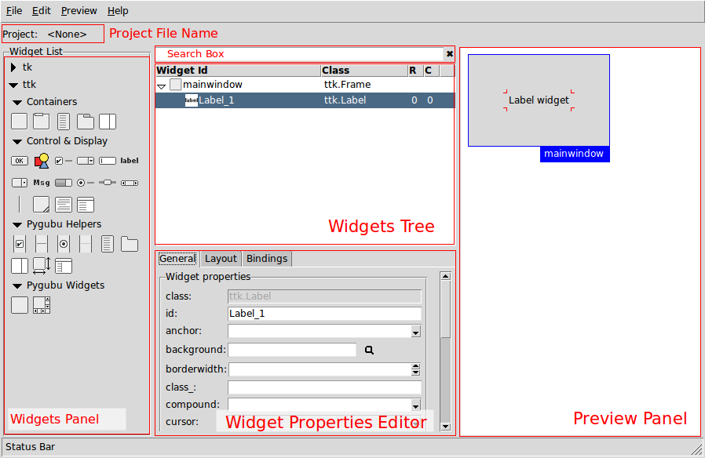
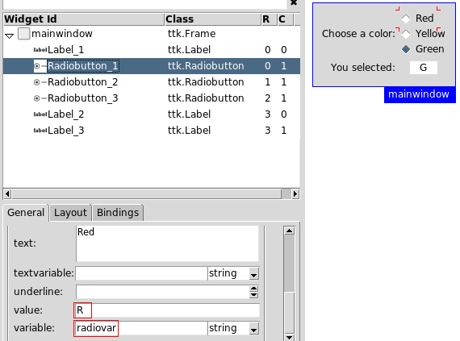
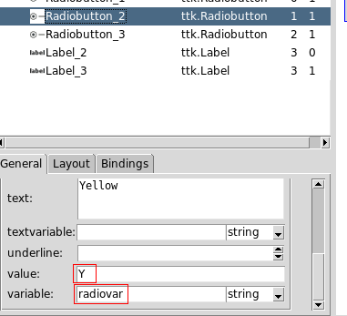
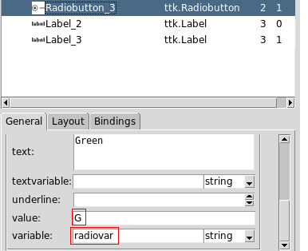
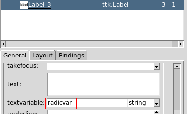
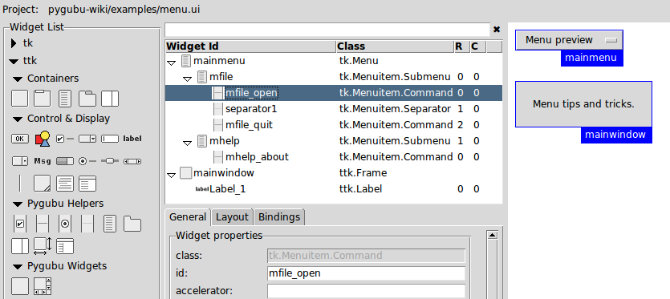
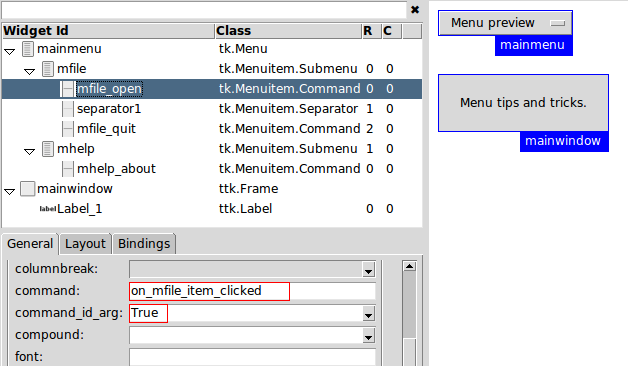
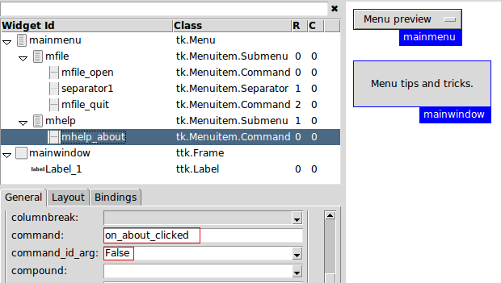

# pygubu 사용법

 본 문서는 Python  의 GUI Package 의 하나인 tkinter 를 쉽게 사용 할 수 있도록 하는 GUI Builder 중 하나인 pygubu 의 사용법을 기술 합니다.

출처: https://github.com/alejandroautalan/pygubu/wiki

## Home

Pygubu는 LiClipse (git 및 debug GUI 포함, 원하는 경우 lint / pep 툴링 포함)를 기반으로하는 Python RAD IDE에서 GUI 빌더로 실제로 빛을 발합니다. 일부 수동 텍스트 편집은 남아 있습니다.

본 문서는 원본의 일반적인 사용 방법과 순서가 상이하여  메뉴를 기준으로 편집을 새로함.

원본 페이지의 메뉴

- **[Home](https://github.com/alejandroautalan/pygubu/wiki)**
- **[2 GUI overview](https://github.com/alejandroautalan/pygubu/wiki/2-GUI-overview)**
- **[3 VariableProperty](https://github.com/alejandroautalan/pygubu/wiki/3-VariableProperty)**
- **[4 TkApplication vs Tk.Toplevel](https://github.com/alejandroautalan/pygubu/wiki/4-TkApplication-vs-Tk.Toplevel)**
- **[5 Using the tk.Toplevel Widget](https://github.com/alejandroautalan/pygubu/wiki/5-Using-the-tk.Toplevel-Widget)**
- **[6 Capture DeleteWindowEvent](https://github.com/alejandroautalan/pygubu/wiki/6-Capture-DeleteWindowEvent)**
- **[7 MenuTipsAndTricks](https://github.com/alejandroautalan/pygubu/wiki/7-MenuTipsAndTricks)**
- **[8 FAQ](https://github.com/alejandroautalan/pygubu/wiki/8-FAQ)**
- **[9 problems and difficulties](https://github.com/alejandroautalan/pygubu/wiki/9-problems-and-difficulties)**
- **[advanced users](https://github.com/alejandroautalan/pygubu/wiki/advanced-users)**
- **[CommandProperties](https://github.com/alejandroautalan/pygubu/wiki/CommandProperties)**
- **[ImageProperty](https://github.com/alejandroautalan/pygubu/wiki/ImageProperty)**
- **[IncorporateCustomWidget](https://github.com/alejandroautalan/pygubu/wiki/IncorporateCustomWidget)**
- **[IncorporateCustomWidget.es](https://github.com/alejandroautalan/pygubu/wiki/IncorporateCustomWidget.es)**
- **[Make widget resizable](https://github.com/alejandroautalan/pygubu/wiki/Make-widget-resizable)**

- **[PathChooserInput](https://github.com/alejandroautalan/pygubu/wiki/PathChooserInput)**
- **[Pygubu Overview](https://github.com/alejandroautalan/pygubu/wiki/Pygubu-Overview)**


## 2 GUI 개요

### 개요

기본 인터페이스는 다음 섹션으로 구성됩니다.




### 위젯 패널

이 섹션은 사용 가능한 위젯을 보여줍니다. Tk 위젯과 ttk 위젯의 두 가지 주요 지점으로 나뉩니다.

### Container widgets

위젯 트리의 루트 요소로 삽입 할 수있는 유일한 위젯입니다. 컨테이너 위젯의 하위로 위젯을 계속 추가하려면이 중 하나를 추가해야합니다.

### Control & Display widgets

이것은 tk에 포함 된 표준 제어 위젯입니다.

#### Pygubu Helpers

이 위젯은 Menuitems, Notebook Tabs, Panedwindow Panes, Treeview Columns 등과 같은 다른 위젯을 쉽게 만드는 데 사용됩니다.

#### Pygubu Widgets

이것은 pygubu 메인 창을 만드는 데 사용되는 사용자 정의 위젯이며 사용할 수 있습니다.


### 위젯 트리

프로젝트에 포함 된 위젯을 트리 계층으로 표시합니다.

#### 위젯 추가

트리에 위젯을 추가하려면 새 위젯의 상위가 될 위젯을 선택하고 위젯 패널에서 새 위젯의 아이콘을 클릭하십시오.

새로운 최상위 컨테이너를 추가하려면 트리에서 선택된 항목이 없는지 확인하고 컨테이너 아이콘을 클릭하십시오.

트리에 표시되는 열은 다음과 같습니다.

- **Widget Id**: 고유 한 위젯 식별자
- **Class**: 위젯 클래스 이름
- **R**: 이 위젯이 상위 그리드에 있는 행 번호입니다.
- **C**: 이 위젯이 상위 그리드에있는 열 번호입니다.

트리의 상단에는 검색 창이 있습니다. 특정 위젯 식별자 또는 클래스 이름을 검색하는 데 사용할 수 있습니다.


### 위젯 속성 편집기

위젯 트리에서 현재 선택된 위젯의 속성을 편집 할 수 있습니다.

세 부분으로 나뉩니다.

- **General**: 편집 가능한 위젯 속성을 표시합니다.
- **Layout**: 위젯의 레이아웃을 구성 할 수 있습니다. 현재 지원되는 유일한 레이아웃은 그리드 입니다.
- **Bindings**: 위젯에 새 바인딩을 추가 할 수 있습니다.


### 미리보기 패널

위젯 트리에서 모든 최상위 위젯의 미리보기를 표시합니다.

각 최상위 위젯은 파란색 상자와 고유 식별자로 둘러싸여 있습니다. 식별자를 드래그하여 미리보기의 크기를 늘릴 수 있습니다 (최상위 위젯의 레이아웃 구성에 따라 다름)


## 3 Variable Property

### 제어 변수 속성

GUI 빌더를 통해 디자인 할 때 편리합니다. '변수'를 슬라이더 위젯과 입력 위젯에 연결할 수 있습니다. 그런 다음 프로그래밍 방식으로 필요한 작업없이 런타임에 마우스를 사용하여 슬라이더를 이동하면 입력 변수에서도 '변수'번호가 눈에 띄게 변경됩니다. 'varival'은 다음과 비슷한 Python 앱 코드에서 프로그래밍 방식으로 액세스 할 수 있습니다.

```python
print( 'current value is ' + self.builder.tkvariables.__getitem__('varival').get() )
```

이 위키의 예제 코드를 따른 경우 마우스로 슬라이더를 앞뒤로 당기면 다른 숫자가 인쇄됩니다. 이러한 변수는 초기화되지 않을 수 있으며 한 번 수동으로 조작 한 후에 만 설계된 값으로 가정합니다.

---

일부 tk 위젯에는 variable 또는 textvarible이라는 특성이 있습니다. 이러한 특성에는 제어 변수, 위젯 뒤의 값을 제어하는 데 사용되는 오브젝트가 포함됩니다. Pygubu에서 이 특성은 위젯이 작성 될 때 변수의 이름으로 사용될 문자열 ID를 승인합니다.


### Pygubu에서 제어 변수 사용

변수를 정의하려면 속성 편집기에 변수 이름을 입력하십시오. 기본적으로 작성된 변수는 tkinter StringVar입니다. 다른 유형을 지정하려면 콤보 박스를 사용할 수 있습니다.

사용 가능한 유형은 StringVar, IntVar, DoubleVar, BooleanVar입니다. 위젯이 각 유형을 관리하는 방법에 대한 정보는 tk 문서를 참조하십시오.

코드에서 빌더 메소드 get_variable (name)을 사용하여 tkinter 변수의 참조를 검색 할 수 있습니다.

#### 예 1 : 제어 변수 특성 사용










인터페이스 파일: [controlvariables.ui](https://github.com/alejandroautalan/pygubu/wiki/examples/controlvariables.ui)

전체 예제 코드: [controlvariables.py](https://github.com/alejandroautalan/pygubu/wiki/examples/controlvariables.py)


## 4 TkApplication vs Tk.Toplevel

Pygubu에는 * .ui 파일을 사용하는 python 앱 코드를 수동으로 작성하는 방법이 2 가지 있습니다.

대부분의 예는 TkApplication 종류입니다. 초보자는 그곳에서 시작해야합니다. 두 품종을 분리하지 않으면 오류가 발생합니다. 처음에는 TkApplication 또는 Tk.Toplevel을 원하는지 결정해야하며 다른 유형의 앱에서 코드를 복사 /붙여 넣기 할 때는주의해야합니다. 즉, pygubu 에는 이와 관련하여 약간의 비 호환성이 있습니다.

TkApplication은 tk.Toplevel 위젯이 pygubu에 추가되기 전에 생성 된 도우미 클래스입니다. Pygubu에서 사용할 수있는 유일한 루트 위젯이 프레임 위젯 인 경우 기본 tk.Tk () 루트 창의 구성을 용이하게하는 것이 목적이었습니다.

Tk.Toplevel 클래스가 추가되었으므로 헬퍼가 허용 한 항목이 이미 이 클래스를 통합했기 때문에 더 이상 헬퍼 클래스를 사용할 필요가 없습니다. 즉, 두 클래스를 동시에 사용하려는 것은 아닙니다.

프레임의 고정 속성을 변경할 때 가중치 속성을 사용하여 크기를 조정할 열과 행을 지정하는 것을 잊지 마십시오.

Tk.Toplevel 위젯을 사용하여 초기 창 크기를 지정하려면 geometry 속성을 사용하십시오.


## 5 tk.Toplevel 위젯 사용

Tk.Toplevel 위젯이 TkApplication 헬퍼 클래스의 기능을 대체하기 위해 pygubu에 추가되었습니다. Pygubu-designer를 사용하여 최상위 위젯을 구성 할 수 있습니다.


### 사용 권장 사항

프레임을 최상위의 첫 번째이자 유일한 자식으로 사용하는 것이 좋습니다. 기본 창 크기를 조정할 때 도움이됩니다. 그런 다음 다른 모든 위젯을 프레임 안에 넣으십시오.


### 최소 예

Tk.Toplevel 위젯을 사용한 Hello World 프로그램.

```xml
<?xml version='1.0' encoding='utf-8'?>
<interface>
  <object class="tk.Toplevel" id="mainwindow">
    <property name="height">200</property>
    <property name="resizable">both</property>
    <property name="title" translatable="yes">Minimal toplevel example</property>
    <property name="width">200</property>
    <child>
      <object class="ttk.Frame" id="container1">
        <property name="height">200</property>
        <property name="width">200</property>
        <layout>
          <property name="column">0</property>
          <property name="propagate">True</property>
          <property name="row">0</property>
          <property name="sticky">nsew</property>
          <columns>
            <column id="0">
              <property name="weight">1</property>
            </column>
          </columns>
          <rows>
            <row id="0">
              <property name="weight">1</property>
            </row>
          </rows>
        </layout>
        <child>
          <object class="ttk.Label" id="Label_1">
            <property name="anchor">center</property>
            <property name="font">{Helvetica} 36 {bold}</property>
            <property name="foreground">#000081</property>
            <property name="padding">40 10</property>
            <property name="text" translatable="yes">Hello World!</property>
            <layout>
              <property name="column">0</property>
              <property name="propagate">True</property>
              <property name="row">0</property>
              <property name="sticky">nsew</property>
            </layout>
          </object>
        </child>
      </object>
    </child>
  </object>
</interface>
```

```python
#!/usr/bin/python
# File: toplevelminimal.py
import os
try:
    import tkinter as tk
except:
    import Tkinter as tk
import pygubu


CURRENT_DIR = os.path.abspath(os.path.dirname(__file__))


class MyApplication:
    def __init__(self):
        #1: Create a builder
        self.builder = builder = pygubu.Builder()

        #2: Load an ui file
        builder.add_from_file(os.path.join(CURRENT_DIR, 'toplevelminimal.ui'))
        
        #3: Create the toplevel widget.
        self.mainwindow = builder.get_object('mainwindow')

    def quit(self, event=None):
        self.mainwindow.quit()

    def run(self):
        self.mainwindow.mainloop()
        
if __name__ == '__main__':
    app = MyApplication()
    app.run()
```


## 6 Capture DeleteWindowEvent

창 삭제 이벤트를 캡처하는 방법

창 삭제 이벤트를 캡처하려면 UI의 최상위 위젯에서 프로토콜 메소드를 호출하고 해당 이벤트에서 호출 될 콜백 함수를 전달하십시오. 마지막으로 콜백 내부에서 최상위 위젯에서 destroy 메소드를 호출해야합니다.

UI의 루트 위젯이 프레임 인 경우의 예 :

[demo1.py](https://github.com/alejandroautalan/pygubu/wiki/examples/windowdeleteevent/demo1.py)

[demo1.ui](https://github.com/alejandroautalan/pygubu/wiki/examples/windowdeleteevent/demo1.ui)

```python
class Application:
    def __init__(self, master):
        self.builder = builder = pygubu.Builder()
        builder.add_from_file('demo1.ui')
        self.mainwindow = builder.get_object('mainwindow', master)
        # Connect Delete event to a toplevel window
        master.protocol("WM_DELETE_WINDOW", self.on_close_window)
        
    def on_close_window(self, event=None):
        print('On close window')
        
        # Call destroy on toplevel to finish program
        self.mainwindow.master.destroy()


if __name__ == '__main__':
    root = tk.Tk()
    app = Application(root)
    root.mainloop()
```

```xml
<?xml version='1.0' encoding='utf-8'?>
<interface>
  <object class="ttk.Frame" id="mainwindow">
    <property name="height">200</property>
    <property name="width">200</property>
    <layout>
      <property name="column">0</property>
      <property name="propagate">True</property>
      <property name="row">0</property>
    </layout>
    <child>
      <object class="tk.Message" id="Message_1">
        <property name="anchor">center</property>
        <property name="font">TkHeadingFont</property>
        <property name="justify">center</property>
        <property name="text" translatable="yes">Window Delete Event

Demo 1</property>
        <property name="width">200</property>
        <layout>
          <property name="column">0</property>
          <property name="propagate">True</property>
          <property name="row">0</property>
        </layout>
      </object>
    </child>
  </object>
</interface>
```


UI의 루트 위젯이 최상위 레벨 인 경우의 예 :

[demo2.py](https://github.com/alejandroautalan/pygubu/wiki/examples/windowdeleteevent/demo2.py)

[demo2.ui](https://github.com/alejandroautalan/pygubu/wiki/examples/windowdeleteevent/demo2.ui)

```python
class Application:
    def __init__(self):
        self.builder = builder = pygubu.Builder()
        builder.add_from_file('demo2.ui')
        self.mainwindow = builder.get_object('mainwindow')

        # Connect Delete event to a toplevel window
        self.mainwindow.protocol("WM_DELETE_WINDOW", self.on_close_window)
        
    def on_close_window(self, event=None):
        print('On close window')
        
        # Call destroy on toplevel to finish program
        self.mainwindow.destroy()
        
    def run(self):
        self.mainwindow.mainloop()


if __name__ == '__main__':
    app = Application()
    app.run()
```

```xml
<?xml version='1.0' encoding='utf-8'?>
<interface>
  <object class="tk.Toplevel" id="mainwindow">
    <property name="height">200</property>
    <property name="title" translatable="yes">Demo 2  - With Toplevel as root</property>
    <property name="width">200</property>
    <child>
      <object class="ttk.Frame" id="Frame_2">
        <property name="height">200</property>
        <property name="width">200</property>
        <layout>
          <property name="column">0</property>
          <property name="propagate">True</property>
          <property name="row">0</property>
        </layout>
        <child>
          <object class="tk.Message" id="Message_1">
            <property name="anchor">center</property>
            <property name="font">TkHeadingFont</property>
            <property name="justify">center</property>
            <property name="text" translatable="yes">Window Delete Event

Demo 2</property>
            <property name="width">300</property>
            <layout>
              <property name="column">0</property>
              <property name="propagate">True</property>
              <property name="row">0</property>
            </layout>
          </object>
        </child>
      </object>
    </child>
  </object>
</interface>

```


## 7 MenuTipsAndTricks

### 메뉴 만들기

메뉴가 표시되기 전에 일부 py 코드를 app.py 파일에 수동으로 추가해야합니다 (예 :)

```python
self.mainmenu = menu = builder.get_object('Menu_1') # Menu_1 = std name

e=self.set_menu(menu)

e=builder.connect_callbacks(self)
```

메뉴를 만들려면 메뉴, 메뉴 항목 명령, 메뉴 항목 확인 버튼, 메뉴 항목 라디오 버튼, 메뉴 항목 하위 메뉴 및 메뉴 항목 분리기를 사용할 수 있습니다.

다음 예를 참조하십시오.



인터페이스 파일: [menu.ui](https://github.com/alejandroautalan/pygubu/wiki/examples/menu.ui)

```xml
<?xml version="1.0" ?>
<interface>
  <object class="tk.Menu" id="mainmenu">
    <property name="tearoff">0</property>
    <child>
      <object class="tk.Menuitem.Submenu" id="mfile">
        <property name="command_id_arg">False</property>
        <property name="label" translatable="yes">File</property>
        <property name="tearoff">0</property>
        <child>
          <object class="tk.Menuitem.Command" id="mfile_open">
            <property name="command">on_mfile_item_clicked</property>
            <property name="command_id_arg">True</property>
            <property name="label" translatable="yes">Open</property>
          </object>
        </child>
        <child>
          <object class="tk.Menuitem.Separator" id="separator1"/>
        </child>
        <child>
          <object class="tk.Menuitem.Command" id="mfile_quit">
            <property name="command">on_mfile_item_clicked</property>
            <property name="command_id_arg">True</property>
            <property name="label" translatable="yes">Quit</property>
          </object>
        </child>
      </object>
    </child>
    <child>
      <object class="tk.Menuitem.Submenu" id="mhelp">
        <property name="command_id_arg">False</property>
        <property name="label" translatable="yes">Help</property>
        <property name="tearoff">0</property>
        <child>
          <object class="tk.Menuitem.Command" id="mhelp_about">
            <property name="command">on_about_clicked</property>
            <property name="command_id_arg">False</property>
            <property name="label" translatable="yes">About</property>
          </object>
        </child>
      </object>
    </child>
  </object>
  <object class="ttk.Frame" id="mainwindow">
    <property name="height">200</property>
    <property name="width">200</property>
    <layout>
      <property name="column">0</property>
      <property name="propagate">True</property>
      <property name="row">0</property>
      <property name="sticky">nesw</property>
    </layout>
    <child>
      <object class="ttk.Label" id="Label_1">
        <property name="padding">20</property>
        <property name="text" translatable="yes">Menu tips and tricks.</property>
        <layout>
          <property name="column">0</property>
          <property name="propagate">True</property>
          <property name="row">0</property>
        </layout>
      </object>
    </child>
  </object>
</interface>

```


### 메인 창에 메뉴 추가

```python
    # menu.py
    import tkinter as tk
    from tkinter import messagebox
    import pygubu
  
    class MyApplication(pygubu.TkApplication):
  
        def _create_ui(self):
            #1: Create a builder
            self.builder = builder = pygubu.Builder()
  
            #2: Load an ui file
            builder.add_from_file('menu.ui')
  
            #3: Create the widget using self.master as parent
            self.mainwindow = builder.get_object('mainwindow', self.master)
  
            # Set main menu
            self.mainmenu = menu = builder.get_object('mainmenu', self.master)
            self.set_menu(menu)

    if __name__ == '__main__':
        root = tk.Tk()
        app = MyApplication(root)
        app.run()
```


### 메뉴 클릭에 반응

메뉴 조치에 응답하려면 Menuitem 위젯의 명령 특성에서 콜백 함수 이름을 설정해야합니다.

정의 된 콜백을 연결하려면 빌더 오브젝트에서 connect_callbacks 함수를 호출해야합니다.

Menuitems에는 추가적으로 command_id_arg라는 추가 속성이 있습니다. True로 설정하면 추가 인수로 위젯 ID와 함께 콜백 함수가 호출됩니다. False로 설정하면 추가 인수가 호출에 추가되지 않습니다.

추가 인수를 사용하여 콜백 함수를 구성하는 예제 1 :



Code:

```python
    ...
    class MyApplication(pygubu.TkApplication):
        def _create_ui(self):
            ...
            # Configure callbacks
            builder.connect_callbacks(self)

        def on_mfile_item_clicked(self, itemid):
            if itemid == 'mfile_open':
                messagebox.showinfo('File', 'You clicked Open menuitem')

            if itemid == 'mfile_quit':
                messagebox.showinfo('File', 'You clicked Quit menuitem. Byby')
                self.quit();
    ...
```

예제 2, 추가 인수없이 콜백 함수 구성



Code:

```python
    ...
    class MyApplication(pygubu.TkApplication):
        def _create_ui(self):
            ...
            # Configure callbacks
            builder.connect_callbacks(self)

        def on_about_clicked(self):
                messagebox.showinfo('About', 'You clicked About menuitem')
    ...
```

전체 예제 코드: [menu.py](https://github.com/alejandroautalan/pygubu/wiki/examples/menu.py)

```python
# menu.py
import tkinter as tk
from tkinter import messagebox
import pygubu

class MyApplication(pygubu.TkApplication):

    def _create_ui(self):
        #1: Create a builder
        self.builder = builder = pygubu.Builder()

        #2: Load an ui file
        builder.add_from_file('menu.ui')

        #3: Create the widget using self.master as parent
        self.mainwindow = builder.get_object('mainwindow', self.master)

        # Set main menu
        self.mainmenu = menu = builder.get_object('mainmenu', self.master)
        self.set_menu(menu)

        # Configure callbacks
        builder.connect_callbacks(self)


    def on_mfile_item_clicked(self, itemid):
        if itemid == 'mfile_open':
            messagebox.showinfo('File', 'You clicked Open menuitem')

        if itemid == 'mfile_quit':
            messagebox.showinfo('File', 'You clicked Quit menuitem. Byby')
            self.quit();


    def on_about_clicked(self):
        messagebox.showinfo('About', 'You clicked About menuitem')


if __name__ == '__main__':
    root = tk.Tk()
    app = MyApplication(root)
    app.run()

```


사용법 및 테스트는 https://github.com/alejandroautalan/pygubu 참조 하고 예제를 보는게 나을듯


문서화가 너무 않되어 있음.

