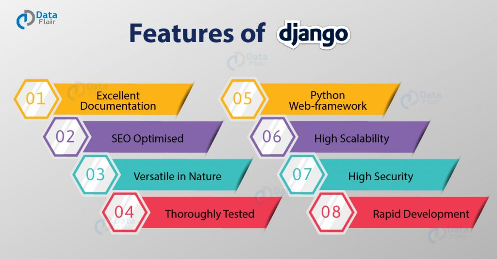

# 개발을위한 최고의 Python 웹 프레임 워크 선택

Python은 동적 웹 개발 기능과 관련된 강력한 프로그래밍 언어가되었습니다. 또한 Python은 이제 인공 지능 및 기계 학습을위한 최고의 언어 중 하나입니다.

Python은 그 자체로 강력한 프로그래밍 언어입니다. 동적 프레임 워크와 결합하면 의심 할 여지없이 웹 개발에 가장 적합한 프레임 워크 중 하나가됩니다. Python 용으로 가장 많이 사용되는 프레임 워크 중 두 가지는 Django와 Flask입니다.

## Django 프레임 워크 란 무엇입니까?

Django는 배터리 포함 방식으로 인기있는 [웹 개발 프레임 워크](https://www.botreetechnologies.com/web-application-development) 입니다. 이는 프레임 워크가 코딩 시간을 줄이는 많은 기능과 라이브러리를 제공하기 때문에 Django 프로젝트를 빠르게 완료 할 수 있음을 의미합니다.

Django 프레임 워크는 훨씬 더 많은 유연성을 제공하고 구성 요소의 재사용성에 중점을 둡니다. 이를 통해 계산 기능과 RestAPI가 강력한 웹 애플리케이션을 개발할 수 있습니다.

> Django 모델 관리자가 코드 유지 관리를 어떻게 도울 수 있는지 알고 싶으십니까? 
>
> 다음 [은 Django 관리자를위한 확실한 가이드와](https://www.botreetechnologies.com/blog/definitive-guide-for-django-model-managers) 올바른 방법으로 [구현](https://www.botreetechnologies.com/blog/definitive-guide-for-django-model-managers) 하는 방법입니다.

## 웹 개발을위한 Django 사용의 장점

Django는 2020 년에 웹 개발을위한 가장 인기있는 프레임 워크 중 하나로 부상했습니다. 확장 성과 유연성으로 인해 Django 프레임 워크는 전 세계의 개발자와 조직에서 사용됩니다.

**Django 프레임 워크 사용 의 주요 \**이점\** 이해 :-**

**1. 배터리 포함** [Django 웹 프레임 워크 사용](https://www.botreetechnologies.com/django-development)
의 가장 [중요한 장점](https://www.botreetechnologies.com/django-development) 중 하나는 **배터리가 포함되어** 있다는 것입니다. Django에는 개발자가 사용할 수있는 혁신적인 기능이 많이 있습니다.

이는 패키지를 가져옴으로써 개발자가 웹 애플리케이션에 많은 기능을 추가 할 수 있음을 의미합니다. 대량의 코드를 작성할 필요가 없으므로 개발 시간이 두 배로 단축됩니다.

Django는 동적 웹 개발을 허용하며 구성 패러다임에 대한 관례의 일부입니다. 또한 개발자가 코드를 적게 작성하도록 권장하는 Do n't Repeat Yourself의 철학에 중점을 둡니다.

**2. 확장 성**
Django 사용의 또 다른 중요한 이점은 완벽한 확장 성 옵션을 제공한다는 것입니다. 기업은 향후 애플리케이션을 확장 할 수있는 프레임 워크를 원합니다. Django 마이크로 서비스 인증은 확장 성을 위해 별도의 서버를 제공합니다.

기업이 애플리케이션을 확장하려는 경우 Django는 애플리케이션, 미디어 및 데이터베이스를위한 여러 서버를 제공합니다.

충분하지 않은 경우 클러스터링 및로드 밸런싱을 사용하여 여러 서버에서 애플리케이션을 실행하고 데이터베이스를 배포합니다. 확장 성은 대부분의 기업이 전통적인 웹 개발 프레임 워크에서 Django로 이동하는 이유입니다.

**3. Python 기반 프레임 워크**
[Django를 사용한 Python 웹 개발](https://www.botreetechnologies.com/python-development) 은 오늘날 세계에서 가장 요구되는 기술 중 하나입니다. 파이썬이 웹 애플리케이션을 코딩하는 데 점점 더 일반적인 프로그래밍 언어가되고 있기 때문입니다.

Python은 명확한 구문을 가진 쉬운 프로그래밍 언어입니다. 코드를 작성하는 동안 개발자에게 완전한 유연성을 제공합니다.

전 세계의 컴퓨터 과학 과정에서 Python은 일반적인 프로그래밍 언어입니다. 세계에서 세 번째로 가장 인기있는 프로그래밍 언어입니다. Python 작업을 좋아하는 숙련 된 Django 개발자가 많이 있습니다.

**4. 관리 인터페이스**
개발자는 Django를 좋아합니다. 백엔드 관리 및 관리에 소요되는 시간을 줄여주기 때문입니다. 어떻게?

Django는 백엔드에서 데이터를 관리하고 기본 CRUD 작업을 관리하기위한 기본 제공 관리 인터페이스를 제공합니다. 인터페이스는 전문적이고 다재다능하므로 개발자는 관리보다 개발에 더 집중할 수 있습니다.

백엔드에서 자체 관리 인터페이스를 만드는 번거 로움을 줄이고 웹 개발을위한 Django 설치 속도를 높입니다.

> 또한 읽기 : [Django와 Ruby on Rails 비교](https://www.botreetechnologies.com/blog/django-vs-ruby-on-rails-comparison)

## Flask 프레임 워크 란 무엇이며 사용하는 이유

Flask python은 단순성과 최소한의 코딩에 초점을 맞춘 웹 개발 용 마이크로 프레임 워크입니다. 확장 라이브러리 또는 모듈이 없습니다. 실제로 Flask는 Django보다 개발에 더 많은 역 동성을 제공합니다. 이를 통해 개발자 는 Python으로 웹 개발 중 D jango 보다 훨씬 더 나은 실험을 할 수 있습니다 .

Python Flask 프레임 워크는 라이브러리가 아니라 양식 유효성 검사, 개체 관계 매핑, 업로드 메커니즘 등을위한 확장을 제공합니다.

## Flask와 Django의 차이점

Django 웹 프레임 워크는 자체 Django ORM을 사용하여 개체 관계형 매핑과 함께 작동하며 데이터 모델을 활용합니다. 반면에 Flask에는 데이터 모델이 없습니다. 따라서 어떤 의미에서 개발자는 Flask 개발에서 클래스를 데이터베이스와 연결할 수 없습니다.

## 웹 개발에 Flask를 사용할 때의 이점

Flask 프로그래밍은 WSGI 유틸리티 라이브러리 인 Werkzeug와 템플릿 엔진 인 Jinja2의 두 가지 종속성으로 시작됩니다. 그 외에도 마이크로 프레임 워크 Flask 개발은 사용하기 정말 쉽습니다. 처음부터 종속성이 없으며 개발자에게 깨끗한 코딩을 제공합니다.

### 다음은 Python을 사용한 Flask 웹 개발의 몇 가지 이점입니다.

**1. 더 높은 성능**
Flask 웹 프레임 워크는 제한된 종속성을 가지고 있기 때문에 추상화 수준도 낮습니다. 이는 데이터베이스, 요청, 캐시 등에서 추상화 수준이 더 적다는 것을 의미합니다.

여러 패키지로 인해 느려지지 않으므로 처음부터 더 높은 성능을 제공합니다. 프레임 워크는 빠르고 동적이므로 개발자가 최대 성능을 얻을 수 있습니다.

가볍고 모듈 식 디자인으로 고성능을 제공하는 데 중요한 역할을합니다.

**2. 단순성**
최고의 Flask를 사용하는 가장 큰 이점 중 하나는 단순하고 최소한의 웹 개발 프레임 워크라는 것입니다.

Flask 프레임 워크는 개발자에게 더 많은 자유를 허용하며 단순성 때문에 실험 할 수 있습니다. 그들은 애플리케이션에서 많은 수의 외부 라이브러리와 애드온을 활용할 수 있습니다.

단순함은 개발자가 이러한 라이브러리를 사용하여 프레임 워크에서 많은 작업을 수행 할 수 있으므로 프레임 워크를 더욱 확장 할 수 있습니다.

**3. 문서화**
Flask 웹 개발은 포괄적 인 문서를 제공하므로 개발자가 프레임 워크를보다 쉽게 ​​이해하고 사용할 수 있습니다.

이 문서는 프레임 워크가 웹 개발과 함께 작동하는 방식에 대한 명확한보기를 제공하는 사례 연구와 예제로 가득합니다.

잘 구조화 된 문서가 있으며 개발자는 Flask의 모양, 느낌 및 작동을 실제로 이해하기 위해 일부 샘플 응용 프로그램을 사용할 수도 있습니다.

**4. Unopinionated 프레임 워크**
Flask는 많은 표준과 관례를 따르지 않는 프레임 워크 중 하나입니다.

원하는 방식으로 구현할 수 있음을 의미합니다. 개발자는 Django 웹 프레임 워크가 아닌 Flask를 사용하여 웹 애플리케이션을 개발하면서 더 많은 유연성과 역 동성을 얻을 수 있습니다.

이러한 유연성은 개발에 대한 더 많은 제어를 제공하고 Django 웹 개발보다 더 많은 학습 기회를 제공합니다.

## Flask와 Django의 주요 차이점은 다음과 같습니다.

| **Django 웹 프레임 워크**                                    | **플라스크 마이크로 프레임 워크**                            |
| ------------------------------------------------------------ | ------------------------------------------------------------ |
| Django는 MVC 패턴과 우수한 아키텍처 디자인을 기반으로하는 Python 기반의 오픈 소스 웹 개발 프레임 워크입니다. | Flask는 웹 애플리케이션을 개발하기위한 외부 종속성이나 라이브러리가없는 Python 기반의 마이크로 프레임 워크입니다. |
| 프로젝트 관련 문제를 처리하기위한 즉시 사용 가능한 관리 인터페이스. 개발자가 프레임 워크를 사용자 정의 할 수있는 기능 관리 모듈이 있습니다. | Flask에는 시스템 쿼리 관리를 허용하지 않는 내장 관리 인터페이스가 없습니다. 개발자는 프로젝트 관리를위한 기능적 관리 인터페이스를 만들어야합니다. |
| Django 프로젝트는 프레임 워크에 우수한 기능을 허용하는 기본 제공 기능이 있으므로 개발자에게 더 많은 기능을 제공합니다. | Flask는 표준 접근 방식을 따르지 않으며 개발자에게 웹 애플리케이션 구축을위한 더 많은 제어 기능을 제공하여 더 나은 구현을 가능하게합니다. |
| 각 웹 개발 프로젝트는 관리가 더 용이하도록 작은 프로젝트로 나눌 수 있습니다. 이러한 작은 응용 프로그램은 개발 및 유지 관리가 더 간단합니다. | 각 프로젝트는 Flask에서 단일 애플리케이션 만 될 수 있습니다. 개발자는 프로젝트를 분할 할 수 없지만 단일 프로젝트에 다른 모델과보기를 추가 할 수 있습니다. |
| Django는 ORM 및 관리 사이트를 사용하여 통합 할 수있는 양식 유효성 검사와 함께 제공됩니다. | Flask 프로그래밍에는 양식 유효성 검사를 허용하는 기능이 없습니다. WTForms는 양식에 사용할 수 있습니다. |
| Django는 구성에 대한 관습과 Do n't Repeat Yourself 원칙에 중점을 둡니다. 설정을 더 쉽게 만들고 개발자가 설정된 개발 표준을 따를 수 있습니다. | Flask는 개발자가 웹 개발에 대해 동일한 표준 세트를 따르지 않고 프레임 워크를 더 많이 실험 할 수 있도록하는 임의적이고 독단적 인 구조를 따릅니다. |
| Django의 ORM을 사용하여 개발자는 SQLite, PostgreSQL, MySQL 및 Oracle을 포함한 여러 데이터베이스로 작업 할 수 있습니다. 또한 데이터베이스 생성 및 마이그레이션에도 도움이됩니다. | Flask는 개발자에게 ORM을 선택하고 별도의 데이터베이스로 작업 할 수있는 자유를 제공합니다. 그러나 학습 곡선이 어렵고 때로는 개발자가 데이터베이스와 혼동을 겪습니다. |
| 개발자는 Django 확장 성과 함께 제공되는 기본 제공 템플릿 엔진을 사용하여 Django에서 사용자 대면 레이어를 정의 할 수 있습니다. Django Template Engine으로 작성된 템플릿을 통해 레이어를 정의하는 데 드는 시간과 노력을 줄이고 사용자 인터페이스 개발 속도를 높입니다. | Flask는 Jinja2 템플릿 엔진을 기반으로합니다. 당연히 Django의 템플릿 엔진에서 영감을 얻었습니다. 통합 된 샌드 박스 실행 환경이있어 개발자가 애플리케이션을 빠르게 구축 할 수 있습니다. 구문을 작성하는 표현 템플릿이 있습니다. |

> 또한 읽어보십시오 : [애플리케이션에 Django 웹 개발을 사용해야합니까](https://www.botreetechnologies.com/blog/should-you-use-django-web-development-for-your-application) ?

## 결론 : Django vs Flask에서 누가 이겼습니까?

Django와 Flask는 모두 트래픽이 많고 보안이 뛰어나며 확장 가능한 웹 애플리케이션과 웹 사이트를 구축하는 데 사용됩니다. 그러나 Django는 데이터 과학 기능도 제공하기 때문에 flask보다 더 많이 사용되는 것 같습니다.

[Django 웹 프레임 워크](https://www.botreetechnologies.com/django-development) 의 라이브러리와 패키지를 [사용하면 개발자가](https://www.botreetechnologies.com/django-development) 많은 코드를 작성하지 않고도 [애플리케이션을](https://www.botreetechnologies.com/django-development) 빠르게 [빌드 할 수](https://www.botreetechnologies.com/django-development) 있습니다.

반면에 Flask는 비표준 개발 철학을 통해 웹 개발 프로세스를 가속화하기위한 적절한 마이크로 프레임 워크입니다. 엄청난 양의 월간 트래픽을 생성하는 정적 웹 사이트를위한 훌륭한 웹 프레임 워크입니다.

[개발자는](https://www.botreetechnologies.com/hire-python-developers) 다양한 프로젝트 요구 사항에 따라 [Flask를 사용자 지정하고 확장 할 수 있습니다](https://www.botreetechnologies.com/hire-python-developers) . 이를 통해 개발을 더 많이 제어 할 수 있으며 표준 애플리케이션 개발 환경으로 제한하지 않습니다.

궁극적 인 선택은 프레임 워크로 달성하고자하는 것에 달려 있습니다. 그러나 일단 그렇게하면 고품질 웹 앱 빌드를 시작할 수 있습니다.

### ***충분히 배웠습니다!** 지금 바로 조치를 취하고 Python 웹 앱을 받으세요!*

### [전문가에게 문의하십시오!](https://www.botreetechnologies.com/contact)