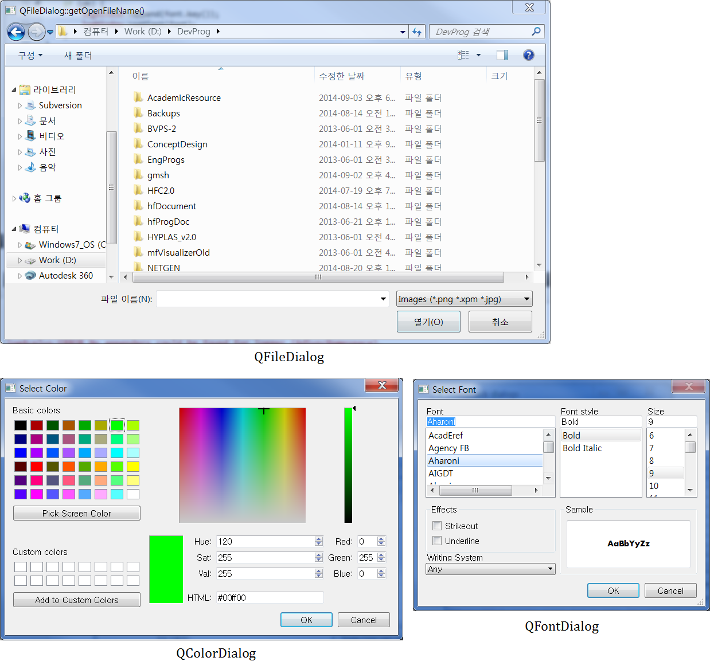
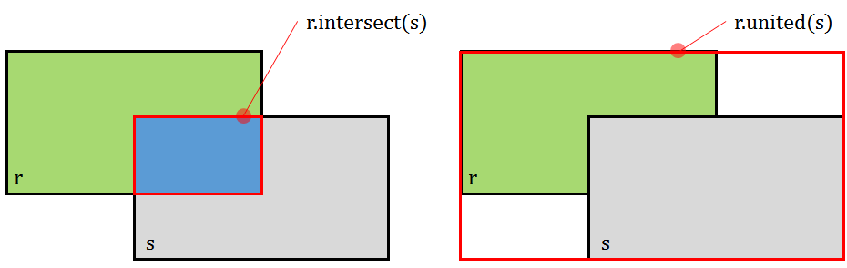
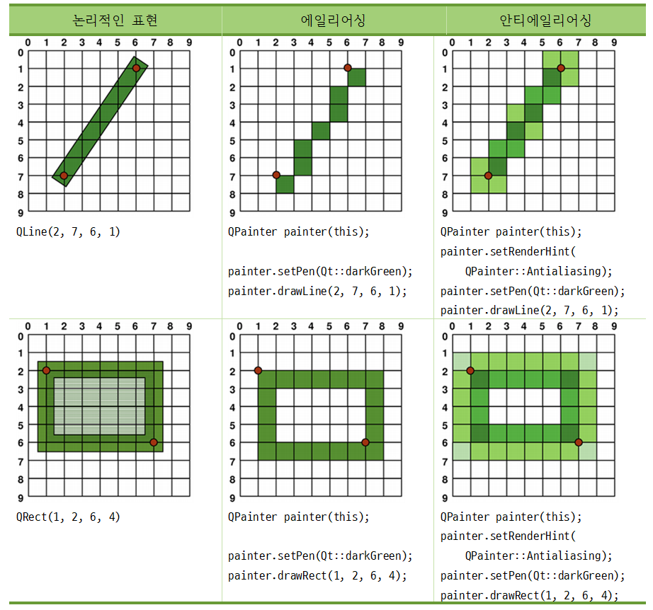
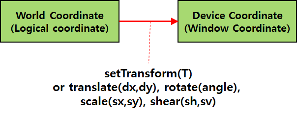

# 공학자를 위한 PySide2

출처: https://wikidocs.net/book/2957


이 책은 [공학자를 위한 Python](https://wikidocs.net/book/1704)의 자매책이다.

#### History

- 2019.5.13 : 1차 편집 완료


# 0. 들어가기 전에

### 이 책은

- 이 책은 [공학자를 위한 Python](https://wikidocs.net/book/1704)의 자매책이다.
- Qt의 공식 Python 바인딩인 PySide2에 대한 기본적인 사용법을 기술하고 있다(QML은 제외)
- Windows 환경에서 Anaconda 배포본을 사용한다고 가정한다(Anaconda 설치는 [공학자를 위한 Python](https://wikidocs.net/book/1704) 참조)

### PySide2

Python에서 GUI를 사용할 때는 Qt의 Python 바인딩인 PyQt를 주로 사용한다. PyQt는 Riverbank Computing이라는 회사에서 제작한 것이로, GPL와 상용 라이선스로 제공된다. PyQt4는 Qt4를 PyQt5는 Qt5를 대상으로 한다. LGPL 라이선스가 없다는 점이 아쉬운 점이다.

한편 Qt의 제작사는 Qt4를 대상으로 PySide라는 Python 바인딩을 제공하였지만, Qt5에 대해서는 제공하지 않다가 최근 PySide2라는 Qt5용 Python 바인딩을 제공하기 시작했다. Qt와 마찬가지로 GPL, LGPL, 상용라이선스를 제공한다. PyQt5와 PySide2의 API는 매우 비슷하기 떄문에 약간의 수정만으로 PyQt5 소스를 PySide2에서 사용할 수 있다.

- PyQt5 : Riverbank Computing 제공, 인터넷에서 충분히 많은 리소스를 구할 수 있다는 점이 장점
- PySide2 : Qt for Python 프로젝트(Qt 제작사 공식 Python 배포본). LGPL 라이선스가 있다는 점이 특징.

### 주요 참고 자료

- [Qt for Python](https://www.qt.io/qt-for-python) : PySide2 사이트
- [Qt Documentation](https://doc.qt.io/) : Qt 온라인 헬프
- [PyQt](https://riverbankcomputing.com/software/pyqt/intro) : PyQt 사이트
- [PyQt5 Tutorial : 파이썬으로 만드는 나만의 GUI 프로그램](https://wikidocs.net/book/2165) : PyQt5 대상
- [PyQT5 - Python Tutorial](https://pythonspot.com/pyqt5/)
- Rapid GUI Programming with Python and Qt : PyQt4로 작성되었지만 설명이 잘 되어 있다. 예제 소스를 PyQt5로 포팅한 것을 인터넷에서 찾을 수 있다.

### PySide2 설치

Anaconda 배포본에는 PyQt5가 포함되어 있다. PySide2는 pip로 설치한다.

```
> pip install PySide2
```

- PySide2의 Qt 버전 확인

```python
>>> import PySide2
>>> PySide2.__version__
'5.12.2'
>>> import PySide2.QtCore
>>> PySide2.QtCore.__version__
'5.12.2'
>>> PySide2.QtCore.qVersion()
'5.12.2'
```

`__version__`은 PySide2의 버전을 확인하는 것이고 `QtCore::qVersion()`은 QtCore DLL 모듈 수준에서의 버전이다. 이 둘은 동일해야 한다. PySide2의 Qt 버전은 5.12.2 임을 알 수 있다.

- PyQt5의 Qt 버전 확인

```python
import PyQt5.QtCore

PyQt5.QtCore.qVersion()
Out[4]: '5.9.7'
```

`PyQt5`는 별도의 **version** 멤버를 제공하지 않는다. `QtCore::qVersion()`를 통해 확인해야 한다. PyQt5의 Qt 버전은 5.9.7 임을 알 수 있다.

### 설치 경로

특히 Anaconda 배포본을 사용할 떄는 PyQt5와 경로가 중복될 수 있으므로 주의해야 한다.

- PyQt5 :
  - PyQt5 설치 경로 : `C:\ProgramData\Anaconda3\Lib\site-packages\PyQt5`
  - PyQt5가 사용하는 Qt DLL 경로 : `C:\ProgramData\Anaconda3\Library\bin`
  - PyQt5가 사용하는 plugin 경로 : `C:\ProgramData\Anaconda3\Library\plugins`
- PySide2
  - PySide2 설치 경로: `C:\ProgramData\Anaconda3\Lib\site-packages\PySide2`
  - PySide2가 사용하는 Qt DLL 경로 : `C:\ProgramData\Anaconda3\Lib\site-packages\PySide2`
  - PySide2가 사용하는 plugin 경로 : `C:\ProgramData\Anaconda3\Lib\site-packages\PySide2\plugins`

PySide2의 예제 파일은 다음 경로에 있다. * `C:\ProgramData\Anaconda3\Lib\site-packages\PySide2\examples`

### HelloQt

다음은 PyQt5와 PySide2를 이용한 간단한 예제이다.


(HelloQt 실행전경)

- HelloQtPyQt5.py (PyQt5 예제)

```python
from PyQt5.QtWidgets import QApplication, QWidget, QLabel
import sys

if __name__ == '__main__':
    app = QApplication(sys.argv)

    window = QWidget()
    window.resize(289,170)
    window.setWindowTitle("FIrst Qt Program")

    label = QLabel('Hello Qt',window)
    label.move(110,80)

    window.show()
    app.exec_()
```

- HelloQt.py (PySide2 예제)

```python
if __name__ == '__main__':
    from PySide2.QtCore import QCoreApplication
    QCoreApplication.setLibraryPaths(['C:\ProgramData\Anaconda3\Lib\site-packages\PySide2\plugins'])

from PySide2.QtWidgets import QApplication, QWidget, QLabel
import sys

if __name__ == '__main__':
    app = QApplication(sys.argv)

    window = QWidget()
    window.resize(289,170)
    window.setWindowTitle("FIrst Qt Program")

    label = QLabel('Hello Qt',window)
    label.move(110,80)

    window.show()
    app.exec_()
```

PySide2를 사용하려면 패키지 명칭 PyQt5가 PySide2로 변경되고, 라이브러리 패스를 지정하는 부분이 있는 것 이외에는 완전히 동일함을 알 수 있다. PyQt5나 PySide2를 구동하려면 올바른 plugins 경로가 지정되어야 한다. PyQt5는 Anaconda에 설치되어 있기 때문에 이를 고려할 필요가 없다. 하지만 추가로 인스톨한 PySide2를 사용하려면 `setLibraryPaths(..)` 로 코드에서 적용하거나, 환경변수 `QT_PLUGIN_PATH`를 지정해야 한다.

- 코드에서 적용하는 방법

```python
if __name__ == "__main__":
    from PySide2.QtCore import QCoreApplication
    QCoreApplication.setLibraryPaths(['C:\ProgramData\Anaconda3\Lib\site-packages\PySide2\plugins'])
    ...
```

- 환경변수에 설정하는 방법

```
set QT_PLUGIN_PATH=C:\ProgramData\Anaconda3\Lib\site-packages\PySide2\plugins
```

### PySide2와 PyQt5의 차이점

- 동시에 PySide2와 PyQt5가 설치시 실행환경에 주의
- PySide2는 LGPL을 지원한다.
- 대부분의 API가 매우 유사하다. 단지 최상위 모듈명인 PySide2와 PyQt5만 변경하면 코드가 작동하지만 다음에 유의한다.
  - PySide2는 Qt의 QString을 제공하지 않고 파이썬 문자열(`str`를 사용한다.
  - PySide2는 QVariant를 제공하지 않는다.


# 1. 개념잡기

### HelloQt 프로그램 분석

앞서에서 제시했던 HelloQt 프로그램을 분석하고 이를 통해 Qt 프로그램의 **기본 구조**, **위젯**, **부모-자식 관계** 를 이해할 수 있다.

- HelloQt.py

```python
from PySide2.QtWidgets import *
import sys

if __name__ == '__main__':
    app = QApplication(sys.argv)

    window = QWidget()
    window.resize(289,170)
    window.setWindowTitle("FIrst Qt Program")

    label = QLabel('Hello Qt',window)
    label.move(110,80)

    window.show()
    app.exec_()
```

`from PySide2.QtWidgets import *`는 QtWidgets 모듈의 모든 클래스를 임포트한다. Qt는 여러가지 모듈로구성되어 있고, 그 하위에 `QWidget`, `QLabel` 등 다양한 클래스가 있다. 다음과 같이 `*` 대신 개별 클래스를 임포트해도 되며, 이 경우 IDE에서 code completion이 작동한다.

```
from PySide2.QtWidgets import QApplication, QWidget, QLabel
```

`if __name__ == '__main__':` 블록은 C++ 코드의 `main()` 함수에 대응한다. 먼저 `QApplication` 객체는 프로그램을 대표하는 객체이다. `QWidget` 객체로 최상위 창을 만들고 그 창 내부에 자식 창인 `QLabel`을 만든다. 최상위 창에 대한 `show()` 멤버를 호출하고, 최종적으로 `QApplication` 객체이 `exec_()` 멤버를 호출하여 메세지루프를 가동하게 된다.

`QWidget`인 `QLabel` 등은 위젯 객체이다. 위젯은 화면에 보이는 창을 의미하는데 사용자 입력에 반응할 수 있다. 모든 위젯의 최상위 클래스는 `QWidget`이다. `QLabel`은 `QWidget`을 상속받아 만든 화면에 글자를 표시하는 기능을 가진 위젯이다. `QWidget`은 모든 위젯의 최상위 클래스이기도 한 동시에 그 자체로 다른 위젯을 자식 창으로 담는 기능(컨테이너 위젯)을 가지고 있다.

Qt에서 위젯은 객체간의 부모-자식 관계를 구성한다. 최상위 창은 부모위젯이 없지만, 자식 위젯은 부모 위젯이 있어야 한다. 위에서 `QLabel`은 `window` 객체를 부모 위젯을 가지고 있다(`label = QLabel('Hello Qt',window)` 에서 두번째 인자는 부모위젯 객체를 지정한 것이다). 객체간의 부모-자식 관계가 설정되면 부모 객체가 삭제될 떄 자식 객체까지 삭제되게 된다. 창의 경우에는 보이기 안보기이가 설정역시 별도이 설정이 없는 경우 부모가 담당한다. 즉 위 예에서 `window`가 삭제될 때 `label`도 같이 삭제되며, `window`가 화면에 나타나거나 안보게될 때 `label`도 같이 나타나고 안보이게 된다.

------

- [0.들어가기 전에](https://wikidocs.net/35742)에서 제시한 QT_PLUGIN_PATH 설정이 올바르게 되어야 실행가능하다.(코드에서 반영 또는 QT_PLUGIN_PATH 환경변수설정). 이후 코드 모두 동일

------

### Logon1 예제

Logon1 예제는 그림과 같이 아이디와 패스워드를 입력받는 프로그램이다. 이를 통해 **레이아웃**, **리소스**, **시그널-슬롯**, **열거변수** 의 개념을 이해할 수 있다.


Logon1 예제는 Logon.qrc라는 리소스파일과 Logon1.py라는 소스로 구성되어 있다. 리소스 파일인 Logon.qrc는 xml 파일 포맷이며 여기에서 사용한 것은 다음과 같다.

- Logon.qrc

```xml
<RCC>
  <qresource prefix="/">
    <file>images/ok.png</file>
  </qresource>
</RCC>
```

버튼 이미지 `ok.png`는 `Logon.qrc`이 있는 디렉토리 하위의 images에 있다고 가정한다


`.qrc` 리소스 파일을 사용하려면 아래와 같이 `pyside2-rcc` 유틸러티로 파이썬 파일로 변환해 준다.

```
> pyside2-rcc -o Logon_rc.py -py3 Logon.qrc
> pyside2-rcc -o Logon_rc.py Logon.qrc
```

이제 리소스 파일 원본 대신 변환된 파이썬 리소스 파일을 임포트하여 사용하게 된다. 아래는 소스 파일이다.

- Logon1.py

```python
import sys
from PySide2.QtWidgets import (QApplication, QWidget, QLabel, QLineEdit, QGridLayout, 
                               QPushButton, QHBoxLayout, QVBoxLayout)
from PySide2.QtGui import QIcon
from PySide2.QtCore import Qt
#from PySide2.QtCore import SIGNAL, SLOT, QObject

import Logon_rc  

if __name__ == '__main__':

    app = QApplication(sys.argv)
    logon = QWidget()

    labelId = QLabel('&Id :')
    labelId.setAlignment(Qt.AlignRight | Qt.AlignVCenter)
    labelPW = QLabel('&Password:')

    lineEditId = QLineEdit()
    lineEditPW = QLineEdit()
    lineEditPW.setEchoMode(QLineEdit.Password)

    labelId.setBuddy(lineEditId)
    labelPW.setBuddy(lineEditPW)

    buttonOk = QPushButton("&Ok")
    buttonOk.setIcon(QIcon(":/images/ok.png"))

    layout1 = QGridLayout()
    layout1.addWidget(labelId,0,0)
    layout1.addWidget(lineEditId,0,1);
    layout1.addWidget(labelPW,1,0)
    layout1.addWidget(lineEditPW,1,1)

    layout2 = QHBoxLayout()
    layout2.addStretch()
    layout2.addWidget(buttonOk)

    mainLayout = QVBoxLayout()
    mainLayout.addLayout(layout1)
    mainLayout.addLayout(layout2)

    logon.setLayout(mainLayout)
    logon.setWindowTitle('Log on')
    logon.setWindowIcon(QIcon(":/images/ok.png"))

    buttonOk.clicked.connect(app.quit)

    logon.show()
    app.exec_()    
```

- 코드에서 `import Logon_rc`는 `.qrc` 파일을 파이썬 파일로 변환한 파일을 임포트한 것이다. `QIcon(":/images/ok.png")` 등과 같이 리소스를 의미하는 `:` 기호와 경로를 지정하여 아이콘의 이미지로 사용할 수 있게 된다.
- QWidget을 컨테이너로 사용할 때 자식 위젯의 위치를 직접 계산하여 배치하는 것은 상당한 어려울 뿐만아니라 위젯의 크기가 변경될 때 텍스트가 잘려나가는 등의 문제점이 발생한다. Qt는 레이아웃(layout) 클래스를 도입해 이 문제를 해결하고 있다. 예제에서는 `QGridLayout`, `QHBoxLayout`, `QVBoxLayout` 이라는 레이아웃 클래스를 적용하였다. 이를 통해 아래 그림과 같이 구성되며 윈도 크기를 변경하여도 적절하게 자식 창이 배치되는 것을 알 수 있다. 코드에서 명시적으로 객체 부모-자식관계를 설정하지 않았지만 `logon.setLayout(mainLayout)` 호출시 자동으로 설정되게 된다.


- Qt는 어떤 객체에서 시그널을 발생시키고 이를 슬롯 함수에서 처리하는 시그널-슬롯이라는 독특한 매커니즘을 제공한다. 코드에서 `buttonOk.clicked.connect(app.quit)`는 Ok 버튼에 반응하여 프로그램을 종료하도록 하고 있다. `QPushButton` 클래스는 자신이 눌리게 되면 `clicked()`라는 시그널을 발생시키며, `QApplication`은 `close()`라는 슬롯 함수를 제공하는 데 이 함수는 프로그램을 종료하는 역할을 한다. 원래 C++ Qt에 따르는 예전 문법에서는 다음과 같이 `QtCore`에 정의된 `SIGNAL()`, `SLOT()` 이라는 매크로를 사용한 것이고 코드와 같은 형식은 PyQt5를 흉내내어 새롭게 도입된 방법이다.

```c++
from PySide2.QtCore import SIGNAL, SLOT, QObject
...
QObject.connect(buttonOk,SIGNAL('clicked()'),app,SLOT('quit()'))
```

- 시그널-슬롯은 Qt에서 제공하는 고수준의 명령 처리 방식으로 이해할 수 있으며, 대부분 Qt 클래스의 최상위 클래스인 `QObject`로 부터 상속받은 클래스에서 사용가능하다. 한편, 저수준의 명령처리방식으로 위젯을 대상으로 하는 메세지(이벤트)가 있다.
- Qt는 다양한 열거변수를 사용한다. 공통적인 열거변수는 `QtCore.Qt`에 정의되어 있으며, 개별 클래스에서도 정의되는 경우가 있다. `labelId.setAlignment(Qt.AlignRight | Qt.AlignVCenter)`에 사용된 `AlignRight`와 `AlignVCenter`는 전자의 예이고, `lineEditPW.setEchoMode(QLineEdit.Password)`의 `Password`는 후자의 예이다.

### Logon2 예제

Logon2 예제는 Logon1 예제의 구조를 변경한 예제로서 **서브클래싱** 과 **사용자정의 시그널** 를 이해할 수 있다.

- Logon2.py

```python
import sys
from PySide2.QtWidgets import (QApplication, QWidget, QLabel, QLineEdit, QGridLayout,
                               QPushButton, QHBoxLayout, QVBoxLayout, QMessageBox)
from PySide2.QtGui import QIcon
from PySide2.QtCore import Qt, Signal

import Logon_rc

class Logon(QWidget):
    ok = Signal()

    def __init__(self,ids,pws,parent=None):
        QWidget.__init__(self,parent)

        self.listIds = ids
        self.listPWs = pws

        self.labelId = QLabel('&Id :')
        self.labelId.setAlignment(Qt.AlignRight | Qt.AlignVCenter)
        self.labelPW = QLabel('&Password:')

        self.lineEditId = QLineEdit()
        self.lineEditPW = QLineEdit()
        self.lineEditPW.setEchoMode(QLineEdit.Password)

        self.labelId.setBuddy(self.lineEditId)
        self.labelPW.setBuddy(self.lineEditPW)

        self.buttonOk = QPushButton("&Ok")
        self.buttonOk.setIcon(QIcon(":/images/ok.png"))

        layout1 = QGridLayout()
        layout1.addWidget(self.labelId,0,0)
        layout1.addWidget(self.lineEditId,0,1);
        layout1.addWidget(self.labelPW,1,0)
        layout1.addWidget(self.lineEditPW,1,1)

        layout2 = QHBoxLayout()
        layout2.addStretch()
        layout2.addWidget(self.buttonOk)

        mainLayout = QVBoxLayout()
        mainLayout.addLayout(layout1)
        mainLayout.addLayout(layout2)

        self.setLayout(mainLayout)
        self.setWindowTitle('Log on')
        self.setWindowIcon(QIcon(":/images/ok.png")) 

        self.buttonOk.clicked.connect(self.onOk)

    def onOk(self):
        if (self.lineEditId.text() not in self.listIds):
            QMessageBox.critical(self,"Logon error","Unregistered user")
            self.lineEditId.setFocus()
        else:
            idx = self.listIds.index(self.lineEditId.text())
            if self.lineEditPW.text() != self.listPWs[idx] :
                QMessageBox.critical(self,"Logon error","Incroreect password")
                self.lineEditPW.setFocus()
            else:
                self.ok.emit()

if __name__ == '__main__':
    app = QApplication(sys.argv)

    ids = ['James','John','Jane']
    pws = ['123','456','789']

    logon = Logon(ids,pws)

    logon.ok.connect(app.exit)

    logon.show()
    app.exec_()
```

- 서브클래싱(subclassing)은 클래스 라이브러리에서 상속을 통해 기능을 확장하는 기법을 의미한다. Qt 역시 C++ 클래스 라이브러리이므로 이를 적극 활용하였다.
- Logon1 예제는 `'__main__'` 블록에서 서브클래싱없이 `QWidget` 클래스를 직접 사용했다. 반면에 Logon2는 `QWidget`을 서브클래싱한 `Logon` 클래스를 정의하고, `QLabel`, `QLineEdit` 등을 레이아웃클래스로 배치하였다.
- Qt에서 객체간의 부모-자식 관계를 구성하기 위해 보통은 생성자의 마지막 인자를 부모 객체 `parent`로 지정하는 규약을 관습적으로 사용한다. 따라서 `Logon` 클래스의 생성자는 `def __init__(self,ids,pws,parent=None):` 와 같이 정의하였다.
- `Logon` 클래스에 포함되는 여러 창이 다시 사용할 것을 대비하여 라인에디트 위젯과 버튼 위젯(`self.lineEditId`,`self.lineEditPW`,`self.buttonOk`)을 멤버 변수로 지정한다. 반면에 다시 사용되지 않는 라벨 위젯과 레이아웃 객체는 그렇지 않다. 다만 객체간의 부모-자식관계는 유지되며, 부모가 자식객체의 삭제를 책임진다.
- `Logon` 클래스는 버튼이 눌리때 반응하도록 새로운 시그널인 `ok()`를 정의하고 있다. 시그널을 정의하는 하는 것은 `QtCore`에 있는 `Signal` 클래스의 객체로 정의한 후 필요시 `emit()`를 호출하면 된다. 다음은 주로 사용하는 코드의 형태이다. 시그널을 갖기 위해서는 반드시 `QObject`로 부터 상속받아야 한다.

```python
from PySide2.QtCore import Signal

# Must inherit QObject for signals                                          
class Communicate(QObject):                                                 
    speak = Signal()                                                        

    def __init__(self):                                                     
        super(Communicate, self).__init__()    
        self.speak.connect(self.say_hello)                             

    def speaking_method(self):                                              
        self.speak.emit()   

    def say_hello(self):
        print("Hello")                                                

someone = Communicate()                                                 
someone.speaking_method.connect(some_slot)  # 시그널-슬롯 연결
```

### 개념 잡기

Qt는 C++ 클래스 라이브러리이고, PySide2는 이에 대한 파이썬 바인딩이다. 다음은 Qt 라이브러리의 개념을 잡기 위해서 알아야 할 주요 특징들이다.

- `QObject` : Qt 라이브러리의 최상위 클래스로 (1) 객체간의 부모-자식 관계와 (2) 시그널-슬롯 기능을 지원하기 위해 만들어 졌다. 대부분의 Qt 클래스가 `QObject`로 부터 상속 받는다. 그렇지 않는 클래스는 부모-자식 관계가 없고, 시그널-슬롯을 사용할 수 없다는 것을 의미한다.
- `QWidget` : 창 클래스의 최상위 클래스. 그 자체로 다른 자식 창을 담는 컨테이너로 사용되기도 한다.
- 객체의 부모-자식 관계 : 앞서 설명한 것과 같다.
- 레이아웃 클래스 : 앞서에서 설명
- 시그널-슬롯 : 앞서에서 설명. 고수준의 명령 처리로 이해할 수 있다.
- 서브클래싱 : 객체지향 프로그래밍에서 클래스를 확장하는 기법을 의미(Qt나 PySide2의 특징이 아닌 객체지향프로그래밍의 특징으로 Qt에서 광범위하게 사용함)
- 이벤트 처리 : 창에서 발생하는 다양한 메세지(이벤트)처리. 시그널-슬로과 비교할 때 저수준의 명령 처리이다. 보통 새로운 위젯 클래스를 구현할 때 필요하다. 예를 들어 `QPushButton`의 경우 `clicked()` 시그널에만 관심이 있을 뿐 시그널을 만들어 내는 저수준의 마우스 이벤트나 키 이벤트를 알 필요가 없다. 하지만 QWidget을 서브클래싱하여 직접 커스텀위젯을 작성할 때는 마우스, 키, 페인트, 타이머 이벤트 등을 사용해야 할 필요가 있다. 예를 들어 위젯에 그리기를 수행하려면 반드시 페인트 이벤트를 처리해야 한다.
- 열거 변수 : 앞서에서 설명
- 리소스 파일(`.qrc` 파일) : 앞서에서 설명
- Ui 파일(`.ui` 파일) : 그래픽하게 인터페이스를 구축할 때 사용되는 파일. Qt Designer로 만들어 낼 수 있다.


# 2. 위젯 기초

### 위젯

Qt 프로그램은 만드는 것은 위젯을 만들고 조합하는 작업이라고 할 수 있다. 사용자가 만든 위젯을 커스텀 위젯(custom widget)이라 하는데 커스텀 위젯은 서브클래싱(subclassing)을 통해 만들어 낸다. 그 방법은 다음과 같다.

1. QWidget을 컨테이너를 사용해 다른 위젯을 그 속에 배치해서 만들거나(이 경우도 QWidget에서 상속받기 때문에 서브클래싱 범주에 들어감)
2. 버튼, 입력, 아이템 위젯 같이 Qt가 제공하는 내장위젯(built-in widget)을 서브클래싱하거나
3. QWidget을 직접 서브클래싱 등의 방법을 통해 만들어 낼 수 있다.

이 중에서 (1)은 이미 Logon2 예제를 통해 만들어 보았다. 커스텀 위젯을 만드는 것은

1. 직접 코드로 작성해도 되지만
2. Qt Designer로 시각적으로 폼(form)을 작성하여 쉽게 만들 수 있다.

### 위젯 둘러보기

QWidget의 자식클래스로 Qt가 제공하는 다양한 위젯이 있습니다. 다음은 주요 위젯을 간단히 정리한 것이다.

##### 버튼

버튼으로는 `QPushButton`, `QToolButton`, `QCheckBox`, `QRadioButton` 등이 있다. `QPushButton`이 일반 버튼이고, `QCheckBox`, `QRadioButton`은 각각 체크버튼, 라디오버튼이다. `QToolButton`은 `QPushButton`과 동일하지만 액션(`QAction`)과 연결할 수 있는 버튼으로 툴바(`QToolBar`)에서 주로 사용된다. 액션은 메뉴, 툴바버튼, 키보드 단축키(shortcuts) 등을 통합해서 지원하기 위해 도입된 개념이다.


(버튼 위젯)

##### 입력 위젯과 표시 위젯

간단한 입력이 가능한 위젯으로는 `QLineEdit`, `QComboBox`, `QSlider`, `QSpinBox` 등이 흔히 사용된다. `QLineEdit`는 한줄짜리 에디터 위젯이고, `QComboBox`는 드롭다운이 가능한 리스트와 한줄 에디터 위젯이 결합된 위젯이다. 여러줄을 편집하는 에디터 위젯으로는 `QTextEdit`와 `QPlainTextEdit`가 있습니다. QPlainTextEdit는 간단한 서식만 줄수 있는 반면 QTextEdit는 리치텍스트(rich text) 서식을 줄수 있다. 표시 위젯 중에는 `QLabel`이 가장 흔히 사용된다. 고급 표시 위젯으로 `QCalender`, `QWebView` 등이 있다.


(입력 위젯과 표시 위젯)

##### 컨테이너

다른 위젯에 대한 컨테이너로 사용되는 `QGroupBox`, `QTabWidget`, `QStackedWidget`, `QDockWidget`, `QSpliter`, `QScrollArea` 등이 있다. `QTabWidget`이나 `QStackWidget`으로 형태가 변경되는 세련된 다이얼로그를 구성할 수 있다.


(컨테이너 위젯 : 출처 ParaView)

#### 아이템뷰 위젯

아이템을 테이블, 리스트, 트리로 표시하는 위젯으로 `QTableWidget`, `QListWidget`, `QTreeWidget` 등이 있다. 또한 이들과 같은 기능을 하지만 Qt의 모델-뷰 구조를 지원하는 `QTableView`, `QListView`, `QTreeView` 등이 있다.


(아이템뷰)


# 2.1 Qt Designer 소개

### Qt Designer

커스텀 위젯, 다이얼로그, 메인윈도 등을 코드로 작성할 수도 있지만 이것은 매우 지겨운 작업이다. Qt는 Qt Designer를 통해 시각적을 쉽게 이를 수행할 수 있다. 사용하는 방법은 다음의 절차에 따른다.

- 시각적으로 위젯을 디자인하여 이를 XML 형식의 `.ui` 파일로 저장한다.
- 이를 `pyside2-uic` 유틸러티로 `.ui` 파일을 파이썬 파일로 변환하여 사용된다.
- 변환된 파이썬 파일에 정의된 Ui_xxx 형태의 클래스를 이용하여 코드에 반영한다.

### Qt Designer 실행과 인터페이스

- Qt Designer는 PySide2를 인스톨하면 같이 설치된다. 실행은 커맨드 프롬프트에서 다음으로 실행가능하다.

```bash
> designer
```

- 실행전경은 다음과 같다.


- 메뉴와 툴바가 있으며, 화면 중앙에 폼이 표시된다. 5개의 툴 패널이 좌우에 도킹윈도로 있습니다.
  - **위젯 상자(Widget Box)**: 적용가능한 Qt 위젯이 있다. 위젯을 선택한 후 폼으로 드래그앤드랍하면 폼에 위젯이 생성된다.
  - **속성 편집기(Property Editor)**: 선택된 위젯의 속성을 설정할 수 있다.
  - **객체 탐색기(Object Inspector)**: 폼의 위젯들의 부모-자식 관계를 보여 준다.
  - **리소스 탐색기(Resource Browser)**: 리소스 파일을 편집할 수 있다.
  - **동작 편집기(Action Editor)**: 액션(QAction)을 편집할 수 있다.
  - **시그널/슬롯 편집기(Singal/Slot Editor)**: 위젯간의 시그널-슬롯을 보여 주며 시그널-슬롯을 편집할 수 있다.
- Qt Designer는 다음의 4가지 모드에서 실행된다.
- **위젯 편집(Edit widgets):** 자식 위젯을 생성하고 속성을 초기화하며, 레이아웃을 설정한다.
- **시그널/슬롯 편집(Edit Signals/Slots):** 자식 위젯간의 시그널/슬롯을 설정한다.
- **친구 편집(Edit Buddies):** QLabel의 버디를 지정한다.
- **탭 순서 편집(Edit Tab Order):** 탭 순서(탭키로 이동되는 포커스의 순서)를 설정한다.
- 보통은 위젯 편집(Edit widgets) 모드에서 폼을 작성하고, 작성이 끝난 후 나머지 모드로 들어가 작업을 수행한다. 4가지 모드는 메뉴바의 편집(Edit)에서 찾을 수 있다.


# 2.2 폼으로 작성하는 위젯

Logon3 예제는 코드로 작성한 Logon2 예제의 위젯 `Logon`을 Qt Designer로 작성하는 예제이다.

### 폼 만들기(Logon.ui 파일)

- images/ok.png 파일을 준비한다.
- Qt Designer를 실행한다(커맨드 프롬프트에서 designer 타이핑)
- File/New 메뉴를 선택해 표시되는 다이얼로그에서 “Widget”을 선택한다. 
- 저장을 눌러 `Logon.ui`라는 이름으로 저장합니다. 
- 속성편집기에서 Logon 위젯에 대한 속성을 지정한다. 
- objectName을 Logon, Window Title로는 Log on, windowIcon으로는 `ok.png`를 선택해 준다. 
- `ok.png`를 선택하기 위해서는 리소스로 지정되어 있어야 하는 데 아래 그림의 순서로 `Logon.qrc` 이름으로 리소스 파일을 저장하고, `ok.png` 파일을 리소스로 선택준다.


- Widget Box에서 Label, Line Edit, Push Button, Horizontal Spacer 등을 찾아 마우스로 드래그해서 아래 그림처럼 폼에 배치하고 폼의의 크기도 적절히 조정해 준다. 라벨과 버튼을 클릭해서 텍스트를 "&Id:", "&Password:", "Ok"로 바꾸어 준다. 이 작업은 속성편집기에서 text 속성으로 지정할 수도 있다.


- 폼 내의 위젯들은 자신의 고유 이름을 가지는데 이를 objectName 이라고 한다. 필요할 경우 디폴트로 생성된 objectName 대신 의미있는 이름으로 대체해 주어야 한다. 객체 탐색기에서 아래 그림처럼 위젯의 objectName을 변경한다. 이 작업을 Property Editor에서 objectName 속성에서 변경할 수도 있다.


- lineEditPW를 선택한 후 속성 편집기에서 echoMode를 Password로 설정해 주고, buttonOk를 선택하여 icon 속성에 리소스 중 `ok.png`로 설정해 준다.
- 이제 레이아웃을 설정한다. 
  * 먼저 labelId, lineEditId, labelPW, lineEditPW를 선택해 메뉴에서 Form/Layout in a Grid를 선택한다(또는 툴바의 행렬 형태의 아이콘 ). 위젯의 다중선택은 Ctrl을 누른채로 마우스로 선택하면 된다.
  *  스페이서와 buttonOk를 선택해 메뉴에서 Form/Layout Horizontally를 선택한다(또는 툴바의 가로삼선 아이콘). 
  * 폼의 바탕을 마우스로 클릭하거나 Object Inspector에서 Logon을 선택한 후 메뉴에서 Form/Layout Vertically를 선택한다(또는 툴바의 세로삼선 아이콘).


- 이제 라벨의 버디를 친구 편집(Edit Buddies) 모드에서 지정하고, 탭 순서를 검토한다.
-  메뉴에서 “편집/친구 편집”을 선택하면 친구 편집 모드로 진입이다. 
  * labelId를 마우스로 선택하고 lineEditId로 드래그하면 아래 그림처럼 버디가 설정된다. 
  * 버디가 설정되고 나면 “&Id"가 아니라 "Id"형태로 바뀌게 된다. 
  * 동일한 작업을 labelPW와 lineEditPW에도 수행한다. 
- 메뉴에서 Edit/Edit Tab Order를 선택해 Edit Tab Order 모드로 진입한다. 
  * 마우스를 클릭해 아래 그림처럼 순서가 되도록 한다.


### .ui 파일 컴파일(.ui -> .py)

`.ui` 파일은 pyside2-uic 유틸러티로 `ui_xxx.py` 형태의 파이썬 파일로 변환한다. `.ui` 파일에서 사용된 `.qrc` 파일 역시 pyside2-rcc을 이용해 파이썬 파일로 변환해주어야 한다.

```bash
> pyside2-uic Logon.ui -o ui_logon.py
> pyside2-rcc -o Logon_rc.py Logon.qrc
```

생성된 `ui_logon.py`는 다음과 같은 형태이다.

```python
...
from PySide2 import QtCore, QtGui, QtWidgets

class Ui_Logon(object):
    def setupUi(self, Logon):
        ...
        self.labelId = QtWidgets.QLabel(Logon)

        self.lineEditId = QtWidgets.QLineEdit(Logon)
        ...
        QtCore.QMetaObject.connectSlotsByName(Logon)

    ...

import Logon_rc
```

생성된 ui_logon.py를 보면 `Ui_Logon` 클래스가 자동생성됨을 알 수 있다. 또한 `import Logon_rc`로 리소스 파일을 파이썬으로 변환한 파일을 사용한다.

### 파이썬 코드에서 사용하기

이제 `.ui`파일에서 생성된 `Ui_Logon` 클래스를 사용한다.

- Logon3.py

```python
import sys
import os
from PySide2.QtWidgets import (QApplication, QWidget, QLabel, QLineEdit, QGridLayout,
                               QPushButton, QHBoxLayout, QVBoxLayout, QMessageBox)
from PySide2.QtGui import QIcon
from PySide2.QtCore import Qt, Signal

from ui_logon import Ui_Logon

class Logon(QWidget):
    ok = Signal()

    def __init__(self,ids,pws,parent=None):
        QWidget.__init__(self,parent)

        self.listIds = ids
        self.listPWs = pws

        self.ui = Ui_Logon()
        self.ui.setupUi(self)

        self.ui.buttonOk.clicked.connect(self.onOk)

    def onOk(self):
        if (self.ui.lineEditId.text() not in self.listIds):
            QMessageBox.critical(self,"Logon error","Unregistered user")
            self.ui.lineEditId.setFocus()
        else:
            idx = self.listIds.index(self.ui.lineEditId.text())
            if self.ui.lineEditPW.text() != self.listPWs[idx] :
                QMessageBox.critical(self,"Logon error","Incroreect password")
                self.ui.lineEditPW.setFocus()
            else:
                self.ok.emit()                

if __name__ == '__main__':
    os.environ["QT_AUTO_SCREEN_SCALE_FACTOR"] = "1"
    app = QApplication(sys.argv)
    app.setAttribute(Qt.AA_EnableHighDpiScaling)

    ids = ['James','John','Jane']
    pws = ['123','456','789']

    logon = Logon(ids,pws)
    logon.ok.connect(app.exit)

    logon.show()
    app.exec_()
```

- 생성자에서 `Ui_Logon` 클래스 객체를 생성하고 `setupUi(parent)`를 호출한다.

```python
        self.ui = Ui_Logon()
        self.ui.setupUi(self)
```

- `Ui_Logon` 클래스내에 정의되어 있는 자식 위젯은 `self.ui.buttonOk` 등과 같이 접근하여 코드를 완성하면 된다.

(편집자 주:  Qt 로 작성된 프로그램은 해상도에 따라 화면의 크기가 달라 보이는 문제가 있으므로 고해상도 컴퓨터-(노트북 등) 에서 배율 250% 등을 설정 해서 쓰는 경우 아주 작은 화면이 나타난다,  이 문제를 해결 하기 위해서 다음 코드를 추가 하면 원하는 크기의 화면을 볼 수 있다.

```python
import os

os.environ["QT_AUTO_SCREEN_SCALE_FACTOR"] = "1"
app = QApplication(sys.argv)
app.setAttribute(Qt.AA_EnableHighDpiScaling)
```


# 2.3 기본 내장 위젯 - 버튼

Qt의 버튼클래스로는 `QPushButton`, `QCheckBox`, `QRadioButton`, `QToolButton` 등이 있으며 이들은 `QAbstractButton`으로부터 상속받는다. `QAbstractButton`는 모든 버튼클래스에서 사용할 수 있는 공통적인 함수와 시그널을 정의하고 있는데, 주요 함수로는 `setText(str)`, `setIcon(icon)` 등이 있고, 시그널로는 `clicked()`, `pressed()`, `released()`, `toggled(bool)` 등이 있다. 다음은 기본 버튼인 QPushButton을 사용한 예이다.

```python
self.button = QPushButton("&Ok",self)
self.button.addIcon(QIcon(":/images/apply.png")
self.button.clicked.connect(self.okButtonClicked)
```

`QCheckBox`에서는 `clicked()` 시그널 보다는 `toggled(bool)`시그널을 연결해 사용한다.

```python
self.button = QCheckBox("&Case Sensitivity",self)
self.button.toggled.connect(onCaseSensity)
```

`QRadioButton`은 서로 배타적인 선택이 가능한 버튼을 의미한다. `QRadioButton`은 같은 부모 객체를 갖는 라디오버튼끼리 서로 배타적인 선택이 가능하다. 따라서 다음과 같이 별도 작업없이 생성하는 것만으로도 배타적인 선택이 가능하다.

```python
box = QGroupBox("Sex",self)
self.button1 = QRadioButton("Male",box)
button2 = QRadioButton("Female",box)
self.button1.toggled.connect(self.onMale)
```

이 코드에서 두 버튼은 `QGroupBox`를 같은 부모로 가지고 있으며, 서로 배타적인 선택이 된다. 또한 `button1`에 대해서만 `toggled(bool)` 시그널을 연결해 주었다.

#### ButtonDemo 예제

이 예제는 버튼 위젯을 위한 간단한 예이다. 버튼의 시그널에 반응하는 슬롯을 정의하고 그 결과를 콘솔에 출력해 준다.


- ButtonDemo.py

```python
from PySide2.QtWidgets import (QApplication, QWidget, QPushButton, 
                               QCheckBox, QRadioButton, QVBoxLayout, QGroupBox)
import sys

class MyForm(QWidget):
    def __init__(self,parent=None):
        QWidget.__init__(self,parent)
        self.setWindowTitle('Button Demo')

        self.button = QPushButton('&Ok',self)
        self.button.clicked.connect(self.okButtonClicked)

        self.checkBox = QCheckBox('&Case sensitivity',self)
        self.checkBox.toggled.connect(self.onCaseSensitivity)

        box = QGroupBox("Sex",self)

        self.button1 = QRadioButton("Male",box)
        self.button2 = QRadioButton("Female",box)
        self.button1.setChecked(True)

        groupBoxLayout = QVBoxLayout(box)
        groupBoxLayout.addWidget(self.button1)
        groupBoxLayout.addWidget(self.button2)
        self.button1.toggled.connect(self.onMale)

        mainlayout = QVBoxLayout()
        mainlayout.addWidget(self.button)
        mainlayout.addWidget(self.checkBox)
        mainlayout.addWidget(box)

        self.setLayout(mainlayout)

    def okButtonClicked(self):
        print('okButtonClicked')        

    def onCaseSensitivity(self,toggle):
        print('okCaseSensitity',toggle)
        print(self.checkBox.isChecked())

    def onMale(self,toggle):
        print('onMale',toggle)        

if __name__ == '__main__':
    app = QApplication(sys.argv)
    form = MyForm()    
    form.show()
    app.exec_()
```


# 2.4 기본 내장 위젯 - QLabel

`QLabel`은 문자열이나 이미지를 표시하는 라벨 위젯으로 보통 `QLineEdit`로 조합하여 이를 설명하는 텍스트 라벨로 많이 사용된다.

```python
textLabel = QLabel(self)
textLabel.setText("&Name")
self.lineEdit = QLineEdit(self)
textLabel.setBuddy(self.lineEdit);
```

위 코드에서 라벨 텍스트의 `&`기호는 단축키에 반응하도록 한다. 라벨에 `QLineEdit`나 `QComboBox`를 지정하면 단축키가 눌릴 때 버디로 지정된 위젯이 포커스를 받게된다. 위 코드에서는 단축키 'N'이 눌리면 `self.lineEdit`가 포커스가 갖는다. `QLabel`에 문자열을 지정할 때 간단한 HTML 구문을 사용할 수 있습니다.

```html
label = QLabel("<h2><i>Hello</i> <font color=red>Qt!</h2>",self)
```

`QLabel`은 문자열을 표시하는 라벨 이외에도 이미지라벨로 사용할 수 있다. 단순히 `QLabel.setPixmap()` 함수로 픽스맵을 설정해주면 문자열 대신 이미지가 표시됩니다.

```python
imageLabel = QLabel(self)
imageLabel.setPixmap(QPixmap("./test1.png"))  # 컴파일 폴더에 있는 경우
또는
imageLabel.setPixmap(QPixmap(":/image/test1.png") # 리소스에 있는 경우
```

`QLabel`의 이러한 기능을 이용하여 이미지를 보여 주는 프로그램을 손쉽게 작성할 수 있습니다.

### ImageViewer

여기에서는 Qt 온라인 예제 중 ImageViewer를 간단하게 수정한 예제를 통해 그림과 같은 간단한 이미지 뷰어를 만들어 본다.


- ImageViewer.py

```python
from PySide2.QtWidgets import (QApplication, QWidget, QVBoxLayout,
                               QLabel, QFrame, QSizePolicy, QPushButton,
                               QFileDialog,QMessageBox)
from PySide2.QtGui import QPixmap,QImage
import sys

class MainWindow(QWidget):
    def __init__(self,parent=None):
        QWidget.__init__(self,parent)     
        self.setWindowTitle('Image viewer')

        self.imageLabel=QLabel()
        self.imageLabel.setFrameStyle(QFrame.Panel | QFrame.Sunken)
        self.imageLabel.setSizePolicy(QSizePolicy.Ignored,QSizePolicy.Ignored)
        self.imageLabel.setScaledContents(True)
        self.imageLabel.setPixmap(QPixmap())

        openButton = QPushButton("Load image")

        layout = QVBoxLayout()
        layout.addWidget(self.imageLabel)
        layout.addWidget(openButton)
        self.setLayout(layout)

        openButton.clicked.connect(self.open)
        self.resize(QApplication.primaryScreen().availableSize()*2/5)

    def open(self):
        fileName, _ = QFileDialog.getOpenFileName(self,
                            "Open Image File",".","Images (*.png *.xpm *.jpg)") 
        if fileName != "":
            self.load(fileName)

    def load(self,fileName):
        image = QImage(fileName)
        if image.isNull():
            QMessageBox.information(self,QApplication.applicationName(),
                                    "Cannot load "+fileName)
            self.setWindowTitle("Image viewer")
            self.setPixmap(QPixmap())

        self.imageLabel.setPixmap(QPixmap.fromImage(image))
        self.setWindowTitle(fileName)

if __name__ == '__main__':
    app = QApplication(sys.argv)
    mainWindow = MainWindow()    
    mainWindow.show()
    app.exec_()
```

- `QWideget`을 서브클래싱한 `MainWindow`에는 이미지를 표시한 `QLabel` 객체인 `self.imageLabel`, 파일 열기 버튼이 배치된다.
- `self.imageLabel`에 `setPixmap(pixmap)` 멤버로 픽스맵을 지정하는데 픽스맵(`QPximap` 객체)은 메모리상의 이미지이다.
- 버튼이 눌리면 파일 이름을 알아낸뒤 `QImage` 객체(파일상의 이미지)로 변환하고 다시 메모리상의 이미지인 픽스맵으로 변환하여 `self.imageLabel`에 지정하면 화면에 표시된다.
- `QFileDialog`는 파일 열기, 저장을 위한 파일이름을 받아오는 공용다이얼로그이다. `QFileDialog.getOpenFileName(...)`는 편의함수로서 정적클래스멤버함수이다.

```
fileName,selectedFilter = QFileDialog.getOpenFileName(parent,title,dir,filters,...)
```

- `QMessageBox`는 화면에 간단한 메세지를 표시하는 클래스로 표시되는 메세지의 유형에 따라 `information(...)` , `question(...)` , `warning(...)` , `critical(...)` 등의 정적클래스멤버함수 형태의 편의함수가 있다. `information(...)`은 정보를 표시하는 용도의 메세지박스를 보여준다.


# 2.5 기본 내장 위젯 - QLineEdit와 QComboBox

### QLineEdit

`QLineEdit`는 한줄짜리 에디터 위젯으로 보통 `textChanged()` 시그널에 커스톰 슬롯을 연결하여 사용한다. `setReadOnly(bool)`를 통해 읽기전용으로 만들 수도 있으며, `setEchoMode()`로 패스워드입력형태로 만들어 낼 수 도 있다. `setPlaceholderText()`로 어떤 텍스트를 표시되게 하고 실제 입력할때는 그 텍스트가 없어지도록(즉, 미리 사용자에게 어떤 힌트를 주는 역할을 하도록) 할 수 있다.

```python
self.lineEdit = QLineEdit(self)
self.lineEdit.setReadOnly(True)

self.passwordEdit = QLineEdit(self)
self.passwordEdit.setPlaceholderText("Set your password")
self.passwordEdit.setEchMode(QLineEdit.Password);
```

`textChanged()` 시그널 이외에 많이 사용되는 시그널로 `editingFinished()`와 `returnPressed()`이다. 둘다 리턴/엔터키를 누를 때 발생되며, `editionFinished()`는 포커를 잃을 때에도 발생된다.

### QComboBox

`QComboBox`는 `QLineEdit`와 드롭다운 리스트가 합쳐진 형태이다. `QCombBox`에서는 `currrentIndexChanged()`, `editTextChanged()` 시그널이 흔히 사용된다. `addItem()` 등으로 아이템을 추가할 수 있고, 디폴트로 에디팅이 불가능하며 보통 `currentIndexChanged()` 시그널로 연결하여 사용한다. 다음은 `setEditable(True)`를 호출해 에디팅이 가능하도록 설정한 콤보박스이다.

```python
self.comboBox = QComboBox(self)
self.comboBox.addItem("Apple")
self.comboBox.addItem("StrawBerry")
self.comboBox.addItem("Water Melon")
self.comboBox.setEditable(True)

comboBox.currentIndexChanged.connect(self.onSelected)
# QComboBox.currentIndexChanged(str) -- self.onSelected(str)
```

`currentIndexChanged(int)`로 전달되는 인덱스나 `currentIndex()` 함수로 알아낼 수 있는 인덱스는 현재 아이템의 인덱스이다. `clear()` 등을 수행한 후에는 -1이 된다. `QComboBox`의 내용이 프로그램 실행 도중 바뀌는 경우에는 `clear()`, `addItem()`을 적절해 조합하면 된다. 이 경우에는 보통 아이템의 내용에 맞도록 `QComboBox`의 크기를 조절할 수 있도록 한다.

```python
self.comboBox = QComboBox(self)
self.comboBox.setSizeAdjustPolocy(QComboBox.AdjustToContents)
self.comboBox.currentIndexChanged.connect(onComboBoxChanged)
# QComboBox.currentIndexChanged(int) -- self.onComboBoxChanged(int)

self.combBox.addItem("Apple")  # 초기 아이템 설정
....

// 아이템이 바뀔 때 
self.comboBox.clear()  # 이때도 currentIndexChanged() 시그널 발생함. index = -1임에 주의
self.comboBox.addItem("Graph")
...
```

### 밸리데이터

`QLineEdit`와 `QComboBox`로 입력을 받을 때 입력이 가능한 유효문자열을 밸리데이터(`QValidator`)로 제한할 수 있다. Qt는 `QIntValidator`, `QDoubleValidor`, `QRegExpValidator` 등의 3 종류의 밸리데이터 클래스가 있다. 사용하는 방법은 밸리데이터를 생성한 후 `QLineEdit`나 `QComboBox`의 `setValidator(validator)` 함수를 호출해 주면 된다. 다음은 `QIntValidator`와 `QDoubleValidator`를 사용한 예이다.

```python
self.lineEdit.setValidator(QIntValidator(self))    # 정수
self.lineEdit.setValidator(QIntValidator(100,999,self))    # 100..999사이의 정수
self.lineEdit.setValidator(QDoubleValidator(self))   # 실수, 1.2, -1.3, 1E-2 등 가능
self.lineEdit.setValidator(QDoubleValidator(-0.1, 100, 2, self)) 
                                               # -0.1, 100 사이의 실수, 2개의 소수자리수만 허용.
```

`QIntValidator`와 `QDoubleValidator`는 생성자 또는 `setRange()` 함수로 최소, 최대, 소수점(`QDoubleValidator`인 경우에만)을 동시에 설정한다. 경우에 따라서 별도로 지정할 필요가 있는 데 이때는 `setBottom()`, `setTop()`, `setDecimals()`(`QDoubleValidator`인 경우에만)이다. 예를 들어 `0.` 이상으로 입력받기 위해서는 다음과 같습니다.

```python
validator = QDoubleValidator(self)
validator.setBottom(0.)
self.lineEdit.setValidator(validator)
```

정규식을 사용하는 `QRegExpValidator`는 복잡한 패턴을 지원하는 정규식클래스 `QRegExp`를 이용한다.

```python
regExp = QRegExp("[A-Za-z][1-9][0-9]{0,2}")
self.lineEdit.setValidator(QRegExpValidator(regExp,self))
```

코드에서는 첫 번째 문자는 대소문자의 알파벳이고, 두 번째는 `1-9`사이의 숫자가, 이후 `0-9`사이의 숫자가 `0`개부터 `2`개까지 올 수 있도록 lineEdit의 입력을 제한한다는 의미이다. `[]`로 둘러싼부분이 하나의 문자를 의미하고 `{}`는 범위를 지정하는 데 사용된다. 다음은 간단한 `QRegExp`의 예이다.

```python
regExp = QRegExp(“[A-Za-z]*")      # 알파벳만 임의의 개수만큼 가능
regExp = QRegExp("[0-9]*")          # 숫자만 임의의 개수만큼 가능
regExp = QRegExp("[A-Za-z0-9]*")  # 알파벳과 숫자만 임의의 개수만큼 가능
```

`*`는 `{}`와 달리 임의 개수가 가능한 것을 알리기 위해 사용되었다.

`QLineEdit`나 `QComboBox`에 밸리데이터를 지정하는 것은 Qt Designer에서 수행할 수 없기 때문에 직접 코드로 작성해 주어야 한다.


# 2.6 기본 내장 위젯 - QSpinBox, QSlider, QProgressBar

`QSpinBox`는 스핀박스를, `QSlider`는 수평 또는 수직 슬라이더를, `QProgressBar`는 진행사항을 나타내는 데 사용된다.

### QSpinBox

`QSpinBox`는 `setRange(int,int)`로 범위로 지정한다. `setSuffix(str)`으로 접두어를 붙일 수 있고, `setSingStep(int)`으로 스텝사이즈를 지정할 수 있다. `setValue(int)`로 값을 지정할 수 있으며, `value()`로 값을 얻어낸다. `setValue(int)`는 슬롯함수이며, 대표적인 시그널은 `valueChanged(int)`이다. 다음은 `QSpinBox`를 생성한 일반적인 코드이다.

```python
spin = QSpinBox(self)
self.spin.setRange(20,30)
self.spin.setSuffix(" km")
self.spin.setSingleStep(2)
self.spin.setValue(24)
self.spin.valueChanged.connect(self.do_something)
```

### QSlider

`QSlider`는 생성자에서 가로 세로 배치 형상을 `Qt.Orientation` 상수(`Qt.Horizontal` 또는 `Qt.Vertical`)에 담아 생성할 수 있다.

```python
self.slider = QSlider(Qt.Horizontal,this);   
self.slider = QSlider(self);   // QSlider(Qt.Vertical,self)와 동일
```

`QSlider`의 주요 함수들은 `QSpinBox`와 아주 유사한데 `setRange(min,max)`, `setSingleStep(int)`, `setValue(int)`, `value()`, `valueChanged(int)` 등이 동일한 의미로 사용된다.

### QProgressBar

`QProgressBar`는 보통 긴 작업을 수행할 때 진행상황을 표시하기 위해 사용되는데 `QSlider`와 개념이 같지만 위젯 스스로 입력을 받지 못한다. 범위는 `setRange(min,max)`로, 수평 또는 수직 배치 형상은 `setOrientation(orient)`로, 정렬은 `setAlignment(alignment)`를 사용한다. `setFormat(format)`을 이용해 표시되는 텍스트의 포맷을 정의할 수 있다. `setValue(int)` 슬롯 함수를 이용해 현재의 값을 설정한다.

```python
self.progressBar = QProgressBar(self)
self.progressBar.setOrientation(Qt.Vertical)  # 디폴트가 Qt.Horizontal
self.progressBar.setAlignment(Qt.AlignCenter)   # 중간에 표시되는 텍트가 중앙에 나타남
self.progressBar.setRange(0,100)
self.progressBar.setFormat("%v km")      # 10 km 형태로 표시, 디폴트는 %p
self.someSignal.connect(self.progressBar.setValue)
```

`setFormat(format)`에서 `fomat`을 문자열로 지정할 때는 `%p`, `%v`, `%m`를 이용하는데, 각각 주어진 범위에 대한 퍼센트, 실제 값, 스텝수를 대표한다.

### SpinSliderProgressDemo

SpinSliderProgressDemo는 세 위젯을 조합하여 만든 간단한 예이다.


`QSpin`과 `QSlider`에 값을 변경하면 나머지 위젯까지 값이 변경되도록 시그널/슬롯 연결을 하였다. 소스 코드는 다음과 같다.

- SpinSliderProgressDemo.py

```python
import sys
from PySide2.QtWidgets import (QApplication, QWidget, QSpinBox, QSlider, 
                               QProgressBar, QHBoxLayout)
from PySide2.QtCore import Qt

if __name__ == '__main__':
    app = QApplication(sys.argv)

    form = QWidget()

    spin = QSpinBox()
    spin.setRange(0,100)

    slider = QSlider(Qt.Horizontal)
    slider.setRange(0,100)

    progressBar = QProgressBar()
    progressBar.setAlignment(Qt.AlignCenter)
    progressBar.setRange(0,100)

    spin.valueChanged.connect(slider.setValue)    # valuChanged(int), setValue(int)
    slider.valueChanged.connect(spin.setValue)
    spin.valueChanged.connect(progressBar.setValue)

    layout = QHBoxLayout()
    layout.addWidget(spin)
    layout.addWidget(slider)
    layout.addWidget(progressBar)


    form.setLayout(layout)
    form.setWindowTitle('SpinSliderProgressDemo')

    form.show()
    app.exec_()
```


# 2.7 기본 내장 위젯 - QGroupBox와 QFrame

### QGroupBox

`QGroupBox`는 다른 위젯을 묶어 주는 역할을 하는 일종의 컨테이너 위젯이다. 그룹박스내에 들어가는 위젯은 그룹박스의 자식위젯으로 설정하고, 레이아웃클래스로 자식위젯을 배치해 준다. 따라서 그룹박스의 보이기 상태(show또는 hide), 활성화상태(enabled/disabled)가 그룹박스내의 모든 위젯에 적용된다.

```python
self.appleCheckBox = QCheckBox("apple")
self.grapeCheckBox = QCheckBox("grape")
layout = QVBoxLayout()
layout.addWidget(appleCheckBox)
layout.addWidget(grapeCheckBox)

self.groupBox = QGroupBox("title",self)
self.groupBox.setLayout(layout)  # appleCheckBox, grapeCheckBox는 자식위젯이 됩
```

한편 그룹박스는 `setCheckable(True)`로 체크가능하도록 설정할 수 있으며, 이 경우 `setChecked(bool)` 슬롯과 `toggled(bool)` 시그널을 사용할 수 있다. 또한 체크가 된 상태이면 그룹박스가 활성화(enabled)되지만, 체크가 해제되면 그룹박스가 비활성화(disabled) 된다. 이때 그룹박스내의 모든 자식위젯도 부모-자식 관계로부터 활성/비활성화 된다.

### QFrame

`QFrame`은 프레임을 부과된 `QWidget`이라고 생각할 수 있다. `QMenu`, `QLabel`, `QTextEdit` 등 프레임이 있는 위젯들은 `QFrame`의 자식클래스이다. 직접 `QFrame`을 `QWidget`처럼 컨테이너로 사용하기도 한다. `setFrameStyle()`이나 `setLineWidth()` 등이 흔히 사용되는 메쏘드이다. ImageViewer 예제에서 `QLabel` 클래스를 대상으로 `setFrameStyle()`을 사용한 적이 있다. `QLabel`은 `QFrame`의 자식위젯인데, `QFrame`은 `QWidget`의 자식클래스로 프레임이 있는 `QWidget` 정도로 이해할 수 있다. 컨테이너로 사용할 때는 직접 코딩에서 사용하기 보다는 Qt Designer에서 사용하는 것이 쉽다.


# 2.8 내장 위젯 서브클래싱

커스텀 위젯은 Qt가 제공하는 내장 위젯(built-in widget)을 서브클래싱해서 작성할 수도 있다. 이번 절에서는 `QLineEdit`를 서브클래싱하여 포커스를 가질 때 배경색이 바뀌는 위젯을 만들어 봅니다. 예제 프로그램 명칭은 LineEdit 이다.


- LineEdit.py (wonsool)

```python
from PySide2.QtWidgets import QApplication, QLineEdit, QWidget, QVBoxLayout
from PySide2.QtGui import QPalette,QColor

import sys

class LineEdit(QLineEdit):
    def __init__(self,parent=None):
        QLineEdit.__init__(self,parent)
        self.clearOnFocus = False
        self.originalPalette = self.palette()
        self.newPalette = QPalette(self.palette()) # copy constructor

        self.newPalette.setColor(QPalette.Normal,QPalette.Base,QColor(200,255,125))

    def setColorOnFocus(self,color):
        self.newPalette.setColor(QPalette.Normal,QPalette.Base,color)

    def setClearOnFocus(self,clear):
        self.clearOnFocus = clear

    def focusInEvent(self,e):
        self.setPalette(self.newPalette)
        if self.clearOnFocus : 
            self.clear()
        QLineEdit.focusInEvent(self,e)

    def focusOutEvent(self,e):
        self.setPalette(self.originalPalette)
        QLineEdit.focusOutEvent(self,e)

if __name__ == '__main__':
    app = QApplication(sys.argv)

    mainWindow = QWidget()

    lineEditId = LineEdit(mainWindow)
    lineEditPW = LineEdit(mainWindow)
    lineEditPW.setEchoMode(QLineEdit.Password)
    lineEditPW.setClearOnFocus(True)

    layout = QVBoxLayout()
    layout.addWidget(lineEditId)
    layout.addWidget(lineEditPW)

    mainWindow.setLayout(layout)
    mainWindow.setWindowTitle("Line Edit")

    mainWindow.show()
    app.exec_()
```

- `LineEdit` 클래스는 `QLinEdit`를 서브클래싱하였다. 라인에디트 위젯은 포커스를 가지면 배경 색상이 연녹색으로 바뀌고, 잃으면 원래 색상으로 변경된다.
- 위젯의 배경 색상은 `QPalette`로 표현되는 팔레트를 변경하는 것으로 변경할 수 있다. 생성자에서 원래의 팔레트를 저장하고, 포커스를 얻고 잃을 때 팔레트를 스위칭해준다.
- `focusInEvent(self,event)`, `focusOutEvent(self,event)` 는 포커스를 얻고 잃을 떄 발생되는 이벤트에 반응하는 이벤트 핸들러이다. 이벤트 핸들러 내에서 팔레트를 변경하는 작업을 수행한 후 자신의 부모클래스인 QLineEdit의 이벤트 핸들러를 호출하여 원래 처리해야할 작업이 정상적으로 처리될 수 있도록 한다.


# 3. 다이얼로그

다이얼로그는 `QWidget`의 자식클래스인 `QDialog`로 추상화되어 있다. 다이얼로그를 만든다는 것은 `QDialog`를 서브클래싱한 커스텀다이얼로그에 자식위젯을 배치하는 것이라고 할수 있다. 다시말하면 `QWidget`에 자식위젯을 배치하여 커스텀 위젯을 만든 것과 동일한 방식으로 다이얼로그를 만들어 낼 수 있다. 역시 코드로 만들수도 있고, Qt Designer로 폼(form)을 만들어 이용할 수 있다. `QWidget`을 부모클래스로 가지는 일반 위젯은 다른 위젯의 구성요소로 포함될 수 있고, 그 위젯 위에 항상 붙어 있게 e된다. 반면에 `QDialog`를 부모클래스로 하는 다이얼로그는 부모 위젯이 있더라도 항상 팝업되어 나타내고, 다른 위젯의 구성요소로 포함될 수 없다. 정리하면 `QWidget`을 상속하여 만든 위젯은 일종의 기본 블록(building block)이고, 다이얼로그는 사용자와 상호작용하는 하나의 독립된 단위이다. 다이얼로그는 사용하는 방식에 따라 모달(modal) 또는 모덜리스(modeless) 다이얼로그로 구분된다. 모달 다이얼로그는 다이얼로그가 활성화된 후 닫을 때 까지 다른 작업을 수행할 수 없는 다이얼로그이다. 모덜리스 다이얼로그는 활성화한 채로 다른 작업을 수행할 수 있는 다이얼로그이다. 텍스트편집 프로그램에 있는 파일열기 다이얼로그가 모달 다이얼로그의 대표적인 예이고, 찾기다이얼로그가 모달리스 다이얼로그의 대표적인 예이다. 다이얼로그를 설계할 때 모달이냐 모달리스냐에 따라 차이가 나기 때문에 이 부분을 처음부터 염두에 두고 설계해야 한다.


# 3.1 모달다이얼로그

모달(modal) 다이얼로그는 다이얼로그가 활성화된 후 닫을 때까지 다른 작업을 수행할 수 없는 다이얼로그로 보통 Ok, Cancel 버튼을 가진다. Ok 버튼에서는 `QDialog`에서 제공하는 `accept()` 슬롯을 연결하고, Cancel 버튼에서는 `reject()` 슬롯을 연결하여 제작된다. 다이얼로그를 호출하는 것은 `QDialog.exec_()` 함수를 호출하고, 수행이 끝난 후 다이얼로그로부터 정보를 읽어들이는 방식으로 코드를 작성한다.

```
class MyDialog(QDialog):
  def __init__(self,parent=None):
    QDialog.__init__(self,parent)   # 또는 super().__init__(parent)

    # okButton, cancelButton 생성
    ...
    okButton.clicked.connect(self.accept)     # accept() 슬롯에 연결
    cancelButton.clicked.connect(self.reject)  # reject() 슬롯에 연결
  ...

# 사용하는 쪽
myDialog = MyDialog(self)
if myDialog.exec_():
    ...        # okButton 이 눌릴때의 처리
else:
    ....        # cancelButton이 눌릴떄의 처리
```

다이얼로그는 코드를 통해 작성하는 방식과 Qt Designer를 이용한 폼을 이용하는 두가지 방식으로 작성할 수 있다.

### GridDialog1

그림과 같은 GridDialog라는 커스텀 모달 다이얼로그를 작성해보고, 모달다이얼로그를 호출해 사용하는 방법을 다루기로 한다. 그림에서 메뉴를 선택하면 GridDialog가 나타나고 Ok를 선택하면 화면에 선택된 옵션들이 나타난다.


- 이미지 준비 (images 디렉토리에 ok.png, cancel.png)


- 리소스 파일 GridDialog.rc

```
<RCC>
  <qresource prefix="/">
    <file>images/ok.png</file>
  </qresource>
</RCC>
```

- 리소스 컴파일

```
> pyside2-rcc -o GridDialog_rc.py -py3 GridDialog.qrc
```

다음은 코드 이다.

- GridDialog1.py

```
from PySide2.QtWidgets import (QApplication, QMainWindow, QTextEdit, QAction, 
                               QMenu, QMenuBar, QDialog, QLabel, QLineEdit, 
                               QGroupBox,QCheckBox, QPushButton,QGridLayout,
                               QHBoxLayout,QVBoxLayout)
from PySide2.QtGui import QIcon,QDoubleValidator
import GridDialog_rc

import sys

class GridDialog(QDialog):
    def __init__(self,x,y,useGrid,useSnap,parent):
        QDialog.__init__(self,parent)
        xLabel = QLabel("&X:")
        yLabel = QLabel("&Y:")
        self.xLineEdit = QLineEdit(str(x))
        self.yLineEdit = QLineEdit(str(y))
        xLabel.setBuddy(self.xLineEdit)
        yLabel.setBuddy(self.yLineEdit)

        validator = QDoubleValidator(self)
        validator.setBottom(0.)
        self.xLineEdit.setValidator(validator)
        self.yLineEdit.setValidator(validator)

        self.useGridGroupBox = QGroupBox("Use &Grid")
        self.useGridGroupBox.setCheckable(True)
        self.useGridGroupBox.setChecked(useGrid)

        self.useSnapCheckBox = QCheckBox("Use &Snap")
        self.useSnapCheckBox.setChecked(useSnap)
        self.useSnapCheckBox.setEnabled(useGrid)

        okButton = QPushButton("&Ok")
        okButton.setIcon(QIcon(":/ok.png"))
        okButton.setDefault(True)

        cancelButton = QPushButton("&Cancel")
        cancelButton.setIcon(QIcon(":/cancel.png"))

        gridLayout = QGridLayout()
        gridLayout.addWidget(xLabel,0,0)
        gridLayout.addWidget(self.xLineEdit,0,1)
        gridLayout.addWidget(yLabel,1,0)
        gridLayout.addWidget(self.yLineEdit,1,1)
        self.useGridGroupBox.setLayout(gridLayout)

        buttonLayout = QHBoxLayout()
        buttonLayout.addWidget(okButton)
        buttonLayout.addWidget(cancelButton)

        mainLayout = QVBoxLayout()
        mainLayout.addWidget(self.useGridGroupBox)
        mainLayout.addWidget(self.useSnapCheckBox)
        mainLayout.addLayout(buttonLayout)

        self.setLayout(mainLayout)

        self.setWindowTitle('Set Grid')

        # toggled(bool) - setEnabled(bool)
        self.useGridGroupBox.toggled.connect(self.useSnapCheckBox.setEnabled)
        okButton.clicked.connect(self.accept)     # clicked() - accept()
        cancelButton.clicked.connect(self.reject)  # clicked() - reject()


    def gridInfo(self):
        x = float(self.xLineEdit.text())
        y = float(self.yLineEdit.text())
        useGrid = self.useGridGroupBox.isChecked()
        useSnap = self.useSnapCheckBox.isChecked()

        return (x,y,useGrid,useSnap)

class MainWindow(QMainWindow):
    def __init__(self,parent=None):
        QMainWindow.__init__(self,parent)

        self.textEdit = QTextEdit()
        self.setCentralWidget(self.textEdit)

        action = QAction('set grid',self)
        action.triggered.connect(self.setGrid)

        myMenu = self.menuBar().addMenu("&action")
        myMenu.addAction(action)

        self.x = 10
        self.y = 10
        self.useGrid = True
        self.useSnap = False

    def setGrid(self):
        gridDialog = GridDialog(self.x,self.y,self.useGrid,self.useSnap,self)
        if gridDialog.exec():
            self.x, self.y, self.useGrid, self.useSnap = gridDialog.gridInfo()

            log = "Ok : useGrid ="+str(self.useGrid) + \
                  ", useSnap = " + str(self.useSnap) + \
                  ", x= " + str(self.x) + ", y = " + str(self.y)
            self.textEdit.append(log)      
        else:
            self.textEdit.append("Cancel")

if __name__ == '__main__':
    app = QApplication(sys.argv)

    mainWindow = MainWindow()
    mainWindow.resize(400,300)
    mainWindow.show()

    mainWindow.setWindowTitle("Test GridDialog")

    mainWindow.show()
    app.exec_()
```

- 메인윈도 클래스(`QMainWndow`)는 중앙 위젯(centralWidget)을 가지고, 사용자 입력을 위해 메뉴, 툴바, 상태바 등을 갖는 메인 창을 위한 클래스이다.
- `QMainWindow.setCentralWidget(widget)`을 통해 중앙 위젯을 등록한다.
- Qt는 메뉴, 툴바, 키보드 단축기(shortcuts)을 통합해서 선택 등에 대해서 작업할 수 있도록 액션(`QAction`)을 도입하였다.
- 액션을 대상으로 액션이 선택될때 `triggered()`라는 시그널이 발생하므로, 작업처리를 위한 슬롯 함수를 연결하여 액션에 반응한 코드를 작성한다.
- 예를 들어 메뉴를 구성하는 경우 각 메뉴 아이템에 대한 액션을 생성하고 시그널-슬롯을 연결한 후 이를 메뉴에 추가하면 된다.
- 자세한 사항은 [4.1 액션, 메뉴, 상태바](https://wikidocs.net/35796)에 설명되어 있다.


# 3.2 폼으로 작성하는 모달 다이얼로그

앞서의 GridDialog1과 동일한 예제를 Qt Designer로 폼으로 만든 후 작성할 수 있다.

### GridDialog2

- 먼저 아래와 같이 Qt Deginer와 GridDialog.ui를 준비한다.


- 아래와 같이 리소스와 ui를 파이썬 파일로 변환한다.

```
> pyside2-rcc -o GridDialog_rc.py -py3 GridDialog.qrc
> pyside2-uic GridDialog.ui > ui_girddialog.py
```

소스 코드는 다음과 같다.

- GridDialog2.py

```
... 앞서와 동일

import GridDialog_rc
from ui_griddialog import Ui_GridDialog

class GridDialog(QDialog):
    def __init__(self,x,y,useGrid,useSnap,parent):
        QDialog.__init__(self,parent)
        self.ui = Ui_GridDialog()
        self.ui.setupUi(self)


        self.ui.xLineEdit.setText(str(x))
        self.ui.yLineEdit.setText(str(y))

        validator = QDoubleValidator(self)
        validator.setBottom(0.)
        self.ui.xLineEdit.setValidator(validator)
        self.ui.yLineEdit.setValidator(validator)

        self.ui.useGridGroupBox.setChecked(useGrid)
        self.ui.useSnapCheckBox.setChecked(useSnap)
        self.ui.useSnapCheckBox.setEnabled(useGrid)

    def gridInfo(self):
        x = float(self.ui.xLineEdit.text())
        y = float(self.ui.yLineEdit.text())
        useGrid = self.ui.useGridGroupBox.isChecked()
        useSnap = self.ui.useSnapCheckBox.isChecked()

        return (x,y,useGrid,useSnap)

class MainWindow(QMainWindow):
    ... 앞서와 동일

if __name__ == '__main__':
    ... 앞서와 동일
```


# 3.3 모덜리스 다이얼로그

모달리스(modeless) 다이얼로그는 다이얼로그가 떠있는 상태에서 다른 작업을 할 수 있는 다이얼로그이다. Ok, Cancel 버튼을 가지는 모달 다이얼로그와 달리 Close 버튼으로 다이얼로그를 닫도록 설계되며 다른 버튼이나 위젯에 대한 반응으로 즉시 작업을 수행하도록 설계한다.

### FindReplaceDialog1

여기에서 FindReplaceDialog1 예제는 코드로만 작성한 것이고, FindReplaceDialog2는 폼으로 작성한 예제이다.


- 이미지(find.png)와 리소스 파일(FindReplaceDialog.qrc)을 준비한다.

```
<RCC>
  <qresource prefix="/">
    <file>images/find.png</file>
  </qresource>
</RCC>
>pyside2-rcc -o FindReplaceDialog_rc.py -py3 FindReplaceDialog.qrc
if __name__ == '__main__':
    from PySide2.QtCore import QCoreApplication
    QCoreApplication.setLibraryPaths(['C:\ProgramData\Anaconda3\Lib\site-packages\PySide2\plugins'])    


from PySide2.QtWidgets import QApplication, QMainWindow, QTextEdit, QAction
import sys

from PySide2.QtWidgets import (QDialog, QLabel, QComboBox, QPushButton,
                               QGroupBox, QCheckBox, QGridLayout,
                               QVBoxLayout, QHBoxLayout)
from PySide2.QtGui import QIcon
from PySide2.QtCore import Signal
import FindReplaceDialog_rc

class FindReplaceDialog(QDialog):
    find = Signal(str,bool,bool,bool)  # find(findText,matchWholeWord,matchCase,upward)
    replace = Signal(str,str,bool,bool,bool) # replace(findText,replaceText,matchWoleWord,matchCase,upward)
    replaceAll = Signal(str,str,bool,bool,bool) # replaceAll(findText,replaceText,matchWoleWord,matchCase,upward)

    def __init__(self,parent=None):
        QDialog.__init__(self,parent)

        self.setWindowTitle("Find/Replace...");
        self.setWindowIcon(QIcon(":images/find.png"));

        # widget and layout
        self.findLabel = QLabel("&Option")
        self.replaceLabel = QLabel("Re&place with: ")

        self.findComboBox = QComboBox()
        self.replaceComboBox = QComboBox()

        self.optionGroupBox = QGroupBox("&Option")
        self.wordCheckBox = QCheckBox("Match whole word")
        self.caseCheckBox = QCheckBox("Match case")
        self.upwardCheckBox = QCheckBox("Upward")

        self.findButton = QPushButton("&Find")
        self.replaceButton = QPushButton("&Replace")
        self.replaceAllButton = QPushButton("Replace &All")
        self.closeButton = QPushButton("&Close")

        formLayout = QGridLayout()
        formLayout.addWidget(self.findLabel,0,0)
        formLayout.addWidget(self.findComboBox,0,1)
        formLayout.addWidget(self.replaceLabel,1,0)
        formLayout.addWidget(self.replaceComboBox,1,1)

        groupBoxLayout = QVBoxLayout()
        groupBoxLayout.addWidget(self.wordCheckBox)
        groupBoxLayout.addWidget(self.caseCheckBox)
        groupBoxLayout.addWidget(self.upwardCheckBox)
        self.optionGroupBox.setLayout(groupBoxLayout)

        leftLayout = QVBoxLayout()
        leftLayout.addLayout(formLayout)
        leftLayout.addWidget(self.optionGroupBox)

        rightLayout = QVBoxLayout()
        rightLayout.addWidget(self.findButton)
        rightLayout.addWidget(self.replaceButton)
        rightLayout.addWidget(self.replaceAllButton)
        rightLayout.addWidget(self.closeButton)
        rightLayout.addStretch()

        mainLayout = QHBoxLayout()
        mainLayout.addLayout(leftLayout)
        mainLayout.addLayout(rightLayout)
        self.setLayout(mainLayout)

        # some stuffs for child widget
        self.findLabel.setBuddy(self.findComboBox)
        self.replaceLabel.setBuddy(self.replaceComboBox)

        self.findComboBox.setMinimumWidth(160)
        self.findComboBox.setEditable(True)
        self.replaceComboBox.setEditable(True)

        self.findButton.setDefault(True)
        self.findButton.setEnabled(False)

        self.replaceButton.setEnabled(False)
        self.replaceAllButton.setEnabled(False)


        # signal slot
        self.closeButton.clicked.connect(self.close)

        self.findComboBox.editTextChanged.connect(self.enableButtons)
        self.findComboBox.currentIndexChanged.connect(self.enableButtons)
        self.replaceComboBox.editTextChanged.connect(self.enableButtons)
        self.replaceComboBox.currentIndexChanged.connect(self.enableButtons)

        self.findButton.clicked.connect(self.onFind)
        self.replaceButton.clicked.connect(self.onReplace)
        self.replaceAllButton.clicked.connect(self.onReplaceAll)

    def enableButtons(self):
        findText = self.findComboBox.currentText()
        if findText != '':
             self.findButton.setEnabled(True)

        replaceText = self.replaceComboBox.currentText()
        if findText != "" and replaceText != "":
            self.replaceButton.setEnabled(True)
            self.replaceAllButton.setEnabled(True)

    def onFind(self):
        findText = self.findComboBox.currentText()        
        matchWholeWord = self.wordCheckBox.isChecked()
        matchCase = self.caseCheckBox.isChecked()
        upward = self.upwardCheckBox.isChecked()

        index = self.findComboBox.findText(findText)
        if index != 1:
            self.findComboBox.removeItem(index)
        self.findComboBox.insertItem(0,findText)
        self.findComboBox.setCurrentIndex(0)            

        self.find.emit(findText,matchWholeWord, matchCase, upward)

    def onReplace(self):
        findText = self.findComboBox.currentText()        
        replaceText = self.replaceComboBox.currentText()
        matchWholeWord = self.wordCheckBox.isChecked()
        matchCase = self.caseCheckBox.isChecked()
        upward = self.upwardCheckBox.isChecked()

        index = self.findComboBox.findText(findText)
        if index != 1:
            self.findComboBox.removeItem(index)
        self.findComboBox.insertItem(0,findText)
        self.findComboBox.setCurrentIndex(0)            

        index = self.replaceComboBox.findText(replaceText)
        if index != 1:
            self.replaceComboBox.removeItem(index)
        self.replaceComboBox.insertItem(0,replaceText)
        self.replaceComboBox.setCurrentIndex(0)            

        self.replace.emit(findText,replaceText, matchWholeWord, matchCase, upward)

    def onReplaceAll(self):
        findText = self.findComboBox.currentText()        
        replaceText = self.replaceComboBox.currentText()
        matchWholeWord = self.wordCheckBox.isChecked()
        matchCase = self.caseCheckBox.isChecked()
        upward = self.upwardCheckBox.isChecked()

        index = self.findComboBox.findText(findText)
        if index != 1:
            self.findComboBox.removeItem(index)
        self.findComboBox.insertItem(0,findText)
        self.findComboBox.setCurrentIndex(0)            

        index = self.replaceComboBox.findText(replaceText)
        if index != 1:
            self.replaceComboBox.removeItem(index)
        self.replaceComboBox.insertItem(0,replaceText)
        self.replaceComboBox.setCurrentIndex(0)            

        self.replaceAll.emit(findText,replaceText, matchWholeWord, matchCase, upward)

class MainWindow(QMainWindow):
    def __init__(self,parent=None):
        QMainWindow.__init__(self,parent)
        self.textEdit = QTextEdit()
        self.setCentralWidget(self.textEdit)

        action = QAction("Test",self)
        action.triggered.connect(self.findReplace)

        myMenu = self.menuBar().addMenu("&Test")
        myMenu.addAction(action)

        self.findReplaceDialog = None

    def findReplace(self):
        if self.findReplaceDialog is None:
            self.findReplaceDialog = FindReplaceDialog()
            self.findReplaceDialog.find.connect(self.find)
            self.findReplaceDialog.replace.connect(self.replace)
            self.findReplaceDialog.replaceAll.connect(self.replaceAll)
        self.findReplaceDialog.show()
        self.findReplaceDialog.raise_()  # Note raise_() not raise()
        self.findReplaceDialog.activateWindow()


    def find(self,findText,matchWholeWord,matchCase,upward):
        log = "Find operation " + findText + \
              "\nMatchWoleWord : " + str(matchWholeWord) + \
              "\nMatchCase : " + str(matchCase) + \
              "\nUpward : " + str(upward)
        self.textEdit.append(log)

    def replace(self,findText,replaceText,matchWholeWord,matchCase,upward):
        log = "Replace operation " + findText + " " + replaceText + \
              "\nMatchWoleWord : " + str(matchWholeWord) + \
              "\nMatchCase : " + str(matchCase) + \
              "\nUpward : " + str(upward)
        self.textEdit.append(log)

    def replaceAll(self,findText,replaceText,matchWholeWord,matchCase,upward):
        log = "ReplaceAll operation " + findText + " " + replaceText + \
              "\nMatchWoleWord : " + str(matchWholeWord) + \
              "\nMatchCase : " + str(matchCase) + \
              "\nUpward : " + str(upward)
        self.textEdit.append(log)

if __name__ == '__main__':
    app = QApplication(sys.argv)
    mainWindow = MainWindow()
    mainWindow.show()

    app.exec_()
```


# 3.5 폼으로 작성하는 모덜리스 다이얼로그

앞서의 GridDialog1과 동일한 예제를 Qt Designer로 폼으로 만든 후 작성할 수 있다.

### FindReplaceDialog2

- 먼저 아래와 같이 Qt Deginer와 GridDialog.ui를 준비한다.


- 아래와 같이 리소스와 ui를 파이썬 파일로 변환한다.

```
> pyside2-rcc -o FindReplaceDialog_rc.py -py3 FindReplaceDialog.qrc
> pyside2-uic FindReplaceDialog.ui > ui_findreplacedialog.py
```

소스 코드는 다음과 같다.

- FindReplaceDialog2.py

```
if __name__ == '__main__':
    from PySide2.QtCore import QCoreApplication
    QCoreApplication.setLibraryPaths(['C:\ProgramData\Anaconda3\Lib\site-packages\PySide2\plugins'])    


from PySide2.QtWidgets import QApplication, QMainWindow, QTextEdit, QAction
import sys

from PySide2.QtWidgets import QDialog
from PySide2.QtGui import QIcon
from PySide2.QtCore import Signal
from ui_findreplacedialog import Ui_FindReplaceDialog

class FindReplaceDialog(QDialog):
    find = Signal(str,bool,bool,bool)  # find(findText,matchWholeWord,matchCase,upward)
    replace = Signal(str,str,bool,bool,bool) # replace(findText,replaceText,matchWoleWord,matchCase,upward)
    replaceAll = Signal(str,str,bool,bool,bool) # replaceAll(findText,replaceText,matchWoleWord,matchCase,upward)

    def __init__(self,parent=None):
        QDialog.__init__(self,parent)

        self.setWindowTitle("Find/Replace...");
        self.setWindowIcon(QIcon(":images/find.png"));

        self.ui = Ui_FindReplaceDialog()
        self.ui.setupUi(self)

        # some stuffs for child widget
        self.ui.findButton.setEnabled(False)
        self.ui.replaceButton.setEnabled(False)
        self.ui.replaceAllButton.setEnabled(False)

        # signal slot
        self.ui.closeButton.clicked.connect(self.close)

        self.ui.findComboBox.editTextChanged.connect(self.enableButtons)
        self.ui.findComboBox.currentIndexChanged.connect(self.enableButtons)
        self.ui.replaceComboBox.editTextChanged.connect(self.enableButtons)
        self.ui.replaceComboBox.currentIndexChanged.connect(self.enableButtons)

        self.ui.findButton.clicked.connect(self.onFind)
        self.ui.replaceButton.clicked.connect(self.onReplace)
        self.ui.replaceAllButton.clicked.connect(self.onReplaceAll)

    def enableButtons(self):
        findText = self.ui.findComboBox.currentText()
        if findText != '':
             self.ui.findButton.setEnabled(True)

        replaceText = self.ui.replaceComboBox.currentText()
        if findText != "" and replaceText != "":
            self.ui.replaceButton.setEnabled(True)
            self.ui.replaceAllButton.setEnabled(True)

    def onFind(self):
        findText = self.ui.findComboBox.currentText()        
        matchWholeWord = self.ui.wordCheckBox.isChecked()
        matchCase = self.ui.caseCheckBox.isChecked()
        upward = self.ui.upwardCheckBox.isChecked()

        index = self.ui.findComboBox.findText(findText)
        if index != 1:
            self.ui.findComboBox.removeItem(index)
        self.ui.findComboBox.insertItem(0,findText)
        self.ui.findComboBox.setCurrentIndex(0)            

        self.find.emit(findText,matchWholeWord, matchCase, upward)

    def onReplace(self):
        findText = self.ui.findComboBox.currentText()        
        replaceText = self.ui.replaceComboBox.currentText()
        matchWholeWord = self.ui.wordCheckBox.isChecked()
        matchCase = self.ui.caseCheckBox.isChecked()
        upward = self.ui.upwardCheckBox.isChecked()

        index = self.ui.findComboBox.findText(findText)
        if index != 1:
            self.ui.findComboBox.removeItem(index)
        self.ui.findComboBox.insertItem(0,findText)
        self.ui.findComboBox.setCurrentIndex(0)            

        index = self.ui.replaceComboBox.findText(replaceText)
        if index != 1:
            self.ui.replaceComboBox.removeItem(index)
        self.ui.replaceComboBox.insertItem(0,replaceText)
        self.ui.replaceComboBox.setCurrentIndex(0)            

        self.replace.emit(findText,replaceText, matchWholeWord, matchCase, upward)

    def onReplaceAll(self):
        findText = self.ui.findComboBox.currentText()        
        replaceText = self.ui.replaceComboBox.currentText()
        matchWholeWord = self.ui.wordCheckBox.isChecked()
        matchCase = self.ui.caseCheckBox.isChecked()
        upward = self.ui.upwardCheckBox.isChecked()

        index = self.ui.findComboBox.findText(findText)
        if index != 1:
            self.ui.findComboBox.removeItem(index)
        self.ui.findComboBox.insertItem(0,findText)
        self.ui.findComboBox.setCurrentIndex(0)            

        index = self.ui.replaceComboBox.findText(replaceText)
        if index != 1:
            self.ui.replaceComboBox.removeItem(index)
        self.ui.replaceComboBox.insertItem(0,replaceText)
        self.ui.replaceComboBox.setCurrentIndex(0)            

        self.replaceAll.emit(findText,replaceText, matchWholeWord, matchCase, upward)

class MainWindow(QMainWindow):
    ... 앞서와 동일

if __name__ == '__main__':
    ... 앞서와 동일
```


# 3.6 표준다이얼로그

Qt에서는 표준다이얼로그(standard dialog) 또는 내장다이얼로그(built-in dialog)라고 불리는 흔히 사용되는 몇몇 형식의 다이얼로그를 제공한다. 아래 표는 Qt에서 제공하는 표준다이얼로그를 나열한 것으로 모두 QDialog를 상속하여 구현되었다.


- 표준다이얼로그 중 `QInputDialog`, `QMessageBox`, `QErrorMessage`, `QProgressDialog`는 사용자에게 간단한 메시지나 정보를 알려주고, 그 응답을 받는 역할을 하기 때문에 피드백 다이얼로그(feedback dialog)라고 한다


- 반면에, `QFileDialog`, `QColorDialog`, `QFontDialog`, `QPageSetupDialog`, `QPrintDialog, QPrintPreviewDialog`는 시스템 차원에서 지원하는 다이얼로그이기 때문에 공용다이얼로그(common dialog)로 분류된다.




- `QErrorMessage`와 `QProcessDialog`만 모덜리스 다이얼로그로 사용되고, 나머지 표준다이얼로그는 모달다이얼로그로 사용되는 특징이 있다. 한편, 프린터와 관련된 `QPrintDialog`, `QPageSetupDialog`, `QPrintPreviewDialog`는 Qt Print Support 모듈이고, 나머지는 모두 Qt Widgets 모듈에 속한다.


# 3.7 표준다이얼로그 - 피드백다이얼로그

Qt에서는 표준다이얼로그(standard dialog) 또는 내장다이얼로그(built-in dialog)라고 불리는 흔히 사용되는 몇몇 형식의 다이얼로그를 제공한다. 아래 표는 Qt에서 제공하는 표준다이얼로그를 나열한 것으로 모두 QDialog를 상속하여 구현되었다.


- FeedbackDlgDemo.py

```
from PySide2.QtWidgets import (QApplication, QMainWindow, QTextEdit, QAction,
                               QErrorMessage,QInputDialog,QLineEdit,
                               QMessageBox,)
import sys

class MainWindow(QMainWindow):
    def __init__(self,parent=None):
        QMainWindow.__init__(self,parent)

        self.logWindow = QTextEdit(self)
        self.logWindow.setReadOnly(True)
        self.setCentralWidget(self.logWindow)

        # Testing QInputDialog
        actionInt = QAction("QInputDialog::getInt()",self)
        actionDouble = QAction("QInputDialog::getDouble()",self)
        actionText = QAction("QInputDialog::getText()",self)
        actionMultiLineText = QAction("QInputDialog::getMultiLineText",self)
        actionItem = QAction("QInputDialog::getItem()",self)

        inputDialogMenu = self.menuBar().addMenu("Q&InputDialog")
        inputDialogMenu.addAction(actionInt)
        inputDialogMenu.addAction(actionDouble)
        inputDialogMenu.addAction(actionText)
        inputDialogMenu.addAction(actionMultiLineText)
        inputDialogMenu.addAction(actionItem)

        actionInt.triggered.connect(self.getInt)
        actionDouble.triggered.connect(self.getDouble)
        actionText.triggered.connect(self.getText)
        actionMultiLineText.triggered.connect(self.getMultiLineText)
        actionItem.triggered.connect(self.getItem)

        # Testing for QMessageBox
        actionAbout = QAction("QMessageBox::about()",self)
        actionInformation = QAction("QMessageBox::information()",self)
        actionQuestion = QAction("QMessageBox::question()",self)
        actionWarning = QAction("QMessageBox::warning()",self)
        actionCritical = QAction("QMessageBox::critcal()",self)

        messgeWidgetMenu = self.menuBar().addMenu("Q&MessageBox")
        messgeWidgetMenu.addAction(actionAbout)
        messgeWidgetMenu.addAction(actionInformation)
        messgeWidgetMenu.addAction(actionQuestion)
        messgeWidgetMenu.addAction(actionWarning)
        messgeWidgetMenu.addAction(actionCritical)

        actionAbout.triggered.connect(self.aboutMessage)
        actionInformation.triggered.connect(self.informationMessage)
        actionQuestion.triggered.connect(self.questionMessage)
        actionWarning.triggered.connect(self.warningMessage)
        actionCritical.triggered.connect(self.criticalMessage)

        # Testing for QErrorMessage
        self.errorMessageDialog = QErrorMessage(self);
        self.errorMessageDialog.setWindowTitle("Error");

        actionErrorMessage = QAction("QErrorMessage::show()",self);
        errorWidgetMenu = self.menuBar().addMenu("QErrorMessage");
        errorWidgetMenu.addAction(actionErrorMessage);
        actionErrorMessage.triggered.connect(self.errorMessage);

    def getInt(self):
        value,ok = QInputDialog.getInt(self,"Input value", "Percentange:",
                                       25,0,100,1)
        if ok:
            self.logWindow.append(">>> " + str(value))

    def getDouble(self):
        value,ok = QInputDialog.getDouble(self,"Input value","Amount:",
                                          37.56,-1000,1000,2) 
        if ok:
            self.logWindow.append(">>> " + str(value))

    def getText(self):
        text,ok = QInputDialog.getText(self,"Input text","Enter text:",
                                       QLineEdit.Normal,"Enter")
        if ok and text != "":
            self.logWindow.append(">>> " + text)

    def getMultiLineText(self):
        text,ok = QInputDialog.getMultiLineText(self,"Input text",
                                                "Adress:","John Doe\nFreedom Stress")
        if ok and text != "":
            self.logWindow.append(">>> " + text)

    def getItem(self):
        text,ok = QInputDialog.getItem(self,"Select season","Season:",
                                       ["Spring","Summer","Fall","Winter"],0,False)
        if ok and text != "":
            self.logWindow.append(">>> " + text)        

    def aboutMessage(self):
        QMessageBox.about(self,"About Section Designer",
           "<h2>Section Designer 1.1</h2>"
           "<p>Copyright &copy; 2014 Qt5Programming Inc."
           "<p>Section Designer is a small application that "
           "computes section properties, moment-curvature diagram, and many other.");        

    def informationMessage(self):
        QMessageBox.information(self,"Assign Workspace",
                                "Failed to assign the directory as workspace")
    def questionMessage(self):
        r = QMessageBox.question(self,"Licence agreement",
                   "Do you agree the follwoing license?"
                   "<p> 1. Use the SW as <strong>educational purpose</strong>."
                   "<p> 2. Report the bugs in use",
                   QMessageBox.Yes | QMessageBox.No | QMessageBox.Cancel)
        if r == QMessageBox.Yes:
            self.logWindow.append("Yes")
        elif r == QMessageBox.No:
            self.logWindow.append("No")            
        else:
            self.logWindow.append("Cancel")            

    def warningMessage(self):
        r = QMessageBox.warning(self,"Warning: Delete Node",
                                  "Cannot delete the connected node only."
                                  "<p>Delete all connected line? ",
                                  QMessageBox.Yes | QMessageBox.No )
        if r == QMessageBox.Yes:
            self.logWindow.append("Yes")
        else:
            self.logWindow.append("No")       

    def criticalMessage(self):
        r = QMessageBox.critical(self,"Error: Analysis error",
                   "Some input is not proper",
                   QMessageBox.Abort | QMessageBox.Retry | QMessageBox.Ignore)
        if r == QMessageBox.Abort:
            self.logWindow.append("Abort")
        elif r == QMessageBox.Retry:
            self.logWindow.append("Retry")
        else:
            self.logWindow.append("Ignore")       

    def errorMessage(self):
        self.errorMessageDialog.showMessage(
               "<h2>Error 663</h2><p>Cannot find file")

if __name__ == '__main__':
    app = QApplication(sys.argv)

    mainWindow = MainWindow()
    mainWindow.resize(400,300)
    mainWindow.setWindowTitle("Feedback dialog")

    mainWindow.show()

    mainWindow.show()
    app.exec_()
```


# 3.8 표준다이얼로그 - 공용다이얼로그

공용다이얼로그로는 파일, 색상, 폰트 선택을 위한 `QFileDialog`, `QColorDialog`, `QFontDialog`와 프린터 지원을 위한 `QPrintDialog`, `QPageSetupDialog`, `QPrintPreviewDialog`가 있다. 여기에서는 `QFileDialog`, `QColorDialog`, `QFontDialog`만 설명한다.

### QFileDialog

`QFileDialog`는 정적편의함수 `getOpenFileName()`, `getSaveFileName()`이 파일 열기 및 저장 관련 메뉴에 반응하여 호출할 수 있다. 다음은 전형적인 코드 조각이다.

```
class MainWindow(QMainWindow):
    ...
    def open(self):
        if self.okToContinue():
            fileName, selectedFilter = QFileDialog.getOpenFileName(self,"Open Image File",".",
                                               "Image files (*.jpg *.png);; XPM file (*.xpm)")
            if fileName != "":
                self.load(fileName)
            if QFileInfo(fileName).suffix() == "jpg" : 
                ... something with .jpg file
            elif QFileInfo(fileName).suffix() == "png" :
                    ... something with .png file
            else:
                   ... something with .xpm file

    def saveAs(self):
        fileName, _ = QFileDialog.getSaveFileName(self,"Save Datafile", ".",
                               "Data files (*.dat)")
        if fileName == "":
            return False
        return self.saveFile(fileName)
```

위 코드에서 마지막 인자에서 파일 필터(filter)를 지정하고 있다. 확장자는 `설명문 (*.ext)` 형태의 포맷이다. `*.ext` 에 스페이스로 여러 확장자를 기입할 수 있고 설명문 자체가 바뀌는 경우에는 ;; 기호를 사용하면 된다. 코드에서 `QFileInfo` 클래스는 파일명으로부터 다양한 정보를 얻어낼 수 있는 편의 클래스이다. 위에서는 확장자를 검토하는 데 사용하였다. `QFileDialog`는 여러개의 파일경로를 얻는 `getOpenFileNames()`, 디렉토리를 얻는 `getExistingDirectory()`, URL을 얻는 `getOpenFileUrl()` 등 다양한 유형의 정적편의함수가 있다.

### QFontDialog와 QColorDialog

`QFontDialog`는 폰트를 선택하는 다이얼로그로 `QFont` 클래스와 연동하여 사용하며, `QColorDialog`는 `QColor` 객체와 연동하여 색상을 선택해주는 다이얼로그이다.

```
class MainWindow(QMainWindow):
    ...
    def setFont(self):
         (ok, font) = QFontDialog.getFont(QFont("Helvetica [Cronyx]", 10), self)
         if ok:
            someLabel->setText(
                     "family:{}, pointSize:{}, weight:{}, italic:{}".format(
                    font.family().font.pointSize(),font.weight(),font.italic())
                    ) # 폰트 이름, 포인트크기, 웨이트(클수록 두꺼워짐), 이탤릭 여부 출력
            someLabel.setFont(font)
    def setColor(self):
        color = QColorDialog.getColor(Qt.green, self, "Select Color")
        if color.isValid():
             someLabel.append(color.name())
             someLabel.setPalette(QPalette(color))
             someLabel.setAutoFillBackground(true)
```


# 4. 메인윈도

메인윈도는 최상위창으로 생성되는 메뉴, 툴바, 상태바 등을 갖는 위젯을 의미한다. Qt에서 메인윈도는 `QMainWindow`를 서브클래싱해서 만든다. `QMainWindow`에서는 아래 그림과 같이 상하좌우에 메뉴(`QMenuBar`), 툴바(`QToolBar`), 상태바(`QStatusBar`) 등을 쉽게 배치할 수 있다. 또한 도킹윈도(`QDockWidget`으로 서브클래싱) 영역도 정해져 있습니다. 가운데 영역에 들어가는 위젯을 중앙위젯(Central widget)이라고 하는 데 `QWidget`에서 상속받은 위젯이면 된다. 여기에는 `QTextEdit` 같은 내장 Qt 위젯을 둘 수도 있고, 직접 작성한 커스텀위젯을 둘 수도 있고, `QMdiArea`, `QTabWidget` 같은 컨테이너 위젯을 둘 수도 있다. `QMdiArea`로는 고전적인 MDI 인터페이스를 구축할 수 있고, `QTabWidget`을 사용하면 탭문서 형태의 인터페이스를 구축할 수 있다. 메인윈도의 센트럴위젯은 `QMainWindow.setCentralWidget()` 함수를 생성자에서 호출해주면 된다.


다음 그림은 실제 프로그램에서 메인윈도의 모습을 나타낸 것입니다.


메인윈도는 생성자에서 메뉴, 툴바, 상태바, 센트럴위젯 설정 등등 다양한 초기화 작업을 수행한다. 다음은 QMainWindow를 서브클래싱한 커스텀 메인윈도 클래스의 일반적인 생성자 구조를 나타낸 것이다.

```
class MainWindow(QMainWindow):
    def __init__(self,parent=None):
        QMainWindow.__init__(self,parent)
        self.setWindowTitle('Shape')
        self.setWindowIcon(QIcon(":/images/qt.png"))

        self.shapeWidget = ShapeWidget()
        self.setCentralWidget(self.shapeWidget)

        self.createActions()
        self.createMenus()
        self.createContextMenu()
        self.createToolBar()
        self.createStatusBar()
        self.readSettings()

        self.myModalessDialog = None
   def createActions(self):
        ....
```

위 코드는 단위 블록으로 분리하여 함수로 표현하는 리팩토링(refactoring) 형태로 제시하였다. 그 이유는 메인윈도의 생성자에 편집할 내용이 많기 때문이다.

생성자에서 액션(`QAction`)이라는 것을 생성함을 알 수 있다. Qt는 메뉴 아이템과 툴바 툴버튼에 대한 명령을 일원화하기 위해 `QAction` 클래스를 도입하였다. 액션 생성 후 메뉴, 컨텍스트메뉴, 툴바, 상태바 등을 생성합니다. `readSettings()`는 응용프로그램의 창의 위치, 툴바나 도킹 위젯의 상태 등과 같은 각종 설정을 읽어오는 역할을 담당한다. `QSettings`라는 클래스를 이용하는데 이 클래스는 다양한 플랫폼을 지원한다. 예를 들어 윈도우즈의 경우 레지스트리를 사용하도록 합니다. 마지막으로 모덜리스다이얼로그 같은 필요한 초기화작업을 수행한다.


# 4.1 액션, 메뉴, 상태바

### 액션 일반

Qt는 메뉴, 툴바, 상태바 등을 편리하게 생성하고 관리할 수 있는 액션(`QAction`)이라는 개념을 도입하였다. `QAction`에 메뉴에 표시되는 문자열(text), 아이콘(icon), 단축키(shortcut), 툴팁(tooltip), 상태바에 나타나는 팁 문자열(statustip), 와츠디스 문자열(whatsthis) 등을 지정할 수 있다. 액션을 메뉴(`QMenu`)에 `addAction()`으로 추가하는 것으로 액션에 지정한 문자열과 아이콘을 가진 메뉴아이템이 된다. 툴바(`QToolBar`)는 콤보박스 등의 위젯이 올 수도 있지만 보통 메뉴아이템과 1:1로 대응하는 툴버튼으로 구성되어 있다. 툴바의 툴버튼 역시 `addAction()`을 통해 `QAction`에 지정한 아이콘을 갖는 툴버튼으로 간단하게 생성된다. 또한 위젯의 컨텍스트메뉴에 대해서도 액션을 이용하면 쉽게 구현가능하다. 사실 `QWidget`은 자신의 내부에 `QAction`의 리스트를 유지하고 있습니다. `QWidget.addAction()`은 여기에 액션을 추가하는 함수이다. 대부분의 위젯들은 이 액션을 컨텍스트메뉴를 구성하는 데 사용한다. 상태바와는 액션과 연관된 메뉴아이템이나 툴바에 마우스를 위치하면 지정된 문자열이 표시된다. 이와 같은 방식으로 하나의 행위를 하는 액션을 생성해서 메뉴, 툴바, 상태바를 일원화하여 관리가능하다. 메뉴 아이템이나 툴바 버튼을 선택한 경우 연결되어 있는 액션에서 `triggered()`, `toggled(bool)` 등과 같은 시그널을 발생시키며, 이를 슬롯에 연결함으로써 편리하게 사용할 수 있다.


다음은 메인윈도에서 액션으로 메뉴와 툴바를 구성하는 일반적인 절차와 예이다.

1. 액션을 만들고 설정한다(아이콘, 단축키, 팁, slot 함수 연결 등)
2. 메뉴를 생성하고, 만들어둔 액션을 추가한다(`QMenu.addAction()` 함수)
3. 툴바를 생성하고, 만들어둔 액션을 추가한다(`QToolBar.addAction()` 함수)

```
class MainWindow(QMainWindow):
    def __init__(self,parent=None):
        QMainWindow.__init__(self,parent)
        self.setWindowTitle('Shape')
        self.setWindowIcon(QIcon(":/images/qt.png"))

        self.myWidget = MyWidget()
        self.setCentralWidget(self.myWidget)

        # 액션을 생성한다.
        self.newAction = QAction("&New", self)
        self.newAction.setIcon(QIcon(":/images/new.png")
        self.newAction.setShortcut("Ctrl+N")  # or newAction.setShortcut(QKeySequence::New)
        self.newAction.setStatusTip("Create a new file")
        self.newAction.triggered.connect(newFile)

        ...
        self.copyAction = QAction("&Copy", self)
        ...
        self.copyAction.triggered.connect(myWidget.copy)   # MyWidget::copy() 슬롯과 연결

        # 메뉴를 만든다
        fileMenu = self.menuBar().addMenu("&File")
        fileMenu.addAction(self.newAction)
        ...
        sperator = fileMenu.addSeparator()
        fileMenu.addAction(self.exitAction)

        # 툴바를 만든다
        fileToolBar = self.addToolBar("&File")
        fileToolBar.addAction(self.copyAction)
        ...

        # 상태바를 만든다
        ....

  def newFile(self):
       ...
  ...
```

- 코드를 살펴보면 `QAction`을 생성할 때 텍스트, 아이콘, 단축키, 상태바에 표시될 내용 등 다양한 속성을 지정할 수 있다. 생성된 `QAction`은 `triggered()` 시그널과 이를 처리할 슬롯을 적절히 연결한다.
- 단축키는 `setShortcut()`에서 `“Ctrl+N”` 문자열을 지정하여 `Ctrl+N`이 눌릴 때 작동하도록 하였다. Qt에는 각 플랫폼마다 표준적으로 사용되는 단축키 조합을 정의하고 있다. 예를 들어 File New에 대해서는 문자열인 `“Ctrl+N”` 대신 `QKeySequence.New`를 지정하면 플랫폼에서 표준적으로 사용되는 단축키 조합이 적용된다. 자세한 리스트는 Qt 헬프의 QKeySequence 클래스의 설명에서 찾을 수 있으며 다음은 대표적인 표준 단축기 조합을 나열한 것이다.
  - 파일 메뉴 : `QKeySequence.New`, `QKeySequence::Open`, `QKeySequence::Save`, `QKeySequence::SaveAs`, `QKeySequence::Print`, `QKeySequence::Quit`
  - 편집 메뉴 : `QKeySequence::Copy`, `QKeySequence::Cut`, `QKeySequence::Redo`, `QKeySequence::Undo`
- `QAction.setStatusTip(text)`로 메뉴나 툴바의 아이템이 포커스를 가질 때 상태바에 `text`가 표시되게 된다. 만약 액션에 관련된 아이템이 포커스가 없을 때 어떤 내용을 표시하기 위해서는 `QLabel`을 추가해 상황에 맞도록 값을 변경해 줄 수 있다.
- 비슷한 함수로 `QAction.setToolTip(text)`이 있다. 이 함수는 툴바에 포커스가 있을 때 툴팁에 나타낼 텍스트를 지정한다. 만약 툴팁 텍스트가 지정되지 않을 경우에는 `QAction`의 텍스트가 지정된다. 보통 툴팁은 짧게 보여주기 위해 메뉴 아이템과 동일하게 설정하므로 잘 사용되지 않는다. 사용자에게 헬프를 제공하는 또 다른 함수로는 `QAction.setWhatsThis(text)`가 있다.
- 액션의 생성이 끝나면 단순히 `QMenu.addAction()`이나 `QToolBar.addAction()`으로 액션을 추가하기만 하면 메뉴와 툴바의 구성이 끝난다. 코드에서 `menuBar()`는 `MainWindow`의 메뉴바(`QMenuBar`)를 리턴한다. 처음 호출될 때 메뉴바가 생성된다. `addToolBar("File")` 역시 처음 호출될 때 File이라는 이름의 툴바가 생성되고 리턴된다. 분리자 역시 액션으로 표현한다. 하지만 분리자는 액션을 생성해서 메뉴나 툴바에 넣는 것이 아니라 `QMenu.addSeparator()`나 `QToolBar.AddSeperator()`를 이용하여 생성해준다. 이 함수들은 분리자를 지칭하는 `QAction` 객체를 리턴한다.

### 체크 액션

액션 중에는 체크가능한 액션이 존재할 수 있다.`QAction.setCheckable(true)`을 설정해 주는 것으로 만들어 낼 수 있다. 일반 액션이 `triggered()` 시그널을 이용해 슬롯함수에 연결한 반면 체크액션은 `toggled(bool)`이나 `triggered(bool)` 시그널을 사용한다.

```
checkAction = QAction(self)
... set icon, shortcut, status tips
checkAction.setCheckable(True)
checAction.setChecked(True)
checkAction.toggled.connect(self.someSlot)  # someSlot(bool)
```

체크액션에 아이콘을 넣는 경우에 On/Off 상태에 따라 다른 아이콘을 넣을 필요가 있다면 다음과 같이 `QIcon`에 두 개 이상의 리소스파일을 상태에 따라 설정해 주면 된다.

```
icon= QIcon(self)
icon.addFile(":/images/normal.png", QSize(), QIcon.Normal, QIcon.Off)
icon.addFile(":/images/pressed.png", QSize(), QIcon.Normal, QIcon.On)
someAction.setIcon(icon)
```

일반적으로 단순한 체크액션은 `toggled(bool)` 시그널을 사용하지만 경우에 따라서 `triggered(bool)` 시그널을 사용해야만 하는 경우가 있다. `toggeled(bool)`은 사용자가 마우스 등으로 액션의 상태를 변경하거나 `setCheck(bool)` 함수를 호출해 프로그램에서 변경하든 항상 발생하는 시그널인 반면, `triggered(bool)`은 사용자가 상태를 변경할때만 발생하고 `setCheck(bool)` 호출에는 시그널을 발생시키지 않는다. 이 둘은 미묘한 차이가 있는 데 잘 선택해서 사용해야 한다. 만약 `setCheck(bool)` 함수를 사용해야 하고 액션의 상태가 복잡하게 얽혀 있는 경우 `triggered(bool)`를 사용하는 것이 좋다. `toggled(bool)`을 사용하는 경우 심한 경우 무한루프에 빠지기도 한다.

### 액션의 상태

액션에는 활성화 상태와 체크 상태라는 두가지 상태가 존재할 수 있다. 이중 체크 상태는 `setCheckable(True)`로 체크액션으로 설정했을 때만 존재한다. 예를 들어 에디팅 프로그램을 작성한다고 하면 어떤 영역을 선택했을 때만 복사액션이 활성화되도록 프로그램을 작성하는 것이 좋다. 액션의 활성화 상태는 `setEnabled(bool)` 함수로 설정할 수 있고 디폴트로 액션을 활성화 상태에 있다. 이 함수는 슬롯 함수이므로 적절한 상황에서 반응하도록 시그널과 연결하면 된다. 액션의 수가 많고 보다 복잡한 상황이라면 액션의 상태를 조정해주는 함수(예를 들어 `updateActions(self)` 라는 함수)를 작성한 다음 이 함수에서 일괄적으로 처리할 수 있다. 이 함수를 슬롯함수로 만들어 어떤 시그널에 연결하거나 수동으로 상황이 바뀔 때마다 호출해주면 된다. 체크액션의 체크 상태로 `toggled(bool)` 시그널을 사용하지 않고 같은 방식으로 처리 가능하다.

Qt는 액션을 도입해 메뉴, 툴바, 상태바 등을 편리하게 일원화할 수 있지만 MFC(Microsoft Foundation Class Library)와 달리 액션의 상태(활성화여부, 체크 여부 등)를 갱신하는 이벤트가 존재하기 않기 때문에 프로그램을 작성할 때 이점에 유의해야 한다.

### 액션그룹(QActionGroup)

아래 그림처럼 몇 개의 체크액션을 묶어 그 중 하나만 선택 가능하도록 할 경우가 있다. 이런 경우에는 `QActionGroup`으로 묶어 주어야 한다. `QActionGroup`은 일반 툴버튼에도 적용가능하지만 대부분 체크버튼을 묶는데 사용한다.

```
redAction = QAction("&Red",self)
... set icon, shortcut, tool tips, status tips
redAction.setCheckable(True)
redAction.setChecked(True)  # initial check

greenAction = QAction("&Green",self)
... set icon, shortcut, tool tips, status tips
greenAction.setCheckable(True);

blueAction = QAction("&Blue",self)
... set icon, shortcut, tool tips, status tips
blueAction.setCheckable(True)

colorActionGroup = QActionGroup(self)
colorActionGroup.addAction(redAction)
colorActionGroup.addAction(greenAction)
colorActionGroup.addAction(blueAction)
redAction.setChecked(True)          # actionGroup 중 하나의 액션을 체크상태로 초기화
colorActionGroup.triggered.connect(self.setColor)
# triggered(QAction*) - self.setColor(QAction*)
```

위 코드에서 `QActionGroup`에 `addAction(action)`으로 체크버튼 그룹에 포함된 액션을 순차적으로 추가한 후, 초기에 체크상태에 있는 액선에 대해 `QAction.setChecked(True)`를 실행해 줍니다. 마지막으로 `QActionGroup.triggered(QAction)` 시그널을 적당한 슬롯함수에 연결한다. Q`ActionGroup.triggered(QAction)` 시그널은 그룹내의 체크액션이 사용자에 의해 선택될 때 선택된 체크액션을 인자로 발생하는 시그널이다. 개별 체크액션의 `triggered(bool)`나 `toggled(bool)`를 사용해도 되지만 체크액션 그룹에 대해서는 위 코드와 같이 작성하는 것이 편리하다.

### 상태바

액션을 생성할 때 `QAction::setStatusTip()`으로 지정한 내용은 액션에 포커스가 있을 때(예를 들어 메뉴 아이템이나 툴바 버튼에 마우스가 올려질 때)만 상태바에 표시된다. 그 외의 경에 상태바에 어떤 내용을 표현하려면 `QLabel`을 `addWidget()` 함수로 상태바에 추가하여 `QLabel.setText()`로 쓰기를 수행하면 된다. 다음은 다음절에서 다룰 Shape이라는 프로그램에서 상태바에 라벨을 추가하고, `mousePostionChanged()`라는 시그널에 `QLabel.setText()` 슬롯을 연결한 것이다.

```
self.locationLabel = QLabel(" (  0,  0) ")
self.locationLabel.setAlignment(Qt.AlignHCenter)
self.locationLabel.setMinimumSize(locationLabel.sizeHint())
self.shape.mousePositionChanged.connect(self.locationLabel.setText)
# locationLabel.setText(str) slot
self.statusBar().addWidget(self.locationLabel)
```

위 예는 1개의 `QLabel` 위젯을 추가했지만 다양한 위젯을 여러 개 추가할 수도 있다.


# 4.2 툴바와 도킹위젯

툴바(`QToolBar`)와 도킹위젯(`QDockWidget`)는 메인윈도에 도킹되거나 독립된 윈도로 떠 있을 수 있는 윈도이다. 둘다 메인윈도에 상하좌우 4개의 도킹영역을 가지고 있다. 거의 비슷한 거동을 보이지만 툴바는 `addAction()`, `insertAction()`으로 쉽게 툴버튼을 갖는 액션을 추가할 수 있으며 `addSeparator()`, `insertSeprator()` 등으로 구분선을 넣을 수 있다는 점에서 도킹윈도와 다르다.

### 툴바

툴바에 액션으로 편리하게 생성하는 툴버튼으로 부족할 경우에 `QSpinBox`, `QComboBox` 등을 비교적 간단한 위젯을 `addWidget()`으로 추가할 수 있다. 다음은 툴버튼과 `QComboBox`를 동시에 갖는 툴바이다.

```
... create copyAction, cutAction, ...
self.combo = QComboBox(self)
self.combo.addItem("Item 1")
self.combo.addItem("Item 2")
self.combo.currentIndexChanged.connect(self.setSomething)  # setSomething(int)

self.addToolBarBreak(Qt.TopToolBarArea)   # insert toolbar break
editToolBar = QToolBar()
editToolBar.setObjectName("editToolBar")   # assign object name
editToolBar.addAction(self.cutAction)
editToolBar.addAction(self.copyAction)
editToolBar.addWidget(self.combo)
self.combo.setMinimumSize(self.combo.sizeHint().width(),editToolBar.iconSize().height())
editToolBar.setAllowedAreas(Qt.TopToolBarArea | Qt.BottomToolBarArea)
```

위 코드에서 먼저 `QComboBox`를 하나 생성하고, 툴바에 `addWidget()`으로 추가한다. `QComboBox`에서 흔히 사용되는 시그널은 `currentIndexChanged(int)`와 `currentIndexChanged(str)`이다. 이 시그널로 적절한 커스텀 시그널에 연결하여 명령을 수행하도록 한다. 툴바까지 생성한 후 에 `setMinimunSize()`를 호출한 부분이 있다. 이 것은 툴버튼의 크기와 높이를 같게하기 위해 호출된 것이다. 툴바의 위치를 제어하기 위해 `setAllowedAreas()`를 호출했다. 이 함수 호출로 툴바가 메인윈도의 상, 하에만 붙도록 한다. `QMainWindow.addToolBarBreak()`는 여러 툴바가 같은 영역에 있을 때 다음 열이나 행에 나누기를 하도록 한다. `addToolBarBreak()`와 비슷한 기능을 하는 함수로 특정위치에 구분선을 넣은 `insertToolBarBreak(beforeToolBar)`가 있다. `setObjectName()`은 객체의 명칭을 지정하는 함수이다. 이 함수는 뒤에 설명한다. 아래 그림은 액션으로 추가가능한 툴버튼 이외에, `QComboBox` 등 다양한 위젯으로 구성한 툴바 예이다.


툴바의 도킹영역은 디폴트로 메인윈도의 4개의 모서리 영역에 도킹될 수 있다. 이를 제어하는 함수가 `QToolBar.setAllowedAreas(areas)`이다. 또한 `QMainWIndow.addToolBar(area,toolbar)` 함수로 메인윈도의 툴바로 등록하는데 이때 초기 툴바 위치를 지정할 수 있다. 사용되는 인자는 `Qt.ToolBarArea` 열거변수를 사용하는 데 다음을 사용할 수 있다.

- `Qt.ToolBarArea` : `Qt.LeftToolBarArea`, `Qt.RightToolBarArea`, `Qt.TopToolBarArea`, `Qt.BottomToolBarArea`, `Qt.AllToolBarAreas`, `Qt::NoToolBarArea`

예를 들어 `QMainWindow.addToolBar(toolbar)`는 `QMainWindow.addToolBar(Qt.TopToolBarArea, toolbar)` 를 호출하는 것과 같다.

### 도킹 위젯

도킹위젯(`QDockWidget`)은 수평 또는 수직으로만 존재하는 툴바(`QToolBar`)와 달리 자유로운 형태를 가질 수 있다. 따라서 여러 위젯을 자유롭게 배치할 수 있다. `QDockWidget`은 다른 위젯을 래핑(wrapping)하여 사용하는 데 래핑할 위젯을 `QDockWidget.setWidget(contentWidget)`을 호출하여 래핑(wrapping)한다. 도킹윈도는 자신만의 타이틀바를 가지면 닫기버튼 역시 가지고 있다. 만약 타이틀바가 있는 툴바를 만들려면 QToolBar를 단순히 `QDockWidget`으로 래핑하면 된다. 다음은 `QWidget`을 컨테이너로 하여 여러 위젯을 배치한 후 `QDockWidget`에 래핑한 예이다.

```
dockWidgetContent = QWidget()
... widget에 버튼, 콤보박스 등을 추가

self.dockingWidget = QDockWidget("Icon panel") # 타이틀 설정
self.dockingWidget.setObjectName("IconPanel")
self.dockingWidget.setWidget(dockWidgetContent) # 래핑할 위젯 설정
self.dockingWidget.setAllowedAreas(Qt.LeftDockWidgetArea|Qt.RightDockWidgetArea)
self.dockingWidget.setFloating(True)

self.addDockWidget(Qt.RightDockWidgetArea,self.dockingWidget) # 초기 위치 및 도킹위젯을 메인윈도의 
                                                                                 # 도킹윈도로 설정
```

다음은 트리위젯(`QTreeWidget`)을 래핑한 예이다.

```
self.shapesDockWidget = QDockWidget("Shapes")
self.shapesDockWidget.setObjectName("shapesDockWidget");
self.shapesDockWidget.setWidget(treeWidget);
self.shapesDockWidget.setAllowedAreas(Qt.LeftDockWidgetArea | Qt.RightDockWidgetArea)
self.shapeDockWidget.setFloating(True)
self.addDockWidget(Qt.RightDockWidgetArea, self.shapesDockWidget);
```

위 코드에서 `QDockWidget.setAllowedAreas()`는 도킹위젯이 도킹될 수 있는 영역을 지정하는 함수이다. 또한 `QMainWindow.addDockWidget(dockWidget)`에서 도킹위젯의 초기위치와 부모위젯으로 메인윈도를 설정한다. `QMainWindow::setCorner(corner,area)`는 코너 영역을 좌우 도킹 위젯이 차지할지 상하 도킹 위젯이 차지할 지를 결정한다. 디폴트는 상하 도킹 위젯이 코너 영역을 우선적으로 차지한다.

```
QDockWidget.setAllowedAreas(area) ;
QMainWindow.addDockWidget(area, dockwidget)
QMainWindow.setCorner(corner, area)
```

위에서 `area`는 `Qt.DockWidgetArea,` `corner`는 `Qt.Corner` 열거 상수로 다음과 같다.

```
enum Qt.DockWidgetArea
  Qt.LeftDockWidgetArea
  Qt.RightDockWidgetArea
  Qt.TopDockWidgetArea  
  Qt.BottomDockWidgetArea   
  Qt.AllDockWidgetAreas     
  Qt.NoDockWidgetArea

enum Qt.Corner
  Qt.TopLeftCorner
  Qt.TopRightCorner
  Qt.BottomLeftCorner
  Qt.BottomRightCorner
```

`QMainWindow`는 자신의 모든 툴바, 도킹윈도에 대한 컨텍스트 메뉴를 자동으로 제공한다. 이을 통해 사용자가 도킹 윈도와 툴바를 닫거나 활성화할 수 있다. 아래 그림은 툴바 영역 중 빈 공간에서 마우스 오른쪽 버튼을 선택해 표시되는 컨텍스트 메뉴의 예를 나타낸 것이다.


# 4.4 Shape 예제

메인윈도의 사용법을 알아보기 위해 아래 그림과 같이 `Shape`이라는 간단한 프로그램을 작성해 본다.


- 이미지 준비

- 리소스 준비(Shape.qrc)

```
<RCC>
  <qresource prefix="/">
    <file>images/qt.png</file>
    <file>images/circle.png</file>
    <file>images/exit.png</file>
    <file>images/rectangle.png</file>
    <file>images/triangle.png</file>
  </qresource>
</RCC>
```

- 리소스 컴파일

```
>pyside2-rcc -o Shape_rc.py -py3 Shape.qrc
```

- Shape1.py

```
## ShapeWidget
from PySide2.QtWidgets import QWidget
from PySide2.QtGui import QPalette, QPainter
from PySide2.QtCore import Signal,Qt, QRect, QPointF

class ShapeWidget(QWidget):
    mousePositionChanged = Signal(str)  # mousePositionChanged(pos)
    NONE, RECTANGLE, TRIANGLE, CIRCLE = 0, 1, 2, 3  # constants

    def __init__(self,parent=None):
        QWidget.__init__(self,parent)

        self.setBackgroundRole(QPalette.Light)
        self.setAutoFillBackground(True)

        self.shape = ShapeWidget.NONE
        self.color = Qt.blue

    # slots
    def rectangle(self):
        self.shape = ShapeWidget.RECTANGLE
        self.update()

    def triangle(self):
        self.shape = ShapeWidget.TRIANGLE
        self.update()

    def circle(self):
        self.shape = ShapeWidget.CIRCLE
        self.update()

    def red(self):
        self.color = Qt.red
        self.update()

    def green(self):
        self.color = Qt.green
        self.update()

    def blue(self):
        self.color = Qt.blue
        self.update()

    def setMouseTracking(self,track):
        QWidget.setMouseTracking(self,track)

    # event handler
    def mouseMoveEvent(self,event):
        pos = "({},{})".format(event.x(),event.y())
        self.mousePositionChanged.emit(pos)

    def paintEvent(self,event):
        painter = QPainter(self)
        painter.setPen(self.color)
        r = QRect(self.width()/4,self.height()/4,self.width()/2,self.height()/2)
        if self.shape == ShapeWidget.RECTANGLE:
            painter.drawRect(r)
        elif self.shape == ShapeWidget.TRIANGLE:
            points = [ QPointF(r.left()+r.width()/2,r.top()),
                      r.bottomLeft(), r.bottomRight()]
            painter.drawPolygon(points)

        elif self.shape == ShapeWidget.CIRCLE:
            painter.drawEllipse(r)

from PySide2.QtWidgets import (QMainWindow, QAction, QActionGroup, QToolBar, 
                               QLabel,QMessageBox)
from PySide2.QtGui import QIcon
from PySide2.QtCore import QSettings
import Shape_rc

class MainWindow(QMainWindow):
    def __init__(self,parent=None):
        QMainWindow.__init__(self,parent)
        self.setWindowTitle('Shape')
        self.setWindowIcon(QIcon(":/images/qt.png"))

        self.shapeWidget = ShapeWidget()
        self.setCentralWidget(self.shapeWidget)

        self.createActions();
        self.createMenus();
        self.createContextMenu();
        self.createToolBar();
        self.createStatusBar();
        self.readSettings();

    def createActions(self):

        # create actions
        self.exitAction = QAction("E&xit",self)
        self.exitAction.setIcon(QIcon(":/images/exit.png"))
        self.exitAction.setShortcut("Ctrl+Q")
        self.exitAction.setStatusTip("Exit the application")
        self.exitAction.triggered.connect(self.close)

        self.triangleAction = QAction("&Triangle",self)
        self.triangleAction.setIcon(QIcon(":/images/triangle.png"))
        self.triangleAction.setShortcut("Ctrl+T");
        self.triangleAction.setStatusTip("Draw a triangle")
        self.triangleAction.triggered.connect(self.shapeWidget.triangle)

        self.rectangleAction = QAction("&Rectangle",self)
        self.rectangleAction.setIcon(QIcon(":/images/rectangle.png"));
        self.rectangleAction.setShortcut("Ctrl+R")
        self.rectangleAction.setStatusTip("Draw a rectangle");
        self.rectangleAction.triggered.connect(self.shapeWidget.rectangle)

        self.circleAction = QAction("&Circle",self)
        self.circleAction.setIcon(QIcon(":/images/circle.png"))
        self.circleAction.setShortcut("Ctrl+C")
        self.circleAction.setStatusTip("Draw a circle")
        self.circleAction.triggered.connect(self.shapeWidget.circle)

        # actions for colors
        self.redAction = QAction("&Red",self)
        self.redAction.setStatusTip("Set red color")
        self.redAction.setCheckable(True)
        self.redAction.triggered.connect(self.shapeWidget.red)

        self.greenAction = QAction("&Green",self)
        self.greenAction.setStatusTip("Set green color")
        self.greenAction.setCheckable(True);
        self.greenAction.triggered.connect(self.shapeWidget.green)

        self.blueAction = QAction("&Blue",self)
        self.blueAction.setStatusTip("Set blue color")
        self.blueAction.setCheckable(True)
        self.blueAction.triggered.connect(self.shapeWidget.blue)

        self.colorActionGroup = QActionGroup(self)
        self.colorActionGroup.addAction(self.redAction);
        self.colorActionGroup.addAction(self.greenAction);
        self.colorActionGroup.addAction(self.blueAction);
        self.redAction.setChecked(True);
        self.colorActionGroup.triggered.connect(self.setColor) 
        # (triggered(QAction*)),this,SLOT(setColor(QAction*)));

        # mouse tracking
        self.mouseTrackingAction = QAction("M&ouse tracking",self)
        self.mouseTrackingAction.setStatusTip("mouse tracking on/off")
        self.mouseTrackingAction.setCheckable(True)
        self.mouseTrackingAction.setChecked(self.shapeWidget.hasMouseTracking())
        self.mouseTrackingAction.triggered.connect(self.shapeWidget.setMouseTracking)
        #connect(mouseTrackingAction,SIGNAL(triggered(bool)), shapeWidget, SLOT(setMouseTracking(bool)));

        # about
        self.aboutAction = QAction("&About",self)
        self.aboutAction.setStatusTip("Show the application's About box")
        self.aboutAction.triggered.connect(self.about)


    def createMenus(self):
        fileMenu = self.menuBar().addMenu("&File")
        fileMenu.addAction(self.exitAction)

        shapeMenu = self.menuBar().addMenu("&Shape")
        shapeMenu.addAction(self.triangleAction);
        shapeMenu.addAction(self.rectangleAction);
        shapeMenu.addAction(self.circleAction);

        colorMenu = self.menuBar().addMenu("&Color")
        colorMenu.addAction(self.redAction)
        colorMenu.addAction(self.greenAction)
        colorMenu.addAction(self.blueAction)

        mouseMenu = self.menuBar().addMenu("&Mouse")
        mouseMenu.addAction(self.mouseTrackingAction)

        aboutMenu = self.menuBar().addMenu("&About")
        aboutMenu.addAction(self.aboutAction)

    def createContextMenu(self):
        self.shapeWidget.addAction(self.triangleAction)
        self.shapeWidget.addAction(self.rectangleAction)
        self.shapeWidget.addAction(self.circleAction)
        self.shapeWidget.addAction(self.redAction)
        self.shapeWidget.addAction(self.greenAction)
        self.shapeWidget.addAction(self.blueAction)        

        self.shapeWidget.setContextMenuPolicy(Qt.ActionsContextMenu)

    def createToolBar(self):
        shapeToolBar = self.addToolBar("&Shape")
        shapeToolBar.setObjectName("ShapeToolBar")
        shapeToolBar.addAction(self.triangleAction)
        shapeToolBar.addAction(self.rectangleAction)
        shapeToolBar.addAction(self.circleAction)

    def createStatusBar(self):
        locationLabel = QLabel(" (  0,  0) ")
        locationLabel.setAlignment(Qt.AlignHCenter)
        locationLabel.setMinimumSize(locationLabel.sizeHint())
        self.shapeWidget.mousePositionChanged.connect(locationLabel.setText)
        # shapeWidget.mousePositionChanged(str) - QLabel.setText(str)

        self.statusBar().addWidget(locationLabel)

    def readSettings(self):
        settings = QSettings("Qt5Programming Inc.", "Shape")

        self.restoreGeometry(settings.value("geometry"))
        self.restoreState(settings.value("state"))

    def writeSettings(self):
        settings = QSettings("Qt5Programming Inc.", "Shape")

        self.saveGeometry()
        settings.setValue("geometry", self.saveGeometry())
        settings.setValue("state",self.saveState())

    # event        
    def closeEvent(self,event):
        self.writeSettings()

    # slot        
    def setColor(self,action):
        if action == self.redAction:
            self.shapeWidget.red()
        elif action == self.greenAction:
            self.shapeWidget.green()
        else:
            self.shapeWidget.blue()

    def about(self):
        QMessageBox.about(self, "About Shape",
                "<h2>Shape 1.0</h2>"
                "<p>Copyright &copy; 2014 Q5Programming Inc."
                "<p>Shape is a small application that "
                "demonstrates QAction, QMainWindow, QMenuBar, "
                "QStatusBar, QToolBar, and many other "
                "Qt classes.")

import sys
from PySide2.QtWidgets import QApplication

if __name__ == '__main__':
    app = QApplication(sys.argv)

    mainWindow = MainWindow()
    mainWindow.show()

    app.exec_()
```


# 4.6 컨텍스트 메뉴

컨텍스트 메뉴는 오른쪽 마우스의 눌림해제가 발생하는 순간 팝업되는 메뉴를 의미한다. Qt는 오른쪽 마우스 클릭이 일어나면 `mousePressEvent()`, `mouseReleaseEvent()`, `contextMenuEvent()`의 순서로 이벤트를 발생시키게 된다. 컨텍스트메뉴를 처리하려면 `contextMenuEvent()` 핸들러를 오버라이드(override)하여 처리하면 된다.

```
def contextMenuEvent(self,event):  # QContextMenuEvent
   ...
```

이제 `contextMenuEvent()` 핸들러에서 `QMenu` 객체에 대해 `exec_()` 함수 호출을 수행하면 팝업메뉴가 나타나게 된다. 다음은 커스텀 위젯에서 `contextMenuEvent()` 핸들러를 통해 처리하는 문제를 나타낸 것이다.

```
class myWidget(QWidget):
    def __init__(self,parent=None):
        QWidget.__init__(self,parent)
        ... 액션 생성 - self.copyAction, self.deleteAction, self.pasteAction, ...

   def contextMenuEvent(self,event): # QContextMenuEvent
        menu = QMenu(self)
        menu.addAction(self.cutAct)
        menu.addAction(self.copyAct)
        menu.addAction(self.pasteAct)
        menu.addSeperator()
        ...
        menu.exec_(event.globalPos())
    ...
```

위 코드는 `myWidget` 소유의 `self.copyAction`, `self.deleteAction`, `self.pasteAction`을 생성자에서 만들어 둔 다음 `contextMenEvent()` 핸들러에서 메뉴 `QMenu`를 스택에 생성하고, `exec_()`를 호출하는 방식이다. 컨텍스트메뉴 자체를 위젯소유로 만들어 미리 생성자에서 만들어 둔 다음 `contextMenuEvent()` 핸들러에서 `exec_()` 만 호출하는 방식도 가능합니다.

```
class myWidget(QWidget):
    def __init__(self,parent=None):
        QWidget.__init__(self,parent)
        ... 액션 생성 - self.copyAction, self.deleteAction, self.pasteAction, ...
        self.contextMenu = QMenu(self)
        self.contextMenu = QMenu(self)
        self.contextMenu.addAction(self.cutAct)
        self.contextMenu.addAction(self.copyAct)
        self.contextMenu.addAction(self.pasteAct)
        self.contextMenu.addSeperator()
        ...        
   def contextMenuEvent(self,event): # QContextMenuEvent
        self.contextMenu.exec_(event.globalPos())
    ...
```

사실 컨텍스트메뉴를 위한 전용 이벤트핸들러인 `contextMenuEvent()`가 없더라도 `mouseReleaseEvent()` 핸들러를 처리하도록 구현할 수 있다. Qt가 컨텍스트 메뉴를 위한 전용 이벤트와 핸들러를 제공하는 이유는 `QWidget`에 컨텍스트메뉴와 관련된 몇가지 정책을 부여할 수 있도록 하고, 이를 통해 쉽게 컨텍스트메뉴를 구현하도록 하기 위해서이다. 다음은 그 정책을 정하는 함수에 대한 설명입니다.

```
QWidget.setContextMenuPolicy(contextMenuPolicy)
```

`contextMenuPolicy`는 `Qt.ContextMenuPolicy` 라는 enum으로 정의되어 있으며 다음의 값을 가질 수 있다.

- `Qt.DefaultContextMenu` : `contextMenuEvent()` 이벤트 핸들러 호출 (QWidget의 디폴트값). `Qt.DefaultContextMenu`가 `contextMenuEvent()` 핸들러를 호출하는 기본 방식이다. 나머지 정책은 마우스버튼이 눌림해제되어도 이 핸들러를 호출하지 않는다. 커스텀위젯에서 `Qt.DefaultContextMenu` 정책을 부여하고 `contextMenuEvent()`를 오버라이드하는 경우에는 인자로 전달되는 `QContextMenuEvent`는 디폴트로 accepted 상태이다. 즉 조작을 하지 않으면 그 위젯에서 처리된 후 부모위젯으로 메시지가 전달되지 않는다. 디폴트로 `QWidget`은 `Qt.DefaultContextMenu`를 정책으로 사용하고 있으며 `QWidget.contextMenuEvent()` 핸들러에서는 이벤트를 강제로 무시(ignore)한다. 이것은 컨텍스트메뉴 이벤트가 발생하지만 커스텀 위젯에서 이벤트 핸들러를 재정의하지 않으면 부모위젯으로 컨텍스트 메뉴 이벤트가 전달된다는 의미이다.
- `Qt.NoContextMenu` : 컨텍스트메뉴이벤트를 자신이 처리하지 않고 보모위젯으로 위임 (위젯에 컨텍스트 메뉴가 없을 때 주로 설정). `Qt::NoContextMenu`는 `contextMenuEvent()`에서 아무 처리를 하지 않고 단순히 `QContextMenuEvent`을 ignored 상태로 만들어 부모위젯으로 이벤트 처리를 위임하는 것과 같다.
- `Qt.PreventContextMenu` : 컨텍스트메뉴이벤트를 자신이 처리하지 않을 뿐만아니라 보모위젯으로 위임하지도 않음. 이 정책을 부과한 위젯은 컨텍스트메뉴가 팝업되지 않음. `Qt::PreventContextMenu`는 `Qt.NoContextMenu`와 같지만 `QContextMenuEvent`의 속성을 accept로 유지하여 부모위젯에서 이벤트 처리를 하지 못하도록 한다.
- `Qt.ActionsContextMenu` : 이 정책을 설정하면 위젯의 보유하고 있는 액션리스트를 컨텍스트메뉴로 표시한다. 위젯에 따라 자신만의 액션을 가지고 있어서 그 액션을 컨텍스트메뉴로 처리하도록 하는 경우가 있다. 예를 들어 `QLineEdit`와 같은 에디팅위젯들은 복사, 삭제 등과 같은 자신만의 컨텍스트메뉴를 디폴트로 가지고 있다. 이러한 이유로 Qt는 `QWidget`이 액션리스트(QAction의 리스트)를 유지토록 설계되어 있다.
- `Qt.CustomContextMenu` : `customContextMenuRequest(point)` 시그널을 발생시. `Qt.CustomContextMenu` 정책은 부모위젯(보통 메인윈도)에서 자식위젯의 컨텍스트메뉴를 세련되게 제어할 수 있다. 위 예에서 rectangleAction, redAction등은 메인윈도가 소유하고 있는 액션이기 때문에 shape 위젯에서 구체적인 메뉴형태를 알 수 없다. 이때는 `Qt.CustomContextMenu` 정책을 사용하는 것이 좋다.

```
class MainWindow(QMainWindow):
    def __init__(self,parent=None):
        self.shape = Shape()
        self.setCentralWidget(self.shape)

         self.exitAction = QAction("E&xit", self)
         ...
         self.shape.setContextMenuPolicy(Qt.CustomContextMenu)
         self.shape.customContextMenuRequested.connect(self.showShapeContextMenu)

    def showShapeContextMenu(self,pos):
        menu = QMenu(self)
         ... triangleAction, rectangleAction 등으로 메뉴구성
         menu.exec_(QCursor.pos());  # do not use pos in args, which is relative to widget
    ....
```

`Qt::CustomContextMenu`의 또 다른 사용예는 자식위젯이 액션을 소유하고 있고, 이 액션에 다른 액션을 추가하여 컨텍스트메뉴를 나타내고자 할 때이다.

```
class MainWindow(QMainWindow):
    def __init__(self,parent=None):
        self.myWidget = MyWidget()  #  myWidget은 copy, cut 등의 액션리스트를 가지고 있음.
        self.setCentralWidget(self.myWidget)
        self.myWidget.setContextMenuPolicy(Qt.CustomContextMenu);
        self.myWidget.customContextMenuRequested.connect(showShapeContextMenu)
        ...
    def showShapeContextMenu(self,pos):
       menu = QMenu(self)
       menu.addActions(self.myWidget);  
       ... MainWindow의 액션 추가
       menu.exec_(QCursor::pos())
```

마지막에 설명한 부분에서 다시한번 시그널-슬롯의 위력을 알 수 있다. 정리하면, 위젯을 설계할 때 자신과 자신과 관련된 액션을 가지도록 설계할 때는 컨텍스트 메뉴과 관련해 다음과 같이 설계하는 것이 일반적이다.

- 커스텀 위젯이 `Qt.DefaultContextMenu` 정책을 갖도록 하고 `contextMenuEvent()`를 처리한다.
- 만약 커스텀 위젯을 사용하는 위젯(주로 메인윈도)에서 컨텍스트메뉴를 변경하고자할 때는 `Qt.CustomContextMenu`정책을 부과하고 `customContextMenuRequested()`와 연결하는 슬롯을 재정의하도록 한다.

특수한 경우로 미리 정의된 `custumContextMenuRequested()`를 사용하지 않고 직접 시그널을 작성하는 경우도 있다. 예를 들어 Shift키와 오른쪽 마우스 버튼이 함께 누른 후 이후 마우스 움직임에 따라 화면을 확대하는 위젯을 작성한다고 하면 `customContextMenuRequested()`는 약간 이상하게 작동한다. 그 이유는 오른쪽 마우스 버튼이 해제될 때 항상 이 시그널이 발생하기 때문입니다. 이 경우에는 `Qt.PreventContextMenu` 정책을 지정하고 `mouseReleaseEvent()`에서 조건에 맞는 커스텀 시그널(예를 들어 `myConstextedMenuRequested()`을 발생시키도록 한다. 이 시그널을 사용하는 것은 `customContextMenuRequested()`와 동일하다.

```
class MyZoomWidget(QWidget):
   contextMenuRequested = Signal()
   def __init__(self,parent=None):
      QWidget.__init__(self,parent)
      self.setContextMenuPolicy(Qt::PreventContextMenu);
      ...
   def mouseReleaseEvent(self,event): # QMouseEvent
      if  e->button() == Qt.RightButton:
         if  in zoom mode 
              ... something for zooming
          else 
              contextMenuRequested.emit()
```


# 5. 위젯고급

이번 장에서는 `QWidget`에 대해 심화하여 설명합니다.


# 5.1 이벤트

### 이벤트와 이벤트 핸들러

이벤트 혹은 메시지라는 것은 GUI 운영체계에서 사용되는 개념이다. 예를 들어 어떤 프로그램에 대해 마우스 조작을 하는 경우 관련 이벤트를 그 프로그램에 발생시켜 처리하게 한다. 프로그램은 자신만의 이벤트큐를 가지고 있는데 관련된 위젯에 이벤트를 처리하도록 요청하게 된다. 이벤트를 처리하는 함수를 이벤트 핸들러라고 부르며, `QWidget`은 미리 정의된 여러개의 이벤트 핸들러를 가상함수로 정의하고 있다. 따라서 이벤트를 처리하기 위해서는 이벤트 핸들러를 재정의해 주어야 한다. 다음은 `QWidget`에서 정의하고 있는 주요 이벤트 핸들러를 나타낸 것이다. 이벤트핸들러의 인자로는 `QEvent`를 최상위 클래스로 갖는 각종 이벤트클래스의 객체가 사용된다.

```
class QWidget:
    ...
    def paintEvent(self,event):  # QPaintEvent 객체, 다시 그리기가 필요할 때
    def void resizeEvent(self,event):  # QResizeEvent 객체, 위젯크기가 변경되었을 때

    def void enterEvent(self,event):  # QEvent 객체, 마우스가 위젯내로 들어왔을 때 
    def void leaveEvent(self,event):  # QEvent 객체, 마우스가 위젯밖으로 나갈 때 

    def void mouseMoveEvent(self,event):  # QMouseEvent 객체, 마우스 이동시
    def mousePressEvent(self, event):  # QMouseEvent 객체, 마우스 버튼(왼쪽이든 오른쪽이던)이 누를 때
    def mouseReleaseEvent(self,event):  # QMouseEvent 객체, 눌러진 마우스 버튼을 해제할 때
    def mouseDoubleClickEvent(self,event):  # QMouseEvent 객체, 더블클릭시
    def wheelEvent(self,event ):  # QWheelEvent 객체, 마우스 휠
    def contextMenuEvent(self,event):  # QContextMenuEvent 객체, 컨텍스트 메뉴가 필요할 때(오른 마우스버튼)

    def focusInEvent(self,event):  # QFocusEvent 객체, 키보드 입력 포커스를 가질 때 
    def focusOutEvent(self,event):  # QFocusEvent 객체,  키보드 입력 포커스를 잃을 때
    def keyPressEvent(self,event):  # QKeyEvent, 키를 누를때
    def keyReleaseEvent(self,event):  # QKeyEvent, 누를 키를 해제할 때
    def inputMethodEvent(self,event):  # QInputMethodEvent 객체, 아시아 문자에 대한 키입력

    def closeEvent(self,event):  # QCloseEvent 객체, 위젯을 닫을 때

    def dragEnterEvent(self,event):  # QDragEnterEvent 객체, 위젯내로 드래그되어 들어올때
    def dragLeaveEvent(self,event):  # QDragLeaveEvent 객체, 위젯밖으로 드래그되어 나갈때
    def dragMoveEvent(self,event):  # QDropEvent 객체, 드래그하며 움직일 때 
    def dropEvent(self,event):  # 드랍될 때

    def hideEvent(self,event ):  # QHideEvent 객체, 위젯이 화면에서 감춰질때
    def showEvent(self,event ):  # QShowEvent 객체, 위젯이 화면에서 나타날때
    ...
```

예외적으로 타이머이벤트(`QTimerEvent`)는 `QObject`를 대상으로 발생한다.

```
class QObject:
  ...
  def timerEvent(self,event)   #QTimerEvent 객체,
  ...
```

### 이벤트의 처리 방식

이벤트는 다음과 같은 세가지 방식 중 하나에 의해 발생되고 처리된다.

- 윈도우 시스템에서 발생되어 이벤트루프로 처리되는 경우(spontaneous event)
- Qt나 어플리케이션에서 포스트(Posted)되어 이벤트루프로 처리되는 경우(posted event)
- Qt나 어플리케이션에서 보내져(Sented) 대상 객체로 바로 전달되는 이벤트(sented event)

(1), (2)에 해당하는 이벤트루프는 메인 함수(`__main__` 부분)의 끝에 호출되는 `QApplication.exec_()`에서 가동되는데, 이 함수는 개념적으로 다음과 같은 형태이다.

```
while(!exit_was_called)
{
   while(! posted_event_queue_is_empty) process_next_posted_event();
   while(! spontaneous_event_queue_is_empty) process_next_spontaneous_event();
   while(! posted_event_queue_is_empty) process_next_posted_event();
}
```

먼저 posted event에 대한 이벤트루프가 큐가 빌 때까지 처리한다. 두 번째로 시스템에서 직접 발생되는 이벤트인 spontaneous event에 대한 이벤트루프를 큐가 빌 때까지 처리한다. 마지막으로 posted event에 대한 처리를 다시하게 되는데 그 이유는 spontaneous event의 결과 posted event가 생성될 수 있기 때문이다. 결론적으로는 spontaneous event와 posted event가 큐 형태의 이벤트 루프를 통해 처리된다.

직접 해당 객체로 이벤트를 보내는 sented event는 대상 객체가 그 이벤트가 처리될 때까지 기다리지만(blocked), 이벤트루프를 통하게 되면 이벤트를 압축하고 처리가능할 때 처리하게 된다. 예를 들어 `QPaintEvent`나 `QResizeEvent`의 경우 이벤트루프를 통해 처리하게 되면, 짧은 시간내에 여러번 발생하게 되면 한번만 처리하도록 압축이 되어 효율적으로 처리가능하다.

### 이벤트가 필요한 이유

Qt의 시그널/슬롯의 강력한 기능으로 이벤트(event)를 직접 처리할 일을 별로 없다. 하지만 다음의 경우 필요하다

- 커스텀 위젯을 제작할 때는 이벤트의 처리가 필요하다. 특히 화면그리기를 수행하기 위해서는 페인트이벤트(`QPaintEvent`)를 처리해야만 한다.
- 특정 이벤트가 발생할 때 시그널을 발생시킬때도 이벤트의 처리가 필요하다.

# 5.2 페인트 이벤트와 위젯 그리기

위젯을 대상으로 그리기를 수행할 때는 반드시 `paintEvent(QPaintEvent)` 핸들러 내에서 `QPainter`로 그리기를 수행해야 한다. `QPaintEvent`는 페인트이벤트는 위젯이 뒤에 있다가 앞으로 나오게되어 새로 그리기를 수행할 필요가 있을 운영체계에 의해 발생한다. 또는 프로그램에서 `QWidget.update()`, `QWidget.repaint()`에 의해 강제로 발생되기도 한다.

### RenderMinimalWidget

다음은 위젯에 그리기를 수행한 최소한의 코드를 제시한 RenderMinimalWidget 예제이다.


- RenderMinimalWidget.py

```
from PySide2.QtWidgets import QWidget
from PySide2.QtGui import QPalette, QPainter, QPen, QBrush, QFont
from PySide2.QtCore import Qt, QRect

class RenderArea(QWidget):
    def __init__(self,parent=None):
        QWidget.__init__(self,parent)
        self.setAutoFillBackground(True)   # 배경을 칠하도록 설정
        self.setBackgroundRole(QPalette.Base) # 배경색 QPalette.Base로 설정
    def paintEvent(self,event):
        painter = QPainter(self)
        painter.setRenderHint(QPainter.Antialiasing,True)

        painter.setPen(QPen(Qt.black,4,Qt.DotLine,Qt.RoundCap))  # 펜 설절
        painter.setBrush(QBrush(Qt.green,Qt.SolidPattern)) # 브러시 설정
        painter.setFont(QFont("Arial",30))

        rect = QRect(80,80,400,200)
        painter.drawRoundRect(rect,50,50)  # 경계선은 펜, 내부는 브러시

        painter.drawText(rect,Qt.AlignCenter,"Hello, Qt!")  # 펜의 색상, 폰트 사용

from PySide2.QtWidgets import QApplication 
import sys

if __name__ == "__main__":
    app = QApplication(sys.argv)    

    renderArea = RenderArea()
    renderArea.setWindowTitle("Render Minimal")
    renderArea.resize(530,360)
    renderArea.show()

    app.exec_()
```


# 5.3 입력이벤트와 QCloseEvent

### 입력이벤트

이벤트 중에는 입력이벤트(input event)는 부모위젯으로 전파(propagated)되는 이벤트들이다. 키이벤트, 마우스이벤트, 휠이벤트, 컨텍스트메뉴이벤트 등이 이런 범주에 들어간다. 이런 이벤트들은 `accept()`, `ignore()` 함수로 이벤트클래스의 bool 타입의 accepted 속성을 설정하고 해제하는 작업이 필요하다. 이벤트를 accept한다는 의미는 이미 이벤트를 처리했으니 더 이상 부모위젯으로 전파하지 말라는 의미이고, ignore한다는 것은 부모위젯으로 이벤트를 전파하라는 의미이다. 예를 들어 A라는 위젯이 B 위젯의 자식위젯이라면, A 위젯에서 이벤트를 무시하면 B 위젯이 처리할 수 있도록 이벤트가 전파되게 된다. 다음은 대표적인 예인 키이벤트에 대해 ESC 키에 반응하도록 구현한 예이다.

```
class MyWidget(QWidget):
    def __init__(self,parent=None):
        QWidget.__init__(self,parent)
        self.setFocusPolicy(Qt.StrongFocus);   // enable keyPressEvent()
        ...
    def keyPressEvent(event):   # QKeyEvent : event
        if event.key() == Qt.Key_Escape:
            self.doEscape()                           # event->accept() ... dummy call
        else:
            QWidget.keyPressEvent(self,event)   # event->ignore() is called by default
    ...
```

엄밀하게 `QKeyEvent`는 이벤트핸들러가 있는 위젯에서 처리될 경우 `accept()`를 호출하여야 하고 처리하지 않는 경우에는 `ignore()`를 호출해서 부모위젯이 처리하도록 키이벤트를 전파하도록 한다. 위 코드에서 `QWidget.keyPressEvent(event)`는 단순히 `event.ignore()`를 호출하면, `QKeyEvent`는 accepted 플래그가 초기부터 `True`이므로 `accept()` 호출이 없더라도 이벤트 핸들러가 리턴되면 `accept()`를 호출한 것과 같다. 만약 위 코드를 `accept()`와 `ignore()`를 써서 작성한다면 다음과 같다.

```
class MyWidget(QWidget):
    def __init__(self,parent=None):
        QWidget.__init__(self,parent)
        self.setFocusPolicy(Qt.StrongFocus);   // enable keyPressEvent()
        ...
    def keyPressEvent(event):   # QKeyEvent : event
        if event.key() == Qt.Key_Escape:
            self.doEscape()  
            event..accept()
        else:
            event.ignore()
    ...
```

`QWidget`외에 위젯에서 상속받는 경우에는 키 이벤트핸들러의 디폴트 거동이 어떤지를 파악해서 부모클래스의 키 이벤트핸들러를 호출해 주어야 한다.

### QCloseEvent

`QCloseEvent`는 `accept()`와 `ignore()` 함수의 호출이 약간 다른 의미를 갖는다. 다음 대표적인 `QCloseEvent`에 대한 이벤트 핸들러이다.

```
class MainWindow(QMainWindow):
    ...
    def closeEvent(self,event):  # QCloseEvent 
        if self.userReallyWantsToQuit():
           ... do something before quit
           event.accept()
        else:
           event.ignore()
    ...
```

`QCloseEvent` 핸들러에서는 `accept()`를 호출하면 닫기 이벤트를 정상적으로 처리하라, 즉 창을 닫으라는 의미이고, `ignore()`는 닫기 이벤트를 무시하고 아무 일이 없다는 듯 닫기 이벤트가 발생하지 않은 원상태로 되돌린다.

# 5.4 위젯 속성과 이벤트

어떤 이벤트는 위젯의 속성에 따라 발생 여부가 결정되는 경우가 있다.

- `mouseMoveEvent(QMouseEvent)` 핸들러는 디폴트로 마우스가 눌린상태로 이동해야 발생한다. 마우스 이동시 마우스 눌림과 상관없이 마우스 이동 이벤트가 발생하게 하려면 `QWidget.setMouseTracking(True)` 를 호출해야 주어야 한다.

- ```
  keyPressEvent(QKeyEvent)
  ```

  ,

   

  ```
  focusInEvent(QFocusEvent)
  ```

  ,

   

  ```
  focusOutEvent(QFocuseEvent)
  ```

  를 위젯에서 하용하려면 위젯의

   

  ```
  focusPolicy
  ```

   

  속성을 포커스를 받도록

   

  ```
  QWidget.setFocusPolicy(Qt.StrongFocus)
  ```

   

  등을 호출해서 설정해 주어야 한다. 적용가능한 포커스정책은

   

  ```
  Qt.StrongFocus
  ```

  이외에

   

  ```
  Qt.TabFocus
  ```

  ,

   

  ```
  Qt.ClickFocus
  ```

  가 있습니다.

  - `Qt::TabFocus`는 탭키로 포커스를 준다.
  - `Qt::ClickFocus`는 마우스 클릭으로 포커스를 준다
  - `Qt::StrongFocus`는 이 둘의 조합으로 탭키나 마우스 클릭이 발생했을 때 그 위젯으로 포커스를 준다.

- `contextMenuEvent(QContextMenuEvent)`는 `QWdiget.setContextMenuPolicy(Qt.DefaultCo- ntextMenu)`를 설정해야 발생한다.

- `inputMethodEvent(QInputMethodEvent)`는 `setAttribute(Qt.WA_InputMethodEnabled)`를 설정해야 발생한다.

- `dropEvent(QDropEvent)`는 `setAcceptDrops(True)`를 설정해야 발생한다.

이벤트핸들러는 위젯에 시그널을 발생시키는 용도로 많이 사용된다. 다음은 어떤 위젯의 마우스 이동할 때 `positionChanged()` 시그널을 발생시킨 예이다.

```
class MyWidget(QWidget):
    mousePositionChanged = Signal(str)   # mousePositonChanged(str)
    def __init__(self,parent=None):
        QWidget.__init__(self,parent)
        self.setMouseTracking(True)
        ...
    def mouseMoveEvent(self,event):    # QMouseEvent event
        pos = "({},{})".format(event.x(),event.y())
        self.mousePositionChanged.emit(pos)
    ...
```


# 5.5 타이머이벤트

### QTimerEvent

타이머이벤트(`QTimerEvent`)는 위젯이 아닌 `QObject`를 대상으로 발생하기 때문에 GUI 요소가 아니더라도 자유롭게 사용할 수 있다. `QObject`의 `startTimer(millisecond)`로 밀리초 단위로 타이머이벤트를 발생시킬 수 있다. 타이머의 처리는 `timerEvent()` 핸들러를 이용한다. 사용이 끝나면 `killTimer(id)`로 타이머를 종료합니다. `startTimer(millisecond)`를 호출하면 할당된 타이머의 고유번호(timerId)를 리턴합니다. 타이머 자체는 운영체계에서 관리하는 자원이며, 여러개의 타이머를 사용할 수도 있다. 따라서 할당된 타이머에는 고유번호가 있게 된다. 이 번호를 이용해 `killTimer(id)`로 타이머를 멈추게합니다. 또한 `timerEvent()` 핸들러에서 `event.timerId()`로 타이머이벤트를 발생시킨 타이머를 식별할 수 있다. 다음은 1개의 타이머를 사용하는 일반적인 코드이다.

```
class MyObject(QObject):
    ...
    def OnStartTimer(self):
       self.timerId = self.startTimer(10)  # 10 milliseconds
    def OnKillTimer(self):
       self.killTimer(timerId);
    def timerEvent(self,event): # QTimerEvent 
       if event.timerId() != self.timerId:
           super().timerEvnet(event);
       .... something to process the timer event
```

### QTimer

Qt는 타이머 이벤트를 처리하는 대신 편리한 시그널/슬롯 매커니즘을 이용할 수 있도록 `QTimer`라는 클래스를 제공한다. `QTimer`는 `QObject`로부터 상속받은 클래스로 `start(millisecond)`, `stop()` 슬롯 함수와 `timeout()` 시그널을 제공한다. `start(millisecond)`로 QTimer 클래스 내의 타이머를 시작합니다. QTimer 클래스는 주어진 시간이 되면 `timeout()` 시그널을 발생시게 되므로 timeout() 시그널을 연결하여 다른 작업하도록 할 수 있다. `stop()`은 타이머를 종료한다.

`QTimer`는 1개의 타이머를 내장하고 그 고유번호를 관리하기 때문에 `QTimer`를 활용할 때는 고유번호대신 `QTimer` 객체 자체를 고유번호처럼 사용하면 된다.

다음은 [AnalogClock 예제](https://wikidocs.net/36609)에서 `QTimer` 관련 사항을 발췌한 것입니다.

```
class AnalogClock(QWidget):
    updated = Signal(QTime)   #updated(QTime currentTime);
    def __init__(self,parent=None):
        QWidget.__init__(self,parent)
        ...        
        timer = QTimer(self)
        timer.timeout.connect(self.update)
        timer.start(1000)

    def paintEvent(self,event):
        ...그리기 코드
        self.updated.emit(time)
```

- AnalogClock 위젯은 화면에 1초에 한번 그리기를 수행한다. 생성자에서 단순히 타이머를 생성하고 `timeout()` 시그널을 `update()` 슬롯으로 연결하였다.
- 1초 간격으로 타이머를 시작하므로 1초단위로 `timeout()` 시그널이 발생하게 되면 자동적으로 `update()`가 호출됩니다. `update()` 호출로 `paintEvent()` 핸들러가 작동한다.
- 또한 `AnalogClock:update(QTime)`이라는 시그널을 1초단위로 발생하도록 `paintEvent()`핸들어 마지막에 정의하고 있다.

만약 QTimer를 이용하지 않고 위젯(위젯도 QObject 자식클래스이므로)에 내장된 타이머를 이용하는 경우 다음과 코드가 작성되어야 합니다. 비교하면 QTimer의 장점을 이해할 수 있습니다.

```
class AnalogClock(QWidget):
    updated = Signal(QTime)   #updated(QTime currentTime);
    def __init__(self,parent=None):
        QWidget.__init__(self,parent)
        ...        
        self.timeId = self.startTime(1000)

    def timeEvent(self,event):   # QTimerEvent
        if event.timerId() != self.timeId :
            super().timerEvent(event)
        self.update()

    def paintEvent(self,event):
        ...그리기 코드
        self.updated.emit(time)     

    def closeEvent(event):  # QCloseEvent
        self.killTimer(self.timeId)
        if self.userReallyWantsToQuit() : 
            event.accept()
        else:
            event.ignore()
```

`QTimer`는 단 한번만 발생하는 타이머이벤트를 시그널/슬롯 매커니즘으로 처리하는 기능을 제공한다. 정적함수(static function)인 `QTimer.singleShot(miliseconds,slotFunction)을 호출하면 된다

```
QTimer.singleShot(200, self.updateCaption)
```

위 코드는 200 밀리초 후 `updateCaption()` 슬롯을 실행하도록 한다.


# 5.6 레이아웃

### 위젯의 형상

`QWidget`에는 자신의 현재 형상과 관련해서 부모위젯에 대해 상대적인 좌표값을 담고 있는 `QRect` 타입의 geometry, frameGeometry 멤버를 가지고 있다. 위젯의 위치가 변경되거나 크기가 바뀔 때 마다 이 두 변수의 값은 현재 값으로 유지된다.


위젯의 클라이언트 영역의 크기는 `width()`, `height()`, `size()`, `rect()` 등 어느 것을 써도 상관없다. 이때 기본적인 좌표계는 위젯이 좌측상단을 `(0,0)`으로 하고 +x 방향은 오른쪽, +y는 아랫방향이다. 픽셀단위가 사용되면 이 좌표계가 뷰포트좌표계이다. 이때 오른쪽하단의 끝점은 `(width()-1, height()-1)`인 점에 주의해야 한다.


### 레이아웃

위젯의 레이아웃을 지정하는 방법에는 다음의 세가지가 있다.

- 직접 gemoerty 변수를 변경하는 방법 : `QWidget.setGeomerty(x,y,w,h)`, `QWidget.resize(w,h)` 등의 함수로 geometry 변수를 변경하는 직접 위젯의 초기 위치를 지정하는 방법이다. 일반적으로 최상위 위젯으로 사용될 경우에만 사용됩니다. 자식 위젯에서 사용할 경우 부모 위젯내의 상대 위치를 직접 계산해야 하고, 사용자가 윈도크기를 변경할 수 없으며 글꼴에 따라 일부 텍스트가 잘려나가는 등의 문제점을 가지고 있다.
- `resizeEvent()` 핸들러를 처리하는 방법 : 위젯의 크기가 바뀔 경우 `QResizeEvent`가 발생한다. 이때 `resizeEvent(QResizeEvent)` 핸들러에서 처리는 방법으로 레이아웃을 결정할 수 있다. 이 방법은 프로그래머의 코딩에 의한 것이므로 상당한 하드코딩이 필요합니다. 따라서 레이아웃클래스를 사용하는 것이 적절하지 않을 때 제한적으로 사용됩니다.
- 레이아웃 클래스를 이용하는 방법 : Qt의 독특하면서도 강력한 기능인 레이아웃클래스를 이용하는 것이다. 레이아웃클래스는 `QWidget`의 `sizeHint()`, `mimimumSizeHint()`, `sizePolicy` 라는 멤버를 이용해 레이아웃을 결정하게 된다. 보다 자세한 자세한 사항은 뒤에 다시 설명한다.

레이아웃이 작동되는 방식을 이해할 때 최상위 위젯과 자식 위젯 중 어떤 위젯으로 사용되는 가에 따라 `QResizeEvent`가 발생하는 조건을 정확하게 이해해야 한다.

▪ 최상위 위젯의 경우 사용자가 위젯의 크기를 직접 바꾸거나, `resize(w,h)`를 호출할 때 발생한다. ▪ 자식 위젯으로 사용되는 경우에는 레이아웃 클래스로 관리될 때는 레이아웃이 바뀔 때마다, 레이아웃 클래스로 관리되지 않을 때는 프로그래머가 직접 `resize(w,h)`를 호출해야 발생한다.

자식위젯으로 사용되고 레이아웃으로 관리되고 있는 경우에도 레이아웃클래스가 자신의 자식 위젯에 대해 `resize(w,h)`를 호출하게 되고 결국 `QResizeEvent`가 발생하게 된다. 하지만 레이아웃 매니저(레이아웃 클래스의 객체)로 관리되는 자식 위젯에 대해 프로그램가 직접 `resize(w,h)`나 `setGeometry()` 등을 호출하면 무시된다.

한편, `resizeEvent()` 핸들러 내에서 `resize()`를 호출한다면 무한루프에 빠지게 되므로 주의해야 한다. 또한 `QWidget::resize()` 핸들러는 `mimimumSize`, `maximumSize`라는 멤버를 이용해 최소 및 최소 크기에 대한 제한값으로 사용하므로 그 이하 또는 그 이상 크기가 조절되지 않도록 한다. 두 멤버는 `setMinimumSize()`, `setMaximumSize()` 함수로 설정할 수 있는 데 `QWidget`의 디폴트 값은 `(0,0)`과 `(1677721,1677721)`로 설정되어 있다.

### 레이아웃 매니져

커스텀 위젯을 제작할 때는 자식 위젯으로 사용될 경우를 대비해서 레이아웃 매니저(레이아웃 클래스의 객체)로 적절히 레이아웃이 되도록 작성해야 한다. 마찬가지로 Qt가 제공하는 `QPushButton`, `QLabel`, `QLineEdit` 등의 기본 위젯들도 자식 위젯으로 사용될 때 어떻게 레이아웃되는 지를 이해하고 있어야 한다.

레이아웃 매니저(레이아웃 클래스의 객체)로 관리될 때 자식 위젯들이 레이아웃을 결정하는 데는 다음과 같은 `QWidget`의 멤버가 사용된다.

- `minimumSize`, `maximumSize` : 위젯의 크기변화가 가능한 최소 및 최소 크기를 의미한다. `QWidget`의 디폴트 값은 각각 `(0,0)`과 `(16777215,16777215)`이다. `setMinimumSize()`, `setMaximumSize()`로 변경할 수 있다. 두 값은 동일하게 한다면 더 이상 크기변화가 되는다. 편의함수로 `setFixedSize()` 함수는 인자로 주어진 값으로 동일한 `minimumSize`와 `maximumSize`로 설정해 준다.
- `sizeHint()`와 `mimimumSizeHint()`, `sizePolicy` : 이 값들은 레이아웃매니저로 관리될 때 의미를 갖는 값이다. `sizeHint()`에서 리턴되는 크기는 위젯이 가지는 이상적인 크기를 의미한다. `minimumSizeHint()`는 이상적인 최소크기를 의미하는 데 레이아웃매니저로 관리될 때 그 이하로 크기가 줄지 않도록 한다. 만약 `minimumSize`가 설정되어 있으면(`minimumSize`가 `(0,0)`이 아니면) 사용되지 않는다. `sizeHint()`와 `minimumSizeHint()`는 가상함수로 항상 호출되기만 하는 값이므로 외부에서 변경이 불가능하며, 변경하려면 커스텀 위젯을 만들고 다음의 가상함수를 재정의해주어야 한다.

```
class CustomWidget(QWidget):
    ...
    def sizeHint(self):   
       ... # QSize 리턴
    def mimimumSizeHint(self): 
       ... # QSize 리턴
```

`sizeHint()`는 크기정책(`sizePolicy`)에서 어떤 식으로 활용할 건지 결정한다. 크기정책(`QSizePolicy` 클래스)으로는 `Fixed`, `Minimum`, `Maximum`, `Preference`, `Expanding`이 있고, `QWidget.setSizePolicy()`로 설정할 수 있다.

```
QWidget.setSizePolicy(horizontalSizePolicy, verticalSizePolicy)
```

위에서 `horizontalSizePolicy`, v`erticalSizePolicty`는 `QSizePolicy.Policy`라는 열거상수로 다음을 사용할 수 있다.

- `QSizePolicy.Fixed` : 위젯의 크기는 sizeHint()가 나타내는 크기로 고정됨
- `QSizePolicy.Minimum` : sizeHint()가 최소이며서 최적의 크기. 필요한 경우 늘어날 수 있음.
- `QSizePolicy.Maximum` : 위젯의 sizeHint()가 최대이면 최적의 크기. 필요한 경우 줄어들 수 있음. 최소 크기는 minimumSizeHint().
- `QSizePolicy.Preferred` : 위젯의 sizeHint()가 최적의 크기. 줄거나 늘어날 수 있음. 최소 크기는 minimumSizeHint().
- `QSizePolicy.Expanding` : 위젯의 sizeHint()가 최적의 크기. 줄거나 늘어날 수 있음. 공간이 더 있는 경우 이를 사용함. 최소 크기는 minimumSizeHint().
- `QSizePolicy.MinimumExpanding` : sizeHint()가 최소이며서 최적의 크기. 필요한 경우 늘어날 수 있음. 공간이 더 있는 경우 이를 사용함. 최소 크기는 minimumSizeHint().
- `QSizePolicy.Ignored` : sizeHint() 무시. 위젯은 가능한 공간을 가집.

`QLineEdit`, `QComboBox` 등과 같이 Qt가 제공하는 기본 위젯들은 대부분 자신만의 `sizePolicy`, `sizeHint()`와 `mimimumSizeHint()`를 가진다. 예를 들어 `QLineEdit`는 수평 및 수직 방향의 `sizePolicy`가 각각 `QSizePolicy.Minimum`, `QSizePolicy.Fixed`이고, 수평 방향으로는 15-20개의 문자와 수직방향으로 1개 문자 높이 정도로 `sizeHint()`를 재정의하고 있다. 따라서 `QLineEdit`를 레이아웃 매니저로 관리하는 경우 수평방향으로는 15-20 문자를 갖는 크기로 배치되면서 필요한 경우 늘어날 수 있지만, 수직방향으로는 고정된 크기값을 갖는다. QLineEdit는 `minimumSizeHint()`를 1개문자가 들어갈 정도로 재정의하고 있다. `QSizePolicy.Minimum`일 때 필요없는 `minimumSizeHint()`를 재정의한 것은 `QSizePolicy.Preferred`, `QSizePolicy.Expanding`, `QSizePolicy.MinimumExpanding` 등과 같이 줄어들 여지가 있는 sizePolicy로 바꿀 경우를 대비해서이다.

커스텀 위젯을 제작할 때 레이아웃클래스에 의해 관리되도록 하려면 다음과 같이 관련된 코드를 작성해야 한다.

- 생성자에서 `QWidget.setSizePolocy()`을 호출하여 위젯의 디폴트 크기정책을 설정한다.
- `QWidget.sizeHint()`를 위젯의 적절한 크기를 리턴하도록 재정의한다.
- 줄어들 여지가 있는 sizePolicy를 대비하여 `QWidget.mimumSizeHint()`를 위젯의 최소크기를 리턴하도록 재정의한다.
- 커스텀 위젯의 멤버함수 작성시 `sizeHint()`가 변경될 수 있는 작업하거나, sizePolicy를 변경한 경우 `QWidget.updateGeometry()`를 호출한다.
- 높이와 폭를 제어하고자 할 때는 `setHeightForWidth(True)`를 호출하여 height-for-width 플래그를 활성화하고(보통 생성자에서), `QWidget.heightForWidth()`를 재정의한다.

(1), (2)가 필수사항이고, (3)은 줄어들 수 있는 sizePolicy를 지정하는 경우를 대비하여 최소크기를 정의하는 데 사용된다. 만약 `QSizePolicy.Fixed`, `QSizePolicy.Minimum`, `QSizePolicy.Ignored` 만 사용한다고 가정한다면 minimumSizeHint()를 재정의할 필요없다. (4)는 커스텀 위젯 내부의 어떤 행위로 인해(멤버함수 구현시) 레이아웃이 변경될 때 호출해 줍니다. (5)는 거의 사용될 일이 없다.


# 5.7 서브클래싱시 주의사항

지금까지 설명한 사항을 요약하여 QWidget에서 직접 서브클래싱으로 커스텀 위젯을 만드는 경우에 대해서 필요한 개략적인 형태의 클래스 형태는 다음과 같습니다.

```
class MyWidget(QWidget):
  def __init__(self,....,parent=None):
     QWidget.__init__(self,parent)
     # 필요시 관련 속성 설정
     self.setAttribute(Qt.QA_DeleteOnClose,True);
     self.setAttribute(Qt.QA_StaticContents,True);
     self.setAttribute(Qt.QA_Hover,True);
     self.setMouseTracking(True);
     self.setFocusPolicy(Qt.StrongFocus)
     self.setContextMenuPolicy(Qt.DefaultContextMenu)
     self.setAcceptDrops(True);
     self.setAttribute(Qt.WA_InputMethodEnabled,True);
     self.setAttribute(Qt.WA_KeyCompression,True);

     # 필요시 배경색 설정
     self.setBackgrundRole(QPalette.Dark);
     self.setAutoFillBackground(True);

     # 디폴트 sizePolicy 설정
     self.setSizePolicy(QSizePolicy.Minimum,QSizePolicy.Minimum);
  ...

  # 레이아웃 관련 함수 재정의
  def sizeHint(self):
     ...
  def mimimumSizeHint(self):
     ...


  # 이벤트 핸들러를 재정의
  def keypressEvent(event): 
     ...
  ...
  def paintEvent(event): # 다시 그리기가 필요할 때
     ...
```


# 5.8 AnalogClock

AnalogClock 예제는 앞서에서 배운 위젯의 특성을 이용한 것이다. 그리기 코드에 대한 설명은 [6.4 AnalogClock 예제 분석](https://wikidocs.net/36645)을 참조하도록 한다.


- AnalogClock.py

```
from PySide2.QtWidgets import QWidget, QSizePolicy 
from PySide2.QtCore import Signal, Qt, QTimer, QTime, QPoint, QRectF, QSize
from PySide2.QtGui import QPainter,QColor, QRadialGradient, QPen

class AnalogClock(QWidget):
    updated = Signal(QTime)   #updated(QTime currentTime);
    def __init__(self,parent=None):
        QWidget.__init__(self,parent)
        self.backgroundColor = Qt.gray
        self.timeZoneOffset = 0
        self.setSizePolicy(QSizePolicy.Minimum,QSizePolicy.Minimum)

        timer = QTimer(self)
        timer.timeout.connect(self.update)
        timer.start(1000)

    def sizeHint(self):
        return QSize(200,200)

    def setBgColor(self,newColor):
        self.backgroundColor = newColor

    def setTimeZone(self,hourOffset):
        self.timeZoneOffset = min(max(-12,hourOffset),12)*3600
        self.update()

    def paintEvent(self,event):
        hourHand = [QPoint(7,8), QPoint(-7,8), QPoint(0,-40)]
        minuteHand = [QPoint(7,8), QPoint(-7,8), QPoint(0,-70)]
        secondHand = [QPoint(0,8),QPoint(0,-80)]

        hourColor = QColor(127,0,127)
        minuteColor = QColor(0,127,127,191)
        secondColor = QColor(255,0,0,191)

        side = min(self.width(),self.height())
        time = QTime.currentTime()   # static function
        time = time.addSecs(self.timeZoneOffset)

        painter = QPainter(self)
        painter.setRenderHint(QPainter.Antialiasing,True)
        painter.translate(self.width()/2, self.height()/2)
        painter.scale(side/200.0,side/200.0)

        # Draw circle
        radialGradient = QRadialGradient(0,0,100,-40,-40) # center, radius, focalPoint
        radialGradient.setColorAt(0.0,Qt.white)
        radialGradient.setColorAt(1.,self.backgroundColor)

        painter.setBrush(radialGradient)
        painter.setPen(QPen(Qt.darkGray,0))  # darkGray cosmetic pen
        painter.drawEllipse(QRectF(-97,-97,194,194))

        # Draw minute tick
        painter.setPen(minuteColor)
        for j in range(60):
            if (j % 5) != 0:
                painter.drawLine(92,0,96,0)
            painter.rotate(6.0)

        # draw hour hand
        painter.setPen(Qt.NoPen)
        painter.setBrush(hourColor)

        painter.save()
        painter.rotate(30.0*((time.hour()+time.minute()/60.0)))
        painter.drawConvexPolygon(hourHand)
        painter.restore()

        # draw hour tick
        painter.setPen(hourColor)
        for i in range(12):
            painter.drawLine(88,0,96,0)
            painter.rotate(30.0)

        # draw mimute hand
        painter.setPen(Qt.NoPen)
        painter.setBrush(minuteColor)

        painter.save()
        painter.rotate(6.8*(time.minute()+time.second()/60.0))
        painter.drawConvexPolygon(minuteHand)
        painter.restore()

        # Draw second hand
        painter.setPen(secondColor)

        painter.save()
        painter.rotate(6.0*time.second())
        painter.drawLine(secondHand[0],secondHand[1])
        painter.restore()

        self.updated.emit(time)

from PySide2.QtWidgets import QApplication 
import sys

if __name__ == "__main__":
    app = QApplication(sys.argv)    

    clock = AnalogClock()
    clock.setWindowTitle("Render Minimal")
    clock.resize(530,360)
    clock.show()

    app.exec_()
```


# 6. 그래픽스

Qt의 그리기는 2차원과 3차원으로 구분하는데, 각각 QPainter와 OpenGL API를 사용합니다. 이 책은 QPainter API를 대상으로 설명한다.

### Qt 페이팅시스템

Qt의 페인팅 시스템은 `QPainter`, `QPaintEngine`, `QPaintDevice`로 구성되어 있다. 아래 그림에 나타낸 것과 같이 QPainter API를 통해 화면(즉, 위젯)이나 이미지파일, 출력장치에 그리기를 할 수 있다.


- `QPainter`는 그리기 작업을 담당한다. 여러 API를 통해 그리기를 수행할 수 있다. `QPaintEngine`은 `QPainter`와 `QPaintDevice`에서 내부적으로 사용되는 클래스로 프로그램 개발자가 알아두어야 할 필요는 거의 없다.
- `QPaintDevice`는 `QPainter`로 그릴 2차원 영역을 추상화한 것이다.
- 페인트디바이스 중 `QWidget`은 위젯의 최상위 클래스로 화면을 의미한다.
- 페인트디바이스 중 `QImage`, `QPixamp`, `QBitmap`, `QPicture`, `QSvgGenerator`는 Qt에는 이미지 데이터를 다루기 위한 5개의 클래스이다.
- `QImage`는 입출력에 최적화되어 있으며 픽셀단위로 이미지를 다루는 용도로 사용되는 반면, `QPixmap`은 화면에 이미지를 출력하는 데 최적화되어 있다. 쉽게 표현하면 `QImage`는 메인메모리상의 이미지이고 `QPixmap`은 비디오카드상에 존재한다고 할 수 있다.
- `QPixmap`은 빠른 대신 하드웨어에 의존하며, `QImage`는 플랫폼에 의존하지 않는다.
- 보통 `QPixmap`은 명시적인(explicit) 더블버퍼링(double buffering)에 사용되고, `QImage`는 픽셀단위의 작업이 필요한 고품질의 이미지 작업을 할 때 사용된다.
- `QBitmap`은 `QPixmap`의 자식클래스로 흑백 픽스맵을 의미한다.
- `QPicture`는 QPainter API 명령을 저장하고 리플레이하는 장치이다. Qt는 윈도우즈 메타파일인 WMF나 EMF를 지원하지 않지만 `QPicture`를 통해 `QPainter`의 명령을 저장하는 방식으로 Qt 전용의 메타파일(metafile)을 지원한다.
- `QSvgGenerator`는 표준 벡터그래픽 파일인 SVG 파일을 생성하는 사용된다.
- `QPrinter`는 프린터 디바이스를 의미하는 데 보통 `QPrintDialog`로 프린터를 찾아서 사용한다. `QPrinter`를 이용할 때 PDF 프린터 드라이버가 있으면 PDF로 출력가능하다. 만약 없다면 `QPdfWriter`를 사용하여 PDF 문서를 만들 수 있다.
- `QWidget`과 `QPrinter`를 제외하면 모두 Qt GUI 모듈에 포함되고, `QSvgGenrator`, `QPrinter`, `QPdfWriter`는 쓰기전용이다.

### QPainter 사용법

`QPainter`는 생성할 때 자신의 작업을 수행할 대상 디바이스를 생성자 `QPainter(QPainterDevice )`에서 지정한다. 이후 작업은 그리기와 관련된 API를 동일하게 적용할 수 있다. 다만 위젯에 그리기(=화면에 그리기)는 반드시 `paintEvent(event)` 이벤트 핸들러에서 수행되어 한다.

```
# 위젯에 그리기를 수행할 때
def paintEvent(self,event):
   painter = QPainter(self)
   ...

#이미지에 그리기를 수행할 때
imagePainter = QPainter(image)  # image는 QImage의 객체
...

# 프린터에 그리기를 수행할 때
printerPainter = QPainter(printer)  # printer는 QPrinter 객체
...
```

Qt에서는 이와 같이 클래스 상속 개념을 통해 다양한 디바이스의 출력을 동일한 작업으로 수행할 수 있도록 하고 있다. 예를 들어 화면의 내용을 출력하고자 할 때 많이 쓰는 기법 중에 하나가 `QPaintDevice`를 인자로 그리기를 수행하는 함수를 작성한 후 여건에 따라 이 함수를 호출하는 것다.

```
class MyWidget(QWidget):
    ...
    def drawScreen(self,device):
        painter = QPainter(device)
        painter.setRenderHint(QPainter.Antialiasing,true)

        painter.setPen(QPen(Qt.black,4,Qt::DotLine, Qt.RoundCap)) # 펜 설정
        painter.setBrush(QBrush(Qt.green,Qt.SolidPattern))  # 브러시 설정
        painter.setFont(QFont("Arial",30))  # 폰트 설정

        rect = QRect(80,80,400,200)
        painter.drawRoundedRect(rect,50,50)  # 경계선은 펜, 내부는 브러시

        painter.drawText(rect,Qt.AlignCenter,"Hello, Qt!") # 펜의 색상, 폰트 사용

    def paintEvent(self,event):
        self.drawScreen(self)

    def printSomething(self):
        printer = QPrinter()
        dialog = QPrintDialog(printer,self)
        if dialog.exec_():
            self.drawScreen(printer);

    def exportToImageFile(self):
        pixmap = QPixmap(self.size())
        pixmap.fill(self.palette().color(self.backgroundRole()))
        self.drawScreen(pixmap)
        pixmap.save(‘./test.png’)
```


# 6.1 QPainter

이번절은 예제를 먼저 소개하고 순차적으로 설명한다. RenderLab 예제는 아래 그림처럼 `QPainter`의 기능을 테스트 하는 예제이다.


먼저 리소스 파일과 리소스 컴파일이다.

- RenderLab.qrc

```
<!DOCTYPE RCC><RCC version="1.0">
<qresource>
    <file>images/brick.png</file>
    <file>images/qt-logo.png</file>
</qresource>
</RCC>
>pyside2-rcc -o RenderArea_rc.py -py3 RenderArea.qrc
```

소스코드는 다음과 같다. 코드는 `drawScene()` 함수에서 그리기 작업이 이루어 지고 이 함수를 `paintEvent()`나 `print_()`, `exportToFile()` 시에서 공통적으로 사용하는 것이 특징이다.

`drawScene()`의 그리기 작업은 선택한 메뉴에 반응하여 여러 작업을 하도록 분배하고 있다. 각 작업에 대한 함수는 이어지는 문서에서 설명과 함께 소개한다.

- RenderLab.py

```
from PySide2.QtWidgets import QWidget,QActionGroup, QAction,QFileDialog
from PySide2.QtPrintSupport import QPrintDialog, QPrinter
from PySide2.QtGui import (QPainter, QPen, QBrush, QFont, QPalette, 
                           QPainterPath, QPixmap, QLinearGradient, 
                           QConicalGradient, QRadialGradient, QPdfWriter,
                           QColor, QRegion)
from PySide2.QtCore import Qt, QRect, QRectF, QPoint,QPointF, QFileInfo
from PySide2.QtSvg import QSvgGenerator

import RenderArea_rc

class RenderArea(QWidget):
    def __init__(self,parent=None):
        super().__init__(parent)
        self.setAutoFillBackground(True)
        self.setBackgroundRole(QPalette.Base)

        # load resource
        self.pixmapLogo = QPixmap()
        self.pixmapLogo.load(":/images/qt-logo.png")
        self.pixmapTexture = QPixmap()
        self.pixmapTexture.load(":/images/brick.png")

        # scene actions
        self.actionGroupScene = QActionGroup(self)
        texts = ["Draw Rendering API" , "Draw Qt::GlobalColor",
                 "Draw Qt::PenStyle" , "Draw Qt::PenCapStyle and Qt::PenJoinStyle",
                 "Draw Qt::BrushStyle" , "Draw Qt::FillRule",
                 "Draw Path" , "Draw Text" , "Draw Gradient",
                 "Drawing on Clipping Region" , "Draw Transform"]

        for i in range(len(texts)):
            action = QAction(texts[i],self)
            action.setCheckable(True)
            self.actionGroupScene.addAction(action)
        self.actionGroupScene.actions()[0].setChecked(True)

        self.actionGroupScene.triggered.connect(self.update)            

    def sceneActions(self):
        return self.actionGroupScene

    def paintEvent(self,event):
        self.drawScene(self)

    def print_(self):
        printer = QPrinter()
        dialog = QPrintDialog(printer,self)
        if dialog.exec_():
            drawScene(printer)

    def exportToFile(self):
        fileName,_ = QFileDialog.getSaveFileName(self,"Export file",".",
                      "JPG file(*.jpg);;PNG file (*.png);;PDF file (*.pdf);;SVG file (*.svg)")
        if fileName == "":
            return

        if QFileInfo(fileName).suffix() == "jpg" or QFileInfo(fileName).suffix() == "png" :
            pixmap = QPixmap(self.size())
            pixmap.fill(self.palette().color(self.backgroundRole()))
            self.drawScene(pixmap)
            pixmap.save(fileName)
        elif QFileInfo(fileName).suffix == "svg" :
            svgGenerator = QSvgGenerator()
            svgGenerator.setFile(fileName)
            self.drawScene(svgGenerator)
        else:
            pdfWriter = QPdfWriter(fileName)
            self.drawScene(pdfWriter)                


    def drawScene(self,device):
        text = self.actionGroupScene.checkedAction().text()

        if text == "Draw Rendering API":
            self.drawRenderingAPI(device)
        elif text == "Draw Qt::GlobalColor":
            self.drawGlobalColor(device)
        elif text == "Draw Qt::PenStyle":
            self.drawPenStyle(device)
        elif text == "Draw Qt::PenCapStyle and Qt::PenJoinStyle":
            self.drawPenCapJoinStyle(device)
        elif text == "Draw Qt::BrushStyle":
            self.drawBrushStyle(device)
        elif text == "Draw Qt::FillRule":
            self.drawFillRule(device)
        elif text == "Draw Path":
            self.drawPath(device)
        elif text == "Draw Text":
            self.drawText(device)
        elif text == "Draw Gradient":
            self.drawGradient(device)
        elif text == "Drawing on Clipping Region":
            self.drawClipping(device)
        elif text == "Draw Transform":
            self.drawTransform(device)

    def drawRenderingAPI(self,device):
        ...

    def drawGlobalColor(self,device):
        ...

    def drawPenStyle(self,device):
        ...

    def drawPenCapJoinStyle(self,device):
        ...

    def drawBrushStyle(self,device):
        ...

    def drawFillRule(self,device):
        ...

    def drawPath(self,device):
        ...

    def drawText(self,device):
        ...

    def drawGradient(self,device):
        ...

    def drawClipping(self,device):        
        ...

    def drawTransform(self,device):
        ...

from PySide2.QtWidgets import QMainWindow, QAction

class MainWindow(QMainWindow):
    def __init__(self,parent=None):
        super().__init__(parent)

        self.renderArea = RenderArea(self)
        self.setCentralWidget(self.renderArea)

        actionPrint = QAction("&Print",self)
        actionPrint.triggered.connect(self.renderArea.print_)

        actionExport = QAction("&Export",self)
        actionExport.triggered.connect(self.renderArea.exportToFile)

        menuPrint = self.menuBar().addMenu("&PaintDevice")
        menuPrint.addAction(actionPrint)
        menuPrint.addAction(actionExport)

        menuScene = self.menuBar().addMenu("&Scene")
        menuScene.addActions(self.renderArea.sceneActions().actions())

from PySide2.QtWidgets import QApplication
import sys
if __name__ == '__main__':
    app = QApplication(sys.argv)
    mainWindow = MainWindow()
    mainWindow.resize(1100,401)
    mainWindow.show()

    app.exec_()    
```


# 6.1.1 그리기 1

아래 그림은 `RenderArea.drawRenderingAPI()`가 실행된 전경으로 `QPainter`의 `drawXXX()` 형태의 그리기 함수 중 `drawImage()`, `drawPicture()` 등 일부 함수를 제외하고 주로 사용되는 함수를 이용해 그리기를 수행한 것이다.


- RenderLab.drawRenderingAPI(self,device)

```
    def drawRenderingAPI(self,device):
        painter = QPainter(device)
        painter.setRenderHint(QPainter.Antialiasing,True)

        painter.setPen(QPen(Qt.black,2,Qt.SolidLine,Qt.RoundCap))
        painter.setBrush(QBrush(Qt.darkGreen,Qt.SolidPattern))
        painter.setFont(QFont("Arial",12))

        rect = QRect(10,20,180,120)
        rectText = QRect(0,140,200,40)
        rects = [QRect(10,20,100,80),QRect(80,60,100,80)]
        points = [QPoint(20,120),QPoint(40,20),QPoint(140,60),QPoint(180,120)]

        path = QPainterPath()
        path.moveTo(40,120)
        path.lineTo(40,60)
        path.cubicTo(180,0,100,100,180,120)

        startAngle = 90*16
        arcLength = 120*16

        # point
        painter.translate(10,10)
        painter.drawPoint(rect.center())
        painter.drawText(rectText,Qt.AlignCenter,"drawPoint()")

        # points
        painter.translate(200,0)
        painter.drawPoints(points)
        painter.drawText(rectText,Qt.AlignCenter,"drawPoints()")

        # line
        painter.translate(200,0)
        painter.drawLine(rect.topLeft(),rect.bottomRight())
        painter.drawText(rectText,Qt.AlignCenter,"drawLine()")

        # lines
        painter.translate(200,0)
        painter.drawLines(points)
        painter.drawText(rectText,Qt.AlignCenter,"drawLines()")

        # rectangle
        painter.translate(200, 0)
        painter.drawRect(rect)
        painter.drawText(rectText, Qt.AlignCenter, "drawRect()")

        # rectangles
        painter.translate(200, 0)
        painter.drawRects(rects)
        painter.drawText(rectText, Qt.AlignCenter, "drawRects()")

        # rounded rect
        painter.translate(-1000,200)
        painter.drawRoundedRect(rect,25,25,Qt.RelativeSize)
        painter.drawText(rectText,Qt.AlignCenter,"drawRoundRect()")

        # ellipse
        painter.translate(200,0)
        painter.drawEllipse(rect)
        painter.drawText(rectText,Qt.AlignCenter,"drawEllipse()")

        # polyLine
        painter.translate(200,0)
        painter.drawPolyline(points)
        painter.drawText(rectText,Qt.AlignCenter,"drawPolyline()")

        # polygon
        painter.translate(200,0)
        painter.drawPolygon(points)
        painter.drawText(rectText,Qt.AlignCenter,"drawPolygon()")

        # convex polygon
        painter.translate(200,0)
        painter.drawConvexPolygon(points)
        painter.drawText(rectText,Qt.AlignCenter,"drawConvexPolygon()")

        # arc
        painter.translate(200,0)
        painter.drawArc(rect,startAngle,arcLength)
        painter.drawText(rectText,Qt.AlignCenter,"drawArc()")

        # chord
        painter.translate(-1000,200)
        painter.drawChord(rect,startAngle,arcLength)
        painter.drawText(rectText,Qt.AlignCenter,"drawChord()")

        # pie
        painter.translate(200,0)
        painter.drawPie(rect,startAngle,arcLength)
        painter.drawText(rectText,Qt.AlignCenter,"drawPie()")

        # path
        painter.translate(200,0)
        painter.drawPath(path)
        painter.drawText(rectText,Qt.AlignCenter,"drawPath()")

        # text
        painter.translate(200,0)
        painter.drawText(rect,Qt.AlignCenter,"Hello Qt")
        painter.drawText(rectText,Qt.AlignCenter,"drawText()")

        # pixmap
        painter.translate(200,0)
        painter.drawPixmap(40,40,self.pixmapLogo)
        painter.drawText(rectText,Qt.AlignCenter,"drawPixmap()")

        # fillRect
        linGradient = QLinearGradient(rect.bottomRight(),rect.topLeft())
        linGradient.setColorAt(0,Qt.darkGreen)
        linGradient.setColorAt(0.5,Qt.green)
        linGradient.setColorAt(1.0,Qt.white)
        brush = QBrush(linGradient)

        painter.translate(200,0)
        painter.fillRect(rect,brush)
        painter.drawText(rectText,Qt.AlignCenter,"fillRect()")
```

- `painter.translate(x,y)`는 `QPainter`의 좌표계를 평행이동하는 역할을 수 행합니다. 여기에서는 `drawXXX()`함수를 그릴 때 `QPoint`, `QRect` 등으로 지정한 좌표값을 상대좌표로 활용하기 위해 사용하였다.

### 보조클래스

- `QPainter`의 `drawXXX()` 함수에서는 `QPoint`, `QLine`, `QRect`, `QPolygon` 등과 같은 점, 선, 사각형, 폴리곤 등을 나타내는 자료구조를 담은 보조 클래스가 많이 사용된다. `QPointF`, `QLineF`, `QRectF`, `QPolygonF` 등과 같이 `F`로 끝나는 클래스는 실수형 값을 사용한다. 2차원 그래픽스를 담당하는 `QPainter`에서 그리기 대상인 화면은 정수로 좌표를 표현하지만, 치수 계산이 많은 경우 라운드오프 에러를 줄이기 위해 실수형의 보조클래스가 도입되었다. 또한 뒤에 설명할 앤티얼라이싱이 활성화된 경우 특별한 의미를 갖기도 한다.
- 보조 클래스중 가장 유용한 클래스는 `QRect`입니다. 이들 클래스는`left()`, `right()`, `width()`, `height()`, `center()`, `bottomLeft()`, `topRight()` 등과 같이 다양한 함수를 제공한다. 주의할 점은 관례적으로 `right()`와 `bottom()`이 각각 `left()+width()-1`, `top()+height()-1` 등 1픽셀 만큼 작은 값을 리턴한다는 점이다. 만약 정확한 값을 구하려면 `left() + width()`, `right() + height()`를 쓰야 한다.


- `QRect` 는 `translate(x,y)`, `translated(x,y)`, `contains()`, `intersects()` 등의 다양한 연산 함수를 제공합니다.



```
rect = QRect(10,10,100,50) # x,y, width, height
rect.translate(10,20)          # (10,20) 만큼 평행이동
if rect.contains(5,20):         # (5,10)이 rect에 포함되는 지 검토
     ...    
rect = rectA.intersected(rectB)   // rectA와 rectB의 교차영역을 리턴
```

- `QPolygon`는 `OPoint`, `QPolygonF`는 `QPointF`의 배열로 이해할 수 있으며, 영역이므로 `QRect` 등가 유사하게 `subtracted(), tranlsate(), united(), intersected(), containsPoint()` 등 영역과 관련된 함수를 가진다.

### 기본 그리기 함수들

- 점과 선을 그리는 `drawPoint()`, `drawPoints()`, `drawLine()`, `drawLines()` 함수이고, `QPainter`의 펜 속성(`QPen`) 속성이 사용된다.
- 사각형은 `drawRect()`, `drawRects()`, 모서리가 둥근 사각형은 `drawRoundedRect()`, 타원은 `drawEllipse()`로 그린다. 경계선을 그릴 때는 `QPainter`의 펜(`QPen`) 속성, 내부는 브러시(`QBrush`) 속성이 사용된다.
- 폴리라인(polyline)은 경계선만 있는 도형을 의미하고, 폴리곤은 내부가 곾찬 도형을 의미한다. 따라서 폴리라인은 펜(QPen) 속성만을 폴리곤은 펜(QPen)과 브러시(QBrush) 속성을 이용한다. 폴리라인은 `drawPolyline()`, 폴리곤은 `drawPolygon()`, `drawConvexPolygon()`을 사용한다. `drawConvexPolygon()`은 `drawPolygon()`과 같은데 그리기 속도가 우수하지만, 폴리곤 내각이 180도 보가 큰 경우(non-convex인 경우) 플랫폼에 따라 의도하지 않게 그려질 수 있다.
- `drawPolygon()`의 `Qt::FillRule`은 폴리곤이나 뒤에 설명한 패스로 구성되는 도형의 내부를 결정하는 알고리즘을 정의한다. `Qt.OddEvenFill` 또는 `Qt.WindingFill`을 선택할 수 있다. 일반적인 경우 차이가 없지만 아래 그림과 같이 별 모양처럼 폴리곤처럼 선분들이 교차하여 내부에 또 다른 영역을 형성하면 그 의미가 생긴다. `Qt.OddEvenFill`은 내외부가 번갈아 나오며(폴리곤 외부의 한점에서 수평으로 선을 폴리곤을 구성하는 선분을 만나면 브러시로 칠하고 , `Qt.WindingFill`은 도형 외곽선 안쪽을 모두 칠한다.


- 아크(arc)는 현을, 코드(chord)는 현과 현의 양단을 잇는 선분을 가진 도형을, 파이(pie)는 현과 원점을 잇는 도형을 의미한다. 아크(arc)를 펜(QPen) 속성만 이용하며, 코드(chord) 및 파이(pie)는 펜과 브러시 속성을 이용한다. `drawArc()`, `drawChord()`, `drawPie()` 등의 함수르 사용한다. `startAngle`, `spanAngle`는 1/16도 단위이다( 360도가 되려면 5760=16 * 360). 각의 기준점은 3시방향이며, +값은 반시계 방향, -값은 시계방향이다.


# 6.1.2 그리기 2

### 패스

- 패스(QPainterPath)를 이용하면 직선 뿐만아니라 곡선이 포함된 복잡한 도형을 그릴 수 있다. 패스는 `moveTo()`, `lineTo()`, `cubicTo()`, `quadTo()` 라는 4개의 기본 함수를 연속적으로 호출하여 구성할 수 있다. `lineTo()`, `cubicTo()`, `quadTo()`는 현재 점 위치(`currentPosition()`로 얻을 수 있음)에서 주어진 다름 점 정보로 직선이나 2차, 3차 베지어 곡선을 그리는 함수입니다. 호출이 끝나면 현재 점 위치는 직선 또는 곡선의 끝점으로 변경된다. `moveTo()`는 단순히 현재 점 위치를 옮기는 역할을 한다.
- `QPainterPath`의 `lineTo()` 등과 같은 그리기 함수는 실수형을 기본적으로 사용한다. `quadTo()`로 그리는 2차 베지어 곡선은 시작점, 끝점, 제어점으로 구성되는데 시작점은 패스의 현재 점 위치를 사용하게 되고, 나머지 제어점과 끝점으로 인자를 구성한다. `cubicTo()`로 그리는 3차 베지어 곡선은 제어점이 1개 더 있는 형태이다.


- 연결된 선이나 곡선을 서브패스(sub path)라고 하는데 패스 내에는 여러 서브패스가 올 수 있다. 예를 들어 `moveTo()`를 호출하면 연결된 선이나 곡선이 끊어지면서 서브패스가 생성된다. `closeSubpath()`는 강제로 서브패스를 만들고 현 위치를 (0,0)으로 초기화한다.
- `addEllipse()`, `addPolygon()`, `addRect()`, `addRoundedRect()`, `addArc()` 등의 함수는 이들 4개의 기본함수를 이용하여 구현되어 있으며, `QPainter.drawEllipse()` 등과 같이 `QPainter`의 대응하는 함수와 유사한 형태로 사용할 수 있다. 한편, `addText(point,font,text)` 함수로 주어진 폰트의 문자열의 윤곽선을 갖는 도형으로 패스를 만들 수 있다.
- 아래 그림은 RenderLab 예제의 `RenderArea.drawPath()`를 실행한 모습이다. 왼쪽 도형은 `addRect()`로 사각형을 그린 후, 2개의 베지어 곡선으로 패스를 구성한 것입니다. 내부에 칠하는 것은 디폴트인 `Qt::OddFill`이 설정에 따라 그린 것이다. 만약 이를 바꾸려면 `path.setFillRule(Qt::WindingFill)`을 호출하여 바꿀 수 있다. 오른쪽 도형은 문자열의 윤곽선을 이용해 패스를 구성한 것이다. 내부를 칠하는 브러시로 그래디언트를 설정하였다.


- RenderArea.drawPath()

```
    def drawPath(self,device):
        painter = QPainter(device)
        painter.setRenderHint(QPainter.Antialiasing,True)

        painter.translate(50,50)
        painter.scale(2,2)

        # basic path
        path = QPainterPath()
        path.addRect(20,20,60,60)

        path.moveTo(0,0)
        path.cubicTo(99, 0,50,50,99,99)
        path.cubicTo( 0,99,50,50, 0, 0)

        path.contains(QPointF(40,40))

        painter.setPen(QPen(QColor(79,106,25),1,Qt.SolidLine,Qt.FlatCap,Qt.MiterJoin))
        painter.setBrush(QColor(122,163,39))

        painter.drawPath(path)

        # text outline path
        linearGradient = QLinearGradient(0,0,200,200)
        linearGradient.setColorAt(0.,Qt.blue)
        linearGradient.setColorAt(1.,Qt.white)

        font = QFont("Helvetical",80)
        baseline = QPointF(100,80)

        outlinePath = QPainterPath()
        outlinePath.addText(baseline,font,"Qt")

        painter.setBrush(linearGradient)
        painter.setPen(Qt.NoPen)
        painter.drawPath(outlinePath)
```

- `QPainterPath`의 기타 함수로는 패스내에 클리핑 영역을 설정하는 `addRegion()`, 패스를 폴리곤으로 변경하는 `toFillPolygon()`, `toFillPolygons()`, `toSubpathPolygons()`, 패스를 연경하는 `addPath()`, `connectPath()`, 점, 사각형, 패스 등의 도형이 현 패스 내에 있는 지를 판단하는 `contains()` 함수 등이 있다.

### 텍스트

텍스트은 `drawText()` 함수로 `QPainter`에 설정된 펜의 색상과 폰트로 그린다. `Qt.NoPen`으로 펜 스타일을 지정하면 화면상에 텍스트가 나타나지 않는 점에 주의해야 한다. 또한, `QPainter`의 백그라운 브러시를 설정할 경우 텍스트가 나타나는 영역의 배경색을 칠할 수 있다.

```
  painter = QPainter(self)
  ...
  painter.setPen(Qt.red)     # 색상
  painter.setBackground(Qt.gray) # 백그라운드 브러시
  painter.setBackgroundMode(Qt.OpaqueMode)  # 백그라운 브러시 enable
  painter.setFont(QFont("Arial",15))   # 폰트

  painter.drawText(10,10,“Hello, Qt”);
```

`drawText()` 함수는 (1) 단순히 위치를 지정하는 버전과 (2) 사각형과 정렬방식(alignment)를 동시에 지정하는 버전 류의 함수가 있다. `drawText(x,y,text)` 등은 (1)에 해당하고, `drawText(rect,flags,text,boundingRect)` 등은 (2)에 해당한다.

다음 그림은 RenderLab 예제의 `RenderArea.drawText()`를 실행한 결과이다. (1) 유형의 `drawText()` 함수에서 지정된 위치는 그림과 같이 좌측 하단부에 있다.


- RenderLab.drawText()

```
    def drawText(self,device):
        painter = QPainter(device)
        painter.setRenderHint(QPainter.Antialiasing,True)

        painter.setFont(QFont("Arial",100))

        painter.setPen(Qt.blue)
        painter.setBackground(Qt.gray);
        painter.setBackgroundMode(Qt.OpaqueMode)

        point = QPointF(100,200)
        rect = QRectF(450,50,400,200)

        painter.drawText(point,"Qt")
        painter.setPen(QPen(Qt.red,10))
        painter.drawPoint(point)

        painter.drawText(rect,Qt.AlignCenter,"Qt")
        painter.setPen(QPen(Qt.red,1))
        painter.drawRect(rect)
```

### 이미지

이미지는 `drawPixmap()` 또는 `drawImage()`로 그릴 수 있다. 각각 픽스맵(`QPixmap`)과 `QImage`를 그리는데 사용된다. 이들 함수는 다양한 오버로드 버전을 제공하는데 점만을 주어지면 이미지 왜곡없이 표시하지만 사각영역이나 스케일링 관련 인자를 추가로 지정하면 그림에 왜곡이 발생하게 된다.

### fillRect()와 fillPath()

사각영역이난 패스로 구성되는 영역을 외곽선 없이 그리는 것은 `fillRect()` 또는 `fillPath()`를 통해 수행할 수 있다. 이 함수들은 `drawRect()`나 `drawPath()`에서 펜을 `Qt.NoPen`으로 설정하여 그린 것과 같다. 대신 브러시를 QPainter의 속성으로 사용된 브러시 대신 함수의 인자로 주어진 브러시를 사용한다(`fillRect(rect,brush)`, `fillPath(path,brush)` ).


# 6.1.3 속성 - 안티에일라이싱

이번 절에서는 `QPainter`의 기본속성인 펜, 브러시, 폰트를 포함한 여러 속성을 심화해서 설명한다.

### 논리적 표현과 픽셀 표현, 안티에일라이싱(antialiasing)

`QPainter`에서는 특별하게 좌표계를 지정하지 않으면 좌측상단이 원점 (0,0)이고, 오른쪽으로 +x, 아래쪽으로 +y인 좌표계를 사용한다. 논리적으로 정의할 수 있는 점, 선, 면 등이 화면에 표현될 때는 픽셀 단위로 표현되기 때문에 어떤 규칙에 의해 픽셀을 채우개 된다. 예를 들어 논리적으로 (2,3) 위치의 점은 픽셀의 중심점이 (2.5,3.5)인 픽셀을 채우게 된다. 아래 그림에서 `QLine(2, 7, 6, 1)`은`(2,7)`과 `(6,1)`을 잇는 선분이다. 실제 픽셀단위의 화면에 표현될 때는 두 번째 열과 같이 `(2.5,7.5)`와 `(1.5,6.5)`를 중심점으로 갖는 픽셀을 연결하는 선분이 되며 이때 지그재그 형태로 표현되게 된다. 이와 같이 높은 해상도의 신호를 낮은 해상도에서 나타낼 때, 또는 논리적인 표현을 이산적으료 표현할 때 패턴이 깨지는 현상을 에일리어싱(aliasing)이라고 한다. 안티에일리어싱(antialiasing)은 에일리어싱을 최소화하는 방법을 의미하는데, 쉽게 말해서 안티에일리어싱을 적용하면 도형의 경계선을 보다 자연스럽게 그릴 수 있다. 안티에얼리어싱을 적용하면 그린 사선의 논리적인 표현으로 구성된 선분의 좌우로 대칭이 되도록 픽셀일 채워짐을 알 수 있다. 그런 이유에서 QPainter를 생성한 후 대부분이 코드에서 다음과 같이 활성화를 해준다.

```
painter = QPainter(self)
painter.setRenderHint(QPainter::Antialising,True)
...
```



에얼리어싱인 경우 펜 두께가 짝수(even number)이면 논리적으로 주어진 좌표값에서 대칭으로 표현되지만, 홀수(odd number)이면 오른쪽과 아래쪽으로 1 픽셀 만큼 더 그리게 된다. 하지만 안티에얼리어싱에서는 가능한 논리적인 표현에 맞는 선을 구성하고, 대칭이 되도록 픽셀을 채운다. 따라서 `QRectF` 와 같은 실수형을 사용할 때 더 큰 의미를 갖게 된다.


참고로 `QPainter.setRenderHint()` 함수는 `QPainter.Antialiasing` 외에도 텍스트의 안티에일리어싱을 지정하는 `QPainter.TextAntialiasing`, 부드러운 픽스맵 변환 알고리즘을 쓰도록 하는 `QPainter.SmoothPixmapTransform` 등을 속성을 지정하는 데 사용된다. 이중 Qt 페인트 시스템은 텍스트에 대한 안티에일리어싱을 항상 수행하기 때문에 `QPainter.TextAntialiasing`은 사용할 필요가 없다. 만약 `QPainter.Antialiasing`과 `QPainter.SmoothPixmapTransform`을 동시에 지정할 때는 다음과 같다.

```
painter = QPainter(device)

# 드로잉에 대한 안티에어리어싱과 부드러운 픽스맵 변환을 동시에 지정할 때 
painter.setRenderHints(QPainter.Antialising|QPainter.SmoothPixmapTransform)
...
```


# 6.1.4 속성 - 색상

Qt에서 색상은 `QColor` 클래스를 통해 색상을 표현하며, `QColor`로 펜이나 브러시 등 색상 정보를 설정하는 데 사용한다. `QColor`는 RGB(red, green, blue), HSV(hue, saturation, value), CMYK(cyan, magenta, yellow, black) 색상을 지원한다. 이들 색상을 구성하는 성분에 불투명도를 지정하는 A(alpha) 성분까지 포함해서 표현되는 색상을 완전하게 정의하게 된다. 각 성분은 정수로 표현할 때는 0~255의 값을 가지고, 실수로 표현할 때는 0.~1.의 갖는다.

QColor의 생성자는 기본적으로 RGB 색상에 기초하고 있습니다. 대표적인 생성자는 다음과 같다.

```
QColor(r,g,b,a=255)  # QColor ( int r, int g, int b, int a = 255 ) in C++,  a=255가 불투명을 의미
QColor(name)         # QColor ( const QString& name) in C++
QColor(color)           # QColor ( Qt::GlobalColor color) in C++
```

첫 번째 성성자는 a를 포함한 각 성분을 정수값으로 지정한다. 두 번째 생성자는 #으로 시작하는 특수문자열을 이용한다.

```
red = QColor(“#ff0000”)  #  #rrggbb 포맷,  rr 등은 16진수, QColor red(255,0,0); 와 동일
red = QColor(“#ffff0000”) # #aarrggbb 포맷, aa 등은 16진수, QColor red(255,0,0,255)와 동일
```

세 번째 성성자는 `Qt.red`, `Qt.blue` 등 `Qt.GlobalColor` 열거형으로 미리 지정되어 있는 색상을 이용하는 것이다.

```
darkGreen = QColor(Qt.darkGreen)
```

HSV, CMYK 색상은 `fromHsv(h,s,v,a=255)`, `fromCmyk(c,m,y,k,a=255)` 등의 정적멤버함수(static member function)으 이용하면 된다.

```
QColor red = QColor::fromHsv(0,255,255);
QColor red = QColor::fromCmyk(0,255,255,0);
```

또한 각각에 대한 실수버전의 함수인 `fromHsvF(h,s,v,a=1.)`, `fromCmykF(h,s,l,a=1.)`이 있으며, `fromRgb(r,g,b,a=255)`, `fromRgbF(r,g,b,a=1.)` 등도 제공합한.

한편, 각 색상 성분을 제공하는 다양한 함수를 제공한다. 예를 들어 RGB 색상의 r 성분을 구하기 우해서는 정수버전의 `red()`, 실수버전의 `redF()` 등을 사용할 수 있다.

`QColor`의 함수 중에서는 주어지 색상을 조금 밝게 또는 어둡게 만들어 내는 `ligher(),`darker() 함수가 유용할 수 있다. 둘 모다 자신 색상의 변경없이 새로운 색상을 리턴한다.

```
red QColor(255,0,0)
lightRed = red.lighter()
darkRed = red.darker()
```

------

색상과 관련된 주제로는 팔레트(`QPalette`)가 있다. 팔레트에서 정의한 각종 색상을 가져다 사용할 수도 있다. 주의할 점은 위젯의 배경색은 `QPainter`의 속성이 아니므로 `QWidget`을 제외한 `QImage`, `QPixmap` 등의 기타 페인트 디바이스(QPaintDevice로부터 상속받은 클래스)에는 영향이 없다는 점이다.

------

다음은 RenderLab 예제의 RenderArea.drawGlobalColor()를 실행한 결과와 소스코드이다.


- RenderArea::drawGlobalColors()

```
    def drawGlobalColor(self,device):
        gcolors = [Qt.white, Qt.black,     Qt.cyan,    Qt.darkCyan,
                   Qt.red,   Qt.darkRed,   Qt.magenta, Qt.darkMagenta,
                   Qt.green, Qt.darkGreen, Qt.yellow,  Qt.darkYellow,
                   Qt.blue,  Qt.darkBlue,  Qt.gray,    Qt.darkGray,
                   Qt.lightGray]

        gcolorNames = ["Qt.white", "Qt.black",     "Qt.cyan",    "Qt.darkCyan",
                       "Qt.red",   "Qt.darkRed",   "Qt.magenta", "Qt.darkMagenta",
                       "Qt.green", "Qt.darkGreen", "Qt.yellow",  "Qt.darkYellow",
                       "Qt.blue",  "Qt.darkBlue",  "Qt.gray",    "Qt.darkGray",
                       "Qt.lightGray"]

        painter = QPainter(device)
        painter.setRenderHint(QPainter.Antialiasing,True)
        painter.setFont(QFont("Arial",15))

        rectTitle = QRect(0,0,4*280+30,50)
        rect = QRect(0,0,280,50)

        painter.translate(10,10)

        # draw title
        painter.setPen(Qt.NoPen)
        painter.setBrush(Qt.lightGray)
        painter.drawRect(rectTitle)
        painter.setPen(QPen(Qt.black,1,Qt.SolidLine))
        painter.drawText(rectTitle,Qt.AlignCenter,"Qt.GlobalColor enum")

        painter.translate(0,60)
        for i in range(17):
            if i and i%4 == 0:
                painter.translate(-290*4,60)
            painter.setPen(QPen(Qt.NoPen)) 
            painter.setBrush(QBrush(gcolors[i]))
            painter.drawRect(rect)

            if i%2:
                painter.setPen(Qt.white)
            else:
                painter.setPen(Qt.black)

            if gcolors[i] == Qt.blue:
                painter.setPen(Qt.white)

            painter.drawText(rect,Qt.AlignCenter,gcolorNames[i])

            painter.translate(290,0)                 
```


# 6.1.5 속성 - 펜

펜(`QPen`)은 색상, 폭, 선종류, 선의 끝모양(cap style), 조인 유형(join style) 등의 속성을 가지며, 선과 도형의 윤곽선을 그리는 데 사용된다. 텍스트를 그릴 때는(`drawText()`) 펜의 색상 정보만 사용된다. 대표적인 생성자는 다음과 같다.

```
QPen(brush, width, style=Qt.SolidLine, cap=Qt.SquareCap, join=Qt.BevelJoin)
QPen(color)
```

첫 번째 생성자가 펜의 속성을 모두 지정할 수 있는 생성자이고, 두 번재는 색상만 지정하는 형태이다. 첫 번째 생성자에서 펜의 속성으로 브러시(QBrush), 펜 폭(width), 펜 스타일(`Qt.PenStyle`), 펜 캡 스타일(`Qt.PenCapStyle`), 펜 조인 스타일(`Qt.PenJoinStyle`)이 있는 있는 것을 알 수 있다. 속성으로 색상(`QColor`)가 아닌 브러시(`QBrush`)가 사용되는데, 그 이유는 펜으로 하여금 단순한 선이 아닌 어떤 패턴을 가질 수 있도록 하기 위해서이다. `QBrush`의 다양한 생성자 중에서 `QColor`나 `Qt.GlobalColor` 열거변수(`Qt.red` 등)를 인자로 받는 생성자가 존재한다.

```
QBrush(color, style=Qt.SolidPattern)
```

따라서 예제 코드에서는 첫 번째 생성자를 다음과 같이 사용할 수도 있다.

```
painter.setPen(QPen(QColor(255,0,0),0,Qt.DotLine)
painter.setPen(QPen(Qt.black,12,Qt.DashDotLine,Qt.RoundCap))
```

즉, 패턴을 갖지 않는 펜(즉, 솔리드 브러시를 갖는 펜)을 위와 같이 색상을 첫 번째 인자로 지정하여 사용할 수 있다. 생성자에서 지정하는 정보는 `setBrush()`, `setColor()`, `setPenStyle()`, `setPenCapStyle()` 등을 통해 개별적으로 그 속성을 지정할 수도 있다.

펜의 크기(width)는 생성자 또는 `setWidth(width)`으로 지정가능하다. 크기가 0인 펜을 뒤에서 다룰 좌표계와 무관하게 1개 픽셀 크기의 펜을 의미한다. 이를 코즈메틱 펜(cosmetic pen)이라고 한다, 화면에 표시되지 않는 펜은 펜스타일로 `Qt.NoPen`지정해야 한다. 아래에서 펜의 스타일(`Qt.PenStyle` 열거형)에대한 그림과 코드를 나타낸다.


- RenderArea::drawPenStyle()

```
    def drawPenStyle(self,device):
        styles = [Qt.NoPen,   Qt.SolidLine,   Qt.DashLine,
                  Qt.DotLine, Qt.DashDotLine, Qt.DashDotDotLine]
        styleNames = ["Qt.NoPen",  "Qt.SolidLine",  "Qt.DashLine",
                      "Qt.DotLine","Qt.DashDotLine","Qt.DashDotDotLine"]

        painter = QPainter(device)
        painter.setRenderHint(QPainter.Antialiasing,True)
        painter.setFont(QFont("Arial",15))

        rectTitle = QRect(0,0,220*5+10*4,50)
        rect = QRect(0,0,220,50)

        painter.translate(10,10)

        # draw title
        painter.setPen(Qt.NoPen)
        painter.setBrush(Qt.lightGray)
        painter.drawRect(rectTitle)
        painter.setPen(QPen(Qt.black,1,Qt.SolidLine))
        painter.drawText(rectTitle,Qt.AlignCenter,"Qt::PenStyle enum and pen width")

        painter.translate(0,60)
        painter.setBrush(Qt.lightGray)
        for width in range(4):
            painter.translate(230,0)
            painter.setPen(Qt.NoPen)
            painter.setBrush(Qt.lightGray)
            painter.drawRect(rect)
            painter.setPen(Qt.black)
            painter.drawText(rect,Qt.AlignCenter,"Pen Width={}".format(width))

        for style in range(5):
            painter.translate(-230*4,60)
            painter.setPen(Qt.NoPen)
            painter.setBrush(Qt.lightGray)
            painter.drawRect(rect)
            painter.setPen(Qt.black)
            painter.drawText(rect,Qt.AlignCenter,styleNames[style])

            for width in range(4):
                painter.translate(230,0)
                painter.setPen(QPen(Qt.black,width,styles[style]))
                painter.drawLine(rect.left(),rect.top()+rect.height()/2,
                                 rect.right(),rect.top()+rect.height()/2)
```

두께가 두꺼운 펜의 경우 선의 끝단과 선과 선이 꺽이는 부분에 대한 속성을 각각 `Qt.PenCapStyle`과 `Qt.PenJoinStyle`로 지정할 필요가 있습니다. 아래 그림과 코드에서 각각의 열거변수에 대해 나열하였다.


- RenderArea::drawPenCapJoinStyle()

```
    def drawPenCapJoinStyle(self,device):
        penCapStyles = [Qt.FlatCap,Qt.SquareCap,Qt.RoundCap]
        penCapStyleNames = ["Qt.FlatCap","Qt.SquareCap","Qt.RoundCap"]

        penJoinStyles = [Qt.MiterJoin,Qt.BevelJoin,Qt.RoundJoin]
        penJoinStyleNames = ["Qt.MiterJoin","Qt.BevelJoin","Qt.RoundJoin"]

        painter = QPainter(device)
        painter.setRenderHint(QPainter.Antialiasing,True)
        painter.setFont(QFont("Arial",15))

        rectTitle = QRect(0,0,410,50)
        rect = QRect(0,0,200,50)

        points = [QPoint(0,15),QPoint(45,0),QPoint(30,45)]

        painter.save()
        painter.translate(10,10)

        # title
        painter.setPen(Qt.NoPen)
        painter.setBrush(Qt.lightGray)
        painter.drawRect(rectTitle)
        painter.setPen(Qt.black)
        painter.drawText(rectTitle,Qt.AlignCenter,"Qt::PenCapStyle enum")

        painter.translate(0,60)

        for i in range(3):
            print(i)
            painter.setPen(Qt.NoPen)
            painter.setBrush(Qt.lightGray)
            painter.drawRect(rect)
            painter.setPen(Qt.black)
            painter.drawText(rect,Qt.AlignCenter,penCapStyleNames[i])

            painter.translate(210,0)

            painter.setPen(QPen(Qt.red,10,Qt.SolidLine,penCapStyles[i]))
            painter.setBrush(Qt.NoBrush)
            painter.drawLine(rect.left()+20,rect.top()+rect.height()/2,
                             rect.right()-20,rect.top()+rect.height()/2)

            painter.translate(-210,60)

        # PenJoinStyle            
        painter.restore()    
        painter.translate(500,10)

        # title
        painter.setPen(Qt.NoPen)
        painter.setBrush(Qt.lightGray)
        painter.drawRect(rectTitle)
        painter.setPen(Qt.black)
        painter.drawText(rectTitle,Qt.AlignCenter,"Qt::PenJoinStyle enum")

        painter.translate(0,60)

        for i in range(3):
            painter.setPen(Qt.NoPen)
            painter.setBrush(Qt.lightGray)
            painter.drawRect(rect)
            painter.setPen(Qt.black)
            painter.drawText(rect,Qt.AlignCenter,penJoinStyleNames[i])

            painter.translate(260,0)

            painter.setPen(QPen(Qt.red,10,Qt.SolidLine,Qt.SquareCap,penJoinStyles[i]))
            painter.setBrush(Qt.NoBrush)
            painter.drawPolyline(points)

            painter.translate(-260,60)
```


# 6.1.6 속성 - 브러시

브러시는 도형의 내부를 칠하는 데 사용되는 패턴이다. 펜의 패턴을 그리는 데에도 사용될 수 있다. 대표적인 생성자는 다음과 같다.

```
QBrush(color, style=Qt.SolidPattern)  #  일반 브러시
QBrush(pixmap)  또는  QBrush(image) #  텍스쳐 브러시
QBrush(gradient)  #  그레디언트 브러시
```

첫번째는 색상과 함께 미리 정의된 패턴으로 브러시를 생성한다. `Qt.BrushStyle` 열거상수인 `style` 로 `Qt.SolidPattern`, `Qt.Dense1Pattern` 등을 다양하게 지정할 수 있다. 두번째 픽스맵 또는 QImage 객체를 텍스쳐로 활용하는 브러시이다. 이 생성자를 사용하면 내부적으로 브러시 스타일이 `Qt.TextureBrush`가 설정된다. 세번째 그래디언트 패턴을 활용하는 브러시이다. 이 생성자를 사용하면 적용되는 그래디언트에 따라 `Qt.LinearGradientPattern`, `Qt.ConicalGradientPattern`, `Qt.RadialGradientPattern` 등이 브러시 스타일로 지정된다.

다음은 브러시 스타인과 관련된 그림 과 소스 코드이다.


- RendearArea::drawBrushStyle()

```
    def drawBrushStyle(self,device):
        brushStyles = [Qt.NoBrush, Qt.SolidPattern,     Qt.Dense1Pattern,    Qt.Dense2Pattern,
                   Qt.Dense3Pattern,   Qt.Dense4Pattern,   Qt.Dense5Pattern, Qt.Dense6Pattern,
                   Qt.Dense7Pattern, Qt.HorPattern, Qt.VerPattern,  Qt.CrossPattern,
                   Qt.BDiagPattern,  Qt.FDiagPattern,  Qt.DiagCrossPattern,
                   Qt.LinearGradientPattern,     Qt.ConicalGradientPattern, Qt.RadialGradientPattern,
                   Qt.TexturePattern]

        brushStyleNames = ["Qt.NoBrush" , "Qt.SolidPattern" , "Qt.Dense1Pattern" , "Qt.Dense2Pattern",
                       "Qt.Dense3Pattern" , "Qt.Dense4Pattern" , "Qt.Dense5Pattern" , "Qt.Dense6Pattern",
                       "Qt.Dense7Pattern" , "Qt.HorPattern" , "Qt.VerPattern" ,"Qt.CrossPattern",
                       "Qt.BDiagPattern" , "Qt.FDiagPattern" , "Qt.DiagCrossPattern",
                       "Qt.LinearGradientPattern" , "Qt.ConicalGradientPattern" , "Qt.RadialGradientPattern",
                       "Qt.TexturePattern"]

        painter = QPainter(device)
        painter.setRenderHint(QPainter.Antialiasing,True)
        painter.setFont(QFont("Arial",15))

        rectTitle = QRect(0,0,250*4+30,50)
        rect = QRect(0,0,250,50)

        painter.translate(10,10)

        # draw title
        painter.setPen(Qt.NoPen)
        painter.setBrush(Qt.lightGray)
        painter.drawRect(rectTitle)
        painter.setPen(QPen(Qt.black,1,Qt.SolidLine))
        painter.drawText(rectTitle,Qt.AlignCenter,"Qt.BrushStyle enum")

        painter.translate(-260,60)

        # draw color
        painter.setFont(QFont("Arial",12))

        for i in range(len(brushStyles)):

            if i and i%2 == 0:
                painter.translate(-260*3,60)
            else:
                painter.translate(260,0)

            painter.setPen(Qt.NoPen)
            painter.setBrush(Qt.lightGray)
            painter.drawRect(rect)
            painter.setPen(Qt.black)
            painter.drawText(rect,Qt.AlignCenter,brushStyleNames[i])

            painter.translate(260,0)

            painter.setPen(Qt.NoPen)
            if brushStyles[i] == Qt.LinearGradientPattern:
                linearGradient = QLinearGradient(rect.topLeft(),rect.bottomRight())
                linearGradient.setColorAt(0. ,Qt.white)
                linearGradient.setColorAt(0.2,Qt.green)
                linearGradient.setColorAt(1.0,Qt.black)

                painter.setBrush(linearGradient)

            elif brushStyles[i] == Qt.ConicalGradientPattern:
                conicalGradient = QConicalGradient(rect.center(),rect.width())
                conicalGradient.setColorAt(0. ,Qt.white)
                conicalGradient.setColorAt(0.2,Qt.green)
                conicalGradient.setColorAt(1.0,Qt.black)

                painter.setBrush(conicalGradient)

            elif brushStyles[i] == Qt.RadialGradientPattern:
                radialGradient = QRadialGradient(rect.center(),rect.width())
                radialGradient.setColorAt(0. ,Qt.white)
                radialGradient.setColorAt(0.2,Qt.green)
                radialGradient.setColorAt(1.0,Qt.black)

                painter.setBrush(radialGradient)

            elif brushStyles[i] == Qt.TexturePattern:
                painter.setBrush(self.pixmapTexture)

            else:
                painter.setBrush(QBrush(Qt.darkCyan,brushStyles[i]))

            painter.drawRect(rect)        
```

Qt에서는 선형, 원형, 방사 형태의 그래디언트를 `QLinearGradient`, `QRadialGradient`, `QConicalGradient` 클래스를 통해 지원한다. 이들 클래스로 생성한 그래디언트 객체는 `QBrush`로 전달하면 그래디언트를 갖는 브러시를 생성할 수 있다. 다음은 `QLinearGradient`를 생성하여 브러시에 설정한 예이다.

```
gradient = QLinearGradient(startPoint,endPoint)
gradient.setColorAt(0.0,Qt.white)  # setAt(r,color) r = 0~1
gradient.setColorAt(0.2,Qt.green)
gradient.setColorAt(1.0,Qt.blue)
painter.setBrush(gradient)
```

`QLinearGradient`는 시작점과 끝점을 잊는 선분을 기준으로 선형적으로 그래디언트를 생성한다. 생성자에서 시작점과 끝점을 지정하고, 선분사이의 상대길이 r과 색상을 인자로하는 `setColor(r,color)`를 호출하여 생성할 수 있다. 이때 r은 0~1 사이의 값이다.

`QRadialGradient`와 `QConicalGradient`도 자신의 생성자로 기준점 등의 속성을 지정하고, `setColor(r,color)`를 호출하는 것으로 생성할 수 있다. 다음은 각 그래디언트 클래스이 생성자이다.

```
* QLinearGradient : 시작점과 끝점 
QLinearGradient(startPoint, finalPoint)
QLinearGradient(x1, y1, x2, y2)

* QRadialGradient : 중심과 반지점, 초점
QRadialGradient(centerPoint, radius, focalPoint)
QRadialGradient(cx, cy, radius, fx, fy)

(3) QConicalGradient : 중심점과 각
QConicalGradient(center, angle)
QConicalGradient(cx, cy, angle)
```

아래는 `RenderArea::drawGradient()`의 실행 전경과 코드이다. 여기에서 그레이디언트를 브러시로 설정하여 원을 그렸으며, 모두 r=0, r=0.5, r=1.에 대응하는 세가지 색상을 지정하였다.


- RenderArea::drawGradient()

```
    def drawGradient(self,device):
        painter = QPainter(device)
        painter.setRenderHint(QPainter.Antialiasing,True)

        painter.translate(100,100)
        painter.scale(2,2)

        linearGradient = QLinearGradient(QPointF(0,0),QPointF(100,100))
        linearGradient.setColorAt(0,Qt.white)
        linearGradient.setColorAt(0.5,Qt.blue)
        linearGradient.setColorAt(1.0,Qt.cyan)
        painter.setBrush(QBrush(linearGradient))

        painter.drawEllipse(QRectF(0,0,100,100))

        painter.translate(150,0)
        radialGradient = QRadialGradient(QPointF(50,50),50,QPoint(30,30)) # center,radius,focalPoint
        radialGradient.setColorAt(0,Qt.white)
        radialGradient.setColorAt(0.5,Qt.blue)
        radialGradient.setColorAt(1.0,Qt.cyan)
        painter.setBrush(QBrush(radialGradient))

        painter.drawEllipse(QRectF(0,0,100,100))

        painter.translate(150,0)
        conicalGradient = QConicalGradient(QPointF(50,50),90)
        conicalGradient.setColorAt(0,Qt.white)
        conicalGradient.setColorAt(0.5,Qt.blue)
        conicalGradient.setColorAt(1.0,Qt.cyan)
        painter.setBrush(QBrush(conicalGradient))

        painter.drawEllipse(QRectF(0,0,100,100))
```


# 6.1.7 속성 - 백그라운드 브러시, 폰트, 클리핑, 불투명도

### 백그라운드 브러시

백그라운드 브러시는 점선이나 텍스트, 비트맵을 그릴 빈 공간에 채워지는 브러시를 의미한다. 위젯의 백그라운드를 칠하는데 사용되는 것을 의미하는 것은 아니다. 이를 가능하게 하려면 먼저 `QPainter`의 `backgroundMode`를 `Qt.Opacity`로 설정하고, `setBackgorund(brush)`로 브러시를 설정해야 한다. 디폴트로 `backgroundMode`는 `Qt.Transparent`이므로, 이경우에는 설정된 백그라운드 브러시가 적용되지 않는다.

### 폰트

폰트는 `drawText()`로 텍스트를 출력할 때 사용된다. 다음은 폰트 이름(font family), 포인트크기(point), 강조(weight), 이탤릭 여부를 지정할 수 있는 대표적인 생성자이다.

```
QFont(familyName,pointSize=-1, weight = -1, italic = False)
```

weight는 0 - 99 사이의 `Qt.Light`, `Qt.Normal`, `Qt.Bold`, `Qt.DemiBold`, `Qt.Black` 등의 미리 정의된 값이 있다. 다음은 대표적인 예제이다.

```
serifFont = QFont("Times", 10, QFont.Bold);
sansFont = QFont("Helvetica [Cronyx]", 12);
```

대표적인 폰트 이름으로 "Times", "Arial" 등이 있습니다. 만약 일치하는 폰트를 못찾을 경우에는 적절한 폰트를 선택하게 된다. 폰트의 크기는 포인트로 지정할 수도 있고, 픽셀단위로 지정할 수 있다. 생성자에서는 포인트크기로만 지정가능하지만, setPixelSize()로 픽셀단위로 지정할 수 있다.

`drawText()` 함수로 텍스트를 그릴때는 색상은 페인터에 설정된 펜의 색상을 이용한다. 하지만 펜의 색상 정보를 제외한 다른 정보는 사용되지 않으며 페인터의 브러쉬 역시 사용되지 않는다.

### 클리핑 영역

클리핑 영역(clipping region)은 그리기가 수행되는 영역을 의미한다. 클리핑 영역 외에 그리기를 수행한 것은 무시된다. `QPainter`에 `setClipRegion(region)`이나 `setClipRect(rect)` 등의 함수를 이용해 클리핑 영역을 설정하고, 그리기를 수행하면 그 영역내에서만 그리기를 수행하도록 할 수 있습니다.

```
def paint
def paintEvent(self,event):
    r1 = QRegion(QRect(100, 100, 200, 80))    # r1: rectangular region
    r2 = QRegion(QRect(170, 110, 60, 60),QRegion::Ellipse)    # r2: elliptic region
    r3 = r1.subtracted(r2);        # r3: r2-r1 (subtraction)

    painter=QPainter(self)
    painter.setClipRegion(r3)
    ...                                     # paint clipped graphics
```

위 코드 조각에서는 영역을 나타내는 클래스인 QRegion을 두 개 생성한 후, 한쪽 영역에서 다른 영역을 뺀 영역을 생성하고 클리핑 영역으로 설정했다.

아래 그림은 RenderLab 예제의 `RenderArea::darwClipping()`을 수행한 결과로서 클리핑 여부에 따라 그리기 영역을 제어할 수 있음을 알 수 있다. `paintEvent()` 핸들러의 인자로 전달되는 `QPaintEvent` 객체는 `region()`에 Qt의 페인트 시스템 차원에서 관리되는 클리핑 영역 정보를 담고 있다. 이 클리핑 영역과 `QPainter.setClipRegion()`으로 설정하는 클리핑 영역을 서로 다르다.


- RenderArea::drawClipping()

```
    def drawClipping(self,device):        
        r1 = QRegion(QRect(100,100,200,80))   # r1: rectangular region
        r2 = QRegion(QRect(170, 110, 60, 60),QRegion.Ellipse)    # r2: elliptic region
        r3 = r1.subtracted(r2)        # r3: r2-r1 (subtraction)

        painter = QPainter(device)
        painter.setRenderHint(QPainter.Antialiasing,True)
        painter.setFont(QFont("Arial",15))

        painter.save()
        painter.setPen(Qt.red)
        for i in range(60):
            painter.drawLine(0,5*i,400,5*i)
        painter.setPen(Qt.black)
        painter.drawText(QRect(100,100,200,80),Qt.AlignCenter,"unclipped region")
        painter.restore()

        painter.translate(400,0)
        painter.setClipRegion(r3)
        painter.setPen(Qt.red)
        for i in range(60):
            painter.drawLine(0,5*i,400,5*i)
        painter.setPen(Qt.black)
        painter.drawText(QRect(100,100,200,80),Qt.AlignCenter,"clipped region")        
```

### 불투명도

QPainter의 속성으로 불투명도(opacity)를 setOpacity(opacity)로 지정할 수 있다. opacity는 0과 1사이의 값을 가질 수 있다. opacity=1은 완전 불투명이며 디폴트값이다. opacity=0는 완전 투명이다.


# 6.1.8 속성 - 좌표변환

`QPainter`는 디폴트로 적용된 페인트 디바이스의 좌표계(보통 픽셀 단위)를 사용한다. 하지만 다양한 좌표변환(coordinate transformation)을 지원한다. `QPainter`에서 사용하는 좌표계로는 장치(device), 윈도(window), 세계(world) 좌표계가 있다. `QPainter`로 그린 물체는 세계좌표계를 대상으로 한다. 이후 변환행렬(transformation matrix)을 통해 윈도좌표계로 변환되고, 설정된 뷰포트(viewport), 윈도우(window) 사각형 값에 따라 다시 장치 좌표계로 변환됩니다. 디폴트 값으로 변환행렬은 단위행렬이고, 윈도우와 뷰포트 사각형은 위젯의 클라이언트 영역이 된다. 즉 디폴트로 좌측상단이 원점 (0,0)이고, 오른쪽으로 +x, 아래쪽으로 +y인 픽셀단위인 장치 좌표계에 그리기를 수행하는 것이 된다.


윈도우 좌표계를 설정하는 것은 `setWindow(x,y,w,h)`와 `setViewport(x,y,w,h)`로 화면상에 윈도우 및 뷰포트 사각형을 설정하는 것으로 이루어 진다. 윈도사각형은 화면에 그리기를 수행하는 논리좌표계인 윈도좌표계로 지정되는 사각형이고, 뷰포트사각형이 윈도사각형과 동일한 영역을 공유하는 디바이스 좌표계 상의 사각영역을 의미한다. 이 두 함수를 이용해 다양한 좌표변환을 수행할 수 있지만 정수형 인자만을 받기 때문에 제한적으로 사용된다. 변환행렬을 이용하는 방법이 보다 효율적이므로 여기에서는 다루지 않는다.

좌표변환 방법으로 추전되는 방법은 별도의 윈도우 좌표계를 설정하지 않고(즉, 디폴트를 사용하고), 변환행렬을 이용해 좌표변환을 수행하는 것이다. `QPainter`로 그릴 물체를 임의의 좌표계에서 그린 후 변환행렬을 통해 장치좌표계로 변환하는 것이다(여기에서는 윈도우 좌표계와 장치 좌표계가 동일한 좌표계로 가정).



변환행렬은 `QTransform` 클래스의 객체를 생성한 후 `QPainter.setTransform(T)`를 호출하여 설정한다. `QPainter` 내부에는 한 개의 변환행렬만을 가지고 있고, 초기에는 단위행렬이다. `setTransform(T)`을 연속적으로 호출하면 변환이 중첩되게 된다.

```
T1 = QTransform(...)
T2 = QTransform(...)
T3 = QTransform(...)

painter.setTransform(T1)
painter.setTransform(T2)
painter.setTransform(T3;

... T = T3*T2*T1 으로 구성되는 변환이 적용
... deviceCoordinate = T*localCoordinate 형태의 변환 적용
```

`QTransform`은 * 연산자를 제공하기 때문에 다음과 같이 변환행렬을 구성한 후 한꺼번에 설정하는 것 역시 가능하다.

```
T1 = QTransform(...)
T2 = QTransform(...)
T3 = QTransform(...)

T = T3*T2*T1
painter.setTransform(T)

... T = T3*T2*T1 으로 구성되는 변환이 적용
... deviceCoordinate = T*localCoordinate 형태의 변환 적용
```

`QPainter`에 설정된 변환행렬은 `resetTranform()`을 호출하여 단위행렬로 초기화할 수 있다.

`QTransform` 클래스는 3x3 행렬을 저장하고, (x,y,w) 형태의 2차원 동차좌표계(homogeneous)에 대한 변환을 정의한다. 따라서 `QTransform` 클래스를 직접 조작하려면 까다롭다. 대신 흔히 사용되는 변환인 평행, 회전, 크기, 전단 변환을 `translate(dx,dx)`, `rotate(angle)`, `scale(sx,sy)`, `shear(sh,sv)` 등의 편의함수를 사용하는 것이 편리하다.

▪ 방법 1 : QPainter의 편의함수 사용

```
painter = QPainter(self)      # T = I ... indentity matrix
transform.translate(50,50)    # T = (translation)*T = translation
transform.rotate(45.0)         # T = (rotation)*T = rotation*translation
transform.scale(0.5,1.0)        # T = (scale)*T = scale*rotation*translation  
```

▪ 방법 2: QTransform의 편의함수 사용후 setTransform() 호출

```
painter = QPainter(this)     # T = I ... indentity matrix
transform = QTransform()
transform.translate(50,50)   # T = (translation)*T = translation
transform.rotate(45.0)        # T = (rotation)*T = rotation*translation
transform.scale(0.5,1.0)       # T = (scale)*T = scale*rotation*translation  
painter.setTransform(transform)

... T = (scale)*(rotation)*(translation) 으로 구성되는 변환이 적용
... deviceCoordinate = T*localCoordinate 형태의 변환 적용
```

아래 그림은 네가지 편의함수에서 수행하는 변환을 나타낸 것이다. 그림에서 행렬 T는 내부적으로 생성되는 `QTransform`의 변환행렬이다.


한편, `QTransform` 클래스는 `map()`, `mapRect()`, `mapToPolygon()` 등과 같이 직접 좌표변환을 편의함수를 제공한다.

```
  point = transform.map(QPointF(0,0))
  rect = transform.mapRect(QRectF(0,0,1,1))   # shear, rotation이 포함되어 있으면 
                                                           # bounding rect로 변환
  poygon = transform.mapToPolygon(QRectF(0,0,1,1))
```

아래 그림과 코드는 RenderLab예제의 `RenderArea.drawTransform()`을 실행한 결과와 코드이다. 그림과 같은 꽃을 그리기 위해해 먼저 임의로 설정한 좌표계를 기준으로 꽃잎 하나를 생성해 둔다. 이후 평행이동, 크기변환을 수행하여 중심위치와 크기를 설정하고, 이후 회전변환으로 8개의 꽃잎을 갖는 꽃을 완성하였다. .


- RenderArea.drawTransform()

```
    def drawTransform(self,device):
        painter = QPainter(device)
        painter.setRenderHint(QPainter.Antialiasing,True)

        floralLeaf = QPainterPath()
        floralLeaf.cubicTo(-30,100,+30,100,0,0);

        gradient = QRadialGradient(QPointF(0,50),50,QPointF(0,50))
        gradient.setColorAt(0.,Qt.white)
        gradient.setColorAt(0.5,Qt.red)
        gradient.setColorAt(1.,Qt.white)

        painter.setBrush(gradient)
        painter.setPen(Qt.NoPen)

        painter.translate(200,200)
        painter.scale(2,2)

        for i in range(8):
            painter.drawPath(floralLeaf)
            painter.rotate(45)
```


# 6.1.9 속성 - 기타

### save()와 restore()

`QPainter`의 `save()`와 `restore()` 호출을 통해 현 상태의 속성을 저장하고 다시 되돌릴 수 있다.

```
painter = QPainter(self)
...속성 설정
painter.save();
... 속성설정 및 그리기
painter.restore()
...
```

### Composition

여기에서는 소개하지 않음.


# 6.2 AnalogClock 예제 분석

이번 절에서는 설명을 미뤄왔던 AnalogClock의 `paintEvent()` 핸들러의 소스코드에 대해 설명한다. 소스코드를 다시 소개하면 다음과 같다.

```
class AnalogClock(QWidget):
    ...
    def paintEvent(self,event):
        hourHand = [QPoint(7,8), QPoint(-7,8), QPoint(0,-40)]
        minuteHand = [QPoint(7,8), QPoint(-7,8), QPoint(0,-70)]
        secondHand = [QPoint(0,8),QPoint(0,-80)]

        hourColor = QColor(127,0,127)
        minuteColor = QColor(0,127,127,191)
        secondColor = QColor(255,0,0,191)

        side = min(self.width(),self.height())
        time = QTime.currentTime()   # static function
        time = time.addSecs(self.timeZoneOffset)

        painter = QPainter(self)
        painter.setRenderHint(QPainter.Antialiasing,True)
        painter.translate(self.width()/2, self.height()/2)
        painter.scale(side/200.0,side/200.0)

        # Draw circle
        radialGradient = QRadialGradient(0,0,100,-40,-40) # center, radius, focalPoint
        radialGradient.setColorAt(0.0,Qt.white)
        radialGradient.setColorAt(1.,self.backgroundColor)

        painter.setBrush(radialGradient)
        painter.setPen(QPen(Qt.darkGray,0))  # darkGray cosmetic pen
        painter.drawEllipse(QRectF(-97,-97,194,194))

        # Draw minute tick
        painter.setPen(minuteColor)
        for j in range(60):
            if (j % 5) != 0:
                painter.drawLine(92,0,96,0)
            painter.rotate(6.0)

        # draw hour hand
        painter.setPen(Qt.NoPen)
        painter.setBrush(hourColor)

        painter.save()
        painter.rotate(30.0*((time.hour()+time.minute()/60.0)))
        painter.drawConvexPolygon(hourHand)
        painter.restore()

        # draw hour tick
        painter.setPen(hourColor)
        for i in range(12):
            painter.drawLine(88,0,96,0)
            painter.rotate(30.0)

        # draw mimute hand
        painter.setPen(Qt.NoPen)
        painter.setBrush(minuteColor)

        painter.save()
        painter.rotate(6.8*(time.minute()+time.second()/60.0))
        painter.drawConvexPolygon(minuteHand)
        painter.restore()

        # Draw second hand
        painter.setPen(secondColor)

        painter.save()
        painter.rotate(6.0*time.second())
        painter.drawLine(secondHand[0],secondHand[1])
        painter.restore()

        self.updated.emit(time)
```

- 임의의 좌표계로 시침, 분침, 초침을 정의하고, 사용할 컬러를 정의한다.
- 위젯의 최소 변의 길이를 구하고, 현재 시간을 시간대(time zone)을 고려해 구한다.
- 위젯의 중심으로 좌표계를 평행이동하고, 위젯의 크기에 맞추어 크기변환을 한다. 이때 시계의 크기는 200을 가정하였습니다. 앞서 시침, 분침, 초침의 좌표역시 이 크기를 기준으로 설정한 것이다.
- AnalogClock에 원형의 배경을 그래디언트로 그린다.
- 원 외부에 분을 표시하는 틱(minute tick)을 그립니다. 이때 6도씩 회전변환을 사용한다.
- 현재 시간에 맞추어 회전변환을 적용하여 시침을 그린다. 그리기 전후로 `save()`와 `restore()`를 호출하여 변환을 포함한 속성을 다시 환원한다.
- 원 외부에 시을 표시하는 틱(hour tick)을 그립니다. 이때 30도씩 회전변환을 사용한다.
- 현재 시간에 맞추어 회전변환을 적용하여 분침과 초침을 그립니다. 그리기 전후로 `save()`와 `restore()`를 호출하여 변환을 포함한 속성을 다시 환원한다.
- updated(QTime) 시그널을 발생시킨다.


# 7. 아이템뷰

### 아이템뷰

다양한 데이터를 일목요연하게 보여주기 위해 많이 사용되는 것이 리스트, 테이블, 트리 등이다.

- Qt에서 이를 위해 아이템뷰 클래스(item view class)인 `QListView`, `QTableView`, `QTreeView`를 제공한다. 이들 클래스는 GUI 프로그램을 만드는데 흔히 사용되는 MVC(모델-뷰-컨트롤러) 디자인패턴를 변형한 모델-뷰 아키텍쳐로 설계되어 있으며, `QAbstractItemView`를 부모클래스로 하고 있다.
- 아이템뷰 클래스의 간편화된 버전으로 `QTableWidget`, `QListWidget`, `QTreeWidget` 등이 있는 데 이들은 모델-뷰 구조를 사용하지 않는 편의 위젯으로 보통 아이템 뷰 편의 클래스(item view convience class)로 불린다. 이때 데이터는 모델이 아닌 개별 아이템으로 지정된다.
- 아이템뷰 클래스는 아래 그림과 같은 상속관계를 이루며 최상위 클래스는 `QAbstractItemView`이다.


이 책에서는 모델-뷰 아키텍쳐의 설명을 최소화하고 아이템 뷰 편의 클래스(item view convience class)위주로 설명한다.

### 모델-뷰 구조 맛보기 : FileSystem 예제

이 책에서 `QListView`, `QTableView`, `QTreeView`를 다루지 않지만 다음의 간단한 예를 통해 아이템뷰 클래스의 작동 방식을 이해할 수 있다. 예제는 각 아이템뷰에서 공통으로 사용될 수 있는 모델(여기서는 파일시스템에 대한 미리 정의되어 있는 모델이다)을 적용하는 것으로 외관만 각 아이템뷰 클래스 특성에 따라 표시되게 된다.

- FileSystem.py

```
from PySide2.QtWidgets import (QApplication,QSplitter,QFileSystemModel,
                               QTreeView, QListView, QTableView)
from PySide2.QtCore import QDir
import sys

if __name__ == '__main__':
    app = QApplication(sys.argv)

    splitter = QSplitter()

    model = QFileSystemModel(app)
    model.setRootPath(QDir.currentPath())

    treeView = QTreeView(splitter)
    treeView.setModel(model)
    treeView.setRootIndex(model.index(QDir.currentPath()))

    listView = QListView(splitter)
    listView.setModel(model)
    listView.setRootIndex(model.index(QDir.currentPath()))

    tableView = QTableView(splitter)
    tableView.setModel(model)
    tableView.setRootIndex(model.index(QDir.currentPath()))

    splitter.setWindowTitle("Three views onto the same file system model")
    splitter.show()
    app.exec_()
```


# 7.1 공통 속성

`QAbstractItemView`에는 모든 아이템뷰에서 공통적으로 사용되는 몇몇 속성이 있다.

### 에디트트리거(edit trigger)

에디트트리거는 아이템뷰 위젯의 아이템을 선택한 한 후 어떤 행위로 편집모드로 들어갈 건지를 의미한다. `editTriggers()`와 `setEditTriggers(triggers)` 로 값을 조회하거나 설정할 수 있다. `triggers`는 `QAbstractItemView.EditTriger` 열거상수의 조합이며 이 열거상수는 다음 값을 가질 수 있다.

```
QAbstractItemView.NoEditTriggers : 편집불가 
QAbstractItemView.CurrentChanged : 현재 아이템이 바뀔 때
QAbstractItemView.DoubleClicked  : 아이템 더블클릭시
QAbstractItemView.SelectedClicked  : 이미 선택되어 있는 아이템을 클리할 때
QAbstractItemView.EditKeyPressed   : 에디트 키가 눌릴때
QAbstractItemView.AnyKeyPressed    : 선택된 아이템에 대해 아무 키가 눌릴 때 
```

디폴트값은 다음과 같다.

- 리스트뷰와 트리뷰(`QListView`, `QListWidget`,`QTreeView`, `QTreeWidget`) : `DoubleClicked|EditKeyPressed`
- 테이블뷰(`QTableView`, `QTableWidget`) : `DoubleClicked|EditKeyPressed|AnyKeyPressed`

아이템뷰가 편집가능하려면 `NoEditTriggers`를 제외한 `editTriggers`가 설정되어 있어야 하고, 연결된 모델이나 아이템이 편집가능해야 한다.

### 선택 모드

선택모드는 마우스나 키보드 등으로 아이템을 선택하는 방식을 지정한다. `selectionMode()`와 `setSelectionMode(mode)`로 조회하거나 설정할 수 있다. `mode`는 `QAbstractItemView.SelectionMode` 열거상수로 다음 값을 가질 수 있다.

```
QAbstrationItemView.NoSelection : 선택 불가능하게 설정
QAbstractionItemView.SingleSelection : 하나의 아이템만을 선택가능
QAbstractionItemView.ContiguousSection : 연속된 블록으로 선택가능
QAbstractionItemView.ExtendedSelection : Shift 키의 조합 연속된 블록을 확장가능하고, Ctrl 키 조합으로 다중블록선택가능 
```

디폴트값은 다음과 같다.

- 리스트뷰와 트리뷰(`QListView`, `QListWidget`,`QTreeView`, `QTreeWidget`) : `SingleSelection`
- 테이블뷰(`QTableView`, `QTableWidget`) : `ExtendedSelection`

아이템뷰에서 아이템이 선택되려면 `NoSelection`이 아닌 모드로 지정되어 있어야 하고, 연결된 모델이나 아이템의 속성값이 선택가능하도록 지정되어 있어야 한다.

### alternatingRowColor

`QAbstractItemView`는 뷰의 외관과 관련해 많이 사용되는 setAlternatingRowColor(bool) 함수를 가지고 있다. 이 함수로 `alternatingRowColor` 변수를 True로 설정하면 그림처럼 행과 행이 서로 다른 색이 번갈아 나오게 되어 보기 좋게 된다.


### QHeaderView

테이블위젯(`QTableView`, `QTableWidget`)이나 트리위젯(`QTreeView`, `QTreeWidget`)은 아래 그림과 같이 헤더 부분을 가지고 있다. 헤더부분을 표시하는 위젯이 `QHeaderView`으로 이 위젯은 테이블이나 트리위젯을 생성할 때 내부적으로 생성되어 표시된다.


경우에 따라서이 `QHeaderView`를 제어해서 보다 보기 좋게 꾸밀 필요가 있다. `QHeaderView`는 `QTableView.horizontalHeader()`, `QTableView.verticalHeader ()`, `QTreeView.header()` 등으로 얻을 수 있다.

테이블의 행 또는 열, 트리의 열에 해당하는 부분을 섹션(section)이라고 하는 데, 섹션의 ResizeMode를 `QHeaderView`의 `setSectionResizeMode(mode)`을 통해 수행한다.

```
table.horizontalHeader().setSectionResizeMode(QHeaderView.Stretch)
```

`setSectionResizeMode(index,mode)`를 통해 수행할 수도 있다. `index` 는 몇번째 섹션인지를 지정하는 인자이고, `mode`는 `QHeaderView::ResizeMode` 열거상수로 다음 값을 갖는다.

```
QHeaderView.Interactive - 사용자가 섹션 크기를 변경할 수 있음. defaultSectionSize가 기본크기
QHeaderView.Fixed - 고정된 섹션 크기. defaultSectionSize가 기본 크기
QHeaderView.Stretch - 가능한 공간으로 자동으로 섹션 크기 조정 
QHeaderView.ResizeToContents : 내용에 따라 자동으로 섹션 크기 조정
```

많이 사용되는 `QHeaderView::Interactive`나 `QHeaderView::Stretch`이다. 특히 헤더의 섹션 수가 작을 경우에는 `QHeaderView.Stretch`를 사용하는 것이 좋다. 아래그림은 수평방향 `QHeaderView`를 대상으로 아래 코드로 `QHeaderView.Stretch`를 수평방향 헤더뷰에 적용 전후의 모습이다.

```
tableView.horizontalHeader().setSectionResizeMode(QHeaderView.Stretch)
```


한편 디폴트로 항상 화면에 나타나는 헤더를 `QWiget.hide()`나 `QWidget.setVisibility(False)`를 호출하여 화면상에서 제거할 수 있다.

```
tableView.verticalHeader().setVisibility(False);
```

### 드래그드랍 관련

드래그드랍과 관련된 dragDropMode, dragEnabled, defaultDropAction 등을 설정하는 함수군을 제공합니다. [7.2 QListWidget](https://wikidocs.net/36766)에서 제시하는 예제에서 설명한다.


# 7.2 QListWidget

`QListWidget`에 리스트 형태로 표시하는 위젯이다. 표시되는 데이터는 `QListWidgetItem`으로 추상화한다.

아이템을 추가하는 방법은 아이템(`QListWidgetItem` 객체) 생성 후 `addItem(item)`, `insertItem(item)`으로 추가한다. 텍스트만 저장하는 아이템인 경우 `addItem(str)`, `insertItem(i,str)` 등의 편의함수가 있다.

```
listWidget = QListWidget(self)
listWidget.setAlternateColors(True)

itemA = QListWidgetItem()
itemA.setText("A")
listWidget.addItem(itemA)  # 아이템 생성 후 addItem(listItem) 호출
listWidget.addItem("B")     # 텍스트만 저장하는 아이템인 경우 addItem(str) 간편함수
...

itemC = QListWidgetItem()
newC.setText("C")
listWidget.insertItem(2, itemC)    # 아이템 생성후, 2 위치에 삽입, insertItem(i,listItem)
listWidget.insertItem(3, "D")        # 3 위치에 삽입, insertItem(i,listItem)의 간편버전
```

전체 아이템의 개수는 `count()`로 구할 수 있고, `item(row)`로 row 위치의 아이템을 얻을 수 있다. 현재 선택된 아이템은 `currentItem()`으로 구할 수 있고, `setCurrentItem()`으로 현재 아이템을 설정할 수 있다. 사용자가 키보드나 마우스로 현 선택 아이템을 변경할 경우 `currentItemChanged()` 시그널을 발생시킨다.

리스트위젯에서 아이템을 제거하는 것은 아이템을 `takeItem(row)`를 사용한다. `takeItem(row)`으로 얻은 `item`은 다른 리스트위젯에 추가하면 아이템 이동이 일어나고 사용하지 않으면 자동으로 삭제된다. .

```
# 삭제하는 경우
listWidget.takeItem(row); 

# 이동하는 경우
item = listWidget.takeItem(row);
listWidget2.addItem(item)
```

------

- 주의 : C++ Qt에서는 `item(i)`, `currentItem()`으로 item을 얻어낸뒤 `delete` 연산을 수행해도 아이템이 삭제된다. 하지만 PySide2는 이가 작동하지 않으며, takeItem(i)으로 리스트위젯에서 아이템을 삭제해야 한다.

------

`QListWidget`은 디폴트로 편집이 불가능한 읽기전용이다. 그 이유는 에디트트리거(editTriggers)는 설정되어 있지만 아이템의 속성에 Qt::ItemIsEditable이 포함되어 있지 않기 때문이다. 또한 `SingleSlectionMode`의 선택모드로 아이템을 선택할 수 있다. 다음은 `QListWidget`와 `QListWidgetItem`의 관련된 속성을 나타낸 것이다.

- QListWidget의 디폴트 속성
  - editTriggers : QAbstractItemView::DoubleClicked|QAbstractItemView::EditKeyPressed
  - selectionMode : QAbstractItemView::SingleSelection
- QListWidgetItem의 디폴트 속성( flags() ): Qt::ItemIsSelectable|Qt::ItemIsUserCheckable|Qt::ItemIsEnabled|Qt::ItemIsDragEnabled

다음 코드는 디폴트 에디트트리거를 변경하고 아이템에 대한 편집속성을 부과해 리스트위젯을 편집가능하도록 한 예이다.

```
listWidget = QListWidget(self)
listWidget.setSelectionMode(QAbstractItemView.ExtendedSelection);
listWidget.setEditTriggers(QAbstractItemView.DoubleClicked | QAbstractItemView.AnyKeyPressed)

item = QListWidgetItem("AAA")
item.setFlags(item.flags() | Qt::ItemIsEditable)

listWidget.addItem(item)
```

### ActiveSet 예제

`QListWidge`을 이용한 예로 아래 그림과 같이 다이얼로그에 두 개의 리스트위젯을 배치하여 활성화된 집합을 만드는 다이얼로그를 만든다. 다이얼로그에서 화살표모양의 툴버튼으로 좌․우 리스트위젯의 아이템들이 이동할 수 있다. 드래그드랍 역시 지원한다.


다음은 리소스파일과 리소스 컴파일 과정입니다.

- ActiveSet.qrc

```
<RCC>
    <qresource prefix="/">
        <file>images/forward.png</file>
        <file>images/backward.png</file>
    </qresource>
</RCC>
> pyside2-rcc -o ActiveSet_rc.py -py3 ActiveSet.qrc
```

다음은 소스코드입니다.

- ActiveSet.py

```
from PySide2.QtWidgets import  (QDialog, QCheckBox, QPushButton, QToolButton,
                                QListWidget, QListWidgetItem, QLabel,
                                QVBoxLayout, QHBoxLayout)
from PySide2.QtGui import QIcon
from PySide2.QtCore import QSize, Qt

import ActiveSet_rc

class ActiveSetDialog(QDialog):
    def __init__(self,parent=None):
        super().__init__(parent)
        showSetCB = QCheckBox("Show SelectedSet")
        applyPB = QPushButton("&Apply")
        closePB = QPushButton("&Close")

        toActiveTB = QToolButton()
        toActiveTB.setIcon(QIcon(":/images/forward.png"))
        toActiveTB.setIconSize(QSize(32,32))
        toActiveTB.setAutoRaise(True)

        toInactiveTB = QToolButton()
        toInactiveTB.setIcon(QIcon(":/images/backward.png"))
        toInactiveTB.setIconSize(QSize(32,32))
        toInactiveTB.setAutoRaise(True)

        self.inactiveSetLW = QListWidget()
        self.inactiveSetLW.setAlternatingRowColors(True)

        self.inactiveSetLW.addItem("Set 1")
        self.inactiveSetLW.addItem("Set 2")
        self.inactiveSetLW.addItem("Set 3")
        self.inactiveSetLW.addItem("Set 4")

        self.activeSetLW = QListWidget()
        self.activeSetLW.setAlternatingRowColors(True)

        self.activeSetLW.addItem("Set 10")
        self.activeSetLW.addItem("Set 11")
        self.activeSetLW.addItem("Set 12")

        inactiveLabel = QLabel("Inactive Set")
        activeLabel = QLabel("Active Set")

        left = QVBoxLayout()
        left.addWidget(inactiveLabel)
        left.addWidget(self.inactiveSetLW)

        center = QVBoxLayout()
        center.addStretch()
        center.addWidget(toActiveTB)
        center.addWidget(toInactiveTB)
        center.addStretch()

        right = QVBoxLayout()
        right.addWidget(activeLabel)
        right.addWidget(self.activeSetLW)

        top = QHBoxLayout()
        top.addLayout(left)
        top.addLayout(center)
        top.addLayout(right)

        bottom = QHBoxLayout()
        bottom.addWidget(showSetCB)
        bottom.addStretch()
        bottom.addWidget(applyPB)
        bottom.addWidget(closePB)

        mainLayout = QVBoxLayout()
        mainLayout.addLayout(top)
        mainLayout.addLayout(bottom)

        self.setLayout(mainLayout)

        # drag-drop setting
        self.inactiveSetLW.setDragEnabled(True)
        self.inactiveSetLW.viewport().setAcceptDrops(True)
        self.inactiveSetLW.setDropIndicatorShown(True)
        self.inactiveSetLW.setDefaultDropAction(Qt.MoveAction)

        self.activeSetLW.setDragEnabled(True)
        self.activeSetLW.viewport().setAcceptDrops(True)
        self.activeSetLW.setDropIndicatorShown(True)
        self.activeSetLW.setDefaultDropAction(Qt.MoveAction)

        # signal-slot
        closePB.clicked.connect(self.close)
        toActiveTB.clicked.connect(self.onToActiveSet)
        toInactiveTB.clicked.connect(self.onToInactiveSet)

    def onToActiveSet(self):
        self.moveCurrentItem(self.inactiveSetLW,self.activeSetLW)

    def onToInactiveSet(self):
        self.moveCurrentItem(self.activeSetLW,self.inactiveSetLW)

    def moveCurrentItem(self,source,target):    

        if source.currentItem() :
            row = source.currentRow()
            target.addItem(source.takeItem(row))


from PySide2.QtWidgets import QApplication 
import sys

if __name__ == "__main__":
    app = QApplication(sys.argv)    

    dialog = ActiveSetDialog()
    dialog.show()

    app.exec_()
```

소스코드 중에서 설명하지 않은 부분은 드래그드랍과 관련되 부분입니다. 아이템뷰 클래스로 국한할 경우 QDragEnterEvent, QDragMoveEvent, QDragLeaveEvent, QDropEvent 등의 메시지 처리 없이 간편하게 드래그드랍을 구현할 수 있다. 특히 아이템뷰 편의 클래스로 한정할 경우 위젯 속성을 몇 개 설정해 주는 것만으로 구현할 수 있다.

- 아이템이 드래그될 수 있도록 뷰의 dragEnabled를 true로 설정한다.
- 뷰 속으로 드랍될 수 있도록 뷰의 viewport()의 acceptDrops를 true로 설정한다.
- 드랍될 위치를 보여주기 위해, 뷰의 showDorpIndicator 속성를 설정해 준다.
- 필요한 경우 dragDropMode와 defaultDropAction 속성을 적절히 설정해 준다.

다음 코드는 복사로 드래그드랍이 되도록 설정한 예이다.

```
listWidget = QListWidget(self)
listWidget.setSelectionMode(QAbstractItemView::SingleSelection)
listWidget.setDragEnabled(True)
listWidget.viewport()->setAcceptDrops(True)
listWidget.setDropIndicatorShown(True)
```

만약 뷰내에서만 아이템을 움직일 경우 다음을 설정해 주어야 한다.

```
listWidget.setDragDropMode(QAbstractItemView.InternalMove)
```


# 7.3 QTableWidget

`QTableWidget`을 사용할 때는 미리 행과 열 크기를 지정하고 아이템을 삽입한다. 행과 행과 열의 크기는 생성자에서 지정할 수도 있고, `setRowCount(row)`, `setColumnCount(column)`로 지정할 수도 있다. 아이템(`QTableWidgetItem`)은 `setItem(row,column,item)`으로 설정해 준다. 이때 지정되어 있는 행과 열 크기 범위를 넘어가는 위치를 지정할 경우 원치않는 곳에 아이템이 추가되므로 주의한다. 이들 함수들에 대응하는 `rowCount()`, `columnCount()`, `item(row,column)` 등의 겟터(getter) 함수가 있다.

```
# Creation
tableWidget = QTableWidget(self)
tableWidget.setRowCount(12)
tableWidget.setColumnCount(3)
# ortableWidget = QTableWidget(12,3,self)

itemA = QTableWidgetItem("itemA")
tableWidget.setItem(0,1,itemA)

itemB = QTableWidgetItem()
itemB.setText("itemB")
itemB.setIcon(QIcon(":/images/xxx.png"))
tableWidget.setItem(3,2,itemB)
```

테이블에서 m-by-n 크기로 크기를 설정했다고 해서 모든 셀에 `QTableWidgetItem` 객체가 생성되는 것이 아니다. 아이템 객체는 `setItem()`으로 직접 생성한 아이템을 지정하거나, 쓰기가능한 `QTableWidget`에서 아직 아이템 객체가 없는 없는 빈 셀(cell)에 대해 에디팅 모드로 진입할 때 `QTableWidget`이 직접 생성해 준다. 다시 말하면 화면에 보이는 빈 셀은 아이템 객체가 아직 생성되진 않는 셀과 아이템 객체가 있지만 아직 아이템의 데이터가 없다는 것을 의미한다. 따라서 `item(row, column)`으로 리턴되는 아이템을 사용할 때는 다음과 같이 `if`문으로 검토하는 것이 좋다(아이템이 없는 경우 `None`을 리턴함)

```
item = tableWidget.item(row,column)
if item:
   x = float(item.text())
```

빈 셀에 대해 에디팅 모드로 진입해 편집할 때 `QTableWidget`이 아이템 객체를 자동으로 생성하는 경우를 대비하기 위해 `QTableWidgetItem`을 오버라이드 하여 사용자 정의의 아이템 클래스를 사용할 때는 이 클래스의 형을 setItemPrototype()를 호출하여 미리 등록해야 하고, 아이템클래스는 clone() 가상함수를 오버라이드해야 한다.

행과 열의 헤더의 레이블은 디폴트로 1, 2, ... 등과 같이 숫자로 지정됩니다. `item()`, `setItem()`, `currentItem()` 등의 함수에서 셀의 위치를 지정하는 데 0에서 시작하는 것과 비교할 때 1씩 큰 숫자이므로 혼돈하지 않도록 한다. 다음 그림은 헤더 레이블을 디폴트값으로 한 경우에 대한 셀의 인덱스를 보여주고 있다.


```
table = QTableWidget(6,3)
table.setAlternatingRowColors(true)
table.horizontalHeader().setSectionResizeMode(QHeaderView.Stretch)
for i=0 in range(table.rowCount()):
  for j=0 in range(table->columnCount()):
    item = QTableWidgetItem()
    text = "({},{})".format(i).format(j) 
    item.setText(text)
    item.setTextAlignment(Qt.AlignCenter)
    table.setItem(i,j,item)
```

헤더의 레이블을 바꿀때는 `setHorizontalHeaderItem(column,item)`, `setVerticalHeaderItem(row,item)`으로 설정해 한다. 이때 item은 `QTableWidgetItem` 객체이다. 문자열만 존재할 경우에는 `setHorizontalHeaderLabels(stringList)`, `setVerticalHeaderLabels(stringList)` 등의 편의함수를 사용할 수 있다. 다음 그림은 수직 헤더를 보이지 않도록 설정하고 수평헤더에 대해서만 “Name", "Age", "Sex" 등과 같은 문자열을 갖도록 설정한 예이다.


```
table = QTableWidget(6,3)
table.setAlternatingRowColors(True)
table.horizontalHeader().setSectionResizeMode(QHeaderView.Stretch)
table.setHorizontalHeaderLabels(["Name" ,"Age" , "Sex" ])
table.verticalHeader().setVisible(False)
for i in range(leftTable.rowCount()):
  for j in range(leftTable.columnCount()):
    item = QTableWidgetItem()
    item.setTextAlignment(Qt.AlignCenter)
    table.setItem(i,j,item)
```

테이블의 아이템을 삭제하는 것은 `takeItem(i,j)`를 이용한다. `clear()` 함수는 행과 열 크기는 그대로 둔채 모든 헤더 아이템을 포함한 모든 아이템 객체를 삭제해 테이블을 비운다. 비슷한 함수로 `clearContents()`가 있는 데 이 함수는 헤더 아이템을 제외한 모든 아이템을 삭제한다. 동적으로 행이나 열을 추가하는 함수가 `insertRow(row)`, `insertColumn(column)`이다. 이 함수의 호출로 행이나 열이 추가되면서 테이블의 크기가 증가하게 됩니다. 하지만 이 함수 호출로 아이템 객체가 추가되지는 않는다. 반대로 `removeRow(row)`, `removeColumn(colum)`으로 삭제할 수 있다. `clear()`, `clearContents()`, `insertRow(row)`, `insertColumn(column)`, `removeRow(row)`, `removeColumn(column)` 등은 모두 슬롯함수이므로 시그널에 연결해 테이블의 행, 열을 추가하거나 지우는데 사용할 수 있다.

`QTableWidget`은 디폴트로 편집가능하며, 디폴트선택모드는 `ExtendedSelection`이다. 다음은 편집과 선택모드와 관련된 `QTableWidget` 및 `QTableWidgetItem`의 디폴트값을 정리한 것이다.

```
* QTableWidget의 디폴트 editTriggers : 
QAbstractItemView.DoubleClicked|QAbstractItemView.EditKeyPressed|QAbstractItemView.AnyKeyPressed
* QTableWidget의 디폴트 selectionMode : 
QAbstractItemView.ExtendedSelection
* QTableWidgetItem의 디폴트 속성( flags() ):
Qt.ItemIsEditable|Qt.ItemIsSelectable|Qt.ItemIsUserCheckable|Qt.ItemIsEnabled|Qt.ItemIsDragEnabled|Qt.ItemIsDropEnabled
```

만약 읽기전용이고 하나의 아이템만을 선택가능하도록 하려면 다음과 같다.

```
tableWidget.setEditTriggers(QAbstractItemView.NoEditTriggers)
tableWidget.setSelectionMode(QAbstractItemView.SingleSelection)
```

현재의 셀과 아이템은 `currentCell()`, `currentItem()` 등으로 알아낼 수 있고, 반대로 `setCurrrentCell()`, `setCurrentItem()`으로 설정할 수 있다. 비슷한 유형의 함수인 `currentRow()`, `currentColumn()`은 현재 셀의 행이나 열 번호를 리턴한다.

`QTableWidget`에는 `cellActivated()`, `itemEntered()`, `itemChanged()`, `itemSelectionChanged()` 등의 다양한 시그널이 있다. 가장 많이 사용되는 시그널은 `itemChanged(item)`이다. 사용예는 다음과 같다.

```
tableWidget.itemChanged.connect(self.itemChanged)
```

셀의 선택영역을 `selectedRanges()`를 통해 알아낼 수 있습니다. 이 함수는 `QTableWidgetSelectionRange` 객체의 리스트를 리턴하는데 아이템 객체가 존재 여부에 상관없이 그 범위를 `QTableWidgetSelectionRange`에 담아 리턴한다. 비슷한 함수로 `QTableWidgetItem`의 리스트를 리턴하는 `selectedItems()`가 있는데 이 함수는 선택 영역 중 빈 셀을 제외한 아이템을 리스트에 담아 리턴한다.

### XYTable1

예제는 XY 테이블 데이터를 보여주는 다이얼로그이다. 이 테이블은 2개의 열을 가지며 주어진 xy 데이터를 보여준다. 셀을 선택하여 클립보드를 통해 복사(copy)하여 엑셀 등에 붙여넣을 수 있다.


```
from PySide2.QtWidgets import (QDialog,QTableWidget,QTableWidgetItem,
                               QHeaderView, QPushButton, QHBoxLayout,
                               QVBoxLayout,QAbstractItemView, QShortcut)
from PySide2.QtGui import QKeySequence
from PySide2.QtCore import QPointF, Qt

class XYTableDialog(QDialog):
    def __init__(self,coordinates,parent=None):
        super().__init__(parent)

        self.rowCount = len(coordinates)

        self.table = QTableWidget()
        self.table.setRowCount(len(coordinates))
        self.table.setColumnCount(2)
        self.table.setAlternatingRowColors(True)
        self.table.setSelectionMode(QAbstractItemView.ContiguousSelection)
        self.table.horizontalHeader().setSectionResizeMode(QHeaderView.Stretch)
        self.table.setFocusPolicy(Qt.StrongFocus)
        self.table.setHorizontalHeaderLabels(["X", "Y"])

        for row in range(len(coordinates)):

            point = coordinates[row]

            itemX = QTableWidgetItem(str(point.x()))
            itemX.setTextAlignment(Qt.AlignRight | Qt.AlignVCenter)
            self.table.setItem(row,0,itemX)

            itemY = QTableWidgetItem(str(point.y()))
            itemY.setTextAlignment(Qt.AlignRight | Qt.AlignVCenter)
            self.table.setItem(row,1,itemY)

        copyShortcut = QShortcut(QKeySequence.Copy,self)
        copyShortcut.activated.connect(self.copy)

        self.closeButton = QPushButton("&Close")
        bottomLayout = QHBoxLayout()
        bottomLayout.addStretch()
        bottomLayout.addWidget(self.closeButton)

        layout = QVBoxLayout()
        layout.addWidget(self.table)
        layout.addLayout(bottomLayout)

        self.setLayout(layout)

        self.closeButton.clicked.connect(self.close)

    def coordinate(self):
        coord = []

        for i in range(self.table.rowCount()):
            itemX = self.table.item(i,0)
            itemY = self.table.item(i,1)
            pt = QPointF(float(itemX.text()),float(itemY.text()))
            coord.append(pt)

        return coord

    def copy(self):
        selectedRangeList = self.table.selectedRanges()
        if selectedRangeList == [] :
            return

        text = ""
        selectedRange = selectedRangeList[0]
        for i in range(selectedRange.rowCount()):
            if i > 0:
                text += "\n"
            for j in range(selectedRange.columnCount()):
                if j > 0:
                    text += "\t"
                itemA = self.table.item(selectedRange.topRow()+i,selectedRange.leftColumn()+j)
                if itemA :
                    text += itemA.text()
        text += '\n'

        QApplication.clipboard().setText(text)    


from PySide2.QtWidgets import QApplication
import sys

if __name__ == '__main__':
    app = QApplication(sys.argv)

    coordinates = [QPointF(0.0, 0.9),  QPointF(0.2, 11.0), 
                   QPointF(0.4, 15.4), QPointF(0.6, 12.9),
                   QPointF(0.8, 8.5),  QPointF(1.0, 7.1),
                   QPointF(1.2, 4.0),  QPointF(1.4, 13.6),
                   QPointF(1.6, 22.2), QPointF(1.8, 22.2)]

    dlg = XYTableDialog(coordinates)
    dlg.show()

    app.exec_()
```

- `QShortcut` 은 단축키에 반응하도록 한다.
- 클립보드는 \t와 \n 으로 구분되는 데이터를 사용한다. 이를 통해 엑셀 등으로 복사할 수 있다. 엑셀에서 복사를 수행할 때도 같은 포맷으로 클립보드로 복사된다.

```
1 3
2 1     →   1\t3\n2\t1\n3\t\4\n
3 4
```

### XYTable2

앞서의 XYTable1 예제를 개선하기 위해 QTableWidget을 서브클래싱한다. 다음 기능이 추가되었다.

- Enter나 Return키에 반응하여 입력을 완료하고 아래 셀로 이동하는 기능
- paste 기능(더 큰 영역이 복사되어지는 경우 행이 늘어남)

```
from PySide2.QtWidgets import (QDialog,QTableWidget,QTableWidgetItem,
                               QHeaderView, QPushButton, QHBoxLayout,
                               QVBoxLayout,QAbstractItemView, QShortcut,
                               QLineEdit)
from PySide2.QtGui import QKeySequence
from PySide2.QtCore import QPointF, Qt

import numpy as np

# incremental row + keypress event
#
class MyTable(QTableWidget):
    def __init__(self,horizonatlHearderLabels,parent=None):
        super().__init__(parent)

        self.setColumnCount(len(horizonatlHearderLabels))
        self.setRowCount(1)
        self.setAlternatingRowColors(True)
        self.setSelectionMode(QAbstractItemView.ContiguousSelection)
        self.horizontalHeader().setSectionResizeMode(QHeaderView.Stretch)
        self.setFocusPolicy(Qt.StrongFocus)
        self.setHorizontalHeaderLabels(horizonatlHearderLabels)

        for i in range(self.rowCount()):
            for j in range(self.columnCount()):
                item = QTableWidgetItem("")
                item.setTextAlignment(Qt.AlignRight|Qt.AlignVCenter)
                self.setItem(i,j,item)               

        copyShortcut = QShortcut(QKeySequence.Copy,self)
        pasteShortcut = QShortcut(QKeySequence.Paste,self)

        copyShortcut.activated.connect(self.copy)
        pasteShortcut.activated.connect(self.paste)

    def setData(self,data):
        self.setRowCount(0)    # erase data
        row,col = data.shape
        self.setColumnCount(col)
        self.setRowCount(row)
        print(data)
        for i in range(self.rowCount()):
            for j in range(self.columnCount()):
                item = QTableWidgetItem(str(data[i,j]))
                item.setTextAlignment(Qt.AlignRight|Qt.AlignVCenter)
                self.setItem(i,j,item)               


    def data(self):
        r = np.zeros(self.rowCount(),self.columnCount())
        for i in range(self.rowCount()):
            for j in range(self.columnCount()):
                r[i,j]=float(self.items(i,j).text())
        return r   

    def keyPressEvent(self,event):
        super().keyPressEvent(event)

        if event.key() == Qt.Key_Return or event.key() == Qt.Key_Enter :
            i = self.currentRow() + 1
            j = self.currentColumn()
            if i == self.rowCount():
                self.setRowCount(i+1)
                for kk in range(self.columnCount()):
                    item = QTableWidgetItem()
                    item.setTextAlignment(Qt.AlignRight|Qt.AlignVCenter)
                    self.setItem(i,kk,item)
            self.setCurrentCell(i,j)
            event.accept()

    def copy(self):
        selectedRangeList = self.selectedRanges()
        if selectedRangeList == [] :
            return

        text = ""
        selectedRange = selectedRangeList[0]
        for i in range(selectedRange.rowCount()):
            if i > 0:
                text += "\n"
            for j in range(selectedRange.columnCount()):
                if j > 0:
                    text += "\t"
                itemA = self.item(selectedRange.topRow()+i,selectedRange.leftColumn()+j)
                if itemA :
                    text += itemA.text()
        text += '\n'

        QApplication.clipboard().setText(text)    

    def paste(self):
        # 1\t2\n2\t3\n 
        text = QApplication.clipboard().text()

        rows = text.split('\n')
        numRows = len(rows)-1
        numColumns = rows[0].count('\t')+1

        if self.currentRow()+numRows > self.rowCount():
            prevRowCount = self.rowCount()
            self.setRowCount(self.currentRow()+numRows)
            for i in range(prevRowCount,self.currentRow()+numRows):
                for kk in range(self.columnCount()):
                    item = QTableWidgetItem()
                    item.setTextAlignment(Qt.AlignRight|Qt.AlignVCenter)
                    self.setItem(i,kk,item)

        for i in range(numRows):
            columns = rows[i].split('\t')
            for j in range(numColumns):
                row = self.currentRow()+i
                column = self.currentColumn()+j
                if column < self.columnCount():
                    self.item(row,column).setText(columns[j])

class XYTableDialog(QDialog):
    def __init__(self,horizonatlHearderLabels,data,parent=None):
        super().__init__(parent)

        self.table = MyTable(horizonatlHearderLabels,parent)
        self.table.setData(data)

        self.closeButton = QPushButton("&Close")
        bottomLayout = QHBoxLayout()
        bottomLayout.addStretch()
        bottomLayout.addWidget(self.closeButton)

        layout = QVBoxLayout()
        layout.addWidget(self.table)
        layout.addLayout(bottomLayout)

        self.setLayout(layout)

        self.closeButton.clicked.connect(self.close)

from PySide2.QtWidgets import QApplication
import sys

if __name__ == '__main__':
    app = QApplication(sys.argv)

    data = np.array([ [0.0,0.9 ],
                      [0.2,11.0],
                      [0.4,15.4],
                      [0.6,12.9],
                      [0.8,8.5 ],
                      [1.0,7.1],
                      [1.2,4.0 ],
                      [1.4,13.6],
                      [1.6,22.2],
                      [1.8,22.2]])

    dlg = XYTableDialog(["X","Y"],data)
    dlg.show()
#    table = MyTable(["X","Y","Z"])
#    table.setData(data)
#    table.show()

    app.exec_()
```


# 7.4 QTreeWidget

트리위젯(`QTreeWidget`)은 첫 번째 열(column)에 트리 형태의 아이템이 배치되고, 옵션인 두 번째 컬럼부터는 리스트형태로 어떤 값을 표현할 수 있는 위젯이다. 디폴트 열 개수는 1개이다. 즉, 트리만 표현된니다. `setColumnCount(column)`로 행 개수를 지정할 수 있다.

트리위젯의 아이템(`QTreeWidgetItem`)은 아이템 객체끼리 부모-자식 관계를 이루도록 구성되며 최상위 아이템은 `QTreeWidget`을 부모로 갖도록 설정한다.

다음 코드는 열 개수를 한 개로 트리만 표현하도록 한 예이다. 이 경우에는 헤더가 보이 않도록 설정해야 한다.


```
treeWidget = QTreeWidget(mainWindow)
treeWidget.setAlternatingRowColors(True)
treeWidget.header().setVisible(False)

itemTop1 = QTreeWidgetItem(treeWidget)
itemTop1.setText(0,"QAbstractItemView")
itemChild1 = QTreeWidgetItem(itemTop1)
itemChild1.setText(0,"QListView")
itemChild2 = QTreeWidgetItem(itemTop1)
itemChild2.setText(0,"QTreeView")

itemTop2 = QTreeWidgetItem(treeWidget)
itemTop2.setText(0,"QAbstractItemModel")
itemChild3 = QTreeWidgetItem(itemTop2)
itemChild3.setText(0,"QListModel")
itemChild4 = QTreeWidgetItem(itemChild3)
itemChild4.setText(0,"QStringListModel")
```

- QTreeWidget의 헤더는 디폴트로 화면에 나타나기 때문에 `treeWidget().header().setVisible(false)`를 호출해 주었다.
- 위 코드에서 최상위 아이템은 생성할 때 트리위젯의 포인터를 인자로 주어 생성했다. 이후 자식아이템은 다른 아이템을 부모로 하여 생성한 것이다.
- 최상위 아이템을 지정하는 또 다른 방법은 `invisibleItem()`의 자식이나 `addTopLevelItem()`이나 `insertTopLevelItem()`을 사용하는 방법이 있다. `invisibleItem()`은 `QTreeWidget` 내에 존재하는 루트아이템을 리턴하는데 엄밀하게 최상위아이템은 이 루트아이템의 자식이다. 다음은 최상위아이템으로 만드는 방법을 정리한 것이다.

```
# treeWidget을 부모로 생성
item = QTreeWidgetItem(treeWidget)

# treeWidget 내의 invisibleItem()을 부모로 생성
item = QTreeWidgetItem(treeWidget.invisibleItem())

# 부모없이 생성후 addTopLevelItem() 호출
item = new QTreeWidgetItem()
item.insertTopLevelItem(item)  # 마지막 최상위 아이템으로 삽입

# 부모없이 생성후 insertTopLevelItem() 호출
item = QTreeWidgetItem()
item.insertTopLevelItem(3,item)  # 4번째 최상위 아이템으로 삽입
```

만약 열 수가 2이상인 경우일 경우에는 보통 헤더도 존재하도록 설계하는 것이 일반적이다. 헤더에 나타나는 라벨로는 `QTableWidget`처럼 1,2,...이 디폴트로 표시된다. 이를 변경하려면 `setHeaderItem()`으로 설정한다.


```
treeWidget = QTreeWidget(mainWindow)
treeWidget.setColumnCount(2)
treeWidget.setHeaderLabels([ "Class", "Descriptions"] )
treeWidget.setAlternatingRowColors(True);
treeWidget.header().setSectionResizeMode(QHeaderView.Stretch)

itemTop1 = QTreeWidgetItem(treeWidget,["QAbstractItemView", "base clase of item view"])

itemChild1 = QTreeWidgetItem(itemTop1, ["QListView","list view"])
itemChild2 = QTreeWidgetItem(itemTop1)
itemChild2.setText(0,"QTreeView")
itemChild2.setText(1,"tree view")

itemTop2 = QTreeWidgetItem(treeWidget)
itemTop2.setText(0,"QAbstractItemModel")
itemTop2.setText(1,"base class of item model")

itemChild3 = QTreeWidgetItem(itemTop2)
itemChild3.setText(0,"QListModel")
itemChild3.setText(1,"list model")
itemChild4 = QTreeWidgetItem(itemChild3)
itemChild4.setText(0,"QStringListModel")
itemChild4.setText(1,"string list model")
```

- 위 코드에서는 두 가지 방법으로 QTreeWidgetItem을 문자열 데이터를 설정했다.

트리위젯의 아이템은 `clear()`로 지울 수 있고, `collapseItem(item)`, `expandItem(item)`으로 자식아이템이 안보이게 접거나, 보이게 확장할수 있다. 이들 함수들은 슬롯함수이기도 합니다. 주로 사용되는 시그널함수는 `currentItemChanged(currentItem,previsousItem)`, `itemActivated(item,colum)` 등이 있다.

트리위젯은 디폴트로 편집이 불가능합니다. 그 이유도 트리위젯이 편집트리거는 가지지만 `QTreeWidgetItem`이 `Qt::ItemIsEditable` 속성을 갖지 않기 때문이다. 리스트위젯에서 제시한 방법과 동일한 방법으로 편집가능하게 할 수 있다.

```
QTreeWidget의 디폴트 editTriggers : QAbstractItemView.DoubleClicked|QAbstractItemView.EditKeyPressed

QTreeWidget의 디폴트 selectionMode : QAbstractItemView.SingleSelection

QTreeWidgetItem의 디폴트 속성( flags() )
  Qt.ItemIsSelectable|Qt.ItemIsUserCheckable|Qt.ItemIsEnabled|Qt.ItemIsDragEnabled|Qt.ItemIsDropEnabled
```


# 8. 기타

...


# 8.1 독립실행파일

파이썬에서 독립실행파일을 만드는 툴로는 PyInstaller, py2exe, cx_Freeze 등이 있다. 여기에서 PyInstaller를 이용한 방법을 설명한다.

- 설치

```
> pip install pyinstaller
```

- 사용법

```
> pyinstaller program.py     # 기본 방법
> pyinstaller -w program.py    # 콘솔 창 없애기
> pyinstaller -w -F program.py    # 콘솔창 없애기 + 1개파일
> pyinstaller -F program.py    # 단일 실행 파일
```

PySide2가 LGPL임을 감안할 때 1개 파일로 만드는 방법은 라이선스 규약상 사용할 수 없음에 유의한다.

### 문제 해결

Anaconda 2019.03, PyQt5 5.9.2, PyInstaller 3.4 버전을 사용할 때 PyQt5를 이용한 프로그램에서 오류가 발생한다(openPyXL 역시 동일한 오류발생)

해결책은 [Stack overflow : Converting py file to exe, Cannot find existing PyQt5 plugin directories](https://stackoverflow.com/questions/52376313/converting-py-file-to-exe-cannot-find-existing-pyqt5-plugin-directories/52376965)에서 찾아 볼수 있다.

- C:\ProgramData\Anaconda3\Lib\site-packages\PyInstaller\utils\hooks\qt.py 에서 일부를 수정한다.

--> 이제 PySide2 프로그램이 작동하지 않음

### next try

콘다로 인스톨(관리자 권한) conda install -c conda-forge pyinstaller


# 8.2 Matplotlib 연계

PySide2에서 Matplotlib을 연계하여 사용할 수 있다. 사용법 개관은 다음과 같다.

- Matplotlib은 저수준의 라이브러리(Qt4, Qt5, Cairo, tk 등등)을 대상(backends)으로 선택적으로 구동된다. PySide2나 PyQt5 등 Qt5를 사용하는 경우 다음과 같이 임포트하여 사용한다.

```
from matplotlib.backends.backend_qt5agg import FigureCanvas
```

- Qt5 backend로 선택시 `FigureCanvas` 클래스는 `FigureCanvasQT`를 재정의한 것이며, `QWidget`과 `FigureCanvasBase`로부터 다중 상속을 받으며, 생성자의 유일한 인자는 Matplotlib이 `Figure` 객체이다.

```
class FigureCanvasQT(QtWidgets.QWidget, FigureCanvasBase):
    def __init__(self, figure):
        ...
```

- `FigureCanvas`가 `QWidget`에서 상속받기 때문에 하나의 위젯처럼 사용가능하다. 다만 Matplotlib API는 명령어 방식이 아닌 객체지향방식의 API를 사용한다.

### HelloMatplotlib

HelloMatplotlib 예제는 `FigureCanvas`를 `QWidget`으로 사용하여 그림을 그리는 간단한예제이다.


- HelloMatplotlib.py

```
import sys
from PySide2.QtWidgets import QApplication
from matplotlib.backends.backend_qt5agg import FigureCanvas
from matplotlib.figure import Figure

if __name__ == "__main__":
    import numpy as np
    app = QApplication(sys.argv)

    x = np.linspace(0,1,50)

    y1 = np.cos(4*np.pi*x)
    y2 = np.cos(4*np.pi*x)*np.exp(-2*x)

    canvasWidget = FigureCanvas(Figure(figsize=(6,4)))
    ax = canvasWidget.figure.add_subplot(2,1,1)
    ax.plot(x,y1,'r-*',lw=1)
    ax.grid(True)
    ax.set_ylabel(r'$sin(4 \pi x)$')
    ax.axis([0,1,-1.5,1.5])

    ax = canvasWidget.figure.add_subplot(2,1,2)
    ax.plot(x,y2,'b--o',lw=1)
    ax.grid(True)
    ax.set_xlabel('x')
    ax.set_ylabel(r'$ e^{-2x} sin(4\pi x) $')
    ax.axis([0,1,-1.5,1.5])     

    canvasWidget.figure.tight_layout()

    canvasWidget.show()
    app.exec_()
```

- `FigureCanvas` 객체 `canvasWidget`을 생성한 후 캔버스의 멤버로 `Figure` 클래스 객체인 `figure` 를 대상으로 객체지향 API로 작성되어 있다.

### Plot from file

두번째 예제는 `FigureCanvas`를 자식 위젯으로 사용한 예이다.

```
if __name__ == "__main__":
    from PySide2.QtCore import QCoreApplication
    QCoreApplication.setLibraryPaths(['C:\ProgramData\Anaconda3\Lib\site-packages\PySide2\plugins'])

import sys
from PySide2.QtWidgets import QWidget, QApplication,QVBoxLayout
from matplotlib.backends.backend_qt5agg import FigureCanvas
from matplotlib.figure import Figure
from matplotlib import rcParams


class MatplotlibWidget(QWidget):
    def __init__(self):
        QWidget.__init__(self)
        self.canvas = FigureCanvas(Figure())
        vertLayout = QVBoxLayout()
        vertLayout.addWidget(self.canvas)
        self.setLayout(vertLayout)
        self.axes = self.canvas.figure.add_subplot(111)

if __name__ == "__main__":
    import numpy as np
    app = QApplication(sys.argv)
    window = MatplotlibWidget()
    window.show()

    x = np.linspace(0,10.,50)
    window.axes.plot(x, np.sin(x))
    window.axes.plot(x,np.sin(x),'*')

    app.exec_()
if __name__ == "__main__":
    from PySide2.QtCore import QCoreApplication
    QCoreApplication.setLibraryPaths(['C:\ProgramData\Anaconda3\Lib\site-packages\PySide2\plugins'])

import time
import numpy as np

import sys
from PySide2.QtWidgets import (QApplication, QMainWindow, QWidget, QVBoxLayout)
from PySide2.QtCore import Qt

from matplotlib.backends.backend_qt5agg import FigureCanvas
from matplotlib.backends.backend_qt5agg import NavigationToolbar2QT as NavigationToolbar
from matplotlib.figure import Figure


class ApplicationWindow(QMainWindow):
    def __init__(self):
        super().__init__()
        self._main = QWidget()
        self.setCentralWidget(self._main)
        layout = QVBoxLayout(self._main)

        static_canvas = FigureCanvas(Figure(figsize=(5, 3)))
        layout.addWidget(static_canvas)
        self.addToolBar(NavigationToolbar(static_canvas, self))

        dynamic_canvas = FigureCanvas(Figure(figsize=(5, 3)))
        layout.addWidget(dynamic_canvas)
        self.addToolBar(Qt.BottomToolBarArea,NavigationToolbar(dynamic_canvas, self))

        self._static_ax = static_canvas.figure.subplots()
        t = np.linspace(0, 10, 501)
        self._static_ax.plot(t, np.tan(t), ".")

        self._dynamic_ax = dynamic_canvas.figure.subplots()
        self._timer = dynamic_canvas.new_timer(100, [(self._update_canvas, (), {})])
        self._timer.start()

    def _update_canvas(self):
        self._dynamic_ax.clear()
        t = np.linspace(0, 10, 101)
        # Shift the sinusoid as a function of time.
        self._dynamic_ax.plot(t, np.sin(t + time.time()))
        self._dynamic_ax.figure.canvas.draw()


if __name__ == "__main__":
    app = QApplication(sys.argv)
    window = ApplicationWindow()
    window.show()
    app.exec_()
    input('...')
```


# 8.3 VTK 연계

VTK는 3차원 시각화 라이브러리이다. C++ 라이브러리이며 Python 바인딩이 제공된다. 인스톨은 다음과 같다.

```
> pip install vtk
```

- PySide2를 사용하기 위해서는 VTK 8.2 이상이 필요하나 2-19.5.12 기준으로 pip 인스톨된 VTK 8.1.2이다.
- 따라서 PySide2가 정상적으로 작동하지 않는다(PyQt5만 정상지원)

### SimpleVTK.py


# 8. 단어학습기

Google TTS를 이용한 단어학습기

```
player = new QMediaPlayer;
// ...
player->setMedia(QUrl::fromLocalFile("/Users/me/Music/coolsong.mp3"));
player->setVolume(50);
player->play();
```

주의할 점은 메세지루프가 가동되고 있어야 한다. 따라서

```
if __name__ == '__main__':
    from PySide2.QtCore import QCoreApplication
    QCoreApplication.setLibraryPaths(['C:\ProgramData\Anaconda3\Lib\site-packages\PySide2\plugins'])

from PySide2.QtMultimedia import QMediaPlayer
from PySide2.QtCore import QUrl

from PySide2.QtWidgets import QWidget,QPushButton,QApplication
import sys


if __name__ == '__main__':
    app = QApplication(sys.argv)
    player = QMediaPlayer()
    player.setMedia(QUrl.fromLocalFile(r'D:\Home\Music\ABBA.mp3'))
    player.setVolume(50)
    player.play()
    app.exec_()
```

### Qt의 TTS 사용

- 준비 사항 : 설정/지역및언어에 "한국어", "English"가 표시되어 있는 지확인하고, 각 언어를 선택해 옵션으로 들어가 TTS가 되도록 설정한다.

